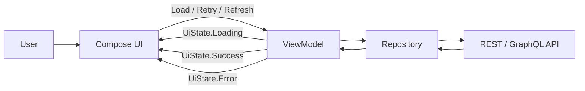
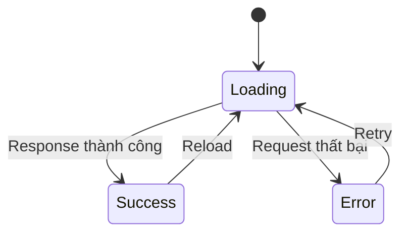
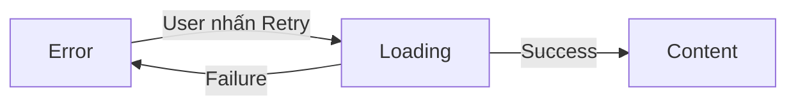
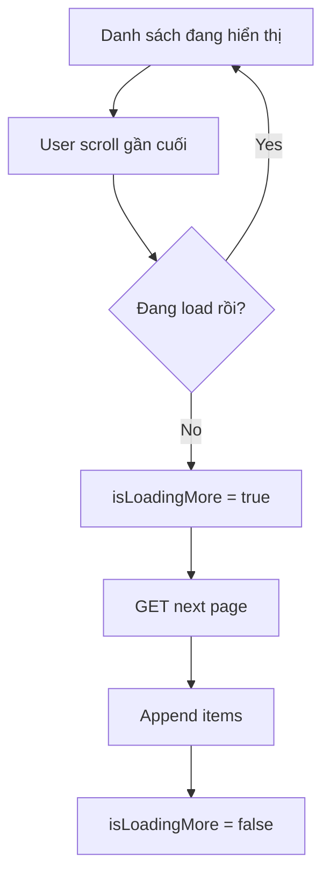
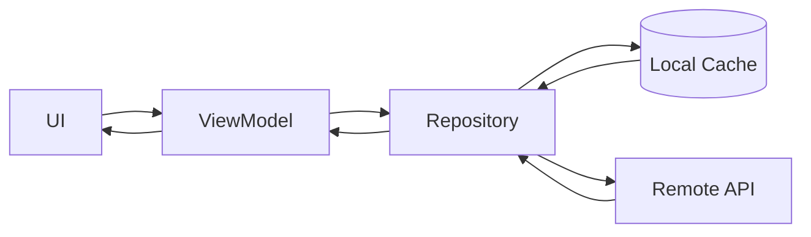
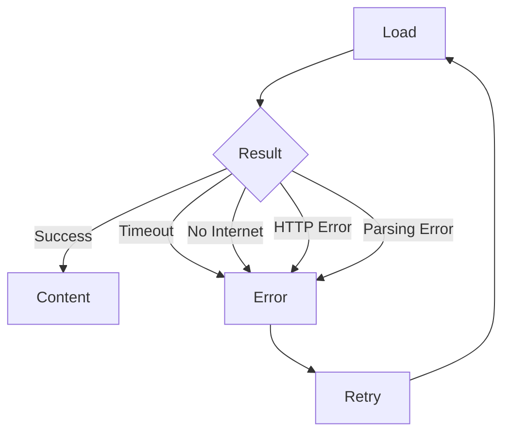
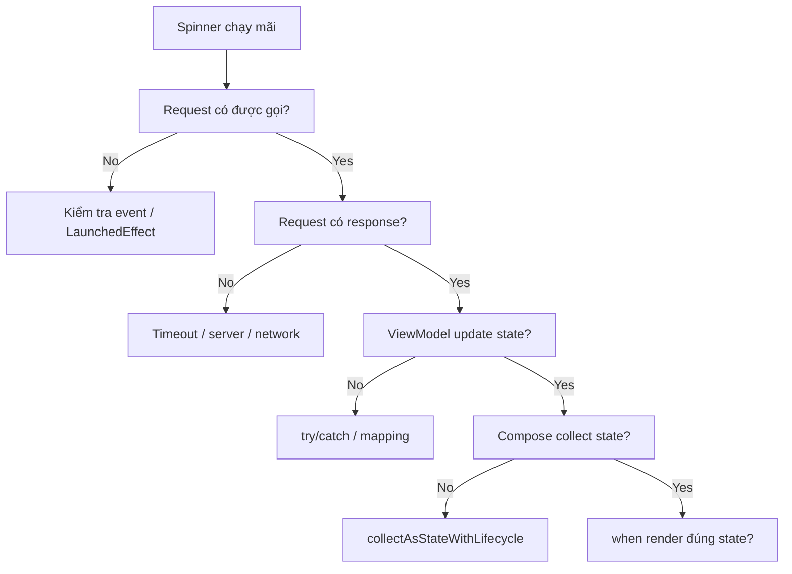
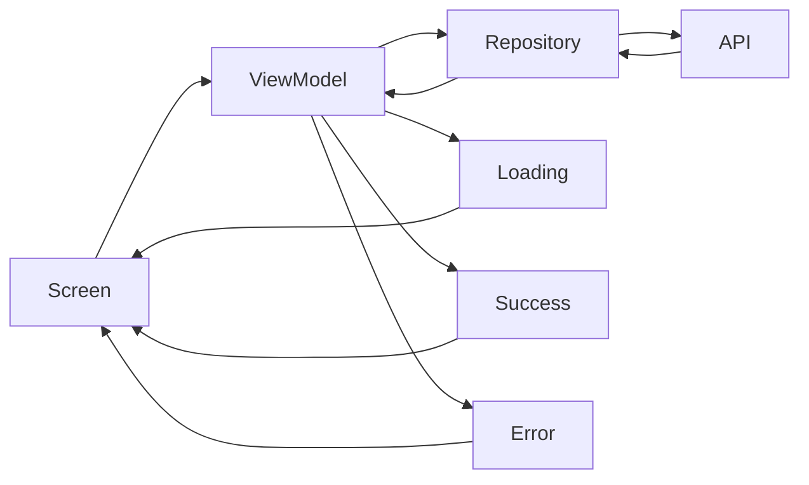

[](https://developer.android.com/codelabs/basic-android-kotlin-compose-load-images?hl=zh-cn&utm_source=chatgpt.com)

# 024 - Loading State

**Học phần:** 04 - Network, Async and Services
**Module:** Module 07 - Network
**Nhóm nội dung:** Network UI States
**Nguồn roadmap:** Network / Network UI States
**Loại bài:** Network
**Thứ tự trong module:** 024
**Thời lượng gợi ý:** 32 phút

---

## 1. Tóm tắt

**Loading State** là trạng thái UI biểu thị rằng ứng dụng đang thực hiện một tác vụ chưa hoàn thành, chẳng hạn:

* gọi REST API;
* gửi GraphQL Query/Mutation;
* refresh dữ liệu;
* tải thêm trang;
* upload file;
* xử lý dữ liệu dài;
* tải ảnh từ Internet.

Loading State **không đồng nghĩa với spinner**. Spinner (`CircularProgressIndicator`) chỉ là một cách trực quan hóa trạng thái loading. State thật sự nên nằm trong mô hình trạng thái của màn hình và được UI render dựa trên state đó.

Android hiện khuyến nghị UI được điều khiển bởi **UI State**, thường do một state holder như `ViewModel` cung cấp. Với Compose, `StateFlow`/Compose State có thể được quan sát để UI tự render lại khi state thay đổi. ([Android Developers][1])

---

## 2. Mục tiêu học tập

Sau bài này, bạn nên có thể:

* Giải thích được Loading State bằng ngôn ngữ của mình.
* Phân biệt:

  * initial loading;
  * refresh loading;
  * pagination loading;
  * submit/mutation loading.
* Biết khi nào dùng:

  * `CircularProgressIndicator`;
  * `LinearProgressIndicator`;
  * skeleton/placeholder;
  * loading cục bộ.
* Model `Loading → Success → Error`.
* Quản lý Loading State bằng `ViewModel` + `StateFlow`.
* Thu thập state trong Compose bằng `collectAsStateWithLifecycle()`.
* Không gọi lại API ngoài ý muốn khi rotate/recomposition.
* Implement Retry.
* Test các transition của Loading State.
* Biết những lỗi UX thường gặp khi đưa loading vào production.

---

# 3. Loading State là gì?

Ví dụ user mở màn hình danh sách sản phẩm.

Ứng dụng bắt đầu gọi:

```text
GET /products
```

Trong khoảng thời gian:

```text
Request sent
     ↓
đang chờ server
     ↓
response received
```

UI cần thể hiện rằng ứng dụng **đang làm việc**, thay vì để một màn hình trắng khiến user không biết app bị treo hay đang xử lý.

Material sử dụng **progress indicators** để biểu thị một operation đang diễn ra. Android phân biệt indicator thành `determinate` khi biết được tiến độ và `indeterminate` khi chưa biết lúc nào hoàn thành. ([Android Developers][2])

---

# 4. Loading nằm ở đâu trong kiến trúc Android?

Một kiến trúc đơn giản:



Theo kiến trúc Android được khuyến nghị, UI layer không nên truy cập trực tiếp network data source. Data thường đi qua Repository; ViewModel xử lý logic cấp màn hình và expose UI State cho Compose. Đây cũng phù hợp với **Unidirectional Data Flow — UDF**. ([Android Developers][3])

Có thể hình dung:

```text
User Event
    ↓
ViewModel
    ↓
Repository
    ↓
Network
    ↓
Result
    ↓
ViewModel cập nhật UiState
    ↓
Compose render state mới
```

---

# 5. State machine cơ bản

Một network screen thường có ít nhất ba trạng thái:



Ví dụ:

```text
Loading
   │
   ├── HTTP 200 ──────> Success
   │
   ├── Timeout ───────> Error
   │
   ├── HTTP 500 ──────> Error
   │
   └── No Internet ───> Error
```

Một tư duy quan trọng là **network result phải biến thành UI State rõ ràng**, thay vì để exception chạy thẳng vào Composable. Android cũng mô tả pipeline sản xuất UI state theo hướng asynchronous input → state holder → observable UI state. ([Android Developers][1])

---

# 6. Không phải Loading nào cũng giống nhau

Trong production, chỉ có một:

```kotlin
isLoading: Boolean
```

thường chưa đủ.

Nên phân biệt ít nhất các trường hợp sau.

| Trường hợp       | UI phù hợp                           |
| ---------------- | ------------------------------------ |
| Initial Loading  | Full-screen indicator hoặc skeleton  |
| Refresh          | Giữ content cũ + indicator nhỏ       |
| Pagination       | Indicator cuối danh sách             |
| Submit Form      | Indicator trong button               |
| GraphQL Mutation | Disable action + indicator           |
| Upload           | Determinate progress nếu biết %      |
| Background Sync  | Thường không cần block toàn màn hình |

### Ví dụ

```text
Mở màn hình lần đầu
→ Initial Loading

Danh sách đang có 20 item
→ kéo xuống refresh
→ Refreshing

Scroll tới cuối
→ tải page 2
→ Loading More

Ấn "Đặt hàng"
→ Submitting
```

Đây đều là loading nhưng **ảnh hưởng tới UX rất khác nhau**.

---

# 7. Initial Loading

Initial Loading xảy ra khi màn hình chưa có dữ liệu nào để hiển thị.

```text
Screen opened
     ↓
No data yet
     ↓
Loading indicator
     ↓
API response
     ↓
Content
```

UI có thể là:

```text
┌──────────────────────────────┐
│         Products             │
│                              │
│                              │
│             ◯                │
│        Đang tải...           │
│                              │
│                              │
└──────────────────────────────┘
```

Material Compose cung cấp `CircularProgressIndicator` và `LinearProgressIndicator` cho những trường hợp này. ([Android Developers][2])

---

# 8. Determinate và Indeterminate Loading

## 8.1 Indeterminate

Dùng khi **không biết chính xác tiến độ**.

Ví dụ:

```text
GET /users
GraphQL Query
Search API
Database synchronization
```

```kotlin
CircularProgressIndicator()
```

Hoặc:

```kotlin
LinearProgressIndicator()
```

Khi không truyền `progress`, Material indicator hoạt động ở chế độ indeterminate. ([Android Developers][2])

---

## 8.2 Determinate

Dùng khi biết:

```text
0%
25%
50%
75%
100%
```

Ví dụ:

* download;
* upload;
* import file;
* xử lý batch.

```kotlin
LinearProgressIndicator(
    progress = { progress }
)
```

Ví dụ:

```text
Uploading...

██████████████░░░░░░ 70%
```

Giá trị progress của Material indicator được biểu diễn trong khoảng `0.0f..1.0f`. ([Android Developers][2])

---

# 9. Model Loading State bằng sealed interface

Đối với màn hình đơn giản:

```kotlin
sealed interface ProductUiState {

    data object Loading : ProductUiState

    data class Success(
        val products: List<ProductUiModel>
    ) : ProductUiState

    data class Error(
        val message: String
    ) : ProductUiState
}
```

Flow sẽ rất rõ:

```text
ProductUiState
│
├── Loading
│
├── Success
│   └── products
│
└── Error
    └── message
```

Ưu điểm:

```kotlin
when (uiState) {
    ProductUiState.Loading -> ...
    is ProductUiState.Success -> ...
    is ProductUiState.Error -> ...
}
```

UI bắt buộc xử lý từng trường hợp.

---

# 10. Repository

Ví dụ Repository:

```kotlin
interface ProductRepository {

    suspend fun getProducts(): List<Product>
}
```

Implementation:

```kotlin
class DefaultProductRepository(
    private val api: ProductApi
) : ProductRepository {

    override suspend fun getProducts(): List<Product> {
        return api.getProducts()
    }
}
```

Kiến trúc Android hiện khuyến nghị data layer expose application data thông qua Repository thay vì để ViewModel/Composable nói chuyện trực tiếp với network source. ([Android Developers][3])

---

# 11. ViewModel quản lý Loading State

```kotlin
class ProductViewModel(
    private val repository: ProductRepository
) : ViewModel() {

    private val _uiState =
        MutableStateFlow<ProductUiState>(ProductUiState.Loading)

    val uiState: StateFlow<ProductUiState> =
        _uiState.asStateFlow()

    private var loadJob: Job? = null

    fun loadProducts(force: Boolean = false) {

        if (loadJob?.isActive == true) {
            return
        }

        if (!force && _uiState.value is ProductUiState.Success) {
            return
        }

        loadJob = viewModelScope.launch {

            _uiState.value = ProductUiState.Loading

            try {

                val products = repository.getProducts()

                _uiState.value = ProductUiState.Success(
                    products = products.map { product ->
                        ProductUiModel(
                            id = product.id,
                            name = product.name
                        )
                    }
                )

            } catch (e: CancellationException) {

                throw e

            } catch (e: Exception) {

                _uiState.value = ProductUiState.Error(
                    message = "Không thể tải dữ liệu"
                )
            }
        }
    }
}
```

`MutableStateFlow` là một trong các API phù hợp để ViewModel/state holder xuất observable UI state; asynchronous result sau đó cập nhật state và UI phản ứng theo state mới. ([Android Developers][1])

---

# 12. Compose thu thập state

Route:

```kotlin
@Composable
fun ProductRoute(
    viewModel: ProductViewModel
) {

    val uiState by viewModel.uiState
        .collectAsStateWithLifecycle()

    LaunchedEffect(viewModel) {
        viewModel.loadProducts()
    }

    ProductScreen(
        uiState = uiState,
        onRetry = {
            viewModel.loadProducts(force = true)
        }
    )
}
```

Android hiện khuyến nghị `collectAsStateWithLifecycle()` để collect `Flow` từ Compose theo lifecycle thay vì tự viết logic start/stop collection. Khi UI đi background, việc collection được điều chỉnh theo lifecycle giúp tránh sử dụng tài nguyên không cần thiết. ([Android Developers][4])

---

# 13. Render Loading / Success / Error

```kotlin
@Composable
fun ProductScreen(
    uiState: ProductUiState,
    onRetry: () -> Unit
) {

    when (uiState) {

        ProductUiState.Loading -> {
            LoadingContent()
        }

        is ProductUiState.Success -> {
            ProductList(
                products = uiState.products
            )
        }

        is ProductUiState.Error -> {
            ErrorContent(
                message = uiState.message,
                onRetry = onRetry
            )
        }
    }
}
```

---

# 14. Loading UI

```kotlin
@Composable
fun LoadingContent() {

    Box(
        modifier = Modifier.fillMaxSize(),
        contentAlignment = Alignment.Center
    ) {

        Column(
            horizontalAlignment = Alignment.CenterHorizontally
        ) {

            CircularProgressIndicator()

            Spacer(
                modifier = Modifier.height(12.dp)
            )

            Text(
                text = "Đang tải dữ liệu..."
            )
        }
    }
}
```

UI:

```text
┌─────────────────────────────┐
│                             │
│                             │
│              ◯              │
│                             │
│      Đang tải dữ liệu...    │
│                             │
│                             │
└─────────────────────────────┘
```

Material progress indicators được thiết kế để trực quan hóa một operation đang diễn ra, bao gồm loading network content. ([Android Developers][2])

---

# 15. Error + Retry

```kotlin
@Composable
fun ErrorContent(
    message: String,
    onRetry: () -> Unit
) {

    Column(
        modifier = Modifier.fillMaxSize(),
        horizontalAlignment = Alignment.CenterHorizontally,
        verticalArrangement = Arrangement.Center
    ) {

        Text(
            text = message
        )

        Spacer(
            modifier = Modifier.height(16.dp)
        )

        Button(
            onClick = onRetry
        ) {
            Text("Thử lại")
        }
    }
}
```

State transition:



---

# 16. Loading khi Refresh

Một lỗi UX phổ biến là:

```text
Content đang hiện
       ↓
User refresh
       ↓
Xóa toàn bộ content
       ↓
Full-screen spinner
```

Trong phần lớn màn hình dạng feed/list, tốt hơn là giữ dữ liệu hiện tại và biểu diễn refresh riêng:

```text
┌─────────────────────────────┐
│          ↻                  │
│ Product A                   │
│ Product B                   │
│ Product C                   │
│ Product D                   │
└─────────────────────────────┘
```

Compose hiện có `PullToRefreshBox` với state `isRefreshing` và callback `onRefresh`, cho phép content tiếp tục tồn tại bên dưới trong khi refresh diễn ra. ([Android Developers][5])

Ví dụ state:

```kotlin
data class ProductScreenState(
    val products: List<ProductUiModel> = emptyList(),
    val isRefreshing: Boolean = false,
    val errorMessage: String? = null
)
```

Compose:

```kotlin
PullToRefreshBox(
    isRefreshing = uiState.isRefreshing,
    onRefresh = onRefresh
) {

    LazyColumn {

        items(uiState.products) { product ->

            ProductItem(product)
        }
    }
}
```

---

# 17. Loading khi Pagination

Pagination không nên biến toàn bộ screen thành:

```text
████████████████
 FULL SCREEN
   LOADING
████████████████
```

Thay vào đó:

```text
Product 1
Product 2
Product 3
Product 4
Product 5
───────────────
      ◯
 Đang tải thêm
```

State có thể là:

```kotlin
data class ProductScreenState(
    val products: List<ProductUiModel> = emptyList(),
    val isLoadingMore: Boolean = false,
    val canLoadMore: Boolean = true
)
```

Luồng:



Điểm quan trọng:

> Loading State nên có **scope tương ứng với operation**.

Pagination loading chỉ liên quan tới phần cuối list, không phải toàn bộ screen.

---

# 18. Loading khi GraphQL Mutation / Submit

Ví dụ:

```graphql
mutation UpdateProfile {
    updateProfile(...)
}
```

Không nhất thiết phải block toàn màn hình.

Thay vào đó:

```text
┌──────────────────────────┐
│ Name                     │
│ [ An Khánh             ] │
│                          │
│ ┌──────────────────────┐ │
│ │   ◯  Đang lưu...     │ │
│ └──────────────────────┘ │
└──────────────────────────┘
```

State:

```kotlin
data class EditProfileUiState(
    val name: String = "",
    val isSubmitting: Boolean = false,
    val errorMessage: String? = null
)
```

Button:

```kotlin
Button(
    enabled = !uiState.isSubmitting,
    onClick = onSave
) {

    if (uiState.isSubmitting) {

        CircularProgressIndicator(
            modifier = Modifier.size(20.dp)
        )

    } else {

        Text("Lưu")
    }
}
```

Việc disable action trong khi request đang chạy cũng giúp tránh trường hợp user nhấn liên tục và vô tình gửi nhiều request cho cùng một operation.

---

# 19. Sealed State hay `isLoading: Boolean`?

Cả hai đều có chỗ sử dụng.

## Cách 1 — Exclusive State

```kotlin
sealed interface UiState {
    data object Loading : UiState
    data class Success(...) : UiState
    data class Error(...) : UiState
}
```

Phù hợp cho:

```text
Initial Load
```

vì tại một thời điểm screen chủ yếu là:

```text
Loading
OR Success
OR Error
```

---

## Cách 2 — Composite State

```kotlin
data class UiState(
    val data: List<Item> = emptyList(),
    val isRefreshing: Boolean = false,
    val isLoadingMore: Boolean = false,
    val isSubmitting: Boolean = false,
    val error: String? = null
)
```

Phù hợp khi một screen có thể đồng thời:

```text
Có content
+
đang refresh
```

hoặc:

```text
Có content
+
đang pagination
```

Do đó:

```text
Loading không phải lúc nào cũng là
"một state loại trừ tất cả state khác".
```

Đây là một distinction rất quan trọng khi thiết kế UI State cho app thật.

---

# 20. Skeleton Loading

Thay vì:

```text
      ◯
```

có thể render cấu trúc gần giống content thật:

```text
┌───────────────────────────┐
│ ███████      ██████████   │
│ ███████      ██████       │
│                           │
│ ███████      █████████    │
│ ███████      █████        │
└───────────────────────────┘
```

Skeleton phù hợp khi:

* cấu trúc content có thể dự đoán trước;
* screen gồm nhiều card/list;
* muốn giữ layout ổn định trong lúc chờ.

Ảnh Android Developers ở đầu bài minh họa một biến thể rất thực tế: một số ảnh Mars đã tải xong trong khi các item khác vẫn hiển thị loading indicator. Điều này cho thấy loading có thể tồn tại ở **cấp component**, chứ không nhất thiết ở cấp toàn màn hình.

---

# 21. Loading State và Lifecycle

Giả sử:

```text
User mở Products
      ↓
API request bắt đầu
      ↓
User rotate màn hình
```

Nếu network state bị giữ trực tiếp trong Activity/Composable một cách không phù hợp, màn hình mới có thể mất context của operation.

`ViewModel` được thiết kế như screen-level state holder và giữ state qua configuration changes như rotation. Android cũng nêu rằng asynchronous work đang chạy trong ViewModel có thể tiếp tục qua configuration change của host. ([Android Developers][6])

```text
Activity A
   │
   └── ViewModel
          │
          └── Request đang chạy

        ROTATE

Activity B
   │
   └── cùng ViewModel
          │
          └── Request tiếp tục
```

---

# 22. Nhưng ViewModel không giải quyết mọi thứ

Có hai tình huống khác nhau:

```text
Configuration change
```

và:

```text
Process death
```

`ViewModel` giải quyết tốt configuration changes. Nếu cần reconstruct state sau system-initiated process death, Android cung cấp `SavedStateHandle`. ([Android Developers][6])

Thông thường không nên nghĩ theo kiểu:

```kotlin
savedState["isLoading"] = true
```

rồi phục hồi process với spinner chạy mãi.

Tốt hơn là lưu dữ liệu cần để **reconstruct operation**, chẳng hạn:

```text
productId
searchQuery
selectedCategory
page
```

sau đó khi screen được tái tạo:

```text
restore query
      ↓
load lại data cần thiết
      ↓
produce Loading / Success / Error mới
```

---

# 23. Tránh gọi API nhiều lần

Một bug khá phổ biến:

```kotlin
@Composable
fun ProductScreen() {

    viewModel.loadProducts()

    ...
}
```

Không nên thiết kế side effect trực tiếp như vậy trong body của Composable vì Compose có thể recompose nhiều lần.

Thay vào đó:

```kotlin
LaunchedEffect(viewModel) {
    viewModel.loadProducts()
}
```

và ViewModel vẫn nên chống duplicate operation:

```kotlin
if (loadJob?.isActive == true) {
    return
}
```

Luồng mong muốn:

```text
100 recompositions

        ↓

không đồng nghĩa

        ↓

100 API requests
```

State production và side effect nên có lifecycle/scope rõ ràng thay vì phụ thuộc trực tiếp vào số lần Composable được gọi. ([Android Developers][1])

---

# 24. Không nên đặt tất cả loading vào một biến

Ví dụ chưa tốt:

```kotlin
data class UiState(
    val isLoading: Boolean
)
```

Sau này màn hình có:

```text
initial load
refresh
pagination
save favourite
delete
checkout
```

thì câu hỏi xuất hiện:

```text
isLoading đang nói về cái gì?
```

Một model rõ hơn:

```kotlin
data class ProductUiState(

    val products: List<ProductUiModel> = emptyList(),

    val initialLoading: Boolean = false,

    val refreshing: Boolean = false,

    val loadingMore: Boolean = false,

    val updatingFavouriteIds: Set<String> = emptySet()
)
```

State lúc đó mô tả chính xác UI hơn.

---

# 25. Loading State và UX

## Không nên

```text
User refresh

→ xóa content
→ màn hình trắng
→ spinner
```

nếu dữ liệu cũ vẫn còn hữu ích.

## Nên cân nhắc

```text
Content cũ vẫn hiện
        +
refresh indicator
        ↓
data mới về
        ↓
replace/update content
```

Một nguyên tắc thực dụng:

> **Block ít UI nhất có thể nhưng vẫn phải làm rõ operation đang diễn ra.**

Ví dụ:

```text
Initial API request
→ có thể block content

Refresh
→ thường giữ content

Like button
→ chỉ loading ở Like button

Pagination
→ chỉ loading cuối list

Checkout
→ có thể block action quan trọng
```

---

# 26. Loading State và Offline Cache

Loading không nhất thiết có nghĩa:

```text
UI = trống
```

Nếu Repository có cache:



Có thể thực hiện:

```text
Mở app
  ↓
Hiển thị cache ngay
  ↓
Fetch server ở background
  ↓
Update content
```

UX:

```text
Cached Content
+
Refreshing Indicator
```

thường tốt hơn:

```text
Full Screen Spinner
```

cho các ứng dụng offline-first hoặc read-heavy.

---

# 27. Loading State và lỗi mạng

State flow nên dự kiến cả failure:



Loading phải luôn có đường thoát:

```text
Loading
   ↓
Success
```

hoặc:

```text
Loading
   ↓
Error
```

Một bug production nguy hiểm là:

```text
Loading forever
```

do code quên reset state sau exception.

---

# 28. Anti-pattern: boolean không reset

```kotlin
_uiState.update {
    it.copy(isLoading = true)
}

repository.getProducts()

_uiState.update {
    it.copy(isLoading = false)
}
```

Nếu dòng:

```kotlin
repository.getProducts()
```

throw exception:

```text
isLoading = true
```

có thể không bao giờ được reset.

Một pattern tốt hơn:

```kotlin
viewModelScope.launch {

    _uiState.update {
        it.copy(
            isLoading = true,
            errorMessage = null
        )
    }

    try {

        val products = repository.getProducts()

        _uiState.update {
            it.copy(
                products = products,
                isLoading = false
            )
        }

    } catch (e: CancellationException) {

        throw e

    } catch (e: Exception) {

        _uiState.update {
            it.copy(
                isLoading = false,
                errorMessage = "Không thể tải sản phẩm"
            )
        }
    }
}
```

Android's state-production guidance cũng minh họa việc coroutine xử lý asynchronous work rồi ghi kết quả hoặc lỗi trở lại observable UI state. ([Android Developers][1])

---

# 29. Test Loading State

Loading State rất phù hợp cho unit test vì bản chất của nó là **state transition**.

Android Architecture guidance hiện khuyến nghị ít nhất nên có unit test cho ViewModel, bao gồm Flow, và unit test cho Repository/data sources; tài liệu cũng ưu tiên fake khi phù hợp. ([Android Developers][3])

## Test 1 — Loading → Success

```text
Given
Repository trả products

When
loadProducts()

Then
Loading
↓
Success(products)
```

Ví dụ conceptual test:

```kotlin
@Test
fun loadProducts_success() = runTest {

    val repository = FakeProductRepository(
        products = listOf(
            Product(
                id = "1",
                name = "Laptop"
            )
        )
    )

    val viewModel = ProductViewModel(repository)

    viewModel.loadProducts()

    advanceUntilIdle()

    assertTrue(
        viewModel.uiState.value is ProductUiState.Success
    )
}
```

---

# 30. Test Loading → Error

```text
Given
Repository throw IOException

When
loadProducts()

Then
Error
```

```kotlin
@Test
fun loadProducts_error() = runTest {

    val repository =
        FakeFailingProductRepository()

    val viewModel =
        ProductViewModel(repository)

    viewModel.loadProducts()

    advanceUntilIdle()

    assertTrue(
        viewModel.uiState.value is ProductUiState.Error
    )
}
```

---

# 31. Các case nên test

```text
Initial
   ↓
Loading
   ↓
Success
```

```text
Initial
   ↓
Loading
   ↓
Error
```

```text
Error
   ↓
Retry
   ↓
Loading
   ↓
Success
```

Ngoài ra nên test:

* double tap;
* refresh khi request cũ đang chạy;
* pagination request bị lỗi;
* rotate;
* network timeout;
* empty response;
* cached content + refresh error.

---

# 32. Debug checklist

Khi gặp spinner chạy mãi, kiểm tra theo thứ tự:



---

# 33. Loading State tốt và chưa tốt

### Chưa tốt

```text
API đang chạy
↓
UI trắng
```

### Tốt hơn

```text
API đang chạy
↓
UI cho user biết app đang xử lý
```

### Tốt hơn nữa

```text
API đang chạy
↓
Loading phù hợp với scope operation
↓
Không mất content không cần thiết
↓
Không cho gửi duplicate action
↓
Có timeout/error/retry
```

---

# 34. Bài thực hành 32 phút

## Phần 1 — 5 phút

Tạo:

```kotlin
sealed interface ProductUiState
```

với:

```text
Loading
Success
Error
```

---

## Phần 2 — 7 phút

Mock Repository:

```kotlin
class FakeProductRepository :
    ProductRepository {

    override suspend fun getProducts(): List<Product> {

        delay(1500)

        return listOf(
            Product("1", "Keyboard"),
            Product("2", "Mouse"),
            Product("3", "Monitor")
        )
    }
}
```

---

## Phần 3 — 8 phút

Tạo:

```text
ProductViewModel
```

và implement:

```text
Loading
↓
Repository
↓
Success/Error
```

---

## Phần 4 — 7 phút

Compose UI:

```text
Loading
→ spinner

Success
→ LazyColumn

Error
→ message + Retry
```

---

## Phần 5 — 5 phút

Test:

```text
Success path
Error path
Retry path
```

---

# 35. Bài tập

Xây dựng một màn hình:

```text
Products
```

với endpoint thật hoặc mock.

Yêu cầu:

```text
Open screen
    ↓
Loading
    ↓
Success
```

Nếu lỗi:

```text
Loading
    ↓
Error
    ↓
Retry
```

Sau đó mở rộng thêm:

```text
Pull to Refresh
```

và:

```text
Pagination Loading
```

---

# 36. Artifact cho portfolio

Có thể tạo project nhỏ:

```text
network-ui-state-demo/
│
├── data/
│   ├── ProductApi.kt
│   ├── ProductRepository.kt
│   └── DefaultProductRepository.kt
│
├── ui/
│   └── products/
│       ├── ProductUiState.kt
│       ├── ProductViewModel.kt
│       └── ProductScreen.kt
│
├── test/
│   └── ProductViewModelTest.kt
│
└── README.md
```

README nên có sơ đồ:



Kèm screenshot:

```text
01-loading.png
02-success.png
03-error.png
04-retry.png
05-refresh.png
```

Đây là một artifact nhỏ nhưng thể hiện được:

* Compose;
* ViewModel;
* StateFlow;
* Coroutines;
* Repository;
* Network;
* UI State;
* Error handling;
* Lifecycle;
* Testing.

---

# 37. Checklist hoàn thành

* [ ] Giải thích được Loading State.
* [ ] Biết Loading State không đồng nghĩa với spinner.
* [ ] Phân biệt Initial Loading và Refreshing.
* [ ] Phân biệt Refreshing và Pagination Loading.
* [ ] Biết Determinate và Indeterminate Progress.
* [ ] Biết `CircularProgressIndicator`.
* [ ] Biết `LinearProgressIndicator`.
* [ ] Model được `Loading / Success / Error`.
* [ ] ViewModel giữ screen-level state.
* [ ] State được expose qua `StateFlow`.
* [ ] Compose dùng `collectAsStateWithLifecycle()`.
* [ ] Không gọi network trực tiếp từ UI layer.
* [ ] Không vô tình request lại khi recompose.
* [ ] Có Retry.
* [ ] Không để Loading chạy mãi khi exception.
* [ ] Có xử lý duplicate request.
* [ ] Refresh không xóa content cũ nếu không cần.
* [ ] Pagination chỉ loading phần cuối danh sách.
* [ ] Mutation chỉ block action cần thiết.
* [ ] Có test `Loading → Success`.
* [ ] Có test `Loading → Error`.
* [ ] Có test Retry.
* [ ] Có ghi chú về rotation/lifecycle.
* [ ] Có screenshot hoặc GIF cho portfolio.

---

# 38. Ghi chú production

Khi đưa Loading State vào production, đừng chỉ hỏi:

> **"Spinner có hiển thị không?"**

Hãy hỏi:

```text
1. Operation nào đang chạy?

2. Loading thuộc:
   screen
   component
   item
   button
   hay pagination?

3. User có cần mất content hiện tại không?

4. Có thể xảy ra duplicate request không?

5. Request fail thì loading có kết thúc không?

6. Retry có gửi đúng operation không?

7. Rotate màn hình có gửi request lại không?

8. Background/foreground có ảnh hưởng state không?

9. Process death có thể reconstruct màn hình không?

10. Loading, Success và Error đã được test chưa?
```

`ViewModel` giúp giữ state qua configuration change, còn `SavedStateHandle` có thể được dùng khi cần phục hồi thông tin qua system-initiated process death. Với Flow trong Compose, Android hiện khuyến nghị lifecycle-aware collection bằng `collectAsStateWithLifecycle()`. ([Android Developers][6])

---

# 39. Ghi nhớ nhanh

```text
Loading State
     │
     ├── Initial Loading
     │      └── Full screen / Skeleton
     │
     ├── Refreshing
     │      └── Keep old content
     │
     ├── Pagination
     │      └── Bottom loader
     │
     ├── Submit / Mutation
     │      └── Button loader
     │
     └── Upload / Download
            └── Determinate progress nếu biết %
```

Và kiến trúc cần nhớ:

```text
User
 ↓
UI Event
 ↓
ViewModel
 ↓
Repository
 ↓
Network
 ↓
Result
 ↓
UiState
 ↓
Compose
```

**Ý quan trọng nhất của bài 024:**

> Loading State không chỉ là việc đặt một `CircularProgressIndicator()` lên màn hình. Một implementation tốt phải model được **operation đang chạy**, đưa nó vào **UI State**, quản lý nó theo **lifecycle**, giới hạn loading đúng **scope của UI**, và luôn có đường chuyển sang **Success hoặc Error**.

Các khuyến nghị này phù hợp với hướng dẫn Android Architecture 2026 về UDF, ViewModel, lifecycle-aware state collection, Repository và testing. ([Android Developers][3])

[1]: https://developer.android.com/topic/architecture/ui-layer/state-production "UI State production  |  App architecture  |  Android Developers"
[2]: https://developer.android.com/develop/ui/compose/components/progress "Progress indicators  |  Jetpack Compose  |  Android Developers"
[3]: https://developer.android.com/topic/architecture/recommendations "Recommendations for Android architecture  |  App architecture  |  Android Developers"
[4]: https://developer.android.com/topic/libraries/architecture/lifecycle "Lifecycle in Jetpack Compose  |  App architecture  |  Android Developers"
[5]: https://developer.android.com/develop/ui/compose/components/pull-to-refresh "Pull to refresh  |  Jetpack Compose  |  Android Developers"
[6]: https://developer.android.com/topic/libraries/architecture/viewmodel "ViewModel overview  |  App architecture  |  Android Developers"
