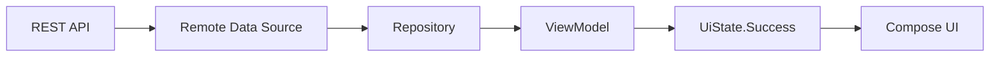
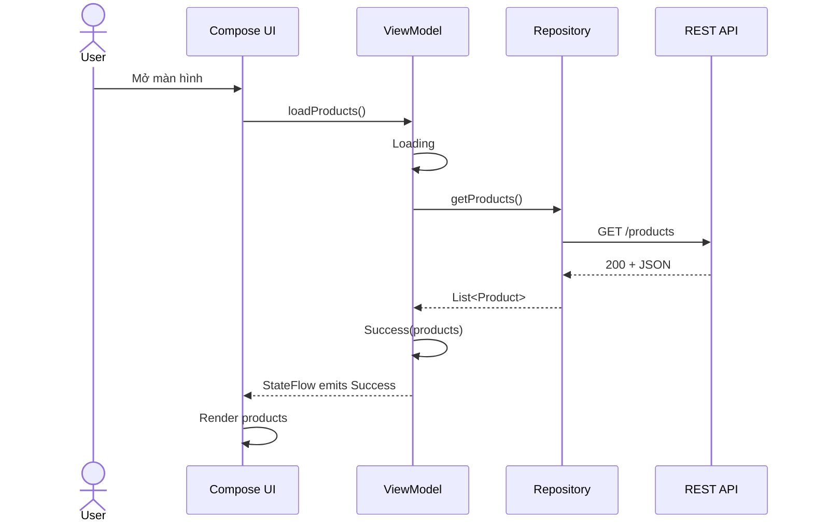
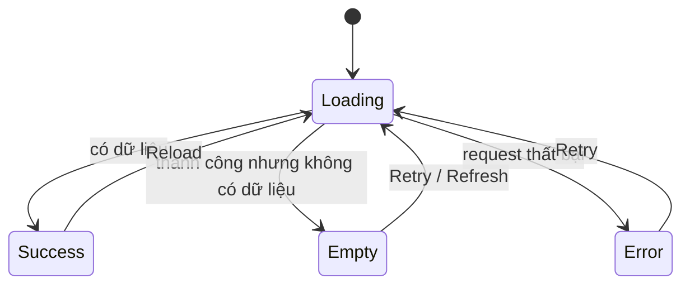
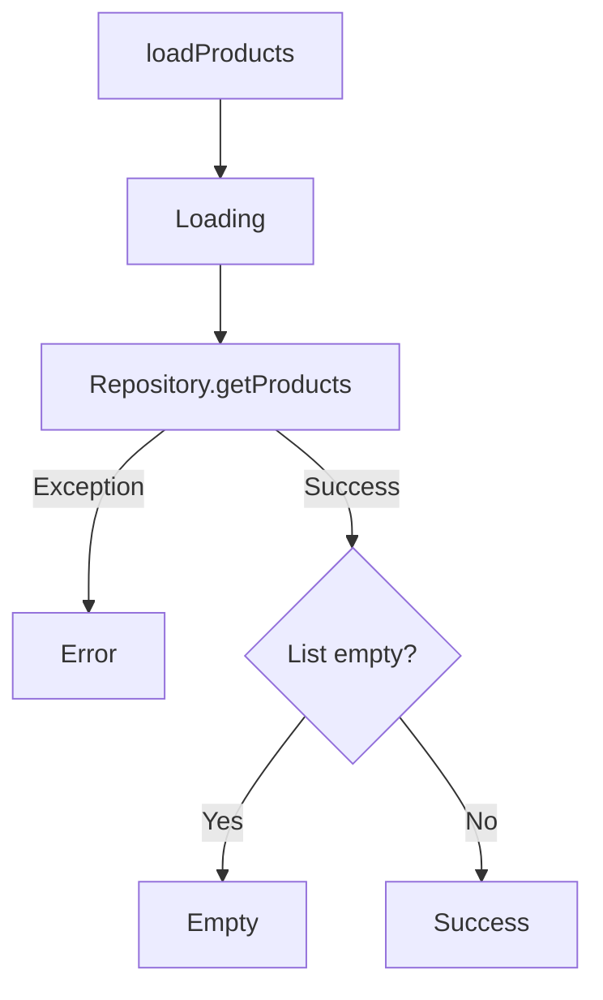
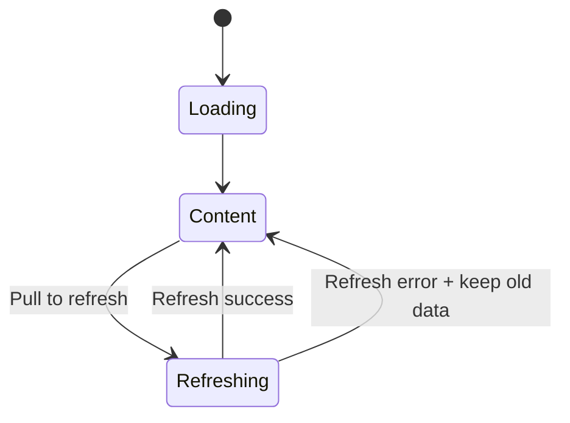
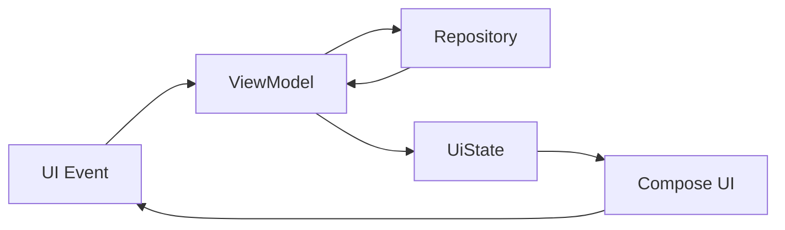
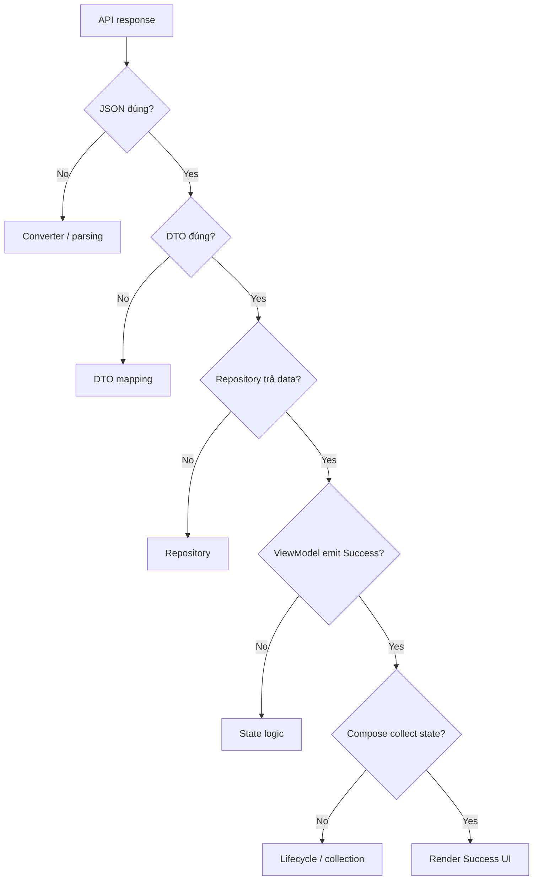
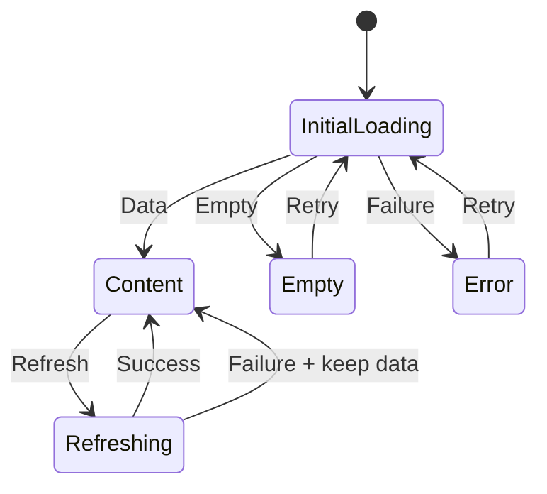
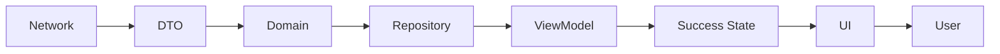

# 025 - Success State

**Học phần:** 04 - Network, Async and Services
**Module:** Module 07 - Network
**Nhóm nội dung:** Network UI States
**Nguồn roadmap:** Network / Network UI States
**Loại bài:** Network
**Thứ tự trong module:** 025
**Thời lượng gợi ý:** 32 phút

---

[](https://developer.android.google.cn/topic/architecture/ui-layer/stateholders?hl=en&utm_source=chatgpt.com)

> Minh họa từ Android Developers về pipeline tạo **UI State**: dữ liệu đi từ data/business layer → `ViewModel` → screen UI state → UI. Android hiện khuyến nghị `ViewModel` làm state holder cho state cấp màn hình khi state đó liên quan đến business/data layer. ([Android Developers][1])

---

## 1. Tóm tắt

**Success State** là trạng thái UI khi một thao tác bất đồng bộ đã hoàn thành thành công và ứng dụng có dữ liệu hoặc kết quả hợp lệ để hiển thị.

Ví dụ:

```text
User mở màn hình sản phẩm
        ↓
App gọi API
        ↓
Loading State
        ↓
API trả dữ liệu thành công
        ↓
Success State
        ↓
Hiển thị danh sách sản phẩm
```

Trong Android hiện đại, UI thường không tự gọi API rồi tự quyết định phải hiển thị gì. Thay vào đó:

```text
Repository
   ↓
ViewModel
   ↓
UiState
   ↓
Compose UI
```

UI chỉ quan sát state và render giao diện tương ứng. Đây phù hợp với hướng **Unidirectional Data Flow - UDF** được Android Architecture Guide sử dụng cho UI layer. ([Android Developers][2])

---

## 2. Mục tiêu học tập

Sau bài này, bạn nên có thể:

* Giải thích được **Success State** bằng ngôn ngữ của mình.
* Phân biệt:

  * `Loading`
  * `Success`
  * `Empty`
  * `Error`
* Biết dữ liệu Success nên được giữ ở đâu.
* Biết cách biểu diễn Success bằng Kotlin.
* Quản lý Success State bằng `ViewModel`.
* Expose state bằng `StateFlow`.
* Render Success State bằng Jetpack Compose.
* Xử lý lifecycle khi UI collect state.
* Hiểu khác biệt giữa:

  * thành công lần đầu;
  * refresh thành công;
  * dữ liệu cache;
  * HTTP thành công nhưng dữ liệu rỗng.
* Viết unit test và Compose UI test cho Success State.
* Biến ví dụ thành artifact nhỏ cho portfolio.

---

# 3. Success State là gì?

## 3.1. Định nghĩa

Có thể hiểu đơn giản:

> **Success State là trạng thái cho biết operation đã hoàn thành thành công và UI có một kết quả hợp lệ để render.**

Ví dụ API:

```http
GET /products
```

Server trả:

```json
{
  "products": [
    {
      "id": 1,
      "name": "Pixel 10",
      "price": 899
    }
  ]
}
```

Sau khi map dữ liệu:

```text
ProductDto
    ↓
Product
    ↓
ProductUiModel
    ↓
Success(products)
```

UI nhận được:

```kotlin
Success(
    products = listOf(
        ProductUiModel(
            id = 1,
            name = "Pixel 10",
            priceText = "$899"
        )
    )
)
```

và render danh sách.

---

# 4. Success State nằm ở đâu trong app?

Một kiến trúc đơn giản:



Android Architecture Guide khuyến nghị UI layer nhận application data thông qua state holder thay vì để composable trực tiếp làm việc với data source. `ViewModel` thường là lựa chọn phù hợp cho screen-level state có business logic. ([Android Developers][3])

---

## 4.1. Luồng đầy đủ



---

# 5. Network UI State cơ bản

Một màn hình network thường có ít nhất các trạng thái:



Có thể biểu diễn bằng Kotlin:

```kotlin
sealed interface ProductUiState {

    data object Loading : ProductUiState

    data class Success(
        val products: List<ProductUiModel>
    ) : ProductUiState

    data object Empty : ProductUiState

    data class Error(
        val message: String
    ) : ProductUiState
}
```

Điểm quan trọng là:

```text
network result
      ↓
convert
      ↓
explicit UI state
      ↓
UI render
```

thay vì:

```text
network exception
      ↓
Composable tự xử lý mọi thứ
```

---

# 6. Success khác Empty

Một lỗi thiết kế phổ biến là xem tất cả HTTP `2xx` như cùng một Success UI.

Ví dụ:

```json
{
  "products": []
}
```

Request có thể thành công về mặt network:

```text
HTTP 200 OK
```

nhưng UX của người dùng lại là:

```text
Không có sản phẩm nào.
```

Do đó nên phân biệt:

```text
200 + products.size > 0
        ↓
Success

200 + products.isEmpty()
        ↓
Empty
```

### Cách 1 — Explicit Empty State

```kotlin
sealed interface ProductUiState {

    data object Loading : ProductUiState

    data class Success(
        val products: List<ProductUiModel>
    ) : ProductUiState

    data object Empty : ProductUiState

    data class Error(
        val message: String
    ) : ProductUiState
}
```

Ưu điểm:

* semantics rõ;
* test dễ;
* composable đơn giản;
* tránh `if (list.isEmpty())` nằm khắp UI.

---

# 7. Success State không phải HTTP Status Code

Phân biệt ba lớp:

```text
Transport / HTTP
        ↓
Domain Result
        ↓
UI State
```

Ví dụ:

```text
HTTP 200
   ↓
DTO parse thành công
   ↓
products = [...]
   ↓
Success UI
```

Nhưng:

```text
HTTP 200
   ↓
JSON không hợp lệ
   ↓
Parsing Error
   ↓
Error UI
```

hoặc:

```text
HTTP 200
   ↓
products = []
   ↓
Empty UI
```

Do đó:

> `HTTP 200` không đồng nghĩa tuyệt đối với `Success State`.

Success State là **quyết định ở cấp ứng dụng/UI**, sau khi dữ liệu đã được kiểm tra và chuyển đổi.

---

# 8. DTO → Domain → UI Model

Giả sử API trả:

```kotlin
data class ProductDto(
    val id: Long,
    val name: String?,
    val price: Double
)
```

Không nên đưa DTO thẳng lên Compose:

```text
❌ API
   ↓
ProductDto
   ↓
Compose
```

Có thể tách:

```text
API
 ↓
ProductDto
 ↓ Mapper
Product
 ↓ Mapper
ProductUiModel
 ↓
Success State
 ↓
Compose
```

Ví dụ:

```kotlin
data class Product(
    val id: Long,
    val name: String,
    val price: Double
)
```

UI model:

```kotlin
data class ProductUiModel(
    val id: Long,
    val name: String,
    val priceText: String
)
```

Mapper:

```kotlin
fun Product.toUiModel(): ProductUiModel {
    return ProductUiModel(
        id = id,
        name = name,
        priceText = "$%.2f".format(price)
    )
}
```

---

# 9. Repository

Ví dụ Repository:

```kotlin
interface ProductRepository {
    suspend fun getProducts(): List<Product>
}
```

Implementation:

```kotlin
class ProductRepositoryImpl(
    private val api: ProductApi
) : ProductRepository {

    override suspend fun getProducts(): List<Product> {
        return api.getProducts()
            .map { dto ->
                Product(
                    id = dto.id,
                    name = dto.name ?: "Unknown",
                    price = dto.price
                )
            }
    }
}
```

Repository chịu trách nhiệm lấy application data; Android Architecture Guide khuyến nghị UI/ViewModel không truy cập trực tiếp các data source như network API hoặc database khi áp dụng layered architecture. ([Android Developers][3])

---

# 10. ViewModel tạo Success State

Ví dụ đơn giản:

```kotlin
class ProductViewModel(
    private val repository: ProductRepository
) : ViewModel() {

    private val _uiState =
        MutableStateFlow<ProductUiState>(ProductUiState.Loading)

    val uiState: StateFlow<ProductUiState> =
        _uiState.asStateFlow()

    init {
        loadProducts()
    }

    fun loadProducts() {
        viewModelScope.launch {

            _uiState.value = ProductUiState.Loading

            runCatching {
                repository.getProducts()
            }.onSuccess { products ->

                if (products.isEmpty()) {
                    _uiState.value = ProductUiState.Empty
                } else {
                    _uiState.value = ProductUiState.Success(
                        products = products.map(Product::toUiModel)
                    )
                }

            }.onFailure { throwable ->

                _uiState.value = ProductUiState.Error(
                    message = throwable.message
                        ?: "Không thể tải dữ liệu"
                )
            }
        }
    }
}
```

Luồng state:



---

# 11. Tại sao dùng StateFlow?

`StateFlow` phù hợp cho việc giữ một **giá trị state hiện tại** và phát giá trị mới cho các collector khi state thay đổi. Android Architecture Guidance cũng khuyến nghị ViewModel expose UI state, thường dưới dạng `StateFlow`. ([Android Developers][4])

Ví dụ:

```kotlin
private val _uiState =
    MutableStateFlow<ProductUiState>(ProductUiState.Loading)

val uiState: StateFlow<ProductUiState> =
    _uiState.asStateFlow()
```

Nguyên tắc:

```text
ViewModel
   │
   ├── MutableStateFlow
   │        ↑
   │   chỉ ViewModel sửa
   │
   └── StateFlow
            ↓
        UI chỉ đọc
```

Tức là:

```kotlin
private val _uiState
```

là mutable.

Còn:

```kotlin
val uiState
```

expose ra ngoài dưới dạng immutable.

---

# 12. Render Success State bằng Jetpack Compose

```kotlin
@Composable
fun ProductRoute(
    viewModel: ProductViewModel
) {

    val uiState by viewModel.uiState
        .collectAsStateWithLifecycle()

    ProductScreen(
        uiState = uiState,
        onRetry = viewModel::loadProducts
    )
}
```

`collectAsStateWithLifecycle()` là API Android khuyến nghị để collect `Flow` trong Compose theo lifecycle, giúp việc collection chỉ hoạt động phù hợp với trạng thái lifecycle của UI. ([Android Developers][5])

---

## 12.1. Stateless Screen

```kotlin
@Composable
fun ProductScreen(
    uiState: ProductUiState,
    onRetry: () -> Unit
) {

    when (uiState) {

        ProductUiState.Loading -> {
            LoadingScreen()
        }

        is ProductUiState.Success -> {
            ProductList(
                products = uiState.products
            )
        }

        ProductUiState.Empty -> {
            EmptyScreen()
        }

        is ProductUiState.Error -> {
            ErrorScreen(
                message = uiState.message,
                onRetry = onRetry
            )
        }
    }
}
```

Đây là một pattern rất dễ đọc:

```text
State
 ↓
when
 ↓
Composable
```

UI không cần biết API hoạt động thế nào.

---

# 13. Success UI

Ví dụ:

```kotlin
@Composable
fun ProductList(
    products: List<ProductUiModel>
) {

    LazyColumn {

        items(
            items = products,
            key = { product -> product.id }
        ) { product ->

            ProductItem(
                product = product
            )
        }
    }
}
```

Item:

```kotlin
@Composable
fun ProductItem(
    product: ProductUiModel
) {

    Column(
        modifier = Modifier
            .fillMaxWidth()
            .padding(16.dp)
    ) {

        Text(
            text = product.name,
            style = MaterialTheme.typography.titleMedium
        )

        Text(
            text = product.priceText,
            style = MaterialTheme.typography.bodyMedium
        )
    }
}
```

---

# 14. Success State nên chứa gì?

Ví dụ đơn giản:

```kotlin
data class Success(
    val products: List<ProductUiModel>
)
```

Nhưng màn hình thực tế có thể cần nhiều dữ liệu:

```kotlin
data class Success(
    val products: List<ProductUiModel>,
    val totalProducts: Int,
    val userName: String,
    val canLoadMore: Boolean
)
```

Ví dụ UI:

```text
Welcome, An
23 products

─────────────────

Pixel 10
$899

Galaxy S26
$999

─────────────────

Load more
```

Success State nên chứa:

> những dữ liệu mà UI cần để render màn hình hiện tại.

Không nên bắt composable tiếp tục tự query database hoặc API để hoàn thiện màn hình.

---

# 15. Success State và Single Source of Truth

Một design dễ lỗi:

```text
ViewModel.products

ViewModel.isLoading

ViewModel.error

ViewModel.isEmpty
```

Ta có thể vô tình tạo trạng thái:

```text
isLoading = true
error != null
products != empty
```

UI không biết phải render cái gì.

Một cách rõ hơn:

```kotlin
sealed interface ProductUiState
```

với:

```text
Loading

Success

Empty

Error
```

Mỗi thời điểm chỉ có một screen state chính:

```text
             ProductUiState

     ┌──────────┼──────────┐
     ↓          ↓          ↓
 Loading     Success      Error
                ↓
              Empty
```

Tư duy về **single source of truth** và UDF là phần quan trọng trong Architecture Guidance của Android. ([Android Developers][3])

---

# 16. Success và Refresh

Đây là điểm quan trọng khi làm production.

Giả sử user đang thấy:

```text
Product A
Product B
Product C
```

Sau đó pull-to-refresh.

Cách đơn giản:

```text
Success
   ↓
Loading
   ↓
Success
```

Nhưng nếu `Loading` là full-screen spinner thì:

```text
Product list
     ↓
mất toàn bộ UI
     ↓
spinner
     ↓
Product list xuất hiện lại
```

UX có thể bị nhấp nháy.

---

## 16.1. Model tốt hơn cho refresh

Có thể giữ content đang có:

```kotlin
data class Content(
    val products: List<ProductUiModel>,
    val isRefreshing: Boolean = false
)
```

Luồng:

```text
Success
   │
   │ Pull refresh
   ↓
Success(
    products = oldProducts,
    isRefreshing = true
)
   │
   │ API hoàn thành
   ↓
Success(
    products = newProducts,
    isRefreshing = false
)
```

Sơ đồ:



Điểm quan trọng:

> **Loading lần đầu** và **Refreshing khi đã có content** không nhất thiết phải có cùng UI.

---

# 17. Success + dữ liệu cache

Một app offline-first có thể có:

```text
Room database
      ↓
Repository
      ↓
ViewModel
      ↓
Success
```

trong khi network chạy phía sau:

```text
             ┌── Cached data
             │
Database ────┤
             ↓
           Success
             ↑
             │
API ─ Repository
```

Do đó Success không nhất thiết có nghĩa:

```text
"Dữ liệu vừa đến trực tiếp từ internet."
```

Nó chỉ có thể có nghĩa:

```text
"Ứng dụng hiện có dữ liệu hợp lệ để hiển thị."
```

Android có hướng dẫn riêng cho offline-first architecture, trong đó data layer có thể là nguồn dữ liệu cho `ViewModel`, rồi state được expose về UI. ([Android Developers][6])

---

# 18. Lifecycle

Success State cần được nghĩ cùng lifecycle.

Ví dụ:

```text
API Success
   ↓
Activity rotate
   ↓
Activity recreated
```

Nếu state chỉ nằm trong composable:

```kotlin
var products by remember {
    mutableStateOf(emptyList<Product>())
}
```

thiết kế có thể không phù hợp với screen/business state.

Với screen-level state:

```text
Repository
    ↓
ViewModel
    ↓
StateFlow
    ↓
Compose
```

`ViewModel` sống qua configuration changes như rotation. Tuy nhiên `ViewModel` không tự tồn tại qua system-initiated process death; với transient state quan trọng, `SavedStateHandle` có thể được dùng phù hợp, còn dữ liệu phức tạp nên được tái tạo từ data layer/persistent storage. ([Android Developers][7])

---

# 19. Không lưu cả response khổng lồ vào SavedStateHandle

Ví dụ không nên nghĩ theo kiểu:

```text
API trả 10 MB JSON
      ↓
nhét toàn bộ vào SavedStateHandle
```

Thay vào đó:

```text
SavedStateHandle
    ↓
productId / filter / query / selectedTab

Database / Repository
    ↓
reconstruct screen data

ViewModel
    ↓
Success State
```

Android documentation lưu ý complex/large screen UI state thường nên được tạo lại từ data layer thay vì lưu toàn bộ vào `SavedStateHandle`. ([Android Developers][8])

---

# 20. Success State và UDF

Luồng chuẩn:



Ví dụ:

```text
User
 ↓
Retry
 ↓
ViewModel.loadProducts()
 ↓
Repository
 ↓
Success
 ↓
UI renders products
```

UI gửi **event lên**.

State đi **xuống UI**.

```text
Events ↑

UI
│
↓ State
```

Đó là bản chất của Unidirectional Data Flow. Android Compose architecture documentation hướng dẫn tổ chức UI theo state + events theo mô hình này. ([Android Developers][9])

---

# 21. Anti-pattern: gọi API trong Composable

Không nên:

```kotlin
@Composable
fun ProductScreen() {

    val response = api.getProducts()

    // ...
}
```

Composable có thể recompose nhiều lần và không phải nơi thích hợp để sở hữu screen business state.

Tốt hơn:

```text
Composable
    ↓ event

ViewModel
    ↓

Repository
    ↓

API
```

rồi:

```text
ViewModel
    ↓ StateFlow

Composable
```

---

# 22. Anti-pattern: Boolean soup

Ví dụ:

```kotlin
data class ProductUiState(
    val isLoading: Boolean,
    val isSuccess: Boolean,
    val isError: Boolean,
    val isEmpty: Boolean
)
```

Ta có thể tạo state vô lý:

```text
isLoading = true
isSuccess = true
isError = true
```

### Tốt hơn

```kotlin
sealed interface ProductUiState {

    data object Loading : ProductUiState

    data class Success(
        val products: List<ProductUiModel>
    ) : ProductUiState

    data object Empty : ProductUiState

    data class Error(
        val message: String
    ) : ProductUiState
}
```

Compiler sẽ giúp ta xử lý toàn bộ branches trong:

```kotlin
when (state)
```

---

# 23. Anti-pattern: Success chứa nullable data

Không lý tưởng:

```kotlin
data class Success(
    val products: List<Product>? = null
)
```

Sau đó UI phải hỏi:

```kotlin
if (products != null) {
    ...
}
```

Nếu đã là Success:

```text
Success
   ↓
data nên hợp lệ
```

Ưu tiên invariant mạnh:

```kotlin
data class Success(
    val products: List<ProductUiModel>
)
```

Nếu `null` có ý nghĩa khác, hãy model nó thành state hoặc domain concept rõ ràng.

---

# 24. Testing Success State

## 24.1. Unit test ViewModel

Ta cần kiểm tra:

```text
Repository returns data
        ↓
ViewModel
        ↓
Success
```

Ví dụ fake repository:

```kotlin
class FakeProductRepository : ProductRepository {

    override suspend fun getProducts(): List<Product> {
        return listOf(
            Product(
                id = 1,
                name = "Pixel",
                price = 899.0
            )
        )
    }
}
```

Test ý tưởng:

```kotlin
@Test
fun `load products emits success when repository returns data`() = runTest {

    val repository = FakeProductRepository()

    val viewModel = ProductViewModel(repository)

    advanceUntilIdle()

    val state = viewModel.uiState.value

    assertTrue(state is ProductUiState.Success)
}
```

Android Developers có tài liệu riêng về testing `Flow`/`StateFlow` trong ViewModel và xem đây là pattern phổ biến cho state được tạo từ Repository. ([Android Developers][10])

---

# 25. Test Empty State

```kotlin
class EmptyProductRepository : ProductRepository {

    override suspend fun getProducts(): List<Product> {
        return emptyList()
    }
}
```

Expectation:

```text
[]
 ↓
Empty
```

Test:

```kotlin
assertEquals(
    ProductUiState.Empty,
    viewModel.uiState.value
)
```

---

# 26. Test Error State

Fake:

```kotlin
class ErrorProductRepository : ProductRepository {

    override suspend fun getProducts(): List<Product> {
        throw IOException("No internet")
    }
}
```

Expectation:

```text
IOException
    ↓
Error
```

---

# 27. Compose UI Test

Với Success:

```text
Success(
    products = [
        Pixel
    ]
)
```

UI test nên xác nhận:

```text
Pixel xuất hiện
Loading không xuất hiện
Error không xuất hiện
```

Ví dụ:

```kotlin
@Test
fun successState_showsProduct() {

    composeTestRule.setContent {

        ProductScreen(
            uiState = ProductUiState.Success(
                products = listOf(
                    ProductUiModel(
                        id = 1,
                        name = "Pixel",
                        priceText = "$899"
                    )
                )
            ),
            onRetry = {}
        )
    }

    composeTestRule
        .onNodeWithText("Pixel")
        .assertIsDisplayed()
}
```

---

# 28. Những trường hợp cần test

Một màn hình network tốt nên ít nhất test:

| Trường hợp         | State mong đợi                                       |
| ------------------ | ---------------------------------------------------- |
| Request đang chạy  | `Loading`                                            |
| API trả dữ liệu    | `Success`                                            |
| API trả list rỗng  | `Empty`                                              |
| Mất mạng           | `Error`                                              |
| Retry thành công   | `Success`                                            |
| Refresh thành công | Content mới                                          |
| Refresh thất bại   | Giữ content cũ nếu thiết kế yêu cầu                  |
| Rotate màn hình    | UI khôi phục state phù hợp                           |
| Process recreation | State transient được restore hoặc data được load lại |

---

# 29. Debugging Success State

Khi API trả `200` nhưng UI không hiển thị, debug theo pipeline:



Checklist debug nhanh:

```text
1. HTTP response đúng?
2. Body deserialize được?
3. DTO → Domain map đúng?
4. Repository trả đúng data?
5. ViewModel emit Success?
6. StateFlow có giá trị mới?
7. Compose đang collect state?
8. when(state) có branch Success?
9. LazyColumn nhận đúng list?
```

---

# 30. Production version

Một model thực tế hơn có thể là:

```kotlin
sealed interface ProductUiState {

    data object InitialLoading : ProductUiState

    data class Content(
        val products: List<ProductUiModel>,
        val isRefreshing: Boolean = false,
        val refreshError: String? = null
    ) : ProductUiState

    data object Empty : ProductUiState

    data class Error(
        val message: String
    ) : ProductUiState
}
```

So với model học tập:

```text
Loading
Success
Empty
Error
```

production model có thể biểu diễn:

```text
Content + refreshing
Content + stale data
Content + refresh error
```

mà không làm mất dữ liệu đang hiển thị.

---

# 31. State machine production



Đây là điểm khác biệt giữa:

```text
"Code demo network"
```

và:

```text
"Network UI đủ tốt cho production"
```

---

# 32. Loading → Success chuyển đổi thế nào?

### Ban đầu

```text
┌─────────────────────┐
│                     │
│        ◯            │
│     Loading...      │
│                     │
└─────────────────────┘
```

### Sau khi thành công

```text
┌────────────────────────────┐
│ Products                   │
│                            │
│ Pixel 10             $899  │
│                            │
│ Galaxy S26           $999  │
│                            │
│ Nothing Phone        $699  │
└────────────────────────────┘
```

Success State không chỉ có nhiệm vụ:

```text
tắt spinner
```

mà phải:

```text
Loading UI
   ↓
clear/transition appropriately
   ↓
render real content
   ↓
enable interactions
```

---

# 33. UX khi Success

Khi chuyển sang Success, nên xem xét:

### Content stability

Không nên để layout nhảy mạnh không cần thiết.

### Scroll position

Refresh không nên vô tình đưa user về đầu danh sách nếu UX không yêu cầu.

### Existing content

Nếu đã có dữ liệu, background refresh thường nên giữ content.

### Button state

Ví dụ request tạo order:

```text
Submit
  ↓
Loading
  ↓
Success
  ↓
Disable duplicate submission
```

### Navigation

Một số operation thành công có thể dẫn đến:

```text
Success
   ↓
navigate
```

nhưng navigation thường nên được mô hình hóa cẩn thận thay vì biến mọi Success thành event dùng một lần.

---

# 34. Success State và one-shot event

Ví dụ user nhấn:

```text
Save profile
```

Kết quả:

```text
Profile saved
```

Ta có hai loại dữ liệu khác nhau:

```text
State:
profile đã được lưu

Effect/Event:
show Snackbar "Saved"
```

Không nên đồng nhất:

```text
SuccessState == Snackbar event
```

Vì state có thể được collect/render lại, trong khi Snackbar hoặc navigation thường là hành vi xảy ra một lần theo UX.

---

# 35. Bài thực hành 32 phút

## Phần 1 — 5 phút

Tạo:

```kotlin
sealed interface ProductUiState
```

với:

```text
Loading
Success
Empty
Error
```

---

## Phần 2 — 8 phút

Mock Repository:

```kotlin
class FakeProductRepository : ProductRepository {

    override suspend fun getProducts(): List<Product> {

        delay(1500)

        return listOf(
            Product(
                id = 1,
                name = "Pixel",
                price = 899.0
            ),
            Product(
                id = 2,
                name = "Galaxy",
                price = 999.0
            )
        )
    }
}
```

---

## Phần 3 — 7 phút

Tạo:

```text
ProductViewModel
        ↓
StateFlow<ProductUiState>
```

---

## Phần 4 — 7 phút

Render:

```kotlin
when (uiState)
```

với:

```text
LoadingScreen

ProductList

EmptyScreen

ErrorScreen
```

---

## Phần 5 — 5 phút

Viết ít nhất:

```text
1 test Success
1 test Empty
1 test Error
```

---

# 36. Bài tập

Xây dựng hoặc mock endpoint:

```http
GET /products
```

Ứng dụng phải thể hiện được:

```text
Loading
   ↓
Success
```

và hai nhánh khác:

```text
Loading → Empty

Loading → Error → Retry → Success
```

### Yêu cầu nâng cao

Thêm pull-to-refresh:

```text
Success
   ↓
Refresh
   ↓
giữ content cũ
   ↓
API
   ├── Success → update content
   └── Error   → giữ content + báo lỗi nhẹ
```

---

# 37. Artifact để đưa vào portfolio

Một mini project phù hợp:

```text
NetworkUiStatesDemo/
│
├── data/
│   ├── ProductApi.kt
│   ├── ProductRepository.kt
│   └── ProductDto.kt
│
├── domain/
│   └── Product.kt
│
├── ui/
│   ├── ProductUiState.kt
│   ├── ProductUiModel.kt
│   ├── ProductViewModel.kt
│   └── ProductScreen.kt
│
└── README.md
```

README có thể trình bày:

```text
Network request
       ↓
Repository
       ↓
ViewModel
       ↓
StateFlow
       ↓
Loading / Success / Empty / Error
       ↓
Jetpack Compose
```

Screenshot portfolio nên có bốn trạng thái:

```text
01-loading.png

02-success.png

03-empty.png

04-error-retry.png
```

---

# 38. Câu hỏi phỏng vấn thường gặp

### Success State là gì?

Success State biểu diễn việc một operation đã hoàn thành thành công và UI có kết quả hợp lệ để hiển thị.

### HTTP 200 có phải luôn là Success State không?

Không. Body có thể không parse được, vi phạm business rule hoặc có thể cần biểu diễn bằng Empty State.

### Success và Empty có nên tách không?

Không bắt buộc với mọi ứng dụng, nhưng tách giúp semantics, rendering và testing rõ hơn khi empty có UX riêng.

### State nên đặt ở đâu?

Screen/business state thường có thể được giữ trong `ViewModel`, trong khi state nhỏ, thuần UI có thể giữ gần composable sử dụng nó. Đây cũng là nguyên tắc state hoisting của Compose: giữ state gần nơi tiêu thụ nhưng hoist tới owner thích hợp khi business logic yêu cầu. ([Android Developers][11])

### Tại sao dùng StateFlow?

Để expose observable screen state từ ViewModel và cho UI phản ứng với state thay đổi.

### Compose nên collect StateFlow như thế nào?

Trên Android, dùng:

```kotlin
collectAsStateWithLifecycle()
```

là lựa chọn được tài liệu Android khuyến nghị cho `Flow` trong Compose. ([Android Developers][5])

---

# 39. Checklist hoàn thành

* [ ] Giải thích được Success State.
* [ ] Phân biệt Success và HTTP `200`.
* [ ] Phân biệt Success và Empty.
* [ ] Có `sealed interface` hoặc model tương đương cho UI state.
* [ ] Có `Loading`.
* [ ] Có `Success`.
* [ ] Có `Empty`.
* [ ] Có `Error`.
* [ ] Success chứa UI model hợp lệ.
* [ ] Repository không leak DTO trực tiếp lên UI nếu kiến trúc dự án có mapping layer.
* [ ] ViewModel giữ screen state.
* [ ] UI nhận state thay vì tự gọi API.
* [ ] State được expose immutable.
* [ ] Compose dùng `collectAsStateWithLifecycle()`.
* [ ] Có Retry.
* [ ] Có test Success.
* [ ] Có test Empty.
* [ ] Có test Error.
* [ ] Kiểm tra behavior khi rotate.
* [ ] Xem xét process death nếu có transient state quan trọng.
* [ ] Refresh không làm mất content không cần thiết.
* [ ] Có screenshot hoặc README làm portfolio artifact.

---

# 40. Ghi chú sản xuất

Khi đưa Success State vào production, hãy kiểm tra cả chuỗi:



Và đặt các câu hỏi:

```text
API trả thành công nhưng list rỗng thì sao?

Có dữ liệu cache không?

Refresh có làm trắng màn hình không?

Rotate có làm request chạy lại vô nghĩa không?

Process bị kill thì màn hình được dựng lại thế nào?

Success data có nullable không?

UI có phụ thuộc trực tiếp DTO không?

State có một source of truth rõ ràng không?

Có test Success → UI không?

Refresh fail có làm mất content cũ không?
```

Android Architecture Guide hiện nhấn mạnh việc quản lý screen UI state trong state holder phù hợp, sử dụng data layer/repository, UDF và lifecycle-aware state collection để tăng khả năng maintain và test của ứng dụng. ([Android Developers][2])

---

# 41. Ghi nhớ nhanh

```text
Success State
     │
     ├── Operation thành công
     │
     ├── Data hợp lệ
     │
     ├── Map sang UI model
     │
     ├── ViewModel tạo state
     │
     ├── StateFlow expose state
     │
     └── Compose render content
```

Công thức cần nhớ:

```text
API Result
    ↓
Repository
    ↓
ViewModel
    ↓
UiState.Success(data)
    ↓
Compose
    ↓
Content
```

Và đừng mặc định:

```text
HTTP 200 = Success UI
```

Hãy nghĩ:

```text
Request hoàn tất
       ↓
Dữ liệu hợp lệ?
       │
       ├── Có dữ liệu ─────→ Success
       │
       ├── Không có dữ liệu → Empty
       │
       └── Không hợp lệ ───→ Error
```

**Success State tốt không chỉ là “API không lỗi”, mà là trạng thái trong đó ứng dụng đã có một kết quả đủ rõ ràng, hợp lệ và ổn định để UI hiển thị cho người dùng.**

[1]: https://developer.android.com/topic/architecture/ui-layer?utm_source=chatgpt.com "UI layer | App architecture"
[2]: https://developer.android.com/topic/architecture/ui-layer/state-production?utm_source=chatgpt.com "UI State production | App architecture"
[3]: https://developer.android.com/topic/architecture/recommendations?utm_source=chatgpt.com "Recommendations for Android architecture"
[4]: https://developer.android.com/topic/architecture/views/recommendations-views?utm_source=chatgpt.com "Recommendations for Android architecture (Views)"
[5]: https://developer.android.com/develop/ui/compose/state?utm_source=chatgpt.com "State and Jetpack Compose"
[6]: https://developer.android.com/topic/architecture/data-layer/offline-first?utm_source=chatgpt.com "Build an offline-first app | App architecture"
[7]: https://developer.android.com/topic/libraries/architecture/viewmodel/viewmodel-savedstate?utm_source=chatgpt.com "Saved State module for ViewModel | App architecture"
[8]: https://developer.android.com/develop/ui/compose/state-saving?utm_source=chatgpt.com "Save UI state in Compose"
[9]: https://developer.android.com/develop/ui/compose/architecture?utm_source=chatgpt.com "Compose UI Architecture | Jetpack Compose"
[10]: https://developer.android.com/kotlin/flow/test?utm_source=chatgpt.com "Testing Kotlin flows on Android"
[11]: https://developer.android.com/develop/ui/compose/state-hoisting?utm_source=chatgpt.com "Where to hoist state | Jetpack Compose"
