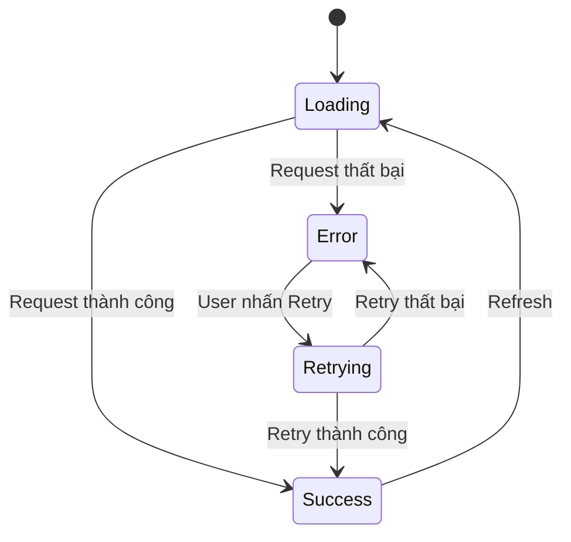
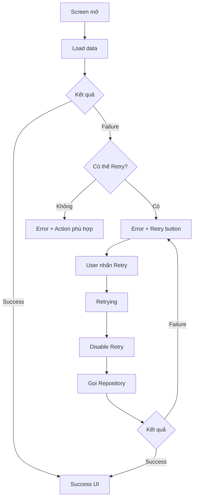
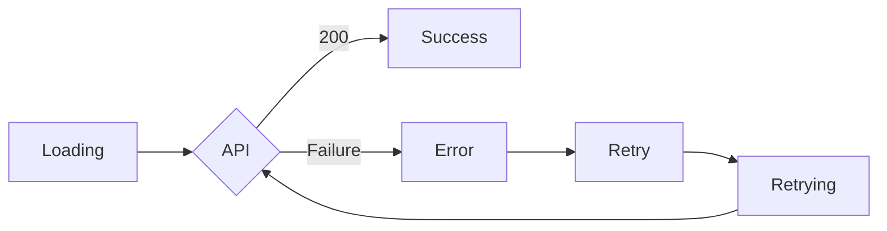

# 027 - Retry UI

[](https://community.oneplus.com/thread/2063959256205361152?utm_source=chatgpt.com)

> **Ảnh minh họa:** một số cách thiết kế trạng thái mất kết nối/lỗi với hành động **Retry / Try again**. Đây là nguồn tham khảo về bố cục; app Android thực tế nên tuân theo design system của dự án.

| Thuộc tính              | Nội dung                         |
| ----------------------- | -------------------------------- |
| **Học phần**            | 04 - Network, Async and Services |
| **Module**              | Module 07 - Network              |
| **Nhóm nội dung**       | Network UI States                |
| **Nguồn roadmap**       | Network / Network UI States      |
| **Loại bài**            | Network                          |
| **Thứ tự trong module** | 027                              |
| **Thời lượng gợi ý**    | 32 phút                          |

---

## 1. Tóm tắt

**Retry UI** là phần giao diện cho phép người dùng **thử thực hiện lại một thao tác đã thất bại**, thường gặp nhất với:

* gọi API thất bại;
* mất Internet;
* timeout;
* server tạm thời lỗi;
* tải ảnh/file thất bại;
* pagination thất bại;
* đồng bộ dữ liệu chưa thành công.

Retry UI không chỉ đơn giản là đặt một nút `"Thử lại"` trên màn hình. Trong kiến trúc Android hiện đại, hành động Retry thường được xem như một **UI event**: người dùng nhấn nút → UI gửi event cho `ViewModel` → `ViewModel` thực hiện lại operation → cập nhật `UI State` → Compose render lại màn hình. Đây đúng với hướng dẫn UDF/UI-state của Android. ([Android Developers][1])

Luồng cơ bản:

```text
API request
    │
    ├──── thành công ──────► Success UI
    │
    └──── thất bại ────────► Error UI
                                  │
                             [ Thử lại ]
                                  │
                                  ▼
                              Retrying
                                  │
                           gọi API lần nữa
                             │          │
                             ▼          ▼
                          Success      Error
```

---

# 2. Mục tiêu học tập

Sau bài này, anh nên có thể:

* Giải thích Retry UI là gì và tại sao nó quan trọng.
* Phân biệt **Error State** và **Retry Action**.
* Mô hình hóa `Loading → Success → Error → Retry`.
* Không gọi API trực tiếp từ Composable.
* Đưa event `Retry` về `ViewModel`.
* Chặn người dùng spam nút Retry.
* Phân biệt lỗi **có thể retry** và lỗi **không nên retry**.
* Giữ state hợp lý khi rotate/background.
* Test được luồng `Error → Retry → Success`.
* Biết khi nào retry một HTTP request có thể gây side effect.

Android khuyến nghị `ViewModel` đóng vai trò screen-level state holder, expose state cho UI và xử lý business logic liên quan đến màn hình. ([Android Developers][2])

---

# 3. Retry UI là gì?

Có thể định nghĩa ngắn gọn:

> **Retry UI là giao diện recovery cho phép người dùng yêu cầu ứng dụng thử lại một operation đã thất bại.**

Ví dụ app gọi:

```http
GET /users
```

Server không phản hồi.

Thay vì:

```text
[ màn hình trắng ]
```

hoặc:

```text
Something went wrong
```

mà không có cách xử lý, app nên cung cấp:

```text
┌────────────────────────────┐
│                            │
│          ⚠                 │
│                            │
│   Không thể tải dữ liệu    │
│                            │
│ Kiểm tra kết nối Internet  │
│ rồi thử lại.               │
│                            │
│       [ Thử lại ]          │
│                            │
└────────────────────────────┘
```

Điểm quan trọng là UI không chỉ **thông báo failure**, mà còn đưa ra **recovery action**.

---

# 4. Retry UI nằm ở đâu trong kiến trúc Android?

Một cấu trúc phổ biến:

```text
┌───────────────────────────────┐
│          Compose UI           │
│                               │
│ ErrorContent                  │
│      │                        │
│      └── onRetry()            │
└──────────────┬────────────────┘
               │ UI Event
               ▼
┌───────────────────────────────┐
│           ViewModel           │
│                               │
│ retry()                       │
│ loadUsers()                   │
│                               │
│ StateFlow<UsersUiState>       │
└──────────────┬────────────────┘
               │
               ▼
┌───────────────────────────────┐
│          Repository           │
│                               │
│ getUsers()                    │
└──────────────┬────────────────┘
               │
               ▼
┌───────────────────────────────┐
│          API / Cache          │
└───────────────────────────────┘
```

Theo kiến trúc UI của Android, UI hiển thị state, UI gửi user event lên state holder, `ViewModel` xử lý event rồi phát state mới cho UI. ([Android Developers][3])

Vì vậy nên tránh kiểu:

```kotlin
Button(
    onClick = {
        api.getUsers()
    }
)
```

Composable không nên trở thành nơi điều phối network operation.

Nên là:

```kotlin
Button(
    onClick = onRetry
)
```

và bên ngoài:

```kotlin
UsersScreen(
    uiState = uiState,
    onRetry = viewModel::retry
)
```

---

# 5. State machine của Retry UI

Retry UI trở nên dễ hiểu hơn nếu coi màn hình là một **state machine**.



Điểm cần nhớ:

```text
Retry không phải một state cuối cùng.

Retry là một action tạo ra:
Error
   ↓
Retrying
   ↓
Success hoặc Error
```

---

# 6. Phân biệt Error State và Retry UI

Hai khái niệm liên quan nhưng không giống nhau.

| Error State                  | Retry UI                           |
| ---------------------------- | ---------------------------------- |
| Cho biết operation thất bại  | Cho phép recovery                  |
| `"Không thể tải dữ liệu"`    | `"Thử lại"`                        |
| Hiển thị nguyên nhân phù hợp | Trigger request mới                |
| State                        | User action + UI                   |
| Có thể không retry được      | Chỉ nên xuất hiện khi retry hợp lý |

Ví dụ:

```text
Error State
────────────────────

Không có kết nối Internet.


Retry UI
────────────────────

Không có kết nối Internet.

      [ Thử lại ]
```

---

# 7. Không phải lỗi nào cũng nên có Retry

Đây là điểm quan trọng khi làm production.

### Lỗi thường có thể retry

```text
Timeout
Connection reset
DNS/network failure
HTTP 408
HTTP 429
HTTP 5xx
```

Retry có thể hợp lý vì lỗi có khả năng chỉ mang tính tạm thời.

### Lỗi thường cần action khác

```text
401 Unauthorized
        ↓
Đăng nhập lại

403 Forbidden
        ↓
Không đủ quyền

404 Not Found
        ↓
Hiển thị Not Found / Empty

Validation Error
        ↓
Sửa dữ liệu nhập
```

Ví dụ:

```text
401
│
└── "Phiên đăng nhập đã hết hạn"
         │
         └── [ Đăng nhập lại ]
```

sẽ hợp lý hơn:

```text
401
│
└── [ Retry ] [ Retry ] [ Retry ]...
```

---

# 8. UI State bằng Kotlin

Có thể mô hình hóa đơn giản bằng `sealed interface`.

```kotlin
sealed interface UsersUiState {

    data object Loading : UsersUiState

    data class Success(
        val users: List<UserUi>
    ) : UsersUiState

    data class Error(
        val message: String,
        val canRetry: Boolean = true
    ) : UsersUiState

    data class Retrying(
        val message: String
    ) : UsersUiState
}
```

Ưu điểm của cách này là các state quan trọng loại trừ lẫn nhau:

```text
Loading
Success
Error
Retrying
```

thay vì tạo nhiều Boolean:

```kotlin
isLoading = true
hasError = true
isRetrying = true
```

rồi xuất hiện những combination vô nghĩa.

`StateFlow` phù hợp để expose state từ `ViewModel`, và Android khuyến nghị collection state từ Compose theo lifecycle. ([Android Developers][4])

---

# 9. Repository

Giả sử repository cung cấp:

```kotlin
interface UserRepository {

    suspend fun getUsers(): List<UserUi>
}
```

Implementation thực tế có thể gọi:

```text
Retrofit
   ↓
API
   ↓
DTO
   ↓
Mapper
   ↓
UserUi
```

Retry UI không cần biết Retrofit, OkHttp hay endpoint cụ thể.

Nó chỉ quan tâm:

```text
request
   │
   ├── success
   │
   └── failure
```

Đây cũng giúp network implementation không leak vào UI layer.

---

# 10. ViewModel xử lý Retry

Ví dụ:

```kotlin
class UsersViewModel(
    private val repository: UserRepository
) : ViewModel() {

    private val _uiState =
        MutableStateFlow<UsersUiState>(
            UsersUiState.Loading
        )

    val uiState: StateFlow<UsersUiState> =
        _uiState.asStateFlow()

    init {
        loadUsers()
    }

    fun retry() {

        val currentState = _uiState.value

        if (
            currentState is UsersUiState.Loading ||
            currentState is UsersUiState.Retrying
        ) {
            return
        }

        loadUsers(isRetry = true)
    }

    private fun loadUsers(
        isRetry: Boolean = false
    ) {

        viewModelScope.launch {

            _uiState.value =
                if (isRetry) {
                    UsersUiState.Retrying(
                        message = "Đang thử kết nối lại..."
                    )
                } else {
                    UsersUiState.Loading
                }

            _uiState.value =
                try {

                    val users =
                        repository.getUsers()

                    UsersUiState.Success(
                        users = users
                    )

                } catch (e: IOException) {

                    UsersUiState.Error(
                        message =
                            "Không thể kết nối tới máy chủ.",
                        canRetry = true
                    )

                } catch (e: Exception) {

                    UsersUiState.Error(
                        message =
                            "Đã xảy ra lỗi.",
                        canRetry = true
                    )
                }
        }
    }
}
```

Hai chi tiết đáng chú ý:

```kotlin
if (currentState is Retrying) return
```

giúp hạn chế một dạng duplicate request do user bấm liên tục.

Và:

```text
UI
   ↓ retry()
ViewModel
   ↓
Repository
```

thay vì:

```text
UI → Retrofit
```

---

# 11. Observe state trong Compose

Ở route-level Composable:

```kotlin
@Composable
fun UsersRoute(
    viewModel: UsersViewModel
) {

    val uiState by
        viewModel.uiState.collectAsStateWithLifecycle()

    UsersScreen(
        uiState = uiState,
        onRetry = viewModel::retry
    )
}
```

`collectAsStateWithLifecycle()` là API Android khuyến nghị khi chuyển `Flow` thành Compose state theo lifecycle; việc collection được điều chỉnh khi app background giúp tránh thu thập dữ liệu không cần thiết. ([Android Developers][5])

---

# 12. Render Retry UI

```kotlin
@Composable
fun UsersScreen(
    uiState: UsersUiState,
    onRetry: () -> Unit
) {

    when (uiState) {

        UsersUiState.Loading -> {

            CircularProgressIndicator()
        }

        is UsersUiState.Success -> {

            UserList(
                users = uiState.users
            )
        }

        is UsersUiState.Error -> {

            ErrorContent(
                message = uiState.message,
                canRetry = uiState.canRetry,
                onRetry = onRetry
            )
        }

        is UsersUiState.Retrying -> {

            RetryContent(
                message = uiState.message
            )
        }
    }
}
```

Đây là đặc điểm rất phù hợp với declarative UI:

```text
State
   ↓
Composable
   ↓
UI
```

Khi state thay đổi, Compose render UI tương ứng. Android Compose được thiết kế xung quanh cách quản lý và quan sát state này. ([Android Developers][6])

---

# 13. ErrorContent

```kotlin
@Composable
fun ErrorContent(
    message: String,
    canRetry: Boolean,
    onRetry: () -> Unit
) {

    Column(
        modifier = Modifier
            .fillMaxSize()
            .padding(24.dp),
        horizontalAlignment =
            Alignment.CenterHorizontally,
        verticalArrangement =
            Arrangement.Center
    ) {

        Icon(
            imageVector = Icons.Default.Warning,
            contentDescription = null
        )

        Spacer(
            modifier = Modifier.height(16.dp)
        )

        Text(
            text = "Không thể tải dữ liệu",
            style =
                MaterialTheme.typography.titleLarge
        )

        Spacer(
            modifier = Modifier.height(8.dp)
        )

        Text(
            text = message,
            textAlign = TextAlign.Center
        )

        if (canRetry) {

            Spacer(
                modifier = Modifier.height(24.dp)
            )

            Button(
                onClick = onRetry
            ) {

                Text("Thử lại")
            }
        }
    }
}
```

Giao diện:

```text
          ⚠

  Không thể tải dữ liệu

Không thể kết nối tới máy chủ.

        [ Thử lại ]
```

Với các component Material/Compose tiêu chuẩn, Android cung cấp nhiều semantics accessibility mặc định; interactive element cũng nên có touch target đủ lớn, với hướng dẫn Android nêu mức tối thiểu **48dp**. ([Android Developers][7])

---

# 14. Retrying State

Một lỗi UX phổ biến là:

```text
User nhấn Retry
        ↓
Không có phản hồi UI
        ↓
User tưởng chưa nhấn
        ↓
nhấn thêm 5 lần
```

Tốt hơn:

```text
Không thể tải dữ liệu

      ⟳ Đang thử lại...

        [ Thử lại ]
          disabled
```

Ví dụ:

```kotlin
@Composable
fun RetryContent(
    message: String
) {

    Column(
        horizontalAlignment =
            Alignment.CenterHorizontally
    ) {

        Text(message)

        Spacer(
            Modifier.height(16.dp)
        )

        CircularProgressIndicator()
    }
}
```

Progress indicator được dùng để truyền đạt rằng một operation đang được xử lý hoặc đang loading. ([Android Developers][8])

---

# 15. Retry không đồng nghĩa với gọi API vô hạn

Không nên:

```kotlin
while (true) {
    api.getUsers()
}
```

Một lỗi server có thể khiến:

```text
Request
  ↓
Failure
  ↓
Retry
  ↓
Failure
  ↓
Retry
  ↓
Failure
  ↓
...
```

Điều này có thể làm tăng network traffic, tải server và tiêu thụ tài nguyên.

Với UI thông thường, flow an toàn và dễ hiểu hơn là:

```text
Failure
   ↓
Error State
   ↓
User quyết định
   ↓
Retry
```

Nếu sản phẩm yêu cầu **automatic retry**, retry policy nên được thiết kế riêng, chẳng hạn giới hạn số lần và backoff, thay vì tạo vòng lặp vô hạn.

---

# 16. Retry và HTTP Method

Đây là vấn đề quan trọng hơn UI.

Giả sử:

```http
GET /products
```

Retry thường đơn giản hơn vì operation chỉ đọc dữ liệu.

Nhưng:

```http
POST /orders
```

cần cẩn thận.

Ví dụ:

```text
POST /orders
      ↓
Server tạo order #100
      ↓
Response bị mất do network
      ↓
App nghĩ request thất bại
      ↓
User nhấn Retry
      ↓
POST /orders lần nữa
      ↓
Order #101 ???
```

Theo semantics HTTP, safe methods và một số method như PUT/DELETE có đặc tính idempotent; client phải thận trọng với việc tự retry operation không idempotent vì server có thể đã xử lý request trước khi connection failure xảy ra. ([RFC Editor][9])

Vì vậy, với các thao tác kiểu:

```text
Thanh toán
Đặt hàng
Chuyển tiền
Tạo booking
```

Retry UI phải được thiết kế cùng backend/API contract, chẳng hạn dùng:

```text
Idempotency Key
Request ID
Transaction ID
```

chứ không thể chỉ `"catch exception → POST lại"`.

---

# 17. Full-screen Retry và Inline Retry

Có hai pattern đáng phân biệt.

## 17.1 Initial load thất bại

Không có dữ liệu nào để hiển thị:

```text
┌──────────────────────┐
│                      │
│          ⚠           │
│                      │
│   Không tải được     │
│      sản phẩm        │
│                      │
│     [ Thử lại ]      │
│                      │
└──────────────────────┘
```

Full-screen error phù hợp.

---

## 17.2 Pagination thất bại

Giả sử đã có:

```text
Product A
Product B
Product C
Product D

-----------------------

Không tải thêm được.

[ Thử lại ]
```

Không nên xóa toàn bộ danh sách chỉ vì page tiếp theo fail.

Paging 3 của Android có `LoadState` riêng cho loading/error và hỗ trợ `retry()`/`refresh()`, chính xác cho dạng UI này. ([Android Developers][10])

Ví dụ:

```kotlin
Button(
    onClick = {
        lazyPagingItems.retry()
    }
) {
    Text("Thử lại")
}
```

---

# 18. Retry và offline

Một UX chưa tốt:

```text
No Internet

[ Retry ]
```

User nhấn:

```text
Retry
Retry
Retry
Retry
```

nhưng điện thoại vẫn offline.

Có thể cung cấp thêm context:

```text
Không có kết nối Internet.

Kiểm tra Wi-Fi hoặc dữ liệu di động
rồi thử lại.

       [ Thử lại ]
```

Nếu ứng dụng hỗ trợ offline-first/cache, một lựa chọn tốt hơn có thể là:

```text
Đang hiển thị dữ liệu đã lưu.

Không thể cập nhật dữ liệu mới.

[ Thử lại ]
```

Android có hướng dẫn riêng cho kiến trúc offline-first, trong đó local data source có thể đóng vai trò source of truth và network dùng để đồng bộ dữ liệu. ([Android Developers][11])

---

# 19. Retry và lifecycle

Giả sử:

```text
Error
 ↓
User nhấn Retry
 ↓
Request đang chạy
 ↓
Rotate màn hình
```

Nếu network logic đặt trực tiếp trong `Activity` hoặc Composable, việc recreate UI dễ dẫn đến logic khó kiểm soát.

Đưa state/network operation vào `ViewModel` giúp screen-level state tồn tại qua configuration change như rotation. Tuy nhiên `ViewModel` không phải persistent storage và bản thân nó không bảo đảm sống qua process death. ([Android Developers][12])

Mô hình:

```text
Activity recreated
       │
       ▼
New Compose UI
       │
       │ observe
       ▼
Existing ViewModel
       │
       ▼
StateFlow
       │
       └── Loading / Error / Success
```

---

# 20. Sai lầm phổ biến

### ❌ 1. Retry gọi network trực tiếp từ UI

```kotlin
Button(
    onClick = {
        retrofitService.getUsers()
    }
)
```

Nên:

```kotlin
Button(
    onClick = viewModel::retry
)
```

---

### ❌ 2. Retry nhưng không có loading feedback

```text
[ Retry ]
   ↓
không thay đổi gì
```

User không biết nút có hoạt động hay không.

---

### ❌ 3. Cho bấm Retry liên tục

```text
tap tap tap tap tap

↓ ↓ ↓ ↓ ↓

5 network requests
```

Nên disable action hoặc quản lý state trong khi request đang chạy.

---

### ❌ 4. Hiển thị raw exception

Không nên:

```text
java.net.UnknownHostException:
Unable to resolve host...
```

User nên thấy:

```text
Không thể kết nối Internet.
Vui lòng kiểm tra mạng và thử lại.
```

Exception kỹ thuật nên dành cho logging/debugging.

---

### ❌ 5. Mọi lỗi đều dùng cùng một Retry

```text
401 → Retry
403 → Retry
404 → Retry
500 → Retry
```

Recovery action nên phụ thuộc loại lỗi.

---

### ❌ 6. Retry làm mất dữ liệu cũ

```text
Có 20 products
      ↓
Refresh fail
      ↓
xóa 20 products
      ↓
full-screen error
```

Trong nhiều trường hợp tốt hơn:

```text
20 products vẫn hiển thị

⚠ Không thể cập nhật
[ Thử lại ]
```

---

# 21. Flow hoàn chỉnh



Điểm chính của sơ đồ:

```text
User Event
    ↓
ViewModel
    ↓
State change
    ↓
UI render
```

---

# 22. Testing Retry UI

Retry là luồng rất phù hợp để test:

```text
Failure
  ↓
Error UI
  ↓
Click Retry
  ↓
Loading
  ↓
Success
```

## Test UI

Ví dụ Compose test:

```kotlin
@Test
fun retryButton_isDisplayed_onError() {

    composeTestRule.setContent {

        ErrorContent(
            message = "Không có Internet",
            canRetry = true,
            onRetry = {}
        )
    }

    composeTestRule
        .onNodeWithText("Thử lại")
        .assertIsDisplayed()
}
```

Test action:

```kotlin
@Test
fun clickRetry_invokesCallback() {

    var retryCount = 0

    composeTestRule.setContent {

        ErrorContent(
            message = "Không có Internet",
            canRetry = true,
            onRetry = {
                retryCount++
            }
        )
    }

    composeTestRule
        .onNodeWithText("Thử lại")
        .performClick()

    assertEquals(
        1,
        retryCount
    )
}
```

Android cũng hỗ trợ accessibility testing cho Compose, bao gồm kiểm tra các vấn đề như label, touch target và contrast. ([Android Developers][13])

---

# 23. Test ViewModel

Một case rất đáng có trong portfolio:

```text
Repository call #1
        ↓
Failure

User retry

Repository call #2
        ↓
Success
```

Fake repository:

```kotlin
class FakeUserRepository :
    UserRepository {

    private var callCount = 0

    override suspend fun getUsers():
        List<UserUi> {

        callCount++

        if (callCount == 1) {
            throw IOException()
        }

        return listOf(
            UserUi(
                id = 1,
                name = "An"
            )
        )
    }
}
```

Expected state:

```text
Loading
   ↓
Error
   ↓
Retrying
   ↓
Success
```

Đây là test có giá trị hơn việc chỉ kiểm tra `"button tồn tại"` vì nó xác nhận toàn bộ recovery flow.

---

# 24. Accessibility

Retry button là một action quan trọng nên phải dễ nhận biết và dễ thao tác.

Nên ưu tiên:

```text
[ Thử lại ]
```

thay vì chỉ:

```text
↻
```

Nếu icon đứng độc lập, cần semantics/content description phù hợp.

Ngoài ra cần kiểm tra:

* touch target;
* contrast;
* TalkBack;
* focus;
* button disabled state;
* message lỗi có ý nghĩa.

Android Compose cung cấp semantics và accessibility infrastructure cho các thành phần UI; Android cũng khuyến nghị interactive target tối thiểu 48dp. ([Android Developers][7])

---

# 25. Debugging

Khi Retry không hoạt động, có thể trace từ UI xuống network:

```text
Retry button
     │
     ▼
onRetry()
     │
     ▼
ViewModel.retry()
     │
     ▼
Repository.getUsers()
     │
     ▼
HTTP request
     │
     ▼
Response / Exception
     │
     ▼
UiState update
     │
     ▼
Compose recomposition
```

Có thể log:

```text
Retry clicked
Request started
Request URL
HTTP status
Network exception
Request duration
Retry attempt
Final state
```

Nhưng production log không nên làm lộ:

```text
password
access token
refresh token
Authorization header
personal information
```

---

# 26. Production considerations

Retry UI production nên trả lời được bốn câu hỏi:

```text
1. Operation này có thực sự retry được không?

2. Retry có thể tạo duplicate side effect không?

3. Trong lúc retry, UI phản hồi thế nào?

4. Nếu retry tiếp tục thất bại, user làm gì tiếp?
```

Ví dụ tốt:

```text
Connection failed

Kiểm tra kết nối Internet và thử lại.

[ Thử lại ]
```

Nhưng với payment:

```text
Không xác định được trạng thái giao dịch.

[ Kiểm tra giao dịch ]
```

có thể an toàn hơn:

```text
[ Thanh toán lại ]
```

vì request trước có khả năng đã được server xử lý.

---

# 27. Bài thực hành

Xây một màn hình:

```text
UsersScreen
```

với endpoint mock:

```text
GET /users
```

Flow cần hỗ trợ:



Màn hình cần có ít nhất:

```text
Loading
Success
Error
Retrying
```

Scenario demo:

```text
Lần gọi 1 → IOException

User thấy:
"Không thể kết nối"
[ Thử lại ]

User nhấn Retry

Lần gọi 2 → trả về users

User thấy:
Alice
Bob
Charlie
```

---

# 28. Bài tập nâng cao

Mở rộng bài thực hành thành:

```text
Users API
      │
      ├── Initial loading
      │
      ├── Success
      │
      ├── Offline error
      │       └── Retry
      │
      ├── Server error
      │       └── Retry
      │
      └── Unauthorized
              └── Login again
```

Sau đó thêm:

```text
Retry count
Disable button khi retry
Inline progress indicator
Cached data
Pagination retry
```

---

# 29. Artifact đưa vào portfolio

Một artifact nhỏ nhưng khá tốt:

```text
android-network-retry-demo/
│
├── data/
│   ├── UserRepository.kt
│   └── FakeUserRepository.kt
│
├── ui/
│   ├── UsersUiState.kt
│   ├── UsersViewModel.kt
│   ├── UsersScreen.kt
│   └── ErrorContent.kt
│
├── test/
│   ├── UsersViewModelTest.kt
│   └── RetryUiTest.kt
│
└── README.md
```

README có thể trình bày:

```text
Network UI State Demo

Loading
   ↓
Error
   ↓
Retry
   ↓
Success
```

Kèm bốn screenshot:

```text
01-loading.png
02-error.png
03-retrying.png
04-success.png
```

Như vậy portfolio không chỉ thể hiện `"biết Retrofit"` mà còn chứng minh anh hiểu **state management, recovery UX, lifecycle và testing**.

---

# 30. Checklist hoàn thành

* [ ] Giải thích được Retry UI bằng ngôn ngữ của mình.
* [ ] Phân biệt Error State và Retry Action.
* [ ] Có state `Loading`.
* [ ] Có state `Success`.
* [ ] Có state `Error`.
* [ ] Có Retry action.
* [ ] Retry được xử lý bởi `ViewModel`.
* [ ] Composable không gọi API trực tiếp.
* [ ] Có feedback khi đang retry.
* [ ] Chặn duplicate retry.
* [ ] Phân biệt lỗi retry được và lỗi không retry được.
* [ ] Có chú ý tới GET/POST và side effect.
* [ ] State không bị reset vô lý khi rotate.
* [ ] Có test `Error → Retry → Success`.
* [ ] Retry button dễ sử dụng với accessibility.
* [ ] Có screenshot hoặc GIF cho portfolio.
* [ ] README có sơ đồ state flow.

---

# 31. Ghi nhớ nhanh

```text
Retry UI
   =
Error State
   +
Recovery Action
```

Kiến trúc nên là:

```text
User
  │
  │ Retry
  ▼
UI
  │
  │ Event
  ▼
ViewModel
  │
  │ retry()
  ▼
Repository
  │
  ▼
Network
  │
  ├── Success
  │
  └── Failure
       │
       ▼
     UI State
       │
       ▼
      UI
```

Và nguyên tắc quan trọng nhất:

> **Retry không phải “gọi API thêm lần nữa bằng mọi giá”. Retry là một recovery flow được mô hình hóa rõ ràng từ UI → state → network → state → UI, đồng thời phải xét đến lifecycle, duplicate request và side effect của operation.**

Android Architecture hiện khuyến nghị rõ hướng UI state + user event + `ViewModel` state holder và lifecycle-aware state collection, nên đây là cách rất phù hợp để triển khai Retry UI trong ứng dụng Compose hiện đại. ([Android Developers][4])

[1]: https://developer.android.com/topic/architecture/ui-layer/events?utm_source=chatgpt.com "UI events | App architecture"
[2]: https://developer.android.com/topic/libraries/architecture/viewmodel?utm_source=chatgpt.com "ViewModel overview | App architecture"
[3]: https://developer.android.com/topic/architecture/ui-layer?utm_source=chatgpt.com "UI layer | App architecture"
[4]: https://developer.android.com/topic/architecture/recommendations?utm_source=chatgpt.com "Recommendations for Android architecture"
[5]: https://developer.android.com/topic/libraries/architecture/lifecycle?utm_source=chatgpt.com "Lifecycle in Jetpack Compose | App architecture"
[6]: https://developer.android.com/develop/ui/compose/state?utm_source=chatgpt.com "State and Jetpack Compose"
[7]: https://developer.android.com/develop/ui/compose/accessibility/api-defaults?utm_source=chatgpt.com "API defaults | Jetpack Compose"
[8]: https://developer.android.com/develop/ui/compose/components/progress?utm_source=chatgpt.com "Progress indicators | Jetpack Compose"
[9]: https://www.rfc-editor.org/info/rfc9112/?utm_source=chatgpt.com "RFC 9112: HTTP/1.1"
[10]: https://developer.android.com/topic/libraries/architecture/paging/load-state?utm_source=chatgpt.com "Manage and present loading states | App architecture"
[11]: https://developer.android.com/topic/architecture/data-layer/offline-first?utm_source=chatgpt.com "Build an offline-first app | App architecture"
[12]: https://developer.android.com/codelabs/basic-android-kotlin-compose-viewmodel-and-state?utm_source=chatgpt.com "ViewModel and State in Compose"
[13]: https://developer.android.com/guide/topics/ui/accessibility/testing?utm_source=chatgpt.com "Test your app's accessibility | App quality"
