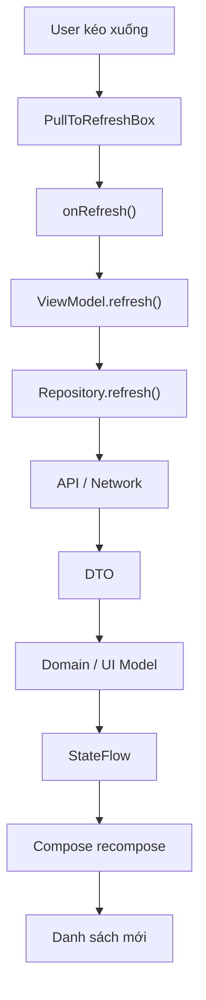
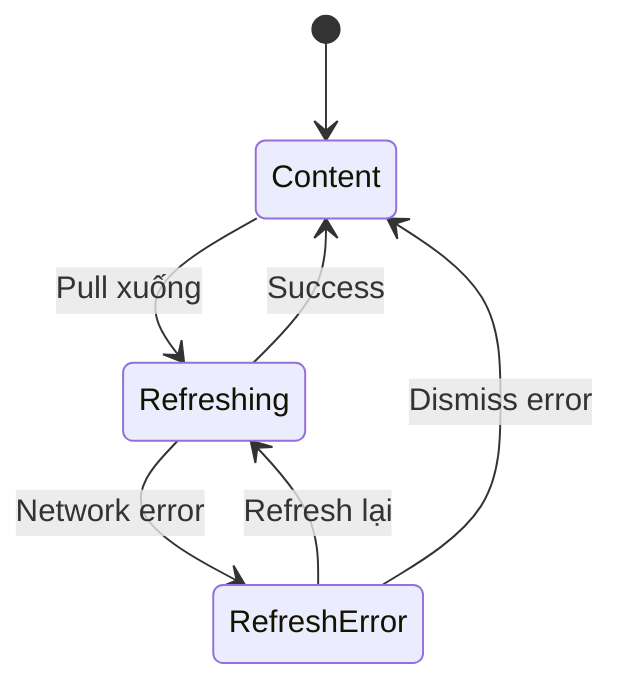
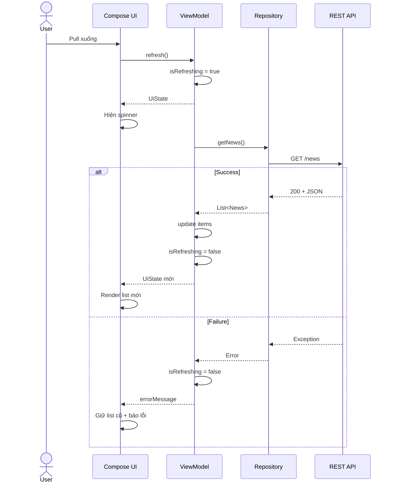
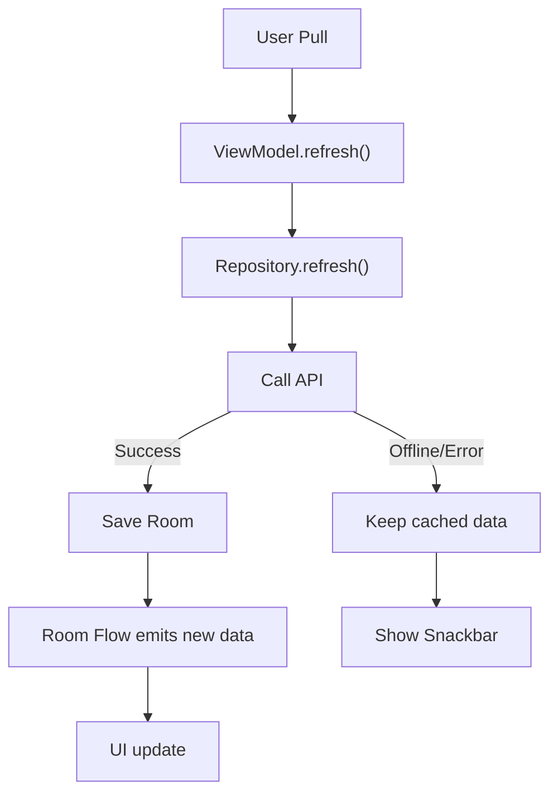
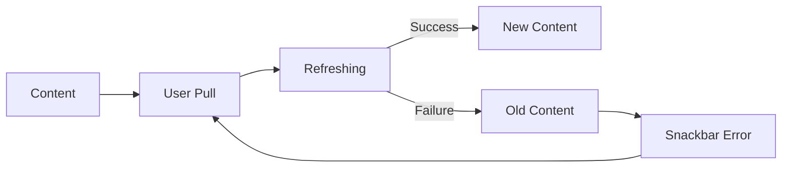

[](https://m1.material.io/patterns/swipe-to-refresh.html?utm_source=chatgpt.com)

# 028 - Pull to Refresh

| Thuộc tính              | Nội dung                                                  |
| ----------------------- | --------------------------------------------------------- |
| **Học phần**            | 04 - Network, Async and Services                          |
| **Module**              | Module 07 - Network                                       |
| **Nhóm nội dung**       | Network UI States                                         |
| **Nguồn roadmap**       | Network / Network UI States                               |
| **Loại bài**            | Network                                                   |
| **Thứ tự trong module** | 028                                                       |
| **Thời lượng gợi ý**    | 32 phút                                                   |
| **Mức độ**              | Cơ bản → Trung cấp                                        |
| **Stack đề xuất**       | Kotlin, Jetpack Compose, ViewModel, StateFlow, Repository |

---

## 1. Tóm tắt

**Pull to Refresh** là pattern UX cho phép người dùng kéo nội dung xuống từ đầu danh sách để chủ động yêu cầu ứng dụng tải dữ liệu mới.

Trong Jetpack Compose hiện tại, Material 3 cung cấp `PullToRefreshBox`. Component này bao quanh nội dung có khả năng scroll và nhận hai thông tin quan trọng:

* `isRefreshing`: hiện tại có đang refresh hay không.
* `onRefresh`: callback khi người dùng kéo đủ ngưỡng để kích hoạt refresh.
* `indicator`: cho phép tùy biến indicator. ([Android Developers][1])

Ví dụ:

```text
Tin tức hiện tại
      ↓
Người dùng kéo xuống
      ↓
Refresh indicator xuất hiện
      ↓
GET /articles
      ↓
┌──────────────┬──────────────┐
│ Thành công   │ Thất bại     │
│ cập nhật list│ giữ list cũ  │
│              │ + báo lỗi    │
└──────────────┴──────────────┘
```

Điểm quan trọng nhất:

> **Pull to Refresh không chỉ là animation xoay vòng. Nó là một user event đi qua toàn bộ pipeline UI → ViewModel → Repository → Network → State → UI.**

Cách tổ chức này phù hợp với kiến trúc **Unidirectional Data Flow (UDF)** mà Android khuyến nghị: event đi từ UI lên state producer, còn state mới đi ngược xuống UI. ([Android Developers][2])

---

# 2. Mục tiêu học tập

Sau bài này, bạn có thể:

* Giải thích **Pull to Refresh** bằng ngôn ngữ của mình.
* Phân biệt:

  * initial loading;
  * refreshing;
  * success;
  * refresh error.
* Triển khai Pull to Refresh bằng **Jetpack Compose Material 3**.
* Quản lý `isRefreshing` trong `ViewModel`.
* Kết nối UI với `Repository`.
* Không xóa dữ liệu cũ chỉ vì refresh thất bại.
* Ngăn nhiều request refresh chạy đồng thời.
* Hiểu tác động của lifecycle và configuration change.
* Viết unit test cho refresh logic.
* Viết UI test cơ bản.
* Biến tính năng thành artifact nhỏ cho portfolio.

---

# 3. Pull to Refresh là gì?

Hãy tưởng tượng một màn hình News Feed:

```text
┌─────────────────────────────┐
│ News                        │
├─────────────────────────────┤
│ Android 17 released...      │
│                             │
│ Kotlin update...            │
│                             │
│ Compose article...          │
│                             │
│                             │
└─────────────────────────────┘
```

Người dùng kéo danh sách xuống:

```text
        ↓
        ↓
        ↓

       ↻

┌─────────────────────────────┐
│ News                        │
├─────────────────────────────┤
│ Android 17 released...      │
│ Kotlin update...            │
└─────────────────────────────┘
```

Ứng dụng nhận event:

```text
onRefresh()
```

Sau đó thực hiện:

```text
GET /news
```

và cập nhật dữ liệu mới.

Android mô tả pattern này là thao tác kéo xuống ở đầu nội dung để refresh dữ liệu. ([Android Developers][1])

---

# 4. Pull to Refresh nằm ở đâu trong kiến trúc?

Pull to Refresh thuộc **UI Layer**, nhưng logic tải dữ liệu không nên nằm trực tiếp trong Composable.

Kiến trúc điển hình:



Android khuyến nghị ViewModel giữ và expose UI state, UI gửi các user event lên ViewModel, sau đó state mới được đưa trở lại UI để render. ([Android Developers][2])

---

# 5. Pull to Refresh khác Loading như thế nào?

Đây là phần rất quan trọng.

## Initial Loading

Người dùng vừa mở screen và **chưa có dữ liệu**.

```text
Screen

   ⟳
Loading...
```

Có thể model:

```kotlin
isLoading = true
items = emptyList()
```

---

## Refreshing

Screen **đã có dữ liệu**, người dùng yêu cầu tải bản mới.

```text
        ↻

Item A
Item B
Item C
```

State:

```kotlin
isLoading = false
isRefreshing = true
items = oldItems
```

Danh sách cũ vẫn còn.

---

## So sánh

| Initial Loading                 | Pull to Refresh              |
| ------------------------------- | ---------------------------- |
| Chưa có dữ liệu                 | Thường đã có dữ liệu         |
| Có thể dùng full-screen loading | Chỉ nên có refresh indicator |
| Xảy ra khi mở screen            | Do user chủ động kích hoạt   |
| `isLoading`                     | `isRefreshing`               |
| Không có stale content          | Có thể giữ content hiện tại  |

Sai lầm phổ biến là dùng chung:

```kotlin
isLoading
```

cho cả hai tình huống.

Kết quả:

```text
User refresh
     ↓
List biến mất
     ↓
Full screen spinner
```

UX này không cần thiết nếu dữ liệu cũ vẫn sử dụng được.

---

# 6. State machine của Pull to Refresh

Có thể hình dung state như sau:



Một điểm quan trọng:

```text
RefreshError
```

không nhất thiết có nghĩa là:

```text
Error Screen
```

Nếu ứng dụng đã có dữ liệu:

```text
Item A
Item B
Item C
```

thì refresh thất bại nên có thể trở thành:

```text
Item A
Item B
Item C

Snackbar:
"Không thể cập nhật dữ liệu"
```

thay vì:

```text
❌ Network Error

[Retry]
```

và xóa toàn bộ dữ liệu cũ.

---

# 7. Thiết kế UI State

Một model đơn giản:

```kotlin
data class NewsUiState(
    val items: List<NewsItem> = emptyList(),
    val isLoading: Boolean = false,
    val isRefreshing: Boolean = false,
    val errorMessage: String? = null
)
```

Có bốn thông tin riêng:

```text
items
isLoading
isRefreshing
errorMessage
```

Điều này cho phép biểu diễn:

```text
Initial Loading

items = []
isLoading = true
isRefreshing = false
```

hoặc:

```text
Refreshing

items = [...]
isLoading = false
isRefreshing = true
```

hoặc:

```text
Refresh thất bại nhưng vẫn có data

items = [...]
isLoading = false
isRefreshing = false
errorMessage = "Không thể cập nhật"
```

Android khuyến nghị expose UI state qua observable state holder như `StateFlow` để UI phản ứng khi state thay đổi. ([Android Developers][2])

---

# 8. Repository

Ví dụ domain model:

```kotlin
data class NewsItem(
    val id: Long,
    val title: String
)
```

Repository:

```kotlin
interface NewsRepository {

    suspend fun getNews(): List<NewsItem>
}
```

Implementation đơn giản:

```kotlin
class NewsRepositoryImpl(
    private val api: NewsApi
) : NewsRepository {

    override suspend fun getNews(): List<NewsItem> {
        return api.getNews()
            .map { dto ->
                NewsItem(
                    id = dto.id,
                    title = dto.title
                )
            }
    }
}
```

Pipeline:

```text
API
 ↓
NewsDto
 ↓
NewsItem
 ↓
UiState
 ↓
Compose
```

---

# 9. ViewModel

## UiState

```kotlin
data class NewsUiState(
    val items: List<NewsItem> = emptyList(),
    val isLoading: Boolean = true,
    val isRefreshing: Boolean = false,
    val errorMessage: String? = null
)
```

---

## ViewModel

```kotlin
class NewsViewModel(
    private val repository: NewsRepository
) : ViewModel() {

    private val _uiState = MutableStateFlow(NewsUiState())

    val uiState: StateFlow<NewsUiState> =
        _uiState.asStateFlow()

    init {
        loadNews()
    }

    private fun loadNews() {

        viewModelScope.launch {

            _uiState.update {
                it.copy(
                    isLoading = true,
                    errorMessage = null
                )
            }

            runCatching {
                repository.getNews()
            }.onSuccess { items ->

                _uiState.update {
                    it.copy(
                        items = items,
                        isLoading = false
                    )
                }

            }.onFailure {

                _uiState.update {
                    it.copy(
                        isLoading = false,
                        errorMessage = "Không thể tải dữ liệu"
                    )
                }
            }
        }
    }
}
```

Đây mới chỉ xử lý **initial load**.

Tiếp theo thêm refresh.

---

# 10. Implement `refresh()`

```kotlin
fun refresh() {

    if (_uiState.value.isRefreshing) {
        return
    }

    viewModelScope.launch {

        _uiState.update {
            it.copy(
                isRefreshing = true,
                errorMessage = null
            )
        }

        runCatching {
            repository.getNews()
        }.onSuccess { items ->

            _uiState.update {
                it.copy(
                    items = items,
                    isRefreshing = false
                )
            }

        }.onFailure {

            _uiState.update {
                it.copy(
                    isRefreshing = false,
                    errorMessage = "Không thể cập nhật dữ liệu"
                )
            }
        }
    }
}
```

Chú ý:

```kotlin
if (_uiState.value.isRefreshing) {
    return
}
```

ngăn một tình huống như:

```text
Pull
 ↓
Request A

Pull tiếp
 ↓
Request B

Pull tiếp
 ↓
Request C
```

thành:

```text
Request A
Request B
Request C
```

chạy đồng thời.

---

# 11. Jetpack Compose — `PullToRefreshBox`

Material 3 hiện cung cấp:

```kotlin
PullToRefreshBox
```

trong package pull-to-refresh của Material 3. API reference ghi nhận `PullToRefreshState`/`PullToRefreshBox`, và state API này xuất hiện từ Material 3 1.3.0. ([Android Developers][3])

Ví dụ cơ bản của Android cũng sử dụng `PullToRefreshBox` bao quanh `LazyColumn`. ([Android Developers][1])

```kotlin
@Composable
fun NewsScreen(
    viewModel: NewsViewModel
) {

    val uiState by viewModel.uiState.collectAsStateWithLifecycle()

    PullToRefreshBox(
        isRefreshing = uiState.isRefreshing,
        onRefresh = viewModel::refresh
    ) {

        LazyColumn(
            modifier = Modifier.fillMaxSize()
        ) {

            items(
                items = uiState.items,
                key = { it.id }
            ) { item ->

                Text(
                    text = item.title,
                    modifier = Modifier.padding(16.dp)
                )
            }
        }
    }
}
```

Quan hệ state:

```text
ViewModel

isRefreshing
      │
      ▼
PullToRefreshBox
      │
      │ user kéo
      ▼
onRefresh()
      │
      ▼
ViewModel.refresh()
```

`PullToRefreshBox` yêu cầu `isRefreshing` và `onRefresh`; phần content bên trong là nội dung scrollable. ([Android Developers][1])

---

# 12. Flow hoàn chỉnh



---

# 13. Hiển thị Initial Loading đúng cách

Ta có thể kết hợp:

```kotlin
when {

    uiState.isLoading -> {
        CircularProgressIndicator()
    }

    uiState.items.isEmpty() -> {
        EmptyContent()
    }

    else -> {
        NewsList(...)
    }
}
```

Nhưng `PullToRefreshBox` vẫn có thể bao quanh content.

Ví dụ:

```kotlin
@Composable
fun NewsContent(
    uiState: NewsUiState,
    onRefresh: () -> Unit
) {

    PullToRefreshBox(
        isRefreshing = uiState.isRefreshing,
        onRefresh = onRefresh
    ) {

        when {

            uiState.isLoading -> {

                Box(
                    modifier = Modifier.fillMaxSize(),
                    contentAlignment = Alignment.Center
                ) {
                    CircularProgressIndicator()
                }
            }

            else -> {

                LazyColumn(
                    modifier = Modifier.fillMaxSize()
                ) {

                    items(
                        items = uiState.items,
                        key = { it.id }
                    ) {

                        Text(
                            text = it.title,
                            modifier = Modifier.padding(16.dp)
                        )
                    }
                }
            }
        }
    }
}
```

---

# 14. Error khi refresh

Giả sử đang có:

```text
Article A
Article B
Article C
```

Người dùng refresh.

Server timeout.

Không nên:

```text
Article A
Article B
Article C

      ↓

❌ ERROR SCREEN
```

Thay vào đó:

```text
Article A
Article B
Article C

┌──────────────────────────────┐
│ Không thể cập nhật dữ liệu   │
└──────────────────────────────┘
```

Đây là ví dụ của **stale-but-usable data**:

```text
Dữ liệu có thể cũ
       │
       └── nhưng vẫn hữu ích
```

---

# 15. Snackbar cho refresh error

Ví dụ:

```kotlin
val snackbarHostState = remember {
    SnackbarHostState()
}
```

Quan sát lỗi:

```kotlin
LaunchedEffect(uiState.errorMessage) {

    uiState.errorMessage?.let { message ->

        snackbarHostState.showSnackbar(
            message = message
        )

        viewModel.errorShown()
    }
}
```

ViewModel:

```kotlin
fun errorShown() {

    _uiState.update {
        it.copy(
            errorMessage = null
        )
    }
}
```

---

# 16. Không để indicator chạy mãi

Một bug cực phổ biến:

```kotlin
fun refresh() {

    _uiState.update {
        it.copy(isRefreshing = true)
    }

    repository.getNews()
}
```

nhưng quên:

```kotlin
isRefreshing = false
```

Kết quả:

```text
↻ ↻ ↻ ↻ ↻ ↻
```

vĩnh viễn.

Nên đảm bảo mọi nhánh đều kết thúc trạng thái refresh:

```text
         Refreshing
             │
       ┌─────┴─────┐
       ▼           ▼
    Success      Failure
       │           │
       └─────┬─────┘
             ▼
     isRefreshing=false
```

---

# 17. Dùng `finally`

Một pattern khác:

```kotlin
fun refresh() {

    if (_uiState.value.isRefreshing) return

    viewModelScope.launch {

        _uiState.update {
            it.copy(
                isRefreshing = true,
                errorMessage = null
            )
        }

        try {

            val items = repository.getNews()

            _uiState.update {
                it.copy(items = items)
            }

        } catch (e: Exception) {

            _uiState.update {
                it.copy(
                    errorMessage = "Không thể cập nhật dữ liệu"
                )
            }

        } finally {

            _uiState.update {
                it.copy(
                    isRefreshing = false
                )
            }
        }
    }
}
```

`finally` giúp giảm khả năng quên reset indicator.

---

# 18. Custom Refresh Indicator

Material 3 cho phép tùy chỉnh indicator thông qua:

```kotlin
indicator = { ... }
```

và dùng chung `rememberPullToRefreshState()`. Tài liệu Android có ví dụ custom màu và custom indicator dựa trên trạng thái kéo. ([Android Developers][1])

Ví dụ:

```kotlin
@Composable
fun NewsScreen(
    uiState: NewsUiState,
    onRefresh: () -> Unit
) {

    val state = rememberPullToRefreshState()

    PullToRefreshBox(
        isRefreshing = uiState.isRefreshing,
        onRefresh = onRefresh,
        state = state,
        indicator = {

            Indicator(
                modifier = Modifier.align(
                    Alignment.TopCenter
                ),
                isRefreshing = uiState.isRefreshing,
                state = state,
                containerColor =
                    MaterialTheme.colorScheme.primaryContainer,
                color =
                    MaterialTheme.colorScheme.onPrimaryContainer
            )
        }
    ) {

        NewsList(uiState.items)
    }
}
```

Không cần custom nếu UI tiêu chuẩn đã đủ tốt.

---

# 19. Pull progress

`PullToRefreshState` còn theo dõi người dùng đã kéo bao xa; tài liệu Android sử dụng `distanceFraction` cho custom indicator, với logic từ gần `0` đến ngưỡng refresh. ([Android Developers][1])

Có thể hình dung:

```text
0%

────────────
List
```

```text
30%

     ↓
────────────
List
```

```text
70%

     ↓
     ↻
────────────
List
```

```text
100%

   Refresh!
      ↻
────────────
List
```

Điều này hữu ích khi xây custom animation.

---

# 20. Pull to Refresh + MVVM

Toàn bộ feature có thể chia trách nhiệm như sau:

```text
┌────────────────────────────┐
│ Compose UI                 │
│                            │
│ PullToRefreshBox           │
│ LazyColumn                 │
└────────────┬───────────────┘
             │ onRefresh()
             ▼
┌────────────────────────────┐
│ ViewModel                  │
│                            │
│ UiState                    │
│ refresh()                  │
└────────────┬───────────────┘
             │
             ▼
┌────────────────────────────┐
│ Repository                 │
│                            │
│ getNews()                  │
└────────────┬───────────────┘
             │
             ▼
┌────────────────────────────┐
│ Retrofit / API             │
└────────────────────────────┘
```

UI không nên tự gọi:

```kotlin
retrofit.getNews()
```

trực tiếp trong `onRefresh`.

Không nên:

```kotlin
PullToRefreshBox(
    onRefresh = {

        coroutineScope.launch {
            api.getNews()
        }
    }
)
```

Nên:

```kotlin
PullToRefreshBox(
    onRefresh = viewModel::refresh
)
```

---

# 21. Lifecycle

Nếu request được chạy trong:

```kotlin
viewModelScope
```

thì việc Activity/Composable bị recreate do configuration change không buộc bạn phải nhét network logic vào UI.

Android mô tả ViewModel như nơi giữ UI state và xử lý event trong kiến trúc UDF. ([Android Developers][2])

Flow:

```text
Screen
  │
  │ pull
  ▼
ViewModel
  │
  │ request
  ▼
Repository

──────── rotate ────────

New Screen
  │
  └──── collect UiState
             │
             ▼
         ViewModel
```

Do đó không nên để:

```kotlin
var isRefreshing by remember {
    mutableStateOf(false)
}
```

là **nguồn sự thật duy nhất** nếu trạng thái này gắn trực tiếp với một request/business operation của ViewModel.

---

# 22. `remember` hay ViewModel?

## UI-only state

Ví dụ:

```kotlin
val pullState = rememberPullToRefreshState()
```

phù hợp với UI interaction.

---

## Application/UI screen state

Ví dụ:

```kotlin
isRefreshing
items
error
```

nên nằm trong state producer như ViewModel khi nó liên quan đến quá trình tải dữ liệu.

Android khuyến nghị hoist state tới owner phù hợp và expose immutable state + events; với business logic, owner đó có thể nằm ngoài Composition như ViewModel. ([Android Developers][4])

---

# 23. Accessibility

Pull gesture không nên là **cách duy nhất** để người dùng refresh.

Tài liệu Android dành cho Views còn khuyến nghị có refresh action bổ sung để người không thể thực hiện swipe gesture, chẳng hạn dùng keyboard hoặc D-pad, vẫn có thể cập nhật dữ liệu. ([Android Developers][5])

Ví dụ Compose:

```text
TopAppBar

News                       ⋮
                            │
                            └── Refresh
```

Có thể dùng cùng event:

```kotlin
viewModel.refresh()
```

cho cả:

```text
Pull gesture
```

và:

```text
Refresh menu
```

Kiến trúc:

```text
Pull ───────────┐
                │
Refresh button ─┼──> ViewModel.refresh()
                │
Retry button ───┘
```

Đây là một ưu điểm của việc model user action thành event thay vì gắn logic trực tiếp vào gesture.

---

# 24. Pull to Refresh + Offline

Giả sử:

```text
Room Cache
    +
Network
```

Một chiến lược tốt:



Tức là:

```text
Network failure
      ≠
không còn gì để hiển thị
```

nếu cache vẫn tồn tại.

---

# 25. Pull to Refresh + Paging

Với dữ liệu phân trang, refresh thường không có nghĩa là:

```text
load next page
```

mà là:

```text
invalidate / reload từ đầu
```

Android cũng mô tả swipe-to-refresh như một signal phổ biến để làm mới nguồn dữ liệu phân trang. ([Android Developers][6])

Phân biệt:

```text
Pull to Refresh
      ↓
Refresh trang đầu / dataset

Scroll xuống cuối
      ↓
Load next page
```

Không nên nhầm hai operation:

```text
REFRESH
```

và:

```text
APPEND
```

---

# 26. Race condition

Một vấn đề production:

```text
Request A bắt đầu
        │
        │
User refresh
        │
        ▼
Request B bắt đầu
        │
Request B xong
        │
UI = data B
        │
Request A xong
        │
UI = data A ❌
```

Data cũ có thể ghi đè data mới.

Các chiến lược có thể dùng:

```text
1. Không cho refresh song song
2. Cancel job cũ
3. flatMapLatest
4. Single source of truth từ database
5. Request/version token
```

Ví dụ đơn giản:

```kotlin
private var refreshJob: Job? = null

fun refresh() {

    refreshJob?.cancel()

    refreshJob = viewModelScope.launch {
        // refresh
    }
}
```

Việc chọn cancel hay bỏ qua request mới phụ thuộc semantics của feature.

---

# 27. Refresh debounce / spam prevention

Người dùng có thể:

```text
pull
pull
pull
pull
pull
```

Bạn không muốn:

```text
GET /feed
GET /feed
GET /feed
GET /feed
GET /feed
```

Pattern tối thiểu:

```kotlin
if (uiState.value.isRefreshing) {
    return
}
```

Có thể nâng cao thành:

```text
Refresh request
      │
      ▼
Single-flight operation
      │
      ├── đang chạy → ignore
      │
      └── chưa chạy → execute
```

---

# 28. Performance

Pull to Refresh thường gây:

```text
Network call
+
JSON parsing
+
mapping
+
database write
+
list update
+
recomposition
```

Nên tránh:

```kotlin
items = emptyList()
```

trước khi fetch nếu không cần thiết.

Nếu làm vậy:

```text
Old list
  ↓
Empty
  ↓
Network
  ↓
New list
```

UI có thể flicker.

Tốt hơn:

```text
Old list
  │
  ├── indicator
  │
  └── vẫn hiển thị
        ↓
     New list
```

---

# 29. Khi nào nên dùng Pull to Refresh?

Phù hợp với:

* News feed.
* Social feed.
* Email inbox.
* Notifications.
* Order list.
* Transaction history.
* Weather.
* Dashboard có dữ liệu thay đổi.
* List lấy dữ liệu từ server.

Pattern swipe-to-refresh của Android được thiết kế cho nội dung có thể được người dùng yêu cầu cập nhật thủ công, kể cả khi app đã có cơ chế cập nhật tự động. ([Android Developers][7])

---

# 30. Khi nào không cần?

Ví dụ:

### Static Settings

```text
Settings
├── Theme
├── Language
└── Notifications
```

Không có dữ liệu server cần cập nhật.

Pull to Refresh gần như vô nghĩa.

---

Hoặc app đã có:

```text
WebSocket
   ↓
real-time update
```

thì Pull to Refresh có thể chỉ nên tồn tại nếu vẫn có ý nghĩa như một cách **manual reconciliation**.

Không nên thêm gesture chỉ vì:

> "App nào cũng có pull to refresh."

---

# 31. Pull to Refresh với Views

Nếu project chưa dùng Compose, Android vẫn có:

```text
SwipeRefreshLayout
```

Widget này detect vertical swipe, hiển thị progress và gọi refresh callback. ([Android Developers][5])

Cấu trúc truyền thống:

```xml
<androidx.swiperefreshlayout.widget.SwipeRefreshLayout
    android:id="@+id/swipeRefresh"
    android:layout_width="match_parent"
    android:layout_height="match_parent">

    <androidx.recyclerview.widget.RecyclerView
        android:id="@+id/list"
        android:layout_width="match_parent"
        android:layout_height="match_parent" />

</androidx.swiperefreshlayout.widget.SwipeRefreshLayout>
```

Logic:

```kotlin
swipeRefresh.setOnRefreshListener {
    viewModel.refresh()
}
```

Khi state đổi:

```kotlin
swipeRefresh.isRefreshing =
    uiState.isRefreshing
```

Về tư duy kiến trúc, Compose và Views giống nhau:

```text
Gesture
   ↓
Event
   ↓
ViewModel
   ↓
State
   ↓
UI
```

---

# 32. Những lỗi thường gặp

## Lỗi 1 — gọi API trực tiếp trong UI

```kotlin
onRefresh = {
    api.getNews()
}
```

### Nên

```kotlin
onRefresh = viewModel::refresh
```

---

## Lỗi 2 — refresh xóa dữ liệu hiện có

Không nên:

```kotlin
_uiState.update {
    it.copy(
        items = emptyList(),
        isRefreshing = true
    )
}
```

Nên giữ list hiện tại.

---

## Lỗi 3 — dùng cùng một loading state

Không nên chỉ có:

```kotlin
isLoading
```

Nên phân biệt ít nhất:

```kotlin
isLoading
isRefreshing
```

---

## Lỗi 4 — quên kết thúc refresh

```text
isRefreshing=true
```

nhưng không bao giờ:

```text
isRefreshing=false
```

---

## Lỗi 5 — network error làm mất toàn bộ screen

```text
refresh failure
```

không đồng nghĩa:

```text
screen failure
```

nếu vẫn có dữ liệu cũ.

---

## Lỗi 6 — request trùng lặp

```text
refresh()
refresh()
refresh()
```

không được kiểm soát.

---

## Lỗi 7 — gesture là cách duy nhất

Nên có alternative action khi phù hợp với accessibility. Android cũng đưa ra hướng dẫn về manual refresh action ngoài swipe gesture cho Views. ([Android Developers][5])

---

# 33. Unit Test ViewModel

Ví dụ cần test:

```text
Given:
repository trả success

When:
refresh()

Then:
isRefreshing = true
sau đó:
items = newItems
isRefreshing = false
```

Pseudo test:

```kotlin
@Test
fun `refresh success updates items`() = runTest {

    repository.result = listOf(
        NewsItem(1, "Android"),
        NewsItem(2, "Kotlin")
    )

    viewModel.refresh()

    advanceUntilIdle()

    val state = viewModel.uiState.value

    assertFalse(state.isRefreshing)

    assertEquals(
        2,
        state.items.size
    )
}
```

---

# 34. Test refresh error

```kotlin
@Test
fun `refresh failure keeps old content`() = runTest {

    val oldItems = listOf(
        NewsItem(1, "Old article")
    )

    repository.throwError = true

    viewModel.refresh()

    advanceUntilIdle()

    val state = viewModel.uiState.value

    assertFalse(
        state.isRefreshing
    )

    assertEquals(
        oldItems,
        state.items
    )

    assertNotNull(
        state.errorMessage
    )
}
```

Điều đáng test ở đây không chỉ là:

```text
error xuất hiện
```

mà còn:

```text
old data không bị mất
```

---

# 35. Các test case nên có

| Test                    | Kỳ vọng                 |
| ----------------------- | ----------------------- |
| Initial load thành công | List hiển thị           |
| Initial load lỗi        | Error state             |
| Refresh thành công      | List cập nhật           |
| Refresh lỗi             | Giữ list cũ             |
| Refresh đang chạy       | Indicator hiển thị      |
| Refresh hoàn thành      | Indicator biến mất      |
| Refresh hai lần         | Không duplicate request |
| Offline refresh         | Cache vẫn hiển thị      |
| Empty response          | Empty state hợp lệ      |
| Configuration change    | State vẫn nhất quán     |

---

# 36. Debugging checklist

Khi Pull to Refresh bị lỗi, kiểm tra theo flow:

```text
Gesture hoạt động?
        │
        ▼
onRefresh được gọi?
        │
        ▼
ViewModel.refresh được gọi?
        │
        ▼
Repository được gọi?
        │
        ▼
HTTP request có chạy?
        │
        ▼
Response đúng?
        │
        ▼
UiState update?
        │
        ▼
Compose collect state?
        │
        ▼
UI recompose?
```

Đừng chỉ nhìn:

```text
"spinner không chạy"
```

và kết luận lỗi ở UI.

Lỗi có thể nằm ở bất kỳ tầng nào.

---

# 37. Ví dụ hoàn chỉnh

## `NewsUiState.kt`

```kotlin
data class NewsUiState(
    val items: List<NewsItem> = emptyList(),
    val isLoading: Boolean = true,
    val isRefreshing: Boolean = false,
    val errorMessage: String? = null
)
```

---

## `NewsViewModel.kt`

```kotlin
class NewsViewModel(
    private val repository: NewsRepository
) : ViewModel() {

    private val _uiState =
        MutableStateFlow(NewsUiState())

    val uiState =
        _uiState.asStateFlow()

    init {
        load()
    }

    private fun load() {

        viewModelScope.launch {

            try {

                val items =
                    repository.getNews()

                _uiState.update {
                    it.copy(
                        items = items,
                        isLoading = false
                    )
                }

            } catch (e: Exception) {

                _uiState.update {
                    it.copy(
                        isLoading = false,
                        errorMessage =
                            "Không thể tải dữ liệu"
                    )
                }
            }
        }
    }

    fun refresh() {

        if (_uiState.value.isRefreshing) {
            return
        }

        viewModelScope.launch {

            _uiState.update {
                it.copy(
                    isRefreshing = true,
                    errorMessage = null
                )
            }

            try {

                val items =
                    repository.getNews()

                _uiState.update {
                    it.copy(
                        items = items
                    )
                }

            } catch (e: Exception) {

                _uiState.update {
                    it.copy(
                        errorMessage =
                            "Không thể cập nhật dữ liệu"
                    )
                }

            } finally {

                _uiState.update {
                    it.copy(
                        isRefreshing = false
                    )
                }
            }
        }
    }

    fun errorShown() {

        _uiState.update {
            it.copy(
                errorMessage = null
            )
        }
    }
}
```

---

## `NewsScreen.kt`

```kotlin
@Composable
fun NewsScreen(
    viewModel: NewsViewModel
) {

    val uiState by
        viewModel.uiState
            .collectAsStateWithLifecycle()

    val snackbarHostState =
        remember {
            SnackbarHostState()
        }

    LaunchedEffect(
        uiState.errorMessage
    ) {

        uiState.errorMessage
            ?.let { message ->

                snackbarHostState
                    .showSnackbar(message)

                viewModel.errorShown()
            }
    }

    Scaffold(
        snackbarHost = {
            SnackbarHost(
                snackbarHostState
            )
        }
    ) { padding ->

        PullToRefreshBox(
            modifier = Modifier
                .fillMaxSize()
                .padding(padding),

            isRefreshing =
                uiState.isRefreshing,

            onRefresh =
                viewModel::refresh
        ) {

            when {

                uiState.isLoading -> {

                    Box(
                        modifier =
                            Modifier.fillMaxSize(),
                        contentAlignment =
                            Alignment.Center
                    ) {

                        CircularProgressIndicator()
                    }
                }

                uiState.items.isEmpty() -> {

                    Box(
                        modifier =
                            Modifier.fillMaxSize(),
                        contentAlignment =
                            Alignment.Center
                    ) {

                        Text(
                            "Không có dữ liệu"
                        )
                    }
                }

                else -> {

                    LazyColumn(
                        modifier =
                            Modifier.fillMaxSize()
                    ) {

                        items(
                            items =
                                uiState.items,
                            key = {
                                it.id
                            }
                        ) { item ->

                            ListItem(
                                headlineContent = {
                                    Text(
                                        item.title
                                    )
                                }
                            )
                        }
                    }
                }
            }
        }
    }
}
```

Đây là cùng mô hình API mà tài liệu Compose hiện tại dùng: `PullToRefreshBox` nhận `isRefreshing`, `onRefresh` và wrap nội dung scrollable. ([Android Developers][1])

---

# 38. Mental Model cần nhớ

```text
Pull to Refresh
      │
      ▼
Không phải:
"show spinner"

Mà là:

User Event
      │
      ▼
ViewModel
      │
      ▼
Async operation
      │
      ▼
Repository
      │
      ▼
Network / Cache
      │
      ▼
New State
      │
      ▼
UI
```

Câu trả lời phỏng vấn tốt:

> **Pull to Refresh là một user-triggered refresh event. UI chỉ phát event và render `isRefreshing`; ViewModel điều phối refresh qua Repository rồi phát UI state mới. Nếu refresh thất bại nhưng đã có cached hoặc previous content, em ưu tiên giữ dữ liệu hiện tại và hiển thị non-blocking error thay vì biến toàn bộ screen thành error state.**

---

# 39. Bài thực hành — 20 đến 25 phút

Xây một màn hình:

```text
Latest Articles
```

API giả lập:

```http
GET /articles
```

UiState:

```kotlin
data class ArticleUiState(
    val articles: List<Article>,
    val isLoading: Boolean,
    val isRefreshing: Boolean,
    val error: String?
)
```

Yêu cầu:

1. Khi mở app:

   * hiển thị loading.

2. Khi API thành công:

   * hiển thị danh sách.

3. Người dùng kéo xuống:

   * hiện refresh indicator.

4. Refresh thành công:

   * cập nhật danh sách.

5. Refresh thất bại:

   * giữ danh sách cũ;
   * hiện Snackbar.

6. Không cho hai refresh chạy đồng thời.

---

# 40. Bài tập nâng cao

Giả lập server:

```kotlin
class FakeNewsRepository : NewsRepository {

    private var count = 0

    override suspend fun getNews(): List<NewsItem> {

        delay(1500)

        count++

        if (count % 3 == 0) {
            throw IOException(
                "Network error"
            )
        }

        return List(10) {

            NewsItem(
                id = it.toLong(),
                title =
                    "Article $it - refresh $count"
            )
        }
    }
}
```

Kết quả mong muốn:

```text
Refresh #1
    ↓
Success

Refresh #2
    ↓
Success

Refresh #3
    ↓
Error
    ↓
Old list vẫn tồn tại

Refresh #4
    ↓
Success
```

Đây là demo portfolio tốt vì có thể quay video thể hiện cả success và failure state.

---

# 41. Artifact cho portfolio

Có thể tạo mini project:

```text
android-pull-to-refresh-demo/
│
├── data/
│   ├── NewsApi.kt
│   └── NewsRepository.kt
│
├── ui/
│   ├── NewsScreen.kt
│   ├── NewsUiState.kt
│   └── NewsViewModel.kt
│
├── test/
│   └── NewsViewModelTest.kt
│
└── README.md
```

README có thể trình bày:

```text
Features

✓ Initial loading
✓ Pull to refresh
✓ Success state
✓ Refresh error
✓ Retry
✓ Preserve stale content
✓ StateFlow
✓ ViewModel
✓ Unit tests
```

Kèm:

```text
Screenshot 1
Loaded content

Screenshot 2
Pull-to-refresh indicator

Screenshot 3
Refresh failed Snackbar
```

---

# 42. Production checklist

### State

* [ ] Phân biệt `isLoading` và `isRefreshing`.
* [ ] `isRefreshing` luôn được reset sau request.
* [ ] Refresh lỗi không làm mất dữ liệu cũ.
* [ ] Không tạo duplicate requests.

### Architecture

* [ ] UI chỉ phát event.
* [ ] Network logic nằm ở Repository/Data Layer.
* [ ] ViewModel sở hữu screen state.
* [ ] State expose qua `StateFlow` hoặc cơ chế observable tương đương.

### UX

* [ ] Indicator xuất hiện rõ ràng.
* [ ] Không flicker danh sách.
* [ ] Error refresh không chặn toàn bộ UI khi vẫn có dữ liệu.
* [ ] Có manual refresh alternative khi cần accessibility.

### Lifecycle

* [ ] Configuration change không tạo request vô ý.
* [ ] Composable không phải nơi duy nhất giữ network state.
* [ ] Không trigger refresh lại mỗi lần recomposition.

### Network

* [ ] Timeout được xử lý.
* [ ] Offline được xử lý.
* [ ] HTTP errors được map rõ ràng.
* [ ] Cache strategy được xác định.

### Testing

* [ ] Test refresh success.
* [ ] Test refresh error.
* [ ] Test preserve old data.
* [ ] Test duplicate refresh.
* [ ] Test indicator stop.

### Release

* [ ] Test mạng chậm.
* [ ] Test offline.
* [ ] Test đổi Wi-Fi ↔ mobile data.
* [ ] Test kéo refresh liên tục.
* [ ] Test rotate/background trong lúc refresh.

---

# 43. Checklist hoàn thành bài học

* [ ] Giải thích được Pull to Refresh là gì.
* [ ] Phân biệt initial loading và refreshing.
* [ ] Biết `PullToRefreshBox`.
* [ ] Biết `isRefreshing`.
* [ ] Biết xử lý `onRefresh`.
* [ ] Kết nối được UI → ViewModel → Repository.
* [ ] Không gọi Retrofit trực tiếp từ Composable.
* [ ] Refresh lỗi vẫn giữ được dữ liệu cũ.
* [ ] Không cho refresh request chạy trùng.
* [ ] Biết hiển thị Snackbar cho lỗi refresh.
* [ ] Hiểu ảnh hưởng của lifecycle.
* [ ] Viết được ít nhất một unit test cho refresh.
* [ ] Có screenshot/video demo làm portfolio artifact.

---

# 44. Ghi chú sản xuất

Trước khi đưa Pull to Refresh lên production, hãy tự hỏi:

```text
Nếu mạng mất?
      ↓
List hiện tại còn dùng được không?

Nếu user pull 5 lần?
      ↓
Có tạo 5 HTTP request không?

Nếu server timeout?
      ↓
Spinner có dừng không?

Nếu rotate?
      ↓
Có request mới vô tình chạy không?

Nếu refresh thất bại?
      ↓
Có làm mất data hiện tại không?

Nếu user không dùng được swipe gesture?
      ↓
Có cách refresh khác không?
```

Một implementation tốt thường có flow:



---

# 45. Tóm tắt nhanh

```text
Pull to Refresh
        │
        ▼
   onRefresh()
        │
        ▼
ViewModel.refresh()
        │
        ▼
isRefreshing = true
        │
        ▼
Repository
        │
        ▼
     Network
        │
   ┌────┴────┐
   ▼         ▼
Success    Failure
   │         │
new data   keep old data
   │         │
   └────┬────┘
        ▼
isRefreshing = false
        │
        ▼
      UI
```

**Ba nguyên tắc cần nhớ:**

1. **Loading và Refreshing là hai trạng thái khác nhau.**
2. **Refresh thất bại không có nghĩa phải xóa dữ liệu đang hiển thị.**
3. **Gesture chỉ phát event; ViewModel/Repository mới chịu trách nhiệm thực hiện refresh.**

Tính đến tài liệu Android hiện tại, Jetpack Compose Material 3 cung cấp `PullToRefreshBox` làm container chuẩn cho pattern này, đồng thời Android vẫn duy trì `SwipeRefreshLayout` cho UI dựa trên Views. ([Android Developers][1])

[1]: https://developer.android.com/develop/ui/compose/components/pull-to-refresh "Pull to refresh  |  Jetpack Compose  |  Android Developers"
[2]: https://developer.android.com/topic/architecture/ui-layer "UI layer  |  App architecture  |  Android Developers"
[3]: https://developer.android.com/reference/kotlin/androidx/compose/material3/pulltorefresh/package-summary "androidx.compose.material3.pulltorefresh  |  API reference  |  Android Developers"
[4]: https://developer.android.com/develop/ui/compose/state-hoisting?utm_source=chatgpt.com "Where to hoist state | Jetpack Compose"
[5]: https://developer.android.com/develop/ui/views/touch-and-input/swipe/add-swipe-interface "Add swipe-to-refresh to your app  |  Views  |  Android Developers"
[6]: https://developer.android.com/topic/libraries/architecture/paging/data?utm_source=chatgpt.com "Gather paged data | Views"
[7]: https://developer.android.com/develop/ui/views/touch-and-input/swipe?utm_source=chatgpt.com "About swipe-to-refresh | Views"

---

# Bài luyện tập

## Mục tiêu


## Đề bài


## Yêu cầu hoàn thành

- [ ] 
- [ ] 
- [ ] 

## Kết quả / lời giải


## Ghi chú
