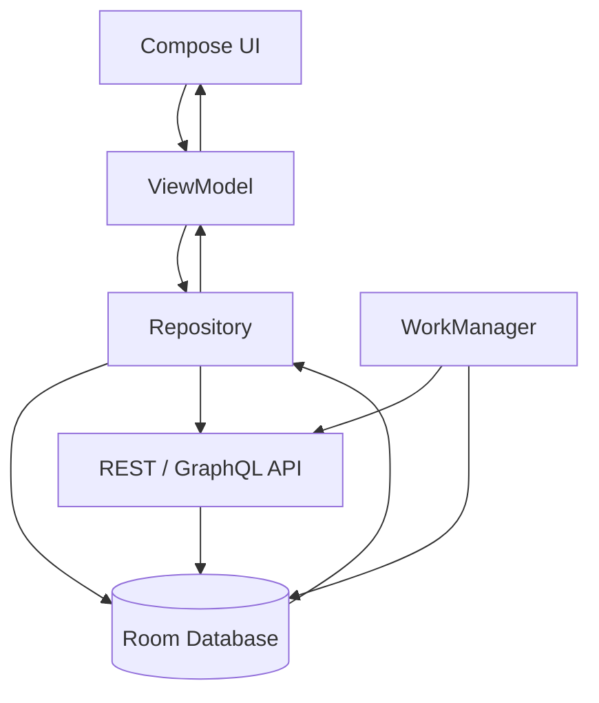
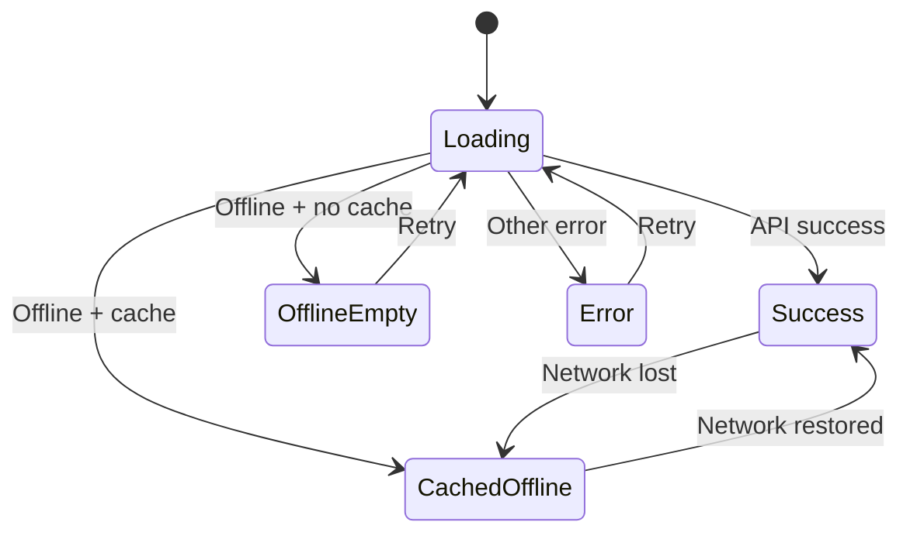
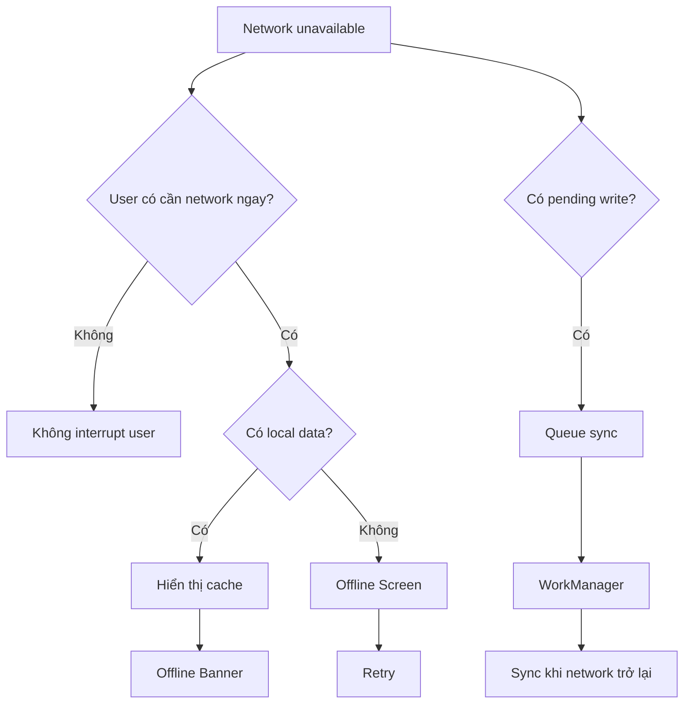
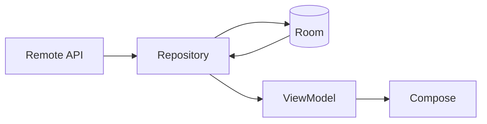
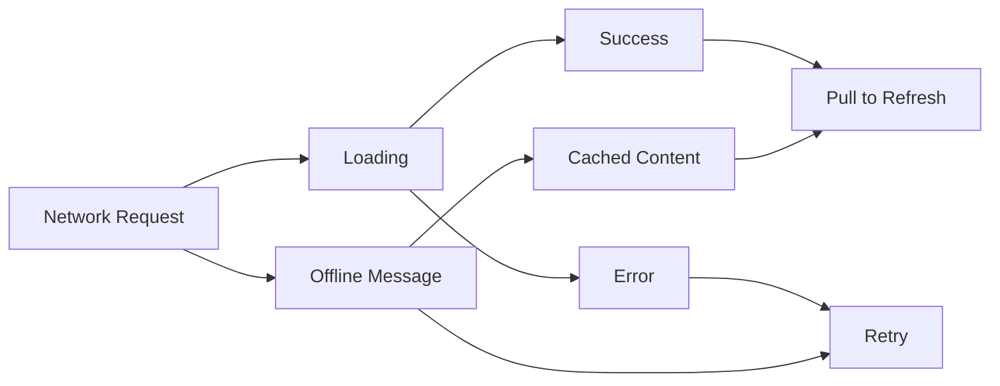

# 029 - Offline Message

**Học phần:** 04 - Network, Async and Services
**Module:** Module 07 - Network
**Nhóm nội dung:** Network UI States
**Nguồn roadmap:** Network / Network UI States
**Loại bài:** Network
**Thứ tự trong module:** 029
**Thời lượng gợi ý:** 32 phút

---

## 1. Tóm tắt

**Offline Message** là phần giao diện thông báo cho người dùng rằng ứng dụng hiện không thể truy cập Internet hoặc một thao tác cụ thể cần mạng nhưng kết nối hiện không khả dụng.

Ví dụ:

> 📡 Không có kết nối Internet
> Bạn vẫn có thể xem dữ liệu đã lưu.
> **Thử lại**

Offline Message không đơn thuần là dòng chữ `"No Internet"`. Một implementation tốt phải trả lời được:

* Ứng dụng có dữ liệu cache để tiếp tục hiển thị không?
* Người dùng đang thực hiện thao tác nào?
* Thao tác đó có thực sự cần Internet không?
* Có nên hiện full-screen error, banner, inline message hay Snackbar?
* Khi mạng trở lại thì có tự đồng bộ không?

Android khuyến khích thiết kế ứng dụng có khả năng hoạt động hữu ích khi mạng kém hoặc mất mạng, chẳng hạn lưu dữ liệu cục bộ, cache dữ liệu và trì hoãn các thao tác cần gửi lên server cho đến khi kết nối thích hợp xuất hiện.

---

## 2. Mục tiêu học tập

Sau bài này, anh nên có thể:

* Giải thích **Offline Message** bằng ngôn ngữ của mình.
* Phân biệt `offline` với lỗi HTTP hoặc lỗi server.
* Chọn kiểu UI phù hợp cho từng trường hợp mất mạng.
* Theo dõi trạng thái mạng bằng `ConnectivityManager`.
* Biểu diễn connectivity dưới dạng `Flow<Boolean>`.
* Kết hợp network state với `UiState`.
* Hiển thị Offline Message bằng Jetpack Compose.
* Xử lý dữ liệu cache khi offline.
* Thiết kế retry và đồng bộ lại khi online.
* Viết unit test/UI test cho trạng thái offline.
* Tạo một artifact nhỏ có thể đưa vào portfolio.

---

# 3. Offline Message là gì?

Có thể hiểu đơn giản:

> **Offline Message là feedback UI cho người dùng biết một chức năng hiện bị giới hạn bởi kết nối mạng và hướng dẫn họ có thể làm gì tiếp theo.**

Ví dụ ứng dụng đọc tin:

```text
Internet có
    ↓
GET /articles
    ↓
Hiển thị danh sách mới nhất
```

Nếu mất mạng nhưng đã có cache:

```text
Internet mất
    ↓
Không gọi được API
    ↓
Đọc Room Database
    ↓
Hiển thị dữ liệu cũ
    +
"Bạn đang ngoại tuyến"
```

Nếu không có cả mạng lẫn cache:

```text
Internet mất
    ↓
Không có dữ liệu local
    ↓
Offline Screen
    ↓
[Thử lại]
```

Đây chính là tư duy **offline-first**: data layer có thể kết hợp local data source và network data source; trong ứng dụng offline-first, local data thường đóng vai trò nguồn dữ liệu mà UI đọc trực tiếp.

---

# 4. Offline không đồng nghĩa với mọi Network Error

Đây là điểm rất quan trọng.

```text
Network Error
│
├── Không có Internet
│      └── Offline Message
│
├── Timeout
│      └── "Máy chủ phản hồi quá lâu"
│
├── HTTP 401
│      └── "Phiên đăng nhập đã hết hạn"
│
├── HTTP 403
│      └── "Bạn không có quyền"
│
├── HTTP 404
│      └── "Không tìm thấy dữ liệu"
│
├── HTTP 500
│      └── "Máy chủ đang gặp sự cố"
│
└── Parse/Serialization Error
       └── Internal/Application Error
```

Vì vậy không nên viết:

```kotlin
catch (e: Exception) {
    showMessage("Không có Internet")
}
```

Một `Exception` không chứng minh rằng thiết bị đang offline.

Thiết kế tốt hơn:

```kotlin
sealed interface AppError {

    data object Offline : AppError

    data object Timeout : AppError

    data class Http(
        val code: Int
    ) : AppError

    data object Unknown : AppError
}
```

Sau đó UI có thể map từng lỗi thành feedback chính xác.

---

# 5. Các kiểu Offline Message

Không có một UI duy nhất phù hợp với mọi trường hợp.

| Tình huống                       | UI nên dùng                       |
| -------------------------------- | --------------------------------- |
| Không có mạng + không có dữ liệu | Full-screen Offline State         |
| Không có mạng nhưng vẫn có cache | Banner                            |
| Mạng vừa mất                     | Snackbar                          |
| Một thao tác nhỏ cần Internet    | Inline message / Snackbar         |
| Gửi dữ liệu thất bại             | Message + Retry                   |
| Mạng trở lại                     | Snackbar ngắn hoặc silent refresh |

---

## 5.1 Full-screen Offline State

Phù hợp khi toàn bộ màn hình phụ thuộc vào network.

```text
┌─────────────────────────────┐
│                             │
│             📡              │
│                             │
│   Không có kết nối Internet │
│                             │
│ Kiểm tra Wi-Fi hoặc dữ liệu │
│ di động rồi thử lại.        │
│                             │
│        ┌───────────┐        │
│        │  Thử lại  │        │
│        └───────────┘        │
│                             │
└─────────────────────────────┘
```

Ví dụ:

* Search chưa có cache.
* Trang thanh toán.
* Login.
* Load dữ liệu lần đầu.

---

# 6. Banner Offline

Nếu ứng dụng vẫn có dữ liệu sử dụng được thì không nên che toàn bộ màn hình.

```text
┌──────────────────────────────┐
│ ⚠ Bạn đang ngoại tuyến       │
├──────────────────────────────┤
│                              │
│ Article 1                    │
│ Article 2                    │
│ Article 3                    │
│                              │
└──────────────────────────────┘
```

Người dùng vẫn đọc được dữ liệu.

Đây thường là UX tốt hơn:

```text
Offline
   ↓
Có cache?
   │
   ├── YES
   │     ↓
   │  Hiển thị cache
   │     +
   │  Offline Banner
   │
   └── NO
         ↓
      Offline Screen
```

Android cũng khuyến nghị không nhất thiết phải thông báo mất kết nối ở mọi thời điểm; feedback đặc biệt quan trọng khi người dùng thực hiện một thao tác thực sự yêu cầu connectivity.

---

# 7. Snackbar

Snackbar phù hợp với feedback ngắn hạn như:

```text
┌─────────────────────────────┐
│                             │
│         App content         │
│                             │
│                             │
│ ┌─────────────────────────┐ │
│ │ Không có Internet  RETRY│ │
│ └─────────────────────────┘ │
└─────────────────────────────┘
```

Trong Jetpack Compose, `SnackbarHostState` cung cấp `showSnackbar()` và thường được đặt cùng `SnackbarHost` trong `Scaffold`.

Ví dụ:

```kotlin
@Composable
fun ArticleScreen() {

    val snackbarHostState =
        remember { SnackbarHostState() }

    val scope = rememberCoroutineScope()

    Scaffold(
        snackbarHost = {
            SnackbarHost(snackbarHostState)
        }
    ) { padding ->

        Button(
            modifier = Modifier.padding(padding),
            onClick = {

                scope.launch {

                    val result =
                        snackbarHostState.showSnackbar(
                            message = "Không có kết nối Internet",
                            actionLabel = "Thử lại"
                        )

                    if (
                        result ==
                        SnackbarResult.ActionPerformed
                    ) {
                        // retry()
                    }
                }
            }
        ) {
            Text("Tải dữ liệu")
        }
    }
}
```

---

# 8. Không nên chỉ kiểm tra Wi-Fi

Một lỗi phổ biến là:

```text
Wi-Fi ON
    ↓
=> Có Internet
```

Điều này không chính xác.

Ví dụ:

```text
Điện thoại
   │
   │ Wi-Fi
   ↓
Router
   │
   X
Internet
```

Thiết bị vẫn kết nối Wi-Fi nhưng router có thể không truy cập Internet.

Android phân biệt:

```text
NET_CAPABILITY_INTERNET
```

và:

```text
NET_CAPABILITY_VALIDATED
```

`NET_CAPABILITY_INTERNET` chỉ cho biết network được cấu hình để có khả năng truy cập Internet; nó chưa chứng minh rằng Internet thực sự hoạt động. `NET_CAPABILITY_VALIDATED` biểu thị rằng hệ thống đã xác nhận khả năng kết nối Internet tại lần kiểm tra gần nhất.

Do đó thường kiểm tra:

```kotlin
capabilities.hasCapability(
    NetworkCapabilities.NET_CAPABILITY_INTERNET
) &&
capabilities.hasCapability(
    NetworkCapabilities.NET_CAPABILITY_VALIDATED
)
```

---

# 9. Theo dõi mạng bằng ConnectivityManager

Android cung cấp `ConnectivityManager` và `NetworkCallback` để ứng dụng theo dõi thay đổi connectivity. Callback cần được hủy đăng ký khi không còn sử dụng để tránh giữ listener không cần thiết.

Manifest:

```xml
<uses-permission
    android:name="android.permission.INTERNET" />

<uses-permission
    android:name="android.permission.ACCESS_NETWORK_STATE" />
```

Các permission này được Android documentation sử dụng cho network operations và đọc trạng thái connectivity.

---

# 10. NetworkMonitor với Kotlin Flow

Thay vì để từng màn hình tự truy cập `ConnectivityManager`, nên đóng logic network vào abstraction riêng.

```kotlin
interface NetworkMonitor {

    val isOnline: Flow<Boolean>
}
```

Implementation:

```kotlin
class ConnectivityNetworkMonitor(
    context: Context
) : NetworkMonitor {

    private val connectivityManager =
        context.getSystemService(
            ConnectivityManager::class.java
        )

    override val isOnline: Flow<Boolean> =
        callbackFlow {

            fun checkNetwork(
                network: Network?
            ): Boolean {

                if (network == null) {
                    return false
                }

                val capabilities =
                    connectivityManager
                        .getNetworkCapabilities(network)

                return capabilities
                    ?.hasCapability(
                        NetworkCapabilities
                            .NET_CAPABILITY_INTERNET
                    ) == true &&
                    capabilities
                        .hasCapability(
                            NetworkCapabilities
                                .NET_CAPABILITY_VALIDATED
                        )
            }

            val callback =
                object :
                    ConnectivityManager.NetworkCallback() {

                    override fun onAvailable(
                        network: Network
                    ) {
                        trySend(
                            checkNetwork(network)
                        )
                    }

                    override fun onLost(
                        network: Network
                    ) {
                        trySend(
                            checkNetwork(
                                connectivityManager.activeNetwork
                            )
                        )
                    }

                    override fun onCapabilitiesChanged(
                        network: Network,
                        capabilities: NetworkCapabilities
                    ) {

                        val online =
                            capabilities.hasCapability(
                                NetworkCapabilities
                                    .NET_CAPABILITY_INTERNET
                            ) &&
                            capabilities.hasCapability(
                                NetworkCapabilities
                                    .NET_CAPABILITY_VALIDATED
                            )

                        trySend(online)
                    }
                }

            connectivityManager
                .registerDefaultNetworkCallback(
                    callback
                )

            trySend(
                checkNetwork(
                    connectivityManager.activeNetwork
                )
            )

            awaitClose {
                connectivityManager
                    .unregisterNetworkCallback(
                        callback
                    )
            }
        }
            .distinctUntilChanged()
}
```

Kiến trúc lúc này:


UI không cần biết `ConnectivityManager` hoạt động thế nào.

Nó chỉ quan tâm:

```kotlin
isOnline: Boolean
```

---

# 11. Đưa network state vào ViewModel

Ví dụ:

```kotlin
data class ArticleUiState(
    val articles: List<Article> = emptyList(),
    val loading: Boolean = false,
    val isOnline: Boolean = true,
    val error: String? = null
)
```

ViewModel:

```kotlin
class ArticleViewModel(
    private val repository: ArticleRepository,
    networkMonitor: NetworkMonitor
) : ViewModel() {

    val isOnline =
        networkMonitor
            .isOnline
            .stateIn(
                scope = viewModelScope,
                started = SharingStarted.WhileSubscribed(
                    5_000
                ),
                initialValue = true
            )
}
```

Có thể kết hợp:

```text
Repository state
      +
Network state
      ↓
   ViewModel
      ↓
 ArticleUiState
      ↓
 Compose UI
```

---

# 12. Compose Offline Banner

Ví dụ component đơn giản:

```kotlin
@Composable
fun OfflineBanner() {

    Surface(
        modifier = Modifier.fillMaxWidth()
    ) {

        Row(
            modifier = Modifier.padding(12.dp),
            verticalAlignment =
                Alignment.CenterVertically
        ) {

            Icon(
                imageVector = Icons.Default.CloudOff,
                contentDescription = null
            )

            Spacer(
                modifier = Modifier.width(8.dp)
            )

            Text(
                text =
                    "Bạn đang ngoại tuyến. " +
                    "Đang hiển thị dữ liệu đã lưu."
            )
        }
    }
}
```

Screen:

```kotlin
@Composable
fun ArticleScreen(
    uiState: ArticleUiState,
    onRetry: () -> Unit
) {

    Column {

        if (!uiState.isOnline) {
            OfflineBanner()
        }

        when {

            uiState.loading -> {
                CircularProgressIndicator()
            }

            uiState.articles.isEmpty() &&
                !uiState.isOnline -> {

                OfflineScreen(
                    onRetry = onRetry
                )
            }

            else -> {

                ArticleList(
                    articles =
                        uiState.articles
                )
            }
        }
    }
}
```

---

# 13. Offline Screen

```kotlin
@Composable
fun OfflineScreen(
    onRetry: () -> Unit
) {

    Column(
        modifier =
            Modifier
                .fillMaxSize()
                .padding(32.dp),
        horizontalAlignment =
            Alignment.CenterHorizontally,
        verticalArrangement =
            Arrangement.Center
    ) {

        Icon(
            imageVector =
                Icons.Default.CloudOff,
            contentDescription = null
        )

        Spacer(
            modifier = Modifier.height(16.dp)
        )

        Text(
            text =
                "Không có kết nối Internet",
            style =
                MaterialTheme
                    .typography
                    .headlineSmall
        )

        Spacer(
            modifier = Modifier.height(8.dp)
        )

        Text(
            text =
                "Kiểm tra Wi-Fi hoặc dữ liệu " +
                "di động rồi thử lại."
        )

        Spacer(
            modifier = Modifier.height(24.dp)
        )

        Button(
            onClick = onRetry
        ) {

            Text("Thử lại")
        }
    }
}
```

---

# 14. Offline-first hoàn chỉnh

Một ứng dụng production thường không nên có flow:

```text
UI
 ↓
API
 ↓
UI
```

Thiết kế mạnh hơn:



Android architecture guidance mô tả offline-first data layer bằng local và network data sources; local storage thường được dùng làm source of truth để UI vẫn có dữ liệu khi kết nối không ổn định.

Ví dụ:

```text
GET /articles
      ↓
RemoteDataSource
      ↓
Room
      ↓
Flow<List<Article>>
      ↓
Repository
      ↓
ViewModel
      ↓
Compose
```

Khi mất mạng:

```text
API ✕
 │
Room ✓
 │
UI
 │
└── Offline Banner
```

Người dùng vẫn sử dụng app.

---

# 15. Offline Write

Offline Message càng quan trọng với thao tác ghi dữ liệu.

Ví dụ:

```text
User nhấn "Favorite"
        ↓
Mất Internet
        ↓
Thay vì:
"FAILED"
```

Có thể thiết kế:

```text
User nhấn Favorite
        ↓
Lưu local
        ↓
pending_sync = true
        ↓
UI cập nhật ngay
        ↓
Network trở lại
        ↓
WorkManager
        ↓
POST /favorite
```

Android khuyến nghị WorkManager cho persistent work cần tiếp tục đáng tin cậy ngay cả khi người dùng rời màn hình hoặc app thoát; WorkManager cũng hỗ trợ network constraints để trì hoãn công việc cho đến khi điều kiện mạng phù hợp.

Ví dụ:

```kotlin
val constraints =
    Constraints.Builder()
        .setRequiredNetworkType(
            NetworkType.CONNECTED
        )
        .build()

val work =
    OneTimeWorkRequestBuilder<SyncWorker>()
        .setConstraints(constraints)
        .build()

WorkManager
    .getInstance(context)
    .enqueue(work)
```

UI có thể hiển thị:

```text
✓ Đã lưu trên thiết bị
↻ Sẽ đồng bộ khi có mạng
```

UX này hữu ích hơn nhiều so với:

```text
ERROR_NETWORK
```

---

# 16. State Machine

Offline Message nên được xem như một phần của state machine.



Điểm quan trọng:

```text
Offline != Error duy nhất
```

Mà:

```text
UiState
├── Loading
├── Success
├── Error
├── OfflineEmpty
└── CachedOffline
```

---

# 17. Một mô hình UiState rõ ràng hơn

Có thể dùng sealed interface:

```kotlin
sealed interface ArticleUiState {

    data object Loading :
        ArticleUiState

    data class Success(
        val articles: List<Article>,
        val offline: Boolean
    ) : ArticleUiState

    data object Offline :
        ArticleUiState

    data class Error(
        val message: String
    ) : ArticleUiState
}
```

Ví dụ:

```kotlin
ArticleUiState.Success(
    articles = cachedArticles,
    offline = true
)
```

UI:

```text
Success
+
offline = true
```

không có nghĩa là screen thất bại.

Nó có nghĩa:

```text
Data usable ✓
Latest network data ✕
```

Đây là một distinction rất có giá trị trong production.

---

# 18. Lifecycle

Network connectivity có thể thay đổi khi:

```text
App foreground
     ↓
background
     ↓
Wi-Fi mất
     ↓
Mobile Data bật
     ↓
App foreground
```

Nếu trạng thái chỉ nằm trong:

```kotlin
var offline = false
```

bên trong Composable, state management dễ trở nên khó kiểm soát.

Nên để data/connectivity state đi theo luồng:

```text
System
 ↓
NetworkMonitor
 ↓
Flow
 ↓
ViewModel
 ↓
UiState
 ↓
Compose
```

Đối với side effect như Snackbar, Compose cung cấp Effect APIs để chạy các tác vụ không trực tiếp tạo UI trong môi trường kiểm soát được theo lifecycle của composition.

---

# 19. Khi mạng trở lại

Có bốn chiến lược phổ biến.

### Strategy A — Chỉ bỏ Offline Banner

```text
Offline
 ↓
Online
 ↓
Ẩn banner
```

### Strategy B — Auto Refresh

```text
Offline
 ↓
Online
 ↓
GET /articles
 ↓
Update cache
 ↓
Update UI
```

### Strategy C — Sync pending operations

```text
Network restored
      ↓
Pending queue
      ↓
WorkManager
      ↓
API
```

### Strategy D — Thông báo

```text
✓ Đã kết nối lại
```

Không phải ứng dụng nào cũng cần Snackbar `"Đã kết nối lại"`; nếu reconnect không ảnh hưởng trực tiếp đến hành động của người dùng thì silent refresh thường ít gây gián đoạn hơn.

---

# 20. Retry đúng cách

Không nên:

```kotlin
onRetry = {
    while (true) {
        repository.load()
    }
}
```

Retry nên gắn với hành động cụ thể:

```text
[Thử lại]
    ↓
Check/request
    ↓
Loading
    ↓
Success
   hoặc
Error/Offline
```

Ví dụ:

```kotlin
fun retry() {

    viewModelScope.launch {

        repository.refresh()
    }
}
```

UI:

```kotlin
Button(
    onClick = viewModel::retry
) {
    Text("Thử lại")
}
```

---

# 21. UX Decision Tree



---

# 22. Offline Message tốt và xấu

## Không tốt

```text
Error 1001
```

Người dùng không biết phải làm gì.

---

## Chưa tốt

```text
Network Error
```

Vẫn quá kỹ thuật.

---

## Tốt hơn

```text
Không có kết nối Internet.

Kiểm tra Wi-Fi hoặc dữ liệu di động
rồi thử lại.

[Thử lại]
```

---

## Tốt hơn nữa khi có cache

```text
Bạn đang ngoại tuyến.

Đang hiển thị dữ liệu đã lưu.
Một số thông tin có thể chưa phải mới nhất.
```

Offline Message nên mô tả **tác động đối với người dùng**, không chỉ mô tả lỗi kỹ thuật.

---

# 23. Không nên khóa toàn bộ app

Một anti-pattern:

```text
Mất Internet
     ↓
Navigate
     ↓
NoInternetActivity
     ↓
Không thể làm bất cứ thứ gì
```

Trong nhiều ứng dụng, điều này làm mất các chức năng vốn không cần Internet.

Ví dụ người dùng vẫn có thể:

```text
✓ đọc bài đã cache
✓ xem favorite local
✓ chỉnh settings
✓ xem lịch sử
✓ soạn nội dung
✓ lưu draft
```

Do đó hãy hỏi:

```text
"Tính năng này cần Internet?"
```

thay vì:

```text
"Điện thoại có Internet?"
```

Android cũng nhấn mạnh rằng một offline state hữu ích nên cho phép người dùng tiếp tục tương tác với những phần app vẫn hoạt động được.

---

# 24. Testing

## Unit Test NetworkMonitor

Nên tạo abstraction:

```kotlin
class FakeNetworkMonitor :
    NetworkMonitor {

    private val online =
        MutableStateFlow(true)

    override val isOnline:
        Flow<Boolean> = online

    fun setOnline(
        value: Boolean
    ) {
        online.value = value
    }
}
```

Test:

```kotlin
@Test
fun offlineState_isEmitted_whenNetworkLost() =
    runTest {

        val monitor =
            FakeNetworkMonitor()

        monitor.setOnline(false)

        assertFalse(
            monitor.isOnline.first()
        )
    }
```

---

# 25. Test các scenario quan trọng

| Scenario                | Kết quả mong đợi         |
| ----------------------- | ------------------------ |
| Online + API success    | Success UI               |
| Offline + cache         | Cache + Offline Banner   |
| Offline + no cache      | Offline Screen           |
| Offline → Online        | Refresh/sync             |
| Online → Offline        | Không crash              |
| Retry khi offline       | Vẫn báo offline          |
| Retry khi online        | Request mới              |
| HTTP 500                | Không báo nhầm “offline” |
| HTTP 401                | Không báo nhầm “offline” |
| Rotate screen           | State không mất          |
| Background → Foreground | Connectivity cập nhật    |

---

# 26. Debugging

Khi debug Offline Message, nên kiểm tra riêng từng layer:

```text
┌─────────────────────────┐
│ Android Connectivity    │
│ isOnline = ?            │
└───────────┬─────────────┘
            ↓
┌─────────────────────────┐
│ Repository              │
│ cache exists?           │
│ request failed?         │
└───────────┬─────────────┘
            ↓
┌─────────────────────────┐
│ ViewModel               │
│ UiState = ?             │
└───────────┬─────────────┘
            ↓
┌─────────────────────────┐
│ Compose                 │
│ UI đúng state?          │
└─────────────────────────┘
```

Log có thể viết:

```text
NetworkMonitor: ONLINE -> OFFLINE

Repository:
remote request failed

Repository:
fallback to local cache
items=24

ViewModel:
Success(
    items=24,
    offline=true
)
```

Như vậy dễ tìm bug hơn nhiều so với chỉ log:

```text
Network error!!!
```

---

# 27. Những lỗi implementation thường gặp

### 1. Mọi exception đều báo Offline

```text
HTTP 500
↓
"Không có Internet"
```

Sai nguyên nhân.

### 2. Chỉ kiểm tra Wi-Fi

```text
Wi-Fi connected
```

không đồng nghĩa Internet đã được xác thực.

### 3. Mất mạng là xóa toàn bộ dữ liệu

```text
Success
↓
Network lost
↓
Empty screen
```

Nếu có cache thì không nên.

### 4. Mỗi screen tự tạo ConnectivityManager

Dẫn đến:

```text
Screen A → listener A
Screen B → listener B
Screen C → listener C
```

Khó maintain.

Nên:

```text
       NetworkMonitor
       /     |      \
      ↓      ↓       ↓
    VM A    VM B    VM C
```

### 5. Không unregister callback

`NetworkCallback` đăng ký để theo dõi network nên được hủy khi không còn sử dụng.

### 6. Offline screen chặn cả chức năng local

Đây là UX không cần thiết.

---

# 28. Thực hành 32 phút

## Phút 0–5 — Mock API

Tạo:

```kotlin
interface ArticleApi {

    suspend fun getArticles():
        List<ArticleDto>
}
```

---

## Phút 5–10 — Repository

```text
API
 ↓
Repository
 ↓
UiState
```

---

## Phút 10–15 — NetworkMonitor

Implement:

```text
ConnectivityManager
       ↓
NetworkCallback
       ↓
Flow<Boolean>
```

---

## Phút 15–20 — Offline UI

Implement:

```text
OfflineBanner
OfflineScreen
Retry Button
```

---

## Phút 20–25 — Cache

Mock:

```text
Local articles
+
isOnline = false
```

Mục tiêu:

```text
Article List
+
Offline Banner
```

---

## Phút 25–30 — Testing

Test:

```text
Offline + cache
Offline + empty
Offline → Online
```

---

## Phút 30–32 — Screenshot + README

Chụp ba state:

```text
Online
Offline + Cache
Offline + Empty
```

---

# 29. Bài tập

Xây dựng hoặc mock một màn hình:

```text
ArticleScreen
```

có bốn trạng thái:

```text
Loading
Success
Error
Offline
```

Nâng cao:

```text
Offline
├── Offline + Cached Data
└── Offline + Empty
```

Yêu cầu:

```text
API / Fake API
      ↓
Repository
      ↓
ViewModel
      ↓
UiState
      ↓
Compose
```

Khi mất Internet:

```text
Cache có
    ↓
List + Offline Banner
```

Khi không có cache:

```text
Offline Screen
     +
[Thử lại]
```

---

# 30. Artifact cho Portfolio

Có thể tạo một mini project:

```text
android-offline-demo/
│
├── data/
│   ├── ArticleApi.kt
│   ├── ArticleDao.kt
│   └── ArticleRepository.kt
│
├── network/
│   └── NetworkMonitor.kt
│
├── ui/
│   ├── ArticleScreen.kt
│   ├── OfflineBanner.kt
│   └── OfflineScreen.kt
│
├── viewmodel/
│   └── ArticleViewModel.kt
│
├── test/
│   └── ArticleViewModelTest.kt
│
└── README.md
```

README nên có sơ đồ:



Và screenshot:

```text
01-online.png
02-offline-cache.png
03-offline-empty.png
04-network-restored.png
```

Đây là artifact nhỏ nhưng thể hiện được:

```text
Network
+
Architecture
+
State Management
+
Compose
+
Offline-first
+
Testing
```

---

# 31. Production Checklist

* [ ] Phân biệt offline với HTTP/server error.
* [ ] Không coi Wi-Fi connected là bằng chứng duy nhất của Internet.
* [ ] Connectivity state được quản lý tập trung.
* [ ] Network callback được cleanup đúng lifecycle.
* [ ] Có trạng thái `Offline + Cache`.
* [ ] Có trạng thái `Offline + Empty`.
* [ ] Người dùng vẫn sử dụng được chức năng local.
* [ ] Có nút Retry khi thích hợp.
* [ ] Retry không tạo request loop.
* [ ] Khi reconnect có chiến lược refresh rõ ràng.
* [ ] Pending writes có chiến lược sync.
* [ ] Có test Online → Offline.
* [ ] Có test Offline → Online.
* [ ] Rotate không làm mất UI state quan trọng.
* [ ] Background/foreground không làm connectivity state sai.
* [ ] HTTP 401/403/404/500 không bị map nhầm thành Offline.
* [ ] Offline Message giải thích cho người dùng phải làm gì tiếp theo.
* [ ] Không hiện Snackbar liên tục mỗi lần network dao động.
* [ ] Cache cũ được phân biệt với dữ liệu mới nếu điều đó quan trọng.
* [ ] Release build đã được thử trong điều kiện mất mạng thực tế.

---

# 32. Liên hệ với các bài Network UI States



Có thể nhìn chuỗi bài:

```text
024 Loading State
        ↓
025 Success State
        ↓
026 Error State
        ↓
027 Retry UI
        ↓
028 Pull to Refresh
        ↓
029 Offline Message
```

Trong đó:

| Topic               | Câu hỏi chính                                        |
| ------------------- | ---------------------------------------------------- |
| Loading             | Đang chờ dữ liệu thì hiển thị gì?                    |
| Success             | Có dữ liệu rồi thì hiển thị gì?                      |
| Error               | Request thất bại thì biểu diễn thế nào?              |
| Retry               | Người dùng thử lại bằng cách nào?                    |
| Pull to Refresh     | Người dùng chủ động refresh thế nào?                 |
| **Offline Message** | **Mất Internet thì app tiếp tục hoạt động thế nào?** |

---

# 33. Ghi chú sản xuất

Khi đưa Offline Message vào production, câu hỏi quan trọng nhất không phải:

```text
"Có mạng hay không?"
```

mà là:

```text
"Mất mạng ảnh hưởng gì tới
hành động hiện tại của user?"
```

Một implementation tốt hướng tới:

```text
Network available
       ↓
Normal operation

Network unavailable
       ↓
Can app continue?
   /          \
 YES           NO
 ↓              ↓
Local/cache   Offline UI
 ↓              ↓
Banner         Retry
```

Và đối với dữ liệu cần đồng bộ:

```text
Offline action
      ↓
Save locally
      ↓
Mark pending
      ↓
Network restored
      ↓
WorkManager
      ↓
Sync
```

Đó là sự khác biệt giữa một ứng dụng chỉ **phát hiện mất mạng** và một ứng dụng thực sự được **thiết kế để chịu được mất mạng**.

---

## 34. Kết luận

**Offline Message** thuộc nhóm **Network UI States**, nhưng liên quan trực tiếp tới cả:

```text
UX
│
├── Feedback
├── Retry
└── Non-blocking UI

Architecture
│
├── NetworkMonitor
├── Repository
└── Single Source of Truth

Data
│
├── Cache
├── Room
└── Offline-first

Async
│
├── Flow
└── WorkManager

Quality
│
├── Lifecycle
├── Testing
└── Error Mapping
```

Điểm cần nhớ:

> **Offline Message không nên chỉ nói rằng Internet đã mất. UI tốt phải cho người dùng biết họ vẫn làm được gì, dữ liệu nào vẫn còn dùng được và ứng dụng sẽ xử lý thế nào khi kết nối trở lại.**

Android cung cấp `ConnectivityManager`/`NetworkCallback` để quan sát connectivity, `NetworkCapabilities` để đánh giá khả năng truy cập Internet, các pattern offline-first để kết hợp local và remote data sources, `SnackbarHost` cho feedback ngắn hạn và WorkManager cho persistent synchronization có điều kiện mạng.

---

# Bài luyện tập

## Mục tiêu


## Đề bài


## Yêu cầu hoàn thành

- [ ] 
- [ ] 
- [ ] 

## Kết quả / lời giải


## Ghi chú
