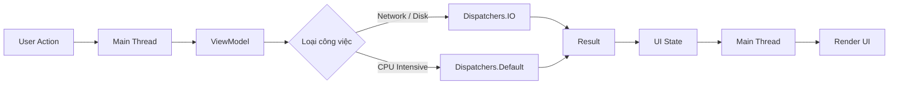
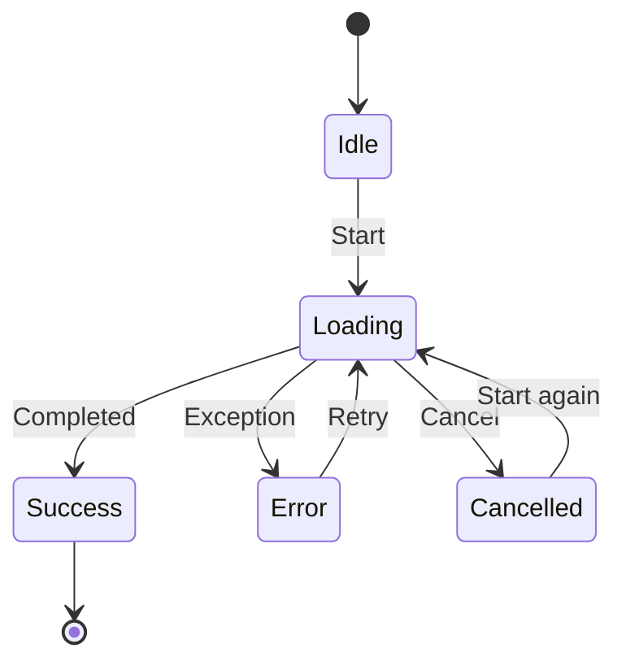

[](https://developer.android.com/courses/extras/multithreading?utm_source=chatgpt.com)

# 001 - Main Thread

**Học phần:** 04 - Network, Async and Services
**Module:** Module 08 - Asynchronism
**Nhóm nội dung:** Threading Basics
**Nguồn roadmap:** Asynchronism / Threading Basics
**Loại bài:** `async`
**Thứ tự trong module:** 001
**Thời lượng gợi ý:** 34 phút

---

## 1. Tóm tắt

Trong Android, **Main Thread** là luồng thực thi chính của ứng dụng, chịu trách nhiệm xử lý các sự kiện giao diện, callback lifecycle và phần lớn thao tác liên quan đến UI. Vì vậy, Main Thread còn thường được gọi là **UI Thread**. ([Android Developers][1])

Nếu thực hiện những công việc tốn thời gian như:

* gọi network;
* đọc/ghi file;
* truy vấn dữ liệu nặng;
* giải nén;
* xử lý ảnh;
* parse dữ liệu lớn;
* thuật toán CPU-intensive;

trực tiếp trên Main Thread, UI có thể bị **lag, jank, freeze**, thậm chí dẫn đến **ANR — Application Not Responding**. Android khuyến nghị chuyển các tác vụ blocking hoặc long-running khỏi Main Thread. ([Android Developers][2])

> **Ý tưởng quan trọng nhất của bài:**
> Main Thread nên chủ yếu **phản hồi người dùng và cập nhật UI**, không phải nơi thực hiện các công việc nặng.

---

# 2. Main Thread nằm ở đâu trong Android?

Khi Android khởi chạy process của ứng dụng, hệ thống tạo một luồng thực thi chính gọi là **main thread**. Luồng này dispatch các sự kiện tới UI và là nơi phần lớn tương tác với Android UI toolkit xảy ra. ([Android Developers][1])

Có thể hình dung:

```text
Android App Process
│
├── Main Thread / UI Thread
│   ├── Activity lifecycle
│   ├── Fragment lifecycle
│   ├── Compose / View UI
│   ├── Button click
│   ├── Touch event
│   ├── Update UI state
│   └── Render-related work
│
├── Worker Thread
│   └── Công việc nền
│
├── I/O Thread
│   └── File / Network / Database
│
└── Other Threads
    └── Library / Runtime / Framework
```

Main Thread là **một luồng**, trong khi ứng dụng có thể có nhiều worker thread khác. ([Android Developers][3])

---

# 3. Vì sao Main Thread quan trọng?

Main Thread phải liên tục xử lý:

```text
Touch
 ↓
Event
 ↓
App logic nhỏ
 ↓
Update state
 ↓
Layout / Draw
 ↓
Frame tiếp theo
```

Nếu một tác vụ nặng chen vào:

```text
Touch
 ↓
Main Thread
 ↓
████████████████████████████
Đọc file 3 giây
████████████████████████████
 ↓
UI mới được tiếp tục
```

trong khoảng thời gian đó người dùng có thể thấy:

```text
App không phản hồi
        ↓
Không scroll được
        ↓
Không bấm nút được
        ↓
Animation đứng
        ↓
UI freeze
```

Ở màn hình 60 Hz, ứng dụng chỉ có khoảng **16 ms cho một frame** nếu muốn duy trì khoảng 60 FPS; vì vậy các tác vụ blocking dài trên UI thread rất dễ tạo ra frame chậm hoặc jank.

---

# 4. Main Thread thường làm gì?

## Nên làm trên Main Thread

Các công việc thường phù hợp:

| Công việc                   | Main Thread |
| --------------------------- | ----------- |
| Cập nhật UI                 | ✅           |
| Hiển thị loading            | ✅           |
| Xử lý click nhanh           | ✅           |
| Cập nhật Compose state      | ✅           |
| Điều hướng màn hình         | ✅           |
| Callback lifecycle          | ✅           |
| Thay đổi View               | ✅           |
| Công việc tính toán rất nhỏ | ✅           |

Ví dụ:

```kotlin
Button(
    onClick = {
        isLoading = true
    }
) {
    Text("Load")
}
```

---

## Không nên blocking Main Thread

| Công việc           | Nên chuyển khỏi Main Thread |
| ------------------- | --------------------------- |
| Network blocking    | ✅                           |
| Đọc file lớn        | ✅                           |
| Ghi file            | ✅                           |
| Xử lý ảnh lớn       | ✅                           |
| Parse JSON cực lớn  | ✅                           |
| Compress / unzip    | ✅                           |
| Thuật toán CPU nặng | ✅                           |
| Database blocking   | ✅                           |

Android khuyến nghị thiết kế các API tầng data/domain theo hướng **main-safe**: hàm có thể được gọi từ Main Thread nhưng tự chuyển phần blocking sang dispatcher thích hợp. ([Android Developers][4])

---

# 5. Ví dụ sai: chặn Main Thread

Giả sử người dùng nhấn nút:

```kotlin
fun loadData() {
    Thread.sleep(5000)

    _uiState.value = UiState.Success("Completed")
}
```

Nếu `loadData()` được chạy từ UI/Main Thread:

```text
User click
   ↓
Main Thread
   ↓
Thread.sleep(5000)
   ↓
████ UI bị block ████
   ↓
Success
```

`Thread.sleep()` không phải asynchronous operation. Nó **block thread hiện tại**.

Vì thế UI không thể tiếp tục xử lý event trong thời gian đó.

Nếu Main Thread bị block đủ lâu, Android có thể kích hoạt ANR. Với input-dispatch ANR, khoảng timeout thường vào cỡ vài giây; tài liệu Android lưu ý giá trị chính xác có thể thay đổi tùy loại ANR và OEM. ([Android Developers][2])

---

# 6. Giải pháp hiện đại: Kotlin Coroutines

Android hiện cung cấp hỗ trợ mạnh cho **Kotlin Coroutines** để thực hiện asynchronous work mà không block Main Thread. Coroutine dùng `Dispatcher` để quyết định code được thực thi trong context/thread phù hợp. ([Android Developers][4])

Ba dispatcher đặc biệt quan trọng:

| Dispatcher            | Dùng cho                 |
| --------------------- | ------------------------ |
| `Dispatchers.Main`    | UI                       |
| `Dispatchers.IO`      | Network, disk, file, I/O |
| `Dispatchers.Default` | CPU-intensive            |

([Android Developers][4])

---

# 7. Dispatchers.Main

`Dispatchers.Main` dùng cho những thao tác liên quan đến UI hoặc công việc nhanh. ([Android Developers][4])

```kotlin
viewModelScope.launch {
    _uiState.value = UiState.Loading
}
```

Luồng logic:

```text
Main Thread
   │
   ├── Loading
   ├── Button click
   ├── Navigation
   └── UI State
```

Không nên đặt một phép tính lớn ngay trong coroutine chỉ vì nó là coroutine:

```kotlin
viewModelScope.launch {
    // Vẫn có thể đang chạy trên Main!
    calculateMillionItems()
}
```

**Coroutine ≠ tự động chạy background thread.**

Dispatcher mới quyết định nơi code thực thi. ([Android Developers][4])

---

# 8. Dispatchers.IO

`Dispatchers.IO` được thiết kế cho những công việc I/O như network hoặc disk. ([Android Developers][4])

Ví dụ:

```kotlin
suspend fun loadFile(): String {
    return withContext(Dispatchers.IO) {
        File("data.txt").readText()
    }
}
```

Luồng:

```text
Main Thread
     │
     │ call loadFile()
     ▼
Dispatchers.IO
     │
     │ đọc file
     │
     ▼
Result
     │
     ▼
Main Thread
     │
     ▼
Update UI
```

`withContext()` cho phép hàm suspend chuyển phần công việc sang dispatcher khác và tiếp tục khi kết quả sẵn sàng. ([Android Developers][4])

---

# 9. Dispatchers.Default

`Dispatchers.Default` phù hợp với công việc **CPU-bound**, ví dụ:

```text
Sorting lớn
Image processing
Encryption
Heavy JSON transformation
Machine-learning preprocessing
Complex calculations
```

Android phân biệt `Default` cho CPU-intensive work và `IO` cho blocking I/O. ([Android Developers][4])

Ví dụ:

```kotlin
suspend fun calculateScores(
    values: List<Int>
): List<Int> {
    return withContext(Dispatchers.Default) {
        values
            .map { expensiveCalculation(it) }
            .sortedDescending()
    }
}
```

---

# 10. Mô hình Main Thread đúng

Một luồng xử lý phổ biến:



Điểm quan trọng:

```text
UI
 ↓
ViewModel
 ↓
Background work
 ↓
Result
 ↓
State
 ↓
UI
```

thay vì:

```text
UI
 ↓
Main Thread
 ↓
Heavy work
 ↓
UI freeze
```

---

# 11. Ví dụ kiến trúc Android thực tế

Giả sử ứng dụng tải danh sách sản phẩm:

```text
ProductScreen
      │
      ▼
ProductViewModel
      │
      ▼
ProductRepository
      │
      ▼
API / Database
```

Repository chịu trách nhiệm bảo đảm API của nó **main-safe**.

```kotlin
class ProductRepository(
    private val api: ProductApi,
    private val ioDispatcher: CoroutineDispatcher = Dispatchers.IO
) {

    suspend fun getProducts(): List<Product> =
        withContext(ioDispatcher) {

            api.getProducts()
                .map { dto ->
                    Product(
                        id = dto.id,
                        name = dto.name
                    )
                }
        }
}
```

Ý tưởng “lower layer phải main-safe” cũng phù hợp với hướng dẫn coroutine chính thức của Android. ([Android Developers][5])

---

# 12. ViewModel + Main Thread

`viewModelScope` là `CoroutineScope` gắn với `ViewModel`, cho phép coroutine được quản lý theo lifetime của ViewModel. Android cung cấp các scope lifecycle-aware như `viewModelScope` để tránh việc coroutine sống không kiểm soát so với lifecycle của UI. ([Android Developers][6])

Ví dụ:

```kotlin
sealed interface ProductUiState {

    data object Loading : ProductUiState

    data class Success(
        val products: List<Product>
    ) : ProductUiState

    data class Error(
        val message: String
    ) : ProductUiState
}
```

ViewModel:

```kotlin
class ProductViewModel(
    private val repository: ProductRepository
) : ViewModel() {

    private val _uiState =
        MutableStateFlow<ProductUiState>(
            ProductUiState.Loading
        )

    val uiState = _uiState.asStateFlow()

    fun loadProducts() {

        viewModelScope.launch {

            _uiState.value =
                ProductUiState.Loading

            try {

                val products =
                    repository.getProducts()

                _uiState.value =
                    ProductUiState.Success(
                        products
                    )

            } catch (e: Exception) {

                _uiState.value =
                    ProductUiState.Error(
                        e.message ?: "Unknown error"
                    )
            }
        }
    }
}
```

---

# 13. Compose UI

```kotlin
@Composable
fun ProductScreen(
    viewModel: ProductViewModel
) {

    val uiState by
        viewModel.uiState.collectAsState()

    when (val state = uiState) {

        ProductUiState.Loading -> {
            CircularProgressIndicator()
        }

        is ProductUiState.Success -> {

            LazyColumn {

                items(state.products) { product ->

                    Text(product.name)
                }
            }
        }

        is ProductUiState.Error -> {

            Text(
                text = state.message
            )
        }
    }
}
```

Luồng hoàn chỉnh:

```text
User
 │
 │ mở ProductScreen
 ▼
ViewModel
 │
 │ launch coroutine
 ▼
Repository
 │
 │ Dispatchers.IO
 ▼
Network
 │
 ▼
Product DTO
 │
 ▼
Product Model
 │
 ▼
StateFlow
 │
 ▼
Compose
 │
 ▼
Render UI
```

---

# 14. Main Thread không đồng nghĩa với Coroutine

Đây là nhầm lẫn rất phổ biến.

## Sai suy nghĩ

```text
Coroutine
   =
Background Thread
```

## Đúng

```text
Coroutine
   │
   ▼
Dispatcher
   │
   ├── Main
   ├── IO
   └── Default
```

Một coroutine hoàn toàn có thể chạy trên Main Thread:

```kotlin
viewModelScope.launch {

    // Có thể đang chạy trên Main
}
```

Hoặc:

```kotlin
CoroutineScope(
    Dispatchers.Main
).launch {

}
```

Do đó, việc viết `launch {}` **không tự động giải quyết Main Thread blocking**. ([Android Developers][4])

---

# 15. Suspend cũng không có nghĩa là background

Một nhầm lẫn khác:

```kotlin
suspend fun calculate() {
    heavyCalculation()
}
```

Không có gì đảm bảo `heavyCalculation()` tự chuyển sang background.

Cần thiết kế hàm main-safe:

```kotlin
suspend fun calculate() =
    withContext(Dispatchers.Default) {

        heavyCalculation()
    }
```

Android khuyến nghị các hàm suspend ở data/business layer nên tự chịu trách nhiệm chuyển các blocking operation khỏi Main Thread. ([Android Developers][5])

---

# 16. Cancellation

Một ưu điểm lớn của coroutine là hỗ trợ **structured concurrency và cancellation**.

Ví dụ:

```kotlin
viewModelScope.launch {

    repository.loadProducts()
}
```

Khi `ViewModel` bị clear, những coroutine thuộc `viewModelScope` có thể được hủy theo scope của nó. ([Android Developers][7])

Mô hình:

```text
ViewModel
   │
   ├── Coroutine A
   ├── Coroutine B
   └── Coroutine C
           │
ViewModel cleared
           │
           ▼
    Scope cancelled
```

Điều này tốt hơn việc tự tạo thread:

```kotlin
Thread {
    // Không tự hiểu lifecycle Activity/ViewModel
}.start()
```

---

# 17. Rotate màn hình thì sao?

Không nên gắn long-running data work trực tiếp với `Activity` nếu công việc cần tồn tại qua configuration change.

Kiến trúc thường nên là:

```text
Activity / Compose
       │
       ▼
   ViewModel
       │
       ▼
viewModelScope
       │
       ▼
 Repository
```

`ViewModel` được thiết kế để quản lý dữ liệu UI qua configuration changes, trong khi lifecycle-aware coroutine scopes giúp quản lý thời gian sống của coroutine. ([Android Developers][7])

---

# 18. Main Thread và Service

Một lỗi Android rất phổ biến là nghĩ:

```text
Service
   =
Background Thread
```

**Không đúng.**

Theo Android Developers, một `Service` mặc định chạy trên **main thread của process chứa nó**; Service tự nó không tạo worker thread riêng. Nếu Service thực hiện blocking operation, developer vẫn phải chuyển công việc sang thread/coroutine thích hợp. ([Android Developers][8])

```text
App Process
│
├── Main Thread
│   ├── Activity
│   ├── UI
│   └── Service
│
└── Worker Threads
```

Đây là kiến thức rất dễ xuất hiện trong phỏng vấn Android.

---

# 19. Main Thread và ANR

## ANR là gì?

ANR = **Application Not Responding**.

ANR có thể xảy ra khi ứng dụng không thể xử lý yêu cầu của hệ thống/người dùng trong khoảng thời gian cho phép, trong đó nguyên nhân rất phổ biến là UI thread bị block quá lâu. ([Android Developers][2])

Ví dụ:

```text
Main Thread
    │
    ▼
Network blocking
    │
    ├── 1s
    ├── 2s
    ├── 3s
    ├── ...
    ▼
Không phản hồi input
    │
    ▼
ANR
```

Android đặc biệt khuyến cáo không thực hiện blocking I/O như network access trên UI thread. ([Android Developers][9])

---

# 20. UI Jank khác ANR như thế nào?

Hai khái niệm không hoàn toàn giống nhau.

| Hiện tượng | Mô tả                                |
| ---------- | ------------------------------------ |
| Jank       | Frame render trễ                     |
| Lag        | Phản hồi chậm                        |
| Freeze     | UI gần như đứng                      |
| ANR        | Hệ thống xác định app không phản hồi |

Một app có thể:

```text
Jank
```

mà chưa tới:

```text
ANR
```

Ví dụ Main Thread liên tục có những đoạn xử lý hơi dài:

```text
Frame 1 ── 12ms
Frame 2 ───────── 35ms  ← jank
Frame 3 ── 13ms
Frame 4 ─────────────── 70ms ← jank
```

Android Studio Profiler/System Trace có thể giúp xem thread scheduling và các frame chậm để tìm nguyên nhân jank. ([Android Developers][10])

---

# 21. Debug Main Thread

## Log thread hiện tại

Một kỹ thuật rất đơn giản:

```kotlin
Log.d(
    "ThreadDebug",
    Thread.currentThread().name
)
```

Ví dụ output:

```text
main
```

hoặc:

```text
DefaultDispatcher-worker-1
```

Có thể log nhiều điểm:

```kotlin
Log.d(
    "ThreadDebug",
    "Before: ${Thread.currentThread().name}"
)

withContext(Dispatchers.IO) {

    Log.d(
        "ThreadDebug",
        "IO: ${Thread.currentThread().name}"
    )
}

Log.d(
    "ThreadDebug",
    "After: ${Thread.currentThread().name}"
)
```

---

# 22. Debug bằng Android Studio Profiler

Khi nghi ngờ Main Thread bị nghẽn, có thể dùng:

```text
Android Studio
      │
      ▼
Profiler
      │
      ▼
System Trace
      │
      ├── CPU
      ├── Threads
      ├── Main Thread
      ├── RenderThread
      └── Janky Frames
```

System Trace cho phép quan sát cách process/thread được schedule và kiểm tra thời gian render frame; Android Studio cũng có hỗ trợ phát hiện janky frames. ([Android Developers][10])

---

# 23. Testing coroutine

Code coroutine nên được thiết kế để dispatcher có thể inject.

## Không tối ưu cho test

```kotlin
class Repository {

    suspend fun load() =
        withContext(Dispatchers.IO) {

            // ...
        }
}
```

## Dễ test hơn

```kotlin
class Repository(
    private val ioDispatcher: CoroutineDispatcher
) {

    suspend fun load() =
        withContext(ioDispatcher) {

            // ...
        }
}
```

Production:

```kotlin
Repository(
    Dispatchers.IO
)
```

Test có thể truyền test dispatcher.

Android có thư viện `kotlinx-coroutines-test` dành cho unit test coroutine và suspend functions. ([Android Developers][11])

---

# 24. Ví dụ thực hành hoàn chỉnh

## Yêu cầu

Tạo màn hình:

```text
┌─────────────────────────┐
│      Heavy Task         │
│                         │
│   [ Start Task ]        │
│                         │
│   Status: Ready         │
│                         │
└─────────────────────────┘
```

Khi nhấn:

```text
Start Task
    │
    ▼
Loading
    │
    ▼
Background calculation
    │
    ▼
Success
```

UI vẫn phải scroll/click/animate bình thường.

---

## ViewModel

```kotlin
class MainThreadViewModel : ViewModel() {

    private val _state =
        MutableStateFlow("Ready")

    val state =
        _state.asStateFlow()

    fun startTask() {

        viewModelScope.launch {

            _state.value = "Loading"

            val result =
                withContext(
                    Dispatchers.Default
                ) {
                    longRunningCalculation()
                }

            _state.value =
                "Completed: $result"
        }
    }

    private fun longRunningCalculation(): Long {

        var result = 0L

        repeat(50_000_000) {

            result += it
        }

        return result
    }
}
```

---

# 25. Thêm cancellation

Có thể giữ `Job`:

```kotlin
private var taskJob: Job? = null
```

Start:

```kotlin
fun startTask() {

    taskJob =
        viewModelScope.launch {

            _state.value = "Loading"

            val result =
                withContext(
                    Dispatchers.Default
                ) {
                    longRunningCalculation()
                }

            _state.value =
                "Completed: $result"
        }
}
```

Cancel:

```kotlin
fun cancelTask() {

    taskJob?.cancel()

    _state.value = "Cancelled"
}
```

UI:

```text
┌────────────────────────────┐
│ Heavy Task                 │
│                            │
│ [ Start ]    [ Cancel ]    │
│                            │
│ Status: Loading...         │
└────────────────────────────┘
```

---

# 26. State transition

Nên log rõ state:

```text
Idle
 │
 ▼
Loading
 │
 ├──────────────┐
 │              │
 ▼              ▼
Success        Error
 │
 │
 └──────────────┐
                ▼
               Retry
```

Hoặc khi có cancellation:



---

# 27. Main Thread trong kiến trúc Android

Main Thread không nên được xem như một phần riêng biệt mà phải liên hệ với toàn bộ architecture:

```text
┌──────────────────────┐
│      UI Layer        │
│   Main Thread        │
└──────────┬───────────┘
           │
           ▼
┌──────────────────────┐
│      ViewModel       │
│     Coroutine        │
└──────────┬───────────┘
           │
           ▼
┌──────────────────────┐
│    Domain Layer      │
│      UseCase         │
└──────────┬───────────┘
           │
           ▼
┌──────────────────────┐
│     Data Layer       │
│     Repository       │
└──────────┬───────────┘
           │
      ┌────┴─────┐
      ▼          ▼
 Dispatchers.IO  Dispatchers.Default
      │          │
 Network/DB    CPU work
```

Mục tiêu:

> **UI layer không cần biết chi tiết công việc chạy bằng thread nào; lower layer phải cung cấp API an toàn để UI gọi.** ([Android Developers][5])

---

# 28. Những lỗi phổ biến

## ❌ 1. Network trực tiếp trên Main Thread

```kotlin
fun onClick() {
    performBlockingNetworkRequest()
}
```

### Nên

```kotlin
viewModelScope.launch {
    repository.loadData()
}
```

với repository tự bảo đảm main-safety.

---

## ❌ 2. Nghĩ `launch` = background thread

```kotlin
viewModelScope.launch {

    heavyCpuWork()
}
```

### Nên

```kotlin
viewModelScope.launch {

    val result =
        withContext(
            Dispatchers.Default
        ) {

            heavyCpuWork()
        }
}
```

---

## ❌ 3. Dùng `Dispatchers.IO` cho mọi thứ

Không nên:

```text
Network        → IO
File           → IO
Database I/O   → IO

CPU-heavy      → Default

UI             → Main
```

([Android Developers][4])

---

## ❌ 4. Tự tạo Thread khắp nơi

```kotlin
Thread {
    loadSomething()
}.start()
```

Cách này khiến việc quản lý:

```text
Lifecycle
Cancellation
Errors
Testing
```

khó hơn.

Với Android Kotlin hiện đại, coroutine và lifecycle-aware scopes thường là lựa chọn phù hợp hơn cho asynchronous application logic. ([Android Developers][7])

---

## ❌ 5. Nghĩ Service tự chạy background

```text
Service ≠ Worker Thread
```

Service mặc định vẫn chạy trên main thread của process. ([Android Developers][8])

---

# 29. Cách suy nghĩ khi gặp một task

Đặt câu hỏi:

```text
Task này làm gì?
      │
      ▼
Có liên quan UI?
      │
 ┌────┴─────┐
Yes         No
 │           │
Main      Blocking?
             │
        ┌────┴────┐
        Yes       No
         │
     I/O hay CPU?
       │       │
       ▼       ▼
      IO     Default
```

Tóm gọn:

```text
UI
→ Main

Network / Disk
→ IO

CPU-heavy
→ Default
```

---

# 30. Lifecycle checklist

Khi tạo asynchronous task, nên hỏi:

### Task thuộc ai?

```text
Screen?
→ lifecycleScope

ViewModel?
→ viewModelScope

Persistent background work?
→ cân nhắc WorkManager
```

Lifecycle-aware coroutine scopes của Android giúp giới hạn coroutine theo lifetime hợp lý của component. ([Android Developers][7])

---

# 31. Production checklist

Trước khi release, kiểm tra:

* [ ] Có network blocking trên Main Thread không?
* [ ] Có disk I/O trực tiếp trên Main Thread không?
* [ ] Có CPU-intensive loop trên Main Thread không?
* [ ] Repository có main-safe không?
* [ ] `Dispatchers.IO` và `Default` có dùng đúng mục đích không?
* [ ] Coroutine có lifecycle phù hợp không?
* [ ] Task có hỗ trợ cancellation khi cần không?
* [ ] Exception có được xử lý không?
* [ ] Loading / Success / Error có được model rõ ràng không?
* [ ] Có kiểm tra UI jank bằng Profiler/System Trace không?
* [ ] Có unit test coroutine không?
* [ ] Rotate màn hình có làm mất state không?
* [ ] Background/foreground có tạo duplicate task không?
* [ ] Có nguy cơ ANR không?

---

# 32. Bài thực hành

## Mục tiêu

Tạo app có một tác vụ CPU mất vài giây.

### Bước 1 — Phiên bản lỗi

Chạy task trên Main Thread:

```kotlin
Button(
    onClick = {

        Thread.sleep(3000)

        result = "Done"
    }
)
```

Quan sát:

```text
Button
 ↓
UI freeze
 ↓
3 giây
 ↓
Done
```

---

### Bước 2 — Chuyển khỏi Main Thread

```kotlin
viewModelScope.launch {

    val result =
        withContext(
            Dispatchers.Default
        ) {

            heavyTask()
        }

    _state.value =
        UiState.Success(result)
}
```

Quan sát:

```text
Button
 ↓
Loading
 ↓
UI vẫn responsive
 ↓
Background work
 ↓
Success
```

---

### Bước 3 — Thêm Cancel

```text
Loading
   │
   ├── Complete → Success
   │
   └── Cancel → Cancelled
```

---

### Bước 4 — Log thread

Log:

```kotlin
Thread.currentThread().name
```

Kết quả mong đợi về mặt ý tưởng:

```text
UI state      → main

Heavy task    → worker/default dispatcher
```

---

# 33. Bài tập

## Yêu cầu

Xây dựng một màn hình có:

```text
[ Start Heavy Task ]

Loading...

[ Cancel ]
```

Task phải:

1. Không block Main Thread.
2. Sử dụng coroutine.
3. CPU-heavy work sử dụng `Dispatchers.Default`.
4. Hiển thị `Loading`.
5. Hiển thị `Success`.
6. Xử lý `Error`.
7. Có `Cancel`.
8. Log thread hiện tại.
9. Không mất UI state đơn giản khi rotate.
10. Có ít nhất một unit test.

---

# 34. Artifact đưa vào portfolio

Có thể tạo project:

```text
MainThreadDemo/
│
├── ui/
│   └── MainThreadScreen.kt
│
├── viewmodel/
│   └── MainThreadViewModel.kt
│
├── data/
│   └── HeavyTaskRepository.kt
│
├── test/
│   └── MainThreadViewModelTest.kt
│
└── README.md
```

README nên có:

```text
Main Thread Demo
│
├── Problem
│   └── Blocking UI
│
├── Solution
│   └── Kotlin Coroutine
│
├── Dispatcher
│   ├── Main
│   ├── IO
│   └── Default
│
├── Cancellation
│
├── UI State
│
├── Testing
│
└── Profiler Screenshot
```

Một artifact nhỏ như vậy thể hiện rõ rằng bạn không chỉ biết cú pháp coroutine mà còn hiểu **threading, lifecycle, UI state, cancellation và performance**.

---

# 35. Câu hỏi phỏng vấn thường gặp

### 1. Main Thread là gì?

Main Thread là luồng chính của Android app, chịu trách nhiệm xử lý các event và phần lớn thao tác UI. ([Android Developers][1])

### 2. Vì sao không được block Main Thread?

Vì UI không thể xử lý input/render kịp thời, dẫn đến lag, jank, freeze và có thể ANR. ([Android Developers][2])

### 3. Coroutine có luôn chạy background không?

**Không.** Coroutine chạy theo dispatcher được sử dụng. `Dispatchers.Main` vẫn là Main Thread. ([Android Developers][4])

### 4. Network nên dùng dispatcher nào?

Blocking network/disk I/O phù hợp với:

```kotlin
Dispatchers.IO
```

([Android Developers][4])

### 5. CPU-heavy work dùng gì?

```kotlin
Dispatchers.Default
```

([Android Developers][4])

### 6. Service có tự chạy background thread không?

**Không.** Service mặc định chạy trên main thread của process chứa nó. ([Android Developers][8])

### 7. `suspend` có nghĩa là background thread không?

Không. Hàm `suspend` có khả năng suspend nhưng dispatcher/context mới quyết định nơi phần code được thực thi. ([Android Developers][4])

---

# 36. Checklist hoàn thành

* [ ] Giải thích được Main Thread bằng ngôn ngữ của mình.
* [ ] Phân biệt Main Thread và worker thread.
* [ ] Hiểu tại sao blocking Main Thread gây lag.
* [ ] Giải thích được ANR.
* [ ] Phân biệt `Dispatchers.Main`, `IO`, `Default`.
* [ ] Hiểu coroutine không đồng nghĩa background thread.
* [ ] Hiểu `suspend` không đồng nghĩa background thread.
* [ ] Biết dùng `withContext()`.
* [ ] Biết dùng `viewModelScope`.
* [ ] Hiểu cancellation cơ bản.
* [ ] Biết Service không tự tạo background thread.
* [ ] Biết log thread để debug.
* [ ] Biết sử dụng Android Studio Profiler/System Trace.
* [ ] Có demo chuyển heavy work khỏi Main Thread.
* [ ] Có README hoặc screenshot cho portfolio.

---

# 37. Ghi nhớ nhanh

```text
              ANDROID THREADING

                  Main Thread
                      │
          ┌───────────┼────────────┐
          │           │            │
         UI        Events      Lifecycle
          │
          │ Không block
          ▼
       Coroutine
          │
      Dispatcher
     ┌────┴─────┐
     │          │
     ▼          ▼
    IO        Default
     │          │
 Network      CPU-heavy
 Disk         Processing
 DB I/O       Calculation
     │          │
     └────┬─────┘
          ▼
        Result
          │
          ▼
      UI State
          │
          ▼
     Main Thread
```

## Công thức nhớ

```text
UI                  → Main
Network / Disk      → IO
CPU-intensive       → Default
Long-running work   → Không block Main
```

Đây là nền tảng để học các bài tiếp theo như **Thread, Handler/Looper, Executor, Kotlin Coroutines, CoroutineScope, Dispatcher, Job, cancellation, async/await, Flow và WorkManager**. ([Android Developers][3])

[1]: https://developer.android.com/guide/components/processes-and-threads?utm_source=chatgpt.com "Processes and threads overview | App quality"
[2]: https://developer.android.com/topic/performance/vitals/anr?utm_source=chatgpt.com "ANRs | App quality"
[3]: https://developer.android.com/topic/performance/threads?utm_source=chatgpt.com "Better performance through threading | App quality"
[4]: https://developer.android.com/kotlin/coroutines/coroutines-adv?utm_source=chatgpt.com "Improve app performance with Kotlin coroutines"
[5]: https://developer.android.com/kotlin/coroutines/coroutines-best-practices?utm_source=chatgpt.com "Best practices for coroutines in Android | Kotlin"
[6]: https://developer.android.com/kotlin/coroutines?utm_source=chatgpt.com "Kotlin coroutines on Android"
[7]: https://developer.android.com/topic/libraries/architecture/coroutines?utm_source=chatgpt.com "Use Kotlin coroutines with lifecycle-aware components"
[8]: https://developer.android.com/develop/background-work/services?utm_source=chatgpt.com "Services overview | Background work"
[9]: https://developer.android.com/topic/performance/anrs/keep-your-app-responsive?utm_source=chatgpt.com "Keep your app responsive | App quality"
[10]: https://developer.android.com/studio/profile/jank-detection?utm_source=chatgpt.com "UI jank detection | Android Studio"
[11]: https://developer.android.com/kotlin/coroutines/test?utm_source=chatgpt.com "Testing Kotlin coroutines on Android"

---

# Bài luyện tập

## Mục tiêu


## Đề bài


## Yêu cầu hoàn thành

- [ ] 
- [ ] 
- [ ] 

## Kết quả / lời giải


## Ghi chú
