[](https://subscription.packtpub.com/book/mobile/9781801816243/2/ch02lvl1sec04/understanding-asynchronous-programming?utm_source=chatgpt.com)

# 003 - ANR — Application Not Responding trong Android

**Học phần:** 04 - Network, Async and Services
**Module:** Module 08 - Asynchronism
**Nhóm nội dung:** Threading Basics
**Nguồn roadmap:** Asynchronism / Threading Basics
**Loại bài:** Async
**Thứ tự trong module:** 003
**Thời lượng gợi ý:** 34 phút

---

## 1. Tóm tắt

**ANR — Application Not Responding** xảy ra khi Android nhận thấy ứng dụng không thể phản hồi trong khoảng thời gian cho phép, thường vì **main thread/UI thread đang bị block**. Khi ứng dụng ở foreground, hệ thống có thể hiển thị hộp thoại cho phép người dùng chờ hoặc đóng ứng dụng. ([Android Developers][1])

ANR khác crash:

* **Crash:** chương trình gặp lỗi và kết thúc.
* **ANR:** process có thể vẫn đang chạy nhưng main thread không thể xử lý input, lifecycle callback hoặc render UI kịp thời.

Main thread chịu trách nhiệm xử lý các callback UI, input và công việc liên quan đến giao diện. Nếu queue của nó chứa công việc quá dài hoặc quá nhiều, UI sẽ lag, freeze và trong trường hợp nghiêm trọng có thể dẫn đến ANR. ([Android Developers][2])

> Ý tưởng quan trọng nhất của bài:
>
> **Không phải cứ "app chưa crash" là app đang hoạt động tốt. Nếu main thread không phản hồi, người dùng vẫn xem ứng dụng như bị hỏng.**

---

## 2. Mục tiêu học tập

Sau bài này, bạn nên:

* Giải thích được ANR là gì.
* Phân biệt **ANR**, **crash**, **jank** và tác vụ background.
* Hiểu tại sao main thread bị block.
* Nhận biết những nguyên nhân ANR phổ biến:

  * I/O trên main thread.
  * tính toán CPU nặng.
  * lock contention.
  * deadlock.
  * Binder call đồng bộ quá lâu.
  * `BroadcastReceiver` hoặc `Service` chạy quá lâu.
* Biết chuyển công việc sang `Dispatchers.IO` hoặc `Dispatchers.Default`.
* Hiểu cancellation của coroutine.
* Biết khi nào dùng coroutine và khi nào dùng WorkManager.
* Biết sử dụng `StrictMode`, traces và Android vitals để điều tra ANR.
* Biến bài học thành một demo có thể đưa vào portfolio.

---

# 3. ANR là gì?

ANR là viết tắt của:

```text
Application Not Responding
```

Nó có thể hiểu đơn giản là:

> Android đã gửi công việc hoặc sự kiện cho ứng dụng, nhưng ứng dụng không phản hồi trong thời gian mà hệ thống cho phép.

Một trường hợp rất điển hình là Android gửi một sự kiện chạm vào màn hình nhưng main thread đang bận chạy một tác vụ dài nên không thể xử lý sự kiện đó.

Theo Android Developers, một **input dispatch ANR** có thể xảy ra nếu ứng dụng không phản hồi input như touch hoặc key press trong khoảng **5 giây**. Android cũng có những loại ANR khác liên quan đến Service, BroadcastReceiver và JobScheduler với các timeout riêng. ([Android Developers][1])

---

# 4. Main Thread liên quan gì đến ANR?

Khi process Android được tạo, Android cũng tạo một thread chính gọi là:

```text
Main Thread
      =
UI Thread
```

Main thread nhận các công việc từ một queue và lần lượt xử lý chúng. Nó chịu trách nhiệm cho nhiều tác vụ như input, lifecycle callback và cập nhật giao diện. ([Android Developers][2])

Có thể hình dung:

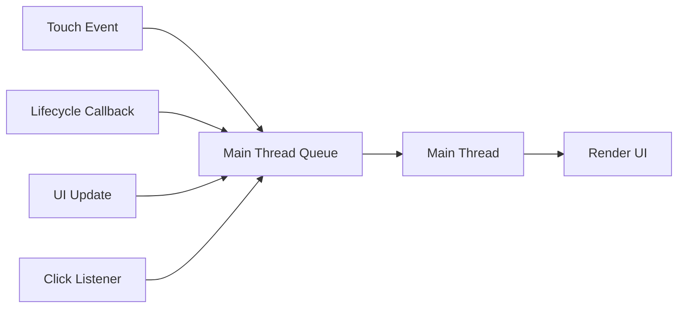

Trong tình huống bình thường:

```text
Touch
 ↓
Main Thread
 ↓
onClick()
 ↓
Update state
 ↓
Draw UI
```

Main thread nhanh chóng quay lại xử lý sự kiện tiếp theo.

---

# 5. Điều gì xảy ra khi main thread bị block?

Ví dụ:

```kotlin
button.setOnClickListener {
    performVeryHeavyCalculation()
}
```

`setOnClickListener` chạy trên main thread.

Nếu:

```text
performVeryHeavyCalculation()
```

chạy quá lâu:

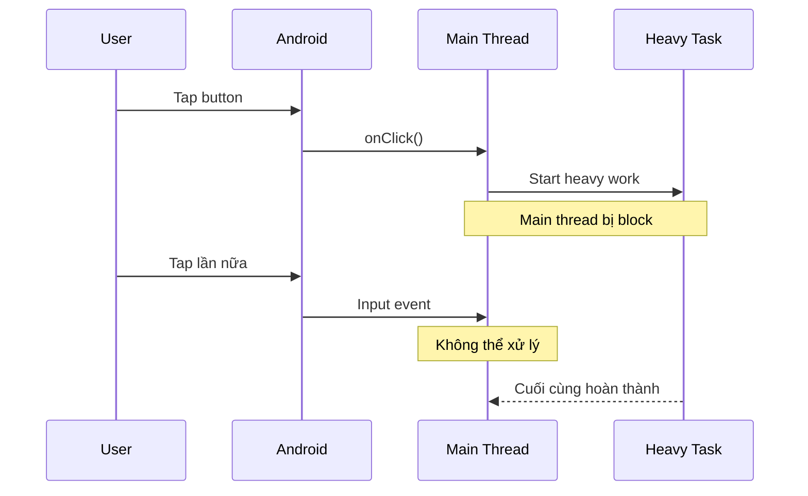

Trong thời gian đó:

```text
Main Thread
    │
    ├── Không xử lý touch
    ├── Không xử lý callback mới
    ├── Không cập nhật UI
    └── Không render bình thường
```

Nếu tình trạng đủ nghiêm trọng, Android có thể xác định ứng dụng là **not responding**. ([Android Developers][1])

---

# 6. ANR, jank và crash khác nhau như thế nào?

| Hiện tượng | Ý nghĩa                                 |
| ---------- | --------------------------------------- |
| Jank       | Frame render chậm, animation không mượt |
| Freeze     | UI đứng trong một khoảng thời gian      |
| ANR        | Hệ thống xác định app không phản hồi    |
| Crash      | Process/app bị kết thúc do lỗi          |

Không nên suy nghĩ theo kiểu:

```text
ANR xảy ra đột ngột
```

Thực tế có thể là một chuỗi:

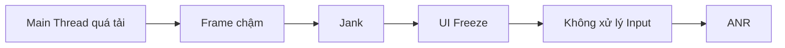

Main thread bị quá tải cũng có thể gây jank từ rất sớm trước khi đạt tới mức nghiêm trọng của ANR. ([Android Developers][2])

---

# 7. Các điều kiện ANR quan trọng

ANR không chỉ có một loại.

Android hiện liệt kê nhiều trường hợp, bao gồm: ([Android Developers][1])

### 7.1 Input dispatching timeout

Ví dụ:

```text
User tap screen
      ↓
Android gửi input
      ↓
Main thread đang block
      ↓
Không phản hồi trong ~5 s
      ↓
ANR
```

Đây là loại ANR dễ gặp nhất khi học threading.

---

### 7.2 Service execution

Một `Service` cũng không được phép block callback lifecycle của nó quá lâu.

Ví dụ nguy hiểm:

```kotlin
override fun onStartCommand(
    intent: Intent?,
    flags: Int,
    startId: Int
): Int {

    performHeavyCalculation()

    return START_NOT_STICKY
}
```

`Service` **không đồng nghĩa với background thread**.

Đây là một nhầm lẫn quan trọng cần tránh.

---

### 7.3 `startForegroundService()`

Nếu ứng dụng dùng:

```kotlin
startForegroundService(...)
```

nhưng service không chuyển sang foreground đúng thời hạn bằng `startForeground()`, Android cũng có thể kích hoạt ANR; tài liệu hiện tại nêu mốc 5 giây cho trường hợp này. ([Android Developers][1])

---

### 7.4 BroadcastReceiver

`BroadcastReceiver.onReceive()` phải hoàn thành nhanh.

Không nên làm:

```kotlin
override fun onReceive(context: Context, intent: Intent) {
    hugeDatabaseOperation()
}
```

Android khuyến nghị tránh chạy công việc dài ngay trong `onReceive()`. ([Android Developers][1])

---

### 7.5 JobScheduler

Các callback như:

```text
JobService.onStartJob()
JobService.onStopJob()
```

cũng cần return nhanh. Android hiện có xử lý ANR cụ thể cho những tương tác JobScheduler này, đặc biệt với app target Android 14 trở lên. ([Android Developers][1])

---

# 8. Nguyên nhân ANR phổ biến

Android Developers liệt kê một số pattern thường gặp khi điều tra ANR: I/O chậm trên main thread, calculation dài, synchronous Binder call, lock contention và deadlock. ([Android Developers][1])

## 8.1 Network trên Main Thread

Về mặt tư duy:

```text
Main Thread
    ↓
HTTP request
    ↓
Wait server
    ↓
Wait network
    ↓
Response
```

Trong lúc chờ:

```text
UI = BLOCKED
```

Đây chính xác là kiểu công việc cần tránh. Coroutines được Android khuyến nghị để thực hiện asynchronous programming mà không block main thread. ([Android Developers][3])

---

# 9. Disk I/O trên Main Thread

Ví dụ các thao tác có thể tốn thời gian:

```text
Read file
Write file
Database
Parse large file
Load large JSON
```

Android coi I/O trên main thread là một nguyên nhân phổ biến của ANR và khuyến nghị chuyển I/O sang worker thread. ([Android Developers][1])

Ví dụ không tốt:

```kotlin
fun onSaveClicked() {
    val file = File(filesDir, "big_file.txt")

    file.writeText(generateLargeContent())
}
```

Nếu được gọi từ UI:

```text
Button
 ↓
onClick
 ↓
writeText()
 ↓
Main Thread bị chặn
```

---

# 10. CPU-heavy work

Không phải chỉ I/O mới nguy hiểm.

Ví dụ:

```kotlin
fun calculate() {
    repeat(1_000_000_000) {
        // CPU-heavy operation
    }
}
```

Hay:

```text
Image processing
Large sorting
Compression
Encryption
ML preprocessing
Large JSON transformation
```

Nếu chạy trực tiếp trên main thread, chúng có thể khiến UI mất phản hồi. Android cũng liệt kê long calculation trên main thread là nguyên nhân ANR phổ biến. ([Android Developers][1])

---

# 11. `Thread.sleep()` trên Main Thread

Ví dụ rất đơn giản để tạo freeze:

```kotlin
Button(
    onClick = {
        Thread.sleep(10_000)
    }
) {
    Text("Freeze app")
}
```

Luồng:

```text
Main Thread
    ↓
Thread.sleep(10s)
    ↓
Không xử lý event
    ↓
Không render
    ↓
Nguy cơ ANR
```

`Thread.sleep()` là **blocking**.

---

# 12. `delay()` khác `Thread.sleep()`

Với coroutine:

```kotlin
delay(10_000)
```

khác về bản chất so với:

```kotlin
Thread.sleep(10_000)
```

Coroutine hỗ trợ suspension: khi coroutine suspend, nó không cần block thread chỉ để chờ. Android mô tả coroutines là lightweight và có thể suspend thay vì block thread. ([Android Developers][3])

Có thể hình dung:

```text
Thread.sleep()

Thread
 ├──────── blocked ────────┤
```

Trong khi:

```text
delay()

Coroutine
 ├─ running
 ├─ suspend
 │
 │ Thread có thể làm việc khác
 │
 └─ resume
```

---

# 13. Giải pháp với Coroutine

Giả sử có repository:

```kotlin
class FileRepository {

    fun readBigFile(): String {
        return File("/some/path/data.json").readText()
    }
}
```

Nếu gọi:

```kotlin
viewModelScope.launch {
    val data = repository.readBigFile()
}
```

thì cần nhớ:

> `launch` không tự động biến mọi code bên trong thành background work.

`viewModelScope.launch` mặc định hoạt động với main dispatcher; phần blocking bên trong cần tự trở thành **main-safe**. Android khuyến nghị lớp thực hiện blocking work chịu trách nhiệm chuyển nó khỏi main thread bằng `withContext()`. ([Android Developers][4])

---

## 13.1 Phiên bản tốt hơn

```kotlin
class FileRepository(
    private val ioDispatcher: CoroutineDispatcher = Dispatchers.IO
) {

    suspend fun readBigFile(): String =
        withContext(ioDispatcher) {
            File("/some/path/data.json").readText()
        }
}
```

ViewModel:

```kotlin
class MainViewModel(
    private val repository: FileRepository
) : ViewModel() {

    fun load() {
        viewModelScope.launch {
            val result = repository.readBigFile()

            // trở lại Main để cập nhật UI state
        }
    }
}
```

Kiến trúc:

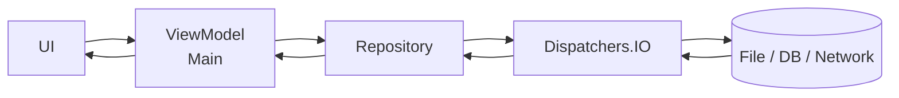

Android gọi kiểu suspend API như vậy là **main-safe**: caller có thể gọi nó từ main thread mà không phải tự biết chính xác blocking work phải chạy trên dispatcher nào. ([Android Developers][4])

---

# 14. `Dispatchers.IO` và `Dispatchers.Default`

Một cách ghi nhớ thực tế:

```text
             Long-running work
                    │
            ┌───────┴───────┐
            │               │
         I/O bound       CPU bound
            │               │
     Dispatchers.IO   Dispatchers.Default
```

### `Dispatchers.IO`

Phù hợp với công việc dạng:

```text
Network
File
Database
Blocking I/O
```

### `Dispatchers.Default`

Phù hợp hơn với:

```text
Sorting
Image processing
Large calculations
Parsing nặng
CPU-heavy algorithms
```

Với code production, Android hiện khuyến nghị **inject dispatcher** thay vì hardcode dispatcher sâu trong class để việc test dễ và deterministic hơn. ([Android Developers][4])

Ví dụ:

```kotlin
class ImageRepository(
    private val defaultDispatcher: CoroutineDispatcher
) {

    suspend fun processImage(
        image: Bitmap
    ): Bitmap = withContext(defaultDispatcher) {

        applyExpensiveFilter(image)
    }
}
```

---

# 15. Background thread vẫn có thể gây ANR

Đây là điểm rất quan trọng.

Sai lầm:

```text
Heavy task chạy background
→ chắc chắn không có ANR
```

Không đúng.

Giả sử:

```text
Worker Thread
       │
       └── giữ Lock A
              ↑
              │
Main Thread cần Lock A
```

Main thread phải chờ:

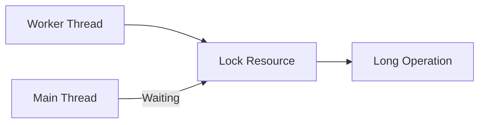

Dù heavy operation nằm trên worker thread, main thread vẫn có thể ANR vì đang chờ lock. Android gọi trường hợp này là **lock contention**. ([Android Developers][1])

---

# 16. Deadlock

Deadlock nguy hiểm hơn lock contention.

Ví dụ:

```text
Thread A
holds Lock A
needs Lock B

Thread B
holds Lock B
needs Lock A
```

Sơ đồ:

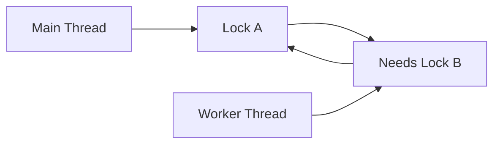

Không thread nào tiếp tục được.

Nếu main thread nằm trong deadlock, ANR rất dễ xảy ra. ([Android Developers][1])

---

# 17. Cancellation

Chuyển task khỏi main thread mới chỉ là bước đầu.

Ví dụ user vào:

```text
Product Screen
```

ViewModel bắt đầu request:

```text
fetchProduct()
```

Sau đó user Back.

Ta không nhất thiết muốn request và xử lý UI của screen cũ tiếp tục vô hạn.

`viewModelScope` hỗ trợ structured concurrency; khi ViewModel bị clear, các coroutine thuộc scope đó được cancel. ([Android Developers][3])

```kotlin
class ProductViewModel(
    private val repository: ProductRepository
) : ViewModel() {

    fun loadProduct() {
        viewModelScope.launch {
            repository.getProduct()
        }
    }
}
```

Luồng:

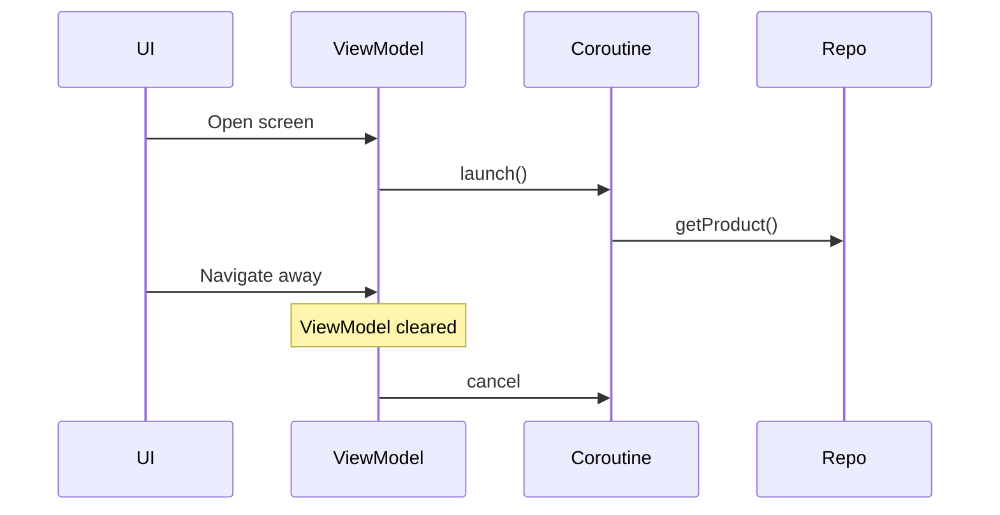

---

# 18. Retry không đồng nghĩa vòng lặp vô hạn

Không nên:

```kotlin
while (true) {
    try {
        api.fetchData()
        break
    } catch (e: Exception) {
        // retry ngay
    }
}
```

Đây có thể trở thành:

```text
Request fail
 ↓
Retry
 ↓
Fail
 ↓
Retry
 ↓
Fail
 ↓
...
```

Một chiến lược hợp lý hơn:

```text
Attempt 1
 ↓ fail

wait
 ↓

Attempt 2
 ↓ fail

wait longer
 ↓

Attempt 3
 ↓

Error State
```

Ví dụ đơn giản:

```kotlin
suspend fun loadWithRetry(): Result<Data> {

    repeat(3) { attempt ->

        try {
            return Result.success(api.getData())
        } catch (e: IOException) {

            if (attempt < 2) {
                delay(1000L * (attempt + 1))
            }
        }
    }

    return Result.failure(
        IOException("Request failed")
    )
}
```

---

# 19. Coroutine hay WorkManager?

Đây là câu hỏi rất quan trọng trong Android async.

Android hiện phân biệt khá rõ: coroutine phù hợp với asynchronous work trong process không cần sống sót khi app đóng; WorkManager dành cho công việc cần chạy đáng tin cậy ngay cả khi user rời screen, app thoát hoặc thiết bị restart. ([Android Developers][5])

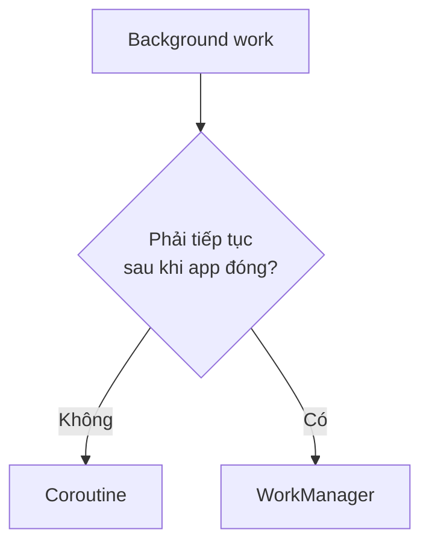

Ví dụ:

| Công việc                     | Công cụ     |
| ----------------------------- | ----------- |
| Load danh sách sản phẩm       | Coroutine   |
| Search API                    | Coroutine   |
| Save file trong màn hình      | Coroutine   |
| Process ảnh tức thời          | Coroutine   |
| Upload cần đảm bảo hoàn thành | WorkManager |
| Periodic synchronization      | WorkManager |
| Gửi analytics cần reliable    | WorkManager |

WorkManager không phải lời giải chung cho mọi background task; chính Android cũng lưu ý không nên dùng nó thay thế toàn bộ in-process async work. ([Android Developers][5])

---

# 20. Lifecycle và ANR

Một lỗi thiết kế phổ biến:

```text
Activity
  │
  └── tự giữ long-running task
```

Sau rotate:

```text
Activity A
 ↓ destroyed

Activity B
 ↓ created
```

Nếu task bị buộc trực tiếp vào Activity không đúng cách, việc quản lý state và cancellation sẽ phức tạp.

Một thiết kế thường dễ quản lý hơn:

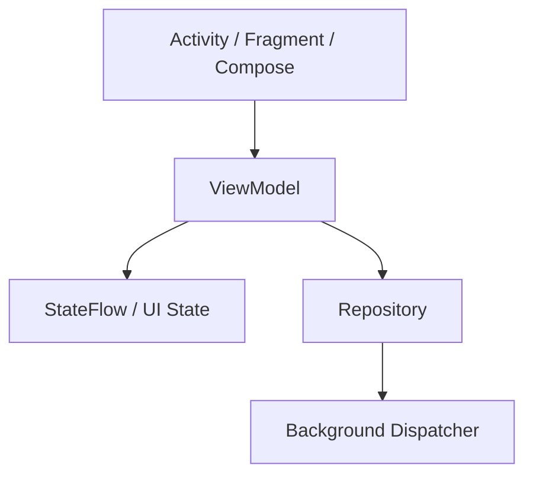

Trong đó ViewModel có thể dùng `viewModelScope` để quản lý coroutine theo lifecycle của ViewModel. ([Android Developers][3])

---

# 21. Demo: tạo ANR có chủ ý

> Chỉ dùng trong app demo/debug.

```kotlin
@Composable
fun AnrDemoScreen() {

    Button(
        onClick = {
            Thread.sleep(10_000)
        }
    ) {
        Text("Block Main Thread")
    }
}
```

Khi nhấn:

```text
User
 ↓
Button
 ↓
onClick
 ↓
Main Thread
 ↓
sleep 10 seconds
 ↓
UI freeze
 ↓
Input không xử lý
 ↓
Có thể xuất hiện ANR
```

Đây là một demo trực quan để hiểu rằng vấn đề không nằm ở Button, Compose hay XML mà nằm ở:

```text
BLOCKING MAIN THREAD
```

---

# 22. Sửa demo bằng Coroutine

```kotlin
class DemoViewModel : ViewModel() {

    fun doWork() {

        viewModelScope.launch {

            val result = withContext(Dispatchers.Default) {
                expensiveCalculation()
            }

            // update UI state
        }
    }
}
```

Luồng mới:

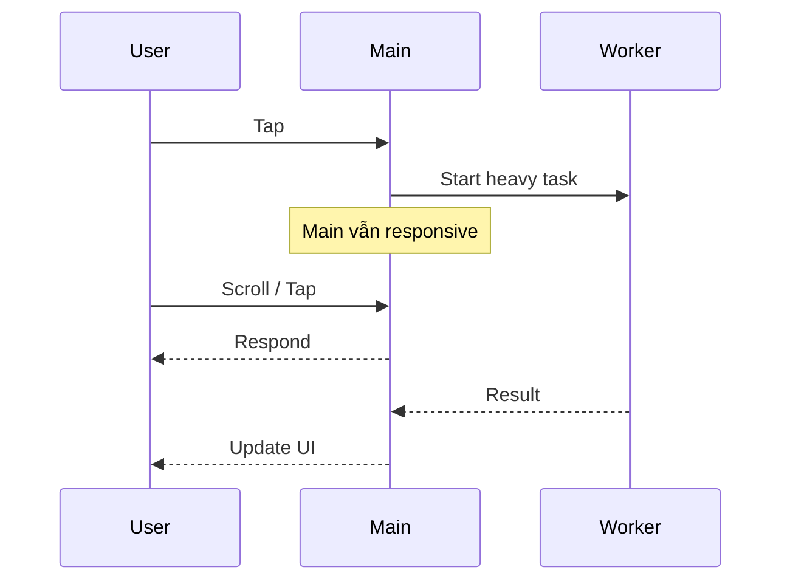

Coroutines là giải pháp Android khuyến nghị cho asynchronous programming và giúp xử lý long-running task mà không block main thread. ([Android Developers][3])

---

# 23. Debug ANR

ANR thường là bài toán:

```text
Tìm xem Main Thread đang làm gì
```

Quy trình:

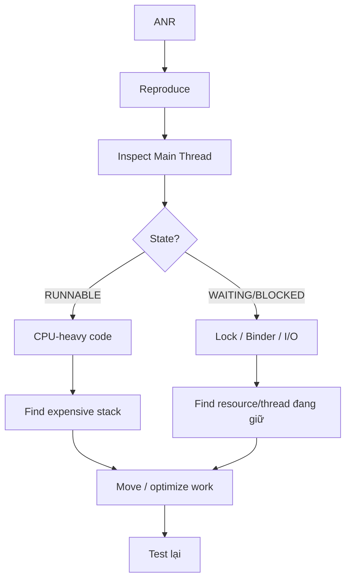

Android Developers đặc biệt gợi ý kiểm tra I/O, long calculation, synchronous Binder call, locks và deadlocks khi phân tích ANR. ([Android Developers][1])

---

# 24. StrictMode

`StrictMode` rất hữu ích trong development để phát hiện những thao tác vô tình thực hiện trên main thread, đặc biệt disk/network access. Android chính thức đề xuất nó như một công cụ hỗ trợ điều tra ANR. ([Android Developers][1])

Ví dụ debug:

```kotlin
class App : Application() {

    override fun onCreate() {
        super.onCreate()

        if (BuildConfig.DEBUG) {

            StrictMode.setThreadPolicy(
                StrictMode.ThreadPolicy.Builder()
                    .detectAll()
                    .penaltyLog()
                    .build()
            )
        }
    }
}
```

Ý tưởng:

```text
Developer vô tình đọc disk
        ↓
Main Thread
        ↓
StrictMode detect
        ↓
Log warning
        ↓
Fix trước production
```

---

# 25. ANR traces

Khi ANR xảy ra, Android có thể lưu trace chứa trạng thái các thread. Trên những phiên bản Android mới, các file ANR có dạng `/data/anr/anr_*`; Android Developers cũng mô tả cách lấy chúng qua ADB trên thiết bị/emulator phù hợp. ([Android Developers][1])

Ví dụ:

```bash
adb root
adb shell ls /data/anr
adb pull /data/anr/<filename>
```

Khi đọc trace, ưu tiên tìm:

```text
"main"
```

sau đó xem main thread đang:

```text
RUNNABLE
BLOCKED
WAITING
TIMED_WAITING
```

và stack trace đang nằm ở đâu.

---

# 26. ApplicationExitInfo

Trên Android 11 / API 30 trở lên, `ApplicationExitInfo` cung cấp thông tin về lý do process thoát, bao gồm cả ANR và một số nguyên nhân khác. ([Android Developers][1])

Ví dụ use case:

```text
App mở lại
 ↓
ApplicationExitInfo
 ↓
Kiểm tra previous process
 ↓
Reason = ANR?
 ↓
Thu thập diagnostic information
```

---

# 27. Android vitals và production

Sau khi phát hành lên Google Play, ANR không chỉ là lỗi kỹ thuật mà còn là **quality/release metric**.

Android vitals theo dõi:

```text
ANR rate
User-perceived ANR rate
Multiple ANR rate
```

Trong đó user-perceived ANR hiện tập trung vào input-dispatch ANR. ([Android Developers][1])

Theo tài liệu Android hiện tại, ngưỡng bad behavior của **user-perceived ANR rate** là:

```text
Overall:
≥ 0.47% daily active users

Per-device:
≥ 8% daily users
trên một model thiết bị
```

Vượt ngưỡng có thể ảnh hưởng đến discoverability trên Google Play. ([Android Developers][1])

Đây là lý do ANR cần được xem như:

```text
Performance problem
       +
UX problem
       +
Release quality problem
```

---

# 28. Pattern kiến trúc tránh ANR

Một cấu trúc tốt:

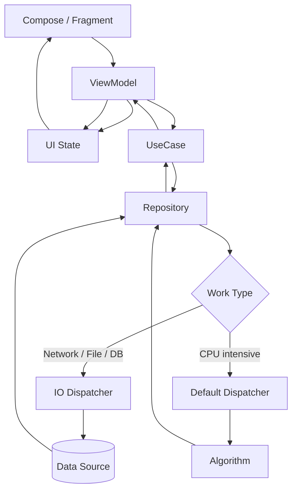

Mục tiêu không phải chỉ là:

```text
"có thread"
```

mà là:

```text
Main-safe API
+
Structured concurrency
+
Cancellation
+
State management
+
Error handling
```

Android hiện khuyến nghị suspend function thực hiện blocking operation phải tự đảm bảo tính main-safe thay vì bắt mọi caller nhớ chọn dispatcher. ([Android Developers][4])

---

# 29. Những lỗi tư duy thường gặp

## ❌ "Coroutine nghĩa là background thread"

Không đúng.

```kotlin
viewModelScope.launch {
    heavyCalculation()
}
```

có thể vẫn chạy phần code đó trên main thread.

---

## ❌ "Suspend function không thể block"

Không đúng.

```kotlin
suspend fun badFunction() {
    Thread.sleep(10_000)
}
```

Việc thêm `suspend` không tự động biến blocking code thành non-blocking code.

---

## ❌ "Service chạy background nên không gây ANR"

Không đúng.

Service là **Android component**, không phải định nghĩa của một worker thread.

---

## ❌ "Task đã chạy background thì chắc chắn không ANR"

Không đúng.

```text
Worker holds lock
       ↓
Main waits lock
       ↓
ANR
```

Lock contention và deadlock đều có thể khiến main thread mất khả năng phản hồi. ([Android Developers][1])

---

## ❌ "Không thấy dialog ANR nghĩa là không có ANR"

Không phải lúc nào background ANR cũng hiện dialog cho người dùng; tài liệu Android lưu ý việc hiển thị các background ANR dialog còn phụ thuộc Developer options. ([Android Developers][1])

---

# 30. Thực hành

## Bài thực hành: ANR Demo

### Bước 1 — Tạo lỗi

```kotlin
fun freeze() {
    Thread.sleep(10_000)
}
```

Gọi từ Button.

Quan sát:

```text
UI freeze
Scroll không hoạt động
Button không phản hồi
```

---

### Bước 2 — Di chuyển khỏi Main Thread

```kotlin
suspend fun heavyWork() =
    withContext(Dispatchers.Default) {
        expensiveCalculation()
    }
```

---

### Bước 3 — Gọi từ ViewModel

```kotlin
fun startWork() {

    viewModelScope.launch {

        _uiState.value = UiState.Loading

        try {

            val result = repository.process()

            _uiState.value =
                UiState.Success(result)

        } catch (e: CancellationException) {
            throw e

        } catch (e: Exception) {

            _uiState.value =
                UiState.Error(e.message)
        }
    }
}
```

---

### Bước 4 — Log state transitions

```text
Idle
 ↓
Loading
 ↓
Success
```

hoặc:

```text
Idle
 ↓
Loading
 ↓
Error
 ↓
Retry
 ↓
Loading
 ↓
Success
```

---

# 31. State machine cho demo

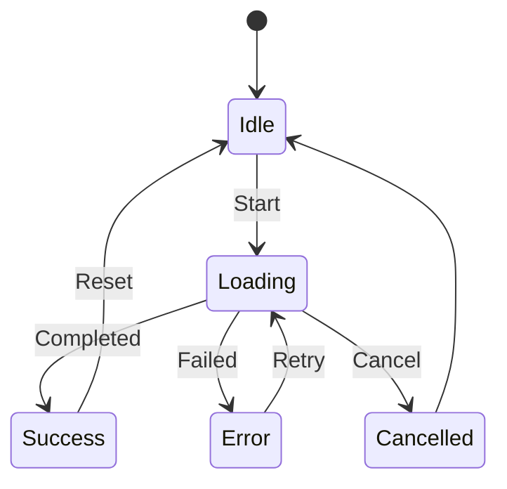

Việc model state rõ ràng giúp demo ANR không chỉ là ví dụ về threading mà còn thể hiện khả năng thiết kế UI async.

---

# 32. Bài tập

Xây dựng một màn hình:

```text
ANR Lab
```

gồm:

```text
[Run on Main Thread]

[Run on Background]

[Cancel]

Status:
Idle / Running / Success / Cancelled
```

### Case A

```text
Run on Main Thread
```

thực hiện CPU-heavy operation.

Quan sát UI freeze.

### Case B

Chuyển task sang:

```kotlin
Dispatchers.Default
```

Quan sát UI vẫn responsive.

### Case C

Cho phép:

```text
Cancel
```

task đang chạy.

### Case D

Rotate màn hình hoặc navigate khỏi screen.

Kiểm tra:

```text
Task có bị leak?
UI state còn đúng?
Coroutine có được cancel đúng?
```

---

# 33. Artifact đưa vào portfolio

Có thể tạo project:

```text
android-anr-lab/
│
├── README.md
│
├── MainActivity.kt
│
├── AnrViewModel.kt
│
├── HeavyRepository.kt
│
├── UiState.kt
│
└── screenshots/
    ├── main-thread-block.png
    ├── profiler.png
    └── async-version.png
```

README nên giải thích:

```text
Problem
  ↓
Main Thread Blocking

Reproduction
  ↓
10-second CPU task

Observation
  ↓
UI freezes

Fix
  ↓
Coroutine + background Dispatcher

Result
  ↓
Responsive UI

Additional
  ↓
Cancellation + UI State
```

Đây là artifact nhỏ nhưng thể hiện được khá nhiều kiến thức:

```text
Threading
Coroutines
Lifecycle
State
Debugging
Performance
Testing
```

---

# 34. Checklist hoàn thành

* [ ] Giải thích được ANR là gì.
* [ ] Biết Main Thread/UI Thread làm gì.
* [ ] Biết input-dispatch ANR có thể xảy ra khi app không phản hồi input trong khoảng 5 giây.
* [ ] Phân biệt được jank, freeze, ANR và crash.
* [ ] Không thực hiện network I/O trực tiếp trên main thread.
* [ ] Không thực hiện disk I/O nặng trên main thread.
* [ ] Không thực hiện CPU-heavy task trên main thread.
* [ ] Hiểu `Thread.sleep()` là blocking.
* [ ] Hiểu `delay()` là coroutine suspension.
* [ ] Không nhầm `suspend` với background thread.
* [ ] Biết sử dụng `Dispatchers.IO`.
* [ ] Biết sử dụng `Dispatchers.Default`.
* [ ] Biết khái niệm main-safe suspend function.
* [ ] Hiểu lock contention.
* [ ] Hiểu deadlock.
* [ ] Biết cancellation với `viewModelScope`.
* [ ] Phân biệt coroutine và WorkManager.
* [ ] Biết dùng StrictMode trong development.
* [ ] Biết kiểm tra ANR trace.
* [ ] Biết Android vitals theo dõi ANR production.
* [ ] Có demo before/after để đưa vào portfolio.

---

# 35. Ghi chú production

Khi review một feature trước release, nên tự hỏi:

```text
1. Có blocking operation nào trên Main Thread không?
                     ↓
2. Network/File/DB đang chạy ở đâu?
                     ↓
3. CPU-heavy work đang dùng dispatcher nào?
                     ↓
4. Có lock nào Main Thread phải chờ không?
                     ↓
5. Coroutine có cancellation đúng không?
                     ↓
6. Rotate / navigate away thì chuyện gì xảy ra?
                     ↓
7. Long-running reliable work có nên dùng WorkManager?
                     ↓
8. Có StrictMode / profiler / tracing trong quá trình debug?
                     ↓
9. Android vitals có ANR regression sau release không?
```

Đặc biệt, đừng chỉ tìm code kiểu:

```kotlin
Thread.sleep(...)
```

ANR production thường khó hơn nhiều và có thể bắt nguồn từ I/O, lock contention, Binder call, deadlock hoặc một worker thread đang giữ resource mà main thread cần. ([Android Developers][1])

---

# 36. Sơ đồ tổng kết

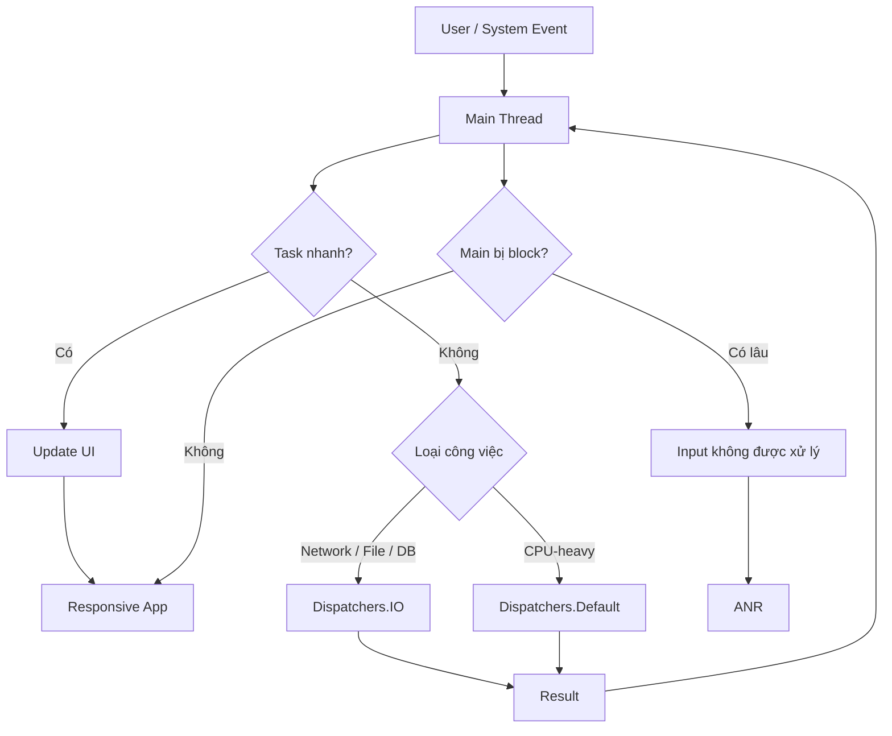

---

## 37. Ghi nhớ nhanh

```text
ANR
 =
Application Not Responding

Nguyên nhân cốt lõi thường là:
Main Thread không thể phản hồi kịp.
```

Quy tắc dễ nhớ:

```text
UI work
      → Main

Network / Disk / blocking I/O
      → IO

CPU-heavy calculation
      → Default

Reliable persistent background work
      → WorkManager
```

Và quan trọng hơn:

```text
Background Thread
        ≠
Không bao giờ ANR
```

bởi vì:

```text
Worker giữ lock
      ↓
Main chờ lock
      ↓
Main không phản hồi
      ↓
ANR
```

Mục tiêu cuối cùng không phải chỉ là **"đẩy code sang thread khác"**, mà là xây dựng các API **main-safe**, có cancellation, lifecycle phù hợp và giữ main thread luôn đủ rảnh để xử lý giao diện. Đây cũng là hướng thiết kế coroutine mà tài liệu Android hiện khuyến nghị. ([Android Developers][4])

[1]: https://developer.android.com/topic/performance/vitals/anr "ANRs  |  App quality  |  Android Developers"
[2]: https://developer.android.com/topic/performance/threads "Better performance through threading  |  App quality  |  Android Developers"
[3]: https://developer.android.com/kotlin/coroutines "Kotlin coroutines on Android  |  Android Developers"
[4]: https://developer.android.com/kotlin/coroutines/coroutines-best-practices "Best practices for coroutines in Android  |  Kotlin  |  Android Developers"
[5]: https://developer.android.com/develop/background-work/background-tasks/persistent "Task scheduling  |  Background work  |  Android Developers"

---

# Bài luyện tập

## Mục tiêu


## Đề bài


## Yêu cầu hoàn thành

- [ ] 
- [ ] 
- [ ] 

## Kết quả / lời giải


## Ghi chú
