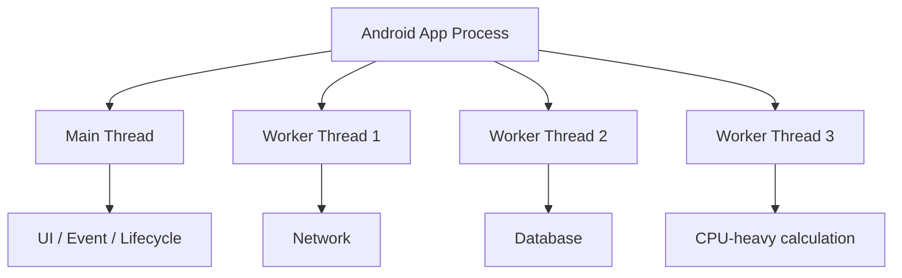
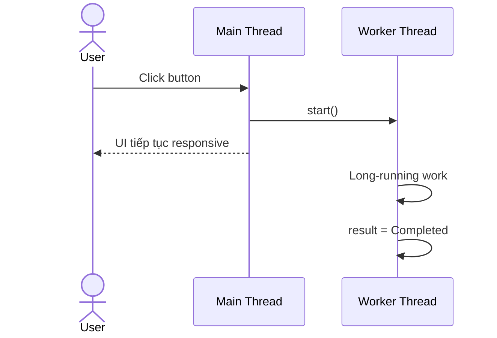
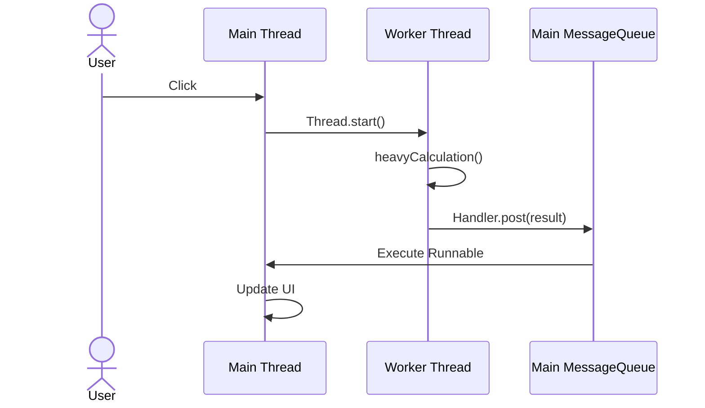
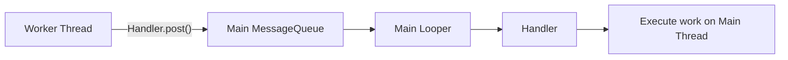
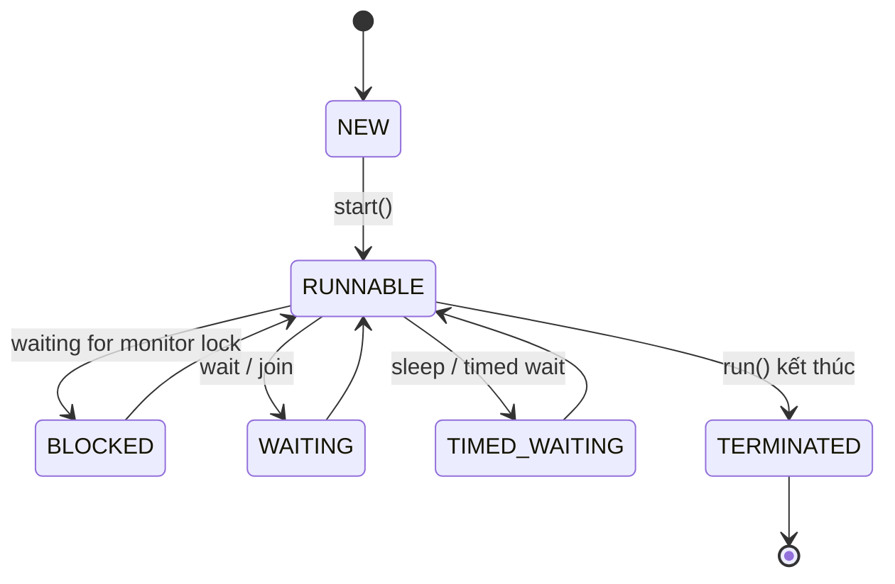
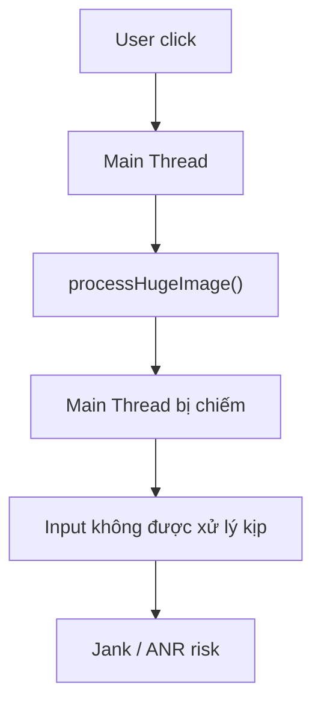
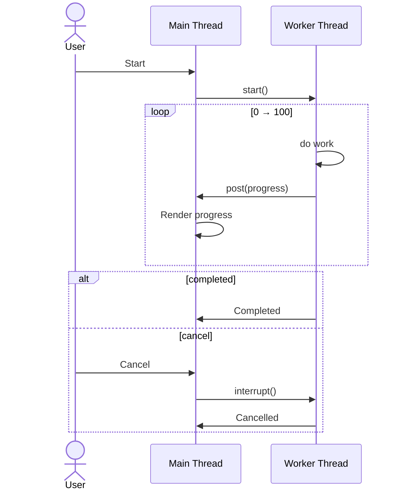
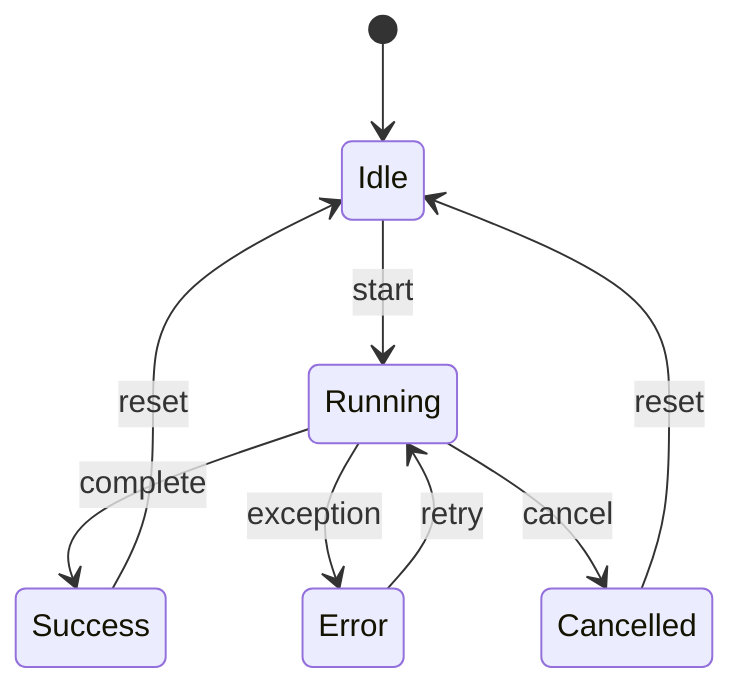
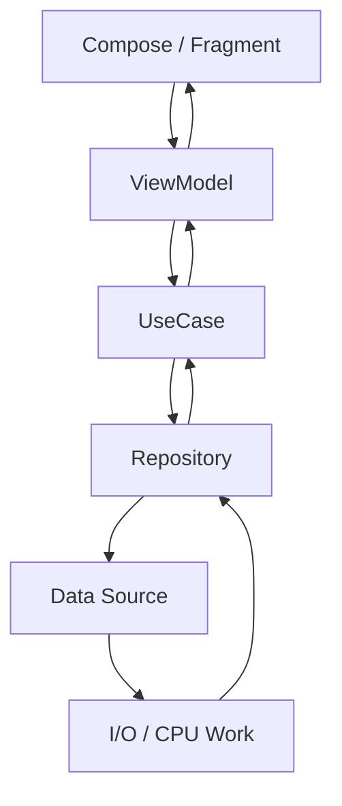
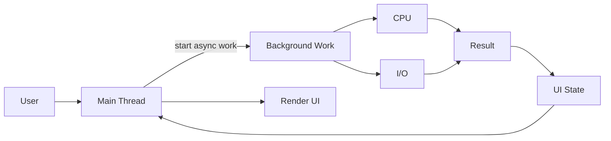

[](https://brunch.co.kr/%40oemilk/48?utm_source=chatgpt.com)

# 004 - Thread

**Học phần:** 04 - Network, Async and Services
**Module:** Module 08 - Asynchronism
**Nhóm nội dung:** Threading Basics
**Nguồn roadmap:** Asynchronism / Threading Basics
**Loại bài:** `async`
**Thứ tự trong module:** 004
**Thời lượng gợi ý:** 34 phút

---

## 1. Tóm tắt

**Thread** là một luồng thực thi bên trong process của ứng dụng.

Trong Android, khi process của ứng dụng được tạo, hệ thống tạo một **main thread**. Đây là thread xử lý phần lớn callback của framework, sự kiện người dùng và công việc liên quan tới UI. Ứng dụng có thể tạo thêm các **worker/background thread** để thực hiện những tác vụ không nên chặn UI. ([Android Developers][1])

Ý tưởng quan trọng nhất:

> **Main Thread → xử lý UI**
> **Worker Thread → thực hiện công việc tốn thời gian**
> **Kết quả → quay lại Main Thread → cập nhật UI**

Trong Android hiện đại, developer thường không tự tạo `Thread` cho toàn bộ business logic. Kotlin Coroutines, các lifecycle-aware scope và WorkManager cung cấp abstraction tốt hơn cho phần lớn tình huống thực tế. Tuy nhiên, hiểu `Thread` vẫn rất quan trọng vì coroutine, thread pool, dispatcher, executor và nhiều API async cuối cùng đều liên quan đến việc công việc được thực thi trên thread nào. ([Android Developers][2])

---

# 2. Mục tiêu học tập

Sau bài này, bạn nên:

* Giải thích được **Thread là gì**.
* Phân biệt:

  * Process
  * Main Thread
  * Worker Thread
  * Coroutine
* Biết cách tạo một `Thread` trong Kotlin.
* Biết vì sao không được thực hiện tác vụ nặng trên Main Thread.
* Biết cách đưa kết quả từ Worker Thread về Main Thread.
* Hiểu vòng đời cơ bản của một Thread.
* Hiểu `start()`, `run()`, `sleep()`, `interrupt()`.
* Hiểu nguy cơ:

  * ANR
  * Race condition
  * Deadlock
  * Memory/lifecycle leak
* Biết khi nào nên dùng:

  * `Thread`
  * Coroutine
  * `HandlerThread`
  * WorkManager
* Có thể xây dựng một demo nhỏ đưa tác vụ nặng khỏi Main Thread.

---

# 3. Thread là gì?

Một **Thread** có thể hiểu là:

> Một đường thực thi độc lập của chương trình.

Ví dụ ứng dụng có:

```text
Android App Process
│
├── Main Thread
│   ├── xử lý click
│   ├── lifecycle callback
│   ├── render/update UI
│   └── dispatch event
│
├── Worker Thread A
│   └── xử lý file
│
├── Worker Thread B
│   └── xử lý ảnh
│
└── Worker Thread C
    └── tính toán
```

Một process có thể chứa nhiều thread. Những thread trong cùng process có thể cùng truy cập dữ liệu của process, vì vậy việc chia sẻ mutable state giữa nhiều thread cần được quản lý cẩn thận. Android cho phép ứng dụng tạo thêm thread bên cạnh thread chính. ([Android Developers][1])

---

# 4. Process và Thread khác nhau như thế nào?

| Khái niệm     | Process                                 | Thread                           |
| ------------- | --------------------------------------- | -------------------------------- |
| Đại diện      | Một instance của chương trình           | Một luồng thực thi               |
| Bộ nhớ        | Có không gian tài nguyên của process    | Chia sẻ tài nguyên process       |
| Số lượng      | App thường chạy trong một process chính | Process có thể chứa nhiều thread |
| Ví dụ Android | App process                             | Main Thread, worker thread       |
| Chi phí       | Lớn hơn                                 | Nhỏ hơn process                  |
| Giao tiếp     | IPC nếu khác process                    | Có thể chia sẻ memory            |

Sơ đồ:



---

# 5. Main Thread và Worker Thread

## 5.1 Main Thread

Main Thread thường được gọi là **UI Thread** trong ứng dụng Android.

Nó chịu trách nhiệm cho những công việc nhạy cảm với độ phản hồi như:

```text
Touch
   ↓
Button click
   ↓
Lifecycle callback
   ↓
UI state
   ↓
Render UI
```

Nếu Main Thread bị chiếm bởi một công việc blocking hoặc quá dài, UI sẽ không thể phản hồi nhanh với input của người dùng và có thể dẫn đến ANR. Android khuyến cáo không thực hiện blocking hoặc long-running operations trên main thread. ([Android Developers][3])

---

## 5.2 Worker Thread

Worker Thread là thread được dùng cho công việc không nên chạy trực tiếp trên Main Thread.

Ví dụ:

```text
Main Thread
    │
    │ User nhấn "Process"
    ▼
Worker Thread
    │
    ├── đọc file
    ├── resize ảnh
    ├── parse dữ liệu lớn
    └── tính toán
    │
    ▼
Main Thread
    │
    └── cập nhật UI
```

Android khuyến nghị chuyển các blocking/long-running operation khỏi main thread để duy trì khả năng phản hồi của UI. ([Android Developers][3])

---

# 6. Tạo Thread bằng Kotlin

Kotlin có thể sử dụng trực tiếp Java `Thread`.

Ví dụ:

```kotlin
val worker = Thread {
    println("Running on: ${Thread.currentThread().name}")

    // Long-running work
}

worker.start()
```

Kotlin cũng cung cấp helper `kotlin.concurrent.thread {}` để tạo và chạy một thread. ([Kotlin][4])

```kotlin
import kotlin.concurrent.thread

thread {
    println("Running on ${Thread.currentThread().name}")
}
```

---

# 7. `start()` và `run()` khác nhau rất quan trọng

Giả sử:

```kotlin
val worker = Thread {
    heavyCalculation()
}
```

## Đúng

```kotlin
worker.start()
```

`start()` bắt đầu việc thực thi thread mới.

---

## Sai về mặt mục tiêu concurrency

```kotlin
worker.run()
```

Gọi `run()` trực tiếp chỉ thực thi method như một function bình thường trên thread hiện tại.

Có thể hình dung:

```text
worker.run()

Main Thread
    │
    ├── heavyCalculation()
    │
    └── tiếp tục
```

Trong khi:

```text
worker.start()

Main Thread ───────────────────────→

       Worker Thread
             │
             └── heavyCalculation()
```

---

# 8. Ví dụ: code gây block Main Thread

```kotlin
fun calculate() {
    Thread.sleep(5_000)

    binding.resultText.text = "Done"
}
```

Nếu gọi:

```kotlin
binding.button.setOnClickListener {
    calculate()
}
```

luồng sẽ thành:

```text
User click
   │
   ▼
Main Thread
   │
   ├── Thread.sleep(5000)
   │      ↓
   │    BLOCKED
   │
   └── update UI
```

Trong thời gian đó UI không thể xử lý bình thường.

`Thread.sleep()` đưa thread hiện tại vào trạng thái chờ có thời hạn; nếu thread bị interrupt trong lúc ngủ, Java có thể ném `InterruptedException`. ([Oracle Docs][5])

---

# 9. Chuyển công việc sang Worker Thread

Có thể thử:

```kotlin
binding.button.setOnClickListener {

    Thread {

        Thread.sleep(5_000)

        val result = "Completed"

    }.start()
}
```

Bây giờ:



Main Thread không còn phải chờ toàn bộ công việc hoàn thành.

---

# 10. Nhưng Worker Thread không nên cập nhật UI trực tiếp

Ví dụ không nên làm:

```kotlin
Thread {

    val result = heavyCalculation()

    binding.resultText.text = result

}.start()
```

UI trên Android được thiết kế quanh main/UI thread, nên kết quả từ worker thường phải được chuyển lại thread chịu trách nhiệm UI. Một cách low-level là sử dụng `Handler` gắn với `Looper` của main thread. `Handler.post()` sẽ đưa `Runnable` vào message queue của Looper tương ứng. ([Android Developers][6])

---

# 11. Worker Thread → Main Thread bằng Handler

```kotlin
private val mainHandler = Handler(Looper.getMainLooper())
```

Sau đó:

```kotlin
Thread {

    val result = heavyCalculation()

    mainHandler.post {
        binding.resultText.text = result
    }

}.start()
```

Flow:



Một `Handler` được liên kết với một `Looper`, và các `Runnable` hoặc message được gửi qua Handler sẽ được thực thi trên thread của Looper đó. ([Android Developers][6])

---

# 12. Looper, MessageQueue và Handler

Đây là nền tảng quan trọng của threading Android.



Hiểu đơn giản:

### MessageQueue

Chứa các công việc đang chờ xử lý.

```text
MessageQueue

[Runnable A]
[Runnable B]
[Message C]
[Runnable D]
```

### Looper

Liên tục lấy công việc từ queue và dispatch chúng.

### Handler

Cho phép gửi:

```text
Runnable
Message
```

vào queue của một Looper.

Android định nghĩa `HandlerThread` là một `Thread` có `Looper`, nhờ đó developer có thể tạo Handler để gửi công việc tới thread đó. ([Android Developers][7])

---

# 13. Lifecycle của Thread

Ở mức JVM, `Thread.State` có sáu trạng thái:

```text
NEW
RUNNABLE
BLOCKED
WAITING
TIMED_WAITING
TERMINATED
```

Oracle định nghĩa đây là các trạng thái JVM của thread; chúng không nhất thiết ánh xạ trực tiếp 1:1 với trạng thái thread của hệ điều hành. ([Oracle Docs][5])

Sơ đồ đơn giản hóa:



---

# 14. `Thread.sleep()`

Ví dụ:

```kotlin
Thread {
    println("Start")

    Thread.sleep(2_000)

    println("After 2 seconds")
}.start()
```

`Thread.sleep()` không có nghĩa:

> “App ngủ.”

Mà là:

> **Thread hiện tại tạm chờ.**

Nếu gọi từ Worker Thread:

```text
Worker Thread
   ↓
sleep()
```

Main Thread vẫn chạy.

Nếu gọi trên Main Thread:

```text
Main Thread
   ↓
sleep()
   ↓
UI bị block
```

---

# 15. Cancellation với `interrupt()`

Một raw `Thread` không có structured cancellation giống Coroutine.

Cơ chế phổ biến ở mức Java là:

```kotlin
thread.interrupt()
```

`interrupt()` đặt interrupt status cho thread. Các blocking operation như `Thread.sleep()` có thể phản ứng bằng `InterruptedException`. ([Oracle Docs][8])

Ví dụ:

```kotlin
private var workerThread: Thread? = null

fun startTask() {

    workerThread = Thread {

        try {

            repeat(100) { index ->

                if (Thread.currentThread().isInterrupted) {
                    return@Thread
                }

                Thread.sleep(100)

                Log.d(
                    "ThreadDemo",
                    "Step $index"
                )
            }

        } catch (e: InterruptedException) {

            Thread.currentThread().interrupt()

            Log.d(
                "ThreadDemo",
                "Task cancelled"
            )
        }
    }

    workerThread?.start()
}
```

Cancel:

```kotlin
fun cancelTask() {
    workerThread?.interrupt()
}
```

---

# 16. Cancellation là cooperative

Điều quan trọng:

```text
interrupt()
    │
    ▼
không phải "kill thread ngay lập tức"
```

Mà gần với:

```text
"Tôi yêu cầu thread dừng."
```

Thread cần:

* kiểm tra interruption;
* phản ứng với `InterruptedException`;
* thoát khỏi vòng lặp;
* cleanup resource nếu cần.

Java sử dụng interrupt status làm cơ chế báo hiệu interruption giữa các thread. ([Oracle Docs][8])

---

# 17. Thread và Android Lifecycle

Đây là một lỗi rất phổ biến.

Ví dụ Activity:

```text
Activity
   │
   ├── start Thread
   │
   ▼
Worker Thread chạy 10 giây
```

Sau 2 giây:

```text
Rotate screen
     │
     ▼
Old Activity destroyed
```

Nhưng:

```text
Worker Thread
     │
     └── vẫn có thể tiếp tục chạy
```

Nếu thread giữ reference tới:

```text
Activity
Fragment
View
Binding
```

thì code rất dễ trở nên khó quản lý, đặc biệt khi callback quay lại một UI không còn ở trạng thái phù hợp.

Đây là một trong các lý do Android hiện đại khuyến khích lifecycle-aware coroutine scopes như `viewModelScope` và các API gắn với lifecycle thay vì tự quản lý raw Thread trong UI layer. `viewModelScope`, chẳng hạn, được tự động cancel khi `ViewModel` bị clear. ([Android Developers][9])

---

# 18. Cách tiếp cận hiện đại: Coroutine

Raw Thread:

```kotlin
Thread {

    val result = heavyCalculation()

    mainHandler.post {
        showResult(result)
    }

}.start()
```

Trong Android Kotlin hiện đại, thường viết:

```kotlin
viewModelScope.launch {

    val result = withContext(Dispatchers.Default) {
        heavyCalculation()
    }

    _uiState.value = UiState.Success(result)
}
```

Coroutine dispatcher quyết định coroutine chạy trên thread hoặc thread pool nào. Android hỗ trợ lifecycle-aware coroutine scopes để quản lý thời gian sống của các asynchronous operation dễ hơn. ([Kotlin][10])

---

# 19. Thread không phải Coroutine

Đây là điểm cần nhớ.

```text
Thread ≠ Coroutine
```

### Thread

Là execution thread thực tế.

```text
Thread A
Thread B
Thread C
```

### Coroutine

Là một abstraction cho concurrent/asynchronous computation.

Nhiều coroutine có thể được dispatcher điều phối lên một tập thread thay vì mỗi coroutine tương ứng một thread riêng biệt. Kotlin mô tả coroutine là computation có khả năng suspend, còn dispatcher quyết định thread hoặc thread pool thực thi coroutine. ([Kotlin][11])

Minh họa:

```text
Coroutine A ─┐
Coroutine B ─┤
Coroutine C ─┤──→ Dispatcher ──→ Thread Pool
Coroutine D ─┤                   ├── Thread 1
Coroutine E ─┘                   ├── Thread 2
                                └── Thread 3
```

---

# 20. CPU-bound và I/O-bound

Không phải tất cả background work đều giống nhau.

## CPU-bound

Ví dụ:

```text
image processing
compression
sorting
encryption
large calculation
```

CPU phải thực sự tính toán.

Trong coroutine thường liên quan đến:

```kotlin
Dispatchers.Default
```

---

## I/O-bound

Ví dụ:

```text
file I/O
database
network blocking API
socket
```

Phần lớn thời gian có thể là chờ I/O.

Trong coroutine thường liên quan:

```kotlin
Dispatchers.IO
```

Điều quan trọng hơn việc thuộc lòng dispatcher là thiết kế API **main-safe**: phần code có thể blocking phải chịu trách nhiệm chuyển execution context phù hợp thay vì bắt UI layer phải biết chi tiết threading. Đây cũng là một trong những best practice Android dành cho coroutine. ([Android Developers][12])

---

# 21. Race Condition

Giả sử hai thread cùng sửa:

```kotlin
var counter = 0
```

Thread A:

```text
read counter = 0
counter + 1
write 1
```

Thread B cũng:

```text
read counter = 0
counter + 1
write 1
```

Kết quả:

```text
mong đợi: 2

thực tế: 1
```

Đây là một dạng vấn đề khi nhiều execution path cùng thao tác shared mutable state mà không được phối hợp thích hợp. Kotlin cũng nhấn mạnh việc quản lý shared mutable state trong concurrent code, trong đó thread confinement là một chiến lược phổ biến. ([Kotlin][13])

---

# 22. Deadlock

Một tình huống nguy hiểm khác:

```text
Thread A
   │
   ├── lock Resource 1
   │
   └── chờ Resource 2
                 ▲
                 │
Thread B         │
   │             │
   ├── lock Resource 2
   │
   └── chờ Resource 1
```

Kết quả:

```text
A chờ B
B chờ A

→ không thread nào tiếp tục
```

Trong Android, lock contention liên quan tới Main Thread đặc biệt nguy hiểm vì Main Thread có thể bị kẹt chờ lock và góp phần gây ANR. Android khuyến cáo giảm lock contention giữa main thread và worker thread. ([Android Developers][14])

---

# 23. Thread và ANR

Một lỗi điển hình:

```kotlin
button.setOnClickListener {

    val bitmap = processHugeImage()

    imageView.setImageBitmap(bitmap)
}
```

Flow:



ANR xuất hiện khi ứng dụng không phản hồi trong các điều kiện timeout do hệ thống quy định; với input-dispatch ANR, Android hiện mô tả timeout mặc định là khoảng 5 giây. Không nên hiểu con số này thành “có thể thoải mái block UI dưới 5 giây” — UI cần được giữ responsive liên tục. ([Android Developers][14])

---

# 24. Một Thread cho mỗi task có tốt không?

Ví dụ:

```kotlin
repeat(10_000) {
    Thread {
        doWork()
    }.start()
}
```

Không phải thiết kế tốt.

Thread là resource tương đối nặng; tạo quá nhiều thread có thể gây overhead và vấn đề hiệu năng. Đây là lý do những abstraction như thread pool, executor và coroutine dispatcher thường được sử dụng để giới hạn và tái sử dụng tài nguyên execution. ([Kotlin][15])

Thay vì:

```text
Task 1 → Thread 1
Task 2 → Thread 2
Task 3 → Thread 3
...
```

thường muốn:

```text
Task 1 ─┐
Task 2 ─┤
Task 3 ─┤──→ Thread Pool
Task 4 ─┤      ├── Worker 1
Task 5 ─┘      ├── Worker 2
               └── Worker 3
```

---

# 25. Thread Pool

Ví dụ Java/Kotlin Executor:

```kotlin
val executor = Executors.newFixedThreadPool(4)

executor.execute {
    doWork()
}
```

Android cũng sử dụng Executor trong nhiều API background-work. Chẳng hạn `Worker.doWork()` của WorkManager được chạy trên background thread từ `Executor` được cấu hình cho WorkManager. ([Android Developers][16])

---

# 26. `HandlerThread`

Nếu cần một dedicated thread có message queue:

```kotlin
val handlerThread = HandlerThread("ImageProcessor")

handlerThread.start()

val handler = Handler(handlerThread.looper)

handler.post {
    processImage()
}
```

Architecture:

```text
HandlerThread
│
├── Looper
│
└── MessageQueue
      │
      ├── Task A
      ├── Task B
      └── Task C
```

`HandlerThread` chính là một `Thread` có `Looper`, phù hợp với các tình huống low-level cần queue công việc tuần tự trên một dedicated thread. ([Android Developers][7])

---

# 27. Thread vs HandlerThread vs Coroutine vs WorkManager

| Công cụ                | Phù hợp                                      |
| ---------------------- | -------------------------------------------- |
| `Thread`               | Học threading, low-level execution           |
| Executor / Thread Pool | Nhiều task cần quản lý tập worker            |
| `Handler`              | Gửi task/message tới Looper                  |
| `HandlerThread`        | Dedicated thread + message queue             |
| Coroutine              | Async/concurrent work trong app Kotlin       |
| `viewModelScope`       | Business/UI-related async work gắn ViewModel |
| `lifecycleScope`       | Coroutine liên quan lifecycle UI             |
| WorkManager            | Persistent/deferrable background work        |

Kotlin Coroutines là lựa chọn rất phổ biến để đơn giản hóa asynchronous code trên Android, còn WorkManager được Android khuyến nghị cho persistent background work cần được schedule và quản lý đáng tin cậy. ([Android Developers][2])

---

# 28. Đừng dùng Thread khi thực ra cần WorkManager

Ví dụ:

```text
Upload analytics
Backup dữ liệu
Sync background
Periodic synchronization
Task cần tiếp tục dù user rời màn hình
```

Một raw:

```kotlin
Thread {
    uploadData()
}.start()
```

không phải cơ chế scheduling bền vững.

WorkManager lưu scheduled work, quản lý constraint và có thể reschedule persistent work qua việc restart ứng dụng/device reboot theo cơ chế của WorkManager. ([Android Developers][17])

Flow:

```text
UI
 │
 └── enqueue WorkRequest
          │
          ▼
      WorkManager
          │
    constraints met?
       /        \
     no          yes
     │            │
    wait        Worker
                   │
                   ▼
                 Result
```

---

# 29. Thực hành — xây Thread Demo

## Bước 1 — UI

Tạo:

```text
[ Start Task ]
[ Cancel ]

Status: Idle
Progress: 0%
```

---

## Bước 2 — Worker Thread

```kotlin
private var workerThread: Thread? = null

private val mainHandler =
    Handler(Looper.getMainLooper())

private fun startTask() {

    workerThread = Thread {

        try {

            for (progress in 0..100) {

                if (Thread.currentThread().isInterrupted) {
                    return@Thread
                }

                Thread.sleep(50)

                mainHandler.post {
                    binding.progressBar.progress = progress
                    binding.statusText.text =
                        "Processing $progress%"
                }
            }

            mainHandler.post {
                binding.statusText.text = "Completed"
            }

        } catch (e: InterruptedException) {

            Thread.currentThread().interrupt()

            mainHandler.post {
                binding.statusText.text = "Cancelled"
            }
        }
    }

    workerThread?.start()
}
```

---

## Bước 3 — Cancel

```kotlin
private fun cancelTask() {
    workerThread?.interrupt()
}
```

---

# 30. Luồng hoàn chỉnh của bài thực hành



---

# 31. Log Thread để debug

Một kỹ năng rất hữu ích:

```kotlin
Log.d(
    "ThreadDemo",
    """
    Thread:
    ${Thread.currentThread().name}
    """.trimIndent()
)
```

Ví dụ:

```text
Thread: main
```

hoặc:

```text
Thread: Thread-3
```

Bạn có thể log:

```text
START
THREAD
PROGRESS
SUCCESS
ERROR
CANCEL
```

Ví dụ:

```text
ThreadDemo START thread=main

ThreadDemo WORKING thread=Thread-3

ThreadDemo PROGRESS=50 thread=Thread-3

ThreadDemo UI_UPDATE thread=main

ThreadDemo SUCCESS
```

---

# 32. State machine cho task

Không nên chỉ nghĩ:

```text
thread chạy / không chạy
```

Hãy model:



Ví dụ UI state:

```kotlin
sealed interface TaskState {

    data object Idle : TaskState

    data class Running(
        val progress: Int
    ) : TaskState

    data class Success(
        val result: String
    ) : TaskState

    data class Error(
        val message: String
    ) : TaskState

    data object Cancelled : TaskState
}
```

Cách tư duy này giúp nối kiến thức Thread với:

```text
Thread
   ↓
Async operation
   ↓
State
   ↓
ViewModel
   ↓
UI
```

---

# 33. Retry

Không phải lỗi nào cũng nên retry vô hạn.

Ví dụ:

```kotlin
fun executeWithRetry() {

    repeat(3) { attempt ->

        try {

            performRequest()

            return

        } catch (e: IOException) {

            Log.e(
                "ThreadDemo",
                "Attempt ${attempt + 1} failed"
            )
        }
    }
}
```

Trong production nên phân biệt:

```text
Timeout
Network unavailable
HTTP 500
HTTP 401
Validation error
Cancellation
```

Không phải tất cả đều có cùng retry policy.

---

# 34. Sai lầm phổ biến

## Sai 1 — chạy network/blocking operation trên Main Thread

```text
Main
 ↓
Network
 ↓
Wait
 ↓
UI freeze
```

---

## Sai 2 — tạo Thread nhưng gọi `run()`

```kotlin
thread.run()
```

thay vì:

```kotlin
thread.start()
```

---

## Sai 3 — Worker Thread sửa UI trực tiếp

```kotlin
Thread {
    binding.textView.text = "Done"
}.start()
```

---

## Sai 4 — tạo hàng nghìn Thread

```kotlin
items.forEach {
    Thread {
        process(it)
    }.start()
}
```

---

## Sai 5 — không có cancellation

```text
Screen destroyed

nhưng

Task vẫn chạy
```

---

## Sai 6 — Thread giữ reference đến Activity

```text
Thread
  │
  └── Activity
       │
       └── View Binding
```

Lifecycle thay đổi có thể khiến ownership của công việc trở nên không rõ ràng.

---

## Sai 7 — dùng raw Thread cho persistent work

```text
App process chết
       ↓
Thread biến mất
```

Persistent scheduled work nên được thiết kế bằng API background-work phù hợp như WorkManager khi use case đáp ứng đặc tính của nó. ([Android Developers][17])

---

# 35. Production architecture

Không nên để:

```text
Activity
   │
   ├── Thread
   ├── Network
   ├── Database
   ├── Retry
   └── State
```

Một kiến trúc tốt hơn:



Threading trở thành implementation detail ở layer phù hợp thay vì bị rải khắp Activity/Fragment.

Android coroutine best practices cũng khuyến khích data/business layer chịu trách nhiệm cho việc main-safety, thay vì UI phải tự biết mỗi operation cần chạy dispatcher nào. ([Android Developers][12])

---

# 36. Testing

## Test 1 — UI không bị freeze

Start task rồi:

```text
scroll
click
navigate
```

UI vẫn phải responsive.

---

## Test 2 — cancellation

```text
Start
 ↓
50%
 ↓
Cancel
```

Expected:

```text
Cancelled
```

và task không tiếp tục tăng progress.

---

## Test 3 — rotate

```text
Start
 ↓
Rotate
 ↓
Observe
```

Hỏi:

```text
Task có nên tiếp tục không?

Nếu tiếp tục:
Ai sở hữu task?

UI mới lấy state ở đâu?
```

---

## Test 4 — background / foreground

```text
App foreground
     ↓
start
     ↓
Home
     ↓
return
```

Kiểm tra:

```text
state
progress
result
error
```

---

## Test 5 — error

Giả lập:

```kotlin
throw IOException("Network unavailable")
```

UI phải chuyển:

```text
Running
   ↓
Error
```

không crash.

---

# 37. Debugging Thread

Các công cụ nên biết:

```text
Logcat
Android Studio Debugger
Profiler
System Trace
ANR traces
StrictMode
```

Đặc biệt khi debug performance:

```text
Main Thread
    ↓
đang làm gì?

Worker Thread
    ↓
đang giữ lock nào?

Main Thread
    ↓
có đang chờ worker không?
```

Android khuyến nghị xem thread liên quan trong ANR trace và giảm blocking work hoặc lock contention trên main thread. ([Android Developers][18])

---

# 38. Artifact portfolio

Có thể tạo project:

```text
ThreadingDemo/
│
├── MainActivity.kt
├── ThreadDemoViewModel.kt
├── TaskState.kt
├── README.md
└── screenshots/
    ├── idle.png
    ├── running.png
    ├── success.png
    └── cancelled.png
```

README:

```markdown
# Android Thread Demo

Demonstrates:

- Main Thread vs Worker Thread
- Creating Thread
- Handler + Main Looper
- Progress updates
- Thread cancellation
- Lifecycle considerations
- Thread logging
```

Điểm portfolio tốt hơn là thêm phần:

```text
Version 1
Raw Thread + Handler

        ↓ refactor

Version 2
ViewModel + Coroutine

        ↓ compare

Version 3
WorkManager cho persistent task
```

Như vậy project không chỉ chứng minh rằng bạn biết syntax `Thread`, mà còn chứng minh bạn hiểu **sự tiến hóa từ low-level concurrency đến Android architecture hiện đại**.

---

# 39. Bài tập

## Bài tập chính

Xây một task giả lập chạy khoảng vài giây:

```text
Start
 ↓
Worker Thread
 ↓
0%
10%
20%
...
100%
 ↓
Success
```

Có thêm:

```text
Cancel
Retry
Error
```

Yêu cầu:

1. Công việc không chạy trên Main Thread.
2. UI vẫn responsive.
3. UI update trên Main Thread.
4. Có cancellation.
5. Log tên thread.
6. Có `Idle / Running / Success / Error / Cancelled`.
7. Rotate screen và ghi lại behavior.
8. Giải thích cách bạn sẽ refactor sang Coroutine.

---

# 40. Câu hỏi tự kiểm tra

### 1. Thread là gì?

Một execution path bên trong process.

### 2. Main Thread làm gì?

Xử lý phần lớn UI/event/framework callback của ứng dụng Android. ([Android Developers][1])

### 3. Tại sao không chạy task nặng trên Main Thread?

Vì nó có thể khiến UI không responsive và tăng nguy cơ jank/ANR. ([Android Developers][3])

### 4. `start()` khác `run()` thế nào?

```text
start()
→ bắt đầu execution trên thread mới

run()
→ gọi method trực tiếp trên thread hiện tại
```

### 5. Worker Thread update UI thế nào?

Có thể chuyển công việc về main Looper thông qua `Handler`, hoặc trong code hiện đại sử dụng coroutine/lifecycle-aware state architecture. ([Android Developers][6])

### 6. `interrupt()` có kill thread ngay không?

Không nên hiểu như vậy. Interrupt là cơ chế báo hiệu; thread cần phản ứng hợp tác với interruption. ([Oracle Docs][8])

### 7. Khi nào dùng WorkManager?

Khi cần persistent/deferrable background work cần được schedule và quản lý đáng tin cậy thay vì một task chỉ sống cùng màn hình hiện tại. ([Android Developers][17])

---

# 41. Mental model cần nhớ



Có thể ghi nhớ bằng một câu:

> **Main Thread nhận tương tác và render; công việc nặng được chuyển khỏi Main Thread; kết quả quay về state/UI theo lifecycle phù hợp.**

---

# 42. Thread nằm ở đâu trong Android Roadmap?

```text
Asynchronism
│
└── Threading Basics
    │
    ├── Main Thread
    ├── Background Thread
    ├── ANR
    └── Thread ← bài này
          │
          ├── Thread lifecycle
          ├── Worker execution
          ├── Handler / Looper
          ├── Cancellation
          ├── Thread safety
          └── Lifecycle
                │
                ▼
           Coroutines
                │
          ┌─────┴─────┐
          ▼           ▼
     Dispatchers    Scopes
          │           │
          └─────┬─────┘
                ▼
        Structured async work
                │
                ▼
           WorkManager
        khi cần persistent work
```

---

# 43. Checklist hoàn thành

* [ ] Giải thích được Thread bằng ngôn ngữ của mình.
* [ ] Phân biệt Process và Thread.
* [ ] Phân biệt Main Thread và Worker Thread.
* [ ] Biết `Thread {}`.
* [ ] Biết `start()` khác `run()`.
* [ ] Không chạy long-running/blocking work trên Main Thread.
* [ ] Biết đưa kết quả về Main Thread.
* [ ] Hiểu Handler, Looper và MessageQueue.
* [ ] Hiểu các trạng thái cơ bản của Thread.
* [ ] Hiểu `sleep()`.
* [ ] Hiểu `interrupt()`.
* [ ] Có cancellation.
* [ ] Biết race condition là gì.
* [ ] Biết deadlock là gì.
* [ ] Hiểu nguy cơ ANR.
* [ ] Hiểu Thread và Android lifecycle không tự động gắn với nhau.
* [ ] Phân biệt Thread và Coroutine.
* [ ] Biết khi nào nên dùng WorkManager.
* [ ] Có logging cho thread/state.
* [ ] Có demo `Idle → Running → Success/Error/Cancelled`.
* [ ] Có README hoặc screenshot để đưa vào portfolio.

---

# 44. Ghi chú production

Khi đưa threading vào production, hãy tự hỏi:

```text
Task này chạy trên thread nào?
        ↓
Có block Main Thread không?
        ↓
Task thuộc lifecycle của ai?
        ↓
Screen bị destroy thì task có cần tiếp tục?
        ↓
Cancellation xử lý thế nào?
        ↓
Có shared mutable state không?
        ↓
Có race condition / lock contention không?
        ↓
Error có trở thành UI state không?
        ↓
Có cần retry?
        ↓
App process chết thì task có cần tồn tại?
        │
        ├── Không → Coroutine / in-process async
        │
        └── Có thể cần → xem xét WorkManager / background API phù hợp
```

Điểm quan trọng nhất của bài **Thread** không phải là nhớ:

```kotlin
Thread { ... }.start()
```

mà là hiểu:

```text
WORK
 │
 ▼
nên chạy ở đâu?
 │
 ▼
ai sở hữu nó?
 │
 ▼
khi nào nó phải dừng?
 │
 ▼
kết quả đi đâu?
 │
 ▼
UI phản ứng thế nào?
```

Đó là nền tảng để học tiếp **Executors, Handler/Looper, Kotlin Coroutines, Dispatchers, structured concurrency và WorkManager** trong Android. ([Android Developers][19])

[1]: https://developer.android.com/guide/components/processes-and-threads?utm_source=chatgpt.com "Processes and threads overview | App quality"
[2]: https://developer.android.com/kotlin/coroutines?utm_source=chatgpt.com "Kotlin coroutines on Android"
[3]: https://developer.android.com/topic/performance/anrs/keep-your-app-responsive?utm_source=chatgpt.com "Keep your app responsive | App quality"
[4]: https://kotlinlang.org/api/core/kotlin-stdlib/kotlin.concurrent/thread.html?utm_source=chatgpt.com "thread | Core API – Kotlin Programming Language"
[5]: https://docs.oracle.com/en/java/javase/25/docs/api/java.base/java/lang/Thread.State.html?utm_source=chatgpt.com "Thread.State (Java SE 25 & JDK 25)"
[6]: https://developer.android.com/reference/kotlin/android/os/Handler?utm_source=chatgpt.com "Handler | API reference"
[7]: https://developer.android.com/reference/kotlin/android/os/HandlerThread?utm_source=chatgpt.com "HandlerThread | API reference"
[8]: https://docs.oracle.com/javase/tutorial/essential/concurrency/interrupt.html?utm_source=chatgpt.com "Interrupts - The Java™ Tutorials"
[9]: https://developer.android.com/topic/libraries/architecture/coroutines?utm_source=chatgpt.com "Use Kotlin coroutines with lifecycle-aware components"
[10]: https://kotlinlang.org/docs/coroutine-context-and-dispatchers.html?utm_source=chatgpt.com "Coroutine context and dispatchers"
[11]: https://kotlinlang.org/docs/coroutines-basics.html?utm_source=chatgpt.com "Coroutines basics"
[12]: https://developer.android.com/kotlin/coroutines/coroutines-best-practices?utm_source=chatgpt.com "Best practices for coroutines in Android | Kotlin"
[13]: https://kotlinlang.org/docs/shared-mutable-state-and-concurrency.html?utm_source=chatgpt.com "Shared mutable state and concurrency"
[14]: https://developer.android.com/topic/performance/anrs/diagnose-and-fix-anrs?utm_source=chatgpt.com "Diagnose and fix ANRs | App quality"
[15]: https://kotlinlang.org/docs/coroutines-overview.html?utm_source=chatgpt.com "Coroutines | Kotlin Documentation"
[16]: https://developer.android.com/develop/background-work/background-tasks/persistent/threading/worker?utm_source=chatgpt.com "Threading in Worker | Background work"
[17]: https://developer.android.com/develop/background-work/background-tasks/persistent?utm_source=chatgpt.com "Task scheduling | Background work | Android Developers"
[18]: https://developer.android.com/topic/performance/anrs/find-unresponsive-thread?utm_source=chatgpt.com "Find the unresponsive thread | App quality"
[19]: https://developer.android.com/topic/performance/threads?utm_source=chatgpt.com "Better performance through threading | App quality"
