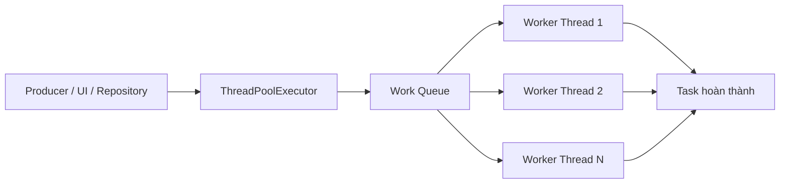
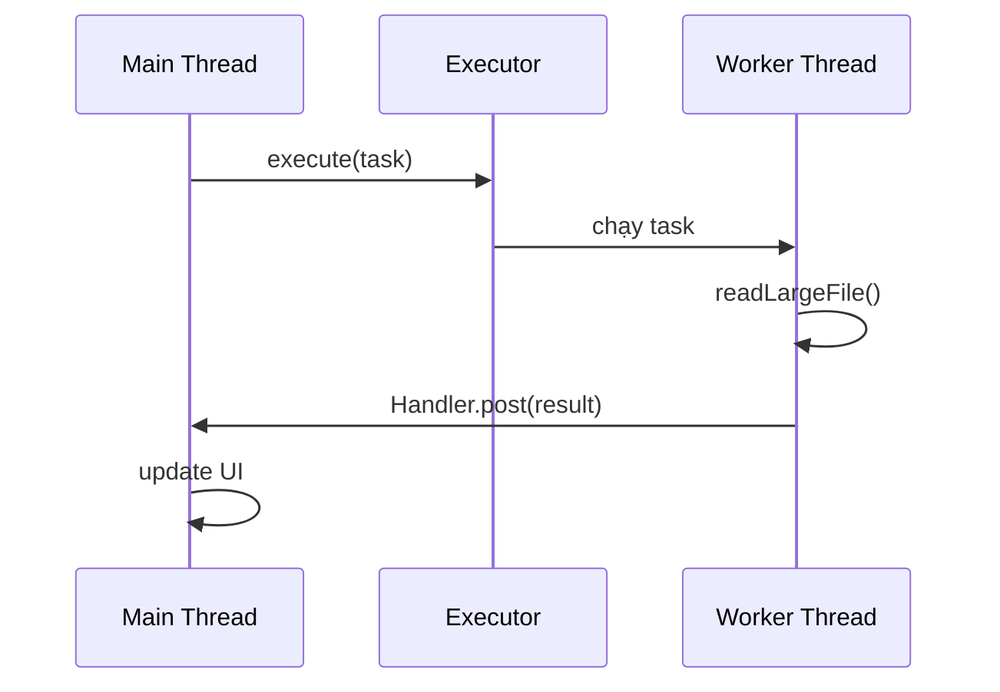
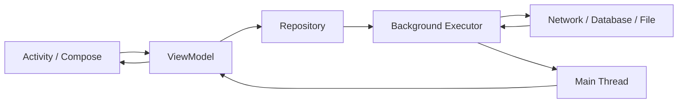
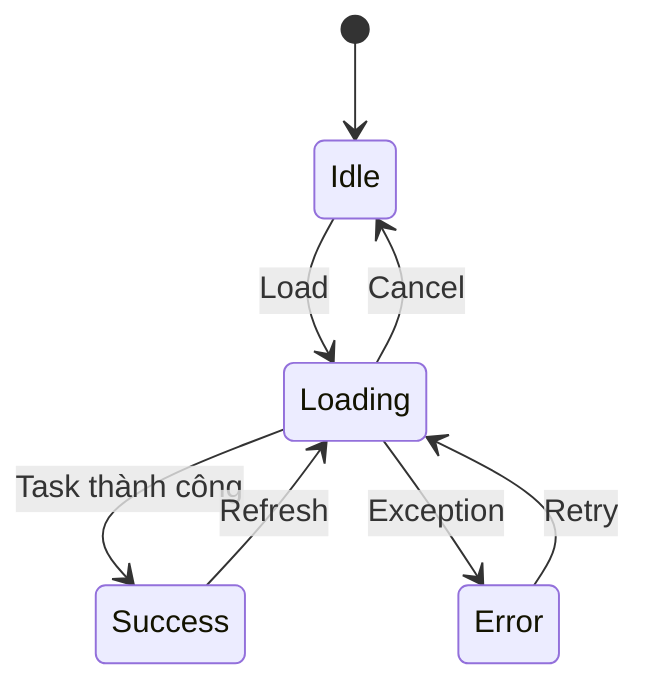
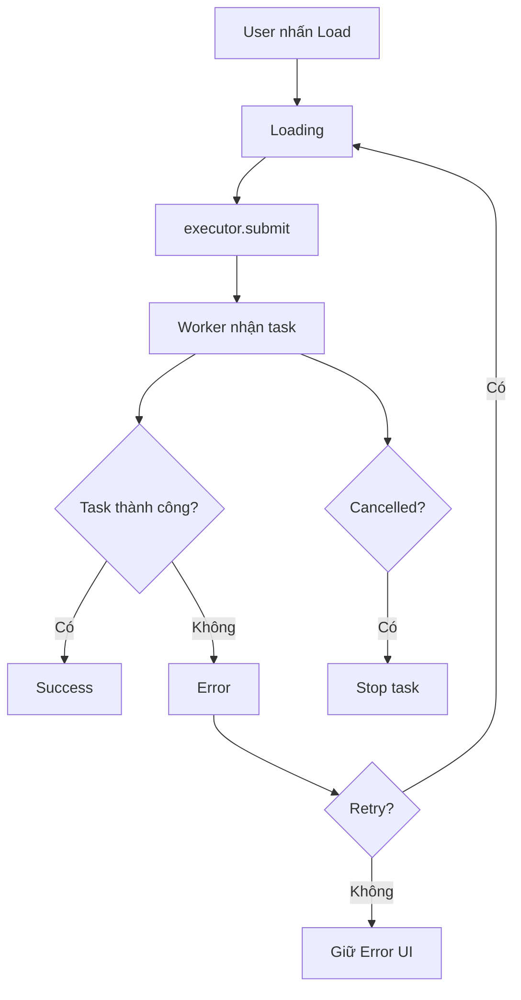
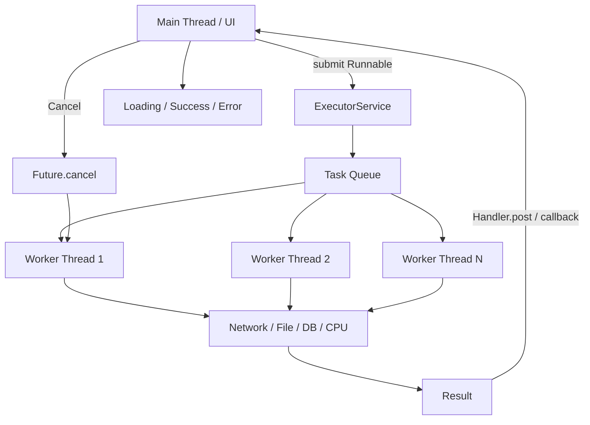

[](https://developer.android.com/courses/extras/multithreading?utm_source=chatgpt.com)

# 005 - Executor

**Học phần:** 04 - Network, Async and Services
**Module:** Module 08 - Asynchronism
**Nhóm nội dung:** Threading Basics
**Nguồn roadmap:** Asynchronism / Threading Basics
**Loại bài:** Async
**Thứ tự trong module:** 005
**Thời lượng gợi ý:** 34 phút

---

## 1. Tóm tắt

`Executor` là một abstraction trong Java Concurrency dùng để **tách việc định nghĩa công việc khỏi cách công việc đó được thực thi**.

Thay vì tự tạo thread:

```kotlin
Thread {
    doSomething()
}.start()
```

ta có thể gửi task cho một `Executor`:

```kotlin
executor.execute {
    doSomething()
}
```

Executor sẽ quyết định task chạy:

* trên thread nào,
* lúc nào,
* tuần tự hay song song,
* có dùng thread pool hay không.

Theo định nghĩa của Java, `Executor` tách việc **submit task** khỏi cơ chế thực thi như thread, scheduling và thread management. Một điểm quan trọng là bản thân interface `Executor` **không đảm bảo task luôn chạy bất đồng bộ**; implementation có thể chạy ngay trên thread gọi nó. ([Oracle Docs][1])

Trong Android, mục tiêu thường là:

> **Không để công việc nặng block Main Thread.**

Android Developers cảnh báo rằng các operation kéo dài như network, file I/O hoặc xử lý nặng trên main thread có thể khiến UI đứng, lag và thậm chí dẫn tới ANR. Với Java, tài liệu Android hướng dẫn dùng background threads/thread pools; với Kotlin, Android hiện khuyến nghị **coroutines** cho phần lớn asynchronous work. ([Android Developers][2])

---

# 2. Mục tiêu học tập

Sau bài này, bạn nên có thể:

* Giải thích `Executor` bằng ngôn ngữ của mình.
* Phân biệt:

  * `Thread`
  * `Executor`
  * `ExecutorService`
  * `Executors`
  * `ThreadPoolExecutor`
* Hiểu cách task được đưa vào thread pool.
* Di chuyển công việc nặng khỏi Main Thread.
* Đưa kết quả từ worker thread về Main Thread.
* Hiểu `Future` và cancellation.
* Biết khi nào cần `shutdown()`.
* Hiểu quan hệ giữa Executor và Android lifecycle.
* Biết khi nào nên dùng Executor và khi nào nên dùng Kotlin Coroutines.
* Viết được một ví dụ Executor đủ tốt để đưa vào portfolio.

---

# 3. Vấn đề Executor giải quyết

Giả sử khi người dùng nhấn nút:

```text
Load Data
```

app thực hiện:

```kotlin
button.setOnClickListener {
    val data = readHugeFile()
    textView.text = data
}
```

Nếu `readHugeFile()` mất 3 giây:

```text
Main Thread
    |
    | click
    v
readHugeFile()
    |
    | 3 giây
    |
    X UI không xử lý được input/render
```

Android sử dụng main thread cho UI và các callback quan trọng. Long-running work trên thread này có thể khiến giao diện không phản hồi. ([Android Developers][2])

Giải pháp:

```text
Main Thread
    |
    | submit task
    v
Executor
    |
    v
Background Thread
    |
    | xử lý
    v
Result
    |
    | post
    v
Main Thread
    |
    v
Update UI
```

---

# 4. Executor là gì?

Interface cơ bản:

```java
public interface Executor {
    void execute(Runnable command);
}
```

Ta không nói:

> "Tạo thread này và chạy task."

Mà nói:

> "Đây là task. Hãy thực thi nó."

Executor implementation quyết định cách thực thi. Đây chính là sự tách biệt giữa **task submission** và **execution mechanism** mà Java Executor API thiết kế. ([Oracle Docs][1])

Ví dụ:

```kotlin
val executor: Executor = Executors.newSingleThreadExecutor()

executor.execute {
    println("Running on ${Thread.currentThread().name}")
}
```

---

# 5. Thread và Executor khác nhau thế nào?

## Dùng Thread trực tiếp

```kotlin
Thread {
    downloadImage()
}.start()
```

Mỗi lần:

```text
Task
 |
 v
Create Thread
 |
 v
Run
 |
 v
Destroy Thread
```

Nếu có rất nhiều task:

```text
Task 1 -> Thread 1
Task 2 -> Thread 2
Task 3 -> Thread 3
Task 4 -> Thread 4
...
```

Việc tự quản lý số lượng thread, scheduling và lifecycle nhanh chóng trở nên phức tạp.

---

## Dùng Executor

```kotlin
executor.execute {
    downloadImage()
}
```

Có thể sử dụng một pool:

```text
                  ┌──────────────┐
Task 1 ---------->|              |
Task 2 ---------->| Task Queue   |
Task 3 ---------->|              |
Task 4 ---------->|              |
                  └──────┬───────┘
                         |
               ┌─────────┼─────────┐
               v         v         v
            Thread 1  Thread 2  Thread 3
```

`ThreadPoolExecutor` thực hiện task bằng một hoặc nhiều pooled threads. Thread pool giúp giảm overhead của việc tạo thread cho từng task và cung cấp cơ chế quản lý tài nguyên concurrency. ([Android Developers][3])

---

# 6. Bộ Executor Framework

Có bốn tên rất dễ nhầm:

```text
Executor
   |
   v
ExecutorService
   |
   v
ThreadPoolExecutor

Executors
   |
   +-- factory methods
```

---

## 6.1 `Executor`

Interface nhỏ nhất:

```kotlin
executor.execute {
    task()
}
```

Chủ yếu cung cấp:

```text
execute(Runnable)
```

Executor không bắt buộc phải chạy task trên thread khác. Một implementation hoàn toàn có thể gọi `Runnable.run()` ngay trên caller thread. ([Oracle Docs][1])

---

# 7. ExecutorService

`ExecutorService` mở rộng `Executor`.

```text
Executor
   ▲
   |
ExecutorService
```

Ngoài `execute()`, nó có thêm khả năng:

```text
submit()
Future
shutdown()
shutdownNow()
invokeAll()
invokeAny()
```

Android/Java API mô tả `submit()` là phần mở rộng của `execute()` và trả về `Future`, cho phép theo dõi, chờ hoặc yêu cầu hủy task. `ExecutorService` không còn dùng nên được shutdown để tài nguyên có thể được thu hồi. ([Android Developers][4])

Ví dụ:

```kotlin
val executor = Executors.newSingleThreadExecutor()

val future = executor.submit {
    performHeavyTask()
}
```

---

# 8. `execute()` và `submit()`

## `execute()`

```kotlin
executor.execute {
    doSomething()
}
```

Phù hợp khi:

```text
chỉ cần chạy task
không cần result handle
không cần Future
```

---

## `submit()`

```kotlin
val future = executor.submit {
    calculateSomething()
}
```

Nhận về:

```text
Future
```

Ta có thể:

```kotlin
future.cancel(true)
```

hoặc:

```kotlin
val result = future.get()
```

Nhưng lưu ý:

```kotlin
future.get()
```

có thể **block thread đang gọi nó** cho tới khi kết quả có sẵn, vì vậy không nên vô tình dùng nó trên Main Thread. API `ExecutorService` định nghĩa `Future` cho việc chờ completion/cancellation. ([Android Developers][4])

---

# 9. Executors là gì?

`Executors` không phải Executor object cụ thể.

Nó là utility/factory class giúp tạo các ExecutorService phổ biến. Java và Android API cung cấp các factory cho các mô hình như fixed pool, cached pool và single-thread executor. ([Android Developers][3])

Ví dụ:

```kotlin
Executors.newSingleThreadExecutor()
```

```kotlin
Executors.newFixedThreadPool(4)
```

```kotlin
Executors.newCachedThreadPool()
```

---

# 10. SingleThreadExecutor

```kotlin
val executor = Executors.newSingleThreadExecutor()
```

Chỉ có một worker thread.

```text
Task A ─┐
Task B ─┼──> Queue ──> Thread 1
Task C ─┘
```

Task được xử lý lần lượt:

```text
A -> B -> C
```

Phù hợp khi cần đảm bảo thứ tự, chẳng hạn một pipeline đơn giản mà nhiều task không được chạy đồng thời.

`newSingleThreadExecutor()` tạo executor sử dụng một worker thread. ([Android Developers][3])

---

# 11. FixedThreadPool

```kotlin
val executor = Executors.newFixedThreadPool(4)
```

Có bốn worker threads:

```text
            Task Queue
                |
       ┌────────┼────────┐
       |        |        |
       v        v        v
   Thread 1 Thread 2 Thread 3 Thread 4
```

Ví dụ:

```text
Task A -> Thread 1
Task B -> Thread 2
Task C -> Thread 3
Task D -> Thread 4
Task E -> Queue
```

`newFixedThreadPool()` là một trong những factory phổ biến cho `ThreadPoolExecutor`. ([Android Developers][3])

---

# 12. ThreadPoolExecutor

Ở mức thấp hơn:

```kotlin
val executor = ThreadPoolExecutor(
    corePoolSize,
    maximumPoolSize,
    keepAliveTime,
    TimeUnit.SECONDS,
    workQueue
)
```

Khái niệm tổng thể:



`ThreadPoolExecutor` có nhiều tham số điều chỉnh và extension hook; tài liệu Java/Android khuyến nghị dùng các factory tiện lợi của `Executors` cho các trường hợp phổ biến, trừ khi bạn thực sự cần cấu hình pool chi tiết. ([Android Developers][3])

---

# 13. Ví dụ Android cơ bản

Giả sử app phải đọc một file lớn.

## Sai: chạy trên Main Thread

```kotlin
button.setOnClickListener {
    val content = readLargeFile()

    textView.text = content
}
```

Luồng:

```text
Main Thread

click
  |
  v
readLargeFile()
  |
  | 2-3 giây
  |
  v
update UI
```

Trong thời gian đó UI có thể bị giật hoặc không phản hồi. ([Android Developers][2])

---

# 14. Đưa task sang Executor

```kotlin
private val executor = Executors.newSingleThreadExecutor()

button.setOnClickListener {
    executor.execute {
        val content = readLargeFile()
    }
}
```

Bây giờ:

```text
Main Thread                     Background Thread

   click
     |
     | submit
     +---------------------------> readLargeFile()
     |
     v
UI tiếp tục responsive
```

Nhưng còn một vấn đề:

> Worker thread không nên tự ý cập nhật Android UI.

Ta cần đưa kết quả trở lại Main Thread.

---

# 15. Executor + Main Thread

Một cách truyền thống là dùng `Handler` với main looper. Android API cho phép thread nền giao tiếp trở lại main application thread thông qua `Handler`. ([Android Developers][5])

```kotlin
private val executor = Executors.newSingleThreadExecutor()

private val mainHandler = Handler(Looper.getMainLooper())

fun loadFile() {

    executor.execute {

        val content = readLargeFile()

        mainHandler.post {
            textView.text = content
        }
    }
}
```

Luồng:



---

# 16. Ví dụ thực tế: Repository

Không nên nhét toàn bộ threading logic trực tiếp vào Activity.

Có thể đặt nó ở Data Layer:

```kotlin
class UserRepository(
    private val executor: ExecutorService
) {

    fun loadUser(
        onResult: (Result<User>) -> Unit
    ) {
        executor.execute {

            val result = runCatching {
                fetchUserFromServer()
            }

            onResult(result)
        }
    }
}
```

Tuy nhiên callback ở ví dụ trên vẫn đang chạy ở worker thread.

Ta có thể inject thêm một executor dành cho main thread hoặc chuyển result ở layer phù hợp.

Kiến trúc tổng quát:



Android's Java-threading guide cũng mô tả mô hình ViewModel gọi Data Layer, trong đó Data Layer chịu trách nhiệm chuyển network operation khỏi main thread rồi trả kết quả về main thread. ([Android Developers][2])

---

# 17. UI State với Executor

Executor chỉ giải quyết **task execution**.

App vẫn cần quản lý state:

```kotlin
sealed interface UserUiState {

    data object Idle : UserUiState

    data object Loading : UserUiState

    data class Success(
        val user: User
    ) : UserUiState

    data class Error(
        val message: String
    ) : UserUiState
}
```

Luồng:



---

# 18. Cancellation với Future

`submit()` trả về `Future`.

```kotlin
private val executor =
    Executors.newSingleThreadExecutor()

private var future: Future<*>? = null

fun startTask() {

    future = executor.submit {

        performHeavyTask()
    }
}
```

Hủy:

```kotlin
fun cancelTask() {

    future?.cancel(true)
}
```

`Future` được `ExecutorService.submit()` trả về để hỗ trợ việc theo dõi/cancel execution. ([Android Developers][4])

Nhưng cần hiểu:

```text
cancel(true)
```

không phải phép thuật:

```text
kill task ngay lập tức
```

Task nên hợp tác với cơ chế interruption.

---

# 19. Cooperative cancellation

Ví dụ một task dài:

```kotlin
executor.submit {

    for (i in 0 until 1_000_000) {

        if (Thread.currentThread().isInterrupted) {
            return@submit
        }

        processItem(i)
    }
}
```

Flow:

```text
Future.cancel(true)
        |
        v
Interrupt worker
        |
        v
Task kiểm tra interruption
        |
        v
Stop
```

Ý tưởng này cũng xuất hiện trong Android background APIs: ví dụ `Worker` phải kiểm tra trạng thái stopped hoặc xử lý `onStopped()` để giải phóng tài nguyên thay vì giả định công việc tự dừng ngay. ([Android Developers][6])

---

# 20. Cancellation và Android Lifecycle

Đây là phần đặc biệt quan trọng.

Giả sử Activity:

```text
Activity
   |
   +-- start background task
```

Người dùng rotate:

```text
Activity A
    |
    | rotate
    X destroyed

Activity B
    |
    v
created
```

Nhưng background task có thể vẫn còn:

```text
Activity A destroyed

      Background Task
             |
             |
             v
          complete
```

Nếu task vẫn giữ reference tới Activity A:

```text
Task
 |
 +------> Activity A
```

có thể tạo:

* stale UI update,
* lifecycle bug,
* unnecessary work,
* leak nếu reference bị giữ lâu.

---

# 21. Không nên tạo Executor theo mỗi click

Ví dụ không tốt:

```kotlin
button.setOnClickListener {

    val executor =
        Executors.newSingleThreadExecutor()

    executor.execute {
        doSomething()
    }
}
```

Nếu nhấn nhiều lần:

```text
Click 1 -> Executor 1
Click 2 -> Executor 2
Click 3 -> Executor 3
Click 4 -> Executor 4
```

Executor nên có ownership rõ ràng.

Ví dụ:

```text
Application
   |
   +-- AppContainer
          |
          +-- ioExecutor
          |
          +-- Repository
```

---

# 22. Application-scoped Executor

Ví dụ:

```kotlin
class AppExecutors {

    val ioExecutor: ExecutorService =
        Executors.newFixedThreadPool(4)
}
```

Inject:

```kotlin
class UserRepository(
    private val executor: ExecutorService
)
```

```text
Application
    |
    v
AppExecutors
    |
    +------ UserRepository
    |
    +------ FileRepository
    |
    +------ ImageRepository
```

Ưu điểm:

* tránh tạo pool liên tục,
* dễ kiểm soát,
* dễ test,
* ownership rõ ràng.

---

# 23. Shutdown ExecutorService

Nếu một `ExecutorService` không còn dùng nữa:

```kotlin
executor.shutdown()
```

Theo API, unused `ExecutorService` nên được shutdown để tài nguyên có thể được thu hồi. `shutdown()` ngừng nhận task mới nhưng cho phép các task đã submit tiếp tục hoàn thành; API cũng cung cấp `shutdownNow()` cho trường hợp cần cố gắng dừng các task đang còn. ([Android Developers][4])

Luồng:

```text
RUNNING
   |
 shutdown()
   v
No new task accepted
   |
Existing tasks finish
   |
   v
TERMINATED
```

---

# 24. Không shutdown nhầm App Executor

Nếu executor thuộc Application:

```text
Application
   |
   +-- Executor
```

không nên làm:

```kotlin
override fun onDestroy() {
    executor.shutdown()
}
```

ở một Activity tùy ý.

Nếu không:

```text
Activity A destroyed
       |
       v
executor.shutdown()

Activity B
       |
       v
submit()
       |
       X
```

Ownership cần rõ:

```text
Owner tạo Executor
      ↓
Owner quản lý Executor
      ↓
Owner quyết định khi nào shutdown
```

---

# 25. Executor và WorkManager

Executor không chỉ xuất hiện khi bạn tự tạo thread pool.

WorkManager cũng sử dụng Executor cho `Worker`.

Theo Android Developers, `Worker.doWork()` được WorkManager gọi trên background thread lấy từ Executor trong `Configuration`. WorkManager có default Executor nhưng developer cũng có thể cấu hình riêng, chẳng hạn fixed thread pool. ([Android Developers][6])

Ví dụ từ mô hình cấu hình:

```kotlin
val config = Configuration.Builder()
    .setExecutor(
        Executors.newFixedThreadPool(8)
    )
    .build()
```

Điều này cho thấy Executor là một abstraction nền tảng vẫn xuất hiện bên dưới nhiều API Android.

---

# 26. Executor có thay thế WorkManager không?

Không.

Hai thứ giải quyết hai vấn đề khác nhau.

| Executor                                  | WorkManager                            |
| ----------------------------------------- | -------------------------------------- |
| Chạy task trên thread                     | Scheduling background work             |
| Process hiện tại                          | Có cơ chế cho persistent/deferred work |
| Không tự quản constraint                  | Có constraints                         |
| Không tự retry                            | WorkManager hỗ trợ retry semantics     |
| Không đảm bảo task sống qua process death | Phù hợp hơn cho persistent work        |

`Worker` của WorkManager vẫn được thực thi bằng một background Executor, nhưng WorkManager bổ sung orchestration, lifecycle của work và scheduling semantics ở tầng cao hơn. ([Android Developers][6])

---

# 27. Executor và Kotlin Coroutines

Đây là điểm cần hiểu trong Android hiện đại.

Android Developers hiện khuyến nghị:

```text
Kotlin
   ↓
Coroutines
```

cho phần lớn asynchronous programming. Coroutines có các lợi thế như structured concurrency, cancellation propagation và Jetpack integration. ([Android Developers][7])

Executor vẫn quan trọng để hiểu vì:

```text
Executor
   |
   +-- Thread pools
   |
   +-- Java APIs
   |
   +-- WorkManager configuration
   |
   +-- Java/Kotlin interoperability
   |
   +-- Hiểu bản chất Dispatchers/threading
```

---

# 28. So sánh Executor với Coroutines

| Executor                                | Coroutine                               |
| --------------------------------------- | --------------------------------------- |
| Abstraction quanh task/thread execution | Abstraction concurrency cao hơn         |
| `Runnable`                              | `suspend` function                      |
| `Future`                                | `Job`, `Deferred`                       |
| Cancellation thủ công hơn               | Structured cancellation                 |
| Callback thường xuất hiện               | Code gần sequential                     |
| Rất phù hợp Java                        | Kotlin Android thường ưu tiên coroutine |
| Thread-oriented                         | Coroutine không đồng nghĩa với thread   |

Android chính thức khuyến nghị coroutines cho Kotlin asynchronous work và cung cấp các lifecycle-aware scope như `viewModelScope`; coroutine trong `viewModelScope` được tự động cancel khi ViewModel bị clear. ([Android Developers][7])

---

# 29. Executor tương đương với Dispatcher không?

Không hoàn toàn.

Có thể hiểu ở mức trực giác:

```text
Executor
      ↓
quản task / worker execution

CoroutineDispatcher
      ↓
quyết định coroutine chạy ở execution context nào
```

Ví dụ coroutine:

```kotlin
withContext(Dispatchers.IO) {

    repository.loadFile()
}
```

Trong kiến trúc Kotlin hiện đại, cách này thường dễ quản lý lifecycle và cancellation hơn việc tự thao tác `Future`. Android hướng dẫn dùng `withContext()` để làm các function main-safe và di chuyển blocking work khỏi main thread. ([Android Developers][7])

---

# 30. Ví dụ hoàn chỉnh: tải dữ liệu

## Repository

```kotlin
class ArticleRepository(
    private val executor: ExecutorService
) {

    fun loadArticles(
        callback: (Result<List<Article>>) -> Unit
    ): Future<*> {

        return executor.submit {

            val result = runCatching {
                requestArticles()
            }

            callback(result)
        }
    }

    private fun requestArticles(): List<Article> {

        Thread.sleep(2_000)

        return listOf(
            Article("Android"),
            Article("Executor"),
            Article("Thread Pool")
        )
    }
}
```

---

## Activity

```kotlin
class MainActivity : AppCompatActivity() {

    private val executor =
        Executors.newFixedThreadPool(4)

    private val mainHandler =
        Handler(Looper.getMainLooper())

    private lateinit var repository: ArticleRepository

    private var currentTask: Future<*>? = null

    override fun onCreate(
        savedInstanceState: Bundle?
    ) {
        super.onCreate(savedInstanceState)

        repository = ArticleRepository(executor)

        loadArticles()
    }

    private fun loadArticles() {

        showLoading()

        currentTask = repository.loadArticles { result ->

            mainHandler.post {

                result
                    .onSuccess {
                        showArticles(it)
                    }
                    .onFailure {
                        showError(it)
                    }
            }
        }
    }

    private fun retry() {
        loadArticles()
    }

    private fun cancel() {
        currentTask?.cancel(true)
    }

    override fun onDestroy() {

        currentTask?.cancel(true)

        super.onDestroy()
    }
}
```

Trong app production, ownership của `ExecutorService` thường nên được thiết kế rõ hơn thay vì để mỗi Activity tự tạo pool.

---

# 31. State transition cần log

Một bài tập Executor tốt không chỉ cần:

```text
task chạy được
```

mà cần nhìn thấy lifecycle của task.

Ví dụ:

```kotlin
Log.d("ExecutorDemo", "IDLE -> LOADING")
```

```kotlin
Log.d(
    "ExecutorDemo",
    "Task running on ${Thread.currentThread().name}"
)
```

```kotlin
Log.d("ExecutorDemo", "LOADING -> SUCCESS")
```

hoặc:

```kotlin
Log.e(
    "ExecutorDemo",
    "LOADING -> ERROR",
    exception
)
```

---

# 32. Flow debugging



Log kỳ vọng:

```text
UI: Loading

Executor:
Task submitted

Worker:
running thread = pool-1-thread-1

Repository:
request started

Repository:
request completed

UI:
Success
```

---

# 33. Error handling

Không nên:

```kotlin
executor.execute {

    val data = request()

    callback(data)
}
```

Nếu:

```text
request()
   |
IOException
   |
   X
```

state UI có thể bị mắc ở:

```text
Loading
```

Nên:

```kotlin
executor.execute {

    val result = runCatching {
        request()
    }

    callback(result)
}
```

Flow:

```text
Task
 |
 +-- Success ----> Success UI
 |
 +-- Failure ----> Error UI
```

---

# 34. Retry

Executor bản thân không cung cấp một "network retry policy" hoàn chỉnh.

Bạn phải thiết kế behavior.

Ví dụ:

```kotlin
fun retry() {

    currentTask?.cancel(true)

    loadArticles()
}
```

UI:

```text
       Load
        |
        v
     Loading
      /   \
     /     \
Success   Error
           |
         Retry
           |
           v
        Loading
```

Đối với persistent background work, WorkManager thường phù hợp hơn khi cần scheduling/retry/constraints ở cấp hệ thống. ([Android Developers][6])

---

# 35. Race Condition có thể xuất hiện

Executor có thể chạy nhiều task song song.

Ví dụ:

```text
Request A
   |
   |---------- 5 sec

Request B
   |
   |-- 1 sec
```

Người dùng:

```text
Search "Android"
Search "Kotlin"
```

Nhưng:

```text
Request Kotlin
      ↓
finish trước
      ↓
UI = Kotlin

Request Android
      ↓
finish sau
      ↓
UI = Android   ❌
```

Đây là stale-result problem.

Có thể xử lý bằng:

```text
cancel request cũ
```

hoặc:

```text
requestId
```

hoặc dùng structured concurrency/coroutine semantics cho workflow thích hợp.

---

# 36. Không phải càng nhiều thread càng nhanh

Ví dụ:

```kotlin
Executors.newFixedThreadPool(100)
```

không đồng nghĩa:

```text
100x performance
```

Quá nhiều concurrent work có thể làm resource usage và scheduling trở nên tệ hơn. Một trong các mục tiêu của thread pool chính là kiểm soát lượng tài nguyên, bao gồm số worker threads, thay vì tạo thread vô hạn. ([Android Developers][3])

---

# 37. CPU-bound và I/O-bound

## CPU-bound

Ví dụ:

```text
image processing
compression
hash
large calculations
```

CPU đang bận tính toán.

```text
CPU
████████████████████
```

Thread count cần được kiểm soát tương ứng với tài nguyên CPU.

---

## I/O-bound

Ví dụ:

```text
network
file
database
socket
```

Thread thường:

```text
run
wait I/O
run
wait I/O
```

Tuy nhiên khi dùng Kotlin Android hiện đại, thay vì tự xây threading strategy ở mọi nơi, nên ưu tiên higher-level abstraction như coroutine APIs phù hợp. ([Android Developers][7])

---

# 38. Executor không phải Lifecycle-aware

Điểm rất quan trọng:

```text
Executor
```

không tự biết:

```text
Activity destroyed
Fragment detached
Composable removed
ViewModel cleared
```

Bạn phải thiết kế lifecycle/cancellation.

Trong khi đó:

```kotlin
viewModelScope.launch {
    ...
}
```

được lifecycle library liên kết với ViewModel và tự cancel coroutine khi ViewModel bị clear. ([Android Developers][8])

Vì thế trong một app Kotlin Android hiện đại:

```text
Executor
    =
kiến thức nền threading rất quan trọng

Coroutine
    =
thường là abstraction application-level thuận tiện hơn
```

---

# 39. Testing Executor

Một lợi ích lớn của việc inject Executor:

```kotlin
class Repository(
    private val executor: Executor
)
```

là test có thể truyền một executor chạy ngay:

```kotlin
val directExecutor = Executor { runnable ->
    runnable.run()
}
```

Điều này hợp lệ vì hợp đồng `Executor` không yêu cầu asynchronous execution; Oracle thậm chí minh họa một direct executor gọi `run()` ngay trên caller thread. ([Oracle Docs][1])

Test:

```kotlin
@Test
fun loadUser_returnsUser() {

    val executor = Executor {
        it.run()
    }

    val repository =
        UserRepository(executor)

    repository.load {
        // assertion
    }
}
```

Flow test:

```text
Production

Repository
    |
ExecutorService
    |
Worker Threads


Test

Repository
    |
DirectExecutor
    |
Same Test Thread
```

Kết quả:

```text
test deterministic hơn
```

---

# 40. Những lỗi thường gặp

## Lỗi 1 — Chạy task nặng trên Main Thread

```kotlin
val bitmap = decodeHugeBitmap()
```

trong click handler.

### Hậu quả

```text
UI lag
freeze
ANR risk
```

Android khuyến nghị đưa long-running operations khỏi main thread. ([Android Developers][2])

---

## Lỗi 2 — Update UI trực tiếp từ worker

```kotlin
executor.execute {

    textView.text = "Done"
}
```

Nên chuyển UI update trở về main thread.

---

## Lỗi 3 — Tạo executor liên tục

```text
click -> new executor
click -> new executor
click -> new executor
```

Nên quản lý ownership ở mức hợp lý.

---

## Lỗi 4 — Không xử lý exception

```text
Loading
   |
Exception
   |
UI mãi Loading
```

---

## Lỗi 5 — Không cancellation

```text
Screen A destroyed
        |
        v
Task A vẫn chạy
```

---

## Lỗi 6 — Shutdown executor quá sớm

```text
executor.shutdown()

executor.execute(...)
       |
       X
```

---

## Lỗi 7 — Dùng `Future.get()` trên UI thread

```text
Main Thread
    |
future.get()
    |
    | WAIT
    |
    X UI blocked
```

---

# 41. Mental model cần nhớ

Hãy nghĩ Executor như một **quản lý công việc**.

Bạn không nói:

```text
"Thread 4 hãy làm task này."
```

Bạn nói:

```text
"Executor, đây là task."
```

Executor quyết định:

```text
task
 ↓
queue
 ↓
worker
 ↓
execution
```

---

# 42. Sơ đồ tổng hợp



---

# 43. Quan hệ với các bài Threading Basics

```text
001 Main Thread
        |
        v
002 Background Thread
        |
        v
003 ANR
        |
        v
004 Thread / Thread Pool
        |
        v
005 Executor
        |
        +-- quản lý task
        +-- thread pool
        +-- Future
        +-- cancellation
        +-- scheduling abstraction
        |
        v
Coroutine / WorkManager / Async APIs
```

Executor là bước chuyển quan trọng từ:

```text
"Tôi tự tạo Thread"
```

sang:

```text
"Tôi giao task cho execution framework."
```

---

# 44. Thực hành

## Bài thực hành: Fake Download

Tạo app có:

```text
┌───────────────────────────┐
│       File Downloader     │
│                           │
│       Download file       │
│                           │
│     [████████░░░░]        │
│                           │
│       Cancel              │
│                           │
│ Status: Downloading...    │
└───────────────────────────┘
```

Task giả lập:

```kotlin
for (progress in 0..100) {

    if (Thread.currentThread().isInterrupted) {
        return@submit
    }

    Thread.sleep(50)

    mainHandler.post {
        updateProgress(progress)
    }
}
```

Yêu cầu:

1. Task chạy bằng `ExecutorService`.
2. Không block Main Thread.
3. Có `Loading`.
4. Có progress.
5. Có success.
6. Có error giả lập.
7. Có cancel.
8. Có retry.
9. Log tên worker thread.
10. Không update UI trực tiếp từ worker thread.

---

# 45. Bài tập portfolio

Xây một mini project:

```text
ExecutorDownloadDemo
```

Cấu trúc:

```text
ExecutorDownloadDemo/
│
├── MainActivity.kt
├── DownloadViewModel.kt
├── DownloadRepository.kt
├── AppExecutors.kt
│
├── model/
│   └── DownloadState.kt
│
└── README.md
```

README mô tả:

```text
Main Thread
     ↓
ViewModel
     ↓
Repository
     ↓
ExecutorService
     ↓
Worker Thread
     ↓
Fake Download
     ↓
Result
     ↓
UI State
```

Artifact này thể hiện được:

* threading,
* architecture,
* async state,
* cancellation,
* error handling,
* debugging.

---

# 46. Test cases nên có

| Test              | Kỳ vọng                       |
| ----------------- | ----------------------------- |
| Task bình thường  | Success                       |
| Task exception    | Error                         |
| Cancel task       | Không emit Success sau cancel |
| Retry             | Tạo task mới                  |
| UI rotate         | Không cập nhật Activity cũ    |
| Nhiều request     | Không để stale result ghi đè  |
| Executor shutdown | Không submit task mới         |
| Slow task         | UI vẫn responsive             |

---

# 47. Production checklist

## Threading

* [ ] Không chạy network/file/database blocking work trên Main Thread.
* [ ] Không tạo raw thread cho mọi task.
* [ ] Executor có ownership rõ ràng.
* [ ] Số lượng worker được kiểm soát.

## Lifecycle

* [ ] Task có cần sống khi screen biến mất không?
* [ ] Có cancel obsolete task không?
* [ ] Không giữ Activity/Fragment reference không cần thiết.
* [ ] Rotation không làm xuất hiện stale callback.

## UI State

* [ ] Có Loading.
* [ ] Có Success.
* [ ] Có Error.
* [ ] Có Retry nếu cần.
* [ ] Có Cancel nếu task dài.

## Error

* [ ] Exception không escape mất kiểm soát.
* [ ] Error được map sang UI state.
* [ ] Không để UI mắc vĩnh viễn ở Loading.

## Resource

* [ ] Không tạo executor liên tục.
* [ ] ExecutorService có shutdown đúng ownership khi thực sự hết vòng đời.
* [ ] Không shutdown application-scoped executor từ screen.

## Debugging

* [ ] Log task submitted.
* [ ] Log tên worker thread.
* [ ] Log start/end.
* [ ] Log cancellation.
* [ ] Log failure.

## Testing

* [ ] Executor có thể inject.
* [ ] Unit test có thể dùng direct executor.
* [ ] Test cancellation.
* [ ] Test stale-result/race case.

---

# 48. Ghi chú sản xuất

Khi sử dụng Executor trong production, đừng chỉ hỏi:

> "Task đã chạy background chưa?"

Mà phải hỏi:

```text
Task thuộc lifecycle nào?
        |
        v
Nếu user rời screen thì sao?

Task có cần cancel?
        |
        v
Có stale result không?

Task fail thì sao?
        |
        v
UI có Error / Retry?

Executor thuộc ai?
        |
        v
Ai shutdown nó?

Task cần survive process death?
        |
        +-- No --> Executor / Coroutine
        |
        +-- Yes --> cân nhắc WorkManager
```

Đặc biệt với app Kotlin hiện đại, Executor nên được hiểu chắc như kiến thức nền của threading, nhưng phần lớn asynchronous application code thường nên cân nhắc Kotlin coroutines vì Android hiện khuyến nghị coroutines và cung cấp structured concurrency, cancellation cùng lifecycle-aware scopes. ([Android Developers][7])

---

# 49. Cheat Sheet

```text
Executor
    = abstraction để chạy Runnable

ExecutorService
    = Executor
    + Future
    + submit
    + shutdown

Executors
    = factory tạo ExecutorService

ThreadPoolExecutor
    = implementation dùng pool worker threads

execute()
    = chạy task

submit()
    = chạy task + trả Future

Future
    = theo dõi / cancel task

shutdown()
    = ngừng nhận task mới

Main Thread
    = UI

Worker Thread
    = long-running/background work

Kotlin Android hiện đại
    = thường ưu tiên Coroutines
```

Câu nhớ nhanh nhất:

> **Thread là người làm việc; task là công việc; Executor là người điều phối công việc cho các worker.**

---

## 50. Checklist hoàn thành bài

* [ ] Giải thích được Executor là gì.
* [ ] Phân biệt được Executor và Thread.
* [ ] Phân biệt `Executor`, `ExecutorService`, `Executors`, `ThreadPoolExecutor`.
* [ ] Biết `execute()` và `submit()`.
* [ ] Hiểu `Future`.
* [ ] Biết cách cancel task.
* [ ] Biết đưa long-running work khỏi Main Thread.
* [ ] Biết đưa result trở lại Main Thread.
* [ ] Hiểu Executor không lifecycle-aware.
* [ ] Biết khi nào cần shutdown ExecutorService.
* [ ] Biết Executor khác WorkManager thế nào.
* [ ] Hiểu vì sao Kotlin Android hiện đại thường ưu tiên Coroutines.
* [ ] Có mini project Executor để đưa vào portfolio.

[1]: https://docs.oracle.com/javase/8/docs/api/java/util/concurrent/Executor.html "Executor (Java Platform SE 8 )"
[2]: https://developer.android.com/develop/background-work/background-tasks/asynchronous/java-threads "Asynchronous work with Java threads  |  Background work  |  Android Developers"
[3]: https://developer.android.com/reference/java/util/concurrent/ThreadPoolExecutor "ThreadPoolExecutor  |  API reference  |  Android Developers"
[4]: https://developer.android.com/reference/java/util/concurrent/ExecutorService "ExecutorService  |  API reference  |  Android Developers"
[5]: https://developer.android.com/reference/android/os/Handler?utm_source=chatgpt.com "Handler | API reference"
[6]: https://developer.android.com/develop/background-work/background-tasks/persistent/threading/worker "Threading in Worker  |  Background work  |  Android Developers"
[7]: https://developer.android.com/kotlin/coroutines "Kotlin coroutines on Android  |  Android Developers"
[8]: https://developer.android.com/topic/libraries/architecture/coroutines "Use Kotlin coroutines with lifecycle-aware components  |  App architecture  |  Android Developers"
