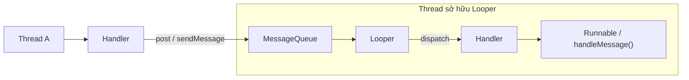
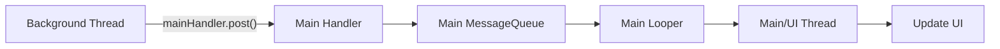
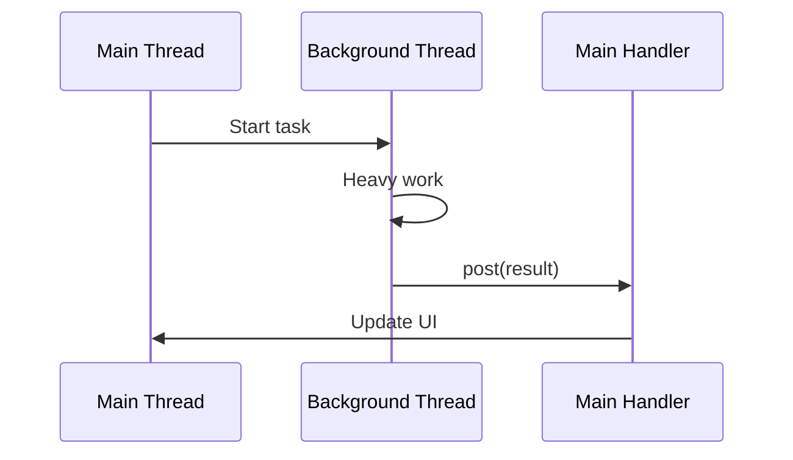
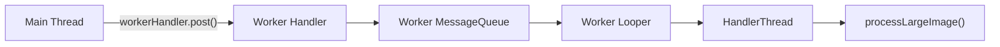
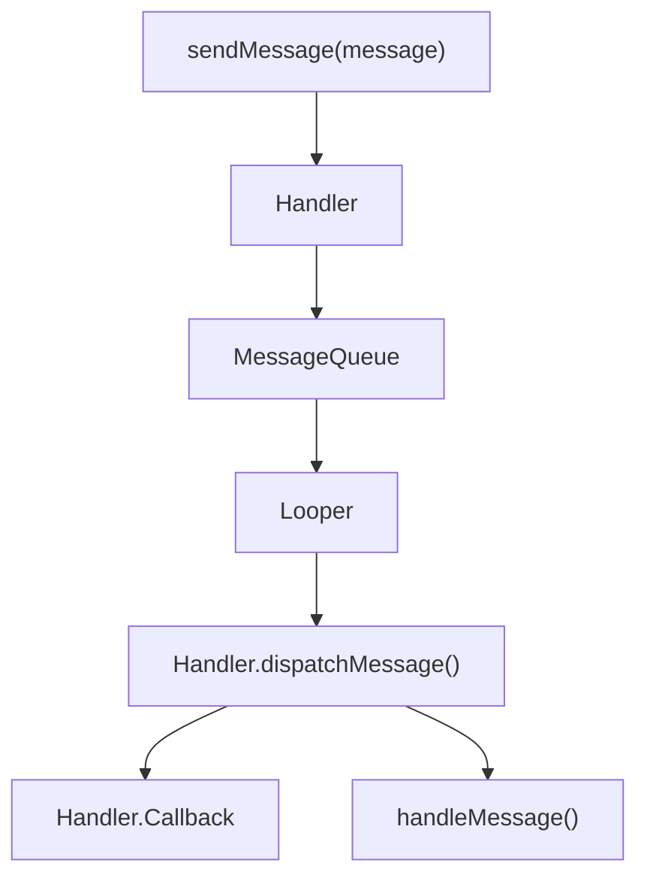
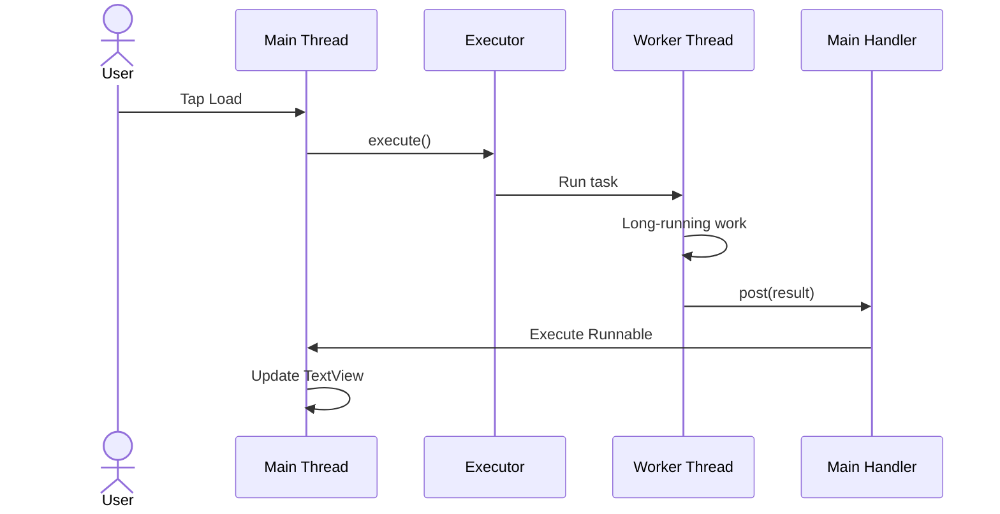
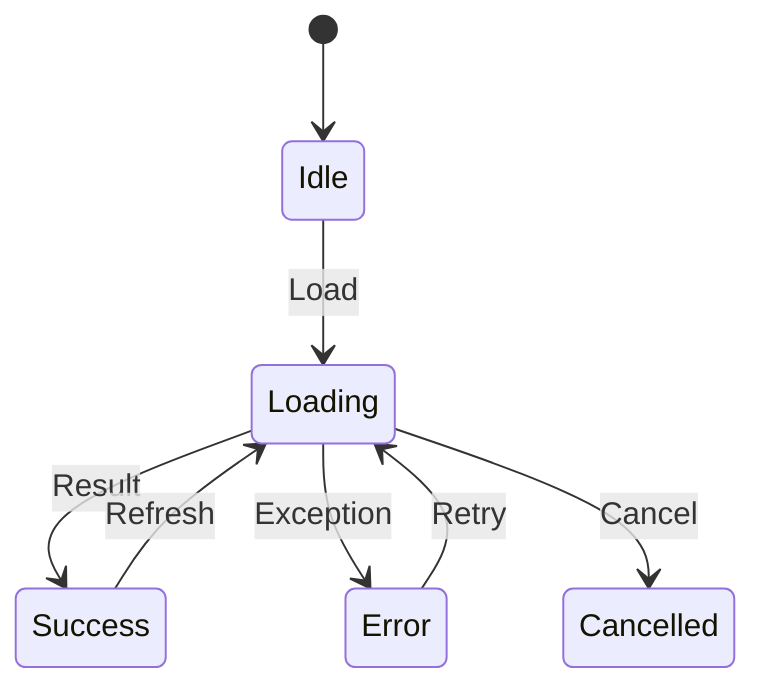
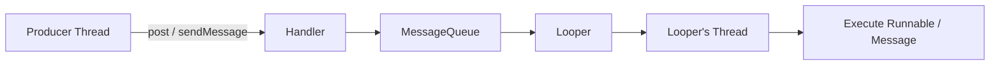
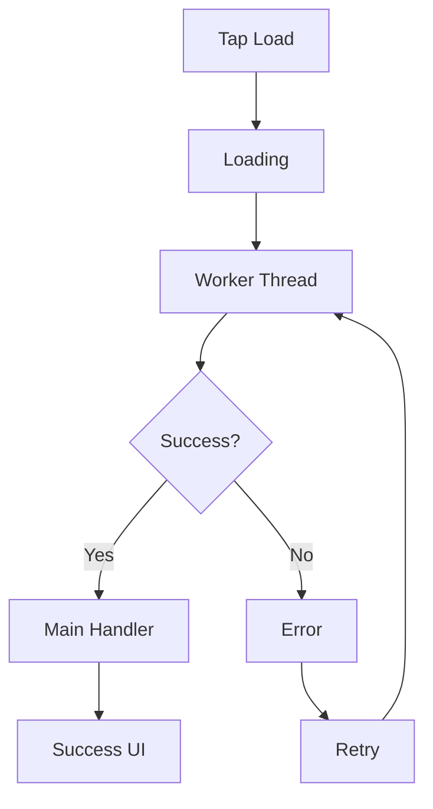

[](https://developer.android.com/courses/extras/multithreading?utm_source=chatgpt.com)

# 006 - Handler

**Học phần:** 04 - Network, Async and Services
**Module:** Module 08 - Asynchronism
**Nhóm nội dung:** Threading Basics
**Nguồn roadmap:** Asynchronism / Threading Basics
**Loại bài:** Async
**Thứ tự trong module:** 006
**Thời lượng gợi ý:** 34 phút

---

## 1. Tóm tắt

`Handler` là một thành phần nền tảng trong cơ chế xử lý message của Android. Nó cho phép gửi **`Runnable` hoặc `Message` vào `MessageQueue` của một `Looper`**, sau đó công việc được thực thi trên **thread mà Looper đó thuộc về**. Vì vậy, `Handler` không phải là một thread và bản thân nó cũng không tự tạo background thread. ([Android Developers][1])

Một ứng dụng Android mặc định có **main thread/UI thread** chịu trách nhiệm xử lý UI, input và nhiều callback của framework. Nếu thực hiện công việc blocking hoặc quá lâu trên main thread, UI có thể giật, đứng hoặc dẫn tới ANR. ([Android Developers][2])

Trong thực tế, Handler thường được dùng để:

* gửi kết quả từ background thread về main thread;
* xếp một `Runnable` để chạy sau;
* gửi `Message` giữa các thành phần chạy trên các thread có `Looper`;
* xử lý tuần tự một chuỗi công việc trên một `HandlerThread`;
* tương tác với những API Android cũ hoặc low-level sử dụng mô hình `Looper/Handler`.

> **Điểm cần nhớ:** `Handler` không đồng nghĩa với background processing. `Handler(Looper.getMainLooper())` vẫn chạy code trên **main thread**.

---

# 2. Mục tiêu học tập

Sau bài này, anh nên có thể:

* [ ] Giải thích được `Handler` là gì.
* [ ] Phân biệt `Handler`, `Looper`, `MessageQueue`, `Message`, `Runnable`.
* [ ] Hiểu Handler chạy code trên thread nào.
* [ ] Sử dụng `Handler(Looper.getMainLooper())`.
* [ ] Sử dụng `post()` và `postDelayed()`.
* [ ] Biết cách hủy callback bằng `removeCallbacks()`.
* [ ] Hiểu cách kết hợp `HandlerThread` và Handler.
* [ ] Không thực hiện long-running task trên main Handler.
* [ ] Biết khi nào nên dùng Coroutine/Executor thay cho Handler.
* [ ] Nhận biết nguy cơ lifecycle leak, stale callback và ANR.

---

# 3. Handler là gì?

Định nghĩa ngắn gọn:

> **Handler là đối tượng dùng để gửi và xử lý `Runnable` hoặc `Message` thông qua `MessageQueue` của một `Looper`.**

Mỗi Handler được gắn với một Looper cụ thể, và các task được Handler gửi vào queue sẽ chạy trên thread sở hữu Looper đó. ([Android Developers][1])

Ví dụ:

```kotlin
val handler = Handler(Looper.getMainLooper())
```

Handler trên được gắn với:

```text
Main Looper
     │
     ▼
Main MessageQueue
     │
     ▼
Main Thread
```

Do đó:

```kotlin
handler.post {
    textView.text = "Hello"
}
```

khối code trên sẽ được thực thi trên **main thread**.

---

# 4. Bốn thành phần quan trọng

Cơ chế Handler nên được học cùng bốn thành phần:

```text
Handler
Looper
MessageQueue
Message / Runnable
```

Android định nghĩa `MessageQueue` là cấu trúc low-level lưu các message chờ được Looper dispatch; ứng dụng thường không thêm message trực tiếp vào queue mà thông qua Handler. ([Android Developers][3])

| Thành phần     | Vai trò                                  |
| -------------- | ---------------------------------------- |
| `Thread`       | Nơi code thực sự chạy                    |
| `Looper`       | Liên tục lấy công việc từ queue          |
| `MessageQueue` | Chứa công việc đang chờ                  |
| `Handler`      | Gửi/nhận công việc thông qua queue       |
| `Runnable`     | Một khối code cần chạy                   |
| `Message`      | Đối tượng chứa thông tin gửi tới Handler |

---

# 5. Sơ đồ Handler – Looper – MessageQueue



Luồng cơ bản:

```text
Producer
   │
   │ handler.post(...)
   ▼
Handler
   │
   ▼
MessageQueue
   │
   │ Looper lấy task
   ▼
Looper
   │
   ▼
Handler
   │
   ▼
Runnable / Message được xử lý
```

Điểm quan trọng là **thread thực thi không được quyết định bởi thread gọi `post()`**, mà bởi **Looper gắn với Handler**. ([Android Developers][1])

---

# 6. Main Looper

Android chuẩn bị một Looper cho main thread. Main thread chịu trách nhiệm chính cho hoạt động UI của ứng dụng. ([Android Developers][4])

Có thể lấy nó bằng:

```kotlin
Looper.getMainLooper()
```

và tạo Handler:

```kotlin
private val mainHandler =
    Handler(Looper.getMainLooper())
```

Sơ đồ:



Đây từng là một pattern rất phổ biến để chuyển kết quả từ worker thread về UI.

---

# 7. Ví dụ cơ bản với `post()`

```kotlin
private val mainHandler =
    Handler(Looper.getMainLooper())

fun showMessage() {

    mainHandler.post {
        textView.text = "Hello Handler"
    }
}
```

`post()` thêm `Runnable` vào message queue của Handler. Runnable sau đó được thực thi trên thread liên kết với Handler. ([Android Developers][5])

---

# 8. `postDelayed()`

Handler cũng có thể lập lịch để một Runnable **không chạy trước một khoảng delay nhất định**:

```kotlin
private val handler =
    Handler(Looper.getMainLooper())

handler.postDelayed(
    {
        textView.text = "3 giây đã trôi qua"
    },
    3000L
)
```

Luồng:

```text
postDelayed(3000)
        │
        ▼
MessageQueue
        │
        │ chờ thời điểm đủ điều kiện
        ▼
Looper
        │
        ▼
Runnable
```

Theo API Android, `postDelayed()` dùng `SystemClock.uptimeMillis()` làm time base; deep sleep có thể khiến thời điểm thực thi thực tế muộn hơn. Vì vậy không nên xem nó như một hệ thống alarm chính xác tuyệt đối. ([Android Developers][5])

---

# 9. Handler không phải Timer

Một lỗi tư duy phổ biến là:

```text
postDelayed(1000)
```

được hiểu thành:

```text
"chính xác 1000 ms nữa chạy"
```

Thực tế gần hơn với:

```text
"đưa task vào queue để đủ điều kiện chạy
sau ít nhất khoảng thời gian đó"
```

Nếu main thread đang bận:

```text
0 ms       1000 ms        1300 ms
│             │              │
post          │              │
              │ delay hết    │
              │              │
              └── queue bận ─┘
                             │
                             ▼
                        Runnable chạy
```

Handler xử lý dựa trên message queue, nên task vẫn phải chờ những công việc phù hợp đang đứng trước nó. ([Android Developers][5])

---

# 10. Hủy Runnable

Giả sử có:

```kotlin
private val handler =
    Handler(Looper.getMainLooper())

private val hideRunnable = Runnable {
    textView.visibility = View.GONE
}
```

Đăng task:

```kotlin
handler.postDelayed(
    hideRunnable,
    5000L
)
```

Hủy:

```kotlin
handler.removeCallbacks(hideRunnable)
```

Android cung cấp `removeCallbacks()` để loại bỏ các lần post đang chờ của Runnable khỏi queue. ([Android Developers][5])

---

# 11. Handler và Lifecycle

Đây là một vấn đề rất quan trọng.

Ví dụ:

```kotlin
class MainActivity : AppCompatActivity() {

    private val handler =
        Handler(Looper.getMainLooper())

    override fun onCreate(savedInstanceState: Bundle?) {
        super.onCreate(savedInstanceState)

        handler.postDelayed({
            textView.text = "Finished"
        }, 30_000)
    }
}
```

Trong 30 giây đó người dùng có thể:

```text
Activity A
   │
   │ postDelayed()
   ▼
MessageQueue

User rotate / Back
   │
   ▼
Activity A destroyed

Message vẫn chờ
   │
   ▼
Runnable chạy sau
```

Nếu Runnable giữ reference tới Activity/View cũ, code có thể cập nhật UI không còn hợp lệ hoặc giữ object lâu hơn cần thiết.

Một cách đơn giản với Handler truyền thống:

```kotlin
private val handler =
    Handler(Looper.getMainLooper())

private val task = Runnable {
    updateUi()
}

override fun onStart() {
    super.onStart()

    handler.postDelayed(
        task,
        5000L
    )
}

override fun onStop() {
    handler.removeCallbacks(task)

    super.onStop()
}
```

Với Kotlin hiện đại, coroutine scopes của Android Lifecycle thường thuận tiện hơn vì `viewModelScope`, `LaunchedEffect` và các scope lifecycle-aware có cơ chế cancellation gắn với lifecycle. ([Android Developers][6])

---

# 12. Sai lầm: dùng Handler để chạy long-running task

Đoạn này:

```kotlin
val handler =
    Handler(Looper.getMainLooper())

handler.post {
    val result = verySlowOperation()
    textView.text = result
}
```

**không chuyển `verySlowOperation()` sang background thread.**

Nó tương đương:

```text
Main Handler
     │
     ▼
Main MessageQueue
     │
     ▼
Main Thread
     │
     ▼
verySlowOperation()
```

Nếu operation chặn thread quá lâu:

```text
Main Thread blocked
        │
        ├── không xử lý input
        ├── không render UI đúng lúc
        ├── UI freeze
        │
        ▼
       ANR
```

Android khuyến cáo không chạy blocking hoặc long-running work trên main thread. ([Android Developers][7])

---

# 13. Background Thread → Handler → UI

Pattern cổ điển:



Ví dụ:

```kotlin
private val mainHandler =
    Handler(Looper.getMainLooper())

Thread {

    val result = performLongTask()

    mainHandler.post {
        textView.text = result
    }

}.start()
```

Ở đây:

```text
performLongTask()
```

chạy trên worker thread, còn:

```text
textView.text = result
```

được gửi về main thread.

---

# 14. Handler + Executor

Trong code Java hoặc khi muốn minh họa rõ thread pool, một pattern tốt hơn việc tạo `Thread()` liên tục là sử dụng `ExecutorService`.

Android hiện hướng dẫn dùng thread pool/Executor cho Java asynchronous work, thay vì liên tục tạo thread mới. ([Android Developers][7])

Ví dụ Kotlin minh họa:

```kotlin
private val executor =
    Executors.newSingleThreadExecutor()

private val mainHandler =
    Handler(Looper.getMainLooper())

fun loadData() {

    executor.execute {

        val result = performLongTask()

        mainHandler.post {
            textView.text = result
        }
    }
}
```

Kiến trúc:

```text
UI
 │
 │ execute()
 ▼
Executor
 │
 ▼
Worker Thread
 │
 │ result
 ▼
Main Handler
 │
 ▼
Main Thread
 │
 ▼
UI
```

---

# 15. HandlerThread

Android cũng cung cấp `HandlerThread`: một `Thread` đã có sẵn `Looper`, cho phép Handler gửi các task đến thread đó. ([Android Developers][8])

Ví dụ:

```kotlin
private val workerThread =
    HandlerThread("ImageWorker")

private lateinit var workerHandler: Handler

fun startWorker() {

    workerThread.start()

    workerHandler =
        Handler(workerThread.looper)
}
```

Sau đó:

```kotlin
workerHandler.post {

    processLargeImage()
}
```

Sơ đồ:



Khác hoàn toàn với:

```kotlin
Handler(Looper.getMainLooper())
```

### Main Handler

```text
Handler
  ↓
Main Looper
  ↓
Main Thread
```

### Worker Handler

```text
Handler
  ↓
Worker Looper
  ↓
HandlerThread
```

---

# 16. HandlerThread xử lý tuần tự

Một Handler gắn với một HandlerThread có thể nhận:

```kotlin
workerHandler.post(taskA)
workerHandler.post(taskB)
workerHandler.post(taskC)
```

Mô hình về cơ bản là:

```text
MessageQueue

┌─────────┐
│ Task A  │
├─────────┤
│ Task B  │
├─────────┤
│ Task C  │
└─────────┘
     │
     ▼
Single HandlerThread
```

Do chỉ có một thread xử lý queue đó, các task không trở thành ba tác vụ CPU chạy song song.

Nếu cần concurrency tốt hơn, thread pool/Executor hoặc coroutines thường phù hợp hơn. Tài liệu HandlerThread hiện cũng khuyến nghị ưu tiên `Executor` hoặc Kotlin coroutines cho nhiều use case concurrency vì HandlerThread có các vấn đề như thread overhead và contention. ([Android Developers][8])

---

# 17. Dừng HandlerThread

Khi không dùng nữa:

```kotlin
workerThread.quitSafely()
```

`quitSafely()` cho phép các message đã đến hạn được xử lý trước khi Looper kết thúc; các delayed message chưa đến hạn sẽ không tiếp tục được thực thi. ([Android Developers][9])

Ví dụ:

```kotlin
override fun onDestroy() {

    workerThread.quitSafely()

    super.onDestroy()
}
```

Tuy nhiên lifecycle ownership phải được thiết kế theo use case; không nên mặc định gắn mọi background task với Activity.

---

# 18. Runnable vs Message

Handler hỗ trợ hai phong cách chính.

## Runnable

```kotlin
handler.post {
    updateUi()
}
```

Phù hợp khi chỉ muốn:

```text
"chạy đoạn code này"
```

## Message

```kotlin
val handler = Handler(
    Looper.getMainLooper()
) { message ->

    when (message.what) {

        1 -> {
            textView.text = "Success"
            true
        }

        2 -> {
            textView.text = "Error"
            true
        }

        else -> false
    }
}
```

Gửi message:

```kotlin
handler.sendEmptyMessage(1)
```

`Message` là container Android cung cấp để truyền mô tả và dữ liệu tới Handler. ([Android Developers][10])

---

# 19. Luồng của Message



Có thể hình dung:

```text
Message
 ├── what
 ├── arg1
 ├── arg2
 └── obj
```

Ví dụ:

```kotlin
val message = handler.obtainMessage().apply {
    what = MESSAGE_FINISHED
    obj = "Result"
}

handler.sendMessage(message)
```

---

# 20. Constructor Handler nên dùng hiện nay

Tránh code kiểu cũ:

```kotlin
val handler = Handler()
```

Constructor không chỉ định Looper đã bị deprecated vì việc ngầm chọn Looper có thể gây lỗi khi code được tạo trên thread không có Looper hoặc Handler bị gắn với thread khác dự kiến. Android khuyến cáo chỉ định Looper rõ ràng hoặc dùng abstraction phù hợp như Executor. ([Android Developers][5])

Nên viết:

```kotlin
val handler =
    Handler(Looper.getMainLooper())
```

hoặc:

```kotlin
val workerHandler =
    Handler(workerThread.looper)
```

Cách này làm rõ ngay:

```text
Handler này sẽ chạy ở đâu?
```

---

# 21. Handler vs Thread

Không nên hiểu:

```text
Handler = Thread
```

Mà phải hiểu:

```text
Thread
   │
   └── Looper
          │
          └── MessageQueue
                  ▲
                  │
               Handler
```

| Handler                   | Thread                           |
| ------------------------- | -------------------------------- |
| Xếp task                  | Thực thi code                    |
| Gắn với Looper            | Có execution stack riêng         |
| Có `post()`               | Có `start()`                     |
| Không tự tạo concurrency  | Có thể tạo execution context mới |
| Task chạy ở Looper thread | Code chạy trên chính thread      |

---

# 22. Handler vs Executor

```text
Handler
│
└── MessageQueue + Looper
    └── thường hướng tới một thread cụ thể
```

Trong khi:

```text
Executor
│
├── Worker 1
├── Worker 2
├── Worker 3
└── Worker N
```

Executor phù hợp hơn khi cần:

* thread pool;
* xử lý nhiều task;
* phân phối workload;
* tránh tự quản lý nhiều raw Thread.

Android hiện hướng dẫn Java asynchronous work sử dụng thread pools/Executor, còn Kotlin được khuyến nghị dùng coroutines. ([Android Developers][7])

---

# 23. Handler vs Coroutine

Trong ứng dụng Kotlin hiện đại:

```kotlin
viewModelScope.launch {

    val result = repository.loadData()

    _uiState.value = result
}
```

thường dễ quản lý hơn:

```kotlin
Thread {
    val result = loadData()

    handler.post {
        updateUI(result)
    }
}.start()
```

Android hiện khuyến nghị coroutines cho Kotlin asynchronous work vì chúng tích hợp cancellation, structured concurrency và Jetpack/lifecycle APIs. ([Android Developers][7])

### Không có nghĩa Handler vô dụng

Anh vẫn nên học Handler vì nó giúp hiểu:

```text
Main Thread
Looper
MessageQueue
Thread scheduling
Android event loop
HandlerThread
```

và nhiều API/framework internals của Android dựa trên các khái niệm này.

---

# 24. Handler không phải công cụ background work lâu dài

Cần phân biệt:

```text
Handler
    ≠
WorkManager
```

Ví dụ:

### Delay UI nhỏ

```text
Ẩn snackbar sau vài giây
```

có thể phù hợp với Handler/coroutine.

### Upload phải tiếp tục đáng tin cậy

```text
Upload log
Sync server
Backup
```

không nên dựa vào một delayed Handler callback.

Android phân biệt asynchronous in-process work với persistent background work; với công việc phải sống qua việc app rời trạng thái chạy, WorkManager thường là abstraction phù hợp hơn. ([Android Developers][11])

---

# 25. Ví dụ thực hành hoàn chỉnh

## Yêu cầu

Giả lập:

```text
Load dữ liệu mất 3 giây
```

Không được block UI.

### Code

```kotlin
class MainActivity : AppCompatActivity() {

    private val executor =
        Executors.newSingleThreadExecutor()

    private val mainHandler =
        Handler(Looper.getMainLooper())

    override fun onCreate(
        savedInstanceState: Bundle?
    ) {
        super.onCreate(savedInstanceState)

        setContentView(R.layout.activity_main)

        findViewById<Button>(R.id.loadButton)
            .setOnClickListener {

                loadData()
            }
    }

    private fun loadData() {

        Log.d("ASYNC", "Loading")

        executor.execute {

            try {

                Thread.sleep(3000)

                val result = "Data loaded"

                mainHandler.post {

                    Log.d("ASYNC", "Success")

                    findViewById<TextView>(
                        R.id.statusText
                    ).text = result
                }

            } catch (e: InterruptedException) {

                Thread.currentThread().interrupt()

                mainHandler.post {
                    Log.d("ASYNC", "Cancelled")
                }
            }
        }
    }

    override fun onDestroy() {

        executor.shutdownNow()

        super.onDestroy()
    }
}
```

Luồng:



---

# 26. State nên được nhìn như thế nào?

Một async flow đơn giản:



Handler chỉ giải quyết một phần:

```text
"Task này chạy ở thread nào?"
```

Nó **không tự quản lý**:

```text
Loading
Success
Error
Retry
Lifecycle
State restoration
```

Những phần đó thuộc về kiến trúc application, ViewModel, repository và UI state.

---

# 27. Logging để debug

Một kỹ thuật cực hữu ích khi học threading:

```kotlin
private fun logThread(message: String) {

    Log.d(
        "THREAD",
        "$message | ${Thread.currentThread().name}"
    )
}
```

Dùng:

```kotlin
logThread("Before executor")

executor.execute {

    logThread("Inside executor")

    mainHandler.post {

        logThread("Inside handler")
    }
}
```

Kỳ vọng gần như:

```text
Before executor
→ main

Inside executor
→ pool-1-thread-1

Inside handler
→ main
```

Từ đó có thể trực tiếp chứng minh Handler đang gắn với thread nào.

---

# 28. Bug phổ biến

## Bug 1 — Heavy work trong Main Handler

```kotlin
mainHandler.post {
    decodeHugeBitmap()
}
```

Sai vì:

```text
Main Handler
    ↓
Main Thread
    ↓
Heavy work
    ↓
UI jank / freeze
```

---

## Bug 2 — Dùng constructor cũ

```kotlin
Handler()
```

Nên thay bằng:

```kotlin
Handler(Looper.getMainLooper())
```

Constructor Handler ngầm chọn Looper đã deprecated. ([Android Developers][5])

---

## Bug 3 — Không hủy delayed callback

```kotlin
handler.postDelayed(task, 60_000)
```

Activity bị destroy nhưng callback vẫn không được xem xét/hủy theo lifecycle.

Nên có ownership/cancellation rõ ràng:

```kotlin
handler.removeCallbacks(task)
```

hoặc dùng lifecycle-aware coroutine khi phù hợp.

---

## Bug 4 — Tưởng `postDelayed` là timer chính xác

```text
postDelayed(1000)
```

không đảm bảo callback sẽ thực thi chính xác tại 1000 ms; nó vẫn phụ thuộc Looper/message queue và time base của API. ([Android Developers][5])

---

## Bug 5 — Tạo quá nhiều HandlerThread

```text
Feature A → HandlerThread
Feature B → HandlerThread
Feature C → HandlerThread
Feature D → HandlerThread
...
```

Mỗi HandlerThread là một OS thread, nên tạo quá nhiều sẽ làm tăng memory/thread overhead. Android hiện khuyên xem xét Executor hoặc coroutines thay thế. ([Android Developers][8])

---

# 29. Handler và ANR

Ví dụ nguy hiểm:

```kotlin
Handler(Looper.getMainLooper()).post {

    Thread.sleep(10_000)
}
```

Sơ đồ:

```text
Main MessageQueue
       │
       ▼
Runnable
       │
       ▼
sleep(10 sec)
       │
       ├── drawing ❌
       ├── touch events ❌
       ├── lifecycle callbacks chờ
       │
       ▼
UI unresponsive
```

ANR liên quan chặt với việc main thread không thể xử lý công việc cần thiết đúng thời gian; Android khuyến cáo giữ main thread không bị block. ([Android Developers][12])

---

# 30. Handler trong Android 2026

Có hai điều đáng ghi nhớ trong roadmap 2026.

### 1. Handler vẫn là kiến thức nền tảng

Anh cần hiểu:

```text
Handler
Looper
MessageQueue
Main Thread
```

để hiểu event-loop của Android.

### 2. Không nên mặc định Handler là abstraction async cấp ứng dụng

Với Kotlin application code:

```text
Coroutines
```

thường là lựa chọn cấp cao hơn.

Với Java:

```text
Executor / ExecutorService
```

thường phù hợp hơn cho background work. Android documentation hiện trực tiếp khuyến nghị coroutines cho Kotlin và Executor/thread pools cho Java scenarios. ([Android Developers][7])

---

# 31. Ghi chú Android 17

Android 17 có thay đổi đáng chú ý ở tầng rất thấp của cơ chế này: với app target Android 17/API 37 trở lên, Android sử dụng implementation `MessageQueue` mới theo hướng lock-free nhằm giảm contention và missed frames. Google cảnh báo các app/library không nên dựa vào reflection để truy cập private internals của `MessageQueue`. ([Android Developers][13])

Về mặt application code:

```kotlin
Handler(Looper.getMainLooper())
```

vẫn là API hợp lệ.

Điều cần tránh là code kiểu:

```text
reflection
   ↓
MessageQueue private fields
```

vì implementation nội bộ không phải contract công khai. ([Android Developers][13])

---

# 32. Khi nào dùng gì?

| Nhu cầu                                           | Công cụ nên cân nhắc  |
| ------------------------------------------------- | --------------------- |
| Post code về main thread                          | `Handler(MainLooper)` |
| Delay callback nhỏ                                | Handler / Coroutine   |
| Học Android event loop                            | Handler + Looper      |
| Sequential low-level worker queue                 | HandlerThread         |
| Kotlin async work                                 | Coroutine             |
| Java background work                              | Executor              |
| Thread pool                                       | Executor              |
| Lifecycle-aware work                              | Coroutine scope       |
| Work phải tồn tại đáng tin cậy ngoài UI lifecycle | WorkManager           |

Android hiện khuyến nghị coroutines cho Kotlin và Executor/thread pools cho nhiều Java/background-thread use case. ([Android Developers][7])

---

# 33. Mental model quan trọng nhất

Nếu chỉ nhớ một sơ đồ trong bài này, hãy nhớ:



Và công thức:

```text
Handler không quyết định tạo thread mới.

Handler
   ↓
gắn với Looper
   ↓
Looper thuộc Thread nào
   ↓
Task chạy trên Thread đó
```

Ví dụ:

```kotlin
Handler(Looper.getMainLooper())
```

→ Main Thread.

```kotlin
Handler(workerThread.looper)
```

→ Worker Thread.

---

# 34. Thực hành

## Bài thực hành: Background Task + Handler

Xây một màn hình:

```text
┌───────────────────────────────┐
│ Async Handler Demo            │
│                               │
│ Status: Idle                  │
│                               │
│ [ START TASK ]                │
│                               │
│ Thread: main                  │
└───────────────────────────────┘
```

Khi nhấn:

```text
Idle
 ↓
Loading
 ↓
Background worker
 ↓
3 giây
 ↓
Main Handler
 ↓
Success
```

Yêu cầu:

1. Không block main thread.
2. Log tên thread.
3. Background work chạy bằng Executor.
4. Kết quả gửi về `Handler(Looper.getMainLooper())`.
5. Có `Loading`.
6. Có `Success`.
7. Có `Error`.
8. Có cancellation.
9. Rotate màn hình và quan sát lifecycle.
10. Viết README giải thích luồng execution.

---

# 35. Bài tập mở rộng

Cho flow:



Hãy triển khai sao cho Logcat cho thấy:

```text
[main] user clicked load

[pool-1-thread-1] task started

[pool-1-thread-1] task completed

[main] UI updated
```

Sau đó trả lời:

```text
1. Vì sao UI không bị block?

2. Handler đang dùng Looper nào?

3. Runnable cuối chạy ở thread nào?

4. Nếu bỏ Executor thì chuyện gì xảy ra?

5. Nếu Activity bị destroy trước khi callback về thì sao?

6. Coroutine có thể đơn giản hóa code này như thế nào?
```

---

# 36. Artifact cho portfolio

Có thể tạo mini project:

```text
HandlerThreadDemo/
│
├── MainActivity.kt
├── AsyncRepository.kt
├── activity_main.xml
│
└── README.md
```

README nên có:

```text
# Android Handler Demo

## Concepts
- Main Thread
- Worker Thread
- Handler
- Looper
- MessageQueue
- Executor

## Flow

User
 ↓
Main Thread
 ↓
Executor
 ↓
Worker
 ↓
Main Handler
 ↓
UI

## Features
- Loading
- Success
- Error
- Cancellation
- Thread logging

## Lessons learned
- Handler != Thread
- Main Handler does not move work off main
- Handler executes on its Looper thread
- Long-running work belongs off main
```

Đây là artifact nhỏ nhưng thể hiện được rằng anh hiểu **thread switching**, chứ không chỉ biết gọi API.

---

# 37. Checklist hoàn thành

* [ ] Giải thích được Handler bằng lời của mình.
* [ ] Biết Handler không phải Thread.
* [ ] Biết Handler gắn với Looper.
* [ ] Biết Looper có MessageQueue.
* [ ] Hiểu `Handler(Looper.getMainLooper())`.
* [ ] Biết `post()`.
* [ ] Biết `postDelayed()`.
* [ ] Biết `removeCallbacks()`.
* [ ] Biết dùng HandlerThread ở mức cơ bản.
* [ ] Không chạy heavy work trên main Handler.
* [ ] Có cancellation/lifecycle strategy.
* [ ] Log được tên thread.
* [ ] Biết khi nào dùng Coroutine hoặc Executor.
* [ ] Có demo hoặc README đưa vào portfolio.

---

# 38. Ghi chú production

Khi review code có Handler, nên tự hỏi:

```text
Handler này dùng Looper nào?
        ↓
Task sẽ chạy trên thread nào?
        ↓
Có block Main Thread không?
        ↓
Callback có sống lâu hơn UI không?
        ↓
Có cần cancel không?
        ↓
postDelayed có thật sự phù hợp không?
        ↓
Coroutine / Executor / WorkManager
có phù hợp hơn không?
```

Đối với ứng dụng Kotlin hiện đại, Handler nên được xem chủ yếu như một **primitive của Android threading/event loop** hoặc công cụ cho những use case cụ thể, chứ không phải giải pháp mặc định cho mọi asynchronous operation. Android hiện cung cấp hỗ trợ lifecycle-aware rất mạnh cho coroutines và khuyến nghị dùng chúng cho Kotlin asynchronous work. ([Android Developers][6])

---

# 39. Tóm tắt một phút

```text
                 HANDLER
                    │
        ┌───────────┴───────────┐
        │                       │
      post()                sendMessage()
        │                       │
        └───────────┬───────────┘
                    ▼
              MessageQueue
                    │
                    ▼
                  Looper
                    │
                    ▼
                 Thread
```

**Quy tắc vàng:**

```text
Handler
không tạo thread.

Handler gắn với Looper.

Looper thuộc thread nào
→ code chạy trên thread đó.
```

Và với Android/Kotlin hiện đại:

```text
Handler
→ hiểu nền tảng Android

Coroutine
→ async application code

Executor
→ thread pool / Java

WorkManager
→ persistent background work
```

([Android Developers][1])

[1]: https://developer.android.com/reference/kotlin/android/os/Handler?utm_source=chatgpt.com "Handler | API reference"
[2]: https://developer.android.com/guide/components/processes-and-threads?utm_source=chatgpt.com "Processes and threads overview | App quality"
[3]: https://developer.android.com/reference/kotlin/android/os/MessageQueue?utm_source=chatgpt.com "MessageQueue | API reference"
[4]: https://developer.android.com/reference/android/os/Looper?utm_source=chatgpt.com "Looper | API reference"
[5]: https://developer.android.com/reference/android/os/Handler "Handler  |  API reference  |  Android Developers"
[6]: https://developer.android.com/topic/libraries/architecture/coroutines "Use Kotlin coroutines with lifecycle-aware components  |  App architecture  |  Android Developers"
[7]: https://developer.android.com/develop/background-work/background-tasks/asynchronous/java-threads "Asynchronous work with Java threads  |  Background work  |  Android Developers"
[8]: https://developer.android.com/reference/kotlin/android/os/HandlerThread "HandlerThread  |  API reference  |  Android Developers"
[9]: https://developer.android.com/reference/android/os/HandlerThread?utm_source=chatgpt.com "HandlerThread | API reference"
[10]: https://developer.android.com/reference/kotlin/android/os/Message?utm_source=chatgpt.com "Message | API reference"
[11]: https://developer.android.com/develop/background-work/background-tasks/persistent?utm_source=chatgpt.com "Task scheduling | Background work"
[12]: https://developer.android.com/topic/performance/vitals/anr?utm_source=chatgpt.com "ANRs | App quality"
[13]: https://developer.android.com/about/versions/17/changes/messagequeue "MessageQueue behavior change guidance  |  Android Developers"
