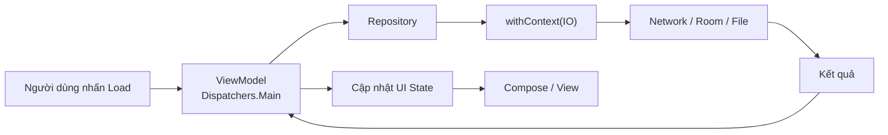
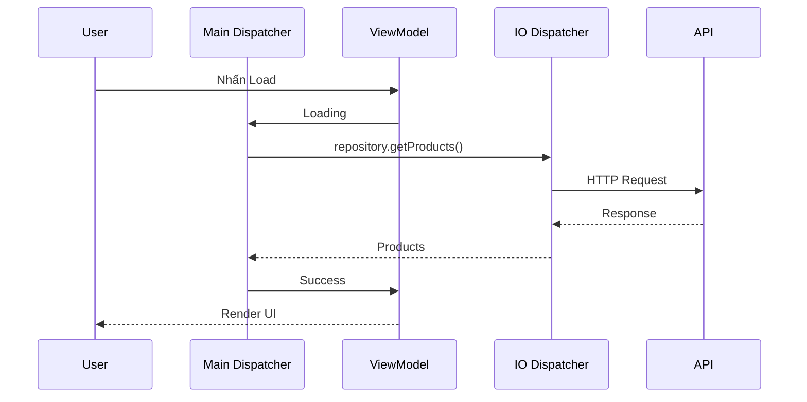
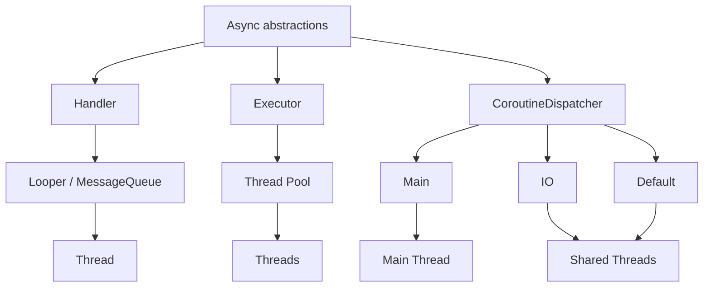
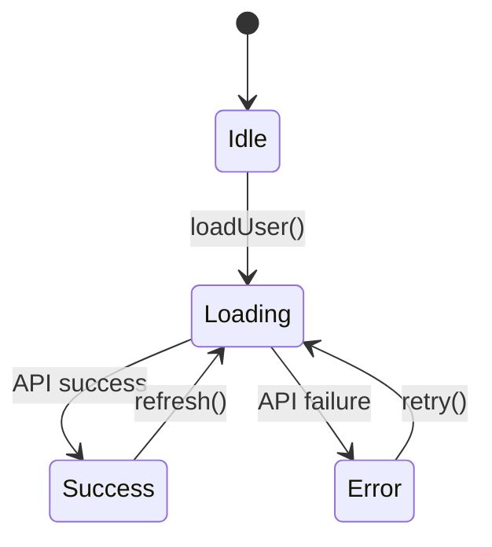
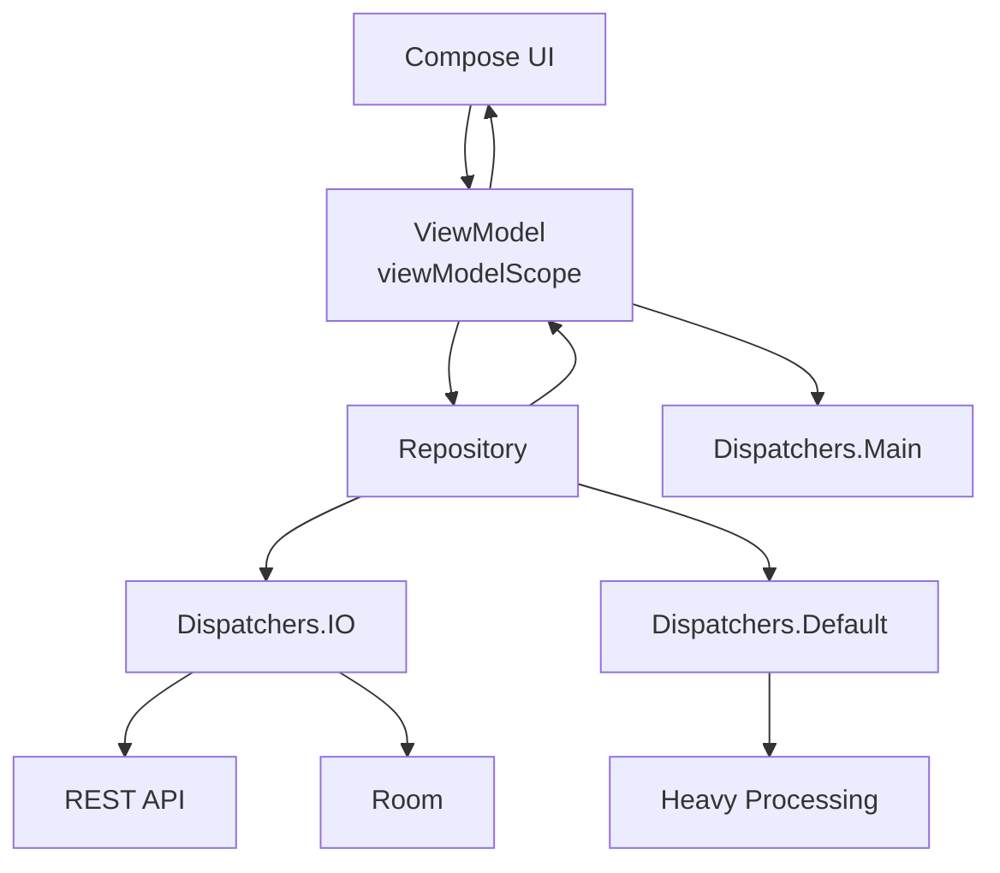
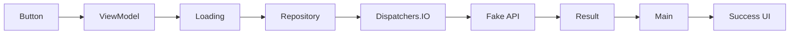
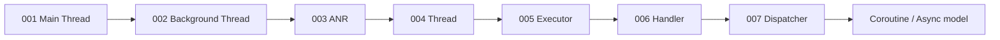

[](https://medium.com/%40newswire22/how-does-dispatchers-main-differ-from-dispatchers-io-and-dispatchers-default-a54aa85a6409?utm_source=chatgpt.com)

# 007 - Dispatcher

**Học phần:** 04 - Network, Async and Services
**Module:** Module 08 - Asynchronism
**Nhóm nội dung:** Threading Basics
**Nguồn roadmap:** Asynchronism / Threading Basics
**Loại bài:** Async / Coroutines
**Thứ tự trong module:** 007
**Thời lượng gợi ý:** 34 phút

---

## 1. Tóm tắt

Trong Android hiện đại sử dụng Kotlin, **Dispatcher** thường nói đến `CoroutineDispatcher` của Kotlin Coroutines.

Hiểu đơn giản:

> **Dispatcher quyết định coroutine sẽ được thực thi hoặc tiếp tục thực thi ở đâu.**

Nó không phải bản thân một `Thread`. Dispatcher là một lớp trừu tượng điều phối coroutine tới thread hoặc nhóm thread thích hợp. Android thường sử dụng ba dispatcher quan trọng:

* `Dispatchers.Main` → công việc liên quan UI.
* `Dispatchers.IO` → network, file, database và blocking I/O.
* `Dispatchers.Default` → công việc nặng CPU.

Android Developers cũng nhấn mạnh rằng `suspend` **không tự động đồng nghĩa với chạy background**; khi một hàm cần thực hiện I/O hoặc tính toán nặng, code cần được làm **main-safe**, thường bằng `withContext()` với dispatcher phù hợp. ([Android Developers][1])

---

# 2. Mục tiêu học tập

Sau bài này, anh nên có thể:

* [ ] Giải thích Dispatcher bằng ngôn ngữ của mình.
* [ ] Phân biệt Dispatcher với `Thread`, `Executor` và `Handler`.
* [ ] Biết khi nào dùng `Main`, `IO`, `Default`.
* [ ] Biết chuyển dispatcher bằng `withContext()`.
* [ ] Hiểu rằng `suspend` không có nghĩa là background thread.
* [ ] Viết một suspend function **main-safe**.
* [ ] Kết hợp Dispatcher với `viewModelScope`.
* [ ] Hiểu cancellation liên quan tới lifecycle.
* [ ] Inject Dispatcher để code dễ test.
* [ ] Kiểm tra coroutine bằng `runTest` và `TestDispatcher`.

---

# 3. Dispatcher là gì?

`CoroutineDispatcher` chịu trách nhiệm xác định coroutine được chạy trên thread nào hoặc pool thread nào.

Kotlin cũng cho phép coroutine kế thừa dispatcher từ `CoroutineScope` cha nếu không chỉ định dispatcher riêng. `Dispatchers.Default` sử dụng một shared background thread pool khi nó được dùng làm dispatcher mặc định. ([Kotlin][2])

Có thể hình dung:

```text
Coroutine
    │
    ▼
CoroutineDispatcher
    │
    ├── Main ────────► Main Thread
    │
    ├── IO ──────────► Shared thread pool
    │
    └── Default ─────► CPU-oriented thread pool
```

Dispatcher giống như **người điều phối công việc**, còn Thread giống như **người thực sự thực hiện công việc**.

---

# 4. Mô hình tổng quát trong Android

Một flow rất phổ biến là:



Điểm quan trọng:

```text
UI
 ↓
Main
 ↓
Repository
 ↓
IO
 ↓
API / Database
 ↓
Main
 ↓
UI
```

Android Developers khuyến nghị các hàm ở data/domain layer tự đảm bảo **main-safety**, thay vì buộc ViewModel phải biết hàm nào cần chuyển thread. ([Android Developers][1])

---

# 5. Ba Dispatcher quan trọng nhất

## 5.1 `Dispatchers.Main`

Dùng cho code cần chạy trên **Android Main Thread**, đặc biệt là những thao tác liên quan UI. Kotlin định nghĩa `Dispatchers.Main` là dispatcher gắn với main thread của nền tảng UI; trên Android nó được cung cấp qua `kotlinx-coroutines-android`. ([Kotlin][3])

Ví dụ:

```kotlin
viewModelScope.launch {
    _uiState.value = UiState.Loading
}
```

Hoặc:

```kotlin
lifecycleScope.launch {
    textView.text = "Hello"
}
```

### Phù hợp

```text
Main
├── cập nhật UI state
├── gọi suspend function main-safe
├── thao tác Android UI
└── công việc rất ngắn
```

### Không phù hợp

```text
Main
├── ❌ đọc file lớn
├── ❌ network blocking
├── ❌ xử lý ảnh nặng
├── ❌ sort dataset rất lớn
└── ❌ vòng lặp CPU dài
```

Android Developers khuyến nghị chỉ dùng Main cho UI và các công việc nhanh. ([Android Developers][1])

---

# 6. `Dispatchers.IO`

`Dispatchers.IO` được thiết kế cho **blocking I/O**, sử dụng shared pool các thread và có thể tạo thêm thread theo nhu cầu. ([Kotlin][4])

Ví dụ:

```kotlin
suspend fun loadUser(): User {
    return withContext(Dispatchers.IO) {
        api.getUser()
    }
}
```

Các workload điển hình:

```text
Dispatchers.IO
      │
      ├── Network
      ├── File I/O
      ├── Database
      ├── Blocking SDK
      └── Input / Output
```

Android Developers đưa network, disk và Room vào nhóm công việc phù hợp với dispatcher I/O. ([Android Developers][1])

---

# 7. `Dispatchers.Default`

`Dispatchers.Default` dành cho công việc **CPU-intensive**.

Trên JVM, nó sử dụng shared thread pool và mặc định số thread tối đa liên quan tới số CPU core của máy. ([Kotlin][5])

Ví dụ:

```kotlin
suspend fun processImage(bitmap: Bitmap): Bitmap {
    return withContext(Dispatchers.Default) {
        applyHeavyFilter(bitmap)
    }
}
```

Ví dụ workload:

```text
Dispatchers.Default
        │
        ├── Sorting
        ├── Data processing
        ├── Image processing
        ├── Compression
        ├── Encryption
        └── Algorithm nặng CPU
```

Android Developers cũng đưa sorting và parsing/processing nặng vào nhóm use case của `Default`. ([Android Developers][1])

---

# 8. Main vs IO vs Default

| Dispatcher | Mục đích             | Ví dụ                       |
| ---------- | -------------------- | --------------------------- |
| `Main`     | UI / công việc nhanh | update State, UI            |
| `IO`       | I/O blocking         | network, file, database     |
| `Default`  | CPU intensive        | sort, xử lý ảnh, thuật toán |

Quy tắc nhớ nhanh:

```text
UI?
 │
 └── Main

Đang chờ dữ liệu?
 │
 └── IO

CPU đang phải tính toán?
 │
 └── Default
```

Các vai trò này phù hợp với hướng dẫn hiện tại của Android Developers. ([Android Developers][1])

---

# 9. `withContext()` — chuyển Dispatcher

Đây là phần quan trọng nhất của bài.

Ví dụ:

```kotlin
suspend fun loadProducts(): List<Product> {
    return withContext(Dispatchers.IO) {
        api.getProducts()
    }
}
```

Giả sử coroutine ban đầu đang ở `Main`:

```text
Main
 │
 │ loadProducts()
 ▼
withContext(IO)
 │
 ▼
IO
 │
 │ api.getProducts()
 ▼
Result
 │
 ▼
Main
```

`withContext()` là suspend function. Khi block hoàn thành, coroutine có thể tiếp tục trong context của caller. Android sử dụng chính pattern này để minh họa cách tạo các hàm main-safe. ([Android Developers][1])

---

# 10. Ví dụ hoàn chỉnh: tải dữ liệu từ API

## Repository

```kotlin
class ProductRepository(
    private val api: ProductApi
) {

    suspend fun getProducts(): List<Product> =
        withContext(Dispatchers.IO) {
            api.getProducts()
        }
}
```

Repository tự chịu trách nhiệm:

```text
getProducts()
     │
     ▼
withContext(IO)
     │
     ▼
API
```

---

## ViewModel

```kotlin
class ProductViewModel(
    private val repository: ProductRepository
) : ViewModel() {

    private val _uiState =
        MutableStateFlow<ProductUiState>(ProductUiState.Idle)

    val uiState = _uiState.asStateFlow()

    fun loadProducts() {
        viewModelScope.launch {

            _uiState.value = ProductUiState.Loading

            try {
                val products = repository.getProducts()

                _uiState.value =
                    ProductUiState.Success(products)

            } catch (e: Exception) {

                _uiState.value =
                    ProductUiState.Error(
                        e.message ?: "Unknown error"
                    )
            }
        }
    }
}
```

`viewModelScope` được gắn với lifecycle của `ViewModel`; coroutine trong scope này được tự động cancel khi `ViewModel` bị clear. ([Android Developers][6])

---

# 11. Luồng thread của ví dụ trên



Ý tưởng quan trọng:

```text
Main không phải ngồi đợi network.

Main:
Loading
   │
   └──── coroutine suspend
             │
IO ----------┤
API          │
             │
             ▼
Main ◄── resume
```

Coroutines có thể suspend trong khi công việc bất đồng bộ diễn ra mà không bắt buộc block main thread. ([Android Developers][1])

---

# 12. `suspend` KHÔNG có nghĩa là background

Đây là lỗi hiểu rất phổ biến.

Ví dụ:

```kotlin
suspend fun calculate() {
    heavyCalculation()
}
```

Không có gì đảm bảo:

```text
calculate()
      ↓
Background Thread
```

Nếu caller đang ở Main:

```text
Dispatchers.Main
      │
      ▼
calculate()
      │
      ▼
heavyCalculation()
```

thì công việc CPU nặng vẫn có thể chạy trên Main.

Android Developers ghi rõ rằng `suspend` **không tự chuyển hàm sang background thread**. ([Android Developers][1])

Cách đúng:

```kotlin
suspend fun calculate() =
    withContext(Dispatchers.Default) {
        heavyCalculation()
    }
```

---

# 13. Khái niệm `main-safe`

Một suspend function được coi là **main-safe** khi caller có thể gọi nó từ Main Thread mà không phải lo nó block UI.

Ví dụ không tốt:

```kotlin
suspend fun readLargeFile(): String {
    return File("huge.txt").readText()
}
```

Caller phải biết:

```kotlin
withContext(Dispatchers.IO) {
    repository.readLargeFile()
}
```

Điều này làm abstraction bị rò rỉ.

---

### Tốt hơn

```kotlin
suspend fun readLargeFile(): String =
    withContext(Dispatchers.IO) {
        File("huge.txt").readText()
    }
```

Caller chỉ cần:

```kotlin
viewModelScope.launch {
    val data = repository.readLargeFile()
}
```

Google khuyến nghị class thực hiện blocking work tự chịu trách nhiệm chuyển execution khỏi Main để các suspend function có thể được gọi an toàn từ Main. ([Android Developers][1])

---

# 14. Dispatcher và CoroutineScope là hai khái niệm khác nhau

Rất dễ nhầm:

```text
CoroutineScope
```

trả lời:

> Coroutine sống bao lâu?

Trong khi:

```text
CoroutineDispatcher
```

trả lời:

> Coroutine chạy ở đâu?

Ví dụ:

```kotlin
viewModelScope.launch(Dispatchers.IO) {
    // ...
}
```

Ở đây:

```text
viewModelScope
      │
      └── Lifecycle / cancellation

Dispatchers.IO
      │
      └── Execution context
```

`ViewModelScope` là lifecycle-aware scope và tự cancel coroutine khi `ViewModel` bị clear. ([Android Developers][6])

---

# 15. Dispatcher không đồng nghĩa với Thread

Sai:

```text
Dispatchers.IO = một IO Thread
```

Đúng hơn:

```text
Dispatchers.IO
      │
      ▼
Thread Pool
 ├── Thread 1
 ├── Thread 2
 ├── Thread 3
 └── ...
```

`Dispatchers.IO` dùng shared pool dành cho blocking I/O; `Dispatchers.Default` cũng dựa trên shared thread pool cho workload tính toán. ([Kotlin][4])

Một coroutine cũng không nhất thiết phải gắn với cùng một Thread trong toàn bộ vòng đời.

---

# 16. Dispatcher vs Thread vs Executor vs Handler

Đây là cách nối bài **004–007** lại với nhau.

| Thành phần            | Vai trò                                         |
| --------------------- | ----------------------------------------------- |
| `Thread`              | đơn vị thực thi                                 |
| `Executor`            | quản lý/submit task vào thread hoặc thread pool |
| `Handler`             | enqueue `Message` / `Runnable` vào `Looper`     |
| `CoroutineDispatcher` | điều phối execution của coroutine               |

`ThreadPoolExecutor` thực thi các task được submit bằng một hoặc nhiều thread trong pool. `Handler` gắn với một `Looper`/message queue và đưa `Message` hoặc `Runnable` vào queue để chạy trên thread tương ứng. ([Android Developers][7])

Có thể hình dung:



Với Android viết bằng Kotlin, tài liệu Android hiện khuyến nghị **coroutines** như abstraction nhẹ cho asynchronous background work thay cho việc tự quản lý Java thread trong phần lớn tình huống. ([Android Developers][8])

---

# 17. Một lỗi thường gặp: dùng `Dispatchers.IO` cho mọi thứ

Ví dụ:

```kotlin
viewModelScope.launch(Dispatchers.IO) {

    val products = api.getProducts()

    val sorted =
        products.sortedBy { expensiveScore(it) }

}
```

Network phù hợp với:

```text
IO
```

Nhưng CPU-intensive calculation phù hợp hơn với:

```text
Default
```

Có thể tổ chức:

```kotlin
val products =
    withContext(Dispatchers.IO) {
        api.getProducts()
    }

val sorted =
    withContext(Dispatchers.Default) {
        products.sortedBy {
            expensiveScore(it)
        }
    }
```

`IO` và `Default` có mục tiêu workload khác nhau dù implementation của chúng có thể chia sẻ tài nguyên thread ở tầng dưới. ([Android Developers][1])

---

# 18. Đừng dùng `Dispatchers.Unconfined` cho UI thông thường

Kotlin còn có:

```kotlin
Dispatchers.Unconfined
```

Nó là dispatcher đặc biệt.

Coroutine có thể bắt đầu trên caller thread nhưng sau suspension point có thể resume trên thread do suspend function quyết định. Vì vậy nó không phù hợp cho code cần thread confinement rõ ràng như UI. ([Kotlin][2])

Trong app Android thông thường:

```text
Main
IO
Default
```

là ba loại anh cần nắm chắc trước.

---

# 19. Lifecycle và cancellation

Một coroutine không chỉ cần chạy đúng dispatcher mà còn cần **scope đúng lifecycle**.

Ví dụ:

```kotlin
viewModelScope.launch {
    repository.loadProducts()
}
```

Khi `ViewModel` bị clear:

```text
ViewModel cleared
       │
       ▼
viewModelScope.cancel()
       │
       ▼
coroutines cancelled
```

Đây là lý do:

```text
Dispatcher ≠ Lifecycle
```

Ta cần cả hai:

```text
CoroutineScope
      +
CoroutineDispatcher
```

`viewModelScope` cung cấp lifecycle-bound scope và tự cancel work khi `ViewModel` được clear. ([Android Developers][6])

---

# 20. Retry không phải trách nhiệm của Dispatcher

Một điểm cần phân biệt:

```text
Dispatcher
```

quyết định:

> Work chạy ở đâu?

Còn:

```text
Retry policy
```

quyết định:

> Work thất bại thì làm lại thế nào?

Ví dụ:

```kotlin
suspend fun fetchWithRetry(): Data =
    withContext(Dispatchers.IO) {

        repeat(3) { attempt ->
            try {
                return@withContext api.fetchData()
            } catch (e: IOException) {

                if (attempt == 2) {
                    throw e
                }

                delay(1000)
            }
        }

        error("unreachable")
    }
```

Dispatcher và retry giải quyết **hai vấn đề khác nhau**.

---

# 21. Production best practice: Inject Dispatcher

Không nên rải:

```kotlin
Dispatchers.IO
Dispatchers.Default
Dispatchers.IO
Dispatchers.IO
```

khắp codebase.

Android Developers hiện khuyến nghị **inject dispatcher**, thay vì hardcode trực tiếp trong class, chủ yếu để tăng testability và khả năng cấu hình. ([Android Developers][9])

Ví dụ:

```kotlin
class ProductRepository(
    private val api: ProductApi,
    private val ioDispatcher: CoroutineDispatcher =
        Dispatchers.IO
) {

    suspend fun getProducts(): List<Product> =
        withContext(ioDispatcher) {
            api.getProducts()
        }
}
```

Production:

```text
ioDispatcher
      │
      ▼
Dispatchers.IO
```

Test:

```text
ioDispatcher
      │
      ▼
TestDispatcher
```

---

# 22. Test Dispatcher

Kotlin Coroutines cung cấp:

```text
kotlinx-coroutines-test
```

Android Developers khuyến nghị dùng:

```kotlin
runTest { }
```

cho các test chứa coroutine; khi code tạo coroutine riêng, `TestDispatcher` giúp kiểm soát cách chúng được schedule. ([Android Developers][10])

Ví dụ:

```kotlin
@Test
fun `load products returns data`() = runTest {

    val repository = ProductRepository(
        api = fakeApi,
        ioDispatcher = testScheduler
            .let { StandardTestDispatcher(it) }
    )

    val products =
        repository.getProducts()

    assertEquals(
        3,
        products.size
    )
}
```

Một cách sạch hơn:

```kotlin
private val dispatcher =
    StandardTestDispatcher()
```

và inject vào class.

---

# 23. Debug Dispatcher

Trong lúc học, có thể log thread:

```kotlin
Log.d(
    "DispatcherDemo",
    "Thread = ${Thread.currentThread().name}"
)
```

Ví dụ:

```kotlin
viewModelScope.launch {

    Log.d(
        "DispatcherDemo",
        "Before: ${Thread.currentThread().name}"
    )

    withContext(Dispatchers.IO) {

        Log.d(
            "DispatcherDemo",
            "IO: ${Thread.currentThread().name}"
        )
    }

    Log.d(
        "DispatcherDemo",
        "After: ${Thread.currentThread().name}"
    )
}
```

Mục đích không phải phụ thuộc vào tên thread cụ thể, mà để hình dung:

```text
Coroutine
   │
   ├── Main
   │
   ├── IO
   │
   └── Main
```

Dispatcher là abstraction điều phối coroutine; implementation có thể tái sử dụng và chia sẻ thread, nên không nên viết logic production dựa vào một tên thread cụ thể. ([Kotlin][4])

---

# 24. State flow trong ứng dụng thực tế

Ví dụ màn hình tải profile:



Dispatcher phía dưới state machine:

```text
Loading
   │
   ▼
Dispatchers.IO
   │
   ▼
API
   │
   ├── Success
   │
   └── Error
```

Dispatcher không phải UI state.

Nó chỉ là infrastructure quyết định **execution context**.

---

# 25. Ví dụ kiến trúc hoàn chỉnh



Đây là mental model hữu ích:

```text
UI State
   ↓
Main
   ↓
ViewModel
   ↓
Repository
 ┌─┴──────────────┐
 ↓                ↓
IO              Default
 ↓                ↓
Network         CPU work
Database
File
```

---

# 26. Thực hành

## Yêu cầu

Xây một màn hình:

```text
ProductScreen
```

có:

```text
[ Load Products ]

Loading...

Product 1
Product 2
Product 3
```

Flow:



---

## Fake API

```kotlin
class FakeProductApi {

    suspend fun getProducts(): List<String> {
        delay(2000)

        return listOf(
            "Laptop",
            "Keyboard",
            "Mouse"
        )
    }
}
```

---

## Repository

```kotlin
class ProductRepository(
    private val api: FakeProductApi,
    private val ioDispatcher: CoroutineDispatcher =
        Dispatchers.IO
) {

    suspend fun getProducts(): List<String> =
        withContext(ioDispatcher) {
            api.getProducts()
        }
}
```

---

## ViewModel

```kotlin
sealed interface ProductUiState {

    data object Idle : ProductUiState

    data object Loading : ProductUiState

    data class Success(
        val products: List<String>
    ) : ProductUiState

    data class Error(
        val message: String
    ) : ProductUiState
}
```

```kotlin
class ProductViewModel(
    private val repository: ProductRepository
) : ViewModel() {

    private val _uiState =
        MutableStateFlow<ProductUiState>(
            ProductUiState.Idle
        )

    val uiState =
        _uiState.asStateFlow()

    fun loadProducts() {

        viewModelScope.launch {

            _uiState.value =
                ProductUiState.Loading

            try {

                val products =
                    repository.getProducts()

                _uiState.value =
                    ProductUiState.Success(
                        products
                    )

            } catch (e: Exception) {

                _uiState.value =
                    ProductUiState.Error(
                        e.message ?: "Unknown error"
                    )
            }
        }
    }
}
```

---

# 27. Bài tập

## Bài tập chính

Viết một ứng dụng thực hiện pipeline:

```text
User taps button
      │
      ▼
Main
      │
      ▼
Network request
      │
      ▼
IO
      │
      ▼
Heavy calculation
      │
      ▼
Default
      │
      ▼
Main
      │
      ▼
UI
```

Anh phải giải thích được:

1. Vì sao network dùng `IO`.
2. Vì sao computation dùng `Default`.
3. Vì sao UI dùng `Main`.
4. Vì sao `suspend` không tự chuyển thread.
5. Khi user rời màn hình thì coroutine nào bị cancel.
6. Dispatcher được inject ra sao để test.

---

# 28. Artifact portfolio

Có thể làm project nhỏ:

```text
dispatcher-demo/
│
├── data/
│   ├── ProductApi.kt
│   └── ProductRepository.kt
│
├── ui/
│   ├── ProductScreen.kt
│   ├── ProductViewModel.kt
│   └── ProductUiState.kt
│
├── test/
│   └── ProductRepositoryTest.kt
│
└── README.md
```

README nên có sơ đồ:

```text
Main
 │
 ▼
ViewModel
 │
 ▼
Repository
 │
 ├────────────► IO ───────► API
 │
 └────────────► Default ──► Processing
 │
 ▼
Main
 │
 ▼
UI
```

Và một đoạn giải thích:

> `Dispatchers.Main` được dùng cho UI-related work, `Dispatchers.IO` cho blocking I/O và `Dispatchers.Default` cho CPU-intensive operations. Repository chịu trách nhiệm bảo đảm main-safety, còn ViewModel quản lý coroutine thông qua lifecycle-aware scope.

---

# 29. Các lỗi thường gặp

### ❌ 1. Nghĩ `suspend` = background

```kotlin
suspend fun doWork() {
    heavyWork()
}
```

Không đúng. `suspend` không tự chuyển dispatcher. ([Android Developers][1])

### ❌ 2. Chạy network blocking trên Main

```kotlin
viewModelScope.launch {
    blockingNetworkCall()
}
```

Các công việc I/O blocking nên được offload khỏi main thread. ([Android Developers][1])

### ❌ 3. Dùng IO cho CPU-heavy work

```kotlin
withContext(Dispatchers.IO) {
    expensiveImageProcessing()
}
```

Nên cân nhắc:

```kotlin
withContext(Dispatchers.Default) {
    expensiveImageProcessing()
}
```

### ❌ 4. Hardcode dispatcher khắp repository

```kotlin
Dispatchers.IO
```

Google khuyến nghị inject dispatcher để code testable hơn. ([Android Developers][9])

### ❌ 5. Dùng `GlobalScope`

Nên gắn coroutine với scope có lifecycle rõ ràng, chẳng hạn `viewModelScope` cho work thuộc ViewModel. ([Android Developers][6])

### ❌ 6. Dùng `Dispatchers.Unconfined` để cập nhật UI

`Unconfined` có thể resume trên thread khác sau suspension nên không thích hợp cho thread-confined UI work thông thường. ([Kotlin][2])

---

# 30. Checklist production

* [ ] UI work ở Main.
* [ ] Blocking I/O không chạy trên Main.
* [ ] CPU-heavy work được chuyển sang Default khi cần.
* [ ] Suspend function của data layer main-safe.
* [ ] Dispatcher được inject thay vì hardcode khi cần test.
* [ ] Coroutine có lifecycle owner rõ ràng.
* [ ] Cancellation được xử lý đúng.
* [ ] Không dùng `GlobalScope` tùy tiện.
* [ ] Không dùng `Unconfined` cho UI thông thường.
* [ ] Không assume coroutine luôn chạy cùng một thread.
* [ ] Loading / success / error được biểu diễn bằng UI state.
* [ ] Unit test dùng coroutine test utilities.
* [ ] Không tạo custom thread chỉ vì muốn "background".
* [ ] Log đủ execution/state để debug.
* [ ] Kiểm tra app vẫn responsive khi network chậm hoặc CPU workload lớn.

---

# 31. Ghi nhớ nhanh

```text
Coroutine = công việc bất đồng bộ

CoroutineScope
      │
      └── Công việc sống bao lâu?

CoroutineDispatcher
      │
      └── Công việc chạy ở đâu?
```

Và:

```text
                 Dispatcher
                     │
        ┌────────────┼────────────┐
        │            │            │
       Main          IO         Default
        │            │            │
        ▼            ▼            ▼
        UI       Network/File   CPU-heavy
                 Database        Work
```

Công thức nhớ:

> **Main = UI, IO = chờ I/O, Default = tính toán CPU.**

---

# 32. Liên hệ với chuỗi Threading Basics



Có thể xem tiến trình tư duy như sau:

```text
Thread
  ↓
Executor
  ↓
Handler / Looper
  ↓
Coroutine Dispatcher
  ↓
Structured async Android
```

Android hiện khuyến nghị Kotlin coroutines cho phần lớn asynchronous background work khi app được viết bằng Kotlin, trong khi việc hiểu Thread, Executor và Handler vẫn rất quan trọng để hiểu cơ chế nền tảng. ([Android Developers][8])

---

## Kết luận

**Dispatcher là lớp điều phối execution của coroutine.** Nó giúp tách câu hỏi *“công việc cần làm gì?”* khỏi *“công việc nên chạy ở đâu?”*.

Nếu chỉ nhớ ba dispatcher thì nhớ:

```kotlin
Dispatchers.Main
// UI

Dispatchers.IO
// Network / Database / File

Dispatchers.Default
// CPU-intensive work
```

Nhưng ở production, tư duy quan trọng hơn là:

```text
UI
 │
 ▼
ViewModel + lifecycle scope
 │
 ▼
Main-safe Repository
 │
 ├── IO
 └── Default
```

Đó là cách Dispatcher liên kết trực tiếp với **UX responsiveness, lifecycle, state management, performance, testing và maintainability** trong ứng dụng Android hiện đại. ([Android Developers][9])

[1]: https://developer.android.com/kotlin/coroutines/coroutines-adv "Improve app performance with Kotlin coroutines  |  Android Developers"
[2]: https://kotlinlang.org/docs/coroutine-context-and-dispatchers.html "Coroutine context and dispatchers | Kotlin Documentation"
[3]: https://kotlinlang.org/api/kotlinx.coroutines/kotlinx-coroutines-core/kotlinx.coroutines/-dispatchers/-main.html "Main | kotlinx.coroutines – Kotlin Programming Language"
[4]: https://kotlinlang.org/api/kotlinx.coroutines/kotlinx-coroutines-core/kotlinx.coroutines/-dispatchers/-i-o.html "IO | kotlinx.coroutines – Kotlin Programming Language"
[5]: https://kotlinlang.org/api/kotlinx.coroutines/kotlinx-coroutines-core/kotlinx.coroutines/-dispatchers/-default.html "Default | kotlinx.coroutines – Kotlin Programming Language"
[6]: https://developer.android.com/topic/libraries/architecture/coroutines "Use Kotlin coroutines with lifecycle-aware components  |  App architecture  |  Android Developers"
[7]: https://developer.android.com/reference/java/util/concurrent/ThreadPoolExecutor?utm_source=chatgpt.com "ThreadPoolExecutor | API reference"
[8]: https://developer.android.com/develop/background-work/background-tasks/asynchronous/java-threads?utm_source=chatgpt.com "Asynchronous work with Java threads | Background work"
[9]: https://developer.android.com/kotlin/coroutines/coroutines-best-practices "Best practices for coroutines in Android  |  Kotlin  |  Android Developers"
[10]: https://developer.android.com/kotlin/coroutines/test "Testing Kotlin coroutines on Android  |  Android Developers"
