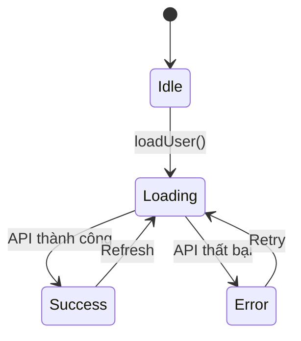
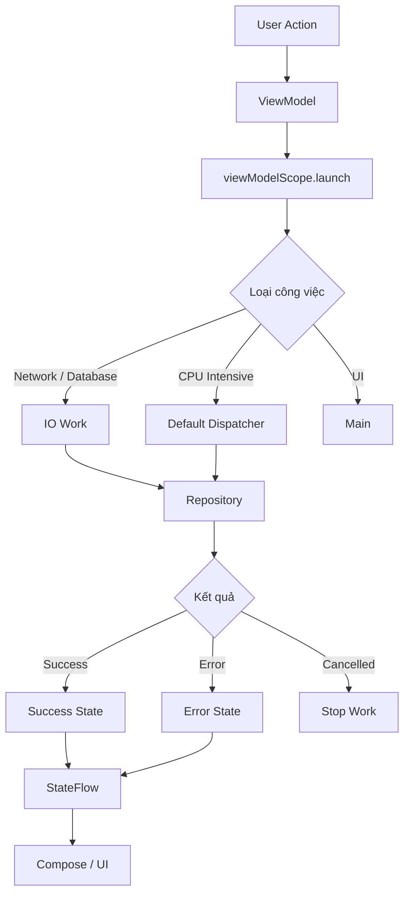

# 008 — Coroutines

| Thuộc tính              | Nội dung                         |
| ----------------------- | -------------------------------- |
| **Học phần**            | 04 — Network, Async and Services |
| **Module**              | Module 08 — Asynchronism         |
| **Nhóm nội dung**       | Coroutines                       |
| **Nguồn roadmap**       | Asynchronism / Coroutines        |
| **Loại bài**            | Async / Lập trình bất đồng bộ    |
| **Thứ tự trong module** | 008                              |
| **Thời lượng gợi ý**    | 34 phút                          |
| **Ngôn ngữ chính**      | Kotlin                           |

---

## 1. Tổng quan

**Coroutine** là cơ chế lập trình bất đồng bộ được tích hợp sâu vào Kotlin, cho phép thực hiện các tác vụ mất nhiều thời gian như:

* Gọi API.
* Truy vấn database.
* Đọc/ghi file.
* Xử lý dữ liệu.
* Chạy tác vụ nền.

mà **không làm block Main Thread**.

Trong Android, Coroutines đặc biệt quan trọng vì phần lớn thao tác giao diện chạy trên **Main Thread**. Nếu thực hiện một tác vụ nặng trực tiếp trên thread này, ứng dụng có thể:

* Giật, lag.
* Không phản hồi thao tác người dùng.
* Drop frame.
* Xuất hiện lỗi **ANR — Application Not Responding**.

Ý tưởng cơ bản:

```text
Main Thread
    │
    ├── Cập nhật UI
    │
    ├── Người dùng nhấn nút
    │
    ▼
Launch Coroutine
    │
    ├── Gọi API
    ├── Đọc Database
    └── Xử lý dữ liệu
           │
           ▼
      Nhận kết quả
           │
           ▼
      Cập nhật UI
```

---

# 2. Mục tiêu học tập

Sau bài học này, bạn có thể:

* Giải thích được Coroutine là gì.
* Hiểu tại sao Android cần lập trình bất đồng bộ.
* Phân biệt **blocking** và **suspending**.
* Hiểu vai trò của:

  * `suspend`
  * `CoroutineScope`
  * `launch`
  * `async`
  * `withContext`
  * `Dispatcher`
  * `Job`
* Biết cách chuyển tác vụ nặng khỏi Main Thread.
* Hiểu cơ chế **cancellation**.
* Hiểu **Structured Concurrency**.
* Kết hợp Coroutine với:

  * `ViewModel`
  * Lifecycle
  * Repository
  * Retrofit
  * Room
* Quản lý các trạng thái:

  * Loading
  * Success
  * Error
* Debug và test code bất đồng bộ.
* Xây dựng một ví dụ nhỏ có thể đưa vào portfolio Android.

---

# 3. Vì sao Android cần Coroutines?

Android sử dụng một thread chính gọi là:

> **Main Thread / UI Thread**

Thread này chịu trách nhiệm xử lý:

* Touch event.
* Button click.
* Animation.
* Layout.
* Drawing.
* Cập nhật UI.

Ví dụ không nên làm:

```kotlin
fun loadData() {
    val response = performSlowNetworkRequest()

    textView.text = response
}
```

Nếu `performSlowNetworkRequest()` mất 5 giây thì Main Thread có thể bị block trong 5 giây.

Luồng xử lý:

```text
Main Thread
    │
    ├── Click Button
    │
    ▼
Network request
    │
    │ 5 giây
    │
    │ UI bị block
    ▼
Response
    │
    ▼
UI hoạt động trở lại
```

Đây là điều cần tránh.

---

# 4. Coroutine là gì?

Có thể hiểu đơn giản:

> **Coroutine là một tác vụ nhẹ có thể tạm dừng và tiếp tục thực thi mà không cần block thread đang chạy.**

Ví dụ:

```kotlin
viewModelScope.launch {
    val user = repository.getUser()

    _uiState.value = UserUiState.Success(user)
}
```

Coroutine có thể tạm dừng trong khi chờ dữ liệu:

```text
Coroutine
   │
   ├── Start
   │
   ├── Gọi API
   │
   ├── Suspend ───────────────┐
   │                          │
Thread có thể làm việc khác   │
   │                          │
   │◄─────────────────────────┘
   ├── Resume
   │
   ├── Xử lý response
   │
   ▼
 Finish
```

Điểm quan trọng:

> **Suspend không đồng nghĩa với block.**

---

# 5. Blocking và Suspending

## Blocking

```text
Thread
  │
  ▼
Task A
  │
  │ chờ 3 giây
  │ thread không làm được việc khác
  │
  ▼
Task B
```

Thread bị giữ trong thời gian chờ.

---

## Suspending

```text
Coroutine A
     │
     ▼
 Network
     │
     ├──── Suspend
     │
Thread ───────────────► chạy công việc khác
     │
     ◄──── Resume
     │
     ▼
 Coroutine A tiếp tục
```

Coroutine có thể nhường thread trong lúc chờ.

---

# 6. Suspend Function

Một hàm có thể tạm dừng Coroutine được khai báo bằng:

```kotlin
suspend
```

Ví dụ:

```kotlin
suspend fun loadUser(): User {
    return repository.getUser()
}
```

Một `suspend function` thường chỉ được gọi từ:

* Coroutine khác.
* Suspend function khác.

Ví dụ:

```kotlin
viewModelScope.launch {
    val user = loadUser()
}
```

---

# 7. CoroutineScope

Coroutine luôn cần chạy trong một **scope**.

Có thể hiểu:

> `CoroutineScope` xác định vòng đời của một nhóm Coroutine.

Ví dụ:

```kotlin
CoroutineScope(Dispatchers.IO).launch {
    // background work
}
```

Trong Android thường không nên tự tạo scope tùy tiện.

Thay vào đó nên dùng các scope gắn với lifecycle.

Ví dụ:

```text
Activity / Fragment
      │
      └── lifecycleScope
               │
               └── Coroutine

ViewModel
      │
      └── viewModelScope
               │
               └── Coroutine
```

---

# 8. viewModelScope

Trong `ViewModel`, cách phổ biến nhất là:

```kotlin
viewModelScope.launch {

}
```

Ví dụ:

```kotlin
class UserViewModel(
    private val repository: UserRepository
) : ViewModel() {

    fun loadUser() {
        viewModelScope.launch {
            val user = repository.getUser()
        }
    }
}
```

Khi `ViewModel` bị clear:

```text
ViewModel
   │
   │ viewModelScope
   │
   ├── Coroutine A
   ├── Coroutine B
   └── Coroutine C
          │
          ▼
    ViewModel cleared
          │
          ▼
   Các coroutine bị cancel
```

Điều này giúp giảm:

* Memory leak.
* Tác vụ chạy thừa.
* Update state sau khi màn hình không còn tồn tại.

---

# 9. lifecycleScope

Trong `Activity` hoặc `Fragment` có thể sử dụng:

```kotlin
lifecycleScope.launch {

}
```

Ví dụ:

```kotlin
lifecycleScope.launch {
    repository.syncData()
}
```

Coroutine được quản lý dựa trên lifecycle của component.

---

# 10. Coroutine Builder

Ba công cụ quan trọng thường gặp:

```text
Coroutine Builders
       │
       ├── launch
       ├── async
       └── runBlocking
```

---

## 10.1. `launch`

Dùng khi muốn chạy một Coroutine nhưng **không cần trực tiếp trả về kết quả**.

```kotlin
viewModelScope.launch {
    repository.syncData()
}
```

`launch` trả về:

```kotlin
Job
```

Ví dụ:

```kotlin
val job = viewModelScope.launch {
    repository.syncData()
}
```

---

## 10.2. `async`

Dùng khi Coroutine cần tạo ra một giá trị.

```kotlin
val deferred = async {
    repository.getUser()
}
```

Lấy kết quả bằng:

```kotlin
val user = deferred.await()
```

Ví dụ chạy song song:

```kotlin
coroutineScope {

    val userDeferred = async {
        repository.getUser()
    }

    val postsDeferred = async {
        repository.getPosts()
    }

    val user = userDeferred.await()
    val posts = postsDeferred.await()
}
```

Sơ đồ:

```text
Coroutine
   │
   ├───────────────┐
   │               │
   ▼               ▼
Get User        Get Posts
   │               │
   └──────┬────────┘
          ▼
       await()
          │
          ▼
   Combine Result
```

---

## 10.3. `runBlocking`

Ví dụ:

```kotlin
runBlocking {
    repository.getUser()
}
```

`runBlocking` **block thread hiện tại** cho đến khi Coroutine hoàn thành.

Vì vậy:

> Không nên sử dụng `runBlocking` trên Main Thread trong ứng dụng Android thông thường.

Nó thường hữu ích hơn trong:

* Test.
* CLI.
* Một số trường hợp đặc biệt.

---

# 11. Coroutine Dispatchers

Dispatcher quyết định Coroutine có thể được thực thi trên loại thread nào.

Các dispatcher quan trọng:

```text
Dispatchers
    │
    ├── Main
    ├── IO
    └── Default
```

---

## 11.1. `Dispatchers.Main`

Dùng cho công việc liên quan đến UI.

```kotlin
withContext(Dispatchers.Main) {
    textView.text = "Completed"
}
```

Phù hợp với:

* Update UI.
* UI state.
* Animation interaction.

---

## 11.2. `Dispatchers.IO`

Phù hợp cho tác vụ I/O:

```kotlin
withContext(Dispatchers.IO) {
    repository.readFile()
}
```

Ví dụ:

* Network.
* File.
* Database.
* Disk I/O.

---

## 11.3. `Dispatchers.Default`

Phù hợp cho tác vụ nặng về CPU.

Ví dụ:

```kotlin
withContext(Dispatchers.Default) {
    calculateLargeDataset()
}
```

Thường dùng cho:

* Sorting lớn.
* JSON processing nặng.
* Image processing.
* Thuật toán.
* Tính toán.

---

## So sánh nhanh

| Dispatcher            | Phù hợp                 |
| --------------------- | ----------------------- |
| `Dispatchers.Main`    | UI                      |
| `Dispatchers.IO`      | Network, file, database |
| `Dispatchers.Default` | CPU-intensive work      |

---

# 12. withContext

`withContext()` được dùng để chuyển context thực thi.

Ví dụ:

```kotlin
suspend fun loadFile(): String {
    return withContext(Dispatchers.IO) {
        readLargeFile()
    }
}
```

Luồng:

```text
Main
 │
 ▼
loadFile()
 │
 ▼
withContext(IO)
 │
 ├── Read File
 │
 ▼
Result
 │
 ▼
Main
```

Điểm quan trọng:

```kotlin
withContext(...)
```

không tạo công việc kiểu fire-and-forget như `launch`.

Nó đợi block coroutine bên trong hoàn thành rồi mới tiếp tục.

---

# 13. Structured Concurrency

Một trong những khái niệm quan trọng nhất của Kotlin Coroutine là:

> **Structured Concurrency**

Các Coroutine con được tổ chức theo cấu trúc cha–con.

```text
Coroutine Parent
      │
      ├── Child A
      │
      ├── Child B
      │
      └── Child C
```

Parent thường chỉ hoàn thành khi các child cần thiết đã hoàn thành.

Nếu parent bị cancel:

```text
Parent
  │
  X Cancel
  │
  ├──── X Child A
  ├──── X Child B
  └──── X Child C
```

Nhờ vậy code async dễ:

* Quản lý.
* Cancel.
* Debug.
* Tránh background task bị bỏ quên.

---

# 14. Job

`launch` trả về một:

```kotlin
Job
```

Ví dụ:

```kotlin
val job = viewModelScope.launch {
    repository.downloadData()
}
```

Có thể cancel:

```kotlin
job.cancel()
```

Sơ đồ:

```text
Job
 │
 ├── Active
 │
 ├── Completing
 │
 └── Completed

hoặc

Job
 │
 └── Cancelled
```

---

# 15. Cancellation

Coroutine hỗ trợ cancellation.

Ví dụ:

```kotlin
val job = viewModelScope.launch {
    repository.loadData()
}

job.cancel()
```

Một ví dụ thực tế là tìm kiếm:

```text
User gõ "a"
    │
    └── Search A

User gõ "an"
    │
    ├── Cancel Search A
    └── Search AN

User gõ "android"
    │
    ├── Cancel Search AN
    └── Search ANDROID
```

Nếu không cancel request cũ, kết quả cũ có thể quay về sau và ghi đè kết quả mới.

---

# 16. Cancellation là Cooperative

Coroutine cancellation mang tính:

> **Cooperative — hợp tác**

Coroutine cần đi qua các điểm có khả năng kiểm tra cancellation.

Ví dụ:

```kotlin
while (isActive) {
    performWork()
}
```

Hoặc:

```kotlin
ensureActive()
```

Ví dụ:

```kotlin
suspend fun processItems(items: List<Item>) {
    for (item in items) {
        ensureActive()

        process(item)
    }
}
```

---

# 17. delay() và Thread.sleep()

Đây là khác biệt rất quan trọng.

Không nên:

```kotlin
Thread.sleep(3000)
```

Vì thread bị block.

Trong Coroutine:

```kotlin
delay(3000)
```

`delay()` suspend Coroutine mà không block thread.

So sánh:

| API              | Thread bị block? |
| ---------------- | ---------------: |
| `Thread.sleep()` |               Có |
| `delay()`        |            Không |

---

# 18. Exception Handling

Coroutine có thể gặp lỗi từ:

* Network.
* Database.
* Parsing.
* File.
* Authentication.

Ví dụ đơn giản:

```kotlin
viewModelScope.launch {

    try {

        val user = repository.getUser()

        _uiState.value =
            UserUiState.Success(user)

    } catch (e: Exception) {

        _uiState.value =
            UserUiState.Error(
                e.message ?: "Unknown error"
            )
    }
}
```

---

# 19. Loading — Success — Error

Trong ứng dụng Android, Coroutine thường đi cùng state.

Ví dụ:

```kotlin
sealed interface UserUiState {

    data object Loading : UserUiState

    data class Success(
        val user: User
    ) : UserUiState

    data class Error(
        val message: String
    ) : UserUiState
}
```

ViewModel:

```kotlin
fun loadUser() {

    viewModelScope.launch {

        _uiState.value = UserUiState.Loading

        try {

            val user = repository.getUser()

            _uiState.value =
                UserUiState.Success(user)

        } catch (e: Exception) {

            _uiState.value =
                UserUiState.Error(
                    e.message ?: "Unknown error"
                )
        }
    }
}
```

Luồng state:



---

# 20. Coroutines trong kiến trúc Android

Một kiến trúc phổ biến:

```text
┌─────────────────────┐
│     Compose / UI    │
└──────────┬──────────┘
           │ User Action
           ▼
┌─────────────────────┐
│      ViewModel      │
│   viewModelScope    │
└──────────┬──────────┘
           │
           ▼
┌─────────────────────┐
│      Use Case       │
└──────────┬──────────┘
           │
           ▼
┌─────────────────────┐
│     Repository      │
└──────┬────────┬─────┘
       │        │
       ▼        ▼
   Retrofit    Room
     API       Database
```

Coroutine thường bắt đầu ở:

```kotlin
viewModelScope.launch
```

và các tầng dưới cung cấp `suspend function`.

---

# 21. Ví dụ Repository

```kotlin
interface UserRepository {

    suspend fun getUser(): User
}
```

Implementation:

```kotlin
class UserRepositoryImpl(
    private val api: UserApi
) : UserRepository {

    override suspend fun getUser(): User {
        return api.getUser()
    }
}
```

---

# 22. Retrofit + Coroutine

Retrofit có thể khai báo API bằng `suspend`.

```kotlin
interface UserApi {

    @GET("users/{id}")
    suspend fun getUser(
        @Path("id") id: Int
    ): User
}
```

Repository:

```kotlin
class UserRepository(
    private val api: UserApi
) {

    suspend fun getUser(id: Int): User {
        return api.getUser(id)
    }
}
```

ViewModel:

```kotlin
fun loadUser(id: Int) {

    viewModelScope.launch {

        val user = repository.getUser(id)

        _user.value = user
    }
}
```

---

# 23. Room + Coroutine

Room cũng hỗ trợ `suspend`.

```kotlin
@Dao
interface UserDao {

    @Insert
    suspend fun insertUser(user: User)

    @Query("SELECT * FROM users WHERE id = :id")
    suspend fun getUser(id: Int): User?
}
```

Repository:

```kotlin
suspend fun saveUser(user: User) {
    userDao.insertUser(user)
}
```

---

# 24. Chạy tuần tự

Ví dụ:

```kotlin
val user = repository.getUser()

val posts = repository.getPosts(user.id)
```

Quy trình:

```text
getUser
   │
   ▼
wait
   │
   ▼
getPosts
   │
   ▼
wait
   │
   ▼
Done
```

Phù hợp khi tác vụ thứ hai phụ thuộc tác vụ thứ nhất.

---

# 25. Chạy song song với async

Nếu hai tác vụ độc lập:

```kotlin
coroutineScope {

    val user = async {
        repository.getUser()
    }

    val categories = async {
        repository.getCategories()
    }

    HomeData(
        user = user.await(),
        categories = categories.await()
    )
}
```

Luồng:

```text
             ┌── getUser ──────────┐
Coroutine ───┤                     ├── Combine
             └── getCategories ────┘
```

Có thể giảm tổng thời gian chờ khi các request thực sự độc lập.

---

# 26. Retry

Một network request có thể thất bại tạm thời.

Ví dụ đơn giản:

```kotlin
suspend fun loadWithRetry(): Data {

    repeat(3) { attempt ->

        try {
            return repository.loadData()
        } catch (e: IOException) {

            if (attempt == 2) {
                throw e
            }

            delay(1000)
        }
    }

    error("Unexpected state")
}
```

Luồng:

```text
Request
   │
   ▼
Success? ── Yes ──► Return
   │
   No
   ▼
Retry count < limit?
   │
   ├── Yes → Delay → Request
   │
   └── No → Error
```

---

# 27. Cancellation và Retry

Retry cần tôn trọng cancellation.

Không nên viết logic retry khiến Coroutine tiếp tục chạy dù màn hình đã đóng.

Tư duy:

```text
Retry
 │
 ├── Network error → có thể retry
 │
 └── Cancellation → dừng
```

Không nên coi mọi exception đều giống nhau.

Đặc biệt cần thận trọng với:

```kotlin
CancellationException
```

vì cancellation là một phần của cơ chế điều khiển Coroutine.

---

# 28. Ví dụ hoàn chỉnh trong ViewModel

```kotlin
class UserViewModel(
    private val repository: UserRepository
) : ViewModel() {

    private val _uiState =
        MutableStateFlow<UserUiState>(
            UserUiState.Loading
        )

    val uiState =
        _uiState.asStateFlow()

    fun loadUser() {

        viewModelScope.launch {

            _uiState.value =
                UserUiState.Loading

            try {

                val user =
                    repository.getUser()

                _uiState.value =
                    UserUiState.Success(user)

            } catch (e: Exception) {

                _uiState.value =
                    UserUiState.Error(
                        e.message
                            ?: "Không thể tải dữ liệu"
                    )
            }
        }
    }
}
```

UI chỉ cần quan sát:

```text
ViewModel
   │
   ▼
StateFlow<UserUiState>
   │
   ├── Loading
   ├── Success
   └── Error
         │
         ▼
      Compose UI
```

---

# 29. Coroutine và Lifecycle

Một trong những câu hỏi quan trọng khi viết Coroutine:

> Coroutine này nên sống bao lâu?

Ví dụ:

| Tác vụ                                           | Scope phù hợp          |
| ------------------------------------------------ | ---------------------- |
| Load dữ liệu cho màn hình                        | `viewModelScope`       |
| Collect dữ liệu theo Activity/Fragment lifecycle | `lifecycleScope`       |
| Công việc phải tiếp tục dù app rời màn hình      | Có thể cần WorkManager |
| Công việc ngắn chỉ phục vụ một suspend operation | `coroutineScope`       |

Không nên đưa mọi tác vụ nền vào Coroutine rồi mặc định cho rằng chúng sẽ tiếp tục chạy mãi.

---

# 30. Coroutines không thay thế WorkManager

Ví dụ người dùng bắt đầu upload một file lớn và công việc phải tiếp tục ngay cả khi app ra background.

Chỉ dùng:

```kotlin
viewModelScope.launch
```

có thể không đáp ứng yêu cầu.

Có thể cần:

```text
Background Work
       │
       ├── Chỉ cần sống cùng màn hình
       │       ↓
       │  Coroutine
       │
       └── Cần đảm bảo thực thi lâu dài
               ↓
           WorkManager
```

---

# 31. Coroutine và StateFlow

Một mô hình Android hiện đại thường là:

```text
Coroutine
    │
    ▼
Repository
    │
    ▼
ViewModel
    │
    ▼
StateFlow
    │
    ▼
Compose
```

Ví dụ:

```kotlin
private val _uiState =
    MutableStateFlow(HomeUiState())

val uiState =
    _uiState.asStateFlow()
```

Coroutine cập nhật state:

```kotlin
viewModelScope.launch {

    val products =
        repository.getProducts()

    _uiState.update {
        it.copy(
            products = products,
            isLoading = false
        )
    }
}
```

---

# 32. Debug Coroutine

Khi debug code async, nên log các bước state thay vì chỉ log kết quả cuối.

Ví dụ:

```kotlin
Log.d("UserVM", "loadUser: started")

val user = repository.getUser()

Log.d("UserVM", "loadUser: success")
```

Khi gặp lỗi:

```kotlin
Log.e(
    "UserVM",
    "loadUser: failed",
    exception
)
```

Một flow log tốt:

```text
LOAD_USER_START
        │
        ▼
NETWORK_REQUEST_START
        │
        ├── SUCCESS
        │      │
        │      ▼
        │ UI_STATE_SUCCESS
        │
        └── ERROR
               │
               ▼
         UI_STATE_ERROR
```

---

# 33. Những lỗi thường gặp

## 33.1. Block Main Thread

Không nên:

```kotlin
Thread.sleep(5000)
```

trên Main Thread.

---

## 33.2. Dùng GlobalScope

Ví dụ:

```kotlin
GlobalScope.launch {
    ...
}
```

Trong phần lớn code Android application thông thường, đây không phải lựa chọn tốt vì lifecycle của Coroutine khó kiểm soát.

Ưu tiên:

```kotlin
viewModelScope
```

hoặc:

```kotlin
lifecycleScope
```

---

## 33.3. Tạo CoroutineScope không quản lý

Ví dụ:

```kotlin
CoroutineScope(Dispatchers.IO).launch {
    ...
}
```

Không phải lúc nào cũng sai, nhưng nếu scope không có owner rõ ràng thì rất dễ tạo tác vụ không được cancel đúng lúc.

---

## 33.4. Bắt mọi Exception không phân biệt

Ví dụ:

```kotlin
catch (e: Exception) {
}
```

rồi bỏ qua hoàn toàn exception có thể khiến:

* Mất thông tin debug.
* Che giấu lỗi.
* Xử lý cancellation không đúng.

---

## 33.5. Dùng async khi không cần

Không cần:

```kotlin
val data = async {
    repository.getData()
}.await()
```

nếu không có nhu cầu chạy đồng thời.

Chỉ cần:

```kotlin
val data = repository.getData()
```

---

# 34. Mô hình tư duy tổng thể



---

# 35. Thực hành

## Bài thực hành: tải dữ liệu người dùng

Giả sử ứng dụng có nút:

```text
Load User
```

Khi người dùng nhấn:

```text
Click
  │
  ▼
ViewModel
  │
  ▼
viewModelScope.launch
  │
  ▼
Loading
  │
  ▼
Repository
  │
  ▼
API
  │
  ├── Success → User
  │
  └── Error → Error State
```

Yêu cầu:

1. Không block Main Thread.
2. Sử dụng `viewModelScope`.
3. Repository sử dụng `suspend`.
4. Hiển thị Loading.
5. Hiển thị dữ liệu khi thành công.
6. Hiển thị lỗi khi thất bại.
7. Có nút Retry.
8. Log các state transition.

---

# 36. Bài tập

## Bài tập chính

Chuyển một tác vụ chạy lâu ra khỏi Main Thread.

Ví dụ:

```kotlin
fun calculateSomething() {

    viewModelScope.launch {

        val result = withContext(Dispatchers.Default) {
            performHeavyCalculation()
        }

        _uiState.value = result
    }
}
```

Sau đó giải thích:

* Tại sao không thực hiện trực tiếp trên Main Thread?
* Coroutine được quản lý bởi scope nào?
* Khi màn hình bị đóng thì chuyện gì xảy ra?
* Có cần cancellation không?
* Có cần retry không?
* Dispatcher nào phù hợp?
* UI biết task đang Loading, Success hay Error bằng cách nào?

---

# 37. Bài tập nâng cao

Xây dựng màn hình tìm kiếm:

```text
Search Input
     │
     ▼
Coroutine Search
     │
     ├── Query thay đổi
     │      │
     │      ▼
     │ Cancel request cũ
     │
     ▼
API Search
     │
     ├── Loading
     ├── Success
     └── Error
```

Mục tiêu:

* Không để các request cũ ghi đè kết quả mới.
* Hiểu cancellation.
* Quản lý UI state rõ ràng.

---

# 38. Artifact đề xuất cho Portfolio

Có thể xây dựng một mini project:

## Coroutine Network Demo

Tính năng:

* Gọi REST API bằng Retrofit.
* `suspend function`.
* Repository pattern.
* `viewModelScope`.
* StateFlow.
* Loading state.
* Error state.
* Retry.
* Cancellation.
* Log state transition.

Cấu trúc:

```text
app/
│
├── data/
│   ├── remote/
│   │   └── UserApi.kt
│   │
│   └── repository/
│       └── UserRepository.kt
│
├── ui/
│   ├── UserScreen.kt
│   └── UserViewModel.kt
│
└── model/
    └── User.kt
```

README có thể mô tả:

```text
User Action
   ↓
ViewModel
   ↓
Coroutine
   ↓
Repository
   ↓
Retrofit
   ↓
API
   ↓
StateFlow
   ↓
Compose UI
```

---

# 39. Checklist hoàn thành

* [ ] Giải thích được Coroutine bằng ngôn ngữ của mình.
* [ ] Phân biệt được blocking và suspending.
* [ ] Hiểu `suspend function`.
* [ ] Hiểu `CoroutineScope`.
* [ ] Biết sử dụng `launch`.
* [ ] Biết khi nào cần `async`.
* [ ] Hiểu `await()`.
* [ ] Hiểu `Job`.
* [ ] Hiểu cancellation.
* [ ] Hiểu Structured Concurrency.
* [ ] Phân biệt `Dispatchers.Main`, `IO` và `Default`.
* [ ] Biết sử dụng `withContext()`.
* [ ] Biết tại sao nên tránh `GlobalScope` trong phần lớn Android app code.
* [ ] Biết sử dụng `viewModelScope`.
* [ ] Biết sử dụng `lifecycleScope`.
* [ ] Kết hợp Coroutine với Repository.
* [ ] Có ví dụ Retrofit sử dụng `suspend`.
* [ ] Có ví dụ Room sử dụng `suspend`.
* [ ] Quản lý Loading / Success / Error.
* [ ] Có chiến lược xử lý exception.
* [ ] Hiểu retry và cancellation.
* [ ] Biết khi nào Coroutine không đủ và cần WorkManager.
* [ ] Có log để debug state transition.
* [ ] Có một mini project hoặc artifact đưa vào portfolio.

---

# 40. Ghi chú Production

Khi sử dụng Coroutine trong ứng dụng thật, không chỉ cần hỏi:

> “Code này có chạy bất đồng bộ không?”

Mà cần kiểm tra toàn bộ vòng đời của công việc.

### Lifecycle

```text
Coroutine này thuộc về ai?
        │
        ├── Screen
        ├── ViewModel
        ├── Application
        └── Background Worker
```

Nếu không xác định owner rõ ràng, cancellation thường sẽ khó kiểm soát.

### State

Cần xác định ít nhất:

```text
Idle
 ↓
Loading
 ↓
Success / Error
```

Ngoài ra có thể cần:

```text
Refreshing
Retrying
Empty
Offline
Cancelled
```

### Network

Cần xem xét:

* Timeout.
* Mất mạng.
* HTTP error.
* Retry.
* Authentication expired.
* Duplicate request.
* Cancellation.

### Testing

Nên test:

* Thành công.
* API lỗi.
* Timeout.
* Cancellation.
* Retry.
* Loading state.
* Request đồng thời.
* State sau khi ViewModel bị clear.

### Debugging

Nên log:

```text
request_started
request_cancelled
request_success
request_failed
retry_started
state_changed
```

---

# 41. Ghi nhớ nhanh

```text
Coroutine
│
├── suspend
│      └── Hàm có thể tạm dừng
│
├── Scope
│      ├── viewModelScope
│      └── lifecycleScope
│
├── Builder
│      ├── launch → Job
│      └── async  → Deferred<T>
│
├── Dispatcher
│      ├── Main    → UI
│      ├── IO      → Network / DB / File
│      └── Default → CPU
│
├── Structured Concurrency
│      └── Parent quản lý Child
│
├── Cancellation
│      └── Dừng công việc không còn cần thiết
│
└── Android Architecture
       └── UI → ViewModel → Repository → Data Source
```

## Công thức cần nhớ

```kotlin
viewModelScope.launch {
    val data = repository.loadData()
}
```

Đối với CPU-intensive work:

```kotlin
val result = withContext(Dispatchers.Default) {
    performHeavyCalculation()
}
```

Và nguyên tắc quan trọng nhất:

> **Không dùng Coroutine chỉ để “chạy code ở background”. Hãy coi Coroutine là một phần của lifecycle, state và structured concurrency của ứng dụng.**

---

# Bài luyện tập

## Mục tiêu


## Đề bài


## Yêu cầu hoàn thành

- [ ] 
- [ ] 
- [ ] 

## Kết quả / lời giải


## Ghi chú
