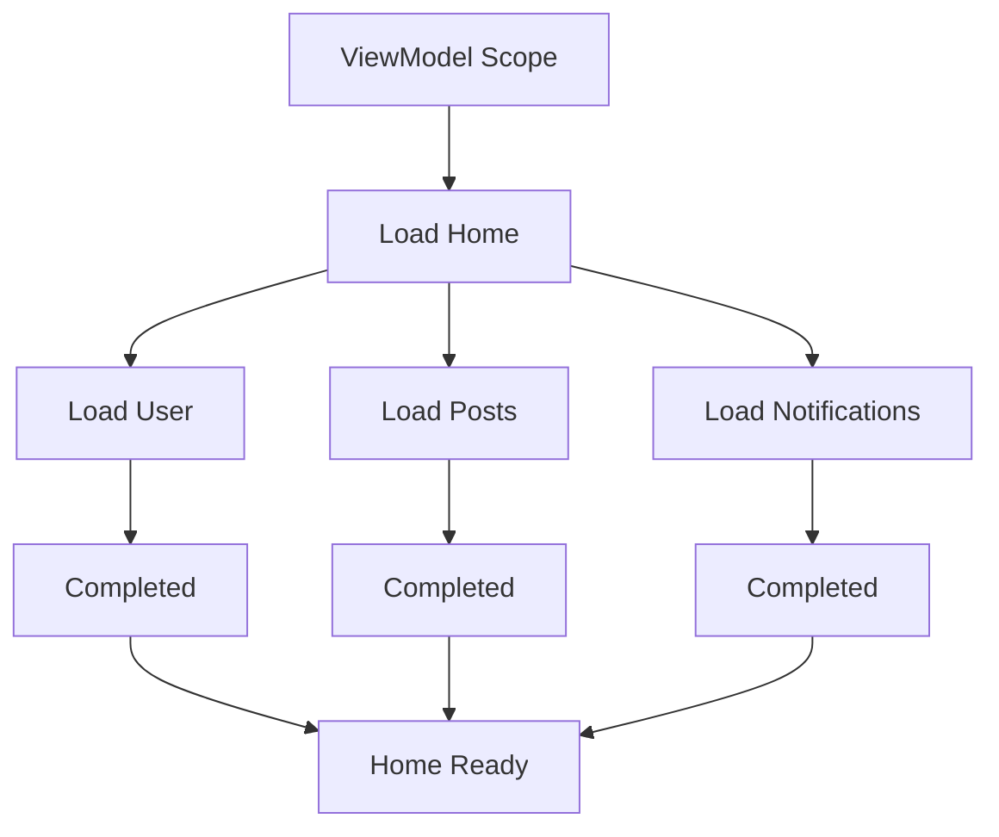
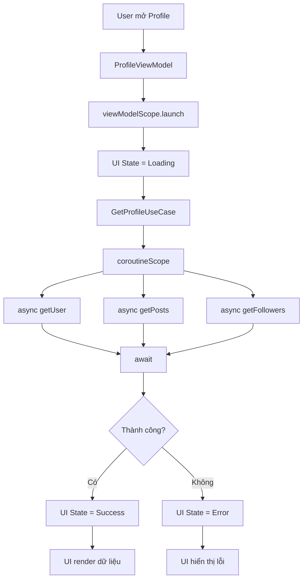
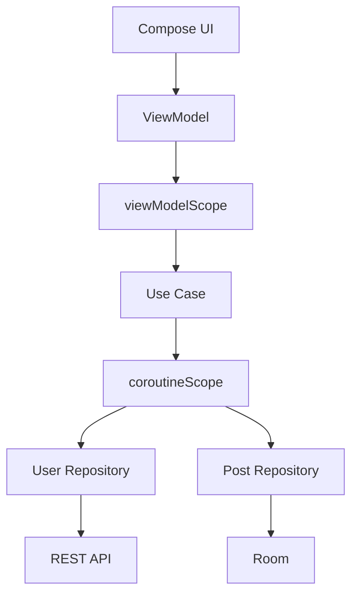

# 012 — Structured Concurrency

| Thuộc tính              | Nội dung                         |
| ----------------------- | -------------------------------- |
| **Học phần**            | 04 — Network, Async and Services |
| **Module**              | Module 08 — Asynchronism         |
| **Nhóm nội dung**       | Coroutines                       |
| **Nguồn roadmap**       | Asynchronism / Coroutines        |
| **Loại bài**            | Async                            |
| **Thứ tự trong module** | 012                              |
| **Thời lượng gợi ý**    | 34 phút                          |

---

## 1. Tóm tắt

**Structured Concurrency** là nguyên tắc tổ chức các coroutine theo một **cấu trúc cha–con rõ ràng**, trong đó vòng đời của coroutine con được ràng buộc với coroutine hoặc `CoroutineScope` cha.

Trong Kotlin Coroutines, các coroutine tạo bên trong một scope tạo thành một cây công việc. Coroutine cha sẽ đợi các coroutine con hoàn thành; khi cha bị hủy, các coroutine con cũng được hủy theo. Cấu trúc này giúp việc **cancellation, exception handling và lifecycle management** trở nên dễ dự đoán hơn. ([Kotlin][1])

Trong Android, Structured Concurrency đặc biệt quan trọng khi làm việc với:

* Network request.
* Database.
* Nhiều API chạy song song.
* `ViewModel`.
* Lifecycle.
* Screen navigation.
* Flow.
* Loading/error/success state.

Ý tưởng cốt lõi:

> **Một công việc bất đồng bộ phải thuộc về một scope có vòng đời xác định.**

---

# 2. Mục tiêu học tập

Sau bài học này, bạn có thể:

* Giải thích được **Structured Concurrency** bằng ngôn ngữ của mình.
* Hiểu quan hệ **parent → child coroutine**.
* Hiểu cancellation lan truyền như thế nào.
* Biết dùng:

  * `CoroutineScope`
  * `coroutineScope`
  * `launch`
  * `async`
  * `await`
  * `supervisorScope`
* Biết khi nào nên sử dụng `viewModelScope`.
* Tránh tạo coroutine không có lifecycle rõ ràng.
* Kết hợp Structured Concurrency với Repository, Use Case và ViewModel.
* Test được asynchronous flow.
* Nhận biết Structured Concurrency ảnh hưởng tới UX và độ ổn định của ứng dụng như thế nào.

---

# 3. Structured Concurrency là gì?

Giả sử màn hình cần tải:

1. Thông tin người dùng.
2. Danh sách bài viết.
3. Thông báo.

Ta có thể xem toàn bộ quá trình tải màn hình là một **task lớn**.

```text
Load Home Screen
│
├── Load User
│
├── Load Posts
│
└── Load Notifications
```

Ba request không phải ba công việc hoàn toàn độc lập.

Chúng là **các công việc con của Load Home Screen**.

Structured Concurrency yêu cầu ta biểu diễn chính quan hệ đó trong code.



Trong Kotlin, coroutine cha sẽ chờ các coroutine con của nó hoàn thành trước khi bản thân scope kết thúc. Nếu coroutine cha bị cancel thì những coroutine con thuộc cây đó cũng bị cancel. ([Kotlin][1])

---

# 4. Ba quy tắc quan trọng

Structured Concurrency có thể nhớ bằng ba nguyên tắc.

## Quy tắc 1 — Coroutine phải có chủ sở hữu

Không nên để coroutine chạy mà không biết:

> "Ai chịu trách nhiệm hủy coroutine này?"

Ví dụ:

```kotlin
viewModelScope.launch {
    repository.loadData()
}
```

Ở đây:

```text
ViewModel
   ↓ owns
viewModelScope
   ↓ owns
loadData coroutine
```

Khi `ViewModel` bị clear, coroutine trong `viewModelScope` được cancel tự động. ([Android Developers][2])

---

## Quy tắc 2 — Parent quản lý children

Ví dụ:

```kotlin
viewModelScope.launch {

    launch {
        loadProfile()
    }

    launch {
        loadPosts()
    }
}
```

Cấu trúc:

```text
viewModelScope
     │
     ▼
 Parent Coroutine
     │
 ┌───┴─────────┐
 ▼             ▼
loadProfile  loadPosts
```

Hai coroutine con không bị "thả nổi".

Chúng thuộc parent coroutine.

---

## Quy tắc 3 — Scope chỉ hoàn thành khi children hoàn thành

Ví dụ:

```kotlin
coroutineScope {

    launch {
        delay(1000)
        println("A completed")
    }

    launch {
        delay(2000)
        println("B completed")
    }
}

println("Scope completed")
```

Kết quả về mặt thứ tự:

```text
A completed
B completed
Scope completed
```

`coroutineScope {}` sẽ chờ block và các coroutine con bên trong hoàn thành trước khi trả quyền điều khiển cho caller. ([Kotlin][1])

---

# 5. `CoroutineScope` và `coroutineScope()` không giống nhau

Đây là điểm rất dễ nhầm.

## `CoroutineScope`

Là đối tượng xác định phạm vi chạy coroutine.

Ví dụ:

```kotlin
viewModelScope.launch {
    ...
}
```

`viewModelScope` là một `CoroutineScope`.

---

## `coroutineScope {}`

Là một **suspend function** dùng để tạo một scope con.

Ví dụ:

```kotlin
suspend fun loadHome(): HomeData =
    coroutineScope {

        val user = async {
            repository.getUser()
        }

        val posts = async {
            repository.getPosts()
        }

        HomeData(
            user = user.await(),
            posts = posts.await()
        )
    }
```

Quan hệ:

```text
Caller
  │
  ▼
loadHome()
  │
  ▼
coroutineScope
  │
  ├── async getUser()
  │
  └── async getPosts()
```

`loadHome()` sẽ không hoàn thành cho tới khi công việc thuộc scope này kết thúc. ([Kotlin][1])

---

# 6. `launch` và `async`

Structured Concurrency thường kết hợp với hai coroutine builder này.

## `launch`

Dùng khi:

> "Tôi muốn thực hiện một công việc nhưng không cần lấy trực tiếp giá trị trả về."

```kotlin
viewModelScope.launch {
    repository.refreshData()
}
```

`launch` trả về:

```kotlin
Job
```

---

# 7. `async`

Dùng khi cần chạy công việc và lấy kết quả.

```kotlin
val user = async {
    repository.getUser()
}
```

`async` trả về:

```kotlin
Deferred<User>
```

Lấy kết quả bằng:

```kotlin
val result = user.await()
```

Ví dụ:

```kotlin
suspend fun loadDashboard(): Dashboard =
    coroutineScope {

        val user = async {
            userRepository.getUser()
        }

        val notifications = async {
            notificationRepository.getNotifications()
        }

        Dashboard(
            user = user.await(),
            notifications = notifications.await()
        )
    }
```

---

# 8. Chạy tuần tự và chạy song song

Giả sử có hai API:

```text
API A → 1 giây
API B → 1 giây
```

## Chạy tuần tự

```kotlin
val user = repository.getUser()
val posts = repository.getPosts()
```

Luồng:

```text
getUser
   ↓
1 giây
   ↓
getPosts
   ↓
1 giây
```

Tổng lý tưởng khoảng:

```text
2 giây
```

---

## Chạy đồng thời

```kotlin
coroutineScope {

    val user = async {
        repository.getUser()
    }

    val posts = async {
        repository.getPosts()
    }

    HomeData(
        user.await(),
        posts.await()
    )
}
```

Conceptually:

```text
        Start
          │
     ┌────┴────┐
     ▼         ▼
 getUser    getPosts
     │         │
     └────┬────┘
          ▼
       HomeData
```

Nếu hai công việc độc lập, cách này có thể giảm tổng latency vì chúng được thực hiện đồng thời.

---

# 9. Cancellation — phần cực kỳ quan trọng

Structured Concurrency khiến cancellation có thể lan truyền theo cây coroutine.

Ví dụ:

```text
ViewModelScope
     │
     ▼
loadDashboard
     │
 ┌───┴──────────┐
 ▼              ▼
getUser      getPosts
```

Người dùng rời màn hình.

```text
ViewModel cleared
       ↓
viewModelScope cancelled
       ↓
loadDashboard cancelled
       ↓
 ┌─────┴──────┐
 ↓            ↓
getUser     getPosts
cancelled   cancelled
```

`viewModelScope` được liên kết với lifecycle của `ViewModel`, vì vậy các coroutine trong scope này được hủy khi ViewModel bị clear. ([Android Developers][2])

Điều này tránh tiếp tục tiêu tốn tài nguyên cho một màn hình không còn cần kết quả nữa.

---

# 10. Cancellation là cooperative

Coroutine cancellation không có nghĩa JVM lập tức giết thread.

Cancellation trong Kotlin Coroutines mang tính **cooperative**: coroutine cần đi qua suspension point hoặc kiểm tra trạng thái cancellation. Android cũng khuyến nghị dùng các cơ chế như `ensureActive()` cho các vòng xử lý dài không suspend thường xuyên. ([Android Developers][3])

Ví dụ:

```kotlin
suspend fun processFiles(files: List<File>) {

    for (file in files) {

        ensureActive()

        processFile(file)
    }
}
```

Nếu không kiểm tra cancellation trong một vòng CPU dài:

```kotlin
for (i in 0..1_000_000_000) {
    calculate(i)
}
```

coroutine có thể tiếp tục chạy một khoảng thời gian dù parent đã yêu cầu cancel.

---

# 11. Structured Concurrency không đồng nghĩa với Dispatcher

Hai khái niệm có liên quan nhưng khác nhau.

### Dispatcher trả lời:

> Công việc chạy ở đâu?

Ví dụ:

```text
Main
IO
Default
```

### Structured Concurrency trả lời:

> Công việc thuộc về ai và sống bao lâu?

Ví dụ:

```text
ViewModel
    ↓
viewModelScope
    ↓
loadData
    ↓
loadUser + loadPosts
```

Vì vậy:

```text
Dispatcher
      +
CoroutineScope
      +
Cancellation
      +
Parent-child hierarchy
```

mới tạo nên một async flow được quản lý tốt.

---

# 12. Ví dụ Android thực tế

Giả sử ta có màn hình Profile.

Nó cần:

```text
User
Posts
Followers
```

## Repository

```kotlin
interface ProfileRepository {

    suspend fun getUser(): User

    suspend fun getPosts(): List<Post>

    suspend fun getFollowers(): List<User>
}
```

Data/business layer thường nên expose `suspend` function cho one-shot operation hoặc `Flow` cho dữ liệu thay đổi theo thời gian, để caller kiểm soát lifecycle của công việc. Đây cũng là best practice hiện tại của Android. ([Android Developers][3])

---

# 13. Use Case

```kotlin
class GetProfileUseCase(
    private val repository: ProfileRepository
) {

    suspend operator fun invoke(): ProfileData =
        coroutineScope {

            val userDeferred = async {
                repository.getUser()
            }

            val postsDeferred = async {
                repository.getPosts()
            }

            val followersDeferred = async {
                repository.getFollowers()
            }

            ProfileData(
                user = userDeferred.await(),
                posts = postsDeferred.await(),
                followers = followersDeferred.await()
            )
        }
}
```

Cấu trúc:

```text
GetProfileUseCase
       │
       ▼
 coroutineScope
       │
 ┌─────┼──────────┐
 ▼     ▼          ▼
User  Posts   Followers
 │     │          │
 └─────┴────┬─────┘
            ▼
       ProfileData
```

Android Developers cũng khuyến nghị `coroutineScope` hoặc `supervisorScope` cho công việc business/data cần đi theo lifecycle của caller. ([Android Developers][3])

---

# 14. ViewModel

```kotlin
sealed interface ProfileUiState {

    data object Loading : ProfileUiState

    data class Success(
        val profile: ProfileData
    ) : ProfileUiState

    data class Error(
        val message: String
    ) : ProfileUiState
}
```

```kotlin
class ProfileViewModel(
    private val getProfile: GetProfileUseCase
) : ViewModel() {

    private val _uiState =
        MutableStateFlow<ProfileUiState>(
            ProfileUiState.Loading
        )

    val uiState: StateFlow<ProfileUiState> =
        _uiState

    fun loadProfile() {

        viewModelScope.launch {

            _uiState.value =
                ProfileUiState.Loading

            try {

                val profile = getProfile()

                _uiState.value =
                    ProfileUiState.Success(profile)

            } catch (e: Exception) {

                _uiState.value =
                    ProfileUiState.Error(
                        e.message ?: "Unknown error"
                    )
            }
        }
    }
}
```

Android khuyến nghị ViewModel là nơi khởi tạo coroutine cho business-related screen work và expose state cho UI; công việc trong `viewModelScope` cũng sống qua configuration change và được hủy khi ViewModel bị clear. ([Android Developers][3])

---

# 15. Luồng hoàn chỉnh



---

# 16. Điều gì xảy ra nếu một child thất bại?

Với structured concurrency thông thường:

```kotlin
coroutineScope {

    val user = async {
        getUser()
    }

    val posts = async {
        getPosts()
    }
}
```

Nếu một child thất bại, failure có thể làm cả scope thất bại và dẫn tới việc các sibling bị cancel.

Điều này phù hợp khi:

```text
Dashboard chỉ hợp lệ nếu:
User + Posts + Notifications
đều thành công.
```

---

# 17. `supervisorScope`

Nhưng đôi khi các công việc độc lập.

Ví dụ dashboard gồm:

```text
Weather widget
News widget
Stock widget
```

Nếu News API lỗi, ta vẫn muốn hiển thị Weather.

Lúc này có thể xem xét:

```kotlin
supervisorScope {
    ...
}
```

Khác biệt quan trọng là failure của một child trong supervised hierarchy không tự động làm các sibling thất bại theo cùng cách như regular `coroutineScope`; `supervisorScope` vẫn chờ các child hoàn thành. ([Kotlin][4])

Có thể hình dung:

```text
coroutineScope

Parent
 ├─ A ✅
 ├─ B ❌
 └─ C → cancelled
```

so với:

```text
supervisorScope

Supervisor
 ├─ A ✅
 ├─ B ❌
 └─ C ✅
```

Tuy nhiên mỗi child trong supervised scope cần có chiến lược error handling phù hợp. ([Kotlin][4])

---

# 18. `coroutineScope` hay `supervisorScope`?

| Trường hợp                                           | Nên cân nhắc             |
| ---------------------------------------------------- | ------------------------ |
| Tất cả kết quả đều bắt buộc                          | `coroutineScope`         |
| Một task lỗi thì toàn bộ operation không còn ý nghĩa | `coroutineScope`         |
| Các task độc lập                                     | `supervisorScope`        |
| Muốn partial result                                  | `supervisorScope`        |
| Dashboard nhiều widget                               | Thường `supervisorScope` |
| User + authentication token bắt buộc                 | Thường `coroutineScope`  |

Đừng mặc định dùng `supervisorScope` chỉ để "không crash".

Trước tiên hãy hỏi:

> Nếu task B thất bại, task A còn giá trị không?

---

# 19. Anti-pattern: `GlobalScope`

Ví dụ không nên dùng tùy tiện:

```kotlin
GlobalScope.launch {
    repository.loadData()
}
```

Vấn đề là coroutine không còn gắn rõ ràng với lifecycle của screen/ViewModel.

Kotlin mô tả `GlobalScope` là API cần được sử dụng đặc biệt thận trọng vì nó làm mất những lợi ích quan trọng của structured concurrency; Android cũng khuyến nghị inject một external scope khi thực sự có work cần sống lâu hơn caller thay vì sử dụng `GlobalScope` trực tiếp. ([Kotlin][5])

Thay vì:

```text
GlobalScope
    │
    └── ??? lifecycle
```

hãy cố gắng có:

```text
Application Scope
       │
Repository Scope
       │
 ViewModel Scope
       │
 Screen work
```

---

# 20. Structured Concurrency và Lifecycle

Trong Android, cần chọn scope dựa trên **lifetime của công việc**.

Ví dụ:

```text
Application
│
├── App-level work
│
└── ViewModel
      │
      ├── Load Screen
      ├── Refresh
      └── Search
```

### Công việc chỉ có ý nghĩa cho màn hình

Ví dụ:

```text
Search
Load profile
Load feed
```

thường phù hợp với:

```kotlin
viewModelScope
```

### Side effect gắn với Composable

Compose cung cấp `LaunchedEffect`; coroutine được gắn với lifecycle của composition và bị cancel khi composable rời composition. ([Android Developers][2])

Ví dụ:

```kotlin
LaunchedEffect(userId) {
    loadUser(userId)
}
```

Khi key thay đổi, coroutine hiện tại bị cancel và effect được chạy lại với key mới. ([Android Developers][2])

---

# 21. Structured Concurrency và Rotation

Một lỗi phổ biến:

```text
Activity
 ↓
request network
 ↓
rotate
 ↓
Activity recreated
 ↓
request network again
```

Nếu business work thuộc `ViewModel`:

```text
Activity A
     ↓
 ViewModel
     ↓
loadData()

ROTATE

Activity B
     ↓
same ViewModel
```

Công việc trong `viewModelScope` có thể tồn tại qua configuration change; Android khuyến nghị đây là một trong những lý do để đặt screen business coroutine trong ViewModel. ([Android Developers][3])

---

# 22. Structured Concurrency và UI State

Một pattern tốt:

```text
Coroutine
   │
   ▼
Repository
   │
   ▼
Result
   │
   ▼
ViewModel
   │
   ▼
StateFlow
   │
   ▼
Compose UI
```

Ví dụ:

```kotlin
sealed interface UiState {

    data object Loading : UiState

    data class Success(
        val data: List<Item>
    ) : UiState

    data class Error(
        val throwable: Throwable
    ) : UiState
}
```

Như vậy async operation không cập nhật UI tùy tiện.

Toàn bộ state transition có thể theo dõi:

```text
Idle
 ↓
Loading
 ↓
Success

hoặc

Idle
 ↓
Loading
 ↓
Error
```

---

# 23. Retry không phải Structured Concurrency

Cần phân biệt rõ.

Structured Concurrency quản lý:

```text
Ownership
Lifecycle
Parent/child
Cancellation
Failure propagation
```

Retry quản lý:

```text
Request fail
    ↓
Wait
    ↓
Retry
```

Ví dụ:

```kotlin
suspend fun loadWithRetry(): Data {

    repeat(3) { attempt ->

        try {
            return repository.loadData()
        } catch (e: IOException) {

            if (attempt == 2) {
                throw e
            }

            delay(1000)
        }
    }

    error("Unreachable")
}
```

Nếu function này được gọi trong:

```kotlin
viewModelScope.launch {
    loadWithRetry()
}
```

thì retry operation vẫn nằm trong structured concurrency hierarchy.

---

# 24. Không block Main Thread

Structured Concurrency **không tự động biến blocking code thành non-blocking code**.

Ví dụ nguy hiểm:

```kotlin
viewModelScope.launch {
    Thread.sleep(10_000)
}
```

Coroutine đang chạy không đồng nghĩa công việc tự động chạy trên background thread.

Dispatcher vẫn phải được lựa chọn đúng cho loại công việc.

Ví dụ:

```kotlin
withContext(Dispatchers.IO) {
    blockingFileRead()
}
```

Structured Concurrency và Dispatcher giải quyết **hai bài toán khác nhau**.

---

# 25. Testing Structured Concurrency

Một số behavior nên test:

```text
1. Success
2. Failure
3. Cancellation
4. Parallel execution
5. Partial failure
6. Retry
```

Ví dụ ViewModel test:

```kotlin
@Test
fun `load profile updates success state`() = runTest {

    val viewModel = ProfileViewModel(
        fakeGetProfileUseCase
    )

    viewModel.loadProfile()

    advanceUntilIdle()

    assertTrue(
        viewModel.uiState.value
            is ProfileUiState.Success
    )
}
```

Android cung cấp coroutine test utilities như `runTest` và `TestDispatcher`. Với local unit tests, `Dispatchers.Main` thật không tồn tại như trên thiết bị Android, nên code sử dụng Main dispatcher cần được cấu hình/test dispatcher phù hợp. ([Android Developers][6])

---

# 26. Debugging

Khi debug async flow, nên log:

```text
Coroutine start
API start
API success
API error
Coroutine cancelled
Coroutine completed
```

Ví dụ:

```kotlin
viewModelScope.launch {

    Log.d("Profile", "load:start")

    try {

        getProfile()

        Log.d(
            "Profile",
            "load:success"
        )

    } catch (e: CancellationException) {

        Log.d(
            "Profile",
            "load:cancelled"
        )

        throw e

    } catch (e: Exception) {

        Log.e(
            "Profile",
            "load:error",
            e
        )
    }
}
```

Đặc biệt chú ý:

```kotlin
CancellationException
```

Không nên vô tình biến cancellation thành một error thông thường rồi tiếp tục flow.

---

# 27. Những lỗi phổ biến

## Lỗi 1 — Tạo scope tùy tiện

```kotlin
CoroutineScope(Dispatchers.IO).launch {
    ...
}
```

Nếu không quản lý lifecycle của scope:

```text
Ai cancel nó?
Khi nào cancel?
```

sẽ trở thành vấn đề.

---

## Lỗi 2 — Dùng `GlobalScope`

```kotlin
GlobalScope.launch {
    ...
}
```

Làm mất ownership rõ ràng.

---

## Lỗi 3 — Dùng `async` nhưng không `await`

```kotlin
async {
    loadData()
}
```

Nếu không cần result, thường nên xem lại liệu `launch` có phù hợp hơn hay không.

---

## Lỗi 4 — Bắt tất cả exception thiếu cẩn trọng

```kotlin
try {

    repository.loadData()

} catch (e: Exception) {

    // ignore everything
}
```

Có thể khiến cancellation behavior bị xử lý sai.

---

## Lỗi 5 — Cho View gọi business coroutine trực tiếp

Ví dụ architecture:

```text
Compose
 ↓
Repository
```

thường khó quản lý state/lifecycle hơn.

Android hiện khuyến nghị screen business coroutine được điều phối bởi `ViewModel`, còn data/business layer expose suspend functions hoặc Flow. ([Android Developers][3])

Architecture rõ ràng hơn:

```text
Compose
   ↓
ViewModel
   ↓
UseCase
   ↓
Repository
   ↓
Data Source
```

---

# 28. Structured Concurrency trong kiến trúc Android

Có thể hình dung toàn bộ hệ thống:



Ownership:

```text
UI
 ↓
ViewModel
 ↓
viewModelScope
 ↓
UseCase
 ↓
coroutineScope
 ↓
async children
```

Đây chính là cách Structured Concurrency kết nối với architecture của Android.

---

# 29. Tác động tới UX

Structured Concurrency không chỉ là vấn đề code đẹp.

Nó trực tiếp ảnh hưởng tới người dùng.

### Không có quản lý tốt

```text
User rời màn hình
      ↓
Request vẫn chạy
      ↓
Request trả về
      ↓
State cũ bị update
      ↓
bug / waste resources
```

### Có Structured Concurrency

```text
User rời screen
      ↓
Scope cancelled
      ↓
Child work cancelled
      ↓
Không còn cần kết quả
```

Lợi ích:

* giảm công việc thừa;
* ít stale state;
* cancellation dễ dự đoán;
* error propagation rõ hơn;
* code dễ test;
* lifecycle dễ quản lý.

---

# 30. Mental model cần nhớ

Hãy tưởng tượng coroutine như cây công việc:

```text
                  App
                   │
              ViewModel
                   │
            viewModelScope
                   │
              Load Screen
                   │
        ┌──────────┼──────────┐
        │          │          │
       User       Posts     Messages
        │          │          │
       API        API        Database
```

Nếu:

```text
Load Screen cancelled
```

thì:

```text
User      ✕
Posts     ✕
Messages  ✕
```

Không để lại:

```text
orphan coroutine
```

---

# 31. Công thức ghi nhớ

```text
Structured Concurrency
        =
 Scope có lifecycle
        +
 Parent-child hierarchy
        +
 Cancellation propagation
        +
 Predictable error handling
```

Hoặc ngắn hơn:

> **Coroutine sinh ra ở đâu thì phải có một nơi chịu trách nhiệm quản lý vòng đời của nó.**

---

# 32. Thực hành

## Mini project — Profile Dashboard

Tạo màn hình:

```text
ProfileScreen
```

Cần tải đồng thời:

```text
GET /user
GET /posts
GET /followers
```

Architecture:

```text
ProfileScreen
      ↓
ProfileViewModel
      ↓
GetProfileUseCase
      ↓
coroutineScope
   ┌──┼──┐
   ↓  ↓  ↓
User Posts Followers
```

### Yêu cầu

1. Dùng `viewModelScope`.
2. Use Case sử dụng `coroutineScope`.
3. Dùng ba `async`.
4. Dùng `await`.
5. Expose `StateFlow<UiState>`.
6. Có:

   * Loading
   * Success
   * Error
7. Log:

   * start
   * success
   * cancellation
   * error
8. Test ít nhất:

   * success;
   * API error;
   * cancellation.

---

# 33. Bài tập

### Bài 1 — Parallel request

Viết:

```kotlin
suspend fun loadDashboard(): Dashboard
```

chạy đồng thời:

```text
loadProfile()
loadNews()
loadNotifications()
```

---

### Bài 2 — Cancellation

Tạo một task giả:

```kotlin
repeat(100) {
    delay(200)
}
```

Sau đó cancel parent coroutine và quan sát child dừng.

---

### Bài 3 — `supervisorScope`

Cho ba request:

```text
Weather ✅
News ❌
Stocks ✅
```

Thiết kế để News lỗi nhưng hai widget còn lại vẫn có thể trả dữ liệu.

---

### Bài 4 — Giải thích

Viết khoảng 5 dòng trả lời:

> Vì sao `GlobalScope.launch` thường không phù hợp cho screen-level business logic trong Android?

---

# 34. Artifact cho Portfolio

Một artifact nhỏ nhưng tốt có thể gồm:

```text
structured-concurrency-demo/
│
├── ProfileScreen.kt
├── ProfileViewModel.kt
├── GetProfileUseCase.kt
├── ProfileRepository.kt
├── ProfileViewModelTest.kt
│
└── README.md
```

Trong README trình bày:

```text
Problem
   ↓
Coroutine hierarchy
   ↓
Cancellation behavior
   ↓
Error handling
   ↓
Testing
```

Kèm sơ đồ:

```text
ViewModelScope
     │
GetProfile
     │
coroutineScope
 ┌───┼────────┐
 ↓   ↓        ↓
User Posts Followers
```

Đây là artifact tốt hơn việc chỉ đưa một đoạn `launch {}` đơn lẻ vì nó chứng minh bạn hiểu cả **architecture + lifecycle + concurrency**.

---

# 35. Checklist hoàn thành

* [ ] Giải thích được Structured Concurrency.
* [ ] Hiểu parent coroutine và child coroutine.
* [ ] Hiểu `CoroutineScope`.
* [ ] Hiểu `coroutineScope`.
* [ ] Phân biệt `launch` và `async`.
* [ ] Biết sử dụng `await`.
* [ ] Hiểu cancellation propagation.
* [ ] Biết cancellation có tính cooperative.
* [ ] Hiểu `supervisorScope`.
* [ ] Phân biệt `coroutineScope` và `supervisorScope`.
* [ ] Không dùng `GlobalScope` tùy tiện.
* [ ] Biết kết hợp `viewModelScope` với lifecycle.
* [ ] Biết kết hợp Structured Concurrency với StateFlow/UI State.
* [ ] Không block Main Thread.
* [ ] Có test cho success.
* [ ] Có test cho error.
* [ ] Có test hoặc demo cancellation.
* [ ] Có sơ đồ coroutine hierarchy.
* [ ] Có README hoặc demo nhỏ đưa vào portfolio.

---

# 36. Ghi chú Production

Trước khi đưa async flow vào production, hãy kiểm tra:

```text
Task này thuộc lifecycle nào?
        ↓
Screen / ViewModel / App?
        ↓
Ai tạo coroutine?
        ↓
Ai cancel coroutine?
        ↓
Có child coroutine không?
        ↓
Một child fail thì sibling có phải fail?
        ↓
coroutineScope hay supervisorScope?
        ↓
Blocking work chạy dispatcher nào?
        ↓
UI state khi loading/error/cancel ra sao?
        ↓
Rotate / navigate back có vấn đề không?
        ↓
Có test cancellation và failure không?
```

Điểm quan trọng nhất của bài này là:

> **Structured Concurrency không đơn thuần là chạy nhiều việc cùng lúc. Nó là cách tổ chức công việc bất đồng bộ thành một cây có ownership và lifecycle rõ ràng.**

Khi đã nắm chắc **Coroutine Scope → Suspend Function → Dispatchers → Structured Concurrency**, bạn có nền tảng đủ tốt để chuyển sang các flow bất đồng bộ phức tạp hơn như **parallel API calls, timeout, retry, Flow, exception handling và background work**. ([Kotlin][1])

[1]: https://kotlinlang.org/docs/coroutines-basics.html "Coroutines basics | Kotlin Documentation"
[2]: https://developer.android.com/topic/libraries/architecture/coroutines "Use Kotlin coroutines with lifecycle-aware components  |  App architecture  |  Android Developers"
[3]: https://developer.android.com/kotlin/coroutines/coroutines-best-practices "Best practices for coroutines in Android  |  Kotlin  |  Android Developers"
[4]: https://kotlinlang.org/docs/exception-handling.html "Coroutine exceptions handling | Kotlin Documentation"
[5]: https://kotlinlang.org/api/kotlinx.coroutines/kotlinx-coroutines-core/kotlinx.coroutines/-global-scope/?utm_source=chatgpt.com "GlobalScope | kotlinx.coroutines"
[6]: https://developer.android.com/kotlin/coroutines/test "Testing Kotlin coroutines on Android  |  Android Developers"

---

# Bài luyện tập

## Mục tiêu


## Đề bài


## Yêu cầu hoàn thành

- [ ] 
- [ ] 
- [ ] 

## Kết quả / lời giải


## Ghi chú
