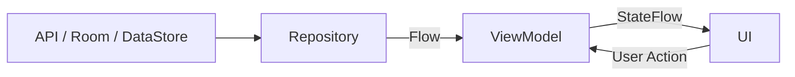
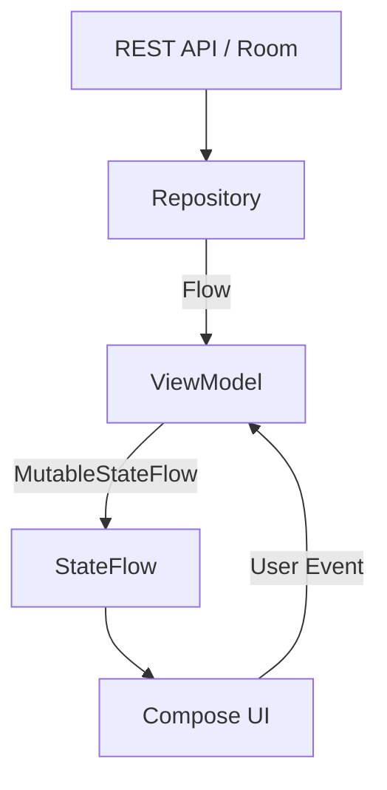
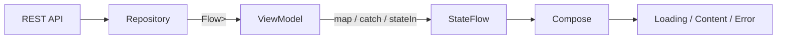
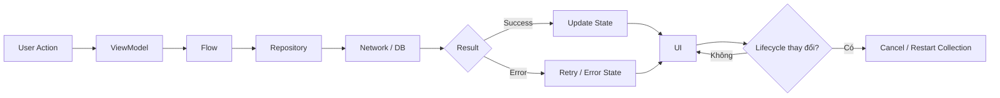

# Module 08 — Asynchronism — Bài 015: Flow

| Thuộc tính              | Nội dung                                                               |
| ----------------------- | ---------------------------------------------------------------------- |
| **Học phần**            | 04 — Network, Async and Services                                       |
| **Module**              | Module 08 — Asynchronism                                               |
| **Nhóm nội dung**       | Coroutines                                                             |
| **Nguồn roadmap**       | Asynchronism / Coroutines                                              |
| **Loại bài**            | Async                                                                  |
| **Thứ tự trong module** | 015                                                                    |
| **Thời lượng gợi ý**    | 34 phút                                                                |
| **Trọng tâm**           | Kotlin Flow, stream dữ liệu bất đồng bộ, lifecycle, state và xử lý lỗi |

---

## 1. Flow là gì?

**Flow** trong Kotlin Coroutines là API dùng để biểu diễn một **luồng dữ liệu bất đồng bộ có thể phát ra nhiều giá trị theo thời gian**.

Nếu một `suspend function` thường trả về **một kết quả**, thì `Flow` có thể trả về:

```text
Giá trị 1
   ↓
Giá trị 2
   ↓
Giá trị 3
   ↓
...
```

Ví dụ trong Android:

* Theo dõi dữ liệu từ Room Database.
* Theo dõi trạng thái đăng nhập.
* Quan sát thay đổi cài đặt người dùng.
* Stream trạng thái tải dữ liệu.
* Theo dõi từ khóa tìm kiếm.
* Nhận dữ liệu định kỳ từ repository.
* Biểu diễn UI state.

Ví dụ:

```kotlin
fun countFlow(): Flow<Int> = flow {
    for (i in 1..5) {
        delay(1000)
        emit(i)
    }
}
```

Collector:

```kotlin
countFlow().collect { value ->
    println(value)
}
```

Kết quả:

```text
1
2
3
4
5
```

---

# 2. Flow nằm ở đâu trong kiến trúc Android?

Flow thường xuất hiện ở phần **Data Layer → Domain/ViewModel → UI**.



Một pipeline điển hình:

```text
Network / Room / DataStore
          │
          ▼
      Repository
          │
       Flow<Data>
          │
          ▼
      ViewModel
          │
     StateFlow<UiState>
          │
          ▼
   Compose / Fragment
```

Điểm quan trọng là **không để UI trực tiếp quản lý các tác vụ async phức tạp**.

---

# 3. `suspend` và `Flow` khác nhau thế nào?

## `suspend function`

Thích hợp khi chỉ cần **một kết quả**:

```kotlin
suspend fun getUser(): User
```

Luồng:

```text
Call
 ↓
Waiting
 ↓
User
```

---

## `Flow`

Thích hợp khi có **nhiều giá trị theo thời gian**:

```kotlin
fun observeUsers(): Flow<List<User>>
```

Luồng:

```text
collect()
   │
   ├── User List #1
   ├── User List #2
   ├── User List #3
   └── ...
```

### Quy tắc dễ nhớ

```text
Một kết quả
    ↓
suspend

Nhiều kết quả theo thời gian
    ↓
Flow
```

---

# 4. Cold Flow

Flow thông thường là một **cold stream**.

Điều này có nghĩa là code bên trong `flow {}` chưa chạy ngay khi Flow được tạo.

```kotlin
val flow = flow {
    println("Start")
    emit(1)
}
```

Đoạn trên chưa in:

```text
Start
```

Cho đến khi:

```kotlin
flow.collect {
    println(it)
}
```

Khi đó:

```text
collect()
   ↓
Flow bắt đầu chạy
   ↓
emit()
   ↓
Collector nhận dữ liệu
```

Mỗi collector mới có thể khiến Flow chạy lại từ đầu.

---

# 5. Tạo Flow

Cách cơ bản:

```kotlin
fun createFlow(): Flow<Int> = flow {
    emit(1)
    emit(2)
    emit(3)
}
```

Collect:

```kotlin
createFlow().collect { value ->
    println(value)
}
```

---

## `flowOf`

Khi có sẵn các giá trị:

```kotlin
val numbers = flowOf(1, 2, 3, 4, 5)
```

---

## `asFlow`

Có thể chuyển collection thành Flow:

```kotlin
val numbers = listOf(1, 2, 3).asFlow()
```

---

# 6. `emit()` và `collect()`

Hai khái niệm quan trọng nhất của Flow:

```text
Producer                       Consumer

emit(data)
    │
    ▼
 ─────── Flow ───────► collect { data }
```

### Producer

```kotlin
flow {
    emit("Loading")
    emit("Success")
}
```

### Consumer

```kotlin
myFlow.collect { value ->
    println(value)
}
```

---

# 7. Flow operators

Sức mạnh lớn của Flow đến từ các **operator**.

Ví dụ:

```kotlin
numbersFlow
    .filter { it % 2 == 0 }
    .map { it * 10 }
    .collect {
        println(it)
    }
```

Pipeline:

```text
Flow
 │
 ▼
filter
 │
 ▼
map
 │
 ▼
collect
```

Nếu input là:

```text
1 2 3 4 5
```

Sau `filter`:

```text
2 4
```

Sau `map`:

```text
20 40
```

---

# 8. Các operator quan trọng

## `map`

Biến đổi dữ liệu.

```kotlin
userFlow.map { user ->
    user.name
}
```

---

## `filter`

Lọc dữ liệu.

```kotlin
numberFlow.filter {
    it > 10
}
```

---

## `transform`

Cho phép biến đổi linh hoạt hơn `map`.

```kotlin
flow.transform { value ->
    emit("Before $value")
    emit("After $value")
}
```

---

## `take`

Chỉ lấy một số lượng giá trị.

```kotlin
flow.take(3)
```

---

## `distinctUntilChanged`

Không phát lại giá trị giống giá trị trước.

```kotlin
flow.distinctUntilChanged()
```

Rất hữu ích với UI state.

---

# 9. Xử lý lỗi với `catch`

Flow hỗ trợ operator `catch`.

```kotlin
repository.getUsers()
    .catch { exception ->
        println(exception.message)
    }
    .collect { users ->
        println(users)
    }
```

Pipeline:

```text
Repository
    │
    ▼
  Flow
    │
    ├──── Success ───► collect()
    │
    └──── Error ─────► catch()
```

Trong Android, không nên chỉ log lỗi.

Nên chuyển nó thành UI state:

```kotlin
.catch { exception ->
    emit(
        UiState.Error(
            exception.message ?: "Unknown error"
        )
    )
}
```

---

# 10. Loading → Success → Error bằng Flow

Một pattern rất phổ biến:

```kotlin
fun getUsers(): Flow<UiState<List<User>>> = flow {

    emit(UiState.Loading)

    val users = api.getUsers()

    emit(UiState.Success(users))

}.catch { throwable ->

    emit(
        UiState.Error(
            throwable.message ?: "Unknown error"
        )
    )
}
```

Luồng:

```text
Request
   │
   ▼
Loading
   │
   ├── thành công ──► Success(data)
   │
   └── thất bại ────► Error(message)
```

---

# 11. `onStart`

Có thể dùng `onStart` để phát trạng thái loading:

```kotlin
repository.getUsers()
    .onStart {
        emit(UiState.Loading)
    }
```

Một pipeline hoàn chỉnh:

```kotlin
repository.getUsers()
    .map<List<User>, UiState<List<User>>> {
        UiState.Success(it)
    }
    .onStart {
        emit(UiState.Loading)
    }
    .catch {
        emit(UiState.Error(it.message ?: "Error"))
    }
```

---

# 12. Dispatcher và `flowOn`

Flow hỗ trợ lựa chọn dispatcher.

Ví dụ:

```kotlin
flow {
    emit(loadLargeFile())
}
.flowOn(Dispatchers.IO)
```

Ý tưởng:

```text
Dispatchers.IO
     │
     ▼
Producer / expensive work
     │
     ▼
    Flow
     │
     ▼
Main Thread
     │
     ▼
     UI
```

`flowOn()` thay đổi context của **phần upstream**.

Ví dụ:

```kotlin
repository.getUsers()
    .map {
        heavyTransformation(it)
    }
    .flowOn(Dispatchers.Default)
    .collect {
        updateUi(it)
    }
```

---

# 13. Không block Main Thread

Sai:

```kotlin
flow {
    Thread.sleep(5000)
    emit(data)
}
```

`Thread.sleep()` block thread.

Tốt hơn:

```kotlin
flow {
    delay(5000)
    emit(data)
}
```

`delay()` là suspend function nên coroutine có thể nhường thread cho công việc khác.

```text
Thread.sleep()
     ↓
Thread bị giữ
     ↓
UI có nguy cơ lag

delay()
     ↓
Coroutine suspend
     ↓
Thread được giải phóng
```

---

# 14. Cancellation

Flow được xây dựng trên Coroutine nên hỗ trợ **cancellation**.

Ví dụ:

```kotlin
val job = lifecycleScope.launch {

    repository.observeData()
        .collect {
            println(it)
        }
}

job.cancel()
```

Khi coroutine cha bị cancel, quá trình collect cũng bị cancel.

```text
Coroutine Scope
      │
      ▼
    Flow
      │
      ▼
  collect()
      │
      X
   cancel()
```

Điều này rất quan trọng trong Android vì:

* Fragment có thể bị destroy.
* Activity có thể bị đóng.
* User có thể chuyển màn hình.
* ViewModel có thể bị clear.

---

# 15. Structured Concurrency

Không nên tạo coroutine không được quản lý kiểu:

```kotlin
GlobalScope.launch {
    ...
}
```

Trong Android nên dùng scope phù hợp:

```kotlin
viewModelScope.launch {
    ...
}
```

hoặc:

```kotlin
lifecycleScope.launch {
    ...
}
```

Cấu trúc:

```text
ViewModel
   │
   ▼
viewModelScope
   │
   ├── Coroutine A
   │      └── Flow
   │
   └── Coroutine B
```

Khi ViewModel bị clear:

```text
ViewModel cleared
      ↓
viewModelScope cancelled
      ↓
child coroutines cancelled
      ↓
Flow collection cancelled
```

---

# 16. Flow và Android Lifecycle

Một lỗi phổ biến là collect Flow mà không quan tâm lifecycle.

Ví dụ với Fragment:

```kotlin
viewLifecycleOwner.lifecycleScope.launch {

    viewLifecycleOwner.repeatOnLifecycle(
        Lifecycle.State.STARTED
    ) {

        viewModel.uiState.collect { state ->
            render(state)
        }
    }
}
```

Luồng:

```text
Fragment STARTED
      │
      ▼
Collect Flow
      │
      ▼
Update UI

Fragment STOPPED
      │
      ▼
Collection tạm dừng/cancel

Fragment STARTED lại
      │
      ▼
Collect lại
```

Điều này giúp tránh:

* Update View đã bị destroy.
* Waste CPU/network.
* Lifecycle leak.
* Crash do truy cập UI không còn tồn tại.

---

# 17. Flow trong Jetpack Compose

Compose thường dùng:

```kotlin
val state by viewModel.uiState.collectAsStateWithLifecycle()
```

Ví dụ:

```kotlin
@Composable
fun UserScreen(
    viewModel: UserViewModel
) {

    val state by viewModel.uiState
        .collectAsStateWithLifecycle()

    when (state) {

        is UiState.Loading -> {
            CircularProgressIndicator()
        }

        is UiState.Success -> {
            UserList(
                users = state.data
            )
        }

        is UiState.Error -> {
            ErrorScreen()
        }
    }
}
```

Pipeline:

```text
Repository
    │
    ▼
ViewModel
    │
 StateFlow
    │
    ▼
collectAsStateWithLifecycle()
    │
    ▼
Compose recomposition
```

---

# 18. Flow và StateFlow

Đây là phần rất quan trọng trong Android hiện đại.

`StateFlow` là một loại Flow chuyên dùng để giữ **state hiện tại**.

Ví dụ:

```kotlin
private val _uiState =
    MutableStateFlow<UiState>(
        UiState.Loading
    )

val uiState: StateFlow<UiState> =
    _uiState.asStateFlow()
```

Cập nhật:

```kotlin
_uiState.value = UiState.Success(data)
```

UI:

```kotlin
val state by viewModel.uiState
    .collectAsStateWithLifecycle()
```

---

# 19. StateFlow trong kiến trúc MVVM

Một kiến trúc rất phổ biến:



ViewModel đóng vai trò chuyển:

```text
Data State
    ↓
UI State
```

---

# 20. `stateIn`

Một Flow thông thường có thể chuyển thành `StateFlow`.

Ví dụ:

```kotlin
val uiState: StateFlow<List<User>> =
    repository.observeUsers()
        .stateIn(
            scope = viewModelScope,
            started = SharingStarted.WhileSubscribed(5000),
            initialValue = emptyList()
        )
```

Cấu trúc:

```text
Flow<List<User>>
      │
      ▼
    stateIn
      │
      ▼
StateFlow<List<User>>
      │
      ▼
     UI
```

---

# 21. SharedFlow

`SharedFlow` là một **hot stream** cho phép nhiều collector dùng chung luồng dữ liệu.

Ví dụ:

```kotlin
private val _events =
    MutableSharedFlow<UiEvent>()

val events =
    _events.asSharedFlow()
```

Emit event:

```kotlin
_events.emit(
    UiEvent.ShowSnackbar("Saved")
)
```

---

# 22. Flow, StateFlow và SharedFlow

| Loại         | Dùng cho                     |
| ------------ | ---------------------------- |
| `Flow`       | Pipeline hoặc stream dữ liệu |
| `StateFlow`  | State hiện tại               |
| `SharedFlow` | Stream chia sẻ / event       |

Dễ nhớ:

```text
Flow
 └── dữ liệu theo thời gian

StateFlow
 └── trạng thái hiện tại của màn hình

SharedFlow
 └── chia sẻ event / stream
```

Ví dụ:

```text
Danh sách user từ database
        ↓
       Flow

Loading / Success / Error
        ↓
    StateFlow

Snackbar / Navigation event
        ↓
    SharedFlow
```

---

# 23. `combine`

Có thể kết hợp nhiều Flow.

Ví dụ:

```kotlin
combine(
    searchQuery,
    selectedCategory
) { query, category ->

    SearchFilter(
        query = query,
        category = category
    )

}
```

Sơ đồ:

```text
Search Query ───────┐
                    │
                    ▼
                 combine
                    │
                    ▼
               SearchFilter
                    ▲
                    │
Category ───────────┘
```

Điều này rất hữu ích khi UI state phụ thuộc nhiều nguồn dữ liệu.

---

# 24. `debounce`

Rất phổ biến với search box.

Nếu user gõ:

```text
a
an
and
andr
andro
android
```

Ta không muốn gọi API mỗi lần.

```kotlin
searchQuery
    .debounce(300)
    .distinctUntilChanged()
```

Luồng:

```text
User typing
    │
    ├─ a
    ├─ an
    ├─ and
    ├─ andro
    └─ android
         │
         ▼
     debounce
         │
         ▼
      android
         │
         ▼
      API call
```

---

# 25. `flatMapLatest`

Đặc biệt hữu ích cho search.

```kotlin
searchQuery
    .debounce(300)
    .distinctUntilChanged()
    .flatMapLatest { query ->

        repository.search(query)

    }
```

Nếu query mới xuất hiện:

```text
"and"
 │
 ├── API request A
 │
"android"
 │
 └── API request B
```

`flatMapLatest` sẽ bỏ/cancel flow cũ để tập trung vào query mới.

```text
Request A ─────X

Request B ───────────► Result
```

Điều này tránh việc kết quả tìm kiếm cũ ghi đè kết quả mới.

---

# 26. Retry

Flow hỗ trợ retry:

```kotlin
repository.getUsers()
    .retry(3)
    .catch { throwable ->
        emit(emptyList())
    }
```

Có thể đặt điều kiện:

```kotlin
.retryWhen { cause, attempt ->

    if (
        cause is IOException &&
        attempt < 3
    ) {

        delay(1000)

        true

    } else {

        false

    }
}
```

Flow:

```text
Request
   │
   ▼
 Error
   │
   ▼
Retry #1
   │
   ▼
 Error
   │
   ▼
Retry #2
   │
   ├── Success
   │
   └── Error → catch()
```

Không nên retry vô hạn vì có thể:

* Lãng phí pin.
* Tăng network traffic.
* Gây tải server.
* Làm UX khó hiểu.

---

# 27. Ví dụ hoàn chỉnh: Repository

```kotlin
class UserRepository(
    private val api: UserApi
) {

    fun getUsers(): Flow<List<User>> = flow {

        val users = api.getUsers()

        emit(users)

    }
    .retryWhen { cause, attempt ->

        cause is IOException &&
        attempt < 3

    }
    .flowOn(Dispatchers.IO)
}
```

---

# 28. ViewModel

```kotlin
class UserViewModel(
    private val repository: UserRepository
) : ViewModel() {

    val uiState: StateFlow<UiState<List<User>>> =
        repository
            .getUsers()
            .map<List<User>, UiState<List<User>>> {
                UiState.Success(it)
            }
            .onStart {
                emit(UiState.Loading)
            }
            .catch {
                emit(
                    UiState.Error(
                        it.message ?: "Unknown error"
                    )
                )
            }
            .stateIn(
                scope = viewModelScope,
                started = SharingStarted.WhileSubscribed(5000),
                initialValue = UiState.Loading
            )
}
```

---

# 29. UI

Compose:

```kotlin
@Composable
fun UserScreen(
    viewModel: UserViewModel
) {

    val state by viewModel.uiState
        .collectAsStateWithLifecycle()

    when (val result = state) {

        UiState.Loading -> {
            CircularProgressIndicator()
        }

        is UiState.Success -> {
            UserList(result.data)
        }

        is UiState.Error -> {
            Text(result.message)
        }
    }
}
```

Pipeline hoàn chỉnh:



---

# 30. Flow và UX

Flow không chỉ là vấn đề kỹ thuật.

Cách thiết kế Flow ảnh hưởng trực tiếp tới UX.

Ví dụ:

```text
User mở màn hình
      ↓
Loading
      ↓
Network request
      │
      ├── Success
      │      ↓
      │    Content
      │
      └── Error
             ↓
        Error + Retry
```

Một implementation tốt phải trả lời được:

* Loading hiển thị thế nào?
* User có retry được không?
* Khi mất mạng thì sao?
* Khi rotate thì state có còn không?
* Khi app vào background thì collection có cần tiếp tục không?
* Request cũ có bị cancel khi request mới xuất hiện không?

---

# 31. Debug Flow

Một cách đơn giản là log từng state.

```kotlin
flow
    .onStart {
        Log.d("UserFlow", "START")
    }
    .onEach {
        Log.d(
            "UserFlow",
            "DATA: $it"
        )
    }
    .catch {
        Log.e(
            "UserFlow",
            "ERROR",
            it
        )
    }
    .onCompletion {
        Log.d(
            "UserFlow",
            "COMPLETE"
        )
    }
```

Log có thể trông như:

```text
START

DATA: Loading

DATA: Success(users=10)

COMPLETE
```

Hoặc:

```text
START

DATA: Loading

ERROR: SocketTimeoutException

COMPLETE
```

---

# 32. Testing Flow

Flow cần được test giống các thành phần async khác.

Ví dụ đơn giản:

```kotlin
@Test
fun `flow emits expected values`() = runTest {

    val result =
        repository.getNumbers().toList()

    assertEquals(
        listOf(1, 2, 3),
        result
    )
}
```

Các case quan trọng cần test:

```text
Success
Error
Retry
Cancellation
Empty result
Multiple emissions
State transition
```

Đặc biệt với ViewModel:

```text
Loading
   ↓
Success
```

và:

```text
Loading
   ↓
Error
```

đều nên có test.

---

# 33. Những lỗi thường gặp

## Lỗi 1 — Collect Flow sai lifecycle

```kotlin
lifecycleScope.launch {
    flow.collect {
        ...
    }
}
```

Có thể không phù hợp nếu UI cần ngừng collect khi không visible.

Ưu tiên:

```kotlin
repeatOnLifecycle(...)
```

hoặc Compose:

```kotlin
collectAsStateWithLifecycle()
```

---

## Lỗi 2 — Dùng Flow cho mọi thứ

Không phải mọi API đều cần Flow.

Nếu chỉ cần:

```text
Request → Result
```

một `suspend function` có thể đơn giản hơn.

---

## Lỗi 3 — Block Main Thread

Tránh:

```kotlin
Thread.sleep()
```

hoặc heavy computation trong Main thread.

---

## Lỗi 4 — Không xử lý error

Không nên chỉ:

```kotlin
flow.collect {
    ...
}
```

mà bỏ qua failure path.

---

## Lỗi 5 — Retry không giới hạn

```text
Error
 ↓
Retry
 ↓
Error
 ↓
Retry
 ↓
...
```

có thể tạo request loop.

---

## Lỗi 6 — Không hiểu cancellation

Một Flow bị cancel có thể là hành vi đúng chứ không phải bug.

Ví dụ:

```text
User rời màn hình
        ↓
Coroutine cancelled
        ↓
Flow collection cancelled
```

---

# 34. Bài thực hành

## Yêu cầu

Xây dựng một màn hình tìm kiếm user.

Pipeline:

```text
TextField
   │
   ▼
MutableStateFlow<String>
   │
   ▼
debounce(300)
   │
   ▼
distinctUntilChanged()
   │
   ▼
flatMapLatest()
   │
   ▼
Repository
   │
   ▼
Network API
   │
   ▼
StateFlow<SearchUiState>
   │
   ▼
Compose UI
```

ViewModel có thể bắt đầu:

```kotlin
private val searchQuery =
    MutableStateFlow("")

val searchResult =
    searchQuery
        .debounce(300)
        .distinctUntilChanged()
        .flatMapLatest { query ->

            repository.searchUsers(query)

        }
```

Sau đó bổ sung:

* `Loading`
* `Success`
* `Error`
* `retry`
* lifecycle-aware collection

---

# 35. Bài tập

### Bài tập chính

Chuyển một tác vụ chạy lâu sang Coroutine + Flow mà không block Main Thread.

Ví dụ:

```text
User nhấn Search
      ↓
Flow searchQuery
      ↓
debounce
      ↓
API Request
      ↓
Loading
      ↓
Success / Error
```

Giải thích trong README:

1. Tại sao dùng Flow?
2. Flow được tạo ở layer nào?
3. Dispatcher nào được sử dụng?
4. Khi user rời màn hình thì Flow có bị cancel không?
5. Network error được xử lý thế nào?
6. Có retry không?
7. UI state được giữ ở đâu?

---

# 36. Artifact cho portfolio

Một artifact nhỏ nhưng tốt có thể là:

```text
flow-demo/
│
├── data/
│   └── UserRepository.kt
│
├── presentation/
│   ├── UserViewModel.kt
│   └── UserScreen.kt
│
├── model/
│   └── UiState.kt
│
├── test/
│   └── UserViewModelTest.kt
│
└── README.md
```

README nên có sơ đồ:

```text
API
 │
 ▼
Repository
 │
 Flow
 ▼
ViewModel
 │
 StateFlow
 ▼
Compose
```

Và ghi rõ:

```text
debounce
flatMapLatest
catch
retry
stateIn
collectAsStateWithLifecycle
```

---

# 37. Checklist hoàn thành

* [ ] Giải thích được `Flow` là gì.
* [ ] Phân biệt được `suspend function` và `Flow`.
* [ ] Hiểu `emit()` và `collect()`.
* [ ] Hiểu Flow thông thường là cold stream.
* [ ] Sử dụng được `map`, `filter`, `catch`.
* [ ] Biết dùng `flowOn()` hợp lý.
* [ ] Không block Main Thread.
* [ ] Hiểu cancellation.
* [ ] Hiểu structured concurrency.
* [ ] Biết collect Flow theo lifecycle.
* [ ] Hiểu `StateFlow`.
* [ ] Hiểu cơ bản `SharedFlow`.
* [ ] Biết dùng `stateIn()`.
* [ ] Hiểu `combine()`.
* [ ] Hiểu `debounce()`.
* [ ] Hiểu `flatMapLatest()`.
* [ ] Biết thiết kế retry có giới hạn.
* [ ] Có trạng thái `Loading / Success / Error`.
* [ ] Có log để debug state transition.
* [ ] Có test cho Flow.
* [ ] Có mini project hoặc artifact đưa vào portfolio.

---

# 38. Ghi chú production

Khi đưa Flow vào production, không chỉ hỏi:

> **“Flow có chạy không?”**

Mà phải kiểm tra toàn bộ vòng đời của dữ liệu:



Các câu hỏi cần kiểm tra trước release:

* **Lifecycle:** Flow có còn collect khi màn hình không còn visible không?
* **State:** State có bị mất khi rotate hoặc recreate UI không?
* **Cancellation:** Request cũ có được cancel đúng lúc không?
* **Network:** Timeout, offline và HTTP error được xử lý thế nào?
* **Retry:** Có giới hạn retry và backoff hợp lý không?
* **Performance:** Có operator hoặc transformation nặng chạy trên Main Thread không?
* **UX:** User có thấy Loading, Empty, Success và Error state rõ ràng không?
* **Testing:** Có test success, failure, retry và cancellation không?
* **Debugging:** Có đủ log để xác định Flow đang dừng ở operator nào không?
* **Release:** Thay đổi async có làm tăng crash, ANR hoặc network request bất thường không?

---

# 39. Tóm tắt tư duy

```text
                    KOTLIN FLOW
                         │
        ┌────────────────┼────────────────┐
        │                │                │
        ▼                ▼                ▼
     Producer         Operators        Collector
        │                │                │
      emit()       map / filter         collect()
                       catch
                       retry
                     debounce
                  flatMapLatest
                         │
                         ▼
                  Android State
                         │
               ┌─────────┴─────────┐
               ▼                   ▼
           StateFlow           SharedFlow
               │                   │
               ▼                   ▼
           UI State             Events
               │
               ▼
      collectAsStateWithLifecycle
               │
               ▼
           Compose UI
```

> **Cốt lõi của bài:** `Flow` không đơn thuần là cách nhận nhiều giá trị bất đồng bộ. Trong Android, nó là một mắt xích quan trọng để xây dựng pipeline **Data → Repository → ViewModel → State → UI**, đồng thời phải được thiết kế cùng với **cancellation, lifecycle, error handling, dispatcher và structured concurrency**.
