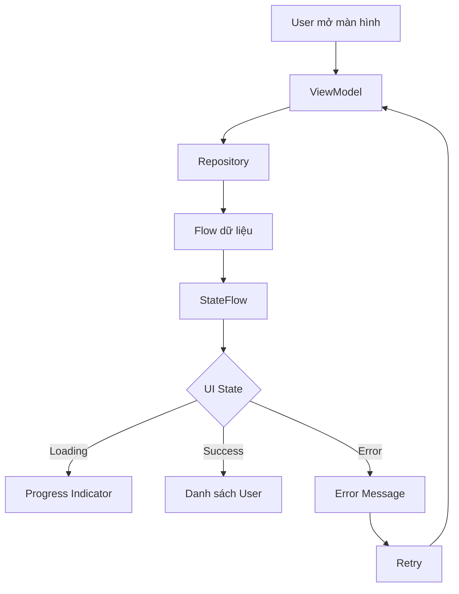

# 017 - Hot Flow

| Thuộc tính              | Nội dung                         |
| ----------------------- | -------------------------------- |
| **Học phần**            | 04 - Network, Async and Services |
| **Module**              | Module 08 - Asynchronism         |
| **Nhóm nội dung**       | Coroutines                       |
| **Nguồn roadmap**       | Asynchronism / Coroutines        |
| **Loại bài**            | Async                            |
| **Thứ tự trong module** | 017                              |
| **Thời lượng gợi ý**    | 34 phút                          |

---

## 1. Tóm tắt

**Hot Flow** là một luồng dữ liệu có thể tiếp tục tồn tại và phát dữ liệu **không phụ thuộc hoàn toàn vào việc có collector hay không**.

Trong Kotlin Coroutines, hai API thường gặp nhất để xây dựng Hot Flow là:

* `StateFlow`: biểu diễn **state hiện tại**.
* `SharedFlow`: phát **event hoặc stream dữ liệu dùng chung** cho nhiều collector.

Hot Flow đặc biệt quan trọng trong Android khi làm việc với:

* UI State.
* ViewModel.
* Jetpack Compose.
* nhiều UI cùng quan sát một nguồn dữ liệu.
* event hoặc dữ liệu real-time.
* chia sẻ kết quả của một Flow đắt đỏ.
* lifecycle của Activity/Fragment.

Ý tưởng chính:

> **Cold Flow thường bắt đầu công việc khi có người collect. Hot Flow có thể tồn tại độc lập và chia sẻ cùng một nguồn phát cho nhiều collector.**

---

# 2. Mục tiêu học tập

Sau bài này, bạn nên có thể:

* Giải thích được **Hot Flow** bằng ngôn ngữ của mình.
* Phân biệt được **Cold Flow và Hot Flow**.
* Hiểu vai trò của:

  * `StateFlow`
  * `SharedFlow`
  * `stateIn()`
  * `shareIn()`
* Biết cách dùng Hot Flow trong `ViewModel`.
* Biết collect Hot Flow an toàn theo Android lifecycle.
* Hiểu vấn đề:

  * replay
  * subscriber
  * cancellation
  * buffering
  * duplicate event
* Biết cách test Hot Flow.
* Biết ảnh hưởng của Hot Flow tới:

  * UX
  * performance
  * memory
  * maintainability.

---

# 3. Hot Flow là gì?

Có thể hình dung Hot Flow giống như **đài phát thanh**.

Đài vẫn có thể đang phát chương trình dù bạn có bật radio hay không.

```text
           Hot Flow
              │
       ┌──────┼──────┐
       │      │      │
       ▼      ▼      ▼
     UI A   UI B   Logger
```

Nhiều collector có thể cùng nhận dữ liệu từ **một nguồn phát chung**.

Ví dụ:

```kotlin
val state = MutableStateFlow(0)
```

Ngay khi `MutableStateFlow` được tạo, nó đã có state:

```text
0
```

Nó không cần chờ một collector bắt đầu mới tồn tại.

---

# 4. Cold Flow và Hot Flow

## Cold Flow

```kotlin
val numbers = flow {
    println("Start")
    emit(1)
    emit(2)
}
```

Collector thứ nhất:

```kotlin
numbers.collect {
    println("A: $it")
}
```

Collector thứ hai:

```kotlin
numbers.collect {
    println("B: $it")
}
```

Flow block sẽ chạy lại cho từng collector.

```text
Collector A
    │
    ▼
Start → 1 → 2

Collector B
    │
    ▼
Start → 1 → 2
```

Mỗi collector có một execution riêng.

---

## Hot Flow

Ví dụ:

```kotlin
val state = MutableStateFlow(0)
```

Nhiều collector sử dụng cùng một nguồn:

```text
                 MutableStateFlow
                       │
               current state = 5
                       │
          ┌────────────┼────────────┐
          ▼            ▼            ▼
      Collector A  Collector B  Collector C
```

Không tạo lại producer cho từng collector.

---

# 5. So sánh Cold Flow và Hot Flow

| Đặc điểm         | Cold Flow          | Hot Flow                  |
| ---------------- | ------------------ | ------------------------- |
| Producer bắt đầu | Khi `collect()`    | Có thể tồn tại độc lập    |
| Nhiều collector  | Có execution riêng | Có thể dùng chung         |
| State hiện tại   | Không mặc định     | `StateFlow` hỗ trợ        |
| Replay           | Không mặc định     | Có thể cấu hình           |
| Chia sẻ stream   | Không              | Có                        |
| Ví dụ            | `flow {}`          | `StateFlow`, `SharedFlow` |
| UI State         | Có thể dùng        | Rất phù hợp               |
| Event            | Có thể dùng        | `SharedFlow` phù hợp      |

---

# 6. Hai loại Hot Flow quan trọng

Trong Android, cần tập trung vào:

```text
Hot Flow
│
├── StateFlow
│     └── State / trạng thái
│
└── SharedFlow
      └── Event / stream chia sẻ
```

---

# 7. StateFlow

`StateFlow` được thiết kế để biểu diễn **state hiện tại**.

Ví dụ:

```kotlin
val counter = MutableStateFlow(0)
```

StateFlow luôn có một giá trị:

```kotlin
counter.value
```

Ví dụ:

```kotlin
counter.value = 10

println(counter.value)
```

Kết quả:

```text
10
```

---

# 8. MutableStateFlow và StateFlow

Thông thường ViewModel giữ:

```kotlin
MutableStateFlow
```

ở private.

UI chỉ được nhìn thấy:

```kotlin
StateFlow
```

Ví dụ:

```kotlin
class CounterViewModel : ViewModel() {

    private val _count = MutableStateFlow(0)

    val count: StateFlow<Int> = _count

    fun increment() {
        _count.value++
    }
}
```

Luồng dữ liệu:

```text
User Action
    │
    ▼
ViewModel
    │
    ▼
MutableStateFlow
    │
    ▼
StateFlow
    │
    ▼
UI
```

UI không trực tiếp sửa state.

---

# 9. Vì sao phải private MutableStateFlow?

Không nên:

```kotlin
val count = MutableStateFlow(0)
```

và expose trực tiếp cho UI.

Bởi UI có thể làm:

```kotlin
viewModel.count.value = 999
```

Điều này phá vỡ nguyên tắc:

> **State nên được quản lý bởi một nguồn duy nhất.**

Nên dùng:

```kotlin
private val _count = MutableStateFlow(0)

val count = _count.asStateFlow()
```

---

# 10. StateFlow trong ViewModel

Một cấu trúc phổ biến:

```kotlin
data class UserUiState(
    val loading: Boolean = false,
    val name: String = "",
    val error: String? = null
)
```

ViewModel:

```kotlin
class UserViewModel : ViewModel() {

    private val _uiState = MutableStateFlow(UserUiState())

    val uiState = _uiState.asStateFlow()

    fun loadUser() {

        viewModelScope.launch {

            _uiState.update {
                it.copy(loading = true)
            }

            try {

                delay(1000)

                _uiState.update {
                    it.copy(
                        loading = false,
                        name = "An Khánh"
                    )
                }

            } catch (e: Exception) {

                _uiState.update {
                    it.copy(
                        loading = false,
                        error = e.message
                    )
                }
            }
        }
    }
}
```

State transition:

```text
Idle

 ↓ loadUser()

Loading

 ↓ success

Content
```

Hoặc:

```text
Idle
 ↓
Loading
 ↓
Error
```

---

# 11. Collect StateFlow trong Compose

Ví dụ đơn giản:

```kotlin
@Composable
fun UserScreen(
    viewModel: UserViewModel
) {

    val state by viewModel.uiState.collectAsState()

    when {

        state.loading -> {
            CircularProgressIndicator()
        }

        state.error != null -> {
            Text(state.error!!)
        }

        else -> {
            Text(state.name)
        }
    }
}
```

Trong app Android thực tế, nên ưu tiên API collect-aware-lifecycle thích hợp cho Compose để tránh quan sát không cần thiết khi UI không hoạt động.

---

# 12. StateFlow luôn giữ state mới nhất

Giả sử:

```text
StateFlow

0
↓
1
↓
2
↓
3
```

Một collector mới subscribe sau khi state đã bằng `3`.

Nó sẽ nhận:

```text
3
```

ngay lập tức.

Đây là đặc điểm rất quan trọng của `StateFlow`.

---

# 13. StateFlow phù hợp với gì?

Ví dụ:

```text
UI State
Login State
Loading State
Search Query
Selected Tab
User Profile
Authentication State
Shopping Cart
Current Playback State
```

Nguyên tắc:

> Nếu dữ liệu trả lời câu hỏi **"trạng thái hiện tại là gì?"**, hãy nghĩ tới `StateFlow`.

---

# 14. SharedFlow

`SharedFlow` là Hot Flow linh hoạt hơn để truyền dữ liệu tới nhiều collector.

Ví dụ:

```kotlin
private val _events = MutableSharedFlow<String>()

val events = _events.asSharedFlow()
```

Phát event:

```kotlin
_events.emit("LoginSuccess")
```

Collectors:

```text
                SharedFlow
                    │
          ┌─────────┼─────────┐
          ▼         ▼         ▼
         UI       Logger    Analytics
```

---

# 15. SharedFlow phù hợp với event

Ví dụ:

```text
Show Snackbar
Navigate
Toast
Refresh event
Notification event
Connection status event
WebSocket message
```

Ví dụ:

```kotlin
sealed interface UiEvent {

    data object NavigateHome : UiEvent

    data class ShowMessage(
        val message: String
    ) : UiEvent
}
```

ViewModel:

```kotlin
private val _events =
    MutableSharedFlow<UiEvent>()

val events =
    _events.asSharedFlow()
```

Phát event:

```kotlin
viewModelScope.launch {

    _events.emit(
        UiEvent.NavigateHome
    )
}
```

---

# 16. State và Event khác nhau

Đây là điểm rất quan trọng.

## State

Ví dụ:

```text
User đã đăng nhập = true
```

Đây là trạng thái hiện tại.

Nên dùng:

```text
StateFlow
```

---

## Event

Ví dụ:

```text
Hiển thị Snackbar "Đăng nhập thành công"
```

Chỉ cần xử lý một lần.

Có thể dùng:

```text
SharedFlow
```

---

## Sơ đồ

```text
                ViewModel
                   │
          ┌────────┴─────────┐
          │                  │
          ▼                  ▼
      StateFlow          SharedFlow
          │                  │
          ▼                  ▼
       UI State            Event
          │                  │
   ┌──────┼──────┐     ┌─────┼─────┐
   ▼      ▼      ▼     ▼     ▼     ▼
Loading Error Content Toast Nav Snackbar
```

---

# 17. Replay trong SharedFlow

`SharedFlow` có thể nhớ một số giá trị gần nhất.

Ví dụ:

```kotlin
val flow = MutableSharedFlow<Int>(
    replay = 2
)
```

Producer phát:

```text
1
2
3
4
```

Collector mới subscribe.

Vì:

```text
replay = 2
```

collector sẽ nhận lại:

```text
3
4
```

---

# 18. replay = 0

Ví dụ:

```kotlin
MutableSharedFlow<Event>(
    replay = 0
)
```

Collector mới không nhận event cũ.

Điều này thường hợp lý với event như:

```text
Toast
Snackbar
Navigation
```

Bởi bạn thường không muốn:

```text
rotate màn hình
        ↓
collector mới
        ↓
Snackbar cũ xuất hiện lại
```

---

# 19. stateIn()

`stateIn()` chuyển một Flow thành `StateFlow`.

Ví dụ repository:

```kotlin
val users: Flow<List<User>>
```

ViewModel:

```kotlin
val users: StateFlow<List<User>> =
    repository.users
        .stateIn(
            scope = viewModelScope,
            started = SharingStarted.WhileSubscribed(5000),
            initialValue = emptyList()
        )
```

Pipeline:

```text
Cold Flow
   │
   │ stateIn()
   ▼
StateFlow
   │
   ├── UI A
   └── UI B
```

---

# 20. shareIn()

`shareIn()` biến một Flow thành `SharedFlow`.

Ví dụ:

```kotlin
val sharedUsers =
    repository.users
        .shareIn(
            scope = viewModelScope,
            started = SharingStarted.WhileSubscribed(),
            replay = 1
        )
```

Thay vì:

```text
Collector A
    ↓
API call

Collector B
    ↓
API call
```

có thể chia sẻ:

```text
           API
            │
            ▼
        SharedFlow
         /      \
        ▼        ▼
      UI A      UI B
```

---

# 21. Tại sao share Flow?

Giả sử Flow chạy operation đắt:

```kotlin
flow {
    val data = api.getUsers()
    emit(data)
}
```

Hai collector:

```text
Collector A → API request

Collector B → API request
```

Có thể thành hai request.

Nếu sử dụng sharing phù hợp:

```text
        API request
             │
             ▼
         SharedFlow
          /      \
         ▼        ▼
     Collector A Collector B
```

Chỉ cần chia sẻ producer.

---

# 22. SharingStarted

Khi dùng:

```kotlin
stateIn()
```

hoặc:

```kotlin
shareIn()
```

bạn phải quyết định khi nào upstream Flow chạy.

Các chiến lược thường gặp:

```text
SharingStarted
│
├── Eagerly
├── Lazily
└── WhileSubscribed
```

---

# 23. Eagerly

```kotlin
SharingStarted.Eagerly
```

Producer bắt đầu ngay.

```text
Flow created
    │
    ▼
Producer starts
    │
    ▼
collector có hay không vẫn chạy
```

Dùng khi nguồn dữ liệu thực sự cần hoạt động ngay.

Nhưng có thể tốn tài nguyên.

---

# 24. Lazily

```kotlin
SharingStarted.Lazily
```

Producer bắt đầu khi subscriber đầu tiên xuất hiện.

```text
Flow created
      │
      ▼
    idle
      │
subscriber xuất hiện
      │
      ▼
 producer starts
```

---

# 25. WhileSubscribed

Trong Android thường gặp:

```kotlin
SharingStarted.WhileSubscribed()
```

Producer hoạt động khi có subscriber.

```text
subscriber > 0
      │
      ▼
 upstream active
```

Khi không còn subscriber:

```text
subscriber = 0
      │
      ▼
 upstream stop
```

Giúp giảm:

* network request không cần thiết.
* DB observation không cần thiết.
* CPU.
* battery usage.

---

# 26. WhileSubscribed với timeout

Một pattern rất phổ biến:

```kotlin
SharingStarted.WhileSubscribed(
    stopTimeoutMillis = 5_000
)
```

Ý nghĩa:

```text
UI unsubscribe
      │
      ▼
 wait 5 seconds
      │
      ├── subscriber trở lại
      │        ↓
      │    giữ stream
      │
      └── không trở lại
               ↓
         stop upstream
```

Có ích khi configuration change xảy ra nhanh.

---

# 27. Hot Flow và Android Lifecycle

Một lỗi thường gặp:

```kotlin
lifecycleScope.launch {
    viewModel.state.collect {
        updateUi(it)
    }
}
```

Nếu collect không được gắn đúng vào lifecycle, bạn có thể tiếp tục xử lý dữ liệu khi UI không còn ở trạng thái thích hợp.

Một pattern phổ biến:

```kotlin
lifecycleScope.launch {

    repeatOnLifecycle(
        Lifecycle.State.STARTED
    ) {

        viewModel.uiState.collect {
            updateUi(it)
        }
    }
}
```

---

# 28. repeatOnLifecycle

Lifecycle:

```text
CREATED
   │
   ▼
STARTED
   │
   ▼
RESUMED
```

Khi UI đạt:

```text
STARTED
```

collector chạy.

Khi UI xuống dưới STARTED:

```text
Collector cancelled
```

Khi quay lại:

```text
Collector restart
```

Sơ đồ:

```text
Activity STARTED
      │
      ▼
 collect Flow

Activity STOPPED
      │
      ▼
 cancel collector

Activity STARTED
      │
      ▼
 collect lại
```

---

# 29. Structured Concurrency vẫn rất quan trọng

Hot Flow không có nghĩa là tạo coroutine tùy ý.

Không nên:

```kotlin
GlobalScope.launch {
    flow.collect()
}
```

Vì coroutine có thể sống lâu hơn UI hoặc feature cần nó.

Nên gắn coroutine vào scope phù hợp:

```text
ViewModel
    │
    ▼
viewModelScope
```

hoặc:

```text
LifecycleOwner
    │
    ▼
lifecycleScope
```

---

# 30. Không block Main Thread

Hot Flow không tự động giải quyết vấn đề thread.

Ví dụ xấu:

```kotlin
viewModelScope.launch {

    val result = veryHeavyCalculation()

    _state.value = result
}
```

Nếu calculation chạy trên Main Dispatcher, UI vẫn có thể lag.

Có thể chuyển workload:

```kotlin
val result = withContext(Dispatchers.Default) {
    veryHeavyCalculation()
}
```

Hoặc IO:

```kotlin
withContext(Dispatchers.IO) {
    repository.loadData()
}
```

Nguyên tắc:

```text
Main
 ├── UI
 └── State update

IO
 ├── Database
 ├── File
 └── Network blocking APIs

Default
 └── CPU-heavy work
```

---

# 31. Cancellation

Hot Flow phải được đặt trong scope hợp lý để cancellation hoạt động đúng.

Ví dụ:

```kotlin
viewModelScope.launch {

    repository.observeUsers()
        .collect {
            _state.value = it
        }
}
```

Khi ViewModel bị clear:

```text
ViewModel destroyed
       │
       ▼
viewModelScope cancelled
       │
       ▼
collection cancelled
```

---

# 32. Retry

Flow có thể retry khi lỗi:

```kotlin
repository.observeUsers()
    .retry(3)
    .collect {
        _state.value = it
    }
```

Hoặc:

```kotlin
.retryWhen { cause, attempt ->

    delay(1000)

    attempt < 3
}
```

Luồng:

```text
Request
   │
   ▼
 Error
   │
   ▼
 Retry
   │
   ├── Success
   │
   └── Error
        │
        ▼
      Retry
```

---

# 33. Error handling

Ví dụ:

```kotlin
repository.observeUsers()
    .catch { throwable ->

        _uiState.update {
            it.copy(
                error = throwable.message
            )
        }
    }
    .collect { users ->

        _uiState.update {
            it.copy(
                users = users
            )
        }
    }
```

Không nên để exception âm thầm terminate Flow mà UI không biết.

---

# 34. update() với MutableStateFlow

Thay vì:

```kotlin
_uiState.value =
    _uiState.value.copy(
        loading = true
    )
```

có thể dùng:

```kotlin
_uiState.update {
    it.copy(
        loading = true
    )
}
```

Đặc biệt hữu ích khi nhiều coroutine có thể cập nhật state.

---

# 35. Ví dụ hoàn chỉnh

```kotlin
data class HomeUiState(
    val loading: Boolean = false,
    val users: List<User> = emptyList(),
    val error: String? = null
)

class HomeViewModel(
    private val repository: UserRepository
) : ViewModel() {

    private val _uiState =
        MutableStateFlow(HomeUiState())

    val uiState =
        _uiState.asStateFlow()

    private val _events =
        MutableSharedFlow<HomeEvent>()

    val events =
        _events.asSharedFlow()

    fun loadUsers() {

        viewModelScope.launch {

            _uiState.update {
                it.copy(
                    loading = true,
                    error = null
                )
            }

            repository
                .observeUsers()
                .retry(2)
                .catch { throwable ->

                    _uiState.update {
                        it.copy(
                            loading = false,
                            error = throwable.message
                        )
                    }

                    _events.emit(
                        HomeEvent.ShowMessage(
                            "Không tải được dữ liệu"
                        )
                    )
                }
                .collect { users ->

                    _uiState.update {
                        it.copy(
                            loading = false,
                            users = users
                        )
                    }
                }
        }
    }
}
```

---

# 36. Kiến trúc Android với Hot Flow

Một kiến trúc phổ biến:

```text
Network / Database
        │
        ▼
     Repository
        │
        │ Flow
        ▼
     ViewModel
        │
   ┌────┴─────┐
   │          │
   ▼          ▼
StateFlow  SharedFlow
   │          │
   ▼          ▼
 UI State    Event
   │          │
   └────┬─────┘
        ▼
 Compose / Fragment
```

---

# 37. Hot Flow và Single Source of Truth

Một kiến trúc tốt thường có:

```text
Database
   │
   ▼
Repository
   │
   ▼
ViewModel
   │
   ▼
StateFlow
   │
   ▼
UI
```

UI không giữ nhiều bản copy state độc lập.

Điều này giúp giảm:

```text
UI State A
UI State B
UI State C
```

bị lệch nhau.

---

# 38. Hot Flow ảnh hưởng đến UX

Nếu dùng đúng:

* UI cập nhật reactive.
* trạng thái nhất quán.
* loading/error rõ ràng.
* ít request dư thừa.
* dữ liệu mới được phản ánh nhanh.
* rotate màn hình ít gây mất state.

Nếu dùng sai:

* event bị chạy lại.
* navigation lặp.
* nhiều collector gây tải dư.
* producer chạy khi app background.
* state bị stale.
* crash do exception không xử lý.

---

# 39. Hot Flow và performance

Đặc biệt chú ý:

```text
Expensive Producer
       │
       ▼
     Flow
```

Nếu dùng Cold Flow:

```text
Collector A → Producer
Collector B → Producer
Collector C → Producer
```

Có thể tạo ba workload.

Với shared Hot Flow:

```text
           Producer
              │
              ▼
          SharedFlow
          /   |    \
         ▼    ▼     ▼
        A     B      C
```

Có thể chỉ cần một producer.

---

# 40. Nhưng Hot Flow cũng có rủi ro

Hot Flow có lifecycle dài hơn nên có thể giữ:

* object.
* cache.
* subscription.
* network connection.
* WebSocket.
* coroutine.

Nếu scope sai:

```text
Hot Flow
   │
   └───────────────► sống quá lâu
                         │
                         ▼
                    waste resource
```

Do đó phải xác định rõ:

```text
Flow này nên sống bao lâu?
```

---

# 41. Debug Hot Flow

Có thể log state transition:

```kotlin
uiState
    .onEach {
        Log.d(
            "HomeState",
            "state=$it"
        )
    }
```

Hoặc:

```kotlin
repository.users
    .onStart {
        Log.d("Users", "Started")
    }
    .onEach {
        Log.d("Users", "Value=$it")
    }
    .onCompletion {
        Log.d("Users", "Completed")
    }
```

---

# 42. Những lỗi phổ biến

## Lỗi 1: Dùng StateFlow cho event

Ví dụ:

```kotlin
val navigate = MutableStateFlow(false)
```

Sau navigation:

```text
navigate = true
```

Rotate:

```text
collector mới
    ↓
nhận true
    ↓
navigate lần nữa
```

Đây là một nguồn bug phổ biến.

---

## Lỗi 2: Expose MutableStateFlow

Không nên:

```kotlin
val state = MutableStateFlow(...)
```

Nên:

```kotlin
private val _state = MutableStateFlow(...)

val state = _state.asStateFlow()
```

---

## Lỗi 3: Producer chạy mãi

Ví dụ:

```kotlin
shareIn(
    scope = applicationScope,
    started = SharingStarted.Eagerly
)
```

Nếu không thực sự cần application lifetime, có thể gây lãng phí.

---

## Lỗi 4: Không xử lý lifecycle

```text
Activity stopped
      │
      ▼
Flow vẫn collect
      │
      ▼
work không cần thiết
```

---

## Lỗi 5: Thực hiện heavy work trên Main

```text
Main Thread
     │
     ▼
Heavy Calculation
     │
     ▼
Dropped Frames
     │
     ▼
Jank
```

---

# 43. Testing Hot Flow

Ví dụ test StateFlow:

```kotlin
@Test
fun loadUsers_updatesState() = runTest {

    viewModel.loadUsers()

    advanceUntilIdle()

    val state = viewModel.uiState.value

    assertFalse(state.loading)
    assertTrue(state.users.isNotEmpty())
}
```

---

# 44. Test state transition

Thay vì chỉ kiểm tra state cuối:

```text
Loading → Success
```

nên kiểm tra sequence.

Ví dụ mong muốn:

```text
Initial
   ↓
Loading
   ↓
Success
```

Hoặc khi lỗi:

```text
Initial
   ↓
Loading
   ↓
Error
```

Điều này giúp phát hiện lỗi UI state tốt hơn.

---

# 45. Bài thực hành

## Yêu cầu

Tạo màn hình:

```text
User List
```

với các state:

```text
Loading
Success
Error
```

Repository trả về:

```kotlin
Flow<List<User>>
```

ViewModel chuyển Flow thành:

```kotlin
StateFlow<UserUiState>
```

UI collect StateFlow và render.

---

## Luồng mong muốn



---

# 46. Bài tập mở rộng

Tạo thêm:

```kotlin
MutableSharedFlow<UiEvent>
```

để xử lý:

```text
ShowSnackbar
```

khi request thất bại.

Mục tiêu:

```text
StateFlow
    ↓
trạng thái dài hạn

SharedFlow
    ↓
event một lần
```

---

# 47. Artifact cho portfolio

Có thể tạo project nhỏ:

```text
hot-flow-demo/
│
├── data/
│   ├── UserRepository.kt
│   └── FakeUserRepository.kt
│
├── ui/
│   ├── UserViewModel.kt
│   ├── UserUiState.kt
│   ├── UiEvent.kt
│   └── UserScreen.kt
│
├── test/
│   └── UserViewModelTest.kt
│
└── README.md
```

README giải thích:

* Cold Flow vs Hot Flow.
* StateFlow vs SharedFlow.
* lifecycle handling.
* state transition.
* retry/error handling.
* cách test Flow.

Đây là artifact khá tốt để thể hiện kiến thức Android asynchronous programming.

---

# 48. Checklist hoàn thành

* [ ] Giải thích được Hot Flow là gì.
* [ ] Phân biệt được Cold Flow và Hot Flow.
* [ ] Hiểu `StateFlow`.
* [ ] Hiểu `SharedFlow`.
* [ ] Biết khi nào dùng StateFlow cho state.
* [ ] Biết khi nào dùng SharedFlow cho event.
* [ ] Hiểu `replay`.
* [ ] Hiểu `stateIn()`.
* [ ] Hiểu `shareIn()`.
* [ ] Hiểu `SharingStarted`.
* [ ] Biết collect Flow theo lifecycle.
* [ ] Không block Main Thread.
* [ ] Biết cancellation và retry.
* [ ] Biết log state transition.
* [ ] Có ViewModel dùng Hot Flow.
* [ ] Có test cho state.
* [ ] Có artifact nhỏ cho portfolio.

---

# 49. Ghi chú production

Trước khi đưa Hot Flow vào production, nên kiểm tra:

### Lifecycle

```text
Flow có tiếp tục chạy khi màn hình không còn visible không?
```

### Scope

```text
Flow nên sống theo:
Screen?
ViewModel?
Application?
```

### State

```text
Rotate màn hình có giữ đúng state không?
```

### Events

```text
Snackbar / navigation có bị thực hiện hai lần không?
```

### Performance

```text
Nhiều collector có gây nhiều request không?
```

### Error

```text
API fail → UI có state Error rõ ràng không?
```

### Cancellation

```text
User rời màn hình → công việc còn cần tiếp tục không?
```

### Testing

Ít nhất nên có test cho:

```text
Initial → Loading → Success
```

và:

```text
Initial → Loading → Error
```

---

# 50. Ghi nhớ nhanh

```text
HOT FLOW
│
├── StateFlow
│    │
│    ├── giữ giá trị hiện tại
│    ├── luôn có initial value
│    └── phù hợp UI State
│
├── SharedFlow
│    │
│    ├── nhiều subscriber
│    ├── replay cấu hình được
│    └── phù hợp Event / shared stream
│
├── stateIn()
│    └── Flow → StateFlow
│
├── shareIn()
│    └── Flow → SharedFlow
│
└── Android
     │
     ├── ViewModel
     ├── Lifecycle
     ├── Cancellation
     ├── Retry
     └── Testing
```

> **Quy tắc nhớ nhanh:**
> **StateFlow = "Bây giờ trạng thái là gì?"**
> **SharedFlow = "Có điều gì vừa xảy ra?"**
> **Hot Flow = một nguồn dữ liệu có thể được chia sẻ cho nhiều subscriber thay vì tạo lại producer cho từng collector.**
