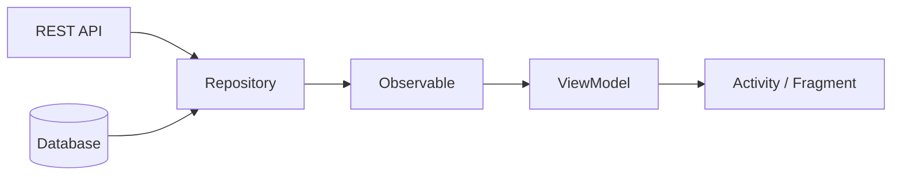
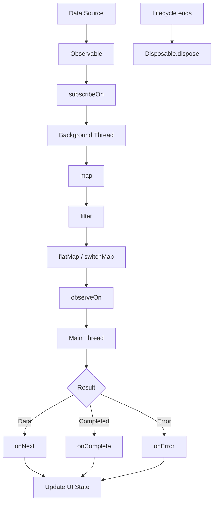

# 020 — Observable

| Thuộc tính              | Nội dung                              |
| ----------------------- | ------------------------------------- |
| **Học phần**            | 04 — Network, Async and Services      |
| **Module**              | Module 08 — Asynchronism              |
| **Nhóm nội dung**       | Rx and Background Work                |
| **Nguồn roadmap**       | Asynchronism / Rx and Background Work |
| **Loại bài**            | Async                                 |
| **Thứ tự trong module** | 020                                   |
| **Thời lượng gợi ý**    | 34 phút                               |

---

## 1. Tóm tắt

**Observable** là một trong những kiểu dữ liệu trung tâm của **RxJava**.

Có thể hiểu đơn giản:

> **Observable là một nguồn phát dữ liệu theo thời gian, còn Observer là đối tượng đăng ký để nhận những dữ liệu đó.**

Một `Observable` có thể phát:

* `0` giá trị.
* `1` giá trị.
* Nhiều giá trị.
* Sau đó kết thúc thành công bằng `onComplete()`.
* Hoặc kết thúc do lỗi bằng `onError()`.

Trong Android, Observable thường xuất hiện khi xử lý:

* API/network.
* Database.
* Search.
* Sự kiện UI.
* Timer.
* Background computation.
* Chuỗi biến đổi dữ liệu bất đồng bộ.

Ví dụ luồng phổ biến:

```text
API
 ↓
Observable<List<User>>
 ↓
map / filter
 ↓
Repository
 ↓
ViewModel
 ↓
Observer
 ↓
UI
```

Observable giúp mô hình hóa các tác vụ bất đồng bộ theo dạng **data stream**, thay vì sử dụng callback lồng nhau.

---

# 2. Mục tiêu học tập

Sau bài này, bạn nên có thể:

* Giải thích `Observable` bằng ngôn ngữ của mình.
* Phân biệt **Observable** và **Observer**.
* Hiểu `subscribe()` hoạt động như thế nào.
* Hiểu các callback:

  * `onNext()`
  * `onError()`
  * `onComplete()`
* Hiểu vai trò của:

  * `subscribeOn()`
  * `observeOn()`
  * `Disposable`
* Biết cách chuyển công việc khỏi Main Thread.
* Biết cách hủy subscription khi lifecycle thay đổi.
* Biết khi nào nên dùng Observable và khi nào cần cân nhắc `Flowable`, `Single`, `Maybe`, `Completable`.
* Có thể viết một ví dụ RxJava nhỏ cho Android.
* Có thể kiểm thử và debug một reactive stream.

---

# 3. Observable là gì?

Ví dụ:

```kotlin
val observable = Observable.just(
    "Android",
    "Kotlin",
    "RxJava"
)
```

Observable trên sẽ lần lượt phát ba giá trị:

```text
Android
Kotlin
RxJava
```

Luồng sự kiện tương đương:

```text
subscribe()
    │
    ▼
onNext("Android")
    │
    ▼
onNext("Kotlin")
    │
    ▼
onNext("RxJava")
    │
    ▼
onComplete()
```

Có thể hình dung bằng sơ đồ marble:

```text
Observable

──────A──────B──────C──────|
      │      │      │      │
      │      │      │      └── onComplete()
      │      │      └───────── onNext(C)
      │      └──────────────── onNext(B)
      └─────────────────────── onNext(A)
```

Trong đó:

```text
A, B, C → dữ liệu

|       → stream hoàn thành

X       → xảy ra lỗi
```

---

# 4. Observable và Observer

Hai khái niệm quan trọng nhất:

```text
Observable
    │
    │ phát dữ liệu
    ▼
 Observer
```

### Observable

Có trách nhiệm:

```text
phát dữ liệu
phát lỗi
thông báo hoàn thành
```

### Observer

Có trách nhiệm:

```text
nhận dữ liệu
xử lý lỗi
xử lý khi stream hoàn thành
```

Ví dụ:

```kotlin
val observable = Observable.just(1, 2, 3)

observable.subscribe(
    { value ->
        println("Received: $value")
    },
    { error ->
        println("Error: ${error.message}")
    },
    {
        println("Completed")
    }
)
```

Kết quả:

```text
Received: 1
Received: 2
Received: 3
Completed
```

---

# 5. Bốn sự kiện quan trọng của Observer

Một Observer đầy đủ có bốn callback:

```kotlin
val observer = object : Observer<Int> {

    override fun onSubscribe(d: Disposable) {
        println("Subscribed")
    }

    override fun onNext(value: Int) {
        println("Value = $value")
    }

    override fun onError(error: Throwable) {
        println("Error = $error")
    }

    override fun onComplete() {
        println("Completed")
    }
}
```

Luồng:

```text
Observable
    │
    ▼
onSubscribe()
    │
    ▼
onNext()
    │
    ├── onNext()
    │
    ├── onNext()
    │
    ▼
 ┌───────────────┐
 │               │
 ▼               ▼
onComplete()   onError()
```

Điểm quan trọng:

> `onComplete()` và `onError()` đều là **terminal event**.

Sau khi một trong hai xảy ra:

```text
Observable không được phát thêm dữ liệu.
```

---

# 6. Observable trong kiến trúc Android

Một kiến trúc đơn giản:



Repository có thể trả về:

```kotlin
fun getUsers(): Observable<List<User>>
```

ViewModel sau đó subscribe:

```kotlin
repository.getUsers()
    .subscribe(
        { users ->
            // success
        },
        { error ->
            // error
        }
    )
```

---

# 7. Ví dụ Network với Observable

Giả sử API:

```kotlin
interface UserApi {

    @GET("users")
    fun getUsers(): Observable<List<User>>
}
```

Repository:

```kotlin
class UserRepository(
    private val api: UserApi
) {

    fun getUsers(): Observable<List<User>> {
        return api.getUsers()
    }
}
```

ViewModel:

```kotlin
class UserViewModel(
    private val repository: UserRepository
) : ViewModel() {

    private val disposables = CompositeDisposable()

    fun loadUsers() {

        val disposable = repository.getUsers()
            .subscribeOn(Schedulers.io())
            .observeOn(AndroidSchedulers.mainThread())
            .subscribe(
                { users ->
                    println("Users: $users")
                },
                { error ->
                    println("Error: ${error.message}")
                }
            )

        disposables.add(disposable)
    }

    override fun onCleared() {
        disposables.clear()
    }
}
```

Luồng thực thi:

```text
ViewModel
   │
   │ loadUsers()
   ▼
Repository
   │
   ▼
HTTP Request
   │
   │ Schedulers.io()
   ▼
Background Thread
   │
   ▼
List<User>
   │
   │ AndroidSchedulers.mainThread()
   ▼
Main Thread
   │
   ▼
Update UI State
```

---

# 8. `subscribe()`

`subscribe()` là thời điểm Observer bắt đầu đăng ký vào Observable.

Ví dụ:

```kotlin
val stream = Observable.just(1, 2, 3)
```

Chỉ khai báo như trên chưa có Observer nhận dữ liệu.

Khi:

```kotlin
stream.subscribe { value ->
    println(value)
}
```

Observable mới bắt đầu gửi dữ liệu cho subscriber.

Sơ đồ:

```text
Observable definition
        │
        │ subscribe()
        ▼
Observable execution
        │
        ├── 1
        ├── 2
        ├── 3
        ▼
     complete
```

---

# 9. Operators

Sức mạnh lớn của RxJava nằm ở khả năng nối nhiều **operator** thành pipeline.

Ví dụ:

```kotlin
Observable.just(1, 2, 3, 4, 5)
    .filter { it % 2 == 0 }
    .map { it * 10 }
    .subscribe {
        println(it)
    }
```

Luồng:

```text
1 ──┐
2 ──┤
3 ──┤ Observable
4 ──┤
5 ──┘
     │
     ▼
 filter(even)
     │
     ▼
   2, 4
     │
     ▼
  map(*10)
     │
     ▼
  20, 40
```

Kết quả:

```text
20
40
```

---

# 10. Các operator thường gặp

## `map`

Biến đổi từng phần tử.

```kotlin
.map { user ->
    user.name
}
```

---

## `filter`

Chỉ giữ dữ liệu thỏa điều kiện.

```kotlin
.filter { user ->
    user.isActive
}
```

---

## `flatMap`

Biến một phần tử thành Observable khác.

```kotlin
.flatMap { user ->
    api.getPosts(user.id)
}
```

Ví dụ:

```text
User
 │
 ▼
getPosts(user)
 │
 ▼
Observable<List<Post>>
```

---

## `distinctUntilChanged`

Không phát lại giá trị nếu giống giá trị trước đó.

Rất hữu ích cho state hoặc search.

```kotlin
.distinctUntilChanged()
```

---

## `debounce`

Chờ một khoảng thời gian trước khi phát.

Đặc biệt hữu ích cho:

```text
SearchView
```

Ví dụ:

```kotlin
searchObservable
    .debounce(300, TimeUnit.MILLISECONDS)
```

Nếu người dùng nhập:

```text
a
an
and
andr
andro
android
```

thay vì gọi API 6 lần:

```text
android
    │
 300 ms
    ▼
call API
```

---

# 11. Scheduler

Một vấn đề quan trọng trong Android:

> Không được thực hiện network hoặc tác vụ nặng trực tiếp trên Main Thread.

RxJava giải quyết bằng Scheduler.

Hai operator quan trọng:

```text
subscribeOn()
observeOn()
```

---

# 12. `subscribeOn()`

`subscribeOn()` xác định nơi công việc phía nguồn được thực hiện.

Ví dụ:

```kotlin
.subscribeOn(Schedulers.io())
```

Thường dùng cho:

```text
Network
Database
File IO
```

---

# 13. `observeOn()`

`observeOn()` xác định thread mà các operator/subscriber phía sau nó xử lý dữ liệu.

Ví dụ:

```kotlin
.observeOn(AndroidSchedulers.mainThread())
```

Luồng:

```text
Network request
       │
       │ subscribeOn(IO)
       ▼
┌──────────────────┐
│ Background Thread│
└──────────────────┘
       │
       │ Response
       ▼
observeOn(Main)
       │
       ▼
┌──────────────────┐
│    Main Thread   │
└──────────────────┘
       │
       ▼
    Update UI
```

Mẫu quen thuộc:

```kotlin
api.getUsers()
    .subscribeOn(Schedulers.io())
    .observeOn(AndroidSchedulers.mainThread())
    .subscribe(...)
```

---

# 14. Các Scheduler thường gặp

| Scheduler                        | Phù hợp với                           |
| -------------------------------- | ------------------------------------- |
| `Schedulers.io()`                | Network, file, database, blocking I/O |
| `Schedulers.computation()`       | CPU-intensive computation             |
| `Schedulers.single()`            | Chuỗi công việc tuần tự               |
| `AndroidSchedulers.mainThread()` | Cập nhật UI                           |

Không nên đơn giản dùng:

```kotlin
Schedulers.io()
```

cho mọi thứ.

Nếu là phép tính CPU nặng, nên cân nhắc:

```kotlin
Schedulers.computation()
```

---

# 15. Disposable

Khi gọi:

```kotlin
subscribe()
```

ta thường nhận được một:

```text
Disposable
```

Ví dụ:

```kotlin
val disposable =
    observable.subscribe { value ->
        println(value)
    }
```

`Disposable` cho phép hủy subscription:

```kotlin
disposable.dispose()
```

Sơ đồ:

```text
Observable
    │
    ├──── A
    ├──── B
    ├──── C
    ├──── D
    └──── E

Observer
    │
    ├──── nhận A
    ├──── nhận B
    │
 dispose()
    X

C, D, E không còn được xử lý
```

---

# 16. CompositeDisposable

Một ViewModel thường có nhiều subscription.

Thay vì quản lý:

```text
Disposable A
Disposable B
Disposable C
Disposable D
```

có thể gom lại bằng:

```kotlin
private val disposables = CompositeDisposable()
```

Thêm subscription:

```kotlin
disposables.add(
    repository.getUsers()
        .subscribe(...)
)
```

Hoặc Kotlin:

```kotlin
repository.getUsers()
    .subscribe(...)
    .addTo(disposables)
```

Khi ViewModel bị destroy:

```kotlin
override fun onCleared() {
    disposables.clear()
}
```

---

# 17. Observable và Android Lifecycle

Một trong những lỗi phổ biến nhất khi dùng RxJava là:

```text
Activity destroyed
        │
        ▼
Observable vẫn chạy
        │
        ▼
Callback vẫn giữ Activity
        │
        ▼
Memory Leak
```

Hoặc:

```text
Request
  │
  ▼
rotate device
  │
  ▼
Activity cũ destroyed
  │
  ▼
response quay lại
  │
  ▼
update Activity cũ
```

Vì vậy phải có chiến lược hủy subscription.

Ví dụ với ViewModel:

```text
Activity
   │
   ▼
ViewModel
   │
   ├── Disposable
   ├── Disposable
   └── Disposable
        │
        ▼
ViewModel.onCleared()
        │
        ▼
CompositeDisposable.clear()
```

---

# 18. Cold Observable

Một Observable thường có thể là **cold stream**.

Mỗi subscriber có execution riêng.

Ví dụ:

```kotlin
val observable = Observable.fromCallable {
    println("Loading...")
    loadData()
}
```

Subscriber A:

```kotlin
observable.subscribe()
```

Subscriber B:

```kotlin
observable.subscribe()
```

Có thể dẫn tới:

```text
Subscriber A
     │
     ▼
loadData()

Subscriber B
     │
     ▼
loadData()
```

Tức là:

```text
loadData() chạy 2 lần
```

Sơ đồ:

```text
          Observable
          /        \
         /          \
        ▼            ▼
 Subscriber A    Subscriber B
       │               │
       ▼               ▼
 Request #1        Request #2
```

---

# 19. Hot Observable

Hot stream tồn tại độc lập với subscriber.

Ví dụ khái niệm:

```text
Live sensor
Touch event
WebSocket
Event bus
```

Có thể hình dung:

```text
          Hot Stream
A ── B ── C ── D ── E ── F
          ▲
          │ subscribe
          │
        Observer

Observer chỉ nhận:

D, E, F
```

Nó có thể đã phát `A`, `B`, `C` trước khi Observer subscribe.

---

# 20. Observable và Backpressure

Observable có thể phát dữ liệu nhanh hơn Observer xử lý.

Ví dụ:

```text
Producer

1 2 3 4 5 6 7 8 9 10 ...
│ │ │ │ │ │ │ │ │
▼ ▼ ▼ ▼ ▼ ▼ ▼ ▼ ▼

Consumer

1 ---- 2 ---- 3 ----
```

Nếu producer phát quá nhanh:

```text
Queue
 ↓
Memory tăng
 ↓
Performance giảm
 ↓
Potential OOM
```

Observable **không cung cấp cơ chế backpressure mạnh như `Flowable`**.

Trong trường hợp lượng event rất lớn hoặc producer nhanh hơn consumer đáng kể, cần cân nhắc:

```text
Observable
    ↓
Flowable
```

---

# 21. Observable vs Flowable

| Observable                    | Flowable                              |
| ----------------------------- | ------------------------------------- |
| Reactive stream thông thường  | Reactive stream hỗ trợ backpressure   |
| Dễ sử dụng                    | Có thêm chiến lược backpressure       |
| Phù hợp lượng event vừa phải  | Phù hợp stream phát dữ liệu rất nhanh |
| UI event, API, business logic | Sensor, stream lớn, event tốc độ cao  |

Ví dụ:

```text
Search query
    ↓
Observable
```

Nhưng:

```text
100,000 sensor events / giây
            ↓
         Flowable
```

---

# 22. Observable vs Single vs Maybe vs Completable

RxJava có nhiều reactive type.

| Type            |           Số giá trị |
| --------------- | -------------------: |
| `Observable<T>` |                0 → N |
| `Single<T>`     |          Chính xác 1 |
| `Maybe<T>`      |             0 hoặc 1 |
| `Completable`   |    Không trả dữ liệu |
| `Flowable<T>`   | 0 → N + backpressure |

Ví dụ API trả về đúng một User:

```kotlin
fun getUser(): Single<User>
```

thường diễn đạt ý nghĩa tốt hơn:

```kotlin
fun getUser(): Observable<User>
```

---

# 23. Khi nào nên dùng Observable?

Observable phù hợp khi stream có thể phát **nhiều giá trị theo thời gian**.

Ví dụ:

```text
Search query
       │
       ▼
 Observable<String>
```

hoặc:

```text
Database changes
       │
       ▼
Observable<List<User>>
```

hoặc:

```text
WebSocket
    │
    ▼
Observable<Message>
```

Nếu API chỉ trả đúng một response thì:

```text
Single<Response>
```

thường rõ nghĩa hơn.

---

# 24. Ví dụ Search với Observable

Một use case rất phù hợp là tìm kiếm.

```text
User typing
   │
   ▼
Observable<String>
   │
   ▼
debounce(300ms)
   │
   ▼
distinctUntilChanged()
   │
   ▼
filter(query not blank)
   │
   ▼
switchMap()
   │
   ▼
Search API
   │
   ▼
Results
```

Ví dụ:

```kotlin
searchObservable
    .debounce(300, TimeUnit.MILLISECONDS)
    .distinctUntilChanged()
    .filter { query ->
        query.isNotBlank()
    }
    .switchMap { query ->
        repository.search(query)
    }
    .subscribeOn(Schedulers.io())
    .observeOn(AndroidSchedulers.mainThread())
    .subscribe(
        { result ->
            showResult(result)
        },
        { error ->
            showError(error)
        }
    )
```

---

# 25. Tại sao `switchMap()` hữu ích cho Search?

Giả sử người dùng nhập:

```text
cat
```

Request A bắt đầu.

Sau đó nhập:

```text
cats
```

Request B bắt đầu.

Có thể xảy ra:

```text
Request A ───────────── response
Request B ───── response
```

Nếu không quản lý:

```text
B result
 ↓
UI

A result đến sau
 ↓
ghi đè UI bằng dữ liệu cũ
```

Với `switchMap()`:

```text
cat  ─────────── X
             cancel

cats ─────────────── result
```

Chỉ stream mới nhất được quan tâm.

---

# 26. Error handling

Không nên bỏ qua `onError`.

Sai:

```kotlin
observable.subscribe { data ->
    showData(data)
}
```

Tốt hơn:

```kotlin
observable.subscribe(
    { data ->
        showData(data)
    },
    { error ->
        showError(error)
    }
)
```

Pipeline production thường cần xử lý:

```text
Network timeout
HTTP error
Parsing error
Database error
Authentication error
```

---

# 27. Retry

RxJava hỗ trợ retry.

Ví dụ:

```kotlin
api.getUsers()
    .retry(3)
```

Luồng:

```text
Request
   │
   X fail
   │
retry #1
   │
   X fail
   │
retry #2
   │
   ▼
success
```

Tuy nhiên không nên retry mọi lỗi.

Ví dụ:

```text
Timeout
Connection reset
Temporary server error
```

có thể retry.

Nhưng:

```text
401 Unauthorized
400 Bad Request
Invalid input
```

thường không nên retry mù quáng.

---

# 28. Retry có delay

Một chiến lược tốt hơn:

```text
request
   ↓
fail
   ↓
wait
   ↓
retry
```

Thay vì:

```text
request
fail
request
fail
request
fail
```

vì điều này có thể gây thêm tải lên server.

Trong production thường dùng:

```text
Exponential Backoff
```

Ví dụ:

```text
1s
 ↓
2s
 ↓
4s
 ↓
8s
```

---

# 29. State trong UI

Không nên để Observable trực tiếp điều khiển hàng loạt View.

Thay vào đó có thể chuyển kết quả thành UI state.

Ví dụ:

```kotlin
sealed interface UserUiState {

    data object Loading : UserUiState

    data class Success(
        val users: List<User>
    ) : UserUiState

    data class Error(
        val message: String
    ) : UserUiState
}
```

Luồng:

```text
Observable
    │
    ▼
ViewModel
    │
    ▼
UiState
    │
 ┌──┼────────────┐
 ▼  ▼            ▼
Loading       Success       Error
```

Điều này làm code:

* dễ debug hơn;
* dễ test hơn;
* dễ maintain hơn;
* UI có single source of truth rõ ràng hơn.

---

# 30. Observable và UX

Observable không chỉ là vấn đề kỹ thuật.

Cách xử lý Observable ảnh hưởng trực tiếp tới UX.

Ví dụ Search:

```text
Không debounce
      │
      ▼
API gọi liên tục
      │
      ▼
Network congestion
      │
      ▼
UI lag
```

Hoặc:

```text
Không switchMap
      │
      ▼
response cũ về sau
      │
      ▼
kết quả tìm kiếm sai
```

Hoặc:

```text
Không error handling
      │
      ▼
loading mãi mãi
      │
      ▼
user tưởng app bị treo
```

---

# 31. Observable và Performance

Các vấn đề cần chú ý:

### Chạy tác vụ nặng trên Main Thread

Sai:

```text
Main Thread
   ↓
network/database
   ↓
UI freeze
```

---

### Subscription không được dispose

```text
Old Activity
    ↑
Observable
    │
still references
    │
Memory Leak
```

---

### Quá nhiều event

```text
Producer
 ↓↓↓↓↓↓↓↓↓↓↓
Observable
 ↓
Consumer chậm
 ↓
Memory pressure
```

---

### Chain quá phức tạp

Ví dụ:

```kotlin
source
    .flatMap(...)
    .map(...)
    .filter(...)
    .flatMap(...)
    .retryWhen(...)
    .onErrorResumeNext(...)
    .switchMap(...)
```

Nếu không tổ chức tốt, pipeline rất khó debug.

Nên tách thành các hàm có ý nghĩa.

---

# 32. Debug Observable

Một cách hữu ích là log từng transition.

Ví dụ:

```kotlin
observable
    .doOnSubscribe {
        println("STATE -> SUBSCRIBED")
    }
    .doOnNext {
        println("STATE -> DATA: $it")
    }
    .doOnError {
        println("STATE -> ERROR: $it")
    }
    .doOnComplete {
        println("STATE -> COMPLETE")
    }
    .doFinally {
        println("STATE -> FINISHED")
    }
    .subscribe()
```

Log:

```text
STATE -> SUBSCRIBED
STATE -> DATA
STATE -> DATA
STATE -> COMPLETE
STATE -> FINISHED
```

Nếu lỗi:

```text
STATE -> SUBSCRIBED
STATE -> DATA
STATE -> ERROR
STATE -> FINISHED
```

---

# 33. Testing Observable

Ví dụ:

```kotlin
@Test
fun observable_emitsExpectedValues() {

    Observable.just(1, 2, 3)
        .test()
        .assertValues(
            1,
            2,
            3
        )
        .assertComplete()
        .assertNoErrors()
}
```

Đây là một trong những ưu điểm lớn của RxJava:

```text
Observable
    ↓
TestObserver
    ↓
assert values
assert errors
assert completion
```

---

# 34. Test lỗi

Ví dụ:

```kotlin
@Test
fun observable_returnsError() {

    Observable.error<Int>(
        IllegalStateException("Database error")
    )
        .test()
        .assertError(IllegalStateException::class.java)
}
```

---

# 35. Test transformation

Ví dụ:

```kotlin
@Test
fun observable_filtersEvenNumbers() {

    Observable.just(1, 2, 3, 4)
        .filter { it % 2 == 0 }
        .test()
        .assertValues(2, 4)
        .assertComplete()
}
```

Artifact kiểu này rất thích hợp đưa vào portfolio vì thể hiện rằng bạn không chỉ biết syntax RxJava mà còn biết kiểm thử reactive pipeline.

---

# 36. Bài thực hành

## Yêu cầu

Tạo một chức năng giả lập tải dữ liệu trong background.

Observable:

```kotlin
fun loadData(): Observable<String> {

    return Observable.fromCallable {

        Thread.sleep(2000)

        "Data loaded successfully"
    }
}
```

Subscribe:

```kotlin
val disposable = loadData()
    .subscribeOn(Schedulers.io())
    .observeOn(AndroidSchedulers.mainThread())
    .subscribe(
        { data ->
            println("Success: $data")
        },
        { error ->
            println("Error: ${error.message}")
        }
    )
```

---

# 37. Thêm cancellation

Ví dụ:

```kotlin
private val disposables =
    CompositeDisposable()

fun load() {

    loadData()
        .subscribeOn(Schedulers.io())
        .observeOn(AndroidSchedulers.mainThread())
        .subscribe(
            {
                println(it)
            },
            {
                println(it)
            }
        )
        .also {
            disposables.add(it)
        }
}
```

Khi không còn cần stream:

```kotlin
disposables.clear()
```

Sơ đồ:

```text
Start Task
   │
   ▼
Background Thread
   │
   ├──────── processing
   │
Activity/ViewModel destroyed
   │
   ▼
dispose()
   │
   X
subscription cancelled
```

---

# 38. Bài tập

## Bài tập chính

Hãy xây dựng một tác vụ chạy lâu:

```text
User
 │
 │ nhấn Load
 ▼
ViewModel
 │
 ▼
Observable
 │
 ▼
Background Thread
 │
 ▼
Load Data
 │
 ▼
Main Thread
 │
 ▼
UI
```

Yêu cầu:

1. Chuyển công việc khỏi Main Thread.
2. Hiển thị trạng thái `Loading`.
3. Khi thành công, hiển thị `Success`.
4. Khi lỗi, hiển thị `Error`.
5. Cho phép hủy subscription.
6. Thêm retry nếu lỗi phù hợp.
7. Log state transition.
8. Viết ít nhất một unit test cho Observable.

---

# 39. Bài tập nâng cao — Search

Xây dựng:

```text
Search input
     │
     ▼
Observable<String>
     │
     ▼
debounce(300ms)
     │
     ▼
distinctUntilChanged()
     │
     ▼
filter
     │
     ▼
switchMap
     │
     ▼
API
     │
 ┌───┴─────┐
 ▼         ▼
Success   Error
```

Mục tiêu là chứng minh bạn hiểu:

* stream;
* operator;
* threading;
* cancellation;
* error handling;
* lifecycle.

---

# 40. Những lỗi phổ biến

## Lỗi 1 — Network trên Main Thread

```text
Network
   ↓
Main Thread
   ↓
UI freeze
```

Giải pháp:

```kotlin
subscribeOn(Schedulers.io())
```

---

## Lỗi 2 — Quên dispose

```text
Activity destroyed
       │
Observable vẫn subscribe
       │
       ▼
Memory Leak
```

Giải pháp:

```kotlin
CompositeDisposable
```

và:

```kotlin
clear()
```

đúng lifecycle.

---

## Lỗi 3 — Không xử lý `onError`

Có thể khiến error đi tới global error handler hoặc làm luồng hoạt động không như mong muốn.

Luôn xác định:

```text
Success path
Error path
Cancellation path
```

---

## Lỗi 4 — Retry vô hạn

Sai:

```text
request
 ↓
fail
 ↓
retry
 ↓
fail
 ↓
retry
 ↓
...
```

Có thể:

* gây request storm;
* tăng tải server;
* hao pin;
* hao dữ liệu mạng.

---

## Lỗi 5 — Dùng Observable cho mọi trường hợp

Nếu chỉ có một response:

```text
GET /profile
     │
     ▼
1 User
```

`Single<User>` thường diễn đạt rõ hơn:

```kotlin
Single<User>
```

---

# 41. So sánh Observable với Kotlin Flow

Trong Android hiện đại, bạn cũng thường gặp:

```text
RxJava Observable
```

và:

```text
Kotlin Flow
```

Tư duy cơ bản khá giống:

```text
Producer
   │
   ▼
Stream
   │
 operators
   ▼
Consumer
```

Một số khái niệm có thể đối chiếu:

| RxJava                          | Kotlin Flow                    |
| ------------------------------- | ------------------------------ |
| `Observable`                    | `Flow`                         |
| `map()`                         | `map()`                        |
| `filter()`                      | `filter()`                     |
| `flatMap...()`                  | `flatMap...()`                 |
| `subscribe()`                   | `collect()`                    |
| `subscribeOn()` / `observeOn()` | Coroutine context / `flowOn()` |
| `Disposable`                    | `Job` / coroutine cancellation |

Nếu đã hiểu Observable, việc học Flow thường dễ hơn vì bạn đã quen với tư duy:

```text
data stream
+
operator pipeline
+
cancellation
+
error handling
```

---

# 42. Sơ đồ tổng hợp Observable



Có thể rút gọn toàn bộ bài thành:

```text
SOURCE
  │
  ▼
Observable
  │
  ▼
Operators
  │
  ├── map
  ├── filter
  ├── flatMap
  ├── debounce
  └── switchMap
  │
  ▼
Scheduler
  │
  ▼
Observer
  │
  ├── onNext
  ├── onError
  └── onComplete
  │
  ▼
UI State

Lifecycle
   │
   ▼
Disposable
   │
   ▼
Cancellation
```

---

# 43. Artifact nhỏ cho portfolio

Một project tốt có thể là:

## **RxJava Search Demo**

Chức năng:

```text
Search User
```

Pipeline:

```text
EditText
   ↓
Observable<String>
   ↓
debounce
   ↓
distinctUntilChanged
   ↓
switchMap
   ↓
Retrofit API
   ↓
Repository
   ↓
ViewModel
   ↓
Loading / Success / Error
```

README nên giải thích:

```text
1. Vì sao sử dụng Observable?
2. subscribeOn() dùng ở đâu?
3. observeOn() dùng ở đâu?
4. Search request cũ được hủy thế nào?
5. Error được xử lý ra sao?
6. Subscription được dispose ở lifecycle nào?
7. Observable được test như thế nào?
```

Đây là artifact mạnh hơn nhiều so với chỉ có một đoạn:

```kotlin
Observable.just(...)
```

---

# 44. Checklist hoàn thành

* [ ] Giải thích được Observable là nguồn phát dữ liệu theo thời gian.
* [ ] Phân biệt được Observable và Observer.
* [ ] Hiểu `subscribe()`.
* [ ] Hiểu `onNext()`.
* [ ] Hiểu `onError()`.
* [ ] Hiểu `onComplete()`.
* [ ] Biết sử dụng `map`.
* [ ] Biết sử dụng `filter`.
* [ ] Hiểu `flatMap`.
* [ ] Hiểu `switchMap`.
* [ ] Hiểu `debounce`.
* [ ] Biết dùng `subscribeOn()`.
* [ ] Biết dùng `observeOn()`.
* [ ] Không chạy network/tác vụ nặng trên Main Thread.
* [ ] Hiểu `Disposable`.
* [ ] Biết quản lý nhiều subscription bằng `CompositeDisposable`.
* [ ] Có chiến lược hủy stream theo lifecycle.
* [ ] Có xử lý lỗi.
* [ ] Không retry vô hạn.
* [ ] Hiểu khác biệt cơ bản giữa `Observable` và `Flowable`.
* [ ] Phân biệt được `Observable`, `Single`, `Maybe`, `Completable`.
* [ ] Có ít nhất một test bằng `TestObserver`.
* [ ] Có một demo nhỏ có thể đưa vào portfolio.

---

# 45. Ghi chú production

Trước khi đưa một Observable pipeline vào production, nên kiểm tra:

### Thread

```text
Tác vụ nặng có thực sự chạy ngoài Main Thread không?
```

### Lifecycle

```text
Subscription có được dispose đúng lúc không?
```

### State

```text
Loading
Success
Error
```

có được biểu diễn rõ ràng không?

### Cancellation

Nếu user:

```text
rời màn hình
đổi query
background app
```

request cũ còn cần thiết không?

### Error

Phải biết rõ:

```text
network mất
timeout
HTTP error
parse error
database error
```

sẽ dẫn tới trạng thái UI nào.

### Retry

Không retry mù quáng:

```text
retry
+
delay
+
maximum attempts
+
đúng loại error
```

### Performance

Kiểm tra:

```text
event quá nhiều?
subscription dư thừa?
network request bị duplicate?
operator quá nặng?
memory leak?
```

### Testing

Ít nhất nên test:

```text
Success
Error
Transformation
Cancellation hoặc retry nếu quan trọng
```

---

# 46. Ghi nhớ nhanh

> **Observable = một stream có thể phát 0 đến nhiều giá trị cho Observer.**

Công thức tư duy:

```text
Observable
    =
Source
    +
Operators
    +
Scheduler
    +
Observer
    +
Error Handling
    +
Cancellation
```

Trong Android:

```text
Network / DB / Event
        │
        ▼
     Observable
        │
        ▼
    Operators
        │
        ▼
Background Thread
        │
        ▼
    ViewModel
        │
        ▼
    Main Thread
        │
        ▼
     UI State
```

Điểm quan trọng nhất không phải chỉ biết viết:

```kotlin
Observable.just(...)
```

mà là hiểu **stream chạy ở thread nào, stream kết thúc hoặc lỗi ra sao, ai đang subscribe, khi nào phải hủy subscription và dữ liệu đó được chuyển thành UI state như thế nào**.
