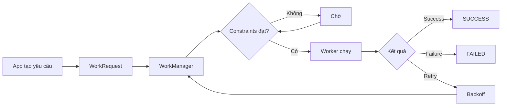
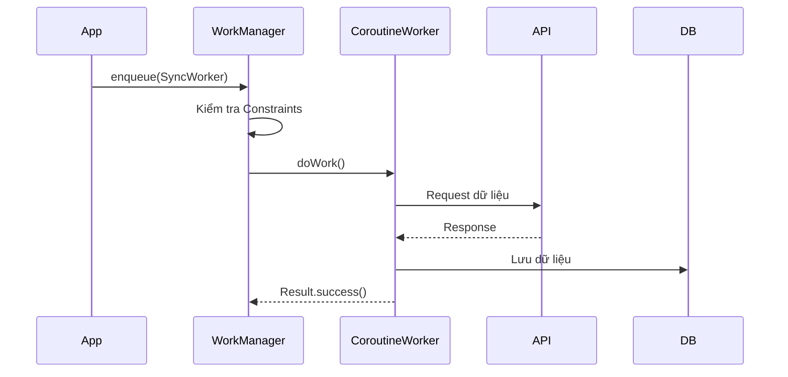
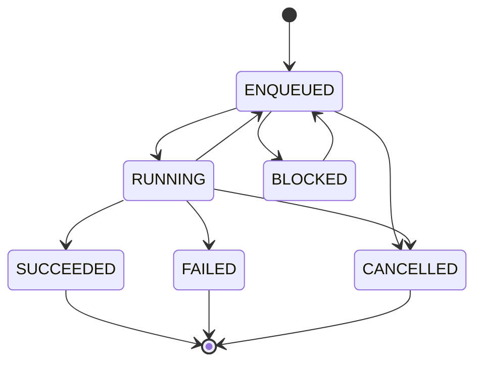
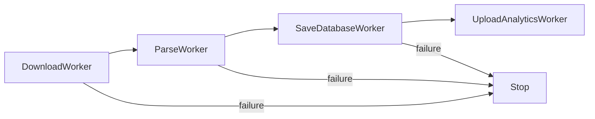
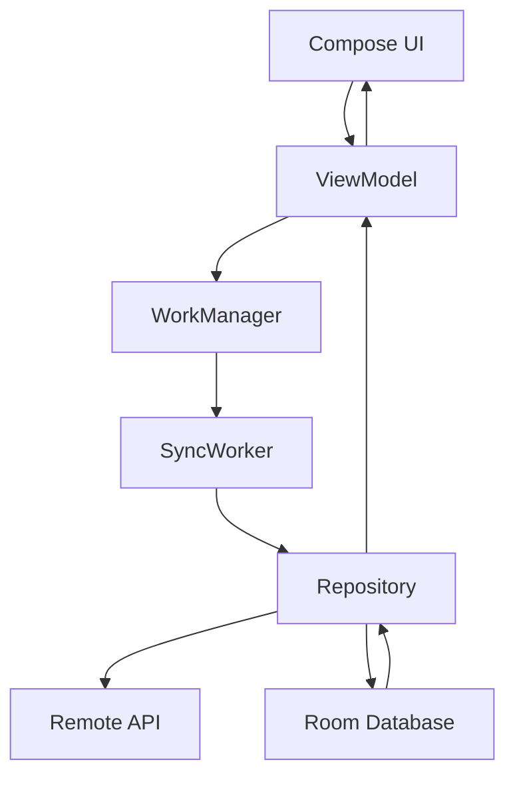

# 023 — WorkManager

| Thuộc tính              | Nội dung                               |
| ----------------------- | -------------------------------------- |
| **Học phần**            | 04 — Network, Async and Services       |
| **Module**              | Module 08 — Asynchronism               |
| **Nhóm nội dung**       | Rx and Background Work                 |
| **Nguồn roadmap**       | Asynchronism / Rx and Background Work  |
| **Loại bài**            | Async / Background Work                |
| **Thứ tự trong module** | 023                                    |
| **Thời lượng gợi ý**    | 34 phút                                |
| **Công nghệ chính**     | Jetpack WorkManager, Kotlin Coroutines |
| **Mức độ**              | Trung cấp                              |

---

## 1. Tóm tắt

**WorkManager** là thư viện Jetpack dùng để thực thi các công việc nền **có thể trì hoãn nhưng cần được thực hiện một cách đáng tin cậy**, chẳng hạn:

* Đồng bộ dữ liệu với server.
* Upload ảnh/file.
* Gửi log hoặc analytics.
* Backup dữ liệu.
* Dọn cache.
* Đồng bộ dữ liệu định kỳ.
* Retry một API request bị lỗi mạng.

WorkManager có thể tiếp tục quản lý công việc ngay cả khi process của ứng dụng không còn chạy và chỉ thực thi khi các `Constraints` cần thiết được đáp ứng. Nó cũng hỗ trợ theo dõi trạng thái và tạo chuỗi nhiều công việc phụ thuộc nhau. ([Android Developers][1])

> **Ý tưởng quan trọng:**
> WorkManager không phải công cụ để chạy mọi tác vụ bất đồng bộ. Nó dành cho **persistent/background work** cần được Android đảm bảo lập lịch.

---

# 2. Vị trí của WorkManager trong Android

Có thể hình dung:

```text
Android App
│
├── UI
│   ├── Activity
│   └── Compose
│
├── ViewModel
│
├── Repository
│   │
│   ├── Local Database
│   │
│   └── Network API
│
└── Background Work
    │
    └── WorkManager
        ├── Worker
        ├── CoroutineWorker
        ├── Constraints
        ├── Retry
        ├── Backoff
        └── Periodic Work
```

WorkManager thường nằm ở tầng **background orchestration**, không phải trực tiếp trong UI.

---

# 3. Mục tiêu học tập

Sau bài này, bạn có thể:

* [ ] Giải thích được WorkManager dùng để làm gì.
* [ ] Phân biệt WorkManager với coroutine thông thường.
* [ ] Tạo một `CoroutineWorker`.
* [ ] Tạo `WorkRequest`.
* [ ] Đưa công việc vào WorkManager bằng `enqueue()`.
* [ ] Thiết lập `Constraints`.
* [ ] Xử lý `success`, `failure`, `retry`.
* [ ] Hiểu retry và backoff.
* [ ] Theo dõi trạng thái `WorkInfo`.
* [ ] Hủy background work.
* [ ] Tạo periodic work.
* [ ] Tránh tạo duplicate work bằng Unique Work.
* [ ] Test Worker.
* [ ] Xây dựng một artifact WorkManager cho portfolio.

---

# 4. Tư duy cốt lõi

Một job WorkManager thường có luồng:



Điểm quan trọng là:

> App mô tả **công việc cần làm và điều kiện để làm**, còn WorkManager quyết định **thời điểm thích hợp để chạy**.

---

# 5. Khi nào nên dùng WorkManager?

## Nên dùng

Ví dụ:

```text
User chụp ảnh
      ↓
Lưu local
      ↓
Upload lên server
      ↓
Nếu mất mạng
      ↓
WorkManager chờ
      ↓
Có mạng trở lại
      ↓
Upload lại
```

Các trường hợp phổ biến:

| Trường hợp               | WorkManager |
| ------------------------ | ----------- |
| Upload ảnh               | ✅           |
| Đồng bộ dữ liệu          | ✅           |
| Backup                   | ✅           |
| Gửi analytics            | ✅           |
| Dọn cache                | ✅           |
| Periodic synchronization | ✅           |
| Retry API request        | ✅           |
| Database maintenance     | ✅           |

---

# 6. Khi nào không nên dùng WorkManager?

Không nên sử dụng WorkManager cho công việc cần phản hồi UI ngay lập tức.

Ví dụ:

```kotlin
Button click
    ↓
ViewModel
    ↓
Coroutine
    ↓
API
    ↓
UI update
```

Trường hợp này nên dùng:

```kotlin
viewModelScope.launch {
    repository.loadData()
}
```

thay vì:

```text
Button
 ↓
WorkManager
 ↓
Worker
 ↓
API
 ↓
UI
```

---

## Quy tắc đơn giản

```text
Tác vụ có liên quan trực tiếp đến màn hình hiện tại?
            │
        ┌───┴───┐
       Có      Không
        │         │
   Coroutine   Có cần chạy
               đáng tin cậy?
                   │
               ┌───┴───┐
              Có      Không
               │         │
         WorkManager   Coroutine
```

---

# 7. Các thành phần chính

Một WorkManager flow thường có:

```text
Worker
   +
WorkRequest
   +
Constraints
   +
WorkManager
   +
WorkInfo
```

---

## 7.1 Worker

`Worker` chứa công việc cần thực hiện.

Ví dụ:

```kotlin
class SyncWorker(
    context: Context,
    workerParameters: WorkerParameters
) : Worker(context, workerParameters) {

    override fun doWork(): Result {

        syncData()

        return Result.success()
    }
}
```

---

# 8. CoroutineWorker

Trong ứng dụng Kotlin hiện đại, `CoroutineWorker` đặc biệt thuận tiện vì `doWork()` là một `suspend function`. WorkManager hỗ trợ trực tiếp kiểu worker này và việc dừng worker sẽ lan truyền cancellation tới coroutine. ([Android Developers][2])

```kotlin
class SyncWorker(
    context: Context,
    params: WorkerParameters
) : CoroutineWorker(context, params) {

    override suspend fun doWork(): Result {

        return try {

            syncData()

            Result.success()

        } catch (e: Exception) {

            Result.retry()
        }
    }
}
```

---

# 9. Luồng CoroutineWorker



---

# 10. Thêm dependency

Theo tài liệu Android cập nhật tháng 8/2026, WorkManager stable hiện tại là **2.11.2**. ([Android Developers][3])

Ví dụ:

```kotlin
dependencies {

    val workVersion = "2.11.2"

    implementation(
        "androidx.work:work-runtime-ktx:$workVersion"
    )
}
```

> Trong project thực tế, nên kiểm tra phiên bản stable mới nhất trước khi nâng dependency.

---

# 11. Ví dụ thực tế — Đồng bộ dữ liệu

Giả sử ứng dụng có:

```text
Room Database
      ↕
Repository
      ↕
REST API
```

Ta muốn tự động đồng bộ dữ liệu khi có Internet.

---

## Worker

```kotlin
class SyncWorker(
    appContext: Context,
    params: WorkerParameters
) : CoroutineWorker(appContext, params) {

    override suspend fun doWork(): Result {

        return try {

            syncData()

            Result.success()

        } catch (e: IOException) {

            Result.retry()

        } catch (e: Exception) {

            Result.failure()
        }
    }

    private suspend fun syncData() {

        // API request
        // Save result into Room
    }
}
```

---

# 12. Result của Worker

Worker có ba kết quả quan trọng:

```text
Result.success()
Result.failure()
Result.retry()
```

---

## `Result.success()`

Công việc hoàn thành.

```kotlin
return Result.success()
```

Luồng:

```text
RUNNING
   ↓
SUCCEEDED
```

---

## `Result.failure()`

Lỗi không nên retry.

Ví dụ:

* Input sai.
* File không tồn tại.
* Dữ liệu không hợp lệ.
* Request bị server từ chối vĩnh viễn.

```kotlin
return Result.failure()
```

---

## `Result.retry()`

Lỗi có khả năng tạm thời.

Ví dụ:

```text
Network timeout
Server temporarily unavailable
Connection interrupted
```

```kotlin
return Result.retry()
```

---

# 13. WorkRequest

Worker chỉ mô tả:

> **Làm cái gì?**

`WorkRequest` mô tả:

> **Chạy công việc đó như thế nào?**

Ví dụ:

```kotlin
val request =
    OneTimeWorkRequestBuilder<SyncWorker>()
        .build()
```

Sau đó:

```kotlin
WorkManager
    .getInstance(context)
    .enqueue(request)
```

---

# 14. Tổng luồng

```text
SyncWorker
      ↓
OneTimeWorkRequest
      ↓
WorkManager.enqueue()
      ↓
Scheduler
      ↓
Worker.doWork()
      ↓
Result
```

---

# 15. Constraints

Một điểm mạnh rất quan trọng của WorkManager là **Constraints**.

Có thể yêu cầu:

```text
Chỉ chạy khi:
├── Có Internet
├── Wi-Fi
├── Pin không yếu
├── Đang sạc
├── Storage còn đủ
└── Device idle
```

Các constraint chính được WorkManager hỗ trợ gồm network type, battery-not-low, charging, device idle và storage-not-low. Nếu constraint bị mất khi worker đang chạy, WorkManager có thể dừng worker và chờ điều kiện phù hợp trở lại. ([Android Developers][4])

---

## Ví dụ

```kotlin
val constraints =
    Constraints.Builder()
        .setRequiredNetworkType(
            NetworkType.CONNECTED
        )
        .setRequiresBatteryNotLow(true)
        .build()
```

Gắn vào request:

```kotlin
val request =
    OneTimeWorkRequestBuilder<SyncWorker>()
        .setConstraints(constraints)
        .build()
```

---

# 16. Ví dụ upload ảnh

```text
User chọn ảnh
      ↓
Save local path
      ↓
Create UploadWorkRequest
      ↓
Constraint = Network Connected
      ↓
WorkManager
      ↓
Có mạng?
   ┌──┴──┐
 Không   Có
   │      │
 Wait   Upload
          ↓
       Success
```

---

# 17. Retry và Backoff

Nếu worker trả:

```kotlin
Result.retry()
```

WorkManager không nhất thiết chạy lại ngay.

Nó sử dụng **backoff**.

```text
Request
   ↓
Fail
   ↓
Wait
   ↓
Retry
   ↓
Fail
   ↓
Wait lâu hơn
   ↓
Retry
```

WorkManager hỗ trợ `LINEAR` và `EXPONENTIAL` backoff; mặc định là exponential với delay ban đầu 30 giây, và backoff tối thiểu có giới hạn 10 giây. ([Android Developers][4])

---

# 18. Exponential Backoff

Ví dụ về ý tưởng:

```text
Attempt 1 → fail
      ↓
Wait 30 s

Attempt 2 → fail
      ↓
Wait 60 s

Attempt 3 → fail
      ↓
Wait 120 s
```

Khoảng delay tăng dần giúp tránh:

```text
Server lỗi
   ↓
App retry liên tục
   ↓
1000 requests
   ↓
Server càng quá tải
```

---

# 19. Thiết lập Backoff

```kotlin
val request =
    OneTimeWorkRequestBuilder<SyncWorker>()
        .setBackoffCriteria(
            BackoffPolicy.EXPONENTIAL,
            30,
            TimeUnit.SECONDS
        )
        .build()
```

---

# 20. Kiểm tra số lần chạy

Worker có thể đọc:

```kotlin
runAttemptCount
```

Ví dụ:

```kotlin
if (runAttemptCount >= 3) {
    return Result.failure()
}

return Result.retry()
```

Tư duy:

```text
Attempt 0
   ↓ fail

Attempt 1
   ↓ fail

Attempt 2
   ↓ fail

Attempt 3
   ↓
Failure
```

---

# 21. Truyền dữ liệu vào Worker

Có thể truyền dữ liệu bằng `Data`.

Ví dụ:

```kotlin
val inputData =
    workDataOf(
        "USER_ID" to "123"
    )
```

Request:

```kotlin
val request =
    OneTimeWorkRequestBuilder<SyncWorker>()
        .setInputData(inputData)
        .build()
```

Worker:

```kotlin
val userId =
    inputData.getString("USER_ID")
        ?: return Result.failure()
```

---

# 22. Output Data

Worker cũng có thể trả kết quả:

```kotlin
return Result.success(
    workDataOf(
        "SYNCED_COUNT" to 10
    )
)
```

Luồng:

```text
Input Data
    ↓
Worker
    ↓
doWork()
    ↓
Output Data
```

---

# 23. WorkInfo

WorkManager cho phép quan sát trạng thái của job.

Các state quan trọng:

```text
ENQUEUED
BLOCKED
RUNNING
SUCCEEDED
FAILED
CANCELLED
```

---

## Sơ đồ trạng thái



---

# 24. Theo dõi trạng thái

Ví dụ:

```kotlin
val workManager =
    WorkManager.getInstance(context)

workManager
    .getWorkInfoByIdLiveData(request.id)
    .observe(owner) { workInfo ->

        when (workInfo.state) {

            WorkInfo.State.RUNNING -> {
                // show progress
            }

            WorkInfo.State.SUCCEEDED -> {
                // done
            }

            WorkInfo.State.FAILED -> {
                // error
            }

            else -> Unit
        }
    }
```

Trong kiến trúc hiện đại, ViewModel có thể chuyển trạng thái WorkManager thành UI state thay vì để UI xử lý business logic trực tiếp.

---

# 25. Progress

Worker dài có thể cập nhật tiến độ.

```kotlin
setProgress(
    workDataOf(
        "PROGRESS" to 50
    )
)
```

Ví dụ:

```text
Worker
│
├── 0%
├── 20%
├── 40%
├── 60%
├── 80%
└── 100%
```

`CoroutineWorker` cung cấp `setProgress()` dạng suspending API. ([Android Developers][5])

---

# 26. Cancellation

Có thể hủy bằng ID:

```kotlin
WorkManager
    .getInstance(context)
    .cancelWorkById(request.id)
```

Hoặc tag:

```kotlin
.cancelAllWorkByTag("UPLOAD")
```

Ví dụ request:

```kotlin
val request =
    OneTimeWorkRequestBuilder<UploadWorker>()
        .addTag("UPLOAD")
        .build()
```

---

# 27. Cancellation và CoroutineWorker

Nếu `CoroutineWorker` bị dừng:

```text
WorkManager
       ↓
Worker stopped
       ↓
Coroutine cancellation
       ↓
Suspend operations cancelled
```

WorkManager tích hợp cancellation với coroutine nên không cần tự tạo một thread khác chỉ để quản lý cancellation. ([Android Developers][2])

---

# 28. Periodic Work

Một số task cần chạy lặp lại.

Ví dụ:

```text
Sync data
Backup
Cache cleanup
Analytics
```

Có thể dùng:

```kotlin
val request =
    PeriodicWorkRequestBuilder<SyncWorker>(
        1,
        TimeUnit.HOURS
    ).build()
```

Sau đó:

```kotlin
WorkManager
    .getInstance(context)
    .enqueue(request)
```

> Periodic Work là **lập lịch linh hoạt**, không nên xem nó như alarm chính xác từng giây/phút.

---

# 29. One-Time vs Periodic

| Loại                  | Ví dụ                   |
| --------------------- | ----------------------- |
| `OneTimeWorkRequest`  | Upload ảnh              |
| `OneTimeWorkRequest`  | Sync sau khi đăng nhập  |
| `OneTimeWorkRequest`  | Backup khi user yêu cầu |
| `PeriodicWorkRequest` | Sync định kỳ            |
| `PeriodicWorkRequest` | Cleanup định kỳ         |

---

# 30. Unique Work

Một lỗi phổ biến:

```text
App start
  ↓
enqueue sync

App start lại
  ↓
enqueue sync

App start lại
  ↓
enqueue sync
```

Kết quả:

```text
SyncWorker
SyncWorker
SyncWorker
SyncWorker
```

---

## Giải pháp

Sử dụng:

```kotlin
enqueueUniqueWork()
```

Ví dụ:

```kotlin
WorkManager
    .getInstance(context)
    .enqueueUniqueWork(
        "USER_SYNC",
        ExistingWorkPolicy.KEEP,
        request
    )
```

Ý tưởng:

```text
USER_SYNC tồn tại?
       │
    ┌──┴──┐
   Có    Không
    │       │
  KEEP    enqueue
```

Unique Work giúp đảm bảo một work chain có tên không bị vô tình tạo nhiều bản chạy song song. ([Android Developers][6])

---

# 31. Chaining Work

WorkManager có thể chạy nhiều worker nối tiếp.

Ví dụ:

```text
Download
   ↓
Process
   ↓
Save
   ↓
Upload
```

Code:

```kotlin
WorkManager
    .getInstance(context)
    .beginWith(downloadRequest)
    .then(processRequest)
    .then(saveRequest)
    .then(uploadRequest)
    .enqueue()
```

---

# 32. Ví dụ pipeline thực tế



WorkManager hỗ trợ các chuỗi công việc phức tạp và quan sát trạng thái của chúng. ([Android Developers][1])

---

# 33. WorkManager và Repository

Không nên nhét toàn bộ business logic vào Worker.

### Không tốt

```kotlin
class SyncWorker : CoroutineWorker(...) {

    override suspend fun doWork(): Result {

        // Retrofit configuration
        // Room query
        // mapping
        // validation
        // business rules
        // caching
        // analytics
        // ...
    }
}
```

---

## Tốt hơn

```text
Worker
   ↓
Repository
   ↓
├── API
└── Database
```

Ví dụ:

```kotlin
class SyncWorker(
    appContext: Context,
    params: WorkerParameters,
    private val repository: UserRepository
) : CoroutineWorker(appContext, params) {

    override suspend fun doWork(): Result {

        return try {

            repository.syncUsers()

            Result.success()

        } catch (e: IOException) {

            Result.retry()
        }
    }
}
```

Worker nên đóng vai trò **orchestrator**.

---

# 34. WorkManager và Lifecycle

Đây là điểm quan trọng.

Coroutine trong:

```kotlin
lifecycleScope
```

thường gắn với lifecycle của UI.

```text
Activity
   ↓
lifecycleScope
   ↓
Activity destroyed
   ↓
Coroutine cancelled
```

Trong khi WorkManager:

```text
Activity
   ↓
Schedule Work
   ↓
Activity destroyed
   ↓
WorkManager vẫn quản lý job
```

Vì vậy hai công cụ giải quyết **hai bài toán khác nhau**.

---

# 35. So sánh Coroutine và WorkManager

| Coroutine                     | WorkManager                            |
| ----------------------------- | -------------------------------------- |
| Async execution               | Persistent background work             |
| Thường gắn với scope          | Không phụ thuộc trực tiếp UI lifecycle |
| Phản hồi nhanh                | Có thể trì hoãn                        |
| Không phải scheduler bền vững | Có scheduler                           |
| Không có constraints mặc định | Có constraints                         |
| Retry tự xây dựng             | Có retry/backoff                       |
| UI/data flow                  | Sync/upload/maintenance                |

---

# 36. So sánh tổng quát

```text
                    Background task
                          │
                 Có cần chạy ngay?
                    /           \
                  Có             Không
                  │                │
          Liên quan UI?       Cần đảm bảo chạy?
             /    \              /      \
           Có      Không       Có       Không
           │         │          │          │
      Coroutine   Coroutine  WorkManager  Coroutine
```

---

# 37. Thực hành — Background Sync

## Yêu cầu

Xây dựng một worker:

```text
SyncWorker
```

có chức năng:

1. Kiểm tra Internet.
2. Gọi API.
3. Lưu dữ liệu vào Room.
4. Retry nếu network failure.
5. Không chạy khi pin yếu.
6. Log trạng thái.
7. Không tạo duplicate sync.

---

# 38. Bước 1 — Constraints

```kotlin
val constraints =
    Constraints.Builder()
        .setRequiredNetworkType(
            NetworkType.CONNECTED
        )
        .setRequiresBatteryNotLow(true)
        .build()
```

---

# 39. Bước 2 — Worker

```kotlin
class SyncWorker(
    context: Context,
    params: WorkerParameters
) : CoroutineWorker(context, params) {

    override suspend fun doWork(): Result {

        Log.d(
            "SyncWorker",
            "Attempt: $runAttemptCount"
        )

        return try {

            syncData()

            Result.success()

        } catch (e: IOException) {

            Result.retry()

        } catch (e: Exception) {

            Result.failure()
        }
    }

    private suspend fun syncData() {

        // repository.sync()
    }
}
```

---

# 40. Bước 3 — WorkRequest

```kotlin
val request =
    OneTimeWorkRequestBuilder<SyncWorker>()
        .setConstraints(constraints)
        .setBackoffCriteria(
            BackoffPolicy.EXPONENTIAL,
            30,
            TimeUnit.SECONDS
        )
        .addTag("SYNC")
        .build()
```

---

# 41. Bước 4 — Enqueue Unique Work

```kotlin
WorkManager
    .getInstance(context)
    .enqueueUniqueWork(
        "USER_SYNC",
        ExistingWorkPolicy.KEEP,
        request
    )
```

---

# 42. Bước 5 — Theo dõi

Log tối thiểu:

```text
SyncWorker ENQUEUED
SyncWorker RUNNING
SyncWorker attempt=0

NetworkError

SyncWorker RETRY

SyncWorker attempt=1

Sync successful

SyncWorker SUCCEEDED
```

Việc log state transition giúp debug background task dễ hơn rất nhiều.

---

# 43. Testing

Background work dễ sinh lỗi vì phụ thuộc:

```text
Network
Battery
Scheduler
Timing
Retry
Process lifecycle
```

Do đó cần test riêng.

WorkManager cung cấp package hỗ trợ test `androidx.work:work-testing`. ([Android Developers][7])

Dependency:

```kotlin
androidTestImplementation(
    "androidx.work:work-testing:2.11.2"
)
```

---

## Những case nên test

```text
Worker
│
├── API success
│       └── Result.success
│
├── Network error
│       └── Result.retry
│
├── Invalid data
│       └── Result.failure
│
├── Constraint missing
│       └── Worker chưa chạy
│
└── Cancel
        └── Work stopped
```

---

# 44. Debugging Checklist

Khi Worker không chạy, kiểm tra:

```text
Worker không chạy
      │
      ├── Request đã enqueue?
      │
      ├── Constraints đạt?
      │
      ├── Network có sẵn?
      │
      ├── Work bị cancel?
      │
      ├── Unique Work policy?
      │
      ├── Worker đang retry?
      │
      └── Worker throw exception?
```

---

# 45. Những lỗi phổ biến

## Lỗi 1 — Dùng WorkManager cho UI request

```text
Button
 ↓
WorkManager
 ↓
Load profile
```

Không cần thiết.

Dùng:

```text
Button
 ↓
ViewModel
 ↓
Coroutine
```

---

## Lỗi 2 — Retry mọi lỗi

Sai:

```kotlin
catch (e: Exception) {
    return Result.retry()
}
```

Có thể tạo retry vô hạn cho lỗi không thể phục hồi.

Tốt hơn:

```kotlin
catch (e: IOException) {
    Result.retry()
} catch (e: InvalidDataException) {
    Result.failure()
}
```

---

## Lỗi 3 — Không dùng Constraints

Ví dụ upload video:

```text
Không mạng
   ↓
Worker chạy
   ↓
Fail
   ↓
Retry
   ↓
Fail
```

Tốt hơn:

```text
Constraint = Network Connected
             ↓
         Có mạng
             ↓
           Run
```

---

## Lỗi 4 — Tạo duplicate jobs

```text
enqueue
enqueue
enqueue
enqueue
```

Dùng:

```kotlin
enqueueUniqueWork()
```

---

## Lỗi 5 — Nhét business logic vào Worker

Worker nên:

```text
schedule/orchestrate
```

Repository nên:

```text
business/data operations
```

---

# 46. Production Architecture

Kiến trúc gợi ý:



Điểm đáng chú ý:

```text
Worker không update UI trực tiếp.

Worker
  ↓
Repository
  ↓
Database
  ↓
Flow
  ↓
ViewModel
  ↓
UI
```

Đây là mô hình rất phù hợp với **offline-first architecture**.

---

# 47. Artifact cho Portfolio

## Mini Project — Reliable Background Sync

Xây một ứng dụng nhỏ:

```text
Offline Notes App
```

Kiến trúc:

```text
Compose
   ↓
ViewModel
   ↓
Repository
   ├── Room
   └── REST API
         ↑
      SyncWorker
         ↑
     WorkManager
```

---

## Chức năng

* [ ] Tạo note offline.
* [ ] Lưu note bằng Room.
* [ ] WorkManager upload note khi có Internet.
* [ ] Retry nếu network fail.
* [ ] Sử dụng exponential backoff.
* [ ] Không upload khi battery low.
* [ ] Unique Work chống duplicate.
* [ ] Hiển thị trạng thái sync.
* [ ] Cho phép cancel sync.
* [ ] Có test cho Worker.

---

# 48. README Portfolio

README có thể trình bày:

```text
# Reliable Background Sync

## Problem

Users can create data while offline.

## Solution

Room stores data locally.

WorkManager synchronizes pending data when
network connectivity becomes available.

## Architecture

UI
 ↓
ViewModel
 ↓
Repository
 ↓
Room
 ↑
SyncWorker
 ↑
WorkManager

## Reliability

- Network Constraints
- Retry
- Exponential Backoff
- Unique Work
- Cancellation
- Worker Testing
```

Artifact này chứng minh bạn hiểu không chỉ API mà còn:

```text
Async
+
Lifecycle
+
Network
+
Offline-first
+
Reliability
+
Architecture
+
Testing
```

---

# 49. Bài tập

## Bài 1 — Basic Worker

Tạo:

```text
LogWorker
```

in:

```text
Background work started
Background work completed
```

---

## Bài 2 — Network Constraint

Chỉ chạy Worker khi:

```text
NetworkType.CONNECTED
```

Sau đó:

1. Tắt mạng.
2. Enqueue worker.
3. Quan sát worker chờ.
4. Bật mạng.
5. Quan sát worker chạy.

---

## Bài 3 — Retry

Giả lập:

```text
Attempt 0 → fail
Attempt 1 → fail
Attempt 2 → success
```

Log:

```text
Attempt = 0
Attempt = 1
Attempt = 2
Success
```

---

## Bài 4 — Cancellation

Tạo worker chạy lâu.

Sau đó:

```kotlin
cancelWorkById(...)
```

Giải thích điều gì xảy ra với `CoroutineWorker`.

---

## Bài 5 — Production Mini Task

Xây luồng:

```text
Create local data
      ↓
Room
      ↓
SyncWorker
      ↓
Network
      ↓
Server
```

và mô tả chiến lược:

```text
success
failure
retry
backoff
cancellation
```

---

# 50. Checklist hoàn thành

## Kiến thức

* [ ] Giải thích được WorkManager.
* [ ] Biết khi nào nên dùng WorkManager.
* [ ] Biết khi nào không nên dùng.
* [ ] Phân biệt Coroutine và WorkManager.
* [ ] Hiểu `Worker`.
* [ ] Hiểu `CoroutineWorker`.
* [ ] Hiểu `WorkRequest`.
* [ ] Hiểu `Constraints`.
* [ ] Hiểu `WorkInfo`.

## Reliability

* [ ] Hiểu `Result.success()`.
* [ ] Hiểu `Result.failure()`.
* [ ] Hiểu `Result.retry()`.
* [ ] Biết exponential backoff.
* [ ] Biết `runAttemptCount`.
* [ ] Biết cancellation.

## Scheduling

* [ ] Tạo được `OneTimeWorkRequest`.
* [ ] Tạo được `PeriodicWorkRequest`.
* [ ] Hiểu Unique Work.
* [ ] Biết chaining Worker.

## Production

* [ ] Worker không chứa quá nhiều business logic.
* [ ] Repository chịu trách nhiệm data operation.
* [ ] Có logging.
* [ ] Có test.
* [ ] Có chiến lược xử lý lỗi network.
* [ ] Có artifact nhỏ cho portfolio.

---

# 51. Ghi nhớ nhanh

```text
WorkManager
│
├── Worker
│   └── Công việc cần làm
│
├── WorkRequest
│   └── Cách lập lịch
│
├── Constraints
│   └── Khi nào được chạy
│
├── Result
│   ├── success
│   ├── failure
│   └── retry
│
├── Backoff
│   ├── Linear
│   └── Exponential
│
├── WorkInfo
│   └── Theo dõi trạng thái
│
├── Unique Work
│   └── Chống duplicate
│
├── Periodic Work
│   └── Công việc định kỳ
│
└── Chaining
    └── Worker A → B → C
```

---

# 52. Công thức cần nhớ

> **Coroutine** = chạy bất đồng bộ.

> **WorkManager** = lập lịch công việc nền cần độ tin cậy.

> **Constraint** = điều kiện để Worker được phép chạy.

> **Retry + Backoff** = xử lý lỗi tạm thời mà không spam tài nguyên.

> **Unique Work** = chống tạo nhiều job giống nhau.

> **Worker → Repository → API/Database** = cấu trúc production nên hướng tới.

---

## 53. Ghi chú sản xuất

Khi đưa WorkManager vào production, luôn đặt các câu hỏi:

1. **Job này thực sự cần WorkManager hay chỉ cần coroutine?**
2. **Nếu mất mạng thì sao?**
3. **Lỗi nào nên retry và lỗi nào phải failure?**
4. **Có cần network/battery/storage constraint không?**
5. **App mở lại có enqueue duplicate job không?**
6. **Người dùng có cần biết trạng thái sync không?**
7. **Có cần cancel công việc không?**
8. **Có log đủ để debug background task không?**
9. **Repository có idempotent nếu Worker chạy lại không?**
10. **Test có bao phủ success, failure, retry và constraints không?**

Điểm quan trọng nhất của WorkManager trong ứng dụng thực tế không phải chỉ là:

```kotlin
WorkManager.enqueue(...)
```

mà là xây dựng một luồng background **đáng tin cậy, có thể retry, không phụ thuộc UI lifecycle và có thể quan sát/debug được**. ([Android Developers][1])

[1]: https://developer.android.com/reference/androidx/work/WorkManager?utm_source=chatgpt.com "WorkManager  |  API reference  |  Android Developers"
[2]: https://developer.android.com/develop/background-work/background-tasks/persistent/threading/coroutineworker?utm_source=chatgpt.com "Threading in CoroutineWorker  |  Background work  |  Android Developers"
[3]: https://developer.android.com/jetpack/androidx/releases/work?utm_source=chatgpt.com "WorkManager  |  Jetpack  |  Android Developers"
[4]: https://developer.android.com/develop/background-work/background-tasks/persistent/getting-started/define-work?authuser=0000&hl=en&utm_source=chatgpt.com "Define work requests  |  Background work  |  Android Developers"
[5]: https://developer.android.com/reference/androidx/work/CoroutineWorker?utm_source=chatgpt.com "CoroutineWorker  |  API reference  |  Android Developers"
[6]: https://developer.android.com/reference/androidx/work/multiprocess/RemoteWorkManager?utm_source=chatgpt.com "RemoteWorkManager  |  API reference  |  Android Developers"
[7]: https://developer.android.com/jetpack/androidx/releases/work?authuser=2&utm_source=chatgpt.com "WorkManager  |  Jetpack  |  Android Developers"
