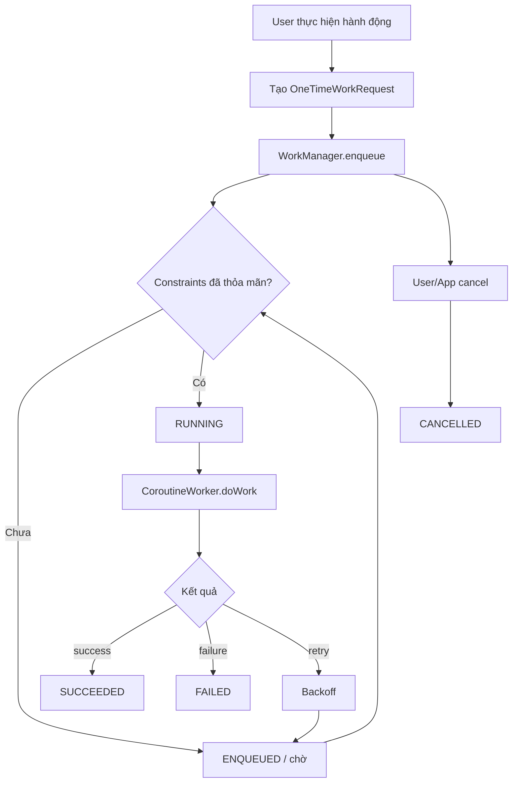
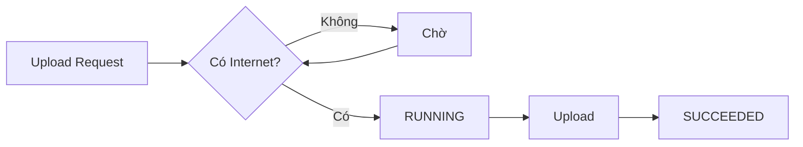
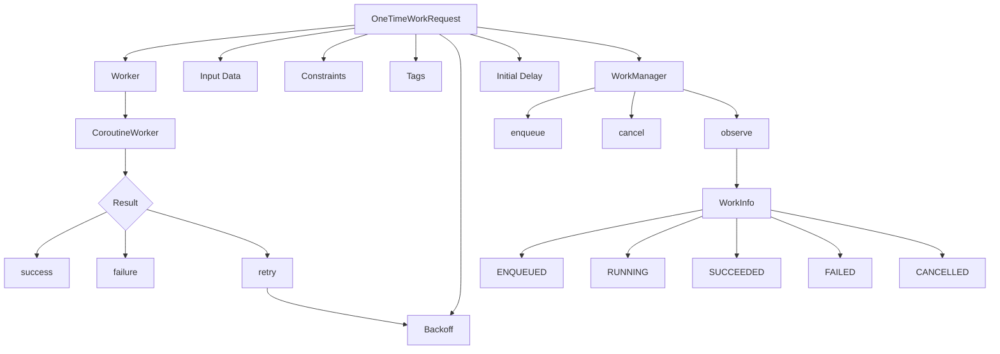

# 024 — OneTimeWorkRequest

| Thuộc tính              | Nội dung                                                                          |
| ----------------------- | --------------------------------------------------------------------------------- |
| **Học phần**            | 04 — Network, Async and Services                                                  |
| **Module**              | Module 08 — Asynchronism                                                          |
| **Nhóm nội dung**       | Rx and Background Work                                                            |
| **Nguồn roadmap**       | Asynchronism / Rx and Background Work                                             |
| **Loại bài**            | Async                                                                             |
| **Thứ tự trong module** | 024                                                                               |
| **Thời lượng gợi ý**    | 34 phút                                                                           |
| **Công nghệ chính**     | Jetpack WorkManager                                                               |
| **API trọng tâm**       | `OneTimeWorkRequest`, `CoroutineWorker`, `WorkManager`, `Constraints`, `WorkInfo` |

---

## 1. Tóm tắt

`OneTimeWorkRequest` là một loại `WorkRequest` của **Jetpack WorkManager**, dùng để mô tả một công việc nền cần được thực hiện **một lần về mặt nghiệp vụ**.

Ví dụ:

* Upload ảnh sau khi người dùng chọn ảnh.
* Đồng bộ dữ liệu chưa gửi lên server.
* Backup dữ liệu.
* Xử lý file.
* Gửi log/crash report.
* Download một tài nguyên.
* Xóa cache khi thỏa mãn một số điều kiện.

WorkManager đặc biệt phù hợp với những công việc cần **tiếp tục tồn tại ngay cả khi màn hình đóng, Activity bị destroy hoặc ứng dụng không còn ở trạng thái hiển thị**. Android hiện khuyến nghị WorkManager cho persistent background work. ([Android Developers][1])

> **Ý chính:** `OneTimeWorkRequest` không chứa logic xử lý chính. Nó là **cấu hình cho một công việc**. Logic thực tế thường nằm trong `Worker`, `CoroutineWorker` hoặc `RxWorker`.

---

## 2. Mục tiêu học tập

Sau bài này, bạn có thể:

* [ ] Giải thích được `OneTimeWorkRequest` là gì.
* [ ] Phân biệt `OneTimeWorkRequest` với coroutine thông thường.
* [ ] Tạo `CoroutineWorker`.
* [ ] Tạo và enqueue `OneTimeWorkRequest`.
* [ ] Truyền input vào Worker.
* [ ] Nhận output từ Worker.
* [ ] Thiết lập `Constraints`.
* [ ] Thiết lập retry và backoff.
* [ ] Theo dõi trạng thái bằng `WorkInfo`.
* [ ] Hủy một công việc đang chờ/chạy.
* [ ] Hiểu tác động của WorkManager đối với lifecycle.
* [ ] Biết cách test background work.
* [ ] Tạo một demo đủ tốt để đưa vào portfolio.

---

# 3. OneTimeWorkRequest nằm ở đâu trong kiến trúc Android?

Có thể hình dung:

```text
┌───────────────────────────────┐
│              UI               │
│   Compose / Fragment / View   │
└───────────────┬───────────────┘
                │
                │ yêu cầu background work
                ▼
┌───────────────────────────────┐
│        ViewModel / Domain      │
└───────────────┬───────────────┘
                │
                │ tạo WorkRequest
                ▼
┌───────────────────────────────┐
│         WorkManager           │
│                               │
│  OneTimeWorkRequest           │
│  Constraints                  │
│  Retry / Backoff              │
│  Scheduler                    │
└───────────────┬───────────────┘
                │
                │ thực thi
                ▼
┌───────────────────────────────┐
│       CoroutineWorker         │
│                               │
│  Repository / API / Database  │
└───────────────┬───────────────┘
                │
          ┌─────┴─────┐
          ▼           ▼
      Network       Database
```

WorkManager chịu trách nhiệm **lập lịch và quản lý execution**, còn Worker chịu trách nhiệm **thực hiện nghiệp vụ**.

---

# 4. Khái niệm cốt lõi

## 4.1. Worker

Worker chứa phần code cần chạy.

Ví dụ:

```kotlin
class UploadWorker(
    appContext: Context,
    workerParams: WorkerParameters
) : CoroutineWorker(appContext, workerParams) {

    override suspend fun doWork(): Result {
        // Background work

        return Result.success()
    }
}
```

Đối với ứng dụng Kotlin, tài liệu Android khuyến nghị `CoroutineWorker`; `doWork()` của nó là một `suspend` function. ([Android Developers][2])

---

## 4.2. OneTimeWorkRequest

Worker trả lời câu hỏi:

> **Phải làm gì?**

`OneTimeWorkRequest` trả lời:

> **Công việc đó được chạy như thế nào và trong điều kiện nào?**

Ví dụ:

```kotlin
val request =
    OneTimeWorkRequestBuilder<UploadWorker>()
        .build()
```

Sau đó đưa request cho `WorkManager`:

```kotlin
WorkManager
    .getInstance(context)
    .enqueue(request)
```

WorkManager yêu cầu một `WorkRequest` trước khi công việc được đưa vào scheduler. ([Android Developers][3])

---

# 5. Luồng hoạt động



Điểm quan trọng:

```text
OneTimeWorkRequest
        ↓
     enqueue
        ↓
     ENQUEUED
        ↓
     RUNNING
   ↙     ↓      ↘
SUCCESS RETRY FAILURE
   ↓      ↓       ↓
SUCCEEDED ↺     FAILED
```

---

# 6. "One time" không có nghĩa là chỉ chạy đúng một lần

Đây là điểm rất dễ nhầm.

`OneTimeWorkRequest` nghĩa là:

> Công việc **không chạy định kỳ** như `PeriodicWorkRequest`.

Nhưng Worker vẫn có thể được chạy lại khi trả về:

```kotlin
Result.retry()
```

Ví dụ:

```text
Upload lần 1
   ↓
Network timeout
   ↓
Result.retry()
   ↓
30 giây...
   ↓
Upload lần 2
   ↓
Success
```

Về nghiệp vụ, đây vẫn là **một yêu cầu upload**, chỉ có nhiều execution attempt.

---

# 7. Cài đặt WorkManager

Theo tài liệu Android hiện tại, WorkManager stable là `2.11.2`; với Kotlin + coroutine có thể dùng `work-runtime-ktx`. ([Android Developers][4])

```kotlin
dependencies {

    val workVersion = "2.11.2"

    implementation(
        "androidx.work:work-runtime-ktx:$workVersion"
    )
}
```

> Phiên bản dependency nên được kiểm tra lại khi tạo project mới thay vì cố định theo bài học.

---

# 8. Ví dụ cơ bản nhất

## 8.1. Tạo Worker

```kotlin
class SyncWorker(
    appContext: Context,
    workerParams: WorkerParameters
) : CoroutineWorker(appContext, workerParams) {

    override suspend fun doWork(): Result {

        Log.d("SyncWorker", "Sync started")

        delay(2000)

        Log.d("SyncWorker", "Sync completed")

        return Result.success()
    }
}
```

---

## 8.2. Tạo OneTimeWorkRequest

```kotlin
val syncRequest =
    OneTimeWorkRequestBuilder<SyncWorker>()
        .build()
```

---

## 8.3. Đưa vào WorkManager

```kotlin
WorkManager
    .getInstance(context)
    .enqueue(syncRequest)
```

Luồng:

```text
OneTimeWorkRequestBuilder
          │
          ▼
   OneTimeWorkRequest
          │
          ▼
 WorkManager.enqueue()
          │
          ▼
     SyncWorker
          │
          ▼
       doWork()
```

---

# 9. Ví dụ thực tế — Upload ảnh

Giả sử ứng dụng cần upload ảnh lên server nhưng muốn upload tiếp ngay cả khi người dùng chuyển khỏi màn hình.

---

## 9.1. Truyền dữ liệu vào Worker

```kotlin
val inputData = workDataOf(
    "IMAGE_PATH" to imagePath
)
```

Tạo request:

```kotlin
val uploadRequest =
    OneTimeWorkRequestBuilder<UploadWorker>()
        .setInputData(inputData)
        .build()
```

---

## 9.2. Đọc input trong Worker

```kotlin
class UploadWorker(
    appContext: Context,
    params: WorkerParameters
) : CoroutineWorker(appContext, params) {

    override suspend fun doWork(): Result {

        val imagePath =
            inputData.getString("IMAGE_PATH")
                ?: return Result.failure()

        return try {

            uploadImage(imagePath)

            Result.success()

        } catch (e: IOException) {

            Result.retry()

        } catch (e: Exception) {

            Result.failure()
        }
    }

    private suspend fun uploadImage(
        imagePath: String
    ) {
        // Gọi Repository / API
    }
}
```

---

# 10. Ba kết quả quan trọng của Worker

Một Worker thường trả một trong ba kết quả.

## `Result.success()`

Công việc thành công.

```kotlin
return Result.success()
```

---

## `Result.failure()`

Công việc thất bại và không nên tự retry.

```kotlin
return Result.failure()
```

Ví dụ:

```text
File không tồn tại
Token không hợp lệ
Input sai
Business rule không cho phép
```

---

## `Result.retry()`

Lỗi có khả năng chỉ là tạm thời.

```kotlin
return Result.retry()
```

Ví dụ:

```text
Network timeout
Server 503
Connection temporarily unavailable
```

---

# 11. Retry và Backoff

Không nên retry liên tục:

```text
retry
retry
retry
retry
retry
```

Điều đó có thể:

* Tốn pin.
* Tốn network.
* Spam server.
* Làm app hoạt động không ổn định.

WorkManager hỗ trợ:

```text
BackoffPolicy.LINEAR
```

và:

```text
BackoffPolicy.EXPONENTIAL
```

Theo tài liệu Android, backoff tối thiểu là **10 giây**; mặc định WorkManager dùng **exponential backoff với 30 giây ban đầu**. ([Android Developers][3])

---

## Ví dụ

```kotlin
val request =
    OneTimeWorkRequestBuilder<UploadWorker>()
        .setBackoffCriteria(
            BackoffPolicy.EXPONENTIAL,
            30,
            TimeUnit.SECONDS
        )
        .build()
```

### Exponential backoff

Có thể hình dung:

```text
Attempt 1
   ↓ lỗi
30 giây
   ↓
Attempt 2
   ↓ lỗi
60 giây
   ↓
Attempt 3
   ↓ lỗi
120 giây
   ↓
...
```

---

# 12. Constraints

Một trong những tính năng quan trọng nhất của WorkManager là:

> **Không chạy task cho đến khi điều kiện phù hợp.**

Ví dụ upload ảnh chỉ khi có mạng:

```kotlin
val constraints =
    Constraints.Builder()
        .setRequiredNetworkType(
            NetworkType.CONNECTED
        )
        .build()
```

Áp dụng:

```kotlin
val uploadRequest =
    OneTimeWorkRequestBuilder<UploadWorker>()
        .setConstraints(constraints)
        .build()
```

WorkManager hỗ trợ cấu hình các điều kiện cho `WorkRequest`, chẳng hạn yêu cầu loại network hoặc trạng thái thiết bị phù hợp trước khi chạy. ([Android Developers][3])

---

## Luồng Constraint



Ứng dụng không cần tự viết:

```kotlin
while (!hasInternet()) {
    delay(...)
}
```

Scheduler của WorkManager xử lý việc chờ điều kiện.

---

# 13. Kết hợp Constraints + Retry

Đây là pattern thực tế hơn.

```kotlin
val constraints =
    Constraints.Builder()
        .setRequiredNetworkType(
            NetworkType.CONNECTED
        )
        .build()

val uploadRequest =
    OneTimeWorkRequestBuilder<UploadWorker>()
        .setConstraints(constraints)
        .setBackoffCriteria(
            BackoffPolicy.EXPONENTIAL,
            30,
            TimeUnit.SECONDS
        )
        .build()
```

Luồng:

```text
                 OneTimeWorkRequest
                        │
                        ▼
               Internet available?
                  │           │
                 No          Yes
                  │           │
                 wait         ▼
                           RUNNING
                              │
                           Upload
                              │
                 ┌────────────┴───────────┐
                 │                        │
              Success                   Error
                 │                        │
              Finish             Temporary error?
                                     │       │
                                    Yes      No
                                     │       │
                                   retry   failure
```

---

# 14. Trả dữ liệu từ Worker

Worker có thể trả output.

```kotlin
val output =
    workDataOf(
        "SERVER_URL" to uploadedUrl
    )

return Result.success(output)
```

Sau đó phía ngoài có thể lấy từ:

```kotlin
workInfo.outputData
```

Ví dụ:

```text
Input
 └── imagePath

Worker
 └── upload

Output
 └── uploadedUrl
```

---

# 15. Theo dõi trạng thái bằng WorkInfo

Sau khi enqueue, WorkManager cho phép query công việc theo:

* `id`
* `tag`
* unique work name

`WorkInfo` chứa thông tin như `State`, tags và output của work. ([Android Developers][5])

Ví dụ với Kotlin `Flow`:

```kotlin
val workManager =
    WorkManager.getInstance(context)

workManager
    .getWorkInfoByIdFlow(uploadRequest.id)
    .collect { workInfo ->

        when (workInfo.state) {

            WorkInfo.State.ENQUEUED -> {
                println("Waiting")
            }

            WorkInfo.State.RUNNING -> {
                println("Uploading")
            }

            WorkInfo.State.SUCCEEDED -> {
                println("Upload completed")
            }

            WorkInfo.State.FAILED -> {
                println("Upload failed")
            }

            WorkInfo.State.CANCELLED -> {
                println("Cancelled")
            }

            else -> Unit
        }
    }
```

`getWorkInfoByIdFlow()` hiện được WorkManager hỗ trợ trực tiếp cho Kotlin. ([Android Developers][6])

---

# 16. Hiển thị trạng thái lên UI

Ví dụ UI có thể biểu diễn:

```text
WorkInfo
   │
   ▼
ViewModel
   │
   ▼
UI State
   │
   ├── ENQUEUED ──→ "Đang chờ mạng..."
   │
   ├── RUNNING ───→ ProgressIndicator
   │
   ├── SUCCEEDED ─→ "Upload thành công"
   │
   ├── FAILED ────→ "Upload thất bại"
   │
   └── CANCELLED ─→ "Đã hủy"
```

Điểm quan trọng:

> UI **không nên tự thực hiện background work**. UI chỉ quan sát trạng thái của công việc.

---

# 17. Progress

Worker có thể báo tiến trình.

Ví dụ:

```kotlin
setProgress(
    workDataOf(
        "PROGRESS" to 50
    )
)
```

UI đọc:

```kotlin
val progress =
    workInfo.progress
        .getInt("PROGRESS", 0)
```

WorkManager có cơ chế lưu và quan sát intermediate progress trong lúc Worker đang chạy. ([Android Developers][7])

Ví dụ:

```text
UploadWorker

0%
 │
 ├── 20%
 │
 ├── 50%
 │
 ├── 80%
 │
 └── 100%

      ↓

ProgressBar UI
```

---

# 18. Cancellation

Mỗi WorkRequest có một UUID:

```kotlin
val requestId =
    uploadRequest.id
```

Hủy:

```kotlin
WorkManager
    .getInstance(context)
    .cancelWorkById(requestId)
```

WorkManager hỗ trợ theo dõi và hủy work thông qua ID của `WorkRequest`. ([Android Developers][8])

---

# 19. Lifecycle — lý do WorkManager quan trọng

Giả sử người dùng nhấn:

```text
UPLOAD
```

sau đó:

```text
Activity destroyed
```

Nếu logic upload gắn trực tiếp vào Activity:

```text
Activity
   ↓
Coroutine
   ↓
Activity destroyed
   ↓
Task có thể bị cancel
```

Với WorkManager:

```text
Activity
   │
   │ enqueue
   ▼
WorkManager
   │
   └──── UploadWorker
             │
             ▼
          Network
```

Activity có thể biến mất nhưng job đã được WorkManager quản lý.

Đây chính là điểm khác biệt giữa:

```text
UI lifecycle work
```

và:

```text
persistent background work
```

---

# 20. Coroutine và WorkManager khác nhau thế nào?

Không nên hiểu:

```text
WorkManager = cách chạy code ở background thread
```

WorkManager mạnh hơn thế.

| Coroutine                    | WorkManager                            |
| ---------------------------- | -------------------------------------- |
| Async code                   | Persistent scheduled work              |
| Thường gắn với scope         | Không phụ thuộc Activity/ViewModel     |
| Dễ cancel khi scope mất      | Có thể tồn tại qua app restart         |
| Không tự quản lý constraints | Có Constraints                         |
| Không tự lập lịch retry      | Có retry/backoff                       |
| Phù hợp tác vụ UI/domain     | Phù hợp background work cần độ tin cậy |

Android cũng phân biệt coroutine với persistent work: coroutine là lựa chọn chuẩn cho async work không cần tồn tại khi app rời visible state; WorkManager phù hợp với công việc cần persistence. ([Android Developers][1])

---

# 21. Khi nào nên dùng OneTimeWorkRequest?

## Nên dùng

### Upload

```text
User chọn ảnh
    ↓
Upload một lần
```

### Sync

```text
Offline changes
      ↓
Có Internet
      ↓
Sync server
```

### Backup

```text
User → "Backup now"
         ↓
OneTimeWorkRequest
```

### Xử lý file

```text
File
 ↓
compress
 ↓
encrypt
 ↓
upload
```

---

# 22. Khi nào không nên dùng?

Không phải mọi tác vụ async đều cần WorkManager.

### Không nên

Ví dụ user nhấn nút:

```text
GET /products
```

và UI đang chờ dữ liệu ngay lập tức.

Thông thường:

```text
ViewModel
   ↓
Coroutine
   ↓
Repository
   ↓
Retrofit
```

phù hợp hơn.

---

### Exact alarm

Nếu yêu cầu:

> "Phải chạy chính xác lúc 07:00."

WorkManager không phải scheduler dành cho exact alarms.

Những trường hợp alarm chính xác có thể cần:

```text
AlarmManager
```

Android cũng phân biệt WorkManager với `AlarmManager`; exact alarm chỉ nên dùng cho những trường hợp cần thời gian chính xác như alarm/calendar notification. ([Android Developers][1])

---

# 23. Một pattern production tốt

```text
┌───────────┐
│    UI     │
└─────┬─────┘
      │
      ▼
┌───────────────┐
│   ViewModel   │
└──────┬────────┘
       │
       ▼
┌───────────────────────┐
│ BackgroundWorkManager │
│ / Repository          │
└──────────┬────────────┘
           │
           ▼
┌───────────────────────┐
│    WorkManager        │
└──────────┬────────────┘
           │
           ▼
┌───────────────────────┐
│    UploadWorker       │
└──────────┬────────────┘
           │
           ▼
┌───────────────────────┐
│ Repository / API      │
└───────────────────────┘
```

Không nên để Activity chứa toàn bộ:

```text
Activity
 ├── tạo Worker
 ├── upload logic
 ├── Retrofit
 ├── retry
 ├── database
 └── state
```

---

# 24. Unique Work

Một lỗi phổ biến là user nhấn nút nhiều lần:

```text
Upload
Upload
Upload
Upload
```

và tạo bốn Worker giống nhau.

WorkManager hỗ trợ **unique work**, giúp kiểm soát chỉ một chuỗi công việc có cùng tên hoạt động tại một thời điểm. ([Android Developers][8])

Ví dụ:

```kotlin
workManager.enqueueUniqueWork(
    "profile_sync",
    ExistingWorkPolicy.KEEP,
    syncRequest
)
```

Ý nghĩa:

```text
profile_sync đang tồn tại
         │
         ▼
ExistingWorkPolicy.KEEP
         │
         ▼
Không enqueue bản duplicate
```

---

# 25. Tag

Có thể thêm tag:

```kotlin
val request =
    OneTimeWorkRequestBuilder<UploadWorker>()
        .addTag("UPLOAD")
        .build()
```

Sau này:

```kotlin
workManager
    .getWorkInfosByTag("UPLOAD")
```

hoặc:

```kotlin
workManager
    .cancelAllWorkByTag("UPLOAD")
```

Tag đặc biệt hữu ích cho debug và quản lý nhiều request.

---

# 26. Debugging

Khi debug WorkManager, không nên chỉ log:

```text
"Error"
```

Hãy log:

```text
Worker ID
Worker state
attempt count
input
output
error category
stop reason
```

Ví dụ:

```kotlin
Log.d(
    "UploadWorker",
    """
    id=$id
    attempt=$runAttemptCount
    """.trimIndent()
)
```

Android cũng cung cấp thông tin `stopReason` trong `WorkInfo`, hữu ích để debug lý do Worker bị dừng. ([Android Developers][7])

---

# 27. Retry đúng cách

Không nên:

```kotlin
catch (e: Exception) {
    return Result.retry()
}
```

cho mọi lỗi.

Thay vào đó:

```kotlin
return when (error) {

    is IOException ->
        Result.retry()

    is AuthenticationException ->
        Result.failure()

    is InvalidFileException ->
        Result.failure()

    else ->
        Result.failure()
}
```

Nguyên tắc:

```text
Temporary error
      ↓
    retry


Permanent error
      ↓
   failure
```

---

# 28. Testing

Background work là nơi dễ xuất hiện lỗi:

* Timing.
* Network.
* Retry.
* Constraint.
* Cancellation.
* App restart.

Vì vậy Worker cần được test.

WorkManager có package:

```text
androidx.work:work-testing
```

và cung cấp các utility như:

* `WorkManagerTestInitHelper`
* `TestDriver`
* `TestWorkerBuilder`
* `TestListenableWorkerBuilder`

([Android Developers][9])

---

## Test constraint

`TestDriver` có thể giả lập việc constraints đã được thỏa mãn:

```kotlin
testDriver
    .setAllConstraintsMet(request.id)
```

Nó cũng có thể điều khiển initial delay của `OneTimeWorkRequest`. ([Android Developers][10])

---

# 29. Những test case nên có

| Test                     | Kết quả                               |
| ------------------------ | ------------------------------------- |
| Upload thành công        | `SUCCEEDED`                           |
| Server timeout           | Retry                                 |
| Input thiếu              | `FAILED`                              |
| Không có Internet        | Work chờ                              |
| Internet xuất hiện       | Worker chạy                           |
| User cancel              | `CANCELLED`                           |
| Upload duplicate         | Không chạy trùng nếu dùng unique work |
| Server trả lỗi vĩnh viễn | Không retry vô hạn                    |

---

# 30. Bài thực hành

## Bài toán

Tạo chức năng:

> **Upload ảnh nền bằng `OneTimeWorkRequest`.**

### Yêu cầu

1. Người dùng chọn ảnh.
2. Nhấn `Upload`.
3. Tạo `OneTimeWorkRequest`.
4. Chỉ upload khi có Internet.
5. Hiển thị trạng thái:

```text
Waiting
Uploading
Success
Failed
```

6. Network timeout phải retry.
7. Cho phép Cancel.
8. Log `runAttemptCount`.
9. Không tạo duplicate upload ngoài ý muốn.

---

# 31. Artifact portfolio

Có thể tạo project:

```text
BackgroundUploadDemo/
│
├── data/
│   └── UploadRepository.kt
│
├── worker/
│   └── UploadWorker.kt
│
├── work/
│   └── UploadWorkManager.kt
│
├── ui/
│   ├── UploadScreen.kt
│   └── UploadViewModel.kt
│
├── test/
│   └── UploadWorkerTest.kt
│
└── README.md
```

README nên trình bày:

```markdown
# Background Upload with WorkManager

## Features

- OneTimeWorkRequest
- CoroutineWorker
- Network Constraints
- Retry + exponential backoff
- WorkInfo observation
- Progress
- Cancellation
- Unique Work
- Worker testing
```

Đây là artifact tốt hơn nhiều so với chỉ có một đoạn:

```kotlin
WorkManager.enqueue(...)
```

---

# 32. Sơ đồ tổng hợp kiến thức



---

# 33. So sánh nhanh

| Công cụ               | Trường hợp                                           |
| --------------------- | ---------------------------------------------------- |
| `Coroutine`           | Async operation gắn với app/UI                       |
| `OneTimeWorkRequest`  | Persistent background task chạy một lần              |
| `PeriodicWorkRequest` | Background work định kỳ                              |
| `AlarmManager`        | Tác vụ yêu cầu thời điểm chính xác                   |
| Foreground Service    | Công việc dài, người dùng cần nhận biết rõ đang chạy |

---

# 34. Sai lầm thường gặp

### ❌ Dùng WorkManager cho mọi API request

```text
Button → WorkManager → GET products
```

Không cần thiết nếu request chỉ phục vụ UI hiện tại.

---

### ❌ Retry mọi Exception

Có thể tạo vòng retry vô nghĩa.

---

### ❌ Không sử dụng Constraints

Worker cứ chạy rồi fail vì network.

Tốt hơn:

```text
Constraint kiểm tra network
        ↓
Worker chạy
```

---

### ❌ Tạo duplicate worker

```text
User click × 10
    ↓
10 uploads
```

Có thể xử lý bằng unique work.

---

### ❌ UI phụ thuộc Activity để giữ trạng thái worker

Worker có lifecycle riêng.

UI nên quan sát:

```text
WorkInfo
```

---

# 35. Checklist production

## Thiết kế

* [ ] Công việc này thực sự cần WorkManager.
* [ ] Không phụ thuộc Activity/Fragment.
* [ ] Worker có trách nhiệm rõ ràng.
* [ ] Không nhét business logic lớn trực tiếp vào Worker.

## Network

* [ ] Có network constraint nếu cần.
* [ ] Phân biệt lỗi temporary/permanent.
* [ ] Có retry policy hợp lý.
* [ ] Không retry vô hạn thiếu kiểm soát.

## State

* [ ] Theo dõi `WorkInfo`.
* [ ] UI xử lý `RUNNING`.
* [ ] UI xử lý `FAILED`.
* [ ] UI xử lý `CANCELLED`.
* [ ] Output được xử lý đúng.

## Lifecycle

* [ ] Rotate màn hình không làm mất background job.
* [ ] Rời màn hình không làm hỏng job.
* [ ] App restart được xử lý đúng với loại work đã chọn.

## UX

* [ ] User biết công việc đang chờ hay đang chạy.
* [ ] Có progress nếu công việc đủ lâu.
* [ ] Có Cancel nếu phù hợp.
* [ ] Không enqueue duplicate.

## Debug

* [ ] Log Worker ID.
* [ ] Log `runAttemptCount`.
* [ ] Log trạng thái.
* [ ] Log loại lỗi.
* [ ] Theo dõi stop reason khi cần.

## Testing

* [ ] Test success.
* [ ] Test failure.
* [ ] Test retry.
* [ ] Test constraints.
* [ ] Test cancellation.
* [ ] Test duplicate work.

---

# 36. Kế hoạch học trong 34 phút

|      Thời gian | Nội dung                                  |
| -------------: | ----------------------------------------- |
|   **0–5 phút** | WorkManager và `OneTimeWorkRequest` là gì |
|  **5–10 phút** | `Worker` / `CoroutineWorker`              |
| **10–15 phút** | Tạo và enqueue request                    |
| **15–20 phút** | Input, output và `WorkInfo`               |
| **20–25 phút** | Constraints, retry, backoff               |
| **25–29 phút** | Cancellation và lifecycle                 |
| **29–32 phút** | Testing/debugging                         |
| **32–34 phút** | Hoàn thiện artifact portfolio             |

---

# 37. Bài tập

## Bài tập chính

> Chuyển một tác vụ upload hoặc đồng bộ dữ liệu dài khỏi UI sang `OneTimeWorkRequest`.

Yêu cầu tối thiểu:

```text
UI
 ↓
OneTimeWorkRequest
 ↓
Network Constraint
 ↓
CoroutineWorker
 ↓
Repository
 ↓
Server
```

Phải giải thích được:

1. Vì sao dùng WorkManager thay vì coroutine thông thường?
2. Worker bị lỗi network thì chuyện gì xảy ra?
3. Khi nào trả `Result.retry()`?
4. Khi nào trả `Result.failure()`?
5. User đóng Activity thì Worker có phụ thuộc Activity không?
6. Làm sao UI biết Worker đã thành công?
7. Làm sao hủy Worker?
8. Làm sao tránh enqueue duplicate?

---

# 38. Câu hỏi tự kiểm tra

### 1. `OneTimeWorkRequest` có phải chính Worker không?

**Không.**

```text
WorkRequest = cấu hình
Worker      = logic thực thi
```

---

### 2. `OneTimeWorkRequest` có thể retry không?

**Có.**

```kotlin
Result.retry()
```

---

### 3. Có Internet mới chạy thì cấu hình ở đâu?

```kotlin
Constraints
```

---

### 4. Làm sao xem trạng thái?

```kotlin
WorkInfo
```

---

### 5. Kotlin nên dùng Worker nào?

Thông thường:

```kotlin
CoroutineWorker
```

---

### 6. Activity bị destroy có nên là lý do Worker bị mất không?

Không. Persistent background work được quản lý bởi WorkManager, không phải lifecycle của Activity.

---

# 39. Checklist hoàn thành bài

* [ ] Định nghĩa được `OneTimeWorkRequest`.
* [ ] Hiểu quan hệ `WorkManager → WorkRequest → Worker`.
* [ ] Viết được `CoroutineWorker`.
* [ ] Tạo được `OneTimeWorkRequestBuilder`.
* [ ] Enqueue bằng WorkManager.
* [ ] Truyền được input.
* [ ] Đọc được output.
* [ ] Thiết lập Network Constraint.
* [ ] Hiểu `success / failure / retry`.
* [ ] Thiết lập backoff.
* [ ] Quan sát được `WorkInfo`.
* [ ] Hủy được work.
* [ ] Hiểu unique work.
* [ ] Biết test Worker.
* [ ] Có demo nhỏ cho portfolio.

---

# 40. Ghi nhớ nhanh

```text
OneTimeWorkRequest
        │
        ├── chạy một công việc nền
        │
        ├── có Constraints
        │
        ├── có Input / Output
        │
        ├── có Retry + Backoff
        │
        ├── có Tag / ID
        │
        └── có thể Observe / Cancel
                │
                ▼
            WorkManager
                │
                ▼
        CoroutineWorker
                │
                ▼
        Repository / API / DB
```

> **Công thức dễ nhớ:**
> **Worker = làm gì**
> **OneTimeWorkRequest = chạy công việc đó với cấu hình nào**
> **WorkManager = quản lý và lập lịch công việc đó**

Đây là nền tảng để học tiếp các chủ đề như **Constraints nâng cao, PeriodicWorkRequest, Work Chaining, Unique Work và WorkManager Testing**.

[1]: https://developer.android.com/develop/background-work/background-tasks/persistent?hl=en&utm_source=chatgpt.com "Task scheduling  |  Background work  |  Android Developers"
[2]: https://developer.android.com/develop/background-work/background-tasks/persistent/threading?utm_source=chatgpt.com "Threading in WorkManager  |  Background work  |  Android Developers"
[3]: https://developer.android.com/develop/background-work/background-tasks/persistent/getting-started/define-work?utm_source=chatgpt.com "Define work requests  |  Background work  |  Android Developers"
[4]: https://developer.android.com/develop/background-work/background-tasks/persistent/getting-started?authuser=19&utm_source=chatgpt.com "Getting started with WorkManager  |  Background work  |  Android Developers"
[5]: https://developer.android.com/develop/background-work/background-tasks/persistent/how-to/manage-work?utm_source=chatgpt.com "Managing work  |  Background work  |  Android Developers"
[6]: https://developer.android.com/reference/androidx/work/WorkManager?utm_source=chatgpt.com "WorkManager  |  API reference  |  Android Developers"
[7]: https://developer.android.com/develop/background-work/background-tasks/persistent/how-to/observe?utm_source=chatgpt.com "Observe intermediate worker progress  |  Background work  |  Android Developers"
[8]: https://developer.android.com/reference/androidx/work/WorkManager.html?utm_source=chatgpt.com "WorkManager  |  API reference  |  Android Developers"
[9]: https://developer.android.com/reference/kotlin/androidx/work/testing/package-summary?utm_source=chatgpt.com "androidx.work.testing  |  API reference  |  Android Developers"
[10]: https://developer.android.com/reference/androidx/work/testing/TestDriver?utm_source=chatgpt.com "TestDriver  |  API reference  |  Android Developers"
