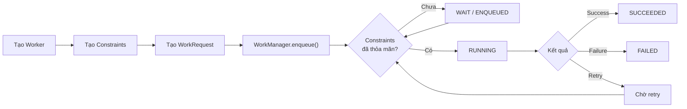
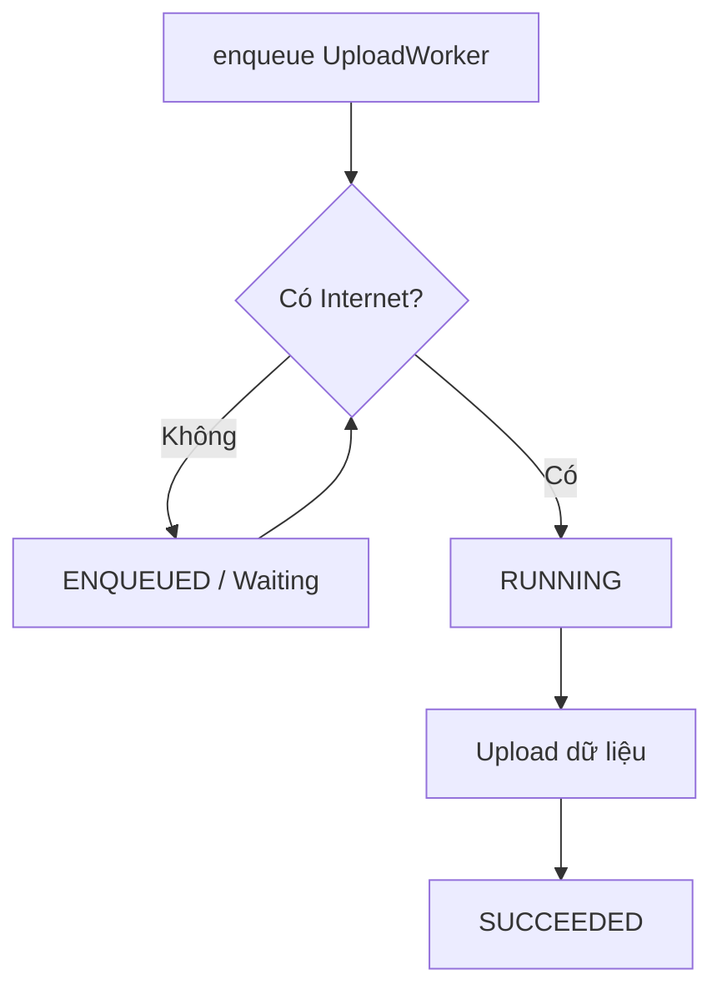
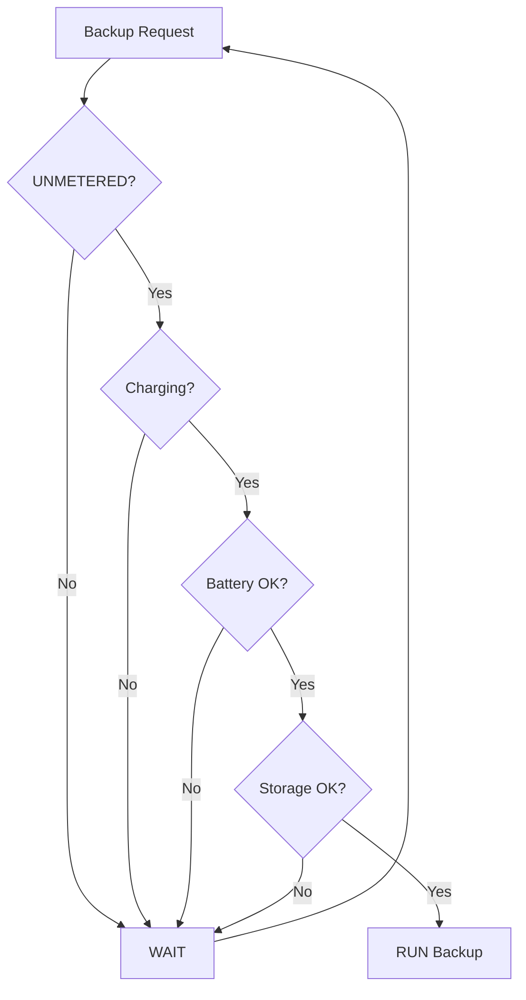
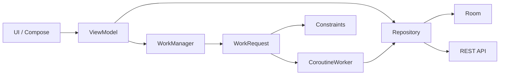

# 026 — Constraints

| Thuộc tính              | Nội dung                                           |
| ----------------------- | -------------------------------------------------- |
| **Học phần**            | 04 — Network, Async and Services                   |
| **Module**              | Module 08 — Asynchronism                           |
| **Nhóm nội dung**       | Rx and Background Work                             |
| **Nguồn roadmap**       | Asynchronism / Rx and Background Work              |
| **Loại bài**            | Async                                              |
| **Thứ tự trong module** | 026                                                |
| **Thời lượng gợi ý**    | 34 phút                                            |
| **Trọng tâm**           | Điều kiện thực thi `WorkRequest` trong WorkManager |

---

## 1. Tóm tắt

Trong WorkManager, **Constraints** là tập hợp các điều kiện mà thiết bị phải thỏa mãn trước khi một `WorkRequest` được phép chạy.

Ví dụ:

* Chỉ đồng bộ dữ liệu khi có Internet.
* Chỉ backup dữ liệu khi thiết bị đang sạc.
* Chỉ tải file lớn khi dùng mạng không tính phí.
* Không thực hiện công việc nặng khi pin yếu.
* Không tải thêm dữ liệu khi bộ nhớ thiết bị gần đầy.

WorkManager sẽ trì hoãn công việc cho đến khi các constraints được thỏa mãn. Đây là một trong những lý do WorkManager phù hợp cho các tác vụ nền **có thể trì hoãn nhưng cần thực hiện đáng tin cậy**. ([Android Developers][1])

> **Ý tưởng quan trọng:** Constraints không nói *công việc phải làm gì*. Constraints nói *khi nào công việc được phép chạy*.

---

# 2. Constraints nằm ở đâu trong WorkManager?

Có thể hình dung:

```text
WorkManager
    │
    ├── Worker
    │      └── Công việc cần thực hiện
    │
    └── WorkRequest
           │
           ├── Input Data
           ├── Constraints
           ├── Retry / Backoff
           ├── Tags
           └── Worker
```

Hoặc theo luồng:



`Constraints` thường được gắn vào:

```kotlin
OneTimeWorkRequest
```

hoặc:

```kotlin
PeriodicWorkRequest
```

Vì vậy, bài này nối trực tiếp với:

```text
023 WorkManager
      ↓
024 OneTimeWorkRequest
      ↓
025 PeriodicWorkRequest
      ↓
026 Constraints
```

---

# 3. Mục tiêu học tập

Sau bài này, bạn có thể:

* [ ] Giải thích `Constraints` bằng ngôn ngữ của mình.
* [ ] Hiểu vì sao WorkManager cần constraints.
* [ ] Tạo `Constraints` bằng Kotlin.
* [ ] Gắn constraints vào `OneTimeWorkRequest`.
* [ ] Gắn constraints vào `PeriodicWorkRequest`.
* [ ] Phân biệt network, battery, charging, storage và idle constraint.
* [ ] Hiểu chuyện gì xảy ra khi constraint chưa được đáp ứng.
* [ ] Biết khi nào **không nên** thêm quá nhiều constraint.
* [ ] Test Worker trong các điều kiện khác nhau.
* [ ] Thiết kế một background task đủ tốt để đưa vào portfolio.

---

# 4. Khái niệm cốt lõi

Giả sử app cần upload ảnh lên server.

Không dùng constraint:

```text
User chụp ảnh
     ↓
WorkManager
     ↓
Upload ngay
```

Vấn đề:

```text
Không Internet
     ↓
Request thất bại
     ↓
Retry
     ↓
Tiếp tục thất bại
```

Tốt hơn:

```text
User chụp ảnh
     ↓
WorkManager
     ↓
Constraint:
Network = CONNECTED
     ↓
Có Internet?
 ┌────┴────┐
Không      Có
 │          │
Chờ       Upload
```

Constraints giúp WorkManager quyết định:

> **"Hiện tại có phải thời điểm phù hợp để chạy công việc này hay không?"**

---

# 5. Các Constraints quan trọng

Android WorkManager hỗ trợ các nhóm constraint như network, battery, charging, device idle và storage. ([Android Developers][2])

| Constraint              | Ý nghĩa                        | Ví dụ            |
| ----------------------- | ------------------------------ | ---------------- |
| `NetworkType`           | Yêu cầu trạng thái mạng        | Upload dữ liệu   |
| `requiresCharging`      | Thiết bị phải đang sạc         | Backup lớn       |
| `requiresBatteryNotLow` | Pin không được ở mức thấp      | Xử lý ảnh        |
| `requiresStorageNotLow` | Bộ nhớ không ở trạng thái thấp | Download dữ liệu |
| `requiresDeviceIdle`    | Thiết bị phải idle             | Batch processing |

---

# 6. Network Constraint

Đây là constraint thường gặp nhất.

Ví dụ:

```kotlin
val constraints = Constraints.Builder()
    .setRequiredNetworkType(NetworkType.CONNECTED)
    .build()
```

Ý nghĩa:

```text
Internet khả dụng
      ↓
Worker được phép chạy
```

Nếu không có Internet:

```text
WorkRequest
    ↓
ENQUEUED
    ↓
Chờ mạng
```

---

## 6.1 `NetworkType.CONNECTED`

Yêu cầu thiết bị có kết nối mạng.

```kotlin
.setRequiredNetworkType(
    NetworkType.CONNECTED
)
```

Phù hợp với:

* gửi analytics;
* sync database;
* upload ảnh;
* gửi dữ liệu;
* tải JSON;
* gọi REST API.

---

## 6.2 `NetworkType.UNMETERED`

Yêu cầu mạng không tính phí theo dữ liệu, thường dùng cho tác vụ tiêu tốn nhiều bandwidth.

```kotlin
val constraints = Constraints.Builder()
    .setRequiredNetworkType(
        NetworkType.UNMETERED
    )
    .build()
```

Ví dụ:

```text
Download model AI 800 MB

Mobile data
     ↓
Không chạy

Wi-Fi phù hợp
     ↓
Download
```

Đây là một ví dụ tốt cho việc sử dụng constraint để giảm tác động lên UX của người dùng. Android cũng lấy `UNMETERED` làm ví dụ điển hình cho network constraint. ([Android Developers][2])

---

# 7. Requires Charging

Nếu task tương đối nặng:

```kotlin
val constraints = Constraints.Builder()
    .setRequiresCharging(true)
    .build()
```

Work chỉ được thực hiện khi thiết bị đang trong trạng thái sạc phù hợp. ([Android Developers][2])

Ví dụ:

```text
Backup toàn bộ ảnh
     │
     ▼
Đang sạc?
 ┌───┴───┐
Không    Có
 │        │
Chờ      Backup
```

Ứng dụng:

* backup dữ liệu;
* database optimization;
* upload file lớn;
* xử lý media;
* prefetch lượng lớn dữ liệu.

---

# 8. Battery Not Low

```kotlin
val constraints = Constraints.Builder()
    .setRequiresBatteryNotLow(true)
    .build()
```

Task sẽ không chạy khi hệ thống xác định pin đang ở trạng thái thấp. ([Android Developers][2])

Ví dụ:

```text
Generate thumbnail
        ↓
Battery low?
 ┌──────┴──────┐
Có             Không
│               │
Chờ             Chạy
```

Phù hợp với:

* xử lý ảnh;
* video processing;
* backup;
* database cleanup;
* machine-learning inference lớn.

---

# 9. Storage Not Low

```kotlin
val constraints = Constraints.Builder()
    .setRequiresStorageNotLow(true)
    .build()
```

Nếu bộ nhớ thiết bị đang quá thấp, WorkManager trì hoãn task. ([Android Developers][2])

Ví dụ:

```text
Download offline map
       ↓
Storage OK?
 ┌─────┴─────┐
Không       Có
 │            │
Chờ         Download
```

Đặc biệt hữu ích với:

* download video;
* offline map;
* image caching;
* database export;
* model ML;
* asset game.

---

# 10. Device Idle

Có thể yêu cầu thiết bị ở trạng thái idle:

```kotlin
val constraints = Constraints.Builder()
    .setRequiresDeviceIdle(true)
    .build()
```

Constraint này phù hợp với các batch operation hoặc công việc nặng mà ta không muốn cạnh tranh tài nguyên trong lúc người dùng đang tương tác với thiết bị. ([Android Developers][2])

Ví dụ:

```text
Optimize local database

User đang dùng máy
       ↓
      WAIT

Device idle
       ↓
    EXECUTE
```

---

# 11. Kết hợp nhiều Constraints

Một task có thể yêu cầu nhiều điều kiện cùng lúc.

Ví dụ:

> Backup database chỉ khi:
>
> * có mạng;
> * thiết bị đang sạc;
> * pin không thấp;
> * storage còn đủ.

```kotlin
val constraints = Constraints.Builder()
    .setRequiredNetworkType(NetworkType.CONNECTED)
    .setRequiresCharging(true)
    .setRequiresBatteryNotLow(true)
    .setRequiresStorageNotLow(true)
    .build()
```

Logic tương đương:

```text
Network connected
        AND
Charging
        AND
Battery not low
        AND
Storage not low
        ↓
     RUN WORK
```

Chứ không phải:

```text
Network
OR
Charging
OR
Battery
```

---

# 12. Gắn Constraints vào `OneTimeWorkRequest`

Ví dụ thực tế: upload log lên server.

```kotlin
val constraints = Constraints.Builder()
    .setRequiredNetworkType(NetworkType.CONNECTED)
    .build()

val uploadWork =
    OneTimeWorkRequestBuilder<UploadWorker>()
        .setConstraints(constraints)
        .build()

WorkManager
    .getInstance(context)
    .enqueue(uploadWork)
```

Luồng:



---

# 13. Worker hoàn chỉnh

Ví dụ với `CoroutineWorker`:

```kotlin
class UploadWorker(
    appContext: Context,
    params: WorkerParameters
) : CoroutineWorker(appContext, params) {

    override suspend fun doWork(): Result {
        return try {

            uploadData()

            Result.success()

        } catch (e: IOException) {

            Result.retry()

        } catch (e: Exception) {

            Result.failure()
        }
    }

    private suspend fun uploadData() {
        // Repository / API call
    }
}
```

Sau đó:

```kotlin
val networkConstraints =
    Constraints.Builder()
        .setRequiredNetworkType(NetworkType.CONNECTED)
        .build()

val request =
    OneTimeWorkRequestBuilder<UploadWorker>()
        .setConstraints(networkConstraints)
        .build()

WorkManager
    .getInstance(context)
    .enqueue(request)
```

---

# 14. Constraints + PeriodicWorkRequest

Constraints đặc biệt hữu ích cho periodic work.

Ví dụ:

> Sync dữ liệu định kỳ nhưng chỉ khi có Internet.

```kotlin
val constraints = Constraints.Builder()
    .setRequiredNetworkType(NetworkType.CONNECTED)
    .build()

val syncRequest =
    PeriodicWorkRequestBuilder<SyncWorker>(
        15,
        TimeUnit.MINUTES
    )
        .setConstraints(constraints)
        .build()

WorkManager
    .getInstance(context)
    .enqueue(syncRequest)
```

Có thể hình dung:

```text
PeriodicWorkRequest
        │
        ▼
Đến thời điểm có thể chạy
        │
        ▼
Check Constraints
        │
    ┌───┴───┐
    │       │
Không      Có
    │       │
   Wait    Run
```

---

# 15. Constraints khác với `if` trong Worker

Một lỗi thiết kế phổ biến:

```kotlin
override suspend fun doWork(): Result {

    if (!hasInternet()) {
        return Result.retry()
    }

    upload()

    return Result.success()
}
```

Trong nhiều trường hợp, tốt hơn là khai báo:

```kotlin
Constraints.Builder()
    .setRequiredNetworkType(NetworkType.CONNECTED)
    .build()
```

## Vì sao?

### Kiểm tra thủ công

```text
Worker chạy
   ↓
check network
   ↓
không có
   ↓
retry
```

### Constraint

```text
WorkManager
   ↓
check network
   ↓
không có
   ↓
chưa chạy Worker
```

Constraints mang tính **declarative**:

> "Task cần Internet."

thay vì tự viết:

> "Nếu không có Internet thì tôi phải xử lý thế nào?"

---

# 16. Constraint và Retry không phải một thứ

Đây là điểm rất quan trọng.

## Constraint

Quyết định:

> **Có đủ điều kiện để bắt đầu/chạy công việc không?**

Ví dụ:

```text
Không Internet
→ chờ constraint
```

## Retry

Quyết định:

> **Worker đã chạy nhưng thất bại tạm thời thì có thử lại không?**

Ví dụ:

```text
Internet vorhanden
      ↓
Request tới API
      ↓
HTTP 503
      ↓
Result.retry()
```

---

## So sánh

| Trường hợp          | Constraint |                          Retry |
| ------------------- | ---------: | -----------------------------: |
| Không có Internet   |          ✅ | Không cần chủ động chạy Worker |
| Server 503          |          ❌ |                              ✅ |
| Timeout             |          ❌ |                              ✅ |
| Pin thấp            |          ✅ |                              ❌ |
| Storage thấp        |          ✅ |                              ❌ |
| Dữ liệu đầu vào sai |          ❌ |             Thường `failure()` |
| Unauthorized 401    |          ❌ |      Thường không retry vô hạn |

---

# 17. Constraint + Retry + Backoff

Production thường kết hợp cả ba.

```text
Constraints
     ↓
Có đủ điều kiện
     ↓
Worker
     ↓
API request
     ↓
Thất bại tạm thời
     ↓
Result.retry()
     ↓
Backoff
     ↓
Thử lại
```

Ví dụ:

```kotlin
val request =
    OneTimeWorkRequestBuilder<UploadWorker>()

        .setConstraints(
            Constraints.Builder()
                .setRequiredNetworkType(
                    NetworkType.CONNECTED
                )
                .build()
        )

        .setBackoffCriteria(
            BackoffPolicy.EXPONENTIAL,
            30,
            TimeUnit.SECONDS
        )

        .build()
```

---

# 18. Điều gì xảy ra nếu Constraint chưa thỏa mãn?

Ví dụ:

```kotlin
NetworkType.CONNECTED
```

nhưng thiết bị offline.

Không nên hiểu rằng:

```text
Worker → FAILED
```

Luồng đúng về mặt khái niệm là:

```text
WorkRequest
    ↓
ENQUEUED
    ↓
Constraints chưa đạt
    ↓
WAIT
    ↓
Internet trở lại
    ↓
Eligible
    ↓
RUNNING
```

WorkManager được thiết kế để công việc có constraints trở thành eligible sau khi các điều kiện cần thiết được đáp ứng. ([Android Developers][1])

---

# 19. Nếu Constraint mất trong khi Worker đang chạy?

Đây là trường hợp quan trọng trong app thực tế.

Ví dụ:

```text
Internet connected
      ↓
Worker bắt đầu upload
      ↓
RUNNING
      ↓
Mất Internet
```

WorkManager có thể dừng worker khi các constraints cần thiết không còn được đáp ứng; công việc có thể được lên lịch lại khi các điều kiện phù hợp trở lại. Các worker vì thế vẫn phải được viết theo hướng hỗ trợ cancellation và tránh để dữ liệu ở trạng thái nửa hoàn tất. ([Android Developers][3])

Do đó:

```kotlin
override suspend fun doWork(): Result {
    // CoroutineWorker nên sử dụng các API suspend
    // hỗ trợ cancellation.
}
```

---

# 20. Constraints không đảm bảo chạy "ngay lập tức"

Sai:

```text
Có Wi-Fi
→ Worker chắc chắn chạy ngay
```

Đúng hơn:

```text
Có Wi-Fi
→ Worker trở thành eligible
→ Android / WorkManager quyết định lịch chạy phù hợp
```

WorkManager dành cho:

> **deferrable persistent background work**

không phải:

> **exact real-time scheduling**.

---

# 21. Ví dụ thực tế: Đồng bộ ghi chú

Giả sử app Notes có local database:

```text
Room Database
      ↓
SyncWorker
      ↓
REST API
      ↓
Server
```

Yêu cầu:

> Chỉ sync khi có mạng.

```kotlin
val syncConstraints =
    Constraints.Builder()
        .setRequiredNetworkType(NetworkType.CONNECTED)
        .build()

val syncWork =
    OneTimeWorkRequestBuilder<SyncWorker>()
        .setConstraints(syncConstraints)
        .build()

WorkManager
    .getInstance(context)
    .enqueue(syncWork)
```

---

# 22. Ví dụ nâng cao: Backup ảnh

Yêu cầu:

* Wi-Fi/mạng không tính phí;
* đang sạc;
* pin không thấp;
* storage không thấp.

```kotlin
val backupConstraints =
    Constraints.Builder()
        .setRequiredNetworkType(NetworkType.UNMETERED)
        .setRequiresCharging(true)
        .setRequiresBatteryNotLow(true)
        .setRequiresStorageNotLow(true)
        .build()

val backupRequest =
    OneTimeWorkRequestBuilder<BackupWorker>()
        .setConstraints(backupConstraints)
        .build()

WorkManager
    .getInstance(context)
    .enqueue(backupRequest)
```

Sơ đồ:



---

# 23. Đừng lạm dụng Constraints

Giả sử bạn viết:

```kotlin
Constraints.Builder()
    .setRequiredNetworkType(NetworkType.UNMETERED)
    .setRequiresCharging(true)
    .setRequiresDeviceIdle(true)
    .setRequiresBatteryNotLow(true)
    .setRequiresStorageNotLow(true)
    .build()
```

cho một request chỉ gửi:

```json
{
  "event": "button_clicked"
}
```

Task này có thể bị trì hoãn không cần thiết.

Nguyên tắc:

```text
Constraint càng nhiều
       ↓
Điều kiện càng khó đạt
       ↓
Task có thể chờ lâu hơn
```

Chỉ thêm constraint có lý do rõ ràng.

---

# 24. Chọn Constraint theo loại công việc

| Công việc                   | Constraint phù hợp           |
| --------------------------- | ---------------------------- |
| Gửi analytics               | `CONNECTED`                  |
| Sync API                    | `CONNECTED`                  |
| Upload ảnh                  | `CONNECTED`                  |
| Download video lớn          | `UNMETERED`                  |
| Backup 10 GB                | `UNMETERED + Charging`       |
| Database cleanup            | `BatteryNotLow`              |
| ML preprocessing nặng       | `Charging + BatteryNotLow`   |
| Download offline map        | `UNMETERED + StorageNotLow`  |
| Batch operation ít khẩn cấp | Có thể cân nhắc `DeviceIdle` |

---

# 25. Liên hệ với Lifecycle

Một lợi ích lớn của WorkManager:

Task không nên phụ thuộc trực tiếp vào:

```text
Activity
Fragment
Composable
```

Ví dụ:

```text
Activity
   ↓
enqueue WorkRequest
   ↓
Activity bị destroy
   X
WorkManager
   ↓
Task vẫn được quản lý độc lập
```

Do đó không nên:

```kotlin
class UploadWorker(
    private val activity: MainActivity
)
```

Worker nên làm việc với:

```text
Repository
Database
Network API
File system
Application Context
```

---

# 26. Liên hệ với UI

UI không nên giả định:

```text
enqueue()
=
đã hoàn thành
```

Thực tế:

```text
enqueue
   ↓
ENQUEUED
   ↓
WAITING FOR CONSTRAINT
   ↓
RUNNING
   ↓
SUCCEEDED
```

UI có thể hiển thị:

```text
Waiting for network...
```

hoặc:

```text
Pending sync
```

thay vì chỉ:

```text
Loading...
```

vô thời hạn.

---

# 27. Quan sát trạng thái WorkRequest

Ví dụ:

```kotlin
val request =
    OneTimeWorkRequestBuilder<SyncWorker>()
        .setConstraints(syncConstraints)
        .build()

WorkManager
    .getInstance(context)
    .enqueue(request)
```

Sau đó theo dõi:

```kotlin
WorkManager
    .getInstance(context)
    .getWorkInfoByIdLiveData(request.id)
    .observe(this) { workInfo ->

        when (workInfo.state) {

            WorkInfo.State.ENQUEUED -> {
                // Waiting
            }

            WorkInfo.State.RUNNING -> {
                // Working
            }

            WorkInfo.State.SUCCEEDED -> {
                // Finished
            }

            WorkInfo.State.FAILED -> {
                // Failed
            }

            else -> Unit
        }
    }
```

WorkManager cung cấp khả năng quan sát trạng thái của work, một phần quan trọng khi xây dựng UI và debugging cho background task. ([Android Developers][1])

---

# 28. Logging để Debug

Worker nên có log rõ ràng:

```kotlin
override suspend fun doWork(): Result {

    Log.d("SyncWorker", "START")

    return try {

        repository.sync()

        Log.d("SyncWorker", "SUCCESS")

        Result.success()

    } catch (e: IOException) {

        Log.e("SyncWorker", "NETWORK ERROR", e)

        Result.retry()

    } catch (e: Exception) {

        Log.e("SyncWorker", "FAILURE", e)

        Result.failure()
    }
}
```

Có thể log thêm:

```text
Work ID
Attempt count
Start time
End time
Result
Input data
```

---

# 29. Testing Constraints

Không nên chỉ test:

```text
Có mạng
→ Worker chạy
```

Hãy test ma trận điều kiện.

| Internet | Charging | Battery | Expected                       |
| -------- | -------- | ------- | ------------------------------ |
| ✅        | ✅        | OK      | RUN                            |
| ❌        | ✅        | OK      | WAIT                           |
| ✅        | ❌        | OK      | WAIT nếu yêu cầu charging      |
| ✅        | ✅        | LOW     | WAIT nếu yêu cầu BatteryNotLow |

---

# 30. Các câu hỏi cần kiểm thử

### Network

```text
Mất mạng trước khi task chạy?
```

```text
Mất mạng trong khi upload?
```

```text
Internet trở lại?
```

---

### Battery

```text
Battery low?
```

```text
Cắm sạc?
```

```text
Rút sạc giữa task?
```

---

### App lifecycle

```text
Rotate Activity?
```

```text
Background app?
```

```text
Kill process?
```

```text
Mở lại app?
```

Task và UI có còn thể hiện trạng thái hợp lý không?

---

# 31. Bài thực hành

## Yêu cầu

Xây dựng một chức năng:

> **Background Image Backup**

Luồng:

```text
User chọn ảnh
      ↓
Lưu local
      ↓
Create WorkRequest
      ↓
Constraints
 ├── Internet
 ├── Charging
 └── Battery not low
      ↓
UploadWorker
      ↓
Cloud API
```

---

## Bước 1 — Tạo Constraints

```kotlin
val constraints =
    Constraints.Builder()
        .setRequiredNetworkType(NetworkType.CONNECTED)
        .setRequiresCharging(true)
        .setRequiresBatteryNotLow(true)
        .build()
```

---

## Bước 2 — Tạo WorkRequest

```kotlin
val backupRequest =
    OneTimeWorkRequestBuilder<BackupWorker>()
        .setConstraints(constraints)
        .build()
```

---

## Bước 3 — Enqueue

```kotlin
WorkManager
    .getInstance(context)
    .enqueue(backupRequest)
```

---

## Bước 4 — Implement Worker

```kotlin
class BackupWorker(
    context: Context,
    params: WorkerParameters
) : CoroutineWorker(context, params) {

    override suspend fun doWork(): Result {

        return try {

            backupRepository.upload()

            Result.success()

        } catch (e: IOException) {

            Result.retry()

        } catch (e: Exception) {

            Result.failure()
        }
    }
}
```

---

# 32. Bài tập

## Bài 1 — Network

Tạo:

```text
SyncWorker
```

chỉ chạy khi:

```text
Network = CONNECTED
```

Giải thích:

1. Khi offline thì trạng thái như thế nào?
2. Khi Internet trở lại thì chuyện gì xảy ra?
3. Khi API trả HTTP 500 thì dùng constraint hay retry?

---

## Bài 2 — Download file lớn

Thiết kế:

```text
DownloadOfflineMapWorker
```

Yêu cầu:

```text
UNMETERED
+
StorageNotLow
+
BatteryNotLow
```

Giải thích lý do cho từng constraint.

---

## Bài 3 — Backup

Thiết kế background backup:

```text
PeriodicWorkRequest
        +
UNMETERED
        +
Charging
```

Vẽ diagram cho luồng execution.

---

# 33. Câu hỏi phỏng vấn

### Câu 1

**Constraints trong WorkManager là gì?**

> Constraints là các điều kiện hệ thống phải được đáp ứng trước khi WorkRequest có thể chạy, chẳng hạn network, charging, battery, storage hoặc device idle.

---

### Câu 2

**Constraint và retry khác nhau thế nào?**

```text
Constraint
→ quyết định task có đủ điều kiện chạy hay chưa.

Retry
→ task đã chạy nhưng lỗi tạm thời và cần thử lại.
```

---

### Câu 3

**Có nên kiểm tra Internet trong Worker thay vì dùng constraint không?**

Có thể vẫn cần xử lý lỗi mạng trong Worker vì mạng có thể thay đổi trong lúc request đang thực hiện, nhưng điều kiện cơ bản:

```text
Task cần network
```

nên được mô hình hóa bằng:

```kotlin
NetworkType.CONNECTED
```

---

### Câu 4

**Có Internet thì WorkManager có chạy ngay không?**

Không nên giả định như vậy.

Constraints chỉ giúp work trở thành:

```text
eligible to run
```

hệ thống vẫn có quyền scheduling.

---

# 34. Các lỗi thường gặp

## ❌ Lỗi 1 — Dùng WorkManager nhưng không dùng Network Constraint

```kotlin
val request =
    OneTimeWorkRequestBuilder<UploadWorker>()
        .build()
```

trong khi Worker bắt buộc phải có Internet.

### Tốt hơn

```kotlin
.setConstraints(
    Constraints.Builder()
        .setRequiredNetworkType(
            NetworkType.CONNECTED
        )
        .build()
)
```

---

## ❌ Lỗi 2 — Constraint quá nghiêm ngặt

Task nhỏ nhưng yêu cầu:

```text
Wi-Fi
+
Charging
+
Idle
```

→ task có thể bị trì hoãn rất lâu.

---

## ❌ Lỗi 3 — Coi Constraints là error handling

Constraint không thay thế:

```kotlin
try/catch
```

Worker vẫn cần xử lý:

```text
HTTP errors
Timeout
Invalid response
Server error
Authentication error
```

---

## ❌ Lỗi 4 — Retry mọi lỗi

Sai:

```kotlin
catch (e: Exception) {
    return Result.retry()
}
```

Có thể tạo:

```text
error
 ↓
retry
 ↓
error
 ↓
retry
 ↓
...
```

Hãy phân biệt:

```text
Temporary error
→ retry

Permanent error
→ failure
```

---

# 35. Mental Model

Hãy nhớ công thức:

```text
Worker
=
WHAT
```

```text
WorkRequest
=
HOW / SCHEDULE
```

```text
Constraints
=
WHEN ALLOWED
```

Ví dụ:

```text
UploadWorker
    ↓
WHAT?
Upload image

OneTimeWorkRequest
    ↓
HOW?
Run once

Constraints
    ↓
WHEN?
Only when network available
```

---

# 36. Kiến trúc gợi ý



Điểm quan trọng:

```text
UI
↓
schedule work

Worker
↓
business/data layer

Constraints
↓
system conditions
```

---

# 37. Artifact cho Portfolio

Một artifact nhỏ nhưng tốt:

```text
workmanager-constraints-demo/
│
├── worker/
│   └── SyncWorker.kt
│
├── repository/
│   └── SyncRepository.kt
│
├── scheduler/
│   └── SyncScheduler.kt
│
├── ui/
│   └── SyncScreen.kt
│
└── README.md
```

Trong README ghi:

```text
Background Sync
│
├── WorkManager
├── CoroutineWorker
├── Network Constraint
├── Retry
├── Exponential Backoff
└── WorkInfo observation
```

Có thể bổ sung screenshot:

```text
Offline
→ "Waiting for network"

Online
→ "Syncing..."

Finished
→ "Synced"
```

Artifact này cho thấy bạn hiểu không chỉ API mà còn:

* asynchronous execution;
* lifecycle;
* reliability;
* network failure;
* state management;
* UX của background task.

---

# 38. Checklist Production

## Constraints

* [ ] Task có thực sự cần Internet không?
* [ ] Có cần `CONNECTED` hay `UNMETERED`?
* [ ] Có cần thiết bị đang sạc không?
* [ ] Có cần `BatteryNotLow` không?
* [ ] Có cần `StorageNotLow` không?
* [ ] Constraints có quá nghiêm ngặt không?

## Worker

* [ ] Worker hỗ trợ cancellation.
* [ ] Phân biệt temporary failure và permanent failure.
* [ ] Không retry vô hạn mọi exception.
* [ ] Network call có timeout.
* [ ] Task có tính idempotent nếu có thể.

## Lifecycle

* [ ] Worker không phụ thuộc `Activity`.
* [ ] Rotate màn hình không làm mất task.
* [ ] UI đọc trạng thái từ nguồn dữ liệu phù hợp.
* [ ] App background không phá flow.

## Debugging

* [ ] Có log `WorkRequest ID`.
* [ ] Có log trạng thái.
* [ ] Có log retry attempt.
* [ ] Có log lỗi API.
* [ ] Có thể xác định vì sao work đang chờ.

## Testing

* [ ] Test offline.
* [ ] Test mạng trở lại.
* [ ] Test battery low.
* [ ] Test charging.
* [ ] Test storage low nếu liên quan.
* [ ] Test server error.
* [ ] Test process/app restart.

---

# 39. Tổng kết

```text
                Constraints
                     │
       ┌─────────────┼──────────────┐
       │             │              │
    Network        Battery        Storage
       │             │              │
       ├─CONNECTED   ├─Not Low      └─Not Low
       └─UNMETERED   └─Charging
                     │
                  Device Idle
```

Điểm cần nhớ nhất:

> **Constraints giúp WorkManager chỉ thực hiện background work khi điều kiện hệ thống phù hợp.**

Công thức:

```text
WorkRequest
+
Constraints
+
Worker
+
Retry / Backoff
=
Reliable Background Work
```

Và tư duy quan trọng nhất của bài:

```text
Đừng hỏi:
"Làm sao để Worker tự kiểm tra mọi thứ?"

Hãy hỏi:
"Điều kiện nào cần khai báo cho WorkManager
để Worker chỉ được chạy đúng lúc?"
```

WorkManager chính thức hỗ trợ các constraint như network type, battery-not-low, charging, device idle và storage-not-low; work được trì hoãn cho đến khi những điều kiện cần thiết được đáp ứng. ([Android Developers][1])

[1]: https://developer.android.com/reference/androidx/work/WorkManager?utm_source=chatgpt.com "WorkManager  |  API reference  |  Android Developers"
[2]: https://developer.android.com/develop/background-work/background-tasks/persistent/getting-started/define-work?authuser=0000&hl=en&utm_source=chatgpt.com "Define work requests  |  Background work  |  Android Developers"
[3]: https://developer.android.com/reference/kotlin/androidx/work/multiprocess/RemoteCoroutineWorker?utm_source=chatgpt.com "RemoteCoroutineWorker  |  API reference  |  Android Developers"
