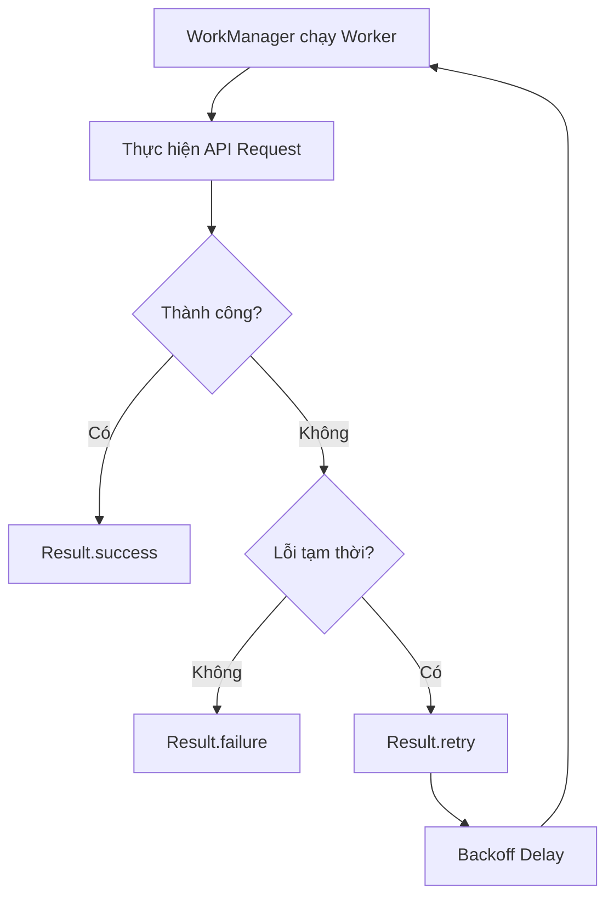
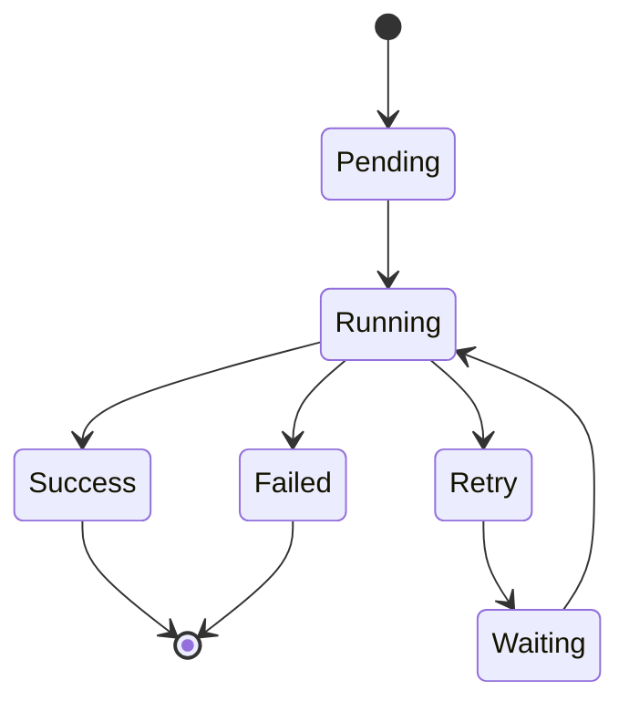
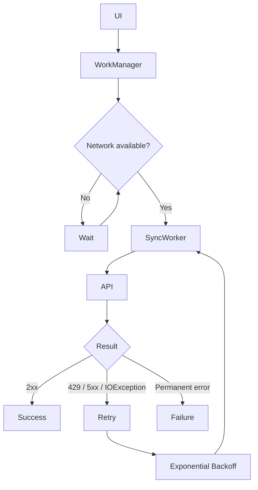

# 027 — Retry and Backoff

| Thuộc tính              | Nội dung                              |
| ----------------------- | ------------------------------------- |
| **Học phần**            | 04 — Network, Async and Services      |
| **Module**              | Module 08 — Asynchronism              |
| **Nhóm nội dung**       | Rx and Background Work                |
| **Nguồn roadmap**       | Asynchronism / Rx and Background Work |
| **Loại bài**            | Async                                 |
| **Thứ tự trong module** | 027                                   |
| **Thời lượng gợi ý**    | 34 phút                               |

---

## 1. Tóm tắt

Trong ứng dụng Android, nhiều tác vụ nền phụ thuộc vào những tài nguyên không ổn định như:

* Internet.
* API của server.
* Database từ xa.
* Dịch vụ upload/download.
* Firebase hoặc backend bên thứ ba.
* Đồng bộ dữ liệu định kỳ.

Một request thất bại **không phải lúc nào cũng nên kết thúc ngay lập tức**.

Ví dụ:

```text
Upload ảnh
   ↓
Mất mạng
   ↓
Request thất bại
   ↓
Chờ một khoảng thời gian
   ↓
Thử lại
```

Cơ chế này được gọi là **Retry**.

Tuy nhiên, nếu liên tục thử lại ngay lập tức:

```text
Fail → Retry → Fail → Retry → Fail → Retry → ...
```

ứng dụng có thể:

* Tốn pin.
* Tốn dữ liệu mạng.
* Gây tải lớn cho server.
* Làm nóng thiết bị.
* Tạo hàng loạt request vô ích.

Vì vậy, retry thường được kết hợp với **Backoff** — tăng hoặc kiểm soát khoảng thời gian chờ giữa các lần thử.

```text
Retry      = thử lại
Backoff    = chờ trước khi thử lại
```

Trong Android, **WorkManager** hỗ trợ trực tiếp cơ chế này thông qua:

```kotlin
Result.retry()
```

và:

```kotlin
setBackoffCriteria(...)
```

---

## 2. Mục tiêu học tập

Sau bài này, bạn có thể:

* [ ] Giải thích được **Retry** và **Backoff** bằng ngôn ngữ của mình.
* [ ] Phân biệt lỗi nào nên retry và lỗi nào không nên retry.
* [ ] Hiểu sự khác nhau giữa **Linear Backoff** và **Exponential Backoff**.
* [ ] Sử dụng `Result.retry()` trong WorkManager.
* [ ] Cấu hình `setBackoffCriteria()`.
* [ ] Kết hợp retry với `Constraints`.
* [ ] Theo dõi số lần worker đã chạy.
* [ ] Tránh infinite retry.
* [ ] Test được retry logic.
* [ ] Giải thích ảnh hưởng của retry đến UX, pin, network và backend.

---

# 3. Retry là gì?

**Retry** là cơ chế chạy lại một operation sau khi operation trước đó thất bại.

Ví dụ:

```text
App
 │
 │ upload dữ liệu
 ▼
Server
 │
 └── Timeout
       │
       ▼
    Retry
       │
       ▼
   Upload lại
```

Trong code đơn giản:

```kotlin
try {
    api.uploadData()
} catch (e: IOException) {
    retry()
}
```

Tuy nhiên, production code cần kiểm soát retry cẩn thận hơn.

---

# 4. Tại sao cần Retry?

Network là tài nguyên không ổn định.

Một request có thể thất bại do:

```text
┌─────────────────────────┐
│       Request API       │
└────────────┬────────────┘
             │
      ┌──────▼──────┐
      │ Thành công? │
      └──────┬──────┘
         Yes │ No
             │
      ┌──────▼──────────────┐
      │ Lỗi có tạm thời?    │
      └──────┬──────────────┘
         Yes │ No
             │
      Retry  │ Fail
```

Một số lỗi chỉ mang tính tạm thời:

* Mất kết nối mạng.
* Network timeout.
* Server quá tải.
* HTTP `429 Too Many Requests`.
* HTTP `500`.
* HTTP `502`.
* HTTP `503`.
* HTTP `504`.

Sau vài giây hoặc vài phút, request có thể hoạt động bình thường trở lại.

---

# 5. Lỗi nào nên Retry?

Không phải mọi lỗi đều nên retry.

## 5.1 Lỗi có thể retry

Ví dụ:

```text
IOException
SocketTimeoutException
HTTP 429
HTTP 500
HTTP 502
HTTP 503
HTTP 504
```

Đây thường là lỗi **transient error** — lỗi tạm thời.

Ví dụ:

```kotlin
when {
    response.code == 429 -> Result.retry()
    response.code in 500..599 -> Result.retry()
    else -> Result.failure()
}
```

---

## 5.2 Lỗi không nên retry

Ví dụ:

```text
HTTP 400 Bad Request
HTTP 401 Unauthorized
HTTP 403 Forbidden
HTTP 404 Not Found
```

Nếu request sai:

```text
400 Bad Request
```

retry 100 lần vẫn có khả năng tiếp tục sai.

Ví dụ:

```text
Request sai dữ liệu
      ↓
400 Bad Request
      ↓
Retry
      ↓
400
      ↓
Retry
      ↓
400
```

Đây là retry vô ích.

Nên:

```kotlin
if (response.code == 400) {
    return Result.failure()
}
```

---

# 6. Backoff là gì?

**Backoff** là khoảng thời gian hệ thống chờ trước khi thực hiện retry.

Thay vì:

```text
Fail
 ↓
Retry ngay
 ↓
Fail
 ↓
Retry ngay
```

ta sử dụng:

```text
Fail
 ↓
Wait
 ↓
Retry
 ↓
Wait lâu hơn
 ↓
Retry
```

Mục tiêu:

* Giảm request không cần thiết.
* Giảm tải backend.
* Tiết kiệm pin.
* Tiết kiệm network.
* Cho network/server thời gian phục hồi.

---

# 7. Hai chiến lược Backoff chính

WorkManager hỗ trợ hai kiểu chính:

```text
BackoffPolicy.LINEAR
BackoffPolicy.EXPONENTIAL
```

---

## 7.1 Linear Backoff

Khoảng thời gian tăng tuyến tính.

Ví dụ base delay:

```text
10 giây
```

Thời gian có thể tăng theo dạng:

```text
Retry 1 → 10s
Retry 2 → 20s
Retry 3 → 30s
Retry 4 → 40s
Retry 5 → 50s
```

Mô hình:

```text
Delay
 ^
 |                    *
 |               *
 |          *
 |     *
 | *
 +--------------------------> Retry
   1    2    3    4    5
```

Đặc điểm:

* Tăng chậm.
* Dễ dự đoán.
* Phù hợp khi service có thể phục hồi nhanh.

---

# 8. Exponential Backoff

Khoảng chờ tăng theo cấp số nhân.

Ví dụ:

```text
Retry 1 → 10s
Retry 2 → 20s
Retry 3 → 40s
Retry 4 → 80s
Retry 5 → 160s
```

Sơ đồ:

```text
Delay
 ^
 |                         *
 |
 |                  *
 |
 |           *
 |      *
 |   *
 +----------------------------> Retry
     1    2    3    4    5
```

Đặc điểm:

* Tăng nhanh.
* Giảm tải server hiệu quả.
* Phù hợp với network API.
* Thường an toàn hơn khi backend đang gặp sự cố.

---

# 9. Linear và Exponential

| Tiêu chí        | Linear           | Exponential     |
| --------------- | ---------------- | --------------- |
| Khoảng chờ      | Tăng đều         | Tăng rất nhanh  |
| Server load     | Trung bình       | Thấp hơn        |
| Recovery nhanh  | Tốt              | Có thể chậm hơn |
| API lỗi dài hạn | Kém hơn          | Tốt hơn         |
| Use case        | Task ít nhạy cảm | Network/server  |

Ví dụ:

```text
LINEAR

10s → 20s → 30s → 40s


EXPONENTIAL

10s → 20s → 40s → 80s
```

---

# 10. Retry trong WorkManager

Một Worker có thể trả về:

```kotlin
Result.success()
Result.failure()
Result.retry()
```

Ý nghĩa:

| Result      | Ý nghĩa                      |
| ----------- | ---------------------------- |
| `success()` | Công việc hoàn thành         |
| `failure()` | Công việc thất bại vĩnh viễn |
| `retry()`   | Thử lại sau                  |

---

# 11. Worker cơ bản có Retry

Ví dụ đồng bộ dữ liệu:

```kotlin
class SyncWorker(
    appContext: Context,
    workerParams: WorkerParameters
) : CoroutineWorker(appContext, workerParams) {

    override suspend fun doWork(): Result {

        return try {

            syncData()

            Result.success()

        } catch (e: IOException) {

            Result.retry()

        } catch (e: Exception) {

            Result.failure()
        }
    }

    private suspend fun syncData() {
        // Call API
    }
}
```

Luồng hoạt động:

```text
WorkManager
    │
    ▼
SyncWorker
    │
    ▼
Call API
    │
 ┌──┴───────────┐
 │              │
Success        Error
 │              │
 ▼              ▼
success()   IOException?
                │
          ┌─────┴─────┐
          │           │
         Yes          No
          │           │
          ▼           ▼
       retry()     failure()
```

---

# 12. Cấu hình Backoff

Backoff được cấu hình trên `WorkRequest`.

Ví dụ:

```kotlin
val syncRequest =
    OneTimeWorkRequestBuilder<SyncWorker>()
        .setBackoffCriteria(
            BackoffPolicy.EXPONENTIAL,
            10,
            TimeUnit.SECONDS
        )
        .build()
```

Sau đó enqueue:

```kotlin
WorkManager
    .getInstance(context)
    .enqueue(syncRequest)
```

---

# 13. Toàn bộ luồng Retry + Backoff



Đây là mô hình quan trọng cần nhớ:

```text
Execute
   ↓
Success? ──Yes──→ DONE
   │
   No
   ↓
Retryable?
   │
 ┌─┴───┐
No    Yes
│      │
▼      ▼
FAIL  RETRY
       │
       ▼
    BACKOFF
       │
       └──────→ Execute lại
```

---

# 14. Kết hợp Retry với Constraints

Retry và Constraints giải quyết hai vấn đề khác nhau.

## Constraints

Trả lời câu hỏi:

> Worker **được phép chạy khi nào?**

Ví dụ:

```text
Có network
Đang sạc
Pin không yếu
Storage không thấp
```

## Retry

Trả lời câu hỏi:

> Nếu Worker đã chạy nhưng thất bại thì **làm gì tiếp theo?**

Hai cơ chế thường được sử dụng cùng nhau.

---

# 15. Ví dụ Network Constraint + Retry

```kotlin
val constraints =
    Constraints.Builder()
        .setRequiredNetworkType(
            NetworkType.CONNECTED
        )
        .build()
```

Tạo request:

```kotlin
val uploadRequest =
    OneTimeWorkRequestBuilder<UploadWorker>()
        .setConstraints(constraints)
        .setBackoffCriteria(
            BackoffPolicy.EXPONENTIAL,
            10,
            TimeUnit.SECONDS
        )
        .build()
```

Enqueue:

```kotlin
WorkManager
    .getInstance(context)
    .enqueue(uploadRequest)
```

Luồng:

```text
App tạo WorkRequest
        │
        ▼
Có Internet?
   │
 ┌─┴──────┐
No       Yes
│         │
Wait      ▼
      Run Worker
          │
          ▼
       Call API
          │
     ┌────┴─────┐
 Success       Fail
    │             │
    ▼             ▼
  DONE         Retry?
                  │
                  ▼
               Backoff
                  │
                  ▼
               Run lại
```

---

# 16. Ví dụ thực tế: Upload ảnh

Giả sử app cho phép user upload ảnh hồ sơ.

Quy trình:

```text
User chọn ảnh
      │
      ▼
Lưu local
      │
      ▼
Create UploadWork
      │
      ▼
Internet available?
      │
      ▼
Upload API
      │
   ┌──┴──┐
   │     │
 200    503
   │     │
   ▼     ▼
DONE   retry()
         │
         ▼
      backoff
         │
         ▼
      upload lại
```

---

# 17. UploadWorker hoàn chỉnh

```kotlin
class UploadWorker(
    appContext: Context,
    workerParams: WorkerParameters,
    private val repository: UploadRepository
) : CoroutineWorker(appContext, workerParams) {

    override suspend fun doWork(): Result {

        val filePath =
            inputData.getString("file_path")
                ?: return Result.failure()

        return try {

            val response =
                repository.upload(filePath)

            when {

                response.isSuccessful -> {
                    Result.success()
                }

                response.code() == 429 -> {
                    Result.retry()
                }

                response.code() in 500..599 -> {
                    Result.retry()
                }

                else -> {
                    Result.failure()
                }
            }

        } catch (e: IOException) {

            Result.retry()

        } catch (e: Exception) {

            Result.failure()
        }
    }
}
```

Điểm quan trọng:

```text
IOException
      ↓
Retry


5xx
 ↓
Retry


429
 ↓
Retry


400 / 401 / 403
 ↓
Failure
```

---

# 18. Theo dõi số lần retry

WorkManager cung cấp:

```kotlin
runAttemptCount
```

Ví dụ:

```kotlin
override suspend fun doWork(): Result {

    Log.d(
        "SyncWorker",
        "Attempt: $runAttemptCount"
    )

    // ...
}
```

Ví dụ log:

```text
Attempt: 0
Attempt: 1
Attempt: 2
Attempt: 3
```

`runAttemptCount` rất hữu ích cho:

* Debug.
* Logging.
* Giới hạn retry.
* Analytics.
* Quan sát reliability.

---

# 19. Giới hạn số lần Retry

Không nên retry vô hạn.

Ví dụ:

```kotlin
if (runAttemptCount >= 5) {
    return Result.failure()
}
```

Worker:

```kotlin
override suspend fun doWork(): Result {

    if (runAttemptCount >= 5) {
        return Result.failure()
    }

    return try {

        repository.sync()

        Result.success()

    } catch (e: IOException) {

        Result.retry()
    }
}
```

Luồng:

```text
Attempt 0
   ↓ Fail

Attempt 1
   ↓ Fail

Attempt 2
   ↓ Fail

Attempt 3
   ↓ Fail

Attempt 4
   ↓ Fail

Attempt 5
   ↓
Result.failure()
```

---

# 20. Vì sao Infinite Retry nguy hiểm?

Nếu luôn:

```kotlin
catch (e: Exception) {
    return Result.retry()
}
```

thì các lỗi vĩnh viễn cũng bị retry.

Ví dụ:

```text
Invalid API Key
     ↓
401
     ↓
Retry
     ↓
401
     ↓
Retry
     ↓
401
```

Hậu quả:

```text
Battery drain
Network waste
Server load
Large logs
Hard debugging
Bad UX
```

Vì vậy phải phân loại:

```text
Transient Error
     ↓
Retry


Permanent Error
     ↓
Failure
```

---

# 21. Retry không phải vòng lặp while

Một lỗi phổ biến là viết:

```kotlin
while (true) {
    try {
        api.sync()
        break
    } catch (e: Exception) {
    }
}
```

Đây là **busy retry**.

Nó có thể khiến:

```text
CPU ↑
Network ↑
Battery ↓
Server Load ↑
```

Không nên làm:

```text
API fail
 ↓
Retry ngay
 ↓
Fail
 ↓
Retry ngay
 ↓
Fail
```

Thay vào đó:

```text
Worker
 ↓
Result.retry()
 ↓
WorkManager
 ↓
Backoff
 ↓
Worker chạy lại
```

---

# 22. Retry ở nhiều tầng

Trong production app có thể có retry ở:

```text
UI
Repository
HTTP Client
WorkManager
Backend
```

Nếu tất cả cùng retry:

```text
WorkManager retry
       │
       ▼
Repository retry
       │
       ▼
HTTP client retry
       │
       ▼
3 API requests
```

Một WorkManager attempt có thể gây ra nhiều HTTP requests.

Ví dụ:

```text
WorkManager: 5 attempts

Retrofit layer:
3 retries / attempt

Tổng request có thể lên tới:

5 × 3 = 15 requests
```

Do đó cần xác định rõ:

> Retry responsibility nằm ở layer nào?

---

# 23. Kiến trúc gợi ý

```text
UI
 │
 ▼
ViewModel
 │
 ▼
Repository
 │
 ▼
Remote Data Source
 │
 ▼
API
```

WorkManager:

```text
WorkManager
     │
     ▼
   Worker
     │
     ▼
 Repository
     │
     ▼
    API
```

Nên để Worker quyết định:

```text
Success
Retry
Failure
```

Repository tập trung vào:

```text
Data operation
```

Ví dụ:

```kotlin
val result = repository.sync()

return when (result) {

    is SyncResult.Success ->
        Result.success()

    is SyncResult.NetworkError ->
        Result.retry()

    is SyncResult.AuthError ->
        Result.failure()
}
```

---

# 24. Retry và Lifecycle

Một trong các lợi ích lớn của WorkManager là công việc không phụ thuộc trực tiếp vào lifecycle của Activity.

Không nên:

```text
Activity
   │
   ▼
Coroutine retry loop
   │
Activity destroyed
   │
   ▼
Task mất
```

Với WorkManager:

```text
Activity
   │
   ▼
enqueue()
   │
   ▼
WorkManager
   │
   ▼
Worker
```

Ngay cả khi:

```text
Activity destroyed
App background
Process recreated
```

WorkManager vẫn chịu trách nhiệm quản lý công việc phù hợp.

---

# 25. Retry và UX

Retry không chỉ là vấn đề backend.

Nó ảnh hưởng trực tiếp tới trải nghiệm người dùng.

Ví dụ upload:

```text
Uploading...
```

Nếu fail lần đầu:

Không nhất thiết hiển thị:

```text
ERROR!
```

ngay lập tức.

Có thể hiển thị:

```text
Đang chờ kết nối...
```

hoặc:

```text
Sẽ tự động thử lại khi có mạng.
```

Trạng thái UI có thể là:

```kotlin
sealed interface UploadState {

    data object Pending : UploadState

    data object Uploading : UploadState

    data object RetryScheduled : UploadState

    data object Success : UploadState

    data class Failed(
        val message: String
    ) : UploadState
}
```

---

# 26. State machine cho background work



Mô hình này giúp debug dễ hơn nhiều so với chỉ có:

```text
loading = true / false
```

---

# 27. Logging

Production app nên log:

```text
Worker name
Work ID
Attempt count
Error category
HTTP status
Duration
Final result
```

Ví dụ:

```kotlin
Log.d(
    "UploadWorker",
    """
    workId=$id
    attempt=$runAttemptCount
    """.trimIndent()
)
```

Ví dụ log:

```text
UploadWorker
workId=17a8...
attempt=2
error=HTTP_503
result=RETRY
```

Điều này giúp trả lời câu hỏi:

> Tại sao task của user bị treo 2 tiếng?

---

# 28. Idempotency

Retry dẫn tới một vấn đề rất quan trọng:

> Nếu request thực tế đã thành công nhưng client không nhận được response thì sao?

Ví dụ:

```text
Client
   │
   │ POST /payment
   ▼
Server
   │
   ├── Payment thành công
   │
   └── Response bị mất
           │
           ▼
        Timeout
           │
           ▼
         Retry
```

Nếu backend không xử lý đúng:

```text
Payment lần 1
+
Payment lần 2
```

User có thể bị thanh toán hai lần.

Do đó operation cần có tính:

**Idempotent**

Tức là retry cùng một operation không tạo side effect ngoài ý muốn.

Ví dụ sử dụng:

```text
operationId
uploadId
transactionId
idempotencyKey
```

---

# 29. Ví dụ Idempotency Key

```text
UploadWorker
    │
    │ uploadId = abc123
    ▼
Server

abc123 → processed
```

Retry:

```text
UploadWorker
    │
    │ uploadId = abc123
    ▼
Server

abc123 already processed
        │
        ▼
return existing result
```

Không tạo bản ghi thứ hai.

---

# 30. Retry Storm

Giả sử server bị down.

Có:

```text
1,000,000 devices
```

Nếu tất cả retry sau đúng 10 giây:

```text
Server down
    │
    ▼
1,000,000 clients wait 10s
    │
    ▼
10 seconds
    │
    ▼
1,000,000 requests cùng lúc
```

Server vừa hồi phục có thể lại bị đánh sập.

Hiện tượng này gọi là:

**Retry Storm / Thundering Herd**.

Một chiến lược hệ thống phân tán thường sử dụng:

```text
Exponential Backoff
+
Jitter
```

Jitter thêm chút ngẫu nhiên vào thời gian retry để các client không cùng request một lúc.

Ở cấp Android app, WorkManager đảm nhiệm scheduling cơ bản; với hệ thống lớn, bạn cũng nên hiểu retry policy của backend và HTTP layer để tránh nhiều tầng retry chồng nhau.

---

# 31. Retry và HTTP Status Code

Một guideline thực tế:

| HTTP | Retry?   | Lý do                    |
| ---: | -------- | ------------------------ |
|  200 | ❌        | Thành công               |
|  201 | ❌        | Thành công               |
|  400 | ❌        | Request sai              |
|  401 | ❌        | Authentication cần xử lý |
|  403 | ❌        | Không có quyền           |
|  404 | Thường ❌ | Resource không tồn tại   |
|  408 | ✅        | Request timeout          |
|  429 | ✅        | Rate limit               |
|  500 | ✅        | Server error             |
|  502 | ✅        | Bad gateway              |
|  503 | ✅        | Service unavailable      |
|  504 | ✅        | Gateway timeout          |

Không nên áp dụng bảng này một cách máy móc.

Ví dụ:

```text
404
```

có thể tạm thời trong một số eventual-consistency system.

Retry policy nên dựa vào semantics của API.

---

# 32. Cancellation

Retry không có nghĩa task phải chạy mãi mãi.

User có thể:

```text
Cancel upload
Logout
Delete item
Disable sync
```

Lúc đó WorkManager có thể được cancel.

Ví dụ:

```kotlin
WorkManager
    .getInstance(context)
    .cancelWorkById(workId)
```

Hoặc cancel theo unique work:

```kotlin
WorkManager
    .getInstance(context)
    .cancelUniqueWork("profile_upload")
```

Luồng:

```text
Worker
  │
  ▼
Retry scheduled
  │
  ▼
User cancel
  │
  ▼
Work cancelled
  │
  X
Không retry tiếp
```

---

# 33. Unique Work và Retry

Nếu mỗi lần user mở app đều enqueue một request mới:

```text
Sync 1
Sync 2
Sync 3
Sync 4
```

và mỗi request lại retry:

```text
Sync 1 → retry
Sync 2 → retry
Sync 3 → retry
Sync 4 → retry
```

có thể tạo duplicate work.

Có thể dùng:

```kotlin
enqueueUniqueWork()
```

Ví dụ:

```kotlin
WorkManager
    .getInstance(context)
    .enqueueUniqueWork(
        "user_sync",
        ExistingWorkPolicy.KEEP,
        syncRequest
    )
```

---

# 34. Testing Retry

Một bài test tốt nên kiểm tra:

```text
Success
Temporary Error
Permanent Error
Maximum Retry
```

Ma trận test:

| Case              | Expected |
| ----------------- | -------- |
| API 200           | Success  |
| IOException       | Retry    |
| HTTP 503          | Retry    |
| HTTP 400          | Failure  |
| Too many attempts | Failure  |

---

# 35. Test logic riêng khỏi Worker

Thay vì nhét toàn bộ logic vào Worker:

```kotlin
if (response.code() == ...)
```

có thể tách policy:

```kotlin
enum class RetryDecision {
    SUCCESS,
    RETRY,
    FAILURE
}
```

```kotlin
fun decideRetry(
    statusCode: Int
): RetryDecision {

    return when {

        statusCode in 200..299 ->
            RetryDecision.SUCCESS

        statusCode == 429 ->
            RetryDecision.RETRY

        statusCode in 500..599 ->
            RetryDecision.RETRY

        else ->
            RetryDecision.FAILURE
    }
}
```

Test:

```kotlin
@Test
fun `503 should retry`() {

    val result =
        decideRetry(503)

    assertEquals(
        RetryDecision.RETRY,
        result
    )
}
```

---

# 36. Debugging checklist

Khi Worker liên tục retry, kiểm tra:

```text
1. Worker trả Result.retry ở đâu?
        ↓
2. runAttemptCount bao nhiêu?
        ↓
3. HTTP status code là gì?
        ↓
4. Network Constraint đúng chưa?
        ↓
5. Backoff policy là gì?
        ↓
6. Có HTTP client retry thêm không?
        ↓
7. Có duplicate WorkRequest không?
        ↓
8. Có lỗi permanent bị classify sai không?
```

---

# 37. Những lỗi thường gặp

## Lỗi 1 — Retry mọi Exception

Không nên:

```kotlin
catch (e: Exception) {
    Result.retry()
}
```

Nên phân loại:

```kotlin
catch (e: IOException) {
    Result.retry()
} catch (e: Exception) {
    Result.failure()
}
```

---

## Lỗi 2 — Retry ngay lập tức bằng vòng lặp

Không nên:

```kotlin
while (!success) {
    callApi()
}
```

Nên:

```text
Result.retry()
+
Backoff
```

---

## Lỗi 3 — Không giới hạn attempt

```text
Retry
Retry
Retry
Retry
...
```

Nên có policy rõ ràng.

---

## Lỗi 4 — Retry request không idempotent

Ví dụ nguy hiểm:

```text
Create order
Create payment
Send money
```

Retry có thể tạo duplicate.

---

## Lỗi 5 — Retry nhiều tầng

```text
WorkManager
    ↓ retry

Repository
    ↓ retry

OkHttp
    ↓ retry

Backend SDK
    ↓ retry
```

Số request thực tế có thể tăng rất nhanh.

---

# 38. Khi nào nên dùng Retry + Backoff?

### Phù hợp

```text
Upload ảnh
Download dữ liệu
Sync database
Backup
Telemetry
Refresh cache
Send logs
Server synchronization
```

### Không phù hợp hoặc cần thận trọng

```text
Payment
Create order
Delete critical data
Authentication error
Validation error
Invalid request
```

Các operation có side effect phải có idempotency strategy rõ ràng.

---

# 39. Bài thực hành

## Bài toán

Xây dựng worker:

```text
ProfileSyncWorker
```

có nhiệm vụ đồng bộ profile user lên server.

### Yêu cầu

Worker phải:

* Chạy bằng `CoroutineWorker`.
* Chỉ chạy khi có network.
* Sử dụng exponential backoff.
* Retry với `IOException`.
* Retry HTTP `429`.
* Retry HTTP `5xx`.
* Failure với HTTP `4xx` khác.
* Không retry quá 5 lần.
* Log `runAttemptCount`.

---

## Gợi ý triển khai

```kotlin
override suspend fun doWork(): Result {

    Log.d(
        "ProfileSyncWorker",
        "Attempt=$runAttemptCount"
    )

    if (runAttemptCount >= 5) {
        return Result.failure()
    }

    return try {

        val response =
            repository.syncProfile()

        when {

            response.isSuccessful ->
                Result.success()

            response.code() == 429 ->
                Result.retry()

            response.code() in 500..599 ->
                Result.retry()

            else ->
                Result.failure()
        }

    } catch (e: IOException) {

        Result.retry()
    }
}
```

Request:

```kotlin
val constraints =
    Constraints.Builder()
        .setRequiredNetworkType(
            NetworkType.CONNECTED
        )
        .build()
```

```kotlin
val request =
    OneTimeWorkRequestBuilder<ProfileSyncWorker>()
        .setConstraints(constraints)
        .setBackoffCriteria(
            BackoffPolicy.EXPONENTIAL,
            10,
            TimeUnit.SECONDS
        )
        .build()
```

---

# 40. Artifact cho Portfolio

Có thể tạo mini project:

```text
ReliableBackgroundSync/
│
├── worker/
│   └── ProfileSyncWorker.kt
│
├── repository/
│   └── ProfileRepository.kt
│
├── retry/
│   └── RetryPolicy.kt
│
├── ui/
│   └── SyncScreen.kt
│
├── test/
│   └── RetryPolicyTest.kt
│
└── README.md
```

README nên mô tả:

```text
Problem
   ↓
Background Sync
   ↓
Network Constraints
   ↓
Retry Policy
   ↓
Exponential Backoff
   ↓
Maximum Attempts
   ↓
Testing
```

---

# 41. Diagram cho README



Diagram này là artifact tốt để trình bày kiến thức về background reliability trong portfolio.

---

# 42. Câu hỏi tự kiểm tra

### Câu 1

Retry là gì?

> Chạy lại một operation sau khi operation trước thất bại.

### Câu 2

Backoff giải quyết vấn đề gì?

> Tránh retry quá nhanh và giảm tải cho device/server.

### Câu 3

Hai BackoffPolicy phổ biến trong WorkManager?

```kotlin
BackoffPolicy.LINEAR
BackoffPolicy.EXPONENTIAL
```

### Câu 4

Worker yêu cầu chạy lại trả về gì?

```kotlin
Result.retry()
```

### Câu 5

HTTP `503` thường nên xử lý thế nào?

```text
Retry
```

### Câu 6

HTTP `400` thường nên xử lý thế nào?

```text
Failure
```

### Câu 7

Tại sao retry payment nguy hiểm?

> Vì nếu request thực tế đã thành công nhưng response bị mất, retry có thể tạo giao dịch trùng.

### Câu 8

Dùng gì để kiểm tra Worker đã chạy bao nhiêu lần?

```kotlin
runAttemptCount
```

---

# 43. Mental Model

Hãy ghi nhớ:

```text
          ┌───────────────┐
          │   Run Work    │
          └───────┬───────┘
                  │
                  ▼
            ┌───────────┐
            │  Success? │
            └─────┬─────┘
             Yes  │  No
             │    │
             ▼    ▼
           DONE  Retryable?
                    │
               ┌────┴────┐
              No         Yes
              │           │
              ▼           ▼
            FAIL       RETRY
                          │
                          ▼
                       BACKOFF
                          │
                          ▼
                       RUN AGAIN
```

Hoặc công thức:

```text
Reliable Background Work
        =
Correct Error Classification
        +
Retry
        +
Backoff
        +
Constraints
        +
Idempotency
        +
Observability
```

---

# 44. Checklist hoàn thành

## Kiến thức

* [ ] Giải thích được Retry.
* [ ] Giải thích được Backoff.
* [ ] Phân biệt transient error và permanent error.
* [ ] Phân biệt Linear và Exponential Backoff.
* [ ] Hiểu retry storm.
* [ ] Hiểu idempotency.

## Android

* [ ] Biết sử dụng `Result.retry()`.
* [ ] Biết sử dụng `setBackoffCriteria()`.
* [ ] Biết sử dụng `runAttemptCount`.
* [ ] Biết kết hợp Retry với Constraints.
* [ ] Biết giới hạn số lần retry.
* [ ] Biết cancel Work nếu không còn cần thiết.

## Quality

* [ ] Không retry mọi exception.
* [ ] Không dùng vòng lặp busy retry.
* [ ] Không retry lỗi permanent.
* [ ] Không tạo duplicate work ngoài ý muốn.
* [ ] Có logging cho attempt.
* [ ] Có test cho retry policy.
* [ ] Kiểm tra idempotency với operation có side effect.

## Portfolio

* [ ] Có một Worker thực tế.
* [ ] Có Retry + Backoff.
* [ ] Có Constraints.
* [ ] Có diagram kiến trúc.
* [ ] Có unit test.
* [ ] Có README giải thích retry strategy.

---

# 45. Ghi chú Production

Trước khi đưa background retry vào production, hãy trả lời được các câu hỏi:

### Reliability

```text
Lỗi nào được retry?
Lỗi nào failure ngay?
Retry tối đa bao nhiêu lần?
```

### Network

```text
Có exponential backoff không?
Có duplicate request không?
HTTP client có retry riêng không?
```

### Backend

```text
API có idempotent không?
429 xử lý ra sao?
503 xử lý ra sao?
```

### Lifecycle

```text
Activity bị destroy có ảnh hưởng task không?
User logout thì work có cần cancel không?
```

### UX

```text
User thấy trạng thái nào?
Pending?
Retrying?
Waiting for network?
Failed?
```

### Testing

```text
Đã test timeout chưa?
Đã test 429 chưa?
Đã test 500 chưa?
Đã test permanent 400 chưa?
Đã test max attempts chưa?
```

### Observability

```text
Có log attempt không?
Có log error type không?
Có đo số task retry quá nhiều không?
```

---

# 46. Tổng kết

**Retry and Backoff** là một phần quan trọng của việc xây dựng background work đáng tin cậy trên Android.

Không nên tư duy đơn giản:

```text
Fail → Retry
```

Mà nên thiết kế:

```text
             Error
               │
               ▼
       Phân loại nguyên nhân
          │           │
     Temporary     Permanent
          │           │
          ▼           ▼
        Retry       Failure
          │
          ▼
       Backoff
          │
          ▼
       Run Again
```

Trong WorkManager, ba thành phần cốt lõi là:

```kotlin
Result.retry()

setBackoffCriteria(...)

runAttemptCount
```

Khi kết hợp thêm:

```text
Constraints
+
Idempotency
+
Cancellation
+
Logging
+
Testing
```

ta có một hệ thống background processing ổn định hơn, tiết kiệm tài nguyên hơn và phù hợp với ứng dụng production.

> **Nguyên tắc quan trọng:** Không phải mục tiêu là *retry càng nhiều càng tốt*. Mục tiêu là **retry đúng lỗi, đúng thời điểm và với giới hạn hợp lý**.

---

# Bài luyện tập

## Mục tiêu


## Đề bài


## Yêu cầu hoàn thành

- [ ] 
- [ ] 
- [ ] 

## Kết quả / lời giải


## Ghi chú
