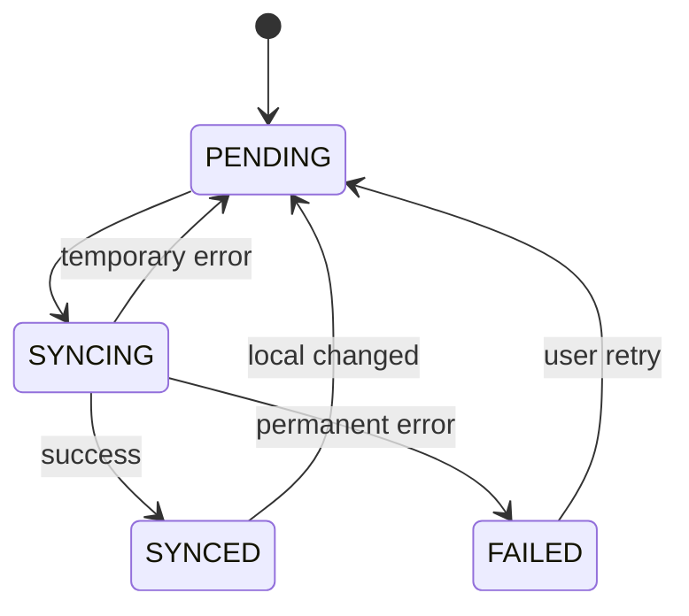
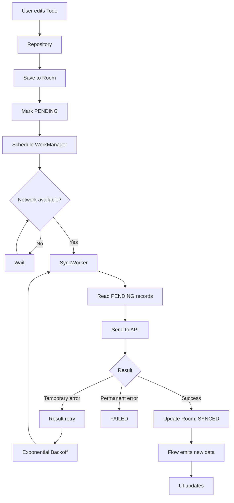
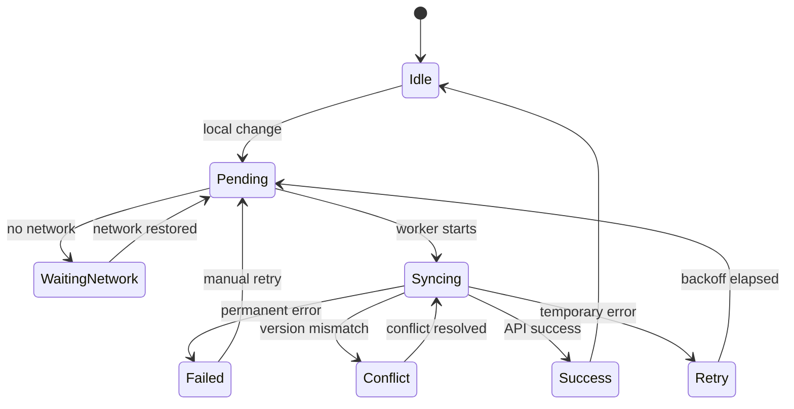
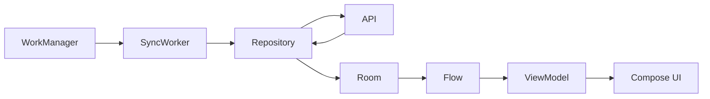
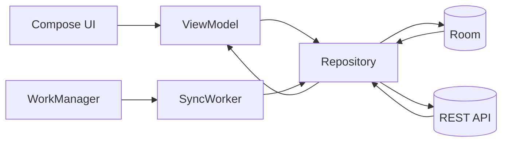

# 028 — Background Sync

| Thuộc tính              | Nội dung                              |
| ----------------------- | ------------------------------------- |
| **Học phần**            | 04 — Network, Async and Services      |
| **Module**              | Module 08 — Asynchronism              |
| **Nhóm nội dung**       | Rx and Background Work                |
| **Nguồn roadmap**       | Asynchronism / Rx and Background Work |
| **Loại bài**            | Async                                 |
| **Thứ tự trong module** | 028                                   |
| **Thời lượng gợi ý**    | 34 phút                               |

---

## 1. Tóm tắt

**Background Sync** là quá trình đồng bộ dữ liệu giữa thiết bị và nguồn dữ liệu bên ngoài — thường là server/API — mà **không yêu cầu người dùng phải giữ màn hình hoặc ứng dụng đang mở**.

Ví dụ:

* Đồng bộ các ghi chú được tạo khi offline.
* Tải tin nhắn mới.
* Upload ảnh đang chờ.
* Gửi analytics/log.
* Cập nhật cache.
* Đồng bộ danh sách công việc với server.
* Đồng bộ dữ liệu sau khi mạng được kết nối trở lại.

Trong kiến trúc Android hiện đại, một mô hình rất quan trọng là:

> **UI đọc dữ liệu local → Background Sync làm việc với server → cập nhật local → UI tự nhận dữ liệu mới.**

Android khuyến nghị `WorkManager` cho các công việc **persistent** cần tiếp tục hoặc được thực hiện lại ngay cả khi app rời foreground.

Đối với ứng dụng offline-first, Android cũng khuyến nghị local data source đóng vai trò **nguồn dữ liệu chính để UI đọc**, trong khi Repository chịu trách nhiệm đồng bộ local với network.

---

# 2. Mục tiêu học tập

Sau bài này, bạn có thể:

* [ ] Giải thích Background Sync bằng ngôn ngữ của mình.
* [ ] Phân biệt **background thread**, **coroutine** và **persistent background work**.
* [ ] Hiểu vai trò của `WorkManager` trong Background Sync.
* [ ] Thiết kế luồng đồng bộ giữa **Room ↔ Repository ↔ API**.
* [ ] Thiết lập `Constraints` để chỉ sync khi có mạng.
* [ ] Sử dụng retry và exponential backoff khi mạng lỗi.
* [ ] Tránh chạy nhiều Sync Worker trùng nhau.
* [ ] Thiết kế app có khả năng hoạt động offline.
* [ ] Hiểu cách xử lý conflict giữa dữ liệu local và server.
* [ ] Test được luồng thành công, retry và failure.
* [ ] Tạo một artifact nhỏ về Background Sync để đưa vào portfolio.

---

# 3. Background Sync là gì?

## 3.1 Định nghĩa ngắn gọn

**Background Sync** là cơ chế cho phép ứng dụng:

1. lưu hoặc đọc dữ liệu trên thiết bị;
2. thực hiện đồng bộ với server khi điều kiện phù hợp;
3. xử lý retry nếu thất bại;
4. cập nhật local database;
5. để UI tự phản ánh dữ liệu mới.

Nó không nhất thiết phải chạy ngay lập tức.

Ví dụ:

```text
Người dùng thêm Todo
        ↓
Lưu vào Room
        ↓
Đánh dấu PENDING_SYNC
        ↓
WorkManager chờ mạng
        ↓
Gửi Todo lên API
        ↓
Server trả thành công
        ↓
Room → SYNCED
        ↓
UI cập nhật
```

---

# 4. Background Sync không giống Background Thread

Đây là điểm rất dễ nhầm.

| Cơ chế           | Mục đích                                                                 |
| ---------------- | ------------------------------------------------------------------------ |
| Coroutine        | Chạy async/concurrent code                                               |
| `Dispatchers.IO` | Chuyển tác vụ I/O khỏi main thread                                       |
| `viewModelScope` | Coroutine sống cùng ViewModel                                            |
| `lifecycleScope` | Coroutine sống cùng LifecycleOwner                                       |
| WorkManager      | Công việc background cần được hệ thống quản lý và thực hiện đáng tin cậy |
| Background Sync  | Kiến trúc đồng bộ dữ liệu local ↔ remote                                 |

Ví dụ:

```kotlin
viewModelScope.launch {
    repository.refresh()
}
```

Đoạn trên có thể phù hợp khi người dùng đang mở màn hình.

Nhưng nếu:

```text
User đóng app
↓
Process bị Android kill
↓
Task vẫn phải được sync sau đó
```

thì coroutine của ViewModel **không phải công cụ phù hợp**.

Đây là trường hợp nên nghĩ đến:

```text
WorkManager
```

---

# 5. Background Sync nằm ở đâu trong kiến trúc Android?

Một kiến trúc phổ biến:

```text
┌──────────────────────────────┐
│             UI               │
│       Compose / Views        │
└──────────────┬───────────────┘
               │ observe
               ▼
┌──────────────────────────────┐
│          ViewModel           │
│      StateFlow / UiState     │
└──────────────┬───────────────┘
               │
               ▼
┌──────────────────────────────┐
│          Repository          │
│                              │
│  quyết định local / remote   │
└───────┬───────────────┬──────┘
        │               │
        ▼               ▼
┌──────────────┐   ┌──────────────┐
│     Room     │   │ Retrofit/API │
│    Local     │   │    Remote    │
└──────▲───────┘   └──────┬───────┘
       │                   │
       │                   │
       └──── SyncWorker ───┘
              ▲
              │
         WorkManager
```

Điểm quan trọng:

```text
UI
 ↓
Room
```

thay vì:

```text
UI
 ↓
API
```

Ở kiến trúc offline-first, local storage nên là nguồn dữ liệu mà các tầng phía trên đọc trực tiếp. Network được Repository sử dụng để cập nhật local storage.

---

# 6. Vì sao nên dùng Local Database làm Source of Truth?

Giả sử màn hình Todo gọi API trực tiếp:

```text
UI → API
```

Khi mất mạng:

```text
API ❌
 ↓
UI không có dữ liệu
```

Nếu sử dụng Room:

```text
        Server
          ↑
          │ sync
          ↓
         Room
          ↑
          │ Flow
          │
          UI
```

Người dùng vẫn có thể:

* xem dữ liệu cũ;
* thêm dữ liệu;
* sửa dữ liệu;
* thao tác offline;
* chờ hệ thống đồng bộ sau.

Android mô tả offline-first app là app có thể thực hiện ít nhất một phần quan trọng chức năng mà không cần kết nối mạng ổn định.

---

# 7. Các kiểu Background Sync

## 7.1 Pull Sync

App chủ động hỏi server:

```text
Client
  │
  │ GET /todos?updatedAfter=...
  ▼
Server
  │
  │ dữ liệu mới
  ▼
Client
```

Ví dụ:

* mở app;
* pull-to-refresh;
* WorkManager chạy định kỳ.

---

## 7.2 Push Sync

Server thông báo có thay đổi:

```text
Server
   │
   │ notification / event
   ▼
Client
   │
   ▼
Sync
```

Ví dụ:

```text
Firebase Cloud Messaging
        ↓
App nhận tín hiệu
        ↓
Fetch dữ liệu mới
```

---

## 7.3 Hybrid Sync

Ứng dụng thực tế thường kết hợp cả hai.

```text
             ┌──── Pull khi mở app
             │
Server ──────┼──── Push notification
             │
             └──── Periodic background sync
```

Android cũng mô tả pull-based, push-based và hybrid synchronization như các chiến lược phổ biến cho ứng dụng offline-first.

---

# 8. Ví dụ: Todo App có Background Sync

Giả sử app có:

```text
Room
Retrofit
Repository
WorkManager
Compose
```

Người dùng tạo Todo khi không có mạng.

---

## 8.1 Bước 1 — Lưu Todo local trước

```kotlin
@Entity(tableName = "todos")
data class TodoEntity(
    @PrimaryKey
    val id: String,

    val title: String,

    val completed: Boolean = false,

    val updatedAt: Long,

    val syncState: SyncState
)
```

Trạng thái sync:

```kotlin
enum class SyncState {
    SYNCED,
    PENDING,
    FAILED
}
```

Khi user tạo Todo:

```kotlin
val todo = TodoEntity(
    id = UUID.randomUUID().toString(),
    title = "Learn WorkManager",
    updatedAt = System.currentTimeMillis(),
    syncState = SyncState.PENDING
)

todoDao.insert(todo)
```

UI thấy Todo ngay lập tức.

Không cần chờ API.

---

# 9. Trạng thái đồng bộ

Một record có thể đi qua các trạng thái:



Ví dụ UI:

| State     | Hiển thị          |
| --------- | ----------------- |
| `SYNCED`  | Bình thường       |
| `PENDING` | Đang chờ đồng bộ  |
| `SYNCING` | Đang đồng bộ      |
| `FAILED`  | Không thể đồng bộ |

Không nhất thiết app nào cũng cần hiển thị toàn bộ trạng thái này cho người dùng.

---

# 10. DAO lấy dữ liệu đang chờ Sync

```kotlin
@Dao
interface TodoDao {

    @Query("""
        SELECT * FROM todos
        WHERE syncState = 'PENDING'
    """)
    suspend fun getPendingTodos(): List<TodoEntity>

    @Insert(onConflict = OnConflictStrategy.REPLACE)
    suspend fun insert(todo: TodoEntity)

    @Update
    suspend fun update(todo: TodoEntity)

    @Query("""
        SELECT * FROM todos
        ORDER BY updatedAt DESC
    """)
    fun observeTodos(): Flow<List<TodoEntity>>
}
```

UI có thể subscribe:

```kotlin
todoDao.observeTodos()
```

Khi Worker cập nhật Room:

```text
Room thay đổi
     ↓
Flow emit
     ↓
Repository
     ↓
ViewModel
     ↓
Compose recomposition
```

---

# 11. Tạo SyncWorker

Với Kotlin, có thể sử dụng `CoroutineWorker` để viết Worker bằng coroutine.

Ví dụ:

```kotlin
class TodoSyncWorker(
    appContext: Context,
    workerParams: WorkerParameters
) : CoroutineWorker(
    appContext,
    workerParams
) {

    override suspend fun doWork(): Result {
        return try {

            syncTodos()

            Result.success()

        } catch (e: IOException) {

            Result.retry()

        } catch (e: HttpException) {

            when (e.code()) {
                408,
                429,
                in 500..599 -> Result.retry()

                else -> Result.failure()
            }
        }
    }

    private suspend fun syncTodos() {
        // Repository / API synchronization
    }
}
```

Ý nghĩa:

```text
success()
```

Công việc hoàn tất.

```text
retry()
```

Lỗi tạm thời, nên thử lại.

```text
failure()
```

Lỗi không nên tự retry tiếp.

---

# 12. Constraints

Không nên chạy network sync khi thiết bị hoàn toàn không có mạng.

```kotlin
val constraints = Constraints.Builder()
    .setRequiredNetworkType(
        NetworkType.CONNECTED
    )
    .build()
```

Sau đó gắn vào request:

```kotlin
val syncRequest =
    OneTimeWorkRequestBuilder<TodoSyncWorker>()
        .setConstraints(constraints)
        .build()
```

Luồng:

```text
enqueue()
   ↓
Không có mạng
   ↓
ENQUEUED
   ↓
mạng trở lại
   ↓
Constraints satisfied
   ↓
RUNNING
```

WorkManager được thiết kế để chỉ chạy công việc khi các `Constraints` được đáp ứng.

---

# 13. Retry + Exponential Backoff

Không nên:

```text
API fail
 ↓
retry
 ↓
fail
 ↓
retry
 ↓
fail
 ↓
retry liên tục
```

Điều này có thể:

* tốn pin;
* tốn data;
* spam server;
* làm API bị rate limit;
* làm thiết bị nóng.

Thay vào đó:

```text
30 giây
   ↓
60 giây
   ↓
120 giây
   ↓
240 giây
   ↓
...
```

Đây là **exponential backoff**.

```kotlin
val syncRequest =
    OneTimeWorkRequestBuilder<TodoSyncWorker>()
        .setConstraints(constraints)
        .setBackoffCriteria(
            BackoffPolicy.EXPONENTIAL,
            30,
            TimeUnit.SECONDS
        )
        .build()
```

WorkManager hỗ trợ cả:

```text
LINEAR
EXPONENTIAL
```

và tự lên lịch lại khi Worker trả về `Result.retry()`.

---

# 14. Tránh chạy nhiều Sync Worker cùng lúc

Giả sử user sửa 10 Todo liên tục.

Nếu mỗi thao tác tạo một Worker:

```text
Edit 1 → Worker
Edit 2 → Worker
Edit 3 → Worker
Edit 4 → Worker
Edit 5 → Worker
...
```

Có thể gây:

```text
Duplicate sync
Race condition
API spam
Battery waste
Conflict
```

Giải pháp:

## Unique Work

```kotlin
WorkManager
    .getInstance(context)
    .enqueueUniqueWork(
        "todo_background_sync",
        ExistingWorkPolicy.KEEP,
        syncRequest
    )
```

`KEEP` có nghĩa:

```text
Worker cũ đang tồn tại
        ↓
Không enqueue thêm Worker giống nó
```

Kiến trúc offline-first trong tài liệu Android cũng sử dụng unique work để đảm bảo không có nhiều sync worker cùng loại chạy không cần thiết.

---

# 15. Toàn bộ luồng Background Sync



Đây là kiến trúc Background Sync quan trọng nhất cần nhớ.

---

# 16. Sync Repository

Thay vì đặt toàn bộ logic network trong Worker:

```text
Worker
 ├── Retrofit
 ├── Room
 ├── Mapping
 ├── Conflict resolution
 └── Business rules
```

nên để Worker gọi Repository:

```text
Worker
  ↓
Repository
 ├── Local DataSource
 └── Remote DataSource
```

Ví dụ:

```kotlin
class TodoRepository(
    private val dao: TodoDao,
    private val api: TodoApi
) {

    suspend fun syncPendingTodos() {

        val pending =
            dao.getPendingTodos()

        pending.forEach { todo ->

            api.upsertTodo(
                todo.toNetworkModel()
            )

            dao.update(
                todo.copy(
                    syncState = SyncState.SYNCED
                )
            )
        }
    }
}
```

Worker:

```kotlin
override suspend fun doWork(): Result {

    return try {

        repository.syncPendingTodos()

        Result.success()

    } catch (e: IOException) {

        Result.retry()
    }
}
```

Worker lúc này chỉ chịu trách nhiệm:

```text
schedule
+
run
+
report result
```

Repository chịu trách nhiệm:

```text
data synchronization
```

---

# 17. Full Flow của Todo App

```text
┌──────────────────────────────┐
│ User nhập "Learn Android"    │
└──────────────┬───────────────┘
               ↓
┌──────────────────────────────┐
│ ViewModel.addTodo()          │
└──────────────┬───────────────┘
               ↓
┌──────────────────────────────┐
│ Repository                   │
└──────────────┬───────────────┘
               ↓
┌──────────────────────────────┐
│ Room                         │
│                              │
│ syncState = PENDING          │
└──────────────┬───────────────┘
               ↓
           UI cập nhật
               │
               │
               ▼
┌──────────────────────────────┐
│ WorkManager                  │
│                              │
│ NetworkType.CONNECTED        │
└──────────────┬───────────────┘
               ↓
┌──────────────────────────────┐
│ SyncWorker                   │
└──────────────┬───────────────┘
               ↓
┌──────────────────────────────┐
│ Repository.sync()            │
└───────┬─────────────┬────────┘
        ↓             ↓
      Room           API
        ↑             │
        └─────────────┘
               ↓
       syncState=SYNCED
               ↓
           Flow emits
               ↓
          UI cập nhật
```

---

# 18. Khi nào nên Sync?

Không phải mọi dữ liệu đều cần cùng một chiến lược.

## Sync khi user thực hiện hành động

Ví dụ:

```text
User tạo Todo
    ↓
enqueue sync
```

Phù hợp với:

* notes;
* task;
* bookmark;
* favorite;
* draft.

---

## Sync khi app khởi động

```text
App start
   ↓
enqueue unique sync
```

Dùng để:

* kiểm tra dữ liệu mới;
* cập nhật cache;
* xử lý queue bị bỏ lại.

---

## Periodic Sync

Ví dụ:

```kotlin
val periodicSync =
    PeriodicWorkRequestBuilder<TodoSyncWorker>(
        1,
        TimeUnit.HOURS
    )
        .setConstraints(constraints)
        .build()
```

Lưu ý:

> `PeriodicWorkRequest` không phải cron chính xác.

Hệ thống có quyền điều chỉnh thời điểm chạy để tối ưu pin và tài nguyên.

WorkManager hiện yêu cầu periodic work có repeat interval tối thiểu **15 phút**.

---

# 19. Không nên lạm dụng Periodic Sync

Sai:

```text
Cứ 15 phút
↓
download toàn bộ database
```

ngay cả khi dữ liệu không thay đổi.

Điều này gây:

```text
Battery ↑
Network ↑
Server load ↑
Data usage ↑
```

Tốt hơn:

```text
delta sync
```

Ví dụ:

```http
GET /todos?updatedAfter=1723000000
```

Server chỉ trả:

```text
những record thay đổi
```

thay vì:

```text
toàn bộ dữ liệu
```

---

# 20. Conflict Resolution

Background Sync khó nhất khi:

```text
Device A sửa dữ liệu
Device B cũng sửa dữ liệu
Server cũng đã thay đổi
```

Ví dụ:

```text
Local:
title = "Learn Kotlin"

Server:
title = "Learn Compose"
```

App phải quyết định bản nào thắng.

---

## Strategy 1 — Last Write Wins

```text
record có updatedAt mới hơn
        ↓
        thắng
```

Đơn giản nhưng có thể mất dữ liệu.

---

## Strategy 2 — Server Wins

```text
Server luôn là bản cuối cùng
```

Phù hợp khi server kiểm soát dữ liệu.

---

## Strategy 3 — Client Wins

```text
Local thay đổi gần nhất
        ↓
ghi đè server
```

Cần cẩn thận khi nhiều thiết bị.

---

## Strategy 4 — Version Number

Server lưu:

```text
version = 12
```

Client gửi:

```text
version = 11
```

Server phát hiện:

```text
CONFLICT
```

Client phải fetch bản mới rồi resolve.

---

# 21. Một kiến trúc Sync tốt

Một record có thể lưu metadata:

```kotlin
data class SyncMetadata(
    val updatedAt: Long,
    val version: Long,
    val syncState: SyncState
)
```

Sau đó:

```text
data
+
metadata
```

giúp hệ thống biết:

```text
record nào mới
record nào đã sync
record nào đang pending
record nào conflict
```

---

# 22. Error Handling

Không phải lỗi nào cũng retry.

| Error              | Hành vi gợi ý                   |
| ------------------ | ------------------------------- |
| Không có internet  | Retry                           |
| Timeout            | Retry                           |
| HTTP 408           | Retry                           |
| HTTP 429           | Retry/backoff                   |
| HTTP 500           | Retry                           |
| HTTP 502/503       | Retry                           |
| HTTP 400           | Thường failure                  |
| HTTP 404           | Tùy business rule               |
| HTTP 401           | Refresh auth hoặc yêu cầu login |
| Invalid local data | Failure                         |

Nguyên tắc:

```text
Temporary error
      ↓
    Retry
```

```text
Permanent error
      ↓
   Failure
```

---

# 23. Lifecycle

Background Sync không nên phụ thuộc vào:

```text
Activity
Fragment
Compose Screen
ViewModel
```

Ví dụ không tốt:

```text
Activity
   ↓
network upload
   ↓
user đóng Activity
   ↓
task mất
```

Với persistent work:

```text
Activity
   ↓
enqueue WorkManager
   ↓
Activity biến mất
   ↓
WorkManager vẫn quản lý task
```

Do đó Background Sync phù hợp cho công việc cần sống **độc lập hơn với UI lifecycle**.

---

# 24. Rotation có ảnh hưởng Sync không?

Ví dụ:

```text
Portrait
  ↓
Rotate
  ↓
Landscape
```

Activity có thể được recreate.

Nhưng:

```text
WorkManager
```

không được thiết kế để phụ thuộc vào instance Activity đó.

Do đó:

```text
rotate screen
```

không nên làm mất Background Sync.

---

# 25. Process Death

Một trường hợp quan trọng hơn:

```text
App
 ↓
enqueue sync
 ↓
user rời app
 ↓
Android kill process
```

Persistent work được WorkManager quản lý để có thể tiếp tục được lên lịch lại khi phù hợp, thay vì dựa vào coroutine đang nằm trong process cũ. WorkManager là thư viện Android khuyến nghị cho loại công việc persistent này.

---

# 26. Cancellation

Không phải mọi sync đều phải chạy đến cùng.

Ví dụ user:

```text
Upload ảnh
   ↓
xóa draft
```

Task upload có thể không còn cần thiết.

Có thể cancel:

```kotlin
WorkManager
    .getInstance(context)
    .cancelUniqueWork(
        "upload_$photoId"
    )
```

Hoặc:

```kotlin
workManager.cancelWorkById(
    request.id
)
```

WorkManager hỗ trợ tra cứu và hủy work thông qua ID.

---

# 27. Đừng dùng Background Sync cho mọi thứ

## Dùng coroutine khi

```text
User mở màn hình
↓
load dữ liệu
↓
kết quả cần ngay
```

Ví dụ:

```kotlin
viewModelScope.launch {
    repository.search(query)
}
```

---

## Dùng WorkManager khi

```text
công việc có thể trì hoãn
+
cần thực hiện đáng tin cậy
+
không phụ thuộc UI
```

Ví dụ:

* sync local → server;
* upload log;
* backup;
* periodic refresh;
* offline queue;
* scheduled cleanup.

---

# 28. Background Sync State Machine

Có thể thiết kế toàn bộ hệ thống:



Sơ đồ này rất phù hợp để đưa vào README portfolio.

---

# 29. UX của Background Sync

Background Sync tốt không chỉ là vấn đề kỹ thuật.

Nó ảnh hưởng trực tiếp tới trải nghiệm người dùng.

Ví dụ người dùng tạo Todo offline.

Không tốt:

```text
No internet
   ↓
ERROR
   ↓
Không cho tạo Todo
```

Tốt hơn:

```text
Todo được lưu local
       ↓
UI hiển thị ngay
       ↓
"Waiting for sync"
       ↓
Internet trở lại
       ↓
Background sync
```

Đây là một dạng **optimistic/offline-first UX**.

---

# 30. Quan sát Work State

WorkManager cung cấp `WorkInfo` để quan sát trạng thái công việc.

Các state thường gặp:

```text
ENQUEUED
RUNNING
SUCCEEDED
FAILED
BLOCKED
CANCELLED
```

Có thể dùng chúng để:

* debug;
* logging;
* Dev screen;
* sync status;
* test.

---

# 31. Logging

Một Sync Worker production nên log ít nhất:

```text
SYNC_START
SYNC_PENDING_COUNT
SYNC_API_REQUEST
SYNC_SUCCESS
SYNC_RETRY
SYNC_FAILURE
SYNC_CONFLICT
```

Ví dụ:

```kotlin
Log.d(
    "TodoSync",
    "Sync started attempt=$runAttemptCount"
)
```

`runAttemptCount` đặc biệt hữu ích để debug retry.

Ví dụ log:

```text
TodoSync: attempt=0 start
TodoSync: IOException
TodoSync: retry

TodoSync: attempt=1 start
TodoSync: 5 pending records
TodoSync: success
```

---

# 32. Testing Background Sync

Không nên chỉ test:

```text
Có Wi-Fi
+
API luôn thành công
```

Cần kiểm tra nhiều tình huống.

## Case 1 — Success

```text
Room có PENDING
↓
Worker chạy
↓
API 200
↓
Room → SYNCED
```

---

## Case 2 — Offline

```text
Không có mạng
↓
Worker không chạy
↓
Network restored
↓
Worker chạy
```

---

## Case 3 — Server lỗi

```text
API 503
↓
Result.retry()
↓
backoff
↓
retry
```

---

## Case 4 — Permanent error

```text
invalid request
↓
HTTP 400
↓
Result.failure()
```

---

## Case 5 — Duplicate request

```text
enqueue
enqueue
enqueue
```

Kỳ vọng:

```text
chỉ một unique sync
```

---

## Case 6 — Process restart

```text
enqueue sync
↓
app process bị kill
↓
mở lại
↓
sync vẫn có khả năng tiếp tục
```

---

# 33. Test Matrix

| Tình huống            | Kết quả mong đợi                         |
| --------------------- | ---------------------------------------- |
| Online + API OK       | Sync success                             |
| Offline               | Wait                                     |
| Network trở lại       | Worker chạy                              |
| Timeout               | Retry                                    |
| HTTP 500              | Retry                                    |
| HTTP 400              | Failure                                  |
| Rotate                | Không mất work                           |
| App background        | Work tiếp tục được quản lý               |
| Process death         | Persistent work không phụ thuộc Activity |
| Duplicate enqueue     | Không tạo nhiều sync giống nhau          |
| Local/server conflict | Resolve theo policy                      |

---

# 34. Những lỗi thiết kế thường gặp

## ❌ Gọi API trực tiếp từ UI

```text
Composable
   ↓
Retrofit
```

Tạo coupling không cần thiết.

Nên:

```text
UI
 ↓
ViewModel
 ↓
Repository
```

---

## ❌ UI đọc trực tiếp network

```text
UI → API
```

Dễ làm app hoạt động kém khi offline.

Tốt hơn:

```text
UI → Room

Background:
Room ↔ API
```

---

## ❌ Retry vô hạn ngay lập tức

```kotlin
while (true) {
    api.sync()
}
```

Có thể gây network storm.

Hãy sử dụng:

```text
Result.retry()
+
Backoff
```

---

## ❌ Tạo Worker cho từng thao tác nhỏ

```text
100 edits
↓
100 workers
```

Tốt hơn:

```text
100 pending records
↓
1 SyncWorker
↓
drain queue
```

---

## ❌ Download toàn bộ database mỗi lần

Nên sử dụng:

```text
incremental sync
delta sync
updatedAt
version
cursor
```

---

# 35. Performance

Background Sync ảnh hưởng:

```text
Battery
Network
CPU
Storage
Server
```

Các cách tối ưu:

* dùng constraints;
* batch nhiều record;
* tránh duplicate worker;
* incremental sync;
* exponential backoff;
* cache;
* chỉ sync dữ liệu cần thiết;
* không polling quá thường xuyên;
* dùng unique work.

---

# 36. Background Sync và Rx/Flow

Background Sync thực hiện:

```text
Network
↓
Room update
```

Trong khi Flow có thể đảm nhiệm:

```text
Room
↓
Flow
↓
ViewModel
↓
Compose
```

Toàn bộ pipeline:



Đây là lý do Background Sync nằm rất hợp lý trong nhóm:

```text
Rx and Background Work
```

---

# 37. OneTime hay Periodic?

## `OneTimeWorkRequest`

Dùng khi:

```text
Có một sự kiện
↓
Cần sync
```

Ví dụ:

```text
user thêm Todo
user sửa profile
app startup
network reconnect
```

---

## `PeriodicWorkRequest`

Dùng khi:

```text
Cần refresh định kỳ
```

Ví dụ:

```text
Periodic cache refresh
Periodic cleanup
Periodic synchronization
```

Nhưng không nên coi periodic work là bộ lập lịch chạy chính xác từng phút.

---

# 38. Phiên bản WorkManager hiện tại

Tại **23/08/2026**, stable release của WorkManager được Android Developers liệt kê là:

```text
WorkManager 2.11.2
```

phát hành ngày **12/08/2026**.

Ví dụ dependency Kotlin:

```kotlin
dependencies {
    implementation(
        "androidx.work:work-runtime-ktx:2.11.2"
    )
}
```

---

# 39. Bài thực hành

## Mini Project — Offline Todo Sync

### Yêu cầu

Tạo một app Todo có:

```text
Compose
ViewModel
Room
Repository
Retrofit/Fake API
WorkManager
```

### Luồng

```text
User tạo Todo
      ↓
Room
      ↓
syncState=PENDING
      ↓
WorkManager
      ↓
API
      ↓
syncState=SYNCED
```

### Yêu cầu kỹ thuật

* [ ] UI đọc dữ liệu từ Room.
* [ ] Todo có trường `syncState`.
* [ ] Có `CoroutineWorker`.
* [ ] Worker yêu cầu network connected.
* [ ] API lỗi tạm thời trả `Result.retry()`.
* [ ] Sử dụng exponential backoff.
* [ ] Sử dụng `enqueueUniqueWork`.
* [ ] Không chạy network trên main thread.
* [ ] Log từng state.
* [ ] Có ít nhất một test cho retry.

---

# 40. Bài tập

## Bài 1 — Offline Create

Cho user:

```text
Airplane Mode ON
```

Sau đó tạo Todo.

Kỳ vọng:

```text
Todo vẫn xuất hiện
+
syncState=PENDING
```

Bật lại mạng.

Kỳ vọng:

```text
WorkManager chạy
↓
Todo sync server
↓
syncState=SYNCED
```

---

## Bài 2 — Retry

Fake API trả:

```text
HTTP 503
```

Worker phải:

```text
Result.retry()
```

Giải thích:

```text
vì sao không retry ngay lập tức?
```

---

## Bài 3 — Conflict

Cho:

```text
Local version = 4

Server version = 5
```

Thiết kế cách xử lý conflict.

---

## Bài 4 — Duplicate Work

Gọi:

```kotlin
scheduleSync()
scheduleSync()
scheduleSync()
```

Đảm bảo chỉ có một sync pipeline hợp lệ.

---

# 41. Artifact cho Portfolio

Có thể tạo project:

```text
OfflineTodoSync/
```

Cấu trúc:

```text
app/
├── data/
│   ├── local/
│   │   ├── TodoDao.kt
│   │   ├── TodoEntity.kt
│   │   └── AppDatabase.kt
│   │
│   ├── remote/
│   │   ├── TodoApi.kt
│   │   └── NetworkTodo.kt
│   │
│   └── repository/
│       └── TodoRepository.kt
│
├── sync/
│   ├── TodoSyncWorker.kt
│   └── SyncScheduler.kt
│
├── ui/
│   ├── TodoScreen.kt
│   └── TodoViewModel.kt
│
└── MainActivity.kt
```

README có thể trình bày:

```text
Problem
↓
Offline-first architecture
↓
Local source of truth
↓
WorkManager sync
↓
Retry/backoff
↓
Conflict resolution
↓
Testing
```

---

# 42. README Diagram cho Portfolio



Một sơ đồ như vậy giúp nhà tuyển dụng thấy bạn hiểu:

```text
Architecture
+
Async
+
Persistence
+
Networking
+
Offline-first
```

chứ không chỉ biết gọi API.

---

# 43. Checklist hoàn thành

## Kiến thức

* [ ] Giải thích được Background Sync.
* [ ] Phân biệt coroutine với persistent work.
* [ ] Hiểu tại sao Background Sync không nên phụ thuộc Activity.
* [ ] Biết vai trò của WorkManager.
* [ ] Hiểu local source of truth.

## WorkManager

* [ ] Biết tạo `CoroutineWorker`.
* [ ] Biết `OneTimeWorkRequest`.
* [ ] Biết `PeriodicWorkRequest`.
* [ ] Biết `Constraints`.
* [ ] Biết `Result.success()`.
* [ ] Biết `Result.retry()`.
* [ ] Biết `Result.failure()`.
* [ ] Biết exponential backoff.
* [ ] Biết unique work.

## Data

* [ ] Có Room/local persistence.
* [ ] Có trạng thái `PENDING`.
* [ ] Có trạng thái `SYNCED`.
* [ ] Biết xử lý queue.
* [ ] Biết khái niệm conflict resolution.

## Quality

* [ ] Không block main thread.
* [ ] Không retry liên tục.
* [ ] Không tạo duplicate Worker.
* [ ] Có logging.
* [ ] Test offline.
* [ ] Test network failure.
* [ ] Test retry.
* [ ] Test process/lifecycle behavior.

## Portfolio

* [ ] Có source code.
* [ ] Có architecture diagram.
* [ ] Có README.
* [ ] Có screenshot sync state.
* [ ] Có test.
* [ ] Có giải thích retry/backoff.

---

# 44. Ghi chú Production

Trước khi release một Background Sync feature, nên hỏi:

### Lifecycle

```text
App background thì sao?
Process bị kill thì sao?
Rotate thì sao?
```

### Network

```text
Offline thì sao?
Timeout thì sao?
HTTP 429 thì sao?
Server 500 thì sao?
```

### Data

```text
Local và server conflict thì sao?
Có duplicate không?
Có mất dữ liệu không?
```

### Performance

```text
Sync có quá thường xuyên không?
Có tải toàn bộ database không?
Có batch được không?
```

### Battery

```text
Có constraints hợp lý không?
Có retry quá nhiều không?
```

### Observability

```text
Có log sync attempt không?
Có biết record nào failed không?
Có biết Worker đang ở state nào không?
```

### UX

```text
User có cần biết đang offline không?
Có cần nút Retry không?
Có cần trạng thái "Waiting for sync" không?
```

---

# 45. Ghi nhớ nhanh

```text
Background Sync
      │
      ├── Local first
      │
      ├── Repository
      │
      ├── WorkManager
      │
      ├── Constraints
      │
      ├── Retry
      │
      ├── Backoff
      │
      ├── Unique Work
      │
      ├── Conflict Resolution
      │
      └── Testing
```

Công thức quan trọng nhất của bài:

```text
User action
   ↓
Save Local
   ↓
Mark Pending
   ↓
Schedule Work
   ↓
Wait for Network
   ↓
Sync Server
   ↓
Retry if needed
   ↓
Update Local
   ↓
Flow emits
   ↓
UI updates
```

> **Background Sync tốt không phải là “gọi API ở background”. Nó là một chiến lược quản lý state và dữ liệu để local và remote cuối cùng đạt trạng thái nhất quán mà không làm UX phụ thuộc hoàn toàn vào kết nối mạng.**
