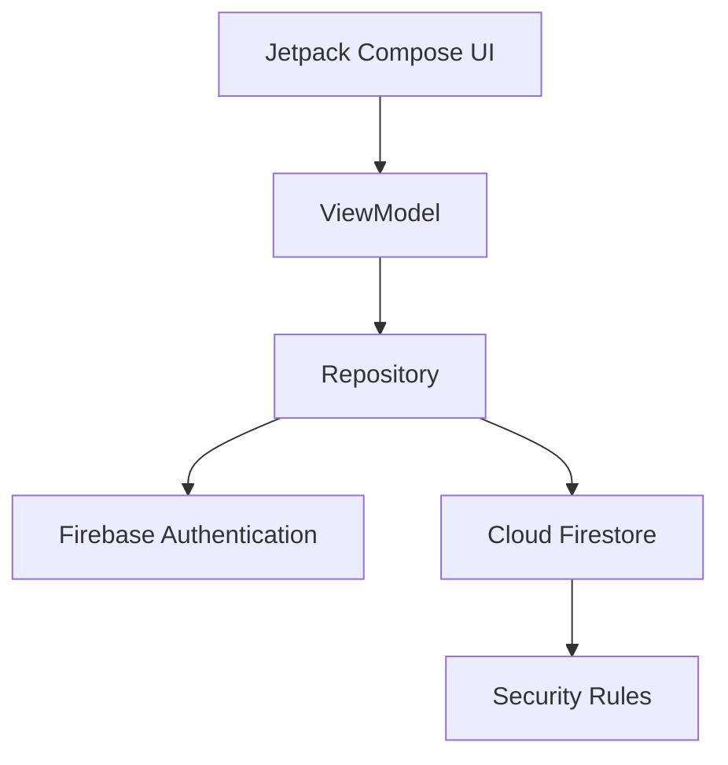

# 001 — Firebase

| Thuộc tính              | Nội dung                         |
| ----------------------- | -------------------------------- |
| **Học phần**            | 04 — Network, Async and Services |
| **Module**              | Module 09 — Common Services      |
| **Nhóm nội dung**       | Firebase                         |
| **Nguồn roadmap**       | Common Services / Firebase       |
| **Loại bài**            | Service                          |
| **Thứ tự trong module** | 001                              |
| **Thời lượng gợi ý**    | 34 phút                          |

---

## 1. Tóm tắt

**Firebase** là một nền tảng Backend-as-a-Service do Google cung cấp, tập hợp nhiều dịch vụ thường gặp khi xây dựng ứng dụng Android như:

* Authentication.
* Cloud Firestore.
* Realtime Database.
* Cloud Storage.
* Firebase Cloud Messaging.
* Crashlytics.
* Analytics.
* Remote Config.
* App Check.
* Performance Monitoring.

Thay vì tự xây dựng toàn bộ backend:

```text
Android App
    ↓
REST API
    ↓
Authentication Server
    ↓
Database
    ↓
Notification Server
    ↓
Analytics / Monitoring
```

Firebase cho phép ứng dụng Android sử dụng trực tiếp nhiều dịch vụ đã được quản lý:

```text
                 ┌──────────────────────┐
                 │     Android App      │
                 └──────────┬───────────┘
                            │
              Firebase Android SDK
                            │
        ┌───────────────────┼────────────────────┐
        │                   │                    │
        ▼                   ▼                    ▼
      Auth              Firestore              FCM
        │                   │                    │
        ├─────────────┐     │                    │
        ▼             ▼     ▼                    ▼
    App Check      Storage Analytics         Notification
                      │
                      ▼
                 Crashlytics
```

Firebase rất phù hợp với:

* Prototype.
* MVP.
* Ứng dụng cá nhân.
* Startup.
* App cần realtime.
* App không muốn xây backend ngay từ đầu.

Tuy nhiên:

> **Firebase không có nghĩa là không cần tư duy backend.**

Security Rules, cấu trúc dữ liệu, quyền truy cập, chi phí, privacy và monitoring vẫn phải được coi là **production code**.

---

# 2. Mục tiêu học tập

Sau bài này, anh nên có thể:

* [ ] Giải thích Firebase là gì bằng ngôn ngữ của mình.
* [ ] Hiểu Firebase nằm ở đâu trong kiến trúc Android.
* [ ] Nhận biết các Firebase Service phổ biến.
* [ ] Kết nối Firebase vào Android project.
* [ ] Hiểu vai trò của `google-services.json`.
* [ ] Sử dụng Firebase BoM để quản lý dependency.
* [ ] Hiểu Firebase Authentication và Firestore ở mức cơ bản.
* [ ] Phân biệt Authentication và Authorization.
* [ ] Viết Security Rules cơ bản.
* [ ] Xử lý loading/error/offline khi Firebase lỗi.
* [ ] Biết cách test Firebase bằng Emulator Suite.
* [ ] Nhận biết các vấn đề privacy, security và release.
* [ ] Tạo một Firebase demo đủ tốt để đưa vào portfolio.

---

# 3. Firebase là gì?

Firebase có thể hiểu đơn giản là:

> **Một tập hợp các backend service có sẵn mà ứng dụng mobile/web có thể sử dụng thông qua SDK hoặc API.**

Ví dụ anh xây một ứng dụng ghi chú.

Nếu tự xây backend:

```text
Android
   │
   ▼
Ktor / Spring Boot / Node.js
   │
   ├── Authentication
   ├── Authorization
   ├── Database
   ├── File Storage
   ├── Push Notification
   └── Monitoring
```

Với Firebase:

```text
Android
   │
Firebase SDK
   │
   ├── Firebase Authentication
   ├── Cloud Firestore
   ├── Cloud Storage
   ├── Firebase Cloud Messaging
   └── Crashlytics
```

Backend vẫn tồn tại, nhưng phần lớn hạ tầng được Firebase quản lý.

---

# 4. Các Firebase Service quan trọng với Android

| Service                    | Chức năng                       | Ví dụ                        |
| -------------------------- | ------------------------------- | ---------------------------- |
| **Authentication**         | Đăng nhập/xác thực người dùng   | Google login, email/password |
| **Cloud Firestore**        | NoSQL database                  | Notes, chat, profile         |
| **Realtime Database**      | Database realtime               | Presence, trạng thái live    |
| **Cloud Storage**          | Lưu file                        | Avatar, ảnh, video           |
| **Cloud Messaging — FCM**  | Push notification               | Tin nhắn, thông báo          |
| **Crashlytics**            | Theo dõi crash                  | App crash production         |
| **Analytics**              | Phân tích hành vi               | Screen view, event           |
| **Remote Config**          | Thay config từ server           | Feature flag                 |
| **Performance Monitoring** | Theo dõi performance            | Network latency              |
| **App Check**              | Giảm truy cập backend trái phép | Play Integrity               |
| **Firebase AI Logic**      | Tích hợp các tính năng AI       | Gemini-powered feature       |

Không phải ứng dụng nào cũng cần tất cả.

Một app bình thường có thể chỉ cần:

```text
Firebase
├── Authentication
├── Firestore
├── FCM
└── Crashlytics
```

---

# 5. Firebase trong kiến trúc Android

Không nên gọi Firebase trực tiếp từ Composable hoặc Activity.

Ví dụ không nên:

```text
Composable
    ↓
FirebaseFirestore
```

Nên đặt Firebase phía sau Data Layer:

```text
┌───────────────────────────┐
│         Compose UI        │
└──────────────┬────────────┘
               │ UiState
               ▼
┌───────────────────────────┐
│         ViewModel         │
└──────────────┬────────────┘
               │
               ▼
┌───────────────────────────┐
│        Repository         │
└─────────┬─────────┬───────┘
          │         │
          ▼         ▼
       Room       Firebase
                    │
          ┌─────────┴──────────┐
          ▼                    ▼
        Auth                Firestore
```

Điều này giúp:

* Test dễ hơn.
* Có thể thay Firebase bằng API khác.
* UI không phụ thuộc vendor.
* Xử lý cache/offline dễ hơn.
* Firebase SDK không làm lan khắp codebase.

---

# 6. Firebase không phải một kiến trúc

Đây là điểm rất quan trọng.

Firebase:

```text
Firebase
    ↓
Data / Backend Service
```

Firebase **không thay thế**:

```text
MVVM
Clean Architecture
Repository Pattern
UseCase
ViewModel
UI State
Room
Coroutines
Flow
```

Firebase và Clean Architecture hoàn toàn có thể cùng tồn tại:

```text
UI
 ↓
ViewModel
 ↓
UseCase
 ↓
Repository Interface
 ↓
FirebaseRepository
 ↓
Firestore
```

Ví dụ:

```kotlin
interface NoteRepository {

    suspend fun createNote(note: Note)

    fun observeNotes(): Flow<List<Note>>

    suspend fun deleteNote(id: String)
}
```

Firebase chỉ là một implementation:

```text
NoteRepository
       ▲
       │ implements
       │
FirebaseNoteRepository
       │
       ▼
Cloud Firestore
```

---

# 7. Thiết lập Firebase cho Android

Quy trình tổng quát:

```text
Firebase Console
       ↓
Create Project
       ↓
Register Android App
       ↓
Package Name
       ↓
google-services.json
       ↓
Android Project
       ↓
Google Services Plugin
       ↓
Firebase SDK Dependencies
       ↓
Firebase Ready
```

---

## 7.1. Tạo Firebase project

Trong Firebase Console:

```text
Create Project
      ↓
Project name
      ↓
Google Analytics? (optional)
      ↓
Create
```

---

## 7.2. Đăng ký Android app

Firebase cần biết package/application ID:

```text
com.example.firebaseapp
```

Package này phải khớp với:

```kotlin
android {
    defaultConfig {
        applicationId = "com.example.firebaseapp"
    }
}
```

---

# 8. `google-services.json`

Sau khi đăng ký Android app, Firebase cung cấp:

```text
google-services.json
```

Đặt vào:

```text
project/
│
├── app/
│   ├── google-services.json
│   ├── build.gradle.kts
│   └── src/
│
└── build.gradle.kts
```

File này chứa configuration để SDK biết app thuộc Firebase project nào.

Ví dụ thông tin:

```text
project_id
application_id
api_key
storage_bucket
```

### Lưu ý bảo mật

`google-services.json` không nên được hiểu như **password quản trị backend**.

Firebase mobile API key chủ yếu dùng để nhận diện project/API request chứ không phải lớp authorization bảo vệ dữ liệu.

Thứ thực sự bảo vệ Firestore phải là:

```text
Firebase Authentication
        +
Security Rules
        +
App Check
```

Đặc biệt:

> **Không bao giờ đưa Service Account private key hoặc Admin SDK credential vào APK.**

---

# 9. Thêm dependency Firebase

Một cách phổ biến là sử dụng **Firebase BoM — Bill of Materials**.

```kotlin
dependencies {

    implementation(
        platform("com.google.firebase:firebase-bom:<firebase-bom-version>")
    )

    implementation("com.google.firebase:firebase-auth")
    implementation("com.google.firebase:firebase-firestore")
    implementation("com.google.firebase:firebase-messaging")
}
```

Firebase BoM giúp giữ các Firebase library ở những phiên bản tương thích với nhau.

---

## Lưu ý quan trọng cho Android hiện đại

Từ Firebase Android BoM `34.0.0` vào tháng 7/2025, Firebase đã loại các module `*-ktx` riêng khỏi BoM. Với project mới, nên sử dụng API Kotlin nằm trong **main Firebase modules**, thay vì thêm các dependency như `firebase-firestore-ktx` hoặc `firebase-auth-ktx`. ([Firebase][1])

Ví dụ hiện đại:

```kotlin
implementation("com.google.firebase:firebase-auth")
implementation("com.google.firebase:firebase-firestore")
```

thay vì xây project mới dựa trên:

```text
firebase-auth-ktx
firebase-firestore-ktx
firebase-messaging-ktx
```

---

# 10. Ví dụ: ứng dụng Firebase Notes

Ta xây một ứng dụng nhỏ:

> Người dùng đăng nhập → tạo ghi chú → ghi chú được lưu trên Firestore.

Cấu trúc dữ liệu:

```text
users
│
└── UID_A
    │
    └── notes
        │
        ├── note_001
        │   ├── title
        │   ├── content
        │   └── createdAt
        │
        └── note_002
```

Luồng:

```text
LoginScreen
    │
    ▼
Firebase Authentication
    │
    ├── thất bại ──► LoginError
    │
    ▼
UID
    │
    ▼
NotesScreen
    │
    ▼
Repository
    │
    ▼
Cloud Firestore
```

---

# 11. Model

```kotlin
data class Note(
    val id: String = "",
    val title: String = "",
    val content: String = "",
    val userId: String = "",
    val createdAt: Long = 0L
)
```

---

# 12. Repository

```kotlin
interface NoteRepository {

    fun observeNotes(
        userId: String
    ): Flow<List<Note>>

    suspend fun addNote(
        note: Note
    )

    suspend fun deleteNote(
        noteId: String
    )
}
```

Lợi ích:

```text
ViewModel

không cần biết:

Firebase?
REST API?
Room?
FakeRepository?
```

Nó chỉ biết:

```text
NoteRepository
```

---

# 13. Authentication và Authorization

Hai khái niệm rất dễ nhầm.

## Authentication

Trả lời câu hỏi:

> **Bạn là ai?**

Ví dụ:

```text
Email
Password
    ↓
Firebase Auth
    ↓
uid = "abc123"
```

---

## Authorization

Trả lời câu hỏi:

> **Bạn được phép làm gì?**

Ví dụ:

```text
User A
 ↓
Có được đọc note của User B không?
 ↓
Security Rules
 ↓
DENY
```

Firebase Authentication **không tự động bảo vệ toàn bộ Firestore**.

Ta vẫn cần Security Rules.

---

# 14. Firebase Security Rules

Ví dụ collection:

```text
users/{userId}/notes/{noteId}
```

Có thể yêu cầu:

> Người dùng chỉ được truy cập note của chính mình.

```javascript
rules_version = '2';

service cloud.firestore {

    match /databases/{database}/documents {

        match /users/{userId}/notes/{noteId} {

            allow read, write:
                if request.auth != null
                && request.auth.uid == userId;
        }
    }
}
```

Ý tưởng:

```text
request
   │
   ▼
Authenticated?
   │
   ├── No ─────► DENY
   │
   ▼
request.auth.uid == userId?
   │
   ├── No ─────► DENY
   │
   ▼
ALLOW
```

Firebase nhấn mạnh rằng Security Rules là lớp kiểm soát truy cập quan trọng cho client mobile/web kết nối trực tiếp với Firestore; rules không nên bị coi là phần cấu hình phụ. ([Firebase][2])

---

# 15. Sai lầm cực kỳ nguy hiểm

Không để production ở trạng thái kiểu:

```javascript
allow read, write: if true;
```

Mô hình này tương đương:

```text
Internet
   │
   ▼
Your Database
   │
   ▼
READ / WRITE EVERYTHING
```

Firebase cũng cảnh báo rằng cấu hình rule rộng khi development phải được siết lại trước khi deploy production. ([Firebase][2])

---

# 16. Rules không phải filter

Một lỗi tư duy khác:

Giả sử rule nói rằng:

```text
user chỉ được đọc document của chính họ
```

Không có nghĩa rằng anh có thể query toàn collection và chờ Firebase tự bỏ các document không hợp lệ.

Firestore Security Rules hoạt động theo kiểu:

```text
Query có thể chứng minh an toàn
           ↓
         ALLOW

Query có khả năng trả dữ liệu trái rule
           ↓
         DENY
```

Security Rules không hoạt động như bộ lọc dữ liệu sau khi query. ([Firebase][3])

---

# 17. App Check

Ngoài Authentication và Security Rules, có thể sử dụng:

```text
Firebase App Check
```

Mục tiêu:

```text
Legitimate App
      │
      ▼
   App Check
      │
      ▼
Firebase Backend
```

Thay vì:

```text
Script/Bot
     │
     X
Firebase Backend
```

Trên Android, App Check có thể tích hợp với **Play Integrity**. Firebase khuyến nghị App Check như một lớp bổ sung giúp đảm bảo request tới Firestore xuất phát từ app hợp lệ. ([Firebase][4])

Tuy nhiên:

> App Check **không thay thế Authentication hoặc Security Rules**.

---

# 18. State trong Android

Không nên để UI chỉ có:

```text
success
```

Một feature Firebase thực tế cần nhiều trạng thái.

```kotlin
sealed interface NotesUiState {

    data object Loading : NotesUiState

    data class Success(
        val notes: List<Note>
    ) : NotesUiState

    data class Error(
        val message: String
    ) : NotesUiState
}
```

Luồng:

```text
             ┌───────────┐
             │  Loading  │
             └─────┬─────┘
                   │
           Firebase request
             ┌─────┴─────┐
             ▼           ▼
         Success        Error
             │
             ▼
          Display
```

---

# 19. Firebase và Lifecycle

Firebase operation không nên bị buộc trực tiếp vào vòng đời của Composable.

Sai:

```text
Composable recomposition
        ↓
register Firebase Listener
        ↓
recomposition
        ↓
register another listener
        ↓
Listener leak
```

Nên:

```text
Composable
     ↓
ViewModel
     ↓
Repository
     ↓
Firebase Listener
```

Khi biến listener thành `Flow`, phải đảm bảo listener được remove khi collector bị hủy.

Ý tưởng:

```kotlin
callbackFlow {

    val listener = query.addSnapshotListener { snapshot, error ->
        // emit data
    }

    awaitClose {
        listener.remove()
    }
}
```

---

# 20. Rotate màn hình

Nếu state nằm trong Activity:

```text
Rotate
  ↓
Activity recreate
  ↓
State dễ mất
```

Nếu state nằm trong:

```text
ViewModel
```

thì:

```text
Rotate
  ↓
Composable recreate
  ↓
ViewModel survives
  ↓
UI nhận lại state
```

Firebase không tự giải quyết bài toán Android lifecycle.

Đó vẫn là trách nhiệm của kiến trúc app.

---

# 21. Network failure

Firebase là network service nên luôn phải giả định:

```text
Network có thể lỗi
```

Các lỗi có thể gồm:

* Timeout.
* Không có Internet.
* Permission denied.
* Token hết hạn.
* Firebase service unavailable.
* Firestore quota.
* Storage upload thất bại.
* App Check lỗi.
* User bị sign out.
* Data malformed.

---

# 22. Luồng xử lý lỗi

Một flow production-friendly:

```text
User Action
    │
    ▼
Repository
    │
    ▼
Firebase
    │
 ┌──┴───────────────┐
 │                  │
Success            Error
 │                  │
 ▼                  ▼
Update State    Classify Error
                    │
           ┌────────┼────────┐
           ▼        ▼        ▼
       Network   Permission  Auth
           │        │        │
           ▼        ▼        ▼
        Retry     Message  Re-login
```

---

# 23. Không hiển thị exception trực tiếp

Không nên:

```kotlin
Text(
    text = exception.toString()
)
```

User không cần nhìn:

```text
FirebaseFirestoreException:
PERMISSION_DENIED...
```

Nên map:

```text
FirebaseException
      ↓
Domain Error
      ↓
User Message
```

Ví dụ:

```kotlin
sealed interface AppError {

    data object NoInternet : AppError

    data object Unauthorized : AppError

    data object PermissionDenied : AppError

    data object Unknown : AppError
}
```

UI:

```text
NoInternet
   ↓
"Không có kết nối mạng."

PermissionDenied
   ↓
"Bạn không có quyền thực hiện thao tác này."
```

---

# 24. Firebase và Offline

Firestore hỗ trợ cache/offline trong nhiều tình huống.

Nhưng không nên suy luận:

```text
Firebase có offline support
        =
App offline-first hoàn chỉnh
```

Offline-first thực sự còn liên quan tới:

```text
Local database
      +
Sync strategy
      +
Conflict resolution
      +
Retry
      +
Data freshness
```

Một kiến trúc mạnh hơn có thể là:

```text
                       Network
                          │
                          ▼
                      Firestore
                          │
                          ▼
UI ← ViewModel ← Repository ← Room
                          ▲
                          │
                      Sync Worker
```

Trong mô hình này:

> **Room là source of truth cho UI.**

Firebase trở thành remote data source.

---

# 25. Firebase Authentication flow

Ví dụ login:

```text
┌───────────────┐
│  Login Screen │
└───────┬───────┘
        │ email/password
        ▼
┌─────────────────────┐
│ Firebase Auth SDK   │
└──────────┬──────────┘
           │
      ┌────┴─────┐
      │          │
    Success     Error
      │          │
      ▼          ▼
     UID      UiState.Error
      │
      ▼
  Home Screen
```

Không nên:

```text
click login
    ↓
Firebase
    ↓
navigate ngay lập tức
```

Mà nên:

```text
click login
    ↓
Loading
    ↓
Firebase
 ┌──┴──┐
 ▼     ▼
OK    Error
 │      │
Home   Display error
```

---

# 26. Firebase Cloud Messaging

FCM cho phép server gửi push notification đến Android.

```text
Backend / Firebase
        │
        ▼
      FCM
        │
        ▼
 Android Device
        │
        ▼
FirebaseMessagingService
        │
        ▼
 Notification
```

Một notification system production còn phải xử lý:

* Token refresh.
* Notification channel.
* Permission Android mới.
* User preference.
* Deep link.
* Duplicate notification.
* Foreground/background behavior.
* Logout/token association.
* Privacy.

---

# 27. Crashlytics

Crashlytics giúp thu thập:

```text
Crash
Non-fatal exception
Stack trace
Device information
App version
```

Luồng:

```text
Production App
      │
      ▼
    Crash
      │
      ▼
Crashlytics SDK
      │
      ▼
Firebase Console
      │
      ▼
Developer
```

Điều này rất quan trọng vì:

```text
"App chạy trên máy em"
```

không có nghĩa:

```text
"App ổn với hàng nghìn user"
```

---

# 28. Analytics

Ví dụ event:

```text
login
note_created
note_deleted
checkout_started
purchase_completed
```

Analytics giúp trả lời:

```text
User vào màn nào?
       ↓
Feature nào được sử dụng?
       ↓
User bỏ app ở bước nào?
```

Nhưng cần tránh gửi dữ liệu nhạy cảm vô tội vạ.

Không nên log:

```text
password
token
private message
full payment information
sensitive personal data
```

---

# 29. Remote Config

Remote Config có thể thay đổi giá trị app mà không cần release APK mới.

Ví dụ:

```text
show_new_home = false
```

Sau đó server thay:

```text
show_new_home = true
```

Ứng dụng:

```kotlin
if (remoteConfig.getBoolean("show_new_home")) {
    NewHomeScreen()
} else {
    OldHomeScreen()
}
```

Đây là nền tảng cho:

```text
Feature Flags
A/B testing
Staged rollout
Emergency kill switch
```

---

# 30. Firebase Local Emulator Suite

Không nên test mọi thứ bằng production Firebase project.

Firebase cung cấp **Local Emulator Suite**, hỗ trợ phát triển và test cục bộ cho nhiều service. Firebase mô tả Emulator Suite phù hợp từ prototype đến CI workflow. ([Firebase][5])

Kiến trúc:

```text
Android App
     │
     ▼
Firebase SDK
     │
     ▼
Local Emulator
     │
 ┌───┼─────────────┐
 ▼   ▼             ▼
Auth Firestore Functions
```

Thay vì:

```text
Tests
  ↓
Production Database
```

---

# 31. Vì sao Emulator quan trọng?

Giả sử test:

```text
Delete Account
```

Nếu test trực tiếp production:

```text
Test
 ↓
Delete real account
```

Không tốt.

Với Emulator:

```text
Test
 ↓
Fake local Firebase
 ↓
Reset after test
```

---

# 32. Test Security Rules

Security Rules cũng nên được test.

Ví dụ cần kiểm tra:

```text
User A đọc note của A
        ↓
      PASS

User A đọc note của B
        ↓
      DENY

Anonymous đọc note
        ↓
      DENY
```

Test matrix:

| Scenario                | Kỳ vọng |
| ----------------------- | ------- |
| Owner đọc document      | Allow   |
| Owner cập nhật document | Allow   |
| User khác đọc           | Deny    |
| User khác xóa           | Deny    |
| Anonymous đọc           | Deny    |
| Anonymous ghi           | Deny    |

---

# 33. Failure scenario bắt buộc

Trong demo portfolio, đừng chỉ demo happy path.

Hãy cố tình xử lý ít nhất một failure.

Ví dụ:

```text
Disable network
      ↓
Create note
      ↓
Repository error
      ↓
UiState.Error
      ↓
"Không thể đồng bộ dữ liệu"
      ↓
Retry
```

Hoặc:

```text
Invalid user
    ↓
Firestore Rules
    ↓
Permission Denied
    ↓
App catches error
    ↓
Friendly UI
```

Điều này thể hiện rõ hơn năng lực production Android.

---

# 34. Privacy

Firebase có thể liên quan tới:

```text
Authentication
Analytics
Crash report
Device identifier
Push token
User-generated content
```

Do đó trước production phải xác định:

```text
Dữ liệu nào được thu thập?
       ↓
Tại sao cần?
       ↓
Lưu bao lâu?
       ↓
Ai truy cập?
       ↓
Có truyền cho third-party không?
       ↓
User có xóa được không?
```

---

# 35. Security mindset

Không nên nghĩ:

```text
App UI không có nút Delete
        ↓
User không xóa được
```

Kẻ tấn công không cần dùng UI.

Họ có thể:

```text
Custom Client
      │
      ▼
Firebase API
```

Vì vậy:

```text
UI restriction

≠

Security
```

Security phải ở:

```text
Auth
+
Rules
+
Backend validation
+
App Check
```

---

# 36. Những thứ tuyệt đối không đặt trong Android APK

Không đặt:

```text
Service Account JSON
Private key
Database admin credential
Backend master token
Signing private key
Secret API credential có quyền server
```

Vì:

```text
APK
 ↓
download
 ↓
reverse engineering
 ↓
secret extracted
```

Client mobile luôn phải được xem là:

> **Untrusted environment.**

---

# 37. Chi phí Firebase

Firebase giúp khởi đầu nhanh nhưng cần để ý:

```text
Firestore reads
Firestore writes
Storage
Bandwidth
Functions
Analytics-related integrations
AI usage
```

Ví dụ app chat thiết kế không tốt:

```text
100 users
    ×
1000 documents listener
    ×
frequent updates
```

có thể tạo nhiều reads không cần thiết.

Do đó performance và cost thường liên quan trực tiếp.

---

# 38. Ví dụ data model không tốt

```text
messages
├── message1
├── message2
├── ...
└── message500000
```

Sau đó app:

```text
get all messages
```

Không scalable.

Nên suy nghĩ:

```text
chatRooms
   │
   └── roomId
        │
        └── messages
             │
             ├── paging
             ├── limit
             └── index
```

---

# 39. Firebase không nên được gọi trực tiếp ở mọi nơi

Anti-pattern:

```text
Activity ────────► Firebase
Composable ──────► Firebase
Service ─────────► Firebase
Adapter ─────────► Firebase
Worker ──────────► Firebase
```

Sau vài tháng:

```text
Firebase code everywhere
        ↓
hard to test
        ↓
hard to replace
        ↓
hard to debug
```

Tốt hơn:

```text
                Repository
              /            \
             ▼              ▼
        Firebase         Local DB
```

---

# 40. Khi nào Firebase phù hợp?

Firebase rất phù hợp với:

* MVP.
* Chat.
* Social app nhỏ.
* Notes cloud.
* Todo sync.
* Login system.
* Push notification.
* Analytics.
* Feature flags.
* Crash monitoring.
* Startup muốn ship nhanh.
* Portfolio project.

---

# 41. Khi nào cần cân nhắc kỹ?

Cần cân nhắc khi:

* Backend có domain logic phức tạp.
* Cần query relational rất phức tạp.
* Cần kiểm soát database/hạ tầng sâu.
* Có regulatory requirement đặc thù.
* Chi phí ở scale lớn khó dự đoán.
* Muốn giảm vendor lock-in.
* Có hệ thống backend hiện hữu.
* Cần nhiều server-side transaction/business workflow.

Firebase vẫn có thể được dùng một phần:

```text
Custom Backend
├── PostgreSQL
├── Redis
├── Business Logic
│
└── Firebase
     ├── FCM
     └── Crashlytics
```

Không nhất thiết:

```text
Firebase

hoặc

Không Firebase
```

Có thể hybrid.

---

# 42. Mini project thực hành

## Firebase Notes

### Feature

```text
Login
 ↓
Notes List
 ↓
Create Note
 ↓
Firestore
 ↓
Realtime update
```

### Công nghệ

```text
Kotlin
Jetpack Compose
MVVM
Coroutines
Flow
Firebase Authentication
Cloud Firestore
Firebase Crashlytics
```

---

# 43. Kiến trúc project

```text
app/
│
├── data/
│   ├── firebase/
│   │   ├── FirebaseAuthDataSource.kt
│   │   └── FirebaseNoteDataSource.kt
│   │
│   └── repository/
│       └── NoteRepositoryImpl.kt
│
├── domain/
│   ├── model/
│   │   └── Note.kt
│   │
│   └── repository/
│       └── NoteRepository.kt
│
├── ui/
│   ├── login/
│   │   ├── LoginScreen.kt
│   │   └── LoginViewModel.kt
│   │
│   └── notes/
│       ├── NotesScreen.kt
│       └── NotesViewModel.kt
│
└── MainActivity.kt
```

---

# 44. Luồng hoàn chỉnh

```text
┌───────────────┐
│ Login Screen  │
└──────┬────────┘
       │
       ▼
Firebase Authentication
       │
       ▼
      UID
       │
       ▼
┌───────────────┐
│ Notes Screen  │
└──────┬────────┘
       │
       ▼
   ViewModel
       │
       ▼
   Repository
       │
       ▼
   Firestore
       │
       ▼
Security Rules
       │
       ▼
 Cloud Database
```

---

# 45. Scenario cần demo

### Scenario 1 — Happy Path

```text
Login
 ↓
Create Note
 ↓
Firestore
 ↓
List updates
```

### Scenario 2 — Network error

```text
Disable Internet
 ↓
Refresh
 ↓
Error UI
 ↓
Retry
```

### Scenario 3 — Unauthorized

```text
Sign out
 ↓
Access protected data
 ↓
DENY
 ↓
Return Login
```

### Scenario 4 — Security Rules

```text
User A
 ↓
User B document
 ↓
DENY
```

---

# 46. Artifact đưa vào portfolio

Một Firebase project tốt không nên chỉ có screenshot Firebase Console.

Nên có:

```text
firebase-notes/
│
├── README.md
├── architecture.png
├── screenshots/
│   ├── login.png
│   ├── notes.png
│   └── error.png
│
├── firestore.rules
├── firebase.json
└── app/
```

README nên mô tả:

```text
Problem
Architecture
Firebase services
Data model
Security
Offline behavior
Error handling
Testing
Screenshots
Lessons learned
```

---

# 47. Diagram nên đưa vào README



---

# 48. Testing strategy

```text
Unit Test
   │
   ├── ViewModel
   ├── UseCase
   └── Repository logic

Integration Test
   │
   ├── Firebase Emulator
   └── Security Rules

UI Test
   │
   └── Compose flow
```

Không nên để mọi test gọi Firebase production.

Firebase Local Emulator Suite có thể được dùng cho development và CI để test Auth, Firestore và các Firebase service hỗ trợ mà không đụng dữ liệu production. ([Firebase][5])

---

# 49. Debug checklist

Nếu Firebase không hoạt động, kiểm tra theo thứ tự:

```text
Firebase Error
      │
      ▼
Package name đúng?
      │
      ▼
google-services.json đúng?
      │
      ▼
Plugin đã apply?
      │
      ▼
Dependency đúng?
      │
      ▼
Internet?
      │
      ▼
User authenticated?
      │
      ▼
Security Rules?
      │
      ▼
App Check?
      │
      ▼
Firebase Console logs?
```

---

# 50. Release checklist

Trước khi release:

* [ ] Firebase project production đã đúng.
* [ ] Package/application ID chính xác.
* [ ] Không chứa Service Account credential trong APK.
* [ ] Firestore Rules không để public.
* [ ] Storage Rules đã kiểm tra.
* [ ] Test unauthorized access.
* [ ] App Check được cân nhắc/cấu hình.
* [ ] Crashlytics hoạt động.
* [ ] Analytics event không chứa dữ liệu nhạy cảm.
* [ ] Push notification permission được xử lý.
* [ ] Notification channel được tạo.
* [ ] Error Firebase được map sang domain error.
* [ ] Offline/network failure có UX phù hợp.
* [ ] Environment dev/staging/prod được phân biệt.
* [ ] Billing/quota alert được cân nhắc.
* [ ] Privacy policy đã phản ánh dữ liệu thực tế.
* [ ] Release build được test riêng.

---

# 51. Bài tập

## Bài tập chính — Firebase Notes

Xây dựng hoặc thiết kế một app có luồng:

```text
Login
   ↓
Firebase Authentication
   ↓
Notes
   ↓
Cloud Firestore
```

### Yêu cầu tối thiểu

* [ ] Firebase project.
* [ ] Android app đã kết nối Firebase.
* [ ] Authentication.
* [ ] Firestore.
* [ ] Repository abstraction.
* [ ] Loading state.
* [ ] Error state.
* [ ] Security Rules.
* [ ] Logout.
* [ ] Một network failure scenario.
* [ ] Screenshot.
* [ ] Architecture diagram.
* [ ] README.

---

# 52. Bài tập nâng cao

Mở rộng thành:

```text
Firebase Notes
├── Firebase Auth
├── Firestore
├── Cloud Storage
│   └── attachment/image
├── FCM
│   └── reminder
├── Crashlytics
├── Remote Config
│   └── feature flag
└── App Check
```

Sau đó trả lời:

1. Firebase service nào chịu trách nhiệm cho mỗi feature?
2. Data nào cần Security Rules?
3. User A có thể truy cập dữ liệu User B không?
4. Network mất thì UX như thế nào?
5. Rotate màn hình có làm mất state không?
6. Firebase error được xử lý ở layer nào?
7. Có dependency nào vào Firebase trong UI layer không?
8. App có thể test mà không chạm production database không?
9. Nếu bỏ Firebase, phần nào của code cần sửa?
10. Những dữ liệu nào liên quan đến privacy?

---

# 53. Những lỗi người mới thường mắc

| Sai lầm                                 | Hậu quả                               |
| --------------------------------------- | ------------------------------------- |
| Gọi Firebase trực tiếp trong Composable | Khó test, lifecycle phức tạp          |
| `allow read, write: if true`            | Database có thể bị truy cập trái phép |
| Chỉ xử lý success                       | UX lỗi khi network fail               |
| Không abstraction Repository            | Vendor coupling                       |
| Chứa server secret trong APK            | Credential leak                       |
| Không kiểm tra auth state               | Crash hoặc unauthorized flow          |
| Không test Security Rules               | Data leak                             |
| Dùng production Firebase cho test       | Làm bẩn dữ liệu                       |
| Không theo dõi billing                  | Chi phí bất ngờ                       |
| Log dữ liệu nhạy cảm vào Analytics      | Privacy risk                          |
| Dùng các KTX module cũ cho project mới  | Dependency outdated                   |

---

# 54. Ghi nhớ nhanh

```text
Firebase
   │
   ├── Auth
   │     └── Bạn là ai?
   │
   ├── Security Rules
   │     └── Bạn được làm gì?
   │
   ├── Firestore
   │     └── Data
   │
   ├── Storage
   │     └── Files
   │
   ├── FCM
   │     └── Notifications
   │
   ├── Crashlytics
   │     └── Crashes
   │
   ├── Analytics
   │     └── User behavior
   │
   ├── Remote Config
   │     └── Feature configuration
   │
   └── App Check
         └── App legitimacy
```

Và trong Android:

```text
Compose
   ↓
ViewModel
   ↓
Repository
   ↓
Firebase SDK
   ↓
Firebase Backend
```

---

# 55. Checklist hoàn thành bài

## Kiến thức

* [ ] Giải thích được Firebase là gì.
* [ ] Hiểu Firebase là Backend-as-a-Service.
* [ ] Biết các Firebase service phổ biến.
* [ ] Phân biệt Auth và Security Rules.
* [ ] Hiểu Firebase không thay thế app architecture.
* [ ] Hiểu client mobile là môi trường không đáng tin cậy.

## Android

* [ ] Biết cấu hình Firebase Android.
* [ ] Hiểu vai trò `google-services.json`.
* [ ] Biết sử dụng Firebase BoM.
* [ ] Biết các module KTX riêng đã không còn là hướng dùng cho project mới. ([Firebase][6])
* [ ] Firebase được đặt sau Repository.
* [ ] ViewModel quản lý UI state.
* [ ] Có loading/error state.

## Security

* [ ] Không để database public.
* [ ] Có Security Rules.
* [ ] Rule kiểm tra `request.auth`.
* [ ] Có authorization theo owner nếu cần.
* [ ] Không đưa Admin credential vào Android app.
* [ ] Hiểu App Check là lớp bổ sung chứ không thay thế Rules.

## Testing

* [ ] Có unit test cho ViewModel/Repository logic.
* [ ] Biết Firebase Emulator Suite.
* [ ] Có test unauthorized scenario.
* [ ] Có test network failure.
* [ ] Security Rules được test.

## Production

* [ ] Crashlytics được cân nhắc.
* [ ] Analytics có privacy review.
* [ ] Notification permission được xử lý.
* [ ] Firebase errors được log/debug hợp lý.
* [ ] Theo dõi quota và billing.
* [ ] Có dev/staging/prod strategy.

## Portfolio

* [ ] Có demo Android.
* [ ] Có source code.
* [ ] Có screenshot.
* [ ] Có architecture diagram.
* [ ] Có `firestore.rules`.
* [ ] Có README giải thích security và error handling.

---

# 56. Kết luận

Firebase giúp Android developer đi rất nhanh từ:

```text
Local Demo
```

đến:

```text
App có:

Login
Cloud Data
Push Notification
Analytics
Crash Monitoring
```

mà không phải tự xây tất cả backend từ đầu.

Nhưng một Firebase integration tốt không chỉ là:

```kotlin
FirebaseFirestore.getInstance()
```

Mà phải nhìn toàn bộ hệ thống:

```text
                    ┌──────────────┐
                    │      UI      │
                    └──────┬───────┘
                           │
                           ▼
                    ┌──────────────┐
                    │  ViewModel   │
                    └──────┬───────┘
                           │
                           ▼
                    ┌──────────────┐
                    │  Repository  │
                    └──────┬───────┘
                           │
                           ▼
                    ┌──────────────┐
                    │   Firebase   │
                    └──────┬───────┘
                           │
              ┌────────────┼────────────┐
              ▼            ▼            ▼
             Auth       Firestore     Storage
              │            │
              └──────┬─────┘
                     ▼
              Security Rules
                     │
                     ▼
                  App Check
```

Mục tiêu cuối cùng không phải chỉ là **“biết tích hợp Firebase”**, mà là biết đưa Firebase vào một ứng dụng Android theo cách **an toàn, testable, maintainable và production-ready**.

[1]: https://firebase.google.com/docs/reference/android/com/google/firebase/ktx/Firebase?utm_source=chatgpt.com "Firebase SDKs for Android"
[2]: https://firebase.google.com/docs/rules/basics?utm_source=chatgpt.com "Basic Security Rules  |  Firebase Security Rules"
[3]: https://firebase.google.com/docs/firestore/security/rules-query?utm_source=chatgpt.com "Securely query data  |  Firestore  |  Firebase"
[4]: https://firebase.google.com/docs/firestore/security/overview?utm_source=chatgpt.com "Secure data in Cloud Firestore  |  Firebase"
[5]: https://firebase.google.com/docs/emulator-suite/install_and_configure?utm_source=chatgpt.com "Install, configure and integrate Local Emulator Suite  |  Firebase Local Emulator Suite"
[6]: https://firebase.google.com/support/release-notes/android?authuser=0&utm_source=chatgpt.com "Firebase Android SDK Release Notes"

---

# Bài luyện tập

## Mục tiêu


## Đề bài


## Yêu cầu hoàn thành

- [ ] 
- [ ] 
- [ ] 

## Kết quả / lời giải


## Ghi chú
