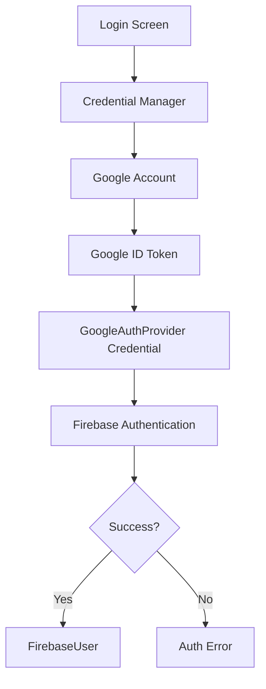
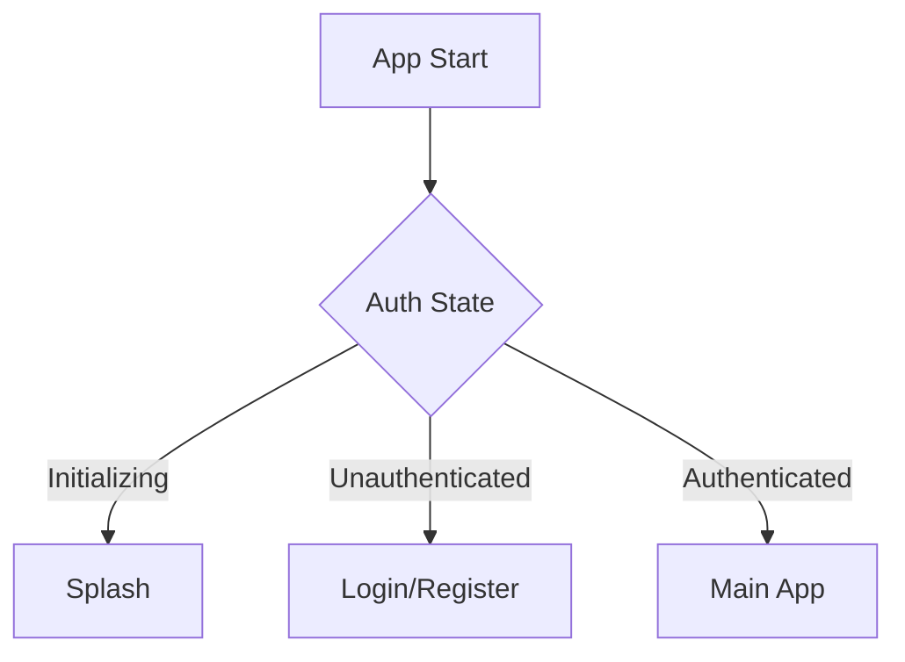
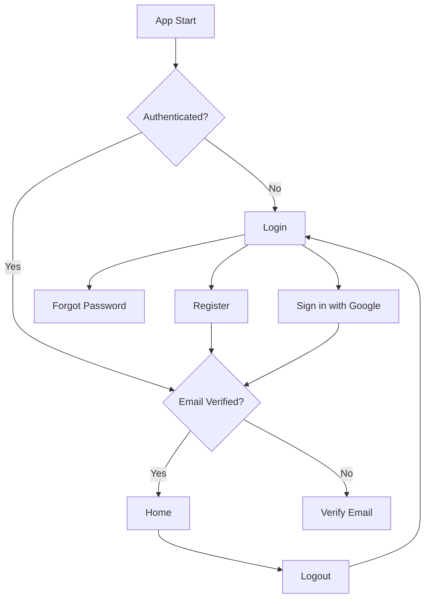

# 002 — Firebase Authentication

| Thuộc tính              | Nội dung                         |
| ----------------------- | -------------------------------- |
| **Học phần**            | 04 — Network, Async and Services |
| **Module**              | Module 09 — Common Services      |
| **Nhóm nội dung**       | Firebase                         |
| **Nguồn roadmap**       | Common Services / Firebase       |
| **Loại bài**            | Service                          |
| **Thứ tự trong module** | 002                              |
| **Thời lượng gợi ý**    | 34 phút                          |

---

## 1. Tóm tắt

**Firebase Authentication** là dịch vụ xác thực người dùng của Firebase. Nó giúp ứng dụng Android triển khai các luồng như:

* Đăng ký bằng email/password.
* Đăng nhập bằng email/password.
* Sign in with Google.
* Đăng nhập ẩn danh.
* Phone Authentication.
* Email link/passwordless.
* Custom Token.
* Đăng xuất.
* Quên mật khẩu.
* Xác minh email.
* Liên kết nhiều phương thức đăng nhập vào cùng một tài khoản.

Ở Android, `FirebaseAuth` là entry point chính của Firebase Authentication và cung cấp các API như `createUserWithEmailAndPassword()`, `signInWithEmailAndPassword()`, `signInWithCredential()`, `signInAnonymously()` và `signInWithCustomToken()`. ([Firebase][1])

Mô hình tổng quát:

```text
┌───────────────────────┐
│      Android App      │
└──────────┬────────────┘
           │
           │ credentials
           ▼
┌───────────────────────┐
│ Firebase Auth SDK     │
└──────────┬────────────┘
           │
           ▼
┌───────────────────────┐
│ Firebase Auth Service │
└──────────┬────────────┘
           │
       ┌───┴────┐
       ▼        ▼
    Success    Error
       │
       ▼
FirebaseUser
       │
       ▼
      UID
```

Điểm quan trọng:

> **Firebase Authentication xác định người dùng là ai, nhưng không tự quyết định người dùng được phép truy cập dữ liệu nào.**

Authorization vẫn phải được thực hiện bằng:

```text
Authentication
      +
Security Rules
      +
Backend authorization
```

---

# 2. Mục tiêu học tập

Sau bài này, anh nên có thể:

* [ ] Giải thích Firebase Authentication bằng ngôn ngữ của mình.
* [ ] Phân biệt Authentication và Authorization.
* [ ] Cấu hình Firebase Authentication trong Android.
* [ ] Đăng ký tài khoản bằng email/password.
* [ ] Đăng nhập bằng email/password.
* [ ] Lấy thông tin `FirebaseUser`.
* [ ] Theo dõi trạng thái đăng nhập.
* [ ] Thiết kế `AuthState` cho Compose.
* [ ] Đăng xuất đúng cách.
* [ ] Gửi email xác minh.
* [ ] Xử lý quên mật khẩu.
* [ ] Hiểu Sign in with Google hiện đại với Credential Manager.
* [ ] Không gọi Firebase trực tiếp từ UI.
* [ ] Chuyển Firebase `Task` thành API phù hợp với Coroutines.
* [ ] Map Firebase exception sang domain error.
* [ ] Test Authentication bằng Firebase Emulator.
* [ ] Thiết kế failure scenario.
* [ ] Nhận biết các vấn đề security, privacy và release.

---

# 3. Authentication là gì?

Authentication trả lời câu hỏi:

> **Người dùng này là ai?**

Ví dụ:

```text
Email:
user@example.com

Password:
********
        │
        ▼
Firebase Authentication
        │
   ┌────┴────┐
   ▼         ▼
Correct    Invalid
   │
   ▼
uid = abc123
```

Firebase sẽ tạo một định danh duy nhất:

```text
uid
```

Ví dụ:

```text
uid = "7Gt3aB91..."
```

UID này thường được dùng làm khóa để liên kết người dùng với dữ liệu của họ:

```text
users/
└── 7Gt3aB91...
    ├── name
    ├── avatar
    └── notes/
```

---

# 4. Authentication ≠ Authorization

Đây là khái niệm quan trọng nhất của bài.

## Authentication

```text
Who are you?
```

Ví dụ:

```text
Firebase Authentication
         ↓
uid = USER_A
```

## Authorization

```text
What can you access?
```

Ví dụ:

```text
USER_A
   │
   ▼
notes/USER_B/private-note
   │
   ▼
Security Rules
   │
   ▼
DENY
```

Có thể hình dung:

```text
Login
  │
  ▼
Authentication
  │
  ▼
"Bạn là USER_A"
  │
  ▼
Authorization
  │
  ▼
"USER_A có quyền đọc tài liệu này không?"
```

---

# 5. Firebase Authentication nằm ở đâu trong Android?

Không nên:

```text
LoginScreen
     │
     ▼
FirebaseAuth
```

UI không nên phụ thuộc trực tiếp Firebase SDK.

Tốt hơn:

```text
┌──────────────────────┐
│   Compose Login UI   │
└──────────┬───────────┘
           │
           ▼
┌──────────────────────┐
│     AuthViewModel    │
└──────────┬───────────┘
           │
           ▼
┌──────────────────────┐
│    AuthRepository    │
└──────────┬───────────┘
           │
           ▼
┌──────────────────────┐
│ FirebaseAuthDataSource│
└──────────┬───────────┘
           │
           ▼
      FirebaseAuth
```

Lợi ích:

* Firebase không lan khắp codebase.
* ViewModel dễ test.
* Có thể dùng `FakeAuthRepository`.
* Dễ thay Firebase bằng backend khác.
* Domain layer không phụ thuộc SDK.

---

# 6. Kiến trúc đề xuất

```text
presentation/
│
├── LoginScreen
├── RegisterScreen
└── AuthViewModel

domain/
│
├── User
├── AuthRepository
├── LoginUseCase
├── RegisterUseCase
└── LogoutUseCase

data/
│
├── FirebaseAuthDataSource
└── FirebaseAuthRepository
```

Sơ đồ:

```text
Compose
   ↓
ViewModel
   ↓
UseCase
   ↓
AuthRepository
   ↓
FirebaseAuthRepository
   ↓
FirebaseAuth
```

---

# 7. Cấu hình Firebase Authentication

Quy trình:

```text
Firebase Console
      ↓
Create/Register Android App
      ↓
google-services.json
      ↓
Add Firebase Auth dependency
      ↓
Authentication
      ↓
Sign-in method
      ↓
Enable provider
```

Theo tài liệu Firebase hiện tại, Firebase khuyến nghị dùng **Firebase Android BoM** để quản lý các phiên bản thư viện Firebase tương thích với nhau. ([Firebase][2])

Ví dụ:

```kotlin
dependencies {
    implementation(
        platform("com.google.firebase:firebase-bom:<current-bom-version>")
    )

    implementation("com.google.firebase:firebase-auth")
}
```

Tài liệu Firebase được cập nhật tháng 8/2026 hiện minh họa BoM `34.17.0`; với project thật, nên kiểm tra phiên bản hiện hành thay vì hard-code theo tutorial cũ. ([Firebase][2])

---

# 8. Bật Authentication Provider

Firebase Console:

```text
Firebase Project
      ↓
Security
      ↓
Authentication
      ↓
Sign-in method
      ↓
Provider
```

Ví dụ:

```text
Email/Password      ENABLED
Google              ENABLED
Phone               DISABLED
Anonymous           DISABLED
```

Nếu provider chưa enable:

```text
Android App
    ↓
signIn(...)
    ↓
Firebase
    ↓
ERROR
```

Firebase yêu cầu provider tương ứng phải được bật trước khi API đăng nhập có thể hoạt động. ([Firebase][2])

---

# 9. FirebaseAuth

Entry point:

```kotlin
val auth = Firebase.auth
```

Hoặc:

```kotlin
val auth = FirebaseAuth.getInstance()
```

Một số API chính:

```text
FirebaseAuth
│
├── currentUser
│
├── createUserWithEmailAndPassword()
├── signInWithEmailAndPassword()
├── signInWithCredential()
├── signInAnonymously()
├── signInWithCustomToken()
├── signOut()
│
├── sendPasswordResetEmail()
│
├── addAuthStateListener()
└── addIdTokenListener()
```

([Firebase][1])

---

# 10. Đăng ký Email + Password

Flow:

```text
RegisterScreen
     │
     ├── email
     └── password
          │
          ▼
     AuthViewModel
          │
          ▼
     Repository
          │
          ▼
createUserWithEmailAndPassword()
          │
      ┌───┴────┐
      ▼        ▼
    Success   Error
      │
      ▼
 FirebaseUser
```

Firebase hỗ trợ tạo tài khoản bằng:

```kotlin
auth.createUserWithEmailAndPassword(
    email,
    password
)
```

Nếu thành công, user mới cũng được đăng nhập ngay. Các lỗi có thể gồm email không hợp lệ, password quá yếu hoặc tài khoản đã tồn tại. ([Firebase][1])

---

# 11. Validate trước khi gửi Firebase

Không nên gửi mọi input lên Firebase rồi mới báo lỗi.

Ví dụ:

```kotlin
fun validate(
    email: String,
    password: String
): Boolean {

    if (email.isBlank()) {
        return false
    }

    if (password.length < 8) {
        return false
    }

    return true
}
```

Flow tốt hơn:

```text
Input
 ↓
Local Validation
 │
 ├── Invalid ──► UI Error
 │
 ▼
Firebase Request
```

---

# 12. Đăng nhập bằng Email + Password

```kotlin
auth.signInWithEmailAndPassword(
    email,
    password
)
```

Flow:

```text
LoginScreen
     │
     ▼
Validation
     │
     ▼
AuthRepository
     │
     ▼
Firebase Auth
     │
 ┌───┴──────┐
 ▼          ▼
Success    Failure
 │          │
 ▼          ▼
Home      Error UI
```

Firebase xác định user đang đăng nhập thông qua `currentUser`. ([Firebase][1])

---

# 13. FirebaseUser

Sau khi đăng nhập:

```kotlin
val user = auth.currentUser
```

Có thể lấy:

```text
FirebaseUser
│
├── uid
├── displayName
├── email
├── photoUrl
├── phoneNumber
├── isEmailVerified
└── providerData
```

Firebase khuyến nghị dùng `currentUser` để lấy user hiện tại; nếu chưa đăng nhập thì giá trị là `null`. Tuy nhiên tài liệu cũng lưu ý rằng trong một số trường hợp token phía dưới có thể không còn hợp lệ dù local `FirebaseUser` vẫn tồn tại, vì vậy authenticated API vẫn có thể thất bại. ([Firebase][3])

---

# 14. Không truyền FirebaseUser khắp app

Không nên để domain layer phụ thuộc:

```text
FirebaseUser
```

Nên convert:

```kotlin
data class AuthUser(
    val id: String,
    val email: String?,
    val displayName: String?,
    val photoUrl: String?,
    val isEmailVerified: Boolean
)
```

Data layer:

```text
FirebaseUser
     ↓
Mapper
     ↓
AuthUser
```

Sau đó:

```text
Firebase SDK
      │
      ▼
Data Layer
      │
      ▼
Domain Model
```

---

# 15. Auth state

Ứng dụng không chỉ có:

```text
Logged In
Logged Out
```

Nên có state rõ ràng:

```kotlin
sealed interface AuthState {

    data object Initializing : AuthState

    data object Unauthenticated : AuthState

    data class Authenticated(
        val user: AuthUser
    ) : AuthState

    data class Error(
        val message: String
    ) : AuthState
}
```

Luồng:

```text
App Start
   │
   ▼
Initializing
   │
   ▼
Check Auth
   │
 ┌─┴────────────┐
 ▼              ▼
User          null
 │              │
 ▼              ▼
Authenticated Unauthenticated
```

---

# 16. `AuthStateListener`

Firebase cung cấp:

```text
FirebaseAuth.AuthStateListener
```

Listener được gọi:

* Ngay sau khi đăng ký listener.
* Khi user đăng nhập.
* Khi user đăng xuất.
* Khi current user thay đổi. ([Firebase][4])

Mô hình:

```text
FirebaseAuth
      │
      │ auth change
      ▼
AuthStateListener
      │
      ▼
Repository
      │
      ▼
ViewModel
      │
      ▼
Compose
```

---

# 17. Auth state dưới dạng Flow

Trong kiến trúc Coroutine/Flow:

```kotlin
fun observeAuthState(): Flow<AuthUser?>
```

Có thể wrap listener:

```kotlin
callbackFlow {

    val listener =
        FirebaseAuth.AuthStateListener { auth ->

            val user = auth.currentUser

            trySend(
                user?.toDomain()
            )
        }

    auth.addAuthStateListener(listener)

    awaitClose {
        auth.removeAuthStateListener(listener)
    }
}
```

Điểm quan trọng:

```text
register listener
       ↓
collect Flow
       ↓
collector cancelled
       ↓
awaitClose
       ↓
remove listener
```

Nếu không remove listener:

```text
listener leak
      +
duplicate callbacks
```

---

# 18. Lifecycle trong Compose

Không nên:

```kotlin
@Composable
fun LoginScreen() {

    FirebaseAuth.getInstance()
        .addAuthStateListener {
            ...
        }
}
```

Composable có thể recompose nhiều lần:

```text
Composition
    ↓
Listener #1

Recomposition
    ↓
Listener #2

Recomposition
    ↓
Listener #3
```

Tốt hơn:

```text
Firebase listener
       ↓
Repository
       ↓
ViewModel
       ↓
StateFlow
       ↓
collectAsStateWithLifecycle()
       ↓
Compose
```

---

# 19. Login UI State

Auth state và login form state nên phân biệt.

Ví dụ:

```kotlin
data class LoginUiState(
    val email: String = "",
    val password: String = "",
    val isLoading: Boolean = false,
    val error: String? = null
)
```

Luồng:

```text
Idle
 │
 ▼
User taps Login
 │
 ▼
Loading
 │
 ├───────────────┐
 ▼               ▼
Success         Error
 │               │
 ▼               ▼
Navigate      Show message
```

---

# 20. Không cho submit nhiều lần

Nếu user bấm:

```text
LOGIN
LOGIN
LOGIN
LOGIN
```

có thể tạo nhiều request.

Nên:

```text
isLoading = true
       ↓
disable button
       ↓
auth request
       ↓
success/error
       ↓
isLoading = false
```

Ví dụ:

```kotlin
Button(
    enabled = !state.isLoading,
    onClick = viewModel::login
) {
    Text("Đăng nhập")
}
```

---

# 21. Error handling

Không nên:

```kotlin
errorMessage = exception.message
```

vì user có thể nhận những lỗi kiểu:

```text
FirebaseAuthInvalidCredentialsException
```

Nên map:

```text
Firebase Exception
        ↓
Domain Error
        ↓
Localized UI Message
```

---

# 22. Domain errors

Ví dụ:

```kotlin
sealed interface AuthError {

    data object InvalidEmail : AuthError

    data object WrongCredentials : AuthError

    data object EmailAlreadyUsed : AuthError

    data object WeakPassword : AuthError

    data object UserDisabled : AuthError

    data object Network : AuthError

    data object TooManyRequests : AuthError

    data object Unknown : AuthError
}
```

UI:

```text
WeakPassword
      ↓
"Mật khẩu chưa đủ mạnh."

Network
      ↓
"Không thể kết nối. Hãy thử lại."

WrongCredentials
      ↓
"Thông tin đăng nhập không hợp lệ."
```

---

# 23. Không tiết lộ quá nhiều thông tin đăng nhập

Một app không nhất thiết phải nói:

```text
Email này tồn tại nhưng password sai.
```

Trong một số hệ thống, thông báo quá chi tiết có thể hỗ trợ:

```text
Account Enumeration
```

Một thông báo an toàn hơn có thể là:

```text
"Email hoặc mật khẩu không chính xác."
```

Thay vì:

```text
"Email tồn tại nhưng mật khẩu sai."
```

---

# 24. Đăng xuất

Firebase:

```kotlin
auth.signOut()
```

Luồng:

```text
Settings
   │
   ▼
Logout
   │
   ▼
AuthRepository
   │
   ▼
FirebaseAuth.signOut()
   │
   ▼
AuthStateListener
   │
   ▼
Unauthenticated
   │
   ▼
LoginScreen
```

Không nên chỉ:

```text
navigate(LoginScreen)
```

mà không sign out Firebase.

---

# 25. Email verification

Sau khi đăng ký:

```text
Register
   ↓
Firebase User
   ↓
Send verification email
   ↓
User opens email
   ↓
Verification
   ↓
isEmailVerified = true
```

Có thể dùng:

```kotlin
auth.currentUser
    ?.sendEmailVerification()
```

Firebase hỗ trợ gửi email xác minh và các email quản lý tài khoản từ `FirebaseUser`. ([Firebase][3])

---

# 26. `isEmailVerified`

Ví dụ policy:

```text
User authenticated?
      │
      ▼
YES
      │
      ▼
Email verified?
   ┌──┴───┐
   ▼      ▼
  YES     NO
   │      │
   ▼      ▼
Home   VerifyEmailScreen
```

Authentication không có nghĩa:

```text
email ownership đã được xác nhận
```

Nếu feature yêu cầu email thật:

```text
Authentication
      +
Email Verification
```

---

# 27. Quên mật khẩu

Firebase hỗ trợ:

```kotlin
auth.sendPasswordResetEmail(email)
```

Flow:

```text
Forgot Password
       │
       ▼
Enter Email
       │
       ▼
Firebase Auth
       │
       ▼
Reset Email
       │
       ▼
User changes password
```

Firebase cho phép tùy chỉnh email template trong Authentication settings và hỗ trợ localization cho password-reset email. ([Firebase][3])

---

# 28. Re-authentication

Một số thao tác nhạy cảm yêu cầu user vừa mới đăng nhập.

Ví dụ:

```text
Change password
Change email
Delete account
```

Mô hình:

```text
Sensitive operation
       │
       ▼
Recent login?
    ┌──┴──┐
    ▼     ▼
   Yes    No
    │      │
    ▼      ▼
Execute Re-authenticate
            │
            ▼
          Execute
```

Đây là một lớp bảo vệ khi session của user đã tồn tại quá lâu.

---

# 29. Sign in with Google trên Android hiện đại

Với Android hiện nay, Firebase hướng dẫn tích hợp **Sign in with Google thông qua Credential Manager**, thay vì xây implementation mới dựa trên legacy Google Sign-In API. ([Firebase][5])

Flow:

```text
Android
   │
   ▼
Credential Manager
   │
   ▼
Google Account
   │
   ▼
Google ID Token
   │
   ▼
GoogleAuthProvider
   │
   ▼
Firebase Credential
   │
   ▼
FirebaseAuth
   │
   ▼
FirebaseUser
```

---

# 30. Google Authentication flow



Firebase yêu cầu Google provider được bật và Android app được cấu hình SHA certificate fingerprint cho Google sign-in. ([Firebase][5])

---

# 31. Credential Manager

Android Credential Manager cung cấp một API chung cho các phương thức xác thực như:

```text
Passwords
Passkeys
Sign in with Google
```

Android hiện khuyến nghị Credential Manager cho trải nghiệm Sign in with Google hiện đại. ([Android Developers][6])

Kiến trúc:

```text
App
 ↓
Credential Manager
 ├── Password
 ├── Passkey
 └── Google
```

---

# 32. Google ID Token → Firebase

Sau khi lấy Google ID Token:

```kotlin
val firebaseCredential =
    GoogleAuthProvider.getCredential(
        idToken,
        null
    )
```

Sau đó:

```kotlin
auth.signInWithCredential(
    firebaseCredential
)
```

`GoogleAuthProvider.getCredential()` tạo Firebase `AuthCredential` từ Google token, sau đó `signInWithCredential()` dùng credential này để xác thực với Firebase. ([Firebase][7])

---

# 33. Google Sign-out có thêm một bước

Với Credential Manager, Firebase hướng dẫn khi logout nên:

```text
Firebase signOut
       +
Clear Credential Manager state
```

Firebase hiện minh họa sử dụng:

```kotlin
auth.signOut()

credentialManager.clearCredentialState(
    ClearCredentialStateRequest()
)
```

để reset credential state ở các provider khi user logout. ([Firebase][5])

---

# 34. Anonymous Authentication

Firebase cũng hỗ trợ:

```kotlin
auth.signInAnonymously()
```

Use case:

```text
Open app
   ↓
Anonymous user
   ↓
Try feature
   ↓
Create data
   ↓
Later register
   ↓
Link account
```

Ví dụ:

```text
Guest Shopping Cart
Guest Game Progress
Guest Notes
```

---

# 35. Không tạo hai account khi nâng cấp Guest

Sai:

```text
Anonymous User
      │
      ▼
Create Google Account
      │
      ▼
New UID
```

Nếu dữ liệu Guest được gắn với UID cũ thì có thể mất liên kết.

Tốt hơn:

```text
Anonymous User
      │
      ▼
Link Credential
      │
      ▼
Same Account
      │
      ▼
Same UID / existing data
```

Đây gọi là:

```text
Account Linking
```

---

# 36. Multiple Providers

Một user có thể đăng nhập bằng nhiều provider:

```text
User
│
├── Email/Password
├── Google
└── Other Provider
```

Nên liên kết credential vào cùng account thay vì vô tình tạo nhiều identity tách biệt.

Firebase hỗ trợ liên kết nhiều authentication provider với cùng một account. ([Firebase][5])

---

# 37. UID không phải profile database

Firebase Authentication chỉ giữ profile cơ bản.

Ví dụ:

```text
FirebaseUser
├── uid
├── email
├── displayName
└── photoUrl
```

Nếu app có:

```text
birthday
theme
subscription
settings
bio
role
preferences
```

thường sẽ nằm trong database riêng:

```text
Firestore

users/
└── uid
    ├── name
    ├── plan
    ├── settings
    └── createdAt
```

---

# 38. Firebase Auth + Firestore

Flow thường gặp:

```text
Firebase Authentication
          │
          ▼
      authenticated
          │
          ▼
        UID
          │
          ▼
Firestore Security Rules
          │
          ▼
users/{uid}
```

Ví dụ:

```text
users/
├── USER_A
│   └── notes
│
└── USER_B
    └── notes
```

Rule:

```javascript
match /users/{userId} {

    allow read, write:
        if request.auth != null
        && request.auth.uid == userId;
}
```

---

# 39. Authentication token

Sau login, Firebase quản lý token xác thực cho client.

Khái niệm:

```text
Login
 ↓
Firebase Authentication
 ↓
ID Token
 ↓
Authenticated Firebase Requests
```

Thông thường Android developer:

> Không nên tự lưu password hoặc tự xây token persistence xung quanh Firebase nếu không thực sự cần.

Firebase SDK đảm nhiệm phần lớn lifecycle xác thực.

---

# 40. Không lưu password

Tuyệt đối không:

```kotlin
sharedPreferences.edit()
    .putString("password", password)
    .apply()
```

Không nên lưu password vào:

```text
SharedPreferences
Room
File
Logs
Analytics
Crash logs
```

Flow đúng:

```text
Password
   │
   ▼
Firebase Auth
   │
   ▼
Auth Session
```

---

# 41. Không log credential

Sai:

```kotlin
Log.d(
    "AUTH",
    "email=$email password=$password"
)
```

Không log:

* Password.
* Access token.
* ID token.
* Refresh token.
* Reset link.
* OTP.
* Sensitive auth credential.

---

# 42. Rotation

Giả sử login đang chạy:

```text
LoginScreen
   ↓
Request
   ↓
Rotate
```

Nếu logic nằm trong Activity/Composable:

```text
Screen recreated
      ↓
logic/state dễ rối
```

Nếu nằm trong ViewModel:

```text
LoginScreen
    ↓
ViewModel
    ↓
Repository
```

Rotate:

```text
Composable recreated
        ↓
ViewModel survives
        ↓
StateFlow vẫn giữ UI state
```

---

# 43. App background

Một số authentication flow có thể mở:

```text
Browser
Google Account UI
Email
```

App có thể:

```text
foreground
   ↓
background
   ↓
foreground
```

Do đó không nên giả định:

```text
Login flow
=
một function synchronous
```

Auth state phải là nguồn sự thật ổn định hơn navigation event.

---

# 44. Single source of truth cho authentication

Không nên duy trì:

```text
Firebase says: Logged In

SharedPreferences says: Logged Out

ViewModel says: Logged In

Navigation says: Login screen
```

Nên:

```text
Firebase Auth State
       ↓
Repository
       ↓
StateFlow<AuthState>
       ↓
Application Navigation
```

---

# 45. Root navigation

Một cách thiết kế:

```text
App
 │
 ▼
AuthState
 │
 ├── Initializing
 │      ↓
 │   Splash
 │
 ├── Unauthenticated
 │      ↓
 │   AuthGraph
 │
 └── Authenticated
        ↓
     MainGraph
```

Sơ đồ:



---

# 46. Repository interface

Domain layer:

```kotlin
interface AuthRepository {

    val authState: Flow<AuthUser?>

    suspend fun register(
        email: String,
        password: String
    ): Result<AuthUser>

    suspend fun login(
        email: String,
        password: String
    ): Result<AuthUser>

    suspend fun logout()

    suspend fun sendPasswordReset(
        email: String
    )

    suspend fun sendVerificationEmail()
}
```

Điểm quan trọng:

```text
Không có FirebaseAuth
Không có FirebaseUser
Không có Task<AuthResult>
```

trong interface domain.

---

# 47. Firebase implementation

```text
AuthRepository
      ▲
      │
      │ implements
      │
FirebaseAuthRepository
      │
      ▼
FirebaseAuth
```

Sau này có thể:

```text
AuthRepository
      ▲
      │
 ┌────┴─────────┐
 │              │
FirebaseAuth   CustomBackendAuth
```

---

# 48. ViewModel

Ví dụ tư duy:

```kotlin
class LoginViewModel(
    private val authRepository: AuthRepository
) : ViewModel() {

    private val _state =
        MutableStateFlow(LoginUiState())

    val state = _state.asStateFlow()

    fun login() {
        // validate
        // loading
        // repository.login()
        // map result
    }
}
```

ViewModel không cần biết:

```text
Google?
Firebase?
REST?
OAuth?
```

Nó chỉ cần:

```text
AuthRepository
```

---

# 49. Side effect Navigation

Không nên gắn navigation sâu trong repository:

```text
Repository
   ↓
NavController.navigate()
```

Repository không nên biết UI.

Tốt hơn:

```text
Firebase
   ↓
Repository
   ↓
ViewModel
   ↓
AuthState
   ↓
UI / Navigation
```

---

# 50. Firebase Authentication Emulator

Firebase Local Emulator Suite có **Authentication Emulator** cho phép test authentication mà không sử dụng project thật. Firebase khuyến nghị Emulator Suite cho prototype, integration với Rules và automated testing. ([Firebase][2])

Kiến trúc:

```text
Android Test App
       │
       ▼
Firebase Auth SDK
       │
       ▼
Auth Emulator
       │
       ├── Fake Users
       ├── Fake Login
       └── Local State
```

---

# 51. Kết nối Emulator

Trong development/test:

```text
FirebaseAuth
     ↓
useEmulator(...)
     ↓
localhost:9099
```

Default Auth Emulator thường sử dụng port:

```text
9099
```

Firebase Emulator REST API cũng sử dụng port mặc định này nếu không được cấu hình lại. ([Firebase][8])

---

# 52. Tại sao Emulator quan trọng?

Không nên test:

```text
Register Test
      ↓
Production Firebase
      ↓
500 fake users
```

Tốt hơn:

```text
Test
 ↓
Auth Emulator
 ↓
Create fake users
 ↓
Assertions
 ↓
Reset
```

---

# 53. Test cases

Một Auth module tốt nên có:

| Test                         | Kỳ vọng                      |
| ---------------------------- | ---------------------------- |
| Email hợp lệ + password đúng | Login thành công             |
| Email sai format             | Validation error             |
| Password rỗng                | Validation error             |
| Credentials sai              | Auth error                   |
| Network error                | Network state                |
| User disabled                | Account unavailable          |
| Register email trùng         | Error                        |
| Password yếu                 | Error                        |
| Logout                       | Auth state → unauthenticated |
| User đã login                | App mở Main flow             |
| User chưa login              | App mở Auth flow             |
| Password reset               | Request được gửi             |

---

# 54. FakeRepository cho Unit Test

```kotlin
class FakeAuthRepository : AuthRepository {

    var loginShouldFail = false

    override suspend fun login(
        email: String,
        password: String
    ): Result<AuthUser> {

        return if (loginShouldFail) {
            Result.failure(Exception())
        } else {
            Result.success(fakeUser)
        }
    }
}
```

Sau đó test ViewModel:

```text
Given
 loginShouldFail = false

When
 login()

Then
 state = Success
```

Firebase thật không cần xuất hiện trong unit test này.

---

# 55. Failure scenario bắt buộc

Mini project nên có ít nhất một luồng lỗi.

Ví dụ:

```text
Disable Internet
      ↓
Tap Login
      ↓
Repository
      ↓
Firebase failure
      ↓
AuthError.Network
      ↓
UiState.Error
      ↓
"Không thể kết nối mạng"
      ↓
Retry
```

---

# 56. Disabled account scenario

Một scenario production khác:

```text
User previously logged in
        ↓
Account disabled remotely
        ↓
Authenticated request
        ↓
Failure
        ↓
Clear protected state
        ↓
Return to Login
```

Không nên giả định:

```text
currentUser != null
```

luôn đồng nghĩa account vẫn hợp lệ.

Firebase tài liệu lưu ý local `currentUser` có thể tồn tại trong một số edge case trong khi token phía dưới đã không còn hợp lệ. ([Firebase][3])

---

# 57. Splash/Auth initialization

Sai:

```text
App Start
 ↓
currentUser == null
 ↓
Login

5 ms later
 ↓
Auth SDK initialized
 ↓
User actually exists
```

Tốt hơn:

```text
App Start
 ↓
Initializing
 ↓
Resolve Auth State
 ↓
Authenticated / Unauthenticated
```

Firebase cũng lưu ý `currentUser` có thể tạm thời là `null` khi auth object chưa hoàn thành initialization; AuthStateListener giúp xử lý auth-state transitions rõ hơn. ([Firebase][3])

---

# 58. Privacy

Authentication có thể liên quan đến:

```text
Email
Phone number
Google account
Display name
Avatar
UID
Device/account metadata
```

Trước production cần xác định:

```text
Thu thập gì?
      ↓
Tại sao cần?
      ↓
Lưu ở đâu?
      ↓
Bao lâu?
      ↓
Ai truy cập?
      ↓
User xóa account thế nào?
```

---

# 59. Delete Account không chỉ là `user.delete()`

Trong app thực tế:

```text
Delete Account
      │
      ├── Firebase Auth account
      ├── Firestore profile
      ├── User documents
      ├── Cloud Storage
      ├── Notification token mapping
      └── Other backend data
```

Nếu chỉ delete Authentication account:

```text
Auth user deleted
      ↓
Firestore data remains
      ↓
orphaned data
```

Cần có data deletion strategy.

---

# 60. Sign-out không nhất thiết xóa local data

Cần quyết định:

```text
Logout
  │
  ├── Keep public cache?
  ├── Delete private Room DB?
  ├── Delete tokens?
  ├── Clear image cache?
  └── Reset ViewModels?
```

Ví dụ app tài chính:

```text
Logout
 ↓
Clear sensitive local data
```

App tin tức:

```text
Logout
 ↓
Có thể giữ public cache
```

Đây là quyết định product/security.

---

# 61. Authentication và Security Rules

Firebase Auth:

```text
request.auth.uid
```

có thể được dùng trong Security Rules.

Ví dụ:

```javascript
match /users/{userId} {

    allow read, write:
        if request.auth != null
        && request.auth.uid == userId;
}
```

Flow:

```text
Android user login
       ↓
Firebase Authentication
       ↓
UID
       ↓
Authenticated Firestore Request
       ↓
Security Rules
       ↓
Compare request.auth.uid
```

---

# 62. Role-based access

Authentication không nên tự suy luận role từ UI.

Sai:

```text
Button "Admin"
không hiển thị
      ↓
"User không thể admin"
```

Không đúng.

Authorization phải nằm server/rules:

```text
User
 ↓
Authenticated UID
 ↓
Role / Claims
 ↓
Security Rules / Backend
 ↓
ALLOW / DENY
```

UI chỉ phản ánh quyền, không phải nơi bảo vệ quyền.

---

# 63. Common mistakes

| Sai lầm                                | Hậu quả                          |
| -------------------------------------- | -------------------------------- |
| Gọi Firebase trong Composable          | Lifecycle khó kiểm soát          |
| Không có Repository                    | Vendor coupling                  |
| Lưu password                           | Security risk                    |
| Log ID token                           | Credential leak                  |
| Chỉ check `currentUser` một lần        | Auth state dễ lệch               |
| Không có loading state                 | User spam login                  |
| Hiển thị raw exception                 | UX xấu, lộ chi tiết              |
| Không verify email khi cần             | Account ownership chưa chắc chắn |
| Logout chỉ navigate                    | Session Firebase vẫn còn         |
| Test bằng production                   | Fake account/dữ liệu rác         |
| Không xử lý account disabled           | App state sai                    |
| Không test rotate/background           | Lifecycle bug                    |
| Dùng legacy Google Sign-In tutorial    | Integration lỗi thời             |
| Không clear Credential Manager khi cần | Logout UX không nhất quán        |
| Dùng UID như secret                    | Sai mô hình bảo mật              |

---

# 64. Mini project thực hành

## Firebase Auth Demo

Xây dựng:

```text
Splash
  │
  ▼
Auth Check
  │
 ┌┴─────────────┐
 ▼              ▼
Logged Out    Logged In
 │              │
 ▼              ▼
Login          Home
 │
 ├── Register
 ├── Google
 └── Forgot Password
```

---

# 65. Các màn hình

```text
Auth Demo
│
├── SplashScreen
│
├── LoginScreen
│
├── RegisterScreen
│
├── ForgotPasswordScreen
│
├── VerifyEmailScreen
│
└── HomeScreen
```

---

# 66. Luồng tổng thể



---

# 67. Cấu trúc project đề xuất

```text
app/
│
├── data/
│   └── auth/
│       ├── FirebaseAuthDataSource.kt
│       ├── FirebaseAuthRepository.kt
│       └── FirebaseUserMapper.kt
│
├── domain/
│   └── auth/
│       ├── AuthUser.kt
│       ├── AuthError.kt
│       ├── AuthRepository.kt
│       ├── LoginUseCase.kt
│       ├── RegisterUseCase.kt
│       └── LogoutUseCase.kt
│
└── presentation/
    │
    └── auth/
        ├── LoginScreen.kt
        ├── RegisterScreen.kt
        ├── ForgotPasswordScreen.kt
        ├── AuthViewModel.kt
        └── AuthUiState.kt
```

---

# 68. Artifact cho portfolio

Một Firebase Auth project portfolio nên có:

```text
firebase-auth-demo/
│
├── README.md
│
├── architecture/
│   └── auth-flow.png
│
├── screenshots/
│   ├── login.png
│   ├── register.png
│   ├── verification.png
│   └── auth-error.png
│
└── app/
```

README nên có:

```text
Project Goal
      ↓
Architecture
      ↓
Authentication Providers
      ↓
Auth State
      ↓
Security
      ↓
Error Handling
      ↓
Lifecycle
      ↓
Testing
      ↓
Screenshots
```

---

# 69. Nội dung README mẫu

Có thể mô tả:

```text
Authentication:
- Email/password
- Sign in with Google

Architecture:
- MVVM
- Repository
- Coroutines
- StateFlow

Security:
- Password không được lưu local
- Firebase Security Rules dựa trên UID
- Raw token không được log

Testing:
- FakeAuthRepository
- Firebase Authentication Emulator

Failure scenarios:
- Invalid credentials
- Offline login
- Disabled account
```

---

# 70. Debug checklist

Khi Firebase Authentication không hoạt động:

```text
Auth Error
   │
   ▼
Firebase project đúng?
   │
   ▼
google-services.json đúng?
   │
   ▼
applicationId đúng?
   │
   ▼
Firebase Auth dependency?
   │
   ▼
Provider enabled?
   │
   ▼
Internet?
   │
   ▼
Credentials hợp lệ?
   │
   ▼
SHA configured? (Google)
   │
   ▼
OAuth client đúng?
   │
   ▼
Credential Manager config?
   │
   ▼
Firebase logs / exception?
```

---

# 71. Google Sign-In debug checklist

Đặc biệt kiểm tra:

* [ ] Google provider đã enable.
* [ ] SHA-1/SHA certificate fingerprint đã thêm.
* [ ] `google-services.json` đã cập nhật sau khi cấu hình OAuth nếu cần.
* [ ] Credential Manager dependencies đã thêm.
* [ ] Server/Web client ID đúng.
* [ ] Không nhầm Android client ID với server client ID.
* [ ] ID Token được parse đúng.
* [ ] Google credential được đổi sang Firebase credential.
* [ ] `signInWithCredential()` thành công.

Firebase hiện hướng dẫn `GetGoogleIdOption` sử dụng **server/Web client ID**, không phải Android client ID. ([Firebase][5])

---

# 72. Release checklist

## Configuration

* [ ] Firebase production project đúng.
* [ ] Application ID đúng.
* [ ] Authentication providers đúng.
* [ ] SHA certificate của release build đã cấu hình.
* [ ] OAuth configuration đúng.
* [ ] `google-services.json` đúng environment.

## UX

* [ ] Login có loading state.
* [ ] Button bị disable khi request đang chạy.
* [ ] Có error message dễ hiểu.
* [ ] Có forgot password.
* [ ] Email verification được xử lý nếu cần.
* [ ] Logout hoạt động.
* [ ] App start resolve auth state ổn định.

## Lifecycle

* [ ] Rotate không mất auth operation state.
* [ ] Listener không bị duplicate.
* [ ] Listener được unregister.
* [ ] Background/foreground không làm sai navigation.
* [ ] Credential flow phục hồi được sau lifecycle transition.

## Security

* [ ] Không lưu password.
* [ ] Không log credential/token.
* [ ] UID không được coi là secret.
* [ ] Security Rules kiểm tra auth.
* [ ] Sensitive operation có re-authentication nếu cần.
* [ ] User deletion xử lý cả dữ liệu liên quan.

## Testing

* [ ] Unit test ViewModel.
* [ ] Fake repository.
* [ ] Auth Emulator.
* [ ] Wrong credentials test.
* [ ] Network failure test.
* [ ] Logout test.
* [ ] Account disabled scenario.

## Privacy

* [ ] Privacy policy phản ánh authentication providers.
* [ ] Xác định dữ liệu account được thu thập.
* [ ] Có account deletion strategy.
* [ ] Không gửi credential vào Analytics/Crashlytics.

---

# 73. Bài tập chính

## Firebase Authentication App

Xây app:

```text
Register
   ↓
Verify Email
   ↓
Login
   ↓
Home
   ↓
Logout
```

### Yêu cầu

* [ ] Email/password registration.
* [ ] Email/password login.
* [ ] Auth state observer.
* [ ] Forgot password.
* [ ] Email verification.
* [ ] Logout.
* [ ] Repository.
* [ ] ViewModel.
* [ ] StateFlow.
* [ ] Loading/error states.
* [ ] Một network failure scenario.
* [ ] Unit test.
* [ ] Emulator test.
* [ ] Screenshot.
* [ ] README.
* [ ] Architecture diagram.

---

# 74. Bài tập nâng cao

Thêm:

```text
Firebase Auth Demo
│
├── Email/Password
├── Google
├── Anonymous
├── Link Account
├── Forgot Password
├── Email Verification
└── Delete Account
```

Sau đó giải thích:

1. Authentication nằm ở layer nào?
2. `FirebaseUser` có đi vào domain layer không?
3. Auth state được lưu ở đâu?
4. User logout thì navigation thay đổi thế nào?
5. Rotate có ảnh hưởng request không?
6. Network lỗi xử lý ở đâu?
7. Password có được lưu local không?
8. Google login dùng Credential Manager hay API legacy?
9. UID được dùng như thế nào với Firestore Rules?
10. Account deletion có xóa Firestore data không?
11. Unit test có cần Firebase thật không?
12. Integration test dùng project production hay Emulator?

---

# 75. Ghi nhớ nhanh

```text
Firebase Authentication
│
├── Email / Password
├── Google
├── Phone
├── Anonymous
├── Email Link
└── Custom Auth
```

Sau login:

```text
Credentials
    ↓
Firebase Auth
    ↓
FirebaseUser
    ↓
UID
    ↓
Security Rules
    ↓
User Data
```

Trong Android:

```text
Compose
   ↓
ViewModel
   ↓
AuthRepository
   ↓
FirebaseAuth
```

State:

```text
Initializing
      │
      ├── Authenticated
      │
      └── Unauthenticated
```

Security:

```text
Authentication
      ≠
Authorization
```

---

# 76. Checklist hoàn thành bài

## Kiến thức

* [ ] Giải thích được Firebase Authentication.
* [ ] Phân biệt Authentication và Authorization.
* [ ] Hiểu UID là gì.
* [ ] Hiểu `FirebaseUser`.
* [ ] Hiểu Authentication Provider.
* [ ] Hiểu Auth State.

## Android

* [ ] Biết thêm Firebase Auth dependency.
* [ ] Biết enable provider.
* [ ] Biết register.
* [ ] Biết login.
* [ ] Biết logout.
* [ ] Biết `currentUser`.
* [ ] Biết `AuthStateListener`.
* [ ] Auth logic nằm sau Repository.
* [ ] Compose chỉ quan sát state.

## Modern Android

* [ ] Biết Sign in with Google hiện dùng Credential Manager cho implementation mới. ([Firebase][5])
* [ ] Hiểu Google ID Token → Firebase Credential.
* [ ] Biết cấu hình SHA certificate.
* [ ] Biết xử lý Credential Manager state khi logout.

## State & Lifecycle

* [ ] Có `Initializing`.
* [ ] Có `Authenticated`.
* [ ] Có `Unauthenticated`.
* [ ] Có Loading/Error.
* [ ] Rotate không tạo listener mới liên tục.
* [ ] Listener được unregister.
* [ ] Navigation phụ thuộc Auth State.

## Security

* [ ] Không lưu password.
* [ ] Không log token.
* [ ] UID không được coi là secret.
* [ ] Firestore Rules kiểm tra `request.auth.uid`.
* [ ] Sensitive operation được bảo vệ.
* [ ] Có email verification nếu domain yêu cầu.

## Testing

* [ ] Có FakeAuthRepository.
* [ ] Có ViewModel test.
* [ ] Biết Firebase Authentication Emulator.
* [ ] Có invalid credentials scenario.
* [ ] Có network failure scenario.
* [ ] Có logout test.

## Portfolio

* [ ] Có app demo.
* [ ] Có screenshot.
* [ ] Có architecture diagram.
* [ ] Có README.
* [ ] Có failure-state screenshot/test.
* [ ] Có giải thích security và privacy.

---

# 77. Kết luận

Firebase Authentication không chỉ là:

```kotlin
auth.signInWithEmailAndPassword(
    email,
    password
)
```

Một implementation tốt phải xem authentication là một **stateful subsystem** của ứng dụng:

```text
                    ┌─────────────────┐
                    │      UI         │
                    └────────┬────────┘
                             │
                             ▼
                    ┌─────────────────┐
                    │    ViewModel    │
                    └────────┬────────┘
                             │
                             ▼
                    ┌─────────────────┐
                    │ Auth Repository │
                    └────────┬────────┘
                             │
                             ▼
                    ┌─────────────────┐
                    │ Firebase Auth   │
                    └────────┬────────┘
                             │
             ┌───────────────┼───────────────┐
             ▼               ▼               ▼
         Email/Auth        Google          Anonymous
                             │
                             ▼
                    Credential Manager
```

Sau khi xác thực:

```text
Firebase Authentication
          ↓
         UID
          ↓
    Security Rules
          ↓
      User Data
```

Vì vậy, mục tiêu của bài không phải chỉ là **“làm được màn hình Login”** mà là xây được một authentication flow:

**an toàn → lifecycle-aware → state-driven → testable → maintainable → production-ready.**

[1]: https://firebase.google.com/docs/reference/android/com/google/firebase/auth/FirebaseAuth?utm_source=chatgpt.com "FirebaseAuth  |  Firebase SDKs for Android"
[2]: https://firebase.google.com/docs/auth/android/start?utm_source=chatgpt.com "Get Started with Firebase Authentication on Android"
[3]: https://firebase.google.com/docs/auth/android/manage-users?utm_source=chatgpt.com "Manage Users in Firebase  |  Firebase Authentication"
[4]: https://firebase.google.com/docs/reference/android/com/google/firebase/auth/FirebaseAuth.AuthStateListener?utm_source=chatgpt.com "FirebaseAuth.AuthStateListener  |  Firebase SDKs for Android"
[5]: https://firebase.google.com/docs/auth/android/google-signin?hl=en&utm_source=chatgpt.com "Authenticate with Google on Android  |  Firebase Authentication"
[6]: https://developer.android.com/identity/sign-in/credential-manager-siwg?utm_source=chatgpt.com "About Sign in with Google  |  Identity  |  Android Developers"
[7]: https://firebase.google.com/docs/reference/android/com/google/firebase/auth/GoogleAuthProvider?utm_source=chatgpt.com "GoogleAuthProvider  |  Firebase SDKs for Android"
[8]: https://firebase.google.com/docs/reference/rest/auth?utm_source=chatgpt.com "Firebase Auth REST API"

---

# Bài luyện tập

## Mục tiêu


## Đề bài


## Yêu cầu hoàn thành

- [ ] 
- [ ] 
- [ ] 

## Kết quả / lời giải


## Ghi chú
