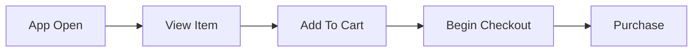
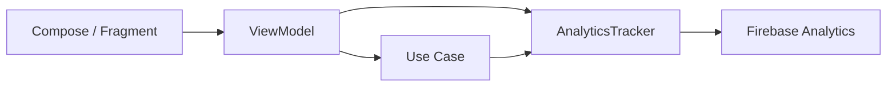
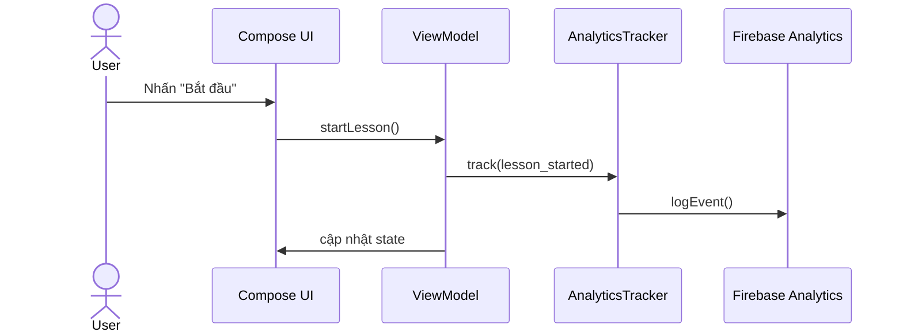
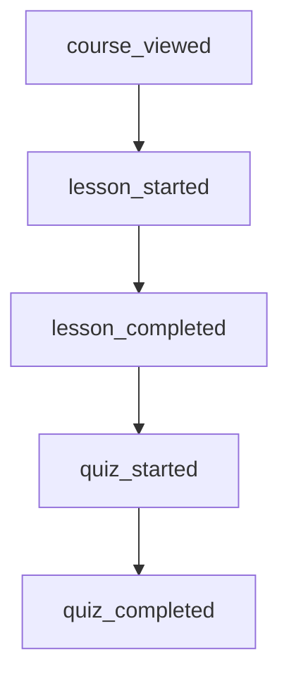
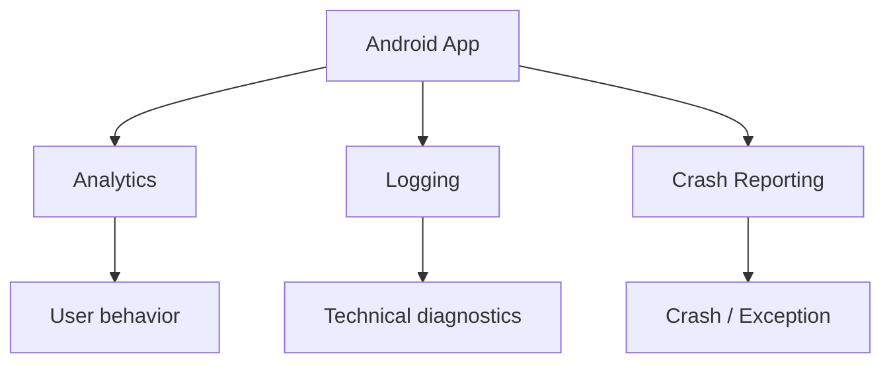
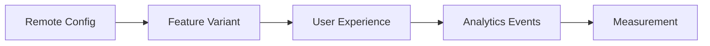
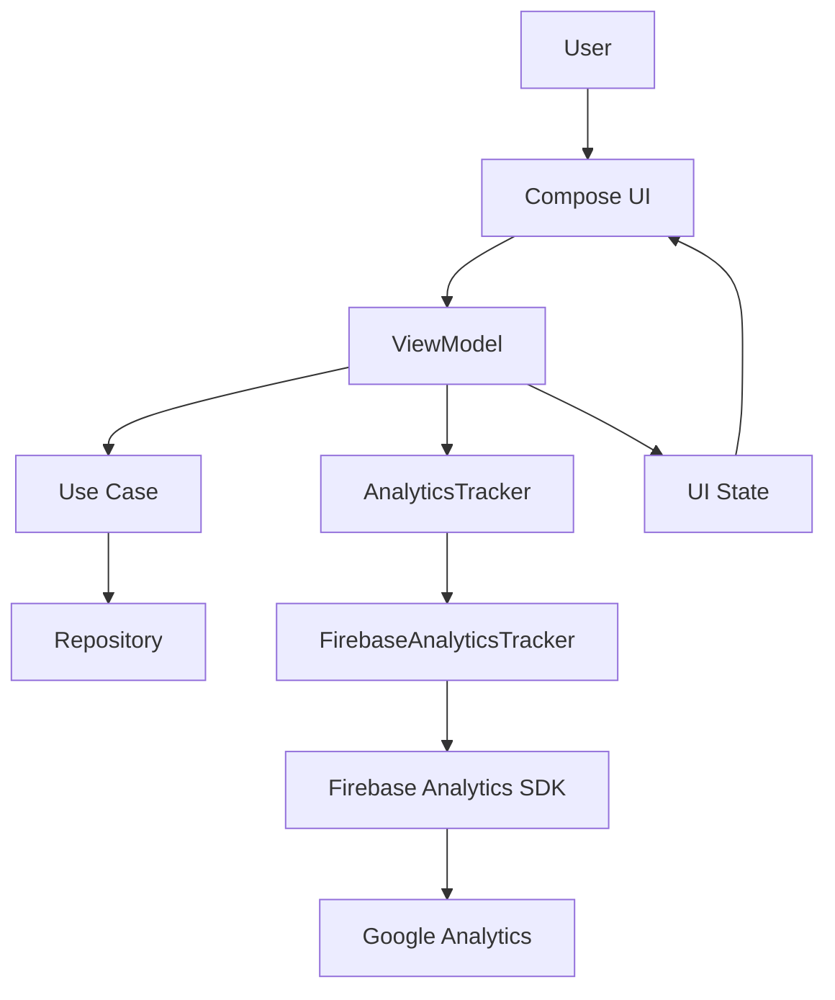
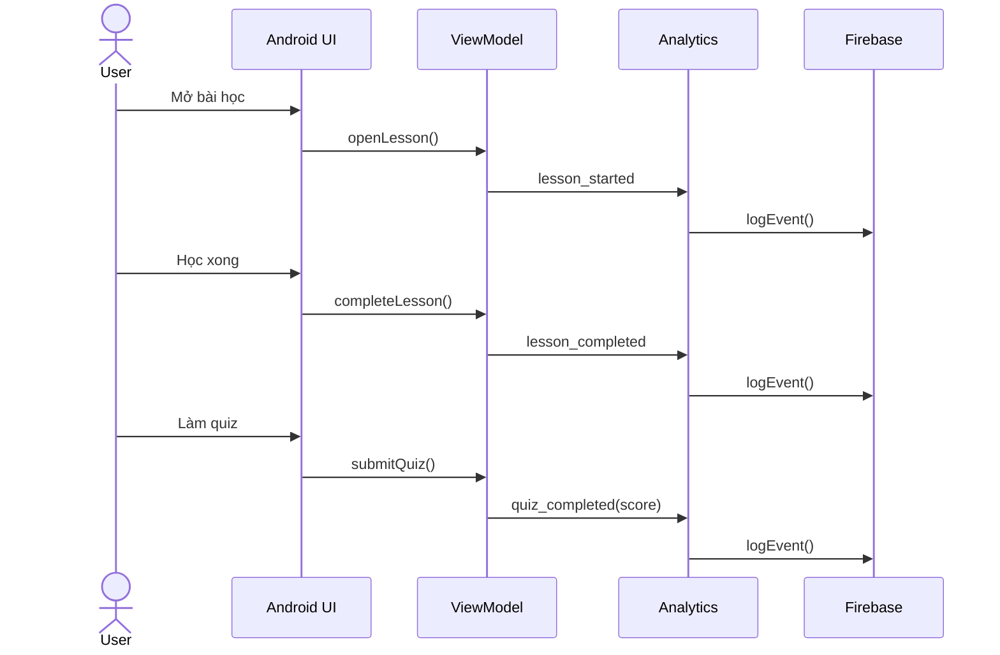
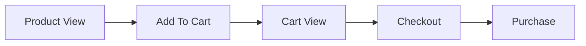
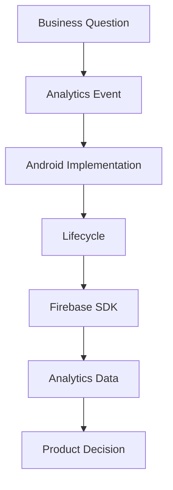

# 007 — Firebase Analytics

| Thuộc tính              | Nội dung                         |
| ----------------------- | -------------------------------- |
| **Học phần**            | 04 — Network, Async and Services |
| **Module**              | Module 09 — Common Services      |
| **Nhóm nội dung**       | Firebase                         |
| **Nguồn roadmap**       | Common Services / Firebase       |
| **Loại bài**            | Service                          |
| **Thứ tự trong module** | 007                              |
| **Thời lượng gợi ý**    | 34 phút                          |

---

## 1. Tóm tắt

**Firebase Analytics**, chính xác hơn là **Google Analytics for Firebase**, là dịch vụ thu thập và phân tích hành vi người dùng trong ứng dụng.

Trong Android, Analytics giúp trả lời những câu hỏi như:

* Người dùng mở màn hình nào nhiều nhất?
* Có bao nhiêu người hoàn thành đăng ký?
* Bao nhiêu người nhấn nút mua hàng nhưng không thanh toán?
* Feature mới có thực sự được sử dụng không?
* Người dùng thường rời khỏi ứng dụng ở bước nào?
* Một chiến dịch marketing mang lại nhóm người dùng nào?
* Một A/B test hoặc Remote Config có cải thiện conversion không?

Firebase Analytics không phải nơi chứa business logic. Nó nên đứng ở **rìa của application**, nhận các sự kiện từ UI/domain rồi gửi dữ liệu phân tích ra Firebase.

```text
User Action
    ↓
UI / ViewModel
    ↓
Business Logic
    ↓
Analytics abstraction
    ↓
Firebase Analytics SDK
    ↓
Google Analytics / Firebase Console
```

> **Nguyên tắc quan trọng:** ứng dụng vẫn phải hoạt động bình thường ngay cả khi Analytics bị tắt, lỗi mạng hoặc SDK không gửi được dữ liệu.

---

# 2. Mục tiêu học tập

Sau bài này, bạn có thể:

* [ ] Giải thích Firebase Analytics bằng ngôn ngữ của mình.
* [ ] Hiểu khái niệm **event**, **parameter** và **user property**.
* [ ] Biết vị trí của Analytics trong kiến trúc Android.
* [ ] Tích hợp Firebase Analytics vào một project Android.
* [ ] Gửi một event tiêu chuẩn và một custom event.
* [ ] Theo dõi một user flow hoàn chỉnh.
* [ ] Tránh đưa business logic phụ thuộc trực tiếp Firebase SDK.
* [ ] Xử lý trường hợp Analytics bị vô hiệu hóa.
* [ ] Biết cách debug event.
* [ ] Nhận biết các vấn đề liên quan đến privacy và consent.
* [ ] Tạo được một artifact nhỏ để đưa vào portfolio.

---

# 3. Firebase Analytics là gì?

Firebase Analytics là hệ thống **event-based analytics**.

Thay vì chỉ đếm số lần mở ứng dụng, hệ thống ghi lại các **sự kiện** xảy ra trong app.

Ví dụ người dùng:

```text
Mở app
   ↓
Xem sản phẩm
   ↓
Thêm vào giỏ
   ↓
Bắt đầu checkout
   ↓
Thanh toán
```

Có thể được biểu diễn thành các event:

```text
app_open
view_item
add_to_cart
begin_checkout
purchase
```

Từ đó chúng ta xây dựng được **funnel**:



Nếu:

```text
10.000 người xem sản phẩm
      ↓
 3.000 thêm vào giỏ
      ↓
 1.500 bắt đầu checkout
      ↓
   800 thanh toán
```

Analytics giúp phát hiện:

> Rất nhiều người rời khỏi flow trong khoảng **View Item → Add To Cart**.

Đây có thể là tín hiệu để Product/UX team kiểm tra lại UI, giá, nội dung hoặc quy trình mua hàng.

---

# 4. Ba khái niệm quan trọng

## 4.1. Event

**Event** là một hành động hoặc sự kiện xảy ra trong ứng dụng.

Ví dụ:

```text
login
sign_up
search
select_item
add_to_cart
purchase
share
```

Hoặc custom event:

```text
lesson_started
lesson_completed
favorite_added
dark_mode_enabled
profile_updated
```

Ví dụ:

```text
User nhấn "Bắt đầu học"
        ↓
lesson_started
```

---

# 5. Event Parameter

Một event có thể mang thêm thông tin dưới dạng **parameter**.

Ví dụ:

```text
Event:
lesson_started

Parameters:
lesson_id = "android_flow_015"
lesson_name = "Cold Flow"
module = "Asynchronism"
source = "home"
```

Dữ liệu có cấu trúc:

```text
lesson_started
├── lesson_id = android_flow_015
├── module = Asynchronism
├── source = home
└── difficulty = intermediate
```

Parameter cho phép chúng ta phân tích sâu hơn.

Thay vì chỉ biết:

> Có 5.000 lượt bắt đầu bài học.

Ta có thể biết:

> 2.300 lượt bắt đầu đến từ màn Home.

---

# 6. User Property

**User Property** mô tả một thuộc tính tương đối ổn định của người dùng.

Ví dụ:

```text
subscription_type = premium
preferred_language = vi
user_level = beginner
theme = dark
```

Khác với event:

```text
Event
→ một hành động xảy ra tại một thời điểm

User Property
→ thuộc tính mô tả người dùng
```

Ví dụ:

```text
User
├── subscription = premium
├── language = vi
└── level = intermediate

Events
├── lesson_started
├── lesson_completed
└── quiz_completed
```

---

# 7. Event, Parameter và User Property khác nhau thế nào?

| Thành phần    | Ý nghĩa               | Ví dụ                 |
| ------------- | --------------------- | --------------------- |
| Event         | Một việc xảy ra       | `lesson_started`      |
| Parameter     | Chi tiết của event    | `lesson_id = flow_01` |
| User Property | Thuộc tính người dùng | `plan = premium`      |

Ví dụ:

```text
User Property
plan = premium

        ↓

Event
lesson_completed

        ↓

Parameters
lesson_id = coroutine_01
score = 95
duration = 480
```

---

# 8. Vị trí Firebase Analytics trong kiến trúc Android

Một lỗi phổ biến là gọi Firebase trực tiếp ở mọi nơi.

Ví dụ:

```kotlin
firebaseAnalytics.logEvent(...)
```

xuất hiện trong:

```text
Activity
Fragment
Composable
ViewModel
Repository
UseCase
```

Điều này làm code phụ thuộc quá mạnh vào Firebase.

Nên có một abstraction:



Có thể hiểu đơn giản:

```text
UI
 ↓
ViewModel
 ↓
AnalyticsTracker
 ↓
FirebaseAnalytics
```

Ứng dụng chỉ cần biết:

```kotlin
analytics.track(...)
```

thay vì biết Firebase hoạt động như thế nào.

---

# 9. Thiết kế Analytics abstraction

Có thể định nghĩa interface:

```kotlin
interface AnalyticsTracker {

    fun track(
        event: String,
        params: Map<String, Any> = emptyMap()
    )

    fun setUserProperty(
        name: String,
        value: String?
    )
}
```

Firebase implementation:

```kotlin
class FirebaseAnalyticsTracker(
    private val firebaseAnalytics: FirebaseAnalytics
) : AnalyticsTracker {

    override fun track(
        event: String,
        params: Map<String, Any>
    ) {
        val bundle = Bundle()

        params.forEach { (key, value) ->
            when (value) {
                is String -> bundle.putString(key, value)
                is Int -> bundle.putLong(key, value.toLong())
                is Long -> bundle.putLong(key, value)
                is Double -> bundle.putDouble(key, value)
                is Float -> bundle.putDouble(key, value.toDouble())
                is Boolean -> bundle.putString(key, value.toString())
            }
        }

        firebaseAnalytics.logEvent(
            event,
            bundle
        )
    }

    override fun setUserProperty(
        name: String,
        value: String?
    ) {
        firebaseAnalytics.setUserProperty(
            name,
            value
        )
    }
}
```

Sau này nếu đổi Firebase sang hệ thống khác:

```text
Firebase
↓
Amplitude
↓
Mixpanel
↓
Internal analytics
```

business code gần như không cần sửa.

---

# 10. Cài đặt Firebase Analytics

Quy trình tổng quát:

```text
Firebase Project
      ↓
Register Android App
      ↓
google-services.json
      ↓
Google Services Plugin
      ↓
Firebase Analytics SDK
      ↓
Initialize App
      ↓
Log Events
```

---

## 10.1. Kết nối Android app với Firebase

Trong Firebase Console:

```text
Create / Select Project
        ↓
Add App
        ↓
Android
        ↓
Package name
        ↓
Download google-services.json
```

Đặt file vào:

```text
app/
└── google-services.json
```

---

## 10.2. Thêm Firebase dependency

Thông thường project Android sử dụng Firebase BoM để quản lý phiên bản Firebase libraries.

Ví dụ cấu trúc:

```kotlin
dependencies {

    implementation(
        platform("com.google.firebase:firebase-bom:<version>")
    )

    implementation(
        "com.google.firebase:firebase-analytics"
    )
}
```

> Khi làm project thực tế, nên lấy phiên bản Firebase BoM hiện hành từ tài liệu chính thức thay vì hard-code từ tutorial cũ.

---

# 11. Khởi tạo Firebase Analytics

Ví dụ trong Activity:

```kotlin
class MainActivity : ComponentActivity() {

    private lateinit var firebaseAnalytics: FirebaseAnalytics

    override fun onCreate(savedInstanceState: Bundle?) {
        super.onCreate(savedInstanceState)

        firebaseAnalytics =
            Firebase.analytics
    }
}
```

Tuy nhiên với project lớn, nên inject dependency thông qua DI thay vì khởi tạo ở từng màn hình.

Ví dụ:

```text
FirebaseAnalytics
       ↓
FirebaseAnalyticsTracker
       ↓
Dependency Injection
       ↓
ViewModel
```

---

# 12. Gửi event đơn giản

Ví dụ người dùng nhấn nút bắt đầu bài học:

```kotlin
firebaseAnalytics.logEvent(
    "lesson_started",
    Bundle().apply {
        putString(
            "lesson_id",
            "firebase_analytics_007"
        )

        putString(
            "module",
            "common_services"
        )
    }
)
```

Event gửi đi:

```text
lesson_started
├── lesson_id
│   └── firebase_analytics_007
│
└── module
    └── common_services
```

---

# 13. Dùng AnalyticsTracker

Thay vì:

```kotlin
firebaseAnalytics.logEvent(...)
```

trực tiếp trong UI:

```kotlin
analyticsTracker.track(
    event = "lesson_started",
    params = mapOf(
        "lesson_id" to "firebase_analytics_007",
        "module" to "common_services"
    )
)
```

Code UI không còn phụ thuộc Firebase.

---

# 14. Định nghĩa event bằng code thay vì string rải rác

Không nên:

```kotlin
analytics.track("lesson_start")
analytics.track("lesson_started")
analytics.track("start_lesson")
analytics.track("lessonStart")
```

Bốn developer có thể tạo bốn tên khác nhau cho cùng một hành động.

Nên chuẩn hóa:

```kotlin
object AnalyticsEvents {

    const val LESSON_STARTED =
        "lesson_started"

    const val LESSON_COMPLETED =
        "lesson_completed"

    const val QUIZ_STARTED =
        "quiz_started"

    const val QUIZ_COMPLETED =
        "quiz_completed"
}
```

Sử dụng:

```kotlin
analytics.track(
    AnalyticsEvents.LESSON_STARTED
)
```

---

# 15. Mô hình Analytics Event bằng sealed class

Project Kotlin lớn có thể type-safe hơn:

```kotlin
sealed interface AnalyticsEvent {

    data class LessonStarted(
        val lessonId: String,
        val source: String
    ) : AnalyticsEvent

    data class LessonCompleted(
        val lessonId: String,
        val durationSeconds: Long
    ) : AnalyticsEvent

    data class QuizCompleted(
        val quizId: String,
        val score: Int
    ) : AnalyticsEvent
}
```

Tracker:

```kotlin
interface AnalyticsTracker {

    fun track(event: AnalyticsEvent)
}
```

Sau đó mapping:

```text
AnalyticsEvent
      ↓
FirebaseAnalyticsTracker
      ↓
Firebase event + Bundle
```

Lợi ích:

* hạn chế typo;
* dễ refactor;
* dễ test;
* dễ tìm event trong codebase;
* event schema rõ ràng hơn.

---

# 16. Ví dụ với Jetpack Compose

Giả sử có màn hình bài học:

```kotlin
@Composable
fun LessonScreen(
    onStartLesson: () -> Unit
) {

    Button(
        onClick = onStartLesson
    ) {
        Text("Bắt đầu học")
    }
}
```

Business action trong ViewModel:

```kotlin
class LessonViewModel(
    private val analytics: AnalyticsTracker
) : ViewModel() {

    fun startLesson(
        lessonId: String
    ) {

        analytics.track(
            event = "lesson_started",
            params = mapOf(
                "lesson_id" to lessonId
            )
        )

        // Business logic...
    }
}
```

Flow:



---

# 17. Screen View Analytics

Một thông tin quan trọng khác là:

> Người dùng đang xem màn hình nào?

Ví dụ:

```text
Home
↓
Course Detail
↓
Lesson
↓
Quiz
```

Có thể theo dõi:

```text
screen_view

screen_name = lesson_detail
screen_class = LessonScreen
```

Với Navigation Compose, có thể đặt tracking ở lớp navigation thay vì gọi riêng lẻ trong từng Composable.

Ý tưởng:

```text
Navigation change
      ↓
Current route
      ↓
AnalyticsTracker
      ↓
screen_view
```

---

# 18. Không log event mỗi lần recomposition

Đây là lỗi quan trọng với Jetpack Compose.

Không nên:

```kotlin
@Composable
fun LessonScreen() {

    analytics.track(
        "lesson_viewed"
    )

    ...
}
```

Composable có thể recompose rất nhiều lần:

```text
Compose
 ↓
Recompose
 ↓
lesson_viewed
 ↓
Recompose
 ↓
lesson_viewed
 ↓
Recompose
 ↓
lesson_viewed
```

Kết quả Analytics bị sai.

Có thể sử dụng lifecycle/effect phù hợp:

```kotlin
LaunchedEffect(Unit) {

    analytics.track(
        "lesson_viewed"
    )
}
```

Hoặc tốt hơn, tracking screen có thể được xử lý tập trung tại Navigation layer.

---

# 19. Analytics và Lifecycle

Analytics cần hiểu lifecycle Android.

Một màn hình có thể trải qua:

```text
Create
 ↓
Start
 ↓
Resume
 ↓
Background
 ↓
Resume
 ↓
Destroy
```

Không phải mỗi lifecycle callback đều tương đương một hành động thật của user.

Ví dụ:

```text
onResume()
```

không nhất thiết có nghĩa:

```text
user_opened_screen
```

vì app có thể quay lại từ background.

Do đó cần xác định rõ **semantic event**.

Ví dụ tốt:

```text
User thực sự nhấn nút
      ↓
checkout_started
```

thay vì:

```text
onResume()
      ↓
checkout_started
```

---

# 20. Event nên mô tả hành vi, không mô tả implementation

Không tốt:

```text
button_clicked
fragment_opened
api_called
viewmodel_created
```

Tốt hơn:

```text
checkout_started
product_favorited
lesson_completed
search_submitted
profile_saved
```

Event nên phản ánh:

> **Người dùng đã làm gì?**

thay vì:

> **Code vừa chạy hàm gì?**

---

# 21. Naming convention

Nên thống nhất format:

```text
noun_action
```

hoặc:

```text
object_action
```

Ví dụ:

```text
lesson_started
lesson_completed

quiz_started
quiz_completed

profile_updated

item_shared

subscription_started
```

Tránh trộn:

```text
LessonStart
lesson-start
startLesson
lesson_started
```

trong cùng project.

---

# 22. Event schema

Project production nên có tài liệu event schema.

Ví dụ:

| Event              | Parameter      | Ý nghĩa              |
| ------------------ | -------------- | -------------------- |
| `lesson_started`   | `lesson_id`    | ID bài học           |
| `lesson_started`   | `source`       | Nguồn mở bài         |
| `lesson_completed` | `lesson_id`    | ID bài               |
| `lesson_completed` | `duration_sec` | Thời gian hoàn thành |
| `quiz_completed`   | `quiz_id`      | ID quiz              |
| `quiz_completed`   | `score`        | Điểm                 |

Có thể lưu trong:

```text
docs/
└── analytics-events.md
```

---

# 23. Theo dõi Funnel

Giả sử app học tập có flow:



Analytics có thể đo:

| Event            |   User |
| ---------------- | -----: |
| Course Viewed    | 10.000 |
| Lesson Started   |  7.500 |
| Lesson Completed |  5.000 |
| Quiz Started     |  3.800 |
| Quiz Completed   |  2.900 |

Từ đó phát hiện:

```text
Lesson Completed
      ↓
Quiz Started

5000 → 3800
```

Có khoảng:

```text
24%
```

người dùng không tiếp tục quiz.

Đây là insight sản phẩm, không chỉ là thống kê kỹ thuật.

---

# 24. Analytics không nên quyết định business logic

Sai:

```kotlin
if (analyticsEventSent) {
    completePurchase()
}
```

Không nên để:

```text
Firebase Analytics
       ↓
quyết định app có hoạt động hay không
```

Đúng:

```text
Business operation
       ↓
Success
       ↓
Track Analytics
```

Ví dụ:

```kotlin
fun completeLesson() {

    repository.completeLesson()

    analytics.track(
        "lesson_completed"
    )
}
```

Analytics chỉ quan sát hành vi.

---

# 25. Analytics nên là non-blocking side effect

Flow lý tưởng:

```text
User Action
     ↓
Business Logic
     ├────────→ UI State
     │
     └────────→ Analytics
```

Không nên:

```text
User Action
    ↓
Send Analytics
    ↓
Wait
    ↓
Business Logic
```

Nếu Analytics lỗi, người dùng vẫn phải sử dụng được tính năng.

---

# 26. Trường hợp Analytics bị vô hiệu hóa

Một requirement quan trọng của bài thực hành là:

> Có ít nhất một failure hoặc disabled-service scenario.

Ta có thể tạo:

```kotlin
class NoOpAnalyticsTracker : AnalyticsTracker {

    override fun track(
        event: String,
        params: Map<String, Any>
    ) {
        // Không làm gì.
    }

    override fun setUserProperty(
        name: String,
        value: String?
    ) {
        // Không làm gì.
    }
}
```

Kiến trúc:

```text
Analytics enabled
      ↓
FirebaseAnalyticsTracker

Analytics disabled
      ↓
NoOpAnalyticsTracker
```

App vẫn hoạt động bình thường.

---

# 27. Feature flag cho Analytics

Có thể cấu hình:

```text
analyticsEnabled = true
```

Sau đó:

```kotlin
val tracker: AnalyticsTracker =
    if (analyticsEnabled) {
        FirebaseAnalyticsTracker(
            firebaseAnalytics
        )
    } else {
        NoOpAnalyticsTracker()
    }
```

Điều này hữu ích cho:

* privacy;
* development;
* test;
* enterprise builds;
* region-specific configuration.

---

# 28. Privacy

Analytics thu thập dữ liệu hành vi người dùng nên cần được xem xét như một vấn đề **privacy**, không chỉ là kỹ thuật.

Không nên gửi tùy tiện:

```text
email
phone number
password
access token
home address
private message
sensitive personal information
```

Ví dụ rất xấu:

```kotlin
analytics.track(
    "login",
    mapOf(
        "password" to password,
        "token" to accessToken
    )
)
```

Analytics event nên chứa dữ liệu tối thiểu cần cho việc đo lường.

---

# 29. Data minimization

Nguyên tắc:

```text
Collect everything
        ❌
```

Thay vào đó:

```text
Business Question
       ↓
Metrics Needed
       ↓
Events Needed
       ↓
Parameters Needed
```

Ví dụ câu hỏi:

> Người dùng có hoàn thành bài học không?

Ta chỉ cần:

```text
lesson_started
lesson_completed
lesson_id
```

Không nhất thiết phải gửi thêm hàng chục thuộc tính không liên quan.

---

# 30. Consent

Tùy loại ứng dụng, thị trường và cấu hình Firebase, có thể cần:

```text
App Start
   ↓
Consent State
   ↓
┌───────────────┐
│ Accepted?     │
└──────┬────────┘
       │
   ┌───┴───┐
   ↓       ↓
 Yes       No
   ↓       ↓
Enable   Disable
Analytics Analytics
```

Ví dụ abstraction giúp xử lý điều này dễ hơn:

```text
Consent Manager
      ↓
AnalyticsTracker
      ↓
Firebase / NoOp
```

> Quy định consent phụ thuộc quốc gia, loại dữ liệu và cách app sử dụng dịch vụ; production app cần kiểm tra chính sách hiện hành thay vì chỉ dựa vào tutorial.

---

# 31. Không dùng Analytics như logging system

Analytics:

```text
lesson_completed
purchase
search
```

Logging:

```text
HTTP 500
NullPointerException
database timeout
JSON parsing failed
```

Hai thứ có mục đích khác nhau.



Firebase ecosystem thường sử dụng:

```text
Analytics → hành vi

Crashlytics → crash/error

Performance Monitoring → performance
```

---

# 32. Analytics và Remote Config

Firebase services có thể kết hợp với nhau.

Ví dụ:



Remote Config có thể thay đổi:

```text
checkout_button_color
```

Analytics đo:

```text
checkout_started
purchase
```

Ta có thể kiểm tra variant nào hiệu quả hơn.

---

# 33. Analytics và Authentication

Authentication xác định người dùng.

Analytics quan sát hành vi.

```text
Firebase Authentication
        ↓
      User
        ↓
Firebase Analytics
        ↓
User behavior
```

Tuy nhiên cần tránh đưa trực tiếp dữ liệu nhận dạng cá nhân vào event.

---

# 34. Analytics và Crashlytics

Hai dịch vụ trả lời hai câu hỏi khác nhau.

| Firebase Analytics     | Crashlytics           |
| ---------------------- | --------------------- |
| User làm gì?           | App crash ở đâu?      |
| User đi qua flow nào?  | Exception nào xảy ra? |
| Conversion bao nhiêu?  | Version nào crash?    |
| Feature nào được dùng? | Stack trace là gì?    |

Kết hợp:

```text
Analytics
   +
Crashlytics
   +
Performance
   ↓
Hiểu app toàn diện hơn
```

---

# 35. Testing Analytics

Analytics rất dễ bị bỏ qua vì developer nghĩ:

> "Chỉ gửi event thôi mà."

Nhưng Analytics sai có thể khiến Product team đưa ra quyết định sai.

Nên test:

```text
Event name
Parameter name
Parameter value
Event timing
Duplicate events
Consent behavior
Disabled analytics
```

---

# 36. Fake AnalyticsTracker cho Unit Test

Ví dụ:

```kotlin
class FakeAnalyticsTracker : AnalyticsTracker {

    val events =
        mutableListOf<String>()

    override fun track(
        event: String,
        params: Map<String, Any>
    ) {
        events += event
    }

    override fun setUserProperty(
        name: String,
        value: String?
    ) = Unit
}
```

Test ViewModel:

```kotlin
@Test
fun `complete lesson logs completed event`() {

    val analytics =
        FakeAnalyticsTracker()

    val viewModel =
        LessonViewModel(
            analytics = analytics
        )

    viewModel.completeLesson()

    assertTrue(
        analytics.events.contains(
            "lesson_completed"
        )
    )
}
```

Ta không cần Firebase thật trong unit test.

---

# 37. Test event parameter

Có thể lưu cả object:

```kotlin
data class TrackedEvent(
    val name: String,
    val params: Map<String, Any>
)
```

Fake:

```kotlin
class FakeAnalyticsTracker : AnalyticsTracker {

    val events =
        mutableListOf<TrackedEvent>()

    override fun track(
        event: String,
        params: Map<String, Any>
    ) {
        events += TrackedEvent(
            event,
            params
        )
    }

    override fun setUserProperty(
        name: String,
        value: String?
    ) = Unit
}
```

Test:

```kotlin
assertEquals(
    "firebase_analytics_007",
    analytics
        .events
        .first()
        .params["lesson_id"]
)
```

---

# 38. Debug Analytics

Khi debug nên kiểm tra theo chuỗi:

```text
User Action
     ↓
Event function called?
     ↓
Correct event name?
     ↓
Correct parameters?
     ↓
Analytics enabled?
     ↓
Firebase SDK configured?
     ↓
DebugView / Analytics Console
```

Không nên chỉ nhìn dashboard rồi kết luận:

> Firebase bị lỗi.

---

# 39. Các lỗi thường gặp

## Lỗi 1 — Gọi Analytics trực tiếp khắp project

```text
Fragment ───────┐
Composable ─────┤
ViewModel ──────┼─→ Firebase
Repository ─────┤
UseCase ────────┘
```

Khó maintain.

Nên:

```text
App
 ↓
AnalyticsTracker
 ↓
Firebase
```

---

## Lỗi 2 — Duplicate event

Ví dụ:

```text
onCreate
 +
onResume
 +
Composable recomposition
```

đều gửi:

```text
screen_view
```

Một lần user xem màn hình nhưng dashboard ghi ba lần.

---

## Lỗi 3 — Event name không thống nhất

```text
lesson_complete

lesson_completed

complete_lesson
```

khiến cùng một hành vi bị chia thành ba metric.

---

## Lỗi 4 — Gửi quá nhiều event

Ví dụ:

```text
button_visible
button_pressed
button_animation_started
button_animation_finished
button_color_changed
```

Không phải event nào cũng tạo ra business value.

---

## Lỗi 5 — Gửi dữ liệu nhạy cảm

```text
email
password
token
private user data
```

Analytics không phải database để lưu mọi thứ.

---

## Lỗi 6 — Analytics làm hỏng business flow

Không nên:

```text
Analytics failed
      ↓
Checkout failed
```

Nên:

```text
Checkout success
      ↓
Analytics attempted
```

---

# 40. Mô hình kiến trúc đề xuất



Trong kiến trúc này:

* UI không biết Firebase.
* ViewModel gửi semantic event.
* AnalyticsTracker tạo abstraction.
* FirebaseAnalyticsTracker xử lý SDK.
* Firebase lỗi không ảnh hưởng business flow.

---

# 41. Ví dụ hoàn chỉnh: App học Android

Giả sử user flow:

```text
Home
 ↓
Course
 ↓
Lesson
 ↓
Complete
 ↓
Quiz
```

Ta thiết kế event:

```text
course_viewed
lesson_started
lesson_completed
quiz_started
quiz_completed
```

Parameter:

```text
course_id
lesson_id
quiz_id
score
source
duration_sec
```

---

## Flow Analytics



---

# 42. Bài thực hành

## Yêu cầu

Tạo một app nhỏ gồm:

```text
Home
 ↓
Lesson Detail
 ↓
Start Lesson
 ↓
Complete Lesson
```

Theo dõi các event:

```text
lesson_viewed
lesson_started
lesson_completed
```

---

## Event schema

| Event              | Parameter                   |
| ------------------ | --------------------------- |
| `lesson_viewed`    | `lesson_id`                 |
| `lesson_started`   | `lesson_id`, `source`       |
| `lesson_completed` | `lesson_id`, `duration_sec` |

---

## Yêu cầu kiến trúc

Không được gọi:

```kotlin
Firebase.analytics
```

trực tiếp trong mọi Composable.

Phải có:

```text
AnalyticsTracker
        ↓
FirebaseAnalyticsTracker
```

và:

```text
NoOpAnalyticsTracker
```

cho trường hợp Analytics bị vô hiệu hóa.

---

# 43. Bài tập nâng cao

Thiết kế tracking cho một app thương mại điện tử.

Flow:



Xác định:

1. Event nào cần gửi?
2. Parameter nào cần thiết?
3. User Property nào hữu ích?
4. Event nào có nguy cơ duplicate?
5. Dữ liệu nào tuyệt đối không nên gửi?
6. Analytics bị disable thì app hoạt động thế nào?
7. Làm sao unit test được tracking?
8. Làm sao biết người dùng bỏ checkout ở bước nào?

---

# 44. Artifact cho Portfolio

Có thể tạo project:

```text
firebase-analytics-demo/
│
├── analytics/
│   ├── AnalyticsTracker.kt
│   ├── FirebaseAnalyticsTracker.kt
│   ├── NoOpAnalyticsTracker.kt
│   └── AnalyticsEvents.kt
│
├── feature/
│   └── lesson/
│       ├── LessonScreen.kt
│       └── LessonViewModel.kt
│
├── test/
│   └── FakeAnalyticsTracker.kt
│
└── README.md
```

README nên trình bày:

```text
Problem
   ↓
Event Design
   ↓
Architecture
   ↓
Implementation
   ↓
Privacy Strategy
   ↓
Testing
   ↓
Debugging
```

Một screenshot DebugView hoặc diagram event flow sẽ làm portfolio rõ ràng hơn.

---

# 45. Checklist hoàn thành

## Kiến thức

* [ ] Giải thích được Firebase Analytics là gì.
* [ ] Hiểu event.
* [ ] Hiểu event parameter.
* [ ] Hiểu user property.
* [ ] Phân biệt Analytics và logging.
* [ ] Phân biệt Analytics và Crashlytics.
* [ ] Hiểu funnel.
* [ ] Hiểu tác động của lifecycle lên tracking.

## Android

* [ ] Kết nối Android project với Firebase.
* [ ] Thêm Firebase Analytics SDK.
* [ ] Gửi được custom event.
* [ ] Gửi parameter.
* [ ] Theo dõi screen/user flow.
* [ ] Không log event sai do Compose recomposition.

## Architecture

* [ ] Có `AnalyticsTracker`.
* [ ] Có `FirebaseAnalyticsTracker`.
* [ ] Không phụ thuộc Firebase trong toàn bộ UI.
* [ ] Có `NoOpAnalyticsTracker`.
* [ ] Business logic không phụ thuộc việc Analytics gửi thành công.

## Privacy

* [ ] Không gửi password.
* [ ] Không gửi access token.
* [ ] Không gửi dữ liệu cá nhân không cần thiết.
* [ ] Có xem xét consent.
* [ ] Có cơ chế disable Analytics nếu cần.

## Testing

* [ ] Có Fake Analytics.
* [ ] Test được event name.
* [ ] Test được parameter.
* [ ] Kiểm tra duplicate event.
* [ ] Kiểm tra Analytics disabled.

## Portfolio

* [ ] Có demo app.
* [ ] Có sơ đồ kiến trúc.
* [ ] Có event schema.
* [ ] Có unit test.
* [ ] Có README giải thích quyết định thiết kế.

---

# 46. Ghi chú production

Khi đưa Firebase Analytics vào production, không nên chỉ hỏi:

> "Event có gửi lên Firebase không?"

Mà cần kiểm tra toàn bộ chuỗi:



Một event sai ở bất kỳ bước nào đều có thể dẫn tới dữ liệu sai và cuối cùng là quyết định sản phẩm sai.

Trước release nên đặt các câu hỏi:

* Event này phục vụ câu hỏi sản phẩm nào?
* Có event nào bị gửi hai lần không?
* Compose recomposition có làm tăng event count không?
* Rotate/background/restore state có tạo event giả không?
* Event name và parameter đã thống nhất chưa?
* Có gửi dữ liệu nhạy cảm không?
* Consent được xử lý đúng chưa?
* Analytics bị disable thì app có tiếp tục hoạt động không?
* Có thể test mà không cần Firebase thật không?
* Event schema đã được ghi trong README/documentation chưa?

---

# 47. Tư duy cần nhớ

```text
Firebase Analytics
       ≠
"gửi càng nhiều event càng tốt"
```

Mà là:

```text
Câu hỏi sản phẩm
      ↓
Metric
      ↓
Event
      ↓
Parameter
      ↓
Implementation
      ↓
Dữ liệu
      ↓
Insight
      ↓
Quyết định
```

Và về mặt kiến trúc Android:

```text
UI / ViewModel
      ↓
AnalyticsTracker
      ↓
Firebase Analytics
```

chứ không nên:

```text
Firebase SDK
   ↓
rải trực tiếp khắp toàn bộ codebase
```

> **Điểm cốt lõi:** Firebase Analytics là một **observability service cho hành vi người dùng**. Nó phải hỗ trợ việc hiểu sản phẩm, nhưng không được trở thành dependency quyết định business logic hay làm hỏng trải nghiệm người dùng khi dịch vụ gặp sự cố.

---

# Bài luyện tập

## Mục tiêu


## Đề bài


## Yêu cầu hoàn thành

- [ ] 
- [ ] 
- [ ] 

## Kết quả / lời giải


## Ghi chú
