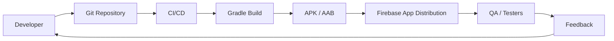
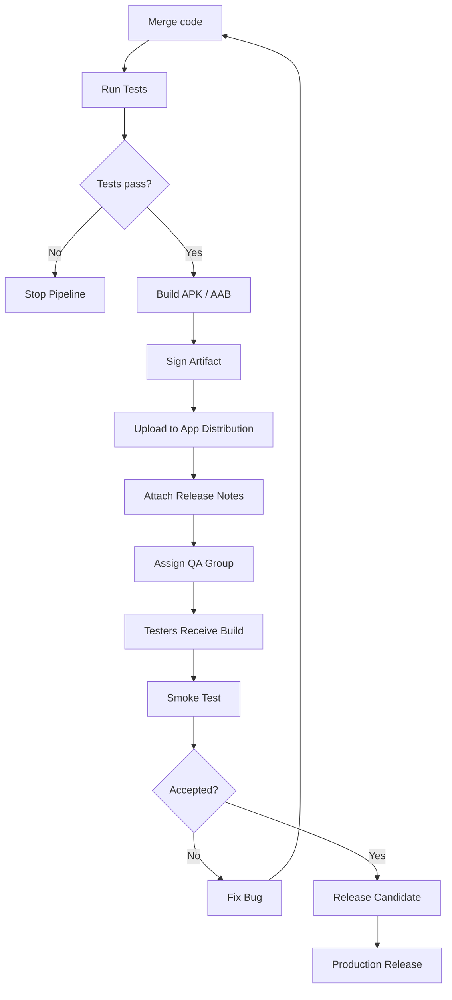
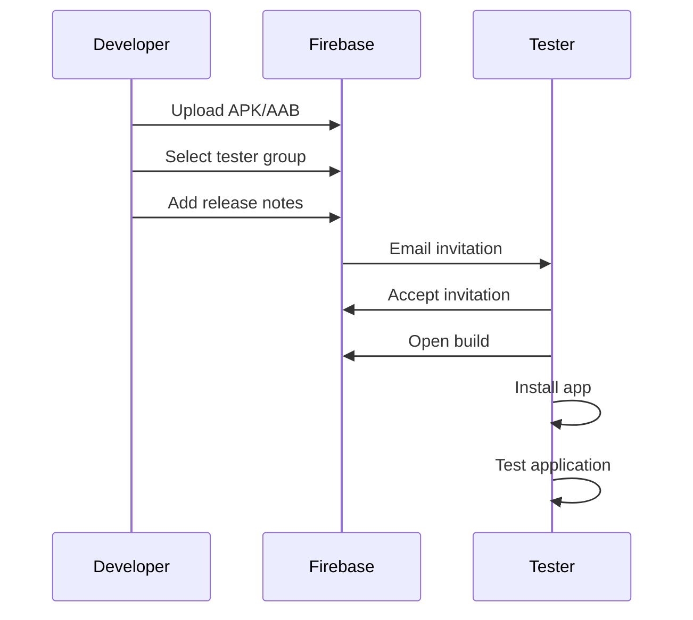
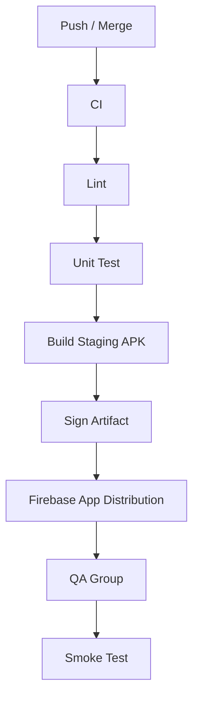
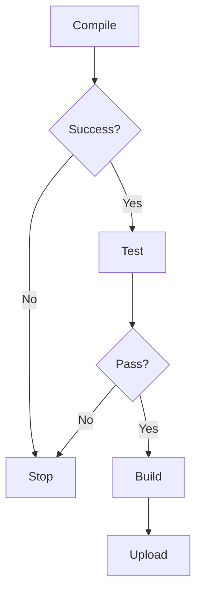
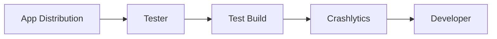
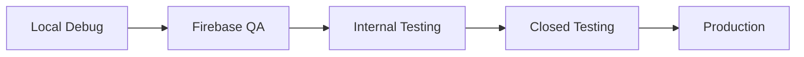
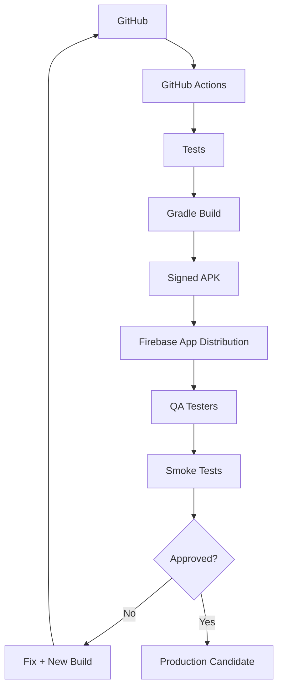
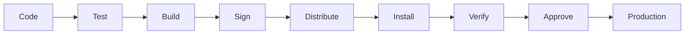

# 008 — Firebase App Distribution

| Thuộc tính              | Nội dung                         |
| ----------------------- | -------------------------------- |
| **Học phần**            | 04 — Network, Async and Services |
| **Module**              | Module 09 — Common Services      |
| **Nhóm nội dung**       | Firebase                         |
| **Nguồn roadmap**       | Common Services / Firebase       |
| **Loại bài**            | Release                          |
| **Thứ tự trong module** | 008                              |
| **Thời lượng gợi ý**    | 32 phút                          |

---

## 1. Tóm tắt

**Firebase App Distribution** là dịch vụ giúp phân phối các bản build **pre-release** của ứng dụng Android cho tester, QA, product owner hoặc thành viên nội bộ trước khi phát hành chính thức lên Google Play.

Firebase hiện hỗ trợ phân phối Android build thông qua:

* Firebase Console;
* Firebase CLI;
* Gradle;
* fastlane;
* REST API.

Build Android có thể là **APK** hoặc **AAB**. Với AAB, Firebase App Distribution tích hợp với Google Play để tạo APK phù hợp với thiết bị tester. ([Firebase][1])

Luồng tổng quát:

```text
Developer
    ↓
Build APK / AAB
    ↓
Sign application
    ↓
Firebase App Distribution
    ↓
Tester / QA
    ↓
Install build
    ↓
Test + Feedback
    ↓
Fix
    ↓
New Build
    ↓
Production Release
```

Firebase App Distribution nằm chủ yếu trong **release pipeline**, không phải business logic chạy bên trong ứng dụng.

> **Điểm cần nhớ:** App Distribution giải quyết bài toán **"đưa bản build thử nghiệm tới đúng người một cách có kiểm soát"**, chứ không thay thế Google Play production release.

---

# 2. Mục tiêu học tập

Sau bài này, bạn có thể:

* [ ] Giải thích Firebase App Distribution bằng ngôn ngữ của mình.
* [ ] Phân biệt App Distribution với Google Play production release.
* [ ] Hiểu vai trò của APK, AAB, signing và `versionCode`.
* [ ] Phân phối một build Android cho tester.
* [ ] Quản lý tester và tester group.
* [ ] Viết release notes cho từng build.
* [ ] Tích hợp App Distribution vào Gradle hoặc CI/CD.
* [ ] Hiểu cách quản lý credential an toàn.
* [ ] Xác minh tester thực sự nhận và cài được build.
* [ ] Có phương án khi một build test bị lỗi.
* [ ] Biết cách kết hợp App Distribution với Crashlytics.
* [ ] Tạo được release checklist dùng cho portfolio.

---

# 3. Firebase App Distribution giải quyết vấn đề gì?

Không có App Distribution, một team nhỏ có thể làm như sau:

```text
Developer build APK
       ↓
Upload Google Drive
       ↓
Copy link
       ↓
Gửi Slack
       ↓
Tester tải file
       ↓
"File nào mới nhất?"
       ↓
"Build này version mấy?"
       ↓
"APK này có phải staging không?"
```

Khi số lượng build tăng lên:

```text
app-final.apk
app-final-2.apk
app-final-new.apk
app-final-real.apk
app-final-fixed.apk
```

quy trình rất dễ hỗn loạn.

Firebase App Distribution đưa release về dạng có cấu trúc:

```text
Application
   ↓
Release
   ├── Version
   ├── Build
   ├── Release notes
   ├── Artifact
   ├── Tester groups
   └── Distribution status
```

---

# 4. Firebase App Distribution nằm ở đâu?

Khác với Authentication, Firestore hay Remote Config:

```text
Firebase Authentication
        ↓
Runtime Service

Firestore
        ↓
Runtime Service

Remote Config
        ↓
Runtime Service
```

App Distribution chủ yếu là:

```text
Source Code
    ↓
Build System
    ↓
Release Pipeline
    ↓
Firebase App Distribution
```

Hay đầy đủ hơn:



---

# 5. App Distribution không phải Repository Layer

Trong template chung của Firebase thường có lời khuyên:

> Wrap Firebase services behind repositories.

Điều này đúng với những Firebase SDK nằm trong runtime như Firestore hoặc Authentication.

Nhưng đối với App Distribution:

```text
Repository
    ↓
Firebase App Distribution
```

thường **không phải kiến trúc phù hợp**.

App Distribution nên nằm ở:

```text
Gradle
CI/CD
Release scripts
Firebase CLI
fastlane
```

chứ không phải:

```text
ViewModel
Repository
UseCase
```

trong business architecture.

---

# 6. Release workflow

Một workflow phổ biến:



---

# 7. Các thành phần quan trọng

Một App Distribution release thường liên quan đến:

```text
Firebase Project
      │
      ├── Android App
      │
      ├── Firebase App ID
      │
      ├── APK / AAB
      │
      ├── Release Notes
      │
      ├── Testers
      │
      └── Tester Groups
```

---

# 8. APK và AAB

## APK

APK là file có thể cài trực tiếp lên Android device.

```text
app-staging-release.apk
```

Flow:

```text
Gradle
   ↓
APK
   ↓
Firebase
   ↓
Tester Device
```

Firebase yêu cầu APK được ký bằng debug key hoặc app signing key trước khi phân phối. ([Firebase][2])

---

## AAB

Android App Bundle:

```text
app-release.aab
```

AAB không đơn giản là file APK được cài trực tiếp.

Với App Distribution, Firebase có thể kết hợp Google Play Internal App Sharing để xử lý AAB và cung cấp APK tối ưu cho thiết bị tester. Để upload AAB theo luồng này, Firebase app phải được liên kết với app tương ứng trên Google Play. ([Firebase][3])

```text
AAB
 ↓
Firebase App Distribution
 ↓
Google Play processing
 ↓
Device-specific APK
 ↓
Tester
```

---

# 9. APK hay AAB?

| APK                   | AAB                                    |
| --------------------- | -------------------------------------- |
| Cài trực tiếp         | Google Play xử lý                      |
| Setup đơn giản        | Gần production hơn                     |
| Tốt cho internal QA   | Tốt cho kiểm tra App Bundle            |
| Dễ debug distribution | Kiểm tra Play Feature Delivery tốt hơn |

Với project nhỏ:

```text
QA nhanh
→ APK
```

Với release candidate gần production:

```text
Google Play dùng AAB
→ nên test AAB
```

---

# 10. Chuẩn bị Firebase Project

Workflow:

```text
Firebase Console
      ↓
Create / Select Project
      ↓
Register Android App
      ↓
Package Name
      ↓
Enable App Distribution
```

Một điểm quan trọng: package name khi đăng ký Firebase Android App phải khớp app được phân phối; Firebase lưu ý giá trị này phân biệt hoa/thường và không thể thay đổi sau khi đăng ký app. ([Firebase][4])

Ví dụ:

```text
Production
com.example.myapp

Staging
com.example.myapp.staging
```

Tốt nhất nên quản lý rõ từng environment.

---

# 11. Build Variant

Một app thực tế có thể có:

```text
debug
staging
release
```

Ví dụ:

```kotlin
android {
    buildTypes {

        debug {
            applicationIdSuffix = ".debug"
        }

        create("staging") {
            applicationIdSuffix = ".staging"
        }

        release {
            isMinifyEnabled = true
        }
    }
}
```

Có thể dùng App Distribution cho:

```text
staging
```

hoặc:

```text
release candidate
```

thay vì gửi mọi debug build cho tester.

---

# 12. Version Name và Version Code

Mỗi release nên xác định được chính xác:

```text
versionName
versionCode
Git commit
Build time
Environment
```

Ví dụ:

```text
Version: 1.4.0
Build: 142
Commit: a83fc1d
Environment: staging
```

Không nên gửi:

```text
"Build mới nhất"
```

mà không biết nó tương ứng source code nào.

---

# 13. Artifact naming

Có thể đặt:

```text
myapp-staging-1.4.0-142.apk
```

thay vì:

```text
app-release.apk
```

Tên artifact nên giúp nhận biết:

```text
App
Environment
Version
Build
```

Ví dụ:

```text
lumina-staging-v2.4.1-build381.apk
```

---

# 14. Phân phối thủ công bằng Firebase Console

Quy trình cơ bản:

```text
Firebase Console
      ↓
App Distribution
      ↓
Select Android App
      ↓
Upload APK / AAB
      ↓
Select Tester / Group
      ↓
Add Release Notes
      ↓
Distribute
```

Firebase gửi invitation hoặc thông báo cho tester khi build được phân phối. ([Firebase][5])

Đây là cách tốt để bắt đầu vì dễ quan sát toàn bộ quy trình.

---

# 15. Tester flow



Tester Android nhận invitation, đăng nhập bằng Google Account và có thể sử dụng Firebase App Tester để xem/download các build được cấp quyền. ([Firebase][6])

---

# 16. Tester Groups

Không nên quản lý từng tester thủ công khi team lớn.

Ví dụ:

```text
Testers
├── Android-QA
├── Product-Team
├── Internal-Dogfood
├── Automation
└── Client-UAT
```

Build staging:

```text
→ Android-QA
```

Release candidate:

```text
→ Android-QA
→ Product-Team
```

UAT:

```text
→ Client-UAT
```

Firebase hiện hỗ trợ quản lý tester theo group; tài liệu hiện tại nêu giới hạn tối đa **500 tester/project** và **200 tester/group**. Các giới hạn dịch vụ có thể thay đổi nên production pipeline nên kiểm tra tài liệu hiện hành. ([Firebase][7])

---

# 17. Release Notes

Release notes là một phần rất quan trọng.

Không tốt:

```text
Fix bugs.
```

Tốt hơn:

```text
Version 1.4.0 (142)

Changes:
- Added onboarding v2.
- Fixed login timeout.
- Fixed crash when opening profile.
- Improved image caching.

Please verify:
1. Login with Google.
2. Complete onboarding.
3. Open Profile.
4. Logout and login again.

Known issues:
- Animation may stutter on low-end devices.
```

Tester đọc xong phải hiểu:

> Build này thay đổi gì và tôi cần test cái gì?

---

# 18. Release Notes Template

```markdown
## Version

1.4.0 (142)

## Environment

Staging

## Changes

- Added ...
- Fixed ...
- Updated ...

## Please Test

- Login
- Checkout
- Profile

## Known Issues

- ...

## Backend Requirement

API >= v32
```

---

# 19. Firebase App Distribution Gradle Plugin

Firebase hỗ trợ tích hợp App Distribution trực tiếp vào Android build process bằng Gradle plugin. Tài liệu chính thức cập nhật tháng 8/2026 hiện minh họa plugin `com.google.firebase.appdistribution` phiên bản `5.3.0`. ([Firebase][4])

Ví dụ project-level:

```kotlin
plugins {

    id("com.android.application") apply false

    id("com.google.gms.google-services") apply false

    id("com.google.firebase.appdistribution") version "5.3.0" apply false
}
```

> Phiên bản plugin nên được kiểm tra lại từ tài liệu Firebase khi triển khai, thay vì copy cố định từ một khóa học.

---

# 20. App-level Gradle

```kotlin
plugins {
    id("com.android.application")
    id("com.google.gms.google-services")
    id("com.google.firebase.appdistribution")
}
```

Sau đó có thể cấu hình distribution cho build type.

---

# 21. Ví dụ cấu hình distribution

Ý tưởng:

```kotlin
firebaseAppDistribution {

    artifactType = "APK"

    releaseNotesFile =
        "release-notes.txt"

    testers =
        "qa1@example.com,qa2@example.com"
}
```

Hoặc dùng group thay cho danh sách email hard-code.

Firebase Gradle plugin hỗ trợ các cấu hình như:

```text
appId
artifactType
artifactPath
releaseNotes
releaseNotesFile
testers
groups
serviceCredentialsFile
```

([Firebase][8])

---

# 22. Không hard-code credential

Không nên:

```text
app/
└── firebase-service-account.json
```

rồi commit lên Git.

Đặc biệt không được:

```text
git add service-account.json
git push
```

Credential CI/CD nên được lưu trong:

```text
GitHub Actions Secrets

GitLab CI Variables

Jenkins Credentials

Cloud Secret Manager
```

Flow:

```text
Secret Store
    ↓
CI Runner
    ↓
Temporary credential
    ↓
Firebase Authentication
```

---

# 23. Firebase CLI

Firebase CLI hỗ trợ trực tiếp App Distribution.

Lệnh chính có dạng:

```bash
firebase appdistribution:distribute app-release.apk \
  --app <FIREBASE_APP_ID>
```

Firebase CLI hiện cũng cung cấp command để:

```text
appdistribution:testers:add
appdistribution:testers:remove
appdistribution:testers:list

appdistribution:groups:create
appdistribution:groups:delete
appdistribution:groups:list
```

([Firebase][9])

---

# 24. Ví dụ CLI đầy đủ

Có thể hình dung:

```bash
firebase appdistribution:distribute \
  app/build/outputs/apk/staging/app-staging.apk \
  --app "$FIREBASE_APP_ID" \
  --groups "android-qa" \
  --release-notes-file "release-notes.txt"
```

Sau đó CI/CD tự động:

```text
Build
 ↓
Test
 ↓
Upload
 ↓
Notify QA
```

---

# 25. CI/CD Pipeline

Một production-like pipeline:



---

# 26. GitHub Actions — ý tưởng

Ví dụ workflow:

```yaml
name: Android QA Distribution

on:
  workflow_dispatch:

jobs:
  distribute:
    runs-on: ubuntu-latest

    steps:
      - uses: actions/checkout@v4

      - name: Set up Java
        uses: actions/setup-java@v4
        with:
          distribution: temurin
          java-version: 17

      - name: Run tests
        run: ./gradlew test

      - name: Build
        run: ./gradlew assembleStaging

      - name: Distribute
        run: ./gradlew appDistributionUploadStaging
```

Credential thực tế phải được đưa vào từ secret store, không commit vào repository.

---

# 27. Pipeline nên fail ở đâu?

Không nên:

```text
Unit tests fail
      ↓
Still upload build
```

Nên:



App Distribution không thay thế quality gate.

---

# 28. Distribution không có nghĩa build tốt

Một build upload thành công chỉ chứng minh:

```text
Artifact
  ↓
Firebase
```

hoạt động.

Nó không chứng minh:

```text
App chạy đúng
API hoạt động
Database đúng
Authentication đúng
Payment đúng
```

Do đó cần:

```text
Upload
 ↓
Install
 ↓
Launch
 ↓
Smoke Test
 ↓
Accept / Reject
```

---

# 29. Smoke Test

Sau khi tester nhận build, nên kiểm tra nhanh:

```text
Installation
     ↓
Launch
     ↓
Authentication
     ↓
Home
     ↓
Critical User Flow
     ↓
No Crash
```

Ví dụ checklist:

* [ ] App cài được.
* [ ] App mở được.
* [ ] Đúng environment.
* [ ] Login hoạt động.
* [ ] API hoạt động.
* [ ] Critical screen mở được.
* [ ] Không crash ngay khi startup.

---

# 30. Verification

Release không hoàn thành ở bước:

```text
firebase upload success
```

Mà ở:

```text
Artifact uploaded
        ↓
Tester receives build
        ↓
Tester installs build
        ↓
Correct version shown
        ↓
Critical flow works
```

---

# 31. Kiểm tra version trong app

Có thể hiển thị build information ở staging app:

```text
Settings
  ↓
About

Version:
1.4.0 (142)

Environment:
STAGING

Commit:
a83fc1d
```

Điều này cực kỳ hữu ích khi QA báo bug.

Thay vì:

> "Bản em test bị lỗi."

QA có thể nói:

> "Lỗi ở staging 1.4.0 build 142, commit a83fc1d."

---

# 32. App Distribution + Crashlytics

Hai dịch vụ bổ trợ nhau rất tốt.



Firebase cũng giới thiệu tích hợp với Crashlytics để theo dõi stability metrics của các test build. ([Firebase][1])

Ví dụ:

```text
Build 142
Crash-free users: tốt
      ↓
candidate release

Build 143
Crash tăng mạnh
      ↓
reject
```

---

# 33. Release lifecycle

App Distribution không liên quan nhiều đến:

```text
Activity.onCreate()
Activity.onStop()
Compose recomposition
ViewModel state
```

như các runtime service khác.

Nhưng release build vẫn cần test các tình huống lifecycle:

```text
Rotate
Background
Foreground
Process recreation
Network loss
```

vì App Distribution chính là nơi đưa build đó đến QA để kiểm tra.

---

# 34. Environment rất quan trọng

Một lỗi nguy hiểm:

```text
Staging APK
     ↓
Production Backend
```

hoặc:

```text
Production candidate
     ↓
Development Firebase Project
```

Nên có cấu hình rõ:

```text
Debug
├── DEV API
└── DEV Firebase

Staging
├── STAGING API
└── STAGING Firebase

Release
├── PROD API
└── PROD Firebase
```

---

# 35. Không nhầm package

Ví dụ:

```text
com.example.app
```

và:

```text
com.example.app.staging
```

là hai Android application ID khác nhau.

Nếu staging dùng suffix:

```kotlin
applicationIdSuffix = ".staging"
```

thì Firebase cần được cấu hình đúng với app đó.

---

# 36. Signing

APK hoặc AAB cần được ký phù hợp.

Flow:

```text
Source
 ↓
Gradle
 ↓
Unsigned Artifact
 ↓
Signing Config
 ↓
Signed Artifact
 ↓
App Distribution
```

Không nên để private signing key lộ trong repository.

```text
Keystore
Passwords
Service credentials
```

đều thuộc nhóm secret cần bảo vệ.

---

# 37. Metadata của một release tốt

Một release record nên biết:

| Metadata      | Ví dụ              |
| ------------- | ------------------ |
| Version       | `2.3.0`            |
| Build         | `301`              |
| Git SHA       | `7ad23ef`          |
| Environment   | `staging`          |
| Artifact      | APK                |
| Owner         | Mobile Team        |
| Tester Group  | Android QA         |
| Release Notes | `release-notes.md` |

---

# 38. Release owner

Mỗi distribution nên có owner.

Ví dụ:

```text
Build
 ↓
Owner: Android developer
 ↓
QA verification
 ↓
Owner: QA
 ↓
Approval
 ↓
Release manager
```

Nếu không có ownership:

```text
"Em tưởng QA test rồi."

"QA tưởng dev tự test."

"Product tưởng build đã approved."
```

---

# 39. Rollback là gì trong App Distribution?

App Distribution không giống production deployment có traffic routing.

Nếu test build mới bị lỗi:

```text
Build 142 — Good
Build 143 — Broken
```

thì workflow thường là:

```text
Build 143
   ↓
Reject
   ↓
Notify Testers
   ↓
Return to Known-good Build 142
   ↓
Create Fix
   ↓
Build 144
```

"Rollback" ở đây chủ yếu nghĩa:

> quay lại **known-good build** trong quá trình test.

---

# 40. Không overwrite lịch sử release

Không nên build một binary khác nhưng vẫn coi như cùng một build.

Ví dụ xấu:

```text
1.3.0 build 100
```

upload sáng.

Sau đó sửa code nhưng vẫn:

```text
1.3.0 build 100
```

upload chiều.

QA sẽ không biết mình đang test binary nào.

Nên:

```text
1.3.0 build 100
1.3.0 build 101
```

---

# 41. Release retention

Theo tài liệu Firebase hiện tại, một build được phân phối tồn tại trong App Distribution dashboard khoảng **150 ngày**, và Firebase hiển thị cảnh báo khi build gần hết hạn. Invitation tester cũng có thời hạn. ([Firebase][8])

Do đó:

> App Distribution không nên được xem như kho lưu trữ binary vĩnh viễn.

Nếu cần archive lâu dài, nên dùng thêm:

```text
GitHub Releases
Artifact Registry
S3 / Cloud Storage
CI Artifact Storage
```

tùy hệ thống của team.

---

# 42. Security

App Distribution vẫn liên quan tới bảo mật.

Không nên nghĩ:

> "Chỉ là tester nên dữ liệu nào cũng được."

Build staging có thể chứa:

```text
API endpoints
Debug menus
Test accounts
Feature flags
Internal features
```

Do đó cần kiểm soát:

```text
Who can upload?
Who can distribute?
Who can download?
Which environment?
Which tester group?
```

---

# 43. Không nhúng secret vào APK

Ví dụ nguy hiểm:

```kotlin
const val ADMIN_PASSWORD =
    "my-secret-password"
```

hoặc:

```text
AWS_SECRET_KEY
DATABASE_PASSWORD
PRIVATE_API_TOKEN
```

APK có thể bị reverse engineer.

App Distribution là restricted distribution, nhưng:

```text
restricted ≠ secure secret storage
```

---

# 44. Tester access

Flow nên là:

```text
Tester required?
      ↓
Add to group
      ↓
Grant build access
      ↓
Testing complete
      ↓
Remove access if necessary
```

Không nên duy trì danh sách tester cũ vô thời hạn nếu họ không còn thuộc project.

---

# 45. Failure scenario 1 — Upload thất bại

```text
CI
 ↓
Build APK
 ↓
Firebase Upload
 ↓
Network Error
```

Không nên:

```text
Upload failed
 ↓
Mark release successful
```

Nên:

```text
Upload failed
 ↓
Pipeline failed
 ↓
No notification to QA
 ↓
Retry / investigate
```

---

# 46. Failure scenario 2 — Tester không cài được

Kiểm tra:

```text
Correct Google account?
      ↓
Invitation accepted?
      ↓
Tester has release access?
      ↓
Correct artifact?
      ↓
Android installation permission?
      ↓
Signing issue?
```

---

# 47. Failure scenario 3 — App cài được nhưng crash

```text
Install
 ↓
Launch
 ↓
Crash
```

Workflow:

```text
Reject build
 ↓
Check Crashlytics
 ↓
Reproduce
 ↓
Fix
 ↓
Increment build
 ↓
Redistribute
```

---

# 48. Failure scenario 4 — Sai backend

Ví dụ:

```text
Build = staging
Backend = production
```

Đây có thể là release blocker.

Nên để app thể hiện rõ:

```text
STAGING
```

thông qua:

* app name;
* icon badge;
* debug info;
* About screen.

---

# 49. App Distribution so với Google Play

| Firebase App Distribution | Google Play                |
| ------------------------- | -------------------------- |
| Pre-release testing       | Store/release platform     |
| Tester có kiểm soát       | Production users           |
| QA/Internal/UAT           | End users                  |
| Feedback nhanh            | Deployment chính thức      |
| Thích hợp CI/CD QA        | Production rollout         |
| Không phải public store   | Public/private Play tracks |

---

# 50. App Distribution và Play Internal Testing

Hai hệ thống có phần giao nhau.

### Firebase App Distribution

Phù hợp khi:

```text
Developer → QA
```

cần tốc độ và tích hợp Firebase.

### Google Play Internal Testing

Phù hợp khi cần kiểm thử sát cơ chế Google Play hơn.

Một workflow có thể là:

```text
Developer
   ↓
Firebase App Distribution
   ↓
QA
   ↓
Play Internal
   ↓
Closed Testing
   ↓
Production
```

---

# 51. Release stages

Một pipeline trưởng thành có thể có:



Mỗi stage giảm rủi ro trước khi đưa tới nhiều user hơn.

---

# 52. App Distribution không phải staged rollout

Đây là điểm dễ nhầm.

Firebase App Distribution:

```text
Give build to selected testers
```

Google Play staged rollout:

```text
Release production version
to X% of production users
```

Hai khái niệm khác nhau.

---

# 53. Release gate

Trước khi promotion từ Firebase QA sang production:

```text
Unit Tests
      ↓
Instrumentation Tests
      ↓
QA Testing
      ↓
Crash Check
      ↓
Product Approval
      ↓
Production
```

Có thể định nghĩa:

```text
Release candidate accepted
IF:

critical bugs = 0
AND smoke tests = pass
AND crash regression = none
AND owner approved
```

---

# 54. Bài thực hành

## Scenario

Bạn có app:

```text
Todo Android App
```

với:

```text
versionName = 1.2.0
versionCode = 24
```

Yêu cầu tạo:

```text
todo-staging-1.2.0-24.apk
```

và phân phối tới group:

```text
android-qa
```

---

## Các bước

### Bước 1 — Build

```bash
./gradlew assembleStaging
```

---

### Bước 2 — Xác định artifact

```text
app/build/outputs/apk/staging/
└── app-staging.apk
```

---

### Bước 3 — Release Notes

```markdown
Version: 1.2.0 (24)

Changes:
- Add task search.
- Fix task deletion crash.

Please test:
- Create task.
- Delete task.
- Search task.

Known issue:
- Dark mode spacing is not finalized.
```

---

### Bước 4 — Upload

```text
Firebase
 ↓
App Distribution
 ↓
Upload APK
```

---

### Bước 5 — Select tester group

```text
android-qa
```

---

### Bước 6 — Verify

QA kiểm tra:

```text
Install
 ↓
Launch
 ↓
Login
 ↓
Create Task
 ↓
Delete Task
 ↓
Search
```

---

# 55. Release checklist

## Build

* [ ] Branch/commit đúng.
* [ ] Version name đúng.
* [ ] Version code đã tăng.
* [ ] Build variant đúng.
* [ ] Environment đúng.
* [ ] Artifact build thành công.
* [ ] Artifact được ký đúng.

## Quality

* [ ] Lint pass.
* [ ] Unit tests pass.
* [ ] Instrumentation tests cần thiết pass.
* [ ] Critical flow smoke test pass.

## Firebase

* [ ] Firebase project đúng.
* [ ] Firebase App ID đúng.
* [ ] App Distribution được cấu hình.
* [ ] Credential hợp lệ.
* [ ] Credential không nằm trong Git.

## Distribution

* [ ] Tester group đúng.
* [ ] Release notes có nội dung.
* [ ] Known issues được ghi rõ.
* [ ] Build upload thành công.

## Verification

* [ ] Tester nhận được build.
* [ ] Tester cài được app.
* [ ] Version/build hiển thị đúng.
* [ ] App mở được.
* [ ] Backend đúng environment.
* [ ] Critical flow chạy được.

## Rollback

* [ ] Biết previous known-good build.
* [ ] Có người chịu trách nhiệm reject build.
* [ ] Có quy trình thông báo tester.
* [ ] Build lỗi không được promote lên production.

---

# 56. Release Checklist Item mẫu

| Thuộc tính          | Nội dung                        |
| ------------------- | ------------------------------- |
| **Artifact**        | `app-staging-1.4.0-142.apk`     |
| **Owner**           | Android Team                    |
| **Tester Group**    | `android-qa`                    |
| **Environment**     | Staging                         |
| **Verification**    | Install + login + critical flow |
| **Release Notes**   | Required                        |
| **Rollback**        | Return to build 141             |
| **Approval**        | QA Lead                         |
| **Production Gate** | Smoke tests pass                |

---

# 57. Bài tập

Thiết kế App Distribution workflow cho app Android có:

```text
development
staging
production
```

Yêu cầu:

1. Xác định build nào được upload App Distribution.
2. Xác định artifact là APK hay AAB.
3. Thiết kế tester groups.
4. Viết release notes template.
5. Xác định credential cần thiết.
6. Xác định release owner.
7. Xác định smoke test.
8. Xác định release gate.
9. Xác định known-good build.
10. Viết rollback procedure.

---

# 58. Artifact cho Portfolio

Có thể xây project:

```text
firebase-app-distribution-demo/
│
├── app/
│
├── .github/
│   └── workflows/
│       └── distribute-qa.yml
│
├── release/
│   ├── release-notes.md
│   └── release-checklist.md
│
├── docs/
│   ├── architecture.md
│   └── release-flow.md
│
└── README.md
```

README trình bày:

```text
Problem
   ↓
Build Strategy
   ↓
Environment Strategy
   ↓
App Distribution
   ↓
CI/CD
   ↓
QA Verification
   ↓
Rollback
   ↓
Production Gate
```

---

# 59. Sơ đồ Portfolio



Một sơ đồ như vậy cho thấy bạn không chỉ biết Firebase API mà hiểu **software delivery lifecycle**.

---

# 60. Checklist hoàn thành bài học

## Kiến thức

* [ ] Giải thích được Firebase App Distribution.
* [ ] Phân biệt APK và AAB.
* [ ] Phân biệt App Distribution và Google Play.
* [ ] Hiểu tester và tester group.
* [ ] Hiểu release notes.
* [ ] Hiểu release artifact.

## Android

* [ ] Build được staging APK/AAB.
* [ ] Biết application ID của từng environment.
* [ ] Hiểu signing.
* [ ] Quản lý `versionCode`.
* [ ] Quản lý `versionName`.

## Release

* [ ] Upload build tới App Distribution.
* [ ] Gán tester group.
* [ ] Viết release notes.
* [ ] Xác minh tester cài được build.
* [ ] Có smoke test.
* [ ] Có release gate.

## CI/CD

* [ ] Hiểu cách dùng Firebase CLI hoặc Gradle.
* [ ] Biết cách tự động upload build.
* [ ] Không hard-code credential.
* [ ] Pipeline dừng nếu test thất bại.

## Security

* [ ] Không commit service account.
* [ ] Không commit signing password.
* [ ] Không nhúng secret vào APK.
* [ ] Tester access được quản lý.

## Rollback

* [ ] Có known-good build.
* [ ] Có cách reject build lỗi.
* [ ] Build lỗi không được promote.
* [ ] Build sửa lỗi phải có build number mới.

## Portfolio

* [ ] Có CI configuration.
* [ ] Có release checklist.
* [ ] Có release notes.
* [ ] Có sơ đồ release pipeline.
* [ ] Có screenshot App Distribution hoặc tester flow.
* [ ] README giải thích quyết định thiết kế.

---

# 61. Ghi chú production

Với Firebase App Distribution, câu hỏi quan trọng không phải chỉ là:

> "Upload APK thành công chưa?"

Mà là toàn bộ chuỗi:



Một release production-ready cần bảo vệ từng bước.

Trước khi phân phối build, hãy hỏi:

* Đây có đúng commit cần test không?
* Version và build number có duy nhất không?
* Artifact là APK hay AAB?
* Build có được ký đúng không?
* Firebase project có đúng environment không?
* Backend có đúng staging/production không?
* Tester group có đúng không?
* Release notes có nói rõ phần cần test không?
* Secrets có bị đưa vào repository hoặc APK không?
* Tester có cài và chạy được app thật không?
* Crashlytics có phát hiện regression không?
* Nếu build lỗi thì known-good build là bản nào?
* Ai chịu trách nhiệm approve/reject?
* Build này có đủ điều kiện promotion lên Google Play không?

---

# 62. Tư duy cần nhớ

Firebase App Distribution không chỉ là:

```text
APK
 ↓
Upload Firebase
```

Mà nên được hiểu là:

```text
Source Code
     ↓
Automated Tests
     ↓
Build
     ↓
Signed Artifact
     ↓
Release Metadata
     ↓
Firebase App Distribution
     ↓
Controlled Testers
     ↓
Verification
     ↓
Feedback
     ↓
Release Decision
```

Và trong kiến trúc tổng thể Android:

```text
Runtime Architecture
UI → ViewModel → Domain → Data

              ≠

Release Architecture
Git → CI → Gradle → Artifact → App Distribution → QA
```

> **Điểm cốt lõi:** Firebase App Distribution là một phần của **software delivery/release pipeline**. Một Android developer tốt không chỉ biết tạo APK, mà phải biết build nào đang được phân phối, ai đang test, cần xác minh điều gì, credentials được bảo vệ ra sao và phải làm gì khi release candidate gặp lỗi. ([Firebase][4])

[1]: https://firebase.google.com/docs/app-distribution?utm_source=chatgpt.com "Firebase App Distribution"
[2]: https://firebase.google.com/docs/app-distribution/android/distribute-console?authuser=565281853&utm_source=chatgpt.com "Distribute Android apps to testers using the Firebase console  |  Firebase App Distribution"
[3]: https://firebase.google.com/docs/app-distribution/android/distribute-cli?apptype=aab&authuser=2&utm_source=chatgpt.com "Distribute Android apps to testers using the Firebase CLI  |  Firebase App Distribution"
[4]: https://firebase.google.com/docs/app-distribution/android/distribute-gradle?utm_source=chatgpt.com "Distribute Android apps to testers using Gradle  |  Firebase App Distribution"
[5]: https://firebase.google.com/docs/app-distribution/android/distribute-console?apptype=aab&authuser=683989221&utm_source=chatgpt.com "Distribute Android apps to testers using the Firebase console  |  Firebase App Distribution"
[6]: https://firebase.google.com/docs/app-distribution/get-set-up-as-a-tester?authuser=19&platform=android&utm_source=chatgpt.com "Get set up as a tester with App Distribution  |  Firebase App Distribution"
[7]: https://firebase.google.com/docs/app-distribution/add-remove-testers?authuser=993749347&utm_source=chatgpt.com "Add and remove testers in App Distribution  |  Firebase App Distribution"
[8]: https://firebase.google.com/docs/app-distribution/android/distribute-gradle?apptype=aab&authuser=2&utm_source=chatgpt.com "Distribute Android apps to testers using Gradle  |  Firebase App Distribution"
[9]: https://firebase.google.com/docs/cli/?utm_source=chatgpt.com "Firebase CLI reference  |  Firebase Documentation"

---

# Bài luyện tập

## Mục tiêu


## Đề bài


## Yêu cầu hoàn thành

- [ ] 
- [ ] 
- [ ] 

## Kết quả / lời giải


## Ghi chú
