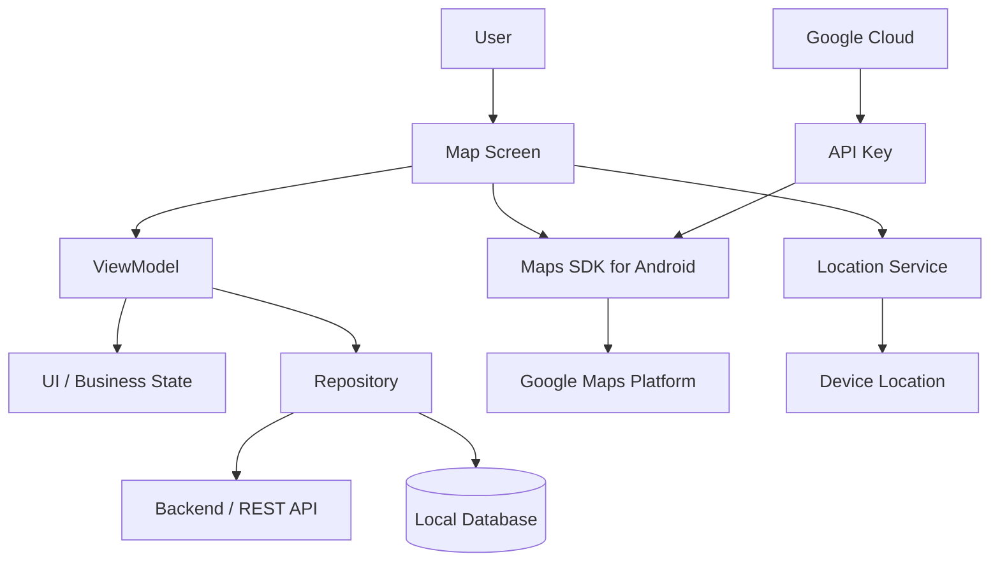
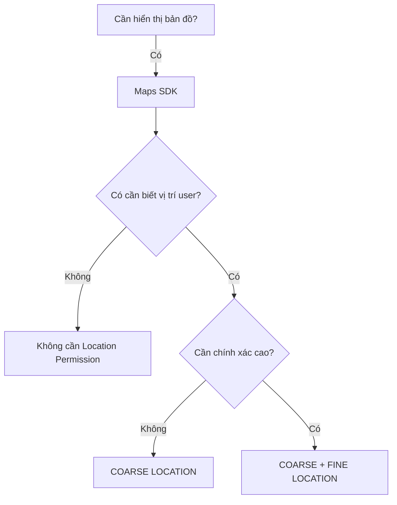
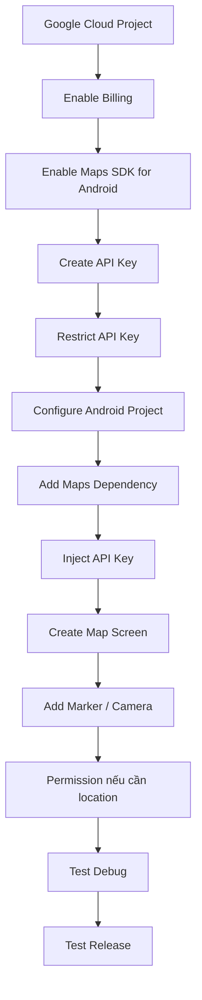
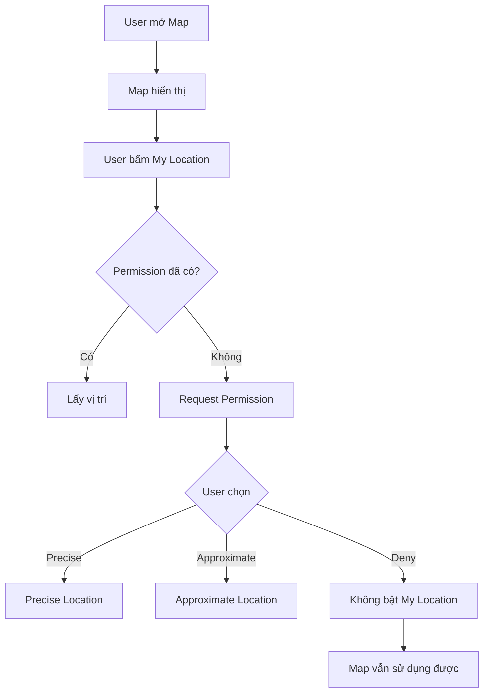
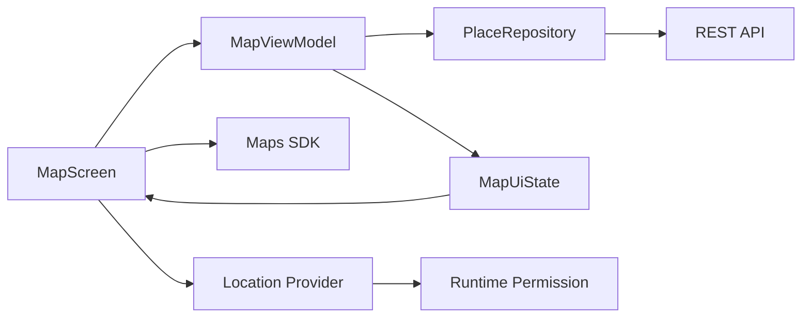
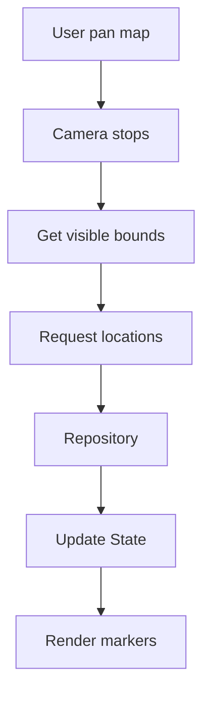
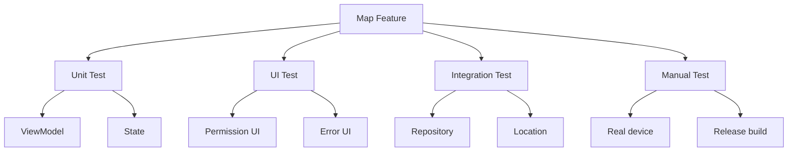
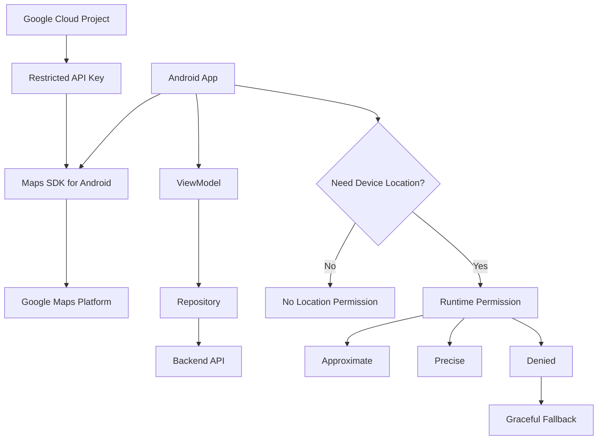

# 010 - Google Maps

**Học phần:** 04 - Network, Async and Services
**Module:** Module 09 - Common Services
**Nhóm nội dung:** Google Services
**Nguồn roadmap:** Common Services / Google Services
**Loại bài:** service
**Thứ tự trong module:** 010
**Thời lượng gợi ý:** 34 phút

---

## 1. Tóm tắt

Bài này giới thiệu **Google Maps trong Android**, tập trung vào **Maps SDK for Android** và cách tích hợp bản đồ vào ứng dụng Android hiện đại.

Sau bài học, bạn cần hiểu rằng Google Maps không chỉ là việc "đặt một bản đồ lên màn hình". Một tính năng bản đồ thực tế thường liên quan đến:

* Google Cloud Project.
* Maps SDK for Android.
* API key.
* Billing và quota.
* Jetpack Compose hoặc View/Fragment.
* Camera position.
* Marker, polyline, polygon.
* Location permission nếu cần vị trí thiết bị.
* Lifecycle.
* UI state.
* Network.
* Privacy.
* API-key security.
* Testing.
* Release configuration.

Google Maps SDK tự xử lý việc kết nối tới dịch vụ Google Maps, tải map tiles, hiển thị bản đồ và xử lý các thao tác như pan/zoom. Với API kiểu View truyền thống, `GoogleMap` được lấy thông qua `SupportMapFragment` hoặc `MapView`.

Trong Android hiện đại sử dụng Jetpack Compose, Google cung cấp thư viện **Maps Compose** với các composable như `GoogleMap`, `Marker`, `Polyline`, `Polygon`, `Circle` và các state object cho camera/map properties.

---

## 2. Mục tiêu học tập

Sau bài này, bạn có thể:

* Giải thích Google Maps SDK bằng ngôn ngữ của mình.
* Phân biệt **bản đồ** và **vị trí thiết bị**.
* Hiểu vai trò của:

  * `GoogleMap`
  * `LatLng`
  * `Marker`
  * Camera
  * `MapProperties`
  * `MapUiSettings`
* Tích hợp Maps SDK vào project Android.
* Cấu hình API key an toàn.
* Hiển thị một vị trí bằng marker.
* Di chuyển camera đến một tọa độ.
* Xin quyền location đúng thời điểm.
* Xử lý trường hợp user từ chối location permission.
* Không làm mất business state khi rotate/background.
* Nhận biết lỗi API key thường gặp.
* Chuẩn bị cấu hình debug/release.
* Tạo một demo Google Maps đủ tốt để đưa vào portfolio.

---

# 3. Google Maps nằm ở đâu trong kiến trúc Android?

Google Maps chủ yếu thuộc **UI + Service Integration**, nhưng trên ứng dụng thực tế nó kết nối với nhiều tầng.



Một màn hình bản đồ có thể phải quản lý đồng thời:

```text
Map rendering
      +
Camera state
      +
Selected marker
      +
Location permission
      +
Device location
      +
Backend data
      +
Network failures
```

Vì vậy, không nên coi Google Maps chỉ là một UI widget.

---

# 4. Google Maps SDK là gì?

**Maps SDK for Android** cho phép ứng dụng Android nhúng bản đồ Google Maps trực tiếp vào UI.

Một số chức năng thường gặp:

* Hiển thị bản đồ.
* Zoom.
* Pan.
* Rotate.
* Tilt.
* Marker.
* Info Window.
* Polyline.
* Polygon.
* Circle.
* Ground overlay.
* Map styling.
* Camera animation.
* Traffic.
* Gesture handling.

Các đối tượng cốt lõi trong API truyền thống gồm `GoogleMap`, `SupportMapFragment`, `MapView` và `OnMapReadyCallback`.

---

# 5. Google Maps khác Location Service

Đây là khái niệm rất quan trọng.

## Google Maps

Trả lời câu hỏi:

> "Tôi muốn **hiển thị bản đồ**."

Ví dụ:

```text
Hiển thị Hà Nội trên bản đồ.
```

Không nhất thiết cần permission location.

---

## Location

Trả lời câu hỏi:

> "Thiết bị của người dùng **đang ở đâu**?"

Ví dụ:

```text
Điện thoại hiện đang ở 21.0285, 105.8542.
```

Lúc này mới liên quan đến:

```text
ACCESS_COARSE_LOCATION
ACCESS_FINE_LOCATION
```

Android khuyến nghị chỉ yêu cầu mức location thực sự cần thiết. Nếu approximate location đủ cho use case, nên ưu tiên `ACCESS_COARSE_LOCATION`.

---

## Quy tắc đơn giản



---

# 6. Các thành phần quan trọng

## 6.1 `LatLng`

Biểu diễn tọa độ địa lý.

Ví dụ:

```kotlin
val hanoi = LatLng(
    21.0285,
    105.8542
)
```

Trong đó:

```text
latitude  = 21.0285
longitude = 105.8542
```

---

# 6.2 Camera

Camera quyết định khu vực bản đồ mà user đang nhìn.

Camera thường có:

```text
Target
Latitude
Longitude
Zoom
Bearing
Tilt
```

Ví dụ:

```text
Zoom 3
↓
Quốc gia

Zoom 10
↓
Thành phố

Zoom 15
↓
Đường phố

Zoom 18+
↓
Tòa nhà
```

---

# 6.3 Marker

Marker đánh dấu một vị trí.

Ví dụ:

```text
        📍
   Bách Khoa Hà Nội
        │
        │
────────────────────
       MAP
```

Một marker thường chứa:

```text
position
title
snippet
icon
```

---

# 6.4 Polyline

Polyline thường được dùng cho:

* Route.
* Đường đi.
* GPS track.
* Delivery path.

```text
A ●────────●────────● B
```

---

# 6.5 Polygon

Polygon biểu diễn một vùng.

Ví dụ:

```text
┌─────────────────┐
│                 │
│ Delivery Zone   │
│                 │
└─────────────────┘
```

---

# 6.6 Circle

Circle thường dùng để biểu diễn:

* Bán kính tìm kiếm.
* Geo-fence trực quan.
* Khu vực xung quanh user.

```text
        .────────.
     .'            '.
    /       ●        \
    \                /
     '.            .'
        '────────'
```

---

# 7. Maps SDK với Jetpack Compose

Với ứng dụng Compose, Google cung cấp **Maps Compose Library**.

Các composable quan trọng gồm:

```text
GoogleMap
Marker
Polyline
Polygon
Circle
GroundOverlay
TileOverlay
```

Ngoài ra có:

```text
CameraPositionState
MapProperties
MapUiSettings
```

Google Maps Compose quản lý phần lớn lifecycle integration cho map, giúp code ngắn hơn so với View API truyền thống.

---

# 8. Luồng tích hợp Maps SDK

Một quy trình production thường là:



Maps SDK yêu cầu project Google Cloud, Maps SDK được bật và credential hợp lệ. Billing cũng phải được cấu hình cho project sử dụng Maps SDK.

---

# 9. Bước 1 — Tạo Google Cloud Project

Trong Google Cloud:

```text
Google Cloud Console
        ↓
Create Project
        ↓
Enable Billing
        ↓
Enable Maps SDK for Android
```

Không nên bật hàng loạt API không sử dụng.

Ví dụ app chỉ sử dụng:

```text
Maps SDK for Android
```

thì không nhất thiết phải bật:

```text
Places API
Directions API
Geocoding API
...
```

---

# 10. Bước 2 — Tạo API Key

Google Maps Platform sử dụng API key để xác thực request và liên kết usage với Cloud project.

Ví dụ:

```text
AIza...
```

Không đưa API key thật vào:

```text
README
GitHub
commit
screenshot
tutorial
Stack Overflow
```

---

# 11. Bước 3 — Restrict API Key

Production key nên được giới hạn.

Đối với Android:

```text
Application restriction
        ↓
Android apps
        ↓
Package name
        +
SHA certificate fingerprint
```

Ví dụ:

```text
Package:

com.example.mapdemo
```

và:

```text
SHA-1 fingerprint
```

Sau đó thêm API restriction:

```text
Maps SDK for Android
```

Google khuyến nghị áp dụng cả **application restriction** và **API restriction** cho key. Với Maps SDK for Android, restriction phù hợp là Android app restriction.

---

# 12. Debug key và Release key

Một lỗi production cực kỳ phổ biến:

```text
Debug build
    ↓
Map hoạt động

Release build
    ↓
Map trắng / authentication error
```

Nguyên nhân có thể là:

```text
Debug SHA-1 != Release SHA-1
```

Ví dụ:

```text
API Key
├── com.example.app + Debug SHA-1
└── com.example.app + Release SHA-1
```

Nếu sử dụng Play App Signing, cần kiểm tra certificate fingerprint phù hợp với bản phân phối trên Google Play.

---

# 13. Không hard-code API key

Không nên viết:

```kotlin
val apiKey = "AIza..."
```

hoặc:

```xml
android:value="AIza..."
```

rồi commit lên Git.

Google khuyến nghị dùng **Secrets Gradle Plugin** và lưu secret ngoài source control, chẳng hạn `secrets.properties`.

Ví dụ:

```properties
MAPS_API_KEY=YOUR_API_KEY
```

File này cần được loại khỏi Git.

```gitignore
secrets.properties
```

---

# 14. Manifest

API key cuối cùng được cung cấp cho Maps SDK thông qua manifest metadata.

```xml
<application
    ...>

    <meta-data
        android:name="com.google.android.geo.API_KEY"
        android:value="${MAPS_API_KEY}" />

</application>
```

`com.google.android.geo.API_KEY` là metadata name hiện tại được Google khuyến nghị sử dụng.

---

# 15. Thêm Maps Compose

Đối với project Jetpack Compose:

```kotlin
dependencies {

    implementation(
        "com.google.maps.android:maps-compose:<version>"
    )

}
```

Tài liệu Google tại thời điểm tháng 8/2026 đang minh họa Maps Compose `8.4.0`; khi làm project thực tế nên kiểm tra version hiện tại thay vì cố định theo tài liệu khóa học.

---

# 16. Demo đầu tiên — Hiển thị Hà Nội

```kotlin
@Composable
fun MapScreen() {

    val hanoi = LatLng(
        21.0285,
        105.8542
    )

    val cameraState = rememberCameraPositionState {
        position = CameraPosition.fromLatLngZoom(
            hanoi,
            13f
        )
    }

    GoogleMap(
        modifier = Modifier.fillMaxSize(),
        cameraPositionState = cameraState
    ) {

        Marker(
            state = rememberUpdatedMarkerState(
                position = hanoi
            ),
            title = "Hà Nội",
            snippet = "Thủ đô Việt Nam"
        )
    }
}
```

Luồng:

```text
MapScreen
    ↓
CameraPositionState
    ↓
GoogleMap
    ↓
Marker
    ↓
LatLng
```

---

# 17. State trong Google Maps

Không nên nghĩ toàn bộ state của màn hình là `GoogleMap`.

Ví dụ màn hình:

```text
MapScreenState
│
├── selectedPlace
├── places
├── loading
├── error
├── permissionState
├── userLocation
└── filters
```

Trong khi map-specific UI state gồm:

```text
camera
map type
gesture settings
selected marker visual state
```

---

# 18. Kiến trúc ViewModel

Ví dụ:

```kotlin
data class MapUiState(

    val places: List<Place> = emptyList(),

    val selectedPlace: Place? = null,

    val isLoading: Boolean = false,

    val error: String? = null

)
```

ViewModel:

```kotlin
class MapViewModel : ViewModel() {

    private val _uiState =
        MutableStateFlow(MapUiState())

    val uiState =
        _uiState.asStateFlow()

}
```

Compose:

```text
ViewModel
   │
   ▼
StateFlow<MapUiState>
   │
   ▼
collectAsStateWithLifecycle()
   │
   ▼
MapScreen
   │
   ├── Marker
   └── Selected Place
```

---

# 19. Không đưa `GoogleMap` object vào ViewModel

Không nên:

```text
ViewModel
    ↓
GoogleMap instance
```

GoogleMap là đối tượng UI/lifecycle-related.

ViewModel nên lưu dữ liệu kiểu:

```text
LatLng
Place
PlaceId
Selected marker ID
Filters
Search result
```

thay vì giữ:

```text
Activity
Fragment
MapView
GoogleMap
Context của Activity
```

---

# 20. Lifecycle

Với View API:

```text
Activity / Fragment
        ↓
SupportMapFragment
        ↓
GoogleMap
```

`SupportMapFragment` giúp quản lý lifecycle của map. `GoogleMap` chỉ nên được sử dụng sau khi map đã sẵn sàng.

---

## MapView

Nếu sử dụng `MapView` trực tiếp, lifecycle phức tạp hơn và cần đồng bộ các lifecycle callbacks tương ứng.

Vì vậy trong project mới:

```text
Compose
    ↓
Maps Compose
```

hoặc:

```text
Fragment
    ↓
SupportMapFragment
```

thường dễ quản lý hơn.

---

# 21. Configuration change

Giả sử user đang xem:

```text
Hà Nội
Zoom = 16
Selected marker = Restaurant #42
```

Sau đó rotate:

```text
Portrait
    ↓
Landscape
```

Không nên trở thành:

```text
Map reset
    ↓
World map
    ↓
Selected marker lost
```

Cần phân biệt:

```text
Transient map UI state
```

và:

```text
Business state cần khôi phục
```

Ví dụ selected place ID có thể lưu ở:

```text
ViewModel
SavedStateHandle
```

---

# 22. Location Permission

Nếu chỉ hiển thị:

```text
Hà Nội
Tokyo
New York
Store locations
Restaurant markers
```

thì **không cần location permission**.

Nếu cần:

```text
My Location
Nearby stores
Current position
Live tracking
```

thì mới xin quyền.

---

# 23. Manifest Location Permission

Nếu approximate location đủ:

```xml
<uses-permission
    android:name="android.permission.ACCESS_COARSE_LOCATION" />
```

Nếu cần precise location:

```xml
<uses-permission
    android:name="android.permission.ACCESS_COARSE_LOCATION" />

<uses-permission
    android:name="android.permission.ACCESS_FINE_LOCATION" />
```

Android yêu cầu khi muốn xin precise location thì `ACCESS_FINE_LOCATION` phải được request cùng `ACCESS_COARSE_LOCATION`. User vẫn có thể chọn chỉ cung cấp vị trí approximate.

---

# 24. Permission Flow



Điểm quan trọng:

> User từ chối location **không nên khiến toàn bộ màn hình Maps bị vô hiệu hóa** nếu phần còn lại của tính năng không phụ thuộc vào vị trí.

---

# 25. Graceful degradation

Sai:

```text
Permission denied
       ↓
App crash
```

Sai:

```text
Permission denied
       ↓
Không cho sử dụng Maps
```

Tốt hơn:

```text
Permission denied
       ↓
Map vẫn hoạt động
       ↓
Ẩn My Location
       ↓
Cho search địa điểm thủ công
```

Android cũng khuyến nghị ứng dụng cung cấp trải nghiệm giảm cấp hợp lý khi user không cấp permission.

---

# 26. Bật My Location an toàn

Không làm:

```kotlin
properties = MapProperties(
    isMyLocationEnabled = true
)
```

mà chưa kiểm tra permission.

Thay vào đó:

```kotlin
val properties = MapProperties(
    isMyLocationEnabled = hasLocationPermission
)
```

Luồng:

```text
Permission
    ↓
hasLocationPermission
    ↓
MapProperties
    ↓
isMyLocationEnabled
```

---

# 27. Map UI Settings

Có thể điều chỉnh các hành vi UI như:

```text
Zoom controls
Compass
Zoom gestures
Scroll gestures
Rotate gestures
Tilt gestures
```

Maps SDK hỗ trợ cấu hình camera và nhiều gesture/UI controls khác nhau.

Ví dụ Compose:

```kotlin
val uiSettings = MapUiSettings(
    zoomControlsEnabled = false
)

GoogleMap(
    uiSettings = uiSettings
)
```

---

# 28. Marker từ dữ liệu backend

Ứng dụng thật thường không hard-code marker.

Backend:

```json
[
  {
    "id": "store_01",
    "name": "Store A",
    "latitude": 21.0285,
    "longitude": 105.8542
  }
]
```

Repository:

```text
API
 ↓
Repository
 ↓
ViewModel
 ↓
UiState
 ↓
Map
```

Render:

```kotlin
uiState.places.forEach { place ->

    Marker(
        state = rememberUpdatedMarkerState(
            LatLng(
                place.latitude,
                place.longitude
            )
        ),
        title = place.name
    )
}
```

---

# 29. Không để Maps gọi API business trực tiếp

Không nên:

```text
GoogleMap
   ↓
Retrofit
   ↓
Backend
```

Nên:

```text
MapScreen
    ↓
ViewModel
    ↓
Repository
    ↓
API
```

Sau đó:

```text
API data
    ↓
UI State
    ↓
Marker
```

---

# 30. Ví dụ kiến trúc hoàn chỉnh



---

# 31. Network và Google Maps

Map tiles phụ thuộc vào network.

Do đó có thể xảy ra:

```text
Internet chậm
Internet mất
Google services unavailable
Authentication lỗi
Quota/billing lỗi
```

Không nên giả định:

```text
Map visible = network always healthy
```

App cần xử lý riêng dữ liệu nghiệp vụ.

Ví dụ:

```text
Map load thành công

nhưng

GET /restaurants thất bại
```

UI có thể:

```text
Map vẫn hiển thị
+
Snackbar "Không tải được địa điểm"
+
Retry
```

---

# 32. Trạng thái màn hình nên tách riêng

Ví dụ:

```kotlin
sealed interface PlaceLoadState {

    data object Loading : PlaceLoadState

    data class Success(
        val places: List<Place>
    ) : PlaceLoadState

    data class Error(
        val message: String
    ) : PlaceLoadState

}
```

Không nên coi:

```text
Map tải được
```

là:

```text
Toàn bộ feature thành công
```

---

# 33. Performance

Map là UI tương đối nặng.

Một lỗi phổ biến:

```text
Backend trả 10.000 địa điểm
        ↓
Render 10.000 marker
        ↓
UI lag
```

Không nên luôn render toàn bộ dataset.

Có thể sử dụng:

```text
Viewport filtering
Clustering
Server-side bounding box
Pagination
Zoom-based loading
```

Ví dụ:

```text
Camera viewport
      ↓
Bounding Box

north = ...
south = ...
east  = ...
west  = ...

      ↓

GET /places?
north=...
south=...
east=...
west=...
```

---

# 34. Camera-driven data loading

Một pattern thường gặp:



Nhưng không nên gọi API mỗi pixel khi camera đang chuyển động.

Có thể áp dụng:

```text
debounce
distinctUntilChanged
bounding-box cache
```

---

# 35. Privacy

Location là dữ liệu nhạy cảm.

Không thu thập vị trí chỉ vì:

> "Có Maps nên chắc cần location."

Nên hỏi:

```text
Feature có thật sự cần vị trí không?
```

Nếu chỉ cần:

```text
User chọn thành phố
```

thì có thể không cần GPS.

Android khuyến nghị giảm số lượng permission được yêu cầu và chỉ yêu cầu mức quyền phù hợp với use case.

---

# 36. Google Play Data Safety

Nếu ứng dụng sử dụng Maps SDK hoặc thu thập location, cần kiểm tra lại khai báo **Data safety** của ứng dụng.

Google cung cấp tài liệu riêng mô tả dữ liệu liên quan đến Maps SDK nhằm hỗ trợ developer hoàn thành khai báo Google Play, nhưng developer vẫn chịu trách nhiệm khai báo chính xác theo cách app thực sự sử dụng dữ liệu.

Checklist:

```text
[ ] Maps SDK có được sử dụng?
[ ] App có lấy device location?
[ ] Location có gửi lên backend?
[ ] Có lưu location không?
[ ] Lưu trong bao lâu?
[ ] Có chia sẻ cho bên thứ ba?
[ ] Privacy Policy có mô tả không?
[ ] Data Safety đã cập nhật chưa?
```

---

# 37. Google Maps attribution

Không được tùy tiện:

```text
che Google logo
xóa attribution
crop attribution
```

Ứng dụng sử dụng Maps SDK cần tuân thủ các yêu cầu attribution và chính sách của Google Maps Platform.

---

# 38. API key security

Một API key Maps trong Android app không nên được coi giống một password server-side tuyệt đối bí mật.

Điều quan trọng là giới hạn phạm vi key.

Defense:

```text
API Key
  │
  ├── Android Application Restriction
  │       ├── package
  │       └── signing fingerprint
  │
  └── API Restriction
          └── Maps SDK for Android
```

Google đặc biệt khuyến nghị hạn chế API key để giảm rủi ro unauthorized usage và chi phí phát sinh.

---

# 39. Debugging — Map trắng

Nếu app chạy nhưng bản đồ không xuất hiện:

```text
Map trắng
   │
   ├── API key sai
   │
   ├── Maps SDK chưa enable
   │
   ├── Billing chưa enable
   │
   ├── Package restriction sai
   │
   ├── SHA fingerprint sai
   │
   ├── Release certificate khác
   │
   ├── Network lỗi
   │
   └── Emulator thiếu Google APIs
```

---

# 40. Debug bằng Logcat

Tìm các từ khóa:

```text
Google Maps Android API
Authorization failure
API key
billing
authentication
```

Nếu xuất hiện lỗi authentication, kiểm tra theo thứ tự:

```text
1. API key
2. Cloud project
3. Maps SDK enabled
4. Package name
5. SHA-1
6. Billing
7. Debug vs release signing
```

---

# 41. Emulator

Maps SDK cần môi trường Android có Google APIs phù hợp.

Khi tạo emulator nên sử dụng system image có Google APIs/Play Store thích hợp. Quickstart chính thức của Google cũng yêu cầu device/emulator tương thích Google APIs.

---

# 42. Các failure scenario cần xử lý

Tối thiểu nên nghĩ đến:

### Scenario A — User deny permission

```text
Location Permission
        ↓
      DENIED
        ↓
Map vẫn hiển thị
        ↓
My Location disabled
```

---

### Scenario B — Network mất

```text
Backend request
     ↓
IOException
     ↓
Error state
     ↓
Retry
```

---

### Scenario C — Không có location

```text
Permission Granted
       ↓
Location = null
       ↓
Không crash
       ↓
Hiển thị fallback
```

---

### Scenario D — API key sai

```text
SDK
 ↓
Authentication failure
 ↓
Logcat
 ↓
Developer configuration error
```

Không nên hiện cho user:

```text
API_KEY_INVALID
```

Thay vào đó có thể sử dụng generic UI:

```text
Không thể tải bản đồ.
```

Chi tiết để trong:

```text
Logcat
Crash reporting
Monitoring
```

---

# 43. Testing Strategy

Google Maps feature nên được test theo nhiều lớp.



---

# 44. Unit test cái gì?

Không cần unit test Google Maps SDK.

Nên unit test business logic.

Ví dụ:

```text
Given:

permission = denied

When:

user presses locate button

Then:

show permission request
```

Hoặc:

```text
Given:

location unavailable

Then:

map remains usable
```

---

# 45. Test permission

Các trường hợp:

| Trạng thái           | Kết quả mong đợi    |
| -------------------- | ------------------- |
| Permission chưa hỏi  | Request khi cần     |
| Precise granted      | Dùng precise        |
| Approximate granted  | App vẫn hoạt động   |
| Denied               | Không crash         |
| Denied permanently   | Có fallback         |
| Permission bị revoke | State được cập nhật |

---

# 46. Test lifecycle

Thử:

```text
Open Map
 ↓
Select Marker
 ↓
Rotate
```

Kiểm tra:

```text
Selected place có còn không?
```

Thử:

```text
Open Map
 ↓
Background
 ↓
Foreground
```

Kiểm tra:

```text
App có crash?
State có hợp lý?
```

---

# 47. Test release

Không chỉ test debug build.

Checklist:

```text
debug APK
    ✓

release APK
    ?

Google Play build
    ?
```

Đặc biệt kiểm tra:

```text
release SHA fingerprint
API-key restriction
billing
network security
permission
Data Safety
```

---

# 48. Mini Project — Campus Map

## Mục tiêu

Tạo một app:

> **Campus Map**

Hiển thị một số địa điểm trong trường hoặc khu vực giả lập.

Ví dụ:

```text
📍 Library
📍 Building A
📍 Cafeteria
📍 Laboratory
📍 Parking
```

---

# 49. Yêu cầu chức năng

Ứng dụng cần có:

```text
Google Map
+
5 markers
+
Marker selection
+
Camera movement
+
My Location button
+
Permission handling
+
Loading/Error state
```

---

# 50. Model

```kotlin
data class CampusPlace(

    val id: String,

    val name: String,

    val latitude: Double,

    val longitude: Double

)
```

---

# 51. Fake data

```kotlin
val places = listOf(

    CampusPlace(
        id = "library",
        name = "Library",
        latitude = 21.005,
        longitude = 105.843
    ),

    CampusPlace(
        id = "lab",
        name = "AI Laboratory",
        latitude = 21.006,
        longitude = 105.844
    )

)
```

---

# 52. Render markers

```kotlin
GoogleMap(
    modifier = Modifier.fillMaxSize(),
    cameraPositionState = cameraState
) {

    places.forEach { place ->

        Marker(
            state = rememberUpdatedMarkerState(
                LatLng(
                    place.latitude,
                    place.longitude
                )
            ),
            title = place.name,
            onClick = {

                viewModel.selectPlace(
                    place.id
                )

                false
            }
        )
    }
}
```

---

# 53. UI State

```kotlin
data class CampusMapUiState(

    val places: List<CampusPlace> =
        emptyList(),

    val selectedPlaceId: String? =
        null,

    val hasLocationPermission: Boolean =
        false,

    val isLoading: Boolean =
        false,

    val error: String? =
        null

)
```

---

# 54. UX mong đợi

```text
User mở app
      ↓
Map xuất hiện
      ↓
Markers xuất hiện
      ↓
Tap marker
      ↓
Bottom sheet
      ↓
Thông tin địa điểm
```

Nếu bấm:

```text
My Location
```

thì:

```text
Permission?
   │
   ├── Yes → Center user
   │
   └── No  → Map vẫn hoạt động
```

---

# 55. Artifact cho Portfolio

Sau bài này nên tạo artifact:

```text
google-maps-demo/
│
├── screenshot/
│   ├── map.png
│   ├── marker-selected.png
│   └── permission-denied.png
│
├── architecture/
│   └── map-flow.md
│
└── README.md
```

README nên giải thích:

```text
Google Maps integration
API-key configuration
Architecture
Location permission strategy
State management
Failure handling
Testing
Privacy
```

---

# 56. Screenshot nên chụp

### Screenshot 1

```text
Map + nhiều marker
```

### Screenshot 2

```text
Marker selected
+
Bottom sheet
```

### Screenshot 3

```text
Location permission dialog
```

### Screenshot 4

```text
Permission denied
+
Map vẫn sử dụng được
```

Screenshot 4 thể hiện tốt hơn kỹ năng engineering vì cho thấy bạn đã nghĩ đến failure state.

---

# 57. README mẫu ngắn

```markdown
# Campus Map Demo

Android demo sử dụng Maps SDK for Android
và Jetpack Compose.

## Features

- Google Maps
- Camera state
- Multiple markers
- Marker selection
- Runtime location permission
- Approximate location support
- Permission-denied fallback
- ViewModel state management

## Architecture

MapScreen
→ ViewModel
→ Repository
→ Data Source

## Security

API key không được commit vào repository.

Key được giới hạn theo:

- Android package
- Signing certificate
- Maps SDK for Android
```

---

# 58. Bài thực hành

## Task 1 — Configure Maps

Thực hiện:

1. Tạo Google Cloud Project.
2. Enable billing.
3. Enable Maps SDK for Android.
4. Tạo API key.
5. Restrict key.
6. Thêm dependency.
7. Cấu hình key bằng Secrets Gradle Plugin.

**Artifact:**

```text
README setup instructions
```

Không chụp hoặc commit API key thật.

---

## Task 2 — Basic Map

Tạo:

```text
MapScreen
```

Hiển thị:

```text
Hà Nội
```

Camera:

```text
zoom = 13
```

**Artifact:**

```text
Screenshot map
```

---

## Task 3 — Markers

Tạo ít nhất:

```text
5 markers
```

Khi click:

```text
Marker
 ↓
Selected Place
 ↓
Bottom Sheet
```

**Artifact:**

```text
Screenshot selected marker
```

---

## Task 4 — Location Permission

Thêm:

```text
My Location
```

Xử lý:

```text
Precise
Approximate
Denied
```

Yêu cầu:

> Denied không được khiến app crash.

**Artifact:**

```text
Permission flow diagram
+
Screenshot denied scenario
```

---

## Task 5 — Lifecycle

Thực hiện:

```text
Select marker
 ↓
Rotate device
```

Kiểm tra:

```text
Selected place vẫn hợp lý.
```

Sau đó:

```text
Background
 ↓
Foreground
```

Kiểm tra:

```text
Không crash.
```

---

## Task 6 — Release Test

Build:

```text
release
```

Kiểm tra:

```text
Map có hiển thị?
```

Nếu không:

```text
Check signing fingerprint
```

**Artifact:**

```text
Release checklist
```

---

# 59. Bài tập

Thiết kế ứng dụng:

> **Nearby Coffee Map**

Yêu cầu:

```text
Google Map
+
Coffee shop markers
+
Current location
+
Selected shop
+
Distance
+
Error handling
```

Hãy mô tả:

1. Google Maps nằm ở layer nào?
2. Khi nào cần location permission?
3. Nếu user chỉ cho approximate location thì sao?
4. Marker data đến từ đâu?
5. Selected marker lưu ở đâu?
6. Network fail thì UI thế nào?
7. Rotate có làm mất selected shop không?
8. API key được bảo vệ thế nào?
9. Release SHA khác debug SHA ảnh hưởng thế nào?
10. Data Safety có cần kiểm tra không?

---

# 60. Câu hỏi tự kiểm tra

### Câu 1

Hiển thị Google Map có bắt buộc `ACCESS_FINE_LOCATION` không?

**Đáp án:** Không.

---

### Câu 2

Khi nào mới cần location permission?

**Đáp án:** Khi ứng dụng cần đọc vị trí của thiết bị/user.

---

### Câu 3

API key có nên commit lên GitHub không?

**Đáp án:** Không.

---

### Câu 4

Hai restriction quan trọng của Maps API key là gì?

**Đáp án:**

```text
Application restriction
+
API restriction
```

---

### Câu 5

Tại sao map chạy debug nhưng không chạy release?

Một nguyên nhân phổ biến:

```text
release signing fingerprint
```

chưa được cấu hình cho API key.

---

### Câu 6

`GoogleMap` có nên lưu trong ViewModel không?

**Đáp án:** Không.

ViewModel nên chứa business/UI state, không giữ UI object phụ thuộc lifecycle.

---

### Câu 7

User từ chối location permission thì có nên đóng toàn bộ map không?

**Đáp án:** Thường không.

Nếu map vẫn có chức năng không phụ thuộc device location thì nên giữ chúng hoạt động.

---

# 61. Những lỗi beginner thường gặp

## Lỗi 1

```text
Maps = GPS
```

Thực tế:

```text
Maps != Location
```

---

## Lỗi 2

Xin `ACCESS_FINE_LOCATION` ngay khi app mở dù chưa cần.

Tốt hơn:

```text
User bấm My Location
        ↓
Request permission
```

---

## Lỗi 3

API key nằm trong Git.

```text
git commit
   ↓
GitHub
   ↓
API key leaked
```

---

## Lỗi 4

Không restrict API key.

```text
Leaked Key
   ↓
Unauthorized usage
   ↓
Quota / billing risk
```

---

## Lỗi 5

Chỉ test Debug.

```text
Debug ✓

Release ✗
```

---

## Lỗi 6

Render hàng nghìn marker cùng lúc.

```text
10.000 markers
      ↓
Poor performance
```

---

## Lỗi 7

API gọi trực tiếp từ Map composable.

Sai kiến trúc:

```text
Composable
 ↓
Retrofit
```

Nên:

```text
Composable
 ↓
ViewModel
 ↓
Repository
 ↓
API
```

---

# 62. Production checklist

## Cloud

* [ ] Billing đã bật.
* [ ] Maps SDK for Android đã bật.
* [ ] Không enable API không cần thiết.
* [ ] Quota/usage được theo dõi.

## API Key

* [ ] API key không nằm trong Git.
* [ ] Có Android application restriction.
* [ ] Package name chính xác.
* [ ] Debug signing fingerprint chính xác.
* [ ] Release signing fingerprint chính xác.
* [ ] Có API restriction cho Maps SDK.
* [ ] Production và development key được quản lý hợp lý.

## Permission

* [ ] Không xin location nếu không cần.
* [ ] Approximate location được hỗ trợ nếu phù hợp.
* [ ] Precise location chỉ yêu cầu khi feature cần.
* [ ] Denied state không crash.
* [ ] User có fallback.

## Lifecycle

* [ ] Rotate không làm hỏng feature.
* [ ] Background/foreground không crash.
* [ ] Không lưu `Activity` trong ViewModel.
* [ ] Không lưu `GoogleMap` trong ViewModel.
* [ ] Business state được khôi phục hợp lý.

## Network

* [ ] Backend failure có error state.
* [ ] Có retry khi phù hợp.
* [ ] Loading state rõ ràng.
* [ ] Empty state rõ ràng.

## Performance

* [ ] Không render marker vô hạn.
* [ ] Có clustering nếu dataset lớn.
* [ ] Có viewport filtering nếu cần.
* [ ] Không gọi API liên tục khi camera đang pan.

## Privacy

* [ ] Chỉ thu thập location cần thiết.
* [ ] Privacy Policy phản ánh cách sử dụng location.
* [ ] Google Play Data Safety được kiểm tra.
* [ ] Không log tọa độ nhạy cảm không cần thiết.

## Release

* [ ] Test Debug.
* [ ] Test Release.
* [ ] Test thiết bị thật.
* [ ] Test emulator.
* [ ] Test permission denied.
* [ ] Test approximate location.
* [ ] Test offline/poor network.
* [ ] Kiểm tra attribution.
* [ ] Kiểm tra Cloud usage.

---

# 63. Sơ đồ tổng kết



---

# 64. Mental Model

Hãy ghi nhớ Google Maps bằng chuỗi:

```text
Google Cloud
    ↓
Maps SDK
    ↓
Restricted API Key
    ↓
GoogleMap
    ↓
Camera
    ↓
Markers / Shapes
    ↓
UI State
    ↓
Location nếu thực sự cần
    ↓
Permission
    ↓
Failure Handling
    ↓
Testing
    ↓
Release
```

Hay ngắn hơn:

> **Maps hiển thị không gian; Location cho biết thiết bị đang ở đâu; ViewModel quản lý state; Repository quản lý dữ liệu; API key cần được giới hạn; permission phải được xin theo nhu cầu của user.**

---

# 65. Checklist hoàn thành bài

* [ ] Giải thích được Maps SDK for Android.
* [ ] Phân biệt được Maps và Location.
* [ ] Hiểu `LatLng`.
* [ ] Hiểu Marker.
* [ ] Hiểu Camera.
* [ ] Biết Polyline/Polygon/Circle dùng khi nào.
* [ ] Hiển thị được Google Map trong Compose.
* [ ] Thêm được marker.
* [ ] Biết quản lý camera state.
* [ ] Biết cấu hình API key.
* [ ] Không commit API key.
* [ ] Biết restrict API key.
* [ ] Hiểu debug/release signing fingerprint.
* [ ] Biết khi nào cần location permission.
* [ ] Xử lý được approximate/precise/denied.
* [ ] Không lưu `GoogleMap` trong ViewModel.
* [ ] Có failure state.
* [ ] Có lifecycle test.
* [ ] Có release test.
* [ ] Có privacy note.
* [ ] Có screenshot/demo cho portfolio.

---

# 66. Ghi chú sản xuất

Khi đưa Google Maps vào production, đừng chỉ hỏi:

> "Map có hiển thị không?"

Hãy hỏi toàn bộ chuỗi:

```text
API key có an toàn?
        ↓
Release signing có đúng?
        ↓
Billing/quota có kiểm soát?
        ↓
Permission có thực sự cần?
        ↓
User deny thì sao?
        ↓
Approximate location có dùng được?
        ↓
Network fail thì sao?
        ↓
Marker data có quá lớn?
        ↓
Rotate/background có mất state?
        ↓
Privacy/Data Safety đã cập nhật?
        ↓
Release build đã test?
```

Một Android developer mạnh không chỉ biết đặt `GoogleMap()` lên màn hình, mà còn hiểu **Google Maps là một service nằm giữa UI, cloud configuration, lifecycle, location, privacy, security, network và release engineering**.
