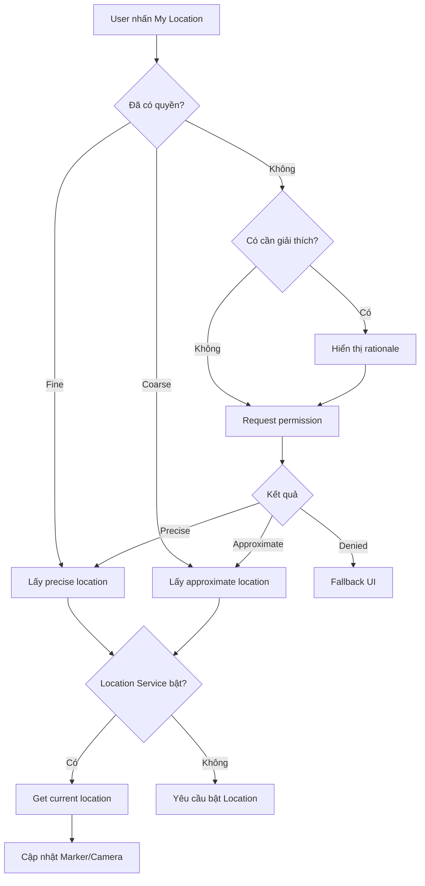
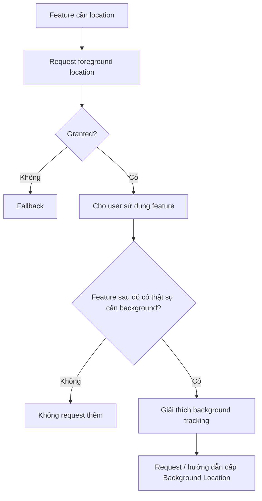
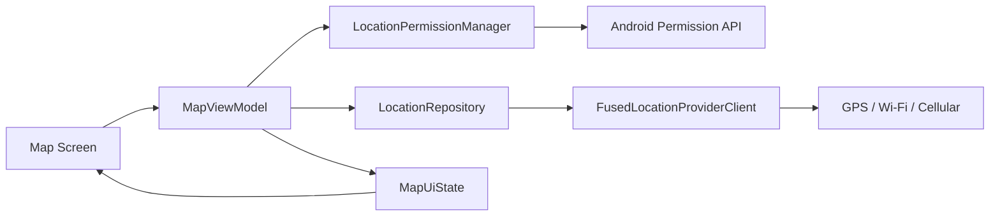

# 012 - Location Permission

**Học phần:** 04 - Network, Async and Services
**Module:** Module 09 - Common Services
**Nhóm nội dung:** Google Services
**Nguồn roadmap:** Common Services / Google Services
**Loại bài:** `service`
**Thứ tự trong module:** 012
**Thời lượng gợi ý:** 34 phút

---

## 1. Tóm tắt

**Location Permission** là cơ chế quyền của Android kiểm soát việc ứng dụng có được phép truy cập vị trí thiết bị hay không.

Các tính năng thường cần quyền vị trí:

* Hiển thị vị trí hiện tại trên Google Maps.
* Tìm cửa hàng/địa điểm gần người dùng.
* Gắn Marker tại vị trí hiện tại.
* Theo dõi hoạt động chạy bộ, giao hàng hoặc hành trình.
* Geofencing.
* Điều hướng.
* Gắn tọa độ cho một nội dung do người dùng tạo.

Điểm quan trọng là:

> **Có Google Maps không đồng nghĩa với việc phải xin Location Permission.**

Ứng dụng có thể hiển thị bản đồ, Marker, Polygon, Polyline... mà không cần biết vị trí của người dùng.

Chỉ khi ứng dụng muốn **truy cập vị trí thiết bị**, quyền vị trí mới trở thành vấn đề.

Android phân biệt:

* Vị trí gần đúng — `ACCESS_COARSE_LOCATION`.
* Vị trí chính xác — `ACCESS_FINE_LOCATION`.
* Vị trí khi ứng dụng chạy nền — `ACCESS_BACKGROUND_LOCATION`.

Trên Android 12 trở lên, người dùng có thể chỉ cấp **Approximate location** ngay cả khi ứng dụng yêu cầu vị trí chính xác. Vì vậy ứng dụng phải được thiết kế để hoạt động hợp lý với cả hai mức quyền. ([Android Developers][1])

---

## 2. Mục tiêu học tập

Sau bài này, bạn có thể:

* Giải thích Location Permission trong Android.

* Phân biệt `COARSE`, `FINE` và `BACKGROUND`.

* Biết khi nào thực sự cần xin quyền vị trí.

* Khai báo permission trong `AndroidManifest.xml`.

* Xin permission ở runtime bằng Kotlin.

* Xử lý:

  * precise location;
  * approximate location;
  * permission denied;
  * permission bị thu hồi;
  * Location Service bị tắt.

* Hiểu rằng **permission** và **GPS/Location Service** là hai vấn đề khác nhau.

* Kết nối permission với `FusedLocationProviderClient`.

* Thiết kế UI không bị crash khi người dùng từ chối.

* Kiểm thử các trạng thái permission.

* Hiểu ảnh hưởng đến privacy và Google Play release.

* Tạo một demo có thể đưa vào portfolio.

---

# 3. Location Permission nằm ở đâu trong ứng dụng?

Có thể hình dung:

```text
┌───────────────────────┐
│          UI           │
│ "My Location" button  │
└──────────┬────────────┘
           │
           ▼
┌───────────────────────┐
│ Permission handling   │
│ COARSE / FINE         │
└──────────┬────────────┘
           │ Granted
           ▼
┌───────────────────────┐
│ Location Service      │
│ GPS / Wi-Fi / Cell    │
└──────────┬────────────┘
           │
           ▼
┌────────────────────────────┐
│ FusedLocationProviderClient│
└──────────┬─────────────────┘
           │
           ▼
┌───────────────────────┐
│ latitude / longitude  │
└──────────┬────────────┘
           │
           ▼
┌───────────────────────┐
│ Google Maps / Marker  │
└───────────────────────┘
```

Location Permission nằm ở **ranh giới giữa tính năng của app và dữ liệu nhạy cảm của thiết bị**.

Không nên xem permission chỉ là:

```kotlin
requestPermission()
```

Mà nên coi nó là một **state machine** của ứng dụng.

---

# 4. Ba quyền vị trí quan trọng

## 4.1 `ACCESS_COARSE_LOCATION`

Cho phép truy cập **vị trí gần đúng**.

```xml
<uses-permission
    android:name="android.permission.ACCESS_COARSE_LOCATION" />
```

Phù hợp với:

* Thời tiết theo khu vực.
* Tìm địa điểm gần người dùng.
* Nội dung địa phương.
* Các tính năng không cần biết chính xác người dùng đang đứng ở đâu.

Android khuyến nghị dùng coarse location nếu độ chính xác cao không thực sự cần thiết. ([Android Developers][2])

---

## 4.2 `ACCESS_FINE_LOCATION`

Cho phép ứng dụng yêu cầu **vị trí chính xác hơn**.

```xml
<uses-permission
    android:name="android.permission.ACCESS_FINE_LOCATION" />
```

Ví dụ:

* Navigation.
* Hiển thị vị trí hiện tại trên bản đồ.
* Theo dõi hoạt động thể thao.
* Một số ứng dụng giao hàng.
* Một số tính năng bản đồ cần tọa độ chính xác.

Tuy nhiên:

> Khai báo `ACCESS_FINE_LOCATION` không đảm bảo người dùng sẽ cho ứng dụng vị trí chính xác.

Trên Android 12+, người dùng có thể chọn:

```text
Location accuracy

○ Precise
● Approximate
```

Nếu chỉ cấp Approximate:

```text
ACCESS_FINE_LOCATION   = false
ACCESS_COARSE_LOCATION = true
```

Android hiện khuyến nghị khi cần yêu cầu precise location thì request `FINE` và `COARSE` cùng nhau. ([Android Developers][1])

---

## 4.3 `ACCESS_BACKGROUND_LOCATION`

Cho phép truy cập location khi ứng dụng không còn ở foreground.

```xml
<uses-permission
    android:name="android.permission.ACCESS_BACKGROUND_LOCATION" />
```

Ví dụ có thể cần:

```text
Ứng dụng chạy bộ
        │
        ├── User khóa màn hình
        │
        └── App vẫn cần theo dõi hành trình
```

Hoặc một số use case liên quan:

* Location tracking.
* Một số geofence.
* Safety/location-sharing app.

Đây là quyền rất nhạy cảm.

Google Play yêu cầu background location phải thực sự cần cho **core functionality** và có các yêu cầu disclosure/privacy riêng. ([Google Help][3])

Trong ứng dụng thông thường:

> Không khai báo `ACCESS_BACKGROUND_LOCATION` nếu bạn không thật sự cần nó.

---

# 5. Foreground và Background Location

## Foreground

Người dùng đang sử dụng tính năng có liên quan đến location.

Ví dụ:

```text
User mở Map
      ↓
Nhấn "Vị trí của tôi"
      ↓
App lấy location
      ↓
Camera di chuyển tới vị trí
```

Thông thường chỉ cần:

```xml
ACCESS_COARSE_LOCATION
ACCESS_FINE_LOCATION
```

---

## Background

Ứng dụng vẫn tiếp tục truy cập location khi người dùng không còn tương tác trực tiếp với ứng dụng.

Ví dụ:

```text
Start running
     ↓
Tracking started
     ↓
User khóa màn hình
     ↓
App tiếp tục ghi route
```

Đây là bài toán phức tạp hơn vì liên quan:

* `ACCESS_BACKGROUND_LOCATION`.
* Foreground Service.
* Notification.
* Battery.
* Android background restrictions.
* Google Play policy.

Android 14+ còn áp dụng các hạn chế bổ sung đối với việc khởi chạy foreground service cần quyền location khi app đang ở background. ([Android Developers][4])

---

# 6. Permission không giống Location Service

Đây là lỗi tư duy rất thường gặp.

Có hai trạng thái độc lập:

```text
Permission
     +
Location Service
```

Ví dụ:

```text
Permission: GRANTED
GPS:        OFF
```

Ứng dụng vẫn có thể không lấy được vị trí.

Ngược lại:

```text
Permission: DENIED
GPS:        ON
```

Ứng dụng cũng không được phép lấy vị trí.

Có thể hình dung:

| Permission | Location Service | Kết quả                  |
| ---------- | ---------------- | ------------------------ |
| Denied     | OFF              | Không lấy location       |
| Denied     | ON               | Không lấy location       |
| Granted    | OFF              | Cần yêu cầu bật Location |
| Granted    | ON               | Có thể lấy location      |

Google Play Services cung cấp `SettingsClient` để kiểm tra các location settings cần thiết và hiển thị dialog yêu cầu người dùng bật chúng. ([Android Developers][5])

---

# 7. Luồng Location Permission chuẩn



Nguyên tắc quan trọng:

> Không nên xin quyền ngay khi app vừa mở nếu người dùng chưa thực hiện hành động nào cần location.

Android khuyến nghị request permission **trong đúng ngữ cảnh của tính năng**, chẳng hạn sau khi người dùng bấm nút "Use my location". ([Android Developers][1])

---

# 8. Khai báo trong AndroidManifest.xml

Một ứng dụng bản đồ chỉ cần foreground location có thể khai báo:

```xml
<manifest xmlns:android="http://schemas.android.com/apk/res/android">

    <uses-permission
        android:name="android.permission.ACCESS_COARSE_LOCATION" />

    <uses-permission
        android:name="android.permission.ACCESS_FINE_LOCATION" />

    <application
        ...>

        ...

    </application>

</manifest>
```

Chỉ thêm background location nếu use case thực sự cần:

```xml
<uses-permission
    android:name="android.permission.ACCESS_BACKGROUND_LOCATION" />
```

---

# 9. Runtime Permission

Location thuộc nhóm **dangerous permission**, vì vậy chỉ khai báo trong Manifest là chưa đủ.

Ứng dụng còn phải xin permission trong runtime.

Luồng:

```text
Manifest declaration
        +
Runtime permission
        ↓
Có thể truy cập location
```

---

# 10. Request permission bằng Activity Result API

Cách hiện đại là dùng:

```kotlin
ActivityResultContracts.RequestMultiplePermissions()
```

Ví dụ:

```kotlin
private val locationPermissionLauncher =
    registerForActivityResult(
        ActivityResultContracts.RequestMultiplePermissions()
    ) { permissions ->

        val fineGranted =
            permissions[
                Manifest.permission.ACCESS_FINE_LOCATION
            ] == true

        val coarseGranted =
            permissions[
                Manifest.permission.ACCESS_COARSE_LOCATION
            ] == true

        when {
            fineGranted -> {
                onPreciseLocationGranted()
            }

            coarseGranted -> {
                onApproximateLocationGranted()
            }

            else -> {
                onLocationPermissionDenied()
            }
        }
    }
```

Sau đó:

```kotlin
fun requestLocationPermission() {

    locationPermissionLauncher.launch(
        arrayOf(
            Manifest.permission.ACCESS_FINE_LOCATION,
            Manifest.permission.ACCESS_COARSE_LOCATION
        )
    )
}
```

Trên Android 12+, không nên request `ACCESS_FINE_LOCATION` một mình; Android hướng dẫn request `FINE` và `COARSE` cùng nhau khi app cần hỗ trợ precise/approximate. ([Android Developers][1])

---

# 11. Kiểm tra permission trước khi request

Không nên request mỗi lần người dùng mở màn hình.

Kiểm tra trước:

```kotlin
private fun hasFineLocationPermission(): Boolean {

    return ContextCompat.checkSelfPermission(
        this,
        Manifest.permission.ACCESS_FINE_LOCATION
    ) == PackageManager.PERMISSION_GRANTED
}
```

Coarse:

```kotlin
private fun hasCoarseLocationPermission(): Boolean {

    return ContextCompat.checkSelfPermission(
        this,
        Manifest.permission.ACCESS_COARSE_LOCATION
    ) == PackageManager.PERMISSION_GRANTED
}
```

Có thể tạo:

```kotlin
private fun hasLocationPermission(): Boolean {
    return hasFineLocationPermission() ||
           hasCoarseLocationPermission()
}
```

---

# 12. Thiết kế Location Permission như một state

Một cách tốt hơn là không để UI tự kiểm tra permission khắp nơi.

Ví dụ:

```kotlin
sealed interface LocationPermissionState {

    data object Precise : LocationPermissionState

    data object Approximate : LocationPermissionState

    data object Denied : LocationPermissionState
}
```

Sau đó:

```text
Android Permission API
        ↓
Repository / Permission Manager
        ↓
LocationPermissionState
        ↓
ViewModel
        ↓
UI
```

UI không cần biết API Android hoạt động thế nào.

Nó chỉ cần biết:

```text
Precise
Approximate
Denied
```

Điều này giúp code dễ:

* test;
* maintain;
* debug;
* mở rộng.

---

# 13. Ví dụ UI

Giả sử app có nút:

```text
┌───────────────────────────┐
│         Google Map        │
│                           │
│             📍            │
│                           │
│                   ◎       │ ← My Location
└───────────────────────────┘
```

Người dùng nhấn:

```text
◎
```

Ứng dụng kiểm tra:

```kotlin
when {
    hasFineLocationPermission() -> {
        showMyLocation()
    }

    hasCoarseLocationPermission() -> {
        showApproximateLocation()
    }

    else -> {
        requestLocationPermission()
    }
}
```

---

# 14. Kết hợp với FusedLocationProviderClient

Permission không trực tiếp cung cấp tọa độ.

Permission chỉ cho phép bạn gọi location API.

Một lựa chọn phổ biến là:

```text
FusedLocationProviderClient
```

thuộc Google Play Services Location.

Khởi tạo:

```kotlin
private lateinit var fusedLocationClient:
    FusedLocationProviderClient

override fun onCreate(savedInstanceState: Bundle?) {
    super.onCreate(savedInstanceState)

    fusedLocationClient =
        LocationServices.getFusedLocationProviderClient(this)
}
```

Sau khi permission được cấp mới lấy location.

Ví dụ:

```kotlin
@SuppressLint("MissingPermission")
private fun getLastLocation() {

    fusedLocationClient.lastLocation
        .addOnSuccessListener { location ->

            if (location != null) {

                val latitude = location.latitude
                val longitude = location.longitude

                showLocation(latitude, longitude)
            }
        }
}
```

`getLastLocation()` nhanh và ít tốn pin nhưng location có thể cũ. Khi cần một vị trí mới hơn, Android khuyến nghị cân nhắc `getCurrentLocation()`. ([Android Developers][6])

---

# 15. Vì sao `@SuppressLint("MissingPermission")` cần cẩn thận?

Ví dụ:

```kotlin
@SuppressLint("MissingPermission")
```

không có nghĩa là:

> Bỏ qua permission.

Nó chỉ nói với Lint:

> Code của tôi đã kiểm tra permission ở nơi khác.

Nếu gọi:

```kotlin
fusedLocationClient.lastLocation
```

mà permission thực tế chưa được cấp thì vẫn có nguy cơ lỗi.

Cấu trúc tốt:

```kotlin
if (!hasLocationPermission()) {
    return
}

getLocationInternal()
```

---

# 16. Permission bị từ chối

Không nên thiết kế:

```text
Denied
   ↓
App unusable
```

nếu location không phải chức năng cốt lõi.

Ví dụ app bản đồ:

```text
Permission denied

Map vẫn hiển thị
Marker vẫn hiển thị
Search vẫn hoạt động

Chỉ "My Location" bị tắt
```

Đây gọi là **graceful degradation**.

Android cũng khuyến nghị ứng dụng tôn trọng quyết định của người dùng và cung cấp trải nghiệm thay thế khi permission không được cấp. ([Android Developers][2])

---

# 17. Permission rationale

Trong một số trường hợp app nên giải thích tại sao cần permission.

Có thể kiểm tra:

```kotlin
shouldShowRequestPermissionRationale(
    Manifest.permission.ACCESS_FINE_LOCATION
)
```

Ví dụ UI:

```text
┌─────────────────────────────────┐
│ Cần quyền vị trí                │
│                                 │
│ Ứng dụng sử dụng vị trí để      │
│ hiển thị các cửa hàng gần bạn.  │
│                                 │
│ [Không phải bây giờ] [Tiếp tục] │
└─────────────────────────────────┘
```

Không nên viết kiểu:

```text
"Bạn phải bật quyền vị trí!"
```

Tốt hơn:

```text
"Cho phép vị trí để hiển thị
các địa điểm gần bạn."
```

Rationale nên giải thích **lợi ích của tính năng**, không ép người dùng.

---

# 18. Approximate Location

Đây là trường hợp bắt buộc phải test trên Android hiện đại.

Giả sử app request:

```text
COARSE + FINE
```

User chọn:

```text
Approximate
```

App nhận:

```kotlin
fineGranted = false
coarseGranted = true
```

Không nên xử lý như:

```text
Permission denied
```

Mà:

```text
Approximate Location
        ↓
Feature vẫn hoạt động
        ↓
Giảm precision nếu cần
```

Ví dụ:

```text
Precise
    ↓
Marker đúng vị trí hiện tại

Approximate
    ↓
Hiển thị khu vực gần đúng
```

---

# 19. Khi nào nên yêu cầu nâng từ Approximate → Precise?

Chỉ khi feature thật sự cần.

Ví dụ:

```text
Nearby weather
```

không cần nâng.

Nhưng:

```text
Turn-by-turn navigation
```

có thể cần precise.

Luồng tốt:

```text
User dùng tính năng Navigation
           ↓
Feature cần precise location
           ↓
Giải thích lý do
           ↓
Request FINE + COARSE
```

Không nên:

```text
App startup
    ↓
Xin FINE ngay
```

Android khuyến nghị chỉ yêu cầu precision cao hơn khi use case thực sự cần. ([Android Developers][1])

---

# 20. Background Location phải xin riêng

Một lỗi nguy hiểm:

```kotlin
request(
    FINE,
    COARSE,
    BACKGROUND
)
```

Đối với ứng dụng target Android 11+:

> Không request foreground và background location cùng một lần.

Android có thể bỏ qua request đó. ([Android Developers][1])

Flow đúng:



---

# 21. Lifecycle

Location Permission còn liên quan tới lifecycle.

Ví dụ:

```text
Activity
  │
  ├── request permission
  │
  └── user thấy system dialog
```

Trong lúc đó Activity có thể:

```text
onPause()
```

Sau khi người dùng lựa chọn:

```text
callback
```

được gọi.

Vì vậy không nên viết flow phụ thuộc vào:

```kotlin
var waitingForPermission = true
```

mà không quản lý lifecycle/state phù hợp.

Activity Result API giúp quản lý flow này tốt hơn API permission cũ.

---

# 22. State có thể thay đổi bên ngoài app

Một trường hợp rất quan trọng:

```text
App có permission
       ↓
User vào Settings
       ↓
Tắt permission
       ↓
Quay lại app
```

Vì vậy:

> Không coi permission đã cấp là state vĩnh viễn.

Nên kiểm tra lại tại thời điểm tính năng cần sử dụng location.

---

# 23. Trường hợp Android đổi Precise → Approximate

Trên Android 12+, người dùng có thể thay đổi permission từ:

```text
Precise
```

thành:

```text
Approximate
```

trong Settings.

Android có thể restart process của ứng dụng khi thay đổi này xảy ra. ([Android Developers][1])

Điều này cho thấy vì sao:

```text
permission state
```

không nên được giữ bằng một biến global rồi giả định nó luôn đúng.

---

# 24. Mô hình state hoàn chỉnh hơn

Có thể modeling:

```kotlin
sealed interface LocationState {

    data object PermissionDenied : LocationState

    data object ApproximatePermission : LocationState

    data object PrecisePermission : LocationState

    data object LocationServiceDisabled : LocationState

    data object Loading : LocationState

    data class Available(
        val latitude: Double,
        val longitude: Double
    ) : LocationState

    data class Error(
        val message: String
    ) : LocationState
}
```

UI:

```text
LocationState
     │
     ├── PermissionDenied
     │       └── Show permission CTA
     │
     ├── LocationServiceDisabled
     │       └── Show enable-location CTA
     │
     ├── Loading
     │       └── Progress
     │
     ├── Available
     │       └── Show marker
     │
     └── Error
             └── Retry
```

Đây là cách suy nghĩ tốt hơn cho production app.

---

# 25. Ví dụ kiến trúc



### `LocationPermissionManager`

Chịu trách nhiệm:

```text
Permission state
```

### `LocationRepository`

Chịu trách nhiệm:

```text
Location data
```

### `ViewModel`

Biến chúng thành:

```text
UI state
```

Không nên để toàn bộ logic nằm trong `Activity`.

---

# 26. Failure scenario cần có trong demo

Demo tối thiểu phải xử lý ít nhất một lỗi.

Nên có cả ba.

### Scenario A — User từ chối permission

```text
Request permission
       ↓
DENIED
       ↓
Map vẫn hoạt động
       ↓
"My Location" disabled
```

---

### Scenario B — Chỉ cấp Approximate

```text
COARSE = true
FINE   = false
       ↓
Hiển thị approximate location
```

---

### Scenario C — GPS/Location Service OFF

```text
Permission granted
      ↓
Location Service OFF
      ↓
Hiển thị "Turn on location"
```

---

# 27. Testing

## Test matrix

| Test | Permission             | Location Service | Kết quả mong đợi         |
| ---- | ---------------------- | ---------------- | ------------------------ |
| 01   | Denied                 | ON               | Hiện CTA xin permission  |
| 02   | Coarse                 | ON               | Approximate location     |
| 03   | Fine                   | ON               | Precise location         |
| 04   | Fine                   | OFF              | Yêu cầu bật location     |
| 05   | Denied                 | OFF              | Không crash              |
| 06   | Revoked trong Settings | ON               | Phát hiện permission mất |
| 07   | Fine → Coarse          | ON               | UI vẫn hoạt động         |
| 08   | Permission granted     | ON               | Marker xuất hiện         |
| 09   | Location null          | ON               | Retry/fallback           |
| 10   | Rotate screen          | ON               | Flow không lỗi           |

---

# 28. Debugging checklist

Nếu location không hoạt động, kiểm tra theo thứ tự:

```text
1. Manifest có permission?
          ↓
2. Runtime permission granted?
          ↓
3. Fine hay chỉ Coarse?
          ↓
4. Location Service đang ON?
          ↓
5. Google Play Services hoạt động?
          ↓
6. FusedLocationProviderClient trả null?
          ↓
7. Device/emulator có location data?
          ↓
8. Lifecycle có dừng request?
```

Đừng vội kết luận:

```text
"GPS lỗi"
```

---

# 29. Privacy

Location là dữ liệu nhạy cảm.

Một developer tốt phải hỏi:

```text
App có thật sự cần location không?
```

Nếu chỉ cần thành phố:

```text
COARSE
```

có thể đủ.

Nếu chỉ cần người dùng chọn địa điểm:

```text
Search / location picker / manual input
```

có thể tốt hơn việc luôn lấy GPS.

Android khuyến nghị nguyên tắc:

```text
minimum permission
minimum precision
minimum duration
```

tức là chỉ xin phạm vi tối thiểu cần cho tính năng. ([Android Developers][2])

---

# 30. Lưu ý Google Play năm 2026

Location Permission không chỉ ảnh hưởng code mà còn ảnh hưởng **release risk**.

Google Play đang tăng yêu cầu theo hướng **minimum scope** đối với location. Chính sách được công bố ngày **15/04/2026** nhấn mạnh việc hạn chế dùng precise location khi một cơ chế ít xâm phạm hơn là đủ. ([Google Help][7])

Theo lộ trình hiện được Google công bố:

```text
15/04/2026
    ↓
Công bố Location Permission policy mới

11/2026
    ↓
Dự kiến mở declaration cho app dùng ACCESS_FINE_LOCATION

28/01/2027
    ↓
Dự kiến bắt đầu enforcement
```

Đây đặc biệt là vấn đề cần theo dõi nếu ứng dụng target các Android API mới và sử dụng **precise location**. ([Google Help][8])

Vì vậy khi thiết kế app mới:

> Đừng mặc định xin `ACCESS_FINE_LOCATION` chỉ vì nó tiện hơn.

---

# 31. Bài thực hành

## Mini Project — My Location Map

Xây dựng màn hình:

```text
┌───────────────────────────────┐
│ My Location                   │
├───────────────────────────────┤
│                               │
│          Google Map           │
│                               │
│             📍                │
│                               │
│                        ◎      │
├───────────────────────────────┤
│ Accuracy: Precise             │
│ Lat: 10.77                    │
│ Lng: 106.69                   │
└───────────────────────────────┘
```

### Yêu cầu

Khi người dùng nhấn:

```text
◎
```

thực hiện:

```text
Check permission
       ↓
Request nếu cần
       ↓
Check location setting
       ↓
Get current location
       ↓
Move map camera
       ↓
Add/update marker
```

---

# 32. Yêu cầu xử lý state

App phải có ít nhất:

```kotlin
enum class LocationPermissionLevel {
    NONE,
    APPROXIMATE,
    PRECISE
}
```

và UI tương ứng.

### `NONE`

```text
Location permission required

[Enable location access]
```

### `APPROXIMATE`

```text
Approximate location

Upgrade to precise location
only if required.
```

### `PRECISE`

```text
Precise location enabled
```

---

# 33. Artifact đưa vào portfolio

Repository có thể:

```text
android-location-permission-demo/
│
├── app/
│
├── screenshots/
│   ├── permission-request.png
│   ├── approximate-location.png
│   ├── precise-location.png
│   └── location-disabled.png
│
├── docs/
│   └── location-flow.md
│
└── README.md
```

README nên mô tả:

```markdown
## Features

- Runtime location permissions
- Approximate vs precise location
- Graceful permission denial
- Location-service validation
- FusedLocationProviderClient integration
- Google Maps current-location marker
```

---

# 34. Bài tập

## Bài 1 — Permission

Tạo ứng dụng có nút:

```text
Use My Location
```

Khi nhấn:

* kiểm tra permission;
* request nếu chưa có;
* hiển thị kết quả.

---

## Bài 2 — Approximate vs Precise

Hiển thị:

```text
Location accuracy:
Approximate
```

hoặc:

```text
Location accuracy:
Precise
```

dựa trên permission thực tế.

---

## Bài 3 — Permission denied

Khi người dùng từ chối:

* không crash;
* không request liên tục;
* cho phép dùng phần còn lại của ứng dụng.

---

## Bài 4 — Location disabled

Cho permission nhưng tắt Location Service của máy.

Ứng dụng phải phát hiện được state và hiển thị:

```text
Location is turned off.

[Enable Location]
```

---

# 35. Câu hỏi tự kiểm tra

### 1. Google Maps có bắt buộc Location Permission không?

**Không.**

Chỉ cần Location Permission khi muốn truy cập vị trí của thiết bị.

---

### 2. `ACCESS_FINE_LOCATION` khác `ACCESS_COARSE_LOCATION` thế nào?

```text
COARSE → approximate
FINE   → precise
```

---

### 3. User chọn Approximate khi app request FINE thì sao?

Ứng dụng chỉ nhận:

```text
ACCESS_COARSE_LOCATION
```

và phải tiếp tục hoạt động hợp lý.

---

### 4. Có permission nhưng GPS tắt thì sao?

Permission không tự bật Location Service.

Hai state này độc lập.

---

### 5. Có nên request location khi app vừa mở?

Thông thường **không**.

Nên request khi người dùng thực hiện một hành động cần location.

---

### 6. Có nên request Background Location cùng FINE/COARSE?

Với Android 11+:

**Không.**

Foreground và background location phải được xin theo từng bước. ([Android Developers][1])

---

# 36. Checklist hoàn thành

* [ ] Giải thích được Location Permission.
* [ ] Phân biệt `ACCESS_COARSE_LOCATION`.
* [ ] Phân biệt `ACCESS_FINE_LOCATION`.
* [ ] Biết `ACCESS_BACKGROUND_LOCATION` dùng khi nào.
* [ ] Khai báo permission trong Manifest.
* [ ] Request permission bằng Activity Result API.
* [ ] Xử lý Precise Location.
* [ ] Xử lý Approximate Location.
* [ ] Xử lý permission denied.
* [ ] Phân biệt permission và Location Service.
* [ ] Không request permission ngay khi app startup nếu chưa cần.
* [ ] Không assume permission tồn tại vĩnh viễn.
* [ ] App không crash khi permission bị revoke.
* [ ] Test Location Service OFF.
* [ ] Test Fine → Coarse.
* [ ] Có failure/fallback state.
* [ ] Có screenshot permission flow.
* [ ] Có README giải thích privacy.
* [ ] Không dùng Background Location nếu không thực sự cần.
* [ ] Có artifact nhỏ để đưa vào portfolio.

---

# 37. Ghi nhớ nhanh

```text
LOCATION PERMISSION
│
├── COARSE
│     └── Approximate location
│
├── FINE
│     └── Precise location
│
└── BACKGROUND
      └── Location khi app không foreground
```

Và flow quan trọng nhất:

```text
User action
    ↓
Check permission
    ↓
┌───────────────┐
│ Granted?      │
└───────┬───────┘
        │
   ┌────┴────┐
   │         │
  Yes        No
   │         │
   │     Explain if needed
   │         ↓
   │      Request
   │
   ▼
Check Location Service
   ↓
Get location
   ↓
Update UI / Map
```

---

# 38. Ghi chú sản xuất

Khi đưa Location Permission vào production, không chỉ kiểm tra xem:

```kotlin
permission == GRANTED
```

mà cần suy nghĩ toàn bộ flow:

```text
Permission
    +
Accuracy
    +
Location Service
    +
Lifecycle
    +
Location availability
    +
Privacy
    +
Google Play policy
```

Một implementation tốt phải hoạt động trong cả các trường hợp:

```text
Precise
Approximate
Denied
Revoked
GPS off
Location unavailable
Activity recreated
App backgrounded
```

Mục tiêu không phải là:

> **Xin được càng nhiều quyền càng tốt.**

Mà là:

> **Xin đúng quyền, đúng thời điểm, với phạm vi nhỏ nhất đủ để tính năng hoạt động, và ứng dụng vẫn ổn định khi người dùng nói “không”.**

[1]: https://developer.android.com/develop/sensors-and-location/location/permissions/runtime "Request location access at runtime  |  Sensors and location  |  Android Developers"
[2]: https://developer.android.com/privacy-and-security/minimize-permission-requests?utm_source=chatgpt.com "Minimize your permission requests  |  Privacy  |  Android Developers"
[3]: https://support.google.com/googleplay/android-developer/answer/9799150?hl=en&utm_source=chatgpt.com "Understanding location in the background permissions - Play Console Help"
[4]: https://developer.android.com/develop/background-work/services/fgs/restrictions-bg-start?utm_source=chatgpt.com "Restrictions on starting a foreground service from the background  |  Background work  |  Android Developers"
[5]: https://developer.android.com/develop/sensors-and-location/location/change-location-settings?authuser=00&utm_source=chatgpt.com "Change location settings  |  Sensors and location  |  Android Developers"
[6]: https://developer.android.com/develop/sensors-and-location/location/retrieve-current?hl=en&utm_source=chatgpt.com "Get the last known location  |  Sensors and location  |  Android Developers"
[7]: https://support.google.com/googleplay/android-developer/answer/16926792?hl=en&utm_source=chatgpt.com "Policy announcement: April 15, 2026 - Play Console Help"
[8]: https://support.google.com/googleplay/android-developer/answer/17033915?hl=en&utm_source=chatgpt.com "Minimum Scope: Foreground Location Access and the Location Button - Play Console Help"
