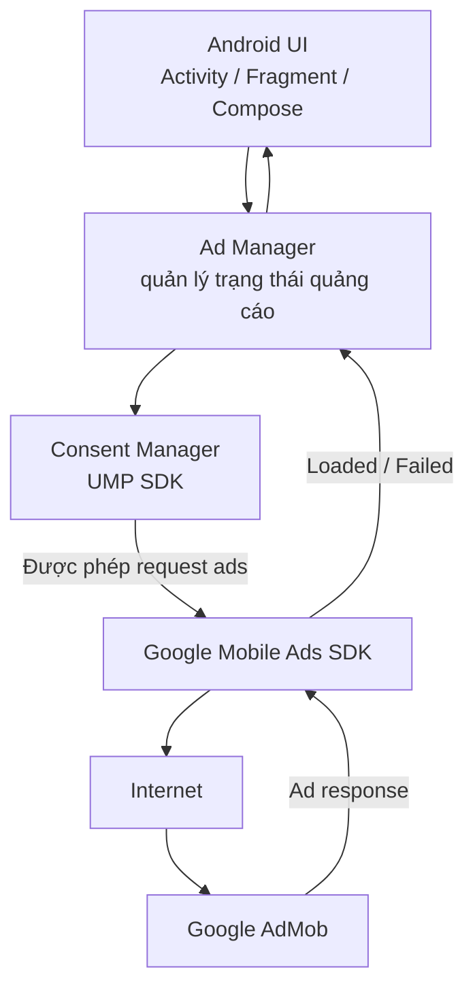
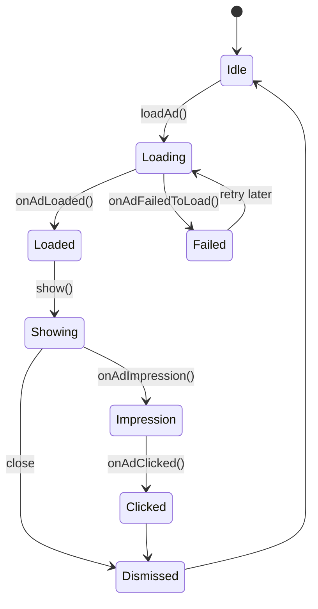
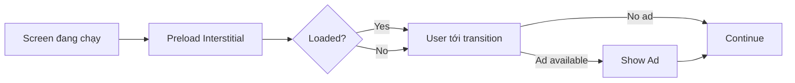
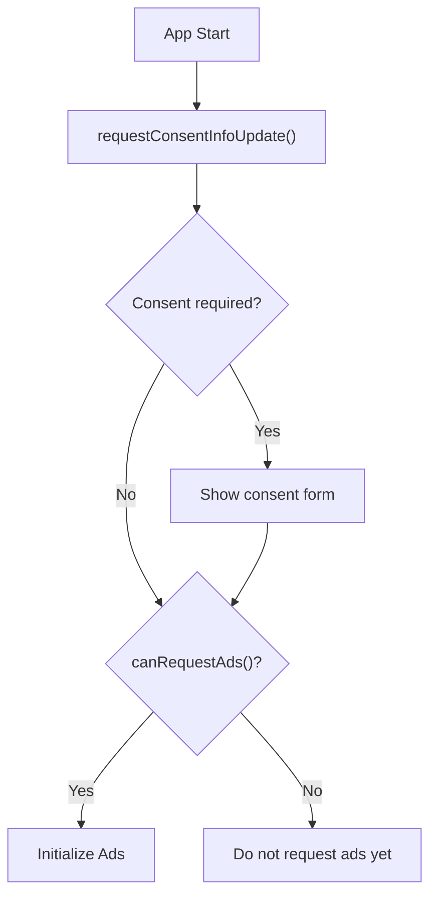

# 013 - AdMob

**Học phần:** 04 - Network, Async and Services
**Module:** Module 09 - Common Services
**Nhóm nội dung:** Google Services
**Nguồn roadmap:** Common Services / Google Services
**Loại bài:** `service`
**Thứ tự trong module:** 013
**Thời lượng gợi ý:** 34 phút

---

## 1. Tóm tắt

**AdMob** là nền tảng quảng cáo di động của Google, cho phép ứng dụng Android hiển thị quảng cáo và tạo doanh thu.

Trong Android, AdMob không chỉ là việc đặt một banner lên màn hình. Developer cần xử lý đồng thời:

* tích hợp **Google Mobile Ads SDK**;
* cấu hình `AdMob App ID`;
* cấu hình từng `Ad Unit ID`;
* tải quảng cáo bất đồng bộ;
* quản lý trạng thái quảng cáo;
* xử lý lifecycle của `Activity`, `Fragment` hoặc Compose;
* xử lý lỗi mạng và trường hợp không có quảng cáo;
* sử dụng **test ads** trong quá trình phát triển;
* xử lý consent và quyền riêng tư;
* không để quảng cáo phá vỡ UX;
* kiểm tra chính sách trước khi release.

Google hiện hỗ trợ nhiều định dạng quảng cáo như **Banner, Interstitial, Rewarded, Rewarded Interstitial, Native và App Open**.

> **Ý tưởng quan trọng:**
> AdMob là một dịch vụ mạng bất đồng bộ. App gửi một `AdRequest`, nhưng không được giả định rằng quảng cáo chắc chắn sẽ tải thành công.

---

## 2. Mục tiêu học tập

Sau bài này, anh nên có thể:

* Giải thích AdMob là gì và nó nằm ở đâu trong kiến trúc Android.
* Phân biệt:

  * **AdMob App ID**
  * **Ad Unit ID**
* Mô tả được vòng đời của một quảng cáo:

  * request;
  * loading;
  * loaded;
  * impression;
  * clicked;
  * dismissed;
  * failed.
* Biết những loại quảng cáo phổ biến:

  * Banner;
  * Interstitial;
  * Rewarded;
  * Native;
  * App Open.
* Tích hợp một Banner Ad cơ bản.
* Biết tại sao phải sử dụng **test ads**.
* Biết vai trò của **User Messaging Platform - UMP** trong consent/privacy.
* Thiết kế app sao cho việc quảng cáo tải thất bại không làm hỏng chức năng chính.
* Xác định các rủi ro về:

  * UX;
  * lifecycle;
  * performance;
  * privacy;
  * release.

---

# 3. AdMob nằm ở đâu trong ứng dụng Android?

Một kiến trúc đơn giản có thể hình dung như sau:



Luồng này cho thấy AdMob nằm giữa:

```text
UI
 ↓
Application / Ad logic
 ↓
Google Mobile Ads SDK
 ↓
Network
 ↓
AdMob Server
```

Vì vậy AdMob liên quan trực tiếp đến:

| Thành phần  | Liên quan                            |
| ----------- | ------------------------------------ |
| UI          | Hiển thị quảng cáo                   |
| Network     | Tải nội dung quảng cáo               |
| Async       | Quảng cáo tải bất đồng bộ            |
| Lifecycle   | Activity có thể bị destroy/recreate  |
| State       | Ad có thể đang loading/loaded/failed |
| Privacy     | Consent, advertising data            |
| Performance | SDK initialization, network, render  |
| Release     | Test ID, policy, privacy declaration |

---

# 4. Các khái niệm quan trọng

## 4.1. AdMob App ID

Mỗi ứng dụng đăng ký trong AdMob có một **App ID**.

Ví dụ:

```text
ca-app-pub-xxxxxxxxxxxxxxxx~yyyyyyyyyy
```

Dấu phân cách thường là:

```text
~
```

App ID được cấu hình trong:

```text
AndroidManifest.xml
```

Ví dụ:

```xml
<application>

    <meta-data
        android:name="com.google.android.gms.ads.APPLICATION_ID"
        android:value="ca-app-pub-xxxxxxxxxxxxxxxx~yyyyyyyyyy"/>

</application>
```

Google yêu cầu App ID được khai báo trong manifest trước khi sử dụng Mobile Ads SDK.

---

## 4.2. Ad Unit ID

Mỗi vị trí quảng cáo lại có một **Ad Unit ID** riêng.

Ví dụ:

```text
ca-app-pub-xxxxxxxxxxxxxxxx/zzzzzzzzzz
```

Dấu phân cách:

```text
/
```

Một app có thể có:

```text
App
├── Banner Home
├── Banner Detail
├── Interstitial GameOver
├── Rewarded ExtraCoins
└── AppOpen
```

Mỗi vị trí thường sử dụng một `Ad Unit ID` riêng.

---

## 4.3. App ID và Ad Unit ID khác nhau như thế nào?

|                       | App ID      | Ad Unit ID       |
| --------------------- | ----------- | ---------------- |
| Đại diện cho          | Ứng dụng    | Vị trí quảng cáo |
| Ví dụ ký hiệu         | `~`         | `/`              |
| Đặt ở đâu             | Manifest    | Code / config    |
| Một app có bao nhiêu? | Thường 1    | Có thể nhiều     |
| Ví dụ                 | App Android | Banner Home      |

Một lỗi rất thường gặp là:

```text
AdMob App ID ≠ Ad Unit ID
```

Không được dùng Ad Unit ID để thay cho App ID trong manifest.

---

# 5. Các định dạng quảng cáo phổ biến

## 5.1. Banner Ad

Banner là quảng cáo hình chữ nhật nằm trong UI.

Ví dụ:

```text
┌───────────────────────────────┐
│          Nội dung app         │
│                               │
│                               │
│                               │
├───────────────────────────────┤
│        Banner AdMob           │
└───────────────────────────────┘
```

Banner phù hợp cho:

* màn hình nội dung;
* app đọc tin;
* utility app;
* danh sách;
* màn hình có thời gian sử dụng dài.

Google khuyến nghị sử dụng các dạng **adaptive banner** để thích ứng tốt hơn với kích thước màn hình.

---

## 5.2. Interstitial Ad

Interstitial là quảng cáo toàn màn hình.

```text
Screen A
   ↓
Natural transition
   ↓
┌─────────────────────┐
│                     │
│   Interstitial Ad   │
│                     │
│              [ X ]  │
└─────────────────────┘
   ↓
Screen B
```

Nên hiển thị tại **điểm chuyển tiếp tự nhiên**, chẳng hạn:

```text
Hoàn thành level
      ↓
Interstitial
      ↓
Level tiếp theo
```

Không nên:

```text
Người dùng đang nhập dữ liệu
       ↓
quảng cáo bật đột ngột
```

Google cũng mô tả Interstitial là định dạng phù hợp tại các điểm chuyển tiếp tự nhiên trong luồng app.

---

# 5.3. Rewarded Ad

Rewarded Ad cho phép người dùng chủ động xem quảng cáo để nhận phần thưởng.

Ví dụ:

```text
Bạn hết năng lượng

[Xem quảng cáo để nhận +20 Energy]

              ↓

        Rewarded Ad

              ↓

     Ad completed

              ↓

        +20 Energy
```

Đây thường là UX tốt hơn Interstitial vì người dùng biết rõ:

```text
xem quảng cáo
     ↓
nhận lợi ích
```

---

# 5.4. Native Ad

Native Ad cho phép ứng dụng tự thiết kế layout quảng cáo để phù hợp hơn với giao diện.

Ví dụ:

```text
┌──────────────────────────┐
│ [Image]                  │
│ Amazing Travel App       │
│ Sponsored                │
│              [Install]   │
└──────────────────────────┘
```

Developer có nhiều quyền kiểm soát UI hơn nhưng cũng phải đảm bảo quảng cáo được thể hiện đúng quy định.

---

# 5.5. App Open Ad

App Open Ad được thiết kế để xuất hiện trong quá trình người dùng mở hoặc quay lại ứng dụng.

Ví dụ:

```text
Launch App
    ↓
Loading / Splash
    ↓
App Open Ad
    ↓
Home
```

Cần đặc biệt cẩn thận để tránh:

* quảng cáo xuất hiện quá thường xuyên;
* quảng cáo làm chậm startup;
* người dùng vừa vào app đã gặp nhiều lớp quảng cáo.

---

# 6. Vòng đời của một quảng cáo

Một quảng cáo không đơn giản chỉ có hai trạng thái:

```text
có quảng cáo
không có quảng cáo
```

Một state machine thực tế hơn:



Có thể mô hình hoá state trong Kotlin:

```kotlin
sealed interface AdState {

    data object Idle : AdState

    data object Loading : AdState

    data object Loaded : AdState

    data class Failed(
        val message: String
    ) : AdState
}
```

Điều này đặc biệt hữu ích nếu app dùng:

```text
ViewModel
+
StateFlow
+
Compose
```

---

# 7. Tích hợp Google Mobile Ads SDK

## 7.1. Dependency

Trong:

```text
app/build.gradle.kts
```

có thể thêm Google Mobile Ads SDK.

Theo tài liệu Google tại thời điểm **26/08/2026**, quick-start Android đang liệt kê:

```kotlin
dependencies {

    implementation(
        "com.google.android.gms:play-services-ads:25.4.0"
    )
}
```

Google hiện đánh dấu tài liệu này là **Google Mobile Ads SDK (Legacy)** và đồng thời có tài liệu migration riêng cho **GMA Next-Gen SDK**. Vì version SDK thay đổi theo thời gian, dự án production nên kiểm tra lại tài liệu chính thức trước khi nâng cấp.

---

# 7.2. Cấu hình App ID

Trong:

```xml
AndroidManifest.xml
```

thêm:

```xml
<application>

    <meta-data
        android:name="com.google.android.gms.ads.APPLICATION_ID"
        android:value="ca-app-pub-xxxxxxxxxxxxxxxx~yyyyyyyyyy"/>

</application>
```

Đây là:

```text
AdMob App ID
```

không phải:

```text
Ad Unit ID
```

---

# 7.3. Khởi tạo Mobile Ads SDK

Ví dụ:

```kotlin
import com.google.android.gms.ads.MobileAds

class MainActivity : ComponentActivity() {

    override fun onCreate(savedInstanceState: Bundle?) {

        super.onCreate(savedInstanceState)

        MobileAds.initialize(this) {
            // Mobile Ads SDK initialized
        }
    }
}
```

Về kiến trúc, không nên rải:

```kotlin
MobileAds.initialize()
```

khắp nhiều màn hình.

Thông thường chỉ cần khởi tạo SDK một lần phù hợp với flow privacy/consent của ứng dụng. Google cũng hướng dẫn `MobileAds.initialize()` như bước initialization của SDK.

---

# 8. Demo Banner Ad

## 8.1. Test Ad Unit ID

Trong lúc development, dùng test ID của Google.

Banner test ID hiện được Google cung cấp:

```text
ca-app-pub-3940256099942544/9214589741
```

---

## 8.2. XML

Ví dụ:

```xml
<com.google.android.gms.ads.AdView
    android:id="@+id/adView"
    android:layout_width="match_parent"
    android:layout_height="wrap_content"
    app:adSize="BANNER"
    app:adUnitId="ca-app-pub-3940256099942544/9214589741" />
```

---

## 8.3. Load quảng cáo

```kotlin
val adView = findViewById<AdView>(R.id.adView)

val adRequest = AdRequest
    .Builder()
    .build()

adView.loadAd(adRequest)
```

`loadAd()` phải được gọi trên main thread theo tài liệu Banner Android của Google.

---

# 9. Theo dõi sự kiện quảng cáo

Ta có thể sử dụng `AdListener`.

```kotlin
adView.adListener =
    object : AdListener() {

        override fun onAdLoaded() {

            Log.d(
                "AdMob",
                "Ad loaded"
            )
        }

        override fun onAdFailedToLoad(
            error: LoadAdError
        ) {

            Log.e(
                "AdMob",
                "Load failed: ${error.message}"
            )
        }

        override fun onAdImpression() {

            Log.d(
                "AdMob",
                "Impression"
            )
        }

        override fun onAdClicked() {

            Log.d(
                "AdMob",
                "Ad clicked"
            )
        }

        override fun onAdOpened() {

            Log.d(
                "AdMob",
                "Ad opened"
            )
        }

        override fun onAdClosed() {

            Log.d(
                "AdMob",
                "Ad closed"
            )
        }
    }
```

Các callback này cho phép app theo dõi:

```text
load
 ↓
impression
 ↓
click
 ↓
open
 ↓
close
```

Tài liệu Google hiện mô tả các callback như `onAdLoaded()`, `onAdFailedToLoad()`, `onAdImpression()`, `onAdClicked()`, `onAdOpened()` và `onAdClosed()`.

---

# 10. Failure scenario

Một app tốt không được phụ thuộc vào việc quảng cáo luôn tải thành công.

Ví dụ:

```text
User opens screen
       ↓
Request Ad
       ↓
 ┌─────┴─────┐
 ↓           ↓
Loaded      Failed
 ↓           ↓
Show Ad     Hide ad area
 ↓           ↓
App works normally
```

Sai:

```kotlin
if (adFailed) {

    blockApp()
}
```

Đúng về mặt UX:

```kotlin
if (adFailed) {

    hideAdContainer()

    continueNormalAppFlow()
}
```

Quảng cáo nên là:

```text
optional monetization layer
```

không phải:

```text
single point of failure
```

---

# 11. Lifecycle

AdMob liên quan trực tiếp tới lifecycle vì quảng cáo chứa:

* View;
* callback;
* network request;
* Activity reference;
* full-screen UI.

Ví dụ Banner khi không còn sử dụng nên giải phóng resource.

```kotlin
override fun onDestroy() {

    adView.destroy()

    super.onDestroy()
}
```

Google hiện hướng dẫn khi không còn sử dụng banner thì nên:

```text
remove view
→ destroy AdView
→ bỏ reference
```

để giải phóng tài nguyên.

---

## Một lỗi cần tránh

Ví dụ:

```kotlin
object Ads {

    lateinit var activity: Activity
}
```

Nếu giữ reference `Activity` lâu hơn lifecycle của nó:

```text
Activity destroyed
      ↓
object vẫn giữ Activity
      ↓
không garbage collect được
      ↓
Memory Leak
```

Vì vậy tránh lưu `Activity` vào singleton một cách tùy tiện.

---

# 12. Rotate màn hình thì sao?

Ví dụ:

```text
Activity
  ↓
load interstitial
  ↓
ad loaded
  ↓
rotate
  ↓
old Activity destroyed
  ↓
new Activity created
```

Nếu logic quảng cáo nằm hoàn toàn trong `Activity`, reference cũ có thể mất.

Một kiến trúc tốt hơn có thể tách:

```text
UI
 ↓
AdsCoordinator / AdsManager
 ↓
Mobile Ads SDK
```

Tuy nhiên với full-screen ads vẫn cần:

```text
Activity hiện tại
```

để gọi `show()`.

---

# 13. Interstitial lifecycle

Interstitial thường được preload trước.



Điều quan trọng:

```text
Không chờ quảng cáo rồi khóa UI.
```

Nên:

```text
if ad ready
    show
else
    continue
```

Google khuyến nghị Interstitial được hiển thị tại các điểm chuyển tiếp tự nhiên của app.

---

# 14. Không reuse Interstitial sau khi show

Sau khi một Interstitial đã được sử dụng:

```text
Loaded Ad
   ↓
show()
   ↓
dismiss
   ↓
reference = null
   ↓
load next ad
```

Ví dụ:

```kotlin
override fun onAdDismissedFullScreenContent() {

    interstitialAd = null

    loadInterstitial()
}
```

Google cũng hướng dẫn xoá reference sau khi full-screen ad bị dismiss hoặc show thất bại.

---

# 15. Privacy và Consent

Đây là phần cực kỳ quan trọng khi tích hợp AdMob.

Không nên thiết kế:

```text
App launch
   ↓
request personalized ad ngay lập tức
```

mà cần nghĩ đến:

```text
App launch
   ↓
Update consent information
   ↓
Need consent?
   ↓
Show privacy form
   ↓
canRequestAds()
   ↓
Initialize / request ads
```

---

# 16. User Messaging Platform - UMP

Google cung cấp **User Messaging Platform SDK** để hỗ trợ quản lý lựa chọn privacy của người dùng.

Theo tài liệu Android hiện tại, UMP:

* nên cập nhật consent information mỗi lần app launch;
* có API `requestConsentInfoUpdate()`;
* có thể hiển thị form bằng `loadAndShowConsentFormIfRequired()`;
* cung cấp `canRequestAds()` để xác định ứng dụng có thể request quảng cáo hay chưa.

Luồng cơ bản:



---

# 17. UMP dependency

Theo tài liệu Google Android hiện tại:

```kotlin
dependencies {

    implementation(
        "com.google.android.ump:user-messaging-platform:4.0.0"
    )
}
```

Version có thể thay đổi nên production project không nên sao chép version này nhiều năm mà không kiểm tra lại.

---

# 18. Consent không chỉ là một popup

Sai tư duy:

```text
Show GDPR popup
      ↓
Done
```

Đúng hơn:

```text
Privacy Regulations
        ↓
Consent State
        ↓
Ad Storage
Ad Personalization
Ad User Data
Analytics Storage
        ↓
Ad Serving Mode
```

Google hiện mô tả nhiều chế độ phân phối quảng cáo khác nhau dựa trên consent như:

* personalized ads;
* non-personalized ads;
* limited ads;
* technical ad delivery.

Đối với một số khu vực như EEA và UK, publisher phải xử lý các yêu cầu disclosure/consent phù hợp.

---

# 19. Người dùng phải có khả năng thay đổi lựa chọn privacy

Không nên thiết kế consent như:

```text
chọn một lần
↓
không bao giờ sửa lại được
```

Với các quy định phù hợp, app có thể cần một mục như:

```text
Settings
   ↓
Privacy
   ↓
Manage privacy options
```

Google UMP hỗ trợ **Privacy Options entry point** để người dùng có thể thay đổi lựa chọn khi cần.

---

# 20. Test Ads

Đây là một trong những nguyên tắc quan trọng nhất của AdMob.

Trong development:

```text
KHÔNG dùng production ads để test click.
```

Google cung cấp:

```text
Demo Ad Unit IDs
```

và:

```text
Test Devices
```

để kiểm thử an toàn.

---

## Tại sao?

Nếu developer tự liên tục:

```text
load live ad
↓
click live ad
↓
reload
↓
click
```

có thể tạo **invalid activity**.

Google cảnh báo việc click quảng cáo thật trong khi phát triển mà không dùng test mode có thể khiến tài khoản bị đánh dấu vì invalid activity.

---

# 21. Development vs Production

Một cách quản lý ID tốt hơn:

```kotlin
object AdIds {

    const val TEST_BANNER =
        "ca-app-pub-3940256099942544/9214589741"

    const val PROD_BANNER =
        "YOUR_PRODUCTION_ID"
}
```

Sau đó:

```kotlin
val bannerId =
    if (BuildConfig.DEBUG) {

        AdIds.TEST_BANNER

    } else {

        AdIds.PROD_BANNER
    }
```

Luồng:

```text
Debug build
    ↓
Test Ad ID

Release build
    ↓
Production Ad ID
```

---

# 22. Trạng thái quảng cáo với ViewModel

Có thể dùng:

```kotlin
data class AdUiState(

    val isLoading: Boolean = false,

    val isAvailable: Boolean = false,

    val error: String? = null
)
```

ViewModel:

```kotlin
class AdsViewModel : ViewModel() {

    private val _state =
        MutableStateFlow(
            AdUiState()
        )

    val state =
        _state.asStateFlow()
}
```

Kiến trúc:

```text
Google Ads Callback
       ↓
AdsManager
       ↓
StateFlow
       ↓
ViewModel
       ↓
Compose UI
```

---

# 23. Jetpack Compose

Trong Compose, nên cẩn thận vì:

```text
Composable
↓
recomposition
↓
Composable chạy lại
```

Không nên:

```kotlin
@Composable
fun Banner() {

    AdView(context).loadAd(...)
}
```

mỗi lần recomposition.

Điều này có thể tạo:

```text
recomposition
   ↓
new AdView
   ↓
new request
   ↓
recomposition
   ↓
new request
```

Thay vào đó có thể quản lý object với:

```kotlin
remember
```

và cleanup qua:

```kotlin
DisposableEffect
```

Tài liệu Banner hiện tại của Google cũng cung cấp ví dụ Compose sử dụng `remember { AdView(context) }`.

---

# 24. Ví dụ Compose

```kotlin
@Composable
fun BannerAd() {

    val context =
        LocalContext.current

    val adView =
        remember {

            AdView(context).apply {

                adUnitId =
                    "ca-app-pub-3940256099942544/9214589741"

                setAdSize(
                    AdSize.BANNER
                )

                loadAd(
                    AdRequest
                        .Builder()
                        .build()
                )
            }
        }

    DisposableEffect(Unit) {

        onDispose {

            adView.destroy()
        }
    }

    AndroidView(
        factory = {
            adView
        }
    )
}
```

Mục đích chính của pattern này là:

```text
remember
   ↓
không tạo AdView lại liên tục

DisposableEffect
   ↓
cleanup khi rời composition
```

---

# 25. UX tốt với quảng cáo

Developer không nên nghĩ:

```text
càng nhiều quảng cáo
=
càng nhiều doanh thu
```

Quá nhiều quảng cáo có thể gây:

```text
More Ads
   ↓
Worse UX
   ↓
Lower Retention
   ↓
Lower Session Time
   ↓
Uninstall
```

Cần tối ưu đồng thời:

```text
Revenue
+
Retention
+
User Experience
```

---

# 26. Ví dụ placement

### Tốt

```text
Level finished
      ↓
Interstitial
      ↓
Next level
```

### Không tốt

```text
User tap Save
      ↓
Interstitial
      ↓
không biết dữ liệu đã save chưa
```

---

### Tốt

```text
Need extra coins?

[Watch Ad]
```

### Không tốt

```text
Rewarded Ad tự chạy
```

Rewarded về bản chất nên là một lựa chọn có chủ đích từ người dùng.

---

# 27. Performance

AdMob có thể ảnh hưởng:

```text
Startup
Network
Memory
Rendering
Battery
```

Một pattern không tốt:

```text
App Start
 ↓
Analytics init
 ↓
Crashlytics init
 ↓
Remote Config
 ↓
AdMob init
 ↓
load 5 ads
 ↓
Home Screen
```

Kết quả:

```text
startup chậm
```

Nên xem xét:

```text
App start
 ↓
critical services
 ↓
UI usable
 ↓
non-critical work
```

Tùy kiến trúc và requirement của app.

---

# 28. Network failure

Các tình huống cần test:

```text
Airplane Mode

Wi-Fi mất mạng

Slow network

Ad server timeout

No fill

Invalid Ad Unit ID

Consent chưa sẵn sàng
```

App phải tiếp tục hoạt động.

Ví dụ:

```kotlin
override fun onAdFailedToLoad(
    error: LoadAdError
) {

    Log.e(
        "AdMob",
        """
        code=${error.code}
        domain=${error.domain}
        message=${error.message}
        """.trimIndent()
    )

    hideBanner()
}
```

---

# 29. Không retry vô hạn

Không nên:

```text
Ad fails
 ↓
retry
 ↓
fails
 ↓
retry
 ↓
fails
 ↓
retry
 ↓
...
```

Điều này gây:

* network spam;
* battery usage;
* log noise;
* server pressure.

Có thể áp dụng chiến lược như:

```text
Failure
   ↓
Wait
   ↓
Retry
   ↓
Backoff
```

Ví dụ:

```text
1 s
2 s
4 s
8 s
```

hoặc đơn giản bỏ qua quảng cáo cho session hiện tại.

---

# 30. Debugging checklist

Khi quảng cáo không xuất hiện, kiểm tra theo thứ tự:

```text
AdMob App ID
      ↓
SDK dependency
      ↓
SDK initialized
      ↓
Ad Unit ID
      ↓
Test Ad ID
      ↓
Internet connection
      ↓
Consent state
      ↓
Ad callback error
      ↓
AdMob account/configuration
```

Đặc biệt nên log:

```text
onAdLoaded

onAdFailedToLoad

error.code

error.domain

error.message
```

---

# 31. Không dùng việc "không thấy quảng cáo" làm bằng chứng integration lỗi

Ad request có thể thành công hoặc thất bại vì nhiều lý do.

Ví dụ:

```text
Request
   ↓
AdMob
   ↓
No suitable ad
   ↓
No Fill
```

Vì vậy:

```text
No Ad
```

không luôn đồng nghĩa:

```text
SDK Broken
```

---

# 32. Bài thực hành

## Yêu cầu

Tạo một project:

```text
AdMobDemo
```

Có màn hình:

```text
MainScreen
```

với:

```text
┌──────────────────────────┐
│                          │
│        AdMob Demo        │
│                          │
│ [ Load Content ]         │
│                          │
│                          │
├──────────────────────────┤
│       Test Banner        │
└──────────────────────────┘
```

---

## Task 1 — Tích hợp SDK

Thêm:

```text
Google Mobile Ads SDK
```

và cấu hình:

```text
AdMob App ID
```

trong:

```text
AndroidManifest.xml
```

---

## Task 2 — Hiển thị test Banner

Sử dụng test Banner ID:

```text
ca-app-pub-3940256099942544/9214589741
```

Không dùng production ID trong bài thực hành.

---

## Task 3 — Theo dõi callback

Log tối thiểu:

```text
LOADING

LOADED

FAILED

IMPRESSION

CLICKED
```

Ví dụ Logcat:

```text
AdMob: LOADING

AdMob: LOADED

AdMob: IMPRESSION
```

---

## Task 4 — Failure scenario

Tắt Internet.

App phải:

```text
Banner fail
   ↓
Hide placeholder
   ↓
Main content vẫn hoạt động
```

Không được:

```text
crash
```

hoặc:

```text
loading vô hạn
```

---

## Task 5 — Privacy

Viết README mô tả flow:

```text
Launch App
   ↓
Check Consent
   ↓
Consent Form if required
   ↓
canRequestAds()
   ↓
Initialize / Load Ads
```

---

# 33. Artifact đưa vào portfolio

Có thể tạo mini-project:

```text
Android-AdMob-Demo/
│
├── app/
│
├── screenshots/
│   ├── banner_loaded.png
│   ├── airplane_mode.png
│   └── consent_flow.png
│
├── diagrams/
│   └── admob_flow.md
│
└── README.md
```

README có thể mô tả:

```text
Features

- Google Mobile Ads integration
- Test Banner
- Ad callbacks
- Failure handling
- Consent flow
- Lifecycle cleanup
```

---

# 34. Screenshot nên chụp

### Screenshot 1

```text
Banner test ad hiển thị
```

### Screenshot 2

```text
Logcat:
onAdLoaded()
```

### Screenshot 3

```text
Airplane Mode
+
App vẫn hoạt động
```

### Screenshot 4

```text
Consent / Privacy flow
```

### Screenshot 5

```text
AdMob architecture diagram
```

Như vậy portfolio chứng minh không chỉ:

```text
"em biết hiển thị quảng cáo"
```

mà còn:

```text
"em hiểu lifecycle, privacy,
failure handling và production risk."
```

---

# 35. Bài tập

Thiết kế một ứng dụng game nhỏ có:

```text
Home
 ↓
Game
 ↓
Game Over
```

Yêu cầu:

**Banner**

```text
Home Screen
```

**Interstitial**

```text
Game Over
 ↓
Interstitial
 ↓
Retry
```

**Rewarded**

```text
Game Over
 ↓
"Watch ad to continue?"
 ↓
Rewarded
 ↓
Continue game
```

Sau đó trả lời:

1. Quảng cáo được preload ở đâu?
2. Nếu quảng cáo không load thì user flow tiếp tục thế nào?
3. Khi rotate màn hình, state quảng cáo xử lý ra sao?
4. Khi Activity bị destroy, resource nào cần cleanup?
5. Khi nào cần consent?
6. Làm sao đảm bảo debug build chỉ dùng test ads?
7. Nếu Interstitial chưa load nhưng người dùng đã hoàn thành level thì xử lý thế nào?

---

# 36. Câu hỏi tự kiểm tra

### Câu 1

AdMob App ID và Ad Unit ID có giống nhau không?

**Đáp án:** Không.

---

### Câu 2

Có nên test bằng quảng cáo production rồi tự click không?

**Đáp án:** Không.

Hãy sử dụng test ads hoặc test devices. Google cảnh báo việc tương tác với quảng cáo thật trong quá trình test có thể gây invalid activity.

---

### Câu 3

Interstitial nên xuất hiện ở đâu?

**Đáp án:**

Các điểm chuyển tiếp tự nhiên như:

```text
level complete
page transition
game over
```

---

### Câu 4

Nếu quảng cáo không tải được thì app có nên chặn người dùng không?

**Đáp án:** Thông thường không.

Core functionality nên tiếp tục hoạt động.

---

### Câu 5

Rewarded Ad có điểm khác biệt quan trọng nào?

Người dùng thường chủ động xem quảng cáo để nhận một reward cụ thể.

---

### Câu 6

Consent có phải chỉ hiển thị một popup một lần là xong không?

**Không.**

Ứng dụng cần quản lý consent state, cập nhật trạng thái khi cần và có thể cần cho phép người dùng thay đổi lựa chọn privacy.

---

# 37. Những lỗi thường gặp

| Lỗi                            | Hậu quả               |
| ------------------------------ | --------------------- |
| Dùng App ID thay Ad Unit ID    | Không load đúng ad    |
| Dùng Ad Unit ID trong manifest | SDK config lỗi        |
| Test bằng live ads             | Invalid traffic risk  |
| Load ad mỗi recomposition      | Request quá nhiều     |
| Giữ Activity trong singleton   | Memory leak           |
| Không cleanup AdView           | Rò rỉ resource        |
| Ad load fail → block UI        | UX kém                |
| Interstitial bật bất ngờ       | UX xấu                |
| Không xử lý consent            | Privacy/release risk  |
| Production build còn test ID   | Không tạo revenue     |
| Debug build dùng live ID       | Invalid activity risk |
| Không log `LoadAdError`        | Khó debug             |

---

# 38. Production checklist

## Configuration

* [ ] Đã tạo app trong AdMob.
* [ ] `APPLICATION_ID` đúng.
* [ ] Production Ad Unit IDs đúng.
* [ ] Debug build sử dụng test ads.
* [ ] Release build không còn test Ad Unit ID.
* [ ] SDK version đã được kiểm tra lại trước release.

## Lifecycle

* [ ] Không giữ `Activity` reference không cần thiết.
* [ ] Banner được cleanup khi không còn sử dụng.
* [ ] Full-screen ad được set `null` sau khi dismiss.
* [ ] Không request ad lại liên tục do recomposition.
* [ ] Rotate/background không làm crash app.

## UX

* [ ] Interstitial chỉ xuất hiện ở natural transition.
* [ ] Rewarded Ad có sự chủ động của người dùng.
* [ ] Không che nút quan trọng bằng banner.
* [ ] Không khóa core functionality khi AdMob lỗi.
* [ ] Không để loading ad chặn UI.

## Network

* [ ] Test offline.
* [ ] Test mạng chậm.
* [ ] Test `onAdFailedToLoad()`.
* [ ] Không retry vô hạn.
* [ ] Log error code và message khi development.

## Privacy

* [ ] Xác định user flow cần consent.
* [ ] UMP được cấu hình nếu phù hợp.
* [ ] Gọi update consent information theo flow thiết kế.
* [ ] Kiểm tra `canRequestAds()`.
* [ ] Có Privacy Policy.
* [ ] Có đường dẫn cho người dùng quản lý privacy options khi requirement áp dụng.

## Testing

* [ ] Test bằng demo Ad Unit ID hoặc test device.
* [ ] Test Banner loaded.
* [ ] Test Banner failed.
* [ ] Test Interstitial loaded.
* [ ] Test Interstitial unavailable.
* [ ] Test dismiss callback.
* [ ] Test rotate.
* [ ] Test background → foreground.

## Release

* [ ] Không để API/config test sai môi trường.
* [ ] Kiểm tra Google Play policy liên quan.
* [ ] Kiểm tra AdMob policy.
* [ ] Kiểm tra Data Safety/Privacy declaration.
* [ ] Kiểm tra audience của ứng dụng.
* [ ] Kiểm tra consent configuration.
* [ ] Test release build trước khi publish.

---

# 39. Kiến thức cần nhớ

```text
AdMob
│
├── App ID
│
├── Ad Unit ID
│
├── Mobile Ads SDK
│
├── AdRequest
│
├── Banner
│
├── Interstitial
│
├── Rewarded
│
├── Native
│
├── App Open
│
├── Callbacks
│
├── Lifecycle
│
├── Test Ads
│
├── Consent / UMP
│
└── Production Policies
```

Một developer mới thường chỉ nghĩ:

```text
AdMob
=
show ads
```

Một Android developer tốt cần nghĩ:

```text
AdMob
=
Network
+
Async State
+
Lifecycle
+
UX
+
Privacy
+
Testing
+
Monetization
+
Release Risk
```

---

# 40. Checklist hoàn thành bài

* [ ] Giải thích được AdMob bằng ngôn ngữ của mình.
* [ ] Phân biệt được App ID và Ad Unit ID.
* [ ] Biết ít nhất Banner, Interstitial và Rewarded.
* [ ] Hiểu `AdRequest` là bất đồng bộ.
* [ ] Hiểu các trạng thái loading/loaded/failed.
* [ ] Tích hợp được một test Banner.
* [ ] Biết sử dụng `AdListener`.
* [ ] Biết xử lý `onAdFailedToLoad()`.
* [ ] Biết tại sao không được tự click live ads khi development.
* [ ] Hiểu lifecycle và cleanup.
* [ ] Hiểu vai trò của UMP và `canRequestAds()`.
* [ ] Có failure scenario khi mất mạng.
* [ ] Có screenshot hoặc diagram.
* [ ] Có README nhỏ để đưa vào portfolio.

---

# 41. Ghi chú sản xuất

Khi đưa AdMob vào production, hãy luôn đặt các câu hỏi:

```text
Quảng cáo xuất hiện ở đâu?

↓

Có làm gián đoạn user flow không?

↓

Ad chưa load thì sao?

↓

Network mất thì sao?

↓

Activity bị recreate thì sao?

↓

Có memory leak không?

↓

Debug có đang dùng live ads không?

↓

Consent đã được xử lý chưa?

↓

User có thể thay đổi privacy preference không?

↓

Release build đã thay đúng production IDs chưa?

↓

Policy của AdMob và Google Play đã được kiểm tra chưa?
```

Nguyên tắc cuối cùng:

> **Core functionality của ứng dụng không nên phụ thuộc vào việc AdMob có trả về quảng cáo hay không.**

Một tích hợp AdMob tốt không chỉ tạo được doanh thu mà còn phải đảm bảo **UX ổn định, lifecycle an toàn, privacy đúng và release có thể kiểm soát được**.
