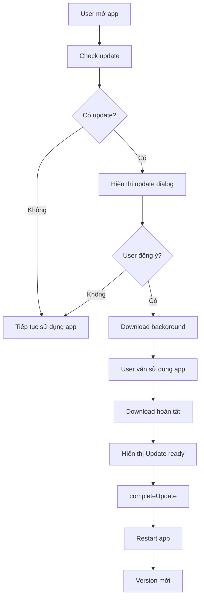
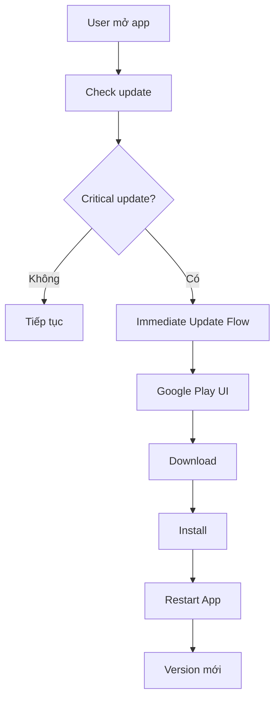
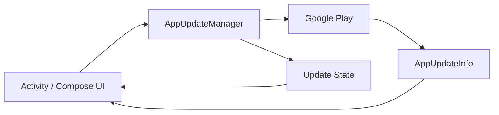
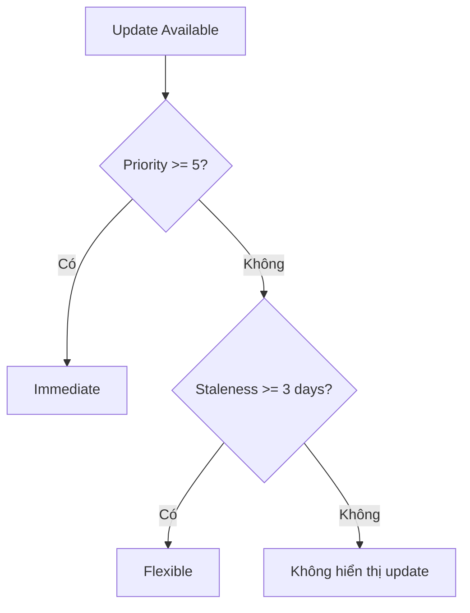
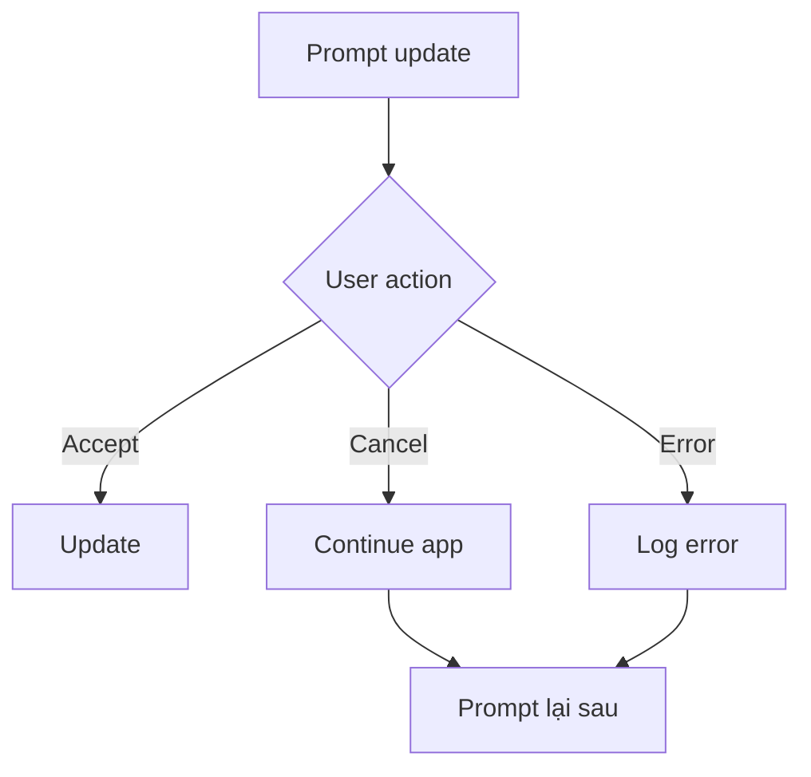
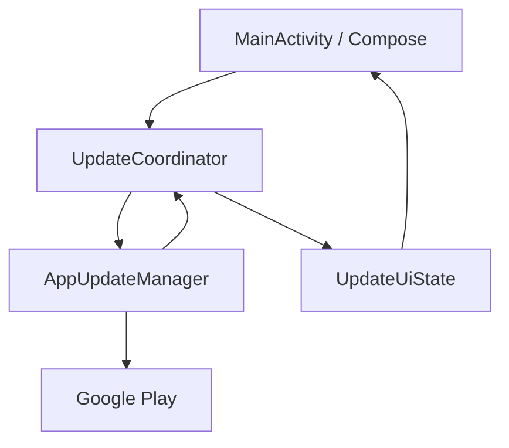
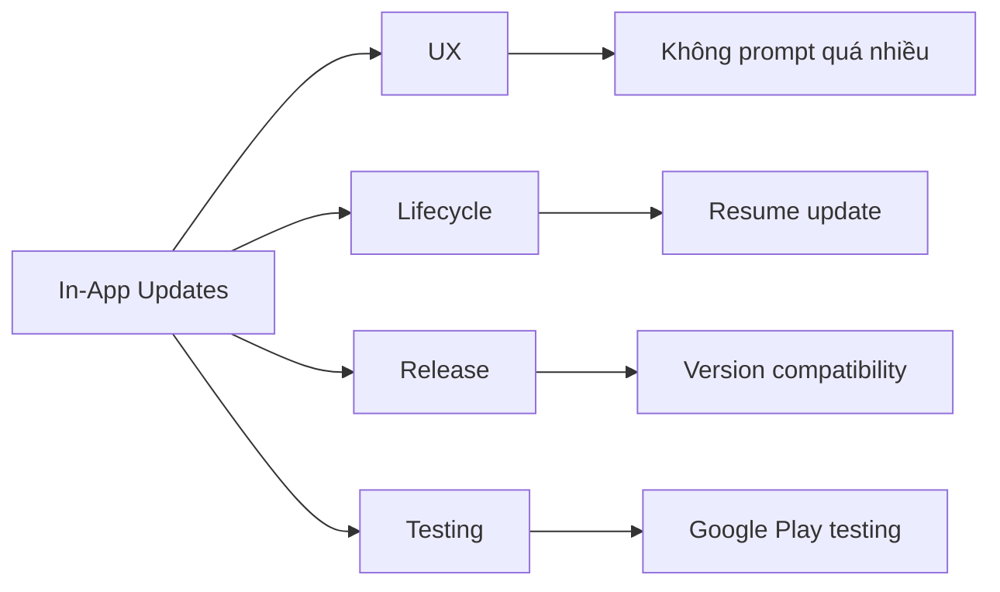

# 014 - In App Updates

**Học phần:** 04 - Network, Async and Services
**Module:** Module 09 - Common Services
**Nhóm nội dung:** Google Services
**Nguồn roadmap:** Common Services / Google Services
**Loại bài:** `service`
**Thứ tự trong module:** 014
**Thời lượng gợi ý:** 34 phút

---

## 1. Tóm tắt

**In-App Updates** là cơ chế của **Google Play** cho phép ứng dụng Android kiểm tra và yêu cầu người dùng cập nhật lên phiên bản mới **ngay khi họ đang sử dụng ứng dụng**, thay vì yêu cầu người dùng tự mở Play Store.

Ví dụ:

```text
Người dùng mở app
        ↓
App kiểm tra Google Play
        ↓
Có phiên bản mới?
   ┌────┴────┐
  Không      Có
   ↓          ↓
Dùng app   Chọn kiểu update
            ↓
      Flexible / Immediate
```

Google cung cấp tính năng này thông qua **Play In-App Update Library**, một phần của hệ sinh thái Google Play Core. API hiện tại sử dụng thư viện chuyên biệt `app-update` thay vì thư viện Play Core nguyên khối cũ. ([Android Developers][1])

Sau bài học, bạn cần hiểu:

* In-App Updates giải quyết vấn đề gì.
* `Flexible Update` khác `Immediate Update` như thế nào.
* `AppUpdateManager` hoạt động ra sao.
* Cách kiểm tra có phiên bản mới.
* Cách khởi động update flow.
* Cách xử lý lifecycle khi app background/foreground.
* Cách theo dõi trạng thái download.
* Cách test bằng Google Play.
* Khi nào **không nên ép người dùng update**.

---

# 2. Mục tiêu học tập

Sau bài này, bạn có thể:

* [ ] Giải thích được **In-App Updates** bằng ngôn ngữ của mình.
* [ ] Phân biệt `Flexible Update` và `Immediate Update`.
* [ ] Sử dụng `AppUpdateManager`.
* [ ] Kiểm tra `UpdateAvailability`.
* [ ] Kiểm tra `updatePriority`.
* [ ] Kiểm tra `clientVersionStalenessDays`.
* [ ] Khởi động update bằng `startUpdateFlowForResult()`.
* [ ] Theo dõi trạng thái download của Flexible Update.
* [ ] Gọi `completeUpdate()` đúng thời điểm.
* [ ] Resume một Immediate Update bị gián đoạn.
* [ ] Xử lý trường hợp người dùng từ chối update.
* [ ] Test In-App Updates thông qua Google Play.
* [ ] Xây dựng một demo nhỏ làm artifact cho portfolio.

---

# 3. Vấn đề In-App Updates giải quyết

Giả sử app hiện tại đang ở:

```text
Version 1.4
```

Bạn phát hiện một lỗi nghiêm trọng và phát hành:

```text
Version 1.5
```

Nhưng người dùng có thể:

```text
Không mở Play Store
        ↓
Không biết có update
        ↓
Tiếp tục dùng version 1.4
        ↓
Tiếp tục gặp bug
```

In-App Updates cho phép ứng dụng chủ động kiểm tra:

```text
App
 ↓
AppUpdateManager
 ↓
Google Play
 ↓
Version mới?
 ↓
Có
 ↓
Hiển thị update flow
```

Điểm quan trọng:

> App **không tự tải APK từ server riêng**.

Việc download, verify và install vẫn được xử lý bởi **Google Play**.

---

# 4. Hai loại In-App Update

Google Play hỗ trợ hai chiến lược chính:

| Kiểu                         | Flexible              | Immediate                  |
| ---------------------------- | --------------------- | -------------------------- |
| Người dùng tiếp tục dùng app | Có                    | Không                      |
| Download background          | Có                    | Không theo UX thông thường |
| App tự restart ngay          | Không                 | Có                         |
| Cần gọi `completeUpdate()`   | Có                    | Google Play xử lý flow     |
| Mức độ làm gián đoạn UX      | Thấp                  | Cao                        |
| Phù hợp                      | Update thông thường   | Update quan trọng          |
| Ví dụ                        | cải thiện performance | lỗi bảo mật nghiêm trọng   |

Google cũng khuyến nghị chỉ yêu cầu update khi thay đổi đủ quan trọng đối với chức năng cốt lõi, tránh làm phiền người dùng quá thường xuyên. ([Android Developers][2])

---

# 5. Flexible Update

## 5.1 Luồng hoạt động



Flexible Update phù hợp với:

* bug fix thông thường;
* cải thiện performance;
* UI mới;
* feature mới;
* bản cập nhật không bắt buộc.

Trong Flexible Update, người dùng có thể tiếp tục sử dụng ứng dụng trong lúc bản cập nhật được tải xuống. Khi download hoàn thành, app cần yêu cầu hoàn tất update, thường thông qua Snackbar/Dialog rồi gọi `completeUpdate()`. ([Android Developers][1])

---

# 6. Immediate Update

Immediate Update có UX mạnh hơn.



Trong quá trình này, Google Play hiển thị giao diện cập nhật phủ lên ứng dụng.

Phù hợp với:

```text
Critical security fix
        ↓

Crash nghiêm trọng
        ↓

Backend mới không còn tương thích app cũ
        ↓

Dữ liệu có nguy cơ bị xử lý sai
```

Không nên dùng Immediate Update chỉ vì:

```text
"Đổi icon"
"Thêm animation"
"Sửa màu button"
```

vì nó gây gián đoạn UX.

---

# 7. Kiến trúc tổng quát



Thành phần quan trọng nhất là:

```kotlin
AppUpdateManager
```

Nó đóng vai trò giao tiếp giữa:

```text
Android App
    ↕
Google Play
```

---

# 8. Thêm dependency

Theo tài liệu Android Developers hiện tại, Play In-App Update sử dụng:

```kotlin
dependencies {
    implementation("com.google.android.play:app-update:2.1.0")
    implementation("com.google.android.play:app-update-ktx:2.1.0")
}
```

([Android Developers][1])

> Không nên dùng dependency Play Core nguyên khối cũ chỉ để triển khai In-App Updates. Google đã tách Play Core thành các thư viện riêng cho từng tính năng. ([Android Developers][3])

---

# 9. Tạo `AppUpdateManager`

```kotlin
private lateinit var appUpdateManager: AppUpdateManager

override fun onCreate(savedInstanceState: Bundle?) {
    super.onCreate(savedInstanceState)

    appUpdateManager = AppUpdateManagerFactory.create(this)
}
```

Kiến trúc:

```text
MainActivity
     ↓
AppUpdateManagerFactory
     ↓
AppUpdateManager
     ↓
Google Play
```

---

# 10. Kiểm tra có update hay không

```kotlin
val appUpdateInfoTask = appUpdateManager.appUpdateInfo

appUpdateInfoTask.addOnSuccessListener { appUpdateInfo ->

    if (
        appUpdateInfo.updateAvailability() ==
        UpdateAvailability.UPDATE_AVAILABLE
    ) {

        // Có phiên bản mới

    }
}
```

`AppUpdateInfo` chứa thông tin về tình trạng update và, khi phù hợp, thông tin cần thiết để bắt đầu update flow. ([Android Developers][1])

---

# 11. Kiểm tra kiểu update có được hỗ trợ không

Không nên chỉ kiểm tra:

```kotlin
UPDATE_AVAILABLE
```

mà còn phải kiểm tra:

```kotlin
isUpdateTypeAllowed()
```

Ví dụ:

```kotlin
if (
    appUpdateInfo.updateAvailability() ==
    UpdateAvailability.UPDATE_AVAILABLE
    &&
    appUpdateInfo.isUpdateTypeAllowed(
        AppUpdateType.FLEXIBLE
    )
) {

    // Start flexible update
}
```

---

# 12. Activity Result Launcher

API hiện đại có thể sử dụng:

```kotlin
registerForActivityResult(
    ActivityResultContracts.StartIntentSenderForResult()
)
```

Ví dụ:

```kotlin
private val updateLauncher =
    registerForActivityResult(
        ActivityResultContracts.StartIntentSenderForResult()
    ) { result ->

        when (result.resultCode) {

            RESULT_OK -> {
                // User accepted
            }

            RESULT_CANCELED -> {
                // User cancelled
            }

            ActivityResult.RESULT_IN_APP_UPDATE_FAILED -> {
                // Update failed
            }
        }
    }
```

Các kết quả như `RESULT_OK`, `RESULT_CANCELED` và `RESULT_IN_APP_UPDATE_FAILED` cần được ứng dụng xử lý thay vì giả định update luôn thành công. ([Android Developers][1])

---

# 13. Khởi động Flexible Update

```kotlin
appUpdateManager.startUpdateFlowForResult(
    appUpdateInfo,
    updateLauncher,
    AppUpdateOptions
        .newBuilder(AppUpdateType.FLEXIBLE)
        .build()
)
```

Luồng:

```text
AppUpdateInfo
      ↓
AppUpdateOptions
      ↓
FLEXIBLE
      ↓
startUpdateFlowForResult()
      ↓
Google Play Update UI
```

---

# 14. Khởi động Immediate Update

Chỉ cần thay:

```kotlin
AppUpdateType.FLEXIBLE
```

bằng:

```kotlin
AppUpdateType.IMMEDIATE
```

Ví dụ:

```kotlin
appUpdateManager.startUpdateFlowForResult(
    appUpdateInfo,
    updateLauncher,
    AppUpdateOptions
        .newBuilder(AppUpdateType.IMMEDIATE)
        .build()
)
```

---

# 15. Theo dõi Flexible Update

Flexible Update tải update trong background.

App có thể đăng ký:

```kotlin
InstallStateUpdatedListener
```

Ví dụ:

```kotlin
private val installListener =
    InstallStateUpdatedListener { state ->

        when (state.installStatus()) {

            InstallStatus.DOWNLOADING -> {

                val downloaded =
                    state.bytesDownloaded()

                val total =
                    state.totalBytesToDownload()

                println(
                    "Downloading: $downloaded / $total"
                )
            }

            InstallStatus.DOWNLOADED -> {

                showUpdateReadyMessage()

            }
        }
    }
```

Đăng ký:

```kotlin
appUpdateManager.registerListener(installListener)
```

Và khi không còn cần:

```kotlin
appUpdateManager.unregisterListener(installListener)
```

Google khuyến nghị unregister listener khi không còn cần theo dõi trạng thái để tránh giữ callback không cần thiết. ([Android Developers][1])

---

# 16. Hiển thị download progress

Có thể tính:

```text
progress =
bytesDownloaded
─────────────── × 100
totalBytes
```

Ví dụ:

```kotlin
val progress =
    if (total > 0) {
        downloaded * 100 / total
    } else {
        0
    }
```

UI có thể hiển thị:

```text
Updating application...

████████████████░░░░

80%
```

---

# 17. Hoàn tất Flexible Update

Khi:

```kotlin
InstallStatus.DOWNLOADED
```

không nên restart ngay lập tức mà không báo cho user.

Có thể hiển thị:

```text
New version is ready.

[Restart & Update]
```

Sau đó:

```kotlin
appUpdateManager.completeUpdate()
```

Luồng:

```text
DOWNLOADED
    ↓
Snackbar / Dialog
    ↓
User chọn Restart
    ↓
completeUpdate()
    ↓
Install
    ↓
Restart App
```

---

# 18. Lifecycle là phần rất quan trọng

In-App Updates không đơn thuần là:

```text
API call → xong
```

App có thể:

* rotate;
* chuyển background;
* Activity bị recreate;
* user đóng app;
* user quay lại sau vài phút.

Vì vậy cần nghĩ theo:

```text
Update State
    +
Lifecycle
```

---

# 19. Immediate Update và `onResume()`

Một trường hợp:

```text
Immediate Update bắt đầu
        ↓
App bị background
        ↓
User quay trở lại
        ↓
Update đang dở
```

Khi app quay lại foreground, cần kiểm tra:

```kotlin
UpdateAvailability
    .DEVELOPER_TRIGGERED_UPDATE_IN_PROGRESS
```

Ví dụ:

```kotlin
override fun onResume() {
    super.onResume()

    appUpdateManager
        .appUpdateInfo
        .addOnSuccessListener { info ->

            if (
                info.updateAvailability() ==
                UpdateAvailability
                    .DEVELOPER_TRIGGERED_UPDATE_IN_PROGRESS
            ) {

                appUpdateManager.startUpdateFlowForResult(
                    info,
                    updateLauncher,
                    AppUpdateOptions
                        .newBuilder(
                            AppUpdateType.IMMEDIATE
                        )
                        .build()
                )
            }
        }
}
```

Đây là một trong những phần lifecycle quan trọng nhất của In-App Updates. Google cũng khuyến nghị kiểm tra trạng thái này tại những entry point phù hợp khi ứng dụng quay lại foreground. ([Android Developers][1])

---

# 20. `clientVersionStalenessDays`

Không phải cứ:

```text
Có update
```

là lập tức:

```text
BẮT UPDATE
```

Có thể kiểm tra update đã tồn tại bao lâu:

```kotlin
appUpdateInfo.clientVersionStalenessDays()
```

Ví dụ:

```kotlin
val days =
    appUpdateInfo.clientVersionStalenessDays() ?: 0
```

Có thể xây policy:

```text
0–2 ngày
    ↓
Không làm phiền

3–6 ngày
    ↓
Flexible Update

>= 7 ngày
    ↓
Nhắc mạnh hơn
```

Android Developers cung cấp `clientVersionStalenessDays()` chính để hỗ trợ các chiến lược kiểu này. ([Android Developers][1])

---

# 21. Update Priority

Google Play còn hỗ trợ:

```kotlin
appUpdateInfo.updatePriority()
```

Priority nằm trong khoảng:

```text
0 → 5
```

Trong đó:

```text
0 = thấp nhất
5 = cao nhất
```

([Android Developers][1])

Có thể xây chiến lược:

| Priority | Hành vi           |
| -------: | ----------------- |
|        0 | Không prompt      |
|        1 | Không prompt      |
|        2 | Flexible          |
|        3 | Flexible          |
|        4 | Flexible mạnh hơn |
|        5 | Immediate         |

Ví dụ:

```kotlin
when {

    info.updatePriority() >= 5 -> {
        startImmediateUpdate(info)
    }

    info.updatePriority() >= 2 -> {
        startFlexibleUpdate(info)
    }
}
```

---

# 22. Một policy thực tế hơn

Có thể kết hợp:

```text
Update Availability
        +
Priority
        +
Staleness
```

Ví dụ:

```kotlin
when {

    info.updatePriority() >= 5 -> {
        startImmediateUpdate(info)
    }

    (info.clientVersionStalenessDays() ?: 0) >= 3 -> {
        startFlexibleUpdate(info)
    }
}
```

Kiến trúc:



---

# 23. Code demo hoàn chỉnh rút gọn

```kotlin
class MainActivity : AppCompatActivity() {

    private lateinit var appUpdateManager: AppUpdateManager

    private val updateLauncher =
        registerForActivityResult(
            ActivityResultContracts.StartIntentSenderForResult()
        ) { result ->

            when (result.resultCode) {

                RESULT_CANCELED -> {
                    Log.d("Update", "User cancelled")
                }

                ActivityResult.RESULT_IN_APP_UPDATE_FAILED -> {
                    Log.e("Update", "Update failed")
                }
            }
        }

    private val installListener =
        InstallStateUpdatedListener { state ->

            if (
                state.installStatus() ==
                InstallStatus.DOWNLOADED
            ) {

                showUpdateReady()
            }
        }

    override fun onCreate(
        savedInstanceState: Bundle?
    ) {
        super.onCreate(savedInstanceState)

        appUpdateManager =
            AppUpdateManagerFactory.create(this)

        appUpdateManager.registerListener(
            installListener
        )

        checkForUpdate()
    }

    private fun checkForUpdate() {

        appUpdateManager.appUpdateInfo
            .addOnSuccessListener { info ->

                if (
                    info.updateAvailability() ==
                    UpdateAvailability.UPDATE_AVAILABLE
                    &&
                    info.isUpdateTypeAllowed(
                        AppUpdateType.FLEXIBLE
                    )
                ) {

                    startFlexibleUpdate(info)
                }
            }
    }

    private fun startFlexibleUpdate(
        info: AppUpdateInfo
    ) {

        appUpdateManager.startUpdateFlowForResult(
            info,
            updateLauncher,
            AppUpdateOptions
                .newBuilder(
                    AppUpdateType.FLEXIBLE
                )
                .build()
        )
    }

    private fun showUpdateReady() {

        Snackbar
            .make(
                findViewById(android.R.id.content),
                "Bản cập nhật đã sẵn sàng",
                Snackbar.LENGTH_INDEFINITE
            )
            .setAction("Cập nhật") {

                appUpdateManager.completeUpdate()

            }
            .show()
    }

    override fun onDestroy() {

        appUpdateManager.unregisterListener(
            installListener
        )

        super.onDestroy()
    }
}
```

---

# 24. Permission và API Key

Điểm dễ nhầm là In-App Updates **không yêu cầu** bạn xin một runtime permission kiểu:

```xml
ACCESS_FINE_LOCATION
CAMERA
POST_NOTIFICATIONS
```

và cũng không phải dịch vụ yêu cầu API key kiểu Google Maps.

Luồng chính là:

```text
App
 ↓
Play In-App Update Library
 ↓
Google Play
```

Tuy nhiên ứng dụng phải được phân phối qua hệ thống Google Play phù hợp để kiểm thử và sử dụng flow thực tế.

---

# 25. Privacy

In-App Updates bản thân nó không phải tính năng:

```text
Camera
Location
Contacts
Microphone
```

nên thông thường không sinh thêm runtime permission liên quan dữ liệu nhạy cảm.

Tuy nhiên UX vẫn nên minh bạch:

```text
Phiên bản mới đã sẵn sàng
• sửa lỗi đồng bộ
• cải thiện hiệu năng
• sửa lỗi đăng nhập

[Cập nhật]
[Để sau]
```

Thay vì:

```text
UPDATE NOW!!!
```

không giải thích lý do.

---

# 26. Người dùng từ chối update

Không nên giả định user luôn nhấn:

```text
Update
```

Một update flow thực tế phải xử lý:



Google khuyến nghị nếu ứng dụng vẫn hoạt động được với phiên bản cũ thì nên cho người dùng tiếp tục và nhắc lại sau thay vì tạo vòng lặp ép update liên tục. ([Android Developers][1])

---

# 27. Failure scenarios cần xử lý

## Trường hợp 1 — Không có update

```text
UPDATE_NOT_AVAILABLE
```

→ Không làm gì.

---

## Trường hợp 2 — User từ chối

```text
RESULT_CANCELED
```

→ Cho tiếp tục sử dụng nếu phù hợp.

---

## Trường hợp 3 — Update thất bại

```text
RESULT_IN_APP_UPDATE_FAILED
```

→ Log lỗi.

---

## Trường hợp 4 — Mất mạng

Có thể:

```text
Download pause
    ↓
Network trở lại
    ↓
Google Play tiếp tục xử lý
```

Không nên tự xây download APK riêng chỉ vì update flow đang có vấn đề.

---

## Trường hợp 5 — Immediate Update đang dở

```text
DEVELOPER_TRIGGERED_UPDATE_IN_PROGRESS
```

→ Resume flow trong lifecycle phù hợp.

---

# 28. Testing In-App Updates

Đây là phần rất quan trọng.

Không nên chỉ:

```text
Run từ Android Studio
→ Mong dialog update xuất hiện
```

Google hướng dẫn test thông qua **Internal App Sharing**. Một quy trình điển hình là:

```text
Build versionCode = 1
       ↓
Cài từ Internal App Sharing
       ↓
Build versionCode = 2
       ↓
Upload version 2
       ↓
Mở link version mới
       ↓
Không cài trực tiếp version mới
       ↓
Mở version 1
       ↓
App phát hiện update
```

([Android Developers][4])

---

# 29. Điều kiện quan trọng khi test

Google nêu một số nguyên nhân phổ biến khiến In-App Updates không hoạt động:

### Application ID phải giống nhau

```text
com.example.myapp
```

không thể update thành:

```text
com.example.myapp.debug
```

---

### Signing key phải phù hợp

Phiên bản test phải dùng signing identity phù hợp với app trên Google Play.

---

### Version code mới phải lớn hơn

Sai:

```text
Installed = 10
Update    = 9
```

Đúng:

```text
Installed = 10
Update    = 11
```

---

### Account phải sở hữu app

Tài khoản Google dùng để test cần từng tải app từ Google Play theo các điều kiện Google quy định. ([Android Developers][4])

---

# 30. Test matrix

| Scenario                | Expected result     |
| ----------------------- | ------------------- |
| Không có update         | Không prompt        |
| Có Flexible Update      | Hiện update flow    |
| User accept             | Download            |
| User cancel             | App tiếp tục        |
| Download hoàn tất       | Hiện restart action |
| Nhấn restart            | `completeUpdate()`  |
| Immediate Update        | Blocking flow       |
| Immediate bị background | Resume khi quay lại |
| Mạng lỗi                | Không crash         |
| Update API lỗi          | App vẫn ổn định     |

---

# 31. Debug logging

Có thể log:

```kotlin
Log.d(
    "InAppUpdate",
    "availability=${info.updateAvailability()}"
)

Log.d(
    "InAppUpdate",
    "priority=${info.updatePriority()}"
)

Log.d(
    "InAppUpdate",
    "staleness=${info.clientVersionStalenessDays()}"
)
```

Nhờ đó có thể phân biệt:

```text
Không có update
```

với:

```text
Có update nhưng Flexible không được phép
```

hoặc:

```text
Update đang được xử lý
```

---

# 32. UX tốt và UX xấu

### ❌ UX xấu

```text
App mở
 ↓
Immediate Update
 ↓
User cancel
 ↓
Prompt lại
 ↓
User cancel
 ↓
Prompt lại
```

Đây là một vòng lặp cực kỳ khó chịu.

---

### ✅ UX tốt

```text
Có update
 ↓
Đánh giá mức quan trọng
 ↓
Minor
 │
 └─ Flexible / nhắc sau

Critical
 │
 └─ Immediate
```

---

# 33. Không nhầm In-App Updates với Remote Config

Hai thứ khác hoàn toàn.

### Remote Config

```text
Không thay binary
Không tải APK
Thay đổi configuration
```

Ví dụ:

```text
show_new_home = true
```

---

### In-App Updates

```text
Version mới
      ↓
Download app package
      ↓
Install
      ↓
Restart
```

---

# 34. Không nhầm với Firebase App Distribution

```text
Firebase App Distribution
        ↓
QA / Tester
        ↓
Pre-release build
```

Trong khi:

```text
Google Play In-App Updates
        ↓
Người dùng app
        ↓
Update từ version cũ → mới
```

---

# 35. Quan hệ với Android Architecture

In-App Update thường không thuộc:

```text
Repository
DAO
Room
Retrofit
```

Nó gần hơn với:

```text
Application / UI Layer
        ↓
Google Play Service Integration
        ↓
Release Management
```

Một kiến trúc có thể là:



Với project lớn, có thể tách logic thành:

```text
UpdateCoordinator
```

thay vì nhét toàn bộ update logic vào `MainActivity`.

---

# 36. State nên mô hình hóa

Ví dụ:

```kotlin
sealed interface UpdateState {

    data object Checking : UpdateState

    data object NotAvailable : UpdateState

    data class Available(
        val flexibleAllowed: Boolean,
        val immediateAllowed: Boolean
    ) : UpdateState

    data class Downloading(
        val progress: Float
    ) : UpdateState

    data object Downloaded : UpdateState

    data class Failed(
        val reason: String
    ) : UpdateState
}
```

Khi đó UI chỉ cần render:

```text
UpdateState
     ↓
Compose / Activity UI
```

thay vì chứa hàng loạt boolean:

```kotlin
isUpdating
isDownloaded
hasUpdate
updateFailed
...
```

---

# 37. Release risk

In-App Updates liên quan trực tiếp đến **release engineering**.

Ví dụ backend deploy API mới:

```text
Backend v2
    ↓
App 2.0 tương thích
```

nhưng:

```text
App 1.0
    ↓
Không còn tương thích
```

Có thể dẫn tới:

```text
App cũ
 ↓
API request
 ↓
Backend mới
 ↓
Crash / parsing error
```

Giải pháp tốt hơn thường là kết hợp:

```text
Backward-compatible API
        +
Phased rollout
        +
Monitoring
        +
In-App Update
```

chứ không nên dùng Immediate Update để che giấu một chiến lược backend release kém.

---

# 38. Artifact thực hành

## Mini Project: In-App Update Demo

Xây dựng một app:

```text
UpdateDemo
```

Màn hình:

```text
┌──────────────────────────────┐
│         Update Demo          │
│                              │
│ Current version: 1.0         │
│                              │
│ Update status: Available     │
│                              │
│ Priority: 3                  │
│                              │
│ [ Check for Update ]         │
│                              │
└──────────────────────────────┘
```

Khi update download:

```text
Downloading update

██████████████░░░░░░

72%
```

Khi hoàn tất:

```text
Update ready

[Restart & Install]
```

---

# 39. Cấu trúc project gợi ý

```text
app/
│
├── update/
│   ├── AppUpdateCoordinator.kt
│   ├── UpdateState.kt
│   └── UpdatePolicy.kt
│
├── ui/
│   └── MainActivity.kt
│
└── MainApplication.kt
```

---

# 40. README portfolio

README có thể mô tả:

```markdown
# Android In-App Update Demo

Demo implementation of Google Play In-App Updates.

## Features

- Check update availability
- Flexible updates
- Immediate updates
- Download progress
- Update priority
- Version staleness policy
- Lifecycle recovery
- Error handling
- Internal App Sharing testing
```

---

# 41. Screenshot nên có

Portfolio nên có tối thiểu:

### Screenshot 1

```text
App bình thường
```

### Screenshot 2

```text
Google Play Flexible Update dialog
```

### Screenshot 3

```text
Downloading 45%
```

### Screenshot 4

```text
Update ready
[Restart]
```

Có thể thêm:

```text
Play Console
Internal App Sharing
```

để chứng minh đã test flow thực tế.

---

# 42. Bài tập

## Bài tập chính

Xây dựng hoặc thiết kế một ứng dụng Android sử dụng In-App Updates.

Ứng dụng phải xử lý:

```text
Check update
     ↓
Update available
     ↓
Determine strategy
     ↓
Flexible / Immediate
     ↓
Handle user response
     ↓
Monitor update
     ↓
Complete / Resume
```

---

## Yêu cầu

### 1. Configuration

Thêm:

```kotlin
com.google.android.play:app-update
```

---

### 2. Update check

Sử dụng:

```kotlin
AppUpdateManager
```

---

### 3. Flexible Update

Implement:

```text
Check
↓
Download
↓
Progress
↓
Downloaded
↓
completeUpdate()
```

---

### 4. Immediate Update

Implement hoặc mô tả:

```text
Check
↓
Immediate flow
↓
Resume trong lifecycle
```

---

### 5. Failure scenario

Ít nhất một:

```text
User cancel
Network error
Update failed
Update unavailable
```

---

### 6. Documentation

README giải thích:

* Flexible vs Immediate;
* lifecycle;
* update policy;
* testing;
* release considerations.

---

# 43. Checklist hoàn thành

* [ ] Giải thích được In-App Updates.
* [ ] Hiểu vai trò của Google Play.
* [ ] Biết `AppUpdateManager`.
* [ ] Biết `AppUpdateInfo`.
* [ ] Biết `UpdateAvailability`.
* [ ] Phân biệt Flexible và Immediate.
* [ ] Sử dụng `isUpdateTypeAllowed()`.
* [ ] Biết `updatePriority()`.
* [ ] Biết `clientVersionStalenessDays()`.
* [ ] Sử dụng Activity Result API.
* [ ] Theo dõi `InstallState`.
* [ ] Xử lý `DOWNLOADING`.
* [ ] Xử lý `DOWNLOADED`.
* [ ] Gọi `completeUpdate()` cho Flexible Update.
* [ ] Resume Immediate Update khi cần.
* [ ] Xử lý user cancel.
* [ ] Xử lý update failure.
* [ ] Không tạo vòng lặp ép update gây khó chịu.
* [ ] Test thông qua Google Play/Internal App Sharing.
* [ ] Kiểm tra `versionCode`.
* [ ] Kiểm tra application ID/signing.
* [ ] Có screenshot hoặc video demo.
* [ ] Có README portfolio.

---

# 44. Ghi chú sản xuất

Khi đưa In-App Updates vào production, cần đặc biệt chú ý bốn yếu tố:



### UX

Không nên dùng Immediate Update cho mọi phiên bản.

### Lifecycle

Update có thể tồn tại lâu hơn một `Activity`.

### State

Không giả định update bắt đầu là sẽ hoàn thành ngay.

### Error handling

Phải xử lý:

```text
cancel
failure
network interruption
background
```

### Release

Kiểm tra:

```text
versionCode
signing
track
backend compatibility
rollout
```

---

# 45. Kiến thức cốt lõi cần nhớ

```text
             IN-APP UPDATES
                    │
          ┌─────────┴─────────┐
          │                   │
      FLEXIBLE            IMMEDIATE
          │                   │
          ▼                   ▼
 Download background     Blocking flow
          │                   │
 User dùng app            Update ngay
          │                   │
          ▼                   ▼
     DOWNLOADED             Install
          │                   │
 completeUpdate()           Restart
          │
        Restart
```

Công thức tư duy quan trọng nhất của bài này là:

```text
In-App Update
      =
Update availability
      +
Update policy
      +
Lifecycle handling
      +
User experience
      +
Release strategy
```

Một Android Developer tốt không chỉ biết gọi:

```kotlin
startUpdateFlowForResult()
```

mà phải biết **khi nào nên update, chọn Flexible hay Immediate, xử lý lifecycle thế nào, người dùng từ chối thì làm gì, và kiểm thử quy trình release thực tế trên Google Play ra sao**. ([Android Developers][1])

[1]: https://developer.android.com/guide/playcore/in-app-updates/kotlin-java "Support in-app updates (Kotlin or Java)  |  Other Play guides  |  Android Developers"
[2]: https://developer.android.com/guide/playcore/in-app-updates/kotlin-java?utm_source=chatgpt.com "Support in-app updates (Kotlin or Java)  |  Other Play guides  |  Android Developers"
[3]: https://developer.android.com/reference/com/google/android/play/core/release-notes?utm_source=chatgpt.com "Google Play Core libraries release notes  |  Android Developers"
[4]: https://developer.android.com/guide/playcore/in-app-updates/test "Test in-app updates  |  Other Play guides  |  Android Developers"
