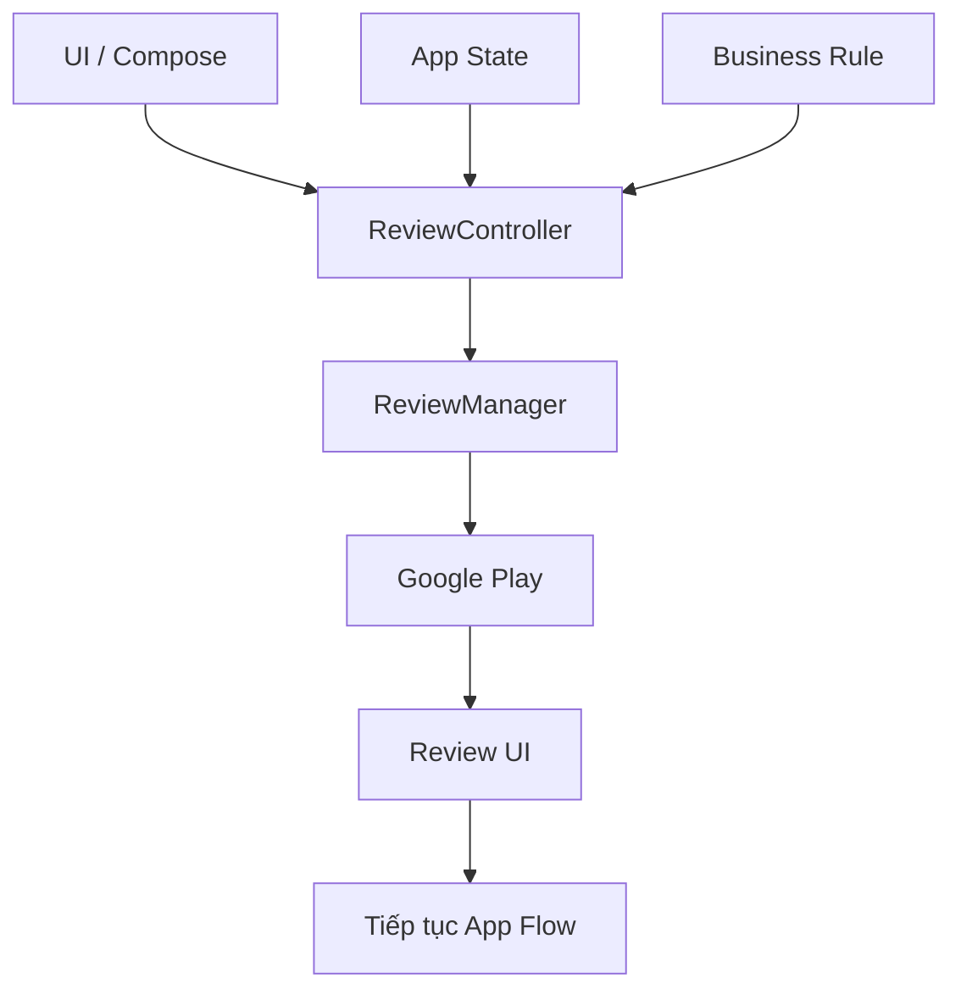
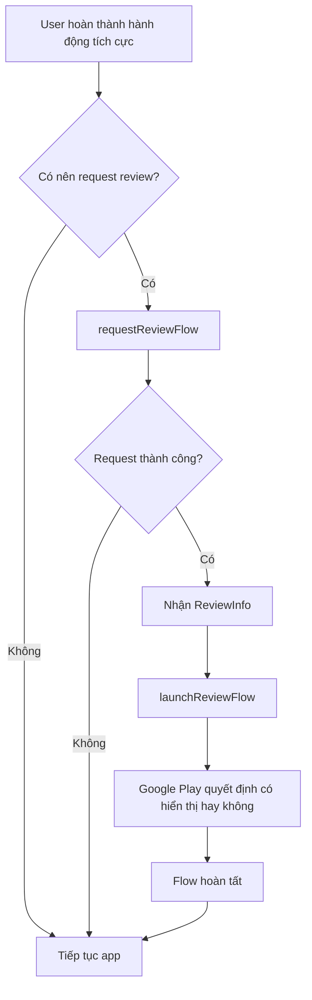
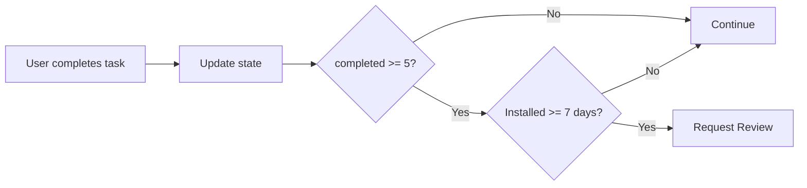
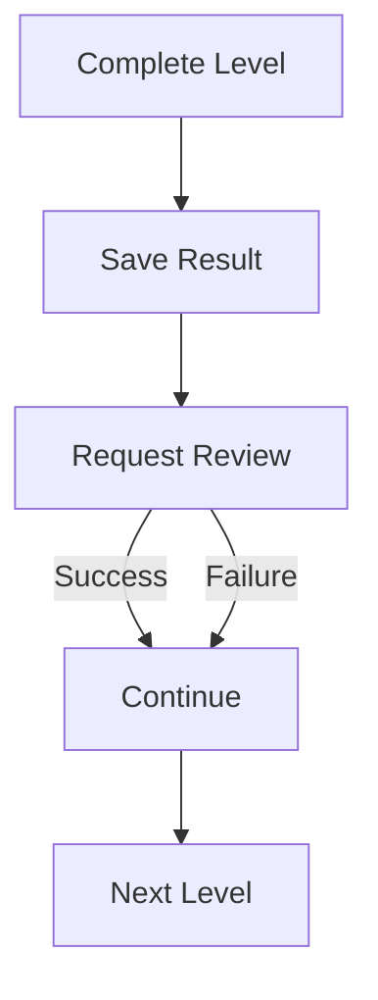
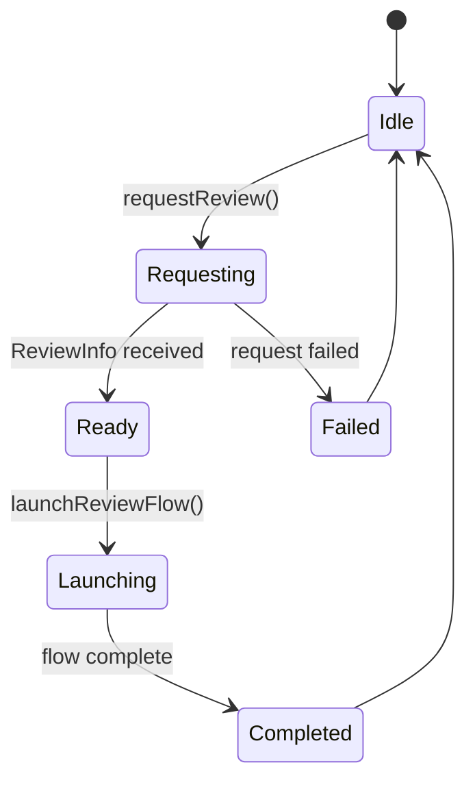
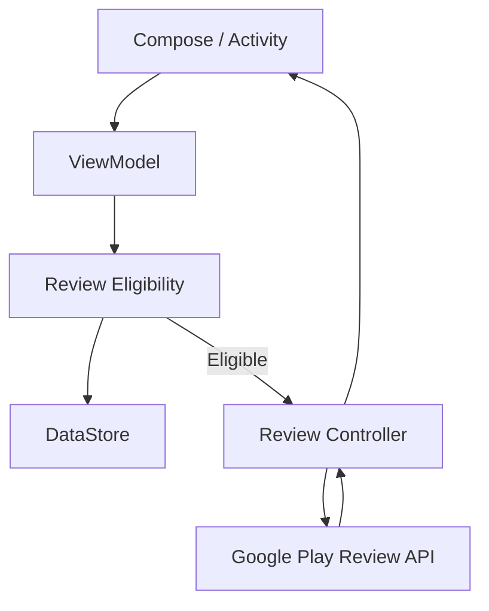
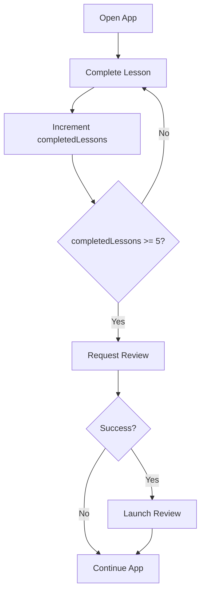

# 015 - In-App Review

**Học phần:** 04 - Network, Async and Services
**Module:** Module 09 - Common Services
**Nhóm nội dung:** Google Services
**Nguồn roadmap:** Common Services / Google Services
**Loại bài:** `service`
**Thứ tự trong module:** 015
**Thời lượng gợi ý:** 34 phút

---

## 1. Tóm tắt

**In-App Review** là API của Google Play cho phép người dùng **đánh giá và viết nhận xét cho ứng dụng ngay bên trong app**, thay vì phải thoát app rồi mở trang Google Play Store.

Một luồng đánh giá có thể cho phép người dùng:

* Chọn từ **1–5 sao**.
* Viết nhận xét.
* Gửi đánh giá lên Google Play.
* Sau đó tiếp tục sử dụng app mà không phải chuyển màn hình sang Play Store. ([Android Developers][1])

Trong Android, In-App Review thuộc nhóm **Google Play Core / Google Services**.

Điểm quan trọng nhất cần hiểu:

> App chỉ **yêu cầu** Google Play hiển thị review dialog.
> Google Play mới là thành phần quyết định dialog có thực sự xuất hiện hay không.

Google Play áp dụng quota nhằm tránh việc app làm phiền người dùng. Vì vậy, gọi API **không đồng nghĩa dialog chắc chắn xuất hiện**. ([Android Developers][1])

---

## 2. Mục tiêu học tập

Sau bài này, bạn có thể:

* Giải thích được **In-App Review là gì**.
* Hiểu In-App Review nằm ở đâu trong kiến trúc Android.
* Tích hợp Play In-App Review Library vào ứng dụng Kotlin.
* Biết sử dụng:

  * `ReviewManager`
  * `ReviewManagerFactory`
  * `ReviewInfo`
  * `requestReviewFlow()`
  * `launchReviewFlow()`
* Chọn **thời điểm thích hợp** để yêu cầu review.
* Hiểu quota và lý do review dialog đôi khi không xuất hiện.
* Không phụ thuộc business logic vào kết quả review.
* Xử lý lifecycle và state hợp lý.
* Test bằng:

  * Internal Testing.
  * Internal App Sharing.
  * `FakeReviewManager`.
* Thiết kế một artifact nhỏ có thể đưa vào portfolio.

---

# 3. In-App Review giải quyết vấn đề gì?

Nếu không có In-App Review, luồng đánh giá thường là:

```text
App
 ↓
Button "Rate us"
 ↓
Mở Google Play
 ↓
Trang ứng dụng
 ↓
Người dùng đánh giá
 ↓
Quay lại app
```

Người dùng bị đưa ra khỏi ứng dụng.

Với In-App Review:

```text
App
 ↓
Google Play Review API
 ↓
Review Card
 ↓
★ ★ ★ ★ ★
 ↓
App tiếp tục hoạt động
```

UX liền mạch hơn vì người dùng không cần rời khỏi ứng dụng.

---

# 4. In-App Review nằm ở đâu trong Android App?

Một kiến trúc đơn giản có thể là:



Trong đó:

### UI

Ví dụ:

```text
Game completed
Order completed
User finished lesson
User used app successfully nhiều lần
```

UI chỉ phát ra tín hiệu:

```text
User reached a good review moment
```

---

### Business rule

Quyết định:

```text
Có nên yêu cầu review hay không?
```

Ví dụ:

```text
completedLesson >= 5
AND
daysSinceInstall >= 7
AND
hasNotRequestedRecently
```

---

### ReviewManager

Làm việc với Google Play Review API.

```text
requestReviewFlow()
        ↓
ReviewInfo
        ↓
launchReviewFlow()
```

---

# 5. Luồng hoạt động của In-App Review

Luồng cơ bản:



Một điều rất quan trọng:

```text
launchReviewFlow() hoàn thành
```

không có nghĩa:

```text
User đã review
```

cũng không có nghĩa:

```text
Dialog đã xuất hiện
```

API cố ý không cho ứng dụng biết người dùng có thực sự gửi review hay dialog có xuất hiện hay không. Sau callback hoàn tất, app nên tiếp tục flow bình thường. ([Android Developers][2])

---

# 6. Khi nào nên hiển thị Review?

Không nên hiển thị ngay khi người dùng vừa mở app.

## Không tốt

```text
User mở app lần đầu
        ↓
"Đánh giá 5 sao nhé?"
```

Người dùng chưa có đủ trải nghiệm để đánh giá.

---

## Tốt hơn

```text
User sử dụng app
        ↓
Hoàn thành một hành động thành công
        ↓
Có trải nghiệm tích cực
        ↓
Request Review
```

Ví dụ với ứng dụng học ngoại ngữ:

```text
Hoàn thành lesson 1
        ↓
lesson 2
        ↓
lesson 3
        ↓
lesson 4
        ↓
lesson 5
        ↓
Request Review
```

Google khuyến nghị chỉ yêu cầu review sau khi người dùng đã trải nghiệm đủ ứng dụng để có thể đưa ra phản hồi có ý nghĩa. ([Android Developers][1])

---

# 7. Không hỏi người dùng trước khi hiển thị Review

Một anti-pattern thường gặp:

```text
Bạn có thích ứng dụng không?

       Có
       ↓
Review 5★

       Không
       ↓
Không hiện review
```

Không nên thiết kế kiểu:

```text
"Bạn có định đánh giá chúng tôi 5 sao không?"
```

hoặc:

```text
"Bạn có thích ứng dụng không?"
```

rồi mới quyết định có đưa họ đến review flow.

Google yêu cầu không hỏi các câu nhằm dò trước ý kiến hoặc dự đoán rating trước khi trình bày review card. ([Android Developers][1])

---

# 8. Quota của In-App Review

Google Play giới hạn tần suất review dialog xuất hiện.

Ví dụ:

```text
App request
    ↓
Google Play
    ↓
Quota OK?
 ┌───────┴────────┐
Yes               No
 ↓                 ↓
Có thể hiện       Không hiện
dialog            dialog
```

Google không công bố cố định quota chính xác và có thể thay đổi cơ chế này.

Ví dụ, nếu gọi:

```kotlin
launchReviewFlow()
```

nhiều lần trong một khoảng thời gian ngắn, dialog có thể không xuất hiện. ([Android Developers][1])

Vì vậy:

```text
API success ≠ Dialog xuất hiện
```

---

# 9. Không dùng In-App Review làm nút "Rate App"

Không nên có:

```text
Settings

[ Rate this app ]
       ↓
launchReviewFlow()
```

Vì nếu quota đã hết:

```text
User nhấn button
     ↓
Không có gì xảy ra
```

UX sẽ giống như button bị lỗi.

Google khuyến nghị với một CTA rõ ràng kiểu **Rate us**, nên đưa người dùng tới trang Play Store thay vì dựa vào In-App Review API. ([Android Developers][1])

Có thể phân biệt:

| Use case                          | Giải pháp      |
| --------------------------------- | -------------- |
| Review tự động ở thời điểm UX tốt | In-App Review  |
| User chủ động bấm "Rate app"      | Mở Google Play |
| Feedback lỗi                      | Feedback form  |
| Support                           | Support screen |

---

# 10. Thêm dependency

Theo tài liệu Android hiện tại, Play In-App Review sử dụng thư viện riêng:

```kotlin
dependencies {
    implementation("com.google.android.play:review:2.0.2")
    implementation("com.google.android.play:review-ktx:2.0.2")
}
```

Phiên bản `2.0.2` hiện được tài liệu Android hướng dẫn sử dụng; thư viện Play Core cũ đã được tách thành các thư viện riêng theo từng tính năng. ([Android Developers][2])

---

# 11. Có cần API Key không?

Không.

In-App Review không yêu cầu:

```text
❌ Google Maps API Key
❌ Firebase configuration
❌ OAuth Client ID
❌ Location permission
❌ Camera permission
❌ Storage permission
```

Thứ cần thiết chủ yếu là:

```text
Android App
     +
Google Play Store
     +
Play In-App Review Library
```

---

# 12. Tạo ReviewManager

Đầu tiên tạo `ReviewManager`.

```kotlin
import com.google.android.play.core.review.ReviewManager
import com.google.android.play.core.review.ReviewManagerFactory

val reviewManager: ReviewManager =
    ReviewManagerFactory.create(context)
```

`ReviewManager` là interface chính để yêu cầu và khởi chạy review flow. ([Android Developers][2])

---

# 13. Request ReviewInfo

Bước tiếp theo:

```kotlin
val request = reviewManager.requestReviewFlow()

request.addOnCompleteListener { task ->

    if (task.isSuccessful) {

        val reviewInfo = task.result

    } else {

        // Request failed

    }
}
```

Flow:

```text
ReviewManager
      ↓
requestReviewFlow()
      ↓
Google Play
      ↓
ReviewInfo
```

`ReviewInfo` chứa thông tin cần thiết để khởi chạy review flow.

---

# 14. ReviewInfo không nên giữ quá lâu

`ReviewInfo` chỉ hợp lệ trong một khoảng thời gian giới hạn.

Vì vậy không nên:

```text
App startup
   ↓
request ReviewInfo
   ↓
lưu ViewModel
   ↓
2 ngày sau
   ↓
launch
```

Nên:

```text
User gần đạt review moment
        ↓
request ReviewInfo
        ↓
Review moment
        ↓
launchReviewFlow()
```

Google cho phép pre-cache nhưng chỉ nên request khi đã khá chắc chắn rằng app sắp sử dụng review flow. ([Android Developers][2])

---

# 15. Launch Review Flow

Sau khi có `ReviewInfo`:

```kotlin
reviewManager
    .launchReviewFlow(activity, reviewInfo)
    .addOnCompleteListener {

        // Tiếp tục app flow
    }
```

Điểm quan trọng:

```kotlin
addOnCompleteListener
```

không trả về:

```text
User rated = true
```

không trả về:

```text
Rating = 5
```

và cũng không xác nhận:

```text
Review dialog appeared = true
```

Google cố ý không cung cấp những thông tin này. ([Android Developers][2])

---

# 16. Ví dụ hoàn chỉnh

```kotlin
import android.app.Activity
import com.google.android.play.core.review.ReviewManagerFactory

fun requestInAppReview(activity: Activity) {

    val reviewManager =
        ReviewManagerFactory.create(activity)

    val request =
        reviewManager.requestReviewFlow()

    request.addOnCompleteListener { task ->

        if (task.isSuccessful) {

            val reviewInfo = task.result

            val flow =
                reviewManager.launchReviewFlow(
                    activity,
                    reviewInfo
                )

            flow.addOnCompleteListener {

                // Không biết user có review hay không.
                // Tiếp tục flow của app bình thường.

            }

        } else {

            // Review API thất bại.
            // Không làm gián đoạn UX.
        }
    }
}
```

---

# 17. Tách thành ReviewManager riêng trong project

Trong production không nên nhét toàn bộ logic vào `Activity`.

Ví dụ:

```text
UI
 │
 ▼
ReviewController
 │
 ▼
Google Play ReviewManager
```

Có thể tạo:

```kotlin
class AppReviewManager {

    fun requestReview(
        activity: Activity
    ) {

        val manager =
            ReviewManagerFactory.create(activity)

        manager
            .requestReviewFlow()
            .addOnCompleteListener { request ->

                if (!request.isSuccessful) {
                    return@addOnCompleteListener
                }

                val reviewInfo = request.result

                manager
                    .launchReviewFlow(
                        activity,
                        reviewInfo
                    )
            }
    }
}
```

Sau đó UI chỉ gọi:

```kotlin
appReviewManager.requestReview(activity)
```

---

# 18. Ví dụ business rule

Không nên gọi review sau mọi hành động thành công.

Ta có thể lưu:

```text
completedSessions
lastReviewRequestTime
```

Ví dụ:

```kotlin
fun shouldRequestReview(
    completedSessions: Int,
    daysSinceInstall: Int
): Boolean {

    return completedSessions >= 5 &&
           daysSinceInstall >= 7
}
```

Flow:



---

# 19. Ví dụ với ứng dụng học tập

Giả sử app có:

```text
Lesson 1
Lesson 2
Lesson 3
Lesson 4
Lesson 5
```

Khi hoàn thành Lesson 5:

```kotlin
fun onLessonCompleted(
    activity: Activity,
    completedLessons: Int
) {

    if (completedLessons == 5) {

        appReviewManager.requestReview(activity)

    }
}
```

Thực tế production nên thêm các điều kiện khác để tránh request quá thường xuyên.

---

# 20. Lifecycle

In-App Review cần một `Activity` để launch UI:

```kotlin
launchReviewFlow(
    activity,
    reviewInfo
)
```

Vì vậy cần chú ý lifecycle.

Không nên cố launch review khi Activity đã:

```text
Destroyed
Finishing
Background
```

Flow tốt:

```text
Activity RESUMED
       ↓
User hoàn thành hành động
       ↓
requestReviewFlow
       ↓
ReviewInfo
       ↓
Activity còn active?
       ↓
launchReviewFlow
```

---

# 21. Rotation và state

Giả sử:

```text
Request Review
     ↓
Rotate device
     ↓
Activity recreated
```

Không nên coi In-App Review là business state quan trọng.

Ví dụ những state quan trọng:

```text
lessonCompleted
orderCompleted
gameScore
```

phải được giữ đúng.

Nhưng:

```text
review dialog failed
```

không được làm mất hoặc rollback business state.

Nguyên tắc:

```text
Review = side effect

không phải

Review = business transaction
```

---

# 22. Không block app flow

Một sai lầm nghiêm trọng:

```text
User hoàn thành level
        ↓
Request Review
        ↓
Review lỗi
        ↓
Không sang level tiếp
```

Không nên.

Flow đúng:



Google cũng khuyến nghị khi review flow gặp lỗi, app không nên thông báo lỗi cho người dùng hoặc thay đổi flow bình thường của ứng dụng. ([Android Developers][2])

---

# 23. Xử lý lỗi

Có thể log lỗi:

```kotlin
request.addOnFailureListener { exception ->

    Log.e(
        "InAppReview",
        "Cannot request review",
        exception
    )
}
```

Nhưng không nên hiện:

```text
❌ Error 404: review failed
❌ Could not open rating dialog
❌ Please retry review
```

cho user.

Review là tính năng phụ.

Nếu nó lỗi:

```text
App vẫn phải tiếp tục bình thường.
```

---

# 24. State machine đơn giản

Có thể mô hình hóa:



Nhưng phần state này chủ yếu phục vụ code organization/debugging.

Không nên dùng:

```text
Completed
```

để kết luận rằng:

```text
User submitted review
```

---

# 25. Quyền riêng tư

In-App Review không yêu cầu runtime permission.

Không có:

```text
READ_CONTACTS
ACCESS_FINE_LOCATION
CAMERA
RECORD_AUDIO
```

Tuy nhiên, review có thể chứa:

```text
Rating
+
Free-text review
```

và dữ liệu này được Google Play xử lý để đăng review lên Play Store. Google cho biết dữ liệu review được mã hóa trong quá trình xử lý và người dùng có thể xóa review từ tài khoản Google Play/Google của họ. ([Android Developers][1])

Developer vẫn phải tự đánh giá cách khai báo **Data Safety** của toàn ứng dụng dựa trên cách app thực sự xử lý dữ liệu.

---

# 26. Thiết bị hỗ trợ

Theo tài liệu Google Play, In-App Review hoạt động trên:

* Android phone.
* Android tablet.
* Google TV.
* Android từ **API 21 / Android 5.0 trở lên** có Google Play Store.
* ChromeOS có Google Play Store. ([Android Developers][1])

Điều đó có nghĩa môi trường không có Google Play Store có thể không sử dụng được flow này.

---

# 27. Testing

Đây là phần rất quan trọng.

Không nên chỉ chạy app từ Android Studio rồi kết luận:

```text
Dialog không hiện
→ code lỗi
```

In-App Review phụ thuộc vào Google Play.

---

## 27.1 Internal Testing Track

Có thể:

```text
Build AAB
   ↓
Play Console
   ↓
Internal Testing
   ↓
Add tester
   ↓
Tester install từ Play Store
   ↓
Test In-App Review
```

Google yêu cầu trong internal testing:

1. Account thuộc nhóm tester.
2. Account đó đang được chọn trong Play Store.
3. App đã được tải từ Play Store bằng account đó.
4. Account chưa có review hiện tại cho app. ([Android Developers][3])

Một lợi thế quan trọng:

> Quota review không được áp dụng theo cách thông thường đối với app tải từ Internal Test Track, giúp việc kiểm thử dễ hơn. ([Android Developers][3])

---

# 28. Internal App Sharing

Một lựa chọn khác:

```text
Play Console
     ↓
Internal App Sharing
     ↓
Upload APK/AAB
     ↓
Install
     ↓
Test Review Flow
```

Phù hợp khi muốn iterate nhanh.

Tuy nhiên với Internal App Sharing:

```text
Review UI có thể được hiển thị
```

nhưng:

```text
Review không thể submit thực sự
```

nút submit sẽ bị disable. ([Android Developers][3])

---

# 29. FakeReviewManager

Google cung cấp:

```kotlin
FakeReviewManager
```

Ví dụ:

```kotlin
val manager =
    FakeReviewManager(context)
```

Có thể dùng trong:

```text
Unit test
Integration test
```

để mô phỏng API.

Ví dụ:

```kotlin
@Test
fun reviewFlowCompletesSuccessfully() {

    val manager =
        FakeReviewManager(context)

    val request =
        manager.requestReviewFlow()

    assertTrue(request.isSuccessful)
}
```

Nhưng cần lưu ý:

> `FakeReviewManager` không mô phỏng UI review thực tế. Nó chỉ giả lập kết quả API và cung cấp `ReviewInfo` giả. ([Android Developers][3])

---

# 30. Test matrix

| Test                       | Kết quả mong đợi         |
| -------------------------- | ------------------------ |
| Request thành công         | App không crash          |
| Request thất bại           | User flow tiếp tục       |
| Dialog không xuất hiện     | App vẫn hoạt động        |
| Rotate màn hình            | Business state không mất |
| App background             | Không crash              |
| Internal testing           | Review flow hoạt động    |
| FakeReviewManager          | Logic integration chạy   |
| User đã review             | App vẫn hoạt động        |
| Quota đạt giới hạn         | Không ảnh hưởng app      |
| Không có Play Store hợp lệ | App không crash          |

---

# 31. Debugging: Dialog không xuất hiện

Nếu:

```text
requestReviewFlow()
```

thành công nhưng không thấy dialog, chưa chắc code bị lỗi.

Kiểm tra:

### 1. App có được cài từ Google Play không?

```text
Internal testing
hoặc
Internal app sharing
```

---

### 2. Đúng Google account chưa?

Thiết bị có thể có:

```text
Account A
Account B
Account C
```

nhưng Play Store đang chọn sai account.

---

### 3. Account đã review app chưa?

Nếu đã review:

```text
Play Store
→ App
→ Existing review
→ Delete
```

rồi test lại.

---

### 4. Có quota không?

Production có giới hạn tần suất.

---

### 5. Play Store có hợp lệ không?

Google ghi nhận Play Store được sideload không chính thức có thể khiến flow không hoạt động. ([Android Developers][3])

---

# 32. Anti-patterns

## Anti-pattern 1: Request ngay khi mở app

```kotlin
override fun onCreate(...) {

    requestReview()

}
```

Không tốt vì user chưa có trải nghiệm.

---

## Anti-pattern 2: Request sau mọi hành động

```text
Complete lesson → review
Complete quiz → review
Login → review
Open settings → review
```

Gây UX tệ và quota.

---

## Anti-pattern 3: Chặn tính năng sau review

```text
Review app để mở Level 10
```

Không nên.

---

## Anti-pattern 4: Chỉ cho người hài lòng review

```text
Do you like this app?

YES → Google Review
NO → Feedback form
```

Không nên dùng kiểu gating này.

---

## Anti-pattern 5: Giả định review đã được gửi

```kotlin
launchReviewFlow(...)
    .addOnCompleteListener {

        analytics.log("user_gave_5_star")

    }
```

Sai.

Bạn không biết:

```text
Dialog có hiện không.
User có review không.
User cho bao nhiêu sao.
```

---

# 33. Analytics nên ghi gì?

Có thể log:

```text
review_trigger_eligible
review_api_requested
review_api_request_failed
review_flow_completed
```

Nhưng không nên log:

```text
user_reviewed_app
user_gave_5_stars
review_submitted
```

vì API không cung cấp thông tin đó.

Ví dụ:

```kotlin
analytics.logEvent(
    "review_api_requested",
    null
)
```

---

# 34. Kiến trúc production gợi ý



### `ReviewEligibility`

Quản lý:

```text
đã dùng app bao lâu
đã hoàn thành bao nhiêu task
lần cuối request review
```

### DataStore

Lưu:

```text
reviewRequestCount
lastReviewRequestTime
```

### ReviewController

Chứa interaction với:

```text
ReviewManager
```

---

# 35. Ví dụ cấu trúc project

```text
app/
│
├── ui/
│   └── lesson/
│       └── LessonScreen.kt
│
├── review/
│   ├── AppReviewManager.kt
│   └── ReviewEligibility.kt
│
├── data/
│   └── ReviewPreferences.kt
│
└── MainActivity.kt
```

---

# 36. Thực hành

## Task 1 — Thêm dependency

Trong:

```text
app/build.gradle.kts
```

thêm:

```kotlin
implementation(
    "com.google.android.play:review:2.0.2"
)

implementation(
    "com.google.android.play:review-ktx:2.0.2"
)
```

---

## Task 2 — Tạo ReviewManager

```kotlin
val reviewManager =
    ReviewManagerFactory.create(context)
```

---

## Task 3 — Request ReviewInfo

```kotlin
val request =
    reviewManager.requestReviewFlow()
```

Xử lý:

```text
success
failure
```

---

## Task 4 — Launch Review

```kotlin
reviewManager.launchReviewFlow(
    activity,
    reviewInfo
)
```

---

## Task 5 — Thêm business rule

Ví dụ:

```text
Request review khi:

completedLessons >= 5
```

Không request ngay khi mở app.

---

## Task 6 — Failure scenario

Giả lập:

```text
requestReviewFlow fails
```

Kết quả mong đợi:

```text
App vẫn tiếp tục bình thường.
```

---

# 37. Bài tập

## Yêu cầu

Xây dựng một app demo:

```text
Lesson Review Demo
```

Màn hình:

```text
┌──────────────────────────┐
│      Android Course      │
│                          │
│ Completed lessons: 4     │
│                          │
│ [ Complete Lesson ]      │
│                          │
└──────────────────────────┘
```

Mỗi lần bấm:

```text
completedLessons++
```

Khi:

```text
completedLessons == 5
```

thì:

```text
requestReviewFlow()
```

---

## Flow bài tập



---

# 38. Artifact đưa vào portfolio

Có thể tạo project:

```text
android-in-app-review-demo/
```

Cấu trúc:

```text
android-in-app-review-demo/
│
├── app/
│
├── screenshots/
│   ├── lesson-screen.png
│   └── review-flow.png
│
├── diagrams/
│   └── review-flow.md
│
└── README.md
```

README có thể mô tả:

```markdown
# Android In-App Review Demo

Demo integration of Google Play In-App Review API.

## Features

- Play In-App Review
- ReviewManager abstraction
- Eligibility rules
- Failure handling
- Lifecycle-safe review trigger
- FakeReviewManager testing
```

Artifact này thể hiện được các kỹ năng:

```text
Google Play services
      +
Async API
      +
Lifecycle
      +
State
      +
UX decisions
      +
Testing
```

---

# 39. Checklist hoàn thành

* [ ] Giải thích được In-App Review là gì.
* [ ] Biết In-App Review thuộc Google Play Core.
* [ ] Thêm Play Review dependency.
* [ ] Tạo được `ReviewManager`.
* [ ] Hiểu `ReviewInfo`.
* [ ] Sử dụng được `requestReviewFlow()`.
* [ ] Sử dụng được `launchReviewFlow()`.
* [ ] Không giả định dialog chắc chắn xuất hiện.
* [ ] Không giả định user đã gửi review.
* [ ] Hiểu quota của Google Play.
* [ ] Không request review quá thường xuyên.
* [ ] Không request ngay khi app vừa mở.
* [ ] Chọn một user success moment phù hợp.
* [ ] Không block business flow nếu review lỗi.
* [ ] Không cần runtime permission.
* [ ] Test bằng Internal Testing.
* [ ] Biết cách dùng Internal App Sharing.
* [ ] Biết mục đích của `FakeReviewManager`.
* [ ] Kiểm tra rotation/background.
* [ ] Có failure scenario.
* [ ] Có screenshot.
* [ ] Có diagram.
* [ ] Có README cho portfolio.

---

# 40. Ghi chú production

Khi đưa In-App Review vào production, hãy tự hỏi:

### UX

```text
User đã trải nghiệm app đủ lâu chưa?

Đây có phải một positive moment không?

Review prompt có làm gián đoạn task quan trọng không?
```

### State

```text
Nếu review API lỗi thì sao?

Nếu Activity recreate thì sao?

Business state có bị phụ thuộc vào review không?
```

### Lifecycle

```text
Activity còn active không?

Có launch khi app background không?
```

### Testing

```text
Internal testing đã chạy chưa?

Đã test account chưa review chưa?

FakeReviewManager đã test logic chưa?
```

### Release

```text
Play dependency đúng chưa?

Production flow có fallback không?

Analytics có đang suy diễn user đã review không?
```

---

# 41. Những điều cần nhớ

```text
            IN-APP REVIEW
                  │
        ┌─────────┴──────────┐
        │                    │
       UX               Google Play
        │                    │
Positive moment         ReviewManager
        │                    │
Business Rule          ReviewInfo
        │                    │
        └───────┬────────────┘
                │
       launchReviewFlow()
                │
                ▼
      Google Play quyết định
      có hiển thị dialog không
                │
                ▼
        Continue App Flow
```

Ba nguyên tắc quan trọng nhất:

> **1. Request review ở thời điểm người dùng vừa có trải nghiệm tích cực.**

> **2. Không bao giờ giả định rằng gọi `launchReviewFlow()` nghĩa là dialog đã xuất hiện hoặc người dùng đã gửi review.**

> **3. Review là side effect — lỗi review không được phép làm hỏng luồng chính của ứng dụng.**

Tài liệu Android hiện tại cũng xác nhận Play In-App Review đang dùng dependency `com.google.android.play:review:2.0.2`, và API tích hợp Kotlin/Java vẫn dựa trên chuỗi `ReviewManager → requestReviewFlow() → ReviewInfo → launchReviewFlow()`. ([Android Developers][2])

[1]: https://developer.android.com/guide/playcore/in-app-review?authuser=002&utm_source=chatgpt.com "Google Play In-App Reviews API  |  Other Play guides  |  Android Developers"
[2]: https://developer.android.com/guide/playcore/in-app-review/kotlin-java?authuser=14 "Integrate in-app reviews (Kotlin or Java)  |  Other Play guides  |  Android Developers"
[3]: https://developer.android.com/guide/playcore/in-app-review/test?authuser=19&utm_source=chatgpt.com "Test in-app reviews  |  Other Play guides  |  Android Developers"
