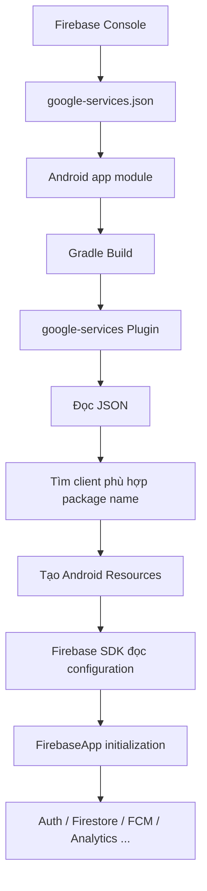
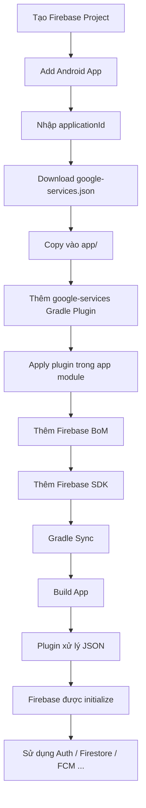
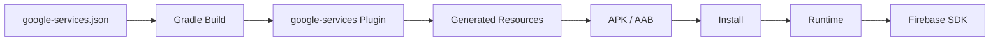
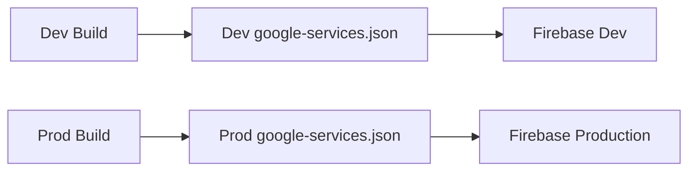
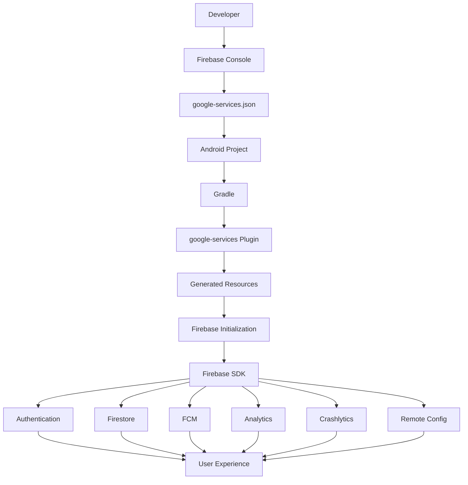
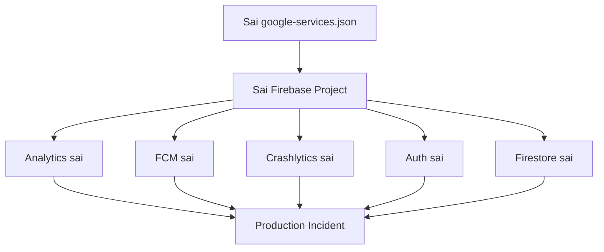

# 016 - google-services Plugin

**Học phần:** 04 - Network, Async and Services
**Module:** Module 09 - Common Services
**Nhóm nội dung:** Service Integration
**Nguồn roadmap:** Common Services / Service Integration
**Loại bài:** `service`
**Thứ tự trong module:** 016
**Thời lượng gợi ý:** 34 phút

---

## 1. Tóm tắt

`google-services Plugin` là một **Gradle plugin chạy trong quá trình build ứng dụng Android**, thường được sử dụng khi tích hợp **Firebase** và một số Google APIs.

Plugin có ID:

```text
com.google.gms.google-services
```

Nhiệm vụ quan trọng nhất của plugin là:

1. Đọc file:

```text
google-services.json
```

2. Tìm cấu hình tương ứng với Android application/package hiện tại.

3. Chuyển các giá trị trong JSON thành **Android Resources**.

4. Cho phép Firebase SDK và ứng dụng sử dụng các giá trị cấu hình như:

```text
google_app_id
project_id
google_api_key
gcm_defaultSenderId
default_web_client_id
```

Google hiện liệt kê `com.google.gms:google-services:4.5.0` là phiên bản plugin hiện hành. ([firebase.google.com][1])

> **Điểm rất quan trọng:** `google-services Plugin` **không phải** Google Play services. Plugin chạy ở **build time**, trong khi Google Play services là thành phần/runtime service tồn tại trên thiết bị Android. ([firebase.google.com][2])

---

## 2. Mục tiêu học tập

Sau bài này, bạn có thể:

* Giải thích được `google-services Plugin` bằng ngôn ngữ của mình.
* Hiểu vai trò của `google-services.json`.
* Biết plugin chạy ở **build time**, không phải runtime.
* Biết cách thêm plugin vào Gradle.
* Biết cách tích hợp Firebase vào một Android app.
* Hiểu mối quan hệ giữa:

```text
Firebase Console
google-services.json
Gradle
google-services Plugin
Firebase SDK
Android App
```

* Phân biệt được:

```text
google-services Plugin
Google Play services
Firebase SDK
Google Play Store
```

* Debug các lỗi phổ biến như:

```text
google-services.json is missing
No matching client found
package_name mismatch
Firebase not initialized
```

* Quản lý cấu hình riêng cho:

```text
debug
staging
release
```

* Tạo được một artifact nhỏ để đưa vào portfolio.

---

# 3. google-services Plugin là gì?

Plugin có tên đầy đủ:

```text
Google Services Gradle Plugin
```

Plugin ID:

```kotlin
com.google.gms.google-services
```

Nó tham gia vào quá trình:

```text
Gradle Build
```

thay vì trực tiếp chạy như một service bên trong app.

Có thể hình dung:

```text
google-services.json
        │
        ▼
Google Services Gradle Plugin
        │
        ▼
Generated Android Resources
        │
        ▼
Firebase SDK
        │
        ▼
Android Application
```

Theo tài liệu Google, hai nhiệm vụ chính của plugin là xử lý `google-services.json` thành Android resources và hỗ trợ cấu hình các thư viện Google/Firebase liên quan. ([firebase.google.com][3])

---

# 4. Tại sao cần google-services.json?

Khi tạo Android App trong Firebase Console, Firebase cần biết ứng dụng Android nào đang kết nối với project.

Ví dụ:

```text
Firebase Project
└── lumina-demo
    ├── Android App
    │   └── com.example.lumina
    │
    ├── Web App
    └── iOS App
```

Firebase tạo một file:

```text
google-services.json
```

chứa thông tin cấu hình cho Android app.

Một cấu trúc đơn giản có thể hình dung như:

```json
{
  "project_info": {
    "project_number": "...",
    "project_id": "my-project"
  },
  "client": [
    {
      "client_info": {
        "mobilesdk_app_id": "...",
        "android_client_info": {
          "package_name": "com.example.demo"
        }
      }
    }
  ]
}
```

---

## 4.1 File này thường đặt ở đâu?

Thông thường:

```text
MyAndroidProject/
├── app/
│   ├── google-services.json
│   ├── build.gradle.kts
│   └── src/
│
├── build.gradle.kts
└── settings.gradle.kts
```

Tức là:

```text
app/google-services.json
```

Firebase cũng hỗ trợ file riêng cho từng build type hoặc product flavor. ([firebase.google.com][3])

Ví dụ:

```text
app/
├── google-services.json
│
└── src/
    ├── debug/
    │   └── google-services.json
    │
    └── release/
        └── google-services.json
```

Điều này đặc biệt hữu ích khi production và development sử dụng **hai Firebase project khác nhau**.

---

# 5. google-services.json có phải secret không?

Không hoàn toàn.

Firebase mô tả `google-services.json` là file chứa các **project/app identifier duy nhất nhưng không được coi là secret credential**. ([firebase.google.com][1])

Ví dụ:

```text
project_id
google_app_id
API key
sender ID
```

không nên được xem giống:

```text
private key
service account key
database password
backend secret
```

Tuy nhiên:

> Không nên dựa vào việc "giấu API key trong APK" để bảo vệ backend.

APK có thể bị reverse engineer.

Security thực sự phải dựa vào các cơ chế như:

```text
Firebase Security Rules
App Check
Authentication
Backend authorization
API restrictions
```

---

# 6. Plugin hoạt động như thế nào?

Đây là phần quan trọng nhất của bài.



---

## 6.1 Bước 1 — Đọc google-services.json

Plugin tìm:

```text
google-services.json
```

trong module Android.

---

## 6.2 Bước 2 — Tìm client tương ứng

Trong JSON có thể tồn tại nhiều:

```json
"client": [...]
```

Plugin tìm client có:

```text
package_name
```

khớp với Android application hiện tại. ([firebase.google.com][3])

Ví dụ app:

```kotlin
android {
    namespace = "com.example.demo"

    defaultConfig {
        applicationId = "com.example.demo"
    }
}
```

Firebase config:

```json
{
  "android_client_info": {
    "package_name": "com.example.demo"
  }
}
```

Hai giá trị phải khớp.

---

# 7. Plugin sinh ra những gì?

Plugin chuyển dữ liệu JSON thành resources Android.

Ví dụ:

```text
google_app_id
gcm_defaultSenderId
default_web_client_id
firebase_database_url
google_api_key
project_id
```

Google cho biết output của bước xử lý JSON gồm các Android resource được sinh ra từ thông tin Firebase configuration. ([Google for Developers][4])

Có thể hiểu:

```text
google-services.json
       ↓
google-services Plugin
       ↓
generated/res/values/values.xml
       ↓
R.string.*
```

Ví dụ logic tương đương:

```xml
<resources>
    <string name="google_app_id">...</string>
    <string name="gcm_defaultSenderId">...</string>
    <string name="google_api_key">...</string>
    <string name="project_id">...</string>
</resources>
```

Bạn **không cần tự viết** các resource này.

---

# 8. Cài đặt google-services Plugin

## 8.1 Project-level build.gradle.kts

Với Kotlin DSL:

```kotlin
plugins {
    id("com.android.application") version "..." apply false
    id("org.jetbrains.kotlin.android") version "..." apply false

    id("com.google.gms.google-services") version "4.5.0" apply false
}
```

Cấu hình plugin `4.5.0` hiện được Firebase hướng dẫn chính thức. ([firebase.google.com][1])

---

# 9. Apply plugin trong app module

File:

```text
app/build.gradle.kts
```

Thêm:

```kotlin
plugins {
    id("com.android.application")
    id("org.jetbrains.kotlin.android")

    id("com.google.gms.google-services")
}
```

Điểm cần nhớ:

```text
Project-level
    ↓
khai báo plugin + version

App-level
    ↓
apply plugin
```

---

# 10. Thêm Firebase SDK

Plugin chỉ xử lý configuration.

Muốn sử dụng Firebase, vẫn phải thêm **Firebase SDK**.

Ví dụ:

```kotlin
dependencies {

    implementation(
        platform("com.google.firebase:firebase-bom:34.18.0")
    )

    implementation("com.google.firebase:firebase-analytics")
    implementation("com.google.firebase:firebase-auth")
    implementation("com.google.firebase:firebase-firestore")
}
```

Firebase hiện khuyến nghị sử dụng **Firebase Android BoM** để giữ các thư viện Firebase ở những phiên bản tương thích. ([firebase.google.com][1])

---

## 10.1 Vì sao dùng Firebase BoM?

Nếu tự khai báo:

```kotlin
implementation("com.google.firebase:firebase-auth:x.x.x")
implementation("com.google.firebase:firebase-firestore:y.y.y")
implementation("com.google.firebase:firebase-messaging:z.z.z")
```

developer phải tự quản lý nhiều version.

Với BoM:

```kotlin
implementation(
    platform("com.google.firebase:firebase-bom:34.18.0")
)

implementation("com.google.firebase:firebase-auth")
implementation("com.google.firebase:firebase-firestore")
implementation("com.google.firebase:firebase-messaging")
```

BoM quản lý version tương thích.

```text
Firebase BoM
      │
      ├── Firebase Auth
      ├── Firestore
      ├── Messaging
      ├── Analytics
      └── Crashlytics
```

---

# 11. Luồng tích hợp Firebase hoàn chỉnh

Một quy trình chuẩn:



---

# 12. Ví dụ project

Giả sử chúng ta xây app:

```text
FirebaseDemo
```

Package:

```text
com.example.firebasedemo
```

Cấu trúc:

```text
FirebaseDemo/
│
├── build.gradle.kts
│
├── settings.gradle.kts
│
└── app/
    ├── google-services.json
    ├── build.gradle.kts
    └── src/
        └── main/
```

---

# 13. Kiểm tra Firebase đã kết nối chưa

Sau khi cấu hình Firebase, có thể kiểm tra:

```kotlin
import android.os.Bundle
import android.util.Log
import androidx.activity.ComponentActivity
import com.google.firebase.FirebaseApp

class MainActivity : ComponentActivity() {

    override fun onCreate(savedInstanceState: Bundle?) {
        super.onCreate(savedInstanceState)

        val firebaseApp = FirebaseApp.getInstance()

        Log.d(
            "FirebaseDemo",
            "Firebase project = ${firebaseApp.options.projectId}"
        )
    }
}
```

Nếu cấu hình đúng, Logcat có thể hiển thị:

```text
Firebase project = my-firebase-project
```

---

# 14. google-services Plugin không phải Firebase SDK

Đây là nhầm lẫn phổ biến.

### google-services Plugin

```text
Build-time tool
```

Nhiệm vụ:

```text
google-services.json
        ↓
Android resources
```

---

### Firebase SDK

```text
Runtime library
```

Ví dụ:

```text
firebase-auth
firebase-firestore
firebase-messaging
firebase-analytics
```

Thực hiện các tính năng Firebase khi app chạy.

---

# 15. google-services Plugin không phải Google Play services

Tên rất dễ gây nhầm.

| Thành phần               | Vai trò                         |
| ------------------------ | ------------------------------- |
| `google-services Plugin` | Gradle plugin                   |
| Firebase SDK             | Library trong ứng dụng          |
| Google Play services     | Runtime service trên thiết bị   |
| Google Play Store        | Kho phân phối ứng dụng          |
| Firebase Console         | Backend/configuration dashboard |

Google cũng nhấn mạnh rằng `google-services` Gradle plugin không phải Google Play services và plugin không trực tiếp cung cấp runtime functionality cho app. ([firebase.google.com][2])

---

# 16. Build Time và Runtime

Đây là một khái niệm quan trọng đối với Android developer.



### Build time

Plugin hoạt động.

```text
Gradle
google-services Plugin
resource generation
dependency resolution
APK/AAB packaging
```

### Runtime

Firebase SDK hoạt động.

```text
FirebaseAuth
Firestore
FirebaseMessaging
Analytics
Crashlytics
```

---

# 17. Lifecycle có liên quan không?

`google-services Plugin` gần như **không liên quan trực tiếp với Android lifecycle**.

Nó chạy lúc:

```text
build
```

chứ không chạy trong:

```text
onCreate()
onStart()
onResume()
onPause()
onStop()
```

Tuy nhiên Firebase SDK được cấu hình từ plugin có thể ảnh hưởng đến runtime.

Ví dụ:

```text
App launch
   ↓
Firebase initialization
   ↓
Analytics / Auth / Messaging
```

Do đó cần phân biệt:

```text
Plugin
   ↓
Build concern

Firebase SDK
   ↓
Runtime + Lifecycle concern
```

---

# 18. State có liên quan không?

Plugin không quản lý UI state.

Không có chuyện:

```text
rotate screen
→ google-services Plugin mất state
```

Plugin đã hoàn thành công việc trước khi APK chạy.

Nhưng Firebase SDK phía runtime có thể quản lý state như:

```text
Auth session
FCM token
Remote Config
Firestore cache
Analytics session
```

Vì vậy developer phải phân biệt:

```text
Configuration State
vs
Application Runtime State
```

---

# 19. Ví dụ nhiều môi trường

Production app thường không nên để:

```text
development
staging
production
```

cùng một Firebase project.

Có thể sử dụng:

```text
Firebase Project Dev
Firebase Project Staging
Firebase Project Prod
```

---

## Cấu trúc

```text
app/
└── src/
    ├── debug/
    │   └── google-services.json
    │
    └── release/
        └── google-services.json
```

Sau đó:

```text
debug build
      ↓
Firebase Development

release build
      ↓
Firebase Production
```

Google Services Plugin hỗ trợ cấu hình `google-services.json` riêng cho build type và product flavor. ([firebase.google.com][3])

---

# 20. Product Flavor

Ví dụ:

```kotlin
android {

    flavorDimensions += "environment"

    productFlavors {

        create("dev") {
            dimension = "environment"
        }

        create("prod") {
            dimension = "environment"
        }
    }
}
```

Cấu trúc:

```text
app/
└── src/
    ├── dev/
    │   └── google-services.json
    │
    └── prod/
        └── google-services.json
```

Luồng:



---

# 21. Lỗi phổ biến — google-services.json bị thiếu

Một lỗi rất phổ biến:

```text
File google-services.json is missing
```

Nguyên nhân:

```text
google-services.json
```

không nằm đúng thư mục.

Sai:

```text
project/google-services.json
```

Thường đúng:

```text
project/app/google-services.json
```

Firebase cũng lưu ý tên file phải là:

```text
google-services.json
```

không phải:

```text
google-services (1).json
google-services (2).json
```

([firebase.google.com][1])

---

# 22. Lỗi package không khớp

Ví dụ Android app:

```kotlin
applicationId = "com.example.demo"
```

nhưng Firebase config:

```json
"package_name": "com.example.oldapp"
```

Plugin có thể báo lỗi kiểu:

```text
No matching client found
```

Luồng lỗi:

```text
applicationId
     │
     ▼
com.example.demo

google-services.json
     │
     ▼
com.example.oldapp

     ↓

NO MATCH
```

---

## Cách sửa

Firebase Console:

```text
Project Settings
      ↓
Your apps
      ↓
Add Android App
```

đăng ký đúng:

```text
com.example.demo
```

sau đó tải lại:

```text
google-services.json
```

Google cũng khuyến nghị kiểm tra package name trong Gradle và Firebase configuration khi generated resources không được tìm thấy. ([Google for Developers][4])

---

# 23. Lỗi quên apply plugin

Bạn có thể thêm:

```kotlin
implementation("com.google.firebase:firebase-auth")
```

nhưng lại quên:

```kotlin
id("com.google.gms.google-services")
```

Khi đó JSON không được plugin xử lý đúng như dự kiến.

Checklist:

```text
Firebase project
✓

Android app registered
✓

google-services.json
✓

google-services Plugin declaration
✓

google-services Plugin applied
✓

Firebase SDK dependency
✓
```

---

# 24. Debug dependency

Google đề xuất có thể kiểm tra dependency graph bằng Gradle. ([firebase.google.com][3])

Ví dụ:

```bash
./gradlew :app:dependencies
```

Hoặc trên Windows:

```powershell
gradlew.bat :app:dependencies
```

Bạn có thể kiểm tra:

```text
firebase-auth
firebase-firestore
firebase-analytics
play-services-*
```

có thực sự được resolve hay không.

---

# 25. Debug generated resources

Nếu muốn hiểu sâu cách plugin hoạt động:

```text
Android Studio
      ↓
Build Project
      ↓
app/build/generated/
```

Tìm các resource được sinh ra.

Có thể search:

```text
google_app_id
google_api_key
project_id
default_web_client_id
```

Đây là một bài tập rất tốt để hiểu rằng:

```text
google-services.json
```

không được SDK đọc một cách tùy ý ở mỗi màn hình.

Thay vào đó:

```text
JSON
↓
Gradle Plugin
↓
generated Android resources
↓
Firebase initialization
```

---

# 26. Ảnh hưởng đến UX

Plugin không tạo UI trực tiếp.

Nhưng nếu cấu hình sai:

```text
google-services configuration lỗi
            ↓
Firebase SDK lỗi
            ↓
Feature lỗi
```

Ví dụ:

```text
Login Google không hoạt động

FCM không nhận notification

Analytics gửi sai Firebase project

Firestore kết nối sai environment

Remote Config lấy config sai

Crashlytics gửi crash sang project dev
```

Đây đều có thể trở thành vấn đề UX hoặc production nghiêm trọng.

---

# 27. Ảnh hưởng đến maintainability

Một project kém tổ chức có thể sử dụng:

```text
1 Firebase project
```

cho tất cả:

```text
local
dev
staging
production
```

Hậu quả:

```text
Test data
+
Production data
+
Developer analytics
+
Test notifications
```

trộn với nhau.

Thiết kế tốt hơn:

```text
Development
├── Firebase Dev
│
Staging
├── Firebase Staging
│
Production
└── Firebase Production
```

---

# 28. Release Risk

Đây là phần quan trọng nhất khi đưa ứng dụng vào production.

Sai `google-services.json` có thể khiến:

```text
Production App
      ↓
Firebase Development Project
```

Hậu quả:

* Analytics production bị gửi vào project dev.
* Push notification production không hoạt động.
* Crashlytics không nhận crash đúng project.
* Firestore sử dụng database sai.
* Authentication dùng Firebase environment sai.
* Remote Config production lấy cấu hình dev.

Đây là **release configuration risk**, không chỉ là lỗi code.

---

# 29. Privacy

Plugin tự nó không yêu cầu Android runtime permission.

Ví dụ không cần:

```text
CAMERA
LOCATION
MICROPHONE
CONTACTS
```

chỉ để sử dụng:

```text
google-services Plugin
```

Nhưng **Firebase product phía sau plugin** có thể phát sinh yêu cầu privacy.

Ví dụ:

| Firebase service | Privacy concern          |
| ---------------- | ------------------------ |
| Analytics        | Usage/event data         |
| Crashlytics      | Crash/device information |
| Authentication   | User identity            |
| FCM              | Push token               |
| Firestore        | User/application data    |
| Performance      | Performance telemetry    |

Do đó privacy phải đánh giá theo:

```text
Firebase product
```

không phải chỉ theo:

```text
google-services Plugin
```

---

# 30. Kiến trúc tổng thể



---

# 31. Thực hành

## Task 1 — Tạo Firebase project

Truy cập Firebase Console và tạo:

```text
AndroidServiceDemo
```

---

## Task 2 — Register Android app

Ví dụ application ID:

```text
com.example.androidservicedemo
```

Đảm bảo giá trị này giống với:

```kotlin
defaultConfig {
    applicationId = "com.example.androidservicedemo"
}
```

---

## Task 3 — Download google-services.json

Tải:

```text
google-services.json
```

Đưa vào:

```text
app/google-services.json
```

Chụp screenshot:

```text
Android Studio Project View

app/
├── google-services.json
└── build.gradle.kts
```

---

# 32. Task 4 — Configure plugin

Project-level:

```kotlin
plugins {

    // ...

    id("com.google.gms.google-services")
        version "4.5.0"
        apply false
}
```

---

## App-level

```kotlin
plugins {

    id("com.android.application")

    id("com.google.gms.google-services")
}
```

---

# 33. Task 5 — Thêm Firebase

```kotlin
dependencies {

    implementation(
        platform("com.google.firebase:firebase-bom:34.18.0")
    )

    implementation("com.google.firebase:firebase-analytics")
}
```

Firebase hiện hướng dẫn dùng main Firebase modules cùng Firebase BoM; các module `*-ktx` riêng biệt cũ không còn là hướng tích hợp nên dùng cho phiên bản mới. ([firebase.google.com][1])

---

# 34. Task 6 — Sync Gradle

Trong Android Studio:

```text
Sync Project with Gradle Files
```

Sau đó:

```text
Build
→ Make Project
```

---

# 35. Task 7 — Kiểm tra Firebase configuration

```kotlin
val firebaseApp = FirebaseApp.getInstance()

Log.d(
    "FirebaseCheck",
    "App ID: ${firebaseApp.options.applicationId}"
)

Log.d(
    "FirebaseCheck",
    "Project ID: ${firebaseApp.options.projectId}"
)
```

Kiểm tra Logcat.

Kết quả kỳ vọng:

```text
FirebaseCheck: App ID: ...
FirebaseCheck: Project ID: android-service-demo
```

---

# 36. Task 8 — Failure Scenario

Bây giờ cố tình đổi tên:

```text
google-services.json
```

thành:

```text
google-services-disabled.json
```

Build lại app.

Quan sát Gradle error.

Sau đó trả file về:

```text
google-services.json
```

Build lại.

Mục tiêu bài tập:

```text
Understand happy path
+
Understand failure path
```

---

# 37. Failure Scenario 2 — Package mismatch

Thử đổi:

```kotlin
applicationId = "com.example.wrongapp"
```

trong khi JSON vẫn chứa:

```text
com.example.androidservicedemo
```

Build lại.

Quan sát lỗi.

Sau đó sửa lại application ID.

---

# 38. Bài tập chính

## Yêu cầu

Xây dựng một project:

```text
GoogleServicesPluginDemo
```

với cấu trúc:

```text
GoogleServicesPluginDemo/
│
├── build.gradle.kts
│
└── app/
    ├── google-services.json
    ├── build.gradle.kts
    └── src/
```

Ứng dụng cần chứng minh được rằng Firebase đã được cấu hình thành công.

---

## App hiển thị

Ví dụ:

```text
Firebase Connection

Status
✓ Connected

Project
android-services-demo
```

Không nên hiển thị các giá trị cấu hình nhạy cảm hoặc credential lên UI production.

---

# 39. Bài tập nâng cao

Thiết lập hai môi trường:

```text
Debug
Production
```

Cấu trúc:

```text
app/
└── src/
    ├── debug/
    │   └── google-services.json
    │
    └── release/
        └── google-services.json
```

Mục tiêu:

```text
Debug APK
   ↓
Firebase Development

Release APK
   ↓
Firebase Production
```

---

# 40. Test Matrix

| Test                       | Kết quả mong đợi                      |
| -------------------------- | ------------------------------------- |
| JSON đúng                  | Build thành công                      |
| JSON bị thiếu              | Build/configuration lỗi               |
| Package đúng               | Firebase initialize                   |
| Package sai                | Matching client lỗi                   |
| Plugin chưa apply          | Firebase config không được xử lý đúng |
| Debug config               | Connect Firebase Dev                  |
| Release config             | Connect Firebase Prod                 |
| Firebase SDK có dependency | SDK sử dụng được                      |

---

# 41. Debug Checklist

Khi Firebase integration không hoạt động, kiểm tra theo thứ tự:

```text
1. applicationId đúng?
        ↓
2. Firebase Android app đúng?
        ↓
3. google-services.json đúng?
        ↓
4. File nằm trong app/?
        ↓
5. google-services plugin được khai báo?
        ↓
6. plugin được apply trong app module?
        ↓
7. Firebase SDK dependency có?
        ↓
8. Gradle sync thành công?
        ↓
9. Build thành công?
        ↓
10. Firebase projectId đúng?
```

---

# 42. Những lỗi tư duy cần tránh

### Sai

```text
google-services Plugin = Firebase
```

### Đúng

```text
google-services Plugin
        ↓
Firebase configuration helper
```

---

### Sai

```text
google-services Plugin chạy khi mở app
```

### Đúng

```text
google-services Plugin chạy trong Gradle build
```

---

### Sai

```text
google-services.json là Firebase database
```

### Đúng

```text
google-services.json = project/app configuration
```

---

### Sai

```text
google-services Plugin = Google Play services
```

### Đúng

```text
google-services Plugin
    = Gradle plugin

Google Play services
    = runtime services trên Android device
```

---

# 43. Artifact cho Portfolio

Một artifact tốt cho bài này có thể là:

```text
google-services-plugin-demo/
│
├── README.md
│
├── app/
│   ├── build.gradle.kts
│   └── src/
│
├── docs/
│   ├── architecture.md
│   ├── firebase-flow.png
│   └── screenshots/
│
└── README.md
```

Không nhất thiết đưa Firebase environment thực tế hoặc file cấu hình production vào portfolio công khai.

---

## README nên mô tả

```markdown
# Google Services Plugin Demo

## Objective

Understand how the Google Services Gradle Plugin connects
Firebase configuration with an Android application.

## Architecture

Firebase Console
→ google-services.json
→ Google Services Plugin
→ Generated Android Resources
→ Firebase SDK

## Tested scenarios

- Valid configuration
- Missing google-services.json
- Package mismatch
- Debug configuration
- Release configuration

## Technologies

- Kotlin
- Android
- Gradle
- Firebase
```

---

# 44. Câu hỏi phỏng vấn

### Câu 1

**google-services Plugin dùng để làm gì?**

Trả lời ngắn:

> Đây là Gradle plugin xử lý `google-services.json` trong quá trình build và chuyển cấu hình Google/Firebase thành Android resources để Firebase SDK có thể sử dụng.

---

### Câu 2

**google-services Plugin có chạy trên thiết bị Android không?**

Không.

Nó chạy trong:

```text
Gradle build process
```

---

### Câu 3

**google-services.json phải đặt ở đâu?**

Thông thường:

```text
app/google-services.json
```

---

### Câu 4

**Plugin chọn Firebase client nào?**

Dựa trên Android package/application ID tương ứng với:

```text
package_name
```

trong Firebase configuration. ([firebase.google.com][3])

---

### Câu 5

**google-services Plugin và Google Play services khác nhau như thế nào?**

```text
google-services Plugin
→ build time

Google Play services
→ runtime
```

---

### Câu 6

**Có thể dùng Firebase Dev và Firebase Production riêng không?**

Có.

Ví dụ:

```text
src/debug/google-services.json

src/release/google-services.json
```

---

# 45. Checklist hoàn thành

## Kiến thức

* [ ] Giải thích được `google-services Plugin`.
* [ ] Biết plugin chạy ở build time.
* [ ] Biết vai trò của `google-services.json`.
* [ ] Hiểu cách plugin sinh Android resources.
* [ ] Phân biệt plugin với Firebase SDK.
* [ ] Phân biệt plugin với Google Play services.

## Configuration

* [ ] Đăng ký Android app trong Firebase.
* [ ] Package/application ID đúng.
* [ ] Có `google-services.json`.
* [ ] File nằm đúng module.
* [ ] Khai báo `com.google.gms.google-services`.
* [ ] Apply plugin trong app module.
* [ ] Có Firebase dependency.
* [ ] Gradle Sync thành công.

## Testing

* [ ] Test configuration hợp lệ.
* [ ] Test khi thiếu JSON.
* [ ] Test package mismatch.
* [ ] Kiểm tra Firebase project ID.
* [ ] Kiểm tra dependency graph.
* [ ] Test debug/release nếu có nhiều môi trường.

## Portfolio

* [ ] Có source code demo.
* [ ] Có architecture diagram.
* [ ] Có screenshot Gradle/Firebase integration.
* [ ] Có README.
* [ ] Có troubleshooting section.
* [ ] Không commit credential thực sự hoặc service-account private key.

---

# 46. Ghi chú sản xuất

Khi đưa `google-services Plugin` vào production, câu hỏi quan trọng không phải:

> "Plugin có chạy khi rotate màn hình không?"

Vì plugin chỉ hoạt động ở **build time**.

Thay vào đó cần hỏi:

```text
Release build đang dùng Firebase project nào?

applicationId có khớp Firebase app không?

Debug và production có bị dùng chung backend không?

Analytics đang gửi dữ liệu vào project nào?

FCM token thuộc Firebase project nào?

Crashlytics có gửi crash production đúng project không?

Firebase dependencies có version tương thích không?

Có kiểm tra build release trước khi publish không?
```

Một lỗi cấu hình nhỏ có thể tạo ra chuỗi vấn đề:



Do đó `google-services Plugin` nên được xem là một phần của:

```text
Service Integration
+
Build Configuration
+
Environment Management
+
Release Engineering
```

chứ không đơn thuần là "thêm một dòng Gradle".

---

# 47. Tóm tắt ghi nhớ

```text
Firebase Console
        ↓
google-services.json
        ↓
com.google.gms.google-services
        ↓
Gradle Build
        ↓
Generated Android Resources
        ↓
Firebase SDK
        ↓
Auth / Firestore / FCM / Analytics / ...
```

Công thức ghi nhớ:

> **`google-services.json` chứa cấu hình, `google-services Plugin` xử lý cấu hình, Firebase SDK sử dụng cấu hình ở runtime.**

Trong Android Developer Roadmap, đây là kiến thức nền quan trọng để hiểu cách **dịch vụ bên ngoài được tích hợp vào quá trình build và release của ứng dụng Android**, đặc biệt trước khi học sâu hơn về Firebase, Google Sign-In, Analytics, FCM, Crashlytics và các service integration khác.

[1]: https://firebase.google.com/docs/android/setup?authuser=19 "Add Firebase to your Android project  |  Firebase for Android"
[2]: https://firebase.google.com/docs/android/learn-more?utm_source=chatgpt.com "Understand Firebase for Android"
[3]: https://firebase.google.com/docs/android/google-services-plugin-and-file?utm_source=chatgpt.com "Google services Gradle plugin and JSON config file  |  Firebase for Android"
[4]: https://developers.google.com/android/guides/google-services-plugin?utm_source=chatgpt.com "The Google Services Gradle Plugin  |  Google Play services  |  Google for Developers"
