# 017 - API Key Management

**Học phần:** 04 - Network, Async and Services
**Module:** Module 09 - Common Services
**Nhóm nội dung:** Service Integration
**Nguồn roadmap:** Common Services / Service Integration
**Loại bài:** lesson
**Thứ tự trong module:** 017
**Thời lượng gợi ý:** 24 phút

---

## 1. Tóm tắt

**API Key Management** là quá trình quản lý toàn bộ vòng đời của API key trong ứng dụng: từ tạo key, lưu trữ, sử dụng, giới hạn quyền, phân tách môi trường, theo dõi, xoay vòng cho đến thu hồi key khi cần.

Trong Android, đây là một chủ đề đặc biệt quan trọng vì:

> **APK/AAB được phân phối đến thiết bị người dùng, do đó bất kỳ secret nào được nhúng trực tiếp vào app đều có khả năng bị trích xuất.**

Vì vậy, API Key Management không đơn giản là:

```kotlin
const val API_KEY = "abc123"
```

mà cần trả lời nhiều câu hỏi:

* API key này có thực sự là **secret** không?
* Key được dùng bởi **Android app** hay **backend server**?
* Có thể giới hạn key theo:

  * package name,
  * SHA certificate,
  * API được phép gọi,
  * domain,
  * IP,
  * quota
    hay không?
* Development và Production có dùng chung key không?
* Nếu key bị lộ thì thu hồi như thế nào?
* Có logging hoặc monitoring để phát hiện key bị abuse không?

API Key Management ảnh hưởng trực tiếp đến:

* 🔐 Security
* 🌐 Network
* 🏗 Architecture
* 🧪 Testing
* 🚀 CI/CD và Release
* 💰 Chi phí API
* 🛠 Maintainability
* 📊 Monitoring

---

# 2. Mục tiêu học tập

Sau bài học, bạn có thể:

* Giải thích được **API Key Management** bằng ngôn ngữ của mình.
* Phân biệt:

  * API key,
  * access token,
  * refresh token,
  * client ID,
  * client secret.
* Hiểu tại sao APK **không phải nơi an toàn để giữ secret**.
* Biết khi nào có thể để API key phía Android client.
* Biết khi nào phải đưa secret về backend.
* Không hard-code API key trực tiếp trong source code.
* Biết cách sử dụng:

  * `local.properties`,
  * Gradle,
  * `BuildConfig`,
  * environment variables
    để cấu hình ứng dụng.
* Phân tách API key cho:

  * development,
  * staging,
  * production.
* Hiểu API key restriction.
* Thiết kế cơ chế:

  * rotation,
  * revocation,
  * monitoring.
* Tránh commit secret lên Git.
* Viết được checklist kiểm tra API key trước khi release.

---

# 3. API Key là gì?

API key là một chuỗi định danh được dịch vụ cung cấp để xác định ứng dụng hoặc project đang gửi request.

Ví dụ:

```text
AIzaSyxxxxxxxxxxxxxxxxxxxx
```

hoặc:

```text
sk_xxxxxxxxxxxxxxxxxxxxx
```

Một request có thể có dạng:

```http
GET /weather?city=Hanoi&key=YOUR_API_KEY
```

hoặc:

```http
Authorization: Bearer YOUR_TOKEN
```

Tuy nhiên, không phải mọi credential đều giống nhau.

---

# 4. Phân biệt các loại credential

| Credential              | Mục đích                    |             Có nên để trong Android app? |
| ----------------------- | --------------------------- | ---------------------------------------: |
| API Key client-side     | Xác định project/app        | Có thể, nếu provider thiết kế cho client |
| Client ID               | Xác định ứng dụng           |                            Thường có thể |
| Client Secret           | Chứng minh danh tính server |                                  ❌ Không |
| Access Token            | Quyền truy cập tạm thời     |                    Có, nhưng phải bảo vệ |
| Refresh Token           | Lấy access token mới        |                             Rất nhạy cảm |
| Backend private API key | Gọi API server-to-server    |                                  ❌ Không |
| Service Account Key     | Xác thực server             |                        ❌ Tuyệt đối không |

Điểm cần nhớ:

> **Tên có chữ "key" không đồng nghĩa với secret, nhưng cũng không được mặc định rằng mọi API key đều an toàn để công khai.**

Luôn kiểm tra security model của API provider.

---

# 5. API Key Management nằm ở đâu trong Android Architecture?

API key không nên thuộc UI layer.

Một kiến trúc đơn giản:

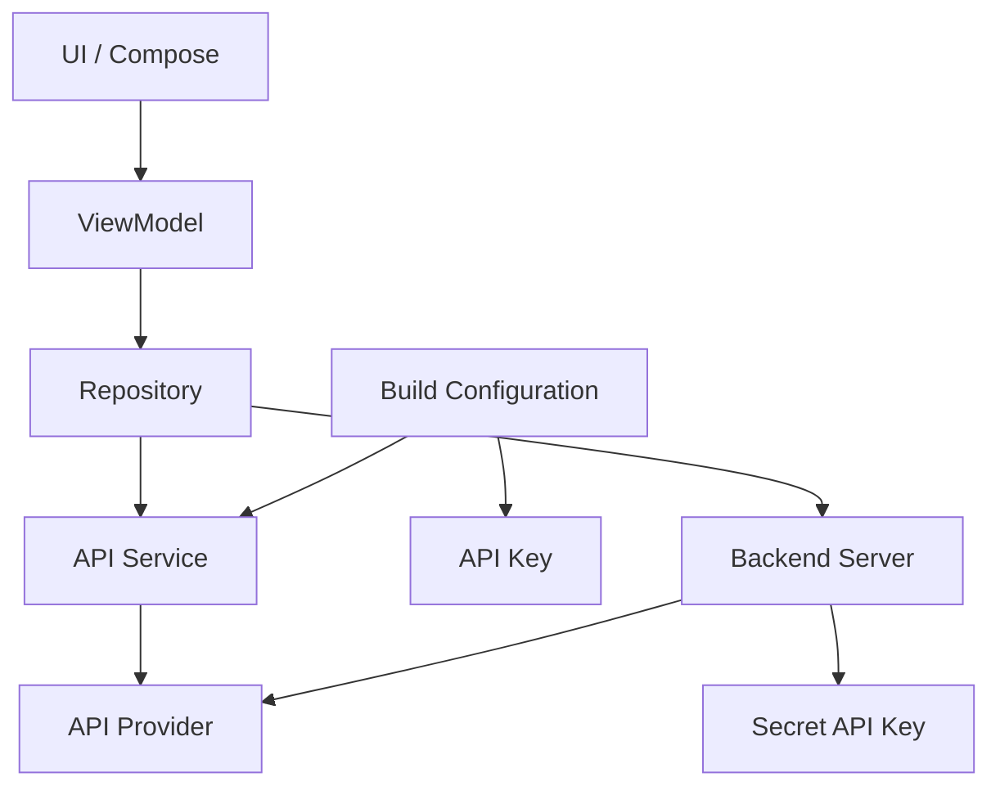

Trong đó:

```text
UI
 ↓
ViewModel
 ↓
Repository
 ↓
Network Client
 ↓
API
```

API credential thường được xử lý tại:

```text
Build Configuration
        ↓
Network Configuration
        ↓
HTTP Client
```

chứ không phải:

```text
Composable
Activity
Fragment
```

---

# 6. Quy tắc quan trọng nhất: APK không phải Secret Vault

Giả sử developer viết:

```kotlin
object ApiConfig {

    const val API_KEY =
        "my-super-secret-production-key"
}
```

Sau khi build:

```text
source code
   ↓
compile
   ↓
APK
   ↓
user device
```

Developer có thể nghĩ:

```text
Source code không public
        ↓
API key an toàn
```

Nhưng thực tế:

```text
APK
 ↓
Download
 ↓
Decompile / Static Analysis
 ↓
Search strings/resources
 ↓
API key có thể bị tìm thấy
```

Do đó:

> **Nếu một credential phải tuyệt đối bí mật để hệ thống an toàn, credential đó không được nằm trong Android APK.**

---

# 7. Hard-code API key — lỗi phổ biến

## Không nên

```kotlin
object Constants {

    const val OPENAI_API_KEY =
        "sk-production-xxxxxxxx"
}
```

Hoặc:

```kotlin
val apiKey = "abcdef123456"
```

Hoặc:

```xml
<string name="api_key">
    sk-production-xxxxxxxx
</string>
```

Đưa key sang `strings.xml` không biến nó thành secret.

APK vẫn chứa resource đó.

---

# 8. Sai lầm: nghĩ rằng BuildConfig làm secret an toàn

Ví dụ:

```kotlin
val apiKey = BuildConfig.API_KEY
```

Cách này rất hữu ích để:

* tránh hard-code,
* không commit credential,
* hỗ trợ nhiều environment,

nhưng:

> `BuildConfig` **không biến credential thành secret**.

Sau build:

```text
local.properties
       ↓
Gradle
       ↓
BuildConfig
       ↓
APK
```

Credential vẫn có thể xuất hiện trong APK.

---

# 9. Khi nào BuildConfig vẫn hữu ích?

BuildConfig phù hợp cho các giá trị cấu hình client-side như:

* Google Maps client API key,
* analytics project identifier,
* API endpoint,
* feature configuration,
* public client identifier,
* key được provider thiết kế cho mobile client.

Ví dụ:

```kotlin
val apiKey = BuildConfig.MAPS_API_KEY
```

Mục đích chính là:

```text
Configuration Management
```

không phải:

```text
Secret Storage
```

---

# 10. Quản lý key bằng `local.properties`

Một cách phổ biến trong local development:

```properties
MAPS_API_KEY=AIzaSyxxxxxxxxxxxx
```

File:

```text
local.properties
```

thường không được commit lên Git.

Cấu trúc:

```text
local.properties
       ↓
build.gradle.kts
       ↓
BuildConfig
       ↓
Android code
```

---

# 11. Đọc API key từ Gradle

Ví dụ với Kotlin DSL:

```kotlin
import java.util.Properties

val localProperties = Properties()

val localPropertiesFile = rootProject.file("local.properties")

if (localPropertiesFile.exists()) {
    localPropertiesFile.inputStream().use {
        localProperties.load(it)
    }
}

val mapsApiKey =
    localProperties.getProperty("MAPS_API_KEY") ?: ""
```

Sau đó:

```kotlin
android {

    defaultConfig {

        buildConfigField(
            "String",
            "MAPS_API_KEY",
            "\"$mapsApiKey\""
        )
    }
}
```

Trong Kotlin:

```kotlin
val apiKey = BuildConfig.MAPS_API_KEY
```

---

# 12. Không commit API key lên Git

Ví dụ:

```text
.gitignore
```

có thể chứa:

```gitignore
local.properties
.env
*.jks
keystore.properties
```

Trước khi commit:

```bash
git status
```

Kiểm tra:

```text
API key
password
private key
service account
keystore password
```

không bị đưa vào repository.

---

# 13. Nhưng `.gitignore` không giải quyết mọi thứ

Một lỗi thường gặp:

```text
Developer commit API key
        ↓
Phát hiện lỗi
        ↓
Thêm file vào .gitignore
        ↓
Xóa dòng chứa key
```

Developer tưởng đã an toàn.

Nhưng key có thể vẫn tồn tại trong:

```text
Git history
```

Do đó nếu secret từng được commit:


Không nên chỉ sửa commit hiện tại.

---

# 14. Client-side API key và Server-side secret

Đây là quyết định kiến trúc quan trọng nhất của bài.

## Trường hợp A — Client API Key

Ví dụ API provider hỗ trợ:

```text
Android application restriction
```

Flow:

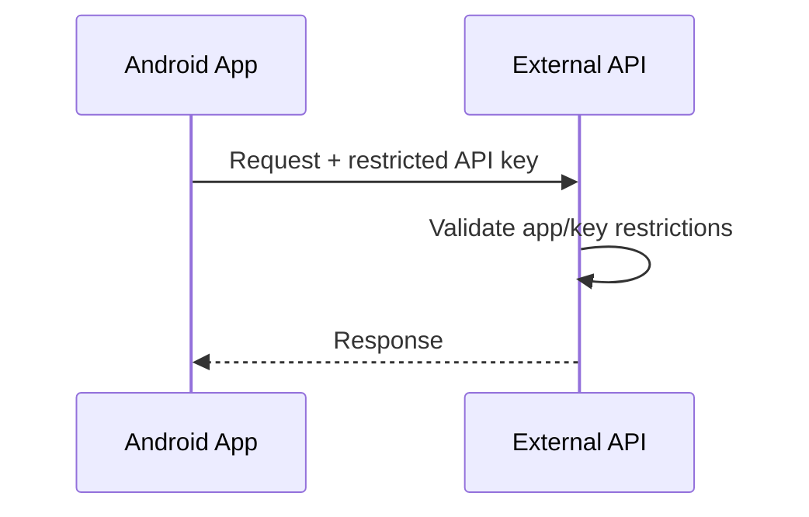

API key có thể nằm trong app vì provider đã thiết kế cho mô hình client-side.

---

## Trường hợp B — Secret API Key

Ví dụ một dịch vụ yêu cầu:

```text
secret key
```

để:

* thanh toán,
* quản trị,
* AI API server-side,
* database admin,
* privileged operation.

Không nên:

```text
Android
   ↓ secret
Third-party API
```

Nên:

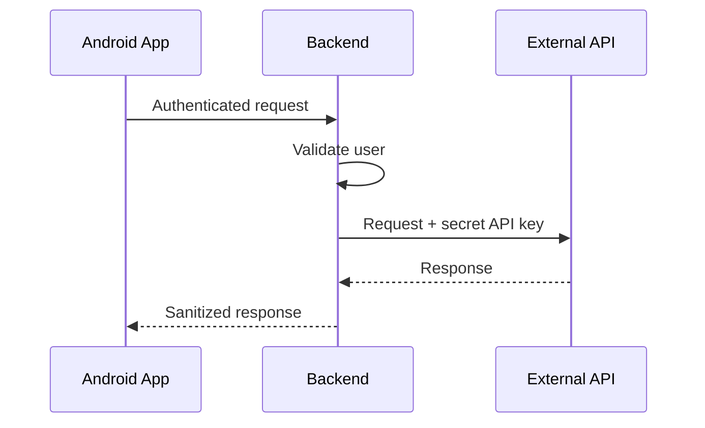

Secret chỉ tồn tại tại:

```text
Backend Environment / Secret Manager
```

---

# 15. Kiến trúc an toàn hơn

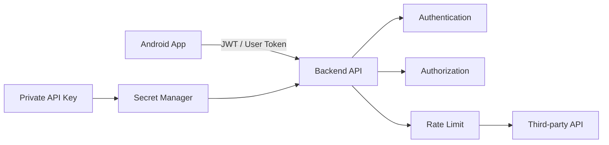

Android client không cần biết:

```text
Private API Key
```

---

# 16. Ví dụ sai với một AI API

## ❌ Sai

```kotlin
interface AiApi {

    @POST("chat")
    suspend fun chat(
        @Header("Authorization")
        authorization: String = "Bearer sk-secret-key"
    ): AiResponse
}
```

Nếu app được phát hành:

```text
APK
 ↓
Reverse engineering
 ↓
sk-secret-key
 ↓
Attacker
 ↓
API abuse
 ↓
Bill tăng
```

---

# 17. Cách đúng

Android:

```kotlin
interface BackendApi {

    @POST("ai/chat")
    suspend fun chat(
        @Body request: ChatRequest
    ): ChatResponse
}
```

Backend mới thực hiện:

```text
Backend
 ↓
read SECRET_API_KEY
 ↓
call external AI API
```

Android không biết secret.

---

# 18. API Key Restriction

Nếu API provider hỗ trợ restriction, hãy tận dụng.

Thay vì:

```text
API Key
  ↓
Can call everything
```

hãy cấu hình:

```text
API Key
 ├── Android app restriction
 ├── Package restriction
 ├── Signing certificate restriction
 ├── Allowed API restriction
 ├── Quota
 └── Monitoring
```

Nguyên tắc:

> **Least Privilege — chỉ cấp đúng quyền cần thiết.**

---

# 19. Ví dụ Android restriction

Một API key có thể được giới hạn theo:

```text
Package name:
com.example.myapp
```

và certificate fingerprint:

```text
SHA-1
AB:CD:EF:...
```

Khi đó attacker copy key sang app khác sẽ khó sử dụng hơn nếu provider thực thi restriction đúng cách.

---

# 20. API Restriction

Giả sử project bật:

```text
Maps SDK
Places API
Geocoding API
Directions API
```

Nhưng app chỉ dùng:

```text
Maps SDK
```

Không nên để key gọi toàn bộ API.

Nên:

```text
KEY_ANDROID_MAP
      ↓
Allowed API
      ↓
Maps SDK only
```

---

# 21. Một key không nên dùng cho mọi thứ

Không nên:

```text
PRODUCTION_KEY
 ├── Android
 ├── Backend
 ├── Development
 ├── Staging
 ├── Production
 ├── Maps
 ├── AI
 └── Admin
```

Đây là blast radius rất lớn.

Nếu key bị lộ:

```text
Một credential
      ↓
Toàn bộ hệ thống ảnh hưởng
```

---

# 22. Tách API Key theo môi trường

Nên có:

```text
Development
     ↓
DEV_API_KEY

Staging
     ↓
STAGING_API_KEY

Production
     ↓
PRODUCTION_API_KEY
```

Sơ đồ:

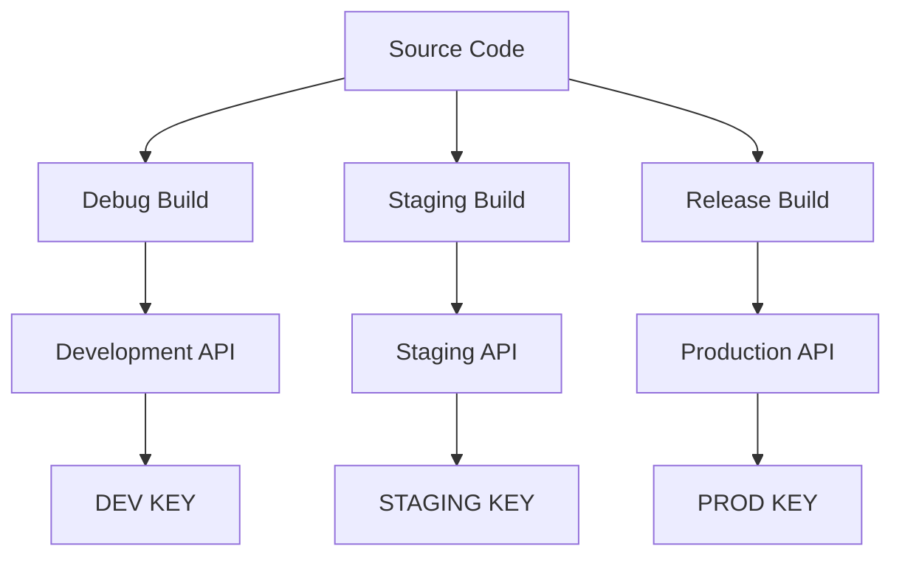

---

# 23. Android Build Types

Ví dụ:

```kotlin
android {

    buildTypes {

        debug {

            buildConfigField(
                "String",
                "BASE_URL",
                "\"https://dev-api.example.com\""
            )
        }

        release {

            buildConfigField(
                "String",
                "BASE_URL",
                "\"https://api.example.com\""
            )
        }
    }
}
```

Code:

```kotlin
Retrofit.Builder()
    .baseUrl(BuildConfig.BASE_URL)
    .build()
```

---

# 24. Product Flavors

Một project lớn có thể sử dụng:

```text
flavor
```

Ví dụ:

```kotlin
android {

    flavorDimensions += "environment"

    productFlavors {

        create("dev") {
            dimension = "environment"
        }

        create("staging") {
            dimension = "environment"
        }

        create("prod") {
            dimension = "environment"
        }
    }
}
```

Ta có thể sinh:

```text
devDebug
devRelease

stagingDebug
stagingRelease

prodDebug
prodRelease
```

---

# 25. Cấu hình API Key cho Manifest

Một số SDK yêu cầu key trong:

```xml
AndroidManifest.xml
```

Ví dụ:

```xml
<meta-data
    android:name="com.example.API_KEY"
    android:value="${API_KEY}" />
```

Gradle:

```kotlin
defaultConfig {

    manifestPlaceholders["API_KEY"] =
        mapsApiKey
}
```

Điểm cần nhớ:

> Manifest placeholder giúp quản lý configuration tốt hơn nhưng vẫn không làm API key trở thành secret sau khi build APK.

---

# 26. Network Interceptor

Nếu API key được thiết kế để client gửi qua header, có thể cấu hình tập trung bằng OkHttp interceptor.

```kotlin
class ApiKeyInterceptor(
    private val apiKey: String
) : Interceptor {

    override fun intercept(
        chain: Interceptor.Chain
    ): Response {

        val request = chain
            .request()
            .newBuilder()
            .header(
                "X-API-Key",
                apiKey
            )
            .build()

        return chain.proceed(request)
    }
}
```

Cấu hình:

```kotlin
val client =
    OkHttpClient.Builder()
        .addInterceptor(
            ApiKeyInterceptor(
                BuildConfig.API_KEY
            )
        )
        .build()
```

Ưu điểm:

```text
API Key logic
      ↓
1 nơi duy nhất
```

thay vì lặp lại:

```text
Repository A
Repository B
Repository C
Repository D
```

---

# 27. Không log API Key

Một lỗi nguy hiểm:

```kotlin
Log.d(
    "ApiDebug",
    "API key = ${BuildConfig.API_KEY}"
)
```

Hoặc:

```text
Request URL:
https://api.example.com/data?key=SECRET_KEY
```

Nếu HTTP logging interceptor ghi toàn bộ request:

```text
Logcat
Crash report
Debug log
Analytics
CI log
```

có thể chứa credential.

---

# 28. Sanitized Logging

Thay vì:

```text
Authorization:
Bearer eyJhbGciOi...
```

nên log:

```text
Authorization:
Bearer ***
```

Hoặc không log header đó.

Ví dụ:

```text
X-API-Key: [REDACTED]
Authorization: [REDACTED]
Cookie: [REDACTED]
```

---

# 29. Đừng nhầm Android Keystore với giải pháp cho embedded API secret

Android Keystore rất hữu ích cho:

* encryption key,
* device-generated private key,
* authentication credential được sinh/lưu trên thiết bị.

Nhưng nếu developer viết:

```text
Secret API Key
     ↓
APK
     ↓
App startup
     ↓
Copy into Keystore
```

thì không giải quyết được vấn đề gốc.

Bởi vì:

```text
Secret ban đầu vẫn phải được ship tới client.
```

---

# 30. Obfuscation không biến key thành secret

R8/ProGuard có thể làm reverse engineering khó hơn:

```text
Class names
Method names
Code structure
```

nhưng không nên coi đây là secret protection.

Sai tư duy:

```text
R8 enabled
   ↓
API Key secure
```

Đúng hơn:

```text
R8
 ↓
Raises reverse-engineering cost
```

Không phải:

```text
Cryptographic secret protection
```

---

# 31. Native C++/NDK cũng không phải Secret Vault

Một số developer chuyển API key sang:

```text
C/C++
 ↓
JNI
```

với hy vọng:

```text
Kotlin khó thấy key
```

Nhưng attacker vẫn có thể:

* inspect binary,
* analyze native library,
* hook runtime,
* inspect memory.

Do đó:

> Native code có thể làm extraction khó hơn nhưng không biến một client-side secret thành server-side secret.

---

# 32. Key Rotation

API key không nên được coi là tồn tại mãi mãi.

Một rotation flow:

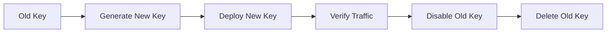

Không nên:

```text
Delete old key ngay lập tức
```

nếu production vẫn đang dùng nó.

---

# 33. Rotation an toàn

Một quy trình tốt:

```text
1. Generate KEY_B

2. Cho KEY_A và KEY_B cùng tồn tại

3. Deploy version sử dụng KEY_B

4. Theo dõi traffic

5. Xác nhận KEY_A không còn request hợp lệ

6. Disable KEY_A

7. Monitor error

8. Delete KEY_A
```

---

# 34. Revocation

Nếu key bị lộ:

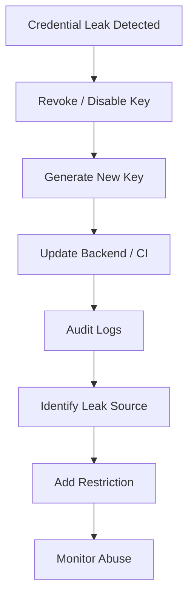

Nguyên tắc:

> Nếu secret đã bị public, hãy coi nó là **compromised**, không phải "có lẽ vẫn dùng được".

---

# 35. Monitoring

API Key Management không kết thúc sau khi tạo key.

Cần theo dõi:

```text
API requests
      ↓
 ┌────┼────┐
 ↓    ↓    ↓
Rate Error Cost
 ↓
Anomaly Detection
```

Ví dụ cảnh báo:

```text
Request/day bình thường:
5,000

Đột nhiên:
500,000
```

Đó có thể là:

* bug,
* infinite retry,
* bot,
* leaked key,
* API abuse.

---

# 36. Quota và Rate Limit

Nếu provider hỗ trợ:

```text
Quota
Rate Limit
Budget Alert
```

hãy cấu hình.

Ví dụ:

```text
max 100 requests / minute
```

hoặc:

```text
daily quota = 50,000
```

Sơ đồ:

```text
Unlimited key
     ↓
Leak
     ↓
Huge traffic
     ↓
Huge bill
```

so với:

```text
Restricted key
     ↓
Leak
     ↓
Quota reached
     ↓
Damage limited
```

---

# 37. API Key và UX

API key có vẻ là backend/config topic, nhưng vẫn ảnh hưởng trực tiếp đến UX.

Ví dụ key hết quota:

```text
User opens Map
     ↓
Maps API request
     ↓
Quota exceeded
     ↓
Map unavailable
```

Nếu app không xử lý:

```text
Blank screen
```

UX tốt hơn:

```text
Không thể tải bản đồ lúc này.
Vui lòng thử lại sau.
```

---

# 38. API Key và Reliability

Các lỗi liên quan credential:

```text
401 Unauthorized
403 Forbidden
429 Too Many Requests
```

không nên được xử lý giống nhau.

Ví dụ:

```kotlin
when (response.code) {

    401 -> {
        // authentication issue
    }

    403 -> {
        // permission / API key restriction
    }

    429 -> {
        // quota / rate limit
    }
}
```

---

# 39. Không retry vô hạn với lỗi credential

Sai:

```text
403
 ↓
Retry
 ↓
403
 ↓
Retry
 ↓
403
 ↓
Retry...
```

Điều này:

* tốn pin,
* tốn data,
* tăng traffic,
* tăng chi phí,
* không giải quyết được lỗi.

Một flow hợp lý:

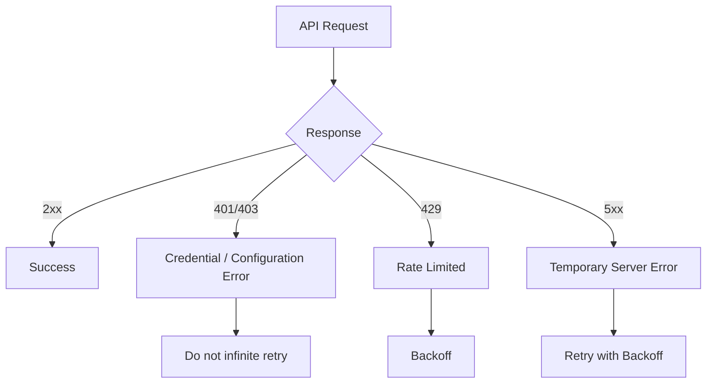

---

# 40. API Key và Lifecycle

API key thường không phải UI state nên:

```text
rotation
configuration change
process recreation
```

không yêu cầu "save API key state" trong:

```text
SavedStateHandle
Bundle
ViewModel
```

API configuration nên được inject từ:

```text
Build Configuration
        ↓
Dependency Injection
        ↓
Network Layer
```

---

# 41. Dependency Injection

Ví dụ:

```kotlin
class ApiKeyInterceptor(
    private val apiKey: String
)
```

Dùng Hilt:

```kotlin
@Module
@InstallIn(SingletonComponent::class)
object NetworkModule {

    @Provides
    @Singleton
    fun provideApiKeyInterceptor():
        ApiKeyInterceptor {

        return ApiKeyInterceptor(
            apiKey = BuildConfig.API_KEY
        )
    }
}
```

Lợi ích:

* dễ test,
* dễ đổi environment,
* tránh gọi trực tiếp `BuildConfig` khắp project,
* giảm coupling.

---

# 42. Test dễ hơn khi không hard-code

Ví dụ production:

```text
REAL_API_KEY
```

Test:

```text
FAKE_API_KEY
```

Code:

```kotlin
val interceptor =
    ApiKeyInterceptor(
        apiKey = "test-api-key"
    )
```

Sau đó kiểm tra header.

---

# 43. Unit Test cho Interceptor

Ví dụ kỳ vọng:

```text
Given:
API_KEY = test-key

When:
Request được gửi

Then:
Header X-API-Key = test-key
```

Pseudo test:

```kotlin
@Test
fun `interceptor adds api key header`() {

    val interceptor =
        ApiKeyInterceptor(
            "test-key"
        )

    // Build request
    // Run interceptor
    // Verify X-API-Key
}
```

---

# 44. Những gì không nên test

Không viết test:

```kotlin
assertEquals(
    "REAL_PRODUCTION_KEY",
    BuildConfig.API_KEY
)
```

vì:

* secret/key bị đưa vào test source,
* dễ xuất hiện trong CI log,
* coupling với production credential.

Nên kiểm tra:

```text
API_KEY is configured
```

thay vì:

```text
API_KEY == real secret
```

---

# 45. CI/CD Secret Management

Local machine:

```text
local.properties
```

CI/CD:

```text
GitHub Actions Secret
GitLab CI Variable
Bitbucket Repository Variable
Secret Manager
Environment Variable
```

Pipeline:

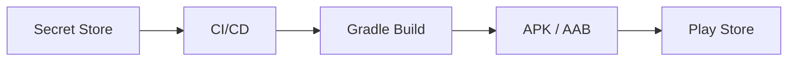

Không nên:

```text
Secret
 ↓
Git repository
 ↓
CI
```

---

# 46. Environment Variables

Một build script có thể ưu tiên:

```text
Environment Variable
        ↓
local.properties
        ↓
fallback
```

Ví dụ concept:

```kotlin
val apiKey =
    System.getenv("API_KEY")
        ?: localProperties.getProperty("API_KEY")
        ?: ""
```

Điều này hỗ trợ cả:

```text
Developer Machine
```

và:

```text
CI/CD
```

---

# 47. Fail Fast khi cấu hình thiếu

Không nên để production build chạy với:

```text
API_KEY=""
```

rồi đến runtime mới phát hiện.

Có thể kiểm tra:

```kotlin
require(apiKey.isNotBlank()) {
    "API_KEY is missing"
}
```

Mục tiêu:

```text
Build fails early
```

thay vì:

```text
Production fails later
```

---

# 48. Không expose credential trong error message

Sai:

```text
API request failed.

Key:
AIzaSy123456789...
```

Đúng:

```text
API authentication failed.
```

Internal log cũng nên:

```text
credential=[REDACTED]
```

---

# 49. Ví dụ cấu trúc project

```text
app/
├── data/
│   ├── remote/
│   │   ├── ApiService.kt
│   │   ├── ApiKeyInterceptor.kt
│   │   └── NetworkModule.kt
│   │
│   └── repository/
│       └── WeatherRepository.kt
│
├── presentation/
│   └── weather/
│       ├── WeatherScreen.kt
│       └── WeatherViewModel.kt
│
├── build.gradle.kts
└── src/
    ├── debug/
    └── release/

local.properties
.gitignore
```

---

# 50. Ví dụ mini project

Xây dựng app:

> **Weather Client**

App gọi API để lấy thời tiết.

Flow:

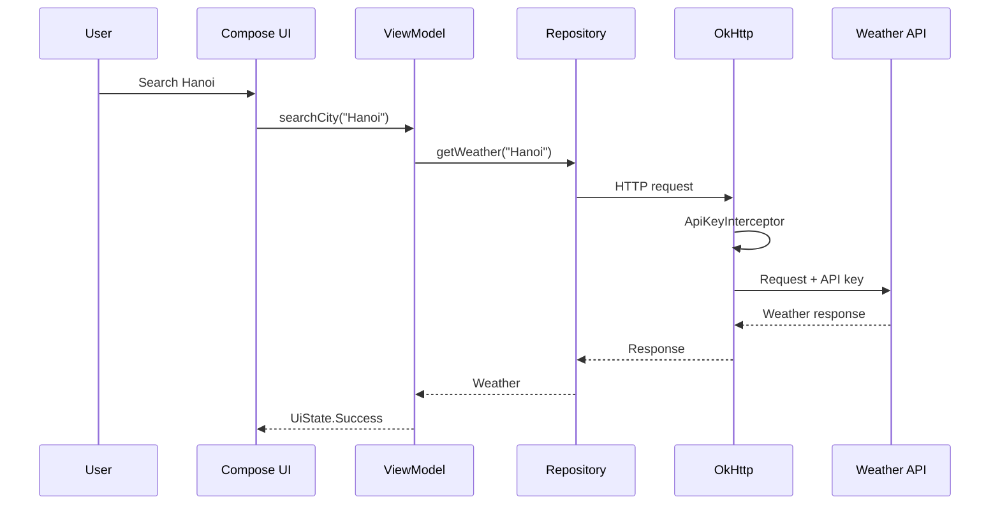

---

# 51. API Service

```kotlin
interface WeatherApi {

    @GET("weather")
    suspend fun getWeather(
        @Query("city")
        city: String
    ): WeatherResponse
}
```

Key không xuất hiện trong repository hoặc UI.

---

# 52. Interceptor

```kotlin
class ApiKeyInterceptor(
    private val apiKey: String
) : Interceptor {

    override fun intercept(
        chain: Interceptor.Chain
    ): Response {

        val newRequest =
            chain.request()
                .newBuilder()
                .addHeader(
                    "X-API-Key",
                    apiKey
                )
                .build()

        return chain.proceed(
            newRequest
        )
    }
}
```

---

# 53. Network Module

```kotlin
@Module
@InstallIn(SingletonComponent::class)
object NetworkModule {

    @Provides
    @Singleton
    fun provideOkHttp():
        OkHttpClient {

        return OkHttpClient
            .Builder()
            .addInterceptor(
                ApiKeyInterceptor(
                    BuildConfig.API_KEY
                )
            )
            .build()
    }
}
```

---

# 54. Repository

```kotlin
class WeatherRepository(
    private val api: WeatherApi
) {

    suspend fun getWeather(
        city: String
    ): WeatherResponse {

        return api.getWeather(city)
    }
}
```

Repository không cần biết API key nằm ở đâu.

---

# 55. UI State

```kotlin
sealed interface WeatherUiState {

    data object Idle :
        WeatherUiState

    data object Loading :
        WeatherUiState

    data class Success(
        val temperature: Double
    ) : WeatherUiState

    data class Error(
        val message: String
    ) : WeatherUiState
}
```

Credential error được chuyển thành UX thích hợp thay vì hiển thị raw HTTP error.

---

# 56. Error Mapping

Ví dụ:

```kotlin
fun mapHttpError(
    code: Int
): String {

    return when (code) {

        401,
        403 ->
            "Dịch vụ hiện chưa khả dụng."

        429 ->
            "Hệ thống đang quá tải. Vui lòng thử lại sau."

        else ->
            "Đã xảy ra lỗi khi kết nối dịch vụ."
    }
}
```

Không nên hiển thị:

```text
Invalid API_KEY xyz...
```

cho người dùng.

---

# 57. Sai lầm phổ biến của Junior Android Developer

## Sai lầm 1 — Hard-code production key

```kotlin
const val API_KEY =
    "prod-xxxxxxxx"
```

### Vấn đề

* dễ commit,
* dễ leak,
* khó rotate,
* khó đổi environment.

---

## Sai lầm 2 — Nghĩ `.env` làm key bí mật trong APK

`.env` giúp quản lý cấu hình trước build.

Nhưng:

```text
.env
 ↓
Build
 ↓
APK
```

Nếu giá trị cuối cùng được nhúng vào APK thì nó vẫn có thể bị lấy ra.

---

## Sai lầm 3 — Một key dùng cho mọi môi trường

```text
Dev
Staging
Production
     ↓
Same Key
```

Nếu dev machine làm lộ key:

```text
Production cũng bị ảnh hưởng
```

---

## Sai lầm 4 — Không restriction key

```text
Key
 ↓
All APIs
 ↓
Unlimited usage
```

Blast radius rất lớn.

---

## Sai lầm 5 — Log credential

```text
Authorization:
Bearer real-secret
```

Credential có thể lọt vào:

* Logcat,
* Firebase Crashlytics breadcrumbs,
* observability system,
* CI logs.

---

## Sai lầm 6 — Ship server secret trong APK

Đây là lỗi kiến trúc nghiêm trọng.

```text
Private Secret
      ↓
Android APK
```

phải được thay bằng:

```text
Android
 ↓
Backend
 ↓
Private Secret
 ↓
Third-party API
```

---

## Sai lầm 7 — Không có rotation plan

Khi key leak mới bắt đầu suy nghĩ:

```text
"Giờ đổi key như thế nào?"
```

Production system nên có quy trình rotate credential từ trước.

---

# 58. Security Decision Tree

Khi nhận một API key mới, hãy hỏi:

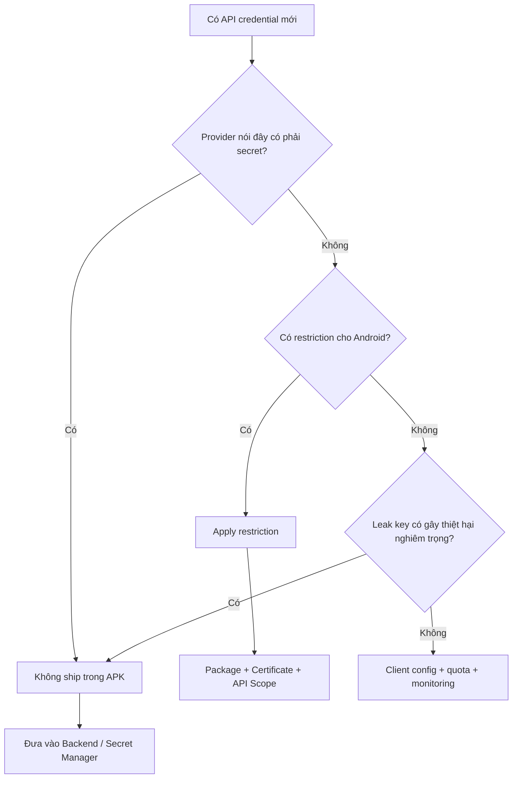

---

# 59. Mô hình tư duy quan trọng

Đừng hỏi:

> "Làm thế nào giấu API key thật kỹ trong Android?"

Hãy hỏi:

> "Credential này có được phép tồn tại trên client không?"

Nếu câu trả lời là:

```text
Không
```

thì giải pháp đúng thường là:

```text
đổi kiến trúc
```

chứ không phải:

```text
obfuscate mạnh hơn
```

---

# 60. Thực hành

## Task 1 — Viết ghi chú 5 dòng

Viết bằng ngôn ngữ của bạn:

1. API key dùng để xác định ứng dụng/project gọi API.
2. Không nên mặc định API key là secret hoặc public mà cần xem security model của provider.
3. Secret thực sự không nên được nhúng trong Android APK.
4. Client-side key cần restriction, quota và monitoring.
5. Key cần được phân tách theo môi trường và có kế hoạch rotation/revocation.

---

## Task 2 — Tách key khỏi source code

Từ:

```kotlin
const val API_KEY =
    "my-key"
```

chuyển thành:

```text
local.properties
      ↓
Gradle
      ↓
BuildConfig
      ↓
Network module
```

---

## Task 3 — Viết Interceptor

Tạo:

```text
ApiKeyInterceptor.kt
```

để tự động thêm:

```http
X-API-Key
```

vào request.

---

## Task 4 — Kiểm tra Git

Đảm bảo:

```text
local.properties
.env
keystore.properties
```

không bị commit.

---

## Task 5 — Phân tích key

Chọn một API bạn từng dùng và trả lời:

```text
Key này là client key hay server secret?

Nếu bị leak thì hậu quả là gì?

Provider hỗ trợ restriction nào?

Có quota không?

Có cần backend proxy không?

Có rotation plan không?
```

---

# 61. Bài tập

Giả sử bạn đang xây dựng ứng dụng Android:

> **Travel Assistant**

App sử dụng:

```text
Google Maps
Weather API
AI Recommendation API
Firebase
```

Hãy thiết kế cách quản lý credential.

Một phương án:

```text
Google Maps Key
 ├── Client-side
 ├── Android restriction
 └── Maps API restriction

Weather Key
 ├── Kiểm tra provider
 └── Client hoặc Backend tùy security model

AI Secret
 ├── Backend only
 └── Không nằm trong APK

Firebase Configuration
 ├── Client configuration
 └── Security thực sự dựa vào authentication + rules
```

Sau đó vẽ:

```text
Android
   ↓
Backend
   ↓
AI Provider
```

và giải thích tại sao AI secret không nằm trong app.

---

# 62. Portfolio Artifact

Có thể tạo mini project:

```text
android-api-key-management-demo/
```

Cấu trúc:

```text
android-api-key-management-demo/
├── app/
│   └── src/
│
├── README.md
├── .gitignore
├── local.properties.example
└── docs/
    ├── architecture.md
    └── security-checklist.md
```

---

# 63. `local.properties.example`

Không chứa credential thật.

Ví dụ:

```properties
MAPS_API_KEY=YOUR_API_KEY_HERE
WEATHER_API_KEY=YOUR_API_KEY_HERE
```

Developer clone project:

```text
local.properties.example
        ↓
copy
        ↓
local.properties
        ↓
add real development keys
```

---

# 64. README cho Portfolio

README nên giải thích:

```markdown
## API Key Management

This project demonstrates:

- API key injection using Gradle
- environment separation
- OkHttp interceptor
- key restriction strategy
- sanitized logging
- secret-vs-client-key architecture
- CI/CD configuration strategy
```

Điểm quan trọng:

> Không đưa API key thật vào repository chỉ để demo portfolio.

---

# 65. Artifact có thể đưa vào Portfolio

Một artifact tốt gồm:

* [ ] `ApiKeyInterceptor.kt`
* [ ] `NetworkModule.kt`
* [ ] `local.properties.example`
* [ ] `.gitignore`
* [ ] sơ đồ client/backend
* [ ] API key decision tree
* [ ] unit test interceptor
* [ ] error handling cho `401/403/429`
* [ ] README về secret management
* [ ] release security checklist

---

# 66. Testing Checklist

## Unit Test

* [ ] Interceptor thêm đúng API key.
* [ ] Không thêm duplicate header.
* [ ] Empty configuration được phát hiện.
* [ ] HTTP error được map đúng.
* [ ] `429` áp dụng backoff phù hợp.

## Integration Test

* [ ] Development key gọi development API.
* [ ] Staging key gọi staging API.
* [ ] Production configuration không trỏ nhầm staging.
* [ ] Invalid key trả về lỗi được xử lý.

## Security Test

* [ ] Không có private backend secret trong source.
* [ ] Không log credential.
* [ ] Không commit credential.
* [ ] API key restriction đã bật.
* [ ] Quota đã cấu hình.
* [ ] Có rotation/revocation procedure.

---

# 67. Debugging Checklist

Khi API trả:

```text
401
403
```

hãy kiểm tra theo thứ tự:

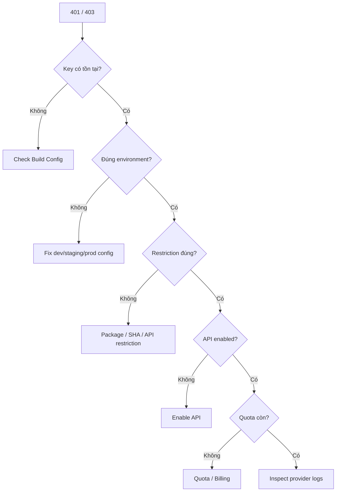

---

# 68. Release Checklist

Trước khi phát hành production:

* [ ] Không có production secret hard-code trong source.
* [ ] Không có credential trong Git history mới.
* [ ] Không có credential trong debug log.
* [ ] Production build dùng đúng endpoint.
* [ ] Production build dùng đúng client key.
* [ ] Development và Production dùng credential khác nhau.
* [ ] Android API key đã được restriction.
* [ ] API restriction chỉ cho phép API cần thiết.
* [ ] Quota/rate limit được thiết lập nếu có thể.
* [ ] Monitoring được bật.
* [ ] Budget alert được cấu hình nếu API có tính phí.
* [ ] CI/CD lấy credential từ secret/environment store.
* [ ] Không để secret trong workflow YAML.
* [ ] Có quy trình rotate key.
* [ ] Có quy trình revoke key nếu bị leak.
* [ ] Error `401/403/429` có UX phù hợp.
* [ ] Retry policy không gây infinite request.

---

# 69. Production Risk

## Security Risk

```text
Leaked Key
 ↓
Unauthorized Requests
 ↓
Data / Resource Abuse
```

---

## Financial Risk

```text
Leaked Paid API Key
 ↓
Automated Abuse
 ↓
Huge API Usage
 ↓
Unexpected Bill
```

---

## Reliability Risk

```text
Wrong Production Key
 ↓
403
 ↓
Feature unavailable
 ↓
Users affected
```

---

## Release Risk

```text
Debug config
 ↓
accidentally included
 ↓
Production build
 ↓
Production users call staging
```

---

## Maintainability Risk

```text
API Key scattered across code
 ↓
Need rotation
 ↓
Update many files
 ↓
High chance of mistakes
```

Thay vào đó:

```text
Central configuration
 ↓
One network layer
 ↓
Easy rotation
```

---

# 70. Sơ đồ tổng hợp

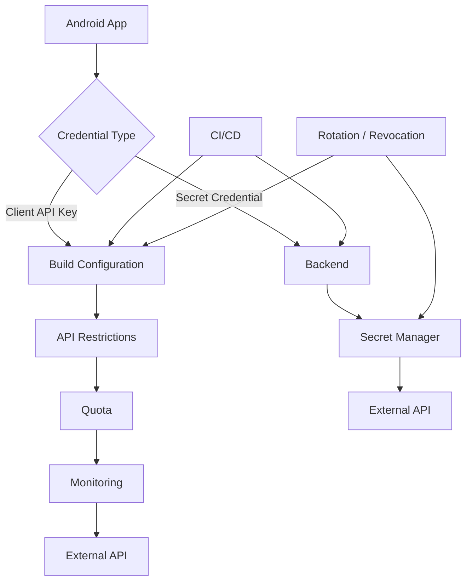

---

# 71. Mental Model

Hãy nhớ 5 lớp:

```text
API KEY MANAGEMENT
        │
        ├── 1. CLASSIFY
        │      Public/client hay secret?
        │
        ├── 2. STORE
        │      Config hay Secret Manager?
        │
        ├── 3. RESTRICT
        │      App / API / quota
        │
        ├── 4. MONITOR
        │      Usage / error / cost
        │
        └── 5. ROTATE
               Replace / revoke
```

Hay ngắn hơn:

> **Classify → Store → Restrict → Monitor → Rotate**

---

# 72. Câu hỏi tự kiểm tra

### Câu 1

Tại sao đưa API key vào `BuildConfig` không đồng nghĩa với bảo mật?

**Đáp án:** Vì giá trị cuối cùng vẫn có thể được nhúng vào APK và bị trích xuất.

---

### Câu 2

Nếu một secret bắt buộc phải bí mật, nên đặt ở đâu?

**Đáp án:** Backend hoặc secret-management infrastructure, không phải Android client.

---

### Câu 3

`.gitignore` giải quyết vấn đề gì?

**Đáp án:** Giúp tránh commit file local chứa credential vào Git, nhưng không bảo vệ secret đã được nhúng trong APK.

---

### Câu 4

Nếu API key từng được public trên GitHub thì nên làm gì?

**Đáp án:** Coi key đã bị compromise, revoke/disable và tạo key mới.

---

### Câu 5

Tại sao phải chia key theo Development và Production?

**Đáp án:** Giảm blast radius, tránh test làm ảnh hưởng production và đơn giản hóa monitoring/rotation.

---

### Câu 6

Obfuscation có bảo vệ tuyệt đối API secret không?

**Đáp án:** Không. Nó chỉ tăng độ khó reverse engineering.

---

### Câu 7

Ba HTTP status thường liên quan tới API access là gì?

```text
401 → authentication
403 → permission/restriction
429 → rate limit/quota
```

---

# 73. Checklist hoàn thành bài

* [ ] Giải thích được API Key Management.
* [ ] Phân biệt client key và server secret.
* [ ] Hiểu APK không phải secret storage.
* [ ] Không hard-code credential.
* [ ] Biết vai trò của `local.properties`.
* [ ] Biết vai trò của `BuildConfig`.
* [ ] Hiểu rằng BuildConfig không làm secret an toàn.
* [ ] Biết dùng environment variable trong CI/CD.
* [ ] Biết cấu hình API restriction.
* [ ] Biết giới hạn quota/rate limit.
* [ ] Biết phân tách dev/staging/prod.
* [ ] Biết không log credential.
* [ ] Biết xử lý `401/403/429`.
* [ ] Biết nguyên tắc rotation.
* [ ] Biết quy trình revocation.
* [ ] Có một `ApiKeyInterceptor`.
* [ ] Có unit test.
* [ ] Có security/release checklist.
* [ ] Có artifact nhỏ để đưa vào portfolio.

---

# 74. Ghi chú sản xuất

Khi đưa API integration vào production, đừng chỉ hỏi:

> "API request chạy chưa?"

Hãy hỏi:

```text
Credential này thuộc client hay server?

Nếu APK bị decompile thì có vấn đề không?

Key có restriction không?

Dev và production có đang dùng chung key không?

Có quota không?

Có budget alert không?

Có log credential không?

Nếu key leak thì mất bao lâu để revoke?

Có key rotation procedure không?

CI/CD lấy key từ đâu?

Error 401 / 403 / 429 ảnh hưởng UX thế nào?
```

Mục tiêu cuối cùng của API Key Management không phải là **giấu một chuỗi ký tự thật khéo**, mà là thiết kế hệ thống sao cho:

```text
Credential bị lộ
       ↓
Damage bị giới hạn

Credential cần đổi
       ↓
Rotation dễ dàng

Environment thay đổi
       ↓
Không sửa business logic

API gặp lỗi
       ↓
User nhận UX hợp lý
```

---

# 75. Kết luận

**API Key Management** là một phần của kiến trúc và security, không chỉ là một file cấu hình Gradle.

Một Android developer tốt cần hiểu rằng:

```text
Không phải mọi API key đều là secret.

Nhưng secret thực sự không được ship trong APK.
```

Mô hình nên ghi nhớ:

```text
Client-safe credential
        ↓
Config
        ↓
Restriction
        ↓
Quota
        ↓
Monitoring

Secret credential
        ↓
Backend
        ↓
Secret Manager
        ↓
External Service
```

Và nguyên tắc quan trọng nhất:

> **Đừng cố tìm nơi "giấu" một server secret trong Android. Nếu secret phải thực sự bí mật, hãy thiết kế để Android không bao giờ nhận được nó.**
