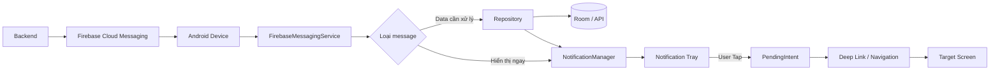
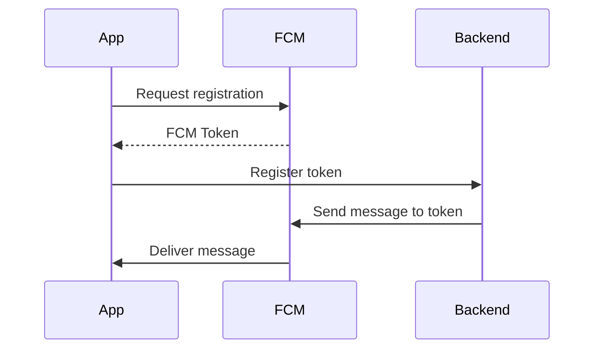
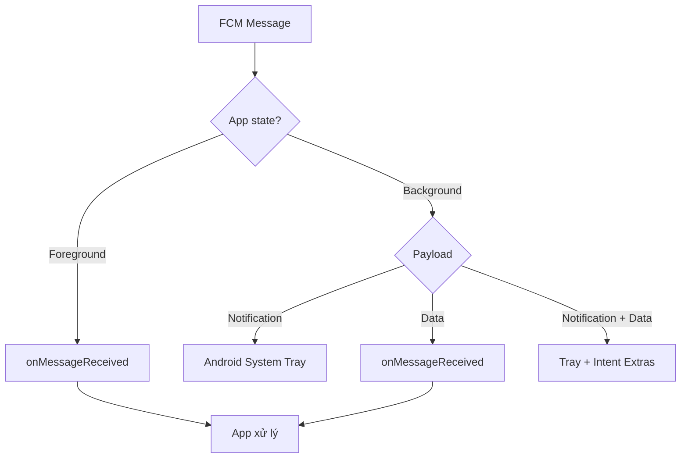
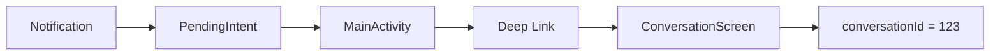
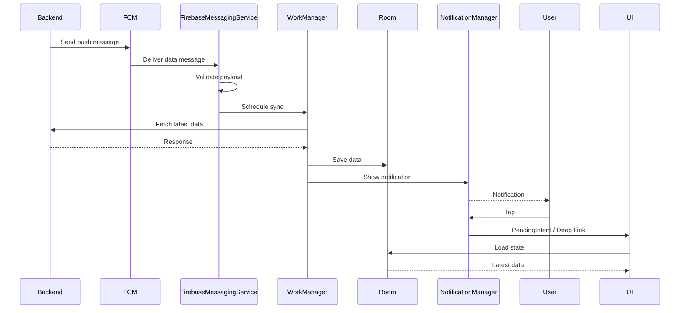
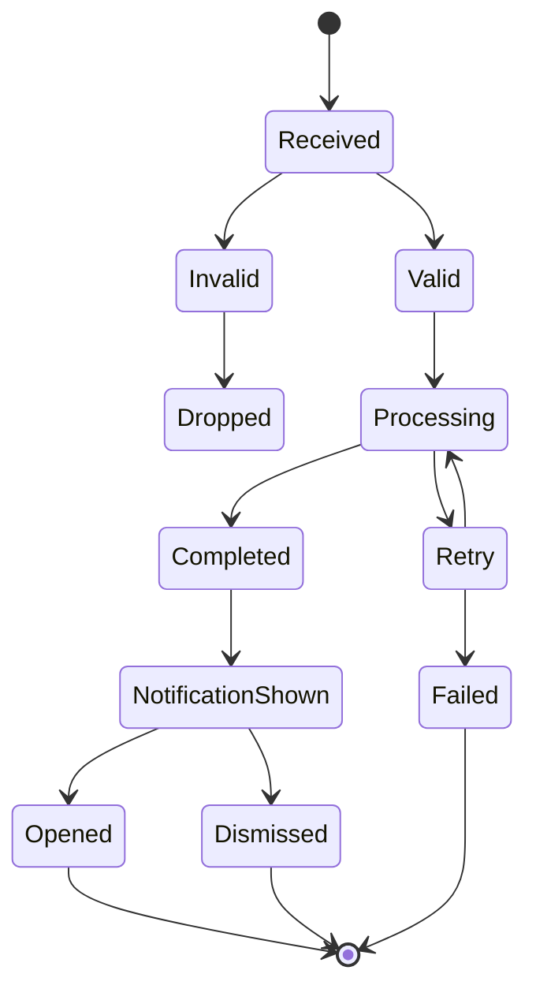
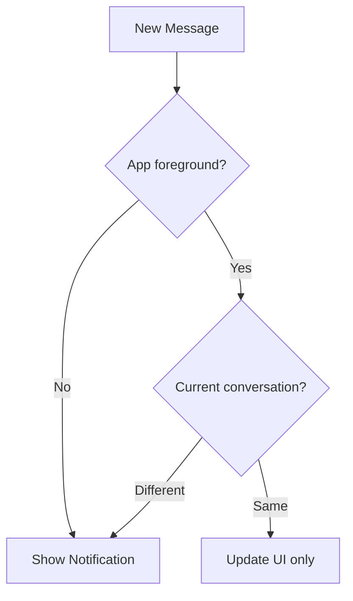
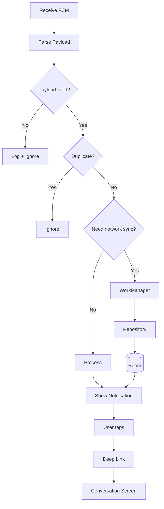

# 018 - Push Notification Flow

**Học phần:** 04 - Network, Async and Services
**Module:** Module 09 - Common Services
**Nhóm nội dung:** Service Integration
**Nguồn roadmap:** Common Services / Service Integration
**Loại bài:** `async`
**Thứ tự trong module:** 018
**Thời lượng gợi ý:** 34 phút

---

## 1. Tóm tắt

**Push Notification Flow** là toàn bộ luồng từ lúc hệ thống backend quyết định gửi một thông báo cho đến khi:

1. message được gửi tới dịch vụ push như **Firebase Cloud Messaging - FCM**,
2. FCM định tuyến message đến thiết bị,
3. Android nhận message,
4. ứng dụng quyết định hiển thị notification hay xử lý dữ liệu ngầm,
5. người dùng nhấn vào notification,
6. app điều hướng đến đúng màn hình,
7. dữ liệu cần thiết được đồng bộ lại nếu cần.

Điểm quan trọng là:

> Push notification không chỉ là `showNotification()`.

Một hệ thống production thường gồm:

```text
Backend
   ↓
Firebase Cloud Messaging
   ↓
Android Device
   ↓
FirebaseMessagingService / Android System
   ↓
Repository / WorkManager / Local Database
   ↓
NotificationManager
   ↓
Notification Tray
   ↓
User Tap
   ↓
Deep Link / Navigation
   ↓
Screen
```

Với Firebase Cloud Messaging, hành vi nhận message khác nhau tùy **loại payload** và app đang ở **foreground hay background**. Ví dụ, notification message khi app ở background thường được Android đưa thẳng vào system tray, còn data message có thể được chuyển tới `onMessageReceived()`. ([firebase.google.com][1])

---

# 2. Mục tiêu học tập

Sau bài này, bạn nên có thể:

* Giải thích được **Push Notification Flow** bằng ngôn ngữ của mình.
* Phân biệt:

  * push message,
  * notification,
  * notification channel,
  * FCM token,
  * notification payload,
  * data payload.
* Hiểu luồng:

```text
Server → FCM → Android → App → User
```

* Biết cách dùng `FirebaseMessagingService`.
* Hiểu:

  * `onMessageReceived()`,
  * `onNewToken()`.
* Phân biệt hành vi khi app:

  * foreground,
  * background,
  * bị kill.
* Biết khi nào nên:

  * xử lý ngay,
  * đưa công việc sang coroutine,
  * dùng `WorkManager`.
* Xử lý permission notification trên Android 13+.
* Điều hướng người dùng từ notification tới đúng màn hình.
* Thiết kế notification flow có khả năng:

  * retry,
  * deduplicate,
  * logging,
  * testing,
  * debugging.
* Tạo một artifact nhỏ đưa vào portfolio.

---

# 3. Push Notification nằm ở đâu trong kiến trúc Android?

Push notification nằm ở giao điểm của nhiều phần:

| Thành phần                 | Vai trò                     |
| -------------------------- | --------------------------- |
| Backend                    | Quyết định gửi notification |
| FCM                        | Chuyển message tới thiết bị |
| `FirebaseMessagingService` | Nhận và xử lý message       |
| Repository                 | Đồng bộ dữ liệu             |
| Room/DataStore             | Lưu state                   |
| WorkManager                | Xử lý background dài hơn    |
| NotificationManager        | Hiển thị notification       |
| Navigation                 | Mở đúng màn hình            |
| Analytics                  | Theo dõi delivered/opened   |
| Logging                    | Debug delivery flow         |

Một kiến trúc đơn giản:



---

# 4. Các khái niệm quan trọng

## 4.1 Push message không giống notification

Hai khái niệm này thường bị nhầm.

### Push message

Là dữ liệu được gửi qua hệ thống như FCM.

Ví dụ:

```json
{
  "type": "NEW_MESSAGE",
  "conversationId": "123"
}
```

### Notification

Là UI do Android hiển thị cho người dùng:

```text
┌─────────────────────────────────────┐
│ My Chat App                         │
│ Nguyễn Văn A                        │
│ Bạn có một tin nhắn mới             │
└─────────────────────────────────────┘
```

Một push message:

```text
có thể tạo notification
```

nhưng:

```text
không bắt buộc phải tạo notification
```

Ví dụ push chỉ dùng để báo:

```text
SYNC_DATA
```

App nhận message rồi cập nhật Room, không cần hiển thị gì cho người dùng.

---

# 5. FCM Registration Token

FCM cần biết **thiết bị/app instance nào** sẽ nhận message.

Firebase cấp cho app một registration token.

Ví dụ:

```text
fcm_token =
dHk2xxxxxxxxxxxxxxxxxxxxxxxx
```

Luồng:



Backend thường lưu:

```text
userId
deviceId
fcmToken
platform
lastUpdated
```

Ví dụ:

```json
{
  "userId": "user_42",
  "deviceId": "device_a12",
  "platform": "android",
  "fcmToken": "xxxxx"
}
```

---

# 6. `onNewToken()`

Token có thể thay đổi nên không nên coi token là một giá trị cố định mãi mãi.

Một service cơ bản:

```kotlin
class AppFirebaseMessagingService : FirebaseMessagingService() {

    override fun onNewToken(token: String) {
        super.onNewToken(token)

        Log.d("FCM", "New token: $token")

        sendTokenToServer(token)
    }

    private fun sendTokenToServer(token: String) {
        // Gửi token mới về backend
    }
}
```

Luồng nên là:

```text
Token changed
     ↓
onNewToken()
     ↓
Update backend
     ↓
Backend dùng token mới
```

Không nên thiết kế:

```text
App cài lần đầu
      ↓
Lưu token một lần
      ↓
Không bao giờ cập nhật
```

---

# 7. Hai loại message quan trọng

FCM thường được sử dụng với hai nhóm payload chính:

```text
Notification Message
Data Message
```

---

## 7.1 Notification Message

Ví dụ:

```json
{
  "notification": {
    "title": "Tin nhắn mới",
    "body": "Bạn có một tin nhắn mới"
  }
}
```

FCM/Android có thể tự hiển thị notification khi app đang background.

---

## 7.2 Data Message

Ví dụ:

```json
{
  "data": {
    "type": "NEW_MESSAGE",
    "conversation_id": "123",
    "message_id": "987"
  }
}
```

App nhận dữ liệu và tự quyết định:

```text
Có cần sync?
Có cần lưu DB?
Có cần show notification?
Notification nào?
Deep link đi đâu?
```

Data message thường cho developer nhiều quyền kiểm soát hơn.

---

# 8. Foreground và Background

Đây là phần rất quan trọng khi học push notification.

Theo tài liệu FCM hiện tại, hành vi tổng quát như sau: notification message ở foreground được chuyển tới `onMessageReceived()`, nhưng khi app background thì Android có thể đưa nó trực tiếp vào system tray. Data message tiếp tục được chuyển tới app để xử lý. Với message chứa cả notification + data khi background, notification có thể vào system tray còn data được chuyển qua extras khi người dùng mở app. ([firebase.google.com][1])

| App state                        | Notification payload  | Data payload          |
| -------------------------------- | --------------------- | --------------------- |
| Foreground                       | `onMessageReceived()` | `onMessageReceived()` |
| Background                       | System tray           | `onMessageReceived()` |
| Notification + Data ở background | Notification → tray   | Data → Intent extras  |

Có thể hình dung:



---

# 9. `FirebaseMessagingService`

Đây là component quan trọng nhất phía Android khi cần custom message handling.

Khai báo:

```xml
<service
    android:name=".notification.AppFirebaseMessagingService"
    android:exported="false">

    <intent-filter>
        <action android:name="com.google.firebase.MESSAGING_EVENT" />
    </intent-filter>

</service>
```

Firebase yêu cầu service mở rộng `FirebaseMessagingService` nếu app muốn xử lý message ngoài hành vi notification background mặc định, ví dụ nhận data payload hoặc custom xử lý ở foreground. ([firebase.google.com][2])

---

# 10. Nhận message

Ví dụ:

```kotlin
class AppFirebaseMessagingService : FirebaseMessagingService() {

    override fun onMessageReceived(
        message: RemoteMessage
    ) {
        super.onMessageReceived(message)

        Log.d(
            "FCM",
            "Message ID: ${message.messageId}"
        )

        val type = message.data["type"]

        when (type) {

            "NEW_MESSAGE" -> {
                handleNewMessage(message.data)
            }

            "ORDER_UPDATED" -> {
                handleOrderUpdated(message.data)
            }

            else -> {
                Log.w(
                    "FCM",
                    "Unknown message type: $type"
                )
            }
        }
    }
}
```

---

# 11. Không làm công việc dài trong `onMessageReceived()`

Một lỗi phổ biến:

```kotlin
override fun onMessageReceived(message: RemoteMessage) {

    downloadLargeFile()

    callSeveralApis()

    processImages()

    updateDatabase()

    showNotification()
}
```

`onMessageReceived()` chỉ có một cửa sổ thực thi ngắn. Firebase cảnh báo rằng nếu xử lý mất quá vài giây thì cần chuyển công việc sang lifecycle/background mechanism phù hợp, bởi giới hạn background của Android có thể dừng process trước khi công việc hoàn tất. ([firebase.google.com][1])

Nên:

```text
onMessageReceived()
       ↓
Parse message
       ↓
Fast operation?
   ↙        ↘
 Yes        No
 ↓           ↓
Process    WorkManager
```

---

# 12. Kết hợp WorkManager

Ví dụ FCM báo:

```json
{
  "data": {
    "type": "SYNC_ORDER",
    "orderId": "ORD-1001"
  }
}
```

Thay vì gọi API nặng trực tiếp:

```kotlin
private fun scheduleOrderSync(orderId: String) {

    val request = OneTimeWorkRequestBuilder<OrderSyncWorker>()
        .setInputData(
            workDataOf(
                "order_id" to orderId
            )
        )
        .build()

    WorkManager
        .getInstance(applicationContext)
        .enqueue(request)
}
```

Worker:

```kotlin
class OrderSyncWorker(
    appContext: Context,
    params: WorkerParameters
) : CoroutineWorker(appContext, params) {

    override suspend fun doWork(): Result {

        val orderId =
            inputData.getString("order_id")
                ?: return Result.failure()

        return try {

            repository.syncOrder(orderId)

            Result.success()

        } catch (e: IOException) {

            Result.retry()

        } catch (e: Exception) {

            Result.failure()
        }
    }
}
```

Đây là cách liên kết bài này với các bài trước:

```text
FCM
 ↓
FirebaseMessagingService
 ↓
WorkManager
 ↓
Repository
 ↓
Network
 ↓
Room
```

---

# 13. Notification Channel

Trên Android hiện đại, notification nên được tổ chức thành **channel**.

Ví dụ:

```text
Chat Messages
Orders
Promotions
System Alerts
```

User có thể cấu hình riêng:

```text
Chat Messages → ON
Orders        → ON
Promotions    → OFF
```

Ví dụ tạo channel:

```kotlin
fun createNotificationChannels(context: Context) {

    if (Build.VERSION.SDK_INT >= Build.VERSION_CODES.O) {

        val channel = NotificationChannel(
            "messages",
            "Messages",
            NotificationManager.IMPORTANCE_HIGH
        ).apply {
            description = "New message notifications"
        }

        val manager =
            context.getSystemService(
                NotificationManager::class.java
            )

        manager.createNotificationChannel(channel)
    }
}
```

---

# 14. Permission trên Android 13+

Từ **Android 13 / API 33**, notification thông thường sử dụng runtime permission:

```xml
<uses-permission
    android:name="android.permission.POST_NOTIFICATIONS" />
```

App cài mới trên Android 13+ không mặc định có quyền gửi notification; ứng dụng cần xin `POST_NOTIFICATIONS` và người dùng phải cấp quyền trước khi các notification không thuộc trường hợp miễn trừ xuất hiện bình thường. ([Android Developers][3])

Luồng UX tốt hơn:

```text
User installs app
      ↓
App explains benefit
      ↓
User enables notification feature
      ↓
Request POST_NOTIFICATIONS
      ↓
┌───────────────┐
│ Allow / Deny  │
└───────────────┘
```

Không nên:

```text
App vừa mở
   ↓
Permission dialog ngay lập tức
```

Nên xin quyền đúng ngữ cảnh, ví dụ:

```text
"Nhận thông báo khi có tin nhắn mới?"
```

Android cũng khuyến nghị giải thích mục đích trước và xin permission đúng thời điểm người dùng hiểu giá trị của notification. ([Android Developers][3])

---

# 15. Xin notification permission với Compose

Ví dụ:

```kotlin
@Composable
fun NotificationPermissionButton() {

    val launcher =
        rememberLauncherForActivityResult(
            contract =
                ActivityResultContracts.RequestPermission()
        ) { granted ->

            if (granted) {
                Log.d(
                    "Notification",
                    "Permission granted"
                )
            }
        }

    Button(
        onClick = {

            if (
                Build.VERSION.SDK_INT >=
                Build.VERSION_CODES.TIRAMISU
            ) {
                launcher.launch(
                    Manifest.permission.POST_NOTIFICATIONS
                )
            }
        }
    ) {
        Text("Bật thông báo")
    }
}
```

---

# 16. Tạo notification

Ví dụ helper:

```kotlin
fun showMessageNotification(
    context: Context,
    title: String,
    body: String
) {

    val notification =
        NotificationCompat.Builder(
            context,
            "messages"
        )
            .setSmallIcon(R.drawable.ic_notification)
            .setContentTitle(title)
            .setContentText(body)
            .setPriority(
                NotificationCompat.PRIORITY_HIGH
            )
            .setAutoCancel(true)
            .build()

    NotificationManagerCompat
        .from(context)
        .notify(
            System.currentTimeMillis().toInt(),
            notification
        )
}
```

---

# 17. Notification phải dẫn đến đúng màn hình

Ví dụ người dùng nhận:

```text
An:
"Bạn xem file này giúp mình"
```

Khi tap notification, không nên chỉ mở:

```text
HomeScreen
```

Mà nên mở:

```text
ConversationScreen(
    conversationId = 123
)
```

Luồng:



---

# 18. PendingIntent

Ví dụ:

```kotlin
val intent = Intent(
    context,
    MainActivity::class.java
).apply {

    putExtra(
        "conversation_id",
        conversationId
    )

    flags =
        Intent.FLAG_ACTIVITY_CLEAR_TOP
}

val pendingIntent =
    PendingIntent.getActivity(
        context,
        conversationId.hashCode(),
        intent,
        PendingIntent.FLAG_UPDATE_CURRENT or
            PendingIntent.FLAG_IMMUTABLE
    )
```

Gắn vào notification:

```kotlin
.setContentIntent(pendingIntent)
```

---

# 19. Deep Link tốt hơn việc truyền UI state trực tiếp

Không nên gửi trong notification:

```json
{
  "screen": "ConversationScreen",
  "username": "John",
  "message": "...",
  "avatar": "...",
  "isOnline": true
}
```

Payload như vậy dễ stale.

Nên gửi identifier:

```json
{
  "type": "NEW_MESSAGE",
  "conversationId": "123",
  "messageId": "987"
}
```

Sau đó:

```text
Notification
     ↓
conversationId
     ↓
Repository
     ↓
Room/API
     ↓
Fresh state
     ↓
UI
```

---

# 20. Push Notification Flow hoàn chỉnh

Một flow production có thể là:



---

# 21. State Machine của Push Notification

Có thể xem message như một state machine:



Logging theo state sẽ giúp debug rất nhiều.

---

# 22. Deduplication

Một lỗi production rất khó chịu:

```text
Push A
Push A
Push A
```

kết quả:

```text
🔔 Tin nhắn mới
🔔 Tin nhắn mới
🔔 Tin nhắn mới
```

Trong khi chỉ có một event.

Backend nên gửi:

```json
{
  "eventId": "evt_987",
  "type": "NEW_MESSAGE"
}
```

App lưu:

```text
processed_event_ids
```

Trước khi xử lý:

```kotlin
if (repository.isProcessed(eventId)) {
    return
}
```

Sau khi xử lý:

```kotlin
repository.markProcessed(eventId)
```

---

# 23. Push không nên là source of truth

Một nguyên tắc thiết kế quan trọng:

```text
Push Notification ≠ Database
```

Không nên nghĩ:

```text
Push không tới
→ dữ liệu không tồn tại
```

Nên xem push là:

```text
"Hey, có thứ gì đó thay đổi."
```

Sau đó:

```text
App
 ↓
API
 ↓
Fetch latest state
```

Ví dụ:

```json
{
  "type": "ORDER_UPDATED",
  "orderId": "ORD-42"
}
```

App gọi:

```text
GET /orders/ORD-42
```

thay vì tin hoàn toàn dữ liệu order nằm trong notification.

---

# 24. Khi push bị mất thì sao?

Push system không nên được xem như hệ thống đảm bảo tuyệt đối mỗi event đều đến đúng lúc.

Ứng dụng nên có khả năng:

```text
Push missed
    ↓
App opened
    ↓
Perform sync
    ↓
Recover latest state
```

Ngoài ra, FCM có callback `onDeletedMessages()` cho một số trường hợp message pending bị xóa; tài liệu Firebase khuyến nghị thực hiện full sync với server khi callback này xảy ra. ([firebase.google.com][1])

Ví dụ:

```kotlin
override fun onDeletedMessages() {

    enqueueFullSync()
}
```

---

# 25. Lifecycle

Push notification có một đặc điểm:

> Nó không phụ thuộc vào việc Activity của bạn đang sống.

Message có thể tới khi:

```text
Activity foreground
Activity background
App process không active
```

Vì vậy không nên thiết kế:

```kotlin
FirebaseMessagingService
    ↓
activity.showDialog()
```

Service không nên phụ thuộc trực tiếp vào Activity.

Nên:

```text
FirebaseMessagingService
       ↓
Repository / WorkManager
       ↓
Database
       ↓
UI observes state
```

---

# 26. Push Notification và UI State

Ví dụ user đang mở:

```text
Conversation 123
```

đúng lúc nhận message mới của conversation `123`.

Nếu app luôn show notification:

```text
User đang đọc chat
        +
Notification "Bạn có tin nhắn mới"
```

UX không tốt.

Có thể kiểm tra:

```text
App foreground?
      ↓
Conversation đang mở == target conversation?
      ↓
YES
      ↓
Update UI only
```

Nếu không:

```text
Show notification
```

Flow:



---

# 27. Retry

Giả sử:

```text
Push
 ↓
Need sync
 ↓
Network unavailable
```

Không nên:

```text
Exception
 ↓
Drop event
```

Có thể sử dụng WorkManager:

```kotlin
return Result.retry()
```

và constraints:

```kotlin
val constraints =
    Constraints.Builder()
        .setRequiredNetworkType(
            NetworkType.CONNECTED
        )
        .build()
```

Sau đó:

```kotlin
OneTimeWorkRequestBuilder<SyncWorker>()
    .setConstraints(constraints)
    .build()
```

---

# 28. Một kiến trúc Android đề xuất

```text
notification/
│
├── AppFirebaseMessagingService.kt
├── NotificationFactory.kt
├── NotificationChannels.kt
├── NotificationRouter.kt
│
domain/
│
├── ProcessPushMessageUseCase.kt
│
data/
│
├── NotificationRepository.kt
├── PushEventRepository.kt
│
worker/
│
├── SyncMessageWorker.kt
└── SyncOrderWorker.kt
```

Vai trò:

### `AppFirebaseMessagingService`

```text
Receive
Parse
Dispatch
```

### `NotificationFactory`

```text
Build NotificationCompat
```

### `NotificationRouter`

```text
payload
   ↓
destination
```

### Worker

```text
long-running background work
```

### Repository

```text
network + local state
```

---

# 29. Không biến `FirebaseMessagingService` thành God Object

Không nên:

```kotlin
class AppFirebaseMessagingService {

    fun parseJson()

    fun callApi()

    fun updateRoom()

    fun createNotification()

    fun navigate()

    fun analytics()

    fun businessLogic()

    fun syncOrder()

    fun syncMessage()

    fun syncProfile()
}
```

Nên:

```text
FirebaseMessagingService
        ↓
ProcessPushUseCase
        ↓
Message Handler
        ↓
Repository / Worker
```

Ví dụ:

```kotlin
when (event.type) {

    PushType.NEW_MESSAGE ->
        newMessageHandler.handle(event)

    PushType.ORDER_UPDATED ->
        orderHandler.handle(event)
}
```

---

# 30. Logging

Push notification rất khó debug nếu chỉ biết:

```text
"Notification không hiện."
```

Nên log toàn bộ flow:

```text
FCM_RECEIVED
PAYLOAD_PARSED
EVENT_VALIDATED
WORK_ENQUEUED
SYNC_STARTED
SYNC_SUCCESS
NOTIFICATION_CREATED
NOTIFICATION_DISPLAYED
NOTIFICATION_OPENED
```

Ví dụ:

```text
event=FCM_RECEIVED
message_id=fcm_123
event_id=evt_987
type=NEW_MESSAGE
```

Sau đó:

```text
event=WORK_ENQUEUED
event_id=evt_987
worker=MessageSyncWorker
```

---

# 31. Debug Checklist

Khi notification không xuất hiện, kiểm tra theo thứ tự:

```text
Backend gửi chưa?
      ↓
FCM nhận chưa?
      ↓
Token đúng chưa?
      ↓
Device nhận chưa?
      ↓
onMessageReceived chạy chưa?
      ↓
Permission đã grant?
      ↓
Channel enabled?
      ↓
NotificationManager gọi chưa?
      ↓
Notification ID hợp lệ?
      ↓
User có disable channel không?
```

---

# 32. Testing Matrix

Push notification nên được test theo ma trận.

| Scenario                 | Expected               |
| ------------------------ | ---------------------- |
| App foreground           | Message handled        |
| App background           | Notification hoạt động |
| Cold start               | Điều hướng đúng        |
| User denied notification | App không crash        |
| Network offline          | Retry/sync sau         |
| Duplicate event          | Không duplicate        |
| Invalid payload          | Bỏ qua an toàn         |
| Token refresh            | Backend được cập nhật  |
| User tap notification    | Mở đúng screen         |
| App đã ở screen đó       | Không tạo UX khó chịu  |

---

# 33. Test Permission

Đặc biệt cần test:

```text
Android < 13
Android 13+
```

Trên Android 13+, test ít nhất:

```text
Allow

Don't allow

Dismiss dialog
```

Android Developers cũng cung cấp các lệnh ADB để mô phỏng trạng thái `POST_NOTIFICATIONS`, giúp kiểm tra new-install và upgrade scenarios. ([Android Developers][3])

Ví dụ:

```bash
adb shell pm revoke \
com.example.app \
android.permission.POST_NOTIFICATIONS
```

---

# 34. Test payload

Ví dụ payload hợp lệ:

```json
{
  "type": "NEW_MESSAGE",
  "eventId": "evt_001",
  "conversationId": "123",
  "messageId": "987"
}
```

Test thiếu `conversationId`:

```json
{
  "type": "NEW_MESSAGE",
  "eventId": "evt_001"
}
```

App không nên crash.

Ví dụ:

```kotlin
val conversationId =
    data["conversationId"]
        ?: return
```

---

# 35. Security

Không nên đặt dữ liệu nhạy cảm vào notification.

Ví dụ không tốt:

```text
Your OTP is...
Your balance is...
Medical result...
Sensitive private content...
```

đặc biệt nếu lock screen có thể hiển thị notification.

Ngoài ra:

```text
Push payload
```

không nên được coi là authorization.

Ví dụ:

```json
{
  "userId": "admin",
  "action": "DELETE_ALL"
}
```

không có nghĩa app được phép thực hiện action đó.

Server vẫn phải kiểm tra quyền khi app gọi API.

---

# 36. Performance

Một push message nên kích hoạt ít công việc nhất có thể.

Không nên:

```text
Push
 ↓
Download toàn DB
 ↓
Parse 50 MB JSON
 ↓
Load bitmap
 ↓
Update 15 tables
 ↓
Show notification
```

Nên:

```text
Push
 ↓
Identify resource
 ↓
Schedule minimum sync
 ↓
Update state
```

Ví dụ:

```json
{
  "type": "ORDER_UPDATED",
  "orderId": "42"
}
```

chỉ cần:

```text
GET /orders/42
```

thay vì:

```text
GET /orders
```

---

# 37. UX của notification

Notification tốt phải trả lời được ba câu:

```text
Chuyện gì xảy ra?
Với đối tượng nào?
User nên làm gì?
```

Không tốt:

```text
Update available
```

Tốt hơn:

```text
Đơn hàng #1042 đã được giao
Nhấn để xem chi tiết đơn hàng.
```

---

# 38. Sai lầm phổ biến

## Sai lầm 1

```text
Push = Notification
```

Không đúng.

---

## Sai lầm 2

Thực hiện toàn bộ business logic trong:

```text
onMessageReceived()
```

---

## Sai lầm 3

Không xử lý token refresh.

---

## Sai lầm 4

Không tạo notification channel.

---

## Sai lầm 5

Quên `POST_NOTIFICATIONS`.

---

## Sai lầm 6

User nhấn notification nhưng chỉ mở Home.

---

## Sai lầm 7

Tin hoàn toàn payload.

---

## Sai lầm 8

Không deduplicate.

---

## Sai lầm 9

Push không đến thì dữ liệu mất luôn.

---

## Sai lầm 10

Không log message ID/event ID.

---

# 39. Thực hành

## Bài thực hành: New Message Notification

Xây dựng một app nhỏ:

```text
MiniChat
```

Push payload:

```json
{
  "type": "NEW_MESSAGE",
  "eventId": "evt-001",
  "conversationId": "100",
  "senderName": "Anna"
}
```

Yêu cầu:

1. Tạo `FirebaseMessagingService`.
2. Nhận data payload.
3. Parse:

   * `type`,
   * `eventId`,
   * `conversationId`.
4. Kiểm tra duplicate event.
5. Nếu cần thì enqueue `WorkManager`.
6. Sync conversation.
7. Lưu dữ liệu vào Room.
8. Tạo notification.
9. User tap notification.
10. Mở:

```text
ConversationScreen/100
```

11. Log toàn bộ state transition.

---

# 40. Flow thực hành



---

# 41. Bài tập

## Bài tập chính

Thiết kế flow cho:

```text
Order Status Notification
```

Payload:

```json
{
  "type": "ORDER_UPDATED",
  "eventId": "event_100",
  "orderId": "ORD-500"
}
```

Khi nhận push:

```text
Push received
      ↓
Validate
      ↓
WorkManager
      ↓
GET /orders/ORD-500
      ↓
Room
      ↓
Notification
```

Khi user tap:

```text
Notification
      ↓
Order Detail
      ↓
ORD-500
```

---

# 42. Yêu cầu giải thích trong bài tập

Viết README giải thích:

### 1. Tại sao không gọi API dài trực tiếp trong `onMessageReceived()`?

### 2. Khi nào dùng WorkManager?

### 3. Nếu network offline thì sao?

### 4. Nếu push tới hai lần thì sao?

### 5. Nếu user từ chối notification permission thì sao?

### 6. Nếu notification được tap khi app chưa chạy thì sao?

### 7. Nếu app đang mở đúng Order Detail thì có cần notification không?

---

# 43. Artifact cho Portfolio

Một artifact khá tốt cho bài này:

```text
android-push-notification-demo/
│
├── README.md
│
├── docs/
│   ├── push-flow.md
│   └── push-flow.png
│
├── app/
│   └── notification/
│       ├── AppFirebaseMessagingService.kt
│       ├── NotificationFactory.kt
│       └── NotificationRouter.kt
│
├── worker/
│   └── NotificationSyncWorker.kt
│
└── screenshots/
    ├── notification.png
    ├── permission.png
    └── deep-link.png
```

README có thể ghi:

```markdown
# Android Push Notification Demo

Demonstrates:

- Firebase Cloud Messaging
- FCM token registration
- FirebaseMessagingService
- Android notification channels
- Android 13 notification permission
- Data message processing
- WorkManager background sync
- Retry
- Push deduplication
- Deep linking
- Notification debugging
```

Đây là artifact tốt hơn nhiều so với chỉ có:

```text
"FCM notification demo"
```

vì nó thể hiện bạn hiểu **toàn bộ service integration flow**.

---

# 44. Checklist hoàn thành

* [ ] Giải thích được Push Notification Flow.
* [ ] Phân biệt push message và notification.
* [ ] Hiểu FCM registration token.
* [ ] Biết xử lý `onNewToken()`.
* [ ] Biết dùng `FirebaseMessagingService`.
* [ ] Hiểu `onMessageReceived()`.
* [ ] Phân biệt notification message và data message.
* [ ] Hiểu khác biệt foreground/background.
* [ ] Không thực hiện long-running task trực tiếp trong callback.
* [ ] Biết chuyển công việc sang WorkManager.
* [ ] Có retry khi network lỗi.
* [ ] Có notification channel.
* [ ] Xử lý `POST_NOTIFICATIONS` trên Android 13+.
* [ ] Notification mở đúng màn hình.
* [ ] Có Deep Link hoặc PendingIntent.
* [ ] Có strategy chống duplicate event.
* [ ] Push không được dùng như source of truth.
* [ ] Có fallback sync khi push bị mất.
* [ ] Có logging.
* [ ] Có test foreground/background/cold start.
* [ ] Có test permission denied.
* [ ] Có screenshot notification.
* [ ] Có sơ đồ flow trong README.

---

# 45. Ghi chú production

Khi triển khai thực tế, hãy tự hỏi:

### Delivery

```text
Token có được refresh không?
Backend có loại token invalid không?
Push bị mất thì app recover bằng cách nào?
```

### Lifecycle

```text
Foreground xử lý thế nào?
Background xử lý thế nào?
Cold start xử lý thế nào?
```

### Async

```text
Task có vượt quá thời gian callback không?
Có cần WorkManager?
Retry strategy là gì?
```

### State

```text
Push có duplicate không?
State trong notification có stale không?
Database hay push là source of truth?
```

### UX

```text
Có thực sự cần notification không?
User đang ở đúng màn hình thì sao?
Tap notification có đi đúng destination không?
```

### Permission

```text
Android 13+ đã xử lý POST_NOTIFICATIONS chưa?
User deny thì app có hoạt động bình thường không?
```

### Debugging

```text
Có messageId?
Có eventId?
Có log từng transition?
Có theo dõi notification opened?
```

### Security

```text
Payload có chứa dữ liệu nhạy cảm không?
App có tin payload để authorize action không?
```

---

# 46. Mental Model cần nhớ

Nếu chỉ nhớ một sơ đồ sau bài này, hãy nhớ:

```text
┌───────────┐
│  Backend  │
└─────┬─────┘
      │
      │ Push
      ▼
┌───────────┐
│    FCM    │
└─────┬─────┘
      │
      ▼
┌───────────────────────────┐
│ FirebaseMessagingService  │
└────────────┬──────────────┘
             │
             ▼
       ┌───────────┐
       │ Validate  │
       └─────┬─────┘
             │
             ▼
       ┌───────────┐
       │ Dedup     │
       └─────┬─────┘
             │
             ▼
      ┌─────────────┐
      │ Need sync?  │
      └──────┬──────┘
             │
             ▼
       ┌───────────┐
       │WorkManager│
       └─────┬─────┘
             │
             ▼
     ┌────────────────┐
     │ Repository/API │
     └───────┬────────┘
             │
             ▼
        ┌─────────┐
        │  Room   │
        └────┬────┘
             │
             ▼
     ┌─────────────────┐
     │ Notification    │
     │ Manager         │
     └────────┬────────┘
              │
              ▼
        ┌────────────┐
        │ User taps  │
        └──────┬─────┘
               │
               ▼
       ┌──────────────┐
       │ Deep Link    │
       └──────┬───────┘
              │
              ▼
       ┌──────────────┐
       │ Target Screen│
       └──────────────┘
```

Công thức tư duy quan trọng nhất của bài:

> **Push chỉ báo cho app rằng một sự kiện đã xảy ra; application state thực sự vẫn nên được quản lý bởi backend, repository và local database.**

Và đối với xử lý async:

> **FCM callback làm việc ngắn → tác vụ dài chuyển sang WorkManager → lưu state → notification chỉ là lớp tương tác với người dùng.**

[1]: https://firebase.google.com/docs/cloud-messaging/android/receive-messages?authuser=2&utm_source=chatgpt.com "Receive messages in Android apps  |  Firebase Cloud Messaging"
[2]: https://firebase.google.com/docs/cloud-messaging/android/get-started?utm_source=chatgpt.com "Get started with Firebase Cloud Messaging in Android apps"
[3]: https://developer.android.com/develop/ui/compose/notifications/notification-permission?utm_source=chatgpt.com "Notification runtime permission  |  Jetpack Compose  |  Android Developers"
