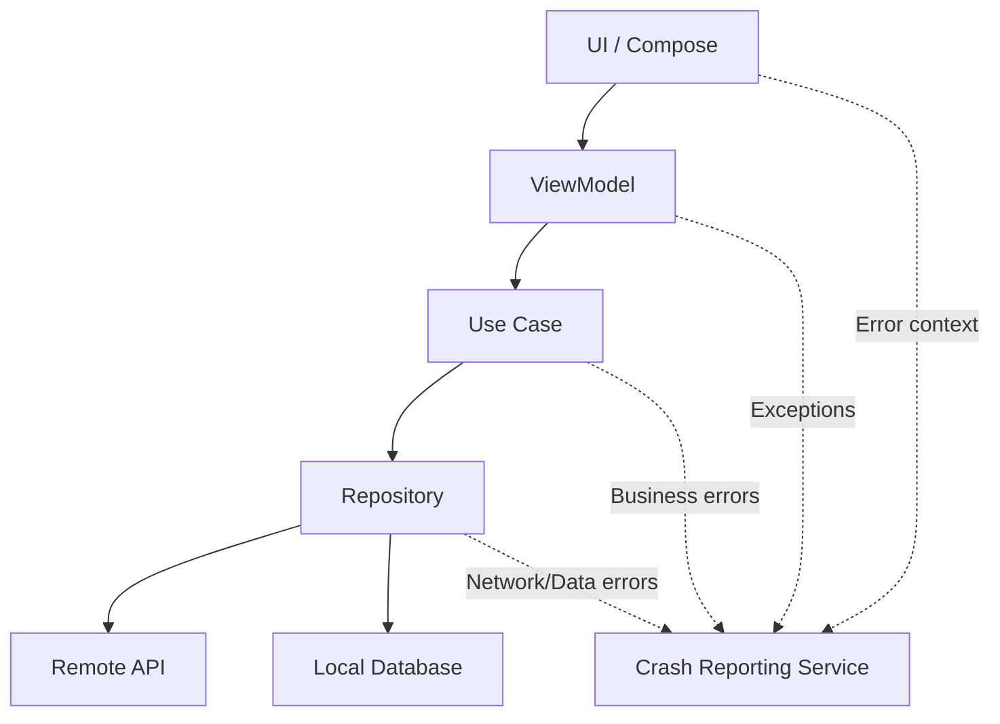
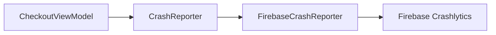
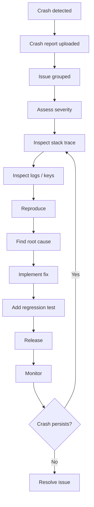
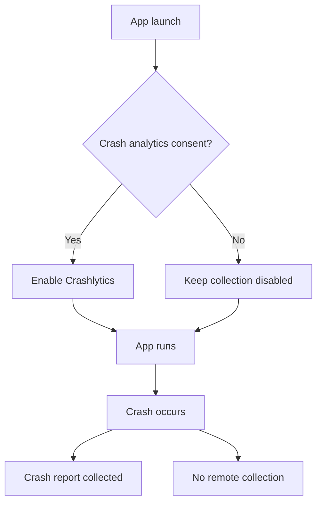
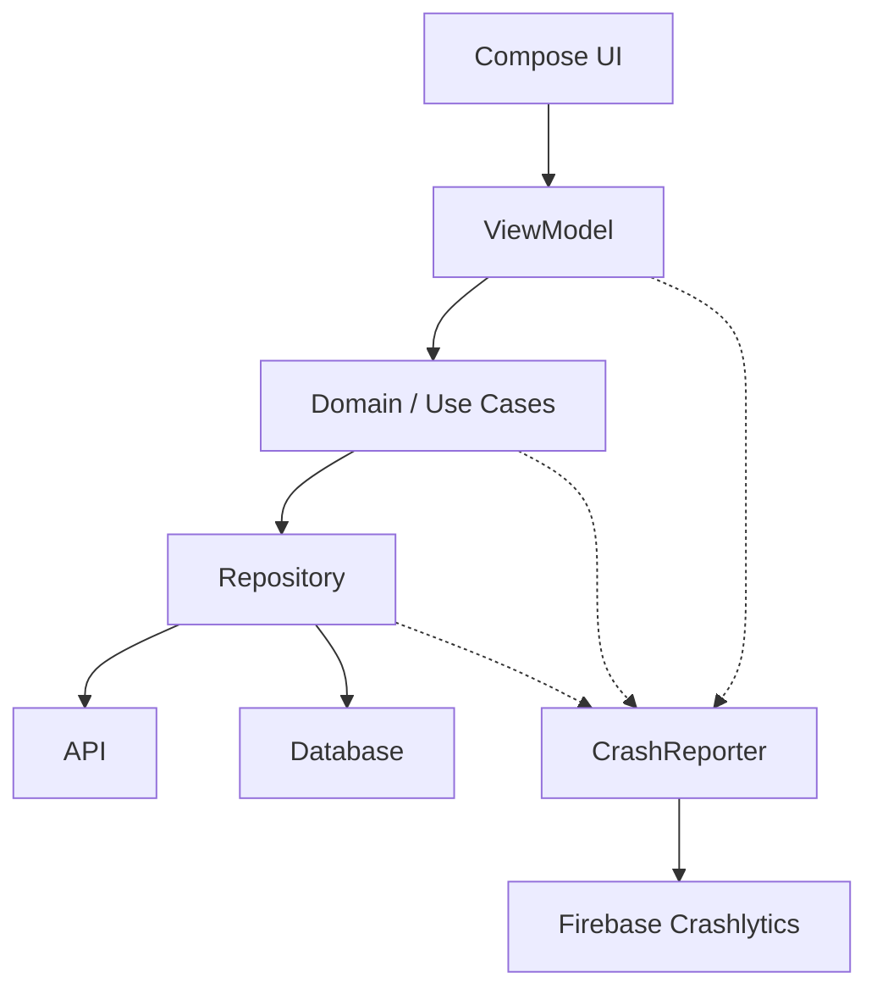
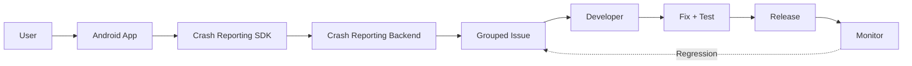

# 020 - Crash Report Workflow

**Học phần:** 04 - Network, Async and Services
**Module:** Module 09 - Common Services
**Nhóm nội dung:** Service Integration
**Nguồn roadmap:** Common Services / Service Integration
**Loại bài:** service
**Thứ tự trong module:** 020
**Thời lượng gợi ý:** 34 phút

---

## 1. Tóm tắt

**Crash Report Workflow** là quy trình thu thập, gửi, phân tích, xử lý và theo dõi các lỗi làm ứng dụng Android bị crash hoặc hoạt động bất thường.

Trong thực tế, developer không chỉ cần biết:

> “Ứng dụng crash ở dòng nào?”

Mà còn phải trả lời được:

* Crash xảy ra trên phiên bản nào?
* Thiết bị và Android version nào?
* Người dùng đang ở màn hình nào?
* App đang ở state nào?
* API nào vừa được gọi?
* User thực hiện hành động gì trước crash?
* Có bao nhiêu người bị ảnh hưởng?
* Crash có phải regression từ release mới không?
* Sau khi sửa, làm thế nào biết lỗi thực sự đã biến mất?

Một workflow điển hình:

```text
User sử dụng app
       │
       ▼
Exception / ANR / Crash
       │
       ▼
Crash Reporting SDK
       │
       ├── Stack trace
       ├── App version
       ├── Device / OS
       ├── Custom logs
       ├── Custom keys
       └── User / session context
       │
       ▼
Crash Reporting Server
       │
       ▼
Group thành Issue
       │
       ▼
Developer triage
       │
       ▼
Reproduce → Fix → Test
       │
       ▼
Release
       │
       ▼
Monitor crash rate
```

Trong hệ sinh thái Android, một giải pháp phổ biến là **Firebase Crashlytics**. Crashlytics có thể báo cáo crash, non-fatal error và ANR, đồng thời hiển thị các báo cáo này trên Firebase Console. ([Firebase][1])

---

# 2. Mục tiêu học tập

Sau bài này, bạn nên có thể:

* Giải thích được **Crash Report Workflow** bằng ngôn ngữ của mình.
* Phân biệt:

  * crash,
  * exception,
  * non-fatal exception,
  * ANR.
* Hiểu crash reporting SDK nằm ở đâu trong kiến trúc Android.
* Tích hợp một crash reporting service cơ bản.
* Gửi thêm context bằng:

  * custom log,
  * custom key,
  * user identifier.
* Biết cách tạo **test crash**.
* Biết cách debug khi crash report không được upload.
* Hiểu ảnh hưởng của crash reporting đến:

  * UX,
  * privacy,
  * release,
  * debugging,
  * maintainability.
* Xây dựng một workflow từ:

```text
Crash
  ↓
Report
  ↓
Triage
  ↓
Reproduce
  ↓
Fix
  ↓
Verify
  ↓
Release
  ↓
Monitor
```

---

# 3. Crash Report Workflow là gì?

Có thể định nghĩa ngắn gọn:

> **Crash Report Workflow là toàn bộ quy trình từ khi lỗi xảy ra trên thiết bị người dùng cho đến khi developer phát hiện, phân tích, sửa lỗi, phát hành bản vá và xác nhận lỗi không còn tái diễn.**

Điểm quan trọng là:

```text
Crash Reporting ≠ chỉ ghi stack trace
```

Một hệ thống production cần cả vòng đời:

```text
Detection
   ↓
Collection
   ↓
Context enrichment
   ↓
Upload
   ↓
Aggregation
   ↓
Prioritization
   ↓
Diagnosis
   ↓
Fix
   ↓
Verification
   ↓
Release
   ↓
Monitoring
```

---

# 4. Crash, Exception, Non-fatal và ANR

## 4.1 Crash

Crash là tình huống lỗi khiến process ứng dụng bị kết thúc.

Ví dụ:

```kotlin
fun divide(a: Int, b: Int): Int {
    return a / b
}

divide(10, 0)
```

Có thể phát sinh:

```text
ArithmeticException
```

Nếu exception không được xử lý:

```text
Exception
   ↓
Unhandled Exception
   ↓
Process terminated
   ↓
App crash
```

---

# 5. Non-fatal exception

Không phải mọi lỗi đều cần làm app crash.

Ví dụ API trả về dữ liệu sai:

```kotlin
try {
    parseUser(response)
} catch (e: Exception) {
    Firebase.crashlytics.recordException(e)
}
```

App vẫn có thể tiếp tục chạy nhưng developer muốn biết lỗi đã xảy ra.

Crashlytics hỗ trợ việc ghi nhận exception theo kiểu non-fatal để phân tích sau. ([Firebase][2])

---

# 6. ANR

**ANR — Application Not Responding** xảy ra khi ứng dụng không phản hồi trong khoảng thời gian Android cho phép.

Ví dụ:

```kotlin
button.setOnClickListener {
    Thread.sleep(20_000)
}
```

Main Thread bị block:

```text
User tap
   ↓
Main Thread
   ↓
Long blocking operation
   ↓
UI không phản hồi
   ↓
ANR
```

Crashlytics cho Android cũng có thể báo cáo ANR. ([Firebase][1])

---

# 7. Crash Reporting nằm ở đâu trong ứng dụng?

Một kiến trúc đơn giản:



Crash reporting thường là một **cross-cutting concern**.

Nó không thuộc riêng:

* UI,
* repository,
* network,
* database.

Mà có thể thu thập thông tin từ nhiều layer.

---

# 8. Crash Report chứa những gì?

Một crash report tốt thường có:

| Thông tin       | Ví dụ                     |
| --------------- | ------------------------- |
| Exception       | `NullPointerException`    |
| Message         | `User profile was null`   |
| Stack trace     | `ProfileRepository.kt:82` |
| App version     | `2.4.1`                   |
| Build           | `240102`                  |
| Android version | Android 16                |
| Device          | Pixel                     |
| Screen          | `CheckoutScreen`          |
| User state      | logged-in                 |
| Network state   | offline                   |
| Request         | `/checkout`               |
| Feature         | payment                   |
| Session         | `abc123`                  |

Crash report càng có context tốt thì càng dễ reproduce.

---

# 9. Workflow đầy đủ

## 9.1 Giai đoạn 1 — Crash xảy ra

Ví dụ:

```text
User
 ↓
CheckoutScreen
 ↓
Pay button
 ↓
PaymentRepository
 ↓
Null response
 ↓
NullPointerException
```

---

## 9.2 Giai đoạn 2 — SDK thu thập crash

Crash reporting SDK có thể lấy:

```text
Throwable
Stack trace
Thread
App version
Device
OS version
Session
Custom metadata
Logs
```

---

## 9.3 Giai đoạn 3 — Lưu report

Một workflow có thể hình dung:

```text
Crash
 ↓
Crash data được ghi lại
 ↓
Process chết
 ↓
User mở app lại
 ↓
SDK gửi report
 ↓
Crash reporting backend
```

Trong hướng dẫn test chính thức của Firebase, sau khi tạo test crash, ứng dụng được mở lại để crash report có thể được gửi tới Firebase. ([Firebase][1])

---

# 10. Giai đoạn 4 — Group crash thành issue

Nếu 10.000 user gặp cùng một lỗi:

```text
Crash User A ─┐
Crash User B ─┤
Crash User C ─┤
Crash User D ─┼──► Issue #123
Crash User E ─┘
```

Developer không muốn nhận:

```text
10.000 ticket riêng
```

Mà muốn:

```text
1 Issue
 ├── 10.000 events
 ├── 4.300 users
 ├── affected versions
 └── common stack trace
```

Việc grouping giúp triage dễ hơn.

---

# 11. Giai đoạn 5 — Triage

Không phải crash nào cũng có mức độ nghiêm trọng giống nhau.

Có thể sử dụng ma trận:

| Severity | Ví dụ                       | Ưu tiên |
| -------- | --------------------------- | ------- |
| Critical | App crash khi startup       | P0      |
| Critical | Không thanh toán được       | P0      |
| High     | Crash khi mở màn hình chính | P1      |
| Medium   | Crash feature phụ           | P2      |
| Low      | Crash hiếm trên thiết bị cũ | P3      |

Một công thức suy nghĩ đơn giản:

```text
Priority
   ≈
Severity
 × Frequency
 × Number of affected users
 × Business impact
```

---

# 12. Giai đoạn 6 — Reproduce

Có stack trace chưa chắc đã đủ.

Developer cần xác định:

```text
Device
+
OS
+
App version
+
User flow
+
App state
+
Network state
+
Backend state
```

Ví dụ report:

```text
Screen      = Checkout
Cart items  = 4
Payment     = VISA
LoggedIn    = true
Network     = offline
Experiment  = checkout_v2
```

Có thể nhanh chóng suy ra:

```text
Checkout V2
+
offline
+
retry
=
possible crash
```

---

# 13. Custom Logs

Crashlytics cho phép thêm custom log để biết những gì xảy ra trước lỗi. ([Firebase][2])

Ví dụ:

```kotlin
import com.google.firebase.crashlytics.FirebaseCrashlytics

val crashlytics = FirebaseCrashlytics.getInstance()

crashlytics.log("Checkout screen opened")
crashlytics.log("User clicked Pay")
crashlytics.log("Starting payment request")
```

Khi crash:

```text
Logs

21:04:01 Checkout screen opened
21:04:05 User clicked Pay
21:04:05 Starting payment request
21:04:07 Payment response received
21:04:07 CRASH
```

Context tốt hơn nhiều so với:

```text
NullPointerException
PaymentRepository.kt:127
```

---

# 14. Custom Keys

Có thể gắn metadata vào crash:

```kotlin
val crashlytics = FirebaseCrashlytics.getInstance()

crashlytics.setCustomKey(
    "screen",
    "checkout"
)

crashlytics.setCustomKey(
    "payment_method",
    "visa"
)

crashlytics.setCustomKey(
    "cart_size",
    4
)

crashlytics.setCustomKey(
    "feature_checkout_v2",
    true
)
```

Crash report lúc này có thể chứa:

```text
screen              checkout
payment_method      visa
cart_size           4
feature_checkout_v2 true
```

Crashlytics hiện hỗ trợ custom keys và cho phép tìm/filter issue dựa trên chúng. Firebase cũng đặt giới hạn về số lượng và kích thước custom keys, vì vậy không nên biến Crashlytics thành hệ thống log dữ liệu tùy ý. ([Firebase][2])

---

# 15. User Identifier

Một lỗi có thể phụ thuộc vào một loại account cụ thể.

Có thể gắn identifier:

```kotlin
FirebaseCrashlytics
    .getInstance()
    .setUserId(user.analyticsId)
```

Nhưng cần tránh:

```text
Email
Password
Access token
Refresh token
Credit card
Phone number
Private message
```

Tốt hơn:

```text
Internal anonymous ID
```

hoặc:

```text
Hashed / pseudonymous identifier
```

Crashlytics hỗ trợ việc gắn user identifier vào report để hỗ trợ điều tra lỗi. ([Firebase][2])

---

# 16. Không log dữ liệu nhạy cảm

Đây là lỗi production rất dễ mắc.

Không nên:

```kotlin
crashlytics.log(
    "Login token = ${user.accessToken}"
)
```

Không nên:

```kotlin
crashlytics.setCustomKey(
    "password",
    password
)
```

Không nên:

```text
Authorization: Bearer eyJ...
```

Nên:

```text
login_state = authenticated
```

hoặc:

```text
token_present = true
```

Thay vì:

```text
token = <actual token>
```

---

# 17. Tích hợp Firebase Crashlytics

Một cấu trúc thường gặp:

```text
Android App
 │
 ├── google-services configuration
 │
 ├── Firebase SDK
 │
 └── Crashlytics SDK
        │
        ▼
 Firebase Crashlytics
        │
        ▼
 Firebase Console
```

Firebase hiện yêu cầu cấu hình Firebase trong project Android, thêm Crashlytics SDK/plugin rồi tạo một test crash để hoàn tất kiểm tra integration. ([Firebase][1])

---

# 18. Dependency

Nên sử dụng Firebase BoM để quản lý version Firebase đồng nhất.

Ví dụ:

```kotlin
dependencies {

    implementation(
        platform("com.google.firebase:firebase-bom:<current-version>")
    )

    implementation(
        "com.google.firebase:firebase-crashlytics"
    )

    implementation(
        "com.google.firebase:firebase-analytics"
    )
}
```

Không nên copy cứng version từ một tutorial cũ mà nên kiểm tra phiên bản Firebase hiện hành khi triển khai project thực tế.

Analytics cũng có thể giúp Crashlytics cung cấp **breadcrumb logs**, tức context về hành động của user trước một crash, non-fatal hoặc ANR. ([Firebase][1])

---

# 19. Test Crash

Một cách đơn giản:

```kotlin
Button(
    onClick = {
        throw RuntimeException(
            "Crash Report Workflow test crash"
        )
    }
) {
    Text("Force crash")
}
```

Flow:

```text
Launch debug app
      ↓
Press "Force crash"
      ↓
RuntimeException
      ↓
App crashes
      ↓
Restart app
      ↓
Crashlytics uploads event
      ↓
Firebase Console
      ↓
Crashlytics
      ↓
Issue appears
```

Firebase cũng dùng phương pháp force crash này trong tài liệu test chính thức. ([Firebase][3])

> Nút tạo crash chỉ nên xuất hiện trong debug/internal build, không được để người dùng production kích hoạt.

---

# 20. Debug-only Crash Test

Có thể bảo vệ bằng:

```kotlin
if (BuildConfig.DEBUG) {

    Button(
        onClick = {
            throw RuntimeException(
                "Debug test crash"
            )
        }
    ) {
        Text("Test Crash")
    }
}
```

Flow:

```text
Debug build
   ↓
Crash test available

Release build
   ↓
Crash test hidden
```

---

# 21. Record Non-fatal Exception

Ví dụ:

```kotlin
suspend fun loadProfile() {

    try {

        repository.loadProfile()

    } catch (e: Exception) {

        FirebaseCrashlytics
            .getInstance()
            .recordException(e)

        showFallbackProfile()
    }
}
```

Workflow:

```text
Repository error
      ↓
Exception
      ↓
recordException()
      ↓
Crashlytics
      ↓
App continues
```

Đây là một chiến lược quan trọng.

Không phải:

```text
mọi lỗi → crash app
```

---

# 22. Không lạm dụng recordException()

Sai:

```kotlin
FirebaseCrashlytics
    .getInstance()
    .recordException(
        Exception("Button clicked")
    )
```

Crash reporting không phải analytics.

Phân biệt:

```text
User behavior
      ↓
Analytics

Debug information
      ↓
Logging / Observability

Unexpected application failure
      ↓
Crash Reporting
```

---

# 23. Centralized Crash Reporter

Trong app lớn, không nên gọi Firebase trực tiếp khắp codebase.

Có thể tạo abstraction:

```kotlin
interface CrashReporter {

    fun log(message: String)

    fun recordException(
        throwable: Throwable
    )

    fun setKey(
        key: String,
        value: String
    )

    fun setUserId(
        userId: String
    )
}
```

Implementation:

```kotlin
class FirebaseCrashReporter :
    CrashReporter {

    private val crashlytics =
        FirebaseCrashlytics.getInstance()

    override fun log(
        message: String
    ) {
        crashlytics.log(message)
    }

    override fun recordException(
        throwable: Throwable
    ) {
        crashlytics.recordException(
            throwable
        )
    }

    override fun setKey(
        key: String,
        value: String
    ) {
        crashlytics.setCustomKey(
            key,
            value
        )
    }

    override fun setUserId(
        userId: String
    ) {
        crashlytics.setUserId(
            userId
        )
    }
}
```

---

# 24. Vì sao cần abstraction?

Nếu business logic gọi trực tiếp:

```text
ViewModel
   ↓
FirebaseCrashlytics
```

thì code phụ thuộc vendor.

Tốt hơn:

```text
ViewModel
   ↓
CrashReporter
   ↓
FirebaseCrashReporter
   ↓
Firebase Crashlytics
```

Sau này có thể đổi:

```text
Firebase Crashlytics
        ↓
Sentry
```

hoặc:

```text
Firebase
+
Custom telemetry
```

mà không phải sửa toàn bộ app.

---

# 25. Dependency Injection

Ví dụ:

```kotlin
class CheckoutViewModel(
    private val repository: CheckoutRepository,
    private val crashReporter: CrashReporter
) : ViewModel() {

    fun checkout() {

        crashReporter.log(
            "Checkout started"
        )

        // ...
    }
}
```

Architecture:



---

# 26. Lifecycle và Crash Reporting

Crash reporting không có nghĩa là bạn được bỏ qua lifecycle.

Ví dụ user:

```text
Checkout
   ↓
Background app
   ↓
Process killed
   ↓
Return app
```

Nếu state restoration sai:

```text
paymentResult = null
```

sau đó code:

```kotlin
paymentResult!!.status
```

có thể crash.

Crash report giúp phát hiện lỗi.

Nhưng root cause vẫn có thể là:

```text
Lifecycle
+
State restoration
+
Incorrect null assumption
```

---

# 27. State cần log

Đối với crash liên quan UI:

```text
screen
navigation_destination
loading_state
selected_tab
experiment
```

Đối với network:

```text
endpoint
http_method
response_code
retry_count
network_available
```

Đối với database:

```text
migration_version
entity
operation
```

Đối với feature flag:

```text
feature_checkout_v2
feature_new_home
```

---

# 28. Ví dụ crash workflow thực tế

Giả sử app bán hàng.

User thực hiện:

```text
Home
 ↓
Product
 ↓
Add to cart
 ↓
Checkout
 ↓
Payment
```

Một lỗi xảy ra:

```text
Payment API
    ↓
response.body == null
    ↓
response.body!!
    ↓
NullPointerException
```

Crash report:

```text
App version = 4.2.0

Screen = Checkout

payment_method = VISA

API = /payment

HTTP = 200

body_null = true

feature_checkout_v2 = true
```

Developer có thể suy luận:

```text
API trả HTTP 200
nhưng body null
        ↓
Client giả định body luôn tồn tại
        ↓
Unsafe !!
        ↓
Crash
```

Fix:

```kotlin
val body = response.body()

if (body == null) {

    crashReporter.recordException(
        IllegalStateException(
            "Payment body is null"
        )
    )

    return PaymentResult.Error
}
```

---

# 29. Crash → Fix Workflow



Đây mới là **Crash Report Workflow**, không chỉ đơn giản là:

```text
SDK → Firebase
```

---

# 30. Stack Trace và Obfuscation

Production Android thường dùng:

```text
R8
```

để:

```text
shrink
optimize
obfuscate
```

Ví dụ source:

```kotlin
CheckoutRepository.processPayment()
```

sau obfuscation có thể trở thành dạng khó đọc:

```text
a.b.c()
```

Nếu mapping không được upload:

```text
Crash
 ↓
Obfuscated stack trace
 ↓
Khó debug
```

Nếu mapping được upload:

```text
Crash
 ↓
mapping.txt
 ↓
Deobfuscation
 ↓
Readable stack trace
```

Crashlytics Gradle plugin có thể upload mapping file để server giải mã stack trace của các build sử dụng R8/ProGuard-compatible obfuscation. ([Firebase][4])

---

# 31. Release Workflow

Crash reporting nên được đưa vào release process.

Ví dụ:

```text
Develop
 ↓
Unit Test
 ↓
QA
 ↓
Internal Release
 ↓
Crash Test
 ↓
Verify symbol / mapping
 ↓
Production Release
 ↓
Monitor Crashlytics
```

---

# 32. Release Checklist

Trước release:

* [ ] Crash reporting SDK hoạt động.
* [ ] Test crash xuất hiện.
* [ ] Release build có reporting.
* [ ] Mapping file được xử lý đúng.
* [ ] Không log PII.
* [ ] Không log token.
* [ ] Không log password.
* [ ] Custom keys cần thiết đã có.
* [ ] Non-fatal exception quan trọng được ghi nhận.
* [ ] Test crash button không xuất hiện ở production.

---

# 33. Crash-free Metrics

Một metric hữu ích:

```text
Crash-free users
```

Ví dụ:

```text
100,000 users

500 users crash
```

thì:

```text
Crash-free users
=
99,500 / 100,000

=
99.5%
```

Nếu release mới làm:

```text
99.9%
 ↓
97.2%
```

đây là tín hiệu rất mạnh rằng release có regression.

---

# 34. Release Regression

Ví dụ:

```text
v3.4.1
Crash-free = 99.91%

        ↓ release

v3.5.0
Crash-free = 96.70%
```

Workflow:

```text
Release
 ↓
Crash spike
 ↓
Identify new issue
 ↓
Compare app versions
 ↓
Locate change
 ↓
Hotfix / rollback
```

Crash reporting vì vậy liên quan trực tiếp tới:

```text
Release Engineering
```

chứ không chỉ debugging.

---

# 35. Failure Scenario — Crash reporting service không hoạt động

Bài thực hành yêu cầu ít nhất một failure scenario.

Ví dụ:

```text
App crashes
 ↓
Device offline
 ↓
Report chưa gửi được
```

Ứng dụng không được phụ thuộc business logic vào Crashlytics.

Sai:

```text
Crashlytics unavailable
        ↓
Checkout fails
```

Đúng:

```text
Crashlytics unavailable
        ↓
Checkout vẫn hoạt động
```

Crash reporting là:

```text
observability dependency
```

không nên trở thành:

```text
business-critical dependency
```

---

# 36. Disabled-service Scenario

Có thể có trường hợp user không đồng ý collection.

Firebase hỗ trợ tắt automatic crash collection và bật lại theo lựa chọn của người dùng. ([Firebase][5])

Ví dụ manifest:

```xml
<meta-data
    android:name="firebase_crashlytics_collection_enabled"
    android:value="false" />
```

Sau khi user consent:

```kotlin
FirebaseCrashlytics
    .getInstance()
    .setCrashlyticsCollectionEnabled(
        true
    )
```

---

# 37. Privacy Flow

Một flow phù hợp:



Chi tiết implementation phải phù hợp với:

* privacy policy của app,
* loại dữ liệu thu thập,
* khu vực phát hành,
* yêu cầu pháp lý của sản phẩm.

---

# 38. Debug khi không thấy Crash Report

Nếu đã force crash nhưng dashboard không có report, có thể bật Crashlytics debug logging.

Firebase hướng dẫn:

```bash
adb shell setprop log.tag.FirebaseCrashlytics DEBUG
```

Sau đó:

```bash
adb logcat -s FirebaseCrashlytics
```

Một upload thành công có thể xuất hiện thông báo:

```text
Crashlytics report upload complete
```

hoặc HTTP status tương ứng trong log. ([Firebase][3])

Sau khi test:

```bash
adb shell setprop log.tag.FirebaseCrashlytics INFO
```

---

# 39. Những lỗi implementation thường gặp

## Lỗi 1 — Chỉ xem stack trace

Developer thấy:

```text
NullPointerException
```

nhưng không có:

```text
screen
user flow
feature flag
request
state
```

→ khó reproduce.

---

## Lỗi 2 — Log quá nhiều

```text
Every click
Every variable
Every API payload
```

vào Crashlytics.

Kết quả:

```text
Noise
+
Privacy risk
+
Khó tìm signal
```

---

## Lỗi 3 — Log dữ liệu bí mật

Ví dụ:

```text
access token
password
OTP
credit card
private messages
```

Đây là anti-pattern nghiêm trọng.

---

# 40. Lỗi 4 — Catch Exception rồi bỏ qua

Ví dụ:

```kotlin
try {

    payment()

} catch (e: Exception) {

}
```

Developer mất hoàn toàn signal.

Tốt hơn:

```kotlin
catch (e: Exception) {

    crashReporter.recordException(e)

    handlePaymentFailure()
}
```

---

# 41. Lỗi 5 — Dùng Crashlytics thay cho error handling

Sai:

```kotlin
try {

    riskyOperation()

} catch (e: Exception) {

    crashlytics.recordException(e)

}
```

rồi không xử lý user flow.

Crash reporting không thay thế:

```text
Error handling
```

Đúng phải là:

```text
Exception
 ├── Report
 └── Handle UX
```

Ví dụ:

```kotlin
catch (e: IOException) {

    crashReporter.recordException(e)

    uiState.value =
        UiState.NetworkError
}
```

---

# 42. Lỗi 6 — Không kiểm tra production build

Debug:

```text
Crash report OK
```

nhưng release:

```text
R8
+
different config
+
different build type
```

→ report khó đọc hoặc thiếu context.

Do đó nên test:

```text
Debug
Internal
Release candidate
```

---

# 43. Crash Reporter và Clean Architecture

Một kiến trúc tốt:



Điểm quan trọng:

```text
Domain logic
     ↓
không cần biết
     ↓
Firebase cụ thể
```

---

# 44. Testing Strategy

Crash report integration nên được test ở nhiều tầng.

## Unit test

Mock:

```kotlin
class FakeCrashReporter :
    CrashReporter {

    val exceptions =
        mutableListOf<Throwable>()

    override fun recordException(
        throwable: Throwable
    ) {
        exceptions += throwable
    }

    // ...
}
```

Test:

```kotlin
@Test
fun repository_error_is_reported() {

    // Arrange

    // Act

    // Assert
}
```

---

# 45. Integration Test

Kiểm tra:

```text
App
 ↓
Crashlytics SDK
 ↓
Crash report
```

Thông qua debug/internal build.

---

# 46. Manual Test

Scenario:

```text
1. Launch app
2. Trigger Test Crash
3. App closes
4. Reopen app
5. Open Firebase Console
6. Find Crashlytics
7. Verify issue
```

---

# 47. Regression Test

Mỗi crash quan trọng nên đặt câu hỏi:

> Có thể viết test để lỗi này không quay trở lại không?

Ví dụ crash:

```text
API returns null body
```

Sau fix, thêm:

```kotlin
@Test
fun nullPaymentBody_doesNotCrash() {

    val response =
        FakeResponse(body = null)

    val result =
        repository.process(response)

    assertTrue(
        result is PaymentResult.Error
    )
}
```

Workflow:

```text
Production crash
       ↓
Root cause
       ↓
Bug fix
       ↓
Regression test
       ↓
Future releases protected
```

Đây là bước quan trọng nhất để crash reporting tạo ra giá trị lâu dài.

---

# 48. Quan hệ với Feature Flag

Crash Report Workflow còn có thể kết hợp với Feature Flag:

```text
Release checkout_v2
      ↓
Crash rate tăng
      ↓
Crash reports
      ↓
checkout_v2 = true
      ↓
Identify feature
      ↓
Disable feature flag
```

Không nhất thiết:

```text
chờ app update
```

Đây là một lý do nên đưa feature flag state vào custom key.

---

# 49. Quan hệ với Network

Crash xảy ra sau API call nên biết:

```text
endpoint
status code
retry count
network state
```

Nhưng tránh log:

```text
Authorization
Cookie
Token
Sensitive request body
```

---

# 50. Quan hệ với App State

State machine:

```text
Idle
 ↓
Loading
 ↓
Success

hoặc

Loading
 ↓
Error
```

Nếu code giả định:

```text
Loading
 ↓
Success
```

nhưng thực tế:

```text
Loading
 ↓
Error
 ↓
UI accesses Success data
 ↓
Crash
```

Crash reporting có thể giúp nhận ra các invalid state transition này.

---

# 51. Production Crash Response Workflow

Một workflow team thực tế:

```text
Crash alert
   ↓
Create incident / issue
   ↓
Assign owner
   ↓
Check affected version
   ↓
Check affected users
   ↓
Determine severity
   ↓
Reproduce
   ↓
Root cause analysis
   ↓
Fix
   ↓
Code review
   ↓
Regression test
   ↓
QA
   ↓
Release
   ↓
Monitor
   ↓
Close issue
```

---

# 52. Definition of Done cho một Crash Fix

Một crash chưa nên được coi là “done” chỉ vì code compile.

Definition of Done nên gồm:

* [ ] Root cause đã xác định.
* [ ] Có fix.
* [ ] Có regression test nếu khả thi.
* [ ] Không chỉ catch exception để che lỗi.
* [ ] QA reproduce được lỗi cũ.
* [ ] QA xác nhận lỗi mới không còn.
* [ ] Release chứa fix.
* [ ] Crash rate được monitor.
* [ ] Issue mới không tiếp tục tăng.
* [ ] Không tạo regression khác.

---

# 53. Thực hành

## Mini Project — Crash Reporter Demo

Tạo app:

```text
CrashReporterDemo
```

Có màn hình:

```text
Crash Reporter Demo

[ Force Crash ]

[ Record Non-Fatal ]

[ Simulate API Error ]

Reporting:
Enabled
```

---

## Task 1 — Configure Crash Reporting

Thiết lập:

```text
Firebase project
      ↓
Android app
      ↓
google-services configuration
      ↓
Crashlytics SDK
      ↓
Run app
```

---

## Task 2 — Force Crash

```kotlin
fun forceCrash() {

    throw RuntimeException(
        "Portfolio test crash"
    )
}
```

---

## Task 3 — Add Context

Trước crash:

```kotlin
val crashlytics =
    FirebaseCrashlytics.getInstance()

crashlytics.setCustomKey(
    "screen",
    "CrashDemo"
)

crashlytics.setCustomKey(
    "feature",
    "force_crash"
)

crashlytics.log(
    "User selected Force Crash"
)
```

Sau đó:

```kotlin
throw RuntimeException(
    "Portfolio test crash"
)
```

---

## Task 4 — Non-fatal Error

```kotlin
fun recordNonFatal() {

    try {

        error(
            "Simulated repository error"
        )

    } catch (e: Exception) {

        FirebaseCrashlytics
            .getInstance()
            .recordException(e)
    }
}
```

---

# 54. Task 5 — Disabled Service Scenario

Tạo abstraction:

```kotlin
class NoOpCrashReporter :
    CrashReporter {

    override fun log(
        message: String
    ) = Unit

    override fun recordException(
        throwable: Throwable
    ) = Unit

    override fun setKey(
        key: String,
        value: String
    ) = Unit

    override fun setUserId(
        userId: String
    ) = Unit
}
```

Architecture:

```text
CrashReporter
    │
    ├── FirebaseCrashReporter
    │
    └── NoOpCrashReporter
```

Nhờ vậy:

```text
Crash reporting disabled
      ≠
App broken
```

---

# 55. Artifact đưa vào Portfolio

Có thể tạo:

```text
crash-report-demo/
│
├── README.md
│
├── app/
│
├── architecture/
│   └── crash-report-workflow.md
│
├── screenshots/
│   ├── test-crash.png
│   ├── crashlytics-issue.png
│   └── custom-keys.png
│
└── docs/
    └── release-checklist.md
```

README nên giải thích:

```text
Problem
 ↓
Crash Reporting Architecture
 ↓
CrashReporter abstraction
 ↓
Crashlytics integration
 ↓
Test crash
 ↓
Non-fatal reporting
 ↓
Privacy decisions
 ↓
Release workflow
```

---

# 56. Sơ đồ nên đưa vào Portfolio



Sơ đồ này thể hiện đúng tư duy:

> Crash reporting là một **feedback loop**, không phải một API call đơn lẻ.

---

# 57. Bài tập

## Bài tập chính

Thiết kế hoặc triển khai một **Crash Report Workflow** cho ứng dụng Android nhỏ.

Yêu cầu:

1. Tích hợp một crash reporting service.
2. Có nút tạo test crash trong debug build.
3. Có ít nhất một non-fatal exception.
4. Thêm:

   * custom log,
   * custom key.
5. Không gửi dữ liệu nhạy cảm.
6. Có disabled-service scenario.
7. Viết sơ đồ:

```text
Crash
 ↓
Collect
 ↓
Upload
 ↓
Triage
 ↓
Fix
 ↓
Verify
 ↓
Release
 ↓
Monitor
```

8. Viết release checklist.
9. Chụp screenshot crash report.
10. Viết README giải thích cách reproduce lỗi.

---

# 58. Câu hỏi tự kiểm tra

### Câu 1

Crash reporting có thay thế `try/catch` không?

**Không.**

Crash reporting cung cấp observability.

Error handling quyết định app phản ứng thế nào.

---

### Câu 2

Có nên gửi access token vào Crashlytics không?

**Không.**

---

### Câu 3

Tại sao cần custom key?

Để lưu context như:

```text
screen
feature
state
network
experiment
```

giúp reproduce lỗi.

---

### Câu 4

Tại sao cần test production/release build?

Vì release có thể khác debug về:

```text
R8
obfuscation
configuration
build flags
SDK behavior
```

---

### Câu 5

Sau khi sửa crash, bước tiếp theo là gì?

Không chỉ release.

Phải:

```text
Fix
 ↓
Regression test
 ↓
Release
 ↓
Monitor
```

---

# 59. Checklist hoàn thành

## Kiến thức

* [ ] Giải thích được Crash Report Workflow.
* [ ] Phân biệt crash và non-fatal error.
* [ ] Hiểu ANR.
* [ ] Hiểu stack trace.
* [ ] Hiểu crash grouping.
* [ ] Hiểu triage.
* [ ] Hiểu regression monitoring.

## Android

* [ ] Tích hợp crash reporting SDK.
* [ ] Tạo được test crash.
* [ ] Ghi được non-fatal exception.
* [ ] Thêm custom log.
* [ ] Thêm custom key.
* [ ] Biết cách bật debug logging.

## Architecture

* [ ] Có `CrashReporter` abstraction.
* [ ] Business logic không phụ thuộc trực tiếp vào Firebase nếu project cần khả năng thay thế provider.
* [ ] Crash reporter fail không làm business flow fail.

## Privacy

* [ ] Không log password.
* [ ] Không log access token.
* [ ] Không log private data không cần thiết.
* [ ] Có xem xét consent và crash-report collection.

## Release

* [ ] Test crash trên build phù hợp.
* [ ] Kiểm tra readable stack trace.
* [ ] Kiểm tra mapping/deobfuscation khi dùng R8.
* [ ] Test crash code không xuất hiện ngoài môi trường cho phép.
* [ ] Theo dõi crash rate sau release.

## Portfolio

* [ ] Có code demo.
* [ ] Có diagram.
* [ ] Có screenshot Crashlytics.
* [ ] Có README.
* [ ] Có test hoặc checklist regression.

---

# 60. Ghi chú sản xuất

Khi đưa Crash Report Workflow vào production, đừng chỉ hỏi:

> “Crashlytics đã cài chưa?”

Hãy kiểm tra cả chuỗi:

```text
Có phát hiện lỗi?
        ↓
Report có đủ context?
        ↓
Stack trace có đọc được?
        ↓
Có lộ dữ liệu nhạy cảm?
        ↓
Có biết user flow nào gây lỗi?
        ↓
Có phân biệt release/version?
        ↓
Có reproduce được?
        ↓
Có regression test?
        ↓
Có monitor sau release?
```

Một Android developer mạnh không chỉ biết gọi:

```kotlin
recordException(e)
```

mà phải hiểu cả vòng đời:

```text
Failure
   ↓
Detection
   ↓
Context
   ↓
Reporting
   ↓
Triage
   ↓
Diagnosis
   ↓
Fix
   ↓
Testing
   ↓
Release
   ↓
Monitoring
```

Đó mới là tư duy đúng của **Crash Report Workflow trong ứng dụng Android production**. ([Firebase][1])

[1]: https://firebase.google.com/docs/crashlytics/android/get-started?utm_source=chatgpt.com "Get started with Crashlytics for Android  |  Firebase Crashlytics"
[2]: https://firebase.google.com/docs/crashlytics/android/customize-crash-reports?authuser=002&utm_source=chatgpt.com "Customize crash reports for Android  |  Firebase Crashlytics"
[3]: https://firebase.google.com/docs/crashlytics/android/test-implementation?utm_source=chatgpt.com "Test your Crashlytics implementation (Android)  |  Firebase Crashlytics"
[4]: https://firebase.google.com/docs/crashlytics/android/get-deobfuscated-reports?utm_source=chatgpt.com "Get readable crash reports in the Crashlytics dashboard (Android)  |  Firebase Crashlytics"
[5]: https://firebase.google.com/docs/crashlytics/android/customize-crash-reports?hl=vi&utm_source=chatgpt.com "Tuỳ chỉnh báo cáo sự cố cho Android  |  Firebase Crashlytics"
