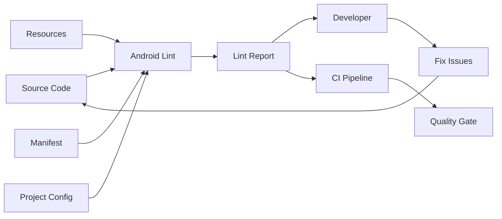
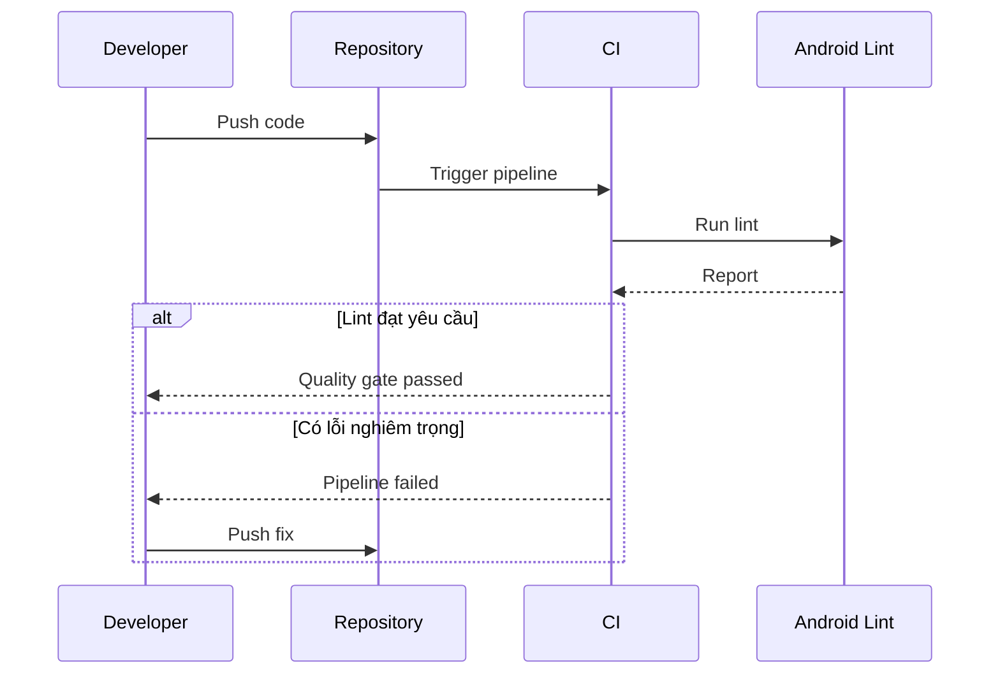

# 001 - Android Lint

**Học phần:** 05 - Quality, Release and Portfolio
**Module:** Module 10 - Linting, Debugging and Benchmark
**Nhóm nội dung:** Linting
**Nguồn roadmap:** Linting, Debugging and Benchmark / Linting
**Loại bài:** quality
**Thứ tự trong module:** 001
**Thời lượng gợi ý:** 30 phút

---

## 1. Tóm tắt

**Android Lint** là công cụ phân tích tĩnh dành cho dự án Android. Công cụ này kiểm tra source code, resource, `AndroidManifest.xml` và cấu hình dự án để phát hiện những vấn đề tiềm ẩn mà không cần chạy ứng dụng.

Lint có thể phát hiện các vấn đề liên quan đến correctness, API compatibility, performance, security, accessibility, internationalization, usability và maintainability. Mỗi vấn đề được gắn với một `issue ID` và mức độ nghiêm trọng để developer có thể xác định lỗi nào phải sửa trước.

Trong quy trình phát triển Android, Android Lint nên xuất hiện ở cả hai nơi:

* trên máy developer để nhận feedback sớm;
* trong CI để ngăn những lỗi chất lượng mới đi vào branch chính hoặc bản release.

Android Lint không thay thế unit test, integration test hoặc UI test. Nó bổ sung một lớp kiểm tra khác:

```text
Static analysis
        ↓
Compile
        ↓
Automated tests
        ↓
Build
        ↓
Release validation
```

Sau bài học, người học cần có khả năng chạy Android Lint, đọc report, xử lý issue, cấu hình rule phù hợp và biến lint thành một quality gate có thể lặp lại trong project.

## 2. Mục tiêu học tập

Sau bài học, người học có thể:

* giải thích Android Lint và vai trò của static analysis trong Android;
* xác định những loại vấn đề mà Android Lint có thể phát hiện;
* phân biệt Android Lint với compiler, formatter, `ktlint`, `detekt` và automated test;
* chạy lint từ Android Studio và Gradle;
* đọc `issue ID`, severity, vị trí lỗi và thông báo trong lint report;
* cấu hình lint bằng `build.gradle.kts` và `lint.xml`;
* sử dụng `lint-baseline.xml` đúng mục đích;
* đánh giá khi nào có thể suppress một lint warning;
* tích hợp lint vào CI;
* tạo lint report và quality checklist để đưa vào portfolio.

## 3. Khái niệm cốt lõi

### 3.1. Static analysis

**Static analysis** là quá trình phân tích chương trình mà không cần thực thi chương trình đó.

Ví dụ, Android Lint có thể nhìn thấy đoạn code sử dụng API chỉ tồn tại trên Android mới và cảnh báo rằng ứng dụng có thể chạy trên Android cũ hơn.

Quy trình có thể hình dung như sau:

```text
Source code
Resources
Manifest
Configuration
     │
     ▼
 Android Lint
     │
     ▼
Issue + Severity + Location
```

Khác với runtime test, Lint không cần người dùng mở màn hình hay kích hoạt flow cụ thể mới phát hiện được nhiều loại vấn đề.

### 3.2. Lint issue

Mỗi rule của Android Lint tương ứng với một **issue**.

Issue thường có:

* `id`;
* mô tả;
* vị trí source;
* severity;
* lý do vấn đề nguy hiểm;
* hướng xử lý.

Ví dụ một số dạng issue có thể liên quan đến:

* gọi API không tương thích với API level;
* resource không được sử dụng;
* hard-coded text;
* accessibility;
* permission;
* manifest;
* Compose;
* performance;
* internationalization.

Điều quan trọng không phải là đạt mục tiêu:

> 0 warning bằng mọi giá.

Mục tiêu thực tế là:

> Phát hiện sớm những vấn đề có ảnh hưởng đến sản phẩm và duy trì bộ rule đủ nghiêm để ngăn regression.

### 3.3. Severity

Lint sử dụng severity để biểu diễn mức độ quan trọng của issue.

Các mức cấu hình được Android Lint hỗ trợ gồm:

* `informational`;
* `warning`;
* `error`;
* `fatal`;
* `ignore` hoặc `disable`.

Developer có thể thay đổi severity của một số issue nếu policy của project yêu cầu khác với mặc định.

Ví dụ:

```text
HardcodedText
     │
     ├── Project demo nhỏ → warning
     │
     └── App đa ngôn ngữ → error
```

Không nên hạ severity chỉ vì một warning gây khó chịu. Trước tiên phải hiểu tại sao rule tồn tại.

## 4. Vị trí của Android Lint trong quy trình phát triển

Android Lint không thuộc riêng UI layer, data layer hay domain layer. Nó là công cụ quality chạy bao phủ project.



Android Lint có thể kiểm tra vấn đề ở nhiều phần của ứng dụng:

```text
Android App
├── Kotlin code
├── Compose / UI
├── XML resources
├── AndroidManifest.xml
├── permissions
├── API usage
├── localization
├── accessibility
└── build configuration
```

Vì vậy, lint nên được xem là một phần của **quality infrastructure**, không phải một công cụ chỉ dùng khi chuẩn bị release.

## 5. Những vấn đề Android Lint có thể phát hiện

Android Lint kiểm tra nhiều nhóm vấn đề liên quan đến chất lượng ứng dụng. Tài liệu Android chính thức mô tả lint có thể kiểm tra correctness, security, performance, usability, accessibility và internationalization.

| Nhóm                 | Ví dụ vấn đề                                           |
| -------------------- | ------------------------------------------------------ |
| Correctness          | Sử dụng API không phù hợp với API level                |
| Performance          | Resource hoặc pattern có thể gây lãng phí              |
| Security             | Một số cấu hình hoặc API usage không an toàn           |
| Accessibility        | UI thiếu thông tin cần thiết cho accessibility         |
| Internationalization | Hard-coded text hoặc vấn đề localization               |
| Usability            | UI hoặc resource có khả năng gây trải nghiệm không tốt |
| Resources            | Resource không dùng hoặc cấu hình không hợp lệ         |
| Manifest             | Khai báo component hoặc thuộc tính có vấn đề           |

> **Lưu ý:** Lint phát hiện được một số loại vấn đề bảo mật nhưng không thay thế security review, penetration testing hoặc backend authorization.

## 6. Cách Android Lint hoạt động

### 6.1. Feedback loop trên máy developer

Một workflow đơn giản:

1. Developer viết hoặc sửa code.
2. Android Studio chạy inspection trong editor.
3. Warning hoặc error xuất hiện tại vị trí liên quan.
4. Developer đọc `issue ID` và mô tả.
5. Developer sửa nguyên nhân.
6. Chạy lint toàn project.
7. Kiểm tra report trước khi commit hoặc tạo pull request.

Flow lý tưởng:

```text
Code
 ↓
Lint
 ↓
Issue?
 ├── Không → tiếp tục
 └── Có
      ↓
 Hiểu nguyên nhân
      ↓
 Fix
      ↓
 Chạy lại lint
```

Feedback càng sớm thì chi phí sửa càng thấp.

### 6.2. Quality gate trong CI

Sau khi code được push:

1. CI checkout source.
2. CI thiết lập môi trường Android/Java.
3. CI chạy Gradle lint task.
4. Android Lint phân tích project.
5. Report được tạo.
6. Nếu có issue vượt policy của project, pipeline thất bại.
7. Developer sửa code trước khi merge.



Android Developers khuyến nghị chạy lint rõ ràng trong continuous integration thay vì giả định lint luôn được thực thi tự động trong mọi build.

## 7. Chạy Android Lint

### 7.1. Chạy trong Android Studio

Android Studio hiển thị lint và inspection trực tiếp trong editor.

Developer có thể:

* xem warning ngay tại dòng code;
* mở quick fix nếu rule hỗ trợ;
* xem mô tả issue;
* chạy inspection cho phạm vi lớn hơn.

Để kiểm tra project bằng IDE, có thể sử dụng:

```text
Code
└── Inspect Code
```

Android Studio sau đó hiển thị các vấn đề trong cửa sổ inspection results.

### 7.2. Chạy bằng Gradle

Trong project Android sử dụng Gradle, nên sử dụng Gradle Wrapper.

Linux/macOS:

```bash
./gradlew lint
```

Windows:

```bash
gradlew lint
```

Có thể chạy cho build variant cụ thể.

Ví dụ:

```bash
./gradlew lintDebug
```

Hoặc:

```bash
./gradlew lintRelease
```

Android Developers khuyến nghị sử dụng Gradle lint task đối với Gradle project thay vì gọi standalone lint tool trực tiếp.

### 7.3. Đọc lint report

Sau khi lint hoàn tất, report thường được tạo trong thư mục `build/reports/` của module.

Ví dụ:

```text
app/
└── build/
    └── reports/
        ├── lint-results-debug.html
        └── lint-results-debug.xml
```

Tên file thực tế có thể thay đổi tùy task và build variant.

HTML report đặc biệt hữu ích khi review vì có thể hiển thị:

* issue;
* severity;
* file;
* line;
* explanation;
* vị trí source liên quan.

Một workflow review tốt:

```text
Run lint
   ↓
Open report
   ↓
Sort by severity
   ↓
Fix Error / Fatal
   ↓
Review Warning
   ↓
Run lint again
```

## 8. Cấu hình Android Lint

### 8.1. Cấu hình bằng Gradle

Lint có thể được cấu hình trong `build.gradle.kts`.

Ví dụ:

```kotlin
android {
    lint {
        abortOnError = true
        warningsAsErrors = false
        checkDependencies = true
    }
}
```

Ý nghĩa:

* `abortOnError`: cho phép lint làm task thất bại khi phát hiện error;
* `warningsAsErrors`: nâng toàn bộ warning thành error nếu bật;
* `checkDependencies`: cho phép lint phân tích thêm dependency khi phù hợp với project.

Android Gradle Plugin cung cấp `lint {}` DSL để cấu hình các hành vi này.

Không nên bật:

```kotlin
warningsAsErrors = true
```

một cách máy móc trong một project đang có hàng trăm warning cũ.

Một chiến lược tốt hơn là:

```text
Existing warnings
       ↓
Create baseline
       ↓
Block new errors
       ↓
Reduce technical debt gradually
```

### 8.2. Cấu hình bằng `lint.xml`

`lint.xml` cho phép project cấu hình severity hoặc bỏ qua những rule cụ thể.

Ví dụ:

```xml
<?xml version="1.0" encoding="UTF-8"?>
<lint>
    <issue
        id="HardcodedText"
        severity="error" />
</lint>
```

Trong trường hợp trên, `HardcodedText` được nâng thành error.

Có thể bỏ qua một issue:

```xml
<?xml version="1.0" encoding="UTF-8"?>
<lint>
    <issue
        id="SomeIssueId"
        severity="ignore" />
</lint>
```

Tuy nhiên, việc ignore một rule phải có lý do kỹ thuật rõ ràng.

Không nên biến `lint.xml` thành nơi:

```text
Warning xuất hiện
      ↓
Ignore
      ↓
Problem "biến mất"
```

Cấu hình `lint.xml` được Android Lint hỗ trợ để tùy chỉnh các check và severity ở cấp project.

### 8.3. Sử dụng lint baseline

Một project cũ có thể đã tồn tại hàng trăm issue.

Nếu bật strict lint ngay lập tức:

```text
Legacy project
     ↓
800 warnings
     ↓
CI fails
     ↓
Team disables lint
```

Đây không phải kết quả mong muốn.

Android Lint hỗ trợ **baseline** để ghi nhận technical debt hiện tại và tập trung vào những issue mới.

Cấu hình:

```kotlin
android {
    lint {
        baseline = file("lint-baseline.xml")
    }
}
```

Sau đó chạy lint để tạo baseline theo workflow được hỗ trợ bởi project.

Ví dụ:

```bash
./gradlew lintDebug -Dlint.baselines.continue=true
```

Sau khi baseline tồn tại:

```text
Old issues
    ↓
lint-baseline.xml
    ↓
Ignored temporarily

New issues
    ↓
Lint report
    ↓
Developer must handle
```

> **Quan trọng:** Baseline không phải danh sách lỗi được phép tồn tại mãi mãi.

Một policy tốt là:

1. commit `lint-baseline.xml`;
2. ngăn issue mới;
3. giảm dần số issue cũ;
4. cập nhật baseline khi issue cũ thực sự được xử lý.

## 9. Ví dụ thực tế: phát hiện API không tương thích

Giả sử ứng dụng hỗ trợ Android cũ hơn API 26 nhưng code tạo `NotificationChannel` mà không kiểm tra phiên bản.

Code có vấn đề:

```kotlin
fun createNewsChannel(context: Context) {
    val manager = context.getSystemService(NotificationManager::class.java)

    val channel = NotificationChannel(
        "news",
        "News",
        NotificationManager.IMPORTANCE_DEFAULT
    )

    manager.createNotificationChannel(channel)
}
```

`NotificationChannel` chỉ tồn tại từ API 26.

Nếu code này có thể chạy trên thiết bị cũ hơn, developer cần bảo vệ bằng API-level check.

```kotlin
fun createNewsChannel(context: Context) {
    if (Build.VERSION.SDK_INT >= Build.VERSION_CODES.O) {
        val manager = context.getSystemService(NotificationManager::class.java)

        val channel = NotificationChannel(
            "news",
            "News",
            NotificationManager.IMPORTANCE_DEFAULT
        )

        manager.createNotificationChannel(channel)
    }
}
```

Flow:

```text
Lint đọc API usage
        ↓
So sánh API requirement
        ↓
So sánh minSdk / guard
        ↓
Phát hiện code không an toàn
        ↓
Developer thêm version guard
```

Đây là một ví dụ quan trọng về giá trị của static analysis:

> Không cần tìm một thiết bị Android cũ và đợi ứng dụng crash mới phát hiện vấn đề.

## 10. Suppress lint đúng cách

Đôi khi developer biết rằng một warning không áp dụng cho một đoạn code cụ thể.

Android cho phép suppress lint bằng `@SuppressLint`.

Ví dụ:

```kotlin
@SuppressLint("NewApi")
fun callPlatformSpecificApi() {
    // ...
}
```

Tuy nhiên, suppress chỉ nên được sử dụng khi developer đã chứng minh rằng code an toàn.

Không nên:

```text
Lint warning
     ↓
Không hiểu nguyên nhân
     ↓
@SuppressLint(...)
     ↓
Merge
```

Nên:

```text
Lint warning
     ↓
Hiểu issue
     ↓
Có phải bug thật?
 ├── Có → fix
 └── Không
       ↓
 Có bằng chứng?
       ↓
 Suppress phạm vi nhỏ nhất
```

Android Lint cũng hỗ trợ suppression theo file hoặc XML, nhưng suppression càng rộng thì nguy cơ che khuất lỗi thật càng lớn.

> **Nguyên tắc:** Fix nguyên nhân trước. Suppress chỉ khi rule không phù hợp với trường hợp cụ thể.

## 11. Android Lint và các công cụ quality khác

| Công cụ              | Mục tiêu chính                                          | Chạy app?        |
| -------------------- | ------------------------------------------------------- | ---------------- |
| Android Lint         | Phân tích vấn đề Android-specific và structural quality | Không            |
| Compiler             | Kiểm tra code có thể biên dịch                          | Không            |
| `ktlint`             | Style và formatting Kotlin                              | Không            |
| `detekt`             | Static analysis cho Kotlin                              | Không            |
| Unit test            | Kiểm tra logic                                          | Có thực thi code |
| Instrumentation test | Kiểm tra trên Android runtime                           | Có               |
| UI test              | Kiểm tra hành vi UI                                     | Có               |

Một pipeline tốt có thể kết hợp:

```text
ktlint
   ↓
detekt
   ↓
Android Lint
   ↓
Unit Tests
   ↓
Instrumentation Tests
   ↓
Build
```

Không nên suy luận:

> Lint pass nghĩa là ứng dụng đúng.

Lint chỉ trả lời một phần của câu hỏi về chất lượng.

Ví dụ:

```kotlin
fun calculateTotal(price: Int, quantity: Int): Int {
    return price - quantity
}
```

Code có thể:

* compile thành công;
* lint pass;
* nhưng logic vẫn sai.

Unit test mới là công cụ phù hợp để phát hiện lỗi nghiệp vụ đó.

## 12. Best practices

* Chạy lint trước khi mở pull request.
* Chạy lint lại trong CI thay vì dựa hoàn toàn vào môi trường local.
* Không ignore warning chỉ để pipeline xanh.
* Sử dụng baseline cho legacy project thay vì disable lint.
* Giữ suppression ở phạm vi nhỏ nhất có thể.
* Review lý do của mỗi `@SuppressLint`.
* Ưu tiên sửa nguyên nhân thay vì che warning.
* Nâng severity của các rule quan trọng với sản phẩm.
* Không biến mọi warning thành error nếu team chưa đủ khả năng xử lý.
* Lưu lint report làm artifact của CI khi cần điều tra.
* Theo dõi số lượng lint issue theo thời gian đối với project lớn.
* Cập nhật lint policy khi architecture hoặc yêu cầu sản phẩm thay đổi.

Một policy đơn giản:

```text
Fatal / Error
     ↓
Must fix before merge

Warning
     ↓
Review

Existing technical debt
     ↓
Baseline + cleanup plan
```

## 13. Lỗi thường gặp

**Hiện tượng:** Developer không thấy lint chạy trong pipeline.

**Nguyên nhân:** Team giả định lint luôn tự động chạy cùng mọi build.

**Cách xử lý:** Thêm Gradle lint task rõ ràng vào CI, ví dụ:

```bash
./gradlew lint
```

Android Developers cũng khuyến nghị chạy lint rõ ràng trong continuous integration.

---

**Hiện tượng:** Project có hàng trăm warning nên team tắt lint.

**Nguyên nhân:** Legacy technical debt quá lớn.

**Cách xử lý:** Tạo baseline cho issue hiện tại rồi chặn issue mới.

---

**Hiện tượng:** Source code có nhiều `@SuppressLint`.

**Nguyên nhân:** Suppression được dùng như quick fix thay vì phân tích nguyên nhân.

**Cách xử lý:** Review từng suppression và chỉ giữ những trường hợp có lý do kỹ thuật rõ ràng.

---

**Hiện tượng:** Lint pass nhưng production vẫn có bug.

**Nguyên nhân:** Team hiểu nhầm static analysis là automated testing.

**Cách xử lý:** Kết hợp lint với:

* unit test;
* integration test;
* instrumentation test;
* UI test;
* manual release verification.

---

**Hiện tượng:** CI liên tục thất bại vì warning không quan trọng.

**Nguyên nhân:** Severity policy quá nghiêm hoặc `warningsAsErrors` được bật khi project chưa sẵn sàng.

**Cách xử lý:** Phân loại rule dựa trên rủi ro thực tế và tăng độ nghiêm dần theo thời gian.

## 14. Testing, debugging và release

Android Lint không phải một loại runtime test, nhưng chính lint pipeline cũng cần được kiểm chứng.

Một quality checklist có thể gồm:

| Tình huống                    | Kết quả mong đợi               |
| ----------------------------- | ------------------------------ |
| Code sạch                     | Lint task thành công           |
| Thêm issue nghiêm trọng       | CI phát hiện                   |
| Issue nằm trong baseline      | Không bị báo như issue mới     |
| Thêm issue mới ngoài baseline | Lint report xuất hiện          |
| Sửa issue                     | Report không còn issue đó      |
| CI thất bại                   | Developer truy cập được report |

Khi điều tra lint issue:

1. đọc `issue ID`;
2. xem vị trí source;
3. đọc explanation;
4. kiểm tra API hoặc resource liên quan;
5. xác định đây là true positive hay false positive;
6. sửa nguyên nhân nếu có thể;
7. chạy lại lint;
8. chỉ suppress nếu có lý do rõ ràng.

Trước release, nên kiểm tra ít nhất:

```bash
./gradlew lintRelease
```

nếu project có build variant `release` tương ứng.

Không nên chờ tới thời điểm tạo bản release mới bắt đầu xử lý hàng loạt lint issue.

## 15. Bài thực hành

Xây dựng một quality check bằng Android Lint cho một sample Android app.

Yêu cầu:

1. Mở một Android project nhỏ.
2. Chạy:

```bash
./gradlew lint
```

3. Xác định vị trí lint report.
4. Chọn ít nhất một warning hoặc error.
5. Ghi lại:

   * `issue ID`;
   * file;
   * nguyên nhân;
   * rủi ro;
   * cách sửa.
6. Sửa source code.
7. Chạy lint lần thứ hai.
8. Xác nhận issue đã biến mất.
9. Thêm cấu hình lint phù hợp vào `build.gradle.kts`.
10. Ghi command và kết quả vào `README.md`.

Nếu project hiện tại không tạo được issue phù hợp, có thể chủ động tạo một ví dụ API-level compatibility trong sample app để quan sát lint phát hiện lỗi.

Kết quả mong đợi:

```text
Before
  ↓
Lint detects issue
  ↓
Developer analyzes
  ↓
Code fixed
  ↓
Lint passes
```

Người học phải có bằng chứng rằng quality check có thể lặp lại, không chỉ sửa lỗi một lần bằng tay.

## 16. Artifact cho portfolio

Tạo một thư mục hoặc project demo có cấu trúc tương tự:

```text
android-lint-demo/
├── app/
├── lint.xml
├── lint-baseline.xml
├── README.md
└── docs/
    ├── lint-report.png
    └── lint-notes.md
```

`lint-baseline.xml` chỉ cần xuất hiện nếu project thực sự sử dụng baseline.

Trong `README.md`, mô tả:

* Android Lint là gì;
* cách chạy lint;
* issue đã thử nghiệm;
* code trước khi sửa;
* code sau khi sửa;
* vị trí lint report;
* lint policy của project;
* cách lint được sử dụng trong CI.

Một artifact tốt phải chứng minh được flow:

```text
Problem
   ↓
Static analysis
   ↓
Report
   ↓
Fix
   ↓
Verification
```

Artifact tối thiểu nên gồm:

* source code;
* command chạy lint;
* ảnh hoặc report kết quả;
* một issue thực tế;
* cách sửa;
* technical note ngắn.

## 17. Checklist hoàn thành

* [ ] Tôi giải thích được Android Lint bằng lời của mình.
* [ ] Tôi hiểu static analysis khác runtime testing như thế nào.
* [ ] Tôi biết Android Lint có thể kiểm tra source, resource, manifest và cấu hình Android.
* [ ] Tôi chạy được `./gradlew lint`.
* [ ] Tôi chạy được lint cho một build variant cụ thể.
* [ ] Tôi tìm được lint report.
* [ ] Tôi đọc được `issue ID` và severity.
* [ ] Tôi sửa được ít nhất một lint issue.
* [ ] Tôi hiểu mục đích của `lint.xml`.
* [ ] Tôi hiểu khi nào nên sử dụng `lint-baseline.xml`.
* [ ] Tôi không sử dụng `@SuppressLint` chỉ để che warning.
* [ ] Tôi biết vì sao lint nên chạy trong CI.
* [ ] Tôi hiểu lint không thay thế automated test.
* [ ] Tôi hoàn thành sample app hoặc quality check.
* [ ] Tôi lưu được artifact phù hợp vào portfolio.

## 18. Câu hỏi tự kiểm tra

1. Vì sao Android Lint có thể phát hiện một số lỗi mà Kotlin compiler không phát hiện?
2. Sự khác nhau giữa Android Lint và unit test là gì?
3. Vì sao không nên dùng `@SuppressLint` ngay khi gặp warning?
4. `lint-baseline.xml` giải quyết vấn đề gì trong một legacy project?
5. Vì sao một team nên chạy lint cả trên máy developer và trong CI?

## 19. Tổng kết

Android Lint là một lớp static analysis quan trọng trong quy trình bảo đảm chất lượng Android.

Flow cốt lõi của bài:

```text
Android Source
      ↓
Android Lint
      ↓
Issue + Severity
      ↓
Developer / CI
      ↓
Fix hoặc Review
      ↓
Run Again
      ↓
Quality Gate
```

Điểm cần nhớ:

* Lint phát hiện vấn đề mà không cần chạy ứng dụng.
* Lint hiểu nhiều đặc điểm riêng của hệ sinh thái Android.
* Lint nên chạy cả local và CI.
* Lint report cần được đọc và xử lý thay vì chỉ nhìn trạng thái pass/fail.
* Baseline phù hợp để kiểm soát technical debt của legacy project.
* Suppression chỉ nên sử dụng khi có lý do kỹ thuật rõ ràng.
* Lint không thay thế compiler hoặc automated test.
* Một Android project chuyên nghiệp nên biến lint thành quality check có thể chạy lại ở bất kỳ thời điểm nào.

Artifact sau bài học cần chứng minh rằng người học không chỉ biết khái niệm **Android Lint**, mà còn có thể:

```text
Run
 ↓
Detect
 ↓
Understand
 ↓
Fix
 ↓
Verify
 ↓
Automate
```
