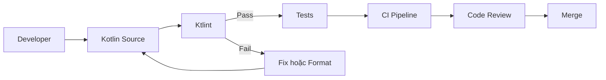
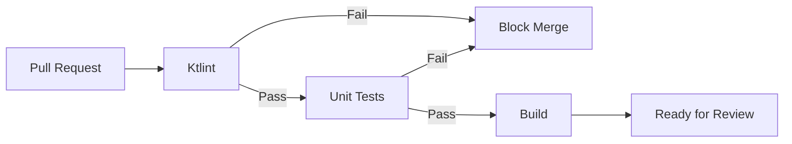

# 002 - Ktlint

**Học phần:** 05 - Quality, Release and Portfolio
**Module:** Module 10 - Linting, Debugging and Benchmark
**Nhóm nội dung:** Linting
**Nguồn roadmap:** Linting, Debugging and Benchmark / Linting
**Loại bài:** quality
**Thứ tự trong module:** 002
**Thời lượng gợi ý:** 30 phút

---

## 1. Tóm tắt

**Ktlint** là công cụ static analysis dành cho Kotlin, tập trung vào việc kiểm tra và chuẩn hóa **code style**. Công cụ đọc source code mà không cần chạy ứng dụng, phát hiện những đoạn code vi phạm quy tắc định dạng và có thể tự động sửa nhiều lỗi thông qua chế độ format.

Trong dự án Android, Ktlint không trực tiếp xử lý UI, lifecycle, state, database hay network. Thay vào đó, nó nằm trong **quality pipeline**, giúp source code Kotlin nhất quán trước khi code được review, merge và release.

Một quy trình tốt thường cho phép developer chạy Ktlint ngay trên máy cá nhân và chạy lại cùng kiểm tra trong CI:

```text
Viết code
    ↓
Ktlint local
    ↓
Commit / Pull Request
    ↓
Ktlint trên CI
    ↓
Code Review
    ↓
Build / Test
    ↓
Merge / Release
```

Mục tiêu của Ktlint không phải là tạo thêm hàng loạt quy tắc gây phiền nhiễu. Giá trị chính của nó là giảm tranh luận về formatting, phát hiện vấn đề sớm và tạo một tiêu chuẩn code có thể kiểm tra tự động.

## 2. Mục tiêu học tập

Sau bài học, người học có thể:

* Giải thích được Ktlint là gì và vấn đề mà công cụ này giải quyết.
* Phân biệt Ktlint với Kotlin compiler, Android Lint và Detekt.
* Tích hợp Ktlint vào một dự án Android sử dụng Gradle.
* Cấu hình các quy tắc định dạng cơ bản thông qua `.editorconfig`.
* Chạy kiểm tra bằng `ktlintCheck`.
* Tự động sửa các lỗi có thể sửa bằng `ktlintFormat`.
* Đọc kết quả lint và xác định file, dòng code và rule gây lỗi.
* Đưa Ktlint vào CI để chặn Pull Request vi phạm coding convention.
* Thiết kế quality check có thể lặp lại giữa môi trường local và CI.
* Tạo một artifact nhỏ thể hiện quy trình linting để đưa vào portfolio.

## 3. Khái niệm cốt lõi

Ktlint phân tích source code Kotlin và so sánh code với một tập hợp quy tắc định dạng.

Ví dụ, đoạn code sau có nhiều vấn đề về spacing và indentation:

```kotlin
class UserFormatter{
fun format(name:String):String{
return name.trim()
}
}
```

Sau khi chuẩn hóa:

```kotlin
class UserFormatter {
    fun format(name: String): String {
        return name.trim()
    }
}
```

Điểm quan trọng là cả hai đoạn code có thể biểu diễn cùng một logic nghiệp vụ. Ktlint tập trung vào **chất lượng biểu diễn source code**, không phải thay đổi business logic.

Có thể hình dung:

```text
Business logic
      │
      │ không thay đổi
      ↓
Kotlin source code
      │
      ↓
Ktlint
      │
      ├── Đúng convention → Pass
      │
      └── Sai convention → Report / Format
```

Ktlint thường đảm nhiệm ba trách nhiệm chính:

* kiểm tra code style;
* báo vị trí vi phạm;
* tự động format những lỗi mà rule hỗ trợ sửa.

> **Lưu ý:** Ktlint không đảm bảo chương trình chạy đúng. Code có thể vượt qua Ktlint nhưng vẫn chứa bug nghiệp vụ, race condition, lỗi lifecycle hoặc lỗi network.

## 4. Vị trí của Ktlint trong kiến trúc và quality pipeline

Ktlint không phải một layer trong Clean Architecture.

Nó không nằm trong:

* presentation layer;
* domain layer;
* data layer;
* repository;
* database;
* network stack.

Ktlint nằm bên ngoài runtime architecture và kiểm tra source code trong quá trình phát triển.



Flow này cho thấy Ktlint tạo một **feedback loop** ngắn. Thay vì chờ reviewer phát hiện các vấn đề như spacing, indentation hoặc formatting, developer có thể nhận phản hồi ngay trước khi tạo Pull Request.

Đối với Android application, Ktlint có thể kiểm tra Kotlin code xuất hiện trong nhiều thành phần:

* `Activity`;
* `Fragment`;
* `ViewModel`;
* Composable function;
* `Repository`;
* `UseCase`;
* `Worker`;
* `Service`;
* DAO;
* Retrofit service;
* unit test;
* Kotlin Gradle script nếu cấu hình hỗ trợ.

Ktlint không quan tâm code thuộc layer nào. Nếu đó là source Kotlin thuộc phạm vi được kiểm tra, rule tương ứng có thể được áp dụng.

## 5. Cách Ktlint hoạt động

Một lần kiểm tra Ktlint có thể được hiểu theo quy trình sau:

1. Developer tạo hoặc chỉnh sửa source code Kotlin.
2. Ktlint tìm các file thuộc phạm vi kiểm tra.
3. Công cụ đọc cấu hình liên quan, bao gồm `.editorconfig`.
4. Source code được parse để các rule có thể phân tích cấu trúc.
5. Các rule kiểm tra code.
6. Nếu không phát hiện vi phạm, task hoàn thành thành công.
7. Nếu phát hiện vi phạm, Ktlint trả về thông tin lỗi.
8. Developer sửa thủ công hoặc chạy formatter.
9. `ktlintCheck` được chạy lại.
10. CI thực hiện cùng kiểm tra trước khi cho phép code tiếp tục qua quality pipeline.

Một report điển hình cần giúp developer xác định được:

```text
File
 ↓
Line / Column
 ↓
Rule
 ↓
Mô tả lỗi
 ↓
Sửa code
```

Điều này quan trọng vì một quality check tốt phải tạo ra phản hồi **actionable**: developer phải biết cần sửa gì thay vì chỉ nhận thông báo chung chung rằng build thất bại.

## 6. Tích hợp Ktlint vào dự án Android

### 6.1. Cấu hình Gradle

Một cách phổ biến là sử dụng Gradle plugin dành cho Ktlint.

Ví dụ trong `build.gradle.kts` của module Android khi plugin đã được quản lý version ở cấp project:

```kotlin
plugins {
    id("com.android.application")
    id("org.jetbrains.kotlin.android")
    id("org.jlleitschuh.gradle.ktlint")
}
```

Với dự án multi-module, nên quản lý plugin version tại một vị trí chung thay vì khai báo version khác nhau ở từng module.

Ví dụ cấu trúc:

```text
project/
├── app/
│   └── build.gradle.kts
├── feature-home/
│   └── build.gradle.kts
├── feature-profile/
│   └── build.gradle.kts
├── core-data/
│   └── build.gradle.kts
├── .editorconfig
├── build.gradle.kts
└── settings.gradle.kts
```

> **Lưu ý:** Version của Ktlint và Gradle plugin thay đổi theo thời gian. Trong project thực tế, cần pin một version đã được kiểm tra tương thích với Kotlin, Gradle và Android Gradle Plugin của project thay vì sao chép một version cũ từ tài liệu.

Sau khi plugin được cấu hình đúng, Gradle có thể cung cấp các task phục vụ kiểm tra và format source code.

Hai task quan trọng thường được sử dụng là:

```bash
./gradlew ktlintCheck
```

và:

```bash
./gradlew ktlintFormat
```

Trong đó:

* `ktlintCheck` kiểm tra và trả lỗi nếu phát hiện vi phạm.
* `ktlintFormat` cố gắng tự động sửa những lỗi có thể format.

### 6.2. Cấu hình `.editorconfig`

Ktlint có thể đọc quy tắc định dạng từ file `.editorconfig`.

Ví dụ:

```ini
root = true

[*.{kt,kts}]
charset = utf-8
indent_style = space
indent_size = 4
insert_final_newline = true
trim_trailing_whitespace = true
```

Nên đặt `.editorconfig` ở root project:

```text
project/
├── .editorconfig
├── app/
├── core/
├── feature/
└── build.gradle.kts
```

Cách này giúp IDE, developer và linting pipeline chia sẻ cùng một nguồn cấu hình thay vì mỗi người sử dụng một convention riêng.

Không nên tạo quá nhiều exception ngay từ đầu. Một rule chỉ nên bị tắt khi team hiểu rõ:

* rule đó kiểm tra điều gì;
* vì sao convention mặc định không phù hợp;
* ảnh hưởng nếu tắt rule;
* convention thay thế mà project muốn sử dụng.

## 7. Chạy Ktlint trong quá trình phát triển

Để kiểm tra toàn bộ phạm vi được cấu hình:

```bash
./gradlew ktlintCheck
```

Nếu task thành công, developer có thể tiếp tục chạy test hoặc tạo commit.

Nếu có lỗi, nên đọc report trước khi format để hiểu Ktlint đang kiểm tra điều gì.

Sau đó có thể chạy:

```bash
./gradlew ktlintFormat
```

Rồi kiểm tra lại:

```bash
./gradlew ktlintCheck
```

Flow local có thể chuẩn hóa thành:

```bash
./gradlew ktlintFormat
./gradlew ktlintCheck
./gradlew test
```

Không nên mặc định chạy formatter rồi commit ngay mà không xem diff.

Sau `ktlintFormat`, developer nên kiểm tra:

```bash
git diff
```

Mục đích là xác nhận formatter chỉ thay đổi formatting mong muốn và không vô tình tạo một diff quá lớn do project vừa thay đổi convention.

Với codebase cũ chứa nhiều violation, team có thể cần áp dụng Ktlint theo từng giai đoạn thay vì format toàn bộ hàng nghìn file trong cùng Pull Request.

Một chiến lược hợp lý là:

1. xác định baseline hiện tại;
2. ngăn không cho violation mới tăng thêm;
3. sửa code cũ theo module hoặc feature;
4. giảm dần technical debt;
5. tiến tới trạng thái toàn project vượt qua `ktlintCheck`.

## 8. Ví dụ phát hiện và sửa lỗi

Giả sử project có file `UserRepository.kt`:

```kotlin
class UserRepository(private val api:UserApi){
suspend fun getUser(id:String):User{
return api.getUser(id)
}
}
```

Đây là business logic đơn giản nhưng code style không nhất quán.

Sau khi format:

```kotlin
class UserRepository(
    private val api: UserApi,
) {
    suspend fun getUser(id: String): User {
        return api.getUser(id)
    }
}
```

Ktlint giúp loại bỏ những cuộc thảo luận code review kiểu:

> Thêm dấu cách ở đây.

> Xuống dòng constructor.

> Sửa indentation.

Reviewer có thể dành thời gian cho những vấn đề quan trọng hơn như:

* API contract có đúng không;
* exception được xử lý thế nào;
* repository có đúng trách nhiệm không;
* coroutine chạy ở dispatcher nào;
* caching có cần thiết không;
* test case có đủ không.

Đó là một trong những giá trị thực tế lớn nhất của automated linting.

## 9. Phân biệt Ktlint, Android Lint và Detekt

Ba công cụ này có thể cùng xuất hiện trong một Android project nhưng không có cùng trách nhiệm.

| Công cụ         | Trọng tâm chính                               | Ví dụ vấn đề                                                              |
| --------------- | --------------------------------------------- | ------------------------------------------------------------------------- |
| Ktlint          | Kotlin code style và formatting               | spacing, indentation, formatting convention                               |
| Android Lint    | Vấn đề đặc thù Android                        | resource, permission, API usage, accessibility và các lỗi Android-related |
| Detekt          | Static analysis và maintainability của Kotlin | complexity, code smell, kiến trúc code                                    |
| Kotlin compiler | Kiểm tra và biên dịch Kotlin                  | syntax error, type mismatch, unresolved reference                         |

Một quality pipeline có thể sử dụng đồng thời:

```text
Ktlint
    ↓
Code style

Android Lint
    ↓
Android-specific checks

Detekt
    ↓
Code smells / complexity

Unit Tests
    ↓
Behavior

Instrumentation / UI Tests
    ↓
Android integration

Build
    ↓
Artifact
```

Không nên kỳ vọng Ktlint thay thế tất cả các quality tool khác.

Ví dụ:

```kotlin
fun divide(a: Int, b: Int): Int {
    return a / b
}
```

Đoạn code này có thể hoàn toàn hợp lệ về formatting nhưng vẫn có vấn đề khi `b == 0`.

Đó là lỗi behavior và phải được bảo vệ bằng logic hoặc test, không phải bằng formatter.

## 10. Tích hợp Ktlint vào CI

Chạy Ktlint trên máy developer là hữu ích nhưng chưa đủ.

Nếu CI không chạy lại quality check, một developer có thể:

* quên chạy lint;
* sử dụng IDE configuration khác;
* commit code chưa format;
* bypass local hook;
* tạo Pull Request có violation.

CI nên trở thành nguồn xác minh cuối cùng.

Ví dụ bước kiểm tra trong GitHub Actions:

```yaml
- name: Run Ktlint
  run: ./gradlew ktlintCheck
```

Một pipeline đơn giản có thể tổ chức:



Nguyên tắc quan trọng là local và CI nên sử dụng **cùng Gradle task**.

Không nên có tình huống:

```text
Local
→ IDE formatter

CI
→ một bộ rule hoàn toàn khác
```

vì developer có thể thấy code đúng trên máy mình nhưng CI vẫn thất bại.

Một mục tiêu tốt hơn là:

```text
Local command = CI command
```

Ví dụ:

```bash
./gradlew ktlintCheck
```

được sử dụng ở cả hai môi trường.

## 11. Lỗi thường gặp

**Ktlint chạy trên CI nhưng developer không chạy local**

* **Hiện tượng:** Pull Request thường xuyên đỏ chỉ vì formatting.
* **Nguyên nhân:** Feedback loop xảy ra quá muộn.
* **Cách xử lý:** Document `./gradlew ktlintCheck` và `./gradlew ktlintFormat` trong README hoặc contribution guide.

**IDE formatter và Ktlint không thống nhất**

* **Hiện tượng:** Developer format bằng IDE nhưng Ktlint vẫn báo lỗi.
* **Nguyên nhân:** IDE và `.editorconfig` sử dụng convention khác nhau.
* **Cách xử lý:** Đồng bộ `.editorconfig` và kiểm tra cấu hình formatter của IDE.

**Tắt rule ngay khi gặp violation**

* **Hiện tượng:** `.editorconfig` dần chứa rất nhiều exception.
* **Nguyên nhân:** Team ưu tiên làm CI xanh nhanh thay vì hiểu rule.
* **Cách xử lý:** Chỉ disable rule sau khi xác định rõ lý do kỹ thuật.

**Format toàn bộ codebase trong Pull Request tính năng**

* **Hiện tượng:** Pull Request thay đổi hàng trăm file không liên quan.
* **Nguyên nhân:** `ktlintFormat` được chạy trên codebase cũ cùng lúc với feature development.
* **Cách xử lý:** Tách formatting migration thành Pull Request riêng.

**Chỉ chạy Ktlint mà không chạy test**

* **Hiện tượng:** Code có formatting hoàn hảo nhưng feature vẫn lỗi.
* **Nguyên nhân:** Nhầm linting với behavior verification.
* **Cách xử lý:** Kết hợp linting, static analysis và automated testing.

**CI sử dụng configuration khác local**

* **Hiện tượng:** `ktlintCheck` local pass nhưng pipeline fail.
* **Nguyên nhân:** Version, JDK, Gradle hoặc configuration không đồng nhất.
* **Cách xử lý:** Pin tool version và sử dụng Gradle Wrapper trong cả local lẫn CI.

## 12. Best practices

* Đặt `.editorconfig` trong source control.
* Sử dụng Gradle Wrapper thay vì phụ thuộc vào Gradle cài toàn cục.
* Pin version của linting tool trong project.
* Chạy cùng một task trên local và CI.
* Không phụ thuộc hoàn toàn vào IDE formatter.
* Ưu tiên sửa violation thay vì tắt rule.
* Không tạo quá nhiều custom rule nếu convention chuẩn đã đáp ứng được project.
* Tách Pull Request format lớn khỏi Pull Request feature.
* Kiểm tra `git diff` sau khi chạy formatter.
* Chạy lint càng sớm càng tốt trong CI để fail nhanh.
* Không dùng Ktlint thay thế unit test hoặc Android Lint.
* Document command cần thiết trong `README.md` hoặc `CONTRIBUTING.md`.
* Khi thay đổi convention, thống nhất trong team trước khi format toàn repository.

Một CI pipeline hiệu quả thường đặt các check rẻ và nhanh trước những tác vụ tốn thời gian hơn:

```text
Ktlint
   ↓
Static Analysis
   ↓
Unit Tests
   ↓
Android Lint
   ↓
Build
   ↓
Integration / UI Tests
```

Cách tổ chức cụ thể phụ thuộc project, nhưng nguyên tắc là phát hiện lỗi càng sớm càng tốt.

## 13. Kiểm thử và xác minh quality check

Ktlint bản thân là một quality gate, vì vậy điều cần xác minh không phải UI behavior mà là khả năng phát hiện violation một cách lặp lại.

| Test case                              | Kết quả mong đợi                        |
| -------------------------------------- | --------------------------------------- |
| Source code đúng convention            | `ktlintCheck` pass                      |
| Cố tình tạo formatting violation       | `ktlintCheck` fail                      |
| Chạy `ktlintFormat` với lỗi có thể sửa | Source được format                      |
| Chạy lại `ktlintCheck` sau format      | Task pass                               |
| Chạy cùng commit trên CI               | Kết quả tương đương local               |
| Source trong thư mục được exclude      | Không bị lint nếu cấu hình exclude đúng |

Có thể kiểm tra thủ công bằng cách cố tình sửa:

```kotlin
fun loadUser(id:String){
}
```

Sau đó chạy:

```bash
./gradlew ktlintCheck
```

Quality check đạt yêu cầu khi pipeline phát hiện violation.

Sau đó chạy:

```bash
./gradlew ktlintFormat
```

và xác nhận code được chuẩn hóa thành dạng phù hợp với rule hiện hành.

## 14. Ảnh hưởng đến Android production

Ktlint không chạy trong ứng dụng production và thông thường không nằm trong runtime của APK/AAB.

Vì vậy Ktlint không trực tiếp quyết định:

* state có tồn tại sau configuration change hay không;
* coroutine có bị cancel đúng lúc hay không;
* API có timeout hay không;
* database migration có thành công hay không;
* UI có bị jank hay không;
* ứng dụng có crash hay không.

Ảnh hưởng của nó mang tính **gián tiếp thông qua chất lượng quy trình phát triển**.

Một codebase nhất quán giúp:

* Pull Request dễ đọc hơn;
* giảm diff không cần thiết;
* giảm tranh luận về formatting;
* onboarding developer mới dễ hơn;
* refactor thuận lợi hơn;
* automation đáng tin cậy hơn;
* giảm nguy cơ code không đạt convention lọt vào branch chính.

Do đó câu hỏi production phù hợp với Ktlint không phải:

> Ktlint có xử lý lifecycle đúng không?

Mà là:

> Quality gate này có được chạy tự động, nhất quán và đủ sớm để ngăn code không đạt chuẩn đi vào release pipeline hay không?

## 15. Bài thực hành

Tạo một Android project nhỏ hoặc sử dụng project hiện có rồi thực hiện:

1. Tích hợp Ktlint vào Gradle.
2. Tạo `.editorconfig` tại root project.
3. Viết một Kotlin class có chủ ý sai formatting.
4. Chạy:

```bash
./gradlew ktlintCheck
```

5. Lưu lại output cho thấy task thất bại.
6. Chạy:

```bash
./gradlew ktlintFormat
```

7. Kiểm tra thay đổi bằng:

```bash
git diff
```

8. Chạy lại:

```bash
./gradlew ktlintCheck
```

9. Xác nhận task pass.
10. Thêm `ktlintCheck` vào CI.
11. Tạo một Pull Request thử nghiệm chứa violation.
12. Xác nhận CI chặn Pull Request.
13. Sửa hoặc format code.
14. Push lại và xác nhận pipeline thành công.

**Kết quả mong đợi:**

```text
Code sai style
      ↓
ktlintCheck
      ↓
FAIL
      ↓
ktlintFormat
      ↓
Code được sửa
      ↓
ktlintCheck
      ↓
PASS
      ↓
CI PASS
```

Người học phải chứng minh được cả hai trạng thái:

* quality check **thất bại khi có violation**;
* quality check **thành công sau khi code được sửa**.

Một pipeline luôn xanh dù cố tình tạo violation không phải là bằng chứng tích hợp thành công.

## 16. Artifact cho portfolio

Tạo một artifact tên gợi ý:

```text
android-ktlint-quality-gate
```

Artifact nên chứa:

```text
android-ktlint-quality-gate/
├── app/
│   └── src/
├── .editorconfig
├── .github/
│   └── workflows/
│       └── quality.yml
├── build.gradle.kts
├── settings.gradle.kts
└── README.md
```

Trong `README.md`, ghi rõ:

* Ktlint được sử dụng để giải quyết vấn đề gì.
* Cách chạy quality check.
* Cách chạy formatter.
* Ví dụ một violation.
* Screenshot hoặc log của lần CI fail.
* Screenshot hoặc log của lần CI pass.
* Giải thích vị trí của Ktlint trong quality pipeline.
* Phân biệt ngắn giữa Ktlint, Android Lint và test.

Các command quan trọng nên được document rõ:

```bash
./gradlew ktlintCheck
```

```bash
./gradlew ktlintFormat
```

Một artifact tốt không chỉ chứng minh rằng dependency đã được thêm vào project mà còn chứng minh rằng developer hiểu **feedback loop và quality gate**.

## 17. Checklist hoàn thành

* [ ] Tôi giải thích được Ktlint bằng lời của mình.
* [ ] Tôi hiểu Ktlint là static analysis cho Kotlin code style, không phải runtime component.
* [ ] Tôi phân biệt được Ktlint với Android Lint.
* [ ] Tôi phân biệt được Ktlint với Detekt.
* [ ] Tôi hiểu Ktlint không thay thế unit test.
* [ ] Tôi đã tích hợp Ktlint vào một Android project.
* [ ] Tôi có `.editorconfig` trong source control.
* [ ] Tôi chạy được `./gradlew ktlintCheck`.
* [ ] Tôi chạy được `./gradlew ktlintFormat`.
* [ ] Tôi đã cố tình tạo một violation và quan sát task fail.
* [ ] Tôi đã sửa violation và xác nhận task pass.
* [ ] Tôi kiểm tra `git diff` sau khi chạy formatter.
* [ ] Tôi sử dụng cùng quality command trên local và CI.
* [ ] Tôi đã thêm Ktlint vào CI pipeline.
* [ ] Tôi có bằng chứng CI fail khi code vi phạm convention.
* [ ] Tôi có bằng chứng CI pass sau khi sửa code.
* [ ] Tôi đã tạo README hoặc technical note giải thích quy trình.
* [ ] Tôi đã lưu artifact hoàn chỉnh vào portfolio.

## 18. Câu hỏi tự kiểm tra

1. Vì sao Ktlint nên chạy cả trên máy developer và CI thay vì chỉ chạy trong IDE?
2. `ktlintCheck` và `ktlintFormat` khác nhau như thế nào?
3. Vì sao một project vượt qua Ktlint vẫn có thể chứa bug nghiêm trọng?
4. Ktlint, Android Lint và Detekt giải quyết những nhóm vấn đề khác nhau như thế nào?
5. Vì sao không nên chạy một đợt format toàn codebase bên trong Pull Request đang triển khai feature?

## 19. Tổng kết

Ktlint là một phần của **Linting và Quality Engineering** trong Android development. Công cụ giúp kiểm tra và chuẩn hóa Kotlin code style trước khi source code đi sâu hơn vào review, testing và release pipeline.

Flow cần ghi nhớ là:

```text
Kotlin Code
    ↓
Ktlint Check
    ↓
Violation?
    ├── Có → Fix / Format → Check lại
    └── Không
          ↓
       Tests
          ↓
          CI
          ↓
      Code Review
          ↓
        Merge
```

Các điểm quan trọng nhất:

* Ktlint kiểm tra source code chứ không kiểm tra runtime behavior của ứng dụng.
* `ktlintCheck` phù hợp để tạo quality gate.
* `ktlintFormat` giúp tự động sửa những lỗi formatting được hỗ trợ.
* `.editorconfig` giúp thống nhất convention giữa developer và automation.
* Local và CI nên sử dụng cùng một Gradle task.
* Ktlint bổ sung cho Android Lint, Detekt và automated tests chứ không thay thế chúng.
* Artifact tốt nhất cho bài này là một Android project có lint configuration, command có thể lặp lại, CI quality gate và bằng chứng rõ ràng cho cả trường hợp pass lẫn fail.
