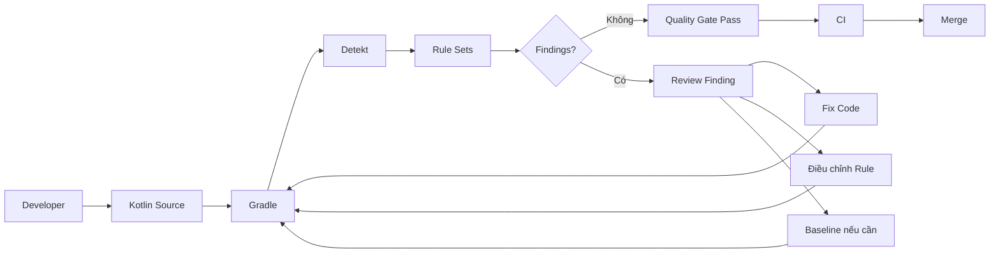

# 003 - Detekt

**Học phần:** 05 - Quality, Release and Portfolio
**Module:** Module 10 - Linting, Debugging and Benchmark
**Nhóm nội dung:** Linting
**Nguồn roadmap:** Linting, Debugging and Benchmark / Linting
**Loại bài:** quality
**Thứ tự trong module:** 003
**Thời lượng gợi ý:** 30 phút

---

## 1. Tóm tắt

**Detekt** là công cụ **static code analysis** dành cho Kotlin. Công cụ này phân tích source code mà không cần chạy ứng dụng, từ đó phát hiện các vấn đề như code smell, độ phức tạp cao, cấu trúc khó bảo trì, vi phạm convention hoặc một số pattern có nguy cơ tạo lỗi trong tương lai.

Trong Android project, Detekt không nằm trực tiếp trong UI, `ViewModel`, `Repository` hay data layer. Nó nằm ở **quality pipeline** bao quanh toàn bộ source code và thường được chạy thông qua Gradle trong quá trình phát triển local, pull request và CI.

Detekt hỗ trợ rule set có thể cấu hình, baseline cho code cũ, suppression, nhiều định dạng report và tích hợp trực tiếp với Gradle.

Mục tiêu của Detekt không phải là tạo ra càng nhiều cảnh báo càng tốt. Mục tiêu thực tế là:

* phát hiện vấn đề sớm;
* giữ code Kotlin nhất quán;
* giảm code smell;
* kiểm soát độ phức tạp;
* giảm chi phí review thủ công;
* ngăn code chất lượng thấp đi vào nhánh chính;
* tạo một quality gate có thể lặp lại trong CI.

Một rule chỉ có giá trị khi team hiểu **vấn đề nó đang bảo vệ** và có cách xử lý rõ ràng khi rule thất bại.

---

## 2. Mục tiêu học tập

Sau bài học này, người học có thể:

* giải thích Detekt và static analysis bằng ngôn ngữ của mình;
* phân biệt Detekt với Android Lint, Kotlin compiler và formatter;
* mô tả vị trí của Detekt trong Android development workflow;
* tích hợp Detekt vào Android project bằng Gradle;
* tạo và quản lý file cấu hình `detekt.yml`;
* chạy Detekt trên máy local;
* đọc finding và report;
* tích hợp Detekt vào CI;
* giải thích vai trò của baseline;
* nhận biết các lỗi thường gặp khi triển khai Detekt;
* thiết kế rule set có ích thay vì tạo quá nhiều cảnh báo;
* tạo artifact về static analysis để đưa vào portfolio.

---

## 3. Khái niệm cốt lõi

### 3.1. Static analysis và code smell

**Static analysis** là quá trình phân tích chương trình dựa trên source code hoặc representation của chương trình mà không cần chạy application theo user flow thực tế.

Ví dụ, Detekt có thể phân tích một hàm Kotlin và nhận ra rằng hàm đó:

* quá dài;
* có quá nhiều nhánh;
* chứa nhiều giá trị hard-code;
* có cấu trúc exception handling khó bảo trì;
* chứa naming hoặc coding convention không phù hợp;
* có độ phức tạp cao.

Đây không nhất thiết là lỗi compile.

Ví dụ:

```kotlin
fun calculateCheckout(
    subtotal: Double,
    isVip: Boolean,
    hasCoupon: Boolean,
    country: String
): Double {
    var result = subtotal

    if (isVip) {
        result *= 0.9
    }

    if (hasCoupon) {
        result -= 50
    }

    if (country == "VN") {
        result += 15
    }

    return result
}
```

Đoạn code trên hoàn toàn có thể compile và chạy.

Tuy nhiên, khi business logic phát triển, một hàm như vậy có thể dần trở thành:

```text
Compile được
      ↓
Chạy được
      ↓
Nhưng ngày càng phức tạp
      ↓
Khó review
      ↓
Khó test
      ↓
Khó sửa
      ↓
Rủi ro regression tăng
```

Detekt tập trung vào lớp vấn đề này.

### 3.2. Rule, finding và severity

Detekt hoạt động dựa trên các **rule**.

Một rule mô tả một pattern mà tool cần kiểm tra.

Ví dụ về các loại vấn đề thường được static analysis quan tâm:

* complexity;
* naming;
* style;
* exception handling;
* potential bugs;
* maintainability;
* duplicated hoặc redundant structure.

Khi source code vi phạm một rule, Detekt tạo ra một **finding**.

Có thể hình dung:

```text
Source code
    ↓
Rule
    ↓
Phát hiện pattern
    ↓
Finding
    ↓
Report / CI result
```

Không nên xem mọi finding là bug production.

Một finding có thể là:

* lỗi cần sửa ngay;
* code smell nên refactor;
* convention của team;
* vấn đề chấp nhận được trong một trường hợp đặc biệt.

Developer cần hiểu ngữ cảnh trước khi quyết định:

```text
Fix code
hoặc
Configure rule
hoặc
Suppress có lý do
hoặc
Đưa vào baseline tạm thời
```

### 3.3. Baseline và suppression

**Baseline** là danh sách những finding hiện tại được chấp nhận tạm thời.

Nó đặc biệt hữu ích khi đưa Detekt vào một project lớn đã tồn tại nhiều năm.

Ví dụ:

```text
Legacy project
    ↓
Chạy Detekt lần đầu
    ↓
1.500 findings
    ↓
Không thể sửa toàn bộ ngay
    ↓
Tạo baseline
    ↓
CI chỉ chặn finding mới
```

Detekt cung cấp task `detektBaseline` để tạo baseline và các task baseline riêng cho source set hoặc Android variant.

Ngoài baseline, Detekt cũng hỗ trợ suppression đối với những finding cụ thể.

> **Nguyên tắc:** Suppression phải là ngoại lệ có chủ đích, không phải phương pháp mặc định để làm cho pipeline trở lại màu xanh.

---

## 4. Vị trí của Detekt trong Android quality pipeline

Detekt bao quanh source code thay vì tham gia trực tiếp vào runtime architecture.



Flow trên cho thấy Detekt không thay thế architecture của ứng dụng.

Ví dụ một Android application vẫn có thể có:

```text
Compose UI
    ↓
ViewModel
    ↓
Use Case
    ↓
Repository
    ↓
Data Source
```

Detekt phân tích Kotlin source trong các tầng đó.

Nếu `ViewModel` quá phức tạp, Detekt có thể hỗ trợ phát hiện code smell.

Nếu `Repository` chứa method quá lớn, static analysis có thể cảnh báo.

Nếu utility code vi phạm coding convention, Detekt cũng có thể đưa ra finding.

Vì vậy, ảnh hưởng của Detekt đến UX chủ yếu là **gián tiếp**:

```text
Code dễ bảo trì hơn
        ↓
Review tốt hơn
        ↓
Regression ít hơn
        ↓
Release an toàn hơn
        ↓
UX ổn định hơn
```

---

## 5. Phân biệt Detekt với các công cụ liên quan

| Công cụ         | Vai trò chính                           | Phạm vi điển hình                            |
| --------------- | --------------------------------------- | -------------------------------------------- |
| Kotlin compiler | Kiểm tra cú pháp, type và tạo bytecode  | Kotlin language correctness                  |
| Detekt          | Static analysis và code smell           | Kotlin source                                |
| Android Lint    | Kiểm tra vấn đề đặc thù Android         | API, resource, Manifest, Android correctness |
| ktlint          | Kiểm tra và chuẩn hóa Kotlin code style | Formatting và style                          |
| Unit test       | Kiểm tra behavior của code              | Logic khi thực thi                           |
| UI test         | Kiểm tra user flow                      | Application runtime                          |

Không nên lựa chọn theo kiểu:

```text
Detekt hoặc Unit Test
```

Mà nên xây dựng nhiều lớp bảo vệ:

```text
Compiler
   ↓
Static Analysis
   ↓
Unit Test
   ↓
Integration Test
   ↓
UI Test
   ↓
Build
   ↓
Release
```

Ví dụ, Detekt có thể phát hiện một function quá phức tạp nhưng không biết function đó tính sai giá tiền.

Ngược lại, unit test có thể xác nhận kết quả tính tiền đúng nhưng không đảm bảo code dễ maintain.

Hai công cụ giải quyết hai lớp vấn đề khác nhau.

---

## 6. Cách Detekt hoạt động

### 6.1. Khi chạy trên máy local

Developer chạy:

```bash
./gradlew detekt
```

Flow cơ bản:

1. Gradle khởi tạo Detekt task.
2. Detekt đọc source Kotlin cần phân tích.
3. File cấu hình được tải.
4. Các rule được thực thi.
5. Finding được tổng hợp.
6. Report được sinh.
7. Task pass hoặc fail theo configuration.
8. Developer sửa code và chạy lại.

Detekt Gradle Plugin cũng có thể được nối với Gradle verification lifecycle. Trong Detekt `1.23.8`, task `detekt` được tích hợp với `check`.

Do đó có thể chạy:

```bash
./gradlew check
```

để thực hiện quality verification rộng hơn thay vì chỉ chạy Detekt.

### 6.2. Khi chạy trong CI

Flow trong CI thường là:

```text
Push / Pull Request
        ↓
CI Checkout
        ↓
Setup JDK
        ↓
Gradle
        ↓
Detekt
        ↓
Finding vượt quality gate?
     ┌──┴──┐
    Có   Không
     ↓      ↓
   Fail    Pass
     ↓      ↓
   Fix    Merge
```

Điểm quan trọng là developer và CI phải sử dụng cùng:

* source code;
* Detekt version;
* `detekt.yml`;
* baseline;
* Gradle configuration;
* JDK phù hợp.

Nếu local dùng một configuration nhưng CI dùng configuration khác, developer sẽ gặp tình trạng:

> Local pass nhưng CI fail.

---

## 7. Triển khai Detekt trong Android project

### 7.1. Chọn phiên bản

Tại ngày **26/08/2026**, repository chính thức đánh dấu `1.23.8` là release stable mới nhất, trong khi `2.0.0-alpha.6` phát hành ngày 04/08/2026 vẫn là pre-release. Detekt 2.0 đồng thời có breaking changes và sử dụng plugin ID mới `dev.detekt`.

Với project production cần ổn định, bài học này sử dụng:

```text
Detekt 1.23.8
```

Detekt `1.23.8` sử dụng Gradle plugin:

```text
io.gitlab.arturbosch.detekt
```

Trong khi Detekt `2.0.0-alpha.6` sử dụng:

```text
dev.detekt
```

Official documentation hiện tại của Detekt 2 thể hiện plugin ID `dev.detekt` và version `2.0.0-alpha.6`.

> **Lưu ý:** Không copy cấu hình Detekt 1.x sang Detekt 2.x một cách máy móc. Khi nâng major version, cần đọc migration guide và kiểm tra lại plugin ID, package, rule configuration và Gradle DSL.

### 7.2. Thêm Gradle plugin

Trong `build.gradle.kts` của module Android:

```kotlin
plugins {
    id("com.android.application")
    id("org.jetbrains.kotlin.android")
    id("io.gitlab.arturbosch.detekt") version "1.23.8"
}
```

Đây là plugin ID và version được tài liệu chính thức của Detekt `1.23.8` cung cấp cho Kotlin DSL.

Trong project sử dụng Version Catalog hoặc convention plugin, nên quản lý version tại một vị trí tập trung thay vì lặp lại version ở nhiều module.

### 7.3. Tạo configuration

Chạy:

```bash
./gradlew detektGenerateConfig
```

Detekt cung cấp `detektGenerateConfig` để sinh configuration mặc định mà developer có thể dùng làm điểm bắt đầu.

Sau đó nên đưa configuration về một vị trí nhất quán, ví dụ:

```text
project/
├── app/
├── config/
│   └── detekt/
│       └── detekt.yml
├── build.gradle.kts
└── settings.gradle.kts
```

Không nhất thiết phải bật hoặc chỉnh mọi rule.

Nên bắt đầu bằng các rule thực sự mang lại giá trị cho project.

Ví dụ cấu hình tối giản:

```yaml
complexity:
  LongMethod:
    active: true

style:
  MagicNumber:
    active: true
```

> **Lưu ý:** Khi chỉnh sâu threshold hoặc option của từng rule, hãy dựa trên configuration được sinh bởi đúng Detekt version của project. Điều này tránh copy option đã thay đổi hoặc deprecated từ tutorial cũ.

### 7.4. Kết nối configuration với Gradle

Trong `build.gradle.kts`:

```kotlin
detekt {
    toolVersion = "1.23.8"

    config.setFrom(
        files("$rootDir/config/detekt/detekt.yml")
    )

    buildUponDefaultConfig = true
    ignoreFailures = false
    basePath.set(rootDir)
}
```

`buildUponDefaultConfig` cho phép custom configuration được áp dụng trên default configuration thay vì vô tình thay thế toàn bộ default rule configuration. Detekt `1.23.8` cũng cung cấp `ignoreFailures`; khi đặt `false`, finding có thể làm verification task thất bại theo configuration hiện tại.

Với quality gate, thường không nên cấu hình:

```kotlin
ignoreFailures = true
```

chỉ để CI luôn pass.

Nếu rule gây quá nhiều finding, nên:

1. đánh giá rule;
2. chỉnh cấu hình;
3. refactor dần;
4. hoặc sử dụng baseline.

### 7.5. Chạy và đọc report

Chạy:

```bash
./gradlew detekt
```

Sau khi task hoàn tất, kiểm tra report trong thư mục build của module.

Detekt hỗ trợ nhiều dạng report như HTML, XML, Markdown và SARIF; cấu hình report có thể thay đổi theo Detekt version.

HTML thường tiện để developer đọc trực tiếp.

SARIF hữu ích khi CI platform hỗ trợ hiển thị static-analysis findings.

XML phù hợp cho các hệ thống quality tooling khác.

Markdown phù hợp nếu muốn đưa kết quả vào tài liệu hoặc artifact.

---

## 8. Ví dụ thực tế

### 8.1. Code trước khi cải thiện

Giả sử một application có logic xử lý order:

```kotlin
data class Order(
    val subtotal: Double,
    val isVip: Boolean,
    val hasCoupon: Boolean
)

class CheckoutCalculator {

    fun calculate(order: Order): Double {
        var result = order.subtotal

        if (order.isVip) {
            result *= 0.9
        }

        if (order.hasCoupon) {
            result -= 50
        }

        if (result < 0) {
            result = 0.0
        }

        return result
    }
}
```

Code này chưa chắc có bug.

Nhưng các giá trị:

```text
0.9
50
0.0
```

đang chứa business meaning trực tiếp trong implementation.

Trong một rule set phù hợp, static analysis có thể khiến developer xem xét lại những magic value như vậy.

### 8.2. Code sau khi cải thiện

Có thể refactor thành:

```kotlin
private const val VIP_DISCOUNT_RATE = 0.9
private const val COUPON_DISCOUNT = 50.0
private const val MINIMUM_TOTAL = 0.0

data class Order(
    val subtotal: Double,
    val isVip: Boolean,
    val hasCoupon: Boolean
)

class CheckoutCalculator {

    fun calculate(order: Order): Double {
        var result = applyVipDiscount(order)
        result = applyCoupon(result, order)
        return result.coerceAtLeast(MINIMUM_TOTAL)
    }

    private fun applyVipDiscount(order: Order): Double {
        return if (order.isVip) {
            order.subtotal * VIP_DISCOUNT_RATE
        } else {
            order.subtotal
        }
    }

    private fun applyCoupon(
        currentTotal: Double,
        order: Order
    ): Double {
        return if (order.hasCoupon) {
            currentTotal - COUPON_DISCOUNT
        } else {
            currentTotal
        }
    }
}
```

Điểm quan trọng không phải là:

> Detekt bắt developer phải chia mọi function thành nhiều function nhỏ.

Điểm quan trọng là static analysis tạo feedback để developer đặt câu hỏi:

* Logic này có đang quá phức tạp không?
* Magic value có business meaning không?
* Code có dễ test không?
* Code có dễ thay đổi khi requirement thay đổi không?
* Một developer khác có hiểu code nhanh không?

---

## 9. Tích hợp Detekt với CI

Detekt nên được chạy cả:

```text
Local
+
CI
```

Local giúp feedback nhanh.

CI đảm bảo không ai có thể bỏ qua quality check do quên chạy tool.

Trong một CI workflow đã có bước checkout source và setup JDK, có thể thêm:

```yaml
- name: Run Detekt
  run: ./gradlew detekt
```

Hoặc nếu project muốn chạy toàn bộ verification:

```yaml
- name: Run verification
  run: ./gradlew check
```

Một pipeline có thể tổ chức như sau:

```text
Pull Request
    ↓
Compile
    ↓
Detekt
    ↓
Android Lint
    ↓
Unit Tests
    ↓
Build
    ↓
Quality Gate
    ↓
Merge
```

Không nên để Detekt chỉ chạy trên máy của một developer.

Nếu rule là tiêu chuẩn của team, CI phải là nguồn kiểm tra cuối cùng.

---

## 10. Sử dụng baseline cho project cũ

### 10.1. Khi nào nên dùng baseline

Baseline phù hợp khi:

* project đã tồn tại lâu;
* mới bắt đầu áp dụng Detekt;
* lượng finding hiện tại quá lớn;
* không thể refactor toàn bộ project trong một pull request;
* team vẫn muốn chặn code smell mới ngay lập tức.

Ví dụ:

```text
Project hiện tại
    ↓
850 findings
    ↓
Tạo baseline
    ↓
850 findings cũ được ghi nhận
    ↓
Developer viết code mới
    ↓
Finding mới xuất hiện
    ↓
CI fail
```

Như vậy team có thể cải thiện chất lượng từng bước mà không phải dừng toàn bộ development để sửa legacy code.

### 10.2. Quy trình baseline

Tạo baseline:

```bash
./gradlew detektBaseline
```

Sau đó commit baseline vào repository nếu đó là chính sách chung của project.

Quy trình dài hạn nên là:

```text
Baseline ban đầu
      ↓
Refactor legacy code
      ↓
Finding cũ biến mất
      ↓
Cập nhật baseline
      ↓
Baseline nhỏ dần
      ↓
Không còn baseline nếu có thể
```

Baseline không nên trở thành nơi chứa code smell vĩnh viễn.

> **Best practice:** Baseline nên giảm dần theo thời gian, không tăng đều sau mỗi sprint.

---

## 11. Lỗi thường gặp

### 11.1. Local pass nhưng CI fail

**Hiện tượng:** Developer chạy Detekt trên máy local thành công nhưng pipeline CI thất bại.

**Nguyên nhân có thể:**

* khác JDK;
* khác Gradle configuration;
* CI không sử dụng đúng `detekt.yml`;
* baseline chưa được commit;
* file chưa được commit;
* version Detekt khác;
* local chỉ chạy một task trong khi CI chạy nhiều task hơn.

**Cách xử lý:**

Kiểm tra:

```bash
./gradlew --version
```

Sau đó chạy đúng command mà CI đang chạy:

```bash
./gradlew detekt
```

hoặc:

```bash
./gradlew check
```

Không debug bằng giả định rằng local và CI đang thực hiện cùng một quy trình.

### 11.2. Detekt tạo quá nhiều finding

**Hiện tượng:** Sau khi thêm Detekt, project xuất hiện hàng trăm hoặc hàng nghìn finding.

**Nguyên nhân:** Áp dụng rule set quá nghiêm lên một codebase cũ.

**Cách xử lý:**

* ưu tiên rule quan trọng;
* dùng baseline cho legacy code;
* sửa dần theo module;
* điều chỉnh threshold có lý do;
* tạo technical debt task cho code cũ.

Không nên giải quyết bằng:

```kotlin
ignoreFailures = true
```

rồi coi như Detekt đã được tích hợp thành công.

### 11.3. Suppress mọi finding

**Hiện tượng:** Source code xuất hiện nhiều suppression chỉ để pipeline pass.

Ví dụ:

```kotlin
@Suppress("SomeRule")
fun complexFunction() {
    // ...
}
```

**Nguyên nhân:** Team đang xử lý symptom thay vì xử lý nguyên nhân.

Trước khi suppress, cần hỏi:

1. Rule có phù hợp với project không?
2. Code có thể refactor không?
3. Đây có thực sự là false positive không?
4. Có thể điều chỉnh rule ở cấp project không?
5. Lý do suppression có đủ rõ cho code review không?

Suppression chỉ nên được sử dụng khi có lý do kỹ thuật cụ thể.

---

## 12. Best practices

* Chạy Detekt cả local và CI.
* Pin Detekt version thay vì phụ thuộc vào version không kiểm soát.
* Commit `detekt.yml` vào source control.
* Commit baseline nếu baseline là một phần của quality policy.
* Review thay đổi `detekt.yml` giống như review source code.
* Không bật hàng loạt rule chỉ để project trông nghiêm ngặt.
* Ưu tiên rule liên quan đến maintainability và defect risk.
* Không dùng `ignoreFailures = true` như trạng thái production lâu dài.
* Không suppress finding nếu chưa hiểu nguyên nhân.
* Khi suppress, ghi rõ lý do nếu context không hiển nhiên.
* Đưa static analysis vào pull request pipeline.
* Không để generated code làm nhiễu report nếu code đó không phải responsibility của team.
* Theo dõi số lượng baseline finding và cố gắng giảm dần.
* Tránh thay đổi hàng chục rule cùng lúc nếu team chưa đánh giá impact.
* Cập nhật Detekt có kiểm soát và đọc migration guide khi chuyển major version.
* Không đánh giá developer bằng số finding cá nhân.
* Xem static analysis là feedback engineering, không phải hệ thống phạt developer.

---

## 13. Kiểm thử và debugging

### 13.1. Kiểm thử cấu hình Detekt

Một cách đơn giản để xác minh pipeline:

1. Chọn một rule đang bật.
2. Tạo một đoạn code cố tình vi phạm rule.
3. Chạy:

```bash
./gradlew detekt
```

4. Xác nhận Detekt tạo finding.
5. Kiểm tra report.
6. Sửa code.
7. Chạy lại.
8. Xác nhận finding biến mất.

Không nên chỉ kiểm tra:

> `./gradlew detekt` chạy mà không crash.

Mục tiêu quan trọng hơn là xác nhận:

> Quality gate thực sự phát hiện loại vấn đề mà team muốn kiểm soát.

### 13.2. Debug khi task gặp lỗi

Các command hữu ích:

```bash
./gradlew detekt --stacktrace
```

```bash
./gradlew detekt --info
```

```bash
./gradlew detekt --debug
```

Nên bắt đầu với `--stacktrace` hoặc `--info`.

`--debug` tạo lượng log lớn hơn và chỉ nên dùng khi cần điều tra sâu.

Khi gặp lỗi liên quan version hoặc runtime, kiểm tra:

```bash
./gradlew --version
```

và đối chiếu:

* JDK;
* Gradle;
* Kotlin;
* Android Gradle Plugin;
* Detekt.

Detekt phụ thuộc chặt vào Kotlin compiler, vì vậy version compatibility cần được xem xét khi project thay đổi toolchain.

---

## 14. Liên hệ với các bài và kỹ năng khác

Detekt là một phần của quality engineering rộng hơn:

```text
Kotlin Code
    ↓
Detekt
    ↓
Android Lint
    ↓
Unit Test
    ↓
Debugging
    ↓
Benchmark
    ↓
CI
    ↓
Release
```

Mối liên hệ chính:

* **Kotlin:** Detekt phân tích Kotlin source.
* **Gradle:** Gradle là cơ chế phổ biến để chạy Detekt trong Android project.
* **Android Lint:** bổ sung các kiểm tra đặc thù Android.
* **Testing:** xác minh behavior mà static analysis không thể chứng minh.
* **Debugging:** điều tra lỗi runtime.
* **Benchmark:** đo performance thực tế thay vì suy luận từ code structure.
* **CI/CD:** biến Detekt thành automated quality gate.
* **Code Review:** report của Detekt giảm số vấn đề cơ học reviewer phải tìm thủ công.
* **Release:** quality check thất bại có thể ngăn code chưa đạt tiêu chuẩn đi vào release branch.

Detekt không thay thế bất kỳ lớp nào ở trên.

Nó là một lớp phòng vệ bổ sung.

---

## 15. Bài thực hành

### 15.1. Yêu cầu

Tạo hoặc sử dụng một Android project Kotlin nhỏ và tích hợp Detekt.

Project cần có:

* Detekt Gradle Plugin;
* file `detekt.yml`;
* ít nhất một rule được cấu hình có chủ đích;
* ít nhất một đoạn code tạo finding;
* một commit sửa finding;
* command chạy Detekt;
* report Detekt;
* ghi chú ngắn mô tả finding.

### 15.2. Gợi ý triển khai

Bước 1: thêm Detekt vào project.

Bước 2: chạy:

```bash
./gradlew detektGenerateConfig
```

Bước 3: đặt configuration vào:

```text
config/detekt/detekt.yml
```

Bước 4: cấu hình Gradle sử dụng file đó.

Bước 5: chạy:

```bash
./gradlew detekt
```

Bước 6: chọn một finding và ghi lại:

```text
Rule:
File:
Vị trí:
Tại sao bị cảnh báo:
Rủi ro:
Cách sửa:
```

Bước 7: sửa code.

Bước 8: chạy lại:

```bash
./gradlew detekt
```

Bước 9: lưu screenshot hoặc report trước và sau khi sửa.

Bước 10: thêm bước Detekt vào CI nếu project có pipeline.

### 15.3. Kết quả mong đợi

Sau bài thực hành, repository nên có cấu trúc tương tự:

```text
android-detekt-demo/
├── app/
│   └── src/
├── config/
│   └── detekt/
│       └── detekt.yml
├── docs/
│   ├── detekt-before.png
│   ├── detekt-after.png
│   └── detekt-notes.md
├── build.gradle.kts
├── settings.gradle.kts
└── README.md
```

Người khác clone project phải có khả năng chạy:

```bash
./gradlew detekt
```

và hiểu quality check đang bảo vệ điều gì.

---

## 16. Artifact cho portfolio

Artifact phù hợp cho bài này là một **Android Static Analysis Demo**.

Artifact nên chứa:

* Android project bằng Kotlin;
* Detekt configuration;
* Gradle integration;
* CI quality-check step;
* một ví dụ code smell;
* phiên bản code đã refactor;
* report hoặc screenshot;
* README giải thích quyết định cấu hình.

README nên trả lời được:

```text
Detekt được dùng để làm gì?
        ↓
Rule nào được bật?
        ↓
Tại sao chọn rule đó?
        ↓
Finding trông như thế nào?
        ↓
Code được sửa ra sao?
        ↓
CI phản ứng thế nào khi có finding?
```

Một artifact tốt không chỉ chứng minh:

> Tôi biết cài Detekt.

Nó nên chứng minh:

> Tôi hiểu cách đưa static analysis vào engineering workflow và biến nó thành một quality gate có giá trị.

---

## 17. Câu hỏi tự kiểm tra

1. Vì sao Detekt không thể thay thế unit test?
2. Static analysis khác runtime debugging ở điểm nào?
3. Khi nào baseline phù hợp hơn việc sửa toàn bộ finding ngay lập tức?
4. Vì sao `ignoreFailures = true` có thể khiến việc tích hợp Detekt trở nên hình thức?
5. Tại sao một rule tạo nhiều finding chưa chắc là một rule tốt cho project?
6. Detekt khác Android Lint ở phạm vi phân tích như thế nào?
7. Vì sao local và CI nên sử dụng cùng configuration?
8. Khi nào suppression là hợp lý và khi nào nó trở thành technical debt?
9. Vì sao nâng Detekt từ major version cũ lên major version mới cần kiểm tra migration guide?
10. Detekt ảnh hưởng gián tiếp đến release risk như thế nào?

---

## 18. Checklist hoàn thành

* [ ] Tôi giải thích được Detekt là gì.
* [ ] Tôi giải thích được static analysis là gì.
* [ ] Tôi phân biệt được Detekt với Kotlin compiler.
* [ ] Tôi phân biệt được Detekt với Android Lint.
* [ ] Tôi phân biệt được Detekt với unit test.
* [ ] Tôi biết Detekt nằm ở đâu trong Android quality pipeline.
* [ ] Tôi đã thêm Detekt vào một Kotlin/Android project.
* [ ] Tôi có file `detekt.yml`.
* [ ] Tôi chạy được `./gradlew detekt`.
* [ ] Tôi đọc được ít nhất một finding.
* [ ] Tôi hiểu vì sao finding đó xuất hiện.
* [ ] Tôi sửa được code và làm finding biến mất.
* [ ] Tôi hiểu mục đích của baseline.
* [ ] Tôi biết khi nào không nên suppress finding.
* [ ] Tôi biết cách đưa Detekt vào CI.
* [ ] Tôi đã lưu report hoặc screenshot làm bằng chứng.
* [ ] Tôi có README mô tả quality workflow.
* [ ] Tôi có artifact có thể đưa vào portfolio.

---

## 19. Tổng kết

Detekt là công cụ static analysis dành cho Kotlin, giúp đưa việc kiểm tra code smell, complexity và coding convention vào một quy trình tự động.

Trong Android development, Detekt không tham gia trực tiếp vào runtime flow của ứng dụng mà hoạt động ở tầng quality:

```text
Source Code
    ↓
Static Analysis
    ↓
Finding
    ↓
Developer Feedback
    ↓
CI Quality Gate
    ↓
Safer Merge
    ↓
Safer Release
```

Những điểm quan trọng cần nhớ:

* Detekt bổ sung cho compiler, Android Lint và testing chứ không thay thế chúng.
* Rule phải phục vụ mục tiêu engineering cụ thể.
* Detekt nên chạy cả local và CI.
* Configuration phải được quản lý bằng source control.
* Baseline là công cụ chuyển đổi cho legacy project, không phải nơi giấu technical debt.
* Suppression phải có lý do.
* Không nên làm CI pass bằng cách tắt quality gate.
* Version và migration cần được kiểm soát khi nâng Detekt.
* Artifact tốt nhất cho bài này là một Android project có static-analysis workflow hoàn chỉnh từ source code đến CI và report.

Mục tiêu cuối cùng không phải là đạt:

```text
0 warning bằng mọi giá
```

mà là xây dựng:

```text
Feedback sớm
    ↓
Code dễ bảo trì
    ↓
Review hiệu quả
    ↓
Ít regression
    ↓
Release đáng tin cậy hơn
```
