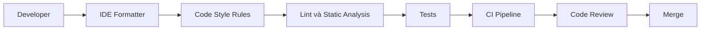
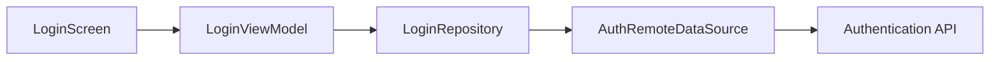
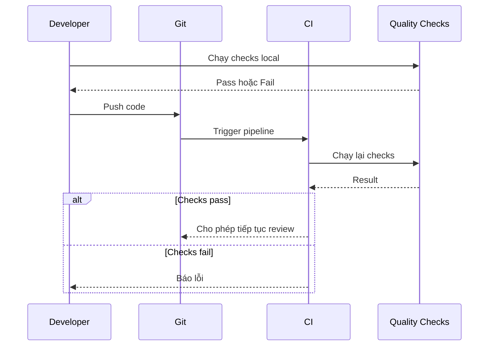

# 004 - Code Style

**Học phần:** 05 - Quality, Release and Portfolio
**Module:** Module 10 - Linting, Debugging and Benchmark
**Nhóm nội dung:** Linting
**Nguồn roadmap:** Linting, Debugging and Benchmark / Linting
**Loại bài:** quality
**Thứ tự trong module:** 004
**Thời lượng gợi ý:** 30 phút

---

## 1. Tóm tắt

**Code Style** là tập hợp các quy tắc giúp source code có cách trình bày và tổ chức nhất quán: đặt tên, thụt lề, khoảng trắng, độ dài hàm, cách sắp xếp thành phần, cách biểu diễn trạng thái và nhiều quy ước khác.

Trong Android, Code Style không chỉ liên quan đến việc code "đẹp". Một codebase nhất quán giúp:

* giảm thời gian đọc và review code;
* hạn chế tranh luận về format trong Pull Request;
* phát hiện sớm một số dấu hiệu code khó bảo trì;
* hỗ trợ refactor an toàn hơn;
* giúp developer mới hiểu project nhanh hơn;
* tự động hóa kiểm tra chất lượng trong CI;
* giảm nguy cơ những thay đổi khó đọc đi vào production.

Code Style là một phần của quá trình **quality assurance** và thường được kết hợp với:

* IDE formatter;
* `.editorconfig`;
* Android Lint;
* `ktlint`;
* `detekt`;
* unit test;
* code review;
* CI pipeline.

Mục tiêu không phải tạo thật nhiều quy tắc mà là xây dựng một hệ thống kiểm tra **nhất quán, tự động và có giá trị thực tế**.

---

## 2. Mục tiêu học tập

Sau bài học, người học có thể:

* giải thích Code Style là gì và tại sao nó quan trọng trong dự án Android;
* phân biệt Code Style, formatter, lint và static analysis;
* nhận biết những vấn đề phổ biến về naming, formatting và cấu trúc Kotlin;
* sử dụng `.editorconfig` để chia sẻ một số quy tắc giữa các developer;
* chạy kiểm tra Android Lint từ Gradle;
* hiểu vai trò của `ktlint` và `detekt` trong hệ thống quality;
* thiết kế flow kiểm tra Code Style từ máy developer đến CI;
* phân tích một lỗi style và xác định cách khắc phục;
* thêm một quality check có thể chạy lặp lại vào project;
* tạo artifact Code Style phù hợp để đưa vào portfolio.

---

## 3. Khái niệm cốt lõi

### 3.1. Code Style là gì?

Code Style mô tả cách source code nên được viết và trình bày để toàn bộ codebase có cùng một ngôn ngữ hình thức.

Ví dụ, một team có thể thống nhất:

* class dùng `PascalCase`;
* function và variable dùng `camelCase`;
* constant dùng `UPPER_SNAKE_CASE`;
* không sử dụng wildcard import;
* không để trailing whitespace;
* ưu tiên expression đơn giản thay vì code lồng nhiều tầng;
* không đặt tên biến không có ý nghĩa như `a`, `b`, `temp1`;
* tránh function quá dài;
* tránh class đảm nhiệm quá nhiều trách nhiệm.

Ví dụ:

```kotlin
class UserProfileViewModel : ViewModel() {

    private val _uiState = MutableStateFlow(UserProfileUiState())
    val uiState = _uiState.asStateFlow()

    fun loadUserProfile() {
        // ...
    }
}
```

Tên của `UserProfileViewModel`, `uiState` và `loadUserProfile()` cho phép người đọc suy luận khá rõ trách nhiệm của từng thành phần.

Một phiên bản khó đọc hơn:

```kotlin
class UVM : ViewModel() {

    private val _x = MutableStateFlow(UserProfileUiState())
    val x = _x.asStateFlow()

    fun run() {
        // ...
    }
}
```

Hai đoạn code có thể hoạt động giống nhau, nhưng phiên bản thứ hai tạo chi phí bảo trì cao hơn vì ý nghĩa bị che giấu.

### 3.2. Code Style không chỉ là formatting

Formatting chỉ là một phần của Code Style.

Ví dụ formatting:

```kotlin
val user = repository.getUser()
```

thay vì:

```kotlin
val user=repository.getUser()
```

Nhưng Code Style còn bao gồm những vấn đề sâu hơn như:

```kotlin
fun doEverything() {
    // Fetch network data
    // Save database
    // Transform model
    // Update UI state
    // Send analytics
    // Retry request
}
```

Đoạn code trên có thể được formatter xử lý hoàn hảo nhưng vẫn có vấn đề về:

* trách nhiệm của function;
* khả năng test;
* maintainability;
* coupling;
* độ phức tạp.

Do đó, Code Style cần được kết hợp với static analysis và code review.

---

## 4. Vì sao Code Style quan trọng trong Android?

Android project thường có nhiều tầng và nhiều loại source code:

```text
UI
↓
ViewModel
↓
Domain
↓
Repository
↓
Data Source
↓
Database / Network / Android Framework
```

Nếu mỗi developer sử dụng một cách viết khác nhau, project nhanh chóng trở nên khó đọc.

Ví dụ một project có thể đồng thời xuất hiện:

```kotlin
fun get_user()
```

```kotlin
fun GetUser()
```

```kotlin
fun getUser()
```

```kotlin
fun loadUsr()
```

Việc thiếu convention khiến người đọc phải dành thời gian hiểu cách viết thay vì tập trung vào business logic.

Code Style giúp biến codebase thành một hệ thống có quy luật.

Một developer khi nhìn thấy:

```kotlin
UserRepository
UserRemoteDataSource
UserLocalDataSource
UserUiState
UserViewModel
```

có thể nhanh chóng hiểu vai trò của các thành phần dù chưa đọc toàn bộ implementation.

---

## 5. Vị trí của Code Style trong hệ thống quality

Code Style là một **cross-cutting concern**, nghĩa là nó không thuộc riêng UI, domain hay data layer mà áp dụng cho toàn bộ source code.



Flow trên thể hiện nhiều lớp bảo vệ:

1. Developer viết code trong Android Studio.
2. Formatter xử lý các vấn đề trình bày đơn giản.
3. Style rules kiểm tra convention.
4. Lint và static analysis tìm vấn đề sâu hơn.
5. Test kiểm tra hành vi.
6. CI chạy lại toàn bộ kiểm tra.
7. Reviewer tập trung vào kiến trúc và business logic.
8. Chỉ code đạt yêu cầu mới được merge.

Điểm quan trọng là các lỗi đơn giản nên được phát hiện bằng công cụ tự động thay vì để reviewer kiểm tra thủ công.

---

## 6. Các thành phần của hệ thống Code Style

### 6.1. IDE Formatter và `.editorconfig`

Android Studio có formatter giúp chuẩn hóa:

* indentation;
* khoảng trắng;
* line wrapping;
* imports;
* một số quy tắc Kotlin.

`.editorconfig` cho phép lưu một số quy tắc ngay trong repository để nhiều IDE có thể sử dụng cùng convention.

Ví dụ:

```properties
root = true

[*]
charset = utf-8
end_of_line = lf
insert_final_newline = true
trim_trailing_whitespace = true

[*.{kt,kts}]
indent_style = space
indent_size = 4
```

File này thường đặt tại root của project:

```text
my-android-app/
├── .editorconfig
├── app/
├── build.gradle.kts
├── settings.gradle.kts
└── gradlew
```

Nhờ đó, các thành viên trong team không phải cấu hình thủ công từng IDE theo những quy tắc cơ bản.

### 6.2. Lint và Static Analysis

Formatter chủ yếu thay đổi hình thức trình bày.

Lint và static analysis có thể phát hiện những vấn đề rộng hơn.

Các công cụ thường gặp trong Android/Kotlin gồm:

| Công cụ         | Vai trò chính                   |
| --------------- | ------------------------------- |
| IDE Formatter   | Tự động format source code      |
| `.editorconfig` | Chia sẻ convention cơ bản       |
| Android Lint    | Phân tích các vấn đề Android    |
| `ktlint`        | Kiểm tra và format Kotlin style |
| `detekt`        | Static analysis cho Kotlin      |
| Compiler        | Phát hiện lỗi cú pháp và type   |
| Unit Test       | Kiểm tra hành vi của code       |

Không nên xem các công cụ này là những lựa chọn loại trừ nhau.

Một project thực tế có thể sử dụng nhiều lớp kiểm tra cùng lúc.

---

## 7. Naming Convention trong Kotlin

Tên tốt phải giúp người đọc hiểu mục đích của code mà không cần đọc implementation quá sâu.

### 7.1. Class và interface

Thông thường sử dụng `PascalCase`.

```kotlin
class ProductRepository

class CheckoutViewModel

interface PaymentGateway
```

Tên nên thể hiện trách nhiệm.

Không nên:

```kotlin
class Manager

class Helper

class Utils
```

nếu các tên đó không mô tả chính xác chức năng.

Tên tốt hơn có thể là:

```kotlin
class SessionManager

class ImageCompressionHelper

class DateFormatter
```

### 7.2. Function và variable

Sử dụng `camelCase`.

```kotlin
val currentUser = repository.getCurrentUser()

fun loadProducts() {
    // ...
}
```

Tên function nên mô tả hành động.

Ví dụ:

```kotlin
fun validateEmail()
fun refreshToken()
fun syncProducts()
fun deleteAccount()
```

Thay vì:

```kotlin
fun process()
fun handle()
fun execute()
```

Các tên chung như `process()` hoặc `handle()` chỉ nên sử dụng khi context đã đủ rõ.

---

## 8. Code Style với Android Architecture

Code Style nên phản ánh vai trò kiến trúc.

Ví dụ với một feature đăng nhập:

```text
LoginScreen
LoginViewModel
LoginUiState
LoginRepository
AuthRemoteDataSource
LoginRequest
LoginResponse
```

Cách đặt tên nhất quán giúp developer suy luận dependency:



Nếu project lại sử dụng các tên:

```text
LoginScreen
Manager1
HelperAuth
APIThing
DataObject
```

thì mối quan hệ kiến trúc trở nên khó nhận biết hơn.

Code Style tốt vì vậy cũng hỗ trợ **architectural readability**.

---

## 9. Ví dụ Code Style trong ViewModel

Giả sử cần tải danh sách sản phẩm.

Một cách viết khó bảo trì:

```kotlin
class VM(
    private val r: ProductRepository
) : ViewModel() {

    val x = MutableStateFlow<List<Product>>(emptyList())

    fun run() {
        viewModelScope.launch {
            try {
                x.value = r.get()
            } catch (e: Exception) {
                e.printStackTrace()
            }
        }
    }
}
```

Đoạn code có một số vấn đề về readability:

* `VM` không cho biết đây là ViewModel nào;
* `r` không thể hiện dependency;
* `x` không nói lên đây là state gì;
* `run()` không diễn tả hành động;
* mutable state được expose trực tiếp;
* lỗi chỉ được `printStackTrace()`.

Một phiên bản rõ ràng hơn:

```kotlin
class ProductListViewModel(
    private val productRepository: ProductRepository
) : ViewModel() {

    private val _uiState =
        MutableStateFlow<ProductListUiState>(ProductListUiState.Loading)

    val uiState: StateFlow<ProductListUiState> = _uiState.asStateFlow()

    fun loadProducts() {
        viewModelScope.launch {
            _uiState.value = ProductListUiState.Loading

            _uiState.value = try {
                val products = productRepository.getProducts()
                ProductListUiState.Success(products)
            } catch (exception: Exception) {
                ProductListUiState.Error(
                    message = exception.message ?: "Không thể tải sản phẩm"
                )
            }
        }
    }
}
```

Ví dụ này không chỉ dễ đọc hơn mà còn giúp người đọc nhanh chóng nhận ra:

* dependency;
* state;
* event;
* failure path;
* lifecycle scope.

> **Lưu ý:** Code Style không thể thay thế architecture. Việc đổi tên biến không biến một thiết kế kém thành thiết kế tốt, nhưng convention tốt giúp các vấn đề kiến trúc dễ được nhìn thấy hơn.

---

## 10. Android Lint

Android Lint là công cụ static analysis được tích hợp trong Android build system.

Nó có thể phát hiện nhiều loại vấn đề liên quan đến:

* Android API;
* resources;
* accessibility;
* manifest;
* performance;
* correctness;
* internationalization;
* security;
* usability.

Có thể chạy lint bằng Gradle:

```bash
./gradlew lint
```

Trong project nhiều module, có thể chạy task cụ thể của module hoặc variant tùy cấu hình project.

Một flow đơn giản:

```text
Source code
    ↓
Gradle
    ↓
Android Lint
    ↓
Lint report
    ↓
Developer sửa lỗi
```

Lint nên được xem là một quality gate chứ không chỉ là công cụ chạy khi chuẩn bị release.

---

## 11. `ktlint` và `detekt`

### 11.1. `ktlint`

`ktlint` tập trung mạnh vào Kotlin coding style và formatting.

Nó phù hợp với các vấn đề như:

* whitespace;
* indentation;
* import;
* formatting;
* style convention.

Một số integration còn hỗ trợ tự động format source code.

Conceptual flow:

```text
Kotlin source
    ↓
ktlint check
    ↓
Violation?
    ├── Có → Fail
    └── Không → Pass
```

### 11.2. `detekt`

`detekt` tập trung nhiều hơn vào static analysis.

Nó có thể được sử dụng để nhận biết các dấu hiệu như:

* function quá phức tạp;
* class quá lớn;
* code smell;
* exception handling không phù hợp;
* naming không nhất quán;
* code có khả năng khó bảo trì.

Có thể hiểu đơn giản:

```text
Formatter
    ↓
"Code có được trình bày nhất quán không?"

ktlint
    ↓
"Kotlin có tuân thủ style rules không?"

detekt
    ↓
"Code có dấu hiệu thiết kế hoặc maintainability đáng chú ý không?"

Android Lint
    ↓
"Code Android có vấn đề về correctness, API, resource hoặc platform không?"
```

Các công cụ bổ sung cho nhau thay vì thay thế hoàn toàn lẫn nhau.

---

## 12. Local Check và CI Check

Một nguyên tắc quan trọng là cùng một quality check nên có thể chạy:

* trên máy developer;
* trong CI.

Flow lý tưởng:



Developer nên có khả năng chạy những command giống CI trước khi push.

Ví dụ:

```bash
./gradlew lint test
```

Nếu project đã tích hợp thêm các static analysis task, chúng cũng nên được đưa vào quality pipeline tương ứng.

---

## 13. Code Style và Code Review

Code review không nên dành phần lớn thời gian cho các comment như:

> Thừa một khoảng trắng.

> Dòng này cần xuống dòng.

> Import này phải sắp xếp lại.

> Thiếu newline ở cuối file.

Những vấn đề có thể xác định bằng máy nên được tự động hóa.

Reviewer nên dành thời gian cho:

* business logic;
* architecture;
* concurrency;
* lifecycle;
* state management;
* security;
* error handling;
* performance;
* test coverage;
* backward compatibility.

Một hệ thống Code Style tốt làm giảm **review noise**.

Điều này đặc biệt quan trọng khi Pull Request lớn hoặc team có nhiều developer.

---

## 14. Lỗi thường gặp

### 14.1. Chỉ format code nhưng không kiểm tra quality

**Hiện tượng:** Code nhìn rất đẹp nhưng function dài hàng trăm dòng hoặc class có quá nhiều trách nhiệm.

**Nguyên nhân:** Team đồng nhất formatting với quality.

**Cách xử lý:**

* dùng formatter cho formatting;
* dùng static analysis cho code smell;
* dùng review cho architecture;
* dùng test cho behavior.

### 14.2. Có rule nhưng chỉ chạy thủ công

**Hiện tượng:** Developer A chạy lint trước khi commit nhưng developer B quên chạy.

**Nguyên nhân:** Quality check phụ thuộc vào thói quen cá nhân.

**Cách xử lý:** Chạy lại các check quan trọng trong CI.

### 14.3. Bật quá nhiều rule ngay lập tức

**Hiện tượng:** Project cũ sinh hàng trăm hoặc hàng nghìn violation.

**Nguyên nhân:** Áp một rule set quá nghiêm ngặt lên legacy code.

**Cách xử lý:**

1. Xác định nhóm lỗi quan trọng.
2. Ưu tiên correctness trước style nhỏ.
3. Chuẩn hóa code mới.
4. Refactor code cũ từng phần.
5. Tăng mức kiểm tra dần khi codebase ổn định.

### 14.4. Disable warning thay vì sửa nguyên nhân

Ví dụ:

```kotlin
@Suppress("SomeWarning")
fun doSomething() {
    // ...
}
```

Suppress có thể hợp lý trong một số trường hợp nhưng không nên trở thành phản xạ mặc định.

Trước khi suppress cần trả lời:

* rule đang cảnh báo điều gì;
* warning có thực sự không áp dụng ở đây không;
* có thể sửa code để loại bỏ nguyên nhân không;
* lý do suppress có cần ghi chú không.

### 14.5. Style rule gây tranh luận liên tục

Nếu một rule liên tục tạo tranh luận nhưng gần như không mang lại giá trị về:

* readability;
* correctness;
* maintainability;
* consistency;

team nên xem xét lại rule thay vì giữ nó chỉ vì "quy định là vậy".

---

## 15. Best practices

* Đặt các convention dùng chung trong repository thay vì chỉ cấu hình IDE cá nhân.
* Tự động hóa những quy tắc máy có thể kiểm tra.
* Chạy quality checks trước khi merge.
* Giữ command local và command CI càng giống nhau càng tốt.
* Ưu tiên rule có tác động đến readability, correctness và maintainability.
* Không thêm hàng loạt rule chỉ để tăng số lượng kiểm tra.
* Đặt tên class, function và variable theo trách nhiệm.
* Tránh abbreviation khó hiểu.
* Tránh function quá dài và quá nhiều nested branch.
* Không sử dụng formatter để che giấu vấn đề architecture.
* Không disable lint toàn project chỉ vì một số warning.
* Nếu cần suppress, giới hạn phạm vi suppress nhỏ nhất có thể.
* Review rule set định kỳ khi project thay đổi.
* Đảm bảo developer mới có thể tìm thấy hướng dẫn chạy quality checks trong `README.md` hoặc tài liệu development.

---

## 16. Tác động đến lifecycle, state và user experience

Code Style không trực tiếp điều khiển lifecycle nhưng convention kém có thể khiến các lỗi lifecycle khó nhận ra hơn.

Ví dụ:

```kotlin
class ProductViewModel : ViewModel() {

    fun x() {
        // ...
    }
}
```

Tên `x()` không giúp reviewer biết function này:

* load state;
* refresh data;
* retry request;
* clear state;
* submit dữ liệu.

Một API rõ ràng hơn:

```kotlin
fun loadProducts()

fun refreshProducts()

fun retryLoading()

fun clearError()
```

giúp state transition dễ đọc hơn.

Tương tự, sử dụng tên rõ ràng:

```kotlin
isLoading
isRefreshing
errorMessage
selectedProduct
```

tốt hơn các tên:

```kotlin
flag1
flag2
text
data
```

Readability ảnh hưởng gián tiếp đến độ ổn định sản phẩm vì developer có khả năng phát hiện lỗi logic sớm hơn.

---

## 17. Testing và quality checks

Code Style không thay thế testing.

Một quality pipeline tốt có nhiều lớp:

| Kiểm tra         | Ví dụ lỗi phát hiện                 |
| ---------------- | ----------------------------------- |
| Compiler         | Type không hợp lệ                   |
| Formatter        | Formatting không nhất quán          |
| Style check      | Vi phạm convention                  |
| Static analysis  | Code smell hoặc complexity          |
| Android Lint     | Android API/resource issue          |
| Unit test        | Business logic sai                  |
| Integration test | Các thành phần không tương tác đúng |
| UI test          | User flow không hoạt động           |

Ví dụ một Pull Request có thể:

* format đúng;
* lint pass;
* static analysis pass;

nhưng vẫn chứa:

```kotlin
fun calculatePrice(price: Double): Double {
    return price * 10
}
```

nếu business rule thực tế yêu cầu cộng VAT.

Đây là lý do quality cần nhiều lớp kiểm tra.

---

## 18. Debugging Code Style và lint failure

Khi CI báo lỗi lint hoặc style, không nên sửa ngẫu nhiên.

Có thể sử dụng quy trình:

1. Xác định task thất bại.
2. Chạy lại task trên local.
3. Đọc file và dòng được report.
4. Xác định rule gây lỗi.
5. Hiểu lý do tồn tại của rule.
6. Sửa nguyên nhân.
7. Chạy lại check.
8. Chỉ suppress nếu có lý do hợp lệ.

Ví dụ:

```bash
./gradlew lint
```

Nếu local pass nhưng CI fail, kiểm tra thêm:

* Java/JDK environment;
* Gradle configuration;
* branch hiện tại;
* generated files;
* CI cache;
* differences trong command;
* file chưa được commit.

> **Nguyên tắc:** Trước khi cho rằng CI bị lỗi, hãy xác định local và CI có thực sự chạy cùng một quality configuration hay không.

---

## 19. Ví dụ thực tế

Giả sử một team phát triển ứng dụng thương mại điện tử có 8 developer.

Không có Code Style automation, Pull Request thường chứa các comment:

```text
Rename variable này.

Format lại đoạn này.

Xóa wildcard import.

Function này dài quá.

Tên này không rõ nghĩa.

Có trailing whitespace.

Sắp xếp import lại.
```

Sau khi team áp dụng:

```text
.editorconfig
        ↓
IDE Formatter
        ↓
Kotlin Style Check
        ↓
Static Analysis
        ↓
Android Lint
        ↓
CI
```

những vấn đề máy có thể xác định được bị chặn trước code review.

Reviewer có thể tập trung vào những câu hỏi quan trọng hơn:

```text
Repository này có đúng trách nhiệm không?

State có được preserve đúng không?

Retry logic có tạo request vô hạn không?

Token có bị log không?

Error state có được hiển thị đúng không?

Test có bảo vệ business rule mới không?
```

Đây mới là giá trị lớn nhất của Code Style automation.

---

## 20. Bài thực hành

Xây dựng một quality check cơ bản cho một Android sample app.

Thực hiện:

1. Tạo hoặc sử dụng một Android project Kotlin hiện có.
2. Thêm `.editorconfig` tại root project.
3. Cấu hình tối thiểu:

```properties
root = true

[*]
charset = utf-8
end_of_line = lf
insert_final_newline = true
trim_trailing_whitespace = true

[*.{kt,kts}]
indent_style = space
indent_size = 4
```

4. Tạo một file Kotlin có naming rõ ràng:

```kotlin
data class ProductUiState(
    val isLoading: Boolean = false,
    val products: List<Product> = emptyList(),
    val errorMessage: String? = null
)
```

5. Chạy Android Lint:

```bash
./gradlew lint
```

6. Ghi lại:

   * command đã chạy;
   * kết quả;
   * warning hoặc error được phát hiện;
   * cách sửa.
7. Cố tình tạo ít nhất một vấn đề có thể được quality tool phát hiện.
8. Chạy lại check.
9. Sửa lỗi.
10. Chạy check lần cuối để xác nhận project pass.

Kết quả mong đợi:

```text
Code
 ↓
Quality Check
 ↓
Fail
 ↓
Fix
 ↓
Quality Check
 ↓
Pass
```

Người học phải hiểu được khác biệt giữa:

* lỗi compiler;
* lỗi lint;
* lỗi style;
* lỗi logic.

---

## 21. Bài tập

Thiết kế một **repeatable quality check** cho Android project.

Yêu cầu:

1. Chọn ít nhất một check có thể chạy bằng command.
2. Ghi command vào `README.md`.
3. Tạo một lỗi mẫu để chứng minh check có hoạt động.
4. Lưu lại output khi check fail.
5. Sửa lỗi.
6. Lưu lại output khi check pass.
7. Giải thích rule đó giúp ngăn loại vấn đề nào.

Ví dụ phần README:

````markdown
## Quality Checks

Chạy Android Lint:

```bash
./gradlew lint
````

Chạy unit test:

```bash
./gradlew test
```

````

Mục tiêu không phải thêm càng nhiều tool càng tốt mà là tạo được một quy trình có thể chạy lặp lại.

---

## 22. Artifact cho portfolio

Tạo một thư mục hoặc repository demo có cấu trúc:

```text
android-code-quality-demo/
├── .editorconfig
├── README.md
├── app/
└── docs/
    ├── lint-before.png
    └── lint-after.png
````

Artifact nên bao gồm:

* một Android sample project;
* `.editorconfig`;
* source code Kotlin có naming rõ ràng;
* command chạy quality check;
* screenshot hoặc log khi check fail;
* screenshot hoặc log sau khi sửa;
* phần `README.md` giải thích flow.

Trong README nên trình bày ngắn gọn:

```text
Problem
   ↓
Quality Rule
   ↓
Detection
   ↓
Fix
   ↓
CI-ready Check
```

Một artifact tốt không chỉ chứng minh rằng bạn biết chạy command mà còn cho thấy bạn hiểu:

* vấn đề mà tool giải quyết;
* vị trí của tool trong development workflow;
* lỗi trông như thế nào;
* cách developer xử lý lỗi.

---

## 23. Checklist hoàn thành

* [ ] Tôi giải thích được Code Style khác formatting như thế nào.
* [ ] Tôi hiểu vai trò của `.editorconfig`.
* [ ] Tôi biết formatter không thay thế static analysis.
* [ ] Tôi phân biệt được Android Lint, `ktlint` và `detekt` ở mức khái niệm.
* [ ] Tôi đặt tên class, function và variable theo convention rõ ràng.
* [ ] Tôi chạy được ít nhất một quality check bằng Gradle.
* [ ] Tôi biết cách đọc và xử lý một lint failure.
* [ ] Tôi hiểu vì sao quality check nên chạy cả local và CI.
* [ ] Tôi không sử dụng suppress chỉ để làm warning biến mất.
* [ ] Tôi hoàn thành bài thực hành fail → fix → pass.
* [ ] Tôi lưu command và kết quả kiểm tra vào README hoặc tài liệu project.
* [ ] Tôi có artifact Code Style có thể đưa vào portfolio.

---

## 24. Câu hỏi tự kiểm tra

1. Vì sao formatter không thể thay thế static analysis?
2. Code Style ảnh hưởng đến maintainability của một Android project như thế nào?
3. Vì sao quality check chỉ chạy trên máy một developer là chưa đủ?
4. Trong trường hợp nào việc suppress một lint rule có thể hợp lý?
5. Vì sao reviewer không nên mất nhiều thời gian cho những lỗi formatting có thể kiểm tra tự động?

---

## 25. Ghi chú production

Khi đưa Code Style và linting vào project production, cần xem đây là một phần của engineering workflow thay vì một bước dọn code cuối cùng.

Trước mỗi release hoặc merge quan trọng, nên kiểm tra:

```text
Code Style
    ↓
Static Analysis
    ↓
Android Lint
    ↓
Tests
    ↓
Build
    ↓
Review
    ↓
Release
```

Đặc biệt cần đặt các câu hỏi:

* User flow nào có thể bị ảnh hưởng bởi thay đổi này?
* State có được xử lý rõ ràng khi rotate hoặc app vào background không?
* Network và storage failure có đường xử lý cụ thể không?
* Có exception nào bị nuốt hoặc chỉ log mà không xử lý không?
* Có dữ liệu nhạy cảm nào bị đưa vào log không?
* Tests nào bảo vệ behavior vừa thay đổi?
* Quality check nào sẽ ngăn lỗi tương tự quay trở lại?
* CI có chạy những check quan trọng trước khi merge không?

Không nên tăng độ nghiêm ngặt của rule set một cách mù quáng. Một rule tốt phải giúp project dễ đọc, an toàn hoặc dễ bảo trì hơn.

---

## 26. Tổng kết

Code Style là một phần của hệ thống chất lượng phần mềm, không đơn thuần là việc căn lề hoặc sắp xếp source code.

Trong Android project, một workflow tốt thường kết hợp:

```text
Convention
    ↓
.editorconfig
    ↓
Formatter
    ↓
Lint / Static Analysis
    ↓
Tests
    ↓
CI
    ↓
Code Review
```

Các điểm cần nhớ:

* Code Style giúp source code nhất quán và dễ đọc.
* Naming tốt truyền đạt architecture và trách nhiệm.
* Formatter giải quyết vấn đề hình thức nhưng không thay thế static analysis.
* Android Lint giúp phát hiện nhiều vấn đề liên quan đến Android platform.
* `ktlint` thường được dùng cho Kotlin style và formatting.
* `detekt` hỗ trợ static analysis và phát hiện code smell.
* Quality checks nên chạy được cả local và CI.
* Không nên tạo rule chỉ để tăng số lượng kiểm tra.
* Những lỗi có thể kiểm tra tự động nên được bắt trước code review.
* Artifact quan trọng nhất sau bài này là một Android project có quality check lặp lại được và tài liệu mô tả rõ quy trình **fail → fix → pass**.
