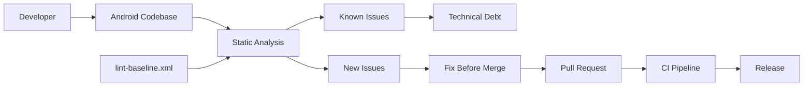
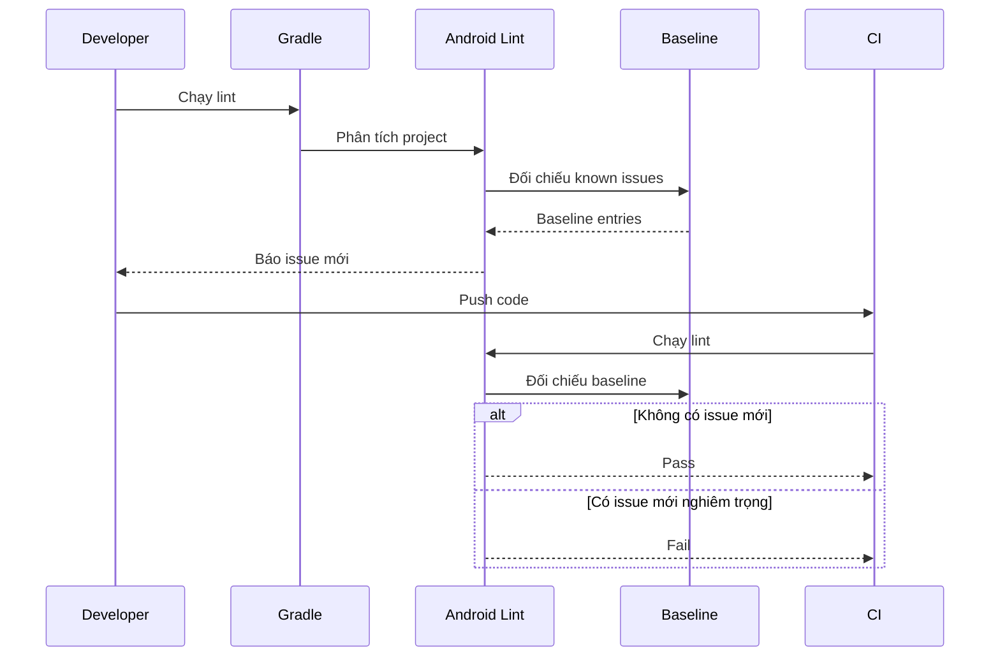
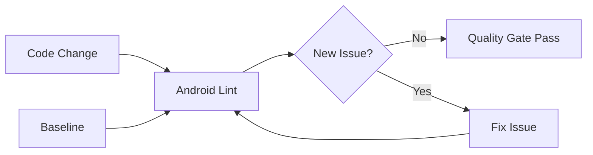

# 005 - Static Analysis Baseline

**Học phần:** 05 - Quality, Release and Portfolio
**Module:** Module 10 - Linting, Debugging and Benchmark
**Nhóm nội dung:** Linting
**Nguồn roadmap:** Linting, Debugging and Benchmark / Linting
**Loại bài:** quality
**Thứ tự trong module:** 005
**Thời lượng gợi ý:** 30 phút

---

## 1. Tóm tắt

**Static Analysis Baseline** là cơ chế ghi lại một tập hợp các vấn đề static analysis đã tồn tại trong codebase tại một thời điểm xác định, từ đó cho phép nhóm phát triển tập trung ngăn **lỗi mới** xuất hiện mà chưa bắt buộc phải xử lý toàn bộ technical debt cũ ngay lập tức.

Trong Android, trường hợp phổ biến nhất là **Android Lint baseline**. Lint có thể ghi các issue hiện tại vào `lint-baseline.xml`. Những issue đã được baseline ghi nhận sẽ không tiếp tục làm nhiễu các lần kiểm tra batch sau, trong khi những issue mới vẫn được báo cáo. Android Developers mô tả baseline như một snapshot của tập warning hiện tại để một dự án có nhiều warning cũ vẫn có thể bắt đầu đưa lint vào quy trình kiểm soát chất lượng và CI.

Baseline không phải là cách "làm cho lint hết lỗi". Nó là một **ranh giới chất lượng**:

```text
Technical debt cũ
        ↓
Được ghi nhận trong baseline
        ↓
Code mới được phát triển
        ↓
Static analysis
        ↓
Issue cũ → tạm thời không chặn
Issue mới → phải được xử lý
```

Trong một dự án thực tế, baseline đặc biệt hữu ích khi đưa static analysis vào một codebase cũ đã tồn tại hàng trăm warning và không thể sửa toàn bộ trong một pull request.

> **Nguyên tắc quan trọng:** Baseline nên giúp nhóm tiến dần từ codebase có technical debt đến codebase sạch hơn. Không nên sử dụng baseline như một nơi để liên tục đẩy thêm lỗi mới vào.

## 2. Mục tiêu học tập

Sau bài học, người học có thể:

* Giải thích được Static Analysis Baseline và mục đích của nó.
* Phân biệt baseline với việc tắt hoàn toàn một lint rule.
* Hiểu vị trí của static analysis trong workflow phát triển Android.
* Cấu hình `lint-baseline.xml` cho một Android project.
* Tạo baseline từ trạng thái hiện tại của project.
* Chạy Android Lint cục bộ và trong CI.
* Phân tích tác động của baseline đối với technical debt và release risk.
* Nhận biết các lỗi thường gặp khi sử dụng baseline.
* Thiết kế chiến lược giảm dần số issue tồn tại trong baseline.
* Tạo một artifact chất lượng có thể đưa vào portfolio.

## 3. Khái niệm cốt lõi

### 3.1. Static analysis là gì?

**Static analysis** là quá trình phân tích source code, resource, cấu hình hoặc bytecode mà không cần thực thi toàn bộ chương trình.

Trong Android, static analysis có thể phát hiện nhiều loại vấn đề như:

* sử dụng API không phù hợp với `minSdk`;
* resource không được sử dụng;
* vấn đề accessibility;
* vấn đề internationalization;
* cách dùng Android API không an toàn;
* lỗi tiềm ẩn liên quan đến lifecycle;
* vấn đề về performance;
* code smell;
* vấn đề về security;
* dependency hoặc configuration không phù hợp.

Android Lint là công cụ static analysis được tích hợp sâu vào Android development workflow.

Static analysis bổ sung cho testing nhưng không thay thế testing:

```text
Static Analysis
    ↓
Phát hiện vấn đề từ code

Unit Test
    ↓
Kiểm tra logic

Integration Test
    ↓
Kiểm tra tương tác thành phần

UI Test
    ↓
Kiểm tra hành vi ứng dụng

Runtime Monitoring
    ↓
Phát hiện vấn đề ngoài production
```

### 3.2. Baseline là gì?

Baseline là snapshot của các issue đã biết tại một thời điểm.

Giả sử một project hiện có:

```text
187 lint issues
```

Nếu bật ngay chính sách:

```text
mọi lint error phải làm build thất bại
```

thì nhóm có thể buộc phải sửa một lượng technical debt rất lớn trước khi có thể tiếp tục phát triển.

Một chiến lược thực tế hơn là:

```text
187 existing issues
        ↓
Create baseline
        ↓
187 issues được ghi nhận
        ↓
Developer thêm code mới
        ↓
Lint phát hiện 2 issue mới
        ↓
CI báo 2 issue mới
```

Nhóm có thể tiếp tục phát triển mà vẫn thực thi nguyên tắc:

> **Không làm codebase tệ hơn trạng thái hiện tại.**

Android Lint hỗ trợ trực tiếp cơ chế này thông qua thuộc tính `baseline` trong cấu hình lint.

## 4. Baseline giải quyết vấn đề gì?

Một codebase lâu năm thường có nhiều vấn đề tồn tại trước khi nhóm áp dụng static analysis nghiêm ngặt.

Ví dụ:

```text
Legacy Android App
├── 40 accessibility warnings
├── 27 deprecated API usages
├── 19 resource issues
├── 14 performance warnings
├── 36 internationalization warnings
└── nhiều issue khác
```

Nếu yêu cầu xử lý tất cả trước khi merge bất kỳ feature mới nào, việc áp dụng lint có thể bị trì hoãn vô thời hạn.

Baseline cho phép chuyển đổi theo từng bước:

1. Chạy static analysis trên codebase hiện tại.
2. Ghi nhận technical debt đã tồn tại.
3. Đặt các issue đó vào baseline.
4. Bật lint trong CI.
5. Không cho phép issue mới xuất hiện.
6. Sửa dần các issue cũ.
7. Giảm kích thước baseline theo thời gian.
8. Cuối cùng loại bỏ baseline nếu project đủ sạch.

Như vậy, baseline đóng vai trò như một chiến lược **incremental quality improvement** thay vì một cơ chế bỏ qua lỗi vĩnh viễn.

## 5. Vị trí trong kiến trúc và quy trình Android

Static Analysis Baseline không nằm trực tiếp trong UI layer, domain layer hay data layer. Nó thuộc **quality engineering workflow** bao quanh toàn bộ codebase.



Baseline được sử dụng tại bước static analysis để phân biệt:

* issue đã được chấp nhận tạm thời;
* issue mới phát sinh từ thay đổi hiện tại.

Nó có thể bảo vệ code ở nhiều phần khác nhau:

* Compose UI;
* `Activity`;
* `Fragment`;
* `ViewModel`;
* repository;
* network layer;
* resource;
* Manifest;
* Gradle configuration;
* test source;
* Android API usage.

Do đó, ảnh hưởng của baseline không nằm ở một architectural layer riêng biệt mà nằm ở **quality gate của toàn bộ project**.

## 6. Cách Android Lint Baseline hoạt động

Quy trình cơ bản gồm:

1. Developer cấu hình một baseline file cho Android Lint.
2. Lint chạy trên project.
3. Các issue hiện tại được ghi vào baseline.
4. Baseline được lưu cùng project.
5. Những lần lint tiếp theo đọc baseline.
6. Issue khớp với baseline được xem là issue đã biết.
7. Issue mới không có trong baseline vẫn được báo cáo.
8. CI có thể dùng lint result để quyết định build có được tiếp tục hay không.

Android Developers cũng lưu ý rằng baseline phục vụ các lần inspection theo kiểu batch; các kiểm tra lint chạy trực tiếp trong editor vẫn có thể hiển thị vấn đề để developer thấy và sửa code khi đang làm việc.

Một workflow điển hình:



## 7. Cấu hình Android Lint Baseline

Với Android Gradle Plugin hiện đại, baseline có thể được khai báo trong khối `lint` của `build.gradle.kts`. Android Gradle Plugin cung cấp thuộc tính `baseline` để chỉ định file baseline.

Ví dụ Kotlin DSL:

```kotlin
android {
    lint {
        baseline = file("lint-baseline.xml")
    }
}
```

Vị trí file thường được sử dụng:

```text
app/
├── build.gradle.kts
├── lint-baseline.xml
└── src/
    └── main/
```

Không cần tự tạo nội dung XML bằng tay trước.

Sau khi cấu hình baseline, có thể chạy lint để tạo snapshot từ trạng thái hiện tại của project.

Ví dụ:

```bash
./gradlew lintDebug -Dlint.baselines.continue=true
```

Tài liệu Android Developers sử dụng cách này để tạo baseline khi project chưa có `lint-baseline.xml`.

Sau khi baseline đã tồn tại, chạy lint bình thường:

```bash
./gradlew lintDebug
```

Hoặc kiểm tra lint phù hợp với build configuration của project.

> **Lưu ý:** Tên Gradle task phụ thuộc vào module và build variant của project. Không nên mặc định rằng mọi project đều chỉ sử dụng một variant duy nhất.

## 8. Baseline không giống với Ignore Rule

Baseline và việc tắt lint rule giải quyết hai vấn đề khác nhau.

| Tiêu chí                   | Baseline                                              | Ignore rule                     |
| -------------------------- | ----------------------------------------------------- | ------------------------------- |
| Mục tiêu                   | Ghi nhận issue cũ                                     | Tắt một loại kiểm tra           |
| Issue hiện tại             | Có thể được bỏ qua theo snapshot                      | Bị bỏ qua                       |
| Issue mới cùng loại        | Vẫn có khả năng bị phát hiện nếu không thuộc baseline | Không được kiểm tra             |
| Phù hợp với technical debt | Có                                                    | Thường không tối ưu             |
| Có thể giảm dần            | Có                                                    | Không tự tạo động lực giảm debt |
| Rủi ro che lỗi mới         | Thấp hơn                                              | Cao hơn                         |

Ví dụ, nếu project có 30 issue liên quan đến một rule, việc vô hiệu hóa toàn bộ rule có thể khiến lỗi mới cùng loại không còn được phát hiện.

Baseline tốt hơn trong trường hợp:

```text
30 lỗi cũ → chấp nhận tạm thời

lỗi thứ 31 do code mới → phải phát hiện
```

Trong khi tắt rule có thể biến thành:

```text
30 lỗi cũ → không thấy
31 lỗi mới → cũng không thấy
32 lỗi mới → cũng không thấy
```

> Nếu một rule thực sự không phù hợp với project, việc cấu hình rule có thể hợp lý. Nhưng đó là quyết định về policy, không phải cách xử lý technical debt.

## 9. Baseline trong CI

Baseline phát huy giá trị lớn nhất khi static analysis được chạy tự động trong CI.

Một pipeline đơn giản:

```text
Pull Request
    ↓
Checkout
    ↓
Build
    ↓
Static Analysis
    ↓
Read lint-baseline.xml
    ↓
New issue?
 ┌──┴──┐
Có   Không
 ↓      ↓
Fail   Continue
        ↓
       Test
        ↓
      Merge
```

Ví dụ một bước CI có thể chạy:

```bash
./gradlew lintDebug
```

Project cũng có thể cấu hình lint để các lỗi đủ nghiêm trọng làm build không thành công.

Ví dụ:

```kotlin
android {
    lint {
        baseline = file("lint-baseline.xml")
        abortOnError = true
    }
}
```

`abortOnError` là một thuộc tính của Android Lint DSL, quyết định lint có trả exit code lỗi khi phát hiện error hay không.

Một policy thực tế có thể là:

```text
Existing issues
    ↓
Baseline

New warning
    ↓
Review

New error
    ↓
CI fails

New critical issue
    ↓
Must fix before merge
```

Policy cụ thể cần phù hợp với mức trưởng thành của project.

## 10. Quản lý technical debt bằng baseline

Baseline chỉ có ý nghĩa nếu số issue giảm dần theo thời gian.

Ví dụ:

```text
Sprint 1
Baseline: 187 issues

Sprint 2
Baseline: 153 issues

Sprint 3
Baseline: 116 issues

Sprint 4
Baseline: 72 issues

Sprint 5
Baseline: 31 issues

Sprint 6
Baseline: 0 issues
```

Có thể áp dụng quy tắc:

* Không thêm issue mới vào baseline chỉ để CI pass.
* Khi sửa code gần một issue cũ, cân nhắc xử lý issue đó.
* Dành một phần capacity của sprint để giảm technical debt.
* Theo dõi số issue trong baseline.
* Review thay đổi lớn của `lint-baseline.xml`.
* Không tự động regenerate baseline trong mỗi CI run.
* Khi nhiều issue cũ đã được sửa, cập nhật baseline có chủ đích.

Tài liệu Android cũng chỉ ra rằng lint có thể thông báo những issue trong baseline không còn xuất hiện, giúp developer biết technical debt đã được xử lý và có thể tạo lại baseline phù hợp hơn.

## 11. Ví dụ thực tế

Giả sử một công ty có một ứng dụng thương mại điện tử Android đã phát triển trong bốn năm.

Khi nhóm chạy lint lần đầu:

```text
412 issues
```

Trong đó:

```text
Accessibility        87
Internationalization 63
Performance          41
API usage            28
Resources            76
Other               117
```

Không thể dừng toàn bộ feature development để sửa 412 issue ngay lập tức.

Nhóm tạo:

```text
lint-baseline.xml
```

và đưa file này vào repository.

Từ thời điểm đó:

```text
Main branch
    ↓
412 known issues
    ↓
Baseline

Feature branch
    ↓
Developer thêm code
    ↓
Lint phát hiện 3 issue mới
    ↓
Pull Request fail
```

Developer sửa ba issue mới trước khi merge.

Trong sprint tiếp theo, nhóm xử lý thêm 40 issue cũ.

Baseline được cập nhật còn:

```text
372 issues
```

Sau nhiều iteration, số lượng technical debt tiếp tục giảm mà feature development không phải dừng hoàn toàn.

Đây là cách baseline biến static analysis từ một công cụ "tạo hàng trăm cảnh báo" thành một **quality gate có thể áp dụng thực tế**.

## 12. Lỗi thường gặp

* **Regenerate baseline mỗi khi CI thất bại.**
  Khi developer gặp lint error mới rồi tạo lại baseline ngay, lỗi mới sẽ bị biến thành technical debt được chấp nhận. Điều này phá vỡ mục tiêu của baseline.

* **Xem baseline như danh sách ignore vĩnh viễn.**
  Baseline nên giảm dần. Nếu file chỉ tăng theo thời gian, quy trình chất lượng đang thất bại.

* **Không commit baseline vào version control khi nhóm cần dùng chung trạng thái baseline.**
  Khi mỗi developer có baseline khác nhau, kết quả lint local và CI có thể không nhất quán. Android Developers cho phép baseline được đưa vào version control để chia sẻ trong nhóm.

* **Thay đổi baseline lớn nhưng không review.**
  Một pull request thêm hàng trăm entry mới vào baseline có thể đang che giấu regression.

* **Dùng baseline để thay cho test.**
  Lint chỉ phát hiện những loại vấn đề mà static analysis hiểu được. Nó không xác minh đầy đủ business logic hoặc runtime behavior.

* **Nhầm Static Analysis Baseline với Android Baseline Profiles.**
  Hai khái niệm hoàn toàn khác nhau. Static Analysis Baseline dùng để quản lý issue của static analysis, còn Android Baseline Profiles mô tả các code path quan trọng để ART tối ưu việc biên dịch và runtime performance.

## 13. Best practices

* Chạy static analysis cả local và CI.
* Đưa baseline vào version control khi nó là baseline dùng chung của project.
* Không thêm issue mới vào baseline như một cách sửa CI nhanh.
* Review thay đổi của `lint-baseline.xml` như review source code.
* Ưu tiên sửa issue có severity cao trước.
* Theo dõi số issue tồn tại theo thời gian.
* Có kế hoạch giảm technical debt rõ ràng.
* Chạy lint trước khi tạo pull request.
* Không tắt toàn bộ rule chỉ vì codebase cũ đang vi phạm rule.
* Không sử dụng `@Suppress` nếu chưa hiểu nguyên nhân warning.
* Khi suppress một issue có chủ đích, nên ghi rõ lý do nếu ngữ cảnh không tự giải thích được.
* Không coi lint pass là bằng chứng ứng dụng không có bug.
* Kết hợp lint với unit test, integration test, UI test và runtime monitoring.

Một nguyên tắc review hữu ích là:

```text
Nếu lint mới fail
        ↓
Issue có thật không?
 ┌──────┴──────┐
Có            Không
↓               ↓
Fix code     Xác minh rule
                ↓
        Cấu hình/suppress có lý do
```

Không nên biến workflow thành:

```text
Lint fail
    ↓
Regenerate baseline
    ↓
Commit
    ↓
Done
```

## 14. Testing và kiểm chứng

Có thể kiểm tra chiến lược baseline bằng các test case sau:

| Test case                              | Kết quả mong đợi                                   |
| -------------------------------------- | -------------------------------------------------- |
| Chạy lint với codebase hiện tại        | Các known issue trong baseline không chặn workflow |
| Thêm một lint issue mới                | Issue mới được báo                                 |
| Sửa một issue cũ                       | Lint không tạo regression                          |
| Xóa baseline                           | Các issue cũ xuất hiện trở lại                     |
| Thêm issue mới rồi regenerate baseline | Review phải phát hiện baseline tăng bất thường     |
| CI chạy cùng commit với local          | Kết quả lint phải nhất quán về policy              |
| Pull request không có issue mới        | Static analysis quality gate pass                  |
| Pull request có lint error mới         | CI không cho merge theo policy                     |

Một bài kiểm chứng đơn giản:

1. Chạy lint trên project.
2. Ghi nhận kết quả.
3. Tạo baseline.
4. Chạy lint lần nữa.
5. Thêm một đoạn code cố ý tạo lint warning.
6. Chạy lint.
7. Xác nhận warning mới xuất hiện.
8. Sửa warning.
9. Chạy lint lại.
10. Xác nhận quality check pass.

## 15. Debugging static analysis

Khi lint cho kết quả không như mong đợi, nên kiểm tra theo thứ tự:

1. Xác nhận Gradle task đang chạy đúng module và variant.
2. Kiểm tra `lint-baseline.xml` có đúng vị trí được cấu hình hay không.
3. Kiểm tra issue có nằm trong baseline hay không.
4. Xem lint report để xác định `issue id`.
5. Kiểm tra severity của rule.
6. Kiểm tra project có override lint configuration hay không.
7. So sánh kết quả local với CI.
8. Kiểm tra thay đổi Gradle hoặc Android Gradle Plugin nếu behavior thay đổi sau upgrade.

Các nguồn thông tin thường hữu ích gồm:

* output của Gradle;
* Android Studio inspection;
* lint report;
* CI log;
* Git diff của `lint-baseline.xml`.

Ví dụ:

```bash
./gradlew lintDebug
```

Nếu cần thêm thông tin từ Gradle:

```bash
./gradlew lintDebug --info
```

Không nên chỉ nhìn dòng cuối cùng:

```text
BUILD FAILED
```

mà bỏ qua phần lint report chỉ ra nguyên nhân thực tế.

## 16. Ảnh hưởng đến UX, maintainability và release risk

Static Analysis Baseline không trực tiếp hiển thị UI cho người dùng nhưng có thể ảnh hưởng đáng kể đến chất lượng sản phẩm.

### 16.1. UX và độ ổn định

Static analysis có thể phát hiện các vấn đề liên quan đến:

* accessibility;
* localization;
* Android API compatibility;
* resource;
* performance;
* lifecycle;
* cách sử dụng platform API.

Ngăn các regression này ngay từ pull request giúp giảm khả năng người dùng gặp vấn đề sau release.

### 16.2. Maintainability và release risk

Baseline tạo ra một ranh giới rõ ràng:

```text
Technical debt đã biết
        ↓
Không tăng thêm
        ↓
Giảm dần theo thời gian
        ↓
Codebase dễ maintain hơn
```

Nếu không có cơ chế kiểm soát, technical debt có thể diễn biến theo hướng:

```text
100 issues
   ↓
130 issues
   ↓
170 issues
   ↓
250 issues
```

Trong khi một baseline được quản lý đúng hướng tới:

```text
100 issues
   ↓
82 issues
   ↓
51 issues
   ↓
19 issues
   ↓
0 issues
```

Điều này làm giảm release risk vì các regression mới được phát hiện sớm hơn, trước khi chúng đi qua QA hoặc tới production.

## 17. Liên hệ với các chủ đề khác

Static Analysis Baseline nằm trong chuỗi kiểm soát chất lượng rộng hơn:

```text
Code
  ↓
Formatting
  ↓
Static Analysis
  ↓
Lint Baseline
  ↓
Unit Test
  ↓
Integration Test
  ↓
Benchmark
  ↓
CI
  ↓
Release
  ↓
Production Monitoring
```

Trong Android project, nó có thể kết hợp với:

* Android Lint để phát hiện vấn đề platform-specific.
* Kotlin compiler warnings để phát hiện vấn đề ở compile time.
* Code review để kiểm tra logic mà static analyzer không hiểu.
* Unit test để bảo vệ business logic.
* UI test để bảo vệ user flow.
* Benchmark để phát hiện performance regression.
* CI để tự động hóa quality gate.
* Crash reporting để theo dõi lỗi runtime sau release.

Static analysis phát hiện vấn đề **trước runtime**, còn crash monitoring và analytics giúp phát hiện hoặc đánh giá vấn đề **sau khi phần mềm thực thi**.

## 18. Bài thực hành

Xây dựng một Android sample project hoặc sử dụng một project đang có và thiết lập Android Lint Baseline.

Yêu cầu:

1. Chạy lint lần đầu.

```bash
./gradlew lintDebug
```

2. Ghi lại số issue hoặc lưu lint report.

3. Cấu hình baseline trong `build.gradle.kts`.

```kotlin
android {
    lint {
        baseline = file("lint-baseline.xml")
    }
}
```

4. Tạo baseline từ trạng thái hiện tại.

```bash
./gradlew lintDebug -Dlint.baselines.continue=true
```

5. Kiểm tra file:

```text
lint-baseline.xml
```

6. Commit baseline cùng source code nếu project sử dụng baseline chung.

7. Tạo một thay đổi cố ý sinh lint issue mới.

8. Chạy lại:

```bash
./gradlew lintDebug
```

9. Xác nhận lint vẫn phát hiện issue mới.

10. Sửa issue mới thay vì regenerate baseline.

11. Chạy lại lint và xác nhận check thành công.

12. Viết một ghi chú ngắn giải thích:

```text
Baseline chứa gì?
Tại sao project cần baseline?
Issue mới được xử lý như thế nào?
Khi nào baseline được cập nhật?
Ai review thay đổi baseline?
```

**Kết quả mong đợi:** project có một quy trình lặp lại được trong đó technical debt hiện tại được ghi nhận nhưng lint vẫn ngăn issue mới xuất hiện.

## 19. Artifact cho portfolio

Tạo một artifact có cấu trúc:

```text
static-analysis-baseline-demo/
├── app/
├── lint-baseline.xml
├── README.md
└── docs/
    ├── lint-before-baseline.png
    ├── lint-new-issue.png
    └── lint-pass.png
```

Trong `README.md`, mô tả:

* Static Analysis Baseline là gì.
* Lý do project sử dụng baseline.
* Lệnh chạy lint.
* Cách tạo baseline.
* Ví dụ một issue cũ.
* Ví dụ một issue mới.
* Cách CI xử lý issue mới.
* Policy cập nhật baseline.
* Kế hoạch giảm technical debt.

Có thể bổ sung một sơ đồ:



Artifact này cho thấy người học không chỉ biết chạy một command mà còn hiểu cách tích hợp static analysis vào software engineering workflow.

## 20. Checklist hoàn thành

* [ ] Tôi giải thích được Static Analysis Baseline bằng lời của mình.
* [ ] Tôi phân biệt được baseline với việc disable lint rule.
* [ ] Tôi hiểu baseline là ranh giới technical debt chứ không phải nơi chứa lỗi vĩnh viễn.
* [ ] Tôi cấu hình được `lint-baseline.xml`.
* [ ] Tôi chạy được Android Lint bằng Gradle.
* [ ] Tôi tạo được baseline từ trạng thái hiện tại của project.
* [ ] Tôi kiểm chứng được rằng issue mới vẫn được lint phát hiện.
* [ ] Tôi biết vì sao không nên regenerate baseline mỗi khi CI fail.
* [ ] Tôi hiểu cách baseline tham gia vào pull request và CI.
* [ ] Tôi biết cách theo dõi và giảm số issue baseline theo thời gian.
* [ ] Tôi phân biệt được Static Analysis Baseline với Android Baseline Profiles.
* [ ] Tôi hoàn thành bài thực hành.
* [ ] Tôi có README, screenshot hoặc lint report làm artifact portfolio.

## 21. Câu hỏi tự kiểm tra

1. Vì sao một project legacy có thể cần baseline trước khi bật lint nghiêm ngặt trong CI?
2. Baseline khác với việc disable một lint rule như thế nào?
3. Vì sao regenerate baseline mỗi khi có lint failure mới là một anti-pattern?
4. Một nhóm phát triển nên làm gì để số issue trong baseline giảm theo thời gian?
5. Static Analysis Baseline khác Android Baseline Profiles ở mục đích nào?

## 22. Tổng kết

Static Analysis Baseline là một chiến lược giúp đưa static analysis vào codebase đang có technical debt mà không buộc nhóm phải sửa toàn bộ vấn đề ngay lập tức.

Trong Android, `lint-baseline.xml` có thể ghi nhận các lint issue hiện tại. Những issue đã biết được tách khỏi regression mới, nhờ đó developer có thể xây dựng một quality gate theo nguyên tắc:

```text
Không nhất thiết sửa toàn bộ technical debt hôm nay
                     ↓
Nhưng không được tạo thêm technical debt mới
                     ↓
Technical debt cũ phải giảm dần
```

Baseline chỉ hiệu quả khi được kết hợp với:

* Android Lint;
* code review;
* CI;
* testing;
* quy trình quản lý technical debt;
* release quality gate.

Điểm quan trọng nhất cần nhớ là:

> **Baseline không phải công cụ để làm lỗi biến mất. Baseline là cơ chế xác định điểm xuất phát để từ đó chất lượng codebase chỉ được giữ nguyên hoặc cải thiện, không tiếp tục suy giảm.**
