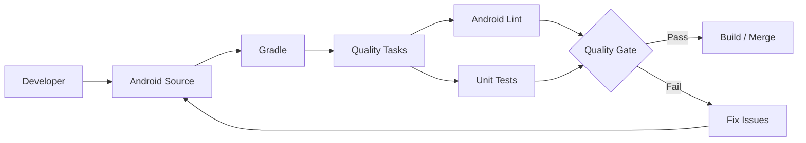
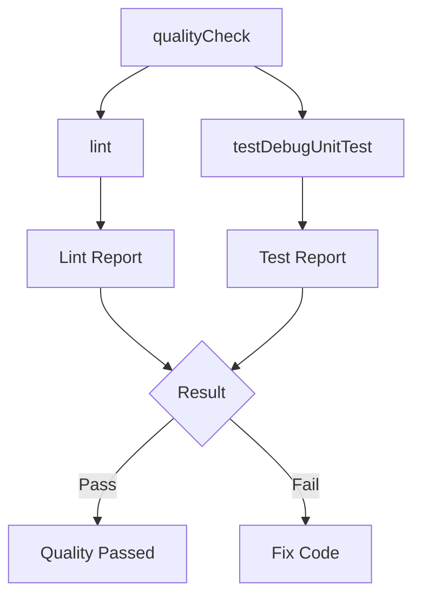

# 006 - Gradle Quality Task

**Học phần:** 05 - Quality, Release and Portfolio
**Module:** Module 10 - Linting, Debugging and Benchmark
**Nhóm nội dung:** Linting
**Nguồn roadmap:** Linting, Debugging and Benchmark / Linting
**Loại bài:** quality
**Thứ tự trong module:** 006
**Thời lượng gợi ý:** 30 phút

---

## 1. Tóm tắt

Trong một dự án Android, các kiểm tra chất lượng như Android Lint, unit test hoặc các công cụ static analysis sẽ mất nhiều giá trị nếu developer phải nhớ chạy từng lệnh thủ công trước mỗi lần commit hoặc release.

**Gradle Quality Task** là cách tổ chức các bước kiểm tra đó thành một hoặc nhiều Gradle task có thể chạy lặp lại bằng cùng một lệnh, ví dụ:

```bash
./gradlew qualityCheck
```

Thay vì coi `qualityCheck` là một công cụ độc lập của Android, nên hiểu nó là **lifecycle/aggregation task do project định nghĩa**, dùng để gom những verification task như `lint`, unit test hoặc các công cụ kiểm tra khác đang được dự án sử dụng.

Gradle hỗ trợ mô hình lifecycle task: một task tổng hợp không nhất thiết tự thực hiện kiểm tra mà có thể phụ thuộc vào các verification task khác. Gradle cũng cung cấp lifecycle task `check` để các plugin hoặc build author gắn các bước kiểm tra chất lượng vào quy trình verification chung. ([Gradle Documentation][1])

Đối với Android, `lint` là một trong những quality task quan trọng nhất. Android Lint có thể phát hiện các vấn đề liên quan đến correctness, security, performance, usability, accessibility và internationalization mà không cần chạy ứng dụng. Android Developers cũng khuyến nghị chạy lint trong CI thay vì chỉ dựa vào quá trình build thông thường. ([Android Developers][2])

---

## 2. Mục tiêu học tập

Sau bài học, người học có thể:

* Giải thích được vai trò của Gradle quality task trong dự án Android.
* Phân biệt quality task tổng hợp với từng công cụ kiểm tra cụ thể như Android Lint hoặc unit test.
* Chạy Android Lint từ Gradle Wrapper.
* Tạo một task `qualityCheck` để gom nhiều bước kiểm tra chất lượng.
* Tích hợp quality task vào lifecycle `check`.
* Phân tích failure của quality task từ terminal và report.
* Đưa cùng một quality command vào môi trường local và CI.
* Thiết kế quality gate đơn giản trước khi merge hoặc release.
* Tạo artifact thể hiện quy trình quality automation cho portfolio.

---

## 3. Khái niệm cốt lõi

### 3.1. Gradle task là gì?

Gradle tổ chức quá trình build thành các **task**.

Một task có thể thực hiện những công việc như:

* compile source code;
* chạy unit test;
* chạy static analysis;
* tạo APK hoặc AAB;
* tạo report;
* đóng gói artifact;
* kiểm tra chất lượng source code.

Ví dụ:

```bash
./gradlew lint
```

Ở đây:

* `./gradlew` là Gradle Wrapper của project;
* `lint` là task được yêu cầu thực thi.

Gradle sẽ phân tích dependency graph của task và chạy những task cần thiết theo đúng thứ tự.

---

### 3.2. Quality task là gì?

Trong phạm vi bài học này, **quality task** là task phục vụ việc xác minh chất lượng project.

Ví dụ:

```text
qualityCheck
├── lint
└── testDebugUnitTest
```

`qualityCheck` không nhất thiết tự phân tích source code.

Nhiệm vụ của nó có thể chỉ là:

1. định nghĩa một entry point thống nhất;
2. phụ thuộc vào các verification task;
3. làm build thất bại nếu một quality gate quan trọng thất bại.

Developer chỉ cần chạy:

```bash
./gradlew qualityCheck
```

thay vì phải nhớ nhiều command riêng biệt.

---

### 3.3. Lifecycle task và actionable task

Gradle phân biệt giữa task thực hiện công việc và task dùng để tổ chức lifecycle.

Một verification task như unit test hoặc lint thực hiện công việc cụ thể.

Ngược lại, một task tổng hợp có thể chỉ có dependency:

```kotlin
tasks.register("qualityCheck") {
    dependsOn("lint")
}
```

Task này trở thành điểm vào của quy trình quality.

Gradle cung cấp lifecycle task `check`, được thiết kế để làm điểm tập hợp cho các verification task. ([Gradle Documentation][1])

---

## 4. Vì sao cần Gradle Quality Task?

Một project nhỏ có thể bắt đầu bằng cách developer tự chạy:

```bash
./gradlew lint
```

sau đó:

```bash
./gradlew testDebugUnitTest
```

Khi project lớn hơn, quy trình có thể bổ sung:

```text
Android Lint
Unit Test
Static Analysis
Formatting Check
Architecture Check
Custom Validation
```

Nếu mỗi developer tự chọn những bước cần chạy, kết quả kiểm tra sẽ không nhất quán.

Ví dụ:

```text
Developer A
    ↓
Chạy unit test
    ↓
Không chạy lint
    ↓
Merge

Developer B
    ↓
Chạy lint
    ↓
Không chạy unit test
    ↓
Merge
```

Một command thống nhất giúp chuyển quy trình thành:

```text
Developer / CI
       ↓
./gradlew qualityCheck
       ↓
Quality Gate
       ↓
Pass → tiếp tục
Fail → dừng và sửa
```

Lợi ích chính gồm:

* giảm thao tác thủ công;
* giảm khả năng quên bước kiểm tra;
* tạo cùng một quality gate cho local và CI;
* phát hiện lỗi sớm hơn;
* chuẩn hóa Definition of Done;
* đơn giản hóa tài liệu onboarding;
* hỗ trợ kiểm soát release risk.

---

## 5. Vị trí trong kiến trúc Android

Gradle Quality Task không nằm trong runtime architecture giống `ViewModel`, `Repository` hoặc `Room`.

Nó thuộc **build và quality pipeline** bao quanh source code của ứng dụng.



Điểm quan trọng là quality task không trực tiếp điều khiển UI hoặc business logic.

Thay vào đó, nó kiểm tra source code chứa những thành phần đó trước khi code đi xa hơn trong pipeline:

```text
Source Code
    ↓
Static Analysis / Tests
    ↓
Quality Gate
    ↓
Build
    ↓
CI
    ↓
Merge
    ↓
Release
```

Vì vậy Gradle Quality Task nằm gần:

* Android Lint;
* testing;
* debugging;
* CI/CD;
* code review;
* release validation.

---

## 6. Android Lint trong quality pipeline

Android Lint phân tích project để tìm các vấn đề tiềm ẩn mà không cần chạy ứng dụng.

Một số nhóm vấn đề có thể được lint kiểm tra gồm:

* correctness;
* performance;
* security;
* accessibility;
* usability;
* internationalization.

Android Developers cung cấp task `lint` để chạy kiểm tra từ Gradle Wrapper. ([Android Developers][2])

Trên Linux hoặc macOS:

```bash
./gradlew lint
```

Trên Windows:

```bash
gradlew lint
```

Một project Android có build variant cũng có thể có các task theo variant, ví dụ:

```bash
./gradlew lintDebug
```

hoặc:

```bash
./gradlew lintRelease
```

Android Lint có thể tạo report để developer xem chi tiết vấn đề được phát hiện. ([Android Developers][2])

> **Lưu ý:** Không nên giả định rằng việc build ứng dụng thông thường luôn đồng nghĩa với việc toàn bộ lint gate đã được chạy. Với CI, hãy gọi rõ task kiểm tra mà pipeline yêu cầu. ([Android Developers][2])

---

## 7. Kiểm tra các verification task hiện có

Trước khi tạo một quality task, cần biết project đang cung cấp những task nào.

Có thể xem danh sách Gradle task:

```bash
./gradlew tasks
```

Hoặc tập trung vào nhóm verification:

```bash
./gradlew tasks --group verification
```

Trong một project Android, bạn có thể tìm thấy các task liên quan đến:

```text
lint
lintDebug
lintRelease
testDebugUnitTest
testReleaseUnitTest
check
```

Task chính xác phụ thuộc vào:

* plugin đang sử dụng;
* module;
* build type;
* product flavor;
* plugin quality được cài trong project.

> **Nguyên tắc:** Không hard-code tên một task vào `qualityCheck` trước khi xác nhận task đó thực sự tồn tại trong project.

---

## 8. Tạo Gradle Quality Task

### 8.1. Quality task tối thiểu

Giả sử project có task `lint`, có thể tạo task tổng hợp trong `build.gradle.kts`:

```kotlin
tasks.register("qualityCheck") {
    group = "verification"
    description = "Runs project quality checks."

    dependsOn("lint")
}
```

Sau đó chạy:

```bash
./gradlew qualityCheck
```

Dependency graph lúc này là:

```text
qualityCheck
    ↓
lint
```

Nếu `lint` thất bại, Gradle command cũng thất bại.

---

### 8.2. Kết hợp lint và unit test

Giả sử module Android có build type `debug` và task `testDebugUnitTest`, quality task có thể được mở rộng:

```kotlin
tasks.register("qualityCheck") {
    group = "verification"
    description = "Runs lint and unit tests."

    dependsOn(
        "lint",
        "testDebugUnitTest"
    )
}
```

Khi chạy:

```bash
./gradlew qualityCheck
```

Gradle sẽ thực thi dependency graph tương ứng.



Quality task trở thành command chuẩn mà developer hoặc CI sử dụng.

---

### 8.3. Gắn quality task vào `check`

Nếu muốn quality check trở thành một phần của lifecycle verification chung, có thể gắn nó vào `check`:

```kotlin
tasks.named("check") {
    dependsOn("qualityCheck")
}
```

Quan hệ trở thành:

```text
check
  ↓
qualityCheck
  ├── lint
  └── testDebugUnitTest
```

`check` là lifecycle task được Gradle thiết kế cho các hoạt động verification, do đó việc gắn custom quality verification vào đây phù hợp với mô hình tổ chức task của Gradle. ([Gradle Documentation][1])

> **Lưu ý:** Trước khi cấu hình `tasks.named("check")`, hãy xác nhận plugin của module tạo task `check`. Có thể kiểm tra bằng `./gradlew tasks --group verification`.

---

## 9. Cấu hình Android Lint

Android Gradle Plugin cho phép cấu hình lint trong `android` block. ([Android Developers][2])

Ví dụ:

```kotlin
android {
    lint {
        abortOnError = true
        warningsAsErrors = false

        htmlReport = true
        xmlReport = true
    }
}
```

Ý nghĩa:

| Thuộc tính         | Vai trò                                                   |
| ------------------ | --------------------------------------------------------- |
| `abortOnError`     | Cho phép lint làm build thất bại khi gặp lỗi nghiêm trọng |
| `warningsAsErrors` | Xác định warning có được nâng thành error hay không       |
| `htmlReport`       | Sinh report HTML                                          |
| `xmlReport`        | Sinh report XML                                           |

Không nên bật mọi rule hoặc biến mọi warning thành error một cách máy móc.

Mục tiêu của quality gate là:

```text
Signal cao
+
Feedback sớm
+
Rule có giá trị
-
Noise không cần thiết
```

Nếu rule tạo quá nhiều false positive hoặc warning không có hành động xử lý rõ ràng, developer có xu hướng bỏ qua toàn bộ output.

---

## 10. Quality Gate

**Quality gate** là tập hợp điều kiện mà source code phải vượt qua trước khi được phép đi đến bước tiếp theo.

Ví dụ:

```text
lint
   ↓
unit tests
   ↓
qualityCheck
   ↓
PASS?
 ┌───────┴───────┐
 │               │
Yes              No
 │               │
Merge          Fix code
```

Một quality gate đơn giản có thể yêu cầu:

* Android Lint không có error blocking;
* unit test pass;
* Gradle command trả exit code thành công.

Không nên biến quality gate thành:

```text
Càng nhiều rule càng tốt
```

Mục tiêu đúng hơn là:

```text
Rule quan trọng
    ↓
Developer hiểu
    ↓
Có khả năng sửa
    ↓
Ngăn regression thực tế
```

---

## 11. Local và CI phải dùng cùng một command

Một lỗi thường gặp là local và CI chạy hai quy trình khác nhau.

Ví dụ không tốt:

```text
Local
./gradlew lint

CI
./gradlew testDebugUnitTest
```

Developer có thể pass local nhưng fail CI vì hai môi trường không kiểm tra cùng điều kiện.

Cách tổ chức tốt hơn:

```text
Local
   ↓
./gradlew qualityCheck

CI
   ↓
./gradlew qualityCheck
```

Như vậy quality definition nằm trong build configuration thay vì nằm rải rác ở:

* README;
* trí nhớ của developer;
* shell script riêng;
* CI configuration.

---

## 12. Ví dụ thực tế

Giả sử team đang phát triển một ứng dụng thương mại điện tử.

Một developer sửa màn hình checkout và vô tình tạo:

* một lint violation;
* một unit test failure.

Nếu chỉ build APK:

```text
Code
 ↓
Build
 ↓
APK được tạo
```

developer có thể không phát hiện vấn đề trước khi tạo Pull Request.

Nếu project sử dụng:

```bash
./gradlew qualityCheck
```

flow trở thành:

```text
Checkout Change
      ↓
qualityCheck
      ↓
┌───────────────┐
│ Android Lint  │
│ Unit Tests    │
└───────────────┘
      ↓
    FAIL
      ↓
Developer sửa
      ↓
qualityCheck
      ↓
    PASS
      ↓
Pull Request
```

Điều quan trọng không phải tên `qualityCheck`.

Giá trị nằm ở việc team có một **repeatable quality contract**.

---

## 13. Lỗi thường gặp

### 13.1. Tạo quality task nhưng không chạy trong CI

**Hiện tượng:** Project có:

```bash
./gradlew qualityCheck
```

nhưng pipeline vẫn chỉ chạy build APK.

**Nguyên nhân:** Quality task tồn tại nhưng không được coi là quality gate thực tế.

**Cách xử lý:** Sử dụng cùng command trong CI:

```bash
./gradlew qualityCheck
```

---

### 13.2. Phụ thuộc vào task không tồn tại

**Hiện tượng:** Gradle báo không tìm thấy task.

Ví dụ project không có:

```text
testDebugUnitTest
```

nhưng cấu hình lại chứa:

```kotlin
dependsOn("testDebugUnitTest")
```

**Nguyên nhân:** Tên task phụ thuộc vào plugin và variant của project.

**Cách xử lý:** Kiểm tra trước bằng:

```bash
./gradlew tasks --group verification
```

---

### 13.3. Quality gate quá nhiễu

**Hiện tượng:** Pipeline có hàng trăm warning và developer bắt đầu bỏ qua chúng.

**Nguyên nhân:** Rule được thêm mà không đánh giá signal-to-noise ratio.

**Cách xử lý:**

* ưu tiên lỗi có tác động thực tế;
* cấu hình severity hợp lý;
* xử lý warning dần;
* tránh disable một nhóm kiểm tra lớn chỉ vì vài issue khó sửa.

---

### 13.4. Local pass nhưng CI fail

**Hiện tượng:**

```text
Local → PASS
CI    → FAIL
```

**Nguyên nhân có thể gồm:**

* local và CI chạy command khác nhau;
* JDK khác nhau;
* environment khác nhau;
* generated file khác nhau;
* developer chỉ chạy một phần quality pipeline.

**Cách xử lý:** Chuẩn hóa:

```bash
./gradlew qualityCheck
```

cho cả local và CI, đồng thời đồng bộ môi trường build cần thiết.

---

### 13.5. Chạy quality quá muộn

**Hiện tượng:** Developer chỉ biết lỗi sau khi Pull Request đã tạo hoặc pipeline release chạy.

**Nguyên nhân:** Quality check chỉ tồn tại trong CI.

**Cách xử lý:** Khuyến khích developer chạy:

```bash
./gradlew qualityCheck
```

trước khi push.

Mô hình mong muốn:

```text
Write code
    ↓
Run quality
    ↓
Fix
    ↓
Commit
    ↓
Push
    ↓
CI quality
```

---

## 14. Best practices

* Sử dụng Gradle Wrapper của project thay vì phụ thuộc vào Gradle cài global.
* Đặt quality task trong group `verification`.
* Viết `description` để developer hiểu mục đích của task.
* Giữ một command thống nhất giữa local và CI.
* Dùng `dependsOn()` để mô hình hóa dependency thay vì gọi shell command từ task này sang task khác.
* Không thêm tool chỉ để tăng số lượng quality check.
* Không biến mọi warning thành blocking error ngay lập tức nếu codebase chưa sẵn sàng.
* Kiểm tra report thay vì chỉ nhìn dòng cuối cùng `BUILD FAILED`.
* Ưu tiên các rule liên quan đến bug, security, performance và maintainability thực tế.
* Đưa quality check vào Pull Request hoặc release workflow.
* Khi thêm một quality rule mới, cần xác định rõ failure mà rule đó muốn ngăn chặn.

---

## 15. Testing quality pipeline

Quality pipeline bản thân nó cũng cần được kiểm chứng.

Có thể thực hiện các test case sau:

| Test case                | Kết quả mong đợi                                           |
| ------------------------ | ---------------------------------------------------------- |
| Source code sạch         | `qualityCheck` thành công                                  |
| Tạo lint error có chủ ý  | Quality pipeline thất bại nếu error được cấu hình blocking |
| Unit test thất bại       | `qualityCheck` thất bại                                    |
| Sửa unit test            | Task chạy lại thành công                                   |
| Chạy trên máy developer  | Kết quả đúng với cấu hình                                  |
| Chạy cùng commit trên CI | Quality gate cho kết quả nhất quán                         |
| Mở lint report           | Có thông tin đủ để xác định issue                          |

Một quality pipeline chỉ có giá trị nếu developer có thể trả lời:

```text
Failure xảy ra ở task nào?
        ↓
Report nằm ở đâu?
        ↓
Issue nào gây failure?
        ↓
Sửa thế nào?
        ↓
Chạy lại bằng command nào?
```

---

## 16. Debugging Gradle Quality Task

Khi quality task thất bại, trước tiên chạy command bình thường:

```bash
./gradlew qualityCheck
```

Nếu cần thêm thông tin:

```bash
./gradlew qualityCheck --stacktrace
```

Có thể chạy riêng task nghi ngờ:

```bash
./gradlew lint
```

hoặc:

```bash
./gradlew testDebugUnitTest
```

Quy trình debug nên là:

```text
qualityCheck FAIL
       ↓
Xác định task thất bại
       ↓
lint hay test?
   ┌──────┴──────┐
 lint           test
   ↓              ↓
Report         Test report
   ↓              ↓
Xác định issue / assertion
       ↓
Sửa source code
       ↓
qualityCheck
```

Không nên xử lý bằng cách xóa quality task chỉ để pipeline chuyển sang màu xanh.

---

## 17. Gradle Quality Task và trải nghiệm người dùng

Quality task không chạy trên điện thoại của người dùng, nhưng kết quả của nó có thể ảnh hưởng trực tiếp đến UX.

Ví dụ Android Lint có thể phát hiện các nhóm vấn đề liên quan đến:

```text
Accessibility
Performance
Correctness
Security
Internationalization
```

Những vấn đề này cuối cùng có thể biểu hiện thành:

* giao diện khó sử dụng;
* accessibility kém;
* lỗi tương thích;
* performance không tốt;
* hành vi không đúng;
* vấn đề bảo mật.

Do đó flow đầy đủ có thể nhìn như sau:

```text
Static Quality Check
        ↓
Phát hiện lỗi sớm
        ↓
Developer sửa
        ↓
Ít defect hơn
        ↓
Release ổn định hơn
        ↓
UX tốt hơn
```

Android Lint được thiết kế để kiểm tra nhiều nhóm vấn đề như correctness, security, performance, usability và accessibility. ([Android Developers][2])

---

## 18. Liên hệ với các chủ đề khác

Gradle Quality Task nằm trong chuỗi quality engineering:

```text
Source Code
    ↓
Linting
    ↓
Gradle Quality Task
    ↓
Testing
    ↓
Debugging
    ↓
Benchmark
    ↓
CI/CD
    ↓
Release
```

Mối quan hệ quan trọng:

* **Linting** cung cấp static analysis.
* **Unit Testing** kiểm tra behavior của logic.
* **Gradle Quality Task** tập hợp các bước verification thành một entry point.
* **CI** tự động chạy entry point đó sau khi code được push.
* **Code Review** sử dụng kết quả quality pipeline làm thêm tín hiệu đánh giá.
* **Release Pipeline** có thể ngăn artifact không đạt quality gate đi vào production.

Quality task vì vậy là cầu nối giữa:

```text
Quality rule
     ↓
Automation
     ↓
CI
     ↓
Release control
```

---

## 19. Bài thực hành

### 19.1. Yêu cầu

Sử dụng một Android project nhỏ và tạo quality workflow có thể chạy lặp lại.

Thực hiện:

1. Kiểm tra các verification task:

```bash
./gradlew tasks --group verification
```

2. Chạy Android Lint:

```bash
./gradlew lint
```

3. Xác định unit test task của build variant đang sử dụng.

4. Thêm một `qualityCheck` task vào `build.gradle.kts`.

Ví dụ nếu project có `lint` và `testDebugUnitTest`:

```kotlin
tasks.register("qualityCheck") {
    group = "verification"
    description = "Runs Android project quality checks."

    dependsOn(
        "lint",
        "testDebugUnitTest"
    )
}
```

5. Chạy:

```bash
./gradlew qualityCheck
```

6. Tạo một lỗi kiểm thử có chủ ý.

Ví dụ:

```kotlin
import org.junit.Assert.assertEquals
import org.junit.Test

class CalculatorTest {

    @Test
    fun addition_isCorrect() {
        assertEquals(5, 2 + 2)
    }
}
```

7. Chạy lại:

```bash
./gradlew qualityCheck
```

8. Xác nhận quality gate thất bại.

9. Sửa test:

```kotlin
import org.junit.Assert.assertEquals
import org.junit.Test

class CalculatorTest {

    @Test
    fun addition_isCorrect() {
        assertEquals(4, 2 + 2)
    }
}
```

10. Chạy lại:

```bash
./gradlew qualityCheck
```

11. Xác nhận:

```text
BUILD SUCCESSFUL
```

---

### 19.2. Kết quả mong đợi

Sau bài thực hành, project phải có:

```text
Android Project
│
├── build.gradle.kts
│     └── qualityCheck
│
├── Android Lint
│
├── Unit Tests
│
└── Quality Command
      └── ./gradlew qualityCheck
```

Người học phải có khả năng chứng minh hai trạng thái:

```text
qualityCheck
    ↓
FAIL
```

và sau khi sửa vấn đề:

```text
qualityCheck
    ↓
PASS
```

---

## 20. Artifact cho portfolio

Tạo một artifact có tên gợi ý:

```text
android-gradle-quality-gate/
```

Artifact nên gồm:

```text
android-gradle-quality-gate/
├── app/
├── build.gradle.kts
├── README.md
└── docs/
    ├── quality-flow.md
    ├── lint-report-screenshot.png
    └── quality-check-result.png
```

Trong `README.md`, ghi rõ:

````markdown
## Quality Check

Run:

```bash
./gradlew qualityCheck
````

The quality gate includes:

* Android Lint
* Unit tests

A failed verification task causes the quality command to fail.

````

Ngoài source code, nên lưu:

- screenshot chạy `qualityCheck` thành công;
- screenshot hoặc log của một lần failure;
- lint report mẫu;
- sơ đồ quality pipeline;
- mô tả lỗi mà quality gate đã phát hiện.

Artifact phải cho người xem thấy được:

```text
Không chỉ biết Android Lint
        ↓
Biết tự động hóa kiểm tra
        ↓
Biết thiết kế quality gate
        ↓
Biết đưa quality gate vào workflow
````

---

## 21. Checklist hoàn thành

* [ ] Tôi giải thích được Gradle Quality Task bằng lời của mình.
* [ ] Tôi hiểu quality task không phải một công cụ static analysis riêng biệt.
* [ ] Tôi phân biệt được aggregation task và verification task.
* [ ] Tôi chạy được `./gradlew lint`.
* [ ] Tôi biết cách xem các verification task của project.
* [ ] Tôi tạo được `qualityCheck`.
* [ ] Tôi kết hợp được lint và unit test vào quality workflow.
* [ ] Tôi biết cách làm quality task thất bại có chủ ý để kiểm thử pipeline.
* [ ] Tôi biết cách xác định task gây failure.
* [ ] Tôi kiểm tra được lint hoặc test report.
* [ ] Tôi hiểu lý do local và CI nên sử dụng cùng một quality command.
* [ ] Tôi không hard-code một task chưa xác nhận tồn tại.
* [ ] Tôi tạo được artifact minh họa quality gate cho portfolio.

---

## 22. Câu hỏi tự kiểm tra

1. Vì sao một custom `qualityCheck` hữu ích nếu project đã có các task `lint` và unit test riêng?
2. `dependsOn()` đóng vai trò gì trong một Gradle aggregation task?
3. Vì sao local development và CI nên chạy cùng một quality command?
4. Khi `qualityCheck` thất bại, tại sao cần xác định task con gây failure thay vì chỉ nhìn `BUILD FAILED`?
5. Vì sao thêm càng nhiều static analysis rule không đồng nghĩa với quality pipeline càng tốt?

---

## 23. Tổng kết

Gradle Quality Task giúp biến các bước kiểm tra chất lượng riêng lẻ thành một **quy trình verification có thể lặp lại và tự động hóa**.

Mô hình quan trọng của bài là:

```text
Source Code
    ↓
Gradle
    ↓
qualityCheck
    ├── Android Lint
    └── Unit Tests
            ↓
       Quality Gate
        ┌────┴────┐
       Pass      Fail
        ↓          ↓
    Merge/CI      Fix
```

Điểm cần nhớ:

* Android Lint là công cụ static analysis; Gradle quality task là cơ chế tổ chức và tự động hóa việc chạy các kiểm tra.
* `dependsOn()` cho phép xây dựng quality pipeline từ nhiều verification task.
* `check` là lifecycle task phù hợp để tập hợp các bước verification trong Gradle. ([Gradle Documentation][1])
* Android Lint nên được chạy rõ ràng trong CI để phát hiện sớm các vấn đề của codebase. ([Android Developers][2])
* Local và CI nên chia sẻ cùng quality entry point.
* Quality gate tốt tập trung vào tín hiệu hữu ích và lỗi có tác động thực tế, không phải số lượng rule.
* Artifact cuối bài nên chứng minh được cả hai trạng thái **PASS** và **FAIL** của quality workflow.

[1]: https://docs.gradle.org/current/userguide/base_plugin.html?utm_source=chatgpt.com "The Base Plugin"
[2]: https://developer.android.com/studio/write/lint?authuser=117&utm_source=chatgpt.com "Improve your code with lint checks  |  Android Studio  |  Android Developers"
