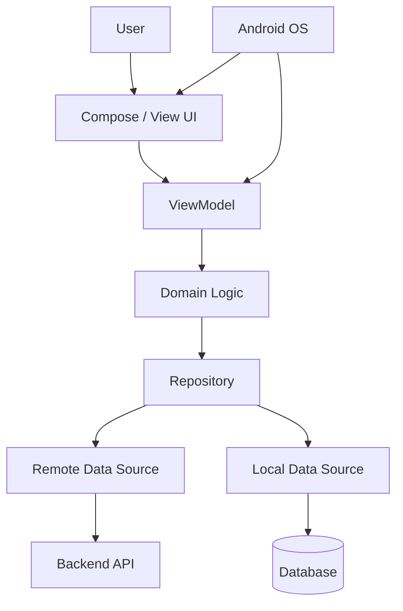
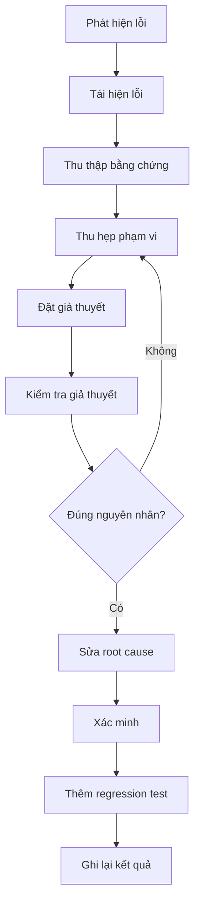
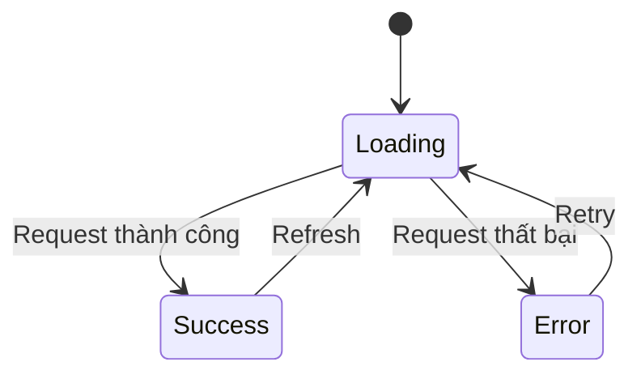

# 007 - Debugging

**Học phần:** 05 - Quality, Release and Portfolio
**Module:** Module 10 - Linting, Debugging and Benchmark
**Nhóm nội dung:** Debugging
**Nguồn roadmap:** Linting, Debugging and Benchmark / Debugging
**Loại bài:** quality
**Thứ tự trong module:** 007
**Thời lượng gợi ý:** 30 phút

---

## 1. Tóm tắt

**Debugging** là quá trình có hệ thống nhằm xác định nguyên nhân, vị trí và điều kiện gây ra lỗi trong ứng dụng, sau đó kiểm chứng rằng cách sửa đã loại bỏ nguyên nhân mà không tạo thêm regression.

Trong Android, debugging không chỉ là đọc `Logcat` hoặc đặt breakpoint. Một lỗi có thể xuất phát từ nhiều tầng khác nhau:

* UI và Compose state;
* `ViewModel`;
* lifecycle;
* coroutine và concurrency;
* navigation;
* repository;
* local database;
* network;
* Android framework;
* permission;
* memory;
* background work;
* cấu hình build;
* thiết bị hoặc phiên bản Android.

Một quy trình debugging tốt giúp developer chuyển từ cách xử lý kiểu:

> "Ứng dụng đang lỗi, thử sửa chỗ này xem sao."

sang cách tiếp cận:

> "Lỗi xảy ra trong điều kiện nào, state nào bị sai, dữ liệu thay đổi ở đâu và bằng chứng nào chứng minh nguyên nhân?"

Debugging vì vậy ảnh hưởng trực tiếp đến độ ổn định, trải nghiệm người dùng, maintainability, thời gian phát triển và rủi ro release.

---

## 2. Mục tiêu học tập

Sau bài học, người học có thể:

* giải thích debugging là gì và vì sao nó khác với việc sửa lỗi bằng phỏng đoán;
* xây dựng quy trình tái hiện, cô lập, phân tích và xác minh một bug;
* sử dụng breakpoint, debugger, `Logcat` và stack trace trong Android Studio;
* phân tích lỗi liên quan đến lifecycle, state, coroutine, network và local storage;
* phân biệt symptom với root cause;
* sử dụng logging có chủ đích thay vì thêm log ngẫu nhiên;
* xác minh bản sửa bằng test hoặc quy trình tái hiện có thể lặp lại;
* lưu lại bằng chứng debugging dưới dạng screenshot, test, README hoặc technical note để đưa vào portfolio.

---

## 3. Khái niệm cốt lõi

### 3.1. Symptom và root cause

**Symptom** là biểu hiện người dùng hoặc developer quan sát được.

Ví dụ:

* màn hình loading mãi;
* ứng dụng crash;
* dữ liệu hiển thị hai lần;
* danh sách không cập nhật;
* request được gọi nhiều lần;
* dữ liệu biến mất sau khi rotate màn hình.

**Root cause** là nguyên nhân gốc thực sự gây ra symptom.

Ví dụ:

```text
Symptom:
Danh sách bị tải lại mỗi lần rotate
        ↓
Nguyên nhân gần:
API được gọi lại
        ↓
Root cause:
Request được khởi chạy trực tiếp trong UI
thay vì state được quản lý bởi ViewModel
```

Một quá trình debugging chưa hoàn thành nếu developer chỉ làm biến mất symptom nhưng chưa hiểu nguyên nhân.

### 3.2. Reproduce và isolate

**Reproduce** là khả năng tái hiện lỗi theo một chuỗi bước nhất định.

Ví dụ:

1. Mở màn hình Profile.
2. Tắt mạng.
3. Nhấn Refresh.
4. Bật lại mạng.
5. Nhấn Refresh lần nữa.
6. Loading không kết thúc.

Nếu không tái hiện được lỗi ổn định, việc kiểm tra giả thuyết sẽ khó đáng tin cậy.

**Isolate** là thu hẹp phạm vi lỗi.

Ban đầu:

```text
Ứng dụng không hiển thị dữ liệu
```

Sau khi cô lập:

```text
UI nhận Loading
Repository gọi API
API trả 200
Mapping thành công
Nhưng ViewModel không cập nhật Success state
```

Phạm vi điều tra đã giảm từ toàn bộ ứng dụng xuống một đoạn logic cụ thể.

### 3.3. Evidence-driven debugging

Debugging nên dựa trên bằng chứng như:

* stack trace;
* breakpoint;
* giá trị biến;
* request và response;
* database state;
* lifecycle event;
* coroutine state;
* test thất bại;
* profiler;
* log có timestamp;
* bước tái hiện lỗi.

Không nên dựa chủ yếu vào:

* đoán;
* sửa nhiều chỗ cùng lúc;
* thêm delay;
* thêm `try-catch` để che exception;
* khởi động lại app rồi kết luận lỗi đã hết.

---

## 4. Vị trí của debugging trong ứng dụng Android

Một bug người dùng nhìn thấy ở UI có thể bắt nguồn từ bất kỳ tầng nào phía dưới.



Ví dụ người dùng thấy:

> "Danh sách bài viết trống."

Nhưng nguyên nhân có thể là:

* Compose không collect đúng `StateFlow`;
* `ViewModel` phát sai state;
* mapper loại bỏ dữ liệu;
* `Repository` trả cache cũ;
* Room query sai;
* API trả lỗi;
* token hết hạn;
* coroutine bị cancel;
* permission hoặc network state thay đổi;
* lifecycle khiến collection dừng.

Vì vậy debugging Android cần nhìn theo **data flow** thay vì chỉ nhìn vào màn hình xảy ra lỗi.

---

## 5. Quy trình debugging có hệ thống

Một workflow thực tế có thể được mô hình hóa như sau:



Quy trình chi tiết:

1. Ghi chính xác symptom.
2. Xác định môi trường xảy ra lỗi.
3. Tạo chuỗi bước tái hiện.
4. Thu thập stack trace, log hoặc trạng thái liên quan.
5. Xác định tầng có khả năng gây lỗi.
6. Đặt một giả thuyết cụ thể.
7. Thiết kế cách kiểm chứng giả thuyết.
8. Thay đổi ít yếu tố nhất có thể.
9. Xác nhận root cause.
10. Sửa nguyên nhân.
11. Chạy lại chuỗi tái hiện.
12. Kiểm tra các luồng liên quan.
13. Viết regression test nếu hợp lý.
14. Ghi lại nguyên nhân và cách sửa.

> **Nguyên tắc:** Mỗi lần thử nên giúp tăng lượng thông tin bạn biết về bug, kể cả khi thử nghiệm không sửa được bug.

---

## 6. Công cụ debugging trong Android Studio

### 6.1. Breakpoint và debugger

Breakpoint cho phép tạm dừng chương trình tại một dòng code cụ thể.

Ví dụ:

```kotlin
fun loadProfile() {
    viewModelScope.launch {
        val result = repository.getProfile()
        _uiState.value = result.toUiState()
    }
}
```

Có thể đặt breakpoint tại:

```kotlin
val result = repository.getProfile()
```

và:

```kotlin
_uiState.value = result.toUiState()
```

Sau đó quan sát:

* `result`;
* biến local;
* field của object;
* call stack;
* thread;
* expression;
* exception.

Debugger đặc biệt hữu ích khi cần biết:

> "Giá trị thực tế tại thời điểm lỗi là gì?"

thay vì chỉ biết:

> "Một đoạn code đã chạy."

### 6.2. Logcat

`Logcat` hữu ích cho các sự kiện diễn ra theo thời gian hoặc khó bắt bằng breakpoint.

Ví dụ:

```kotlin
private const val TAG = "ProfileViewModel"

fun loadProfile() {
    Log.d(TAG, "loadProfile() started")

    viewModelScope.launch {
        runCatching {
            repository.getProfile()
        }.onSuccess { profile ->
            Log.d(TAG, "Profile loaded: id=${profile.id}")
        }.onFailure { error ->
            Log.e(TAG, "Profile loading failed", error)
        }
    }
}
```

Log nên giúp trả lời một câu hỏi debugging cụ thể.

Không nên viết:

```kotlin
Log.d("DEBUG", "here")
Log.d("DEBUG", "here2")
Log.d("DEBUG", "test")
```

Nên viết:

```kotlin
Log.d(
    "CheckoutViewModel",
    "submitOrder: state=$currentState, cartSize=${cart.items.size}"
)
```

> **Lưu ý:** Không log password, access token, refresh token, thông tin thanh toán hoặc dữ liệu người dùng nhạy cảm.

### 6.3. Stack trace

Khi ứng dụng crash, stack trace thường cho biết:

* loại exception;
* thông báo lỗi;
* vị trí xảy ra;
* chuỗi method call dẫn tới lỗi.

Ví dụ:

```text
java.lang.IllegalStateException
    at com.example.profile.ProfileViewModel.loadProfile(ProfileViewModel.kt:42)
    at com.example.profile.ProfileScreenKt.ProfileScreen(ProfileScreen.kt:31)
```

Không nên chỉ đọc dòng đầu.

Hãy xác định:

1. exception là gì;
2. frame nào thuộc code của project;
3. dữ liệu hoặc state nào được sử dụng tại frame đó;
4. call path nào dẫn đến frame đó.

---

## 7. Debugging state và Jetpack Compose

Một nhóm bug phổ biến trong Android hiện đại đến từ state.

Ví dụ sai:

```kotlin
@Composable
fun ProfileScreen(
    viewModel: ProfileViewModel
) {
    viewModel.loadProfile()

    val state by viewModel.uiState.collectAsState()

    // UI
}
```

`Composable` có thể recompose nhiều lần, khiến `loadProfile()` bị gọi nhiều lần.

Một hướng triển khai phù hợp hơn là để `ViewModel` quản lý thời điểm load:

```kotlin
class ProfileViewModel(
    private val repository: ProfileRepository
) : ViewModel() {

    private val _uiState = MutableStateFlow<ProfileUiState>(
        ProfileUiState.Loading
    )

    val uiState: StateFlow<ProfileUiState> = _uiState

    init {
        loadProfile()
    }

    private fun loadProfile() {
        viewModelScope.launch {
            _uiState.value = try {
                val profile = repository.getProfile()
                ProfileUiState.Success(profile)
            } catch (error: Exception) {
                ProfileUiState.Error(
                    message = error.message ?: "Unknown error"
                )
            }
        }
    }
}
```

UI chỉ quan sát state:

```kotlin
@Composable
fun ProfileScreen(
    viewModel: ProfileViewModel
) {
    val state by viewModel.uiState.collectAsState()

    when (val currentState = state) {
        ProfileUiState.Loading -> {
            CircularProgressIndicator()
        }

        is ProfileUiState.Success -> {
            Text(currentState.profile.name)
        }

        is ProfileUiState.Error -> {
            Text(currentState.message)
        }
    }
}
```

Khi debugging Compose, nên kiểm tra:

* state nào đang được đọc;
* state được thay đổi ở đâu;
* event có chạy nhiều lần không;
* key của effect có thay đổi không;
* recomposition có kích hoạt side effect ngoài ý muốn không;
* state có nằm đúng owner hay không.

---

## 8. Debugging lifecycle và configuration change

Một bug điển hình:

> Người dùng rotate màn hình và dữ liệu đang nhập bị mất.

Cần xác định dữ liệu thuộc loại nào.

Ví dụ:

```text
Temporary rendering state
        ↓
Compose state

Screen-level state
        ↓
ViewModel

State cần phục hồi sau process recreation
        ↓
SavedStateHandle hoặc cơ chế persistence phù hợp

Persistent application data
        ↓
Database / DataStore / backend
```

Khi debugging lifecycle, hãy thử ít nhất các tình huống:

1. rotate thiết bị;
2. đưa app xuống background;
3. quay lại app;
4. chuyển sang màn hình khác rồi quay lại;
5. hệ thống recreate `Activity`;
6. process bị tạo lại nếu flow cần hỗ trợ trường hợp này.

Ví dụ `ViewModel` sử dụng `SavedStateHandle`:

```kotlin
class SearchViewModel(
    private val savedStateHandle: SavedStateHandle
) : ViewModel() {

    val query = savedStateHandle.getStateFlow(
        key = "search_query",
        initialValue = ""
    )

    fun updateQuery(value: String) {
        savedStateHandle["search_query"] = value
    }
}
```

---

## 9. Debugging coroutine và asynchronous code

Coroutine bug thường khó quan sát vì các operation không nhất thiết chạy tuần tự trên cùng một execution path.

Ví dụ:

```kotlin
fun refresh() {
    viewModelScope.launch {
        val user = repository.getUser()
        val posts = repository.getPosts(user.id)

        _uiState.value = HomeUiState.Success(
            user = user,
            posts = posts
        )
    }
}
```

Một số lỗi cần kiểm tra:

* coroutine bị cancel;
* exception bị swallow;
* hai coroutine cùng thay đổi state;
* request cũ hoàn thành sau request mới;
* dispatcher không phù hợp;
* job được tạo ở scope sai;
* loading state không được reset;
* `Flow` không được collect;
* collect bị lifecycle dừng.

Ví dụ request search có thể gặp race condition:

```text
Query "and"
     ↓
Request A

Query "android"
     ↓
Request B

Request B hoàn thành trước
     ↓
UI = kết quả "android"

Request A hoàn thành sau
     ↓
UI bị ghi đè bằng kết quả "and"
```

Một hướng xử lý với `Flow`:

```kotlin
val searchResult: StateFlow<SearchUiState> =
    query
        .debounce(300)
        .distinctUntilChanged()
        .flatMapLatest { keyword ->
            repository.search(keyword)
        }
        .map<SearchResult, SearchUiState> {
            SearchUiState.Success(it)
        }
        .catch { error ->
            emit(
                SearchUiState.Error(
                    error.message ?: "Search failed"
                )
            )
        }
        .stateIn(
            scope = viewModelScope,
            started = SharingStarted.WhileSubscribed(5_000),
            initialValue = SearchUiState.Idle
        )
```

`flatMapLatest` giúp flow trước bị hủy khi query mới xuất hiện.

---

## 10. Debugging network và dữ liệu

Khi một request thất bại, không nên kết luận ngay:

> "API lỗi."

Hãy lần theo từng bước:

```text
UI event
   ↓
ViewModel
   ↓
Repository
   ↓
HTTP client
   ↓
Request
   ↓
Backend
   ↓
Response
   ↓
Deserializer
   ↓
Mapper
   ↓
UI state
```

Ví dụ API trả:

```json
{
  "id": 42,
  "display_name": "An"
}
```

Nhưng model khai báo:

```kotlin
data class UserResponse(
    val id: Long,
    val name: String
)
```

Nếu serialization configuration không ánh xạ `display_name` sang `name`, lỗi có thể nằm ở bước deserialize thay vì server.

Khi debugging network cần kiểm tra:

* endpoint;
* HTTP method;
* request header;
* authentication;
* query parameter;
* request body;
* response status;
* response body;
* timeout;
* serialization;
* error mapping;
* retry behavior.

> **Bảo mật:** Không copy token thật, cookie hoặc dữ liệu người dùng nhạy cảm vào issue tracker, screenshot hoặc tài liệu portfolio.

---

## 11. Debugging local storage

Bug dữ liệu local thường liên quan tới:

* Room query;
* migration;
* transaction;
* cache invalidation;
* mapping;
* dữ liệu cũ;
* key sai;
* race giữa local và remote.

Ví dụ:

```kotlin
@Query(
    """
    SELECT *
    FROM users
    WHERE id = :userId
    LIMIT 1
    """
)
suspend fun getUser(userId: Long): UserEntity?
```

Nếu UI hiển thị user sai, cần xác minh:

1. `userId` truyền vào có đúng không;
2. database thực sự chứa record nào;
3. query trả record nào;
4. mapper chuyển `UserEntity` thành domain model ra sao;
5. `Repository` có đang dùng cache khác hay không;
6. UI nhận object nào.

Android Studio Database Inspector có thể hữu ích để đối chiếu state thực tế trong database với state mà application đang sử dụng.

---

## 12. Các lỗi debugging thường gặp

### 12.1. Sửa symptom thay vì root cause

**Hiện tượng:** Request bị gọi hai lần.

Developer thêm:

```kotlin
var alreadyLoaded = false
```

để chặn lần gọi thứ hai.

**Vấn đề:** Nếu nguyên nhân thật là side effect được kích hoạt bởi recomposition, biến cờ chỉ che triệu chứng.

**Cách xử lý:** Tìm lifecycle hoặc state owner phù hợp và đưa operation vào đúng tầng.

### 12.2. Thêm delay để "sửa" race condition

Ví dụ:

```kotlin
delay(500)
loadData()
```

Điều này không đảm bảo race condition biến mất.

Thiết bị nhanh, chậm hoặc network khác nhau có thể khiến lỗi quay lại.

**Cách xử lý:** Đồng bộ hóa flow dựa trên state, structured concurrency hoặc operator phù hợp thay vì thời gian đoán.

### 12.3. Catch mọi exception nhưng không xử lý

Ví dụ:

```kotlin
try {
    repository.sync()
} catch (error: Exception) {
    // Ignore
}
```

Lỗi biến mất khỏi crash report nhưng hệ thống vẫn đang sai.

Nên xử lý hoặc chuyển lỗi thành state rõ ràng:

```kotlin
try {
    repository.sync()
} catch (error: IOException) {
    _uiState.value = SyncUiState.NetworkError
}
```

### 12.4. Thay đổi quá nhiều thứ cùng lúc

Nếu cùng lúc developer:

* sửa repository;
* đổi coroutine;
* đổi API;
* đổi mapper;
* đổi UI;

và lỗi biến mất, rất khó biết thay đổi nào thực sự sửa root cause.

Tốt hơn là:

1. đặt giả thuyết;
2. thay đổi nhỏ;
3. chạy lại;
4. quan sát;
5. tiếp tục thu hẹp.

---

## 13. Best practices

* Tái hiện lỗi trước khi sửa nếu có thể.
* Ghi lại exact steps thay vì mô tả "thỉnh thoảng bị".
* Phân biệt symptom và root cause.
* Kiểm tra state tại ranh giới giữa các layer.
* Chỉ thêm log khi log trả lời một câu hỏi cụ thể.
* Ưu tiên structured state thay cho nhiều boolean rời rạc.
* Không dùng delay tùy ý để che concurrency bug.
* Không swallow exception.
* Không log secret hoặc dữ liệu nhạy cảm.
* Thực hiện thay đổi nhỏ để dễ xác minh giả thuyết.
* Sau khi sửa phải chạy lại chính chuỗi bước từng gây lỗi.
* Kiểm tra cả happy path và failure path.
* Với bug quan trọng, thêm regression test.
* Ghi lại root cause thay vì chỉ ghi "fixed bug".

---

## 14. Kiểm thử sau khi sửa lỗi

Một bug được sửa chưa có nghĩa là công việc đã hoàn thành.

Cần xác minh:

| Test case                 | Kết quả mong đợi                    |
| ------------------------- | ----------------------------------- |
| Luồng từng gây bug        | Bug không còn xuất hiện             |
| Happy path                | Chức năng hoạt động bình thường     |
| Mất mạng                  | App hiển thị trạng thái lỗi phù hợp |
| Rotate màn hình           | State cần giữ không bị mất          |
| Background → foreground   | Không tạo request hoặc event dư     |
| Request thất bại          | Không crash, state được xử lý       |
| Request thành công lại    | UI có thể recovery                  |
| Thực hiện nhanh nhiều lần | Không sinh duplicate operation      |

Nếu bug phù hợp với unit test, nên biến bug thành test trước hoặc sau khi sửa.

Ví dụ:

```kotlin
@Test
fun `load profile emits error when repository fails`() = runTest {
    val repository = FakeProfileRepository(
        result = Result.failure(IOException())
    )

    val viewModel = ProfileViewModel(repository)

    // Assert state theo test architecture của project.
}
```

Regression test giúp ngăn cùng một lỗi quay lại trong các release sau.

---

## 15. Ví dụ thực tế: loading không bao giờ kết thúc

Giả sử người dùng báo:

> Khi mạng yếu, nhấn Refresh đôi lúc màn hình loading mãi.

Một implementation có vấn đề:

```kotlin
fun refresh() {
    viewModelScope.launch {
        _uiState.value = ProfileUiState.Loading

        try {
            val profile = repository.getProfile()
            _uiState.value = ProfileUiState.Success(profile)
        } catch (error: IOException) {
            Log.e("ProfileViewModel", "Refresh failed", error)
        }
    }
}
```

Flow khi request thất bại:

```text
Idle
 ↓
Loading
 ↓
IOException
 ↓
catch
 ↓
Không cập nhật state
 ↓
Loading vĩnh viễn
```

Root cause không phải UI loading indicator.

Root cause là failure path không chuyển state khỏi `Loading`.

Có thể sửa:

```kotlin
fun refresh() {
    viewModelScope.launch {
        _uiState.value = ProfileUiState.Loading

        _uiState.value = try {
            val profile = repository.getProfile()
            ProfileUiState.Success(profile)
        } catch (error: IOException) {
            ProfileUiState.Error(
                message = "Không thể tải dữ liệu. Vui lòng thử lại."
            )
        }
    }
}
```

Flow sau khi sửa:



Điểm quan trọng của ví dụ này là debugging đi theo state transition:

```text
Loading → ?
```

thay vì chỉ nhìn vào component hiển thị loading.

---

## 16. Bảo mật và quyền riêng tư khi debugging

Debugging có thể vô tình làm lộ dữ liệu nhạy cảm nếu logging không được kiểm soát.

Không nên log:

* password;
* access token;
* refresh token;
* API credential bí mật;
* authorization header;
* cookie phiên;
* thông tin thanh toán;
* nội dung riêng tư của người dùng;
* dữ liệu location chính xác nếu không cần thiết.

Ví dụ không nên:

```kotlin
Log.d("Auth", "token=$accessToken")
```

Nếu cần phân biệt request trong môi trường debug, hãy log metadata không nhạy cảm:

```kotlin
Log.d(
    "Auth",
    "Request authentication state: authenticated=${accessToken != null}"
)
```

Ngoài ra:

* kiểm tra log có bị giữ trong production build hay không;
* tránh đưa production user data vào screenshot portfolio;
* redact dữ liệu nhạy cảm trước khi gửi bug report;
* không upload production database ra dịch vụ công khai để debug.

---

## 17. Debugging trong quy trình phát triển

Debugging không nên chỉ bắt đầu sau khi QA báo lỗi.

Một feedback loop tốt có dạng:

```text
Code
 ↓
Build
 ↓
Lint
 ↓
Unit Test
 ↓
Run
 ↓
Observe
 ↓
Debug
 ↓
Fix
 ↓
Regression Test
 ↓
CI
```

Những kiểm tra có thể tự động hóa nên được đưa vào local command hoặc CI.

Ví dụ:

```bash
./gradlew lint
```

```bash
./gradlew test
```

```bash
./gradlew connectedAndroidTest
```

Mục tiêu là biến một lỗi từng cần developer phát hiện thủ công thành một failure có thể tái hiện tự động nếu điều đó hợp lý.

---

## 18. Liên hệ với các chủ đề chất lượng khác

Debugging liên quan chặt chẽ tới các kỹ thuật quality khác trong cùng giai đoạn phát triển.

```text
Static Analysis / Lint
        ↓
Phát hiện vấn đề trước runtime

Testing
        ↓
Phát hiện hành vi sai có thể tái hiện

Debugging
        ↓
Xác định root cause

Profiling / Benchmark
        ↓
Điều tra vấn đề performance

CI
        ↓
Tự động hóa feedback loop

Release
        ↓
Giảm xác suất bug đi vào production
```

Debugging không thay thế testing.

Testing trả lời:

> "Hành vi này có đúng không?"

Debugging trả lời:

> "Nếu không đúng, nguyên nhân nằm ở đâu?"

---

## 19. Bài thực hành

Xây dựng hoặc sử dụng một Android sample app có luồng:

```text
UI
 ↓
ViewModel
 ↓
Repository
 ↓
Fake API hoặc API thật
```

Thực hiện:

1. Tạo một lỗi có chủ đích khiến loading không kết thúc khi repository thất bại.
2. Tái hiện lỗi.
3. Ghi lại từng bước tái hiện.
4. Đặt breakpoint trong `ViewModel`.
5. Quan sát state trước và sau khi gọi repository.
6. Dùng `Logcat` để xác nhận exception.
7. Xác định root cause.
8. Sửa failure path.
9. Kiểm tra lại trường hợp thành công.
10. Kiểm tra trường hợp mất mạng.
11. Rotate màn hình khi đang ở trạng thái lỗi hoặc thành công.
12. Thêm ít nhất một regression test hoặc quy trình kiểm tra có thể lặp lại.
13. Chụp screenshot hoặc lưu ghi chú về quá trình debugging.

Kết quả mong đợi:

* có bước tái hiện rõ ràng;
* xác định được root cause;
* state không còn mắc kẹt;
* ứng dụng không crash khi request thất bại;
* lỗi được biểu diễn thành UI state phù hợp;
* có bằng chứng chứng minh bản sửa hoạt động.

---

## 20. Artifact cho portfolio

Tạo một thư mục hoặc tài liệu nhỏ có cấu trúc tương tự:

```text
debugging-case-study/
├── README.md
├── screenshots/
│   ├── before.png
│   ├── breakpoint.png
│   └── after.png
└── test/
    └── ProfileViewModelTest.kt
```

Trong `README.md`, ghi:

```text
Bug
 ↓
Reproduction steps
 ↓
Observed state
 ↓
Expected state
 ↓
Evidence
 ↓
Root cause
 ↓
Fix
 ↓
Regression test
```

Artifact nên chứng minh rằng bạn không chỉ biết sử dụng debugger mà còn biết xử lý bug theo quy trình kỹ thuật có thể giải thích và lặp lại.

---

## 21. Checklist hoàn thành

* [ ] Tôi giải thích được debugging khác với sửa lỗi bằng phỏng đoán như thế nào.
* [ ] Tôi phân biệt được symptom và root cause.
* [ ] Tôi biết cách tạo reproduction steps rõ ràng.
* [ ] Tôi sử dụng được breakpoint để kiểm tra giá trị runtime.
* [ ] Tôi biết cách đọc phần quan trọng của stack trace.
* [ ] Tôi sử dụng `Logcat` có mục đích thay vì log ngẫu nhiên.
* [ ] Tôi biết cách lần theo state từ UI xuống data layer.
* [ ] Tôi kiểm tra được bug liên quan đến lifecycle hoặc configuration change.
* [ ] Tôi hiểu các vấn đề cơ bản khi debug coroutine và asynchronous flow.
* [ ] Tôi không log token hoặc dữ liệu người dùng nhạy cảm.
* [ ] Tôi xác minh bản sửa bằng chính luồng từng gây lỗi.
* [ ] Tôi có regression test hoặc quy trình kiểm tra lặp lại được.
* [ ] Tôi hoàn thành một debugging case study để đưa vào portfolio.

---

## 22. Câu hỏi tự kiểm tra

1. Sự khác nhau giữa symptom và root cause là gì?
2. Vì sao việc tái hiện bug ổn định rất quan trọng trước khi bắt đầu sửa?
3. Khi một Compose screen gọi API nhiều lần, những yếu tố về state hoặc recomposition nào cần được kiểm tra?
4. Vì sao thêm `delay()` thường không phải là cách sửa đúng cho race condition?
5. Sau khi bug không còn xuất hiện, developer cần làm gì để giảm khả năng regression trong tương lai?

---

## 23. Tổng kết

Debugging là quá trình tìm **nguyên nhân gốc** của hành vi sai bằng bằng chứng runtime thay vì phỏng đoán.

Một workflow debugging tốt có dạng:

```text
Reproduce
    ↓
Observe
    ↓
Isolate
    ↓
Hypothesize
    ↓
Verify
    ↓
Fix
    ↓
Test
    ↓
Document
```

Trong Android, developer cần đặc biệt chú ý tới:

* lifecycle;
* Compose state;
* `ViewModel`;
* coroutine;
* `Flow`;
* network;
* local storage;
* exception;
* permission;
* process và configuration change.

Điểm quan trọng nhất không phải là thuộc nhiều thao tác trong debugger, mà là hình thành khả năng đặt câu hỏi:

> "Bằng chứng nào chứng minh đoạn này là nguyên nhân?"

Khi quy trình debugging có thể tái hiện, kiểm chứng và chuyển thành regression test, debugging trở thành một phần của hệ thống đảm bảo chất lượng thay vì chỉ là hoạt động chữa cháy trước release.
