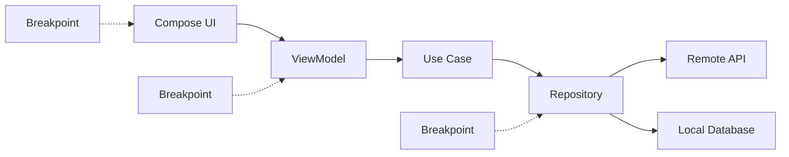
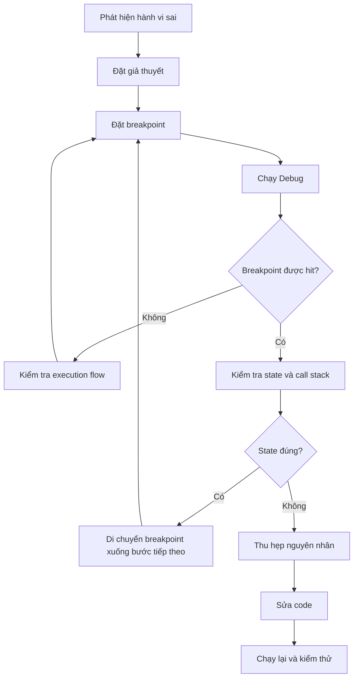

# 008 - Breakpoints

**Học phần:** 05 - Quality, Release and Portfolio
**Module:** Module 10 - Linting, Debugging and Benchmark
**Nhóm nội dung:** Debugging
**Nguồn roadmap:** Linting, Debugging and Benchmark / Debugging
**Loại bài:** quality
**Thứ tự trong module:** 008
**Thời lượng gợi ý:** 30 phút

---

## 1. Tóm tắt

**Breakpoint** là một điểm dừng được đặt trong source code để yêu cầu debugger tạm ngưng chương trình khi luồng thực thi đi đến vị trí tương ứng. Khi ứng dụng đang dừng, developer có thể kiểm tra giá trị biến, call stack, thread hiện tại, biểu thức và trạng thái runtime thay vì chỉ suy đoán lỗi thông qua `Logcat`.

Trong Android Studio, breakpoint là một trong những công cụ debugging cơ bản nhất cho Kotlin, Java và native code. Android Studio hỗ trợ nhiều loại breakpoint như line breakpoint, method breakpoint, field breakpoint, exception breakpoint, conditional breakpoint và logging breakpoint.

Breakpoint đặc biệt hữu ích với những lỗi phụ thuộc vào trạng thái runtime, chẳng hạn:

* `ViewModel` nhận dữ liệu sai;
* một nhánh `if` chỉ xảy ra với một loại dữ liệu;
* coroutine chạy không theo thứ tự mong đợi;
* exception bị bắt rồi che mất nguyên nhân ban đầu;
* state của Compose thay đổi nhưng UI không hiển thị đúng;
* dữ liệu API được mapping sai;
* một hàm bị gọi nhiều lần ngoài dự kiến.

Mục tiêu không phải là đặt breakpoint ở khắp nơi, mà là đặt breakpoint tại những vị trí có giá trị chẩn đoán cao để thu hẹp nhanh nguyên nhân của lỗi.

## 2. Mục tiêu học tập

Sau bài học, người học có thể:

* giải thích breakpoint là gì và vì sao breakpoint hữu ích trong quá trình debugging;
* phân biệt các loại breakpoint phổ biến trong Android Studio;
* đặt, bật, tắt và xóa breakpoint;
* sử dụng `Step Over`, `Step Into`, `Step Out` và `Resume Program`;
* kiểm tra variables, expressions, call stack và threads khi chương trình bị tạm dừng;
* sử dụng conditional breakpoint để tập trung vào một trường hợp lỗi cụ thể;
* sử dụng exception breakpoint để tìm nguồn phát sinh exception;
* sử dụng logging breakpoint khi không muốn tạm dừng chương trình;
* lựa chọn vị trí breakpoint phù hợp trong kiến trúc Android;
* tránh những sai lầm thường gặp khi debug coroutine, Compose và code chạy nhiều thread;
* tạo một báo cáo debugging nhỏ làm artifact cho portfolio.

## 3. Khái niệm cốt lõi

### 3.1. Breakpoint là gì?

Breakpoint có thể hiểu là một chỉ thị dành cho debugger:

> Khi chương trình thực thi tới vị trí này và các điều kiện của breakpoint được thỏa mãn, hãy thực hiện hành động debugging đã cấu hình.

Với line breakpoint thông thường, hành động phổ biến nhất là **suspend execution** — tạm dừng việc thực thi chương trình.

Ví dụ:

```kotlin
fun calculateDiscount(total: Double): Double {
    val discountRate = if (total >= 1_000_000) {
        0.1
    } else {
        0.0
    }

    return total * discountRate
}
```

Nếu kết quả giảm giá không đúng, developer có thể đặt breakpoint tại:

```kotlin
val discountRate = if (total >= 1_000_000) {
```

Khi breakpoint được hit, có thể kiểm tra:

* `total` bằng bao nhiêu;
* nhánh điều kiện nào được chọn;
* hàm được gọi từ đâu;
* thread nào đang chạy;
* lần gọi hiện tại có phải lần developer cần phân tích hay không.

### 3.2. Breakpoint khác logging như thế nào?

Breakpoint và logging đều hỗ trợ debugging nhưng phục vụ những tình huống khác nhau.

| Đặc điểm                   | Breakpoint                 | Logging                            |
| -------------------------- | -------------------------- | ---------------------------------- |
| Tạm dừng chương trình      | Có thể có                  | Không                              |
| Kiểm tra biến runtime      | Rất thuận tiện             | Phải log trước                     |
| Xem call stack             | Có                         | Hạn chế                            |
| Evaluate expression        | Có                         | Không trực tiếp                    |
| Phù hợp lỗi hiếm           | Có, đặc biệt với condition | Có                                 |
| Ảnh hưởng timing           | Có thể đáng kể             | Thường ít hơn                      |
| Có thể để lại trong source | Không                      | Có nguy cơ                         |
| Phù hợp production         | Không                      | Có, nếu logging được thiết kế đúng |

Breakpoint mạnh khi cần khám phá trạng thái mà developer chưa biết trước phải log gì.

Logging phù hợp hơn khi cần theo dõi luồng hoạt động liên tục hoặc lỗi không thể tái hiện dễ dàng trong debugger.

## 4. Các loại breakpoint quan trọng

### 4.1. Line, method và field breakpoint

**Line breakpoint** là loại được sử dụng thường xuyên nhất. Chương trình dừng khi thực thi tới một dòng source code cụ thể.

Android Studio cũng hỗ trợ **method breakpoint**, có thể dừng khi chương trình đi vào hoặc thoát khỏi một method. **Field breakpoint** có thể dừng khi một field được đọc hoặc ghi.

Line breakpoint thường là lựa chọn đầu tiên vì:

* dễ đặt;
* phạm vi rõ ràng;
* dễ kết hợp condition;
* ít gây nhiễu hơn việc theo dõi quá nhiều method.

### 4.2. Exception, conditional và logging breakpoint

**Exception breakpoint** giúp debugger dừng khi một exception được ném ra. Nó đặc biệt hữu ích khi exception bị `catch` ở tầng khác khiến stack trace cuối cùng không chỉ rõ nơi lỗi bắt đầu.

**Conditional breakpoint** chỉ kích hoạt khi một biểu thức điều kiện đúng.

Ví dụ:

```kotlin
user.id == "debug-user"
```

hoặc:

```kotlin
items.size > 100
```

**Logging breakpoint** có thể ghi thông tin ra Logcat mà không cần suspend chương trình, giúp developer quan sát runtime mà không phải thêm `Log.d()` tạm thời vào source code. Android Studio hiện hỗ trợ cả conditional breakpoint và logging breakpoint.

## 5. Vị trí của breakpoint trong kiến trúc Android

Breakpoint không thuộc riêng UI, data layer hay domain layer. Nó là công cụ quan sát runtime có thể được đặt tại bất kỳ tầng nào có code cần phân tích.



Trong một bug thực tế, không nên đặt breakpoint ngẫu nhiên ở mọi tầng. Hãy bắt đầu tại ranh giới mà dữ liệu chuyển từ trạng thái đúng sang trạng thái sai.

Ví dụ, UI hiển thị tên người dùng sai:

1. Kiểm tra state mà UI nhận.
2. Nếu state đã sai, đặt breakpoint ở `ViewModel`.
3. Nếu `ViewModel` nhận dữ liệu sai từ `Repository`, tiếp tục đi xuống data layer.
4. Nếu response API đúng nhưng model sau mapping sai, lỗi nhiều khả năng nằm ở mapper.
5. Nếu repository trả đúng nhưng UI hiển thị sai, quay lại UI/state transformation.

Cách làm này giúp breakpoint trở thành công cụ **thu hẹp phạm vi lỗi** thay vì chỉ là công cụ dừng chương trình.

## 6. Quy trình debug với breakpoint

Một workflow cơ bản có thể mô tả như sau:



Quy trình nên dựa trên giả thuyết.

Ví dụ:

> `UserRepository` có thể trả về đúng dữ liệu, nhưng `ViewModel` đang map `null` thành chuỗi rỗng.

Breakpoint được đặt tại đoạn mapping để xác nhận hoặc bác bỏ giả thuyết đó.

## 7. Sử dụng breakpoint trong Android Studio

Để debug ứng dụng, project cần chạy bằng một debuggable build variant. Build type `debug` mặc định thường đã đáp ứng điều này; custom build type cần được cấu hình `isDebuggable = true` nếu muốn sử dụng debugger.

Một line breakpoint có thể được tạo bằng cách:

1. Mở file Kotlin cần debug.
2. Tìm dòng muốn chương trình dừng.
3. Nhấn vào gutter bên trái số dòng.
4. Chạy ứng dụng bằng chế độ **Debug**.
5. Thực hiện user flow dẫn đến dòng code đó.
6. Khi breakpoint được hit, kiểm tra Debug window.

Android Studio cũng hỗ trợ phím tắt `Control+F8` trên Windows/Linux hoặc `Command+F8` trên macOS để bật/tắt line breakpoint tại dòng hiện tại.

Khi chương trình đang dừng, các thao tác quan trọng gồm:

* **Resume Program:** tiếp tục chương trình tới breakpoint tiếp theo;
* **Step Over:** thực thi dòng hiện tại nhưng không đi sâu vào method được gọi;
* **Step Into:** đi vào method được gọi tại dòng hiện tại;
* **Step Out:** chạy cho tới khi thoát khỏi method hiện tại.

Debugger còn cho phép kiểm tra variable tree, stack frame và thread đang thực thi.

## 8. Ví dụ thực tế

Giả sử ứng dụng có màn hình hiển thị profile nhưng đôi lúc tên người dùng trở thành `"Unknown"`.

```kotlin
data class User(
    val id: String,
    val name: String?
)

data class UserUiState(
    val name: String = "",
    val isLoading: Boolean = false
)
```

`Repository`:

```kotlin
interface UserRepository {
    suspend fun getUser(userId: String): User
}
```

`ViewModel`:

```kotlin
class ProfileViewModel(
    private val repository: UserRepository
) : ViewModel() {

    private val _uiState = MutableStateFlow(UserUiState())
    val uiState: StateFlow<UserUiState> = _uiState

    fun loadUser(userId: String) {
        viewModelScope.launch {
            _uiState.value = _uiState.value.copy(isLoading = true)

            val user = repository.getUser(userId)

            val displayName = user.name
                ?.trim()
                ?.takeIf { it.isNotEmpty() }
                ?: "Unknown"

            _uiState.value = UserUiState(
                name = displayName,
                isLoading = false
            )
        }
    }
}
```

Nếu bug chỉ xảy ra với một người dùng cụ thể, đặt conditional breakpoint tại:

```kotlin
val displayName = user.name
```

với condition:

```kotlin
user.id == "user-123"
```

Khi breakpoint được hit, kiểm tra:

* `user.id`;
* `user.name`;
* giá trị trước và sau `trim()`;
* call stack;
* coroutine hiện tại;
* dữ liệu trả về từ `repository`.

Nếu `user.name` đã `null` ngay khi repository trả về, vấn đề không nằm ở Compose UI.

Developer có thể tiếp tục đặt breakpoint tại implementation của:

```kotlin
repository.getUser(userId)
```

để xác định dữ liệu bị sai từ API, database hay mapper.

## 9. Conditional breakpoint

Conditional breakpoint rất hữu ích khi một đoạn code chạy hàng trăm hoặc hàng nghìn lần nhưng bug chỉ xuất hiện với một trường hợp.

Giả sử:

```kotlin
fun processOrder(order: Order) {
    calculatePrice(order)
}
```

Nếu chỉ đơn hàng có tổng tiền âm bị lỗi, condition có thể là:

```kotlin
order.total < 0
```

Thay vì debugger dừng ở mọi đơn hàng:

```text
Order 1
↓
Dừng

Order 2
↓
Dừng

Order 3
↓
Dừng
```

conditional breakpoint cho phép:

```text
Order 1 ── condition false ──> tiếp tục

Order 2 ── condition false ──> tiếp tục

Order 57 ── total < 0 ───────> DỪNG
```

Đây là một kỹ thuật quan trọng khi debug:

* loop;
* danh sách lớn;
* event stream;
* request lặp lại;
* callback;
* coroutine;
* pagination;
* RecyclerView;
* Compose recomposition.

> **Lưu ý:** Condition của breakpoint được evaluate trong lúc debug. Condition quá phức tạp hoặc breakpoint nằm trên hot path có thể làm quá trình debug chậm đáng kể.

## 10. Breakpoint với Coroutines và Flow

Android hiện đại thường sử dụng Kotlin Coroutines, vì vậy developer không nên giả định execution flow luôn tương ứng với một call stack tuần tự đơn giản.

Ví dụ:

```kotlin
viewModelScope.launch {
    repository.observeUsers()
        .collect { users ->
            _uiState.value = users.toUiState()
        }
}
```

Một breakpoint trong `collect` có thể được hit nhiều lần:

```text
Flow emit #1
    ↓
Breakpoint

Flow emit #2
    ↓
Breakpoint

Flow emit #3
    ↓
Breakpoint
```

Nếu mục tiêu chỉ là tìm emission bất thường, condition sẽ hiệu quả hơn.

Ví dụ:

```kotlin
users.isEmpty()
```

hoặc:

```kotlin
users.size > 100
```

Khi debug coroutine, cần chú ý:

* breakpoint có thể được hit trên thread khác với nơi coroutine được tạo;
* coroutine có thể suspend rồi resume;
* nhiều coroutine có thể cùng chạy một đoạn code;
* một Flow có thể emit nhiều lần;
* breakpoint làm thay đổi timing của chương trình.

Do đó, lỗi race condition hoặc timing-sensitive đôi khi biến mất khi debugger tạm dừng ứng dụng.

## 11. Breakpoint với Jetpack Compose

Compose là declarative UI nên một composable có thể được gọi lại nhiều lần do recomposition.

Ví dụ:

```kotlin
@Composable
fun ProfileScreen(
    state: UserUiState
) {
    Text(text = state.name)
}
```

Đặt line breakpoint trực tiếp trong một composable được recompose thường xuyên có thể khiến debugger dừng liên tục.

Trong trường hợp này, nên ưu tiên kiểm tra nơi state thay đổi:

```text
Repository
    ↓
ViewModel
    ↓
StateFlow
    ↓
collectAsState
    ↓
Composable
```

Nếu state từ `ViewModel` đã đúng nhưng UI vẫn sai, lúc đó mới tập trung vào Compose.

Android Studio cũng có hỗ trợ thông tin liên quan đến parameters và state khi debugger dừng tại composable function.

Đối với vấn đề recomposition, breakpoint không phải lúc nào cũng là công cụ tốt nhất. `Layout Inspector` có thể hỗ trợ kiểm tra recomposition và skipped recomposition của Compose UI.

## 12. Exception breakpoint

Một lỗi có thể bị xử lý như sau:

```kotlin
try {
    repository.loadData()
} catch (exception: Exception) {
    _uiState.value = UiState.Error
}
```

UI chỉ hiển thị:

```text
Something went wrong
```

Nếu exception bị bắt và không được log đầy đủ, developer có thể khó xác định nơi exception ban đầu được tạo.

Exception breakpoint cho phép debugger dừng gần thời điểm exception được throw.

Luồng phân tích trở thành:

```text
Repository
    ↓
Exception được throw
    ↓
Exception Breakpoint
    ↓
Debugger dừng
    ↓
Kiểm tra Call Stack
    ↓
Xác định source lỗi
```

Cách này đặc biệt hữu ích với:

* `NullPointerException`;
* parsing exception;
* database exception;
* networking exception;
* lỗi từ thư viện;
* exception bị `catch` ở tầng cao hơn.

Android Studio cho phép cấu hình exception breakpoint trong Breakpoints window.

## 13. Lỗi thường gặp

### 13.1. Breakpoint không được hit

**Hiện tượng:** Breakpoint đã được đặt nhưng chương trình không bao giờ dừng.

**Nguyên nhân có thể:**

* ứng dụng được chạy bằng **Run** thay vì **Debug**;
* execution flow không đi qua dòng đó;
* build variant không debuggable;
* source đang mở không tương ứng với binary đang chạy;
* breakpoint đang bị disable;
* toàn bộ breakpoints đang bị mute;
* process cần debug chưa được attach.

**Cách xử lý:**

1. Xác nhận ứng dụng chạy bằng debugger.
2. Kiểm tra breakpoint có đang enabled.
3. Kiểm tra `Mute Breakpoints`.
4. Đặt breakpoint sớm hơn trong execution flow.
5. Rebuild ứng dụng nếu source và binary không đồng bộ.
6. Kiểm tra process đang được debugger attach.

Android Studio cho phép bật/tắt breakpoint riêng lẻ cũng như tạm thời mute toàn bộ breakpoint trong Debug window.

### 13.2. Debugger dừng quá nhiều lần

**Hiện tượng:** Một breakpoint bị hit liên tục làm gần như không thể sử dụng ứng dụng.

**Nguyên nhân:**

Breakpoint nằm trong:

* loop;
* callback thường xuyên;
* `Flow.collect`;
* composable bị recompose;
* listener;
* animation;
* polling logic.

**Cách xử lý:**

* thêm condition;
* dùng logging breakpoint;
* đặt breakpoint ở tầng cao hơn;
* tạm disable breakpoint;
* chỉ debug một trường hợp cụ thể.

### 13.3. Bug biến mất khi đặt breakpoint

**Hiện tượng:** Ứng dụng lỗi khi chạy bình thường nhưng hoạt động đúng khi debugger dừng chương trình.

Đây có thể là dấu hiệu của:

* race condition;
* concurrency bug;
* timing dependency;
* debounce/throttle;
* timeout;
* animation timing;
* thread synchronization.

Breakpoint thay đổi timing của chương trình nên có thể vô tình che mất lỗi.

Trong trường hợp đó, nên kết hợp:

* structured logging;
* logging breakpoint;
* tracing;
* profiler;
* test tái hiện concurrency;
* instrumentation phù hợp.

## 14. Best practices

* Đặt breakpoint dựa trên một giả thuyết debugging cụ thể.
* Bắt đầu từ vị trí gần triệu chứng nhất rồi thu hẹp nguyên nhân theo data flow.
* Ưu tiên line breakpoint trước khi dùng breakpoint có phạm vi quá rộng.
* Sử dụng conditional breakpoint với loop, collection hoặc event có tần suất cao.
* Kiểm tra call stack, không chỉ kiểm tra giá trị biến.
* Kiểm tra thread khi bug liên quan concurrency.
* Dùng `Evaluate Expression` để kiểm chứng giả thuyết mà không sửa source code.
* Dùng logging breakpoint nếu việc suspend chương trình làm thay đổi hành vi lỗi.
* Disable hoặc xóa breakpoint không còn sử dụng để tránh gián đoạn lần debug tiếp theo.
* Không coi việc "breakpoint không chạy tới" là lỗi của debugger ngay lập tức; nó thường cho thấy giả định về execution flow đang sai.
* Không sử dụng debugger thay thế cho automated test.
* Không dựa vào breakpoint để phát hiện performance regression; benchmark và profiler phù hợp hơn cho mục đích đó.

## 15. Breakpoint và kiểm thử

Breakpoint là công cụ **điều tra lỗi**, không phải cơ chế đảm bảo lỗi sẽ không quay lại.

Workflow tốt nên là:

```text
Bug
 ↓
Reproduce
 ↓
Breakpoint
 ↓
Root Cause
 ↓
Fix
 ↓
Automated Test
 ↓
Regression Protection
```

Ví dụ phát hiện mapper xử lý sai `null`:

```kotlin
fun User.toDisplayName(): String {
    return name
        ?.trim()
        ?.takeIf { it.isNotEmpty() }
        ?: "Unknown"
}
```

Sau khi xác định và sửa bug, cần tạo test:

```kotlin
class UserMapperTest {

    @Test
    fun `null name returns Unknown`() {
        val user = User(
            id = "1",
            name = null
        )

        val result = user.toDisplayName()

        assertEquals("Unknown", result)
    }

    @Test
    fun `blank name returns Unknown`() {
        val user = User(
            id = "1",
            name = "   "
        )

        val result = user.toDisplayName()

        assertEquals("Unknown", result)
    }
}
```

Breakpoint giúp tìm nguyên nhân.

Test giúp bảo đảm nguyên nhân đó không tạo lại regression trong tương lai.

## 16. Chiến lược debugging thực tế

Một developer nên tránh cách tiếp cận:

```text
Có bug
 ↓
Đặt 20 breakpoint
 ↓
Step qua hàng trăm dòng
 ↓
Hy vọng nhìn thấy lỗi
```

Thay vào đó:

```text
Quan sát triệu chứng
 ↓
Xác định state sai
 ↓
Tìm nơi state được tạo
 ↓
Đặt breakpoint tại boundary
 ↓
Kiểm tra input/output
 ↓
Thu hẹp phạm vi
 ↓
Xác định root cause
```

Ví dụ ứng dụng hiển thị giá sai:

```text
Compose UI
     ↑
 UI State
     ↑
 ViewModel
     ↑
 Price Mapper
     ↑
 Repository
     ↑
 API Response
```

Có thể kiểm tra lần lượt:

1. API trả đúng giá hay không.
2. Repository parse đúng hay không.
3. Mapper chuyển đổi đúng hay không.
4. `ViewModel` tạo state đúng hay không.
5. Compose hiển thị đúng state hay không.

Không cần debug toàn bộ hệ thống cùng lúc.

## 17. Bài thực hành

Xây dựng một màn hình profile đơn giản sử dụng `ViewModel` và `StateFlow`.

Tạo một bug có chủ ý:

```kotlin
val displayName = if (user.name.isNullOrBlank()) {
    user.id
} else {
    "Unknown"
}
```

Đoạn code trên đảo ngược logic mong muốn.

Thực hiện:

1. Chạy ứng dụng ở chế độ Debug.
2. Đặt breakpoint tại phép gán `displayName`.
3. Reproduce lỗi trên UI.
4. Kiểm tra giá trị `user.name`.
5. Sử dụng `Step Over` để xem nhánh được chọn.
6. Kiểm tra call stack.
7. Xác định điều kiện bị viết sai.
8. Sửa logic thành:

```kotlin
val displayName = if (user.name.isNullOrBlank()) {
    "Unknown"
} else {
    user.name
}
```

9. Chạy lại ứng dụng.
10. Thêm unit test để bảo vệ logic.
11. Chụp ảnh Debug window khi breakpoint được hit.
12. Ghi lại root cause và cách sửa trong `README.md`.

Kết quả mong đợi:

* màn hình hiển thị đúng tên;
* developer xác định được nguyên nhân bằng debugger;
* có ít nhất một screenshot breakpoint;
* có unit test chống regression;
* có mô tả ngắn về debugging workflow.

## 18. Artifact cho portfolio

Tạo một thư mục:

```text
debugging-breakpoints/
├── README.md
├── screenshots/
│   └── breakpoint-hit.png
├── app/
└── test/
```

Trong `README.md`, mô tả:

* triệu chứng của bug;
* giả thuyết ban đầu;
* breakpoint được đặt ở đâu;
* condition đã sử dụng nếu có;
* giá trị runtime quan trọng;
* call stack giúp xác định điều gì;
* root cause;
* thay đổi code để sửa lỗi;
* test được thêm để tránh regression.

Một artifact tốt không chỉ nói:

> Tôi biết sử dụng breakpoint.

Nó nên chứng minh:

```text
Bug thực tế
    ↓
Debug strategy
    ↓
Breakpoint
    ↓
Runtime evidence
    ↓
Root cause
    ↓
Fix
    ↓
Regression test
```

Đây là bằng chứng rõ ràng hơn về khả năng debugging và problem-solving của Android developer.

## 19. Checklist hoàn thành

* [ ] Tôi giải thích được breakpoint bằng lời của mình.
* [ ] Tôi biết cách đặt và xóa line breakpoint.
* [ ] Tôi phân biệt được `Step Over`, `Step Into`, `Step Out` và `Resume Program`.
* [ ] Tôi biết kiểm tra Variables và call stack.
* [ ] Tôi biết khi nào nên dùng conditional breakpoint.
* [ ] Tôi hiểu mục đích của exception breakpoint.
* [ ] Tôi biết logging breakpoint khác breakpoint tạm dừng chương trình như thế nào.
* [ ] Tôi biết breakpoint có thể ảnh hưởng tới timing của coroutine và multi-threaded code.
* [ ] Tôi tránh đặt breakpoint thiếu kiểm soát trong composable bị recompose thường xuyên.
* [ ] Tôi đã sử dụng breakpoint để tìm root cause của một bug nhỏ.
* [ ] Tôi đã thêm test sau khi sửa bug.
* [ ] Tôi đã lưu screenshot hoặc debugging report làm artifact cho portfolio.

## 20. Câu hỏi tự kiểm tra

1. Vì sao breakpoint có thể cung cấp nhiều thông tin hơn một câu `Log.d()` đã viết sẵn?
2. Khi một breakpoint trong `Flow.collect` bị hit hàng trăm lần, bạn có thể làm gì để tập trung vào emission gây lỗi?
3. Sự khác nhau giữa `Step Over` và `Step Into` là gì?
4. Vì sao race condition đôi khi biến mất khi chương trình chạy dưới debugger?
5. Sau khi sử dụng breakpoint để tìm được root cause của bug, vì sao developer vẫn nên viết automated test?

## 21. Tổng kết

Breakpoint là một công cụ debugging quan trọng của Android Studio, cho phép developer tạm dừng chương trình tại runtime để kiểm tra state, variables, call stack, thread và execution flow.

Điểm quan trọng nhất không phải là biết cách tạo một chấm đỏ trong editor mà là biết **đặt breakpoint đúng chỗ**.

Một debugging workflow hiệu quả thường đi theo hướng:

```text
Triệu chứng
    ↓
Giả thuyết
    ↓
Breakpoint phù hợp
    ↓
Kiểm tra runtime
    ↓
Thu hẹp phạm vi
    ↓
Root cause
    ↓
Fix
    ↓
Regression test
```

Line breakpoint phù hợp với hầu hết tình huống thông thường; conditional breakpoint giúp xử lý những đoạn code chạy nhiều lần; exception breakpoint giúp lần theo nguồn phát sinh exception; logging breakpoint hữu ích khi không muốn debugger làm gián đoạn execution.

Trong dự án Android thực tế, breakpoint nên được kết hợp với `Logcat`, automated testing, inspection tools, profiler và các kỹ thuật quan sát khác. Breakpoint giúp developer **tìm thấy lỗi**, còn test và quy trình quality giúp ngăn lỗi đó quay trở lại.
