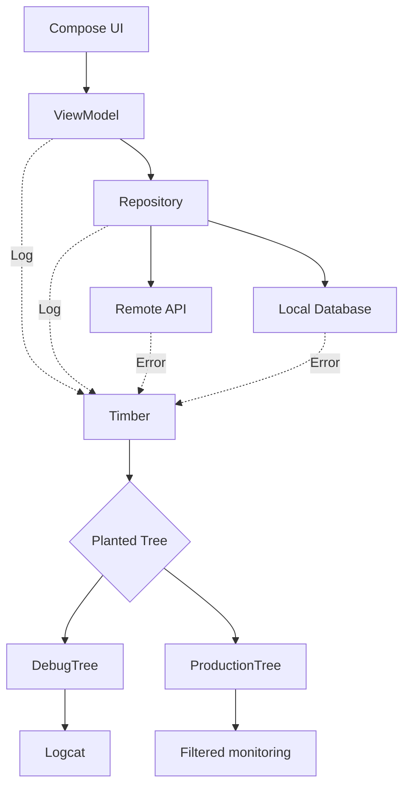
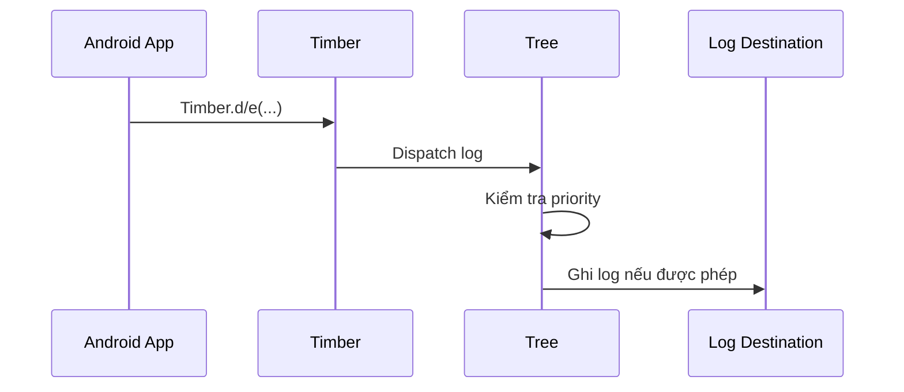
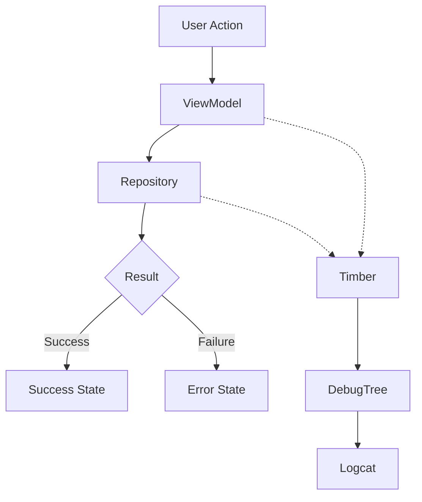

# 009 - Timber

**Học phần:** 05 - Quality, Release and Portfolio
**Module:** Module 10 - Linting, Debugging and Benchmark
**Nhóm nội dung:** Debugging
**Nguồn roadmap:** Linting, Debugging and Benchmark / Debugging
**Loại bài:** quality
**Thứ tự trong module:** 009
**Thời lượng gợi ý:** 30 phút

---

## 1. Tóm tắt

`Timber` là thư viện logging dành cho Android, cung cấp một API nhỏ gọn và có khả năng mở rộng trên cơ chế `android.util.Log`. Thay vì gọi trực tiếp `Log.d()`, `Log.e()` hoặc tự quản lý `TAG` ở nhiều class, ứng dụng có thể sử dụng `Timber` như một lớp logging thống nhất.

Điểm quan trọng của `Timber` không chỉ nằm ở việc viết log ngắn hơn. Thư viện tổ chức quá trình logging thông qua các đối tượng `Tree`, nhờ đó developer có thể dùng `DebugTree` trong môi trường phát triển nhưng áp dụng chiến lược khác khi build production, chẳng hạn chỉ giữ log quan trọng hoặc chuyển lỗi nghiêm trọng sang hệ thống crash reporting. `Timber` không cài đặt `Tree` mặc định; ứng dụng phải chủ động `plant()` chiến lược logging phù hợp.

Trong Android Developer Roadmap, `Timber` thuộc nhóm **Debugging** vì nó hỗ trợ quan sát hành vi ứng dụng, theo dõi state, request, exception và các nhánh xử lý lỗi. Khi sử dụng đúng cách, log giúp giảm thời gian tìm lỗi mà không biến source code thành tập hợp các câu `Log.d()` rời rạc.

## 2. Mục tiêu học tập

Sau bài học, người học có thể:

* Giải thích vai trò của `Timber` trong quá trình debugging Android.
* Phân biệt `Timber`, `Tree`, `DebugTree` và log level.
* Cấu hình `Timber` ở cấp `Application`.
* Ghi log cho `ViewModel`, `Repository`, network và các exception.
* Thiết kế logging khác nhau giữa debug build và production build.
* Nhận biết dữ liệu không nên xuất hiện trong log.
* Sử dụng Logcat để truy vết một luồng xử lý.
* Nhận biết một số lỗi logging mà lint của `Timber` có thể phát hiện.
* Viết một `Tree` tùy chỉnh cho production.
* Tạo một artifact debugging có thể đưa vào portfolio.

## 3. Khái niệm cốt lõi

### 3.1. Timber

`Timber` có thể được xem như một facade cho hoạt động logging của ứng dụng.

Thay vì:

```kotlin
Log.d("ProfileViewModel", "Loading profile")
```

có thể viết:

```kotlin
Timber.d("Loading profile")
```

Khi sử dụng `Timber.DebugTree`, tag có thể được suy ra từ vị trí gọi log thay vì phải hard-code thủ công trong từng class.

Điều này giúp giảm:

* `TAG` khai báo lặp lại.
* Sai tag khi copy code.
* Logic logging phân tán.
* Khó khăn khi muốn thay đổi chiến lược logging toàn ứng dụng.

### 3.2. Tree

`Tree` là abstraction quan trọng nhất trong kiến trúc của `Timber`.

Mỗi `Tree` quyết định log sẽ được xử lý như thế nào.

Ví dụ:

```text
Debug build
→ DebugTree
→ Logcat
```

Trong production có thể là:

```text
Release build
→ ProductionTree
→ bỏ DEBUG/VERBOSE
→ giữ WARNING/ERROR
```

Hoặc:

```text
ERROR
→ ProductionTree
→ Crash reporting service
```

Ứng dụng đăng ký một `Tree` bằng:

```kotlin
Timber.plant(...)
```

Một ứng dụng cũng có thể plant nhiều `Tree` nếu có nhu cầu gửi cùng một log đến nhiều destination.

### 3.3. Log level

Android logging thường sử dụng các mức:

| Level   | Timber         | Ý nghĩa điển hình                                        |
| ------- | -------------- | -------------------------------------------------------- |
| Verbose | `Timber.v()`   | Thông tin cực kỳ chi tiết                                |
| Debug   | `Timber.d()`   | Debug luồng xử lý                                        |
| Info    | `Timber.i()`   | Sự kiện đáng chú ý                                       |
| Warn    | `Timber.w()`   | Tình huống bất thường nhưng chưa gây lỗi nghiêm trọng    |
| Error   | `Timber.e()`   | Exception hoặc lỗi cần điều tra                          |
| Assert  | `Timber.wtf()` | Trạng thái rất bất thường, về lý thuyết không nên xảy ra |

Không nên chọn log level tùy ý. Level là một phần của chiến lược debugging và monitoring.

## 4. Vị trí của Timber trong kiến trúc Android

`Timber` là concern xuyên suốt nhiều layer, nhưng không nên trở thành dependency quyết định business logic.

Một kiến trúc điển hình:



Trong sơ đồ này, `Timber` không truyền dữ liệu nghiệp vụ giữa các layer. Nó chỉ quan sát những điểm quan trọng của flow.

Ví dụ:

* `ViewModel` log khi bắt đầu một operation quan trọng.
* `Repository` log nguồn dữ liệu được lựa chọn.
* Data layer log exception hoặc response bất thường.
* Production `Tree` lọc log trước khi gửi sang monitoring system.

> **Nguyên tắc:** Logging hỗ trợ quan sát hệ thống, nhưng không được trở thành điều kiện để business logic hoạt động đúng.

## 5. Cách hoạt động

Flow cơ bản của `Timber`:

1. Android khởi tạo `Application`.
2. Ứng dụng gọi `Timber.plant()` để đăng ký một hoặc nhiều `Tree`.
3. Code ở các layer gọi `Timber.d()`, `Timber.i()`, `Timber.w()` hoặc `Timber.e()`.
4. `Timber` chuyển log đến các `Tree` đã được plant.
5. Mỗi `Tree` quyết định có xử lý log đó hay không.
6. `DebugTree` thường đưa log đến Android Logcat.
7. `Tree` dành cho production có thể bỏ qua log ít quan trọng hoặc chuyển lỗi cần theo dõi đến hệ thống khác.

Flow có thể hình dung như sau:



Điểm quan trọng là code gọi log không cần biết log cuối cùng được ghi ở đâu.

## 6. Triển khai Timber

### 6.1. Thêm dependency

Tại thời điểm biên soạn, artifact ổn định được Maven Central công bố là `5.0.1`.

Với `build.gradle.kts`:

```kotlin
dependencies {
    implementation("com.jakewharton.timber:timber:5.0.1")
}
```

Sau khi thêm dependency, đồng bộ Gradle.

### 6.2. Khởi tạo trong Application

Tạo custom `Application`:

```kotlin
package com.example.app

import android.app.Application
import com.example.app.BuildConfig
import timber.log.Timber

class App : Application() {

    override fun onCreate() {
        super.onCreate()

        if (BuildConfig.DEBUG) {
            Timber.plant(Timber.DebugTree())
        } else {
            Timber.plant(ProductionTree())
        }
    }
}
```

Khai báo trong `AndroidManifest.xml`:

```xml
<application
    android:name=".App"
    ... >
</application>
```

`Application.onCreate()` là vị trí phù hợp để plant `Tree` sớm trong vòng đời process. Đây cũng là cách sử dụng được tài liệu chính thức của `Timber` hướng dẫn.

### 6.3. Ghi log trong code

Log thông tin debug:

```kotlin
Timber.d("Loading product page=%d", page)
```

Log thông tin:

```kotlin
Timber.i("Background synchronization started")
```

Log cảnh báo:

```kotlin
Timber.w("Cached data is expired")
```

Log exception:

```kotlin
try {
    repository.refresh()
} catch (exception: Exception) {
    Timber.e(exception, "Unable to refresh data")
}
```

Nên truyền trực tiếp `Throwable` thay vì chỉ log `exception.message`, vì stack trace thường quan trọng hơn message đơn lẻ trong quá trình debugging.

### 6.4. Tạo Tree cho production

Một ví dụ tối thiểu:

```kotlin
package com.example.app

import android.util.Log
import timber.log.Timber

class ProductionTree : Timber.Tree() {

    override fun log(
        priority: Int,
        tag: String?,
        message: String,
        t: Throwable?
    ) {
        if (priority < Log.WARN) {
            return
        }

        Log.println(priority, tag ?: "App", message)

        if (priority == Log.ERROR && t != null) {
            reportException(t)
        }
    }

    private fun reportException(throwable: Throwable) {
        // Chuyển exception tới crash reporting service nếu ứng dụng sử dụng.
    }
}
```

Ví dụ này thể hiện một policy:

```text
VERBOSE → bỏ
DEBUG   → bỏ
INFO    → bỏ
WARN    → giữ
ERROR   → giữ + có thể report exception
```

Đây chỉ là một chiến lược. Policy thực tế phải phụ thuộc vào yêu cầu monitoring, privacy và release của project.

## 7. Logging theo layer và lifecycle

### 7.1. ViewModel và UI

`ViewModel` là nơi phù hợp để log các event liên quan tới state transition hoặc operation quan trọng.

Ví dụ:

```kotlin
class ProfileViewModel(
    private val repository: ProfileRepository
) : ViewModel() {

    fun refresh() {
        viewModelScope.launch {
            Timber.d("Refreshing profile")

            runCatching {
                repository.refresh()
            }.onSuccess {
                Timber.d("Profile refresh completed")
            }.onFailure { throwable ->
                Timber.e(throwable, "Profile refresh failed")
            }
        }
    }
}
```

Không nên log trực tiếp trong body của một `@Composable` chỉ để theo dõi việc màn hình xuất hiện:

```kotlin
@Composable
fun ProfileScreen() {
    Timber.d("ProfileScreen rendered")

    // ...
}
```

Composable có thể recompose nhiều lần, khiến Logcat xuất hiện lượng log lớn nhưng không phản ánh một user event thực sự.

Nếu cần theo dõi một side effect theo lifecycle Compose, nên đặt log tại vị trí phù hợp với effect:

```kotlin
@Composable
fun ProfileScreen(
    viewModel: ProfileViewModel
) {
    LaunchedEffect(Unit) {
        Timber.d("Profile screen started")
    }

    // UI...
}
```

### 7.2. Repository và data layer

Repository thường là nơi cần log những sự kiện như:

* Chọn remote hay local source.
* Request thất bại.
* Cache hết hạn.
* Parsing thất bại.
* Database operation lỗi.
* Retry xảy ra.

Ví dụ:

```kotlin
class ProductRepository(
    private val api: ProductApi
) {

    suspend fun loadProducts(): List<Product> {
        Timber.d("Requesting products")

        return try {
            api.getProducts()
        } catch (throwable: Exception) {
            Timber.e(throwable, "Product request failed")
            throw throwable
        }
    }
}
```

Không nên biến toàn bộ Repository thành log từng dòng code. Log phải giúp developer trả lời một câu hỏi cụ thể khi lỗi xảy ra.

## 8. Lint đi kèm Timber

`Timber` cung cấp các lint rule để phát hiện một số cách sử dụng logging không phù hợp ngay trong quá trình phân tích source code.

Một số rule đáng chú ý:

| Rule                      | Vấn đề phát hiện                                       |
| ------------------------- | ------------------------------------------------------ |
| `TimberArgCount`          | Số argument không khớp format string                   |
| `TimberArgTypes`          | Kiểu argument không phù hợp format                     |
| `BinaryOperationInTimber` | Nối chuỗi thủ công trong lời gọi `Timber`              |
| `TimberExceptionLogging`  | Logging exception theo cách dư thừa hoặc không phù hợp |

Ví dụ nên tránh:

```kotlin
Timber.d("User page: " + page)
```

Nên dùng:

```kotlin
Timber.d("User page=%d", page)
```

Một ví dụ format sai:

```kotlin
Timber.d("Page %d loaded in %d ms", page)
```

Format yêu cầu hai argument nhưng chỉ truyền một argument. Lint có thể giúp phát hiện kiểu lỗi này trước runtime.

## 9. Lỗi thường gặp

| Hiện tượng                             | Nguyên nhân                               | Cách xử lý                                                               |
| -------------------------------------- | ----------------------------------------- | ------------------------------------------------------------------------ |
| Không thấy log                         | Chưa `Timber.plant()`                     | Plant `Tree` trong `Application`                                         |
| Debug log xuất hiện trong release      | Production policy chưa filter level       | Dùng `ProductionTree` hoặc chỉ plant `DebugTree` khi `BuildConfig.DEBUG` |
| Logcat quá nhiều dữ liệu               | Log mọi callback, recomposition hoặc loop | Chỉ log các checkpoint có giá trị                                        |
| Không thấy stack trace                 | Chỉ log `exception.message`               | Truyền `Throwable` vào `Timber.e()`                                      |
| Log chứa token hoặc dữ liệu người dùng | Logging object/request nguyên bản         | Redact hoặc bỏ field nhạy cảm                                            |
| Khó tìm request lỗi                    | Message quá chung chung                   | Thêm context không nhạy cảm như operation hoặc request ID                |
| Log bị lặp trong test                  | Không cleanup Tree                        | Gọi `Timber.uprootAll()` trong teardown                                  |
| Log production không nhất quán         | Mỗi class tự quyết định policy            | Tập trung policy trong custom `Tree`                                     |

Một anti-pattern phổ biến là:

```kotlin
Timber.e("Error")
```

Log này gần như không cung cấp context.

Tốt hơn:

```kotlin
Timber.e(
    throwable,
    "Unable to load product catalog"
)
```

Developer lúc này biết operation nào thất bại và có stack trace để truy vết.

## 10. Best practices

* Plant `Tree` tại một điểm tập trung, thường là custom `Application`.
* Chỉ dùng `DebugTree` cho debug build nếu không có lý do cụ thể khác.
* Xây dựng policy logging rõ ràng cho production.
* Log operation và state transition quan trọng, không log từng dòng code.
* Dùng log level nhất quán.
* Truyền trực tiếp `Throwable` khi ghi exception.
* Thêm context đủ để điều tra lỗi nhưng không chứa dữ liệu nhạy cảm.
* Không dùng logging thay thế error handling.
* Không swallow exception chỉ vì đã gọi `Timber.e()`.
* Tránh log liên tục trong loop hoặc hot stream.
* Cẩn thận khi logging trong Compose vì recomposition có thể tạo log lặp.
* Không log toàn bộ HTTP body theo mặc định trong production.
* Không phụ thuộc vào nội dung log để quyết định business logic.
* Kết hợp logging với crash reporting, analytics và tracing theo đúng mục đích của từng công cụ.

Ví dụ không nên làm:

```kotlin
try {
    repository.sync()
} catch (throwable: Throwable) {
    Timber.e(throwable)
}
```

Nếu lỗi cần được xử lý, logging không thay thế phần xử lý đó.

Ví dụ tốt hơn:

```kotlin
try {
    repository.sync()
} catch (throwable: IOException) {
    Timber.w(throwable, "Synchronization failed because of network")

    uiState.value = SyncUiState.Offline
}
```

Ở đây:

```text
Timber
→ ghi nhận lỗi

UI state
→ xử lý ảnh hưởng tới người dùng
```

Hai trách nhiệm hoàn toàn khác nhau.

## 11. Bảo mật và quyền riêng tư

Logging có thể trở thành nguồn rò rỉ dữ liệu nếu developer ghi quá nhiều thông tin.

Không nên log:

* Access token.
* Refresh token.
* Password.
* API secret.
* Session cookie.
* Authorization header.
* OTP.
* Số thẻ thanh toán.
* Dữ liệu sức khỏe nhạy cảm.
* Nội dung tin nhắn riêng tư.
* Location chính xác nếu không thật sự cần cho debugging.
* Toàn bộ object người dùng chỉ vì tiện kiểm tra.

Ví dụ nguy hiểm:

```kotlin
Timber.d("Login token=%s", accessToken)
```

Không nên sửa thành:

```kotlin
Timber.d("Login token=***%s", accessToken.takeLast(4))
```

nếu token không cần xuất hiện trong log.

Tốt hơn:

```kotlin
Timber.d("Authentication completed")
```

Nếu cần correlation giữa client và backend, có thể dùng một request identifier không chứa thông tin định danh trực tiếp:

```kotlin
Timber.d("Request failed requestId=%s", requestId)
```

> **Nguyên tắc:** Log phải cung cấp đủ context để debug nhưng không được trở thành bản sao của dữ liệu người dùng.

## 12. Testing và debugging

### 12.1. Testing

Business logic không nên phụ thuộc trực tiếp vào việc một log đã được ghi hay chưa. Vì vậy, phần lớn unit test nên kiểm tra behavior của feature thay vì kiểm tra text log.

Tuy nhiên, khi phát triển custom `Tree`, có thể tạo `RecordingTree` để kiểm tra logging infrastructure.

```kotlin
class RecordingTree : Timber.Tree() {

    val messages = mutableListOf<String>()

    override fun log(
        priority: Int,
        tag: String?,
        message: String,
        t: Throwable?
    ) {
        messages += message
    }
}
```

Ví dụ test:

```kotlin
import org.junit.After
import org.junit.Assert.assertTrue
import org.junit.Before
import org.junit.Test
import timber.log.Timber

class TimberLoggingTest {

    private lateinit var tree: RecordingTree

    @Before
    fun setUp() {
        tree = RecordingTree()
        Timber.plant(tree)
    }

    @After
    fun tearDown() {
        Timber.uprootAll()
    }

    @Test
    fun logMessage_isRecorded() {
        Timber.d("Sync started")

        assertTrue(
            tree.messages.contains("Sync started")
        )
    }
}
```

Không nên viết hàng loạt test chỉ để xác nhận mọi `Timber.d()` trong application vẫn tồn tại. Giá trị test cao hơn nằm ở business behavior và custom logging infrastructure.

### 12.2. Debugging

Một workflow debugging thực tế:

1. Tái hiện lỗi.
2. Xóa hoặc giới hạn Logcat để giảm noise.
3. Lọc theo package hoặc tag liên quan.
4. Quan sát checkpoint trước lỗi.
5. Xác định layer cuối cùng còn hoạt động đúng.
6. Kiểm tra exception và stack trace.
7. So sánh state trước và sau operation.
8. Sửa nguyên nhân.
9. Chạy lại cùng flow.
10. Xóa những temporary log không còn giá trị.

Ví dụ log:

```text
ProfileViewModel: Refreshing profile
ProfileRepository: Requesting profile
ProfileRepository: Remote request failed
ProfileViewModel: Showing cached profile
```

Chỉ bốn checkpoint nhưng có thể cho thấy toàn bộ failure path:

```text
UI
↓
ViewModel
↓
Repository
↓
Network failure
↓
Fallback cache
↓
UI
```

Đây là logging có chủ đích, khác với việc ghi hàng chục log không có context.

## 13. Ví dụ thực tế

Giả sử một ứng dụng thương mại điện tử thỉnh thoảng không hiển thị sản phẩm sau khi người dùng mở màn hình Home.

Developer có thể đặt các checkpoint:

```kotlin
class HomeViewModel(
    private val repository: ProductRepository
) : ViewModel() {

    fun loadProducts() {
        viewModelScope.launch {
            Timber.d("Product loading started")

            runCatching {
                repository.getProducts()
            }.onSuccess { products ->
                Timber.d(
                    "Product loading completed count=%d",
                    products.size
                )

                // Update UI state.
            }.onFailure { throwable ->
                Timber.e(
                    throwable,
                    "Product loading failed"
                )

                // Update error state.
            }
        }
    }
}
```

Repository:

```kotlin
class ProductRepository(
    private val api: ProductApi,
    private val database: ProductDatabase
) {

    suspend fun getProducts(): List<Product> {
        return try {
            Timber.d("Loading products from remote")

            val products = api.getProducts()

            Timber.d(
                "Remote products received count=%d",
                products.size
            )

            products
        } catch (throwable: IOException) {
            Timber.w(
                throwable,
                "Remote unavailable, loading cache"
            )

            database.productDao().getProducts()
        }
    }
}
```

Khi mất mạng, Logcat có thể cho developer thấy flow:

```text
Product loading started
Loading products from remote
Remote unavailable, loading cache
Product loading completed count=24
```

Developer biết rằng:

* `ViewModel` đã chạy.
* Request remote được thực hiện.
* Network thất bại.
* Fallback cache hoạt động.
* UI cuối cùng vẫn nhận được dữ liệu.

Đó là giá trị chính của logging: biến một flow khó quan sát thành chuỗi sự kiện có thể truy vết.

## 14. Bài thực hành

### 14.1. Yêu cầu

Tạo một ứng dụng Android nhỏ có flow:

```text
Compose UI
↓
ViewModel
↓
Repository
↓
Fake API
```

Ứng dụng phải có hai trạng thái:

```text
Success
Failure
```

Sử dụng `Timber` để log ít nhất các checkpoint:

```text
Request started
↓
Repository called
↓
Request success / failure
↓
UI state updated
```

Production build không được ghi các debug message giống debug build.

### 14.2. Gợi ý triển khai

Thực hiện theo thứ tự:

1. Thêm dependency `Timber`.
2. Tạo custom `Application`.
3. Plant `DebugTree` khi `BuildConfig.DEBUG`.
4. Tạo một `ProductionTree`.
5. Tạo `Repository` có thể giả lập success hoặc failure.
6. Gọi Repository từ `ViewModel`.
7. Log operation bắt đầu.
8. Log kết quả thành công.
9. Log exception khi thất bại.
10. Quan sát flow bằng Logcat.
11. Kiểm tra release policy.
12. Chụp screenshot Logcat thể hiện một success flow và một failure flow.
13. Ghi lại lý do lựa chọn từng log level trong README.

Không được log:

```text
password
token
email người dùng
authorization header
```

### 14.3. Kết quả mong đợi

Sau bài thực hành, project cần thể hiện được flow:



Người học phải có khả năng nhìn Logcat và giải thích chính xác request đi qua những bước nào.

## 15. Artifact cho portfolio

Artifact của bài này nên là một thư mục hoặc mini project có cấu trúc tương tự:

```text
timber-debugging-demo/
├── app/
├── screenshots/
│   ├── success-logcat.png
│   └── failure-logcat.png
├── README.md
└── debugging-notes.md
```

`README.md` nên mô tả:

* Timber được cấu hình ở đâu.
* Debug build sử dụng `Tree` nào.
* Production build sử dụng `Tree` nào.
* Các log level được sử dụng.
* Một success flow.
* Một failure flow.
* Những dữ liệu bị cấm xuất hiện trong log.
* Screenshot Logcat.
* Bài học rút ra sau khi debug.

Artifact này chứng minh rằng người học không chỉ biết gọi:

```kotlin
Timber.d(...)
```

mà còn hiểu cách xây dựng logging strategy cho một ứng dụng thực tế.

## 16. Liên hệ với các chủ đề khác

`Timber` thường xuất hiện cùng các chủ đề quality và debugging khác:

```text
Android Lint
      ↓
Static quality checks

Timber
      ↓
Runtime logging

Crash reporting
      ↓
Production failures

Profiler / Benchmark
      ↓
Performance analysis
```

Vai trò của từng công cụ khác nhau.

`Timber` chủ yếu giúp developer trả lời:

> Trong lúc ứng dụng chạy, chuyện gì đã xảy ra?

Static analysis trả lời:

> Source code có vấn đề nào có thể phát hiện trước khi chạy?

Crash reporting trả lời:

> Người dùng production đang gặp exception hoặc crash nào?

Benchmark và profiler trả lời:

> Ứng dụng đang chậm ở đâu và tiêu tốn tài nguyên như thế nào?

Một hệ thống quality tốt thường kết hợp nhiều loại quan sát thay vì dựa vào một công cụ duy nhất.

## 17. Checklist hoàn thành

* [ ] Tôi giải thích được `Timber` dùng để làm gì.
* [ ] Tôi phân biệt được `Timber`, `Tree` và `DebugTree`.
* [ ] Tôi hiểu vai trò của `Timber.plant()`.
* [ ] Tôi đã cấu hình `Timber` trong custom `Application`.
* [ ] Tôi ghi được log bằng `Timber.d()`, `Timber.i()`, `Timber.w()` và `Timber.e()`.
* [ ] Tôi biết cách truyền `Throwable` khi log exception.
* [ ] Tôi có logging policy riêng cho debug và production.
* [ ] Tôi không log access token, password hoặc dữ liệu nhạy cảm.
* [ ] Tôi hiểu vì sao logging trong body của Composable có thể tạo noise.
* [ ] Tôi biết sử dụng Logcat để theo dõi flow.
* [ ] Tôi nhận biết được các checkpoint có giá trị khi debug.
* [ ] Tôi biết logging không thay thế error handling.
* [ ] Tôi chạy được một success flow.
* [ ] Tôi chạy được một failure flow.
* [ ] Tôi có screenshot hoặc debugging note làm artifact.
* [ ] Tôi đã lưu artifact vào portfolio.

## 18. Câu hỏi tự kiểm tra

1. Vì sao `Timber` thường thuận tiện hơn việc gọi trực tiếp `Log.d()` trong hàng chục class?
2. `Tree` đóng vai trò gì trong kiến trúc của `Timber`?
3. Vì sao không nên plant `DebugTree` một cách vô điều kiện cho mọi build?
4. Vì sao `Timber.e(exception, "Request failed")` hữu ích hơn chỉ log `exception.message`?
5. Logging trong body của một `@Composable` có thể gây vấn đề gì?
6. Tại sao access token không nên được ghi vào Logcat ngay cả trong debug build?
7. Logging và error handling khác nhau như thế nào?
8. Khi một request thất bại, những checkpoint nào nên được log để có thể truy vết flow?
9. Khi nào nên viết custom `Tree`?
10. `Timber` bổ sung cho crash reporting và static analysis như thế nào?

## 19. Tổng kết

`Timber` là một logging abstraction nhỏ nhưng hữu ích trong Android. Thay vì phân tán các lời gọi `Log` và `TAG` trong toàn bộ source code, developer có thể gọi một API thống nhất rồi để các `Tree` quyết định cách xử lý log.

Flow cốt lõi cần nhớ:

```text
Application
↓
Timber.plant(Tree)
↓
Timber.d / i / w / e
↓
Tree
↓
Logcat hoặc monitoring destination
```

Trong development, `DebugTree` giúp việc quan sát Logcat thuận tiện hơn. Trong production, ứng dụng nên có logging policy rõ ràng để lọc log, bảo vệ dữ liệu người dùng và chỉ giữ những thông tin có giá trị vận hành.

Một Android Developer sử dụng `Timber` tốt không phải là người ghi nhiều log nhất, mà là người đặt đúng checkpoint để khi lỗi xuất hiện có thể nhanh chóng trả lời:

```text
Điều gì đã xảy ra?
↓
Nó xảy ra ở layer nào?
↓
State trước đó là gì?
↓
Operation nào thất bại?
↓
Có fallback hay không?
↓
Người dùng bị ảnh hưởng như thế nào?
```

Sau bài học này, artifact quan trọng nhất là một ứng dụng nhỏ có **logging strategy rõ ràng giữa debug và production**, kèm success/failure flow và bằng chứng debugging bằng Logcat.

## 20. Nguồn tham khảo kỹ thuật

* Repository chính thức của `Timber`, bao gồm hướng dẫn `Tree`, `DebugTree`, cách `plant()` và các lint rule tích hợp.
* Maven Central cho artifact `com.jakewharton.timber:timber`, xác nhận phiên bản stable `5.0.1` tại thời điểm biên soạn.
