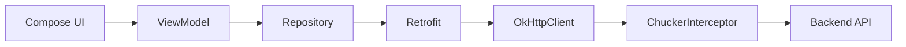
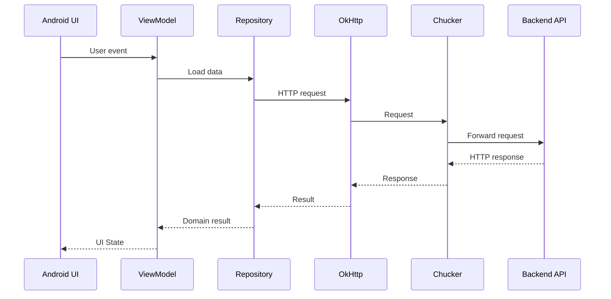

# 010 - Chucker

**Học phần:** 05 - Quality, Release and Portfolio
**Module:** Module 10 - Linting, Debugging and Benchmark
**Nhóm nội dung:** Debugging
**Nguồn roadmap:** Linting, Debugging and Benchmark / Debugging
**Loại bài:** quality
**Thứ tự trong module:** 010
**Thời lượng gợi ý:** 30 phút

---

## 1. Tóm tắt

**Chucker** là một công cụ HTTP inspector dành cho Android, tích hợp trực tiếp với `OkHttp` dưới dạng interceptor. Công cụ này ghi nhận các HTTP/HTTPS request và response phát sinh từ ứng dụng, lưu chúng trong app và cung cấp giao diện để developer kiểm tra URL, method, header, status code, thời gian thực thi và body của request/response.

Trong quá trình phát triển Android, Chucker đặc biệt hữu ích khi cần xác định một lỗi xuất phát từ UI, `ViewModel`, `Repository`, serialization hay backend. Thay vì chỉ nhìn Logcat hoặc thêm nhiều câu lệnh `Log.d()`, developer có thể xem trực tiếp dữ liệu mạng thực tế mà ứng dụng đã gửi và nhận.

Chucker thuộc nhóm **debugging và quality tooling**, không phải thành phần nghiệp vụ của ứng dụng. Công cụ nên được sử dụng trong development/debug build và không nên thu thập dữ liệu HTTP nhạy cảm trong production. Tài liệu chính thức cũng cảnh báo transaction được lưu bởi Chucker có thể chứa `Authorization`, cookie hoặc nội dung request/response nhạy cảm.

---

## 2. Mục tiêu học tập

Sau bài học, người học có thể:

* Giải thích được Chucker là gì và vấn đề mà công cụ này giải quyết.
* Xác định vị trí của Chucker trong network stack của ứng dụng Android.
* Tích hợp Chucker với `OkHttp` và `Retrofit`.
* Quan sát và phân tích HTTP request/response bằng giao diện Chucker.
* Phân biệt lỗi network, lỗi serialization và lỗi business logic thông qua dữ liệu HTTP.
* Che các header nhạy cảm trước khi Chucker lưu transaction.
* Hiểu ảnh hưởng của Chucker đến debugging, privacy, performance và release.
* Thiết kế cấu hình để Chucker chỉ phục vụ development/debugging.
* Tạo một artifact debugging có thể đưa vào portfolio.

---

## 3. Khái niệm cốt lõi

### 3.1. HTTP inspector trong Android

HTTP inspector là công cụ cho phép developer quan sát các HTTP transaction giữa ứng dụng và server.

Một transaction thường bao gồm:

* URL.
* HTTP method như `GET`, `POST`, `PUT`, `PATCH`, `DELETE`.
* Request headers.
* Request body.
* Response status code.
* Response headers.
* Response body.
* Thời gian request.
* Kích thước dữ liệu.

Ví dụ một ứng dụng gọi:

```text
GET /api/users/42
```

Nếu UI hiển thị lỗi, developer cần biết:

```text
UI sai?
Repository sai?
Request sai?
Server trả lỗi?
JSON không parse được?
```

Chucker giúp trả lời nhanh các câu hỏi liên quan đến phần network.

### 3.2. Chucker hoạt động như `OkHttp Interceptor`

Trong ứng dụng sử dụng `OkHttp`, Chucker được thêm vào `OkHttpClient` dưới dạng interceptor.

Luồng đơn giản:

```text
Application
    ↓
Retrofit
    ↓
OkHttp
    ↓
ChuckerInterceptor
    ↓
Network
```

Khi một request đi qua interceptor, Chucker có thể ghi nhận thông tin request và response để hiển thị trong giao diện debugging.

Theo tài liệu chính thức, Chucker hoạt động như một `OkHttp Interceptor`, lưu HTTP transaction bên trong ứng dụng và cung cấp UI để kiểm tra hoặc chia sẻ dữ liệu đó.

---

## 4. Vị trí của Chucker trong kiến trúc Android

Trong kiến trúc Android phổ biến:



Chucker nằm ở **network infrastructure layer**, gần `OkHttpClient`.

Chucker không nên:

* chứa business logic;
* quyết định UI state;
* thay thế `Repository`;
* thay thế error handling;
* thay thế automated test.

Vai trò của nó là **quan sát network traffic để hỗ trợ debugging**.

Ví dụ, luồng nghiệp vụ có thể là:

```text
Compose
   ↓
ViewModel
   ↓
Repository
   ↓
Retrofit
   ↓
OkHttp + Chucker
   ↓
Backend
```

Nếu backend trả:

```http
HTTP/1.1 401 Unauthorized
```

Chucker có thể giúp developer thấy rằng lỗi xuất hiện từ server hoặc authentication layer, thay vì mất thời gian tìm lỗi trong Compose UI.

---

## 5. Cách Chucker hoạt động

Một HTTP transaction qua Chucker có thể hình dung theo trình tự:

1. Người dùng thực hiện một hành động trong ứng dụng.
2. UI gửi event đến `ViewModel`.
3. `ViewModel` gọi `Repository`.
4. `Repository` gọi Retrofit service.
5. Retrofit tạo HTTP request.
6. Request được chuyển cho `OkHttpClient`.
7. `ChuckerInterceptor` quan sát request.
8. `OkHttp` gửi request đến backend.
9. Backend trả response.
10. `ChuckerInterceptor` ghi nhận response.
11. Response tiếp tục được trả về Retrofit.
12. Retrofit deserialize dữ liệu.
13. `Repository` xử lý kết quả.
14. `ViewModel` cập nhật UI state.



Điểm quan trọng là Chucker chỉ **quan sát và ghi nhận transaction**. Business flow vẫn phải hoạt động bình thường khi Chucker không được sử dụng.

---

## 6. Tích hợp Chucker

### 6.1. Thêm dependency

Chucker được phân phối qua Maven Central. README chính thức hiện minh họa dependency `4.2.0`.

Với `build.gradle.kts` của app module:

```kotlin
dependencies {
    debugImplementation(
        "com.github.chuckerteam.chucker:library:4.2.0"
    )

    releaseImplementation(
        "com.github.chuckerteam.chucker:library-no-op:4.2.0"
    )
}
```

Ở đây:

* `debugImplementation` sử dụng Chucker thật.
* `releaseImplementation` sử dụng biến thể `library-no-op`.

Cách cấu hình này cho phép code network giữ cùng API giữa build type nhưng tránh đưa chức năng HTTP inspection thực tế vào release build. Tài liệu dự án khuyến nghị sử dụng cặp `library` và `library-no-op` cho mục đích này.

> **Lưu ý:** Không nên chuyển Chucker sang `implementation` chỉ để cấu hình đơn giản hơn, vì mục tiêu của công cụ là debugging trong development.

### 6.2. Thêm `ChuckerInterceptor`

Ví dụ tối thiểu:

```kotlin
import android.content.Context
import com.chuckerteam.chucker.api.ChuckerInterceptor
import okhttp3.OkHttpClient

fun createOkHttpClient(
    context: Context
): OkHttpClient {
    return OkHttpClient.Builder()
        .addInterceptor(
            ChuckerInterceptor.Builder(context)
                .build()
        )
        .build()
}
```

Sau khi client này thực hiện HTTP request, Chucker có thể ghi nhận transaction.

---

## 7. Tích hợp với Retrofit

Một cấu hình thực tế thường gồm:

```text
Retrofit
    ↓
OkHttpClient
    ├── Authentication Interceptor
    ├── ChuckerInterceptor
    └── Other Interceptors
```

Ví dụ:

```kotlin
import android.content.Context
import com.chuckerteam.chucker.api.ChuckerInterceptor
import okhttp3.OkHttpClient
import retrofit2.Retrofit
import retrofit2.converter.gson.GsonConverterFactory

fun createRetrofit(
    context: Context
): Retrofit {
    val chuckerInterceptor = ChuckerInterceptor.Builder(context)
        .build()

    val okHttpClient = OkHttpClient.Builder()
        .addInterceptor(chuckerInterceptor)
        .build()

    return Retrofit.Builder()
        .baseUrl("https://example.com/")
        .client(okHttpClient)
        .addConverterFactory(GsonConverterFactory.create())
        .build()
}
```

Sau đó tạo API:

```kotlin
interface UserApi {

    @GET("api/users/{id}")
    suspend fun getUser(
        @Path("id") id: Long
    ): UserDto
}
```

Khi gọi:

```kotlin
val user = userApi.getUser(42)
```

developer có thể kiểm tra request tương ứng trong Chucker.

---

## 8. Cấu hình nâng cao

### 8.1. `ChuckerCollector`

`ChuckerCollector` kiểm soát cách Chucker thu thập dữ liệu.

Ví dụ:

```kotlin
val collector = ChuckerCollector(
    context = context,
    showNotification = true,
    retentionPeriod = RetentionManager.Period.ONE_HOUR
)
```

Có thể cấu hình thời gian lưu transaction và việc hiển thị notification. API này được tài liệu chính thức minh họa trong cấu hình Chucker.

### 8.2. `ChuckerInterceptor.Builder`

Ví dụ cấu hình đầy đủ hơn:

```kotlin
val chuckerInterceptor =
    ChuckerInterceptor.Builder(context)
        .collector(collector)
        .maxContentLength(250_000L)
        .redactHeaders(
            "Authorization",
            "Cookie"
        )
        .alwaysReadResponseBody(true)
        .createShortcut(true)
        .build()
```

Một số cấu hình đáng chú ý:

| Cấu hình                   | Vai trò                                      |
| -------------------------- | -------------------------------------------- |
| `collector()`              | Chọn `ChuckerCollector`                      |
| `maxContentLength()`       | Giới hạn lượng body được lưu                 |
| `redactHeaders()`          | Che giá trị header nhạy cảm                  |
| `alwaysReadResponseBody()` | Đọc toàn bộ response body phục vụ inspection |
| `createShortcut()`         | Điều khiển việc tạo shortcut cho Chucker     |

Các tùy chọn này được cung cấp bởi builder hiện tại của Chucker.

---

## 9. Sử dụng Chucker để debug lỗi thực tế

### 9.1. Debug lỗi `401 Unauthorized`

Giả sử UI hiển thị:

```text
Không thể tải dữ liệu.
```

Chucker cho thấy:

```text
GET /api/profile

Status: 401 Unauthorized
```

Developer tiếp tục kiểm tra request headers và phát hiện:

```text
Authorization: không tồn tại
```

Luồng suy luận:

```text
UI hiển thị lỗi
    ↓
Chucker: HTTP 401
    ↓
Kiểm tra Authorization header
    ↓
Header bị thiếu
    ↓
Kiểm tra AuthInterceptor
```

Như vậy lỗi có khả năng nằm ở authentication/network configuration, không phải Compose UI.

### 9.2. Debug request body sai

Giả sử backend yêu cầu:

```json
{
  "email": "user@example.com",
  "password": "example"
}
```

nhưng ứng dụng gửi:

```json
{
  "username": "user@example.com",
  "password": "example"
}
```

Server trả:

```text
400 Bad Request
```

Chucker giúp thấy request body thực tế, từ đó developer có thể kiểm tra:

* DTO.
* `@SerializedName`.
* serializer.
* API contract.
* mapping giữa domain model và request model.

> **Lưu ý:** Ví dụ trên minh họa cấu trúc debugging. Không nên lưu hoặc chia sẻ password thực tế thông qua Chucker.

---

## 10. Những thông tin nên kiểm tra trong một transaction

Khi một API có lỗi, không nên chỉ nhìn status code.

Có thể kiểm tra lần lượt:

1. HTTP method có đúng không.
2. URL có đúng environment không.
3. Query parameter có đúng không.
4. Request header có đầy đủ không.
5. Authentication token có được gửi không.
6. Request body có đúng schema không.
7. Response status code là gì.
8. Response body chứa error message nào.
9. Response header có thông tin đặc biệt không.
10. Request mất bao lâu.
11. Response body có đúng format mà Retrofit converter mong đợi không.

Ví dụ:

```text
UI lỗi
 ↓
Request đúng?
 ├── Không → sửa client
 └── Có
      ↓
Response đúng?
 ├── Không → kiểm tra backend/API contract
 └── Có
      ↓
Deserialize đúng?
 ├── Không → kiểm tra DTO/converter
 └── Có → kiểm tra Repository/ViewModel/UI
```

Cách tiếp cận này giúp thu hẹp phạm vi debugging thay vì thay đổi code ngẫu nhiên.

---

## 11. Bảo mật và quyền riêng tư

Chucker có thể lưu:

* `Authorization` header.
* Cookie.
* Access token.
* Refresh token.
* Email.
* User ID.
* Request body.
* Response body.
* Thông tin cá nhân từ backend.

Tài liệu chính thức cảnh báo rõ dữ liệu được Chucker thu thập có thể chứa thông tin nhạy cảm và công cụ được thiết kế cho development thay vì production deployment.

Do đó cần áp dụng các nguyên tắc:

* Không sử dụng Chucker thật trong production.
* Dùng `library-no-op` cho release build.
* Che các header nhạy cảm.
* Không chụp hoặc chia sẻ transaction chứa token thật.
* Không đưa response chứa dữ liệu người dùng vào issue công khai.
* Giới hạn thời gian lưu transaction.
* Kiểm tra dữ liệu trước khi export hoặc chia sẻ.

Ví dụ:

```kotlin
val chuckerInterceptor =
    ChuckerInterceptor.Builder(context)
        .redactHeaders(
            "Authorization",
            "Cookie",
            "X-Api-Key"
        )
        .build()
```

Tài liệu Chucker cung cấp `redactHeaders()` để thay thế giá trị các header được chỉ định trong giao diện inspection.

> **Nguyên tắc:** Debugging thuận tiện không được đánh đổi bằng việc làm rò rỉ token hoặc dữ liệu người dùng.

---

## 12. Notification trên Android 13 trở lên

Chucker có thể hiển thị notification về network activity.

Từ Android 13, việc hiển thị notification phụ thuộc vào permission:

```text
android.permission.POST_NOTIFICATIONS
```

Nếu permission chưa được cấp, Chucker vẫn có thể ghi nhận network transaction nhưng notification sẽ không xuất hiện. Tài liệu chính thức của Chucker mô tả hành vi này cho Android 13 trở lên.

Không nên yêu cầu notification permission trong production chỉ vì Chucker cần notification.

Nếu ứng dụng không có chức năng notification thật, developer có thể mở Chucker bằng shortcut hoặc cơ chế debugging thích hợp thay vì làm thay đổi UX production chỉ để phục vụ công cụ development.

---

## 13. Chucker và lifecycle/state

Chucker không trực tiếp quản lý:

* `Lifecycle`.
* `ViewModel`.
* Compose state.
* `StateFlow`.
* navigation state.

Tuy nhiên Chucker rất hữu ích để xác định network request có bị gọi lại ngoài ý muốn hay không.

Ví dụ:

```text
Mở màn hình
    ↓
GET /profile

Rotate
    ↓
GET /profile

Quay lại màn hình
    ↓
GET /profile
```

Nếu Chucker cho thấy API được gọi quá nhiều lần, developer cần kiểm tra:

* request đang được gọi trực tiếp từ Composable hay không;
* `LaunchedEffect` có key đúng không;
* dữ liệu có được giữ trong `ViewModel` không;
* `Repository` có caching không;
* collector của `Flow` có bị tạo lại không.

Do đó Chucker có thể hỗ trợ phát hiện các vấn đề về lifecycle gián tiếp thông qua pattern network traffic.

---

## 14. Ảnh hưởng đến performance

Chucker là debugging tool, vì vậy việc ghi nhận transaction tạo thêm overhead so với network stack không có inspector.

Một số yếu tố có thể làm tăng chi phí:

* lưu request/response;
* xử lý body lớn;
* hiển thị transaction;
* lưu nhiều request trong thời gian dài;
* đọc response body để phục vụ inspection.

Do đó:

* không dùng Chucker làm công cụ benchmark performance production;
* không kết luận latency production chỉ dựa trên debug build có Chucker;
* nên giới hạn `maxContentLength()` khi API trả body rất lớn;
* nên giảm retention period nếu có lượng request lớn.

Ví dụ:

```kotlin
.maxContentLength(250_000L)
```

giúp giới hạn lượng content mà Chucker lưu cho một transaction. Tùy chọn này được hỗ trợ trong `ChuckerInterceptor.Builder`.

---

## 15. Chucker so với các công cụ debugging khác

| Công cụ                          | Phù hợp nhất                                  |
| -------------------------------- | --------------------------------------------- |
| Chucker                          | Xem HTTP transaction trực tiếp từ Android app |
| Logcat                           | Log ứng dụng, exception và lifecycle          |
| Android Studio Network Inspector | Quan sát network từ Android Studio            |
| Database Inspector               | Kiểm tra database local                       |
| Layout Inspector                 | Kiểm tra UI hierarchy và Compose              |
| Profiler                         | Phân tích CPU, memory và resource usage       |

Chucker đặc biệt thuận tiện khi:

* developer đang test trực tiếp trên thiết bị;
* không muốn phụ thuộc hoàn toàn vào Android Studio;
* tester cần xem request/response ngay trên build debug;
* cần xác nhận API payload nhanh.

Chucker không thay thế các công cụ khác. Một workflow debugging tốt thường kết hợp nhiều nguồn dữ liệu.

---

## 16. Lỗi thường gặp

### 16.1. Không thấy request trong Chucker

**Hiện tượng:** API chạy nhưng danh sách Chucker không có transaction.

**Nguyên nhân có thể:**

* Retrofit đang sử dụng một `OkHttpClient` khác.
* `ChuckerInterceptor` chưa được thêm vào client.
* request được thực hiện bởi thư viện không sử dụng client đã cấu hình.
* đang chạy build không chứa Chucker thực.

**Cách xử lý:**

Kiểm tra client được truyền cho Retrofit:

```kotlin
Retrofit.Builder()
    .baseUrl(BASE_URL)
    .client(okHttpClient)
    .build()
```

và xác nhận interceptor:

```kotlin
OkHttpClient.Builder()
    .addInterceptor(chuckerInterceptor)
    .build()
```

### 16.2. Chucker làm lộ token

**Hiện tượng:** `Authorization` token xuất hiện trong transaction.

**Nguyên nhân:** Header chưa được redact.

**Cách xử lý:**

```kotlin
ChuckerInterceptor.Builder(context)
    .redactHeaders("Authorization")
    .build()
```

Không chia sẻ screenshot hoặc HAR cũ nếu transaction đã chứa token thật.

### 16.3. API xuất hiện nhưng body bị cắt

**Hiện tượng:** Response body chỉ hiển thị một phần.

**Nguyên nhân có thể:** `maxContentLength` giới hạn dữ liệu được lưu.

**Cách xử lý:** Chỉ tăng giới hạn khi thực sự cần và cân nhắc chi phí memory/storage.

### 16.4. Không thấy notification

**Hiện tượng:** Chucker ghi nhận request nhưng không hiện notification trên thiết bị Android mới.

**Nguyên nhân có thể:** `POST_NOTIFICATIONS` chưa được cấp trên Android 13 trở lên.

**Cách xử lý:** Kiểm tra permission hoặc mở Chucker bằng shortcut/debug entry point.

---

## 17. Best practices

* Chỉ sử dụng Chucker trong development/debugging.
* Dùng `debugImplementation` cho Chucker thật.
* Dùng `releaseImplementation` với `library-no-op`.
* Redact `Authorization`, cookie và API key.
* Không xem Chucker là một cơ chế security.
* Không phụ thuộc vào Chucker để xử lý lỗi.
* Không thêm business logic vào interceptor debugging.
* Không lưu body lớn hơn mức cần thiết.
* Không chia sẻ transaction chứa dữ liệu thật của người dùng.
* Kết hợp Chucker với Logcat và debugger khi phân tích lỗi.
* Kiểm tra cả request lẫn response trước khi kết luận backend có lỗi.
* Sau khi sửa bug, bổ sung automated test nếu bug có khả năng tái diễn.

---

## 18. Kiểm thử cấu hình Chucker

Chucker chủ yếu là debugging tool nên phần kiểm thử tập trung vào network configuration và release safety.

| Test case                      | Kết quả mong đợi                        |
| ------------------------------ | --------------------------------------- |
| Debug build gọi API thành công | Transaction xuất hiện trong Chucker     |
| API trả `400`                  | Có thể xem error response               |
| API trả `401`                  | Status code hiển thị chính xác          |
| Header `Authorization` tồn tại | Giá trị nhạy cảm đã được redact         |
| Response body lớn              | Ứng dụng không crash                    |
| Release build                  | Không có chức năng HTTP inspection thực |
| Mất mạng                       | App xử lý lỗi mà không crash            |

Một kiểm tra release quan trọng là xác nhận developer tooling không làm thay đổi hành vi production.

Có thể build release bằng:

```bash
./gradlew assembleRelease
```

và chạy regression test đối với network flow chính.

---

## 19. Workflow debugging đề xuất

Khi gặp lỗi liên quan API, có thể sử dụng quy trình:

1. Tái hiện lỗi.
2. Mở transaction tương ứng trong Chucker.
3. Kiểm tra HTTP method và URL.
4. Kiểm tra query parameter.
5. Kiểm tra request header.
6. Kiểm tra request body.
7. Kiểm tra status code.
8. Kiểm tra response body.
9. Xác định lỗi nằm ở client, API contract hay backend.
10. Dùng Logcat/debugger để tiếp tục phân tích tầng liên quan.
11. Sửa lỗi.
12. Chạy lại request.
13. Xác nhận transaction đã đúng.
14. Bổ sung test để ngăn regression.

Quy trình này giúp chuyển debugging từ:

```text
Đoán lỗi
    ↓
Thử sửa
    ↓
Chạy lại
```

thành:

```text
Quan sát
    ↓
Thu thập bằng chứng
    ↓
Khoanh vùng
    ↓
Sửa
    ↓
Xác minh
```

---

## 20. Ví dụ thực tế

Một ứng dụng thương mại điện tử có màn hình checkout.

Người dùng nhấn:

```text
Đặt hàng
```

nhưng ứng dụng hiển thị:

```text
Không thể tạo đơn hàng.
```

Chucker cho thấy:

```text
POST /api/orders

Status: 422 Unprocessable Entity
```

Request:

```json
{
  "productId": 10,
  "quantity": 0
}
```

Backend trả:

```json
{
  "error": "quantity must be greater than 0"
}
```

Từ transaction này developer có thể xác định:

* network vẫn hoạt động;
* endpoint đúng;
* backend nhận request;
* lỗi nằm ở dữ liệu `quantity`;
* client cần validate hoặc sửa mapping trước khi gửi.

Sau khi sửa, request trở thành:

```json
{
  "productId": 10,
  "quantity": 1
}
```

và server trả:

```text
201 Created
```

Đây là ví dụ điển hình về giá trị của HTTP inspection trong debugging.

---

## 21. Bài thực hành

### 21.1. Yêu cầu

Tạo hoặc sử dụng một Android app có:

* Kotlin.
* Retrofit.
* OkHttp.
* Một REST API đơn giản.
* Chucker trong debug build.

Thực hiện ít nhất ba tình huống:

1. Request thành công.
2. Request trả lỗi HTTP.
3. Request có header cần redact.

Lưu bằng chứng gồm:

* screenshot transaction thành công;
* screenshot transaction lỗi;
* screenshot cho thấy header nhạy cảm đã được redact.

### 21.2. Kết quả mong đợi

Sau bài thực hành, project cần chứng minh được:

```text
Android App
    ↓
Retrofit
    ↓
OkHttp
    ↓
Chucker
    ↓
REST API
```

Người học phải giải thích được:

* request nào được gửi;
* server trả gì;
* lỗi nằm ở tầng nào;
* Chucker giúp phát hiện lỗi ra sao;
* dữ liệu nhạy cảm đã được bảo vệ như thế nào.

---

## 22. Bài tập mở rộng

Tạo một endpoint giả định:

```text
POST /api/login
```

với request:

```json
{
  "email": "student@example.com",
  "password": "secret"
}
```

Thực hiện các yêu cầu:

1. Gọi endpoint bằng Retrofit.
2. Quan sát transaction bằng Chucker.
3. Đảm bảo `Authorization` hoặc token trong response header không bị lộ.
4. Tạo một request cố ý sai.
5. Ghi lại status code và response lỗi.
6. Viết một technical note ngắn mô tả quá trình tìm lỗi.
7. Thêm ít nhất một test hoặc validation để lỗi không tái diễn.

> **Quan trọng:** Không sử dụng credential thật trong bài tập.

---

## 23. Artifact cho portfolio

Tạo một thư mục hoặc mini project:

```text
android-network-debugging-demo/
├── app/
├── screenshots/
│   ├── successful-request.png
│   ├── failed-request.png
│   └── redacted-header.png
└── README.md
```

Trong `README.md`, mô tả:

* Chucker là gì.
* Vị trí của Chucker trong network architecture.
* Cách tích hợp với Retrofit và OkHttp.
* Một lỗi API đã được phát hiện bằng Chucker.
* Cách bảo vệ header nhạy cảm.
* Cách đảm bảo Chucker không trở thành debugging feature trong production.

Artifact tốt nên cho thấy không chỉ khả năng **cài library**, mà còn khả năng **debug có phương pháp**.

---

## 24. Liên hệ với các chủ đề khác

Chucker có quan hệ trực tiếp với các chủ đề trong Android network và quality:

```text
Retrofit
    ↓
OkHttp
    ↓
Interceptor
    ↓
Chucker
    ↓
Debugging
    ↓
Testing
    ↓
Release Quality
```

Một developer Android cần kết hợp kiến thức từ:

* Retrofit để hiểu API invocation.
* OkHttp để hiểu network client và interceptor.
* DTO/serialization để kiểm tra payload.
* Coroutines để hiểu request bất đồng bộ.
* Repository để xác định nơi điều phối dữ liệu.
* Logcat để phân tích exception.
* Testing để ngăn lỗi tái diễn.
* Release process để đảm bảo debugging dependency không ảnh hưởng production.

---

## 25. Câu hỏi tự kiểm tra

1. Vì sao Chucker được tích hợp ở tầng `OkHttp` thay vì `ViewModel`?
2. Chucker giúp phân biệt lỗi client và lỗi backend như thế nào?
3. Vì sao không nên sử dụng Chucker thật trong production?
4. `redactHeaders()` giải quyết rủi ro bảo mật nào?
5. Nếu Chucker cho thấy API trả `200 OK` nhưng ứng dụng vẫn crash khi xử lý dữ liệu, developer nên kiểm tra tầng nào tiếp theo?

---

## 26. Checklist hoàn thành

* [ ] Tôi giải thích được Chucker là HTTP inspector cho Android.
* [ ] Tôi hiểu vị trí của `ChuckerInterceptor` trong network stack.
* [ ] Tôi tích hợp được Chucker với `OkHttpClient`.
* [ ] Tôi sử dụng được Chucker cùng Retrofit.
* [ ] Tôi đọc được method, URL, header, request body và response body.
* [ ] Tôi phân tích được lỗi HTTP `4xx` hoặc `5xx`.
* [ ] Tôi biết cách redact header nhạy cảm.
* [ ] Tôi hiểu rủi ro khi lưu token hoặc dữ liệu người dùng.
* [ ] Tôi phân biệt được debug dependency và release dependency.
* [ ] Tôi kiểm tra được một API lỗi bằng Chucker.
* [ ] Tôi hoàn thành bài thực hành.
* [ ] Tôi lưu screenshot và technical note làm artifact portfolio.

---

## 27. Tổng kết

Chucker là một công cụ debugging network hữu ích trong Android, hoạt động bằng cách tích hợp `ChuckerInterceptor` vào `OkHttpClient`. Công cụ cho phép developer quan sát request và response thực tế, từ đó nhanh chóng khoanh vùng lỗi giữa network, API contract, serialization, repository và UI.

Điểm quan trọng nhất không phải chỉ là cài được Chucker mà là biết sử dụng dữ liệu HTTP để debug có hệ thống:

```text
Quan sát transaction
    ↓
Kiểm tra request
    ↓
Kiểm tra response
    ↓
Khoanh vùng lỗi
    ↓
Sửa nguyên nhân
    ↓
Kiểm thử lại
```

Trong project thực tế, Chucker nên được xem là **development/debugging tool**, cần tách khỏi production behavior và phải đặc biệt chú ý đến token, cookie, request body, response body cùng các dữ liệu người dùng nhạy cảm.

Sau bài học, artifact tối thiểu nên là một Android demo sử dụng Retrofit + OkHttp + Chucker, kèm transaction thành công, transaction lỗi, cấu hình redact dữ liệu nhạy cảm và ghi chú mô tả quy trình debugging.
