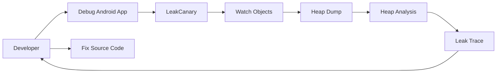
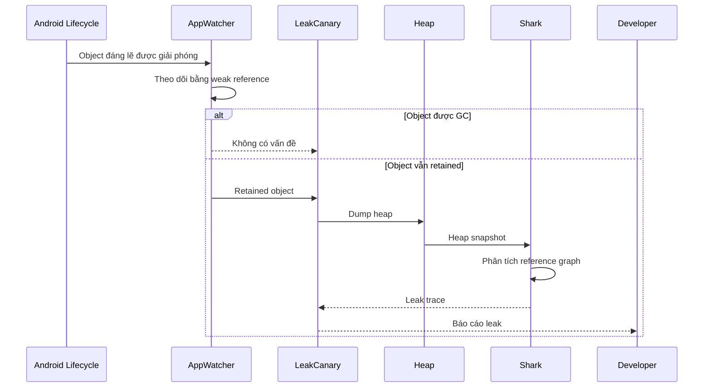
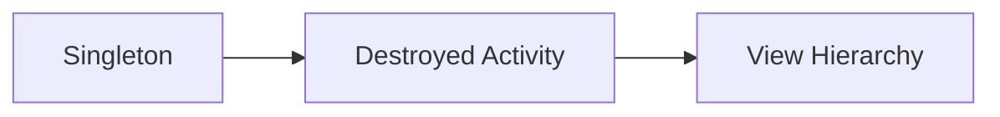
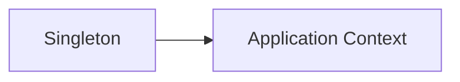

# 011 - LeakCanary

**Học phần:** 05 - Quality, Release and Portfolio
**Module:** Module 10 - Linting, Debugging and Benchmark
**Nhóm nội dung:** Debugging
**Nguồn roadmap:** Linting, Debugging and Benchmark / Debugging
**Loại bài:** quality
**Thứ tự trong module:** 011
**Thời lượng gợi ý:** 30 phút

---

## 1. Tóm tắt

`LeakCanary` là thư viện phát hiện **memory leak** trong ứng dụng Android. Memory leak xảy ra khi một object không còn cần thiết nhưng vẫn bị giữ bởi một hoặc nhiều strong reference, khiến Garbage Collector không thể thu hồi vùng nhớ của object đó.

Trong Android, memory leak thường liên quan trực tiếp đến lifecycle. Ví dụ, một `Activity` đã chạy `onDestroy()` hoặc một `Fragment View` đã chạy `onDestroyView()` đáng lẽ phải có thể được giải phóng, nhưng một singleton, callback, listener hoặc biến giữ reference vẫn tiếp tục tham chiếu đến chúng.

`LeakCanary` theo dõi các object đáng lẽ phải được giải phóng, phát hiện object bị giữ lại, tạo heap dump và phân tích đường tham chiếu khiến object không thể được Garbage Collector thu hồi. Theo tài liệu chính thức, LeakCanary tự động theo dõi nhiều loại Android object như `Activity`, `Fragment`, Fragment `View`, `ViewModel` và `Service`. ([square.github.io][1])

Trong Android Developer Roadmap, `LeakCanary` thuộc nhóm **Debugging** vì nó giúp developer tìm các lỗi quản lý bộ nhớ khó quan sát bằng functional testing thông thường. Một ứng dụng có thể không crash nhưng vẫn leak memory, khiến RAM tăng dần, UI giật, Garbage Collection xảy ra thường xuyên hơn hoặc cuối cùng bị hệ điều hành kết thúc vì thiếu bộ nhớ.

---

## 2. Mục tiêu học tập

Sau bài học, người học có thể:

* Giải thích được memory leak trong môi trường Android.
* Giải thích vai trò của `LeakCanary` trong quá trình debugging.
* Phân biệt object đang còn được sử dụng với object bị retained ngoài ý muốn.
* Cài đặt `LeakCanary` trong debug build.
* Tạo một memory leak có chủ đích để kiểm tra cơ chế phát hiện.
* Đọc được cấu trúc cơ bản của một leak trace.
* Xác định reference có khả năng giữ `Activity`, `Fragment` hoặc `View`.
* Sửa một số memory leak phổ biến liên quan đến lifecycle.
* Xây dựng workflow kiểm tra memory leak trước khi release.
* Tạo báo cáo debugging có thể sử dụng làm artifact trong portfolio.

---

## 3. Khái niệm cốt lõi

### 3.1. Memory leak

Trong Android/JVM, object được giải phóng khi Garbage Collector xác định rằng object đó không còn reachable từ các **GC Root**.

Memory leak xuất hiện khi:

```text
Object không còn cần thiết
        +
Vẫn tồn tại strong reference
        ↓
Garbage Collector không thể thu hồi
        ↓
Memory tiếp tục bị chiếm giữ
```

Ví dụ:

```kotlin
object UserSessionHolder {
    var currentActivity: Activity? = null
}
```

Nếu một `Activity` thực hiện:

```kotlin
UserSessionHolder.currentActivity = this
```

sau đó bị destroy nhưng reference trên không được xóa, singleton vẫn sống cùng process và tiếp tục giữ `Activity`.

Khi đó:

```text
Singleton
   ↓
Activity đã bị destroy
   ↓
View hierarchy
   ↓
Drawable / Bitmap / Adapter / Context / ...
```

Một reference tưởng như nhỏ có thể gián tiếp giữ cả một object graph lớn.

> **Nguyên tắc quan trọng:** Memory leak không có nghĩa là ứng dụng lập tức hết RAM. Nó có nghĩa là memory đáng lẽ có thể được thu hồi nhưng vẫn bị giữ lại.

### 3.2. Retained object và leaking object

Hai khái niệm không hoàn toàn đồng nghĩa.

**Retained object** là object vẫn tồn tại trong memory sau thời điểm mà LeakCanary kỳ vọng nó có thể trở thành weakly reachable.

**Leaking object** là object thực sự bị giữ lại do một đường strong reference không hợp lý.

Một retained object có thể chỉ đang bị giữ tạm thời. LeakCanary cần phân tích heap để xác định đường reference và đánh giá khả năng leak.

Theo cơ chế của LeakCanary, `ObjectWatcher` dùng weak reference để theo dõi object đáng lẽ phải được giải phóng. Khi object vẫn bị retained, LeakCanary có thể dump heap và sử dụng Shark để phân tích object graph. ([square.github.io][2])

### 3.3. GC Root và leak trace

**GC Root** là điểm bắt đầu mà Garbage Collector coi là reachable.

Ví dụ GC Root có thể liên quan đến:

* thread đang hoạt động;
* biến trên thread stack;
* class/static reference;
* JNI reference;
* các runtime object đặc biệt.

Một **leak trace** mô tả đường strong reference từ GC Root đến object bị giữ lại.

Mô hình đơn giản:

```text
GC Root
   ↓
Singleton
   ↓
Listener
   ↓
Activity
```

Nếu `Activity` đã bị destroy nhưng vẫn tồn tại trên đường này, developer cần tìm reference nào đáng lẽ phải được xóa.

LeakCanary mô tả leak trace như một đường strong reference từ GC Root tới retained object, giúp thu hẹp các reference đáng nghi thay vì yêu cầu developer tự đọc toàn bộ heap dump. ([square.github.io][3])

---

## 4. Vị trí của LeakCanary trong quy trình Android

`LeakCanary` không nằm trong business logic của ứng dụng. Nó là công cụ hỗ trợ developer trong môi trường development/debugging.



Flow này thể hiện vai trò của LeakCanary:

1. Developer chạy debug build.
2. LeakCanary quan sát lifecycle và object.
3. Object đáng lẽ phải được giải phóng được theo dõi.
4. Nếu object vẫn retained, heap có thể được dump.
5. Heap được phân tích.
6. Leak trace được tạo.
7. Developer xác định reference gây lỗi.
8. Source code được sửa.
9. Flow được chạy lại để xác nhận leak biến mất.

LeakCanary vì vậy liên hệ trực tiếp với:

* Android lifecycle;
* memory management;
* debugging;
* performance;
* code quality;
* regression testing;
* release readiness.

---

## 5. LeakCanary hoạt động như thế nào?

### 5.1. Theo dõi object

LeakCanary tích hợp với Android lifecycle để biết thời điểm một số object đáng lẽ không còn được giữ.

Ví dụ:

```text
Activity
   ↓
onDestroy()
   ↓
Đáng lẽ không còn được giữ lâu dài
```

Tương tự:

```text
Fragment View
   ↓
onDestroyView()
   ↓
View hierarchy đáng lẽ được giải phóng
```

LeakCanary sử dụng object watcher để theo dõi các object này bằng weak reference. ([square.github.io][2])

### 5.2. Phát hiện retained object

Nếu object vẫn tồn tại sau thời gian kiểm tra và Garbage Collection, nó có thể được đánh dấu là retained.

Điều này chưa có nghĩa developer phải sửa object cuối cùng trong trace.

Vấn đề thường nằm ở một reference phía trước:

```text
Singleton
   ↓
callback
   ↓
Fragment
   ↓
View
```

Reference cần sửa có thể là:

```text
Singleton.callback
```

chứ không phải bản thân `View`.

### 5.3. Heap dump

Khi cần phân tích sâu hơn, LeakCanary tạo **heap dump**.

Heap dump là snapshot mô tả các object đang tồn tại trong heap cùng quan hệ reference giữa chúng.

LeakCanary sử dụng thông tin này để tìm:

```text
GC Root
    ↓
Reference
    ↓
Reference
    ↓
Retained Object
```

Theo tài liệu chính thức, heap analysis của LeakCanary sử dụng thư viện `Shark`. ([square.github.io][2])

### 5.4. Tạo leak trace

Quy trình tổng thể có thể biểu diễn như sau:



Developer sau đó đọc leak trace, xác định reference bất thường và sửa source code.

---

## 6. Cài đặt LeakCanary

LeakCanary nên được khai báo bằng `debugImplementation` để chỉ xuất hiện trong debug build.

Với Gradle Kotlin DSL:

```kotlin
dependencies {
    debugImplementation("com.squareup.leakcanary:leakcanary-android:2.14")
}
```

Tài liệu chính thức hiện sử dụng `2.14` trong hướng dẫn Getting Started và nhấn mạnh việc sử dụng `debugImplementation`. Việc tích hợp thông thường không yêu cầu thêm code khởi tạo. ([square.github.io][1])

> **Lưu ý:** Version dependency là dữ liệu có thể thay đổi. Khi triển khai project mới, nên kiểm tra tài liệu chính thức thay vì giả định version trong giáo trình luôn là version mới nhất.

Sau khi chạy debug build, có thể kiểm tra Logcat với tag:

```text
LeakCanary
```

Hoặc sử dụng `adb`:

```bash
adb logcat | grep LeakCanary
```

Log cho thấy quá trình cài đặt `AppWatcher` có thể được dùng để xác nhận LeakCanary đã được khởi tạo. ([square.github.io][4])

---

## 7. Ví dụ memory leak trong Android

### 7.1. Giữ Activity trong singleton

Giả sử ứng dụng cần lưu một `Context` để sử dụng ở nơi khác.

Developer viết:

```kotlin
object AnalyticsHelper {

    var context: Context? = null

    fun initialize(context: Context) {
        this.context = context
    }
}
```

Trong `MainActivity`:

```kotlin
class MainActivity : ComponentActivity() {

    override fun onCreate(savedInstanceState: Bundle?) {
        super.onCreate(savedInstanceState)

        AnalyticsHelper.initialize(this)
    }
}
```

`AnalyticsHelper` là singleton nên có thể tồn tại trong toàn bộ lifetime của process.

Nếu `context` trỏ tới `MainActivity`, object graph có thể trở thành:

```text
GC Root
   ↓
AnalyticsHelper
   ↓
context
   ↓
MainActivity
   ↓
View hierarchy
```

Khi `MainActivity` bị destroy, singleton vẫn giữ reference đến nó.

Đây là memory leak.

### 7.2. Sửa bằng Application Context

Nếu helper thực sự chỉ cần application-level `Context`, hãy lưu `applicationContext`:

```kotlin
object AnalyticsHelper {

    private var context: Context? = null

    fun initialize(context: Context) {
        this.context = context.applicationContext
    }
}
```

Object graph lúc này trở thành:

```text
AnalyticsHelper
      ↓
Application Context
```

`Application` tồn tại cùng process nên việc giữ application context không tạo ra cùng loại lifecycle mismatch như giữ một `Activity`.

> Không nên thay mọi `Activity Context` bằng `applicationContext` một cách máy móc. Một số API hoặc UI operation thực sự cần Activity/Window context. Cần lựa chọn context dựa trên lifetime và mục đích sử dụng.

---

## 8. Leak phổ biến với Fragment View Binding

### 8.1. Cách viết có nguy cơ leak

Một lỗi rất phổ biến là giữ `ViewBinding` lâu hơn lifecycle của Fragment View.

Ví dụ:

```kotlin
class ProfileFragment : Fragment(R.layout.fragment_profile) {

    private var binding: FragmentProfileBinding? = null

    override fun onViewCreated(
        view: View,
        savedInstanceState: Bundle?
    ) {
        super.onViewCreated(view, savedInstanceState)

        binding = FragmentProfileBinding.bind(view)
    }
}
```

Nếu không xóa `binding`, Fragment vẫn có thể giữ reference tới View sau `onDestroyView()`.

Lifecycle cần phân biệt:

```text
Fragment lifecycle
──────────────────────────────────>

       Fragment View lifecycle
       ├─────────────────┤
       create          destroy
```

Fragment có thể vẫn tồn tại trong khi View của nó đã bị destroy.

Do đó:

```text
Fragment
   ↓
binding
   ↓
Root View
   ↓
Child Views
   ↓
Context
```

có thể giữ cả View hierarchy không cần thiết.

### 8.2. Xóa binding đúng lifecycle

Cách xử lý:

```kotlin
class ProfileFragment : Fragment(R.layout.fragment_profile) {

    private var _binding: FragmentProfileBinding? = null

    private val binding: FragmentProfileBinding
        get() = requireNotNull(_binding)

    override fun onViewCreated(
        view: View,
        savedInstanceState: Bundle?
    ) {
        super.onViewCreated(view, savedInstanceState)

        _binding = FragmentProfileBinding.bind(view)
    }

    override fun onDestroyView() {
        _binding = null
        super.onDestroyView()
    }
}
```

Điểm quan trọng không nằm ở tên `_binding`.

Điểm quan trọng là:

```text
View được tạo
    ↓
binding bắt đầu giữ View
    ↓
View được destroy
    ↓
binding phải bỏ reference
```

Đây là ví dụ điển hình cho nguyên tắc:

> Lifetime của reference không được dài hơn lifetime hợp lý của object mà nó giữ.

---

## 9. Cách đọc leak trace

Giả sử báo cáo được đơn giản hóa thành:

```text
GC Root
│
├─ com.example.AppSingleton
│    ↓ listener
├─ com.example.ProfileListener
│    ↓ activity
╰→ com.example.ProfileActivity
```

Trong đó:

```text
ProfileActivity
```

đã bị destroy.

Không nên chỉ nhìn object cuối cùng và kết luận:

> `ProfileActivity` bị lỗi.

Cần đọc ngược object graph:

```text
Ai giữ Activity?
        ↓
ProfileListener.activity

Ai giữ ProfileListener?
        ↓
AppSingleton.listener
```

Reference đáng nghi có thể là:

```text
AppSingleton.listener
```

hoặc:

```text
ProfileListener.activity
```

Quy trình phân tích nên là:

1. Xác định object cuối cùng bị retained.
2. Xác định lifecycle mong đợi của object đó.
3. Đọc từ GC Root xuống object.
4. Tìm reference đầu tiên có lifetime dài bất hợp lý.
5. Tìm source code tạo reference.
6. Xác định nơi reference đáng lẽ phải được clear.
7. Sửa code.
8. Chạy lại đúng user flow.
9. Xác nhận leak không còn xuất hiện.

LeakCanary hỗ trợ tìm leak trace và thu hẹp các reference đáng nghi, nhưng việc hiểu business logic và lựa chọn cách sửa cuối cùng vẫn là trách nhiệm của developer. ([square.github.io][3])

---

## 10. Những nguyên nhân memory leak thường gặp

| Nguyên nhân               | Ví dụ                                          | Cách xử lý                           |
| ------------------------- | ---------------------------------------------- | ------------------------------------ |
| Singleton giữ `Activity`  | `object` lưu `Activity`                        | Không giữ hoặc dùng lifetime phù hợp |
| Fragment giữ View         | Không xóa View Binding                         | Xóa tại `onDestroyView()`            |
| Listener không unregister | `addListener()` nhưng không `removeListener()` | Hủy listener đúng lifecycle          |
| Callback giữ UI           | Callback dài hạn tham chiếu `Activity`         | Hủy callback hoặc tách reference     |
| Handler/Runnable          | Task giữ owner quá lâu                         | Cancel task khi lifecycle kết thúc   |
| Observer sai lifecycle    | Observer tồn tại sau UI                        | Dùng lifecycle-aware API             |
| Adapter giữ reference     | Adapter giữ Fragment/Activity không cần thiết  | Giảm scope của reference             |
| Coroutine sai scope       | Job sống lâu hơn UI owner                      | Dùng lifecycle-aware coroutine scope |

Memory leak thường không phải do object “quá lớn”.

Lỗi thực chất thường là:

```text
Lifetime của A
      >
Lifetime hợp lý của B

A giữ B
      ↓
B không được giải phóng
```

---

## 11. Lỗi thường gặp khi sử dụng LeakCanary

**Hiện tượng:** LeakCanary báo `Activity` bị retained sau khi rotate.

**Nguyên nhân:** Một singleton, callback, listener hoặc object có lifetime dài đang giữ instance cũ của `Activity`.

**Cách xử lý:** Đọc leak trace và tìm reference nối từ object sống lâu đến `Activity` đã destroy.

---

**Hiện tượng:** Leak xảy ra với Fragment View nhưng Fragment vẫn đang tồn tại.

**Nguyên nhân:** Fragment lifecycle và Fragment View lifecycle khác nhau.

**Cách xử lý:** Xóa reference đến View, adapter hoặc binding trong `onDestroyView()` khi chúng chỉ thuộc View lifecycle.

---

**Hiện tượng:** Developer thấy object retained và sửa bằng cách gọi `System.gc()`.

**Nguyên nhân:** Nhầm giữa Garbage Collection và reference leak.

**Cách xử lý:** Tìm strong reference đang giữ object. `System.gc()` không giải quyết object vẫn reachable.

---

**Hiện tượng:** LeakCanary không xuất hiện trong release build.

**Nguyên nhân:** Dependency được khai báo bằng `debugImplementation`.

**Cách xử lý:** Đây thường là cấu hình mong muốn. LeakCanary chủ yếu được sử dụng trong quá trình development/debugging.

---

**Hiện tượng:** Functional test đều pass nhưng LeakCanary vẫn tìm thấy leak.

**Nguyên nhân:** Functional test kiểm tra kết quả hành vi, trong khi memory leak liên quan đến object lifetime và memory graph.

**Cách xử lý:** Đưa memory leak checking thành một phần riêng của quality workflow.

---

## 12. Best practices

* Chỉ giữ reference lâu bằng thời gian thực sự cần thiết.
* Không lưu `Activity`, `Fragment` hoặc `View` trong singleton nếu không có lý do lifecycle rõ ràng.
* Phân biệt `applicationContext` và Activity context.
* Clear Fragment View Binding tại `onDestroyView()`.
* Hủy listener, callback hoặc subscription khi owner không còn tồn tại.
* Ưu tiên lifecycle-aware API.
* Với coroutine liên quan UI, ưu tiên `viewModelScope` hoặc `lifecycleScope` theo đúng owner.
* Không dùng `GlobalScope` để xử lý công việc phụ thuộc UI lifecycle.
* Không xem Garbage Collection thủ công là giải pháp cho leak.
* Kiểm tra leak trên các user flow có nhiều lifecycle transition.
* Sau khi sửa leak, phải tái tạo chính user flow ban đầu để kiểm chứng.
* Không chỉ tối ưu số byte retained; trước tiên phải hiểu reference nào sai về lifecycle.

---

## 13. Chiến lược kiểm thử và debugging

### 13.1. User flow nên kiểm tra

Các flow có nguy cơ cao gồm:

1. Mở màn hình.
2. Đóng màn hình.
3. Mở lại màn hình nhiều lần.
4. Rotate thiết bị.
5. Chuyển app background rồi foreground.
6. Navigate qua lại giữa nhiều Fragment.
7. Mở rồi đóng dialog hoặc bottom sheet.
8. Đăng nhập rồi đăng xuất.
9. Thay đổi tài khoản.
10. Khởi tạo rồi hủy service hoặc listener.

Ví dụ:

```text
Home
 ↓
Profile
 ↓
Back
 ↓
Profile
 ↓
Back
 ↓
Profile
 ↓
Back
```

Nếu mỗi lần mở màn hình tạo một `ProfileActivity` nhưng instance cũ không được giải phóng, lượng memory retained có thể tăng dần.

### 13.2. Công cụ kết hợp

LeakCanary nên được dùng cùng các công cụ Android debugging khác.

| Công cụ                 | Vai trò                                   |
| ----------------------- | ----------------------------------------- |
| `LeakCanary`            | Phát hiện retained object và memory leak  |
| Logcat                  | Theo dõi lifecycle và log debugging       |
| Memory Profiler         | Quan sát memory usage và heap             |
| Android Studio Profiler | Phân tích runtime behavior                |
| Layout Inspector        | Kiểm tra UI hierarchy                     |
| `adb`                   | Điều khiển thiết bị và thu thập thông tin |

LeakCanary không thay thế Android Studio Profiler.

Hai công cụ giải quyết các câu hỏi khác nhau:

```text
LeakCanary
    ↓
Object nào đáng lẽ chết nhưng vẫn sống?
```

Trong khi profiling rộng hơn có thể trả lời:

```text
Ứng dụng đang sử dụng tài nguyên như thế nào?
```

### 13.3. Kiểm tra sau khi sửa

Sau mỗi fix:

1. Clean hoặc rebuild debug app nếu cần.
2. Chạy lại đúng flow gây leak.
3. Destroy object tương ứng.
4. Quan sát LeakCanary.
5. Xác nhận leak trace cũ không còn.
6. Kiểm tra chức năng vẫn hoạt động.
7. Chạy regression test cho flow liên quan.
8. Ghi lại nguyên nhân và cách sửa.

> LeakCanary tự động hạn chế heap dumping/analysis trong một số môi trường test, vì vậy không nên mặc định xem LeakCanary như một assertion framework cho unit test thông thường. ([square.github.io][4])

---

## 14. Ảnh hưởng đến UX, performance và release

Memory leak thường không tạo lỗi trực tiếp ngay tại nơi phát sinh.

Flow có thể là:

```text
Memory leak
    ↓
Heap tăng
    ↓
GC thường xuyên hơn
    ↓
CPU work tăng
    ↓
Frame dễ bị chậm
    ↓
UX giảm
```

Nếu tiếp tục:

```text
Memory leak lặp lại
       ↓
Memory pressure tăng
       ↓
Ứng dụng thiếu memory
       ↓
Crash / process bị kill
```

Do đó, memory leak có thể ảnh hưởng đến:

* độ ổn định;
* responsiveness;
* memory footprint;
* trải nghiệm khi dùng app lâu;
* thiết bị RAM thấp;
* khả năng maintain;
* rủi ro release.

LeakCanary nên chủ yếu là công cụ development/debugging. Không nên đơn giản đưa toàn bộ cơ chế heap dumping vào production mà không đánh giá chi phí, quyền riêng tư, hiệu năng và chiến lược thu thập dữ liệu.

Heap dump có thể chứa object và dữ liệu đang tồn tại trong process, vì vậy phải coi nó là artifact debugging có khả năng chứa thông tin nhạy cảm.

> **Quyền riêng tư:** Không upload hoặc chia sẻ heap dump từ ứng dụng thực tế lên hệ thống công cộng nếu chưa đánh giá dữ liệu có thể chứa bên trong.

---

## 15. Bài thực hành

Tạo một Android project nhỏ có hai phiên bản của cùng một flow.

**Phiên bản gây leak:**

1. Tạo `MainActivity`.
2. Tạo singleton giữ reference tới `MainActivity`.
3. Thêm LeakCanary bằng `debugImplementation`.
4. Mở `MainActivity`.
5. Rotate hoặc đóng màn hình để instance cũ bị destroy.
6. Quan sát kết quả từ LeakCanary.
7. Mở leak trace.
8. Xác định đường reference giữ instance cũ.

Ví dụ:

```kotlin
object ActivityHolder {
    var activity: Activity? = null
}
```

Trong Activity:

```kotlin
class MainActivity : ComponentActivity() {

    override fun onCreate(savedInstanceState: Bundle?) {
        super.onCreate(savedInstanceState)

        ActivityHolder.activity = this
    }
}
```

Sau đó sửa code để singleton không còn giữ Activity:

```kotlin
object ActivityHolder {

    private var context: Context? = null

    fun initialize(context: Context) {
        this.context = context.applicationContext
    }
}
```

Chạy lại cùng user flow.

Kết quả mong đợi:

```text
Trước fix
    ↓
Activity bị retained
    ↓
Leak trace xuất hiện

Sau fix
    ↓
Activity cũ không còn bị giữ bởi singleton
    ↓
Leak tương ứng biến mất
```

Không dừng ở việc “LeakCanary không báo nữa”. Người học phải giải thích được:

* object nào bị leak;
* ai giữ object;
* tại sao lifetime không hợp lý;
* reference nào được thay đổi;
* tại sao fix mới giải quyết đúng nguyên nhân.

---

## 16. Artifact cho portfolio

Tạo một artifact có cấu trúc:

```text
leakcanary-memory-leak-demo/
├── app/
├── screenshots/
│   ├── leak-report.png
│   └── leak-fixed.png
├── docs/
│   └── memory-leak-analysis.md
└── README.md
```

Trong `README.md`, ghi rõ:

* Memory leak được tạo ở đâu.
* User flow để tái hiện.
* Object nào bị retained.
* Leak trace chỉ ra reference nào.
* Root cause là gì.
* Cách sửa.
* Vì sao cách sửa phù hợp với lifecycle.
* Kết quả trước và sau khi sửa.

Có thể bổ sung sơ đồ:



Sau khi fix:



Artifact này chứng minh người học không chỉ biết cài thư viện mà còn có khả năng:

```text
Reproduce
   ↓
Observe
   ↓
Analyze
   ↓
Find Root Cause
   ↓
Fix
   ↓
Verify
   ↓
Document
```

Đây là workflow debugging có giá trị hơn việc chỉ ghi `LeakCanary` vào danh sách công nghệ đã học.

---

## 17. Checklist hoàn thành

* [ ] Tôi giải thích được memory leak bằng khái niệm object reference và Garbage Collection.
* [ ] Tôi phân biệt được retained object và leaking object.
* [ ] Tôi hiểu vai trò của GC Root.
* [ ] Tôi giải thích được leak trace dùng để làm gì.
* [ ] Tôi cài được LeakCanary bằng `debugImplementation`.
* [ ] Tôi xác nhận được LeakCanary hoạt động trong debug build.
* [ ] Tôi tạo được một memory leak có chủ đích.
* [ ] Tôi đọc được đường reference tới object bị retained.
* [ ] Tôi xác định được reference gây lifecycle mismatch.
* [ ] Tôi sửa được ví dụ memory leak.
* [ ] Tôi chạy lại cùng user flow để xác minh kết quả.
* [ ] Tôi biết vì sao `System.gc()` không phải giải pháp cho memory leak.
* [ ] Tôi biết nguy cơ khi giữ `Activity`, `Fragment` hoặc `View` trong singleton.
* [ ] Tôi biết cách xử lý View Binding theo Fragment View lifecycle.
* [ ] Tôi có screenshot hoặc technical note mô tả leak trước và sau khi sửa.
* [ ] Tôi lưu artifact debugging vào portfolio.

## 18. Câu hỏi tự kiểm tra

1. Vì sao một `Activity` đã chạy `onDestroy()` vẫn có thể tồn tại trong heap?
2. Sự khác nhau giữa retained object và memory leak là gì?
3. Vì sao singleton giữ reference tới `Activity` thường nguy hiểm?
4. Tại sao Fragment View Binding nên được xóa tại `onDestroyView()` thay vì chờ Fragment bị destroy?
5. Khi LeakCanary chỉ ra một `Activity` bị leak, vì sao không nên mặc định xem chính `Activity` là nguyên nhân?
6. Leak trace giúp developer đi từ GC Root tới object bị giữ như thế nào?
7. Vì sao việc gọi Garbage Collection thủ công không thể sửa một strong reference sai?
8. Vì sao cần tái tạo lại chính user flow sau khi sửa memory leak?

## 19. Tổng kết

`LeakCanary` là công cụ debugging chuyên về phát hiện các Android object bị giữ trong memory lâu hơn lifecycle mong đợi.

Flow cốt lõi cần nhớ:

```text
Lifecycle kết thúc
        ↓
Object đáng lẽ được giải phóng
        ↓
ObjectWatcher theo dõi
        ↓
Object vẫn retained
        ↓
Heap Dump
        ↓
Shark phân tích
        ↓
Leak Trace
        ↓
Developer tìm reference sai
        ↓
Fix
        ↓
Reproduce và verify
```

Điểm quan trọng nhất của bài học không phải là biết thêm một dependency Gradle, mà là hiểu nguyên tắc:

> **Một object có lifetime dài không nên giữ object có lifetime ngắn hơn khi reference đó không còn cần thiết.**

Khi kết hợp kiến thức về Android lifecycle, object reference, Garbage Collection và LeakCanary, developer có thể tìm được những lỗi memory khó phát hiện bằng functional test thông thường, giảm rủi ro performance và nâng chất lượng ứng dụng trước khi release.

[1]: https://square.github.io/leakcanary/getting_started/?utm_source=chatgpt.com "Getting Started - LeakCanary"
[2]: https://square.github.io/leakcanary/fundamentals-how-leakcanary-works/?utm_source=chatgpt.com "How LeakCanary works - LeakCanary"
[3]: https://square.github.io/leakcanary/fundamentals-fixing-a-memory-leak/?utm_source=chatgpt.com "Fixing a memory leak - LeakCanary"
[4]: https://square.github.io/leakcanary/faq/?utm_source=chatgpt.com "FAQ - LeakCanary"
