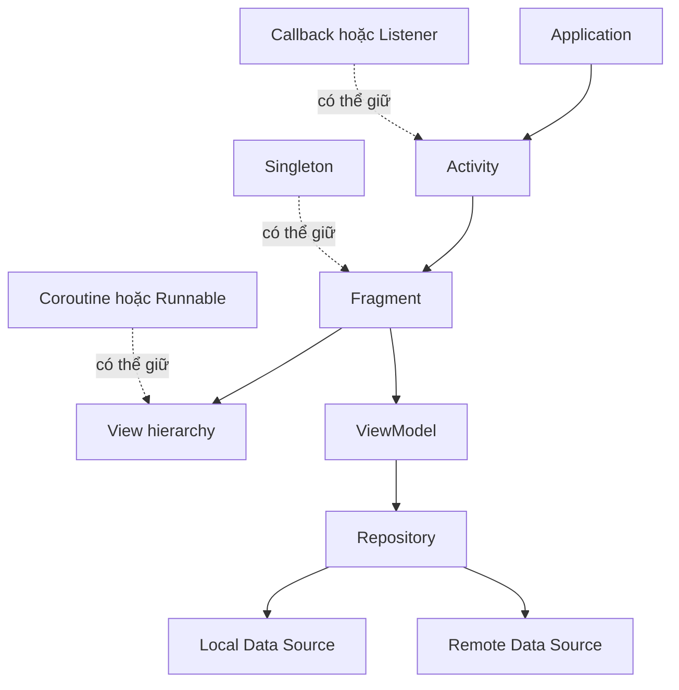
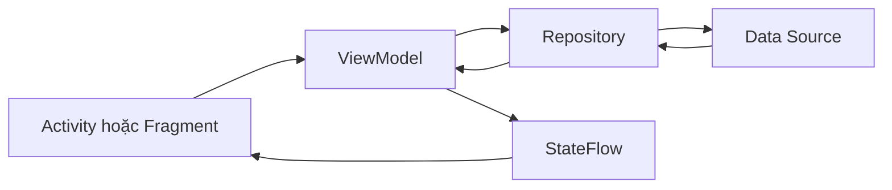

# 012 - Memory Leak

**Học phần:** 05 - Quality, Release and Portfolio
**Module:** Module 10 - Linting, Debugging and Benchmark
**Nhóm nội dung:** Debugging
**Nguồn roadmap:** Linting, Debugging and Benchmark / Debugging
**Loại bài:** quality
**Thứ tự trong module:** 012
**Thời lượng gợi ý:** 30 phút

---

## 1. Tóm tắt

**Memory Leak** là hiện tượng một object không còn cần thiết đối với ứng dụng nhưng vẫn bị giữ tham chiếu, khiến Garbage Collector không thể thu hồi vùng nhớ mà object đó đang sử dụng.

Trong Android, Memory Leak đặc biệt nguy hiểm vì nhiều object có vòng đời lớn hoặc chiếm nhiều tài nguyên như `Activity`, `Fragment`, `View`, `Bitmap`, callback, listener và coroutine. Nếu một object sống lâu giữ tham chiếu đến object có lifecycle ngắn hơn, toàn bộ cây object liên quan có thể tiếp tục tồn tại trong bộ nhớ dù màn hình đã bị đóng.

Memory Leak thường không làm ứng dụng crash ngay lập tức. Nó có thể âm thầm làm lượng heap tăng dần, khiến Garbage Collector chạy thường xuyên hơn, UI bị giật, ứng dụng phản hồi chậm và cuối cùng có thể xảy ra `OutOfMemoryError`.

Trong Android Developer Roadmap, chủ đề này thuộc nhóm **Debugging** vì developer cần biết cách:

* nhận diện dấu hiệu rò rỉ bộ nhớ;
* tìm object đang bị giữ lại;
* phân tích reference chain;
* sửa lifecycle hoặc ownership không đúng;
* xác nhận rằng lỗi đã được xử lý;
* biến quá trình điều tra thành artifact kỹ thuật có thể đưa vào portfolio.

## 2. Mục tiêu học tập

Sau bài học, người học có thể:

* Giải thích Memory Leak bằng ngôn ngữ của mình.
* Phân biệt object còn được sử dụng với object đáng lẽ phải được Garbage Collector thu hồi.
* Giải thích mối liên hệ giữa strong reference, object lifetime và Android lifecycle.
* Nhận diện các Memory Leak phổ biến liên quan đến `Activity`, `Fragment`, `Context`, listener, callback, coroutine và singleton.
* Sử dụng Android Studio Memory Profiler hoặc công cụ phát hiện leak để điều tra vấn đề.
* Đọc reference chain để xác định object nào đang giữ object bị leak.
* Viết lại code theo hướng lifecycle-aware.
* Đánh giá tác động của Memory Leak đến UX, performance và release risk.
* Thực hiện một bài kiểm tra Memory Leak có thể lặp lại.
* Tạo technical note hoặc report debugging làm artifact cho portfolio.

## 3. Khái niệm cốt lõi

Android chạy trên ART và quản lý phần lớn bộ nhớ Java/Kotlin thông qua **Garbage Collector**.

Developer thường không chủ động giải phóng từng object như trong một số ngôn ngữ quản lý bộ nhớ thủ công. Thay vào đó, Garbage Collector xác định object nào không còn có thể được truy cập từ các object gốc của chương trình và thu hồi chúng.

Memory Leak xuất hiện khi object đáng lẽ đã hết vòng đời nhưng vẫn còn một reference chain dẫn tới nó.

Ví dụ:

```text
Application
    ↓
Singleton
    ↓
Listener
    ↓
Activity
    ↓
View hierarchy
    ↓
Bitmap / Drawable / Adapter / Context
```

Nếu singleton sống trong toàn bộ process nhưng lại giữ một `Activity`, Garbage Collector vẫn xem `Activity` là object có thể truy cập được.

Kết quả là:

```text
Activity đã đóng
        ↓
Vẫn còn strong reference
        ↓
Garbage Collector không thu hồi
        ↓
Heap tiếp tục giữ Activity và object liên quan
        ↓
Memory usage tăng
```

Một nguyên tắc quan trọng là:

> Object có lifecycle dài không nên giữ strong reference không cần thiết đến object có lifecycle ngắn hơn.

Một số lifecycle thường gặp có thể hình dung như sau:

```text
Application
    ↓
Activity
    ↓
Fragment
    ↓
Fragment View
    ↓
Temporary callback / animation / task
```

`Application` có thể tồn tại gần như toàn bộ thời gian process Android còn sống, trong khi một `View` có thể chỉ tồn tại vài giây.

Nếu hướng reference đi ngược lifecycle không được quản lý đúng, nguy cơ Memory Leak tăng lên.

## 4. Garbage Collection và reference chain

Garbage Collector không xác định object có cần cho nghiệp vụ hay không. Nó chỉ quan tâm object đó còn **reachable** hay không.

Giả sử:

```kotlin
class UserProfileActivity : AppCompatActivity()
```

Người dùng mở rồi đóng `UserProfileActivity`.

Về mặt nghiệp vụ:

```text
Activity không còn cần thiết.
```

Nhưng nếu một singleton giữ reference:

```kotlin
object AnalyticsManager {
    var currentActivity: Activity? = null
}
```

và ứng dụng thực hiện:

```kotlin
AnalyticsManager.currentActivity = this
```

thì object vẫn có reference chain:

```text
GC Root
   ↓
AnalyticsManager
   ↓
currentActivity
   ↓
UserProfileActivity
```

Garbage Collector không thể thu hồi `UserProfileActivity`.

Một leak nhỏ có thể kéo theo nhiều object khác vì `Activity` thường giữ:

* window;
* decor view;
* view hierarchy;
* resource;
* adapter;
* drawable;
* callback;
* fragment;
* navigation state;
* bitmap.

Do đó, leak một `Activity` có thể tốn nhiều bộ nhớ hơn kích thước của riêng object `Activity`.

## 5. Vị trí của Memory Leak trong kiến trúc Android

Memory Leak không thuộc riêng một layer. Nó có thể xuất hiện ở bất kỳ nơi nào có lifecycle và reference.



Các đường liên tục biểu diễn quan hệ kiến trúc bình thường.

Các đường nét đứt biểu diễn những reference cần được kiểm soát. Nếu callback, singleton hoặc background task sống lâu hơn component mà chúng tham chiếu, Memory Leak có thể xuất hiện.

Một số khu vực cần đặc biệt chú ý:

* UI layer với `Activity`, `Fragment`, `View`.
* `ViewBinding`.
* listener và callback.
* asynchronous task.
* coroutine.
* `Handler` và `Runnable`.
* singleton.
* cache.
* `Context`.
* observer.
* custom view.
* third-party SDK.

## 6. Các dạng Memory Leak phổ biến trong Android

**Giữ `Activity` trong singleton**

Code có nguy cơ:

```kotlin
object SessionManager {
    var activity: Activity? = null
}
```

Nếu `SessionManager` sống suốt process, `Activity` được gán vào đây có thể không được thu hồi.

Nếu chỉ cần `Context` để truy cập resource hoặc service toàn cục, thường nên sử dụng `applicationContext`:

```kotlin
class SessionManager(
    context: Context
) {
    private val appContext = context.applicationContext
}
```

Không thay `Activity` bằng `applicationContext` một cách máy móc. Một số API thực sự yêu cầu `Activity`, nhưng reference đó phải có ownership và lifecycle rõ ràng.

---

**Không giải phóng `ViewBinding` trong `Fragment`**

`Fragment` có lifecycle khác với lifecycle của view.

Một `Fragment` có thể vẫn tồn tại sau khi `onDestroyView()` được gọi.

Code thông dụng:

```kotlin
private var _binding: FragmentProfileBinding? = null

private val binding: FragmentProfileBinding
    get() = requireNotNull(_binding)
```

Khởi tạo:

```kotlin
override fun onCreateView(
    inflater: LayoutInflater,
    container: ViewGroup?,
    savedInstanceState: Bundle?
): View {
    _binding = FragmentProfileBinding.inflate(
        inflater,
        container,
        false
    )

    return binding.root
}
```

Giải phóng khi view bị destroy:

```kotlin
override fun onDestroyView() {
    super.onDestroyView()
    _binding = null
}
```

Nếu giữ binding sau `onDestroyView()`, `Fragment` có thể giữ toàn bộ old view hierarchy không còn sử dụng.

---

**Listener không được unregister**

Ví dụ:

```kotlin
locationManager.addListener(listener)
```

nhưng không có:

```kotlin
locationManager.removeListener(listener)
```

Nếu `locationManager` sống lâu hơn màn hình, listener có thể giữ reference đến `Activity` hoặc `Fragment`.

Một pattern tốt là:

```kotlin
override fun onStart() {
    super.onStart()
    locationManager.addListener(listener)
}

override fun onStop() {
    locationManager.removeListener(listener)
    super.onStop()
}
```

Lifecycle cụ thể cần chọn dựa trên yêu cầu chức năng, không mặc định mọi listener đều phải đăng ký trong `onStart()`.

---

**Callback giữ `Activity`**

Ví dụ:

```kotlin
repository.loadData { result ->
    textView.text = result
}
```

Lambda có thể capture `Activity`, `Fragment` hoặc `View`.

Nếu request sống lâu hơn màn hình và callback vẫn được lưu ở một component có lifecycle dài, UI object có thể bị giữ lại.

Giải pháp có thể bao gồm:

* chuyển xử lý state vào `ViewModel`;
* hủy operation khi lifecycle kết thúc;
* không lưu callback UI lâu hơn cần thiết;
* sử dụng coroutine với lifecycle phù hợp.

---

**Coroutine chạy ngoài lifecycle thích hợp**

Ví dụ nguy hiểm:

```kotlin
GlobalScope.launch {
    val result = repository.loadData()

    runOnUiThread {
        binding.resultText.text = result
    }
}
```

`GlobalScope` không gắn với lifecycle của `Activity` hay `Fragment`.

Thay vào đó, với `ViewModel`:

```kotlin
class ProfileViewModel(
    private val repository: ProfileRepository
) : ViewModel() {

    fun refresh() {
        viewModelScope.launch {
            repository.refreshProfile()
        }
    }
}
```

Với UI:

```kotlin
viewLifecycleOwner.lifecycleScope.launch {
    viewLifecycleOwner.repeatOnLifecycle(Lifecycle.State.STARTED) {
        viewModel.uiState.collect { state ->
            render(state)
        }
    }
}
```

Cách này giúp collection hoạt động theo lifecycle của view.

---

**`Handler` hoặc `Runnable` tồn tại quá lâu**

Ví dụ:

```kotlin
private val handler = Handler(Looper.getMainLooper())

private val task = Runnable {
    binding.status.text = "Done"
}
```

Nếu task được delay:

```kotlin
handler.postDelayed(task, 60_000)
```

và màn hình đóng trước thời điểm đó, `Runnable` có thể tiếp tục giữ object UI.

Có thể cleanup:

```kotlin
override fun onDestroy() {
    handler.removeCallbacks(task)
    super.onDestroy()
}
```

---

**Static hoặc companion object giữ `View` hoặc `Context`**

Không nên:

```kotlin
companion object {
    var currentView: View? = null
}
```

hoặc:

```kotlin
companion object {
    var activityContext: Context? = null
}
```

Static state thường có lifetime gần bằng process, trong khi `View` và `Activity` có lifetime ngắn hơn nhiều.

---

**Cache không giới hạn**

Không phải Memory Leak nào cũng đến từ lifecycle.

Một cache như:

```kotlin
val cache = mutableMapOf<String, Bitmap>()
```

có thể tăng liên tục nếu không có:

* giới hạn kích thước;
* eviction policy;
* cleanup;
* lifecycle phù hợp.

Đây có thể là vấn đề memory retention nghiêm trọng dù reference được giữ có chủ đích.

## 7. Dấu hiệu nhận biết Memory Leak

Memory Leak có thể biểu hiện dưới nhiều hình thức:

* Heap tăng sau mỗi lần mở và đóng cùng một màn hình.
* Bộ nhớ không giảm đáng kể sau khi màn hình đã bị destroy.
* Ứng dụng ngày càng chậm sau khi sử dụng lâu.
* Garbage Collection diễn ra thường xuyên.
* Chuyển màn hình nhiều lần làm memory tăng liên tục.
* Ảnh hoặc `Bitmap` cũ vẫn tồn tại.
* Nhiều instance của cùng một `Activity` hoặc `Fragment` còn trong heap.
* App bị kill vì memory pressure.
* Xuất hiện `OutOfMemoryError`.
* Performance giảm sau một thời gian chạy dài.

Một quy trình thử đơn giản:

1. Khởi động ứng dụng.
2. Ghi lại memory baseline.
3. Mở một màn hình.
4. Quay lại màn hình trước.
5. Lặp lại 10–20 lần.
6. Kiểm tra số instance còn tồn tại.
7. Force Garbage Collection khi debugging nếu công cụ hỗ trợ.
8. Quan sát object có được giải phóng hay không.

> Memory tăng tạm thời không đồng nghĩa chắc chắn có leak. Runtime, cache và Garbage Collector có thể giữ memory để tối ưu hiệu năng. Cần kiểm tra object retention và reference chain thay vì chỉ nhìn một con số heap.

## 8. Phát hiện và debugging Memory Leak

Android Studio cung cấp Memory Profiler để quan sát memory usage và phân tích heap.

Một workflow điển hình:

```text
Tái hiện hành vi
      ↓
Quan sát memory
      ↓
Capture heap
      ↓
Tìm Activity/Fragment đáng lẽ đã bị destroy
      ↓
Xem reference chain
      ↓
Xác định owner giữ reference
      ↓
Sửa lifecycle/ownership
      ↓
Chạy lại cùng kịch bản
      ↓
So sánh kết quả
```

Một số công cụ và kỹ thuật hữu ích:

* Android Studio Memory Profiler.
* Heap dump.
* Instance inspection.
* Reference tree.
* Logcat.
* Lifecycle logging.
* Leak detection library trong debug build.
* Stress navigation test.
* Rotation test.
* Background/foreground test.

Khi đọc leak trace, không chỉ tập trung vào object cuối cùng.

Ví dụ:

```text
Application
    ↓
AnalyticsManager
    ↓
callbacks
    ↓
ProfileFragment
    ↓
binding
    ↓
RecyclerView
```

Object bị leak là `ProfileFragment`, nhưng root cause có thể là `AnalyticsManager` giữ callback.

Câu hỏi quan trọng nhất là:

> Object nào có lifecycle dài hơn đang sở hữu reference mà nó không nên giữ?

## 9. Ví dụ sửa Memory Leak

Giả sử có một object quản lý callback:

```kotlin
object EventManager {

    private val listeners = mutableListOf<() -> Unit>()

    fun register(listener: () -> Unit) {
        listeners += listener
    }

    fun notifyChanged() {
        listeners.forEach { it() }
    }
}
```

Một `Activity` đăng ký:

```kotlin
class MainActivity : AppCompatActivity() {

    override fun onCreate(savedInstanceState: Bundle?) {
        super.onCreate(savedInstanceState)

        EventManager.register {
            updateUi()
        }
    }

    private fun updateUi() {
        // Update UI
    }
}
```

Lambda capture `MainActivity`.

Reference chain có thể trở thành:

```text
EventManager
    ↓
listeners
    ↓
Lambda
    ↓
MainActivity
```

Ngay cả khi `MainActivity` đã bị destroy, listener vẫn nằm trong `EventManager`.

Một cách sửa là cho phép unregister:

```kotlin
class EventManager {

    private val listeners = mutableSetOf<EventListener>()

    fun register(listener: EventListener) {
        listeners += listener
    }

    fun unregister(listener: EventListener) {
        listeners -= listener
    }

    fun notifyChanged() {
        listeners.forEach { listener ->
            listener.onChanged()
        }
    }
}

fun interface EventListener {
    fun onChanged()
}
```

Trong `Activity`:

```kotlin
class MainActivity : AppCompatActivity() {

    private val listener = EventListener {
        updateUi()
    }

    override fun onStart() {
        super.onStart()
        eventManager.register(listener)
    }

    override fun onStop() {
        eventManager.unregister(listener)
        super.onStop()
    }

    private fun updateUi() {
        // Update UI
    }
}
```

Điểm quan trọng không phải là `onStart()` và `onStop()` luôn đúng cho mọi trường hợp.

Điểm quan trọng là:

```text
Register
    ↓
Resource bắt đầu được giữ
    ↓
Lifecycle thay đổi
    ↓
Unregister
    ↓
Reference được giải phóng
```

Ownership phải rõ ràng và có điểm cleanup tương ứng.

## 10. Lifecycle-aware design

Cách tốt nhất để xử lý Memory Leak không phải là đợi profiler phát hiện rồi mới sửa.

Kiến trúc nên giảm khả năng tạo leak ngay từ đầu.

Một số nguyên tắc:

* `ViewModel` không giữ `Activity`.
* `ViewModel` không giữ `Fragment`.
* `ViewModel` không giữ `View`.
* Repository không tham chiếu trực tiếp UI.
* Singleton không giữ màn hình.
* Listener phải có owner rõ ràng.
* Resource được đăng ký phải có cơ chế unregister nếu API yêu cầu.
* Coroutine phải được launch trong scope phù hợp.
* Flow collection phải gắn với lifecycle khi cập nhật UI.
* `Fragment` không giữ binding sau `onDestroyView()`.
* Cache phải có giới hạn.
* Không sử dụng static field để lưu UI object.
* Không dùng `WeakReference` như giải pháp mặc định để che giấu thiết kế ownership sai.

Ví dụ kiến trúc tốt:



`ViewModel` cung cấp state nhưng không cần biết object UI cụ thể nào đang hiển thị state đó.

Điều này giúp giảm coupling giữa component có lifecycle khác nhau.

## 11. `WeakReference` và những hiểu lầm thường gặp

`WeakReference` không giữ object sống chỉ vì weak reference tồn tại.

Ví dụ:

```kotlin
val activityRef = WeakReference(activity)
```

Sau này có thể đọc:

```kotlin
val activity = activityRef.get()
```

Nhưng object có thể đã được Garbage Collector thu hồi và `get()` có thể trả về `null`.

`WeakReference` hữu ích trong một số tình huống đặc biệt, nhưng không nên trở thành giải pháp mặc định cho Memory Leak.

Không nên biến:

```text
Ownership sai
```

thành:

```text
Ownership vẫn sai
+
WeakReference
```

Nếu listener có thể unregister, thường nên sửa lifecycle của listener.

Nếu singleton không cần `Activity`, không nên giữ `Activity`.

Nếu task nên bị cancel, nên cancel task.

Nguyên tắc ưu tiên:

```text
Sửa ownership
    ↓
Sửa lifecycle
    ↓
Cleanup resource
    ↓
Chỉ cân nhắc WeakReference khi mô hình thực sự phù hợp
```

## 12. Lỗi thường gặp khi xử lý Memory Leak

**Chỉ nhìn memory graph rồi kết luận có leak**

Memory có thể tăng vì cache hoặc runtime chưa Garbage Collect ngay.

Cách xử lý:

* kiểm tra số object còn retained;
* xem heap dump;
* xác minh reference chain;
* lặp lại cùng scenario nhiều lần.

---

**Gọi Garbage Collection rồi cho rằng vấn đề đã được giải quyết**

Force GC chỉ hỗ trợ quá trình debugging.

Nó không sửa reference chain.

Nếu object vẫn reachable thì Garbage Collector vẫn không thể thu hồi.

---

**Thay mọi reference bằng `WeakReference`**

Điều này có thể làm code khó hiểu và che giấu ownership sai.

Ưu tiên sửa lifecycle và ownership trước.

---

**Dùng `applicationContext` cho mọi trường hợp**

`applicationContext` phù hợp với các operation không cần lifecycle hoặc UI context.

Nhưng một số chức năng yêu cầu context gắn với UI, theme hoặc window.

Do đó không nên thay context một cách máy móc.

---

**Chỉ test Memory Leak khi chuẩn bị release**

Leak thường liên quan trực tiếp đến kiến trúc.

Phát hiện càng muộn thì chi phí sửa càng cao.

Nên kiểm tra sớm các màn hình:

* có nhiều ảnh;
* mở đóng thường xuyên;
* dùng map;
* camera;
* video;
* WebView;
* callback;
* listener;
* third-party SDK;
* realtime data.

## 13. Best practices

* Không lưu `Activity`, `Fragment` hoặc `View` trong singleton.
* Sử dụng `applicationContext` khi dependency thực sự chỉ cần context cấp application.
* Cleanup listener, callback và observer đúng lifecycle.
* Hủy delayed task khi owner bị destroy nếu task không còn cần thiết.
* Sử dụng `viewModelScope` cho công việc thuộc lifecycle của `ViewModel`.
* Sử dụng `lifecycleScope` hoặc `viewLifecycleOwner.lifecycleScope` cho công việc UI phù hợp.
* Sử dụng `repeatOnLifecycle()` khi collect `Flow` cho UI.
* Đặt `Fragment` binding về `null` trong `onDestroyView()` với pattern nullable binding.
* Không để repository giữ reference tới UI.
* Không cache object vô hạn.
* Theo dõi lifecycle khi tích hợp third-party SDK.
* Kiểm tra màn hình nhiều lần thay vì chỉ mở một lần.
* Test rotate và configuration change.
* Test background/foreground.
* So sánh heap trước và sau khi sửa.
* Ghi lại root cause thay vì chỉ ghi triệu chứng.
* Đưa kiểm tra Memory Leak vào quality workflow đối với flow quan trọng.

## 14. Kiểm thử Memory Leak

Memory Leak thường cần kết hợp nhiều loại kiểm thử.

| Kịch bản                           | Kết quả mong đợi                               |
| ---------------------------------- | ---------------------------------------------- |
| Mở và đóng màn hình nhiều lần      | Instance cũ có thể được thu hồi                |
| Rotate thiết bị nhiều lần          | Không giữ các `Activity` cũ                    |
| Replace `Fragment` liên tục        | View hierarchy cũ không bị giữ                 |
| Chuyển app background rồi quay lại | Không tạo object retention bất thường          |
| Đăng ký rồi hủy listener           | Listener cũ không còn trong manager            |
| Hủy request hoặc task              | Callback không tiếp tục giữ UI không cần thiết |
| Load nhiều ảnh                     | Cache không tăng vô hạn                        |
| Logout rồi login tài khoản khác    | State của session cũ được giải phóng đúng cách |

Có thể xây dựng một manual regression scenario:

1. Khởi động app từ trạng thái sạch.
2. Mở `ProfileFragment`.
3. Quay về màn hình trước.
4. Lặp lại 20 lần.
5. Trigger Garbage Collection trong môi trường debug nếu cần.
6. Kiểm tra số instance `ProfileFragment`.
7. Kiểm tra các instance cũ còn retained.
8. Capture heap nếu có dấu hiệu bất thường.
9. Phân tích reference chain.
10. Ghi kết quả trước và sau khi sửa.

Một test tốt cần có khả năng lặp lại cùng một flow.

Không nên chỉ ghi:

> App dùng nhiều RAM.

Nên ghi:

```text
Scenario:
Open Profile → Back → repeat 20 times

Before fix:
Old ProfileFragment instances remain retained.

Reference chain:
EventManager → listener → ProfileFragment

Fix:
Unregister listener when UI lifecycle ends.

After fix:
Old instances are no longer retained after cleanup/GC.
```

## 15. Tác động đến UX, performance và release

Memory Leak không chỉ là vấn đề kỹ thuật nội bộ.

Nó có thể ảnh hưởng trực tiếp tới người dùng:

```text
Memory Leak
    ↓
Heap tăng
    ↓
GC chạy nhiều hơn
    ↓
CPU activity tăng
    ↓
Frame bị trễ
    ↓
UI giật
    ↓
Memory pressure
    ↓
OutOfMemoryError hoặc process bị kill
```

Một leak nhỏ nhưng nằm trong user flow được sử dụng hàng trăm lần có thể nguy hiểm hơn một leak lớn trong màn hình hiếm khi mở.

Khi đánh giá release risk, nên xem xét:

* user flow nào tạo leak;
* flow được sử dụng thường xuyên đến mức nào;
* object bị giữ lớn đến đâu;
* leak có tích lũy sau mỗi thao tác hay không;
* thiết bị RAM thấp bị ảnh hưởng thế nào;
* app có sử dụng nhiều bitmap/video/WebView hay không;
* vấn đề có thể dẫn đến crash hay không.

Một Memory Leak reproducible trong core flow nên được xem là quality issue cần ưu tiên trước release.

## 16. Ví dụ thực tế

Giả sử một ứng dụng thương mại điện tử có màn hình chi tiết sản phẩm.

Mỗi lần mở màn hình:

```text
ProductFragment
    ↓
RecyclerView
    ↓
ImageView
    ↓
Product Bitmap
```

`ProductFragment` đăng ký một listener vào một global event manager nhưng không unregister.

Người dùng thực hiện:

```text
Product A
   ↓
Back
   ↓
Product B
   ↓
Back
   ↓
Product C
   ↓
Back
```

Global manager giữ:

```text
Listener A → ProductFragment A
Listener B → ProductFragment B
Listener C → ProductFragment C
```

Các fragment cũ tiếp tục giữ bitmap.

Sau hàng chục lần mở sản phẩm:

* heap tăng;
* Garbage Collection xảy ra thường xuyên;
* scrolling bắt đầu giật;
* ứng dụng có thể gặp `OutOfMemoryError` trên thiết bị RAM thấp.

Root cause không nằm ở image loader mà ở lifecycle của listener.

Đây là lý do developer cần phân tích reference chain thay vì chỉ nhìn object chiếm nhiều memory nhất.

## 17. Bài thực hành

Xây dựng hoặc sử dụng một Android app nhỏ có hai màn hình.

Thực hiện:

1. Tạo một manager có lifecycle dài.
2. Cho màn hình thứ hai đăng ký callback vào manager.
3. Cố ý không unregister callback.
4. Mở và đóng màn hình nhiều lần.
5. Quan sát memory.
6. Capture heap hoặc sử dụng leak detection trong debug build.
7. Xác định reference chain giữ màn hình cũ.
8. Ghi lại root cause.
9. Sửa code bằng lifecycle-aware cleanup.
10. Chạy lại cùng kịch bản.
11. So sánh kết quả trước và sau khi sửa.

Kết quả mong đợi:

```text
Before fix
Global manager
    ↓
Callback
    ↓
Activity / Fragment
    ↓
View hierarchy

After fix
Lifecycle end
    ↓
Unregister callback
    ↓
Reference chain bị cắt
    ↓
Activity / Fragment có thể được GC
```

Người học cần lưu lại:

* code gây leak;
* code sau khi sửa;
* screenshot Memory Profiler hoặc leak trace;
* mô tả root cause;
* scenario tái hiện;
* kết quả xác minh sau fix.

## 18. Artifact cho portfolio

Tạo một artifact có tên gợi ý:

```text
android-memory-leak-investigation/
```

Artifact nên bao gồm:

```text
android-memory-leak-investigation/
├── README.md
├── screenshots/
│   ├── before-fix.png
│   └── after-fix.png
├── leak-example/
└── notes/
    └── root-cause-analysis.md
```

Trong `README.md`, mô tả tối thiểu:

* Memory Leak là gì.
* Scenario tái hiện.
* Dấu hiệu phát hiện.
* Reference chain.
* Root cause.
* Code trước khi sửa.
* Code sau khi sửa.
* Cách xác minh fix.
* Bài học kiến trúc rút ra.

Một artifact tốt không chỉ chứng minh rằng developer biết dùng profiler mà còn chứng minh khả năng:

```text
Reproduce
   ↓
Measure
   ↓
Investigate
   ↓
Find root cause
   ↓
Fix
   ↓
Verify
   ↓
Document
```

## 19. Liên hệ với các chủ đề khác

Memory Leak có liên hệ trực tiếp với:

* Android lifecycle;
* `Activity`;
* `Fragment`;
* `ViewModel`;
* Coroutines;
* `Flow`;
* `StateFlow`;
* listener và callback;
* Garbage Collection;
* Android Studio Profiler;
* performance debugging;
* benchmark;
* crash investigation;
* release quality.

Mối quan hệ tổng quát:

```text
Lifecycle
    ↓
Object ownership
    ↓
Reference lifetime
    ↓
Memory retention
    ↓
Profiler / Debugging
    ↓
Performance
    ↓
Release Quality
```

Hiểu Memory Leak giúp developer không chỉ sửa một lỗi bộ nhớ cụ thể mà còn thiết kế ownership và lifecycle rõ ràng hơn trong toàn bộ ứng dụng.

## 20. Câu hỏi tự kiểm tra

1. Vì sao một `Activity` đã gọi `onDestroy()` vẫn có thể tồn tại trong heap?
2. Tại sao singleton giữ `Activity` thường có nguy cơ tạo Memory Leak?
3. Lifecycle của `Fragment` và lifecycle của `Fragment View` khác nhau như thế nào trong bài toán giữ `ViewBinding`?
4. Vì sao `WeakReference` không nên được xem là giải pháp mặc định cho mọi Memory Leak?
5. Khi heap tăng sau mỗi lần mở màn hình, developer cần kiểm tra những gì trước khi kết luận ứng dụng bị leak?

## 21. Checklist hoàn thành

* [ ] Tôi giải thích được Memory Leak bằng lời của mình.
* [ ] Tôi hiểu Garbage Collector dựa trên object reachability.
* [ ] Tôi hiểu khái niệm reference chain.
* [ ] Tôi biết vì sao object lifecycle dài có thể làm leak object lifecycle ngắn.
* [ ] Tôi nhận diện được leak liên quan đến `Activity`, `Fragment`, `View` và `Context`.
* [ ] Tôi biết cách cleanup `ViewBinding` trong `Fragment`.
* [ ] Tôi biết kiểm tra listener và callback không được unregister.
* [ ] Tôi biết sử dụng lifecycle-aware coroutine scope.
* [ ] Tôi có thể tái hiện một Memory Leak có chủ đích.
* [ ] Tôi biết sử dụng Memory Profiler hoặc công cụ tương đương để điều tra.
* [ ] Tôi có thể đọc reference chain để tìm root cause.
* [ ] Tôi đã sửa leak và chạy lại cùng scenario để xác minh.
* [ ] Tôi đã lưu screenshot hoặc report trước và sau khi sửa.
* [ ] Tôi đã tạo artifact có thể đưa vào portfolio.

## 22. Tổng kết

Memory Leak xảy ra khi object đã hết giá trị sử dụng nhưng vẫn còn reachable thông qua một reference chain, khiến Garbage Collector không thể thu hồi nó.

Trong Android, vấn đề thường xuất phát từ sự không khớp lifecycle giữa các component, đặc biệt khi object sống lâu như singleton, manager, callback hoặc background task giữ `Activity`, `Fragment` hoặc `View`.

Quy trình xử lý hiệu quả là:

```text
Tái hiện
    ↓
Đo memory
    ↓
Tìm object retained
    ↓
Phân tích reference chain
    ↓
Xác định ownership sai
    ↓
Sửa lifecycle hoặc cleanup
    ↓
Chạy lại cùng scenario
    ↓
Xác minh object được giải phóng
```

Điểm quan trọng nhất không phải là ghi nhớ từng loại leak riêng lẻ mà là hiểu nguyên tắc:

> **Reference phải có ownership và lifetime phù hợp với lifecycle của object mà nó giữ.**

Một Android Developer có kỹ năng debugging tốt phải có khả năng tìm ra không chỉ object nào đang chiếm memory, mà còn giải thích được **ai đang giữ object đó, tại sao reference vẫn tồn tại và lifecycle nào cần được sửa**.
