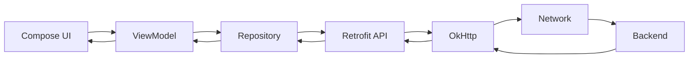
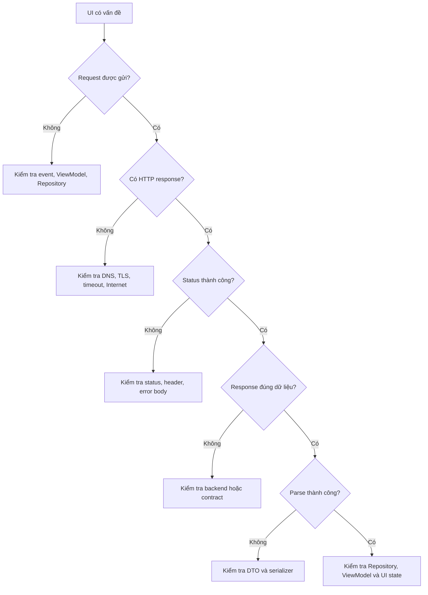

# 013 - Network Debugging

**Học phần:** 05 - Quality, Release and Portfolio
**Module:** Module 10 - Linting, Debugging and Benchmark
**Nhóm nội dung:** Debugging
**Nguồn roadmap:** Linting, Debugging and Benchmark / Debugging
**Loại bài:** quality
**Thứ tự trong module:** 013
**Thời lượng gợi ý:** 30 phút

---

## 1. Tóm tắt

**Network Debugging** là quá trình quan sát, phân tích và xác định nguyên nhân của các vấn đề xảy ra khi ứng dụng Android giao tiếp với mạng hoặc backend.

Một lỗi mà người dùng nhìn thấy dưới dạng:

> Không tải được dữ liệu.

có thể xuất phát từ rất nhiều tầng khác nhau:

* thiết bị không có kết nối mạng;
* DNS không phân giải được domain;
* kết nối TLS thất bại;
* request bị timeout;
* token hết hạn;
* server trả `401`, `404`, `429` hoặc `500`;
* response JSON khác với model của ứng dụng;
* repository ánh xạ lỗi không chính xác;
* `ViewModel` cập nhật state sai;
* UI không thể hiện đúng trạng thái retry hoặc failure.

Vì vậy, Network Debugging không chỉ là đọc một dòng Logcat. Developer cần xác định request được tạo ở đâu, gửi đi như thế nào, server phản hồi gì, dữ liệu được parse ra sao và cuối cùng lỗi được biểu diễn như thế nào trên UI.

Android Studio cung cấp **Network Inspector** để quan sát hoạt động mạng theo thời gian thực, xem request, response, header, body, thời gian truyền và call stack. Công cụ hiện hỗ trợ trực tiếp `HttpsURLConnection` và `OkHttp`; các thư viện như Retrofit thường có thể được quan sát vì sử dụng `OkHttp` bên dưới.

## 2. Mục tiêu học tập

Sau bài học, người học có thể:

* giải thích Network Debugging và vai trò của nó trong quá trình phát triển Android;
* xác định lỗi đang nằm ở tầng network, HTTP, API, serialization, repository hay UI state;
* sử dụng Network Inspector để phân tích request và response;
* đọc HTTP status code, header, request body và response body;
* cấu hình logging cho `OkHttp` trong môi trường debug;
* phân biệt lỗi timeout, DNS, authentication, API và lỗi dữ liệu;
* thiết kế trạng thái `Loading`, `Success`, `Empty` và `Error` phù hợp;
* tránh log token, cookie hoặc dữ liệu người dùng nhạy cảm;
* xây dựng một quy trình Network Debugging có thể lặp lại;
* tạo được artifact Network Debugging để đưa vào portfolio.

## 3. Khái niệm cốt lõi

### 3.1. Network Debugging là gì?

Network Debugging là quá trình tìm nguyên nhân của lỗi trên toàn bộ đường đi của dữ liệu:

```text
Android App
    ↓
HTTP Client
    ↓
Network
    ↓
Backend
    ↓
Response
    ↓
Data Layer
    ↓
UI State
```

Developer không nên kết luận:

> API bị lỗi.

chỉ vì UI không hiển thị dữ liệu.

Trước tiên cần xác định request có thực sự được gửi đi hay chưa, URL có đúng không, server trả status gì, response có đúng format không và ứng dụng xử lý response đó như thế nào.

### 3.2. Network Debugging khác application debugging như thế nào?

Application debugging tập trung vào logic chạy bên trong ứng dụng như:

* state;
* lifecycle;
* coroutine;
* exception;
* database;
* navigation;
* business logic.

Network Debugging tập trung vào đường truyền giữa ứng dụng và hệ thống bên ngoài:

* URL;
* DNS;
* TLS;
* HTTP method;
* header;
* authentication;
* request body;
* response body;
* HTTP status;
* latency;
* timeout;
* retry.

Hai loại debugging thường liên kết trực tiếp với nhau.

Ví dụ:

```text
API trả 401
    ↓
Repository không map lỗi
    ↓
ViewModel vẫn giữ Loading
    ↓
UI quay loading vô hạn
```

Nguyên nhân ban đầu nằm ở network/API nhưng lỗi UX cuối cùng lại xuất hiện ở state management.

## 4. Vị trí trong kiến trúc Android

Network Debugging cần theo dõi request từ UI đến backend và ngược trở lại.



Trong kiến trúc này:

* UI phát sinh hành động của người dùng;
* `ViewModel` điều phối state;
* `Repository` quyết định cách truy cập dữ liệu;
* Retrofit chuyển lời gọi Kotlin thành HTTP request;
* `OkHttp` thực hiện HTTP communication;
* network vận chuyển request đến backend;
* backend xử lý và trả response;
* response được parse và ánh xạ trở lại UI state.

Khi debug, developer nên tìm lỗi từ tầng thấp lên tầng cao thay vì sửa UI trước.

Một thứ tự hợp lý là:

1. Kiểm tra thiết bị có mạng.
2. Kiểm tra request có được gửi.
3. Kiểm tra URL và HTTP method.
4. Kiểm tra header.
5. Kiểm tra request body.
6. Kiểm tra HTTP status.
7. Kiểm tra response body.
8. Kiểm tra serialization.
9. Kiểm tra repository.
10. Kiểm tra `ViewModel`.
11. Kiểm tra UI state.

## 5. Các nhóm lỗi mạng phổ biến

### 5.1. Lỗi trước khi request đến server

Request có thể thất bại trước khi backend nhận được dữ liệu.

Ví dụ:

* thiết bị mất mạng;
* domain không tồn tại;
* DNS lỗi;
* TLS handshake thất bại;
* certificate không hợp lệ;
* connection timeout;
* socket timeout.

Một số exception thường gặp trong Java/Kotlin networking gồm:

```text
UnknownHostException
SocketTimeoutException
ConnectException
SSLException
IOException
```

Ví dụ:

```kotlin
catch (error: UnknownHostException) {
    // Không phân giải được hostname hoặc không thể truy cập host.
}
```

### 5.2. Lỗi HTTP và backend

Request đã đến server nhưng server trả kết quả không thành công.

Ví dụ:

| HTTP status | Ý nghĩa thường gặp                    |
| ----------- | ------------------------------------- |
| `400`       | Request không hợp lệ                  |
| `401`       | Chưa xác thực hoặc token không hợp lệ |
| `403`       | Không có quyền truy cập               |
| `404`       | Resource không tồn tại                |
| `409`       | Xung đột dữ liệu                      |
| `429`       | Gửi quá nhiều request                 |
| `500`       | Lỗi phía server                       |
| `502`       | Gateway nhận response không hợp lệ    |
| `503`       | Service tạm thời không khả dụng       |

HTTP response không thành công không đồng nghĩa với lỗi kết nối mạng.

Ví dụ:

```text
Internet hoạt động
        ↓
Request đến server
        ↓
Server trả HTTP 401
```

Đây là lỗi authentication hoặc authorization, không phải lỗi Internet.

### 5.3. Lỗi dữ liệu và application state

Server có thể trả `200 OK`, nhưng ứng dụng vẫn thất bại.

Ví dụ response thực tế:

```json
{
  "user_id": 10,
  "display_name": "An"
}
```

Trong khi model Android mong đợi:

```kotlin
data class UserDto(
    val id: Long,
    val name: String
)
```

Nếu serialization không được cấu hình phù hợp, ứng dụng có thể gặp lỗi parse mặc dù HTTP request hoàn toàn thành công.

Một trường hợp khác:

```text
HTTP 200
    ↓
Response parse thành công
    ↓
Repository trả Success
    ↓
ViewModel không cập nhật state
    ↓
UI vẫn Loading
```

Do đó Network Debugging phải kiểm tra cả network và data flow của ứng dụng.

## 6. Quy trình Network Debugging

Một quy trình thực tế nên đi từ bằng chứng đến nguyên nhân thay vì sửa thử ngẫu nhiên.



Flow này giúp thu hẹp phạm vi lỗi.

Ví dụ khi Network Inspector cho thấy:

```text
GET /api/profile
HTTP 200
```

và response JSON đúng, developer không cần tiếp tục nghi ngờ network.

Phạm vi debug nên chuyển sang:

```text
DTO
→ Mapper
→ Repository
→ ViewModel
→ UI
```

## 7. Công cụ Network Debugging

### 7.1. Android Studio Network Inspector

Network Inspector nằm trong:

```text
View
→ Tool Windows
→ App Inspection
→ Network Inspector
```

Sau khi kết nối với process của ứng dụng, developer có thể xem network activity trên timeline và chọn từng request để kiểm tra chi tiết. Android Studio cho phép xem các thông tin như status, kích thước dữ liệu, thời gian truyền, request/response header, body và call stack.

Network Inspector đặc biệt hữu ích khi cần trả lời:

* Request có thực sự được gửi không?
* Request được gửi bao nhiêu lần?
* Endpoint nào được gọi?
* HTTP method có đúng không?
* Query parameter có đúng không?
* Header có tồn tại không?
* Server trả status gì?
* Response body thực tế là gì?
* Request mất bao lâu?
* Request phát sinh từ code nào?

Network Inspector hiện hỗ trợ trực tiếp network request sử dụng `HttpsURLConnection` và `OkHttp`. Retrofit thường sử dụng `OkHttp`, vì vậy request Retrofit có thể được hiển thị trong Network Inspector. Nếu ứng dụng sử dụng network stack khác, Network Inspector có thể không xác định được chi tiết request.

### 7.2. Logcat và OkHttp logging

Network Inspector rất hữu ích khi developer đang chạy ứng dụng trong Android Studio, nhưng logging vẫn cần thiết để theo dõi logic ứng dụng.

Ví dụ:

```kotlin
Log.d("ProfileRepository", "Loading profile")
```

Không nên log trực tiếp:

```kotlin
Log.d("Auth", "Token: $accessToken")
```

Khi sử dụng `OkHttp`, có thể thêm `HttpLoggingInterceptor` cho debug build.

Ví dụ:

```kotlin
fun createHttpClient(): OkHttpClient {
    val loggingInterceptor = HttpLoggingInterceptor().apply {
        level = if (BuildConfig.DEBUG) {
            HttpLoggingInterceptor.Level.BASIC
        } else {
            HttpLoggingInterceptor.Level.NONE
        }

        redactHeader("Authorization")
        redactHeader("Cookie")
    }

    return OkHttpClient.Builder()
        .addInterceptor(loggingInterceptor)
        .build()
}
```

`BASIC` thường đủ để xem:

* HTTP method;
* URL;
* response code;
* request duration.

Chỉ nên bật `BODY` tạm thời trong môi trường phát triển khi thực sự cần kiểm tra payload.

> **Lưu ý:** Redact header không bảo vệ dữ liệu nhạy cảm nằm bên trong request hoặc response body.

### 7.3. Backend log và API documentation

Không phải mọi lỗi đều có thể giải thích hoàn toàn từ Android client.

Ví dụ Android nhận:

```text
HTTP 500
```

Network Inspector chứng minh request:

* đúng URL;
* đúng method;
* đúng authentication;
* đúng request body.

Khi đó cần đối chiếu thêm:

* backend log;
* request ID;
* API documentation;
* server metrics;
* database error;
* service dependency.

Một hệ thống production tốt nên có correlation/request ID để cùng một request có thể được truy vết ở cả client và backend.

## 8. Triển khai xử lý lỗi có thể debug

### 8.1. Định nghĩa API và model

Ví dụ API lấy profile người dùng:

```kotlin
data class UserDto(
    val id: Long,
    val name: String
)

interface UserApi {
    @GET("profile")
    suspend fun getProfile(): Response<UserDto>
}
```

Sử dụng `Response<T>` trong ví dụ này giúp repository quan sát trực tiếp HTTP status.

### 8.2. Chuẩn hóa kết quả từ Repository

Không nên để UI xử lý trực tiếp `IOException`, HTTP status và Retrofit response.

Có thể định nghĩa domain result:

```kotlin
sealed interface ProfileResult {

    data class Success(
        val user: UserDto
    ) : ProfileResult

    data object Unauthorized : ProfileResult

    data object NotFound : ProfileResult

    data object Timeout : ProfileResult

    data object NoConnection : ProfileResult

    data class ServerError(
        val code: Int
    ) : ProfileResult

    data class UnknownError(
        val throwable: Throwable
    ) : ProfileResult
}
```

Repository ánh xạ lỗi:

```kotlin
class UserRepository(
    private val api: UserApi
) {

    suspend fun getProfile(): ProfileResult {
        return try {
            val response = api.getProfile()

            when {
                response.isSuccessful -> {
                    val body = response.body()

                    if (body != null) {
                        ProfileResult.Success(body)
                    } else {
                        ProfileResult.UnknownError(
                            IllegalStateException("Response body is empty")
                        )
                    }
                }

                response.code() == 401 -> {
                    ProfileResult.Unauthorized
                }

                response.code() == 404 -> {
                    ProfileResult.NotFound
                }

                response.code() in 500..599 -> {
                    ProfileResult.ServerError(response.code())
                }

                else -> {
                    ProfileResult.UnknownError(
                        IllegalStateException(
                            "Unexpected HTTP ${response.code()}"
                        )
                    )
                }
            }
        } catch (error: SocketTimeoutException) {
            ProfileResult.Timeout
        } catch (error: UnknownHostException) {
            ProfileResult.NoConnection
        } catch (error: IOException) {
            ProfileResult.NoConnection
        } catch (error: Throwable) {
            ProfileResult.UnknownError(error)
        }
    }
}
```

Điểm quan trọng không phải là số lượng `catch`, mà là biến lỗi kỹ thuật thành kết quả có ý nghĩa đối với tầng phía trên.

### 8.3. Biểu diễn UI state rõ ràng

UI state nên thể hiện rõ các trạng thái của request.

```kotlin
sealed interface ProfileUiState {

    data object Loading : ProfileUiState

    data class Success(
        val name: String
    ) : ProfileUiState

    data object Unauthorized : ProfileUiState

    data object NoConnection : ProfileUiState

    data object Timeout : ProfileUiState

    data object ServerError : ProfileUiState
}
```

`ViewModel` ánh xạ kết quả:

```kotlin
class ProfileViewModel(
    private val repository: UserRepository
) : ViewModel() {

    private val _uiState =
        MutableStateFlow<ProfileUiState>(ProfileUiState.Loading)

    val uiState: StateFlow<ProfileUiState> =
        _uiState.asStateFlow()

    fun loadProfile() {
        viewModelScope.launch {
            _uiState.value = ProfileUiState.Loading

            _uiState.value = when (val result = repository.getProfile()) {
                is ProfileResult.Success -> {
                    ProfileUiState.Success(result.user.name)
                }

                ProfileResult.Unauthorized -> {
                    ProfileUiState.Unauthorized
                }

                ProfileResult.NoConnection -> {
                    ProfileUiState.NoConnection
                }

                ProfileResult.Timeout -> {
                    ProfileUiState.Timeout
                }

                else -> {
                    ProfileUiState.ServerError
                }
            }
        }
    }
}
```

Khi state được mô hình hóa rõ ràng, việc debug cũng dễ hơn vì developer có thể xác định chính xác lỗi bị biến đổi ở tầng nào.

## 9. Phân tích một request thực tế

Giả sử màn hình Profile không tải được.

Network Inspector hiển thị:

```text
GET https://api.example.com/profile
401 Unauthorized
```

Request header:

```text
Authorization: Bearer ...
```

Flow debug nên là:

1. Xác nhận request đã được gửi.
2. Xác nhận endpoint `/profile` đúng.
3. Xác nhận method là `GET`.
4. Xác nhận có `Authorization`.
5. Kiểm tra token có hết hạn không.
6. Kiểm tra token có đúng environment không.
7. Kiểm tra backend yêu cầu scope hoặc permission nào.
8. Kiểm tra response error body.
9. Kiểm tra repository có map `401`.
10. Kiểm tra UI có chuyển sang trạng thái đăng nhập lại hay không.

Không nên xử lý bằng cách:

```text
Retry request vô hạn
```

vì nếu token đã hết hạn, retry cùng token sẽ tiếp tục nhận `401`.

## 10. Các lỗi thường gặp

### 10.1. Request bị gửi nhiều lần

**Hiện tượng:** Network Inspector cho thấy cùng endpoint được gọi liên tục.

Ví dụ:

```text
GET /products
GET /products
GET /products
GET /products
```

**Nguyên nhân có thể:**

* gọi API trực tiếp trong quá trình recomposition;
* nhiều collector cùng kích hoạt load;
* `LaunchedEffect` dùng key không phù hợp;
* retry loop không có điều kiện dừng;
* observer được đăng ký nhiều lần.

**Cách xử lý:**

Theo dõi call stack và xác định chính xác nơi mỗi request được tạo.

Không nên chỉ sửa bằng debounce nếu nguyên nhân thật sự là lifecycle hoặc state.

### 10.2. Request timeout

**Hiện tượng:**

```text
SocketTimeoutException
```

**Nguyên nhân có thể:**

* server xử lý quá chậm;
* endpoint trả payload quá lớn;
* kết nối mạng không ổn định;
* timeout được cấu hình quá thấp;
* service downstream của backend bị chậm.

**Cách xử lý:**

* đo thời gian request;
* kiểm tra server latency;
* kiểm tra kích thước response;
* kiểm tra timeout configuration;
* chỉ retry nếu request phù hợp để retry.

### 10.3. HTTP 200 nhưng UI vẫn lỗi

**Hiện tượng:**

Network Inspector:

```text
200 OK
```

nhưng UI hiển thị lỗi.

**Nguyên nhân có thể:**

* JSON parse thất bại;
* mapper lỗi;
* field nullable không được xử lý;
* repository trả sai result;
* `ViewModel` cập nhật state sai.

**Cách xử lý:**

Chuyển phạm vi debug từ network sang:

```text
Response
→ DTO
→ Mapper
→ Repository
→ ViewModel
→ UI
```

### 10.4. Chỉ lỗi trên thiết bị thật

**Nguyên nhân có thể:**

* certificate;
* network policy;
* VPN;
* DNS;
* proxy;
* firewall;
* khác biệt environment;
* backend không truy cập được từ mạng bên ngoài.

Hãy so sánh:

```text
Emulator
Device thật
Wi-Fi
Mobile data
Debug environment
Production environment
```

Không nên mặc định rằng kết quả trên emulator đại diện cho mọi thiết bị.

## 11. Best practices

* Debug theo từng tầng thay vì sửa thử ngẫu nhiên.
* Luôn kiểm tra request thực tế thay vì suy đoán request được tạo đúng.
* Phân biệt lỗi network transport với lỗi HTTP.
* Không xem mọi HTTP status khác `200` là cùng một loại lỗi.
* Ánh xạ lỗi tại `Repository` hoặc data layer thay vì để UI hiểu chi tiết networking.
* Thiết kế rõ `Loading`, `Success`, `Empty`, `Error` và `Retry`.
* Giới hạn retry và sử dụng backoff khi phù hợp.
* Không retry mù quáng với lỗi authentication hoặc validation.
* Ghi lại thời gian request để phát hiện API chậm.
* Dùng Network Inspector trước khi thêm quá nhiều log thủ công.
* Tắt verbose network logging ở production.
* Có timeout hợp lý thay vì để request chờ vô thời hạn.
* Kiểm thử cả mạng chậm và mất mạng.
* Giữ API contract giữa Android và backend nhất quán.

## 12. Bảo mật và quyền riêng tư

Network Debugging có nguy cơ làm lộ dữ liệu nhạy cảm nếu developer ghi toàn bộ request và response vào log.

Không nên log:

* access token;
* refresh token;
* session cookie;
* password;
* OTP;
* API secret;
* thông tin thanh toán;
* dữ liệu sức khỏe;
* dữ liệu định danh người dùng;
* request body chứa thông tin riêng tư.

Ví dụ không an toàn:

```kotlin
Log.d(
    "Network",
    "Authorization: Bearer $accessToken"
)
```

Nên redact các header nhạy cảm khi dùng HTTP logging:

```kotlin
loggingInterceptor.redactHeader("Authorization")
loggingInterceptor.redactHeader("Cookie")
```

Ứng dụng production nên ưu tiên HTTPS và Network Security Configuration phù hợp thay vì cố tình cho phép cleartext HTTP. Android có các chính sách kiểm soát cleartext traffic và tài liệu hiện hành khuyến nghị cấu hình network security rõ ràng khi ứng dụng có yêu cầu đặc biệt về certificate hoặc CA.

> **Nguyên tắc:** Công cụ debugging phải giúp tìm lỗi nhưng không được biến thành nguồn rò rỉ dữ liệu người dùng.

## 13. Chiến lược kiểm thử

Network layer cần được kiểm tra ở cả success path và failure path.

| Test case            | Kết quả mong đợi                   |
| -------------------- | ---------------------------------- |
| API trả `200`        | Hiển thị dữ liệu                   |
| API trả dữ liệu rỗng | Hiển thị empty state               |
| API trả `400`        | Không crash                        |
| API trả `401`        | Chuyển sang xử lý authentication   |
| API trả `404`        | Hiển thị trạng thái phù hợp        |
| API trả `429`        | Không retry liên tục               |
| API trả `500`        | Hiển thị server error              |
| Mất Internet         | Hiển thị lỗi kết nối               |
| DNS thất bại         | Không crash                        |
| Request timeout      | Hiển thị timeout hoặc retry        |
| JSON sai format      | Xử lý parse error                  |
| Response chậm        | UI vẫn responsive                  |
| Retry thành công     | State chuyển từ error sang success |

Các test quan trọng nên được tự động hóa ở repository hoặc data layer.

Ví dụ test logic ánh xạ HTTP status:

```kotlin
@Test
fun `401 is mapped to unauthorized`() = runTest {
    val repository = createRepositoryReturningStatus(401)

    val result = repository.getProfile()

    assertEquals(
        ProfileResult.Unauthorized,
        result
    )
}
```

Đối với integration test, có thể sử dụng fake server hoặc mock HTTP server để chủ động mô phỏng:

```text
200
401
404
429
500
timeout
invalid JSON
```

## 14. Bài thực hành

Xây dựng một màn hình lấy profile từ API và thực hiện Network Debugging.

Yêu cầu:

1. Tạo API request:

```text
GET /profile
```

2. Hiển thị ít nhất các state:

```text
Loading
Success
NoConnection
Timeout
Unauthorized
ServerError
```

3. Chạy ứng dụng với Network Inspector.

4. Ghi lại một request thành công.

5. Kiểm tra:

```text
Method
URL
Status
Duration
Request Header
Response Header
Response Body
```

6. Mô phỏng một trường hợp `401`.

7. Mô phỏng một trường hợp mất mạng.

8. Mô phỏng một trường hợp timeout.

9. Xác nhận ứng dụng không crash.

10. Thêm nút Retry cho lỗi recoverable.

Kết quả mong đợi:

```text
User action
    ↓
Loading
    ↓
HTTP Request
    ↓
Success / Error
    ↓
UI State phù hợp
```

Người học phải giải thích được lỗi xảy ra tại tầng nào thay vì chỉ mô tả:

> API không chạy.

## 15. Artifact cho portfolio

Tạo một thư mục:

```text
network-debugging/
├── README.md
├── screenshots/
│   ├── successful-request.png
│   ├── unauthorized-request.png
│   └── timeout-state.png
├── docs/
│   └── debugging-flow.md
└── app/
```

Trong `README.md`, mô tả:

```markdown
## Network Debugging

### Scenario

Profile API không tải được dữ liệu.

### Tools

- Android Studio Network Inspector
- Logcat
- OkHttp logging

### Debug flow

UI
→ ViewModel
→ Repository
→ Retrofit
→ OkHttp
→ Backend

### Cases tested

- HTTP 200
- HTTP 401
- HTTP 500
- Offline
- Timeout

### Findings

Mô tả nguyên nhân và cách xác định từng lỗi.

### Fix

Mô tả thay đổi đã thực hiện.

### Verification

Mô tả cách xác nhận lỗi không còn xảy ra.
```

Artifact tốt không chỉ chứa screenshot Network Inspector mà phải thể hiện được **quá trình suy luận từ triệu chứng đến nguyên nhân**.

## 16. Liên hệ với các chủ đề khác

Network Debugging liên quan trực tiếp đến nhiều kiến thức Android:

```text
Retrofit / OkHttp
        ↓
Network Debugging
        ↓
Repository
        ↓
Coroutines / Flow
        ↓
ViewModel
        ↓
UI State
        ↓
Testing
```

Một số mối liên hệ quan trọng:

* Retrofit tạo abstraction cho REST API nhưng request thực tế vẫn cần được quan sát khi debug.
* `OkHttp` là HTTP client phổ biến và có thể được Network Inspector quan sát trực tiếp.
* Coroutines quyết định request được thực thi và hủy theo flow nào.
* Repository chịu trách nhiệm chuyển lỗi network thành kết quả có ý nghĩa cho application.
* `ViewModel` chuyển kết quả thành UI state.
* Testing giúp các lỗi từng được phát hiện không quay trở lại.
* Performance debugging sử dụng latency, request count và payload size để tìm network bottleneck.
* Release quality cần đảm bảo debug logging hoặc dữ liệu nhạy cảm không bị đưa vào production.

## 17. Câu hỏi tự kiểm tra

1. Vì sao `HTTP 500` không nên được gọi đơn giản là lỗi mất mạng?
2. Nếu Network Inspector cho thấy `200 OK` nhưng UI báo lỗi, bạn sẽ kiểm tra các tầng nào tiếp theo?
3. Vì sao việc bật `HttpLoggingInterceptor.Level.BODY` trong production có thể nguy hiểm?
4. Khi thấy cùng một endpoint được gọi năm lần liên tiếp, bạn sẽ kiểm tra những nguyên nhân nào?
5. Lỗi `401 Unauthorized` và `SocketTimeoutException` khác nhau ở tầng nào?
6. Vì sao retry không phải lúc nào cũng là cách xử lý đúng?
7. Network Inspector giúp developer xác định những thông tin nào của một request?
8. Vì sao repository nên ánh xạ lỗi network trước khi chuyển dữ liệu cho UI?

## 18. Checklist hoàn thành

* [ ] Tôi giải thích được Network Debugging bằng lời của mình.
* [ ] Tôi phân biệt được lỗi network transport với HTTP error.
* [ ] Tôi biết cách mở Network Inspector.
* [ ] Tôi tìm được request của ứng dụng trong Network Inspector.
* [ ] Tôi kiểm tra được URL, method và HTTP status.
* [ ] Tôi kiểm tra được request và response header.
* [ ] Tôi kiểm tra được response body.
* [ ] Tôi xác định được request timeout.
* [ ] Tôi biết cách xử lý `401`, `404` và `5xx`.
* [ ] Tôi phân biệt được HTTP success với parsing success.
* [ ] Tôi mô hình hóa được success và failure state.
* [ ] Tôi không log token hoặc dữ liệu nhạy cảm.
* [ ] Tôi kiểm thử được offline và timeout.
* [ ] Tôi kiểm tra được trường hợp request bị gửi nhiều lần.
* [ ] Tôi hoàn thành bài thực hành.
* [ ] Tôi lưu screenshot Network Inspector làm bằng chứng.
* [ ] Tôi hoàn thành artifact Network Debugging cho portfolio.

## 19. Tổng kết

Network Debugging là kỹ năng giúp Android Developer đi từ một triệu chứng như:

```text
Không tải được dữ liệu
```

đến nguyên nhân cụ thể:

```text
Không có request
DNS lỗi
TLS lỗi
Timeout
HTTP 401
HTTP 500
JSON sai
Mapper lỗi
Repository lỗi
ViewModel lỗi
UI state lỗi
```

Quy trình quan trọng nhất cần ghi nhớ là:

```text
UI
↓
ViewModel
↓
Repository
↓
HTTP Client
↓
Network
↓
Backend
↓
Response
↓
Parsing
↓
State
↓
UI
```

Network Inspector là công cụ trung tâm trong Android Studio để quan sát request thực tế, đặc biệt với `OkHttp`, Retrofit sử dụng `OkHttp` và `HttpsURLConnection`.

Một developer có kỹ năng Network Debugging tốt không sửa lỗi bằng phỏng đoán. Họ thu thập bằng chứng, xác định tầng lỗi, kiểm chứng giả thuyết, sửa đúng nguyên nhân và bổ sung test để lỗi không quay trở lại.
