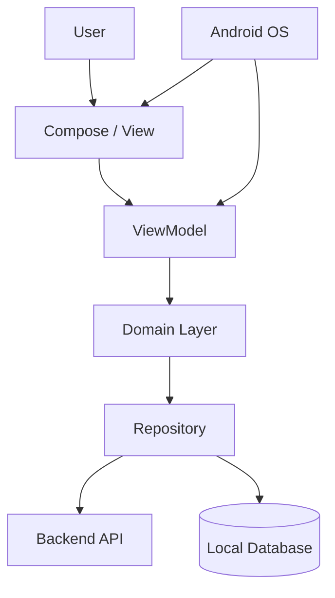
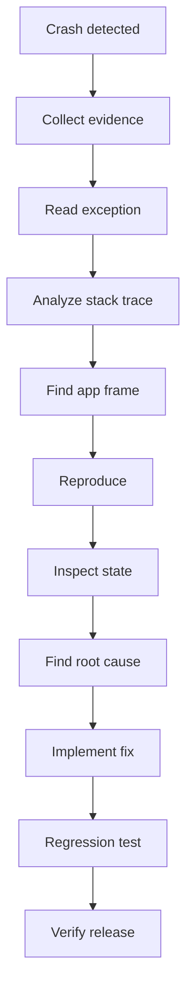
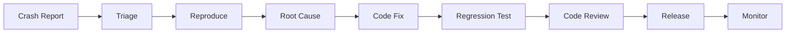

# 014 - Crash Investigation

**Học phần:** 05 - Quality, Release and Portfolio
**Module:** Module 10 - Linting, Debugging and Benchmark
**Nhóm nội dung:** Debugging
**Nguồn roadmap:** Linting, Debugging and Benchmark / Debugging
**Loại bài:** quality
**Thứ tự trong module:** 014
**Thời lượng gợi ý:** 30 phút

---

## 1. Tóm tắt

**Crash Investigation** là quá trình điều tra có hệ thống nhằm xác định nguyên nhân gốc của một lần ứng dụng Android bị dừng ngoài ý muốn, sau đó sửa lỗi và bổ sung cơ chế kiểm thử để hạn chế lỗi tương tự tái xuất hiện.

Điều tra crash không chỉ là tìm dòng code xuất hiện trong `stack trace`. Một crash có thể bắt nguồn từ nhiều tầng khác nhau như UI, lifecycle, `ViewModel`, coroutine, repository, database, network, serialization, dependency injection hoặc Android framework.

Một quy trình điều tra tốt thường đi theo hướng:

```text
Crash được phát hiện
        ↓
Thu thập bằng chứng
        ↓
Đọc exception và stack trace
        ↓
Xác định vùng code nghi vấn
        ↓
Tái hiện lỗi
        ↓
Tìm nguyên nhân gốc
        ↓
Sửa lỗi
        ↓
Viết regression test
        ↓
Theo dõi sau release
```

Mục tiêu cuối cùng không phải chỉ làm cho ứng dụng "hết crash", mà phải hiểu **tại sao crash xảy ra**, **điều kiện nào kích hoạt nó**, **người dùng nào bị ảnh hưởng** và **cách ngăn lỗi quay lại**.

---

## 2. Mục tiêu học tập

Sau bài học, người học có thể:

* giải thích được Crash Investigation và vai trò của nó trong quy trình phát triển Android;
* phân biệt triệu chứng crash với nguyên nhân gốc;
* đọc được các thành phần quan trọng của `stack trace`;
* xác định `exception type`, `message` và frame liên quan đến code ứng dụng;
* sử dụng Logcat để thu thập thông tin khi điều tra crash;
* phân tích crash liên quan đến lifecycle, state, coroutine, network và local storage;
* xây dựng quy trình tái hiện một crash có tính lặp lại;
* sửa lỗi mà không chỉ che giấu exception;
* viết regression test cho lỗi đã được sửa;
* tạo báo cáo Crash Investigation có thể sử dụng như artifact trong portfolio.

---

## 3. Khái niệm cốt lõi

### 3.1. Crash là gì?

Crash xảy ra khi ứng dụng gặp một lỗi nghiêm trọng mà tiến trình hiện tại không thể tiếp tục xử lý bình thường.

Ví dụ:

```kotlin
val user: User? = null
println(user!!.name)
```

Đoạn code trên có thể gây:

```text
java.lang.NullPointerException
```

Crash có thể xuất phát từ:

* lỗi logic;
* dữ liệu không hợp lệ;
* truy cập `null`;
* thao tác sai lifecycle;
* sử dụng collection sai chỉ số;
* lỗi parse dữ liệu;
* lỗi threading;
* exception từ thư viện;
* lỗi native;
* thiếu resource;
* state không nhất quán.

### 3.2. Crash Investigation là gì?

Crash Investigation là quá trình trả lời các câu hỏi:

1. Crash nào đã xảy ra?
2. Exception cụ thể là gì?
3. Crash xảy ra ở thread nào?
4. Dòng code nào của ứng dụng nằm gần nguyên nhân nhất?
5. Trạng thái ứng dụng trước crash là gì?
6. Điều kiện nào khiến lỗi xuất hiện?
7. Có tái hiện được hay không?
8. Nguyên nhân gốc nằm ở đâu?
9. Cách sửa có xử lý nguyên nhân hay chỉ xử lý triệu chứng?
10. Có test nào ngăn regression hay chưa?

### 3.3. Triệu chứng và nguyên nhân gốc

Một trong những lỗi phổ biến khi debug là xem dòng cuối cùng trước crash là nguyên nhân.

Ví dụ:

```text
UI crash
    ↓
ViewModel nhận state không hợp lệ
    ↓
Repository trả dữ liệu thiếu
    ↓
API response không có field mong đợi
```

UI là nơi crash xuất hiện nhưng nguyên nhân thực tế có thể nằm tại data layer.

> **Nguyên tắc:** Vị trí exception được throw không phải lúc nào cũng là nơi lỗi logic bắt đầu.

---

## 4. Vị trí của Crash Investigation trong kiến trúc Android

Crash có thể bắt nguồn từ gần như mọi tầng của ứng dụng.



Trong quá trình điều tra, developer cần lần ngược data flow hoặc event flow để tìm điểm mà trạng thái bắt đầu trở nên không hợp lệ.

Ví dụ:

* UI có thể crash vì nhận một item index không tồn tại;
* `ViewModel` có thể phát ra state không hợp lệ;
* repository có thể parse response sai;
* API có thể trả dữ liệu khác schema mong đợi;
* database có thể chứa dữ liệu cũ từ phiên bản trước;
* lifecycle có thể khiến callback chạy sau khi UI đã bị destroy;
* coroutine có thể throw exception không được xử lý.

Crash Investigation vì vậy liên quan trực tiếp đến:

* architecture;
* lifecycle;
* state management;
* error handling;
* logging;
* testing;
* release quality.

---

## 5. Các thành phần của một crash report

### 5.1. Exception type

Đây thường là thông tin đầu tiên cần xác định.

Ví dụ:

```text
java.lang.NullPointerException
```

hoặc:

```text
java.lang.IllegalStateException
```

hoặc:

```text
java.lang.IndexOutOfBoundsException
```

Exception type giúp thu hẹp nhóm nguyên nhân có thể xảy ra.

### 5.2. Exception message

Message cung cấp thêm ngữ cảnh.

Ví dụ:

```text
Index 5 out of bounds for length 3
```

Từ message này có thể suy luận rằng code đang cố truy cập phần tử thứ 6 trong collection chỉ có 3 phần tử.

### 5.3. Stack trace

Ví dụ:

```text
java.lang.IndexOutOfBoundsException: Index 5 out of bounds for length 3
    at java.util.ArrayList.get(ArrayList.java:427)
    at com.example.app.ui.ProfileScreenKt.renderAvatar(ProfileScreen.kt:82)
    at com.example.app.ui.ProfileScreenKt.ProfileScreen(ProfileScreen.kt:45)
```

Frame quan trọng:

```text
com.example.app.ui.ProfileScreenKt.renderAvatar(ProfileScreen.kt:82)
```

Thông tin này cho biết:

* file: `ProfileScreen.kt`;
* function: `renderAvatar()`;
* dòng: `82`.

> **Lưu ý:** Không nên chỉ sửa dòng 82. Cần kiểm tra vì sao index có giá trị `5` trong khi collection chỉ có 3 phần tử.

---

## 6. Quy trình điều tra crash



Quy trình thực tế nên thực hiện theo thứ tự sau.

1. Xác nhận crash xảy ra trên phiên bản nào.
2. Thu thập `stack trace`.
3. Xác định exception chính.
4. Tìm frame thuộc package của ứng dụng.
5. Kiểm tra code tại vị trí đó.
6. Xác định state và input trước crash.
7. Tìm cách tái hiện lỗi.
8. Thu hẹp điều kiện gây crash.
9. Xác định nguyên nhân gốc.
10. Sửa lỗi.
11. Chạy lại scenario gây crash.
12. Bổ sung regression test.
13. Kiểm tra các flow liên quan.
14. Theo dõi crash sau khi phát hành bản sửa.

---

## 7. Đọc stack trace đúng cách

Giả sử Logcat hiển thị:

```text
FATAL EXCEPTION: main
Process: com.example.app, PID: 14321

java.lang.IllegalStateException: User must be loaded before opening profile
    at com.example.app.profile.ProfileViewModel.openProfile(ProfileViewModel.kt:74)
    at com.example.app.profile.ProfileScreenKt.ProfileScreen(ProfileScreen.kt:93)
```

Có bốn thông tin quan trọng.

**Thread**

```text
FATAL EXCEPTION: main
```

Crash xảy ra trên main thread.

**Exception**

```text
java.lang.IllegalStateException
```

Đây là lỗi về trạng thái ứng dụng.

**Message**

```text
User must be loaded before opening profile
```

Điều kiện bắt buộc chưa được đáp ứng.

**Application frame**

```text
ProfileViewModel.kt:74
```

Đây là vị trí đầu tiên cần điều tra.

Nhưng cần tiếp tục kiểm tra:

```text
ProfileScreen
      ↓
openProfile()
      ↓
user == null
```

Sau đó đặt câu hỏi:

> Vì sao UI có thể gọi `openProfile()` trước khi dữ liệu người dùng được load?

Đây mới là hướng đi tới nguyên nhân gốc.

---

## 8. Điều tra crash theo từng nhóm nguyên nhân

### 8.1. Null và state không hợp lệ

Ví dụ:

```kotlin
fun showUser(user: User?) {
    println(user!!.name)
}
```

Dùng `!!` chuyển một giá trị nullable thành non-null và sẽ throw exception nếu giá trị thực tế là `null`.

Cách xử lý phụ thuộc business logic.

Nếu `null` hợp lệ:

```kotlin
fun showUser(user: User?) {
    val name = user?.name ?: "Khách"
    println(name)
}
```

Nếu `null` thể hiện state sai:

```kotlin
fun showUser(user: User?) {
    requireNotNull(user) {
        "User must exist before rendering profile"
    }

    println(user.name)
}
```

Điểm quan trọng là hiểu lý do `null` xuất hiện thay vì chỉ thay `!!` bằng safe call một cách máy móc.

### 8.2. Collection và index

Ví dụ:

```kotlin
val items = listOf("A", "B", "C")
println(items[5])
```

Kết quả:

```text
IndexOutOfBoundsException
```

Cần điều tra nguồn của index.

Nếu index có thể không hợp lệ:

```kotlin
val item = items.getOrNull(index)
```

Nhưng nếu index lẽ ra luôn hợp lệ, việc chỉ dùng `getOrNull()` có thể che giấu một bug state management.

---

## 9. Crash liên quan đến lifecycle và state

Một nhóm bug khó tái hiện là crash chỉ xảy ra khi:

* rotate màn hình;
* chuyển app xuống background;
* quay lại app;
* process bị Android kill;
* điều hướng nhanh giữa nhiều màn hình;
* callback trả kết quả sau khi màn hình đã biến mất.

Ví dụ scenario:

```text
Profile Screen
     ↓
Gửi request
     ↓
User chuyển sang màn khác
     ↓
Request hoàn thành
     ↓
Callback truy cập UI cũ
     ↓
Crash
```

Khi điều tra dạng crash này, nên thử:

1. mở màn hình;
2. kích hoạt request;
3. rotate ngay lập tức;
4. nhấn Home;
5. quay lại ứng dụng;
6. điều hướng sang màn khác trước khi request hoàn thành;
7. bật tùy chọn Developer Options liên quan đến việc destroy activity nếu cần mô phỏng lifecycle khắc nghiệt hơn.

Với Android hiện đại, state dài hạn nên đặt ở thành phần phù hợp như `ViewModel`, trong khi UI thu thập state theo lifecycle thay vì giữ reference không cần thiết đến `Activity`, `Fragment` hoặc `View`.

---

## 10. Crash trong coroutine

Ví dụ:

```kotlin
viewModelScope.launch {
    val user = repository.loadUser()
    _uiState.value = UserUiState.Success(user)
}
```

Nếu `loadUser()` throw exception và không có cơ chế xử lý phù hợp, coroutine có thể thất bại.

Một cách biểu diễn rõ ràng hơn:

```kotlin
viewModelScope.launch {
    _uiState.value = UserUiState.Loading

    runCatching {
        repository.loadUser()
    }.onSuccess { user ->
        _uiState.value = UserUiState.Success(user)
    }.onFailure { throwable ->
        _uiState.value = UserUiState.Error(
            message = throwable.message ?: "Không thể tải dữ liệu"
        )
    }
}
```

Tuy nhiên, không nên biến tất cả exception thành một message chung mà mất thông tin cần thiết cho debugging.

Developer cần phân biệt:

* lỗi dự kiến và recoverable;
* lỗi business;
* lỗi network;
* lỗi parsing;
* lỗi lập trình;
* cancellation của coroutine.

> **Lưu ý:** Không nên bắt `Throwable` ở mọi nơi rồi bỏ qua lỗi. Việc đó có thể khiến bug nghiêm trọng biến thành state sai âm thầm.

---

## 11. Crash liên quan đến network và dữ liệu

Một API response có thể thay đổi hoặc chứa dữ liệu không đầy đủ.

Ví dụ response:

```json
{
  "id": 123,
  "name": null
}
```

Nếu model giả định:

```kotlin
data class UserResponse(
    val id: Long,
    val name: String
)
```

developer cần kiểm tra contract thực tế của backend và chiến lược parsing.

Một hướng an toàn là cho transport model phản ánh đúng dữ liệu API:

```kotlin
data class UserResponse(
    val id: Long,
    val name: String?
)
```

Sau đó validate khi mapping:

```kotlin
fun UserResponse.toDomain(): User {
    return User(
        id = id,
        name = requireNotNull(name) {
            "User name is missing for id=$id"
        }
    )
}
```

Cách này giúp vị trí validation rõ ràng hơn.

Khi điều tra crash liên quan network, cần lưu ý:

* HTTP status;
* response body;
* schema;
* field nullable;
* timeout;
* serialization;
* app version;
* backend version;
* dữ liệu cache cũ.

---

## 12. Tái hiện crash

Một crash khó sửa nếu developer không biết cách khiến nó xảy ra lại.

Một crash report tốt cần ghi được điều kiện tái hiện.

Ví dụ:

```text
Thiết bị: Android emulator
Màn hình: Profile
Trạng thái: chưa tải user
Network: Slow 3G

Bước:
1. Mở ứng dụng.
2. Đăng nhập.
3. Mở Profile ngay sau khi login.
4. Nhấn Edit trước khi profile load xong.

Kết quả:
Ứng dụng crash với IllegalStateException.

Kết quả mong đợi:
Nút Edit bị disable cho tới khi profile được load.
```

Có thể tiếp tục giảm scenario:

```text
Login
 ↓
Open Profile
 ↓
Tap Edit
 ↓
Crash
```

Scenario càng ngắn và ổn định thì việc debug càng hiệu quả.

---

## 13. Thu hẹp nguyên nhân bằng logging

Logging có thể cung cấp context mà stack trace không thể hiện.

Ví dụ:

```kotlin
Log.d(
    "ProfileDebug",
    "openProfile userId=$userId state=$currentState"
)
```

Không nên log:

```kotlin
Log.d(
    "Auth",
    "token=$accessToken"
)
```

Dữ liệu nhạy cảm không được xuất hiện trong log production.

Logging tốt nên giúp trả lời:

* event nào vừa xảy ra;
* state trước event;
* request nào đang chạy;
* ID kỹ thuật nào liên quan;
* branch nào được thực thi;
* lỗi xuất hiện ở bước nào.

Không nên tạo log quá nhiều đến mức signal bị chìm trong noise.

---

## 14. Sử dụng Logcat khi điều tra crash

Android Studio Logcat thường là công cụ đầu tiên cần kiểm tra khi crash xảy ra trong quá trình phát triển.

Có thể tập trung vào:

```text
FATAL EXCEPTION
```

hoặc package của ứng dụng.

Thông tin nên lưu lại:

* exception type;
* exception message;
* toàn bộ stack trace cần thiết;
* thời điểm xảy ra;
* thread;
* device hoặc emulator;
* Android version;
* app build/version;
* các log ngay trước crash.

Có thể dùng `adb` để xem log:

```bash
adb logcat
```

Hoặc lọc thông tin liên quan:

```bash
adb logcat | grep "FATAL EXCEPTION"
```

Trên Windows shell không hỗ trợ `grep`, có thể sử dụng công cụ lọc tương ứng của môi trường đang chạy.

> **Lưu ý:** Không chỉ chụp một dòng exception. Các dòng trước và sau crash thường cung cấp context quan trọng.

---

## 15. Ví dụ điều tra hoàn chỉnh

Giả sử ứng dụng có code:

```kotlin
data class ProfileUiState(
    val images: List<String> = emptyList(),
    val selectedIndex: Int = 0
)
```

UI:

```kotlin
@Composable
fun ProfileScreen(state: ProfileUiState) {
    val selectedImage = state.images[state.selectedIndex]

    Text(text = selectedImage)
}
```

Crash:

```text
java.lang.IndexOutOfBoundsException:
Empty list doesn't contain element at index 0
```

Phân tích:

```text
ProfileScreen
     ↓
selectedIndex = 0
     ↓
images = []
     ↓
images[0]
     ↓
Crash
```

Triệu chứng:

```text
IndexOutOfBoundsException
```

Nguyên nhân:

```text
UI state cho phép trạng thái:
images = []
selectedIndex = 0
```

trong khi UI giả định luôn có ít nhất một ảnh.

Một cách sửa:

```kotlin
@Composable
fun ProfileScreen(state: ProfileUiState) {
    val selectedImage = state.images.getOrNull(state.selectedIndex)

    if (selectedImage == null) {
        Text(text = "Chưa có ảnh")
        return
    }

    Text(text = selectedImage)
}
```

Nếu business rule quy định profile bắt buộc phải có ảnh, cần sửa state hoặc data flow thay vì chỉ dùng `getOrNull()`.

Ví dụ thiết kế state rõ hơn:

```kotlin
sealed interface ProfileUiState {

    data object Loading : ProfileUiState

    data object Empty : ProfileUiState

    data class Success(
        val images: List<String>,
        val selectedIndex: Int
    ) : ProfileUiState

    data class Error(
        val message: String
    ) : ProfileUiState
}
```

Thiết kế state rõ ràng giúp loại bỏ nhiều trạng thái không hợp lệ ngay từ kiến trúc.

---

## 16. Root Cause Analysis

Khi tìm nguyên nhân, có thể sử dụng kỹ thuật hỏi "Tại sao?" nhiều lần.

Ví dụ:

```text
Ứng dụng crash khi mở Profile
        ↓
Tại sao?
UI truy cập images[0]
        ↓
Tại sao?
Danh sách images rỗng
        ↓
Tại sao?
Profile chưa load xong
        ↓
Tại sao?
UI Success được render trước khi dữ liệu sẵn sàng
        ↓
Root cause
State model không biểu diễn rõ Loading và Empty
```

Nếu chỉ sửa:

```kotlin
if (images.isNotEmpty()) {
    // ...
}
```

crash có thể biến mất nhưng kiến trúc state vẫn có vấn đề.

Một fix tốt nên xử lý nguyên nhân ở tầng phù hợp.

---

## 17. Lỗi thường gặp khi điều tra crash

### 17.1. Chỉ sửa dòng crash

**Hiện tượng:** Developer thêm một `null` check tại dòng stack trace chỉ ra.

**Nguyên nhân:** Stack trace được xem là nguyên nhân gốc thay vì điểm lỗi được phát hiện.

**Cách xử lý:** Theo ngược state và data flow để xác định vì sao dữ liệu không hợp lệ đến được dòng đó.

### 17.2. Bắt mọi exception rồi bỏ qua

Ví dụ không nên dùng:

```kotlin
try {
    executeImportantOperation()
} catch (e: Exception) {
    // Ignore
}
```

**Hiện tượng:** App không crash nhưng tính năng hoạt động sai.

**Nguyên nhân:** Exception bị nuốt.

**Cách xử lý:** Xử lý error state rõ ràng, log context cần thiết và chỉ catch exception ở nơi thực sự biết cách recovery.

### 17.3. Không tái hiện trước khi sửa

**Hiện tượng:** Developer thay nhiều đoạn code rồi thấy crash tạm thời không còn.

**Nguyên nhân:** Không có test case ổn định.

**Cách xử lý:** Xác định scenario tái hiện trước khi sửa nếu điều kiện cho phép.

### 17.4. Sửa nhưng không tạo regression test

**Hiện tượng:** Crash quay lại sau một refactor.

**Nguyên nhân:** Không có test bảo vệ hành vi.

**Cách xử lý:** Chuyển điều kiện gây crash thành test.

### 17.5. Log dữ liệu nhạy cảm

**Hiện tượng:** Log chứa token, email hoặc dữ liệu người dùng.

**Nguyên nhân:** Thêm logging quá mức trong quá trình điều tra.

**Cách xử lý:** Chỉ log metadata kỹ thuật tối thiểu và loại bỏ dữ liệu nhạy cảm.

---

## 18. Best practices

* Bắt đầu từ exception và stack trace thay vì đoán nguyên nhân.
* Luôn xác định frame thuộc code ứng dụng.
* Tái hiện crash bằng scenario ngắn nhất có thể.
* Kiểm tra state ngay trước crash.
* Phân biệt symptom với root cause.
* Không dùng `try-catch` để che lỗi lập trình.
* Thiết kế UI state để hạn chế các trạng thái không hợp lệ.
* Validation dữ liệu nên nằm ở boundary phù hợp.
* Không log token, password hoặc dữ liệu nhạy cảm.
* Gắn crash với app version và environment.
* Sau mỗi fix quan trọng nên có regression test.
* Kiểm tra lifecycle scenario trước khi kết luận lỗi đã được sửa.
* Với crash production, theo dõi tỷ lệ crash sau khi rollout bản sửa.

---

## 19. Kiểm thử sau khi sửa crash

Một crash fix chưa hoàn thành nếu chỉ chạy lại ứng dụng một lần và thấy không crash.

| Test case                  | Kết quả mong đợi                      |
| -------------------------- | ------------------------------------- |
| Scenario gây crash ban đầu | Không còn crash                       |
| Dữ liệu hợp lệ             | Flow hoạt động bình thường            |
| Dữ liệu rỗng               | Hiển thị empty state phù hợp          |
| Dữ liệu lỗi                | Hiển thị error state                  |
| Rotate màn hình            | Không mất state quan trọng hoặc crash |
| Background rồi quay lại    | Flow vẫn ổn định                      |
| Network chậm               | Không tạo state race bất hợp lý       |
| Network thất bại           | Không crash                           |
| Người dùng thao tác nhanh  | State vẫn nhất quán                   |

Nếu bug nằm trong logic thuần Kotlin, ưu tiên viết unit test.

Ví dụ:

```kotlin
class ProfileStateValidatorTest {

    @Test
    fun `selected image returns null when list is empty`() {
        val images = emptyList<String>()

        val result = images.getOrNull(0)

        assertNull(result)
    }
}
```

Quan trọng hơn, nếu logic state được tách riêng:

```kotlin
fun selectImage(
    images: List<String>,
    index: Int
): String? {
    return images.getOrNull(index)
}
```

test có thể kiểm tra chính xác regression:

```kotlin
@Test
fun `invalid index does not crash`() {
    val images = listOf("a.jpg")

    val result = selectImage(
        images = images,
        index = 4
    )

    assertNull(result)
}
```

---

## 20. Crash production và crash local

Crash local thường dễ điều tra hơn vì developer có thể:

* đặt breakpoint;
* kiểm tra biến;
* chạy lại ngay;
* thay đổi input;
* quan sát Logcat.

Crash production khó hơn vì developer thường chỉ có:

```text
Crash report
+
Stack trace
+
Device metadata
+
App version
+
Logs / breadcrumbs nếu có
```

Do đó production app thường cần crash reporting để:

* nhóm crash giống nhau;
* xác định số user bị ảnh hưởng;
* theo dõi phiên bản;
* xem stack trace;
* đánh giá mức độ nghiêm trọng;
* kiểm tra crash có xuất hiện lại sau bản sửa hay không.

Crash Investigation vì vậy không kết thúc ở Android Studio mà còn liên quan trực tiếp tới observability và release monitoring.

---

## 21. Bảo mật và quyền riêng tư

Crash report có thể vô tình chứa thông tin người dùng.

Không nên gửi hoặc log:

* password;
* access token;
* refresh token;
* API secret;
* nội dung tin nhắn riêng tư;
* dữ liệu thanh toán;
* dữ liệu cá nhân không cần thiết.

Ví dụ không an toàn:

```kotlin
Log.e(
    "Login",
    "Login failed token=$accessToken email=$email",
    throwable
)
```

Nên ưu tiên context kỹ thuật:

```kotlin
Log.e(
    "Login",
    "Login request failed requestId=$requestId",
    throwable
)
```

Crash reporting cần tuân theo nguyên tắc:

```text
Thu thập tối thiểu
        ↓
Đủ để debug
        ↓
Không chứa secret
        ↓
Có chính sách retention phù hợp
```

---

## 22. Quy trình xử lý crash trong team

Một workflow thực tế có thể là:



Trong đó:

1. **Triage** xác định mức độ ưu tiên.
2. **Reproduce** tạo scenario tái hiện.
3. **Root Cause** xác định nguyên nhân.
4. **Fix** sửa tại tầng thích hợp.
5. **Regression Test** ngăn bug quay lại.
6. **Code Review** kiểm tra fix và rủi ro phụ.
7. **Release** đưa bản sửa tới người dùng.
8. **Monitor** xác nhận crash thực sự giảm.

---

## 23. Ưu tiên xử lý crash

Không phải mọi crash đều có cùng mức độ nghiêm trọng.

Có thể xem xét các yếu tố:

* số lượng user bị ảnh hưởng;
* tần suất xảy ra;
* có chặn flow chính hay không;
* có liên quan login hoặc payment hay không;
* có mất dữ liệu hay không;
* có workaround hay không;
* crash mới xuất hiện sau release nào;
* crash có đang tăng nhanh hay không.

Ví dụ:

```text
Crash A
- 2 user
- Edge case
- Có workaround

Crash B
- 5.000 user
- Xảy ra lúc startup
- Không thể mở app
```

Crash B phải được ưu tiên cao hơn đáng kể.

---

## 24. Mẫu báo cáo Crash Investigation

Một technical note có thể sử dụng cấu trúc:

```text
Title:
Profile crashes when opening image gallery

Environment:
App version: ...
Android version: ...
Device: ...

Exception:
IndexOutOfBoundsException

Affected flow:
Profile → Gallery

Reproduction:
1. ...
2. ...
3. ...

Observed:
Application crashes.

Expected:
Empty state is displayed.

Root cause:
ProfileUiState allowed selectedIndex=0 while images was empty.

Fix:
Represent empty profile state explicitly.

Regression test:
Added test for empty image collection.

Risk:
Profile gallery state handling.

Verification:
Original scenario passes.
Rotate/background scenarios pass.
```

Mẫu này biến việc sửa crash thành một artifact kỹ thuật có thể review và lưu trữ.

---

## 25. Bài thực hành

Xây dựng một mini app cố tình chứa lỗi crash liên quan đến collection.

Code ban đầu:

```kotlin
@Composable
fun CrashDemoScreen() {
    val users = listOf("An", "Bình")

    Button(
        onClick = {
            println(users[5])
        }
    ) {
        Text("Open User")
    }
}
```

Thực hiện:

1. Chạy ứng dụng.
2. Nhấn `Open User`.
3. Quan sát crash trong Logcat.
4. Ghi lại exception type.
5. Xác định file và dòng code gây exception.
6. Giải thích nguyên nhân.
7. Sửa code để không còn state truy cập index không hợp lệ.
8. Chạy lại scenario.
9. Thử với danh sách rỗng.
10. Viết một regression test cho logic lấy phần tử.
11. Tạo file `crash-investigation.md` ghi lại toàn bộ quá trình.

Kết quả mong đợi:

* xác định được `IndexOutOfBoundsException`;
* đọc được application frame từ stack trace;
* tái hiện được crash;
* sửa đúng nguyên nhân;
* có test ngăn regression;
* có báo cáo kỹ thuật ngắn.

---

## 26. Artifact cho portfolio

Tạo một artifact:

```text
crash-investigation/
├── README.md
├── crash-investigation.md
├── screenshots/
│   ├── crash-logcat.png
│   └── fixed-result.png
└── app/
```

Trong `crash-investigation.md`, ghi rõ:

* mô tả bug;
* exception;
* stack trace quan trọng;
* bước tái hiện;
* root cause;
* code trước khi sửa;
* code sau khi sửa;
* regression test;
* ảnh Logcat;
* ảnh kết quả;
* bài học rút ra.

Artifact nên chứng minh rằng người học không chỉ biết sửa code mà còn có khả năng:

```text
Observe
   ↓
Investigate
   ↓
Reason
   ↓
Fix
   ↓
Test
   ↓
Document
```

---

## 27. Checklist hoàn thành

* [ ] Tôi giải thích được Crash Investigation bằng lời của mình.
* [ ] Tôi phân biệt được symptom và root cause.
* [ ] Tôi đọc được exception type và exception message.
* [ ] Tôi tìm được application frame trong stack trace.
* [ ] Tôi biết sử dụng Logcat để điều tra crash.
* [ ] Tôi tái hiện được một crash bằng các bước cụ thể.
* [ ] Tôi kiểm tra state và input trước thời điểm crash.
* [ ] Tôi không dùng `try-catch` chỉ để che giấu bug.
* [ ] Tôi kiểm tra lifecycle và background scenario khi có liên quan.
* [ ] Tôi viết được regression test cho lỗi đã sửa.
* [ ] Tôi không log token hoặc dữ liệu nhạy cảm.
* [ ] Tôi tạo được báo cáo Crash Investigation.
* [ ] Tôi lưu artifact vào portfolio.

---

## 28. Câu hỏi tự kiểm tra

1. Vì sao dòng đầu tiên thuộc code ứng dụng trong stack trace chưa chắc là nguyên nhân gốc của crash?
2. Sự khác nhau giữa sửa symptom và sửa root cause là gì?
3. Vì sao khả năng tái hiện crash lại quan trọng trong quá trình debugging?
4. Tại sao việc bắt mọi `Exception` rồi bỏ qua có thể khiến chất lượng ứng dụng tệ hơn?
5. Sau khi sửa một crash production, vì sao vẫn cần regression test và theo dõi sau release?

---

## 29. Tổng kết

Crash Investigation là một kỹ năng debugging quan trọng của Android Developer. Quy trình không dừng ở việc đọc exception và sửa dòng code bị crash mà cần lần theo toàn bộ state, lifecycle và data flow để tìm nguyên nhân thực sự.

Một quy trình điều tra tốt có thể tóm tắt thành:

```text
Crash
  ↓
Evidence
  ↓
Stack Trace
  ↓
Reproduce
  ↓
State Analysis
  ↓
Root Cause
  ↓
Fix
  ↓
Regression Test
  ↓
Release Monitoring
```

Điểm quan trọng cần nhớ:

* bắt đầu từ bằng chứng thay vì đoán;
* đọc đầy đủ exception và stack trace;
* tái hiện lỗi trước khi sửa nếu có thể;
* tìm nguyên nhân gốc thay vì chỉ che symptom;
* kiểm tra lifecycle, state, network và dữ liệu nếu có liên quan;
* không log dữ liệu nhạy cảm;
* biến mỗi crash quan trọng thành một regression test;
* document quá trình điều tra để nâng cao maintainability và chất lượng release.

Sau bài này, người học nên có khả năng nhận một crash report, xác định vùng lỗi, tái hiện vấn đề, tìm root cause, triển khai fix, viết test bảo vệ và tạo một báo cáo kỹ thuật có thể sử dụng trong portfolio.
