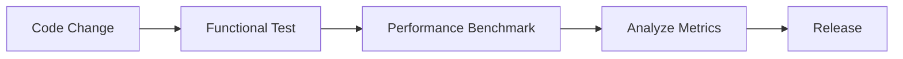
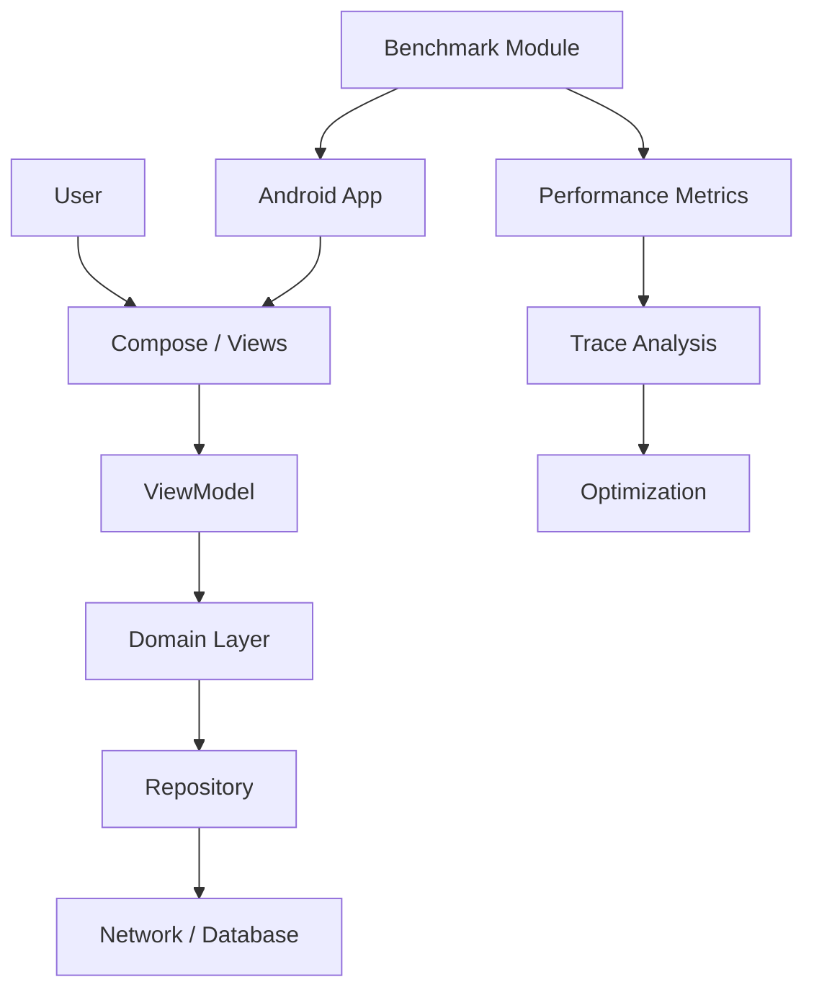
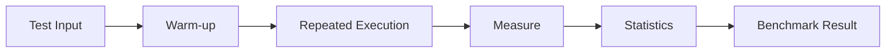
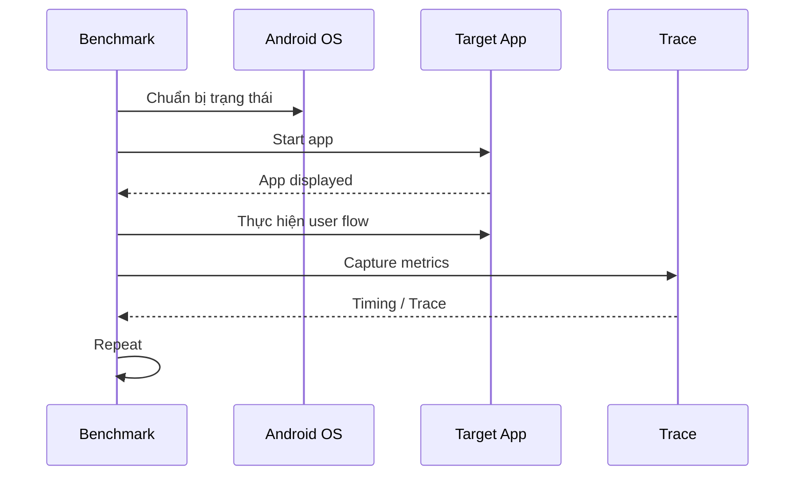
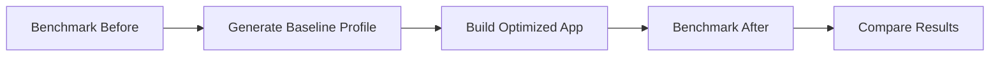
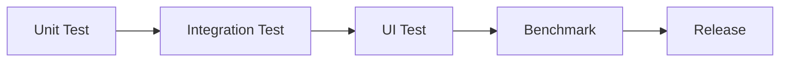
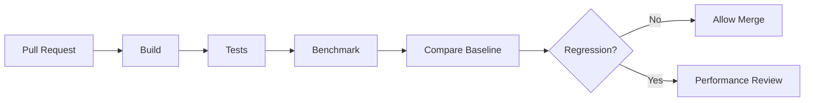

# 015 - Jetpack Benchmark

**Học phần:** 05 - Quality, Release and Portfolio
**Module:** Module 10 - Linting, Debugging and Benchmark
**Nhóm nội dung:** Performance
**Nguồn roadmap:** Linting, Debugging and Benchmark / Performance
**Loại bài:** quality
**Thứ tự trong module:** 015
**Thời lượng gợi ý:** 30 phút

---

## 1. Tóm tắt

**Jetpack Benchmark** là bộ công cụ thuộc Android Jetpack dùng để đo hiệu năng ứng dụng một cách có hệ thống và có thể lặp lại. Thay vì chỉ mở ứng dụng và cảm nhận rằng một màn hình "nhanh" hay "chậm", developer có thể xây dựng benchmark để đo thời gian thực thi, tốc độ khởi động ứng dụng, độ mượt khi cuộn, thời gian render frame hoặc các Critical User Journey quan trọng.

Android hiện cung cấp hai hướng benchmark chính: **Microbenchmark** để đo những đoạn code nhỏ chạy trong process và **Macrobenchmark** để đo các hành vi ở cấp ứng dụng như startup, scrolling hoặc animation.

Benchmark đặc biệt hữu ích khi tối ưu performance hoặc bảo vệ ứng dụng trước **performance regression** — tình trạng một thay đổi mới khiến ứng dụng chậm hơn mà functional test thông thường vẫn vượt qua.

Trong Android Developer Roadmap, Jetpack Benchmark nằm ở giao điểm giữa:

```text
Performance
    ↓
Measurement
    ↓
Benchmark
    ↓
Optimization
    ↓
Regression Detection
    ↓
Release Quality
```

Sau bài học này, người học cần biết cách lựa chọn Microbenchmark hoặc Macrobenchmark, viết một benchmark cơ bản, đọc kết quả và biến benchmark thành quality artifact có thể đưa vào portfolio hoặc CI pipeline.

## 2. Mục tiêu học tập

Sau bài học, người học có thể:

* Giải thích mục đích của Jetpack Benchmark bằng ngôn ngữ của mình.
* Phân biệt `Microbenchmark` và `Macrobenchmark`.
* Nhận biết trường hợp nên benchmark function, startup, scrolling hoặc Critical User Journey.
* Viết một `Microbenchmark` cơ bản bằng Kotlin.
* Viết một `Macrobenchmark` đo thời gian khởi động ứng dụng.
* Phân biệt benchmark với profiling và functional testing.
* Đọc kết quả benchmark theo median, percentile và trace thay vì chỉ nhìn một lần chạy.
* Nhận biết các yếu tố có thể làm kết quả benchmark bị nhiễu.
* Sử dụng benchmark để phát hiện performance regression trước khi release.
* Tạo benchmark report, trace hoặc README làm artifact cho portfolio.

## 3. Khái niệm cốt lõi

### 3.1. Benchmark là gì?

**Benchmark** là phép đo hiệu năng được thiết kế để có thể thực hiện lặp lại trong một môi trường tương đối ổn định.

Một benchmark tốt không chỉ trả lời:

> "Đoạn code này mất bao lâu?"

mà còn giúp trả lời:

* Phiên bản mới có nhanh hơn phiên bản cũ không?
* Một refactor có gây regression không?
* Startup có được cải thiện sau khi thêm Baseline Profile không?
* Màn hình danh sách có xuất hiện jank khi scroll không?
* Một thuật toán mới có thực sự nhanh hơn hay chỉ có cảm giác nhanh hơn?

Một workflow benchmark thường có dạng:

```text
Chọn user flow hoặc code cần đo
        ↓
Xác định metric
        ↓
Chuẩn hóa môi trường
        ↓
Warm-up nếu cần
        ↓
Chạy nhiều iteration
        ↓
Thu thập metric
        ↓
Phân tích trace/kết quả
        ↓
Tối ưu
        ↓
Benchmark lại
```

Benchmark phải được coi là một **phép đo**, không phải một công cụ tối ưu tự động.

### 3.2. Microbenchmark và Macrobenchmark

Jetpack Benchmark có hai nhóm chính.

| Đặc điểm       | Microbenchmark                            | Macrobenchmark                        |
| -------------- | ----------------------------------------- | ------------------------------------- |
| Phạm vi        | Đo đoạn code nhỏ                          | Đo hành vi cấp ứng dụng               |
| Process        | Thường chạy cùng process với code được đo | Benchmark chạy bên ngoài app mục tiêu |
| Ví dụ          | Parser, mapper, thuật toán                | Startup, scrolling, animation         |
| Tốc độ chạy    | Thường nhanh                              | Chậm hơn                              |
| UI interaction | Không phải mục tiêu chính                 | Phù hợp                               |
| System trace   | Có hỗ trợ trace                           | Có system trace chi tiết              |
| Use case       | Tối ưu hot code path                      | Đánh giá UX thực tế                   |

Có thể ghi nhớ:

```text
Function nhỏ
    ↓
Microbenchmark

User Journey
    ↓
Macrobenchmark
```

## 4. Vì sao Jetpack Benchmark quan trọng?

Functional test có thể chứng minh:

```text
User bấm Login
        ↓
Login thành công
```

nhưng không chứng minh:

```text
Login mất 300 ms
```

hay:

```text
Login mất 4 giây
```

Cả hai trường hợp đều có thể vượt qua functional test.

Đối với người dùng, performance ảnh hưởng trực tiếp đến:

* thời gian mở ứng dụng;
* độ phản hồi của thao tác;
* độ mượt animation;
* scrolling;
* thời gian tải nội dung;
* cảm giác ổn định;
* khả năng sử dụng trên thiết bị yếu.

Benchmark bổ sung một lớp kiểm soát chất lượng:



Functional test kiểm tra **đúng hay sai**.

Benchmark kiểm tra **nhanh hay chậm**.

## 5. Vị trí của Benchmark trong kiến trúc Android

Benchmark thường không nằm trực tiếp trong business architecture của ứng dụng mà nằm trong **quality infrastructure** bao quanh ứng dụng.



Ví dụ:

* Nếu `Repository` mapping dữ liệu quá chậm, có thể dùng Microbenchmark.
* Nếu startup app chậm, dùng Macrobenchmark.
* Nếu `LazyColumn` scroll bị giật, dùng Macrobenchmark với frame metric.
* Nếu muốn kiểm tra hiệu quả của Baseline Profile, dùng Macrobenchmark để so sánh trước và sau tối ưu.

Benchmark vì vậy liên quan trực tiếp tới:

* architecture;
* rendering;
* storage;
* network;
* startup;
* build optimization;
* Baseline Profiles;
* release quality.

## 6. Chọn loại benchmark phù hợp

Không nên benchmark mọi thứ bằng cùng một công cụ.

| Tình huống                        | Công cụ phù hợp |
| --------------------------------- | --------------- |
| Đo một thuật toán                 | Microbenchmark  |
| Đo mapper DTO → domain            | Microbenchmark  |
| Đo parser                         | Microbenchmark  |
| Đo xử lý collection               | Microbenchmark  |
| Đo cold startup                   | Macrobenchmark  |
| Đo warm startup                   | Macrobenchmark  |
| Đo scrolling                      | Macrobenchmark  |
| Đo animation                      | Macrobenchmark  |
| Đo Critical User Journey          | Macrobenchmark  |
| So sánh hiệu quả Baseline Profile | Macrobenchmark  |

Nguyên tắc đơn giản:

> Nếu cần gọi trực tiếp một function để đo, hãy nghĩ đến Microbenchmark.

> Nếu cần thao tác với ứng dụng giống người dùng thực, hãy nghĩ đến Macrobenchmark.

## 7. Benchmark khác gì Profiler?

Benchmark và profiler bổ trợ cho nhau nhưng giải quyết hai câu hỏi khác nhau.

| Công cụ         | Câu hỏi chính                      |
| --------------- | ---------------------------------- |
| Benchmark       | Performance hiện tại là bao nhiêu? |
| Profiler        | Tại sao performance lại như vậy?   |
| Functional test | Tính năng có chạy đúng không?      |

Ví dụ:

```text
Macrobenchmark
    ↓
Phát hiện startup chậm
    ↓
Profiler / System Trace
    ↓
Xác định initialization tốn thời gian
    ↓
Optimize
    ↓
Macrobenchmark lại
```

Android Developers cũng khuyến nghị sử dụng profiling để tìm bottleneck, sau đó benchmark phần cần tối ưu để có kết quả ổn định và có thể so sánh.

## 8. Các metric thường gặp

### 8.1. Metric cho Microbenchmark

Microbenchmark thường tập trung vào:

* thời gian thực thi;
* CPU work;
* allocation hoặc behavior liên quan tới code được đo;
* sự khác biệt giữa các implementation.

Ví dụ:

```text
Implementation A
Median = 1.8 ms

Implementation B
Median = 1.1 ms
```

Nếu benchmark được thiết kế đúng, có thể kết luận implementation B có khả năng nhanh hơn trong workload đang kiểm tra.

### 8.2. Metric cho Macrobenchmark

Macrobenchmark có thể đo các user flow lớn như startup và rendering.

Các metric thường gặp gồm:

* `StartupTimingMetric`;
* `FrameTimingMetric`;
* các metric liên quan đến trace;
* custom trace-based metrics khi cần phân tích sâu hơn.

Ví dụ:

```text
Cold startup
P50 = 610 ms
P90 = 740 ms

Scroll feed
Frame timing:
P50 = 8 ms
P90 = 15 ms
```

Không nên kết luận performance chỉ dựa vào một iteration.

## 9. Cách Microbenchmark hoạt động

Một Microbenchmark cơ bản thực hiện:

1. Khởi tạo dữ liệu cần thiết.
2. Cho runtime warm-up nếu cần.
3. Chạy code cần đo nhiều lần.
4. Thu thập thời gian.
5. Giảm ảnh hưởng của noise.
6. Tổng hợp kết quả.
7. Xuất benchmark report.

Flow có thể hình dung như sau:



Điểm quan trọng là benchmark library điều phối quá trình chạy lặp lại thay vì developer tự viết:

```kotlin
val start = System.nanoTime()
doSomething()
val end = System.nanoTime()
```

Đo thủ công như trên rất dễ bị ảnh hưởng bởi warm-up, JIT, scheduler và nhiều nguồn noise khác.

## 10. Cách Macrobenchmark hoạt động

Macrobenchmark chạy benchmark từ bên ngoài application process.

Điều này cho phép benchmark:

1. Chuẩn bị trạng thái ứng dụng.
2. Điều khiển compilation state.
3. Dừng hoặc khởi động app.
4. Thực hiện hành vi giống người dùng.
5. Capture performance metric.
6. Capture system trace.
7. Lặp lại nhiều lần.
8. Tổng hợp kết quả.

Flow tổng quát:



`MacrobenchmarkRule` thực hiện benchmark các operation lớn như startup, scrolling hoặc animation.

## 11. Dependency Jetpack Benchmark

Tại thời điểm ngày 26 tháng 8 năm 2026, stable release của AndroidX Benchmark là `1.4.1`; `1.5.0-rc01` đang ở trạng thái Release Candidate.

Đối với tài liệu học ổn định, nên ưu tiên stable release.

Microbenchmark:

```kotlin
dependencies {
    androidTestImplementation("androidx.benchmark:benchmark-junit4:1.4.1")
}
```

Macrobenchmark:

```kotlin
dependencies {
    androidTestImplementation("androidx.benchmark:benchmark-macro-junit4:1.4.1")
}
```

> **Lưu ý:** Version thư viện thay đổi theo thời gian. Khi triển khai trong project thực tế, cần kiểm tra AndroidX Benchmark release notes thay vì mặc định giữ nguyên version của giáo trình.

## 12. Triển khai Microbenchmark

Giả sử ứng dụng có một function tính tổng giá sau thuế cho nhiều sản phẩm:

```kotlin
fun calculateTotal(prices: IntArray): Long {
    var total = 0L

    for (price in prices) {
        total += price
    }

    return total
}
```

Có thể viết benchmark:

```kotlin
import androidx.benchmark.junit4.BenchmarkRule
import androidx.benchmark.junit4.measureRepeated
import androidx.test.ext.junit.runners.AndroidJUnit4
import org.junit.Rule
import org.junit.Test
import org.junit.runner.RunWith

@RunWith(AndroidJUnit4::class)
class PriceCalculatorBenchmark {

    @get:Rule
    val benchmarkRule = BenchmarkRule()

    private val prices = IntArray(10_000) { it }

    @Volatile
    private var result: Long = 0

    @Test
    fun calculateTotalBenchmark() {
        benchmarkRule.measureRepeated {
            result = calculateTotal(prices)
        }
    }

    private fun calculateTotal(prices: IntArray): Long {
        var total = 0L

        for (price in prices) {
            total += price
        }

        return total
    }
}
```

Ý nghĩa:

* `BenchmarkRule` điều khiển benchmark.
* `measureRepeated` chạy workload nhiều lần.
* `prices` được tạo trước vùng đo để tránh benchmark cả chi phí setup.
* `result` được giữ lại để hạn chế việc compiler loại bỏ phép tính vì kết quả không được sử dụng.

Điều quan trọng nhất là xác định **ranh giới phép đo**.

Không nên vô tình benchmark:

```text
Create test data
+
Initialize database
+
Run algorithm
+
Write log
+
Algorithm thực sự cần đo
```

nếu mục tiêu chỉ là đo algorithm.

## 13. Triển khai Macrobenchmark cho startup

Một trong những benchmark có giá trị thực tế nhất là đo app startup.

Ví dụ:

```kotlin
import androidx.benchmark.macro.StartupMode
import androidx.benchmark.macro.StartupTimingMetric
import androidx.benchmark.macro.junit4.MacrobenchmarkRule
import androidx.test.ext.junit.runners.AndroidJUnit4
import org.junit.Rule
import org.junit.Test
import org.junit.runner.RunWith

@RunWith(AndroidJUnit4::class)
class StartupBenchmark {

    @get:Rule
    val benchmarkRule = MacrobenchmarkRule()

    @Test
    fun coldStartup() {
        benchmarkRule.measureRepeated(
            packageName = "com.example.benchmarkdemo",
            metrics = listOf(
                StartupTimingMetric()
            ),
            iterations = 10,
            startupMode = StartupMode.COLD,
            setupBlock = {
                pressHome()
            }
        ) {
            startActivityAndWait()
        }
    }
}
```

`StartupMode.COLD` mô phỏng startup khi application process chưa tồn tại.

Flow của benchmark:

```text
Press Home
    ↓
Đảm bảo trạng thái cold
    ↓
Start Activity
    ↓
Đợi app hiển thị
    ↓
Đo StartupTimingMetric
    ↓
Reset
    ↓
Lặp lại
```

Không nên đo startup bằng cách mở app một lần, nhìn đồng hồ rồi kết luận.

## 14. Cold, Warm và Hot startup

Startup performance phụ thuộc vào trạng thái trước đó của ứng dụng.

| Startup | Trạng thái                                            |
| ------- | ----------------------------------------------------- |
| Cold    | Process chưa tồn tại                                  |
| Warm    | Một phần state/process đã tồn tại                     |
| Hot     | Activity có thể được đưa trở lại foreground nhanh hơn |

Cold startup thường có nhiều công việc hơn:

```text
Create Process
    ↓
Create Application
    ↓
Initialize Dependencies
    ↓
Create Activity
    ↓
Inflate / Compose UI
    ↓
Render First Frame
```

Do đó cold startup thường là một Critical User Journey quan trọng để benchmark.

## 15. Benchmark scrolling và UI

Macrobenchmark không chỉ dành cho startup.

Ví dụ với Compose:

```kotlin
benchmarkRule.measureRepeated(
    packageName = "com.example.benchmarkdemo",
    metrics = listOf(
        FrameTimingMetric()
    ),
    iterations = 5,
    setupBlock = {
        startActivityAndWait()
    }
) {
    // Thực hiện thao tác scrolling bằng UI automation.
}
```

`FrameTimingMetric` hữu ích khi kiểm tra:

* `LazyColumn`;
* `LazyGrid`;
* animation;
* transition;
* feed;
* danh sách sản phẩm;
* màn hình nhiều hình ảnh.

Macrobenchmark là công cụ Android khuyến nghị cho các UI interaction lớn, bao gồm Compose UI.

Một flow benchmark scrolling có thể là:

```text
Launch App
    ↓
Navigate Feed
    ↓
Wait Until Loaded
    ↓
Start Measurement
    ↓
Scroll
    ↓
Capture Frame Timing
    ↓
Analyze Jank
```

Phần load dữ liệu trước khi scroll thường nên nằm trong setup nếu nó không thuộc nội dung cần đo.

## 16. Critical User Journey

Không phải màn hình nào cũng có giá trị benchmark ngang nhau.

Nên ưu tiên các **Critical User Journey — CUJ**, tức những flow quan trọng trực tiếp tới trải nghiệm người dùng.

Ví dụ với ứng dụng thương mại điện tử:

```text
App Startup
    ↓
Home
    ↓
Product List
    ↓
Product Detail
    ↓
Add To Cart
    ↓
Checkout
```

Các benchmark có thể gồm:

* startup;
* scroll product feed;
* mở product detail;
* mở cart;
* animation checkout.

Không cần benchmark mọi animation nhỏ nếu nó không ảnh hưởng đáng kể tới UX.

## 17. Benchmark và Baseline Profile

`Macrobenchmark` có liên hệ chặt chẽ với `Baseline Profile`.

Baseline Profile xác định những code path quan trọng mà Android nên ưu tiên compile để cải thiện startup và runtime performance.

Workflow tối ưu có thể là:



Google khuyến nghị sử dụng Macrobenchmark để đo performance khi Baseline Profiles được bật và so sánh với trạng thái không sử dụng profile.

Điều này giúp tránh kiểu kết luận:

> "Thêm Baseline Profile chắc chắn làm app nhanh hơn."

Thay vào đó phải chứng minh:

```text
Before
Startup P50 = 820 ms

After
Startup P50 = 610 ms
```

Benchmark biến optimization thành dữ liệu có thể kiểm chứng.

## 18. Đọc kết quả benchmark

Không nên chỉ nhìn một giá trị duy nhất.

Một benchmark có thể báo các thống kê như:

```text
P50
P90
P95
P99
```

Có thể hiểu đơn giản:

* `P50`: khoảng 50% kết quả nhanh hơn hoặc bằng giá trị này.
* `P90`: khoảng 90% kết quả nhanh hơn hoặc bằng giá trị này.
* `P95`: dùng để quan sát các trường hợp chậm hơn thường gặp.
* `P99`: tập trung nhiều hơn vào tail latency.

Ví dụ:

```text
P50 = 450 ms
P90 = 630 ms
P95 = 760 ms
```

Nếu chỉ nhìn trung bình, có thể bỏ qua những iteration rất chậm.

Cần quan tâm cả:

```text
Central tendency
+
Distribution
+
Outliers
+
Trace
```

## 19. System Trace

Macrobenchmark có thể tạo trace để phân tích chi tiết quá trình thực thi.

Một trace có thể giúp developer tìm:

* main thread bị block;
* expensive initialization;
* layout/rendering tốn thời gian;
* frame chậm;
* disk I/O;
* scheduling;
* callback chạy quá lâu;
* contention giữa các thread.

Workflow:

```text
Benchmark cho thấy regression
        ↓
Open Trace
        ↓
Xác định frame / slice bất thường
        ↓
Tìm code path
        ↓
Optimize
        ↓
Benchmark lại
```

Benchmark nói:

> "Có vấn đề."

Trace giúp trả lời:

> "Vấn đề xảy ra ở đâu?"

## 20. Các nguồn gây nhiễu benchmark

Performance benchmark rất dễ bị ảnh hưởng bởi môi trường.

Các yếu tố phổ biến gồm:

* thiết bị nóng;
* thermal throttling;
* ứng dụng khác chạy nền;
* pin yếu;
* power-saving mode;
* emulator load;
* CPU scheduler;
* network không ổn định;
* cache state;
* compilation state;
* debug build;
* logging quá nhiều;
* animation hoặc background task không kiểm soát.

Ví dụ:

```text
Run 1: 510 ms
Run 2: 515 ms
Run 3: 900 ms
```

Không nên lập tức kết luận lần chạy thứ ba chứng minh regression.

Cần xem:

* môi trường;
* trace;
* nhiều iteration;
* statistical distribution.

## 21. Những lỗi thường gặp

### 21.1. Benchmark debug build

**Hiện tượng:** Kết quả chậm bất thường và không phản ánh production.

**Nguyên nhân:** Debugging và instrumentation có thể làm thay đổi performance.

**Cách xử lý:** Sử dụng cấu hình benchmark phù hợp, gần với release behavior.

### 21.2. Đo cả setup không cần thiết

**Hiện tượng:** Function đơn giản nhưng benchmark mất rất nhiều thời gian.

**Nguyên nhân:** Test data, database initialization hoặc network setup nằm trong vùng đo.

**Cách xử lý:** Di chuyển setup không cần đo ra ngoài benchmark block.

### 21.3. Chỉ chạy một lần

**Hiện tượng:** Kết luận performance dựa trên một con số.

**Nguyên nhân:** Không tính đến scheduler, warm-up, cache hoặc system noise.

**Cách xử lý:** Chạy nhiều iteration và phân tích distribution.

### 21.4. Benchmark workload không đại diện thực tế

**Hiện tượng:** Benchmark rất nhanh nhưng ứng dụng thực tế vẫn chậm.

**Nguyên nhân:** Dataset hoặc user flow benchmark quá nhỏ.

**Cách xử lý:** Sử dụng workload gần với production.

Ví dụ không nên chỉ benchmark:

```text
10 items
```

nếu production thường xử lý:

```text
10,000 items
```

### 21.5. Tối ưu metric thay vì UX

**Hiện tượng:** Một function nhanh hơn nhưng người dùng không cảm nhận được cải thiện.

**Nguyên nhân:** Developer tối ưu một hot spot không quan trọng.

**Cách xử lý:** Ưu tiên Critical User Journey và user-visible performance.

### 21.6. Không lưu baseline

**Hiện tượng:** Có benchmark nhưng không biết version mới tốt hơn hay xấu hơn.

**Nguyên nhân:** Không lưu kết quả trước optimization.

**Cách xử lý:** Lưu benchmark report và commit/tag theo release.

## 22. Best practices

* Benchmark những flow thực sự quan trọng đối với người dùng.
* Tách setup khỏi vùng measurement khi setup không phải mục tiêu cần đo.
* Chạy nhiều iteration.
* Duy trì thiết bị benchmark ổn định.
* Hạn chế background workload.
* So sánh benchmark trên cùng loại môi trường.
* Không so sánh trực tiếp số liệu từ hai thiết bị hoàn toàn khác nhau.
* Không benchmark debug behavior rồi sử dụng kết quả để đại diện production.
* Sử dụng trace khi phát hiện regression.
* Đo trước khi tối ưu.
* Đo lại sau khi tối ưu.
* Không tối ưu chỉ dựa vào trực giác.
* Lưu benchmark result làm baseline.
* Ưu tiên percentile và distribution thay vì chỉ dựa vào average.
* Benchmark Critical User Journey thay vì cố benchmark toàn bộ ứng dụng.

Nguyên tắc quan trọng nhất:

> **Measure → Optimize → Measure Again.**

## 23. Testing và Benchmark

Benchmark không thay thế các loại test khác.

Một quality pipeline tốt có thể gồm:



Mỗi tầng trả lời một câu hỏi khác nhau:

| Loại             | Mục tiêu                                    |
| ---------------- | ------------------------------------------- |
| Unit test        | Logic nhỏ có đúng không?                    |
| Integration test | Các thành phần có làm việc cùng nhau không? |
| UI test          | User flow có hoạt động không?               |
| Benchmark        | User flow có đủ nhanh không?                |

Ví dụ:

```text
Login Test
    → đăng nhập thành công?

Login Benchmark
    → flow đăng nhập mất bao lâu?
```

## 24. Benchmark trong CI

Benchmark có thể được tích hợp vào Continuous Integration để theo dõi performance theo thời gian. Android Developers cung cấp hướng dẫn chạy Microbenchmark và Macrobenchmark trong CI.

Pipeline có thể có dạng:



Tuy nhiên cần cẩn thận khi sử dụng hard threshold.

Ví dụ:

```text
FAIL nếu startup > 600 ms
```

có thể tạo flaky CI nếu môi trường benchmark không ổn định.

Một chiến lược tốt hơn là:

```text
Historical baseline
        +
Acceptable regression range
        +
Repeated measurements
        +
Trace investigation
```

## 25. Debugging khi benchmark thất bại

Khi benchmark phát hiện kết quả xấu, không nên tối ưu ngay lập tức.

Thực hiện theo trình tự:

1. Chạy benchmark lại để xác nhận regression.
2. Kiểm tra thiết bị và thermal state.
3. So sánh với baseline trước đó.
4. Mở trace.
5. Xác định thread hoặc operation bị chậm.
6. Liên kết operation với source code.
7. Tạo giả thuyết nguyên nhân.
8. Thực hiện optimization nhỏ.
9. Chạy benchmark lại.
10. So sánh trước và sau.

Có thể sử dụng:

* Android Studio;
* System Trace;
* Android Studio Profiler;
* Logcat;
* benchmark output;
* JSON benchmark result;
* Perfetto trace.

Macrobenchmark có thể xuất benchmark result và trace để mở lại trong Android Studio.

## 26. Ví dụ thực tế

Giả sử một ứng dụng tin tức gặp phản hồi:

> "Mở ứng dụng ngày càng chậm."

Developer không nên ngay lập tức refactor toàn bộ app.

Thay vào đó:

```text
Bước 1
Macrobenchmark Cold Startup
        ↓
P50 = 1.4 s

Bước 2
Phân tích trace
        ↓
Database initialization = 380 ms
Analytics initialization = 240 ms

Bước 3
Delay non-critical initialization
        ↓
Startup work giảm

Bước 4
Benchmark lại
        ↓
P50 = 920 ms
```

Kết quả optimization giờ có thể chứng minh bằng số liệu.

Một artifact portfolio tốt không chỉ ghi:

> "Tôi đã tối ưu startup."

Mà nên thể hiện:

```text
Before
P50: 1.4 s

After
P50: 0.92 s

Improvement
≈ 34%
```

kèm benchmark code và trace hoặc screenshot.

## 27. Chiến lược benchmark cho một ứng dụng thực tế

Một project không cần hàng trăm benchmark ngay từ đầu.

Có thể bắt đầu với ba nhóm:

```text
Application
├── Startup
├── Core Interaction
└── Expensive Code
```

Ví dụ ứng dụng thương mại điện tử:

```text
Startup
└── Cold Startup

Core Interaction
├── Product Feed Scroll
└── Product Detail Open

Expensive Code
└── Product Mapping
```

Mapping có thể dùng Microbenchmark.

Startup và scrolling sử dụng Macrobenchmark.

Cách này giúp benchmark suite tập trung vào những điểm có giá trị thay vì trở thành một bộ test khó maintain.

## 28. Bài thực hành

### 28.1. Yêu cầu

Tạo một project Android nhỏ có:

* một màn hình danh sách;
* ít nhất 100 item;
* một `Microbenchmark`;
* một `Macrobenchmark` startup;
* benchmark result được lưu lại.

Microbenchmark cần đo một function xử lý dữ liệu, ví dụ:

```text
DTO
    ↓
Mapper
    ↓
UI Model
```

Macrobenchmark cần đo:

```text
Cold Startup
```

### 28.2. Các bước thực hiện

1. Tạo sample Android app.
2. Tạo một function xử lý collection.
3. Tạo benchmark module phù hợp.
4. Thêm `benchmark-junit4`.
5. Viết Microbenchmark cho function.
6. Chạy benchmark.
7. Lưu kết quả.
8. Tạo Macrobenchmark module.
9. Thêm `benchmark-macro-junit4`.
10. Viết `StartupBenchmark`.
11. Chạy cold startup benchmark.
12. Lưu benchmark output.
13. Thực hiện một optimization nhỏ.
14. Chạy lại benchmark.
15. So sánh kết quả trước và sau.

### 28.3. Kết quả mong đợi

Repository nên có cấu trúc tương tự:

```text
benchmark-demo/
├── app/
├── benchmark/
├── macrobenchmark/
├── docs/
│   ├── benchmark-before.txt
│   ├── benchmark-after.txt
│   └── performance-notes.md
└── README.md
```

README cần thể hiện:

```text
Problem
    ↓
Benchmark
    ↓
Baseline
    ↓
Optimization
    ↓
Benchmark Again
    ↓
Result
```

## 29. Artifact cho portfolio

Sau bài học, người học nên tạo một artifact tên:

```text
Android Performance Benchmark Demo
```

Artifact nên gồm:

* source code Microbenchmark;
* source code Macrobenchmark;
* startup benchmark;
* benchmark output;
* screenshot kết quả;
* trace nếu có;
* optimization note;
* số liệu trước và sau;
* README giải thích phương pháp benchmark.

Một README tốt có thể sử dụng cấu trúc:

```text
# Android Performance Benchmark Demo

## Problem

App startup chậm.

## Benchmark

Cold startup bằng Macrobenchmark.

## Baseline

P50 = ...

P90 = ...

## Analysis

Trace cho thấy ...

## Optimization

Đã thay đổi ...

## Result

P50 = ...

P90 = ...

## Conclusion

Performance cải thiện ...
```

Artifact này thể hiện nhiều kỹ năng cùng lúc:

```text
Android
+
Kotlin
+
Performance
+
Testing
+
Profiling
+
Optimization
+
Technical Documentation
```

## 30. Câu hỏi tự kiểm tra

1. Vì sao việc sử dụng `System.nanoTime()` quanh một function chưa đủ để tạo benchmark đáng tin cậy?
2. Khi nào nên sử dụng Microbenchmark thay vì Macrobenchmark?
3. Tại sao app startup nên được benchmark nhiều iteration?
4. Vì sao benchmark result trên hai thiết bị khác nhau không nên được so sánh trực tiếp?
5. Functional test vượt qua có chứng minh ứng dụng có performance tốt không?
6. `StartupTimingMetric` phù hợp với loại benchmark nào?
7. Khi benchmark cho thấy regression, vì sao developer nên xem trace trước khi tối ưu?
8. Baseline Profile và Macrobenchmark có thể được sử dụng cùng nhau như thế nào?
9. Tại sao Critical User Journey nên được ưu tiên hơn các đoạn code ít ảnh hưởng đến UX?
10. Những yếu tố môi trường nào có thể làm benchmark bị nhiễu?

## 31. Checklist hoàn thành

* [ ] Tôi giải thích được Jetpack Benchmark dùng để giải quyết vấn đề gì.
* [ ] Tôi phân biệt được Microbenchmark và Macrobenchmark.
* [ ] Tôi biết trường hợp nên dùng `BenchmarkRule`.
* [ ] Tôi biết trường hợp nên dùng `MacrobenchmarkRule`.
* [ ] Tôi viết được một Microbenchmark đơn giản.
* [ ] Tôi viết được benchmark cho cold startup.
* [ ] Tôi hiểu vai trò của `StartupTimingMetric`.
* [ ] Tôi hiểu mục đích của `FrameTimingMetric`.
* [ ] Tôi biết vì sao benchmark cần nhiều iteration.
* [ ] Tôi biết setup nào nên đặt bên ngoài vùng measurement.
* [ ] Tôi biết benchmark khác profiler như thế nào.
* [ ] Tôi biết cách sử dụng trace để điều tra regression.
* [ ] Tôi hiểu mối liên hệ giữa Macrobenchmark và Baseline Profile.
* [ ] Tôi biết các yếu tố môi trường có thể làm sai lệch benchmark.
* [ ] Tôi đã lưu benchmark result trước optimization.
* [ ] Tôi đã chạy benchmark lại sau optimization.
* [ ] Tôi có số liệu before/after.
* [ ] Tôi đã tạo README hoặc technical note cho benchmark.
* [ ] Tôi có ít nhất một artifact có thể đưa vào portfolio.

## 32. Tổng kết

Jetpack Benchmark biến performance từ một nhận xét cảm tính thành dữ liệu có thể đo, so sánh và kiểm chứng.

Hai công cụ quan trọng cần ghi nhớ là:

```text
Microbenchmark
    ↓
Đo code nhỏ

Macrobenchmark
    ↓
Đo trải nghiệm cấp ứng dụng
```

Microbenchmark phù hợp với function, thuật toán và những hot code path nhỏ.

Macrobenchmark phù hợp với:

* startup;
* scrolling;
* animation;
* Compose UI;
* Critical User Journey;
* đánh giá Baseline Profile.

Workflow performance nên tuân theo:

```text
Measure
    ↓
Analyze
    ↓
Optimize
    ↓
Measure Again
```

Benchmark không thay thế unit test, UI test hoặc profiler. Nó bổ sung một lớp **performance quality assurance**, giúp developer phát hiện regression trước khi vấn đề trở thành trải nghiệm xấu đối với người dùng.

Một Android developer sử dụng Jetpack Benchmark tốt không chỉ nói:

> "Ứng dụng đã nhanh hơn."

mà có thể chứng minh:

```text
Before
    ↓
Optimization
    ↓
After
    ↓
Measured Improvement
```

Đó chính là giá trị của Jetpack Benchmark đối với quality, performance và release engineering trong một dự án Android chuyên nghiệp.
