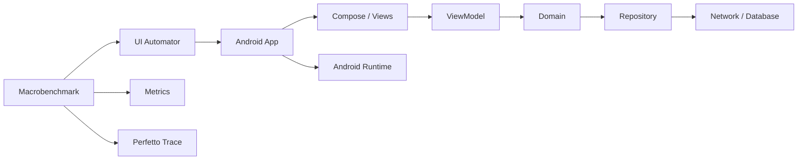
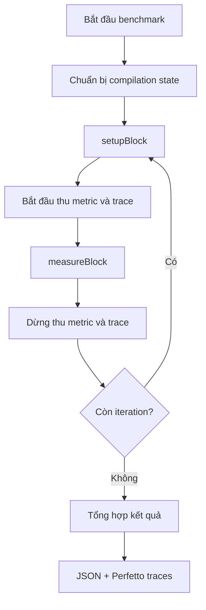

# 016 - Macrobenchmark

**Học phần:** 05 - Quality, Release and Portfolio
**Module:** Module 10 - Linting, Debugging and Benchmark
**Nhóm nội dung:** Performance
**Nguồn roadmap:** Linting, Debugging and Benchmark / Performance
**Loại bài:** quality
**Thứ tự trong module:** 016
**Thời lượng gợi ý:** 30 phút

---

## 1. Tóm tắt

`Macrobenchmark` là thư viện benchmark của Jetpack dùng để đo hiệu năng của các luồng người dùng tương đối lớn trong ứng dụng Android, chẳng hạn như thời gian khởi động ứng dụng, cuộn danh sách, chạy animation hoặc điều hướng qua một luồng UI. Khác với benchmark một hàm nhỏ, `Macrobenchmark` quan sát ứng dụng gần với cách người dùng thật tương tác và chạy phép đo từ một process test riêng.

Trong một dự án Android, `Macrobenchmark` thường nằm ở lớp **quality/performance testing** chứ không nằm trực tiếp trong `ViewModel`, `Repository` hoặc domain layer. Nó điều khiển ứng dụng từ bên ngoài, thực hiện cùng một user flow nhiều lần, thu thập metric và tạo Perfetto trace để developer tìm bottleneck.

Ví dụ, một màn hình danh sách có thể hoạt động đúng về mặt chức năng nhưng bị giật khi cuộn. Unit test hoặc UI test có thể xác nhận rằng danh sách hiển thị đúng, nhưng `Macrobenchmark` giúp trả lời câu hỏi khác:

> **Danh sách có đủ mượt trên thiết bị thực và có bị chậm hơn sau một thay đổi code hay không?**

Đây là lý do `Macrobenchmark` đặc biệt hữu ích trước release, trong quá trình tối ưu performance và khi thiết lập performance regression testing trên CI.

## 2. Mục tiêu học tập

Sau bài học, người học có thể:

* Giải thích được `Macrobenchmark` và mục đích của nó trong Android.
* Phân biệt `Macrobenchmark` với `Microbenchmark`, unit test và UI functional test.
* Mô tả được vị trí của benchmark trong kiến trúc và quy trình quality của ứng dụng.
* Sử dụng `MacrobenchmarkRule` và `measureRepeated()` để đo một user flow.
* Phân biệt `setupBlock` và `measureBlock`.
* Hiểu ý nghĩa cơ bản của `StartupMode` và `CompilationMode`.
* Sử dụng `StartupTimingMetric` để đánh giá startup.
* Sử dụng `FrameTimingMetric` để phát hiện vấn đề rendering và jank.
* Đọc kết quả benchmark và mở trace để điều tra bottleneck.
* Hiểu mối quan hệ giữa `Macrobenchmark` và Baseline Profiles.
* Xây dựng một benchmark có thể chạy lặp lại và lưu làm artifact cho portfolio.

## 3. Khái niệm cốt lõi

### 3.1. Macrobenchmark là gì?

Benchmark là quá trình đo một hành vi cụ thể của phần mềm trong những điều kiện được kiểm soát.

`Macrobenchmark` tập trung vào các hoạt động có phạm vi lớn, thường tương ứng với trải nghiệm thực tế của người dùng:

* mở ứng dụng;
* mở một màn hình;
* cuộn `LazyColumn`;
* cuộn `RecyclerView`;
* chạy animation;
* chuyển giữa các màn hình;
* thực hiện một user flow phức tạp.

Ví dụ:

```text
Người dùng nhấn icon app
        ↓
Process được tạo
        ↓
Application khởi tạo
        ↓
Activity khởi tạo
        ↓
Compose/View render
        ↓
Frame đầu tiên xuất hiện
```

`Macrobenchmark` có thể đo toàn bộ quá trình này thay vì chỉ đo thời gian thực thi của một function riêng lẻ.

Android hiện khuyến nghị Macrobenchmark cho việc đo các interaction UI lớn, bao gồm UI sử dụng Jetpack Compose.

### 3.2. Macrobenchmark và Microbenchmark

| Đặc điểm          | Macrobenchmark                  | Microbenchmark                    |
| ----------------- | ------------------------------- | --------------------------------- |
| Phạm vi           | User flow hoặc phần lớn của app | Đo đoạn code nhỏ                  |
| Ví dụ             | Startup, scroll, animation      | Parser, thuật toán, collection    |
| Chạy app thật     | Có                              | Không nhất thiết theo user flow   |
| Điều khiển UI     | Có thể                          | Không phải mục tiêu chính         |
| Đo rendering      | Phù hợp                         | Không phải trường hợp chính       |
| Startup benchmark | Phù hợp                         | Không phù hợp                     |
| Regression UX     | Rất phù hợp                     | Phù hợp với regression ở mức code |

Ví dụ, nếu muốn so sánh tốc độ của hai thuật toán xử lý danh sách, `Microbenchmark` phù hợp hơn.

Nếu muốn biết:

> "Màn hình Product List có bị giật sau khi thêm một layer animation hay không?"

thì `Macrobenchmark` phù hợp hơn.

### 3.3. Các thành phần chính

Một benchmark điển hình gồm các thành phần sau:

* `MacrobenchmarkRule`: JUnit rule điều phối benchmark.
* `measureRepeated()`: chạy cùng phép đo nhiều lần.
* `metrics`: xác định dữ liệu cần thu thập.
* `iterations`: số lần thực hiện phép đo.
* `startupMode`: kiểm soát trạng thái process khi khởi động.
* `compilationMode`: kiểm soát trạng thái biên dịch ART trước phép đo.
* `setupBlock`: chuẩn bị trạng thái trước khi đo.
* `measureBlock`: phần user flow thực sự được đo.
* UI Automator: điều khiển ứng dụng từ process benchmark.

`MacrobenchmarkRule` thực hiện reset/compile theo cấu hình, sau đó lặp lại `setupBlock` và vùng thu thập trace/metric quanh `measureBlock`.

## 4. Vị trí trong kiến trúc Android

`Macrobenchmark` không phải một thành phần của business architecture. Nó bao quanh ứng dụng và kiểm tra hiệu năng từ góc nhìn bên ngoài.



Trong sơ đồ:

* `Macrobenchmark` không gọi trực tiếp `ViewModel` hay `Repository`.
* Benchmark điều khiển ứng dụng tương tự một người dùng.
* Các layer bên trong ứng dụng vẫn thực thi bình thường.
* Android Runtime và hệ thống rendering được quan sát trong lúc benchmark.
* Kết quả được tổng hợp thành metric và trace.

Cách tiếp cận này giúp benchmark phản ánh ảnh hưởng tổng thể của:

* UI rendering;
* Compose recomposition;
* dependency initialization;
* database;
* serialization;
* disk I/O;
* ART compilation;
* image loading;
* navigation;
* network-related state đã được chuẩn bị trước.

Macrobenchmark chạy trong process riêng với ứng dụng. Vì vậy những công cụ yêu cầu chạy chung process như `Espresso` hoặc `ActivityScenario` không phù hợp để điều khiển target app trong Macrobenchmark; UI Automator là lựa chọn phổ biến.

## 5. Cách hoạt động

### 5.1. Chu kỳ của `measureRepeated()`

Một benchmark có thể hình dung theo flow:



Nếu benchmark chạy 10 iteration, cùng một flow sẽ được thực hiện nhiều lần để giảm ảnh hưởng của một phép đo bất thường.

> **Nguyên tắc:** Không đánh giá performance chỉ từ một lần chạy duy nhất.

### 5.2. `setupBlock` và `measureBlock`

`setupBlock` được dùng để đưa ứng dụng về trạng thái chuẩn bị trước mỗi lần đo.

Ví dụ:

```kotlin
setupBlock = {
    pressHome()
}
```

`measureBlock` chứa hành động mà developer muốn đo:

```kotlin
{
    startActivityAndWait()
}
```

Một benchmark scroll có thể có logic:

```text
setupBlock
    ↓
Mở app
    ↓
Đi tới màn hình Product List
    ↓
Đảm bảo dữ liệu đã tải

measureBlock
    ↓
Cuộn danh sách
    ↓
Thu FrameTimingMetric
```

Việc phân tách đúng hai block rất quan trọng.

Ví dụ, nếu mục tiêu là đo performance của scroll nhưng developer đặt cả bước tải dữ liệu mạng vào `measureBlock`, kết quả benchmark có thể phản ánh latency của API thay vì rendering performance.

### 5.3. `StartupMode` và `CompilationMode`

`StartupMode` kiểm soát trạng thái của ứng dụng trước khi launch.

Ba chế độ quan trọng là:

| Mode               | Ý nghĩa tổng quát                                          |
| ------------------ | ---------------------------------------------------------- |
| `StartupMode.COLD` | Process chưa tồn tại và app phải khởi động lại từ đầu      |
| `StartupMode.WARM` | Process có thể còn tồn tại nhưng Activity cần được tạo lại |
| `StartupMode.HOT`  | Process và phần lớn state đã tồn tại                       |

Android Macrobenchmark hỗ trợ các startup mode `COLD`, `WARM` và `HOT`.

`CompilationMode` kiểm soát trạng thái biên dịch của app trước benchmark.

Các chế độ có thể dùng để mô phỏng những trạng thái khác nhau của ART, ví dụ:

* không precompile;
* compile một phần;
* compile đầy đủ;
* sử dụng Baseline Profile;
* giữ nguyên compilation state hiện tại.

Điều này đặc biệt quan trọng vì hai APK giống nhau có thể cho kết quả khác nhau tùy trạng thái JIT/AOT compilation. Macrobenchmark cho phép kiểm soát yếu tố này để phép đo có thể lặp lại.

## 6. Các chỉ số đo quan trọng

### 6.1. `StartupTimingMetric`

`StartupTimingMetric` dùng để đo thời gian khởi động ứng dụng.

Các kết quả quan trọng gồm:

* `timeToInitialDisplayMs`;
* `timeToFullDisplayMs`.

`timeToInitialDisplayMs` thể hiện khoảng thời gian từ khi hệ thống nhận yêu cầu launch đến khi frame đầu tiên của màn hình đích được render.

`timeToFullDisplayMs` hướng tới thời điểm UI đã đạt trạng thái được ứng dụng báo là fully drawn. Android khuyến nghị tập trung vào median khi đánh giá startup vì median thể hiện tốt hơn trải nghiệm điển hình và ít bị ảnh hưởng bởi outlier.

Ví dụ:

```text
Iteration 1: 420 ms
Iteration 2: 390 ms
Iteration 3: 405 ms
Iteration 4: 910 ms
Iteration 5: 398 ms
```

Một lần chạy `910 ms` có thể là outlier.

Median sẽ phản ánh performance điển hình tốt hơn việc chỉ nhìn giá trị lớn nhất hoặc một iteration ngẫu nhiên.

### 6.2. `FrameTimingMetric`

`FrameTimingMetric` tập trung vào thời gian sản xuất frame.

Nó phù hợp cho các flow như:

* cuộn danh sách;
* animation;
* chuyển màn hình;
* gesture;
* UI có nhiều recomposition;
* rendering phức tạp.

Một màn hình có thể đáp ứng đúng tất cả chức năng nhưng vẫn tạo frame quá chậm, gây:

* jank;
* scrolling không mượt;
* animation bị khựng;
* UX kém.

`FrameTimingMetric` thu thập thông tin timing của các frame được tạo trong vùng benchmark.

### 6.3. `TraceSectionMetric` và các metric nâng cao

`TraceSectionMetric` cho phép đo các trace section do ứng dụng đánh dấu.

Ví dụ:

```kotlin
metrics = listOf(
    FrameTimingMetric(),
    TraceSectionMetric("ProductListRender")
)
```

Ngoài các metric phổ biến, API Benchmark hiện còn có những metric phục vụ phân tích chuyên sâu như:

* `ArtMetric`;
* `PowerMetric`;
* `TraceMetric`;
* `MemoryUsageMetric`;
* `MemoryCountersMetric`.

Các metric này không phải lúc nào cũng cần dùng trong benchmark cơ bản. Chỉ nên thêm khi có câu hỏi performance cụ thể cần trả lời.

Ví dụ:

> Nếu vấn đề đang điều tra là startup chậm, trước tiên nên tập trung vào `StartupTimingMetric` và trace thay vì thu tất cả metric có thể có.

## 7. Thiết lập Macrobenchmark

### 7.1. Tạo module benchmark

Macrobenchmark nên nằm trong một Gradle test module riêng sử dụng plugin `com.android.test`, tách biệt khỏi module ứng dụng. Android Studio cung cấp template **Benchmark** để tự động tạo phần lớn cấu hình cần thiết.

Cấu trúc project có thể như sau:

```text
project/
├── app/
│   └── src/
├── macrobenchmark/
│   └── src/
│       └── main/
│           └── java/
└── build.gradle.kts
```

Luồng khuyến nghị:

1. Mở Android Studio.
2. Chọn **New > Module**.
3. Chọn template **Benchmark**.
4. Chọn `:app` làm target application.
5. Tạo module, ví dụ `:macrobenchmark`.
6. Sync Gradle.
7. Kiểm tra Build Variants.

Template giúp tránh nhiều lỗi cấu hình thủ công.

### 7.2. Cấu hình target app gần với release

Benchmark không nên chạy trên một `debug` build thông thường rồi xem kết quả đó như performance production.

Target app nên:

* gần với cấu hình release;
* `debuggable = false`;
* sử dụng minification tương tự production nếu production bật;
* có cấu hình profiling phù hợp.

Một `benchmark` build type có thể kế thừa từ `release`:

```kotlin
android {
    buildTypes {
        create("benchmark") {
            initWith(getByName("release"))
            signingConfig = signingConfigs.getByName("debug")
        }
    }
}
```

Android khuyến nghị benchmark variant mô phỏng release càng gần càng tốt. Target app cũng cần ở trạng thái `profileable` để thu được trace chi tiết mà không phải bật debug mode. Template Benchmark của Android Studio xử lý các phần cấu hình chính này tự động.

Nếu cần cấu hình manifest thủ công, concept tương ứng là:

```xml
<application>
    <profileable
        android:shell="true"
        tools:targetApi="29" />
</application>
```

> **Lưu ý:** Không nên bật `android:debuggable="true"` cho target app chỉ để profiler có thể đọc dữ liệu. Điều này làm performance khác đáng kể so với release.

### 7.3. Dependency

Tại ngày 26/08/2026, stable release của AndroidX Benchmark được Android Developers công bố là `1.4.1`.

Dependency của Macrobenchmark:

```kotlin
dependencies {
    androidTestImplementation(
        "androidx.benchmark:benchmark-macro-junit4:1.4.1"
    )
}
```

Trong project thực tế, nên quản lý version qua Version Catalog nếu project đã sử dụng `libs.versions.toml`.

Ví dụ:

```toml
[versions]
benchmark = "1.4.1"

[libraries]
androidx-benchmark-macro-junit4 = {
    group = "androidx.benchmark",
    name = "benchmark-macro-junit4",
    version.ref = "benchmark"
}
```

Sau đó tham chiếu dependency theo convention của module benchmark trong project.

## 8. Triển khai benchmark

### 8.1. Benchmark cold startup

Ví dụ tối thiểu:

```kotlin
import androidx.benchmark.macro.StartupMode
import androidx.benchmark.macro.StartupTimingMetric
import androidx.benchmark.macro.junit4.MacrobenchmarkRule
import androidx.test.ext.junit.runners.AndroidJUnit4
import androidx.test.filters.LargeTest
import org.junit.Rule
import org.junit.Test
import org.junit.runner.RunWith

@LargeTest
@RunWith(AndroidJUnit4::class)
class StartupBenchmark {

    @get:Rule
    val benchmarkRule = MacrobenchmarkRule()

    @Test
    fun coldStartup() {
        benchmarkRule.measureRepeated(
            packageName = "com.example.shop",
            metrics = listOf(
                StartupTimingMetric()
            ),
            iterations = 10,
            startupMode = StartupMode.COLD,
            setupBlock = {
                pressHome()
            }
        ) {
            startActivityAndWait()
        }
    }
}
```

Flow của test:

1. Chuẩn bị iteration.
2. Đưa thiết bị về Home.
3. Đảm bảo startup được thực hiện theo chế độ `COLD`.
4. Launch ứng dụng.
5. Thu startup timing.
6. Lặp lại 10 lần.
7. Tổng hợp kết quả.

`MacrobenchmarkRule` và `measureRepeated()` là API trung tâm của benchmark; ít nhất benchmark phải xác định target package, metric và số iteration.

### 8.2. Benchmark scroll của Compose UI

Giả sử ứng dụng có một `LazyColumn`.

Ở phía app, developer có thể gán test tag:

```kotlin
LazyColumn(
    modifier = Modifier.testTag("products_list")
) {
    items(products) { product ->
        ProductItem(product)
    }
}
```

Để UI Automator có thể truy cập Compose test tag như resource ID, cần expose semantics tương ứng trên cây Compose theo cấu hình hiện hành của Compose UI.

Benchmark:

```kotlin
import androidx.benchmark.macro.FrameTimingMetric
import androidx.benchmark.macro.StartupMode
import androidx.benchmark.macro.junit4.MacrobenchmarkRule
import androidx.test.ext.junit.runners.AndroidJUnit4
import androidx.test.filters.LargeTest
import androidx.test.uiautomator.By
import androidx.test.uiautomator.Direction
import org.junit.Rule
import org.junit.Test
import org.junit.runner.RunWith

@LargeTest
@RunWith(AndroidJUnit4::class)
class ProductListBenchmark {

    @get:Rule
    val benchmarkRule = MacrobenchmarkRule()

    @Test
    fun scrollProductList() {
        benchmarkRule.measureRepeated(
            packageName = "com.example.shop",
            metrics = listOf(
                FrameTimingMetric()
            ),
            iterations = 10,
            startupMode = StartupMode.WARM,
            setupBlock = {
                pressHome()
            }
        ) {
            startActivityAndWait()

            val productList = device.findObject(
                By.res("products_list")
            )

            productList.setGestureMargin(
                device.displayWidth / 5
            )

            productList.fling(Direction.DOWN)
        }
    }
}
```

Android Developers cũng sử dụng UI Automator cho Compose Macrobenchmark và hỗ trợ ánh xạ `testTag` sang resource ID để benchmark có thể tìm Compose element từ process bên ngoài.

Trong một benchmark thực tế, cần bảo đảm rằng màn hình đã ở state ổn định trước khi bắt đầu fling.

Ví dụ:

```text
Không nên

Mở app
  ↓
API đang tải
  ↓
Image đang decode
  ↓
Bắt đầu scroll
```

nếu mục tiêu chỉ là benchmark rendering của list.

Nên chuẩn bị deterministic state:

```text
Mở app
  ↓
Đi tới Product List
  ↓
Đảm bảo dataset ổn định
  ↓
Bắt đầu vùng đo
  ↓
Scroll
```

### 8.3. Chạy benchmark

Có thể chạy toàn bộ benchmark module bằng Gradle:

```bash
./gradlew :macrobenchmark:connectedCheck
```

Hoặc chạy một benchmark cụ thể bằng instrumentation argument:

```bash
./gradlew :macrobenchmark:connectedCheck \
  -P android.testInstrumentationRunnerArguments.class=com.example.macrobenchmark.StartupBenchmark#coldStartup
```

Các lệnh này được Android Developers hỗ trợ cho Macrobenchmark module.

## 9. Đọc và phân tích kết quả

### 9.1. Đọc metric

Giả sử startup benchmark trả về dữ liệu:

```text
timeToInitialDisplayMs
min       382
median    417
max       566
```

Không nên chỉ nhìn:

```text
min = 382 ms
```

và kết luận startup là `382 ms`.

Giá trị minimum chỉ đại diện cho lần chạy tốt nhất.

Để đánh giá trải nghiệm thông thường, median thường hữu ích hơn:

```text
median = 417 ms
```

Khi so sánh hai commit:

```text
Commit A
median startup = 417 ms

Commit B
median startup = 552 ms
```

Chênh lệch:

```text
552 - 417 = 135 ms
```

Tương đương khoảng:

```text
135 / 417 ≈ 32%
```

Đây là tín hiệu cần điều tra regression.

> **Quan trọng:** Không nên đặt một performance threshold chỉ dựa trên một thiết bị và một lần benchmark.

### 9.2. Phân tích Perfetto trace

Metric trả lời:

> "Performance có vấn đề hay không?"

Trace giúp trả lời:

> "Tại sao performance có vấn đề?"

Macrobenchmark tạo trace cho từng measured iteration và có thể mở trace trong Android Studio để phân tích. Kết quả JSON và trace cũng được copy về máy host khi benchmark chạy qua Gradle.

Ví dụ startup chậm có thể đến từ:

* quá nhiều code trong `Application.onCreate()`;
* dependency injection khởi tạo quá sớm;
* disk I/O trên main thread;
* database initialization;
* synchronous JSON parsing;
* image decoding;
* Compose composition quá nặng;
* class loading;
* library initialization;
* ContentProvider khởi tạo sớm.

Quy trình phân tích nên là:

```text
Benchmark phát hiện regression
        ↓
Xác định metric bị xấu
        ↓
Mở trace
        ↓
Xác định thread hoặc section chậm
        ↓
Tìm code gây bottleneck
        ↓
Tối ưu
        ↓
Chạy lại cùng benchmark
        ↓
So sánh trước và sau
```

Đây là giá trị lớn nhất của benchmark có thể lặp lại: developer có số liệu trước và sau thay vì tối ưu dựa trên cảm giác.

## 10. Macrobenchmark và Baseline Profiles

`Baseline Profile` mô tả các code path quan trọng mà Android Runtime có thể ưu tiên compile trước nhằm cải thiện startup và runtime performance.

Macrobenchmark và Baseline Profiles có hai vai trò khác nhau:

```text
Baseline Profile
      ↓
Tối ưu compilation
      ↓
Performance tốt hơn
      ↓
Macrobenchmark
      ↓
Đo xem cải thiện thực tế bao nhiêu
```

Android khuyến nghị sử dụng Macrobenchmark để so sánh hiệu năng khi Baseline Profile được bật và tắt.

Ví dụ:

| Cấu hình               | Median cold startup |
| ---------------------- | ------------------: |
| Không Baseline Profile |              680 ms |
| Có Baseline Profile    |              510 ms |

Cải thiện:

```text
680 - 510 = 170 ms
```

Tỷ lệ cải thiện:

```text
170 / 680 × 100 ≈ 25%
```

Nếu chỉ tạo Baseline Profile mà không benchmark, developer không biết thay đổi đó thực sự cải thiện trải nghiệm bao nhiêu trên target device.

Do đó một workflow chất lượng là:

```text
Critical User Journey
        ↓
Generate Baseline Profile
        ↓
Build gần production
        ↓
Macrobenchmark
        ↓
So sánh metric
        ↓
Phân tích trace
        ↓
Release
```

## 11. Lỗi thường gặp

**Đo trên debug build**

* **Hiện tượng:** Benchmark rất chậm hoặc kết quả không đại diện production.
* **Nguyên nhân:** Debug build có instrumentation và cấu hình khác release.
* **Cách xử lý:** Sử dụng benchmark variant kế thừa từ release và giữ target app non-debuggable.

**Chỉ chạy benchmark một lần**

* **Hiện tượng:** Kết quả thay đổi mạnh giữa các lần thử.
* **Nguyên nhân:** Performance chịu ảnh hưởng bởi scheduler, temperature, background process và nhiều yếu tố runtime.
* **Cách xử lý:** Sử dụng nhiều iteration và tập trung vào thống kê phù hợp như median.

**Đưa quá nhiều thao tác vào `measureBlock`**

* **Hiện tượng:** Không xác định được nguyên nhân metric xấu.
* **Nguyên nhân:** Benchmark đang đo đồng thời network, navigation, rendering và database.
* **Cách xử lý:** Xác định một câu hỏi performance rõ ràng và thu hẹp vùng đo.

**Không chuẩn hóa dữ liệu**

* **Hiện tượng:** Iteration đầu có 20 item nhưng iteration sau có 200 item.
* **Nguyên nhân:** Test phụ thuộc state hoặc dữ liệu thay đổi.
* **Cách xử lý:** Chuẩn bị dataset deterministic trước phép đo.

**Benchmark phụ thuộc mạng Internet thật**

* **Hiện tượng:** Kết quả bị chi phối bởi network latency.
* **Nguyên nhân:** Benchmark không kiểm soát backend và kết nối mạng.
* **Cách xử lý:** Nếu mục tiêu là UI performance, chuẩn bị dữ liệu local hoặc môi trường backend kiểm soát được.

**Sử dụng emulator để kết luận performance production**

* **Hiện tượng:** Số liệu rất nhanh hoặc rất chậm bất thường.
* **Nguyên nhân:** Emulator chia sẻ CPU, RAM và tài nguyên với host.
* **Cách xử lý:** Ưu tiên thiết bị vật lý khi cần số liệu đại diện trải nghiệm người dùng. Android Developers không khuyến nghị dùng emulator để đưa ra kết luận về performance thực tế.

**Thay đổi thiết bị giữa hai benchmark**

* **Hiện tượng:** Commit mới có vẻ nhanh hoặc chậm hơn rất nhiều.
* **Nguyên nhân:** Hardware khác nhau.
* **Cách xử lý:** So sánh regression trên cùng model thiết bị và cùng điều kiện benchmark.

**Thiết bị quá nóng**

* **Hiện tượng:** Các iteration sau chậm dần.
* **Nguyên nhân:** Thermal throttling giảm CPU/GPU frequency.
* **Cách xử lý:** Ổn định nhiệt độ thiết bị và tránh chạy workload nặng song song.

## 12. Best practices

* Benchmark **critical user journey** thay vì benchmark mọi màn hình.
* Dùng build gần production nhất có thể.
* Giữ cùng thiết bị khi so sánh regression.
* Chạy nhiều iteration.
* Dùng cùng dataset cho các lần so sánh.
* Không đưa thao tác chuẩn bị vào vùng đo nếu nó không thuộc mục tiêu benchmark.
* Phân tích median thay vì chỉ nhìn minimum.
* Lưu JSON result để so sánh giữa các build.
* Lưu Perfetto trace cho những lần xuất hiện regression.
* Tạo benchmark cho startup và những màn hình quan trọng nhất trước.
* Ưu tiên thiết bị tầm trung hoặc chậm hơn thay vì chỉ kiểm tra flagship; thiết bị mạnh có thể che giấu bottleneck.
* Chú ý temperature, battery và background workload của thiết bị.
* Không dùng dữ liệu người dùng production trong benchmark fixture.
* Không đưa access token hoặc dữ liệu nhạy cảm vào tên custom trace section.
* Khi sửa performance, chạy lại chính benchmark cũ để có phép so sánh trước/sau.
* Chỉ thêm metric khi metric đó giúp trả lời một câu hỏi performance cụ thể.

Một benchmark tốt cần trả lời được:

```text
Đang đo cái gì?
        ↓
Tại sao cần đo?
        ↓
State trước khi đo là gì?
        ↓
Metric nào phản ánh vấn đề?
        ↓
Thiết bị nào được dùng?
        ↓
Kết quả bao nhiêu?
        ↓
Có regression không?
```

## 13. Kiểm thử performance và CI

Macrobenchmark không thay thế unit test hoặc UI functional test.

Một pipeline quality có thể gồm:

```text
Static Analysis
      ↓
Unit Test
      ↓
Integration Test
      ↓
UI Test
      ↓
Macrobenchmark
      ↓
Release
```

Mỗi loại test trả lời một câu hỏi khác nhau:

| Loại kiểm tra    | Câu hỏi chính                                 |
| ---------------- | --------------------------------------------- |
| Unit test        | Logic có đúng không?                          |
| Integration test | Các component phối hợp đúng không?            |
| UI test          | User flow có hoạt động không?                 |
| Macrobenchmark   | User flow có đạt performance mong muốn không? |

Macrobenchmark hỗ trợ chạy trong môi trường CI và tạo JSON cùng profiling traces để lưu làm artifact.

Một pipeline đơn giản có thể chạy:

```bash
./gradlew :macrobenchmark:connectedCheck
```

Sau đó lưu:

```text
build/
└── outputs/
    └── connected_android_test_additional_output/
        └── ...
            ├── benchmark-result.json
            └── *.perfetto-trace
```

Đường dẫn thực tế có thể thay đổi theo variant, thiết bị và phiên bản Android Gradle Plugin, vì vậy CI nên lấy output từ task thay vì hard-code tên file riêng lẻ.

Một strategy thực tế là:

1. Pull request thông thường chạy unit test nhanh.
2. Performance benchmark chạy trên dedicated device.
3. Kết quả được lưu làm CI artifact.
4. Pipeline so sánh với baseline.
5. Regression đáng kể được đánh dấu để review.
6. Developer mở Perfetto trace nếu cần điều tra.

> **Lưu ý:** Performance test có độ nhiễu cao hơn unit test, vì vậy không nên thiết lập threshold quá sát khiến pipeline fail ngẫu nhiên.

## 14. Ví dụ thực tế

Giả sử team phát triển ứng dụng thương mại điện tử.

Critical flow:

```text
Launch App
   ↓
Home
   ↓
Product List
   ↓
Scroll
   ↓
Product Detail
```

Sau một pull request, team thêm:

* image transition;
* nhiều shadow;
* animation;
* analytics event;
* format giá phức tạp.

Functional test vẫn pass:

```text
✓ Product List hiển thị
✓ Scroll hoạt động
✓ Click Product mở detail
```

Nhưng người dùng cảm thấy list giật.

Team chạy `FrameTimingMetric`:

```text
Before PR
frameDurationCpuMs median = 8.4 ms

After PR
frameDurationCpuMs median = 14.7 ms
```

Macrobenchmark đã biến nhận xét:

> "App có vẻ chậm."

thành dữ liệu:

> "Performance của critical scroll flow bị regression sau PR."

Developer mở Perfetto trace và phát hiện formatting cùng image processing xảy ra trên main thread.

Sau khi tối ưu:

```text
Before optimization
14.7 ms

After optimization
9.1 ms
```

Đây là một ví dụ điển hình về giá trị của benchmark trong quality engineering:

```text
Cảm nhận
   ↓
Metric
   ↓
Trace
   ↓
Root cause
   ↓
Fix
   ↓
Đo lại
```

## 15. Bài thực hành

### 15.1. Yêu cầu

Tạo Macrobenchmark cho một app Android mẫu với hai test:

1. Cold startup benchmark.
2. Scroll benchmark cho một `LazyColumn` hoặc `RecyclerView`.

Startup benchmark sử dụng:

```kotlin
StartupTimingMetric()
```

Scroll benchmark sử dụng:

```kotlin
FrameTimingMetric()
```

Mỗi benchmark chạy tối thiểu nhiều iteration để có thể quan sát sự biến động giữa các lần đo.

### 15.2. Gợi ý triển khai

Chuẩn bị project:

```text
app/
macrobenchmark/
```

Sau đó:

1. Tạo module Benchmark bằng Android Studio.
2. Kiểm tra benchmark variant.
3. Chạy startup benchmark.
4. Ghi lại median startup.
5. Chạy scroll benchmark.
6. Mở ít nhất một Perfetto trace.
7. Chọn một thay đổi có khả năng ảnh hưởng performance.
8. Chạy lại benchmark.
9. So sánh before/after.
10. Ghi kết quả vào `README.md`.

Có thể ghi kết quả theo mẫu:

```markdown
## Startup Benchmark

Device: Pixel ...
Build: benchmark

| Version | Median |
| --- | ---: |
| Before | ... ms |
| After | ... ms |

## Scroll Benchmark

| Version | Metric | Result |
| --- | --- | ---: |
| Before | Frame timing | ... |
| After | Frame timing | ... |
```

### 15.3. Kết quả mong đợi

Sau bài thực hành, project cần có:

```text
macrobenchmark/
├── StartupBenchmark.kt
└── ProductListBenchmark.kt
```

Kèm theo:

* benchmark chạy thành công;
* startup result;
* frame timing result;
* ít nhất một Perfetto trace;
* screenshot Android Studio Benchmark Results;
* README giải thích benchmark đang đo gì;
* bảng before/after nếu có tối ưu;
* nhận xét ngắn về bottleneck tìm được.

## 16. Artifact cho portfolio

Artifact đề xuất:

```text
android-macrobenchmark-demo/
├── app/
├── macrobenchmark/
├── docs/
│   ├── startup-result.png
│   ├── scroll-result.png
│   └── performance-trace.png
└── README.md
```

`README.md` nên trình bày:

* mục tiêu benchmark;
* thiết bị kiểm thử;
* build variant;
* critical user journey;
* metric được sử dụng;
* số iteration;
* kết quả;
* bottleneck phát hiện;
* thay đổi tối ưu;
* kết quả trước và sau;
* giới hạn của phép đo.

Ví dụ nội dung quan trọng:

```text
Problem
Cold startup quá chậm.

Measurement
StartupTimingMetric.

Baseline
Median = 620 ms.

Optimization
Lazy initialization analytics SDK.

After
Median = 480 ms.

Improvement
≈ 22.6%.
```

Artifact này thể hiện được nhiều kỹ năng hơn một screenshot benchmark đơn thuần:

* performance engineering;
* Android testing;
* profiling;
* debugging;
* data-driven optimization;
* release quality.

## 17. Checklist hoàn thành

* [ ] Tôi giải thích được Macrobenchmark dùng để giải quyết vấn đề gì.
* [ ] Tôi phân biệt được Macrobenchmark và Microbenchmark.
* [ ] Tôi hiểu tại sao benchmark chạy từ process riêng.
* [ ] Tôi hiểu vai trò của `MacrobenchmarkRule`.
* [ ] Tôi hiểu `measureRepeated()`.
* [ ] Tôi phân biệt được `setupBlock` và `measureBlock`.
* [ ] Tôi phân biệt được `COLD`, `WARM` và `HOT` startup.
* [ ] Tôi biết `CompilationMode` ảnh hưởng benchmark như thế nào.
* [ ] Tôi tạo được startup benchmark.
* [ ] Tôi sử dụng được `StartupTimingMetric`.
* [ ] Tôi tạo được scroll benchmark.
* [ ] Tôi sử dụng được `FrameTimingMetric`.
* [ ] Tôi chạy benchmark trên build gần với release.
* [ ] Tôi ưu tiên benchmark trên thiết bị thật.
* [ ] Tôi đọc được minimum, median và maximum.
* [ ] Tôi mở được Perfetto trace.
* [ ] Tôi xác định được ít nhất một bottleneck từ trace hoặc benchmark.
* [ ] Tôi biết Macrobenchmark có thể dùng để đánh giá hiệu quả của Baseline Profiles.
* [ ] Tôi lưu benchmark result làm artifact.
* [ ] Tôi viết README mô tả rõ before/after performance.

## 18. Câu hỏi tự kiểm tra

1. Vì sao chạy một startup benchmark duy nhất không đủ để kết luận performance của ứng dụng?
2. `Macrobenchmark` khác `Microbenchmark` ở phạm vi phép đo như thế nào?
3. Vì sao target app không nên dùng debug build khi đo performance?
4. Khi benchmark scrolling, thao tác chuẩn bị dữ liệu nên nằm trong `setupBlock` hay `measureBlock`? Vì sao?
5. Vì sao median thường hữu ích hơn minimum khi so sánh startup performance?

## 19. Liên hệ với các chủ đề khác

`Macrobenchmark` thuộc nhóm Performance nhưng liên quan trực tiếp đến nhiều chủ đề quality khác:

```text
Linting
   ↓
Phát hiện vấn đề tĩnh

Debugging
   ↓
Xác định lỗi runtime

Profiling
   ↓
Phân tích bottleneck

Macrobenchmark
   ↓
Định lượng performance

Baseline Profiles
   ↓
Tối ưu runtime

CI / Release
   ↓
Ngăn performance regression
```

Một workflow hoàn chỉnh có thể là:

```text
Developer thay đổi code
        ↓
Unit test
        ↓
UI test
        ↓
Macrobenchmark
        ↓
Phát hiện regression
        ↓
Perfetto trace
        ↓
Tối ưu
        ↓
Macrobenchmark lại
        ↓
Review
        ↓
Release
```

Điểm cần nhớ là Macrobenchmark không chỉ là một tool để tạo ra con số. Nó là một phần của vòng lặp:

```text
Measure
   ↓
Analyze
   ↓
Optimize
   ↓
Measure Again
```

## 20. Tổng kết

`Macrobenchmark` là công cụ quan trọng trong Android performance engineering khi cần đo các user flow lớn như startup, scrolling hoặc animation.

Các điểm cốt lõi cần ghi nhớ:

* `MacrobenchmarkRule` điều phối benchmark.
* `measureRepeated()` chạy cùng phép đo nhiều lần.
* `setupBlock` chuẩn bị trạng thái.
* `measureBlock` chứa hành động thực sự cần đo.
* `StartupTimingMetric` phù hợp với startup performance.
* `FrameTimingMetric` phù hợp với rendering và scrolling.
* `StartupMode` giúp kiểm soát loại startup.
* `CompilationMode` giúp kiểm soát trạng thái compilation.
* Benchmark nên chạy trên build gần production và ưu tiên thiết bị thật.
* Metric cho biết **có regression hay không**.
* Perfetto trace giúp tìm **tại sao regression xảy ra**.
* Macrobenchmark có thể dùng để định lượng hiệu quả của Baseline Profiles.
* Benchmark nên trở thành một quality check có thể lặp lại thay vì chỉ là phép đo thủ công một lần.

Mục tiêu cuối cùng không phải tạo ra một con số benchmark đẹp, mà là xây dựng một quy trình có khả năng phát hiện và ngăn performance regression trước khi nó ảnh hưởng đến người dùng.
